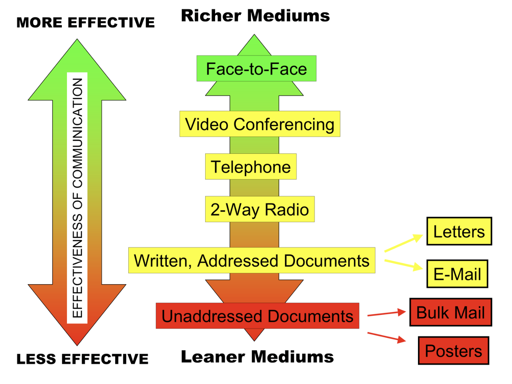
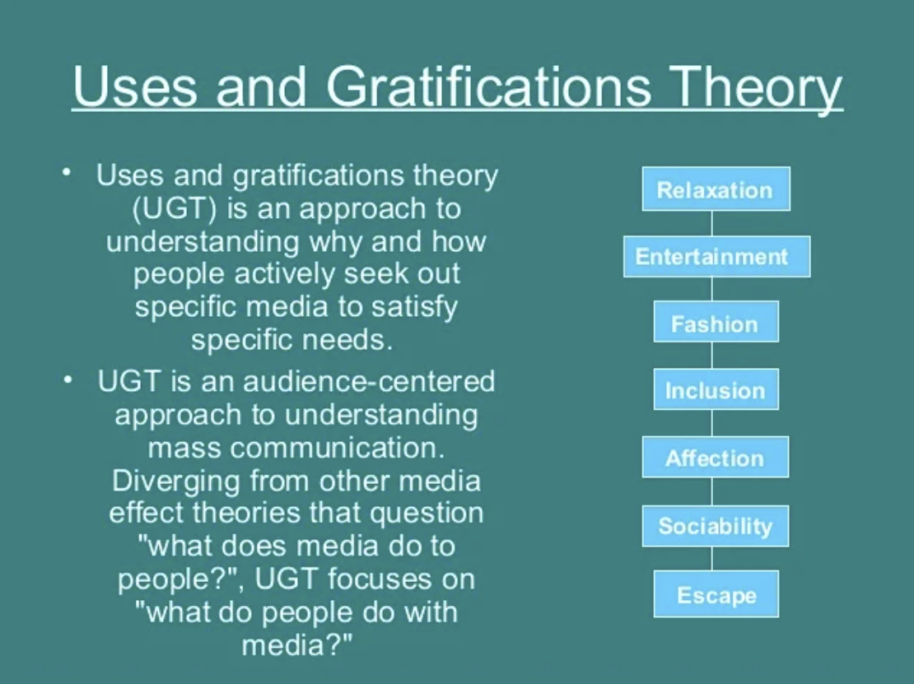

# The Spotify Podcast Comments Conundrum

## Introduction

In the fast-evolving field of social media, each platform pursues novelty to thrill users and creators alike. Recently, Spotify introduced comments on podcasts-just one case among many. That has opened debate on the role of social media in places that were once non-social. This post considers, through various media and social media theories, the implication of this feature in light of the challenge it provides to creators and possible changes in user experience.

## Theoretical Framework

We can draw on a number of theories emanating from media and social media studies to appreciate what the comments feature by Spotify implies:

### 1. [Media Richness Theory](https://en.wikipedia.org/wiki/Media_richness_theory)(MRT)

Media Richness Theory(Trevino et al., 1987) was proposed by Daft and Lengel in 1986. It states that some media may be superior to others in conveying information with no loss or distortion. It pits "lean" media, which cannot facilitate the reduction of uncertainty in a communication as well, against "rich" media, which can. Putting comments, in the case of Spotify, may be understood as an attempt to enhance medium richness to allow for more immediate and interactive communication; hence, understanding could be improved and ambiguity reduced because one would get immediate feedback and discussion.

### 2. Media Synchronicity Theory (MST)

Media Synchronicity Theory (MST), which was performed by Dennis et al. in 2008, is based upon the ability of the medium to support synchronicity or "shared pattern of coordinated behavior". It focuses on the degree of a medium that could support real-time interaction and coordination. The feature of comments on Spotify allows for higher synchronicity, whereby there is the potential for immediate feedback and discussion among listeners; hence, it would be an even more active and collaborative environment. On the other hand, it requires the users to invest much more cognitive load in terms of processing comments in a timely manner and responding accordingly.

### 3. Uses and Gratifications Theory (UGT)

Uses and Gratifications Theory evolved out of a set of earlier communication theories during the 1940s and assumes that active audiences will seek out media amongst competitors that satisfy their needs and result in ultimate gratifications. It has been applied to a wide range of new media and communication technologies. The theory follows the axiom that active users deliberately use some media with the expressed purpose of the gratification of a certain need, when social interaction, information seeking, entertainment, or relaxation may arise. Spotify serves users in their need for social interaction and a sense of community by satisfying the needs for integrative utility and communicatory utility with its newly introduced comments features(Liu et al., 2020).

## Analysis

### Content Moderation Challenges

And with comments, of course, comes the added burden of content moderation-a big concern when Spotify introduced comments. As the Wired article illustrates, creators like the Daily Wire, the production company behind "The Ben Shapiro Show", are loathe to flip the switch due to the huge job in front of them where the volume is really big. This is in line with MRT because richness in comments is not sufficient to handle the complexity associated with the management of user-generated content.

### Impact on User Experience

These comments can make a big difference in how the user perceives his or her experience. For some users, this may be an avenue to greater involvement, but for other users, it's like sitting in a big, open discussion hall that they find uninviting. That is where MST plays its role, since the synchronicity of comments will add from or detract from the listening experience, based on user preference and the nature of the content.

### Implications

The integration of comments in Spotify's podcast ecosystem brings some interesting implications, both positive and negative.

#### Positive Implications

1. [**Improved Listener Engagement**](https://research.atspotify.com/2021/08/podcast-language-and-engagement/): This Comment feature can be used to increase listeners' interest in the topic and interaction amongst themselves, building some kind of community. Those kinds of interactive engagements have been found to improve listener retention; for example, listeners who engage with features such as comments are four times more likely to return to a show within 30 days and listen to twice as many hours per month on average compared to listeners who do not use these features.
2. **Community Building**: By leaving feedback in real-time, it also allows for discussion and helps establish a loyal and active community around podcasts. This will increase listener loyalty and word-of-mouth promotion, which is priceless in the context of the growth and visibility of any podcast.
3. **Improved Content**: The comments themselves are a good means of understanding what listeners enjoy or want more to create content in the future, tailored toward tastes and preferences of the audience.
4. **More Interaction**: Comments open a line of communication directly between podcasters and listeners, allowing for immediate interaction, responses to questions, and the acknowledgment of feedback to let them know they have been heard and appreciated.

#### Negative Implications

1. [**Content Moderation Challenges**](https://www.wired.com/story/spotify-podcast-comments-social-media/): The workload for moderating a large number of user-generated contents would be huge and may also drive some creators to turn the feature off due to the resources and time it takes to truly manage comments.
2. **Potential for Negativity**: Though comments can increase engagement, they also invite the possibility of negativity, misinformation, and hurtful discussions that can detract from the listening experience and the creator's brand integrity (Anthonysamy & Sivakumar, 2024).
3. **Information Overload**: With all the comments and interactions that come in, listeners and creators may eventually suffer from information overload, getting them off track of the real content and possibly leading to increased stress levels and lowered productivity(Spira, 2011).
4. **Privacy**: Comment publicity can raise privacy concerns in that personal opinions and discussions get aired to an audience that is best not aware, perhaps bringing about unintended consequences for the persons participating in such discussions.

According to UGT, comments make it possible for Spotify users to satisfy the need for sociability, the presence of a community; meanwhile, raising questions about the effectiveness of and usability for such an option on a platform oriented towards solitary listening.

## Recommendations

Based on the analysis, here are some suggestions for Spotify and those from other platforms thinking along this same vein:

1. **Creator Support**: Platforms should provide tools and resources that would help creators effectively manage the comments, thereby reducing the moderation burden.
2. **User Control**: Provide users with the facility to customize their experience through choices to either view comments or not, respecting individual preference for interaction.
3. **Community Guidelines**: Establish clear community guidelines that encourage positive interactions and discourage negative behavior, hence fostering a healthy discussion environment.

## Conclusion

Of particular note in the development of the social media landscape, Spotify's podcast platform introduced comments. This, while adding to the interactivity in users' experience, elicits a number of challenges regarding the moderation of content and takes away from the lonely act of listening. By considering theories on media and social media, we understand these features and their implications better and thus make informed recommendations for implementation.

## References

1. Liu, X., Min, Q., & Han, S. (2020). Understanding users’ continuous content contribution behaviours on microblogs: An integrated perspective of uses and gratification theory and social influence theory. *Behaviour & Information Technology*, *39*(5), 525–543. https://doi.org/10.1080/0144929X.2019.1603326

2. Trevino, L. K., Lengel, R. H., & Daft, R. L. (1987). Media symbolism, media richness, and media choice in organizations: A symbolic interactionist perspective. *Communication Research*, *14*, 553–574. https://doi.org/10.1177/009365087014005006

3. Anthonysamy, L., & Sivakumar, P. (2024). A new digital literacy framework to mitigate misinformation in social media infodemic. *Global Knowledge, Memory and Communication*, *73*(6/7), 809–827. https://doi.org/10.1108/GKMC-06-2022-0142

4. Spira, J. B. (2011). *Overload!* *: How too much information is hazardous to your organization*. Wiley.

   

