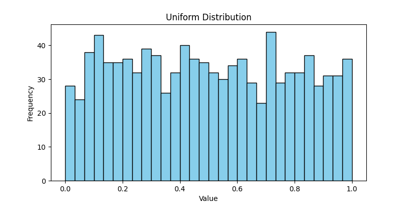
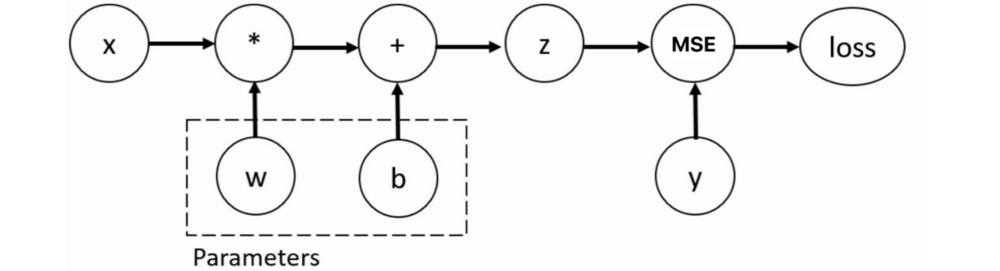
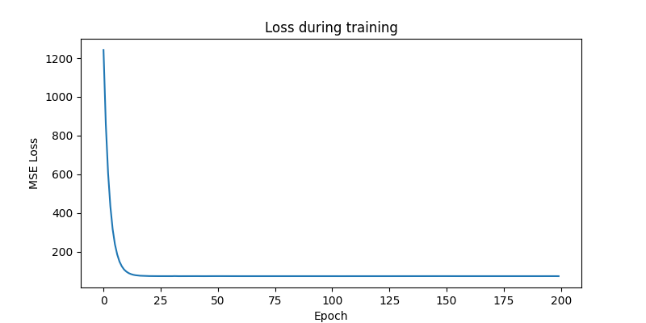

# Pytorch

## 张量

Tensor（张量）是PyTorch的核心数据结构。张量在不同学科中有不同的意义，在深度学习中张量表示一个多维数组，是标量、向量、矩阵的拓展。如一个RGB图像的数组就是一个三维张量，第1维是图像的高，第2维是图像的宽，第3维是图像的颜色通道

## 创建张量

### 从数据创建张量

- `torch.tensor(data)`: 创建指定内容的张量

```python
import torch

# 通过标量创建张量
t1 = torch.tensor(1)
print(t1)

# 通过列表创建张量
t2 = torch.tensor([1, 2, 3])
print(t2)

# 通过嵌套列表创建张量
t3 = torch.tensor([[1, 2, 3], [4, 5, 6]])
print(t3)

# 通过ndarray创建张量
import numpy as np

a = np.array([[1, 2, 3], [4, 5, 6]])
t4 = torch.tensor(a)
print(t4)
```

### 创建特定形状的张量

- 全0张量`torch.zeros()`
- 全1张量`torch.ones()`
- 指定值张量`torch.full()`
- 创建指定形状的张量`torch.Tensor(size)`
- 创建指定类型的张量`torch.IntTensor()`...

```python
import torch
# 创建全0张量
t5 = torch.zeros(2, 3)
print(t5)

# 创建全1张量
t6 = torch.ones(2, 3)
print(t6)

# 创建指定值的张量
t7 = torch.full((2, 3), 9)
print(t7)

# 创建指定形状的张量,不推荐，内部的值是原有内存残留
t8 = torch.Tensor(2, 3)
print(t8)

# 创建张量，并指定类型
t9 = torch.empty(2, 3, dtype=torch.int16)
print(t9)

# 创建指定类型的张量
# t10 = torch.FloatTensor(2,3)
# t10 = torch.IntTensor(2,3)
# t10 = torch.LongTensor(2,3)
# t10 = torch.ShortTensor(2,3)
# t10 = torch.BoolTensor(2,3)
t10 = torch.ByteTensor(2,3)
print(t10)
```

### 创建随机张量

- `torch.rand(size)`创建在[0,1)上**均匀分布**的，指定形状的张量
- `torch.randn(size)`创建**标准正态分布**的，指定形状的张量
- `torch.randint(low, high, size)`创建在[low,high)上随机的指定形状的整数类型张量

```python
import torch
import matplotlib.pyplot as plt

# 创建均匀分布的张量
uniform_tensor = torch.rand(1000)
plt.figure(figsize=(8, 4))
plt.hist(uniform_tensor.numpy(), bins=30, color='skyblue', edgecolor='black')
plt.title('Uniform Distribution')
plt.xlabel('Value')
plt.ylabel('Frequency')
plt.savefig('Uniform Distribution')

# 创建正态分布的张量
normal_tensor = torch.randn(1000)
plt.figure(figsize=(8, 4))
plt.hist(normal_tensor.numpy(), bins=30, color='lightcoral', edgecolor='black')
plt.title('Normal Distribution')
plt.xlabel('Value')
plt.ylabel('Frequency')
plt.savefig('Normal Distribution')
```




### 创建线性张量

- 连续整数序列`torch.arange(start, end, step)`
- 线性间隔序列`torch.linspace(start, end, steps)`

```python
import torch
# 创建连续整数序列
# torch.arange(start, end, step)
# step 表示步长
t14 = torch.arange(1, 10, 2)
print(t14)


# 创建等差数列
# torch.linspace(start, end, steps)
# steps 表示生成张量的数据个数
t15 = torch.linspace(1, 10, 3)
print(t15)
```

## 张量的转换

### 张量的类型转换

- 修改张量的数据类型：`tensor.type(dtype)`
- 修改张量为指定的数据类型: `tensor.double()`、`tensor.long()`...

```python
import torch

# 创建一个整型的张量
int_tensor = torch.tensor([1, 2, 3, 4], dtype=torch.int32)
print("原始整型张量:", int_tensor, "dtype:", int_tensor.dtype)

# 转换为浮点型
float_tensor = int_tensor.float()
print("转换为float后的张量:", float_tensor, "dtype:", float_tensor.dtype)

# 转换为双精度浮点型
double_tensor = int_tensor.double()
print("转换为double后的张量:", double_tensor, "dtype:", double_tensor.dtype)

# 转换为长整型
long_tensor = float_tensor.long()
print("float张量转换为long:", long_tensor, "dtype:", long_tensor.dtype)

# 也可以使用to()方法进行类型转换
to_tensor = int_tensor.to(torch.float16)
print("to()方法转换为float16:", to_tensor, "dtype:", to_tensor.dtype)
```

### 张量与**ndarray**的转换

```python
import torch

# 张量转换为 numpy
x = torch.randint(0, 10, (2, 3))
x = x.numpy()
print(x)

# ndarray 转换回张量
t = torch.from_numpy(x)  # 共享内存；torch.tensor(x) 则会拷贝一份
print(t)

# ndarray 转换为列表（注意：此时 x 已是 ndarray，调用的是 numpy 的 tolist()，不是张量方法）
x = x.tolist()
print(x)
```

## 张量的数值计算

### 四则运算

- 加减乘除（+ - * /）

- 不改变原数据加减乘除：`add()`, `sub()`, `mul()`, `div()`

- 改变原数据的加减乘除：`add_()`, `sub_()`, `mul_()`, `div_()`

  ```python
  import torch
  
  a = torch.tensor([1.0, 2.0, 3.0])
  b = torch.tensor([0.5, 0.5, 0.5])
  
  print("原始 a:", a)
  
  # 使用普通加法不会改变原数据
  c = a + b
  print("a + b =", c)
  print("a（未改变）:", a)
  
  # 使用原地加法 add_
  a.add_(b)
  print("a.add_(b) 后，a 变为:", a)
  
  # 再演示其它原地操作
  d = torch.tensor([2.0, 2.0, 2.0])
  
  print("\n另一个张量 d:", d)
  
  # 原地乘法 mul_
  d.mul_(2)
  print("d.mul_(2) 后 d:", d)
  
  # 原地减法 sub_
  d.sub_(1)
  print("d.sub_(1) 后 d:", d)
  
  # 原地除法 div_
  d.div_(3)
  print("d.div_(3) 后 d:", d)
  ```

### 其他数学操作

- 取负数`-`, `neg()`, `neg_()`

- 求幂函数`**`, `pow()`, `pow_()`

- 求平方根`sqrt()`, `sqrt_()`

- 以e为底数求幂`exp()`, `exp_()`

- 以e为底求对数`log()`, `log_()`

- 矩阵乘法`mm()`, `@`, `matmul()`

  ```python
  import torch
  
  a = torch.randint(0, 10, (2,3), dtype=torch.float)
  print(a)
  
  # 取负
  print("-a:", -a)
  print("a.neg():", a.neg())
  print("a.neg_():", a.neg_())
  
  # 求幂
  print("a**2:", a**2)
  print("a.pow(2):", a.pow(2))
  print("a.pow_(2):", a.pow_(2))
  
  # 求平方根
  print("a.sqrt():", a.sqrt())
  print("a.sqrt_():", a.sqrt_())
  
  # 求以e为底的指数
  print("a.exp():", a.exp())
  print("a.exp_():", a.exp_())
  
  # 求以e为底的对数
  print("a.log():", a.log())
  print("a.log_():", a.log_())
  
  # 矩阵乘法
  a = torch.randint(0, 10, (2,3))
  b = torch.randint(0, 10, (3,2))
  print("a:", a)
  print("b:", b)
  print("a.mm(b):", a.mm(b))  # 只支持2维张量
  print("a.matmul(b):", a.matmul(b))  # 支持任意维度张量
  print("a @ b:", a @ b)  # 支持任意维度张量
  ```

## 张量的运算函数

- `sum()`求和
- `mean()`求均值
- `max()`求最大值
- ` min()`求最小值
- `argmax()`求最大值索引
- `argmin()`求最小值索引
- `std() `求标准差
- `unique()`去重
- `sort()`排序

```python
import torch

a = torch.randint(0, 10, (2, 3), dtype=torch.float)
print("a:", a)

# 求和 sum
print("sum:", a.sum())

# 求和，指定维度
print("sum-dim:", a.sum(dim=0))

# 求均值
print("mean:", a.mean())
print("mean-dim:", a.mean(dim=1))

# 求最大值
print("max:", a.max())
print("max-dim:", a.max(dim=0))

# 求最小值
print("min:", a.min())
print("min-dim:", a.min(dim=1))

# 求最大值索引
print("argmax:", a.argmax())
print("argmax-dim:", a.argmax(dim=1))

# 求最小值索引
print("argmin:", a.argmin())
print("argmin-dim:", a.argmin(dim=1))

# 求标准差
print("std:", a.std())
print("std-dim:", a.std(dim=1))

# 求方差
print("var:", a.var())
print("var-dim:", a.var(dim=1))

# 去重
print("unique:", a.unique())

# 排序
print("sort:", a.sort())
print("sort-dim:", a.sort(dim=0))
```

## 张量的索引操作

- 行索引

- 列索引

- 列表索引

- 范围索引

- 布尔索引

- 多维索引

```python
import torch

torch.manual_seed(22)

# 张量的索引操作
x = torch.randint(0, 10, (4, 5))
print(x)

#  行索引
print(x[0])  # 第一行
print(x[0:2])  # 前两行

# 列索引
print(x[:, 0])  # 第一列
print(x[:, 0:2])  # 前两列

# 列表索引
print(x[[0, 1], [0, 1]])  # 返回(0, 0)和(1, 1)
print(x[[0, 1], :])  # 返回(0, :), (1, :)

# 范围索引
print(x[1:3, 1:3])  # 返回第2~3行、第2~3列（索引1、2，切片含头不含尾）

# 布尔索引
# 返回所有大于5的元素
print(x[x > 5])

# 返回第二行大于5的元素
print(x[1, x[1] > 5])

# 返回第二列大于5的元素
print(x[:, 1][x[:, 1] > 5])
# 多维索引
x = torch.randint(0, 10, (3, 4, 5))
print(x)

# 获取第0轴的第一个元素
print(x[0, :, :])

# 获取第1轴的第一个元素
print(x[:, 0, :])

# 获取第2轴的第一个元素
print(x[:, :, 0])
```

## 张量的形状操作

- `reshape()`：调整形状
- `transpose()`：交换两个维度
- `permute()`：重新排列多个维度
- `unsqueeze()`：在指定维度上加一个维度
- `squeeze()`：删除大小为1的维度
- `view()`：调整张量的形状，需要连续内存
- `is_contiguous()`：判断内存是否连续
- `contiguous()`：转换为连续内存

```python
import torch

x = torch.randn(2, 3, 4)
# print(x)
print(x.shape)
print(x.size())  # size() 方法和 shape 一样，返回张量的形状

# 调整形状
x = x.reshape(2, 12)  # 调整为2行12列
print("x.shape1:", x.shape)
x = x.reshape(-1, 3)  # 不限制行数，列数调整为3列（会自动计算行数）
print("x.shape2:", x.shape)

# 交换维度
x = torch.randn(2, 3, 4)
x = x.transpose(1, 2)
print(x.shape)

# 重新排列多个维度
# 第3维度变为第1维，第2维变为第2维，第1维变为第3维
x = x.permute(2, 1, 0)
print(x.shape)

# 在指定维度上增加一个维度， 会添加形状为1的维度
x = x.unsqueeze(dim=2)
print(x.shape)

# 在指定维度上删除一个维度， 会删除形状为1的维度（如果该维度不存在形状为1的维度，则返回原张量）
x = x.squeeze(dim=1)
print(x.shape)

# 调整形状，需要连续内存
# transpose/permute 等操作是"视图"：底层数据并没有移动，只是修改了 stride 等元信息，
# 导致张量的逻辑顺序与内存中的物理顺序不一致——这才是"内存不连续"的来源
# （unsqueeze/squeeze 本身通常不破坏连续性，此处不连续是前面 transpose/permute 造成的）
# 使用view方法，如果内存不连续，那么会报错
# x = x.view(3,-1)
# print(x)

# 判断是否是连续内存
print(x.is_contiguous())

# 转换为连续内存
x = x.contiguous()
print(x.is_contiguous())

# 调整形状，需要连续内存
x = x.view(3, -1)
print(x.shape)
```

## 张量的拼接操作

- `cat()`：张量拼接，按已有维度拼接。除拼接维度外，其他维度大小须相同
- `stack()`：张量堆叠，按新维度堆叠。所有张量形状必须一致

```python
import torch

# 创建两个张量
x = torch.rand(2, 3, 4)
y = torch.rand(4, 3, 4)

# cat() 按照指定维度进行拼接
# x和y, 除了0轴维度不一样，其他轴维度相同

z = torch.cat([x, y], dim=0)
print(z.shape)  # 结果是[6,3,4]
# z = torch.cat([x, y], dim=1)  # 会报错，因为x和y只有0轴不同，其他轴维度相同，只能拼接0轴

# 按照新维度堆叠(堆叠的张量，必须形状一致，不然会报错)
x = torch.rand(2, 3, 4)
y = torch.rand(2, 3, 4)
# z = torch.stack([x, y], dim=2)  # dim是2, z的维度是[2,3,2,4]
z = torch.stack([x, y], dim=3)
print(z.shape)
```

## 自动微分模块

训练神经网络时，最常用的算法就是反向传播

在该算法中，参数（模型权重）会根据损失函数关于对应的参数的梯度进行调整。为了计算这些梯度，Pytorch内置了自动微分模块，具体来说就是名为`torch.autograd`的自动微分引擎，支持任意计算图的自动梯度计算。计算图是由张量运算构成的有向无环图（不限于神经网络，任何张量计算都会建图）；PyTorch 是动态图，在前向计算执行时即时构建




自动微分，即自动求梯度，以线性回归为例：

- 假设模型为$y=w·x+b$

- 现在提供了特征值$x$和目标值$y$

- 初始化随机权重$w$和偏置$b$

- 通过模型$y'=w·x+b$可以得到拟合效果

- 然后对拟合效果与真实结果求损失函数

- 利用损失函数，对$w$与$b$求偏导，得到梯度（梯度决定下降的方向，配合学习率$\eta$决定步长）
  $$
  w_n=w_{n-1}-\eta\frac{\partial Loss}{\partial w}
  $$

  $$
  b_n=b_{n-1}-\eta\frac{\partial Loss}{\partial b}
  $$

- 更新$w$和$b$，重新拟合

自动微分模块，其实就是根据损失函数Loss自动求得权重w和偏置b的梯度

用`backward()`实现梯度的计算，用`grad`属性来访问梯度

```python
import torch

# 准备数据: 特征与目标值
x = torch.tensor(5)  # 特征
y = torch.tensor(0.)

# 初始化参数: 权重与偏置
w = torch.tensor(1., requires_grad=True, dtype=torch.float32)
b = torch.tensor(3., requires_grad=True, dtype=torch.float32)

# 构建神经网络并输出值
z = w * x + b

# 计算损失
loss = torch.nn.MSELoss()
loss = loss(z, y)  # loss=(z-y)**2

# 反向传播，自动微分，计算梯度
loss.backward()

# 访问梯度
print(w.grad)  # 80
print(b.grad)  # 16
```

## 线性回归


```python
import torch
import torch.nn as nn
import torch.optim as optim
import matplotlib.pyplot as plt
from sklearn.datasets import make_regression

# 生成数据，coef就是w
x, y, coef = make_regression(n_samples=100, n_features=1, noise=10, bias=1.5, coef=True, random_state=22)
x = x.astype('float32')
y = y.astype('float32').reshape(-1, 1)

from torch.utils.data import TensorDataset, DataLoader

# 创建Dataset对象
dataset = TensorDataset(torch.from_numpy(x), torch.from_numpy(y))

# 创建DataLoader对象，batch_size=10
dataloader = DataLoader(dataset, batch_size=10, shuffle=True, num_workers=0)

# 转为torch tensor
X = torch.from_numpy(x)
Y = torch.from_numpy(y)

# 模型搭建（单层Linear层）
model = nn.Linear(1, 1)  # 1个输入，1个输出

# 损失函数与优化器
criterion = nn.MSELoss()  # 均方误差
optimizer = optim.SGD(model.parameters(), lr=0.01)  # learning rate 学习率

# 为什么全梯度下降，比mini-batch损失下降的更慢
#
# 全梯度下降（Batch Gradient Descent）每次参数更新都需要遍历全部的训练数据，计算完整的梯度。
# 就单个epoch的计算量而言，它和mini-batch都要完整遍历一遍数据，耗时其实相当；
# 它慢在每次参数更新的代价很大、每个epoch只更新一次参数（更新频率低）。
# 此外，由于每次都用全部数据，模型参数的更新方向每次都很“稳定”，可能会卡在某些平坦区域，收敛速度慢。
#
# Mini-batch（小批量梯度下降）则是每次用一个小批数据计算梯度和更新参数。
# Mini-batch 这种方式，参数更新更频繁，收敛过程更“跳跃”，可以更快地逃脱平坦区甚至局部最优。
# 同时，由于小批量带来的噪声，更新具有一定“随机性”，这在实际优化过程中有助于模型以更快速度取得优化效果。


# 训练模型
losses = []
for epoch in range(200):
    epoch_loss = 0.0  # 用于累计本轮总损失
    for xb, yb in dataloader:  # 对DataLoader中每个batch进行训练
        y_pred = model(xb)  # 前向传播
        loss = criterion(y_pred, yb)  # 计算损失
        optimizer.zero_grad()  # 梯度清零
        loss.backward()  # 反向传播
        optimizer.step()  # 更新参数 w=w-lr*w.grad
        epoch_loss += loss.item() * xb.shape[0]  # 加权累计损失
    losses.append(epoch_loss / len(X))  # 记录每轮平均损失

# 可视化结果
plt.figure(figsize=(8, 4))
plt.plot(losses)
plt.title('Loss during training')
plt.xlabel('Epoch')
plt.ylabel('MSE Loss')
plt.savefig('Loss during training')

# 同时绘制拟合的红线和真实的绿色线
plt.figure(figsize=(8, 4))
plt.scatter(X.numpy(), Y.numpy(), label='True data')

# y_fit = torch.tensor([v*model.weight+model.bias for v in X])
with torch.no_grad():  # 不求梯度
    y_fit = model(X).numpy()

# 拟合结果（红线）
plt.plot(X.numpy(), y_fit, color='red', label='Fitted line')
# 真实直线（绿线）
x_sorted = X.numpy().flatten()
sort_idx = x_sorted.argsort()
x_sorted = x_sorted[sort_idx]
y_true = coef * x_sorted + 1.5
plt.plot(x_sorted, y_true, color='green', label='True line (coef & bias)')
plt.title('Fitted vs True Linear Relationship')
plt.legend()
plt.savefig('Fitted vs True Linear Relationship')

# 打印模型参数
print("Learned weight:", model.weight.item())
print("Learned bias:", model.bias.item())
print("True coef:", coef)
```




## Dataset

Dataset是Pytorch中的一个抽象类，用于表示数据集，允许用户自定义数据集的接口，使得用户可以使用统一的形式来访问数据

PyTorch 要求自定义Dataset必须继承`torch.utils.data.Dataset`，并实现 3 个核心方法—— 这 3 个方法就是 “数据容器的说明书”，告诉框架 “数据有多少、怎么取”：

- `__init__(self)`：加载原始数据，保存数据处理需要的配置，如样本的大小，总个数等，相当于 “把所有包裹装进快递箱”
- `__len__(self)`：作用是告诉框架，容器中有多少个样本，返回总样本个数即可
- `__getitem__(self, index)`：通过数据的索引，获取样本

```python
# 自定义Dataset
from torch.utils.data import Dataset


class MyDataset(Dataset):
    def __init__(self):
        # 初始化数据，例如读取文件
        self.data = ['李云龙', '楚云飞', '赵刚', '丁伟', '孔捷', '常乃超', '魏大勇', '秀芹']
        self.total = len(self.data)

    def __getitem__(self, index):
        # 获取索引对应的数据，就是返回某一个样本
        return self.data[index]

    def __len__(self):
        # 返回数据集的长度,就是样本个数
        return self.total


if __name__ == '__main__':
    dataset = MyDataset()
    print(dataset[0])
```

## DataLoader

DataLoader是 PyTorch 中用于批量加载数据的工具

它允许用户根据自定义的Dataset对象创建一个数据加载器，用于批量加载和处理数据

DataLoader可以按照批次大小对数据集进行分割，并提供多进程数据加载（通过 `num_workers` 参数，官方称 multi-process data loading，用子进程绕开 Python 的 GIL）和预取功能

```python
from torch.utils.data import DataLoader
from torch.utils.data import Dataset


class MyDataset(Dataset):
    def __init__(self):
        # 1. 初始化数据，例如读取文件
        self.data = ['李云龙', '楚云飞', '赵刚', '丁伟', '孔捷', '常乃超', '魏大勇', '秀芹']
        self.total = len(self.data)

    def __getitem__(self, index):
        # 2. 获取索引对应的数据，就是返回某一个样本
        return self.data[index]

    def __len__(self):
        # 3. 返回数据集的长度,就是样本个数
        return self.total

# 创建DataLoader
# batch_size: 每次批次的大小
# shuffle: 是否打乱数据（先打乱数据，再分批次）
dataloader = DataLoader(MyDataset(), batch_size=3, shuffle=True)

# 获取批次数据
for data in dataloader:
    print(data)
```

### DataLoader的shuffle参数

- `shuffle=True`
  - 定义: 在每个 epoch 之前，数据集都会被随机打乱(index)
  - 防止过拟合: 数据的随机打乱可以防止模型记住数据的顺序，从而降低过拟合的风险
  - 更好地泛化能力: 随机打乱数据有助于模型更好地泛化到未见过的数据，因为它在训练时看到的数据顺序是不固定的
  - 梯度下降效果更好: 随机梯度下降（SGD）在处理随机数据时通常效果更好，因为它可以更好地探索损失函数的不同区域，避免陷入局部最小值
- `shuffle=False`
  - 定义: 数据集在每个 epoch 之前不会被打乱，按照固定顺序加载
  - 固定数据顺序: 模型在每个 epoch 看到的数据顺序是固定的
  - 潜在的过拟合风险: 如果数据集有某种顺序，模型可能会记住这种顺序，导致过拟合
  - 梯度下降效果可能较差: 在固定数据顺序下，梯度下降可能会遇到一些问题，例如容易陷入局部最小值，训练过程可能不如随机打乱时平稳
- 对损失的影响
  - `shuffle=True`: batch 级的损失曲线通常会因随机性而**更抖动**（而非更平滑），但每个 batch 的梯度是对全数据梯度的近似无偏估计，消除了数据顺序带来的系统性偏差，整体收敛更健康、泛化更好
  - `shuffle=False`: 损失函数的变化可能会有一定的模式或周期性，因为每个 epoch 的数据顺序是固定的。如果数据有某种顺序性，模型可能会更快地在这种顺序上取得较低的训练损失，但这并不意味着模型的泛化能力更好

- 结论
  - 在训练集上，通常建议将`shuffle=True`，以便更好地训练模型并提高其泛化能力
  - 在验证集或测试集上，通常使用`shuffle=False`，以确保评估的一致性