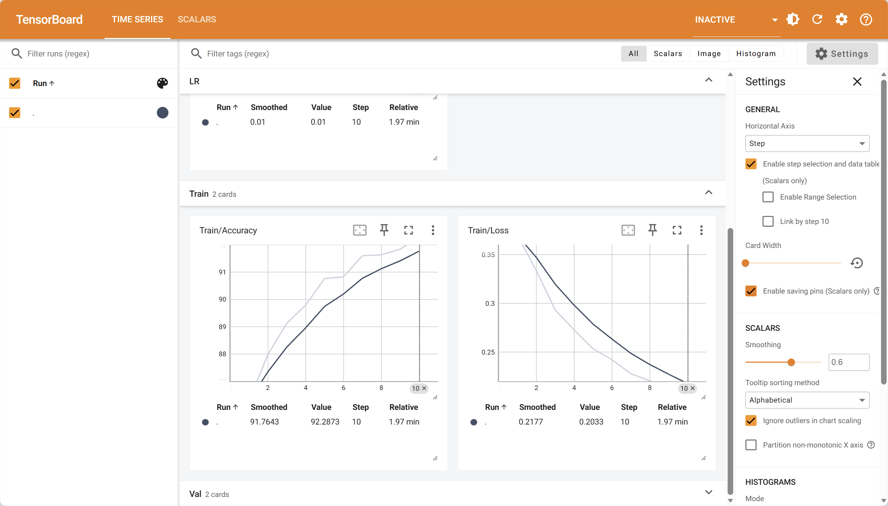
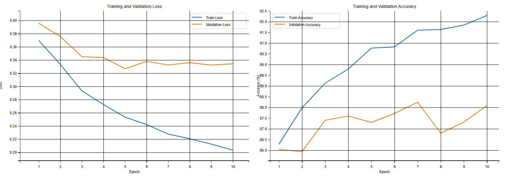
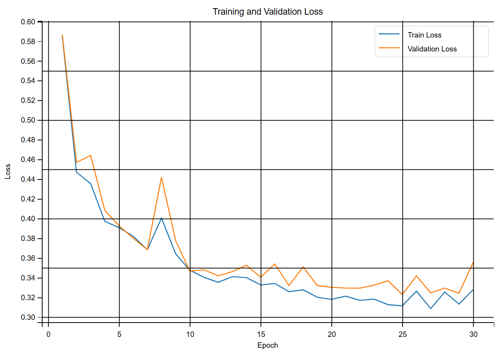

# Pytorch分类与回归

## 分类问题与回归问题原理

- 分类问题预测的是类别,模型的输出是概率分布

- 回归问题预测的是值,模型的输出是一个实数值

  

### 分类问题

- 为什么要分为训练集，验证集，测试集：为了防止人工调参造成的测试集的信息泄露

- 三分类真实类别，使用One-hot编码, 把正整数变为向量表达，生成一个长度等于类别总数 K 的向量（K 必须大于最大的类别编号，因为编号从 0 开始），只有该整数对应的位置处为1其余位置都为0，例如：

  - 0 -> [1, 0, 0]
  - 1 -> [0, 1, 0]
  - 2 -> [0, 0, 1]

  

- 三分类问题输出例子: [0.2, 0.7, 0.1]，这里的结果是一个概率值，利用softmax（输出激活函数）

### Softmax输出激活函数

$$
\sigma(z)_j=\frac{e^{z_j}}{\sum_{k=1}^{K}e^{z_k}},j=1,2...K
$$


- 将分子除以总和，实现**归一化（Normalization）**，确保所有输出值的和等于 1
- 保留了最大值的优势，但给了一个“软化”的概率分布。即使是较小的值也保留了非零的概率。这使得函数处处可导，非常适合神经网络训练
- 在训练过程中，Softmax 几乎总是与交叉熵损失函数（Cross-Entropy Loss）配合使用
  - Softmax 负责把模型输出变成概率
  - Cross-Entropy 负责衡量这个”预测概率”与”真实标签（One-hot编码）”之间的距离

> **📝 补充说明：Softmax 公式拆解**
>
> 公式中每个符号的含义：
>
> | 符号                    | 含义                                                         | 举例                                                         |
> | ----------------------- | ------------------------------------------------------------ | ------------------------------------------------------------ |
> | $z_j$                   | 模型对第 $j$ 类的**原始输出分数**（也叫 logits），未经任何归一化 | 比如模型输出 `[2.0, 1.0, 0.1]`，则 $z_1=2.0$, $z_2=1.0$, $z_3=0.1$ |
> | $K$                     | 总类别数                                                     | 三分类问题中 $K=3$                                           |
> | $e$                     | 自然常数 $\approx 2.718$                                     | $e^{z_j}$ 即 $e$ 的 $z_j$ 次方                               |
> | $\sum_{k=1}^{K}e^{z_k}$ | 所有类别的 $e^{z_k}$ 的**总和**                              | $e^{2.0}+e^{1.0}+e^{0.1} \approx 7.39+2.72+1.11=11.22$       |
> | $\sigma(z)_j$           | 第 $j$ 类的**最终概率**                                      | $\sigma(z)_1 = \frac{7.39}{11.22} \approx 0.659$             |
>
> **直观理解**：Softmax 做了两件事：
>
> 1. 用 $e^{z_j}$ 把分数变成正数（指数函数 $e^x$ 永远 > 0），同时**放大**高分与低分的差距
> 2. 除以总和，让所有概率加起来恰好等于 1
>
> **为什么用 $e$ 而不是直接除以总和？**
> 因为指数函数放大差距的效果更好。假设 logits 是 `[3, 1]`：
>
> - 直接归一化：`[3/4, 1/4]` = `[0.75, 0.25]`
> - Softmax：`[e³/(e³+e¹), e¹/(e³+e¹)]` ≈ `[0.88, 0.12]`
>
> Softmax 让”赢家”的优势更明显，同时”输家”也不会是 0（处处可导）。

### 交叉熵损失和均方误差损失对比分析

**均方误差（回归）** 公式
$$
MSE=\frac{1}{n}\sum_{i=1}^{n}(y_i-\hat{y_i})^2
$$
**交叉熵损失**公式
$$
L=\frac{1}{N}\sum_{i}L_i=-\frac{1}{N}\sum_{i}\sum_{c=1}^{M}y_{ic}log(p_{ic})
$$

> **📝 补充说明：交叉熵公式拆解**
>
> 公式看起来很复杂，我们拆开来看：
>
> | 符号     | 含义                                                         | 举例                                                         |
> | -------- | ------------------------------------------------------------ | ------------------------------------------------------------ |
> | $N$      | 样本总数                                                     | 一个 batch 有 64 张图片，$N=64$                              |
> | $M$      | 类别总数                                                     | FashionMNIST 有 10 类衣服，$M=10$                            |
> | $y_{ic}$ | 第 $i$ 个样本在类别 $c$ 上的**真实标签**（One-hot，要么 0 要么 1） | 样本是"裙子 Dress"（FashionMNIST 中标签为 3，编号从 0 开始），则 $y_i = [0,0,0,1,0,0,0,0,0,0]$ |
> | $p_{ic}$ | 第 $i$ 个样本在类别 $c$ 上的**预测概率**（Softmax 的输出）   | 模型预测 $p_i = [0.1, 0.05, 0.02, 0.7, ...]$                 |
> | $\log$   | 自然对数（以 $e$ 为底），即 $\ln$                            | $\ln(0.7) \approx -0.357$, $\ln(0.1) \approx -2.303$         |
>
> **直观理解**（一个样本的情况）：
>
> $$L_i = -\sum_{c=1}^{M} y_{ic} \cdot \ln(p_{ic})$$
>
> 因为 $y_{ic}$ 只有正确类别那一位是 1，其余全是 0，所以这个求和实际上**只有一项起作用**：
>
> $$L_i = -\ln(p_{i,\text{正确类别}})$$
>
> 也就是说，交叉熵损失**只关心模型对"正确答案"预测的概率**：
>
> | 对正确类别的预测概率 |         $-\ln(p)$          | 含义                  |
> | :------------------: | :------------------------: | --------------------- |
> |         0.9          | $-\ln(0.9) \approx 0.105$  | 预测很准，损失很小 ✓  |
> |         0.5          | $-\ln(0.5) \approx 0.693$  | 半信半疑，损失中等    |
> |         0.1          | $-\ln(0.1) \approx 2.303$  | 几乎猜错，损失很大 ✗  |
> |         0.01         | $-\ln(0.01) \approx 4.605$ | 完全猜错，损失巨大 ✗✗ |
>
> 当 $p \to 1$ 时，$-\ln(p) \to 0$（损失趋近于 0，完美预测）。
> 当 $p \to 0$ 时，$-\ln(p) \to +\infty$（损失趋近于无穷，惩罚极重）。

- 当输出值与真实值接近的话，交叉熵和均方误差（MSE）的值都会接近0
- 交叉熵具有MSE不具有的优点：避免学习速度变慢的情况——MSE 配合 Sigmoid/Softmax 时梯度会变小、学习变慢（注意这种效果仅限于输出层，隐藏层的学习速度与其使用的激活函数密切相关）
- 主要原因是逻辑回归配合MSE损失函数时，采用梯度下降法进行学习时，会出现模型一开始训练时，学习速率非常慢的情况（MSE损失函数）
- 均方损失：假设误差是正态分布，适用于线性的输出(如回归问题)，特点是对于与真实结果差别越大，则惩罚力度越大，这并不适用于分类问题
- 交叉熵损失：假设误差是二值分布，可以视为预测概率分布和真实概率分布的相似程度，在分类问题中有良好的应用

示例：

| 预测        | 真实  | 是否正确 |
| ----------- | ----- | -------- |
| 0.3 0.3 0.4 | 0 0 1 | 正确     |
| 0.3 0.4 0.3 | 0 1 0 | 正确     |
| 0.1 0.2 0.7 | 1 0 0 | 错误     |

- MSE
  $$
  sample\_1\_loss=(0.3-0)^2+(0.3-0)^2+(0.4-1)^2=0.54
  $$

  $$
  sample\_2\_loss=(0.3-0)^2+(0.4-1)^2+(0.3-0)^2=0.54
  $$

  $$
  sample\_3\_loss=(0.1-1)^2+(0.2-0)^2+(0.7-0)^2=1.34
  $$

  对所有样本求loss平均
  $$
  MSE=\frac{0.54+0.54+1.34}{3}=0.81
  $$

  > 注：此处的口径是"每个样本对各类别求**和**，再对样本平均"。PyTorch 的 `nn.MSELoss` 默认对**全部元素**取平均（此例共 9 个元素，结果为 $2.42/9 \approx 0.269$），两者相差一个类别数因子 3，只是约定不同，不影响比较结论。

- L
  $$
  sample\_1\_loss=-(0*log(0.3)+0*log(0.3)+1*log(0.4))=0.92
  $$

  $$
  sample\_2\_loss=-(0*log(0.3)+1*log(0.4)+0*log(0.3))=0.92
  $$

  $$
  sample\_3\_loss=-(1*log(0.1)+0*log(0.2)+0*log(0.7))=2.30
  $$

  对所有样本求loss平均
  $$
  L=\frac{0.92+0.92+2.30}{3}=1.38
  $$

- **交叉熵损失更能捕捉到预测效果的差异，交叉熵损失相对于均方误差损失梯度更大，能够让模型更快收敛**

> **📝 补充说明：为什么 MSE 在分类问题中会导致学习缓慢？**
>
> 这是笔记中最核心的一个结论，我们深入理解一下。
>
> **问题的本质**：分类模型最后一层通常用 **Sigmoid**（二分类）或 **Softmax**（多分类）把输出变成概率。MSE 配合 Sigmoid/Softmax 时，会出现"梯度消失"。
>
> 以二分类 + Sigmoid 为例（数学上最简洁）：
>
> - 模型输出经过 Sigmoid：$\hat{y} = \sigma(z) = \frac{1}{1+e^{-z}}$
> - MSE 损失：$L = \frac{1}{2}(\hat{y} - y)^2$
> - 对参数 $w$ 求梯度（链式法则）：$\frac{\partial L}{\partial w} = (\hat{y}-y) \cdot \sigma'(z) \cdot x$
>
> **这个公式是怎么来的？—— 链式法则逐步推导**
>
> 我们有三个嵌套在一起的东西，从外到内分别是：
>
> 1. **损失函数** $L = \frac{1}{2}(\hat{y} - y)^2$（最外层：用预测值 $\hat{y}$ 计算误差）
> 2. **Sigmoid 激活** $\hat{y} = \sigma(z) = \frac{1}{1+e^{-z}}$（中间层：把原始分数 $z$ 变成概率）
> 3. **线性变换** $z = wx + b$（最内层：参数 $w$ 和输入 $x$ 的线性组合）
>
> 要求 $\frac{\partial L}{\partial w}$，就是求"损失 $L$ 对参数 $w$ 的变化有多敏感"。根据链式法则，从外到内一层层求导再相乘：
>
> $$\frac{\partial L}{\partial w} = \underbrace{\frac{\partial L}{\partial \hat{y}}}_{\text{第①步}} \cdot \underbrace{\frac{\partial \hat{y}}{\partial z}}_{\text{第②步}} \cdot \underbrace{\frac{\partial z}{\partial w}}_{\text{第③步}}$$
>
> **第 ① 步**：损失对预测值求导
>
> $$L = \frac{1}{2}(\hat{y} - y)^2$$
> $$\frac{\partial L}{\partial \hat{y}} = \frac{1}{2} \cdot 2(\hat{y} - y) \cdot 1 = \hat{y} - y$$
>
> 含义：如果预测值 $\hat{y}$ 比真实值 $y$ 大，增大 $\hat{y}$ 会让损失变大（导数为正）；反过来则变小。
>
> **第 ② 步**：预测值对原始分数求导（Sigmoid 的导数）
>
> $$\hat{y} = \sigma(z) = \frac{1}{1+e^{-z}}$$
> $$\frac{\partial \hat{y}}{\partial z} = \sigma'(z) = \sigma(z)(1-\sigma(z)) = \hat{y}(1-\hat{y})$$
>
> 这是 Sigmoid 函数的一个优雅性质：它的导数可以用自己的函数值表示。
>
> **第 ③ 步**：原始分数对权重求导
>
> $$z = wx + b$$
> $$\frac{\partial z}{\partial w} = x$$
>
> 含义：权重 $w$ 对 $z$ 的贡献正好是输入 $x$。
>
> **三步相乘，得到最终梯度**：
>
> $$\boxed{\frac{\partial L}{\partial w} = (\hat{y} - y) \cdot \sigma'(z) \cdot x}$$
>
> 也可以写成 $\frac{\partial L}{\partial w} = (\hat{y} - y) \cdot \hat{y}(1-\hat{y}) \cdot x$
>
> **直观理解**：这个梯度由三部分决定：
>
> - $(\hat{y} - y)$：预测值与真实值的差距，差距越大梯度越大 ✓
> - $\sigma'(z)$：Sigmoid 在当前点的斜率，这是**问题所在**（见下文）
> - $x$：输入值的大小
>
> 问题出在 $\sigma'(z)$ 上。看 Sigmoid 的图像：
>
> ```
> σ(z) 值:    0.0    0.1    0.5    0.9    0.99
> σ'(z) 值:   0.0    0.09   0.25   0.09   0.0099
> ```
>
> **当模型预测非常确定（0.99 或 0.01）但恰好是错的时候**，$\sigma'(z)$ 趋近于 0，梯度趋近于 0，参数几乎不更新——模型"卡住了"。
>
> **对比交叉熵**（配合 Sigmoid）：
>
> - $L = -[y\ln(\hat{y}) + (1-y)\ln(1-\hat{y})]$
> - $\frac{\partial L}{\partial w} = (\hat{y} - y) \cdot x$
>
> 发现没有？**$\sigma'(z)$ 被消掉了！** 梯度直接等于"预测值与真实值的差"。预测越错，梯度越大，学得越快。
>
> **通俗类比**：
>
> - MSE + Sigmoid = 一个老师，学生答得离谱时反而懒得纠正（梯度小）
> - 交叉熵 + Sigmoid/Softmax = 一个老师，学生答得越离谱，纠正力度越大（梯度大）
>
> 这就是为什么**分类问题标配是 Softmax + 交叉熵**，而**回归问题用 MSE**（回归的**输出层**不经过 Sigmoid/Softmax，不存在上述输出层梯度消失问题；但隐藏层若使用 Sigmoid/Tanh 等激活函数，仍可能出现梯度消失）。

### 标准化与归一化

`transforms.Normalize(mean, std)`将图像张量的每个通道进行归一化，这里的`mean`和`std`是根据数据集的特性和需求来确定的

通过将`Normalize`变换与其他变换（如`ToTensor()`）组合在一起，可以在加载数据集时自动应用归一化操作，这样训练数据将在输入模型之前进行归一化处理

`transforms.ToTensor()`主要执行以下操作：

- 缩放像素值：将图像中每个通道的像素值从 [0, 255] 归一化到 [0.0, 1.0]（通过将每个像素值除以 255 来实现）
- 增加通道维度：对于单通道的灰度图像，它会增加一个通道维度，使其成为具有三个维度的张量，即 [channels, height, width]（如 28×28 灰度图 → `[1, 28, 28]`）；对于三通道的彩色图像，它将保持三个通道
- 转换数据类型：将图像数据转换为浮点数类型（float32），因为 PyTorch 的神经网络层通常处理浮点数数据

#### 方差公式

$$
\sigma^2=\frac{1}{N}\sum_{i=1}^{N}(x_i-\mu)^2,\mu=\frac{1}{N}\sum_{i=1}^{N}x_i
$$

**等价展开**
$$
\frac{1}{N}\sum_{i=1}^{N}(x_i-\mu)^2=\frac{1}{N}\sum_{i=1}^{N}x_i^2-2\mu·\frac{1}{N}\sum_{i=1}^{N}x_i+\mu^2=\frac{1}{N}\sum_{i=1}^{N}x_i^2-\mu^2
$$

> **📝 补充说明：方差公式展开推导**
>
> 这个展开是代码中计算方差的关键（不必重写循环），我们逐步推导：
>
> **第 1 步**：展开平方项
> $$(x_i - \mu)^2 = x_i^2 - 2\mu x_i + \mu^2$$
>
> **第 2 步**：对 $i$ 从 1 到 $N$ 求和
> $$\sum_{i=1}^{N}(x_i - \mu)^2 = \sum x_i^2 - 2\mu\sum x_i + N\mu^2$$
>
> **第 3 步**：除以 $N$，逐项处理
> $$\frac{1}{N}\sum(x_i-\mu)^2 = \underbrace{\frac{1}{N}\sum x_i^2}_{\text{x²的均值}} - 2\mu \cdot \underbrace{\frac{1}{N}\sum x_i}_{\text{x的均值}=\mu} + \mu^2$$
>
> **第 4 步**：代入 $\frac{1}{N}\sum x_i = \mu$
> $$= \frac{1}{N}\sum x_i^2 - 2\mu^2 + \mu^2$$
> $$= \frac{1}{N}\sum x_i^2 - \mu^2$$
>
> **结论**：$\boxed{Var(X) = E[X^2] - (E[X])^2}$
>
> 这就是后文代码中 `var = mean_of_squares - mean ** 2` 的数学依据——只需一次遍历算出 `mean` 和 `mean_of_squares`，无需两次遍历。
>
> **具体例子**：数据 `[2, 4, 6]`
>
> - $\mu = (2+4+6)/3 = 4$
> - $E[X^2] = (4+16+36)/3 = 18.67$
> - $Var = 18.67 - 16 = 2.67$
> - 验证：$[(2-4)² + (4-4)² + (6-4)²]/3 = (4+0+4)/3 = 2.67$ ✓

```python
# 定义数据集的变换
transform = transforms.Compose([
    transforms.ToTensor(), 
    transforms.Normalize(mean, std)
])
```

### earlystoping早停

为了避免过拟合

| 参数      | 注释                                                         |
| --------- | ------------------------------------------------------------ |
| min_delta | 监视数量的最小变化有资格作为改进，即绝对变化小于min_delta，将不视为改进 |
| Patience  | 变化量小于min_delta的时期数（没有改善），之后训练将停止      |

### ModelCheckpoint模型保存

- 为了上线
- 避免模型中途训练终止，再次训练可以从上次的保存点进行

 ```python
torch.save(model.state_dict(), save_path)
# state_dict()中存储每一层的权重weight和偏置bias
# save_path保存路径，业界默认设置为best_model.pth
 ```

### TensorBoard

- `pip install tensorboard`

- tensor记录模型输出日志

- ```bash
  tensorboard --logdir="E:/xxx/tensorboard_logs" --host 0.0.0.0 --port 8848
  必须为绝对路径
  ```

- 访问：`http://localhost:8848/`



### 📝 核心概念速查（在看代码之前）

后面代码中会出现一些关键术语，先弄清楚它们：

#### 1. Logits（原始分数 / 未归一化分数）

**Logits** 是神经网络最后一层输出的**原始数值**，还没有经过 Softmax 变成概率。

|          | Logits                         | 概率（Softmax 之后） |
| -------- | ------------------------------ | -------------------- |
| 数值范围 | $(-\infty, +\infty)$，可正可负 | $[0, 1]$，加和为 1   |
| 例子     | `[2.0, 1.0, 0.1]`              | `[0.66, 0.24, 0.10]` |
| 谁产生   | `nn.Linear` 全连接层直接输出   | 对 logits 做 Softmax |

> PyTorch 的 `nn.CrossEntropyLoss()` **接收的是 logits**，它内部会自动做 Softmax。所以你的模型最后一层不需要加 Softmax！

#### 2. Epoch（轮次）、Batch（批次）、Iteration（迭代）

这是三个最容易混淆的概念，用一个类比：

> **你在背一本 1000 页的单词书：**
>
> - **Epoch（轮次）**：把整本书从头到尾背了**一遍**。epoch=10 就是背了 10 遍。
> - **Batch（批次）**：你不可能一次背完整本书，每次只背**几页**。batch_size=64 就是每次背 64 页。
> - **Iteration（迭代）**：每背一次（一个 batch）就是一次迭代。1000 页 ÷ 64 页/次 ≈ 16 次迭代 = 1 个 epoch。

```
训练集 55000 张图片, batch_size = 64
    → 1 epoch = ceil(55000 / 64) = 860 次 iteration
    → 每个 iteration 处理 64 张图片
    → 10 个 epoch = 10 × 860 = 8600 次参数更新
```

#### 3. 梯度下降的五步（训练的核心循环）

```python
optimizer.zero_grad()   # ① 清空上一轮的梯度（PyTorch 默认累加）
outputs = model(images)  # ② 前向传播：输入→模型→预测
loss = criterion(outputs, labels)  # ③ 计算损失：衡量预测与真实的差距
loss.backward()          # ④ 反向传播：自动计算每个参数的梯度
optimizer.step()         # ⑤ 更新参数：w_new = w_old - lr × gradient
```

**类比**：你在山上想走到山谷最低点（最小化损失）：

1. 放下之前的笔记（清空梯度）
2. 看看周围的地形（前向传播）
3. 算算离谷底还有多远（计算损失）
4. 判断哪个方向是下坡（反向传播求梯度）
5. 往下坡走一步（更新参数）

#### 4. ReLU 激活函数：$f(x) = \max(0, x)$

| 输入 |       输出        |
| :--: | :---------------: |
|  3   | 3（正数直接通过） |
|  -5  |  0（负数变成 0）  |

**为什么需要它？** 如果没有 ReLU，多层全连接网络等价于一层（线性变换的复合还是线性）。ReLU 引入**非线性**，让网络能学习复杂的曲线和边界。

#### 5. 过拟合（Overfitting）

| 现象       |    训练集上     | 验证集/测试集上 |
| ---------- | :-------------: | :-------------: |
| 欠拟合     |     表现差      |     表现差      |
| **刚好**   |     表现好      |     表现好      |
| **过拟合** | 表现极好（99%） |  表现差（80%）  |

过拟合 = **死记硬背**训练数据，失去了泛化能力。解决方案：早停（Early Stopping）、Dropout、数据增强、正则化。

#### 6. SGD 动量（Momentum）

PyTorch `optim.SGD` 的动量实现为：

$$v_t = \mu \cdot v_{t-1} + g_t, \qquad w \leftarrow w - lr \cdot v_t$$

其中 $\mu$ 就是 `momentum` 参数，$g_t$ 是当前梯度。注意：**新梯度不乘 $(1-\mu)$**——这与指数移动平均（EMA）形式 $v_t = \beta v_{t-1} + (1-\beta)g_t$ 不同，后者是部分教材和其他框架的写法，两者只差一个常数缩放，但解读时不要混用。

**类比**：普通 SGD 是每一步都重新判断方向（容易震荡），带动量的 SGD 像滚雪球——之前的方向有**惯性**，不会被当前一步的小波动带偏。`momentum=0.9` 意味着历史速度以 0.9 的系数衰减累积，当前梯度全额加入。

### 分类示例-FashionMNIST

```python
"""
FashionMNIST 分类 —— 使用 PyTorch 全连接神经网络
========================================================
本脚本实现了 FashionMNIST 数据集的 10 分类任务，包括：
1. 数据加载与预处理
2. 数据可视化
3. 三层全连接神经网络构建
4. 模型训练与验证
5. 模型参数统计
"""

import torch  # PyTorch 核心库，提供张量运算与自动求导
import torch.nn as nn  # 神经网络模块，提供 Linear、ReLU 等层
import torch.optim as optim  # 优化器模块，提供 SGD、Adam 等
from torchvision import datasets, transforms  # 提供常用数据集与数据预处理变换
import matplotlib.pyplot as plt  # 绘图库，用于数据可视化与训练曲线绘制
from matplotlib import rcParams  # matplotlib 配置字典，用于设置全局绘图参数
import os  # 操作系统接口，用于创建目录、判断文件是否存在等
from torch.utils.tensorboard import SummaryWriter  # TensorBoard 写入器，用于记录训练日志

# 设置中文字体，防止 matplotlib 中文显示为方块
rcParams['font.sans-serif'] = ['SimHei']  # 使用黑体
rcParams['axes.unicode_minus'] = False  # 正常显示负号

# ============================================================
# 1. 数据加载与预处理
# ============================================================

# 定义数据预处理流程
# transforms.Compose: 将多个 transform 操作组合在一起，按顺序执行
# transforms.ToTensor(): 将 PIL.Image (0-255) 转换为 torch.Tensor (0.0-1.0)，并将 H×W×C 变为 C×H×W
transform = transforms.Compose([
    transforms.ToTensor(),
])

# 下载并加载 FashionMNIST 训练集
# root: 数据存放目录
# train=True: 加载训练集（60,000 张）
# download=False: 不重新下载（若已下载过；首次使用需设为 True）
# transform: 对每张图片施加的预处理操作
full_train_dataset = datasets.FashionMNIST(
    root='./data',  # 数据集存储路径
    train=True,  # True=训练集, False=测试集
    download=False,  # 是否下载数据集（首次需设为 True）
    transform=transform  # 数据预处理变换
)

# 从训练集中分出 5000 张作为验证集
# 总训练样本 60,000 → 训练集 55,000 + 验证集 5,000
train_size = len(full_train_dataset) - 5000  # 训练集大小: 55000
val_size = 5000  # 验证集大小: 5000

# random_split: 将数据集随机打乱后按指定长度切分，避免验证集与训练集分布不同
# generator: 随机数生成器，用于控制切分时的打乱顺序
#   - torch.Generator(): 创建一个新的随机数生成器实例（独立于全局默认生成器，互不干扰）
#   - .manual_seed(42): 手动设置随机种子为 42，使生成的随机序列固定
#     作用: 保证每次运行脚本时，数据集的切分方式完全一致
#           → 训练集/验证集划分结果可复现，便于调试与结果对比
#     若不指定 generator，random_split 会使用全局随机状态，每次运行划分不同，结果难以复现
#   - "42" 是机器学习社区常用的种子值，任意整数均可
generator = torch.Generator().manual_seed(42)
train_dataset, val_dataset = torch.utils.data.random_split(
    full_train_dataset,  # 原始数据集
    [train_size, val_size],  # 切分后各部分长度
    generator=generator  # 传入生成器，使切分结果可复现
)

# DataLoader: 将数据集包装成可迭代的批量加载器
# batch_size=64: 每个 batch 包含 64 张图片
# shuffle=True: 每个 epoch 打乱数据顺序，防止模型记忆样本顺序（验证/测试集不需要）
train_loader = torch.utils.data.DataLoader(
    train_dataset,
    batch_size=64,  # 批量大小，影响训练速度和梯度稳定性
    shuffle=True  # 是否在每个 epoch 打乱数据
)
val_loader = torch.utils.data.DataLoader(
    val_dataset,
    batch_size=64,
    shuffle=False  # 验证集不需要打乱
)

# 下载并加载 FashionMNIST 测试集（10,000 张）
test_dataset = datasets.FashionMNIST(
    root='./data',
    train=False,  # False 表示加载测试集
    download=False,
    transform=transform
)
test_loader = torch.utils.data.DataLoader(
    test_dataset,
    batch_size=64,
    shuffle=False  # 测试集不需要打乱
)

# 打印各数据集样本数
print("训练集样本数：", len(train_dataset))  # 55000
print("验证集样本数：", len(val_dataset))  # 5000
print("测试集样本数：", len(test_dataset))  # 10000

# 查看 10 个类别名称
# 0: T-shirt/top, 1: Trouser, 2: Pullover, 3: Dress, 4: Coat
# 5: Sandal, 6: Shirt, 7: Sneaker, 8: Bag, 9: Ankle boot
class_names = full_train_dataset.classes
print("类别名称:", class_names)

# ============================================================
# 2. 数据可视化
# ============================================================

# 可视化训练集前 15 个样本，查看图片内容与对应标签
fig, axs = plt.subplots(3, 5, figsize=(15, 10))  # 创建 3×5 子图，画布大小 15×10 英寸
axs = axs.flatten()  # 将 2D 轴数组展平为 1D，方便索引

for i in range(15):
    img, label = train_dataset[i]  # img 形状: (1, 28, 28) 即 (C, H, W)，label 是 0-9 的整数
    img = img.squeeze().numpy()  # squeeze() 去掉通道维度 → (28, 28)，再转 numpy
    axs[i].imshow(img, cmap='gray')  # 以灰度图方式显示
    axs[i].set_title(class_names[label])  # 标题为对应的类别名称
    axs[i].axis('off')  # 隐藏坐标轴

plt.tight_layout()  # 自动调整子图间距，避免重叠
plt.savefig('可视化train_dataset前15个样本.png')  # 保存图片
plt.show()

# 查看数据集基本信息
# train_dataset 总共 55000 个样本，每个样本是一个 (image_tensor, label) 元组
print("训练集类型:", type(train_dataset))
print("训练集样本总数:", len(train_dataset))  # 55000
print("单张图片的 shape (C, H, W):", train_dataset[0][0].shape)  # torch.Size([1, 28, 28])
print("第一张图片的标签编号:", train_dataset[0][1])  # 7 → Sneaker


# ============================================================
# 2.5 计算训练集的均值和标准差（用于后续标准化 Normalization）
# ============================================================
# 标准化公式: x_norm = (x - mean) / std
# 计算前需先把所有样本堆叠成一个大 tensor，再按公式求均值与方差。
# 注意: 这里统计的是 train_dataset（已切分后的 55000 张），而非 full_train_dataset。
#       若显存不足，可改用分批累加的方式计算，避免一次性加载全部图片。

# 将 train_dataset 中每张图片取出，组成列表；每个元素 shape 为 (1, 28, 28)
all_imgs = [train_dataset[i][0] for i in range(len(train_dataset))]

# torch.stack: 沿新维度(第0维)把列表中的张量堆叠起来
# 堆叠后 shape: (样本数 N, 1, 28, 28)
all_imgs = torch.stack(all_imgs)

# ============================================================
# 📝 view() 与 -1 详解（PyTorch 最重要的张量操作之一）
# ============================================================
# view() 是改变张量形状的方法，不改变数据本身，只是"换一种方式看待"同一块内存。
# -1 表示"你帮我自动算这个维度应该是多少"（只能有一个 -1）
#
# 举例说明：
#   张量 shape = (2, 3, 4)，共 2×3×4 = 24 个元素
#   .view(6, 4)      → (6, 4)   显式指定两维
#   .view(-1, 4)     → (6, 4)   -1 自动推算为 24/4 = 6
#   .view(2, -1)     → (2, 12)  -1 自动推算为 24/2 = 12
#   .view(-1)        → (24,)    展平为一维
#
# 在模型中的典型用法：
#   x.shape = (batch, 1, 28, 28)  图片：64张 × 1通道 × 28高 × 28宽
#   x.view(x.size(0), -1)         x.size(0)=64, -1 自动推算为 1×28×28=784
#   结果: (64, 784)               每张图片变成784维的向量
# ============================================================

# view(-1): 将任意 shape 的张量展平为一维（共 N*1*28*28 个像素值）
# -1 表示该维度由系统根据元素总数自动推断
all_imgs_flat = all_imgs.view(-1)

# 计算所有像素值的均值: mean = (1/n) * Σ xi
mean = all_imgs_flat.mean().item()  # .item() 将标量张量转为 Python float

# 计算 (xi^2) 的均值: mean_of_squares = (1/n) * Σ xi^2
mean_of_squares = (all_imgs_flat ** 2).mean().item()

# 按方差公式计算: Var = E[X^2] - (E[X])^2 = mean(x^2) - mean(x)^2
# 该公式等价于 Σ(xi - mean)^2 / n，但计算更高效（无需二次遍历）
var = mean_of_squares - mean ** 2

print("Train dataset mean:", mean)  # 训练集像素均值（ToTensor 后约 0.2860）
print("Train dataset variance:", var)  # 训练集像素方差

# 标准差 = 方差的算术平方根
std = var ** 0.5
print("Train dataset std:", std)  # 训练集像素标准差（约 0.3530）

# ---- 用计算出的 mean/std 构建带标准化的 transform ----
# transforms.Normalize(mean, std): 对每个通道逐元素做 (x - mean) / std
#   - FashionMNIST 为单通道灰度图，故 mean/std 各传一个值，写成单元素元组 (mean,) (std,)
#   - 归一化后像素分布变为均值 0、方差 1，输入尺度统一，有助于模型更快收敛
#   - 顺序很重要: 必须先 ToTensor()（转为 0-1 浮点）再 Normalize()，不能反
transform = transforms.Compose([
    transforms.ToTensor(),  # 先把 PIL 图片转为 0.0-1.0 的张量
    transforms.Normalize((mean,), (std,))  # 再标准化: x_norm = (x - mean) / std
])

# 将新的 transform 重新挂载到已加载的数据集上
#   - 数据集在 __getitem__ 时才按"当前" self.transform 处理图片，
#     因此无需重新加载数据，直接重新赋值即可让后续迭代生效
#   - train_dataset / val_dataset 是 random_split 产生的 Subset，
#     其 __getitem__ 会委托给底层 full_train_dataset，所以只需修改
#     full_train_dataset.transform，训练集与验证集会同步生效
full_train_dataset.transform = transform  # 训练集与验证集（Subset 共享底层）同步生效
test_dataset.transform = transform  # 测试集也使用相同的标准化参数

print(f"已应用标准化: Normalize(mean={mean:.4f}, std={std:.4f})")


# ============================================================
# 3. 模型定义（带调试打印版，用于理解数据流动）
# ============================================================

class NeuralNetworkDebug(nn.Module):
    """
    三层全连接神经网络（带 shape 打印，便于理解各层数据流）
    输入: 28×28=784 像素 → 展平 → 300 → ReLU → 100 → ReLU → 10（10 分类 logits）
    """

    def __init__(self):
        super().__init__()
        # 全连接层1: 784 → 300
        self.fc1 = nn.Linear(28 * 28, 300)  # 输入 784 个神经元，输出 300 个
        # ReLU 激活函数: max(0, x)，引入非线性，缓解梯度消失
        self.relu1 = nn.ReLU()
        # 全连接层2: 300 → 100
        self.fc2 = nn.Linear(300, 100)
        self.relu2 = nn.ReLU()
        # 全连接层3（输出层）: 100 → 10（对应 10 个类别）
        # 输出为 logits（未归一化），后续 CrossEntropyLoss 会自动做 softmax
        self.fc3 = nn.Linear(100, 10)

    def forward(self, x):
        """前向传播（包含调试打印）"""
        print("Before view:", x.shape)  # 例如 (1, 1, 28, 28)
        x = x.view(x.size(0), -1)  # 展平: (batch, 1, 28, 28) → (batch, 784)
        print("After view:", x.shape)  # (1, 784)
        x = self.fc1(x)  # 全连接层1: (batch, 784) → (batch, 300)
        print("After fc1:", x.shape)
        x = self.relu1(x)  # ReLU 激活: 负值置零，正值保持
        print("After relu1:", x.shape)
        x = self.fc2(x)  # 全连接层2: (batch, 300) → (batch, 100)
        print("After fc2:", x.shape)
        x = self.relu2(x)
        print("After relu2:", x.shape)
        x = self.fc3(x)  # 输出层: (batch, 100) → (batch, 10)
        print("After fc3:", x.shape)
        return x


# 用单张图片测试调试版模型的数据流
img, label = train_dataset[0]
img = img.unsqueeze(0)  # 在第0维增加 batch 维度: (1, 28, 28) → (1, 1, 28, 28)
model_debug = NeuralNetworkDebug()
output = model_debug(img)
print("Logits:", output)  # 10 个未归一化的类别分数
print("Predicted class:", torch.argmax(output, dim=1).item(), "True class:", label)
# argmax(output, dim=1): 沿第1维（类别维）取最大值的索引，即预测类别

print()

# 用真实 batch 数据测试（查看 batch 维度的数据流）
for images, labels in train_loader:
    print("images shape:", images.shape)  # (64, 1, 28, 28) = (batch_size, channel, height, width)
    print("labels shape:", labels.shape)  # (64,) = 64 个标签
    break

output = model_debug(images)
print("Logits shape:", output.shape)  # (64, 10) = 64 个样本，每个样本输出 10 个类别分数

# ============================================================
# 4. 模型参数统计
# ============================================================

print("\n========== 模型参数统计 ==========")
for name, param in model_debug.named_parameters():
    # param.numel(): 返回该参数张量的元素总数 (number of elements)
    print(f"Name: {name}, Shape: {param.shape}, Number of params: {param.numel()}")

# 计算总参数量: 遍历所有参数，累加元素个数
total_params = sum(p.numel() for p in model_debug.parameters())
print(f"Total number of parameters: {total_params}")  # 266,610

# 验证: fc1 权重参数量 = 300 × 784 = 235,200
print(f"验证 fc1.weight 参数量: 300 * 784 = {300 * 784}")


# ============================================================
# 5. 正式模型定义（纯推理版，无调试打印）
# ============================================================

class NeuralNetwork(nn.Module):
    """
    三层全连接神经网络（正式版，无调试打印）
    结构: Input(784) → FC(300) → ReLU → FC(100) → ReLU → FC(10)
    参数量计算:
      fc1: 784×300 + 300 = 235,500
      fc2: 300×100 + 100 = 30,100
      fc3: 100×10  + 10  = 1,010
      总计: 266,610
    """

    def __init__(self):
        super().__init__()
        # 第一层全连接: 将 784 维像素向量映射到 300 维特征空间
        self.fc1 = nn.Linear(28 * 28, 300)
        # ReLU 激活: f(x) = max(0, x)，保留正值，抑制负值，增加非线性表达能力
        self.relu1 = nn.ReLU()
        # 第二层全连接: 300 → 100，进一步提取高层特征
        self.fc2 = nn.Linear(300, 100)
        self.relu2 = nn.ReLU()
        # 输出层: 100 → 10，输出每个类别的原始分数（logits）
        # 注意: 此处没有加 Softmax，因为 CrossEntropyLoss 内部已包含 softmax + NLLLoss
        self.fc3 = nn.Linear(100, 10)

    def forward(self, x):
        """
        前向传播
        参数:
            x: 输入张量，形状 (batch_size, 1, 28, 28)
        返回:
            logits: 形状 (batch_size, 10)，每个类别的原始分数
        """
        # view: 将图片展平为向量，x.size(0) 是 batch_size，-1 表示自动计算剩余维度
        x = x.view(x.size(0), -1)  # (batch, 1, 28, 28) → (batch, 784)
        x = self.fc1(x)  # (batch, 784) → (batch, 300)
        x = self.relu1(x)  # ReLU 非线性激活
        x = self.fc2(x)  # (batch, 300) → (batch, 100)
        x = self.relu2(x)  # ReLU 非线性激活
        x = self.fc3(x)  # (batch, 100) → (batch, 10)
        return x


# 实例化正式模型
model = NeuralNetwork()


# ============================================================
# 6. Trainer 训练器类
# ============================================================
# 该类把"训练 + 验证 + 早停 + 保存最优模型 + TensorBoard 日志 + 绘图"封装在一起，
# 同时支持分类任务（带准确率）与回归任务（仅损失）。

class Trainer:
    """通用训练器：封装训练循环、评估、早停、模型保存与可视化。"""

    def __init__(
            self,
            model,  # 待训练的 PyTorch 模型
            trainloader,  # 训练集 DataLoader
            valloader,  # 验证集 DataLoader
            criterion,  # 损失函数
            optimizer,  # 优化器
            device='cuda',  # 训练设备，默认 GPU
            epochs=10,  # 训练总轮数，默认 10
            early_stopping=True,  # 是否启用早停机制
            patience=5,  # 早停容忍度：连续多少轮未提升则停止
            save_path="best_model.pth",  # 最优模型权重保存路径
            early_stop_mode="loss",  # 早停依据："loss"(损失越小越好) 或 "acc"(准确率)
            maximize_acc=True,  # acc 模式下：True=越大越好，False=越小越好
            use_tensorboard=True,  # 是否启用 TensorBoard 日志记录
            log_dir='tensorboard_logs'  # TensorBoard 日志目录
    ):
        self.model = model  # 保存模型实例
        self.trainloader = trainloader  # 保存训练集加载器
        self.valloader = valloader  # 保存验证集加载器
        self.criterion = criterion  # 保存损失函数
        self.optimizer = optimizer  # 保存优化器
        self.device = device  # 保存训练设备
        self.epochs = epochs  # 保存训练轮数
        self.train_losses = []  # 记录每轮训练集损失（用于绘图）
        self.val_losses = []  # 记录每轮验证集损失
        self.train_accuracies = []  # 记录每轮训练集准确率
        self.val_accuracies = []  # 记录每轮验证集准确率

        self.early_stopping = early_stopping  # 是否开启早停
        self.patience = patience  # 早停容忍度
        self.save_path = save_path  # 最优模型保存路径
        self.early_stop_mode = early_stop_mode  # 早停模式：'loss' 或 'acc'
        self.maximize_acc = maximize_acc  # acc 越大越好还是越小越好（一般 True）

        # 初始化早停相关变量
        self.best_metric = None  # 历史最优度量值（损失或准确率）
        self.early_stop_counter = 0  # 连续未提升的轮数计数器
        self.best_epoch = 0  # 取得最优度量值时的轮次

        # TensorBoard 相关
        self.use_tensorboard = use_tensorboard  # 是否使用 TensorBoard
        self._writer = None  # 写入器句柄，初始为 None
        if self.use_tensorboard:  # 若启用 TensorBoard
            if not os.path.exists(log_dir):  # 日志目录不存在则创建
                os.makedirs(log_dir)  # 递归创建日志目录
            self._writer = SummaryWriter(log_dir)  # 创建日志写入器

    def evaluating(self, dataloader):
        """分类任务评估：返回 (平均损失, 准确率)。"""
        self.model.eval()  # 切换到评估模式（关闭 Dropout/冻结 BN）
        correct = 0  # 累计预测正确数
        total = 0  # 累计样本总数
        running_loss = 0.0  # 累计损失
        with torch.no_grad():  # 关闭梯度计算，节省显存与算力
            for images, labels in dataloader:  # 遍历每个 batch
                images = images.to(self.device)  # 图片移至设备
                labels = labels.to(self.device)  # 标签移至设备
                outputs = self.model(images)  # 前向传播得到 logits
                loss = self.criterion(outputs, labels)  # 计算该 batch 损失
                running_loss += loss.item()  # 累加损失（转 Python float）
                predicted = torch.argmax(outputs, dim=1)  # 取得分最高的类别索引
                total += labels.size(0)  # 累加样本数
                correct += (predicted == labels).sum().item()  # 累加预测正确数
        acc = 100 * correct / total if total > 0 else 0  # 计算准确率（百分比）
        avg_loss = running_loss / len(dataloader)  # 计算平均损失
        return avg_loss, acc  # 返回平均损失和准确率

    def regression_evaluating(self, dataloader):
        """回归任务评估：仅返回平均损失（无准确率概念）。"""
        self.model.eval()  # 切换到评估模式
        running_loss = 0.0  # 累计损失
        with torch.no_grad():  # 关闭梯度计算
            for data, target in dataloader:  # 遍历每个 batch
                data = data.to(self.device)  # 输入移至设备
                target = target.to(self.device)  # 目标值移至设备
                output = self.model(data)  # 前向传播得到预测值
                loss = self.criterion(output, target)  # 计算损失
                running_loss += loss.item()  # 累加损失
        avg_loss = running_loss / len(dataloader)  # 计算平均损失
        return avg_loss  # 返回平均损失

    def regression_train(self):
        """回归任务训练循环：仅记录损失，不计算准确率。"""
        self.model.to(self.device)  # 模型移至设备
        for epoch in range(self.epochs):  # 逐轮训练
            self.model.train()  # 切换到训练模式
            running_loss = 0.0  # 本轮损失累加器清零
            for batch_idx, (inputs, targets) in enumerate(self.trainloader):  # 遍历 batch
                inputs = inputs.to(self.device)  # 输入移至设备
                targets = targets.to(self.device)  # 目标移至设备
                self.optimizer.zero_grad()  # 梯度清零
                outputs = self.model(inputs)  # 前向传播
                loss = self.criterion(outputs, targets)  # 计算损失
                loss.backward()  # 反向传播求梯度
                self.optimizer.step()  # 更新参数
                running_loss += loss.item()  # 累加损失
                if (batch_idx + 1) % 100 == 0:  # 每 100 步打印一次
                    print(
                        f"[Regression] Epoch [{epoch + 1}/{self.epochs}], Step [{batch_idx + 1}/{len(self.trainloader)}], Loss: {loss.item():.4f}")
            avg_train_loss = running_loss / len(self.trainloader)  # 本轮平均训练损失
            train_loss = self.regression_evaluating(self.trainloader)  # 评估训练集损失
            val_loss = self.regression_evaluating(self.valloader)  # 评估验证集损失
            self.train_losses.append(train_loss)  # 记录训练损失
            self.val_losses.append(val_loss)  # 记录验证损失
            print(
                f"[Regression] Epoch [{epoch + 1}/{self.epochs}], Loss: {avg_train_loss:.4f}, Train Loss: {train_loss:.4f}, Val Loss: {val_loss:.4f}")
            # ====== TensorBoard 日志记录 ======
            if self.use_tensorboard and self._writer is not None:  # 若启用写入器
                self._writer.add_scalar('Train/Loss', train_loss, epoch + 1)  # 记录训练损失
                self._writer.add_scalar('Val/Loss', val_loss, epoch + 1)  # 记录验证损失
                for i, param_group in enumerate(self.optimizer.param_groups):  # 遍历每个参数组
                    self._writer.add_scalar(f'LR/group_{i}', param_group['lr'], epoch + 1)  # 记录学习率

            # ====== 早停与模型保存 ======
            metric = val_loss  # 回归任务只用验证损失作为度量
            if self.early_stopping:  # 若启用早停
                if self.best_metric is None or metric < self.best_metric:  # 首次或损失下降
                    self.best_metric = metric  # 更新最优损失
                    self.early_stop_counter = 0  # 重置计数器
                    self.best_epoch = epoch + 1  # 记录最优轮次
                    torch.save(self.model.state_dict(), self.save_path)  # 保存最优权重
                    print(f"[Info][Regression] Model improved at epoch {epoch + 1}, saving to {self.save_path}")
                else:  # 损失未下降
                    self.early_stop_counter += 1  # 计数器加一
                    print(f"[Info][Regression] Early stop counter: {self.early_stop_counter}/{self.patience}")
                    if self.early_stop_counter >= self.patience:  # 超过容忍度则停止
                        print(
                            f"[Regression] Early stopping triggered at epoch {epoch + 1}. Best epoch: {self.best_epoch}, Best Loss: {self.best_metric:.4f}")
                        if os.path.isfile(self.save_path):  # 若已保存过最优权重
                            self.model.load_state_dict(torch.load(self.save_path, map_location=self.device))  # 恢复最优权重
                        if self.use_tensorboard and self._writer is not None:  # 关闭写入器
                            self._writer.close()
                        return  # 结束训练

        # 全部轮次跑完且未触发早停：加载最优权重
        if self.early_stopping and self.best_metric is not None:  # 曾保存过最优
            print(f"[Regression] Training finished. Loading best model from {self.save_path}")
            if os.path.isfile(self.save_path):  # 若存在权重文件
                self.model.load_state_dict(torch.load(self.save_path, map_location=self.device))  # 恢复最优权重
        if self.use_tensorboard and self._writer is not None:  # 训练结束关闭写入器
            self._writer.close()

    def _is_improvement(self, metric):
        """根据早停模式判断当前度量是否优于历史最优。"""
        if self.best_metric is None:  # 尚无历史最优，视为提升
            return True
        if self.early_stop_mode == "loss":  # loss 模式：越小越好
            return metric < self.best_metric
        elif self.early_stop_mode == "acc":  # acc 模式
            if self.maximize_acc:  # 越大越好
                return metric > self.best_metric
            else:  # 越小越好
                return metric < self.best_metric
        else:  # 未知模式报错
            raise ValueError("Unknown early_stop_mode: {}".format(self.early_stop_mode))

    def _get_val_metric(self, val_loss, val_acc):
        """根据早停模式返回用于比较的度量值。"""
        if self.early_stop_mode == "loss":  # loss 模式返回损失
            return val_loss
        elif self.early_stop_mode == "acc":  # acc 模式返回准确率
            return val_acc
        else:  # 未知模式报错
            raise ValueError("Unknown early_stop_mode: {}".format(self.early_stop_mode))

    def train(self):
        """分类任务训练主循环（带早停、保存与 TensorBoard）。"""
        self.model.to(self.device)  # 模型移至设备
        for epoch in range(self.epochs):  # 逐轮训练
            self.model.train()  # 切换到训练模式
            running_loss = 0.0  # 本轮损失累加器清零
            for batch_idx, (images, labels) in enumerate(self.trainloader):  # 遍历 batch
                images = images.to(self.device)  # 图片移至设备
                labels = labels.to(self.device)  # 标签移至设备
                self.optimizer.zero_grad()  # 梯度清零
                outputs = self.model(images)  # 前向传播
                loss = self.criterion(outputs, labels)  # 计算损失
                loss.backward()  # 反向传播
                self.optimizer.step()  # 更新参数
                running_loss += loss.item()  # 累加损失
                if (batch_idx + 1) % 100 == 0:  # 每 100 步打印一次
                    print(
                        f'Epoch [{epoch + 1}/{self.epochs}], Step [{batch_idx + 1}/{len(self.trainloader)}], Loss: {loss.item():.4f}')

            avg_train_loss = running_loss / len(self.trainloader)  # 本轮平均训练损失
            train_loss, train_acc = self.evaluating(self.trainloader)  # 评估训练集
            val_loss, val_acc = self.evaluating(self.valloader)  # 评估验证集

            self.train_losses.append(train_loss)  # 记录训练损失
            self.val_losses.append(val_loss)  # 记录验证损失
            self.train_accuracies.append(train_acc)  # 记录训练准确率
            self.val_accuracies.append(val_acc)  # 记录验证准确率
            print(
                f'Epoch [{epoch + 1}/{self.epochs}], Loss: {avg_train_loss:.4f}, Train Loss: {train_loss:.4f}, Val Loss: {val_loss:.4f}, Train Acc: {train_acc:.2f}%, Val Acc: {val_acc:.2f}%')  # 打印本轮汇总

            # ====== TensorBoard 日志记录 ======
            if self.use_tensorboard and self._writer is not None:  # 若启用写入器
                self._writer.add_scalar('Train/Loss', train_loss, epoch + 1)  # 记录训练损失
                self._writer.add_scalar('Train/Accuracy', train_acc, epoch + 1)  # 记录训练准确率
                self._writer.add_scalar('Val/Loss', val_loss, epoch + 1)  # 记录验证损失
                self._writer.add_scalar('Val/Accuracy', val_acc, epoch + 1)  # 记录验证准确率
                for i, param_group in enumerate(self.optimizer.param_groups):  # 遍历参数组
                    self._writer.add_scalar(f'LR/group_{i}', param_group['lr'], epoch + 1)  # 记录学习率

            # ====== 早停与模型保存 ======
            metric = self._get_val_metric(val_loss, val_acc)  # 取验证集损失或准确率作为度量
            if self.early_stopping:  # 若启用早停
                if self._is_improvement(metric):  # 判断是否为最优
                    self.best_metric = metric  # 更新最优度量
                    self.early_stop_counter = 0  # 重置计数器
                    self.best_epoch = epoch + 1  # 记录最优轮次
                    torch.save(self.model.state_dict(), self.save_path)  # 保存最优权重
                    print(f"[Info] Model improved at epoch {epoch + 1}, saving to {self.save_path}")
                else:  # 未提升
                    self.early_stop_counter += 1  # 计数器加一
                    print(f"[Info] Early stop counter: {self.early_stop_counter}/{self.patience}")
                    if self.early_stop_counter >= self.patience:  # 超过容忍度则停止
                        print(
                            f"Early stopping triggered at epoch {epoch + 1}. Best epoch: {self.best_epoch}, Best metric: {self.best_metric:.4f}")
                        if os.path.isfile(self.save_path):  # 若存在权重文件
                            self.model.load_state_dict(torch.load(self.save_path, map_location=self.device))  # 恢复最优权重
                        if self.use_tensorboard and self._writer is not None:  # 关闭写入器
                            self._writer.close()
                        return  # 结束训练

        # 全部轮次跑完且未触发早停：加载最优权重
        if self.early_stopping and self.best_metric is not None:  # 曾保存过最优
            print(f"Training finished. Loading best model from {self.save_path}")
            if os.path.isfile(self.save_path):  # 若存在权重文件
                self.model.load_state_dict(torch.load(self.save_path, map_location=self.device))  # 恢复最优权重
        if self.use_tensorboard and self._writer is not None:  # 关闭写入器
            self._writer.close()

    def plot(self, acc=True):
        """可视化训练过程；acc=True 画准确率+损失，False 仅画损失（回归）。"""
        epochs_range = range(1, len(self.train_losses) + 1)  # 横坐标：epoch 序号
        if acc:  # 分类任务：损失 + 准确率双图
            plt.figure(figsize=(14, 5))  # 创建画布
            # 子图1：损失曲线
            plt.subplot(1, 2, 1)  # 1行2列第1个
            plt.plot(epochs_range, self.train_losses, label='Train Loss')  # 训练损失
            plt.plot(epochs_range, self.val_losses, label='Validation Loss')  # 验证损失
            plt.xlabel('Epoch')  # 横轴标签
            plt.ylabel('Loss')  # 纵轴标签
            plt.title('Training and Validation Loss')  # 标题
            plt.legend()  # 显示图例
            plt.grid(True)  # 显示网格
            # 子图2：准确率曲线
            plt.subplot(1, 2, 2)  # 1行2列第2个
            plt.plot(epochs_range, self.train_accuracies, label='Train Accuracy')  # 训练准确率
            plt.plot(epochs_range, self.val_accuracies, label='Validation Accuracy')  # 验证准确率
            plt.xlabel('Epoch')  # 横轴标签
            plt.ylabel('Accuracy (%)')  # 纵轴标签
            plt.title('Training and Validation Accuracy')  # 标题
            plt.legend()  # 显示图例
            plt.grid(True)  # 显示网格
            plt.tight_layout()  # 自动调整子图间距
            plt.show()  # 显示图像
        else:  # 回归任务：仅损失曲线
            plt.figure(figsize=(7, 5))  # 创建画布
            plt.plot(epochs_range, self.train_losses, label='Train Loss')  # 训练损失
            plt.plot(epochs_range, self.val_losses, label='Validation Loss')  # 验证损失
            plt.xlabel('Epoch')  # 横轴标签
            plt.ylabel('Loss')  # 纵轴标签
            plt.title('Training and Validation Loss')  # 标题
            plt.legend()  # 显示图例
            plt.grid(True)  # 显示网格
            plt.tight_layout()  # 自动调整子图间距
            plt.show()  # 显示图像


# ============================================================
# 7. 训练准备
# ============================================================

# 判断并选择运行设备
# cuda: GPU（NVIDIA 显卡），训练速度远超 CPU
# cpu:  中央处理器，无 GPU 时回退
device = torch.device("cuda" if torch.cuda.is_available() else "cpu")
print(f"\n使用设备: {device}")

# 损失函数: 交叉熵损失 CrossEntropyLoss
# 内部自动完成: softmax + 负对数似然损失(NLLLoss)
# 公式: Loss = -log(softmax(logits)[true_class])
# 适用于多分类任务，输入为 logits（原始分数），不需要提前做 softmax
criterion = nn.CrossEntropyLoss()

# 优化器: 随机梯度下降 SGD + 动量 Momentum
# lr=0.01: 学习率，控制参数更新的步长
#   - 太大: 可能无法收敛，损失震荡
#   - 太小: 收敛缓慢，训练时间长
# momentum=0.9: 动量系数，累积历史梯度方向，加速收敛并减少震荡
#   - 取值通常在 [0, 1)，0.9 是常用默认值
optimizer = optim.SGD(
    model.parameters(),  # 需要优化的参数
    lr=0.01,  # 学习率 (learning rate)
    momentum=0.9  # 动量 (momentum)
)


# ============================================================
# 8. 评估函数
# ============================================================

def evaluating(model, dataloader, device=device):
    """
    在给定数据加载器上计算模型的分类准确率

    参数:
        model:      PyTorch 模型
        dataloader: 数据加载器 (验证集或测试集)
        device:     运行设备 ("cuda" 或 "cpu")

    返回:
        acc: 准确率 (%)，float
    """
    model.eval()  # 切换到评估模式: 关闭 Dropout、冻结 BatchNorm 统计量等
    correct = 0  # 累计预测正确的样本数
    total = 0  # 累计总样本数

    # torch.no_grad(): 禁用自动求导
    # 评估阶段不需要计算梯度，可以大幅节省显存和计算量
    with torch.no_grad():
        for images, labels in dataloader:
            images = images.to(device)  # 将数据移至 GPU/CPU
            labels = labels.to(device)
            outputs = model(images)  # 前向传播，获得 logits，形状 (batch, 10)

            # argmax(outputs, dim=1): 在类别维度上取最大值的索引
            # dim=1 表示沿第 1 维（10 个类别的分数）找最大值位置
            predicted = torch.argmax(outputs, dim=1)

            total += labels.size(0)  # 累加当前 batch 的样本数
            correct += (predicted == labels).sum().item()  # 累加预测正确的数量

    acc = 100 * correct / total  # 转换为百分比

    return acc


# ============================================================
# 9. 训练函数
# ============================================================

def train(model, trainloader, valloader, criterion, optimizer, epochs=10, device=device):
    """
    训练模型的主循环

    参数:
        model:       PyTorch 模型
        trainloader: 训练集数据加载器
        valloader:   验证集数据加载器
        criterion:   损失函数 (CrossEntropyLoss)
        optimizer:   优化器 (SGD)
        epochs:      训练轮数，默认 10
        device:      运行设备 ("cuda" 或 "cpu")

    训练流程（每个 epoch）:
        1. 遍历所有 batch
        2. 前向传播 → 计算损失
        3. 反向传播 → 梯度清零 → 参数更新
        4. 定期打印 batch loss
        5. epoch 结束后计算训练集和验证集准确率
    """
    model.to(device)  # 将模型参数迁移到目标设备 (GPU/CPU)

    for epoch in range(epochs):
        model.train()  # 切换到训练模式: 启用 Dropout、BatchNorm 等
        running_loss = 0.0  # 累积当前 epoch 的所有 batch 损失

        # enumerate 返回 (batch索引, (图片batch, 标签batch))
        for batch_idx, (images, labels) in enumerate(trainloader):
            images = images.to(device)  # 将图片数据移动到指定设备
            labels = labels.to(device)  # 将标签数据移动到指定设备

            # ---- 核心训练五步 ----
            optimizer.zero_grad()  # 1. 清空上一轮的梯度（PyTorch 默认累加梯度）
            outputs = model(images)  # 2. 前向传播，得到预测 logits
            loss = criterion(outputs, labels)  # 3. 计算损失
            loss.backward()  # 4. 反向传播，计算梯度
            optimizer.step()  # 5. 更新参数: w = w - lr * grad

            running_loss += loss.item()  # loss.item() 将标量张量转为 Python float

            # 每 100 个 batch 打印一次当前 batch 的损失
            if (batch_idx + 1) % 100 == 0:
                print(f'Epoch [{epoch + 1}/{epochs}], '
                      f'Step [{batch_idx + 1}/{len(trainloader)}], '
                      f'Loss: {loss.item():.4f}')

        # 每个 epoch 结束后计算并打印平均损失、训练集准确率和验证集准确率
        avg_loss = running_loss / len(trainloader)  # 平均损失
        train_acc = evaluating(model, trainloader, device)  # 训练集准确率
        val_acc = evaluating(model, valloader, device)  # 验证集准确率
        print(f'Epoch [{epoch + 1}/{epochs}], '
              f'Loss: {avg_loss:.4f}, '
              f'Train Acc: {train_acc:.2f}%, '
              f'Val Acc: {val_acc:.2f}%')


# ============================================================
# 10. 开始训练
# ============================================================

num_epochs = 10  # 训练轮数: 可根据需要调整，增大有利于充分训练但可能过拟合
print(f"\n========== 开始训练 (epochs={num_epochs}) ==========")

# 方式一：使用上方独立的 train() 函数训练（基础版，无早停/保存）
# train(model, train_loader, val_loader, criterion, optimizer, epochs=num_epochs, device=device)

# 方式二：使用 Trainer 训练器训练（推荐，含早停/最优保存/TensorBoard/绘图）
trainer = Trainer(  # 实例化训练器
    model=model,  # 待训练模型
    trainloader=train_loader,  # 训练集加载器
    valloader=val_loader,  # 验证集加载器
    criterion=criterion,  # 损失函数
    optimizer=optimizer,  # 优化器
    device=device,  # 训练设备
    epochs=num_epochs,  # 训练轮数
    early_stopping=True,  # 启用早停
    patience=5,  # 连续 5 轮无提升则停止
    save_path="best_model.pth",  # 最优权重保存路径
    early_stop_mode="loss",  # 以验证损失作为早停依据
    use_tensorboard=True,  # 启用 TensorBoard
    log_dir='tensorboard_logs'  # 日志目录
)
trainer.train()  # 开始训练（内部自动完成早停与权重保存）
trainer.plot(acc=True)  # 绘制训练/验证的损失与准确率曲线

# 验证: 训练集总 batch 数 = 55000 / 64 ≈ 859.375 → 860 (向上取整)
print(f"\n训练集 batch 总数 (验证): {55000 / 64:.3f}")
```




### 回归问题

> **📝 回归 vs 分类的本质区别**
>
> |                    | 分类 (Classification)                | 回归 (Regression)                                            |
> | ------------------ | ------------------------------------ | ------------------------------------------------------------ |
> | **预测什么**       | 类别标签（离散值）                   | 数值（连续值）                                               |
> | **输出层激活函数** | Softmax（多分类）/ Sigmoid（二分类） | 无激活函数（或线性）                                         |
> | **输出含义**       | 概率分布（和为 1）                   | 任意实数                                                     |
> | **输出维度**       | 类别数（如 10）                      | 1（如预测一个房价）                                          |
> | **损失函数**       | CrossEntropyLoss                     | MSELoss / L1Loss（即 MAE，PyTorch 中没有 `MAELoss` 这个类名） |
> | **评估指标**       | 准确率 (Accuracy)                    | MSE / RMSE / MAE / R²                                        |
> | **例子**           | 识别图片是"衬衫"还是"裤子"           | 预测房价是多少万元                                           |
>
> **回归模型的输出层**：
>
> ```python
> nn.Linear(30, 1)   # 输入 30 维 → 输出 1 维（一个数值）
> # 注意：后面不加 Softmax！输出就是一个实数
> ```
>
> **为什么回归不用 Softmax？**
> Softmax 把所有输出压缩到 [0,1] 且和为 1，这是概率的要求。回归需要输出任意实数（房价可能是 15.3 万，也可能是 500 万），不能限制在 [0,1] 之间。
>
> **StandardScaler 标准化**（回归中非常重要的预处理步骤）：
> $$x_{\text{norm}} = \frac{x - \mu}{\sigma}$$
> 把每个特征变成均值为 0、标准差为 1 的分布。为什么要做？
> 比如房价数据：特征"房间数"范围是 [1, 10]，特征"收入中位数"范围是 [0, 15]，特征"经度"范围是 [-124, -114]——尺度差异巨大，不做标准化的话，数值大的特征会主导梯度更新。
>
> **Adam 优化器 vs SGD**：
>
> - **SGD**：所有参数用同一个学习率，固定步长
> - **Adam**：每个参数有**自适应**的学习率——梯度大的参数用小步，梯度小的参数用大步。收敛更快，是回归任务的常用选择。

### 示例-加利福尼亚房价

```python
"""
加利福尼亚房价 —— 使用 PyTorch 全连接神经网络
========================================================
本脚本实现了加利福尼亚房价数据集的回归任务，包括：
1. 数据加载与特征归一化
2. 自定义 Dataset 与 DataLoader
3. 两层全连接神经网络构建
4. Trainer 训练器（含训练/评估/早停/保存/TensorBoard/绘图）
5. 模型训练与评估
"""

import torch  # PyTorch 核心库，提供张量运算与自动求导
import torch.nn as nn  # 神经网络模块，提供 Linear、ReLU 等层与损失函数
import torch.optim as optim  # 优化器模块，提供 SGD、Adam 等
from torch.utils.data import Dataset, DataLoader  # 数据集基类与批量加载器
from torch.utils.tensorboard import SummaryWriter  # TensorBoard 写入器，用于记录训练日志
import matplotlib.pyplot as plt  # 绘图库，用于训练曲线绘制
import os  # 操作系统接口，用于创建目录、判断文件是否存在等
import numpy as np  # NumPy，用于数组处理（数据集返回的是 ndarray）
from sklearn.datasets import fetch_california_housing  # sklearn 自带的加利福尼亚房价数据集
from sklearn.preprocessing import StandardScaler  # 标准化器，将特征缩放为均值 0、方差 1
from sklearn.model_selection import train_test_split  # 用于划分训练集与验证集

# 设置中文字体，防止 matplotlib 中文显示为方块
plt.rcParams['font.sans-serif'] = ['SimHei']  # 使用黑体
plt.rcParams['axes.unicode_minus'] = False  # 正常显示负号

# ============================================================
# 1. 数据加载与预处理
# ============================================================

# 获取加利福尼亚房价数据
# data_home: 数据缓存目录；首次运行会下载，后续从本地读取
california = fetch_california_housing(data_home='./data')
X = california.data  # 特征矩阵 X，形状为 (样本数, 8)，共 8 个特征
y = california.target.reshape(-1, 1)  # 目标房价 reshape 为列向量 (样本数, 1)，作为回归目标

# 特征归一化（常用）
# 标准化公式: x_norm = (x - mean) / std，使各特征尺度统一，加速收敛
scaler_X = StandardScaler()  # 实例化标准化器
X_scaled = scaler_X.fit_transform(X)  # 拟合并转换，得到归一化后的特征 X_scaled


# ============================================================
# 2. 自定义 Dataset
# ============================================================

class CaliforniaHousingDataset(Dataset):  # 自定义数据集类，继承自 torch.utils.data.Dataset
    """将 NumPy 特征与房价封装为 PyTorch Dataset。"""

    def __init__(self, features, prices):  # 构造函数，接收特征与房价
        self.X = torch.from_numpy(features).float()  # NumPy 数组转为 torch.float32 张量
        self.y = torch.from_numpy(prices).float()  # 房价同样转为 torch.float32 张量

    def __len__(self):  # 重写 __len__，返回样本数量
        return len(self.X)  # 返回特征张量第一维长度，即样本数

    def __getitem__(self, idx):  # 重写 __getitem__，按索引取一条样本
        return self.X[idx], self.y[idx]  # 返回 (特征, 房价) 元组


# ============================================================
# 3. 划分训练集 / 验证集并封装 DataLoader
# ============================================================

# 按 8:2 划分训练集与验证集，random_state=42 固定随机种子保证可复现
X_train, X_val, y_train, y_val = train_test_split(X_scaled, y, test_size=0.2, random_state=42)

train_dataset = CaliforniaHousingDataset(X_train, y_train)  # 训练集 Dataset
val_dataset = CaliforniaHousingDataset(X_val, y_val)  # 验证集 Dataset

# DataLoader: 将数据集包装成可迭代的批量加载器
# batch_size=256: 每个 batch 含 256 条样本，较大 batch 使损失曲线更平滑
# shuffle=True: 训练集每个 epoch 打乱顺序；验证集不打乱
train_loader = DataLoader(train_dataset, batch_size=256, shuffle=True)  # 训练集加载器
val_loader = DataLoader(val_dataset, batch_size=256, shuffle=False)  # 验证集加载器

# 查看第一条训练样本（对应 notebook 中的 train_dataset[0]）
print("第一条训练样本:", train_dataset[0])  # 打印 (特征张量, 房价张量)

# 查看训练集特征形状（对应 notebook 中的 X_train.shape）
print("训练集特征形状:", X_train.shape)  # 预期 (16512, 8)


# ============================================================
# 4. 回归模型定义
# ============================================================

class RegressionModel(nn.Module):  # 回归模型类，继承自 nn.Module
    """
    两层全连接神经网络：
    Input(8) → FC(30) → ReLU → FC(1)
    隐藏层 30 个神经元，输出层 1 个（房价预测值）
    """

    def __init__(self, input_dim):  # 构造函数，接收输入特征维度 input_dim
        super().__init__()  # 调用父类 nn.Module 的构造函数
        self.net = nn.Sequential(  # 使用 nn.Sequential 顺序容器组装网络层
            nn.Linear(input_dim, 30),  # 第一层全连接：input_dim → 30
            nn.ReLU(),  # ReLU 激活函数，引入非线性
            nn.Linear(30, 1)  # 第二层全连接：30 → 1，输出房价预测值
        )

    def forward(self, x):  # 定义前向传播
        return self.net(x)  # 输入 x 依次通过各层并返回输出


# 输入特征维度
input_dim = X_train.shape[1]  # 取训练集特征第二维大小作为输入维度（8）
model = RegressionModel(input_dim)  # 实例化回归模型

# 输出每层参数
for name, param in model.named_parameters():  # 遍历模型所有可学习参数
    print(f"Layer: {name}")  # 打印参数所属层名称
    print(param.shape)  # 打印参数张量形状
    print("-" * 30)  # 打印分隔线

# 做一次前向计算
sample_X, _ = train_dataset[0]  # 取训练集第一条样本特征（忽略房价）
sample_X_tensor = sample_X.unsqueeze(0)  # 在第 0 维增加 batch 维，形状 (8,) → (1, 8)
with torch.no_grad():  # 关闭梯度计算，节省内存与算力
    output = model(sample_X_tensor)  # 单条样本前向推理
print("前向输出：", output)  # 打印前向输出


# ============================================================
# 5. Trainer 训练器类
# ============================================================
# 该类把"训练 + 验证 + 早停 + 保存最优模型 + TensorBoard 日志 + 绘图"封装在一起，
# 同时支持分类任务（带准确率）与回归任务（仅损失）。本脚本只用到回归部分。

class Trainer:
    """通用训练器：封装训练循环、评估、早停、模型保存与可视化。"""

    def __init__(
            self,
            model,  # 待训练的 PyTorch 模型
            trainloader,  # 训练集 DataLoader
            valloader,  # 验证集 DataLoader
            criterion,  # 损失函数
            optimizer,  # 优化器
            device='cuda',  # 训练设备，默认 GPU
            epochs=10,  # 训练总轮数，默认 10
            early_stopping=True,  # 是否启用早停机制
            patience=5,  # 早停容忍度：连续多少轮未提升则停止
            save_path="best_model.pth",  # 最优模型权重保存路径
            early_stop_mode="loss",  # 早停依据："loss"(越小越好) 或 "acc"
            maximize_acc=True,  # acc 模式下：True=越大越好，False=越小越好
            use_tensorboard=True,  # 是否启用 TensorBoard 日志记录
            log_dir='tensorboard_logs'  # TensorBoard 日志目录
    ):
        self.model = model  # 保存模型实例
        self.trainloader = trainloader  # 保存训练集加载器
        self.valloader = valloader  # 保存验证集加载器
        self.criterion = criterion  # 保存损失函数
        self.optimizer = optimizer  # 保存优化器
        self.device = device  # 保存训练设备
        self.epochs = epochs  # 保存训练轮数
        self.train_losses = []  # 记录每轮训练集损失（用于绘图）
        self.val_losses = []  # 记录每轮验证集损失
        self.train_accuracies = []  # 记录每轮训练集准确率（回归不用）
        self.val_accuracies = []  # 记录每轮验证集准确率（回归不用）

        self.early_stopping = early_stopping  # 是否开启早停
        self.patience = patience  # 早停容忍度
        self.save_path = save_path  # 最优模型保存路径
        self.early_stop_mode = early_stop_mode  # 早停模式：'loss' 或 'acc'
        self.maximize_acc = maximize_acc  # acc 越大越好还是越小越好

        # 初始化早停相关变量
        self.best_metric = None  # 历史最优度量值（损失或准确率）
        self.early_stop_counter = 0  # 连续未提升的轮数计数器
        self.best_epoch = 0  # 取得最优度量值时的轮次

        # TensorBoard 相关
        self.use_tensorboard = use_tensorboard  # 是否使用 TensorBoard
        self._writer = None  # 写入器句柄，初始为 None
        if self.use_tensorboard:  # 若启用 TensorBoard
            if not os.path.exists(log_dir):  # 日志目录不存在则创建
                os.makedirs(log_dir)  # 递归创建日志目录
            self._writer = SummaryWriter(log_dir)  # 创建日志写入器

    def evaluating(self, dataloader):
        """分类任务评估：返回 (平均损失, 准确率)。"""
        self.model.eval()  # 切换到评估模式（关闭 Dropout/冻结 BN）
        correct = 0  # 累计预测正确数
        total = 0  # 累计样本总数
        running_loss = 0.0  # 累计损失
        with torch.no_grad():  # 关闭梯度计算，节省显存与算力
            for images, labels in dataloader:  # 遍历每个 batch
                images = images.to(self.device)  # 图片移至设备
                labels = labels.to(self.device)  # 标签移至设备
                outputs = self.model(images)  # 前向传播得到 logits
                loss = self.criterion(outputs, labels)  # 计算该 batch 损失
                running_loss += loss.item()  # 累加损失（转 Python float）
                predicted = torch.argmax(outputs, dim=1)  # 取得分最高的类别索引
                total += labels.size(0)  # 累加样本数
                correct += (predicted == labels).sum().item()  # 累加预测正确数
        acc = 100 * correct / total if total > 0 else 0  # 计算准确率（百分比）
        avg_loss = running_loss / len(dataloader)  # 计算平均损失
        return avg_loss, acc  # 返回平均损失和准确率

    def regression_evaluating(self, dataloader):
        """回归任务评估：仅返回平均损失（无准确率概念）。"""
        self.model.eval()  # 切换到评估模式
        running_loss = 0.0  # 累计损失
        with torch.no_grad():  # 关闭梯度计算
            for data, target in dataloader:  # 遍历每个 batch
                data = data.to(self.device)  # 输入移至设备
                target = target.to(self.device)  # 目标值移至设备
                output = self.model(data)  # 前向传播得到预测值
                loss = self.criterion(output, target)  # 计算损失
                running_loss += loss.item()  # 累加损失
        avg_loss = running_loss / len(dataloader)  # 计算平均损失
        return avg_loss  # 返回平均损失

    def regression_train(self):
        """回归任务训练循环：仅记录损失，不计算准确率。"""
        self.model.to(self.device)  # 模型移至设备
        for epoch in range(self.epochs):  # 逐轮训练
            self.model.train()  # 切换到训练模式
            running_loss = 0.0  # 本轮损失累加器清零
            for batch_idx, (inputs, targets) in enumerate(self.trainloader):  # 遍历 batch
                inputs = inputs.to(self.device)  # 输入移至设备
                targets = targets.to(self.device)  # 目标移至设备
                self.optimizer.zero_grad()  # 梯度清零（PyTorch 默认累加梯度）
                outputs = self.model(inputs)  # 前向传播
                loss = self.criterion(outputs, targets)  # 计算损失
                loss.backward()  # 反向传播求梯度
                self.optimizer.step()  # 更新参数: w = w - lr * grad
                running_loss += loss.item()  # 累加损失
                if (batch_idx + 1) % 100 == 0:  # 每 100 步打印一次
                    print(
                        f"[Regression] Epoch [{epoch + 1}/{self.epochs}], Step [{batch_idx + 1}/{len(self.trainloader)}], Loss: {loss.item():.4f}")
            avg_train_loss = running_loss / len(self.trainloader)  # 本轮平均训练损失
            train_loss = self.regression_evaluating(self.trainloader)  # 评估训练集损失
            val_loss = self.regression_evaluating(self.valloader)  # 评估验证集损失
            self.train_losses.append(train_loss)  # 记录训练损失
            self.val_losses.append(val_loss)  # 记录验证损失
            print(
                f"[Regression] Epoch [{epoch + 1}/{self.epochs}], Loss: {avg_train_loss:.4f}, Train Loss: {train_loss:.4f}, Val Loss: {val_loss:.4f}")
            # ====== TensorBoard 日志记录 ======
            if self.use_tensorboard and self._writer is not None:  # 若启用写入器
                self._writer.add_scalar('Train/Loss', train_loss, epoch + 1)  # 记录训练损失
                self._writer.add_scalar('Val/Loss', val_loss, epoch + 1)  # 记录验证损失
                for i, param_group in enumerate(self.optimizer.param_groups):  # 遍历每个参数组
                    self._writer.add_scalar(f'LR/group_{i}', param_group['lr'], epoch + 1)  # 记录学习率

            # ====== 早停与模型保存 ======
            metric = val_loss  # 回归任务只用验证损失作为度量
            if self.early_stopping:  # 若启用早停
                if self.best_metric is None or metric < self.best_metric:  # 首次或损失下降
                    self.best_metric = metric  # 更新最优损失
                    self.early_stop_counter = 0  # 重置计数器
                    self.best_epoch = epoch + 1  # 记录最优轮次
                    torch.save(self.model.state_dict(), self.save_path)  # 保存最优权重
                    print(f"[Info][Regression] Model improved at epoch {epoch + 1}, saving to {self.save_path}")
                else:  # 损失未下降
                    self.early_stop_counter += 1  # 计数器加一
                    print(f"[Info][Regression] Early stop counter: {self.early_stop_counter}/{self.patience}")
                    if self.early_stop_counter >= self.patience:  # 超过容忍度则停止
                        print(
                            f"[Regression] Early stopping triggered at epoch {epoch + 1}. Best epoch: {self.best_epoch}, Best Loss: {self.best_metric:.4f}")
                        if os.path.isfile(self.save_path):  # 若已保存过最优权重
                            self.model.load_state_dict(torch.load(self.save_path, map_location=self.device))  # 恢复最优权重
                        if self.use_tensorboard and self._writer is not None:  # 关闭写入器
                            self._writer.close()
                        return  # 结束训练

        # 全部轮次跑完且未触发早停：加载最优权重
        if self.early_stopping and self.best_metric is not None:  # 曾保存过最优
            print(f"[Regression] Training finished. Loading best model from {self.save_path}")
            if os.path.isfile(self.save_path):  # 若存在权重文件
                self.model.load_state_dict(torch.load(self.save_path, map_location=self.device))  # 恢复最优权重
        if self.use_tensorboard and self._writer is not None:  # 训练结束关闭写入器
            self._writer.close()

    def _is_improvement(self, metric):
        """根据早停模式判断当前度量是否优于历史最优。"""
        if self.best_metric is None:  # 尚无历史最优，视为提升
            return True
        if self.early_stop_mode == "loss":  # loss 模式：越小越好
            return metric < self.best_metric
        elif self.early_stop_mode == "acc":  # acc 模式
            if self.maximize_acc:  # 越大越好
                return metric > self.best_metric
            else:  # 越小越好
                return metric < self.best_metric
        else:  # 未知模式报错
            raise ValueError("Unknown early_stop_mode: {}".format(self.early_stop_mode))

    def _get_val_metric(self, val_loss, val_acc):
        """根据早停模式返回用于比较的度量值。"""
        if self.early_stop_mode == "loss":  # loss 模式返回损失
            return val_loss
        elif self.early_stop_mode == "acc":  # acc 模式返回准确率
            return val_acc
        else:  # 未知模式报错
            raise ValueError("Unknown early_stop_mode: {}".format(self.early_stop_mode))

    def train(self):
        """分类任务训练主循环（带早停、保存与 TensorBoard）。"""
        self.model.to(self.device)  # 模型移至设备
        for epoch in range(self.epochs):  # 逐轮训练
            self.model.train()  # 切换到训练模式
            running_loss = 0.0  # 本轮损失累加器清零
            for batch_idx, (images, labels) in enumerate(self.trainloader):  # 遍历 batch
                images = images.to(self.device)  # 图片移至设备
                labels = labels.to(self.device)  # 标签移至设备
                self.optimizer.zero_grad()  # 梯度清零
                outputs = self.model(images)  # 前向传播
                loss = self.criterion(outputs, labels)  # 计算损失
                loss.backward()  # 反向传播
                self.optimizer.step()  # 更新参数
                running_loss += loss.item()  # 累加损失
                if (batch_idx + 1) % 100 == 0:  # 每 100 步打印一次
                    print(
                        f'Epoch [{epoch + 1}/{self.epochs}], Step [{batch_idx + 1}/{len(self.trainloader)}], Loss: {loss.item():.4f}')

            avg_train_loss = running_loss / len(self.trainloader)  # 本轮平均训练损失
            train_loss, train_acc = self.evaluating(self.trainloader)  # 评估训练集
            val_loss, val_acc = self.evaluating(self.valloader)  # 评估验证集

            self.train_losses.append(train_loss)  # 记录训练损失
            self.val_losses.append(val_loss)  # 记录验证损失
            self.train_accuracies.append(train_acc)  # 记录训练准确率
            self.val_accuracies.append(val_acc)  # 记录验证准确率
            print(
                f'Epoch [{epoch + 1}/{self.epochs}], Loss: {avg_train_loss:.4f}, Train Loss: {train_loss:.4f}, Val Loss: {val_loss:.4f}, Train Acc: {train_acc:.2f}%, Val Acc: {val_acc:.2f}%')

            # ====== TensorBoard 日志记录 ======
            if self.use_tensorboard and self._writer is not None:  # 若启用写入器
                self._writer.add_scalar('Train/Loss', train_loss, epoch + 1)  # 记录训练损失
                self._writer.add_scalar('Train/Accuracy', train_acc, epoch + 1)  # 记录训练准确率
                self._writer.add_scalar('Val/Loss', val_loss, epoch + 1)  # 记录验证损失
                self._writer.add_scalar('Val/Accuracy', val_acc, epoch + 1)  # 记录验证准确率
                for i, param_group in enumerate(self.optimizer.param_groups):  # 遍历参数组
                    self._writer.add_scalar(f'LR/group_{i}', param_group['lr'], epoch + 1)  # 记录学习率

            # ====== 早停与模型保存 ======
            metric = self._get_val_metric(val_loss, val_acc)  # 取验证集损失或准确率作为度量
            if self.early_stopping:  # 若启用早停
                if self._is_improvement(metric):  # 判断是否为最优
                    self.best_metric = metric  # 更新最优度量
                    self.early_stop_counter = 0  # 重置计数器
                    self.best_epoch = epoch + 1  # 记录最优轮次
                    torch.save(self.model.state_dict(), self.save_path)  # 保存最优权重
                    print(f"[Info] Model improved at epoch {epoch + 1}, saving to {self.save_path}")
                else:  # 未提升
                    self.early_stop_counter += 1  # 计数器加一
                    print(f"[Info] Early stop counter: {self.early_stop_counter}/{self.patience}")
                    if self.early_stop_counter >= self.patience:  # 超过容忍度则停止
                        print(
                            f"Early stopping triggered at epoch {epoch + 1}. Best epoch: {self.best_epoch}, Best metric: {self.best_metric:.4f}")
                        if os.path.isfile(self.save_path):  # 若存在权重文件
                            self.model.load_state_dict(torch.load(self.save_path, map_location=self.device))  # 恢复最优权重
                        if self.use_tensorboard and self._writer is not None:  # 关闭写入器
                            self._writer.close()
                        return  # 结束训练

        # 全部轮次跑完且未触发早停：加载最优权重
        if self.early_stopping and self.best_metric is not None:  # 曾保存过最优
            print(f"Training finished. Loading best model from {self.save_path}")
            if os.path.isfile(self.save_path):  # 若存在权重文件
                self.model.load_state_dict(torch.load(self.save_path, map_location=self.device))  # 恢复最优权重
        if self.use_tensorboard and self._writer is not None:  # 关闭写入器
            self._writer.close()

    def plot(self, acc=True):
        """可视化训练过程；acc=True 画准确率+损失，False 仅画损失（回归）。"""
        epochs_range = range(1, len(self.train_losses) + 1)  # 横坐标：epoch 序号
        if acc:  # 分类任务：损失 + 准确率双图
            plt.figure(figsize=(14, 5))  # 创建画布
            # 子图1：损失曲线
            plt.subplot(1, 2, 1)  # 1行2列第1个
            plt.plot(epochs_range, self.train_losses, label='Train Loss')  # 训练损失
            plt.plot(epochs_range, self.val_losses, label='Validation Loss')  # 验证损失
            plt.xlabel('Epoch')  # 横轴标签
            plt.ylabel('Loss')  # 纵轴标签
            plt.title('Training and Validation Loss')  # 标题
            plt.legend()  # 显示图例
            plt.grid(True)  # 显示网格
            # 子图2：准确率曲线
            plt.subplot(1, 2, 2)  # 1行2列第2个
            plt.plot(epochs_range, self.train_accuracies, label='Train Accuracy')  # 训练准确率
            plt.plot(epochs_range, self.val_accuracies, label='Validation Accuracy')  # 验证准确率
            plt.xlabel('Epoch')  # 横轴标签
            plt.ylabel('Accuracy (%)')  # 纵轴标签
            plt.title('Training and Validation Accuracy')  # 标题
            plt.legend()  # 显示图例
            plt.grid(True)  # 显示网格
            plt.tight_layout()  # 自动调整子图间距
            plt.show()  # 显示图像
        else:  # 回归任务：仅损失曲线
            plt.figure(figsize=(7, 5))  # 创建画布
            plt.plot(epochs_range, self.train_losses, label='Train Loss')  # 训练损失
            plt.plot(epochs_range, self.val_losses, label='Validation Loss')  # 验证损失
            plt.xlabel('Epoch')  # 横轴标签
            plt.ylabel('Loss')  # 纵轴标签
            plt.title('Training and Validation Loss')  # 标题
            plt.legend()  # 显示图例
            plt.grid(True)  # 显示网格
            plt.tight_layout()  # 自动调整子图间距
            plt.show()  # 显示图像


# ============================================================
# 6. 训练准备与启动
# ============================================================

# 损失函数: 均方误差 MSELoss，适用于回归任务
# 公式: Loss = (1/N) * Σ (y_pred - y_true)^2
criterion = nn.MSELoss()

# 优化器: Adam，自适应学习率，收敛快
# lr=0.01: 学习率，控制参数更新步长
optimizer = optim.Adam(model.parameters(), lr=0.01)

# 初始化 device：GPU 可用则用 cuda，否则用 cpu
device = torch.device("cuda" if torch.cuda.is_available() else "cpu")
print(f"\n使用设备: {device}")

# 初始化训练对象
trainer = Trainer(  # 实例化训练器
    model=model,  # 传入回归模型
    trainloader=train_loader,  # 传入训练集 DataLoader
    valloader=val_loader,  # 传入验证集 DataLoader
    criterion=criterion,  # 传入损失函数
    optimizer=optimizer,  # 传入优化器
    device=device,  # 传入训练设备
    epochs=30,  # 训练轮数 30
    early_stopping=True,  # 启用早停
    patience=5,  # 连续 5 轮无提升则停止
    save_path="best_model.pth",  # 最优权重保存路径
    early_stop_mode="loss",  # 以验证损失作为早停依据
    use_tensorboard=True,  # 启用 TensorBoard
    log_dir='tensorboard_logs'  # 日志目录
)

# 开始训练
trainer.regression_train()  # 调用回归训练方法，开始训练

# 绘制训练/验证损失曲线（回归任务不绘制准确率，故 acc=False）
# 当 batch_size 增大时，每个 batch 包含样本更多，损失更能反映整体分布，
# 噪声被平均掉，损失曲线更平滑；batch_size 较小时曲线更抖动。
trainer.plot(acc=False)  # 绘制损失曲线，acc=False 表示不绘制准确率

# 评估
val_mse = trainer.regression_evaluating(val_loader)  # 在验证集上评估，返回 MSE
print(f"验证集 MSE: {val_mse}")  # 打印验证集均方误差
```

