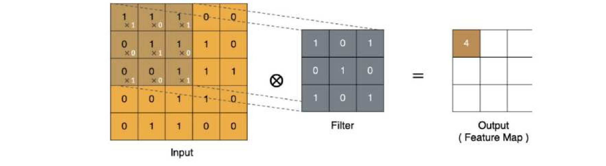
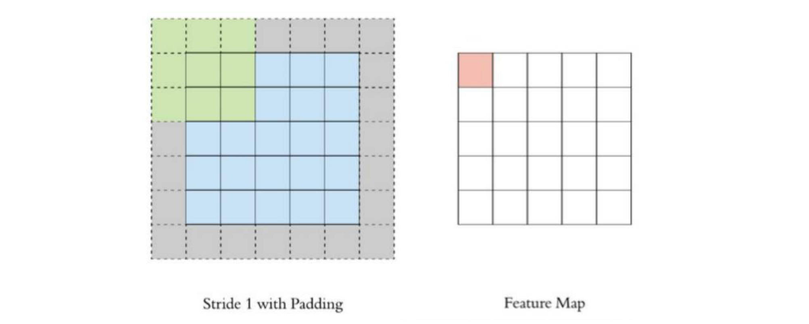
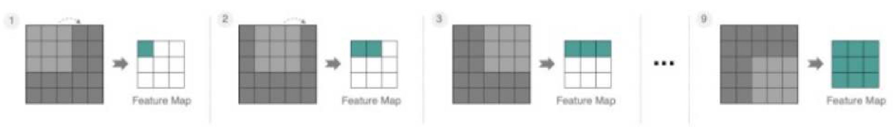
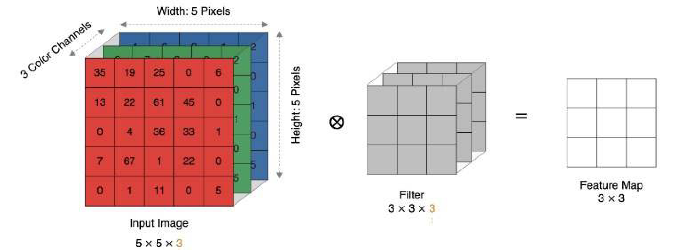
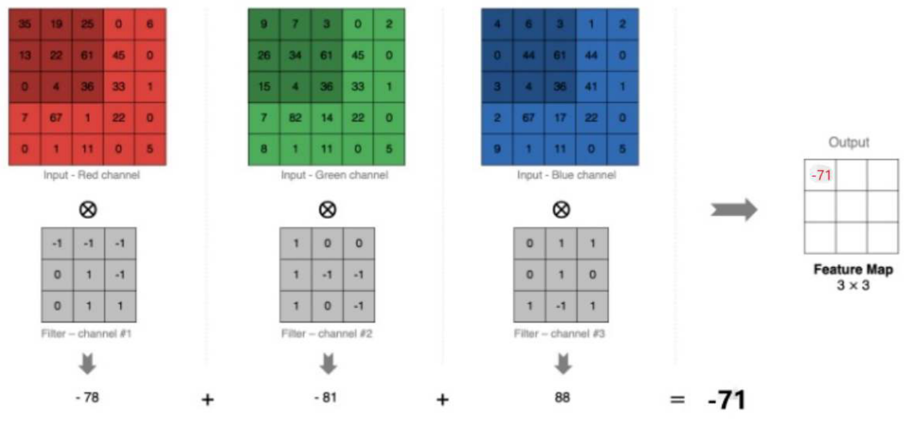
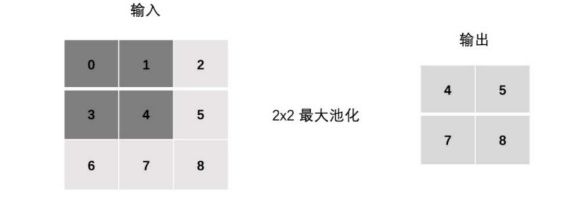
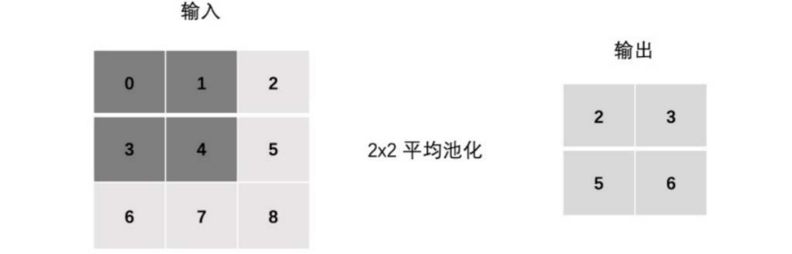

# 卷积神经网络CNN1

前置知识：图像

颜色在计算机中的表示：

- 灰度图像
  - 每一个像素点只有一个值，这个值代表其亮度
  - 这个值的范围是0~255, 0代表纯黑，255代表纯白
  - 因此，一张28×28的图片，在计算机中对应的就是一个28×28的二维数组
- 彩色图像
  - 每个像素点由三个值组成，分别代表红（Red）、绿（Green）、蓝（Blue）三个通道的亮度，即RGB
  - 每个通道的值也通常在 0到 255 之间
  - 因此，一幅大小为 28×28 的彩色图像，就对应一个 28 × 28 × 3 的三维数组

> **注意：图像存储的两种约定**
>
> 上面描述的 `(H, W, C)` 即 (高度, 宽度, 通道) 是人理解图像的方式，也是 PIL 等图片库的存储格式。
> 但在 PyTorch 中，张量的形状约定是 `(C, H, W)` ——通道在最前面。这是因为 GPU 上的矩阵运算按通道并行计算更高效。
> `transforms.ToTensor()` 做的事情之一就是把 `(H, W, C)` 转成 `(C, H, W)`。加上 batch 维度后，代码中常见的四维张量形状为 `(N, C, H, W)`（N = batch size，一批几张图片）。
> 下文代码中的 `(1, 28, 28)` 即是 PyTorch 的 `(C, H, W)` 格式。

**为什么不用全连接（Linear）神经网络来处理图像？**

- 参数爆炸：以224×224×3的彩色图像为例，如果我们把它展平为一个向量，那么向量的长度 = 224×224×3 = 150528。如果下一个连接层有1000个神经元，那么仅仅这一层的参数就有 150528000个。这会**导致模型巨大，训练困难，且容易过拟合**
- 丢失空间信息：图像的空间结构（比如一个像素点和它相邻的像素点之间的关系）对于理解图像内容至关重要。全连接网络将所有的像素视为独立的输入，完全破坏了这种空间关系

**卷积神经网络（Convolutional Neural Network**, **CNN）** 是一种专门设计用于处理具有网格结构数据（如图像、语音 spectrogram）的深度学习模型

CNN网络主要由三部分构成：卷积层、池化层和全连接层构成：

- 卷积层负责提取图像中的局部特征
- 池化层通过下采样减少特征图的空间尺寸，从而间接减少后续层（尤其是全连接层）的参数量和计算量
- 全连接层用来输出想要的结果


如上图所示：

- 汽车图片就是输入数据，是一个三维数组（H、W、C）
- CONV就是卷积层，卷积层的激活函数一般使用ReLU

> **为什么卷积后面要跟激活函数（如 ReLU）？**
>
> 卷积运算是**线性的**（乘加运算），多层线性变换的复合仍然等价于一个线性变换。这意味着不管堆多少层卷积，模型的表达能力都和一层没有区别。激活函数通过引入"拐弯"（非线性），让网络能学习复杂的模式。类比：一根铁丝永远是直的，有了折弯才能弯成各种形状。
>
> ReLU 的公式为 `f(x) = max(0, x)`：正数保持不变，负数直接变 0。它计算简单、梯度不衰减（正数区梯度恒为 1），因此成为 CNN 中最常用的激活函数。
- POOL就是池化层，一般用来降维
- 在经过卷积层和池化层处理之后，FC就是全连接层，用来整合特征并且输出想要的结果

## 卷积层

**核心组件——卷积核：** 卷积核是一个比输入图像小的二维矩阵，包含了一组可学习的权重参数

**工作原理：**

- 将卷积核的左上角与输入特征图的左上角对齐
- 计算卷积核与输入特征图对应位置元素的乘积之和（这是一个点积操作）
- 将计算结果作为输出特征图（Feature Map）对应位置的一个像素值
- 按照一定的**步长** (**Stride**)，将卷积核在输入特征图上滑动，并重复步骤 2 和 3，直到整个输入特征图都被扫描完毕

### 卷积的计算过程


- input 表示输入的图像
- filter 表示滤波器，也叫做卷积核（滤波矩阵）
- input 经过 filter 得到输出为最右侧的图像，该图叫做特征图

**在 CNN 中，卷积运算在实现上更接近互相关操作，即对局部区域与卷积核做逐元素乘加（点积）计算**

> **为什么叫"卷积"但实际做的是"互相关"？**
>
> 数学上的**卷积（Convolution）**要求先把卷积核上下左右翻转 180°，再滑动做点积。而深度学习框架（PyTorch/TensorFlow）中实际做的是**互相关（Cross-Correlation）**——**不翻转**，直接滑动点积。
>
> 那为什么不做真正的卷积？因为卷积核的权重是**学出来的**——翻不翻转没有区别，反正权重会自动调整到合适的值。不翻转还省了一步计算。所以"卷积神经网络"这个名字是历史沿袭，实际运算更准确地说应该是互相关。



最后的特征图结果为：


### Padding

通过上面的卷积计算过程，我们发现：

- 最终的特征图比原始图像小
- 输入边缘被扫描的次数少，输入中间被扫描的次数多

为了解决以上两个问题，我们可以在输入边缘加上填充（在周围加一圈的像素点，像素点的值为0，可以保证图像尺寸不变）：



### Stride

步长：每次移动的像素点数

在上面卷积核移动扫描的过程中，步长为1，计算特征图如下所示：



如果把步长增大为2，也是可以提取特征图的，如下图所示：


### 多通道卷积计算

**输入图像是几通道的，卷积核就是几通道的**





### 多卷积核计算

**有几个卷积核，就有几个特征图，每一个卷积核对应一个特征图，输出的通道数等于卷积核的个数**


> **常见误区辨析：卷积核的"维度"到底是多少？**
>
> 初学者常困惑：每个卷积核是 2D（如 3×3）还是 3D（如 3×3×M）？
>
> **答案**：每个卷积核实际上是 **3D** 的，形状为 `(K, K, M)`（M = 输入通道数）。它在空间上是 K×K，但深度上覆盖所有输入通道。
> 那为什么图示里常画成 2D？因为**一张图只画了单通道的情况**（M=1），此时 3D 退化为 2D。
>
> - 一个卷积核在 H×W 上滑动，同时对 M 个通道做加权求和 → 输出 **1 个**通道
> - N 个卷积核 → 输出 **N 个**通道
> - 所以 `nn.Conv2d(in_channels=M, out_channels=N, kernel_size=K)` 的实际参数量 = **K × K × M × N**（+ N 个 bias，如果 bias=True）
>
> 至此，可以理解 PyTorch 的卷积层参数：`Conv2d(in_channels, out_channels, kernel_size)` 中，`in_channels` 决定了每个卷积核的深度，`out_channels` 决定了有多少个不同的卷积核。

### 特征图的大小

特征图的大小与以下的参数息息相关：

- 卷积核的大小，一般设置为奇数，比如 1×1，3×3，5×5

> **为什么卷积核尺寸一般取奇数？**
>
> - 奇数核有**明确的中心点**，方便对齐。比如 3×3 的中心是 (1,1)，5×5 的中心是 (2,2)。
> - **方便做 padding**：3×3 的核配 padding=1，5×5 的核配 padding=2，就能对称地在四周补零，保持输出尺寸不变。偶数核找不到对称的中心，padding 会不对称。

- Padding：零填充的层数

-  Stride：步长

假如输入图像为方形：

- 输入图像大小 W×W
- 卷积核大小：K×K
- 步长Stride → S
- 填充Padding → P
- 输出图像大小：N×N

特征图的计算公式：
$$
N=\frac{W-K+2P}{S}+1
$$

> **注意：整除和取整**
>
> 当 `(W - K + 2P)` 不能被 `S` 整除时，PyTorch / TensorFlow 会**向下取整（floor）**。比如 W=32, K=3, P=0, S=2：
>
> $$N = \lfloor\frac{32-3+0}{2}\rfloor + 1 = \lfloor 14.5 \rfloor + 1 = 14 + 1 = 15$$
>
> 这就是为什么示例代码中 `(1, 3, 32, 32)` 经过 `kernel_size=3, stride=2` 卷积后变成 `(1, 8, 15, 15)` 而不是 15.5。

### 示例

```python
import torch
import torch.nn as nn

x = torch.randn(1, 3, 32, 32)  # 创建一个随机张量，形状为 (batch=1, channels=3, height=32, width=32)
print("输入x的shape:", x.shape)  # torch.Size([1, 3, 32, 32])

conv = nn.Conv2d(in_channels=3, out_channels=8, kernel_size=3, stride=2, padding=0)  # 创建二维卷积层：输入3通道，输出8通道，3×3卷积核，步长2，无填充
y = conv(x)  # 对输入x执行卷积操作，得到输出y
print("卷积后y的shape:", y.shape)  # torch.Size([1, 8, 15, 15])
```

## 池化层

池化层通常紧跟在卷积层之后，用于**对特征图进行下采样（Downsampling）**

目的是对特征图进行降维，从而缩减图像大小，提高模型计算速度

主要作用：

- **减少特征图的空间尺寸**：缩小宽度和高度，从而减少后续层的计算量和参数数量
- **保留关键信息**：通过聚合一个局部区域的信息（如取最大值或平均值），保留该区域的主要特征
- **增加平移不变性** (**Translation Invariance**)：轻微移动输入图像，池化后的输出可能保持不变或变化很小

> **平移不变性的直观理解：**
>
> 最大池化在 2×2 窗口内取最大值——只要某个特征（如边缘、纹理）出现在这个窗口内的**任意位置**，就会被捕获。特征具体在窗口内的哪个像素位置并不重要。这让模型更关注"有没有这个特征"而不是"特征在哪个精确坐标"。举例：一张猫的图片，猫在画面中间还是稍微偏左一点，池化后的输出大概率相似。

工作原理：

与卷积操作类似，池化层也使用一个 “池化窗口”（如2x2），并按照指定的**步长(Stride)** 在特征图上滑动

不同之处在于，池化窗口内执行的是聚合操作（取最大或平均），而不是卷积操作

### 池化层的计算过程

- **最大池化 (Max Pooling)**：在一个局部区域（如2x2 ），取所有元素的最大值作为输出

  这是最常用的池化方式，因为它能很好地保留纹理和边缘等显著特征

  作用：能够抑制网络参数误差造成的估计均值偏移的现象

  

- **平均池化** (**Average Pooling**)：在一个局部区域内，取所有元素的平均值作为输出

  它能保留区域的整体强度信息，但可能会使特征变得模糊

  作用：主要用来抑制邻域值之间差别过大，造成的方差过大

  

### Stride

池化层的步长与卷积层一样


### Padding

在特殊情况下，池化层也可以使用 padding 来控制输出尺寸，但在实际模型中，池化层通常用于缩小特征图大小


### 多通道池化计算

池化层与卷积层在多通道处理上有所不同：池化窗口在**每个通道上独立滑动**，不跨通道聚合，因此**输出通道数 = 输入通道数**。而卷积层中，每个卷积核会对所有输入通道做加权求和，输出为 1 个特征图。


### 示例

```python
import torch
import torch.nn as nn

x = torch.randn(1, 3, 32, 32)  # 创建一个随机张量，形状为 (batch=1, channels=3, height=32, width=32)

print("输入x的shape:", x.shape)  # torch.Size([1, 3, 32, 32])

maxpool = nn.MaxPool2d(kernel_size=2, stride=2)  # 创建最大值池化层：2×2窗口，步长2
y_max = maxpool(x)  # 对输入x执行最大值池化，取每个窗口内的最大值
print("最大值池化后y_max的shape:", y_max.shape)  # torch.Size([1, 3, 16, 16])

avgpool = nn.AvgPool2d(kernel_size=2, stride=2)  # 创建平均值池化层：2×2窗口，步长2
y_avg = avgpool(x)  # 对输入x执行平均值池化，取每个窗口内的平均值
print("平均值池化后y_avg的shape:", y_avg.shape)  # torch.Size([1, 3, 16, 16])
```

**注意：池化不改变通道数**

## 深度可分离卷积

深度可分离卷积（Depthwise Separable Convolution）是 MobileNet、Xception 等轻量级网络的核心组件。它将标准卷积拆成两步：**Depthwise（逐通道空间滤波）** + **Pointwise（1×1 通道融合）**，大幅减少参数量和计算量。

### 前置概念：感受野（Receptive Field）

感受野（也叫视野域）：特征图上一个像素点能"看到"的原始输入像素的范围大小。


一层 5×5 卷积和两层堆叠的 3×3 卷积，最终的感受野都是 5×5——但两层 3×3 的参数量更少（18 vs 25），而且中间还能多加一个 ReLU 非线性变换。因此现代 CNN 普遍使用多个小卷积核（如 3×3）堆叠，而非一个大卷积核。

> **直觉类比**：用大网捞鱼 vs 用两层小网接力——最终覆盖的"视野"一样大，但两层小网更灵活，中间还能加一道"筛选"（ReLU）。

### 标准卷积做两件事

标准卷积的每个卷积核**同时在两个维度上操作**：
1. **空间维度**（H × W）：在图像平面上滑动，提取局部特征
2. **通道维度**（C）：对所有输入通道做加权求和，融合信息

深度可分离卷积的思路就是——**把这两件事拆开，各干各的**。

### Depthwise（逐通道卷积）

每个输入通道分配一个独立的卷积核，只在空间维度上滑动。**不同通道之间互不干扰**。


如上图所示：每个输出通道只与对应的那一个输入通道相关联。输入 M 个通道 → 输出 M 个特征图（通道数不变）。

> **关键区别**：标准卷积中，一个输出通道 = 所有输入通道的加权和；Depthwise 中，一个输出通道 = 仅对应输入通道的空间滤波结果。

### Pointwise（逐点卷积 / 1×1 卷积）

Depthwise 只在各自通道内做空间滤波，没有通道间的信息交流。Pointwise 用 N 个 1×1×M 的卷积核，在"像素点"级别对所有 M 个通道做线性组合，最终输出 N 个通道。**1×1 卷积不改变空间尺寸，只改变通道数。**

> **类比**：Depthwise 好比给 M 张纸各自画花纹，Pointwise 好比把 M 张纸叠在一起用不同配比混合出 N 张新纸。

## 卷积计算量

- 普通卷积计算量：
  $$
  Dk \times Dk \times M \times N \times DF \times DF
  $$

  - DK：卷积核的大小
  - M：输入通道数
  - N：输出通道数
  - DF：feature map（输出特征图）尺寸

- 深度可分离卷积计算

  - **Depthwise：**
    $$
    DK \times Dk \times M \times DF \times DF
    $$

  - **Pointwise(1x1卷积)：**
    $$
    M \times N \times DF \times DF
    $$

- 参数减少量比例：
  $$
  (Dk \times DK \times M + M \times N) / (DK \times Dk \times M \times N) = 1/N + 1/(Dk \times Dk)
  $$

- 计算量减少比例（深度可分离卷积 / 普通卷积）：
  $$
  \frac{DK \times Dk \times M \times DF \times DF + M \times N \times DF \times DF}{DK \times Dk \times M \times N \times DF \times DF} = \frac{1}{N} + \frac{1}{Dk \times Dk}
  $$

> **具体数值举例**：假设 Dk=3, M=64, N=128, DF=32
>
> - 普通卷积计算量：3×3×64×128×32×32 ≈ **75,497,472**
> - 深度可分离：Depthwise(3×3×64×32×32) + Pointwise(64×128×32×32) = 589,824 + 8,388,608 = **8,978,432**
> - 减少比例 ≈ **11.9%**（即计算量降为原来的约 1/8.4）
>
> 验证公式：1/128 + 1/9 ≈ 0.0078 + 0.1111 = 0.1189 ✓

## [示例-FashionMNIST](https://www.kaggle.com/datasets/zalando-research/fashionmnist)

```python
"""
FashionMNIST 分类 —— 使用 PyTorch CNN 卷积神经网络
========================================================
本脚本实现了 FashionMNIST 数据集的 10 分类任务（CNN 版本），包括：
1. 数据加载与预处理
2. 数据可视化
3. 训练集均值/标准差计算与标准化
4. 卷积神经网络（CNN）模型构建（ReLU 激活）
5. 模型参数统计
6. Trainer 通用训练器类（含早停、TensorBoard、绘图）
7. 模型训练与验证（ReLU 版 CNN）
8. 测试集评估（ReLU 版 CNN）
9. SELU 版 CNN 模型构建（自归一化激活函数）
10. SELU 模型训练与评估
11. 深度可分离卷积 (Depthwise Separable Convolution) 模块定义
12. 深度可分离卷积版 CNN 模型构建与参数统计
13. 深度可分离卷积版模型训练与评估
14. ReLU vs SELU vs Separable-CNN 三模型对比总结
"""

import torch  # PyTorch 核心库，提供张量运算与自动求导
import torch.nn as nn  # 神经网络模块，提供 Conv2d、Linear、ReLU 等层
import torch.optim as optim  # 优化器模块，提供 SGD、Adam 等
from torchvision import datasets, transforms  # 提供常用数据集与数据预处理变换
import matplotlib.pyplot as plt  # 绘图库，用于数据可视化与训练曲线绘制
from matplotlib import rcParams  # matplotlib 配置字典，用于设置全局绘图参数
import os  # 操作系统接口，用于创建目录、判断文件是否存在等
from torch.utils.tensorboard import SummaryWriter  # TensorBoard 写入器，用于记录训练日志

# 设置中文字体，防止 matplotlib 中文显示为方块
rcParams['font.sans-serif'] = ['SimHei']  # 使用黑体
rcParams['axes.unicode_minus'] = False  # 正常显示负号

# ============================================================
# 1. 数据加载与预处理
# ============================================================

# 定义数据预处理流程
# transforms.Compose: 将多个 transform 操作组合在一起，按顺序执行
# transforms.ToTensor(): 将 PIL.Image (0-255) 转换为 torch.Tensor (0.0-1.0)，并将 H×W×C 变为 C×H×W
transform = transforms.Compose([
    transforms.ToTensor(),  # 将 PIL 图片转为 0.0-1.0 的张量
])

# 下载并加载 FashionMNIST 训练集
# root: 数据存放目录
# train=True: 加载训练集（60,000 张）
# download=False: 不重新下载（若已下载过；首次使用需设为 True）
# transform: 对每张图片施加的预处理操作
full_train_dataset = datasets.FashionMNIST(
    root='./data',  # 数据集存储路径
    train=True,  # True=训练集, False=测试集
    download=False,  # 是否下载数据集（首次需设为 True）
    transform=transform  # 数据预处理变换
)

# 从训练集中分出 5000 张作为验证集
# 总训练样本 60,000 → 训练集 55,000 + 验证集 5,000
train_size = len(full_train_dataset) - 5000  # 训练集大小: 55000
val_size = 5000  # 验证集大小: 5000

# random_split: 将数据集随机打乱后按指定长度切分，避免验证集与训练集分布不同
# generator: 随机数生成器，用于控制切分时的打乱顺序
#   - torch.Generator(): 创建一个新的随机数生成器实例（独立于全局默认生成器，互不干扰）
#   - .manual_seed(42): 手动设置随机种子为 42，使生成的随机序列固定
#     作用: 保证每次运行脚本时，数据集的切分方式完全一致
#           → 训练集/验证集划分结果可复现，便于调试与结果对比
#     若不指定 generator，random_split 会使用全局随机状态，每次运行划分不同，结果难以复现
#   - "42" 是机器学习社区常用的种子值，任意整数均可
generator = torch.Generator().manual_seed(42)  # 创建固定种子的随机数生成器
train_dataset, val_dataset = torch.utils.data.random_split(
    full_train_dataset,  # 原始数据集
    [train_size, val_size],  # 切分后各部分长度
    generator=generator  # 传入生成器，使切分结果可复现
)

# DataLoader: 将数据集包装成可迭代的批量加载器
# batch_size=64: 每个 batch 包含 64 张图片
# shuffle=True: 每个 epoch 打乱数据顺序，防止模型记忆样本顺序（验证/测试集不需要）
train_loader = torch.utils.data.DataLoader(
    train_dataset,  # 训练集
    batch_size=64,  # 批量大小，影响训练速度和梯度稳定性
    shuffle=True  # 是否在每个 epoch 打乱数据
)
val_loader = torch.utils.data.DataLoader(
    val_dataset,  # 验证集
    batch_size=64,  # 批量大小
    shuffle=False  # 验证集不需要打乱
)

# 下载并加载 FashionMNIST 测试集（10,000 张）
test_dataset = datasets.FashionMNIST(
    root='./data',  # 数据集存储路径
    train=False,  # False 表示加载测试集
    download=False,  # 是否下载数据集
    transform=transform  # 数据预处理变换
)
test_loader = torch.utils.data.DataLoader(
    test_dataset,  # 测试集
    batch_size=64,  # 批量大小
    shuffle=False  # 测试集不需要打乱
)

# 打印各数据集样本数
print("训练集样本数：", len(train_dataset))  # 55000
print("验证集样本数：", len(val_dataset))  # 5000
print("测试集样本数：", len(test_dataset))  # 10000

# 查看 10 个类别名称
# 0: T-shirt/top, 1: Trouser, 2: Pullover, 3: Dress, 4: Coat
# 5: Sandal, 6: Shirt, 7: Sneaker, 8: Bag, 9: Ankle boot
class_names = full_train_dataset.classes  # 获取类别名称列表
print("类别名称:", class_names)  # 打印类别名称

# ============================================================
# 2. 数据可视化
# ============================================================

# 可视化训练集前 15 个样本，查看图片内容与对应标签
fig, axs = plt.subplots(3, 5, figsize=(15, 10))  # 创建 3×5 子图，画布大小 15×10 英寸
axs = axs.flatten()  # 将 2D 轴数组展平为 1D，方便索引

for i in range(15):  # 遍历前 15 个样本
    img, label = train_dataset[i]  # img 形状: (1, 28, 28) 即 (C, H, W)，label 是 0-9 的整数
    img = img.squeeze().numpy()  # squeeze() 去掉通道维度 → (28, 28)，再转 numpy
    axs[i].imshow(img, cmap='gray')  # 以灰度图方式显示
    axs[i].set_title(class_names[label])  # 标题为对应的类别名称
    axs[i].axis('off')  # 隐藏坐标轴

plt.tight_layout()  # 自动调整子图间距，避免重叠
plt.savefig('可视化train_dataset前15个样本_cnn.png')  # 保存图片
plt.show()  # 显示图像

# 查看数据集基本信息
# train_dataset 总共 55000 个样本，每个样本是一个 (image_tensor, label) 元组
print("训练集类型:", type(train_dataset))  # <class 'torch.utils.data.dataset.Subset'>
print("训练集样本总数:", len(train_dataset))  # 55000
print("单张图片的 shape (C, H, W):", train_dataset[0][0].shape)  # torch.Size([1, 28, 28])
print("第一张图片的标签编号:", train_dataset[0][1])  # 某个 0-9 的整数

# ============================================================
# 3. 计算训练集的均值和标准差（用于后续标准化 Normalization）
# ============================================================
# 标准化公式: x_norm = (x - mean) / std
# 计算前需先把所有样本堆叠成一个大 tensor，再按公式求均值与方差。
# 注意: 这里统计的是 train_dataset（已切分后的 55000 张），而非 full_train_dataset。
#       若显存不足，可改用分批累加的方式计算，避免一次性加载全部图片。

# 将 train_dataset 中每张图片取出，组成列表；每个元素 shape 为 (1, 28, 28)
all_imgs = [train_dataset[i][0] for i in range(len(train_dataset))]  # 列表推导式收集所有图片张量

# torch.stack: 沿新维度(第0维)把列表中的张量堆叠起来
# 堆叠后 shape: (样本数 N, 1, 28, 28)
all_imgs = torch.stack(all_imgs)  # 将所有图片堆叠为一个大张量

# view(-1): 将任意 shape 的张量展平为一维（共 N*1*28*28 个像素值）
# -1 表示该维度由系统根据元素总数自动推断
all_imgs_flat = all_imgs.view(-1)  # 展平为一维张量

# 计算所有像素值的均值: mean = (1/n) * Σ xi
mean = all_imgs_flat.mean().item()  # .item() 将标量张量转为 Python float

# 计算 (xi^2) 的均值: mean_of_squares = (1/n) * Σ xi^2
mean_of_squares = (all_imgs_flat ** 2).mean().item()  # 平方后再求均值

# 按方差公式计算: Var = E[X^2] - (E[X])^2 = mean(x^2) - mean(x)^2
# 该公式等价于 Σ(xi - mean)^2 / n，但计算更高效（无需二次遍历）
var = mean_of_squares - mean ** 2  # 方差 = 平方的均值 - 均值的平方

print("Train dataset mean:", mean)  # 训练集像素均值（ToTensor 后约 0.2860）
print("Train dataset variance:", var)  # 训练集像素方差

# 标准差 = 方差的算术平方根
std = var ** 0.5  # 开平方根得到标准差
print("Train dataset std:", std)  # 训练集像素标准差（约 0.3530）

# ---- 用计算出的 mean/std 构建带标准化的 transform ----
# transforms.Normalize(mean, std): 对每个通道逐元素做 (x - mean) / std
#   - FashionMNIST 为单通道灰度图，故 mean/std 各传一个值，写成单元素元组 (mean,) (std,)
#   - 归一化后像素分布变为均值 0、方差 1，输入尺度统一，有助于模型更快收敛
#   - 顺序很重要: 必须先 ToTensor()（转为 0-1 浮点）再 Normalize()，不能反
transform = transforms.Compose([
    transforms.ToTensor(),  # 先把 PIL 图片转为 0.0-1.0 的张量
    transforms.Normalize((mean,), (std,))  # 再标准化: x_norm = (x - mean) / std
])

# 将新的 transform 重新挂载到已加载的数据集上
#   - 数据集在 __getitem__ 时才按"当前" self.transform 处理图片，
#     因此无需重新加载数据，直接重新赋值即可让后续迭代生效
#   - train_dataset / val_dataset 是 random_split 产生的 Subset，
#     其 __getitem__ 会委托给底层 full_train_dataset，所以只需修改
#     full_train_dataset.transform，训练集与验证集会同步生效
full_train_dataset.transform = transform  # 训练集与验证集（Subset 共享底层）同步生效
test_dataset.transform = transform  # 测试集也使用相同的标准化参数

print(f"已应用标准化: Normalize(mean={mean:.4f}, std={std:.4f})")  # 打印确认

# ============================================================
# 4. CNN 模型定义（带调试打印版，用于理解数据流动）
# ============================================================

class CNNModelDebug(nn.Module):
    """
    CNN 卷积神经网络（带 shape 打印，便于理解各层数据流）
    结构概述:
      输入 (1, 28, 28) 灰度图
      → 第一组: Conv→ReLU→Conv→ReLU→MaxPool (28→14)
      → 第二组: Conv→ReLU→Conv→ReLU→MaxPool (14→7)
      → 第三组: Conv→ReLU→Conv→ReLU→MaxPool (7→3)
      → 展平 → FC(128*3*3, 128) → ReLU → FC(128, 10)
    """

    def __init__(self):
        super().__init__()  # 调用父类 nn.Module 的构造函数
        # ====== 第一组卷积 + 池化 ======
        # nn.Conv2d(输入通道, 输出通道, kernel_size, padding): 二维卷积层
        #   - in_channels=1: FashionMNIST 是单通道灰度图
        #   - out_channels=32: 使用 32 个卷积核，输出 32 个特征图
        #   - kernel_size=3: 3×3 卷积核
        #   - padding=1: 在输入四周各补 1 圈 0，保持空间尺寸不变 (28→28)
        self.conv1 = nn.Conv2d(1, 32, kernel_size=3, padding=1)  # (1,28,28)→(32,28,28)
        self.relu1 = nn.ReLU()  # ReLU 激活函数: f(x)=max(0,x)，引入非线性
        self.conv2 = nn.Conv2d(32, 32, kernel_size=3, padding=1)  # (32,28,28)→(32,28,28)
        self.relu2 = nn.ReLU()  # ReLU 激活
        # nn.MaxPool2d(kernel_size, stride): 最大池化层，下采样缩小特征图
        #   - kernel_size=2: 在 2×2 窗口中取最大值
        #   - stride=2: 滑动步长 2，尺寸减半 (28→14)
        self.pool1 = nn.MaxPool2d(kernel_size=2, stride=2)  # (32,28,28)→(32,14,14)

        # ====== 第二组卷积 + 池化 ======
        self.conv3 = nn.Conv2d(32, 64, kernel_size=3, padding=1)  # (32,14,14)→(64,14,14)
        self.relu3 = nn.ReLU()  # ReLU 激活
        self.conv4 = nn.Conv2d(64, 64, kernel_size=3, padding=1)  # (64,14,14)→(64,14,14)
        self.relu4 = nn.ReLU()  # ReLU 激活
        self.pool2 = nn.MaxPool2d(kernel_size=2, stride=2)  # (64,14,14)→(64,7,7)

        # ====== 第三组卷积 + 池化 ======
        self.conv5 = nn.Conv2d(64, 128, kernel_size=3, padding=1)  # (64,7,7)→(128,7,7)
        self.relu5 = nn.ReLU()  # ReLU 激活
        self.conv6 = nn.Conv2d(128, 128, kernel_size=3, padding=1)  # (128,7,7)→(128,7,7)
        self.relu6 = nn.ReLU()  # ReLU 激活
        self.pool3 = nn.MaxPool2d(kernel_size=2, stride=2)  # (128,7,7)→(128,3,3)

        # ====== 全连接分类器 ======
        # 展平后输出尺寸: 128 通道 × 3 高度 × 3 宽度 = 1152 维
        self.fc1 = nn.Linear(128 * 3 * 3, 128)  # 全连接层: 1152 → 128
        self.relu_fc = nn.ReLU()  # ReLU 激活
        self.fc2 = nn.Linear(128, 10)  # 输出层: 128 → 10（10 个类别 logits）

    def forward(self, x):
        """前向传播（包含调试打印）"""
        # ====== 第一组 ======
        print("Input shape:", x.shape)  # 例如 (4, 1, 28, 28)
        x = self.conv1(x)  # 卷积 → (4, 32, 28, 28)
        print("After conv1:", x.shape)  # (4, 32, 28, 28)
        x = self.relu1(x)  # ReLU 激活
        print("After relu1:", x.shape)  # (4, 32, 28, 28)
        x = self.conv2(x)  # 卷积 → (4, 32, 28, 28)
        print("After conv2:", x.shape)  # (4, 32, 28, 28)
        x = self.relu2(x)  # ReLU 激活
        print("After relu2:", x.shape)  # (4, 32, 28, 28)
        x = self.pool1(x)  # 最大池化 → (4, 32, 14, 14)
        print("After pool1:", x.shape)  # (4, 32, 14, 14)

        # ====== 第二组 ======
        x = self.conv3(x)  # 卷积 → (4, 64, 14, 14)
        print("After conv3:", x.shape)  # (4, 64, 14, 14)
        x = self.relu3(x)  # ReLU 激活
        print("After relu3:", x.shape)  # (4, 64, 14, 14)
        x = self.conv4(x)  # 卷积 → (4, 64, 14, 14)
        print("After conv4:", x.shape)  # (4, 64, 14, 14)
        x = self.relu4(x)  # ReLU 激活
        print("After relu4:", x.shape)  # (4, 64, 14, 14)
        x = self.pool2(x)  # 最大池化 → (4, 64, 7, 7)
        print("After pool2:", x.shape)  # (4, 64, 7, 7)

        # ====== 第三组 ======
        x = self.conv5(x)  # 卷积 → (4, 128, 7, 7)
        print("After conv5:", x.shape)  # (4, 128, 7, 7)
        x = self.relu5(x)  # ReLU 激活
        print("After relu5:", x.shape)  # (4, 128, 7, 7)
        x = self.conv6(x)  # 卷积 → (4, 128, 7, 7)
        print("After conv6:", x.shape)  # (4, 128, 7, 7)
        x = self.relu6(x)  # ReLU 激活
        print("After relu6:", x.shape)  # (4, 128, 7, 7)
        x = self.pool3(x)  # 最大池化 → (4, 128, 3, 3)
        print("After pool3:", x.shape)  # (4, 128, 3, 3)

        # ====== 展平 + 全连接 ======
        # torch.flatten(x, 1): 从第 1 维开始展平（保留 batch 维不变）
        # (4, 128, 3, 3) → (4, 128*3*3) = (4, 1152)
        x = torch.flatten(x, 1)  # 展平: 保留 batch 维度，后三维展为向量
        print("After flatten:", x.shape)  # (4, 1152)
        x = self.fc1(x)  # 全连接: (4, 1152) → (4, 128)
        print("After fc1:", x.shape)  # (4, 128)
        x = self.relu_fc(x)  # ReLU 激活
        print("After relu_fc:", x.shape)  # (4, 128)
        x = self.fc2(x)  # 输出层: (4, 128) → (4, 10)
        print("After fc2 (output):", x.shape)  # (4, 10)
        return x  # 返回 logits


# 用随机数据测试调试版模型的数据流
# batch_size=4，单通道 28×28 的随机输入
sample_input = torch.randn(4, 1, 28, 28)  # 创建随机输入张量
model_debug = CNNModelDebug()  # 实例化调试版 CNN 模型
output = model_debug(sample_input)  # 前向传播，观察各层 shape 变化
print("前向计算输出 shape:", output.shape)  # torch.Size([4, 10])

print()  # 空行分隔

# 用真实 batch 数据测试（查看 batch 维度的数据流）
for images, labels in train_loader:  # 取一个 batch
    print("images shape:", images.shape)  # (64, 1, 28, 28) = (batch_size, channel, height, width)
    print("labels shape:", labels.shape)  # (64,) = 64 个标签
    break  # 只取第一个 batch

output = model_debug(images)  # 用真实数据前向传播
print("Logits shape:", output.shape)  # (64, 10) = 64 个样本，每个样本输出 10 个类别分数

# ============================================================
# 5. 模型参数统计
# ============================================================

print("\n========== 模型参数统计 ==========")  # 打印分隔标题
for name, param in model_debug.named_parameters():  # 遍历模型所有命名参数
    # param.numel(): 返回该参数张量的元素总数 (number of elements)
    print(f"Name: {name}, Shape: {param.shape}, Number of params: {param.numel()}")  # 打印参数名、形状和元素数

# 计算总参数量: 遍历所有参数，累加元素个数
total_params = sum(p.numel() for p in model_debug.parameters())  # 总参数量累加
print(f"Total number of parameters: {total_params}")  # 约 435,306

# 手动验证: conv1.weight 参数量 = 32 * 1 * 3 * 3 = 288
print(f"验证 conv1.weight 参数量: 32 * 1 * 3 * 3 = {32 * 1 * 3 * 3}")  # 288

# ============================================================
# 6. 正式 CNN 模型定义（纯推理版，无调试打印）
# ============================================================

class CNNModel(nn.Module):
    """
    CNN 卷积神经网络（正式版，无调试打印）
    结构: 三组 (Conv→ReLU→Conv→ReLU→MaxPool) + Flatten + FC→ReLU→FC
    输入: (batch, 1, 28, 28) 灰度图
    输出: (batch, 10) 类别 logits
    参数量计算:
      conv1: 1×32×3×3 + 32 = 288 + 32 = 320
      conv2: 32×32×3×3 + 32 = 9,216 + 32 = 9,248
      conv3: 32×64×3×3 + 64 = 18,432 + 64 = 18,496
      conv4: 64×64×3×3 + 64 = 36,864 + 64 = 36,928
      conv5: 64×128×3×3 + 128 = 73,728 + 128 = 73,856
      conv6: 128×128×3×3 + 128 = 147,456 + 128 = 147,584
      fc1:   1152×128 + 128 = 147,456 + 128 = 147,584
      fc2:   128×10 + 10 = 1,280 + 10 = 1,290
      总计: 约 435,306
    """

    def __init__(self):
        super().__init__()  # 调用父类 nn.Module 的构造函数

        # ====== 第一组卷积 + 池化 (28→14) ======
        # 第一层卷积: 1 通道 → 32 通道，kernel=3，padding=1 保持尺寸不变
        self.conv1 = nn.Conv2d(1, 32, kernel_size=3, padding=1)
        # ReLU 激活函数: f(x) = max(0, x)，保留正值，抑制负值，增加非线性表达能力
        self.relu1 = nn.ReLU()
        # 第二层卷积: 32 → 32，进一步提取特征
        self.conv2 = nn.Conv2d(32, 32, kernel_size=3, padding=1)
        self.relu2 = nn.ReLU()
        # 最大池化: 2×2 窗口，步长 2，将 28×28 降采样为 14×14
        self.pool1 = nn.MaxPool2d(kernel_size=2, stride=2)

        # ====== 第二组卷积 + 池化 (14→7) ======
        # 第三层卷积: 32 → 64，增加通道数以提取更丰富的特征
        self.conv3 = nn.Conv2d(32, 64, kernel_size=3, padding=1)
        self.relu3 = nn.ReLU()
        # 第四层卷积: 64 → 64
        self.conv4 = nn.Conv2d(64, 64, kernel_size=3, padding=1)
        self.relu4 = nn.ReLU()
        # 最大池化: 14×14 → 7×7
        self.pool2 = nn.MaxPool2d(kernel_size=2, stride=2)

        # ====== 第三组卷积 + 池化 (7→3) ======
        # 第五层卷积: 64 → 128
        self.conv5 = nn.Conv2d(64, 128, kernel_size=3, padding=1)
        self.relu5 = nn.ReLU()
        # 第六层卷积: 128 → 128
        self.conv6 = nn.Conv2d(128, 128, kernel_size=3, padding=1)
        self.relu6 = nn.ReLU()
        # 最大池化: 7×7 → 3×3（7/2 向下取整 = 3）
        self.pool3 = nn.MaxPool2d(kernel_size=2, stride=2)

        # ====== 全连接分类器 ======
        # 展平后尺寸: 128 通道 × 3 × 3 = 1152
        self.fc1 = nn.Linear(128 * 3 * 3, 128)  # 全连接: 1152 → 128
        self.relu_fc = nn.ReLU()  # ReLU 激活
        # 输出层: 128 → 10 个类别
        # 注意: 此处没有加 Softmax，因为 CrossEntropyLoss 内部已包含 softmax + NLLLoss
        self.fc2 = nn.Linear(128, 10)

    def forward(self, x):
        """
        前向传播
        参数:
            x: 输入张量，形状 (batch_size, 1, 28, 28)
        返回:
            logits: 形状 (batch_size, 10)，每个类别的原始分数
        """
        # ====== 第一组: Conv→ReLU→Conv→ReLU→MaxPool ======
        x = self.conv1(x)  # (batch, 1, 28, 28) → (batch, 32, 28, 28)
        x = self.relu1(x)  # ReLU 非线性激活
        x = self.conv2(x)  # (batch, 32, 28, 28) → (batch, 32, 28, 28)
        x = self.relu2(x)  # ReLU 非线性激活
        x = self.pool1(x)  # (batch, 32, 28, 28) → (batch, 32, 14, 14)

        # ====== 第二组: Conv→ReLU→Conv→ReLU→MaxPool ======
        x = self.conv3(x)  # (batch, 32, 14, 14) → (batch, 64, 14, 14)
        x = self.relu3(x)  # ReLU 非线性激活
        x = self.conv4(x)  # (batch, 64, 14, 14) → (batch, 64, 14, 14)
        x = self.relu4(x)  # ReLU 非线性激活
        x = self.pool2(x)  # (batch, 64, 14, 14) → (batch, 64, 7, 7)

        # ====== 第三组: Conv→ReLU→Conv→ReLU→MaxPool ======
        x = self.conv5(x)  # (batch, 64, 7, 7) → (batch, 128, 7, 7)
        x = self.relu5(x)  # ReLU 非线性激活
        x = self.conv6(x)  # (batch, 128, 7, 7) → (batch, 128, 7, 7)
        x = self.relu6(x)  # ReLU 非线性激活
        x = self.pool3(x)  # (batch, 128, 7, 7) → (batch, 128, 3, 3)

        # ====== 展平 + 全连接 ======
        # torch.flatten(x, start_dim=1): 从 dim=1 开始展平，保留 batch 维度
        # (batch, 128, 3, 3) → (batch, 128*3*3) = (batch, 1152)
        x = torch.flatten(x, 1)  # 展平特征图为向量
        x = self.fc1(x)  # 全连接: (batch, 1152) → (batch, 128)
        x = self.relu_fc(x)  # ReLU 非线性激活
        x = self.fc2(x)  # 输出层: (batch, 128) → (batch, 10) logits
        return x  # 返回 10 个类别的原始分数


# 实例化正式模型
model = CNNModel()  # 创建 CNN 模型实例

# 用随机数据验证前向传播输出维度是否正确
sample_input = torch.randn(4, 1, 28, 28)  # 创建 batch_size=4 的随机输入
output = model(sample_input)  # 前向传播
print("前向计算输出 shape:", output.shape)  # 应为 torch.Size([4, 10])

# ============================================================
# 7. Trainer 训练器类
# ============================================================
# 该类把"训练 + 验证 + 早停 + 保存最优模型 + TensorBoard 日志 + 绘图"封装在一起，
# 同时支持分类任务（带准确率）与回归任务（仅损失）。

class Trainer:
    """通用训练器：封装训练循环、评估、早停、模型保存与可视化。"""

    def __init__(
            self,
            model,  # 待训练的 PyTorch 模型
            trainloader,  # 训练集 DataLoader
            valloader,  # 验证集 DataLoader
            criterion,  # 损失函数
            optimizer,  # 优化器
            device='cuda',  # 训练设备，默认 GPU
            epochs=10,  # 训练总轮数，默认 10
            early_stopping=True,  # 是否启用早停机制
            patience=5,  # 早停容忍度：连续多少轮未提升则停止
            save_path="best_model.pth",  # 最优模型权重保存路径
            early_stop_mode="loss",  # 早停依据："loss"(损失越小越好) 或 "acc"(准确率)
            maximize_acc=True,  # acc 模式下：True=越大越好，False=越小越好
            use_tensorboard=True,  # 是否启用 TensorBoard 日志记录
            log_dir='tensorboard_logs'  # TensorBoard 日志目录
    ):
        self.model = model  # 保存模型实例
        self.trainloader = trainloader  # 保存训练集加载器
        self.valloader = valloader  # 保存验证集加载器
        self.criterion = criterion  # 保存损失函数
        self.optimizer = optimizer  # 保存优化器
        self.device = device  # 保存训练设备
        self.epochs = epochs  # 保存训练轮数
        self.train_losses = []  # 记录每轮训练集损失（用于绘图）
        self.val_losses = []  # 记录每轮验证集损失
        self.train_accuracies = []  # 记录每轮训练集准确率
        self.val_accuracies = []  # 记录每轮验证集准确率

        self.early_stopping = early_stopping  # 是否开启早停
        self.patience = patience  # 早停容忍度
        self.save_path = save_path  # 最优模型保存路径
        self.early_stop_mode = early_stop_mode  # 早停模式：'loss' 或 'acc'
        self.maximize_acc = maximize_acc  # acc 越大越好还是越小越好（一般 True）

        # 初始化早停相关变量
        self.best_metric = None  # 历史最优度量值（损失或准确率）
        self.early_stop_counter = 0  # 连续未提升的轮数计数器
        self.best_epoch = 0  # 取得最优度量值时的轮次

        # TensorBoard 相关
        self.use_tensorboard = use_tensorboard  # 是否使用 TensorBoard
        self._writer = None  # 写入器句柄，初始为 None
        if self.use_tensorboard:  # 若启用 TensorBoard
            if not os.path.exists(log_dir):  # 日志目录不存在则创建
                os.makedirs(log_dir)  # 递归创建日志目录
            self._writer = SummaryWriter(log_dir)  # 创建日志写入器

    def evaluating(self, dataloader):
        """分类任务评估：返回 (平均损失, 准确率)。"""
        self.model.eval()  # 切换到评估模式（关闭 Dropout/冻结 BN）
        correct = 0  # 累计预测正确数
        total = 0  # 累计样本总数
        running_loss = 0.0  # 累计损失
        with torch.no_grad():  # 关闭梯度计算，节省显存与算力
            for images, labels in dataloader:  # 遍历每个 batch
                images = images.to(self.device)  # 图片移至设备
                labels = labels.to(self.device)  # 标签移至设备
                outputs = self.model(images)  # 前向传播得到 logits
                loss = self.criterion(outputs, labels)  # 计算该 batch 损失
                running_loss += loss.item()  # 累加损失（转 Python float）
                predicted = torch.argmax(outputs, dim=1)  # 取得分最高的类别索引
                total += labels.size(0)  # 累加样本数
                correct += (predicted == labels).sum().item()  # 累加预测正确数
        acc = 100 * correct / total if total > 0 else 0  # 计算准确率（百分比）
        avg_loss = running_loss / len(dataloader)  # 计算平均损失
        return avg_loss, acc  # 返回平均损失和准确率

    def regression_evaluating(self, dataloader):
        """回归任务评估：仅返回平均损失（无准确率概念）。"""
        self.model.eval()  # 切换到评估模式
        running_loss = 0.0  # 累计损失
        with torch.no_grad():  # 关闭梯度计算
            for data, target in dataloader:  # 遍历每个 batch
                data = data.to(self.device)  # 输入移至设备
                target = target.to(self.device)  # 目标值移至设备
                output = self.model(data)  # 前向传播得到预测值
                loss = self.criterion(output, target)  # 计算损失
                running_loss += loss.item()  # 累加损失
        avg_loss = running_loss / len(dataloader)  # 计算平均损失
        return avg_loss  # 返回平均损失

    def regression_train(self):
        """回归任务训练循环：仅记录损失，不计算准确率。"""
        self.model.to(self.device)  # 模型移至设备
        for epoch in range(self.epochs):  # 逐轮训练
            self.model.train()  # 切换到训练模式
            running_loss = 0.0  # 本轮损失累加器清零
            for batch_idx, (inputs, targets) in enumerate(self.trainloader):  # 遍历 batch
                inputs = inputs.to(self.device)  # 输入移至设备
                targets = targets.to(self.device)  # 目标移至设备
                self.optimizer.zero_grad()  # 梯度清零
                outputs = self.model(inputs)  # 前向传播
                loss = self.criterion(outputs, targets)  # 计算损失
                loss.backward()  # 反向传播求梯度
                self.optimizer.step()  # 更新参数
                running_loss += loss.item()  # 累加损失
                if (batch_idx + 1) % 100 == 0:  # 每 100 步打印一次
                    print(
                        f"[Regression] Epoch [{epoch + 1}/{self.epochs}], Step [{batch_idx + 1}/{len(self.trainloader)}], Loss: {loss.item():.4f}")
            avg_train_loss = running_loss / len(self.trainloader)  # 本轮平均训练损失
            train_loss = self.regression_evaluating(self.trainloader)  # 评估训练集损失
            val_loss = self.regression_evaluating(self.valloader)  # 评估验证集损失
            self.train_losses.append(train_loss)  # 记录训练损失
            self.val_losses.append(val_loss)  # 记录验证损失
            print(
                f"[Regression] Epoch [{epoch + 1}/{self.epochs}], Loss: {avg_train_loss:.4f}, Train Loss: {train_loss:.4f}, Val Loss: {val_loss:.4f}")
            # ====== TensorBoard 日志记录 ======
            if self.use_tensorboard and self._writer is not None:  # 若启用写入器
                self._writer.add_scalar('Train/Loss', train_loss, epoch + 1)  # 记录训练损失
                self._writer.add_scalar('Val/Loss', val_loss, epoch + 1)  # 记录验证损失
                for i, param_group in enumerate(self.optimizer.param_groups):  # 遍历每个参数组
                    self._writer.add_scalar(f'LR/group_{i}', param_group['lr'], epoch + 1)  # 记录学习率

            # ====== 早停与模型保存 ======
            metric = val_loss  # 回归任务只用验证损失作为度量
            if self.early_stopping:  # 若启用早停
                if self.best_metric is None or metric < self.best_metric:  # 首次或损失下降
                    self.best_metric = metric  # 更新最优损失
                    self.early_stop_counter = 0  # 重置计数器
                    self.best_epoch = epoch + 1  # 记录最优轮次
                    torch.save(self.model.state_dict(), self.save_path)  # 保存最优权重
                    print(f"[Info][Regression] Model improved at epoch {epoch + 1}, saving to {self.save_path}")
                else:  # 损失未下降
                    self.early_stop_counter += 1  # 计数器加一
                    print(f"[Info][Regression] Early stop counter: {self.early_stop_counter}/{self.patience}")
                    if self.early_stop_counter >= self.patience:  # 超过容忍度则停止
                        print(
                            f"[Regression] Early stopping triggered at epoch {epoch + 1}. Best epoch: {self.best_epoch}, Best Loss: {self.best_metric:.4f}")
                        if os.path.isfile(self.save_path):  # 若已保存过最优权重
                            self.model.load_state_dict(
                                torch.load(self.save_path, map_location=self.device))  # 恢复最优权重
                        if self.use_tensorboard and self._writer is not None:  # 关闭写入器
                            self._writer.close()
                        return  # 结束训练

        # 全部轮次跑完且未触发早停：加载最优权重
        if self.early_stopping and self.best_metric is not None:  # 曾保存过最优
            print(f"[Regression] Training finished. Loading best model from {self.save_path}")
            if os.path.isfile(self.save_path):  # 若存在权重文件
                self.model.load_state_dict(torch.load(self.save_path, map_location=self.device))  # 恢复最优权重
        if self.use_tensorboard and self._writer is not None:  # 训练结束关闭写入器
            self._writer.close()

    def _is_improvement(self, metric):
        """根据早停模式判断当前度量是否优于历史最优。"""
        if self.best_metric is None:  # 尚无历史最优，视为提升
            return True
        if self.early_stop_mode == "loss":  # loss 模式：越小越好
            return metric < self.best_metric
        elif self.early_stop_mode == "acc":  # acc 模式
            if self.maximize_acc:  # 越大越好
                return metric > self.best_metric
            else:  # 越小越好
                return metric < self.best_metric
        else:  # 未知模式报错
            raise ValueError("Unknown early_stop_mode: {}".format(self.early_stop_mode))

    def _get_val_metric(self, val_loss, val_acc):
        """根据早停模式返回用于比较的度量值。"""
        if self.early_stop_mode == "loss":  # loss 模式返回损失
            return val_loss
        elif self.early_stop_mode == "acc":  # acc 模式返回准确率
            return val_acc
        else:  # 未知模式报错
            raise ValueError("Unknown early_stop_mode: {}".format(self.early_stop_mode))

    def train(self):
        """分类任务训练主循环（带早停、保存与 TensorBoard）。"""
        self.model.to(self.device)  # 模型移至设备
        for epoch in range(self.epochs):  # 逐轮训练
            self.model.train()  # 切换到训练模式
            running_loss = 0.0  # 本轮损失累加器清零
            for batch_idx, (images, labels) in enumerate(self.trainloader):  # 遍历 batch
                images = images.to(self.device)  # 图片移至设备
                labels = labels.to(self.device)  # 标签移至设备
                self.optimizer.zero_grad()  # 梯度清零
                outputs = self.model(images)  # 前向传播
                loss = self.criterion(outputs, labels)  # 计算损失
                loss.backward()  # 反向传播
                self.optimizer.step()  # 更新参数
                running_loss += loss.item()  # 累加损失
                if (batch_idx + 1) % 100 == 0:  # 每 100 步打印一次
                    print(
                        f'Epoch [{epoch + 1}/{self.epochs}], Step [{batch_idx + 1}/{len(self.trainloader)}], Loss: {loss.item():.4f}')

            avg_train_loss = running_loss / len(self.trainloader)  # 本轮平均训练损失
            train_loss, train_acc = self.evaluating(self.trainloader)  # 评估训练集
            val_loss, val_acc = self.evaluating(self.valloader)  # 评估验证集

            self.train_losses.append(train_loss)  # 记录训练损失
            self.val_losses.append(val_loss)  # 记录验证损失
            self.train_accuracies.append(train_acc)  # 记录训练准确率
            self.val_accuracies.append(val_acc)  # 记录验证准确率
            print(
                f'Epoch [{epoch + 1}/{self.epochs}], Loss: {avg_train_loss:.4f}, Train Loss: {train_loss:.4f}, Val Loss: {val_loss:.4f}, Train Acc: {train_acc:.2f}%, Val Acc: {val_acc:.2f}%')  # 打印本轮汇总

            # ====== TensorBoard 日志记录 ======
            if self.use_tensorboard and self._writer is not None:  # 若启用写入器
                self._writer.add_scalar('Train/Loss', train_loss, epoch + 1)  # 记录训练损失
                self._writer.add_scalar('Train/Accuracy', train_acc, epoch + 1)  # 记录训练准确率
                self._writer.add_scalar('Val/Loss', val_loss, epoch + 1)  # 记录验证损失
                self._writer.add_scalar('Val/Accuracy', val_acc, epoch + 1)  # 记录验证准确率
                for i, param_group in enumerate(self.optimizer.param_groups):  # 遍历参数组
                    self._writer.add_scalar(f'LR/group_{i}', param_group['lr'], epoch + 1)  # 记录学习率

            # ====== 早停与模型保存 ======
            metric = self._get_val_metric(val_loss, val_acc)  # 取验证集损失或准确率作为度量
            if self.early_stopping:  # 若启用早停
                if self._is_improvement(metric):  # 判断是否为最优
                    self.best_metric = metric  # 更新最优度量
                    self.early_stop_counter = 0  # 重置计数器
                    self.best_epoch = epoch + 1  # 记录最优轮次
                    torch.save(self.model.state_dict(), self.save_path)  # 保存最优权重
                    print(f"[Info] Model improved at epoch {epoch + 1}, saving to {self.save_path}")
                else:  # 未提升
                    self.early_stop_counter += 1  # 计数器加一
                    print(f"[Info] Early stop counter: {self.early_stop_counter}/{self.patience}")
                    if self.early_stop_counter >= self.patience:  # 超过容忍度则停止
                        print(
                            f"Early stopping triggered at epoch {epoch + 1}. Best epoch: {self.best_epoch}, Best metric: {self.best_metric:.4f}")
                        if os.path.isfile(self.save_path):  # 若存在权重文件
                            self.model.load_state_dict(
                                torch.load(self.save_path, map_location=self.device))  # 恢复最优权重
                        if self.use_tensorboard and self._writer is not None:  # 关闭写入器
                            self._writer.close()
                        return  # 结束训练

        # 全部轮次跑完且未触发早停：加载最优权重
        if self.early_stopping and self.best_metric is not None:  # 曾保存过最优
            print(f"Training finished. Loading best model from {self.save_path}")
            if os.path.isfile(self.save_path):  # 若存在权重文件
                self.model.load_state_dict(torch.load(self.save_path, map_location=self.device))  # 恢复最优权重
        if self.use_tensorboard and self._writer is not None:  # 关闭写入器
            self._writer.close()

    def plot(self, acc=True):
        """可视化训练过程；acc=True 画准确率+损失，False 仅画损失（回归）。"""
        epochs_range = range(1, len(self.train_losses) + 1)  # 横坐标：epoch 序号
        if acc:  # 分类任务：损失 + 准确率双图
            plt.figure(figsize=(14, 5))  # 创建画布
            # 子图1：损失曲线
            plt.subplot(1, 2, 1)  # 1行2列第1个
            plt.plot(epochs_range, self.train_losses, label='Train Loss')  # 训练损失
            plt.plot(epochs_range, self.val_losses, label='Validation Loss')  # 验证损失
            plt.xlabel('Epoch')  # 横轴标签
            plt.ylabel('Loss')  # 纵轴标签
            plt.title('Training and Validation Loss')  # 标题
            plt.legend()  # 显示图例
            plt.grid(True)  # 显示网格
            # 子图2：准确率曲线
            plt.subplot(1, 2, 2)  # 1行2列第2个
            plt.plot(epochs_range, self.train_accuracies, label='Train Accuracy')  # 训练准确率
            plt.plot(epochs_range, self.val_accuracies, label='Validation Accuracy')  # 验证准确率
            plt.xlabel('Epoch')  # 横轴标签
            plt.ylabel('Accuracy (%)')  # 纵轴标签
            plt.title('Training and Validation Accuracy')  # 标题
            plt.legend()  # 显示图例
            plt.grid(True)  # 显示网格
            plt.tight_layout()  # 自动调整子图间距
            plt.show()  # 显示图像
        else:  # 回归任务：仅损失曲线
            plt.figure(figsize=(7, 5))  # 创建画布
            plt.plot(epochs_range, self.train_losses, label='Train Loss')  # 训练损失
            plt.plot(epochs_range, self.val_losses, label='Validation Loss')  # 验证损失
            plt.xlabel('Epoch')  # 横轴标签
            plt.ylabel('Loss')  # 纵轴标签
            plt.title('Training and Validation Loss')  # 标题
            plt.legend()  # 显示图例
            plt.grid(True)  # 显示网格
            plt.tight_layout()  # 自动调整子图间距
            plt.show()  # 显示图像


# ============================================================
# 8. 训练准备
# ============================================================

# 判断并选择运行设备
# cuda: GPU（NVIDIA 显卡），训练速度远超 CPU（CNN 的卷积运算在 GPU 上加速尤为明显）
# cpu:  中央处理器，无 GPU 时回退
device = torch.device("cuda" if torch.cuda.is_available() else "cpu")  # 根据硬件条件自动选择设备
print(f"\n使用设备: {device}")  # 打印当前使用的设备

# 损失函数: 交叉熵损失 CrossEntropyLoss
# 内部自动完成: softmax + 负对数似然损失(NLLLoss)
# 公式: Loss = -log(softmax(logits)[true_class])
# 适用于多分类任务，输入为 logits（原始分数），不需要提前做 softmax
criterion = nn.CrossEntropyLoss()  # 默认对 batch 求平均损失

# 优化器: 随机梯度下降 SGD + 动量 Momentum
# lr=0.01: 学习率，控制参数更新的步长
#   - 太大: 可能无法收敛，损失震荡
#   - 太小: 收敛缓慢，训练时间长
# momentum=0.9: 动量系数，累积历史梯度方向，加速收敛并减少震荡
#   - 取值通常在 [0, 1)，0.9 是常用默认值
optimizer = optim.SGD(
    model.parameters(),  # 需要优化的参数（模型所有可学习参数）
    lr=0.01,  # 学习率 (learning rate)
    momentum=0.9  # 动量 (momentum)
)

# 将模型移至设备（GPU 或 CPU）
model.to(device)  # 在实例化 Trainer 前先移到设备

# ============================================================
# 9. 评估函数
# ============================================================

def evaluating(model, dataloader, device=device):
    """
    在给定数据加载器上计算模型的分类准确率

    参数:
        model:      PyTorch 模型
        dataloader: 数据加载器 (验证集或测试集)
        device:     运行设备 ("cuda" 或 "cpu")

    返回:
        acc: 准确率 (%)，float
    """
    model.eval()  # 切换到评估模式: 关闭 Dropout、冻结 BatchNorm 统计量等
    correct = 0  # 累计预测正确的样本数
    total = 0  # 累计总样本数

    # torch.no_grad(): 禁用自动求导
    # 评估阶段不需要计算梯度，可以大幅节省显存和计算量
    with torch.no_grad():
        for images, labels in dataloader:  # 遍历每个 batch
            images = images.to(device)  # 将数据移至 GPU/CPU
            labels = labels.to(device)  # 将标签移至设备
            outputs = model(images)  # 前向传播，获得 logits，形状 (batch, 10)

            # argmax(outputs, dim=1): 在类别维度上取最大值的索引
            # dim=1 表示沿第 1 维（10 个类别的分数）找最大值位置
            predicted = torch.argmax(outputs, dim=1)  # 获取预测类别

            total += labels.size(0)  # 累加当前 batch 的样本数
            correct += (predicted == labels).sum().item()  # 累加预测正确的数量

    acc = 100 * correct / total  # 转换为百分比

    return acc  # 返回准确率


# ============================================================
# 10. 训练函数
# ============================================================

def train(model, trainloader, valloader, criterion, optimizer, epochs=10, device=device):
    """
    训练模型的主循环（基础版，无早停/保存）

    参数:
        model:       PyTorch 模型
        trainloader: 训练集数据加载器
        valloader:   验证集数据加载器
        criterion:   损失函数 (CrossEntropyLoss)
        optimizer:   优化器 (SGD)
        epochs:      训练轮数，默认 10
        device:      运行设备 ("cuda" 或 "cpu")

    训练流程（每个 epoch）:
        1. 遍历所有 batch
        2. 前向传播 → 计算损失
        3. 反向传播 → 梯度清零 → 参数更新
        4. 定期打印 batch loss
        5. epoch 结束后计算训练集和验证集准确率
    """
    model.to(device)  # 将模型参数迁移到目标设备 (GPU/CPU)

    for epoch in range(epochs):  # 逐轮训练
        model.train()  # 切换到训练模式: 启用 Dropout、BatchNorm 等
        running_loss = 0.0  # 累积当前 epoch 的所有 batch 损失

        # enumerate 返回 (batch索引, (图片batch, 标签batch))
        for batch_idx, (images, labels) in enumerate(trainloader):  # 遍历训练集每个 batch
            images = images.to(device)  # 将图片数据移动到指定设备
            labels = labels.to(device)  # 将标签数据移动到指定设备

            # ---- 核心训练五步 ----
            optimizer.zero_grad()  # 1. 清空上一轮的梯度（PyTorch 默认累加梯度）
            outputs = model(images)  # 2. 前向传播，得到预测 logits
            loss = criterion(outputs, labels)  # 3. 计算损失
            loss.backward()  # 4. 反向传播，计算梯度
            optimizer.step()  # 5. 更新参数: w = w - lr * grad

            running_loss += loss.item()  # loss.item() 将标量张量转为 Python float

            # 每 100 个 batch 打印一次当前 batch 的损失
            if (batch_idx + 1) % 100 == 0:  # 每 100 步打印
                print(f'Epoch [{epoch + 1}/{epochs}], '
                      f'Step [{batch_idx + 1}/{len(trainloader)}], '
                      f'Loss: {loss.item():.4f}')

        # 每个 epoch 结束后计算并打印平均损失、训练集准确率和验证集准确率
        avg_loss = running_loss / len(trainloader)  # 平均损失
        train_acc = evaluating(model, trainloader, device)  # 训练集准确率
        val_acc = evaluating(model, valloader, device)  # 验证集准确率
        print(f'Epoch [{epoch + 1}/{epochs}], '
              f'Loss: {avg_loss:.4f}, '
              f'Train Acc: {train_acc:.2f}%, '
              f'Val Acc: {val_acc:.2f}%')  # 打印 epoch 汇总信息


# ============================================================
# 11. 开始训练
# ============================================================

num_epochs = 20  # 训练轮数: CNN 模型参数较多，适当增加轮数以充分训练
print(f"\n========== 开始训练 (epochs={num_epochs}) ==========")

# 方式一：使用上方独立的 train() 函数训练（基础版，无早停/保存）
# train(model, train_loader, val_loader, criterion, optimizer, epochs=num_epochs, device=device)

# 方式二：使用 Trainer 训练器训练（推荐，含早停/最优保存/TensorBoard/绘图）
trainer = Trainer(  # 实例化训练器
    model=model,  # 待训练的 CNN 模型
    trainloader=train_loader,  # 训练集加载器
    valloader=val_loader,  # 验证集加载器
    criterion=criterion,  # 损失函数
    optimizer=optimizer,  # 优化器
    device=device,  # 训练设备
    epochs=num_epochs,  # 训练轮数（CNN 用 20 轮，比全连接版更多）
    early_stopping=True,  # 启用早停
    patience=5,  # 连续 5 轮无提升则停止
    save_path="best_model_cnn.pth",  # 最优权重保存路径（带 cnn 后缀以区分）
    early_stop_mode="loss",  # 以验证损失作为早停依据
    use_tensorboard=True,  # 启用 TensorBoard
    log_dir='tensorboard_logs'  # 日志目录
)
trainer.train()  # 开始训练（内部自动完成早停与权重保存）
trainer.plot(acc=True)  # 绘制训练/验证的损失与准确率曲线

# ============================================================
# 12. 测试集评估
# ============================================================

# 使用 Trainer 的 evaluating 方法在测试集上评估最终模型
test_loss, test_acc = trainer.evaluating(test_loader)  # 计算测试损失和准确率
print(f"\n========== 测试集评估结果 ==========")  # 打印分隔标题
print(f"Test Loss: {test_loss:.4f}, Test Accuracy: {test_acc:.2f}%")  # 打印测试结果

# 验证: 训练集总 batch 数 = 55000 / 64 ≈ 859.375 → 860 (向上取整)
print(f"\n训练集 batch 总数 (验证): {55000 / 64:.3f}")  # 打印 batch 数用于验证

# ============================================================
# 13. SELU 版 CNN 模型定义（带调试打印版）
# ============================================================
# SELU (Scaled Exponential Linear Unit) = 缩放指数线性单元
# 公式: SELU(x) = scale * (max(0,x) + min(0, alpha * (exp(x) - 1)))
#   其中 scale ≈ 1.0507, alpha ≈ 1.6733（由论文推导出的最优值）
# 特点:
#   - 自归一化 (Self-Normalizing): 在网络权重满足特定条件时，各层输出
#     自动保持均值 0、方差 1，无需 BatchNorm
#   - 负值区有非零输出，缓解"死神经元"问题（ReLU 负数区输出恒为 0）
#   - 配合标准化输入效果最佳（本脚本已对数据做了 Normalize）
#   - 与 ReLU 参数量完全相同，仅激活函数不同

class CNNModelSELUDebug(nn.Module):
    """
    CNN 卷积神经网络 —— SELU 激活版本（带 shape 打印，便于理解各层数据流）
    结构与 ReLU 版完全相同，仅将 nn.ReLU() 替换为 nn.SELU()
      Conv→SELU→Conv→SELU→MaxPool (28→14)
      → Conv→SELU→Conv→SELU→MaxPool (14→7)
      → Conv→SELU→Conv→SELU→MaxPool (7→3)
      → Flatten → FC(1152,128) → SELU → FC(128,10)
    """

    def __init__(self):
        super().__init__()  # 调用父类 nn.Module 的构造函数
        # ====== 第一组卷积 + 池化 ======
        self.conv1 = nn.Conv2d(1, 32, kernel_size=3, padding=1)  # (1,28,28)→(32,28,28)
        self.selu1 = nn.SELU()  # SELU 自归一化激活: 配合标准化输入保持输出分布稳定
        self.conv2 = nn.Conv2d(32, 32, kernel_size=3, padding=1)  # (32,28,28)→(32,28,28)
        self.selu2 = nn.SELU()  # SELU 激活
        self.pool1 = nn.MaxPool2d(kernel_size=2, stride=2)  # (32,28,28)→(32,14,14)

        # ====== 第二组卷积 + 池化 ======
        self.conv3 = nn.Conv2d(32, 64, kernel_size=3, padding=1)  # (32,14,14)→(64,14,14)
        self.selu3 = nn.SELU()  # SELU 激活
        self.conv4 = nn.Conv2d(64, 64, kernel_size=3, padding=1)  # (64,14,14)→(64,14,14)
        self.selu4 = nn.SELU()  # SELU 激活
        self.pool2 = nn.MaxPool2d(kernel_size=2, stride=2)  # (64,14,14)→(64,7,7)

        # ====== 第三组卷积 + 池化 ======
        self.conv5 = nn.Conv2d(64, 128, kernel_size=3, padding=1)  # (64,7,7)→(128,7,7)
        self.selu5 = nn.SELU()  # SELU 激活
        self.conv6 = nn.Conv2d(128, 128, kernel_size=3, padding=1)  # (128,7,7)→(128,7,7)
        self.selu6 = nn.SELU()  # SELU 激活
        self.pool3 = nn.MaxPool2d(kernel_size=2, stride=2)  # (128,7,7)→(128,3,3)

        # ====== 全连接分类器 ======
        # 展平后输出尺寸: 128 通道 × 3 高度 × 3 宽度 = 1152 维
        self.fc1 = nn.Linear(128 * 3 * 3, 128)  # 全连接层: 1152 → 128
        self.selu_fc = nn.SELU()  # SELU 激活
        self.fc2 = nn.Linear(128, 10)  # 输出层: 128 → 10（10 个类别 logits）

    def forward(self, x):
        """前向传播（包含调试打印）"""
        # ====== 第一组 ======
        print("Input shape:", x.shape)  # 例如 (4, 1, 28, 28)
        x = self.conv1(x)  # 卷积 → (4, 32, 28, 28)
        print("After conv1:", x.shape)  # (4, 32, 28, 28)
        x = self.selu1(x)  # SELU 激活: 正值放大、负值压缩
        print("After selu1:", x.shape)  # (4, 32, 28, 28)
        x = self.conv2(x)  # 卷积 → (4, 32, 28, 28)
        print("After conv2:", x.shape)  # (4, 32, 28, 28)
        x = self.selu2(x)  # SELU 激活
        print("After selu2:", x.shape)  # (4, 32, 28, 28)
        x = self.pool1(x)  # 最大池化 → (4, 32, 14, 14)
        print("After pool1:", x.shape)  # (4, 32, 14, 14)

        # ====== 第二组 ======
        x = self.conv3(x)  # 卷积 → (4, 64, 14, 14)
        print("After conv3:", x.shape)  # (4, 64, 14, 14)
        x = self.selu3(x)  # SELU 激活
        print("After selu3:", x.shape)  # (4, 64, 14, 14)
        x = self.conv4(x)  # 卷积 → (4, 64, 14, 14)
        print("After conv4:", x.shape)  # (4, 64, 14, 14)
        x = self.selu4(x)  # SELU 激活
        print("After selu4:", x.shape)  # (4, 64, 14, 14)
        x = self.pool2(x)  # 最大池化 → (4, 64, 7, 7)
        print("After pool2:", x.shape)  # (4, 64, 7, 7)

        # ====== 第三组 ======
        x = self.conv5(x)  # 卷积 → (4, 128, 7, 7)
        print("After conv5:", x.shape)  # (4, 128, 7, 7)
        x = self.selu5(x)  # SELU 激活
        print("After selu5:", x.shape)  # (4, 128, 7, 7)
        x = self.conv6(x)  # 卷积 → (4, 128, 7, 7)
        print("After conv6:", x.shape)  # (4, 128, 7, 7)
        x = self.selu6(x)  # SELU 激活
        print("After selu6:", x.shape)  # (4, 128, 7, 7)
        x = self.pool3(x)  # 最大池化 → (4, 128, 3, 3)
        print("After pool3:", x.shape)  # (4, 128, 3, 3)

        # ====== 展平 + 全连接 ======
        # torch.flatten(x, 1): 从第 1 维开始展平（保留 batch 维不变）
        x = torch.flatten(x, 1)  # (4, 128, 3, 3) → (4, 1152)
        print("After flatten:", x.shape)  # (4, 1152)
        x = self.fc1(x)  # 全连接: (4, 1152) → (4, 128)
        print("After fc1:", x.shape)  # (4, 128)
        x = self.selu_fc(x)  # SELU 激活
        print("After selu_fc:", x.shape)  # (4, 128)
        x = self.fc2(x)  # 输出层: (4, 128) → (4, 10)
        print("After fc2 (output):", x.shape)  # (4, 10)
        return x  # 返回 logits


# 用随机数据测试调试版 SELU 模型的数据流
sample_input = torch.randn(4, 1, 28, 28)  # 创建随机输入张量（标准正态分布）
model_selu_debug = CNNModelSELUDebug()  # 实例化调试版 SELU-CNN 模型
output_selu = model_selu_debug(sample_input)  # 前向传播，观察各层 shape 变化
print("SELU 前向计算输出 shape:", output_selu.shape)  # torch.Size([4, 10])

print()  # 空行分隔

# 用真实 batch 数据测试
for images, labels in train_loader:  # 取一个 batch
    break  # 只取第一个 batch
output_selu = model_selu_debug(images)  # 用真实数据前向传播
print("SELU Logits shape:", output_selu.shape)  # (64, 10)

# ============================================================
# 14. SELU 版模型参数统计
# ============================================================

print("\n========== SELU 模型参数统计 ==========")  # 打印分隔标题
# 注意: SELU 与 ReLU 参数量完全相同（激活函数无参数），仅激活行为不同
for name, param in model_selu_debug.named_parameters():  # 遍历所有命名参数
    print(f"Name: {name}, Shape: {param.shape}, Number of params: {param.numel()}")  # 打印参数信息

total_params_selu = sum(p.numel() for p in model_selu_debug.parameters())  # 累加总参数量
print(f"SELU 模型总参数量: {total_params_selu}")  # 约 435,306（与 ReLU 版完全相同）

# ============================================================
# 15. 正式 SELU 版 CNN 模型定义（纯推理版，无调试打印）
# ============================================================

class CNNModelSELU(nn.Module):
    """
    CNN 卷积神经网络 —— SELU 激活版本（正式版，无调试打印）
    结构: 三组 (Conv→SELU→Conv→SELU→MaxPool) + Flatten + FC→SELU→FC
    输入: (batch, 1, 28, 28) 灰度图
    输出: (batch, 10) 类别 logits
    参数量: 约 435,306（与 ReLU 版完全一致）
    SELU 优势:
      - 自归一化: 在归一化输入下自动保持各层输出分布稳定
      - 无 Dead ReLU 问题: 负值区有非零输出，保留更多信息
      - 训练通常更稳定，收敛可能更快
    SELU 注意事项:
      - 必须配合标准化输入使用（本脚本已做 Normalize）
      - 权重初始化建议使用 LeCun Normal（nn.init 默认 kaiming_normal
        对 SELU 并非最优，但不影响训练，仅收敛速度可能略慢）
    """

    def __init__(self):
        super().__init__()  # 调用父类 nn.Module 的构造函数

        # ====== 第一组卷积 + 池化 (28→14) ======
        # Conv2d(in_channels, out_channels, kernel_size, padding)
        self.conv1 = nn.Conv2d(1, 32, kernel_size=3, padding=1)  # (1, 28, 28) → (32, 28, 28)
        # nn.SELU(): 缩放指数线性单元，自归一化激活函数
        # 公式: SELU(x) = scale * x  if x > 0 else scale * alpha * (exp(x) - 1)
        self.selu1 = nn.SELU()
        self.conv2 = nn.Conv2d(32, 32, kernel_size=3, padding=1)  # (32, 28, 28) → (32, 28, 28)
        self.selu2 = nn.SELU()
        self.pool1 = nn.MaxPool2d(kernel_size=2, stride=2)  # (32, 28, 28) → (32, 14, 14)

        # ====== 第二组卷积 + 池化 (14→7) ======
        self.conv3 = nn.Conv2d(32, 64, kernel_size=3, padding=1)  # (32, 14, 14) → (64, 14, 14)
        self.selu3 = nn.SELU()
        self.conv4 = nn.Conv2d(64, 64, kernel_size=3, padding=1)  # (64, 14, 14) → (64, 14, 14)
        self.selu4 = nn.SELU()
        self.pool2 = nn.MaxPool2d(kernel_size=2, stride=2)  # (64, 14, 14) → (64, 7, 7)

        # ====== 第三组卷积 + 池化 (7→3) ======
        self.conv5 = nn.Conv2d(64, 128, kernel_size=3, padding=1)  # (64, 7, 7) → (128, 7, 7)
        self.selu5 = nn.SELU()
        self.conv6 = nn.Conv2d(128, 128, kernel_size=3, padding=1)  # (128, 7, 7) → (128, 7, 7)
        self.selu6 = nn.SELU()
        self.pool3 = nn.MaxPool2d(kernel_size=2, stride=2)  # (128, 7, 7) → (128, 3, 3)

        # ====== 全连接分类器 ======
        self.fc1 = nn.Linear(128 * 3 * 3, 128)  # (128×3×3=1152) → 128
        self.selu_fc = nn.SELU()  # SELU 激活
        # 输出层: 128 → 10 个类别 logits
        # 注意: 此处没有加 Softmax，因为 CrossEntropyLoss 内部已包含
        self.fc2 = nn.Linear(128, 10)

    def forward(self, x):
        """
        前向传播
        参数:
            x: 输入张量，形状 (batch_size, 1, 28, 28)
        返回:
            logits: 形状 (batch_size, 10)，每个类别的原始分数
        """
        # ====== 第一组: Conv→SELU→Conv→SELU→MaxPool ======
        x = self.conv1(x)  # (batch, 1, 28, 28) → (batch, 32, 28, 28)
        x = self.selu1(x)  # SELU 自归一化激活: 正值放大≈1.05倍，负值指数压缩
        x = self.conv2(x)  # (batch, 32, 28, 28) → (batch, 32, 28, 28)
        x = self.selu2(x)  # SELU 激活
        x = self.pool1(x)  # (batch, 32, 28, 28) → (batch, 32, 14, 14)

        # ====== 第二组: Conv→SELU→Conv→SELU→MaxPool ======
        x = self.conv3(x)  # (batch, 32, 14, 14) → (batch, 64, 14, 14)
        x = self.selu3(x)  # SELU 激活
        x = self.conv4(x)  # (batch, 64, 14, 14) → (batch, 64, 14, 14)
        x = self.selu4(x)  # SELU 激活
        x = self.pool2(x)  # (batch, 64, 14, 14) → (batch, 64, 7, 7)

        # ====== 第三组: Conv→SELU→Conv→SELU→MaxPool ======
        x = self.conv5(x)  # (batch, 64, 7, 7) → (batch, 128, 7, 7)
        x = self.selu5(x)  # SELU 激活
        x = self.conv6(x)  # (batch, 128, 7, 7) → (batch, 128, 7, 7)
        x = self.selu6(x)  # SELU 激活
        x = self.pool3(x)  # (batch, 128, 7, 7) → (batch, 128, 3, 3)

        # ====== 展平 + 全连接 ======
        x = torch.flatten(x, 1)  # (batch, 128, 3, 3) → (batch, 1152)
        x = self.fc1(x)  # 全连接: (batch, 1152) → (batch, 128)
        x = self.selu_fc(x)  # SELU 激活
        x = self.fc2(x)  # 输出层: (batch, 128) → (batch, 10) logits
        return x  # 返回 10 个类别的原始分数


# 实例化正式 SELU 模型
model_selu = CNNModelSELU()  # 创建 SELU-CNN 模型实例

# 用随机数据验证前向传播输出维度
sample_input = torch.randn(4, 1, 28, 28)  # 创建 batch_size=4 的随机输入
output_selu = model_selu(sample_input)  # 前向传播
print("SELU 模型输出 shape:", output_selu.shape)  # 应为 torch.Size([4, 10])

# ============================================================
# 16. SELU 版模型训练准备
# ============================================================

# SELU 模型移至设备（GPU 或 CPU）
model_selu.to(device)  # 将模型参数迁移到目标设备

# 损失函数: 交叉熵损失（与 ReLU 版一致）
# SELU 的自归一化特性不影响损失函数选择
criterion_selu = nn.CrossEntropyLoss()  # 多分类交叉熵损失

# 优化器: SGD + Momentum（与 ReLU 版参数一致，便于对比）
# 注意: SELU 论文推荐使用学习率 0.01 配合 SGD，
#       但某些场景下 SELU 对学习率更敏感，可在 0.001~0.01 间调试
optimizer_selu = optim.SGD(
    model_selu.parameters(),  # 需要优化的参数
    lr=0.01,  # 学习率（与 ReLU 版保持一致以公平对比）
    momentum=0.9  # 动量系数
)

# ============================================================
# 17. SELU 版模型训练
# ============================================================

num_epochs_selu = 20  # 训练轮数: 与 ReLU 版保持一致 20 轮
print(f"\n========== 开始 SELU 模型训练 (epochs={num_epochs_selu}) ==========")

# 使用 Trainer 训练器训练 SELU 模型
trainer_selu = Trainer(  # 实例化训练器
    model=model_selu,  # 待训练的 SELU-CNN 模型
    trainloader=train_loader,  # 训练集加载器
    valloader=val_loader,  # 验证集加载器
    criterion=criterion_selu,  # 损失函数
    optimizer=optimizer_selu,  # 优化器
    device=device,  # 训练设备
    epochs=num_epochs_selu,  # 训练轮数
    early_stopping=True,  # 启用早停
    patience=5,  # 连续 5 轮无提升则停止
    save_path="best_model_cnn_selu.pth",  # 最优权重保存路径（带 selu 后缀以区分）
    early_stop_mode="loss",  # 以验证损失作为早停依据
    use_tensorboard=True,  # 启用 TensorBoard
    log_dir='tensorboard_logs_selu'  # SELU 日志使用独立目录，避免与 ReLU 混淆
)
trainer_selu.train()  # 开始训练（内部自动完成早停与权重保存）
trainer_selu.plot(acc=True)  # 绘制 SELU 模型训练曲线

# ============================================================
# 18. SELU 版测试集评估
# ============================================================

# 使用 Trainer 的 evaluating 方法在测试集上评估 SELU 模型
test_loss_selu, test_acc_selu = trainer_selu.evaluating(test_loader)  # 计算测试损失和准确率
print(f"\n========== SELU 模型测试集评估结果 ==========")  # 打印分隔标题
print(f"SELU Test Loss: {test_loss_selu:.4f}, Test Accuracy: {test_acc_selu:.2f}%")  # 打印 SELU 测试结果

# ============================================================
# 19. ReLU vs SELU 对比总结
# ============================================================

print("\n========== ReLU vs SELU 模型对比 ==========")  # 打印对比标题
print(f"ReLU 模型 - Test Accuracy: {test_acc:.2f}%")  # ReLU 版测试准确率
print(f"SELU 模型 - Test Accuracy: {test_acc_selu:.2f}%")  # SELU 版测试准确率
print(f"准确率差异: {test_acc_selu - test_acc:.2f}%")  # 打印两者差异
print("参数量对比: 两者完全相同 (435,306 参数)")  # 激活函数无额外参数
print("激活函数区别:")  # 说明核心差异
print("  ReLU: f(x)=max(0,x) — 简单高效，负数区梯度为 0")
print("  SELU: f(x)=scale*x (x>0) | scale*alpha*(exp(x)-1) (x<=0) — 自归一化")
print("SELU 适用场景:")
print("  - 数据已标准化（本脚本满足）")
print("  - 深层全连接网络（自归一化优势最明显）")
print("  - 希望避免 BatchNorm 的场景")

# ============================================================
# 20. 深度可分离卷积 (Depthwise Separable Convolution) 模块定义
# ============================================================
# 深度可分离卷积将标准卷积拆分为两步：
#   第1步（深度卷积 Depthwise）: 每个输入通道独立做卷积，groups=in_channels
#   第2步（逐点卷积 Pointwise）: 用 1×1 卷积混合各通道信息
# 优势：大幅减少参数量和计算量
#   标准卷积参数量 = in_channels × out_channels × kernel_size²
#   深度可分离卷积参数量 = in_channels × kernel_size² + in_channels × out_channels
#   当 out_channels 较大时（如 64→128），参数量可减少约 80%~90%


class DepthwiseSeparableConv(nn.Module):
    """
    深度可分离卷积层：先逐通道做深度卷积，再用 1×1 逐点卷积混合通道
    参数量 = in_C × K² + in_C × out_C （远小于标准卷积的 in_C × out_C × K²）

    参数:
        in_channels:  输入特征图的通道数
        out_channels: 输出特征图的通道数
        kernel_size:  深度卷积的卷积核尺寸（逐点卷积固定为 1×1）
        stride:       卷积步长，默认 1
        padding:      边缘填充像素数，默认 0
        bias:         是否使用偏置项，默认 True
    """

    def __init__(self, in_channels, out_channels, kernel_size, stride=1, padding=0, bias=True):
        """初始化深度可分离卷积：深度卷积 + 逐点卷积"""
        super().__init__()  # 调用父类 nn.Module 的构造函数，完成模块注册

        # ---- 深度卷积 (Depthwise Convolution) ----
        # groups=in_channels 表示每个输入通道独立卷积，互不干扰
        # 输入 in_channels 个通道 → 输出 in_channels 个通道（一一对应）
        # 参数量: in_channels × 1 × kernel_size × kernel_size（每个通道一个卷积核）
        self.depthwise = nn.Conv2d(
            in_channels,  # 输入通道数
            in_channels,  # 输出通道数（深度卷积不改变通道数）
            kernel_size=kernel_size,  # 卷积核尺寸，如 3 表示 3×3
            stride=stride,  # 卷积步长
            padding=padding,  # 边缘填充，padding=1 使空间尺寸不变
            groups=in_channels,  # 分组数=输入通道数，实现逐通道独立卷积
            bias=bias  # 是否使用偏置
        )

        # ---- 逐点卷积 (Pointwise Convolution) ----
        # 1×1 卷积：在每个像素位置对 in_channels 个通道做线性组合
        # 输入 in_channels 个通道 → 输出 out_channels 个通道
        # 参数量: in_channels × out_channels × 1 × 1
        self.pointwise = nn.Conv2d(
            in_channels,  # 输入通道数（深度卷积输出）
            out_channels,  # 输出通道数（目标通道数）
            kernel_size=1,  # 1×1 卷积核，逐点操作不改变空间尺寸
            bias=bias  # 是否使用偏置
        )

    def forward(self, x):
        """
        前向传播：先深度卷积 → 再逐点卷积

        参数:
            x: 输入张量，形状 (batch_size, in_channels, H, W)
        返回:
            输出张量，形状 (batch_size, out_channels, H', W')
        """
        x = self.depthwise(x)  # 第1步: 深度卷积，逐通道提取空间特征
        x = self.pointwise(x)  # 第2步: 逐点卷积，1×1 混合通道信息
        return x  # 返回最终输出特征图


# ============================================================
# 21. 深度可分离卷积版 CNN 模型（带调试打印）
# ============================================================
# 结构与标准 CNN 相同，但将 conv2~conv6 的普通卷积替换为深度可分离卷积
# 参数量: 约 184,554（仅为标准 CNN 的 ~42%，减少约 58%）


class CNNModelSeparableDebug(nn.Module):
    """
    CNN 卷积神经网络 —— 深度可分离卷积版本（带 shape 打印，便于理解数据流）
    结构: Conv(标准) → ReLU → SepConv → ReLU → MaxPool (28→14)
          → SepConv → ReLU → SepConv → ReLU → MaxPool (14→7)
          → SepConv → ReLU → SepConv → ReLU → MaxPool (7→3)
          → Flatten → FC(1152,128) → ReLU → FC(128,10)
    注意: 第一层 conv1 仍用标准卷积（1→32 通道差异大，深度可分离优势不明显）
    """

    def __init__(self):
        """构建深度可分离卷积版 CNN 模型"""
        super().__init__()  # 调用父类 nn.Module 的构造函数

        # ====== 第一组卷积 + 池化 ======
        # 第一层仍用标准卷积: 输入 1 通道（灰度图），输出 32 通道
        # 此处不用深度可分离卷积，因为 in=1 时 depthwise 无法提取多通道特征
        self.conv1 = nn.Conv2d(1, 32, kernel_size=3, padding=1)  # (1,28,28)→(32,28,28)
        self.relu1 = nn.ReLU()  # ReLU 激活: f(x)=max(0,x)
        # depthwise(32→32, 3×3) + pointwise(32→32, 1×1)
        self.conv2 = DepthwiseSeparableConv(32, 32, kernel_size=3, padding=1)  # (32,28,28)→(32,28,28)
        self.relu2 = nn.ReLU()  # ReLU 激活
        self.pool1 = nn.MaxPool2d(kernel_size=2, stride=2)  # 最大池化: (32,28,28)→(32,14,14)

        # ====== 第二组卷积 + 池化 ======
        # depthwise(32→64, 3×3) + pointwise(32→64, 1×1)
        self.conv3 = DepthwiseSeparableConv(32, 64, kernel_size=3, padding=1)  # (32,14,14)→(64,14,14)
        self.relu3 = nn.ReLU()  # ReLU 激活
        # depthwise(64→64, 3×3) + pointwise(64→64, 1×1)
        self.conv4 = DepthwiseSeparableConv(64, 64, kernel_size=3, padding=1)  # (64,14,14)→(64,14,14)
        self.relu4 = nn.ReLU()  # ReLU 激活
        self.pool2 = nn.MaxPool2d(kernel_size=2, stride=2)  # 最大池化: (64,14,14)→(64,7,7)

        # ====== 第三组卷积 + 池化 ======
        # depthwise(64→128, 3×3) + pointwise(64→128, 1×1)
        self.conv5 = DepthwiseSeparableConv(64, 128, kernel_size=3, padding=1)  # (64,7,7)→(128,7,7)
        self.relu5 = nn.ReLU()  # ReLU 激活
        # depthwise(128→128, 3×3) + pointwise(128→128, 1×1)
        self.conv6 = DepthwiseSeparableConv(128, 128, kernel_size=3, padding=1)  # (128,7,7)→(128,7,7)
        self.relu6 = nn.ReLU()  # ReLU 激活
        self.pool3 = nn.MaxPool2d(kernel_size=2, stride=2)  # 最大池化: (128,7,7)→(128,3,3)

        # ====== 全连接分类器 ======
        # 展平后尺寸: 128 通道 × 3 × 3 = 1152
        self.fc1 = nn.Linear(128 * 3 * 3, 128)  # 全连接层: 1152 → 128
        self.relu_fc = nn.ReLU()  # ReLU 激活
        self.fc2 = nn.Linear(128, 10)  # 输出层: 128 → 10（10 个类别 logits）

    def forward(self, x):
        """前向传播（包含调试打印，输出每层 shape）"""
        # ====== 第一组: Conv→ReLU→SepConv→ReLU→MaxPool ======
        print("Input shape:", x.shape)  # 输入 shape，例如 (4, 1, 28, 28)
        x = self.conv1(x)  # 标准卷积 → (4, 32, 28, 28)
        print("After conv1 (standard):", x.shape)  # (4, 32, 28, 28)
        x = self.relu1(x)  # ReLU 激活
        print("After relu1:", x.shape)  # (4, 32, 28, 28)
        x = self.conv2(x)  # 深度可分离卷积 → (4, 32, 28, 28)
        print("After conv2 (separable):", x.shape)  # (4, 32, 28, 28)
        x = self.relu2(x)  # ReLU 激活
        print("After relu2:", x.shape)  # (4, 32, 28, 28)
        x = self.pool1(x)  # 最大池化 → (4, 32, 14, 14)
        print("After pool1:", x.shape)  # (4, 32, 14, 14)

        # ====== 第二组: SepConv→ReLU→SepConv→ReLU→MaxPool ======
        x = self.conv3(x)  # 深度可分离卷积 → (4, 64, 14, 14)
        print("After conv3 (separable):", x.shape)  # (4, 64, 14, 14)
        x = self.relu3(x)  # ReLU 激活
        print("After relu3:", x.shape)  # (4, 64, 14, 14)
        x = self.conv4(x)  # 深度可分离卷积 → (4, 64, 14, 14)
        print("After conv4 (separable):", x.shape)  # (4, 64, 14, 14)
        x = self.relu4(x)  # ReLU 激活
        print("After relu4:", x.shape)  # (4, 64, 14, 14)
        x = self.pool2(x)  # 最大池化 → (4, 64, 7, 7)
        print("After pool2:", x.shape)  # (4, 64, 7, 7)

        # ====== 第三组: SepConv→ReLU→SepConv→ReLU→MaxPool ======
        x = self.conv5(x)  # 深度可分离卷积 → (4, 128, 7, 7)
        print("After conv5 (separable):", x.shape)  # (4, 128, 7, 7)
        x = self.relu5(x)  # ReLU 激活
        print("After relu5:", x.shape)  # (4, 128, 7, 7)
        x = self.conv6(x)  # 深度可分离卷积 → (4, 128, 7, 7)
        print("After conv6 (separable):", x.shape)  # (4, 128, 7, 7)
        x = self.relu6(x)  # ReLU 激活
        print("After relu6:", x.shape)  # (4, 128, 7, 7)
        x = self.pool3(x)  # 最大池化 → (4, 128, 3, 3)
        print("After pool3:", x.shape)  # (4, 128, 3, 3)

        # ====== 展平 + 全连接 ======
        x = torch.flatten(x, 1)  # 展平: 保留 batch 维度，(4,128,3,3)→(4,1152)
        print("After flatten:", x.shape)  # (4, 1152)
        x = self.fc1(x)  # 全连接: (4, 1152) → (4, 128)
        print("After fc1:", x.shape)  # (4, 128)
        x = self.relu_fc(x)  # ReLU 激活
        print("After relu_fc:", x.shape)  # (4, 128)
        x = self.fc2(x)  # 输出层: (4, 128) → (4, 10) logits
        print("After fc2 (output):", x.shape)  # (4, 10)
        return x  # 返回 10 个类别的原始分数


# 用随机数据测试调试版深度可分离卷积模型的数据流
sample_input = torch.randn(4, 1, 28, 28)  # 创建 batch_size=4 的单通道 28×28 随机输入
model_separable_debug = CNNModelSeparableDebug()  # 实例化调试版模型
output_separable = model_separable_debug(sample_input)  # 前向传播，观察各层 shape 变化
print("深度可分离 CNN 前向计算输出 shape:", output_separable.shape)  # torch.Size([4, 10])

print()  # 空行分隔，让输出更清晰

# 用真实 batch 数据测试数据流
for images, labels in train_loader:  # 取训练集第一个 batch
    break  # 只取第一个 batch，跳出循环
output_separable = model_separable_debug(images)  # 用真实 64 张图片前向传播
print("深度可分离 CNN Logits shape:", output_separable.shape)  # (64, 10)

# ============================================================
# 22. 深度可分离卷积模型参数统计
# ============================================================

print("\n========== 深度可分离卷积模型参数统计 ==========")  # 打印分隔标题
print("各层参数量明细:")  # 打印说明文字
total_params_separable = 0  # 初始化总参数量累加器

for name, param in model_separable_debug.named_parameters():  # 遍历模型所有命名参数
    num_params = param.numel()  # .numel() 返回张量元素总数 (number of elements)
    print(f"  {name}: {num_params}")  # 打印每层参数名及其参数量
    total_params_separable += num_params  # 累加到总参数量

print(f"\n深度可分离 CNN 模型总参数量: {total_params_separable}")  # 约 184,554
print(f"标准 CNN 模型总参数量: {total_params}")  # 约 435,306（之前统计的）
# 计算参数量减少比例: (1 - 184554/435306) × 100%
print(f"参数量减少: {(1 - total_params_separable / total_params) * 100:.1f}%")  # 约 57.6%

# 手动验证各组件的参数量，加深理解
print("\n--- 参数量对比分析 ---")  # 打印分析标题
# 标准卷积 conv2: 32×32×3×3 + 32 = 9,216 + 32 = 9,248
print(f"标准 conv2 (32→32) 参数量: {32 * 32 * 3 * 3 + 32}")  # 9248
# 深度可分离 conv2: depthwise(32×1×3×3+32) + pointwise(32×32×1×1+32) = 288+32 + 1024+32 = 1376
sep_conv2_params = (32 * 1 * 3 * 3 + 32) + (32 * 32 * 1 * 1 + 32)  # 深度+逐点
print(f"可分离 conv2 (32→32) 参数量: {sep_conv2_params}")  # 1376
print(f"conv2 参数减少比例: {(1 - sep_conv2_params / (32 * 32 * 3 * 3 + 32)) * 100:.1f}%")  # 约 85%

# 标准卷积 conv5: 64×128×3×3 + 128 = 73,728 + 128 = 73,856
print(f"标准 conv5 (64→128) 参数量: {64 * 128 * 3 * 3 + 128}")  # 73856
# 深度可分离 conv5: depthwise(64×1×3×3+64) + pointwise(64×128×1×1+128) = 576+64 + 8192+128 = 8960
sep_conv5_params = (64 * 1 * 3 * 3 + 64) + (64 * 128 * 1 * 1 + 128)  # 深度+逐点
print(f"可分离 conv5 (64→128) 参数量: {sep_conv5_params}")  # 8960
print(f"conv5 参数减少比例: {(1 - sep_conv5_params / (64 * 128 * 3 * 3 + 128)) * 100:.1f}%")  # 约 87.9%

# ============================================================
# 23. 正式深度可分离卷积版 CNN 模型（纯推理版，无调试打印）
# ============================================================


class CNNModelSeparable(nn.Module):
    """
    CNN 卷积神经网络 —— 深度可分离卷积版本（正式版，无调试打印）

    结构: 三组卷积块（第一层标准卷积 + 其余深度可分离卷积）+ Flatten + FC→ReLU→FC
    输入: (batch, 1, 28, 28) 灰度图
    输出: (batch, 10) 类别 logits

    参数量: 约 184,554（标准 CNN 约 435,306，减少约 57.6%）

    深度可分离卷积的优势:
      - 参数量大幅减少: 将空间卷积与通道混合解耦
      - 计算量 (FLOPs) 显著降低: 适合移动端/嵌入式部署
      - 正则化效果: 参数少意味着过拟合风险降低

    深度可分离卷积的注意事项:
      - 第一层仍用标准卷积: 输入仅 1 通道时 depthwise 无法提取有价值特征
      - 在通道数较小的层（如 32→32），压缩效果不如通道数大的层明显
      - 训练可能需要稍多的 epoch 才能达到与标准 CNN 相当的性能
    """

    def __init__(self):
        """构建深度可分离卷积版 CNN 模型（正式版）"""
        super().__init__()  # 调用父类 nn.Module 的构造函数

        # ====== 第一组卷积 + 池化 (28→14) ======
        self.conv1 = nn.Conv2d(1, 32, kernel_size=3, padding=1)  # 第一层标准卷积: (1,28,28)→(32,28,28)
        self.relu1 = nn.ReLU()  # ReLU 激活: 保留正值、抑制负值，引入非线性
        # 深度可分离卷积: depthwise(32→32,3×3) + pointwise(32→32,1×1)
        self.conv2 = DepthwiseSeparableConv(32, 32, kernel_size=3, padding=1)  # (32,28,28)→(32,28,28)
        self.relu2 = nn.ReLU()  # ReLU 激活
        self.pool1 = nn.MaxPool2d(kernel_size=2, stride=2)  # 最大池化降采样: (32,28,28)→(32,14,14)

        # ====== 第二组卷积 + 池化 (14→7) ======
        # 深度可分离卷积: depthwise(32→64,3×3) + pointwise(32→64,1×1)
        self.conv3 = DepthwiseSeparableConv(32, 64, kernel_size=3, padding=1)  # (32,14,14)→(64,14,14)
        self.relu3 = nn.ReLU()  # ReLU 激活
        # 深度可分离卷积: depthwise(64→64,3×3) + pointwise(64→64,1×1)
        self.conv4 = DepthwiseSeparableConv(64, 64, kernel_size=3, padding=1)  # (64,14,14)→(64,14,14)
        self.relu4 = nn.ReLU()  # ReLU 激活
        self.pool2 = nn.MaxPool2d(kernel_size=2, stride=2)  # 最大池化降采样: (64,14,14)→(64,7,7)

        # ====== 第三组卷积 + 池化 (7→3) ======
        # 深度可分离卷积: depthwise(64→128,3×3) + pointwise(64→128,1×1)
        self.conv5 = DepthwiseSeparableConv(64, 128, kernel_size=3, padding=1)  # (64,7,7)→(128,7,7)
        self.relu5 = nn.ReLU()  # ReLU 激活
        # 深度可分离卷积: depthwise(128→128,3×3) + pointwise(128→128,1×1)
        self.conv6 = DepthwiseSeparableConv(128, 128, kernel_size=3, padding=1)  # (128,7,7)→(128,7,7)
        self.relu6 = nn.ReLU()  # ReLU 激活
        self.pool3 = nn.MaxPool2d(kernel_size=2, stride=2)  # 最大池化降采样: (128,7,7)→(128,3,3)

        # ====== 全连接分类器 ======
        # 展平后尺寸: 128 通道 × 3 高度 × 3 宽度 = 1152
        self.fc1 = nn.Linear(128 * 3 * 3, 128)  # 全连接层: 1152 → 128
        self.relu_fc = nn.ReLU()  # ReLU 激活
        self.fc2 = nn.Linear(128, 10)  # 输出层: 128 → 10 logits（不加 Softmax，CrossEntropyLoss 内置）

    def forward(self, x):
        """
        前向传播

        参数:
            x: 输入张量，形状 (batch_size, 1, 28, 28)
        返回:
            logits: 形状 (batch_size, 10)，每个类别的原始分数
        """
        # ====== 第一组: Conv→ReLU→SepConv→ReLU→MaxPool ======
        x = self.conv1(x)  # 标准卷积: (batch, 1, 28, 28) → (batch, 32, 28, 28)
        x = self.relu1(x)  # ReLU 非线性激活
        x = self.conv2(x)  # 深度可分离卷积: (batch, 32, 28, 28) → (batch, 32, 28, 28)
        x = self.relu2(x)  # ReLU 非线性激活
        x = self.pool1(x)  # 最大池化降采样: (batch, 32, 28, 28) → (batch, 32, 14, 14)

        # ====== 第二组: SepConv→ReLU→SepConv→ReLU→MaxPool ======
        x = self.conv3(x)  # 深度可分离卷积: (batch, 32, 14, 14) → (batch, 64, 14, 14)
        x = self.relu3(x)  # ReLU 非线性激活
        x = self.conv4(x)  # 深度可分离卷积: (batch, 64, 14, 14) → (batch, 64, 14, 14)
        x = self.relu4(x)  # ReLU 非线性激活
        x = self.pool2(x)  # 最大池化降采样: (batch, 64, 14, 14) → (batch, 64, 7, 7)

        # ====== 第三组: SepConv→ReLU→SepConv→ReLU→MaxPool ======
        x = self.conv5(x)  # 深度可分离卷积: (batch, 64, 7, 7) → (batch, 128, 7, 7)
        x = self.relu5(x)  # ReLU 非线性激活
        x = self.conv6(x)  # 深度可分离卷积: (batch, 128, 7, 7) → (batch, 128, 7, 7)
        x = self.relu6(x)  # ReLU 非线性激活
        x = self.pool3(x)  # 最大池化降采样: (batch, 128, 7, 7) → (batch, 128, 3, 3)

        # ====== 展平 + 全连接 ======
        # torch.flatten(x, start_dim=1): 从 dim=1 开始展平，保留 dim=0（batch_size）
        # (batch, 128, 3, 3) → (batch, 128×3×3) = (batch, 1152)
        x = torch.flatten(x, 1)  # 展平特征图为向量
        x = self.fc1(x)  # 全连接: (batch, 1152) → (batch, 128)
        x = self.relu_fc(x)  # ReLU 非线性激活
        x = self.fc2(x)  # 输出层: (batch, 128) → (batch, 10) logits
        return x  # 返回 10 个类别的原始分数（logits）


# 实例化深度可分离卷积 CNN 模型
model_separable = CNNModelSeparable()  # 创建深度可分离 CNN 模型实例

# 用随机数据验证前向传播输出维度是否正确
sample_input = torch.randn(4, 1, 28, 28)  # batch_size=4，单通道 28×28 随机输入
output_separable = model_separable(sample_input)  # 前向传播
print("深度可分离 CNN 输出 shape:", output_separable.shape)  # 应为 torch.Size([4, 10])

# ============================================================
# 24. 深度可分离卷积模型训练准备
# ============================================================

# 将深度可分离模型移至设备（GPU 或 CPU）
model_separable.to(device)  # 将模型所有参数迁移到目标设备

# 损失函数: 交叉熵损失 CrossEntropyLoss（与标准 CNN 一致）
# 内部包含 softmax + NLLLoss，输入 logits 即可
criterion_separable = nn.CrossEntropyLoss()  # 多分类交叉熵损失，默认对 batch 求均值

# 优化器: SGD + Momentum（与标准 CNN 参数一致，便于公平对比）
optimizer_separable = optim.SGD(
    model_separable.parameters(),  # 需要优化的参数（模型所有可学习参数）
    lr=0.01,  # 学习率: 控制参数更新步长，0.01 是常用默认值
    momentum=0.9  # 动量系数: 累积历史梯度方向，加速收敛、减少震荡
)

# ============================================================
# 25. 深度可分离卷积模型训练
# ============================================================

num_epochs_separable = 20  # 训练轮数: 与标准 CNN 保持一致 20 轮，公平对比
print(f"\n========== 开始深度可分离 CNN 模型训练 (epochs={num_epochs_separable}) ==========")

# 使用 Trainer 训练器训练深度可分离模型
trainer_separable = Trainer(  # 实例化训练器
    model=model_separable,  # 待训练的深度可分离 CNN 模型
    trainloader=train_loader,  # 训练集加载器（与标准 CNN 共用相同数据）
    valloader=val_loader,  # 验证集加载器
    criterion=criterion_separable,  # 损失函数（交叉熵）
    optimizer=optimizer_separable,  # 优化器（SGD + Momentum）
    device=device,  # 训练设备（GPU 或 CPU）
    epochs=num_epochs_separable,  # 训练轮数
    early_stopping=True,  # 启用早停: 验证集表现不再提升时自动停止
    patience=5,  # 早停容忍度: 连续 5 轮无提升则停止训练
    save_path="best_model_separable_cnn.pth",  # 最优权重保存路径（带 separable 后缀以区分）
    early_stop_mode="loss",  # 早停依据: 以验证损失 (val_loss) 作为监控指标
    use_tensorboard=True,  # 启用 TensorBoard 日志记录
    log_dir='tensorboard_logs_separable'  # 深度可分离版独立日志目录，避免与其他版本混淆
)
trainer_separable.train()  # 开始训练（内部自动完成早停判断与最优权重保存）
trainer_separable.plot(acc=True)  # 绘制训练/验证的损失与准确率曲线

# ============================================================
# 26. 深度可分离卷积模型测试集评估
# ============================================================

# 使用 Trainer 的 evaluating 方法在测试集上评估模型
test_loss_separable, test_acc_separable = trainer_separable.evaluating(test_loader)  # 计算测试损失和准确率
print(f"\n========== 深度可分离 CNN 模型测试集评估结果 ==========")  # 打印分隔标题
print(f"Separable CNN Test Loss: {test_loss_separable:.4f}, Test Accuracy: {test_acc_separable:.2f}%")  # 打印结果

# ============================================================
# 27. ReLU vs SELU vs Separable-CNN 三模型对比总结
# ============================================================

print("\n" + "=" * 60)  # 打印分隔线
print("========== 三模型对比总结 ==========")  # 打印对比标题
print("=" * 60)  # 打印分隔线

# 构建对比表格数据: 模型名称、参数量、测试准确率
print(f"{'模型':<25} {'参数量':<12} {'测试准确率':<12}")  # 打印表头
print("-" * 49)  # 打印分隔线
print(f"{'标准 CNN (ReLU)':<25} {total_params:<12} {test_acc:<12.2f}%")  # 标准 CNN: ~435K 参数
print(f"{'标准 CNN (SELU)':<25} {total_params_selu:<12} {test_acc_selu:<12.2f}%")  # SELU CNN: ~435K 参数
print(f"{'深度可分离 CNN':<25} {total_params_separable:<12} {test_acc_separable:<12.2f}%")  # 可分离 CNN: ~185K 参数
print("-" * 49)  # 打印分隔线

# 打印对比分析结论
print("\n结论分析:")  # 分析标题
print(f"  1. 深度可分离 CNN 参数量仅为标准 CNN 的 {total_params_separable / total_params * 100:.1f}%")  # 约 42%
print(f"  2. 参数减少约 {(1 - total_params_separable / total_params) * 100:.1f}%，适合移动端/嵌入式部署")  # 约 58%
print(f"  3. 准确率对比: 标准 ReLU={test_acc:.2f}%, SELU={test_acc_selu:.2f}%, 可分离={test_acc_separable:.2f}%")
print("  4. 深度可分离卷积用更少的参数实现了相近的性能，性价比更高")
print("  5. 深度可分离卷积核心思想: 将空间特征提取(深度卷积)与通道混合(逐点卷积)解耦")
```

## 迁移学习

### 什么是迁移学习？

迁移学习（Transfer Learning）的核心思想很简单：**把一个任务上学到的知识，应用到另一个相关任务上**。

在深度学习中，具体做法是：取一个在大规模数据集（如 ImageNet，1400 万张图、1000 类）上训练好的模型，将其作为**起点**，在自己的小数据集上继续训练或微调。

> **直觉类比**：一个学会了素描的人，学油画就比零基础快得多——因为关于构图、光影、比例的"通用知识"已经具备了，只需要适应新画材的特性。同理，一个在 ImageNet 上学会识别边缘、纹理、形状的 CNN，迁移到猫狗分类时，只需要学习猫和狗的特征差异，而不需要从零学习"什么是边缘"。

### 为什么需要迁移学习？

| 场景 | 从零训练的困境 | 迁移学习的优势 |
|------|-------------|--------------|
| 数据量小（几百到几千张） | 容易严重过拟合，无法学到有效特征 | 预训练模型已有通用特征表示，只需微调 |
| 算力有限（单 GPU / 无 GPU） | 训练 ResNet 等深层网络需要数天甚至数周 | 只需训练最后几层，几十分钟到几小时 |
| 标注成本高（医学图像等） | 标注需要专家，样本极少 | 冻结底层，只训练分类头也能获得不错效果 |

### 两种主流策略

#### 1. 微调（Fine-tuning）

**做法**：加载预训练权重后，用自己的数据继续训练**所有层**（或大部分层），但使用**很小的学习率**。

- **适用场景**：你的数据集和 ImageNet 差异较大（如医学影像、卫星图），且数据量中等（几千到几万）
- **学习率**：通常设为原始学习率的 1/10 甚至 1/100，避免"踩坏"预训练好的权重
- **直觉**：底层特征（边缘、纹理）改动要小，高层特征（语义）可以多学

```python
import torchvision.models as models
import torch.nn as nn
import torch.optim as optim

model = models.resnet50(pretrained=True)
model.fc = nn.Linear(model.fc.in_features, num_classes)

# 全部参数参与训练，但用不同的学习率
optimizer = optim.SGD([
    {'params': model.fc.parameters(), 'lr': 1e-3},       # 新换的分类头，大学习率
    {'params': model.layer4.parameters(), 'lr': 1e-4},    # 顶层特征，中学习率
    {'params': model.conv1.parameters(), 'lr': 1e-5},     # 底层特征，小学习率（几乎不调）
], momentum=0.9)
```

#### 2. 冻结特征提取器（Feature Extraction）

**做法**：冻结预训练模型的所有卷积层（`requires_grad = False`），**只训练新换上的分类头**。

- **适用场景**：数据量很小（几百张）、且与 ImageNet 较为相似（如猫狗分类）
- **优点**：训练极快，不会过拟合
- **缺点**：如果数据和 ImageNet 差异大（如显微镜图像），通用特征可能不够用

```python
model = models.resnet50(pretrained=True)

# 冻结所有卷积层
for param in model.parameters():
    param.requires_grad = False

# 只替换并训练最后一层
model.fc = nn.Linear(model.fc.in_features, num_classes)

# requires_grad 默认为 True，所以 fc 层的参数会更新
optimizer = optim.Adam(model.fc.parameters(), lr=1e-3)
```

### 策略选择指南


### 常见预训练模型对比

| 模型 | 参数量 | Top-5 准确率 | 特点 |
|------|--------|------------|------|
| ResNet50 | 25.6M | 92.9% | 最经典，各方面均衡 |
| ResNet101 | 44.5M | 93.5% | 更深，但推理更慢 |
| MobileNetV2 | 3.5M | 90.2% | 轻量级，适合移动端 |
| EfficientNet-B0 | 5.3M | 93.4% | 效率极高，准确率与参数量比最优 |
| ViT-B/16 | 86M | 97.8% | Transformer 架构，需要更多数据 |

> **选择建议**：初学或在普通 GPU 上做实验，从 **ResNet50** 开始；移动端或边缘设备用 **MobileNetV2**；追求极致效果且有足够数据用 **EfficientNet**。

### 什么时候不需要迁移学习？

- 你的数据量非常大（百万级），从零训练也能收敛
- 你的数据结构和自然图像差异极大（如声谱图、雷达信号），ImageNet 特征可能不迁移
- 你的网络结构特殊（如自己设计的非标准架构），没有公开预训练权重可加载

> **经验法则**：数据量不足一万张时，**几乎总是优先考虑迁移学习**。这是深度学习实践中最有效的"捷径"之一。

## [ResNet50](https://docs.pytorch.org/vision/main/models/generated/torchvision.models.resnet50.html)

### 背景：网络越深，效果越好吗？

在 ResNet 出现之前，人们直觉上认为"网络越深，效果越好"。但实验发现：当网络深度超过一定限度后，**训练误差和测试误差反而升高**——而且这**不是过拟合**（因为训练误差也在升高），而是**退化问题（Degradation Problem）**。

> 举个具体例子：在 ImageNet 上，一个 56 层的"平铺"网络（Plain Network）的训练误差和测试误差都比 20 层的更高。这不是过拟合——过拟合的特征是训练误差低而测试误差高，这里连训练误差都更高了，说明深层网络**连训练都训练不好**。

> **关键洞察**：如果深层网络很难优化，那至少它不应该比浅层网络更差——因为理论上深层网络可以退化为"后面几层什么都不做（恒等映射）"，等价于浅层网络。问题在于：**SGD 优化器很难让权重层学到恒等映射**。

### 核心思想：残差学习（Residual Learning）

ResNet 的核心创新是**跳跃连接（Skip Connection / Shortcut）**——在普通卷积层的输出上直接加上原始输入：


与其让网络直接学习目标映射 $H(x)$，不如让它学习**残差** $F(x) = H(x) - x$。那么最终输出就是 $H(x) = F(x) + x$。

> **直觉类比**：你不需要从零开始画一幅画（学习 $H(x)$），你只需要在输入的线稿上**补充细节**（学习 $F(x)$ = 修改量）。如果某层没什么好改的，直接把 $F(x)$ 推向 0 就行了——这比把权重推向恒等映射容易得多。

**数学表达：**

$$y = F(x, \{W_i\}) + x$$

- $x$ 是输入
- $F(x, \{W_i\})$ 是要学习的残差映射（通常是两到三层卷积）
- 当 $F(x) \to 0$ 时，$y \approx x$（退化为恒等映射）

如果输入和输出的维度不一致（通道数变化或尺寸变化），shortcut 需要通过 1×1 卷积调整维度：

$$y = F(x, \{W_i\}) + W_s \cdot x$$

### ResNet50 的网络结构

ResNet50 中的 "50" 指共有 50 层带权重的层（卷积层 + 全连接层，池化层和激活层不计入）。

ResNet50 使用**瓶颈结构（Bottleneck）**，每个残差块由 3 层卷积组成：


> **为什么叫"瓶颈"？** 1×1 卷积先把 256 维压到 64 维（瓶颈），中间做 3×3 空间卷积（参数少），再用 1×1 卷积恢复到 256 维。这样三层参数量 = `256×64 + 64×64×3×3 + 64×256 ≈ 70K`，而直接两个 3×3 在 256 维上操作则需要 `256×256×3×3×2 ≈ 1.18M`——**参数量降低约 17 倍**。

**ResNet50 整体架构：**

| 阶段 | 输出尺寸 | 结构 |
|------|---------|------|
| Conv1 | 112×112 | 7×7 Conv, stride=2 → BN → ReLU → MaxPool |
| Conv2_x | 56×56 | 3× Bottleneck[64, 64, 256] |
| Conv3_x | 28×28 | 4× Bottleneck[128, 128, 512] |
| Conv4_x | 14×14 | 6× Bottleneck[256, 256, 1024] |
| Conv5_x | 7×7 | 3× Bottleneck[512, 512, 2048] |
| — | 1×1 | Average Pooling → 1000-d FC → Softmax |

### 为什么残差连接有效？

**1. 梯度可以直接回传**

没有 shortcut 时，梯度要穿过每一层，层数多了容易梯度消失：
$$\frac{\partial L}{\partial x} = \frac{\partial L}{\partial y} \cdot \frac{\partial y}{\partial x}$$

有 shortcut 后（$y = F(x) + x$）：
$$\frac{\partial L}{\partial x} = \frac{\partial L}{\partial y} \cdot \left(1 + \frac{\partial F}{\partial x}\right) = \frac{\partial L}{\partial y} + \frac{\partial L}{\partial y}\frac{\partial F}{\partial x}$$

其中 $\frac{\partial L}{\partial y}$ 这一项可以不经过任何权重层直接传回浅层——**保证了即使中间层的梯度很小，信号也不会消失**。

> **类比**：普通网络像传话游戏，消息经过 50 个人就面目全非了；ResNet 在每个人之间加了一条直达电话线，原始消息始终保留。

**2. 打破了对称性，让优化景观更平滑**

研究表明，残差连接让损失函数的曲面更接近凸函数，SGD 更容易找到好的最小值。

### PyTorch 中使用 ResNet50

```python
import torch
import torchvision.models as models

# 加载预训练模型
model = models.resnet50(pretrained=True)  # ImageNet 预训练权重

# 修改最后一层适配自己的任务（如 10 分类）
import torch.nn as nn
num_classes = 10
model.fc = nn.Linear(model.fc.in_features, num_classes)

# 或者不使用预训练权重，从头训练
model = models.resnet50(pretrained=False, num_classes=10)
```

> **常见实践**：如果自己的数据集较小，通常冻结前面层（特征提取器），只训练最后的全连接层：
>
> ```python
> for param in model.parameters():
>  param.requires_grad = False
> model.fc = nn.Linear(model.fc.in_features, num_classes)  # 这层的 requires_grad 默认为 True
> ```

## [示例-10 Monkey Species](https://www.kaggle.com/datasets/slothkong/10-monkey-species)

```python
"""
10-Monkeys 分类 —— SimpleConvNet + ResNet50 微调
======================================================
本脚本实现了 10-Monkeys 数据集的 10 分类任务，包括：
1. 数据加载与预处理（自定义 ImageFolder 数据集类）
2. 数据可视化
3. Trainer 通用训练器类（含早停、TensorBoard、绘图）
4. SimpleConvNet 自定义 CNN 模型构建、训练与评估
5. ResNet50 预训练模型微调（只解冻 layer4.2.conv3 + fc）
6. 双模型对比总结
"""

import torch  # PyTorch 核心库，提供张量运算与自动求导
import torch.nn as nn  # 神经网络模块，提供 Conv2d、Linear、ReLU 等层
import torch.nn.functional as F  # 神经网络函数式 API，提供 relu、max_pool2d 等函数
import torch.optim as optim  # 优化器模块，提供 SGD、Adam 等
from torchvision import datasets, transforms, models  # datasets: 数据集加载；transforms: 数据预处理；models: 预训练模型
from torch.utils.data import DataLoader  # DataLoader: 批量加载器，支持 shuffle、多线程加载
import matplotlib.pyplot as plt  # 绘图库，用于数据可视化与训练曲线绘制
from matplotlib import rcParams  # matplotlib 配置字典，用于设置全局绘图参数
import os  # 操作系统接口，用于创建目录、判断文件是否存在等
from torch.utils.tensorboard import SummaryWriter  # TensorBoard 写入器，用于记录训练日志

# 设置中文字体，防止 matplotlib 中文显示为方块
rcParams['font.sans-serif'] = ['SimHei']  # 使用黑体字体显示中文
rcParams['axes.unicode_minus'] = False  # 正常显示负号（避免负号显示为方块）


# ============================================================
# 1. 自定义 Dataset 类 —— 继承 ImageFolder
# ============================================================
# ImageFolder 要求数据按以下目录结构组织:
#   root/
#     class_0/  (如 n0/)
#       img1.jpg
#       img2.jpg
#       ...
#     class_1/  (如 n1/)
#       ...
# ImageFolder 自动将子文件夹名作为类别标签，按字母序编号 0, 1, 2, ...


class MonkeyImageFolderDataset(datasets.ImageFolder):
    """
    自定义数据集类，继承自 torchvision 的 ImageFolder

    ImageFolder 自动完成:
      1. 扫描 root 下的子文件夹，每个子文件夹对应一个类别
      2. 将文件夹名按字母序映射为 0~N-1 的整数标签
      3. 通过 self.classes 可获取类别名列表
      4. 通过 self.class_to_idx 可获取类别名→索引的映射字典

    继承此类便于后续扩展自定义行为（如自定义采样策略）
    """

    def __init__(self, root, transform=None):
        """
        初始化数据集

        参数:
            root:      数据集根目录路径，其下每个子文件夹代表一个类别
            transform: 数据预处理变换（Compose 对象），默认为 None
        """
        super().__init__(root=root, transform=transform)  # 调用父类 ImageFolder 的构造函数


# ============================================================
# 2. 数据预处理定义
# ============================================================

# transforms.Compose: 将多个 transform 操作组合在一起，按顺序依次执行
data_transforms = transforms.Compose([
    transforms.Resize((128, 128)),  # 将图片缩放到 128×128 像素（模型输入要求固定尺寸）
    transforms.ToTensor(),  # 将 PIL.Image (0-255) 转为 torch.Tensor (0.0-1.0)，并将 H×W×C → C×H×W
    # 注: 此处未使用 Normalize，训练时可根据需要取消下面的注释
    # transforms.Normalize([0.485, 0.456, 0.406], [0.229, 0.224, 0.225]),  # ImageNet 标准化参数
])

# ============================================================
# 3. 数据集路径与加载
# ============================================================

# 数据集目录结构:
#   data/archive/training/training/  ← 训练集根目录（内层 training 是实际类别文件夹所在）
#     n0/  n1/  n2/  ...  n9/       ← 10 个类别的子文件夹
#   data/archive/validation/validation/  ← 验证集根目录
#     n0/  n1/  n2/  ...  n9/

# 训练集根目录路径
train_dir = 'data/archive/training/training'  # 训练集路径，其下有 n0~n9 十个类别文件夹
# 验证集根目录路径
val_dir = 'data/archive/validation/validation'  # 验证集路径，其下有 n0~n9 十个类别文件夹

# 创建训练集 Dataset 实例
# ImageFolder 会自动扫描 train_dir 下的子文件夹并分配标签
train_dataset = MonkeyImageFolderDataset(root=train_dir, transform=data_transforms)  # 训练集
# 创建验证集 Dataset 实例
val_dataset = MonkeyImageFolderDataset(root=val_dir, transform=data_transforms)  # 验证集

# ============================================================
# 4. 创建 DataLoader
# ============================================================

batch_size = 32  # 批量大小: 每次送入模型的图片数量（根据显存大小可调整）

# 训练集 DataLoader: shuffle=True 打乱顺序，防止模型记忆样本顺序
train_loader = DataLoader(
    train_dataset,  # 训练集 Dataset
    batch_size=batch_size,  # 每批 32 张图片
    shuffle=True  # 每个 epoch 随机打乱样本顺序
)

# 验证集 DataLoader: shuffle=False 不打乱，保持评估的一致性
val_loader = DataLoader(
    val_dataset,  # 验证集 Dataset
    batch_size=batch_size,  # 每批 32 张图片
    shuffle=False  # 验证/测试时不需打乱
)

# ============================================================
# 5. 数据集基本信息
# ============================================================

# 打印各数据集样本数
print("训练集样本数：", len(train_dataset))  # 训练集总样本数
print("验证集样本数：", len(val_dataset))  # 验证集总样本数

# 查看单个样本的形状: (C, H, W) = (3, 128, 128)
print("单张图片 shape (C, H, W):", train_dataset[0][0].shape)  # torch.Size([3, 128, 128])
# 查看单个样本的标签: 0~9 的整数
print("第一张图片的标签编号:", train_dataset[0][1])  # 0~9

# 查看类别名称（由 ImageFolder 自动从文件夹名解析）
class_names = train_dataset.classes  # 获取所有类别名称列表，如 ['n0','n1',...,'n9']
print("类别名称:", class_names)  # 打印类别名称
num_classes = len(class_names)  # 类别总数: 10
print("类别总数:", num_classes)  # 10

# 查看一个 batch 的数据形状
for imgs, labels in train_loader:  # 取训练集第一个 batch
    print("一个 batch 的图片 shape:", imgs.shape)  # torch.Size([32, 3, 128, 128])
    print("一个 batch 的标签:", labels)  # tensor([...]) 32 个 0-9 的整数
    break  # 只取第一个 batch

# ============================================================
# 6. 数据可视化
# ============================================================

# 可视化训练集前 15 个样本
fig, axs = plt.subplots(3, 5, figsize=(15, 10))  # 创建 3×5 子图布局，画布尺寸 15×10 英寸
axs = axs.flatten()  # 将 2D 轴数组展平为 1D 列表，方便通过索引访问

for i in range(15):  # 遍历前 15 个样本
    img, label = train_dataset[i]  # 获取第 i 个样本: img 形状 (3, 128, 128), label 是 0-9 的整数
    # permute(1, 2, 0): 将 (C,H,W) 转换为 (H,W,C)，matplotlib 需要 H×W×C 格式
    img = img.permute(1, 2, 0).numpy()  # 转换维度顺序后转为 numpy 数组
    axs[i].imshow(img)  # 显示彩色图片（RGB 三通道）
    axs[i].set_title(class_names[label])  # 标题设为对应的类别名称
    axs[i].axis('off')  # 隐藏坐标轴，使图像更清晰

plt.tight_layout()  # 自动调整子图间距，避免标题和图片重叠
plt.savefig('可视化train_dataset前15个样本_monkeys.png')  # 保存为 PNG 图片
plt.show()  # 显示图像窗口


# ============================================================
# 7. Trainer 通用训练器类
# ============================================================
# 该类封装了完整的训练流水线: 训练循环 + 验证评估 + 早停 + 模型保存 + TensorBoard + 绘图
# 同时支持分类任务（带准确率）与回归任务（仅损失）


class Trainer:
    """
    通用训练器：封装训练循环、评估、早停、模型保存与可视化

    支持两种任务:
      - 分类: 使用 train() + evaluating()，记录损失与准确率
      - 回归: 使用 regression_train() + regression_evaluating()，仅记录损失
    """

    def __init__(
            self,
            model,  # 待训练的 PyTorch 模型实例
            trainloader,  # 训练集 DataLoader
            valloader,  # 验证集 DataLoader
            criterion,  # 损失函数（如 CrossEntropyLoss）
            optimizer,  # 优化器（如 Adam、SGD）
            device='cuda',  # 训练设备: 'cuda'（GPU）或 'cpu'
            epochs=10,  # 最大训练轮数，默认 10
            early_stopping=True,  # 是否启用早停机制
            patience=5,  # 早停容忍度: 连续 patience 轮指标未提升则停止训练
            save_path="best_model.pth",  # 最优模型权重保存路径
            early_stop_mode="loss",  # 早停监控指标: "loss"（损失越小越好）或 "acc"（准确率）
            maximize_acc=True,  # early_stop_mode="acc" 时: True=准确率越大越好, False=越小越好
            use_tensorboard=False,  # 是否启用 TensorBoard 可视化日志
            log_dir='tensorboard_logs'  # TensorBoard 日志存放目录
    ):
        """初始化训练器，保存所有配置并创建 TensorBoard 写入器"""
        self.model = model  # 保存模型实例
        self.trainloader = trainloader  # 保存训练集加载器
        self.valloader = valloader  # 保存验证集加载器
        self.criterion = criterion  # 保存损失函数
        self.optimizer = optimizer  # 保存优化器
        self.device = device  # 保存训练设备
        self.epochs = epochs  # 保存最大训练轮数

        # 训练历史记录列表（用于绘图）
        self.train_losses = []  # 每轮训练集平均损失
        self.val_losses = []  # 每轮验证集平均损失
        self.train_accuracies = []  # 每轮训练集准确率（%）
        self.val_accuracies = []  # 每轮验证集准确率（%）

        # 早停相关配置
        self.early_stopping = early_stopping  # 是否启用早停
        self.patience = patience  # 早停容忍度
        self.save_path = save_path  # 最优模型保存路径
        self.early_stop_mode = early_stop_mode  # 早停监控模式: "loss" 或 "acc"
        self.maximize_acc = maximize_acc  # acc 模式下: True=越大越好

        # 早停运行状态变量
        self.best_metric = None  # 历史最优度量值（初始为 None）
        self.early_stop_counter = 0  # 连续未提升的轮数计数器
        self.best_epoch = 0  # 取得最优度量值时的 epoch 编号

        # TensorBoard 日志配置
        self.use_tensorboard = use_tensorboard  # 是否使用 TensorBoard
        self._writer = None  # TensorBoard SummaryWriter 句柄，初始为 None
        if self.use_tensorboard:  # 如果启用了 TensorBoard
            if not os.path.exists(log_dir):  # 检查日志目录是否存在
                os.makedirs(log_dir)  # 不存在则递归创建
            self._writer = SummaryWriter(log_dir)  # 创建 SummaryWriter 实例

    def evaluating(self, dataloader):
        """
        分类任务评估函数

        参数:
            dataloader: 待评估的数据加载器（验证集或测试集）
        返回:
            avg_loss: 平均损失
            acc:      准确率（%）
        """
        self.model.eval()  # 切换到评估模式: 关闭 Dropout、冻结 BatchNorm 统计量
        correct = 0  # 累计预测正确的样本数
        total = 0  # 累计总样本数
        running_loss = 0.0  # 累计总损失

        with torch.no_grad():  # 禁用梯度计算，大幅节省显存和计算量
            for images, labels in dataloader:  # 逐 batch 遍历
                images = images.to(self.device)  # 将图片数据移至 GPU/CPU
                labels = labels.to(self.device)  # 将标签数据移至 GPU/CPU
                outputs = self.model(images)  # 前向传播得到 logits
                loss = self.criterion(outputs, labels)  # 计算当前 batch 的损失
                running_loss += loss.item()  # 累加损失（.item() 将标量张量转 Python float）
                # torch.argmax(outputs, dim=1): 沿类别维度取最大值的索引作为预测类别
                predicted = torch.argmax(outputs, dim=1)  # 获取每个样本的预测类别 (0~9)
                total += labels.size(0)  # 累加当前 batch 的样本数
                correct += (predicted == labels).sum().item()  # 累加预测正确的样本数

        acc = 100 * correct / total if total > 0 else 0  # 准确率转为百分比（%）
        avg_loss = running_loss / len(dataloader)  # 平均损失 = 总损失 / batch 数
        return avg_loss, acc  # 返回 (平均损失, 准确率%)

    def regression_evaluating(self, dataloader):
        """
        回归任务评估函数: 只返回平均损失

        参数:
            dataloader: 数据加载器
        返回:
            avg_loss: 平均损失
        """
        self.model.eval()  # 切换到评估模式
        running_loss = 0.0  # 累计损失初始化为 0
        with torch.no_grad():  # 禁用梯度计算
            for data, target in dataloader:  # 遍历每个 batch
                data = data.to(self.device)  # 输入数据移至设备
                target = target.to(self.device)  # 目标值移至设备
                output = self.model(data)  # 前向传播
                loss = self.criterion(output, target)  # 计算损失
                running_loss += loss.item()  # 累加损失
        avg_loss = running_loss / len(dataloader)  # 计算平均损失
        return avg_loss  # 返回平均损失

    def regression_train(self):
        """
        回归任务训练循环: 仅记录损失，不计算准确率

        与 train() 的区别: 评估时不计算准确率，只使用验证损失作为早停指标
        """
        self.model.to(self.device)  # 将模型移至目标设备
        for epoch in range(self.epochs):  # 逐轮训练
            self.model.train()  # 切换到训练模式: 启用 Dropout 等
            running_loss = 0.0  # 本轮损失累加器清零

            for batch_idx, (inputs, targets) in enumerate(self.trainloader):  # 遍历训练集
                inputs = inputs.to(self.device)  # 输入移至设备
                targets = targets.to(self.device)  # 目标移至设备
                self.optimizer.zero_grad()  # 清空上一轮梯度
                outputs = self.model(inputs)  # 前向传播
                loss = self.criterion(outputs, targets)  # 计算损失
                loss.backward()  # 反向传播求梯度
                self.optimizer.step()  # 优化器更新参数
                running_loss += loss.item()  # 累加损失

                if (batch_idx + 1) % 100 == 0:  # 每 100 个 batch 打印一次当前损失
                    print(f"[Regression] Epoch [{epoch + 1}/{self.epochs}], "
                          f"Step [{batch_idx + 1}/{len(self.trainloader)}], Loss: {loss.item():.4f}")

            avg_train_loss = running_loss / len(self.trainloader)  # 本轮平均训练损失
            train_loss = self.regression_evaluating(self.trainloader)  # 评估训练集损失
            val_loss = self.regression_evaluating(self.valloader)  # 评估验证集损失
            self.train_losses.append(train_loss)  # 记录训练损失
            self.val_losses.append(val_loss)  # 记录验证损失
            print(f"[Regression] Epoch [{epoch + 1}/{self.epochs}], "
                  f"Loss: {avg_train_loss:.4f}, Train Loss: {train_loss:.4f}, Val Loss: {val_loss:.4f}")

            # ---- TensorBoard 日志记录 ----
            if self.use_tensorboard and self._writer is not None:
                self._writer.add_scalar('Train/Loss', train_loss, epoch + 1)  # 记录训练损失曲线
                self._writer.add_scalar('Val/Loss', val_loss, epoch + 1)  # 记录验证损失曲线
                for i, param_group in enumerate(self.optimizer.param_groups):  # 遍历所有参数组
                    self._writer.add_scalar(f'LR/group_{i}', param_group['lr'], epoch + 1)  # 记录学习率

            # ---- 早停与模型保存 ----
            metric = val_loss  # 回归任务只用验证损失作为评估指标
            if self.early_stopping:  # 如果开启早停
                if self.best_metric is None or metric < self.best_metric:  # 首次记录或损失下降
                    self.best_metric = metric  # 更新最优损失值
                    self.early_stop_counter = 0  # 重置早停计数器
                    self.best_epoch = epoch + 1  # 记录最优 epoch
                    torch.save(self.model.state_dict(), self.save_path)  # 保存最优模型权重
                    print(f"[Info][Regression] Model improved at epoch {epoch + 1}, saving to {self.save_path}")
                else:  # 损失未下降
                    self.early_stop_counter += 1  # 早停计数器 +1
                    print(f"[Info][Regression] Early stop counter: {self.early_stop_counter}/{self.patience}")
                    if self.early_stop_counter >= self.patience:  # 超过容忍度
                        print(f"[Regression] Early stopping triggered at epoch {epoch + 1}. "
                              f"Best epoch: {self.best_epoch}, Best Loss: {self.best_metric:.4f}")
                        if os.path.isfile(self.save_path):  # 如果最优权重文件存在
                            self.model.load_state_dict(torch.load(self.save_path, map_location=self.device))  # 恢复最优权重
                        if self.use_tensorboard and self._writer is not None:
                            self._writer.close()  # 关闭 TensorBoard 写入器
                        return  # 结束训练

        # 全部 epoch 跑完且未触发早停: 加载训练过程中保存的最优权重
        if self.early_stopping and self.best_metric is not None:
            print(f"[Regression] Training finished. Loading best model from {self.save_path}")
            if os.path.isfile(self.save_path):  # 检查权重文件是否存在
                self.model.load_state_dict(torch.load(self.save_path, map_location=self.device))  # 恢复最优权重
        if self.use_tensorboard and self._writer is not None:
            self._writer.close()  # 关闭 TensorBoard 写入器

    def _is_improvement(self, metric):
        """
        根据早停模式判断当前度量值是否优于历史最优

        参数:
            metric: 当前 epoch 的度量值（损失或准确率）
        返回:
            True=有提升, False=未提升
        """
        if self.best_metric is None:  # 尚无历史最优记录（第一个 epoch）
            return True  # 视为提升
        if self.early_stop_mode == "loss":  # 损失模式: 越小越好
            return metric < self.best_metric  # 当前损失 < 历史最优损失 → 提升
        elif self.early_stop_mode == "acc":  # 准确率模式
            if self.maximize_acc:  # 准确率越大越好
                return metric > self.best_metric  # 当前准确率 > 历史最优准确率 → 提升
            else:  # 准确率越小越好（不常见）
                return metric < self.best_metric
        else:
            raise ValueError("Unknown early_stop_mode: {}".format(self.early_stop_mode))  # 未知模式报错

    def _get_val_metric(self, val_loss, val_acc):
        """
        根据早停模式返回用于比较的度量值

        参数:
            val_loss: 当前验证集平均损失
            val_acc:  当前验证集准确率（%）
        返回:
            用于早停判断的度量值（损失或准确率）
        """
        if self.early_stop_mode == "loss":  # 以损失为早停依据
            return val_loss
        elif self.early_stop_mode == "acc":  # 以准确率为早停依据
            return val_acc
        else:
            raise ValueError("Unknown early_stop_mode: {}".format(self.early_stop_mode))

    def train(self):
        """
        分类任务训练主循环

        每个 epoch 的流程:
          1. 遍历训练集 batch，前向 → 损失 → 反向 → 更新
          2. 在训练集和验证集上评估损失与准确率
          3. 记录 TensorBoard 日志
          4. 早停判断与最优模型保存
        """
        self.model.to(self.device)  # 将模型参数迁移到目标设备 (GPU/CPU)

        for epoch in range(self.epochs):  # 逐轮训练，共 epochs 轮
            self.model.train()  # 切换到训练模式: 启用 Dropout、BatchNorm 更新等
            running_loss = 0.0  # 当前 epoch 的损失累加器（用于显示）

            for batch_idx, (images, labels) in enumerate(self.trainloader):  # 遍历训练集每个 batch
                images = images.to(self.device)  # 图片数据移到设备
                labels = labels.to(self.device)  # 标签数据移到设备

                # ---- 核心训练五步 ----
                self.optimizer.zero_grad()  # 1. 清空上一轮的梯度（PyTorch 默认累加梯度）
                outputs = self.model(images)  # 2. 前向传播，得到预测 logits
                loss = self.criterion(outputs, labels)  # 3. 计算损失
                loss.backward()  # 4. 反向传播，计算梯度
                self.optimizer.step()  # 5. 更新参数: θ = θ - lr × ∇loss

                running_loss += loss.item()  # 累加损失值（.item() 提取 Python float）

                if (batch_idx + 1) % 100 == 0:  # 每 100 个 batch 打印一次进度
                    print(f'Epoch [{epoch + 1}/{self.epochs}], '
                          f'Step [{batch_idx + 1}/{len(self.trainloader)}], Loss: {loss.item():.4f}')

            # ---- epoch 结束后的评估 ----
            avg_train_loss = running_loss / len(self.trainloader)  # 本轮平均训练损失（batch 级）
            train_loss, train_acc = self.evaluating(self.trainloader)  # 训练集评估: 获得平均损失与准确率
            val_loss, val_acc = self.evaluating(self.valloader)  # 验证集评估: 获得平均损失与准确率

            # 记录历史数据（用于绘图）
            self.train_losses.append(train_loss)  # 保存训练损失
            self.val_losses.append(val_loss)  # 保存验证损失
            self.train_accuracies.append(train_acc)  # 保存训练准确率
            self.val_accuracies.append(val_acc)  # 保存验证准确率

            print(f'Epoch [{epoch + 1}/{self.epochs}], '
                  f'Loss: {avg_train_loss:.4f}, '
                  f'Train Loss: {train_loss:.4f}, Val Loss: {val_loss:.4f}, '
                  f'Train Acc: {train_acc:.2f}%, Val Acc: {val_acc:.2f}%')

            # ---- TensorBoard 日志记录 ----
            if self.use_tensorboard and self._writer is not None:
                self._writer.add_scalar('Train/Loss', train_loss, epoch + 1)  # 训练损失曲线
                self._writer.add_scalar('Train/Accuracy', train_acc, epoch + 1)  # 训练准确率曲线
                self._writer.add_scalar('Val/Loss', val_loss, epoch + 1)  # 验证损失曲线
                self._writer.add_scalar('Val/Accuracy', val_acc, epoch + 1)  # 验证准确率曲线
                for i, param_group in enumerate(self.optimizer.param_groups):  # 遍历优化器中的参数组
                    self._writer.add_scalar(f'LR/group_{i}', param_group['lr'], epoch + 1)  # 记录学习率

            # ---- 早停判断与最优模型保存 ----
            metric = self._get_val_metric(val_loss, val_acc)  # 根据模式获取用于比较的度量值
            if self.early_stopping:  # 如果启用了早停机制
                if self._is_improvement(metric):  # 当前度量优于历史最优 → 提升
                    self.best_metric = metric  # 更新历史最优度量值
                    self.early_stop_counter = 0  # 重置早停计数器
                    self.best_epoch = epoch + 1  # 记录最优 epoch 编号
                    torch.save(self.model.state_dict(), self.save_path)  # 保存最优模型权重到文件
                    print(f"[Info] Model improved at epoch {epoch + 1}, saving to {self.save_path}")
                else:  # 未提升
                    self.early_stop_counter += 1  # 早停计数器 +1
                    print(f"[Info] Early stop counter: {self.early_stop_counter}/{self.patience}")
                    if self.early_stop_counter >= self.patience:  # 连续 patience 轮未提升
                        print(f"Early stopping triggered at epoch {epoch + 1}. "
                              f"Best epoch: {self.best_epoch}, Best metric: {self.best_metric:.4f}")
                        if os.path.isfile(self.save_path):  # 如果之前保存过最优权重
                            # 加载最优模型权重以恢复到最佳状态
                            self.model.load_state_dict(torch.load(self.save_path, map_location=self.device))
                        if self.use_tensorboard and self._writer is not None:
                            self._writer.close()  # 关闭 TensorBoard 写入器
                        return  # 结束训练

        # 所有 epoch 完成且未触发早停: 加载训练过程中保存的最优模型
        if self.early_stopping and self.best_metric is not None:
            print(f"Training finished. Loading best model from {self.save_path}")
            if os.path.isfile(self.save_path):  # 验证权重文件存在
                self.model.load_state_dict(torch.load(self.save_path, map_location=self.device))  # 恢复最优权重
        if self.use_tensorboard and self._writer is not None:
            self._writer.close()  # 关闭 TensorBoard 写入器

    def plot(self, acc=True):
        """
        可视化训练过程中的损失与准确率曲线

        参数:
            acc: True=绘制损失+准确率双图（分类），False=仅绘制损失曲线（回归）
        """
        epochs_range = range(1, len(self.train_losses) + 1)  # 横轴: epoch 编号（从 1 开始）

        if acc:  # 分类任务: 绘制损失和准确率两张子图
            plt.figure(figsize=(14, 5))  # 创建宽 14、高 5 英寸的画布

            # 子图 1: 训练/验证损失曲线
            plt.subplot(1, 2, 1)  # 1 行 2 列的第 1 个
            plt.plot(epochs_range, self.train_losses, label='Train Loss')  # 训练损失折线
            plt.plot(epochs_range, self.val_losses, label='Validation Loss')  # 验证损失折线
            plt.xlabel('Epoch')  # 横轴标签
            plt.ylabel('Loss')  # 纵轴标签
            plt.title('Training and Validation Loss')  # 子图标题
            plt.legend()  # 显示图例
            plt.grid(True)  # 显示网格线

            # 子图 2: 训练/验证准确率曲线
            plt.subplot(1, 2, 2)  # 1 行 2 列的第 2 个
            plt.plot(epochs_range, self.train_accuracies, label='Train Accuracy')  # 训练准确率折线
            plt.plot(epochs_range, self.val_accuracies, label='Validation Accuracy')  # 验证准确率折线
            plt.xlabel('Epoch')  # 横轴标签
            plt.ylabel('Accuracy (%)')  # 纵轴标签（百分比）
            plt.title('Training and Validation Accuracy')  # 子图标题
            plt.legend()  # 显示图例
            plt.grid(True)  # 显示网格线

            plt.tight_layout()  # 自动调整子图间距，防止重叠
            plt.show()  # 显示图像

        else:  # 回归任务: 只绘制损失曲线
            plt.figure(figsize=(7, 5))  # 创建 7×5 英寸的画布
            plt.plot(epochs_range, self.train_losses, label='Train Loss')  # 训练损失
            plt.plot(epochs_range, self.val_losses, label='Validation Loss')  # 验证损失
            plt.xlabel('Epoch')  # 横轴标签
            plt.ylabel('Loss')  # 纵轴标签
            plt.title('Training and Validation Loss')  # 标题
            plt.legend()  # 显示图例
            plt.grid(True)  # 显示网格线
            plt.tight_layout()  # 自动调整间距
            plt.show()  # 显示图像


# ============================================================
# 8. 模型一: SimpleConvNet —— 自定义小型卷积神经网络
# ============================================================
# 结构: 三组 (Conv→ReLU→Conv→ReLU→MaxPool) + Flatten + FC→ReLU→FC
# 输入: (batch, 3, 128, 128) 彩色图片
# 输出: (batch, 10) 类别 logits


class SimpleConvNet(nn.Module):
    """
    简单卷积神经网络 —— 用于 10-Monkeys 分类（彩色 128×128 输入）

    结构概览:
      输入 (3, 128, 128) 彩色图
      → 第一组: Conv(3→32,3×3)→ReLU→Conv(32→32,3×3)→ReLU→MaxPool (128→64)
      → 第二组: Conv(32→64,3×3)→ReLU→Conv(64→64,3×3)→ReLU→MaxPool (64→32)
      → 第三组: Conv(64→128,3×3)→ReLU→Conv(128→128,3×3)→ReLU→MaxPool (32→16)
      → 展平 → FC(128×16×16, 128)→ReLU → FC(128, 10)

    参数量计算:
      conv1_1: 3×32×3×3 + 32 = 864 + 32 = 896
      conv1_2: 32×32×3×3 + 32 = 9,216 + 32 = 9,248
      conv2_1: 32×64×3×3 + 64 = 18,432 + 64 = 18,496
      conv2_2: 64×64×3×3 + 64 = 36,864 + 64 = 36,928
      conv3_1: 64×128×3×3 + 128 = 73,728 + 128 = 73,856
      conv3_2: 128×128×3×3 + 128 = 147,456 + 128 = 147,584
      fc1:     128×16×16×128 + 128 = 4,194,304 + 128 = 4,194,432
      fc2:     128×10 + 10 = 1,280 + 10 = 1,290
      总计: 约 4,482,730
    """

    def __init__(self, num_classes=10):
        """
        初始化 SimpleConvNet

        参数:
            num_classes: 输出类别数，默认 10（10 种猴子）
        """
        super(SimpleConvNet, self).__init__()  # 调用父类 nn.Module 的构造函数

        # ====== 第一组卷积 + 池化 (128→64) ======
        # nn.Conv2d(in_channels, out_channels, kernel_size, padding): 二维卷积层
        # padding=1: 在输入四周各补一圈 0，使输出尺寸与输入相同
        self.conv1_1 = nn.Conv2d(3, 32, kernel_size=3, padding=1)  # 第一层: (3,128,128)→(32,128,128)
        self.conv1_2 = nn.Conv2d(32, 32, kernel_size=3, padding=1)  # 第二层: (32,128,128)→(32,128,128)
        # nn.MaxPool2d(kernel_size=2, stride=2): 2×2 最大池化，尺寸减半
        self.pool1 = nn.MaxPool2d(kernel_size=2, stride=2)  # (32,128,128)→(32,64,64)

        # ====== 第二组卷积 + 池化 (64→32) ======
        self.conv2_1 = nn.Conv2d(32, 64, kernel_size=3, padding=1)  # (32,64,64)→(64,64,64)
        self.conv2_2 = nn.Conv2d(64, 64, kernel_size=3, padding=1)  # (64,64,64)→(64,64,64)
        self.pool2 = nn.MaxPool2d(kernel_size=2, stride=2)  # (64,64,64)→(64,32,32)

        # ====== 第三组卷积 + 池化 (32→16) ======
        self.conv3_1 = nn.Conv2d(64, 128, kernel_size=3, padding=1)  # (64,32,32)→(128,32,32)
        self.conv3_2 = nn.Conv2d(128, 128, kernel_size=3, padding=1)  # (128,32,32)→(128,32,32)
        self.pool3 = nn.MaxPool2d(kernel_size=2, stride=2)  # (128,32,32)→(128,16,16)

        # ====== 全连接分类器 ======
        # 三次池化后特征图尺寸: 128 通道 × 16 × 16 = 32768 维
        self.fc1 = nn.Linear(128 * 16 * 16, 128)  # 全连接: 32768 → 128
        self.fc2 = nn.Linear(128, num_classes)  # 输出层: 128 → 10（logits，不加 Softmax）

    def forward(self, x):
        """
        前向传播

        参数:
            x: 输入张量，形状 (batch_size, 3, 128, 128)
        返回:
            logits: 形状 (batch_size, 10)
        """
        # ====== 第一组: Conv→ReLU→Conv→ReLU→MaxPool ======
        x = F.relu(self.conv1_1(x))  # 卷积 + ReLU: (batch,3,128,128)→(batch,32,128,128)
        x = F.relu(self.conv1_2(x))  # 卷积 + ReLU: (batch,32,128,128)→(batch,32,128,128)
        x = self.pool1(x)  # 最大池化降采样: (batch,32,128,128)→(batch,32,64,64)

        # ====== 第二组: Conv→ReLU→Conv→ReLU→MaxPool ======
        x = F.relu(self.conv2_1(x))  # 卷积 + ReLU: (batch,32,64,64)→(batch,64,64,64)
        x = F.relu(self.conv2_2(x))  # 卷积 + ReLU: (batch,64,64,64)→(batch,64,64,64)
        x = self.pool2(x)  # 最大池化降采样: (batch,64,64,64)→(batch,64,32,32)

        # ====== 第三组: Conv→ReLU→Conv→ReLU→MaxPool ======
        x = F.relu(self.conv3_1(x))  # 卷积 + ReLU: (batch,64,32,32)→(batch,128,32,32)
        x = F.relu(self.conv3_2(x))  # 卷积 + ReLU: (batch,128,32,32)→(batch,128,32,32)
        x = self.pool3(x)  # 最大池化降采样: (batch,128,32,32)→(batch,128,16,16)

        # ====== 展平 + 全连接 ======
        x = torch.flatten(x, 1)  # 展平: (batch,128,16,16)→(batch,32768)
        x = F.relu(self.fc1(x))  # 全连接 + ReLU: (batch,32768)→(batch,128)
        x = self.fc2(x)  # 输出层: (batch,128)→(batch,10) logits
        return x  # 返回 10 个类别的原始分数


# 实例化 SimpleConvNet 模型
model_simple = SimpleConvNet(num_classes=num_classes)  # 创建简单 CNN 模型实例
print(model_simple)  # 打印模型结构概览

# ============================================================
# 9. SimpleConvNet 模型参数统计
# ============================================================

print("\n========== SimpleConvNet 参数统计 ==========")  # 打印分隔标题

# 统计模型的总参数量和可训练参数量
total_params_simple = sum(p.numel() for p in model_simple.parameters())  # 总参数量（所有参数的元素总和）
trainable_params_simple = sum(p.numel() for p in model_simple.parameters() if p.requires_grad)  # 可训练参数量
print(f"SimpleConvNet 模型总参数量: {total_params_simple:,}")  # 约 4,482,730
print(f"SimpleConvNet 可训练参数量: {trainable_params_simple:,}")  # 应等于总参数量（无冻结层）

# 打印各层参数量明细
print("\n各层参数量明细:")  # 标题
for name, param in model_simple.named_parameters():  # 遍历所有命名参数
    num_params = param.numel()  # .numel() 返回张量中元素个数
    print(f"  {name}: {num_params:,}")  # 打印参数名和参数量（千分位格式）

# ============================================================
# 10. SimpleConvNet 前向传播验证
# ============================================================

# 用随机生成的单张虚拟图片测试前向传播
x_test = torch.randn(1, 3, 128, 128)  # batch_size=1, 3 通道, 128×128 的随机张量
output_simple = model_simple(x_test)  # 前向传播
print(f"\nSimpleConvNet 正向传播输出 shape: {output_simple.shape}")  # torch.Size([1, 10])

# ============================================================
# 11. SimpleConvNet 训练准备
# ============================================================

# 判断可用设备: 优先使用 GPU (CUDA)，不可用则回退到 CPU
device = torch.device("cuda" if torch.cuda.is_available() else "cpu")  # 自动检测设备
print(f"\n使用设备: {device}")  # 打印当前训练设备

# 将模型移至设备
model_simple = model_simple.to(device)  # 模型参数迁移到 GPU/CPU

# 损失函数: 交叉熵损失 CrossEntropyLoss
# 内部自动完成 softmax + 负对数似然，输入应为原始 logits
criterion_simple = nn.CrossEntropyLoss()  # 默认返回 batch 的平均损失

# 优化器: Adam (Adaptive Moment Estimation)
# Adam 结合了 Momentum 和 RMSProp 的优点，自适应调整学习率
# lr=0.001: 学习率，Adam 的推荐默认值
optimizer_simple = optim.Adam(model_simple.parameters(), lr=0.001)  # 创建 Adam 优化器

# 训练超参数
epochs_simple = 10  # 训练轮数: SimpleConvNet 参数较多，10 轮为基础训练量

# ============================================================
# 12. SimpleConvNet 训练
# ============================================================

print(f"\n========== 开始 SimpleConvNet 训练 (epochs={epochs_simple}) ==========")

# 使用 Trainer 封装训练流程: 早停 + 保存最优模型 + 绘图
trainer_simple = Trainer(
    model=model_simple,  # 待训练的 SimpleConvNet 模型
    trainloader=train_loader,  # 训练集 DataLoader
    valloader=val_loader,  # 验证集 DataLoader
    criterion=criterion_simple,  # 损失函数（交叉熵）
    optimizer=optimizer_simple,  # 优化器（Adam）
    device=device,  # 训练设备
    epochs=epochs_simple,  # 训练轮数
    early_stopping=True,  # 启用早停: 验证集准确率不再提升时自动停止
    patience=5,  # 早停容忍度: 连续 5 轮准确率未提升则停止
    save_path="best_model_simple_cnn.pth",  # 最优权重保存路径
    early_stop_mode="acc",  # 早停依据: 以验证集准确率为监控指标
    maximize_acc=True,  # 准确率越大越好
    use_tensorboard=False  # 不使用 TensorBoard（若需要可视化可设为 True）
)

trainer_simple.train()  # 开始训练
trainer_simple.plot(acc=True)  # 绘制训练/验证损失和准确率曲线

# ============================================================
# 13. SimpleConvNet 验证集评估
# ============================================================

# 使用最终模型在验证集上评估（注: 此数据无独立测试集，用验证集代替）
test_loss_simple, test_acc_simple = trainer_simple.evaluating(val_loader)  # 在验证集上评估
print(f"\n========== SimpleConvNet 验证集评估结果 ==========")  # 打印标题
print(f"SimpleConvNet - Val Loss: {test_loss_simple:.4f}, Val Accuracy: {test_acc_simple:.2f}%")  # 打印结果

print()  # 空行分隔，使输出更清晰


# ============================================================
# 14. 模型二: CustomResNet50 —— ResNet50 预训练模型微调
# ============================================================
# ResNet50: 50 层残差网络，在 ImageNet (1000 类) 上预训练
# 微调策略:
#   1. 加载预训练权重（IMAGENET1K_V2）
#   2. 冻结所有卷积层参数
#   3. 只解冻 layer4.2.conv3（最后一个 bottleneck 的第三卷积层）+ fc 全连接层
#   4. 替换 fc 为 10 分类输出
#
# 为什么只解冻最后一层的部分参数？
#   - 预训练的低层特征（边缘/纹理等）具有良好的泛化能力，无需重新学习
#   - 高层语义特征需要微调以适配新任务（猴子分类 vs ImageNet 通用分类）
#   - 参数少 → 训练快、过拟合风险低


class CustomResNet50(nn.Module):
    """
    自定义 ResNet50 分类器 —— ImageNet 预训练 + 部分层微调

    参数量:
      总参数:   约 23,528,522（含冻结层）
      可训练:   约 1,069,066（layer4.2.conv3 + fc）
      冻结:     约 22,459,456

    解冻策略:
      - layer4.2.conv3: ResNet50 最后一个 bottleneck block 的 conv3（1×1 卷积）
      - fc (全连接层): 从 1000 类替换为 10 类，必须解冻
      - 其余所有层: 冻结（参数不更新）
    """

    def __init__(self, num_classes=10, weights=models.ResNet50_Weights.IMAGENET1K_V2):
        """
        初始化 CustomResNet50

        参数:
            num_classes: 输出类别数，默认 10
            weights:     预训练权重版本
                          IMAGENET1K_V1 = 老版 ImageNet 训练
                          IMAGENET1K_V2 = 新版 ImageNet 训练（更强的数据增强，准确率更高）
        """
        super().__init__()  # 调用父类 nn.Module 的构造函数

        # 加载预训练的 ResNet50 模型
        self.resnet = models.resnet50(weights=weights)  # 下载（首次）并加载 ImageNet 预训练权重

        # 修改最后的全连接层 (fc) 为 10 分类
        in_features = self.resnet.fc.in_features  # 获取原始 fc 的输入特征维度: 2048
        self.resnet.fc = nn.Linear(in_features, num_classes)  # (2048 → 10)，替换原始 (2048 → 1000)

        # ---- 冻结所有参数 ----
        for param in self.resnet.parameters():  # 遍历 ResNet50 所有参数
            param.requires_grad = False  # 关闭梯度计算 → 参数将被冻结，不参与更新

        # ---- 只解冻 layer4.2.conv3 ----
        # layer4 是最后一个残差阶段，包含 3 个 Bottleneck block (layer4.0, layer4.1, layer4.2)
        # 每个 Bottleneck 有 conv1(1×1), conv2(3×3), conv3(1×1) 三层卷积
        # 这里只解冻最后一个 block 的 conv3（1×1 卷积，用于通道变换）
        for name, module in self.resnet.named_modules():  # 遍历所有命名子模块
            # name 示例: 'layer4.2.conv3', 'layer4.0.conv1', 'fc' 等
            if name == "layer4.2.conv3":  # 找到目标层: layer4 的第 3 个 bottleneck 的 conv3
                for param in module.parameters():  # 遍历该层的所有权重和偏置
                    param.requires_grad = True  # 解冻 → 允许反向传播更新

        # ---- 解冻全连接层 fc ----
        # fc 是新增的，必须训练，否则无法适配 10 分类任务
        for param in self.resnet.fc.parameters():  # 遍历 fc 层的参数
            param.requires_grad = True  # 解冻

    def forward(self, x):
        """
        前向传播

        参数:
            x: 输入张量，形状 (batch_size, 3, 128, 128)
        返回:
            logits: 形状 (batch_size, 10)
        """
        return self.resnet(x)  # 直接调用 ResNet50 的前向传播


# 创建 CustomResNet50 模型实例
model_resnet = CustomResNet50(num_classes=num_classes)  # 实例化 ResNet50 微调模型
print(model_resnet)  # 打印模型结构概览（确认解冻层和 fc 替换是否正确）

# ============================================================
# 15. CustomResNet50 参数统计
# ============================================================

print("\n========== CustomResNet50 参数统计 ==========")  # 打印分隔标题

# 统计总参数量与可训练参数量
total_params_resnet = sum(p.numel() for p in model_resnet.parameters())  # 模型所有参数：约 23,528,522
trainable_params_resnet = sum(p.numel() for p in model_resnet.parameters() if p.requires_grad)  # 可训练参数：约 1,069,066
frozen_params_resnet = total_params_resnet - trainable_params_resnet  # 冻结参数: 约 22,459,456

print(f"CustomResNet50 模型总参数量: {total_params_resnet:,}")  # 约 23.5M
print(f"CustomResNet50 可训练参数量: {trainable_params_resnet:,}")  # 约 1.07M
print(f"CustomResNet50 冻结参数量: {frozen_params_resnet:,}")  # 约 22.46M
print(f"可训练参数占比: {trainable_params_resnet / total_params_resnet * 100:.1f}%")  # 约 4.5%

# 打印各层可训练状态（只显示可训练的层，避免输出过多）
print("\n可训练层明细:")  # 标题
for name, param in model_resnet.named_parameters():  # 遍历所有参数
    if param.requires_grad:  # 只打印需要梯度更新的参数
        print(f"  {name}: {param.numel():,} (requires_grad=True)")  # 参数名、参数量、可训练标记

# ============================================================
# 16. CustomResNet50 前向传播验证
# ============================================================

# 用随机生成的单张虚拟图片测试前向传播
x_test = torch.randn(1, 3, 128, 128)  # batch_size=1, 3 通道, 128×128
output_resnet = model_resnet(x_test)  # 前向传播
print(f"\nCustomResNet50 正向传播输出 shape: {output_resnet.shape}")  # torch.Size([1, 10])

# ============================================================
# 17. CustomResNet50 训练准备
# ============================================================

# 将模型移至设备（GPU 或 CPU）
model_resnet = model_resnet.to(device)  # 将参数迁移到目标设备

# 损失函数: 交叉熵损失（与 SimpleConvNet 相同）
criterion_resnet = nn.CrossEntropyLoss()  # 多分类交叉熵

# 优化器: Adam
# 注意: 只有 requires_grad=True 的参数会被优化器更新
# lr=0.001: 微调任务中常用较小的学习率（预训练权重已有较好初始化）
optimizer_resnet = optim.Adam(model_resnet.parameters(), lr=0.001)  # 创建 Adam 优化器

# 训练超参数
epochs_resnet = 10  # 训练轮数: 微调通常 5~10 轮即可收敛

# ============================================================
# 18. CustomResNet50 训练
# ============================================================

print(f"\n========== 开始 CustomResNet50 训练 (epochs={epochs_resnet}) ==========")

# 使用 Trainer 封装训练流程
trainer_resnet = Trainer(
    model=model_resnet,  # 待训练的 ResNet50 微调模型
    trainloader=train_loader,  # 训练集 DataLoader
    valloader=val_loader,  # 验证集 DataLoader
    criterion=criterion_resnet,  # 损失函数（交叉熵）
    optimizer=optimizer_resnet,  # 优化器（Adam）
    device=device,  # 训练设备
    epochs=epochs_resnet,  # 训练轮数
    early_stopping=True,  # 启用早停
    patience=5,  # 早停容忍度
    save_path="best_model_resnet50.pth",  # 最优权重保存路径（带 resnet50 后缀区分）
    early_stop_mode="acc",  # 早停依据: 验证集准确率
    maximize_acc=True,  # 准确率越大越好
    use_tensorboard=False  # 不使用 TensorBoard
)

trainer_resnet.train()  # 开始微调训练
trainer_resnet.plot(acc=True)  # 绘制训练曲线

# ============================================================
# 19. CustomResNet50 验证集评估
# ============================================================

# 使用最终模型在验证集上评估
test_loss_resnet, test_acc_resnet = trainer_resnet.evaluating(val_loader)  # 在验证集上评估
print(f"\n========== CustomResNet50 验证集评估结果 ==========")  # 打印标题
print(f"CustomResNet50 - Val Loss: {test_loss_resnet:.4f}, Val Accuracy: {test_acc_resnet:.2f}%")  # 打印结果

# ============================================================
# 20. SimpleConvNet vs CustomResNet50 对比总结
# ============================================================

print("\n" + "=" * 65)  # 打印分隔线
print("========== SimpleConvNet vs CustomResNet50 对比总结 ==========")  # 对比标题
print("=" * 65)  # 打印分隔线

# 构建对比表格
print(f"{'模型':<22} {'总参数':<15} {'可训练参数':<15} {'验证准确率':<12}")  # 表头
print("-" * 65)  # 分隔线
print(
    f"{'SimpleConvNet':<22} {total_params_simple:<15,} {trainable_params_simple:<15,} {test_acc_simple:<12.2f}%")  # 简单 CNN
print(
    f"{'CustomResNet50':<22} {total_params_resnet:<15,} {trainable_params_resnet:<15,} {test_acc_resnet:<12.2f}%")  # ResNet50 微调
print("-" * 65)  # 分隔线

# 打印详细分析
print("\n结论分析:")  # 分析标题
print(f"  1. 参数量对比:")  # 参数量子标题
print(f"     SimpleConvNet 总参数: {total_params_simple:,}（全部可训练）")  # ~4.48M
print(f"     CustomResNet50 总参数: {total_params_resnet:,}（可训练: {trainable_params_resnet:,}）")  # ~23.5M / ~1.07M
print(f"  2. 训练效率对比:")  # 效率子标题
print(f"     SimpleConvNet: 从零训练 {total_params_simple:,} 个参数，需要更多 epoch 和时间")
print(f"     CustomResNet50: 只微调 {trainable_params_resnet:,} 个参数，利用预训练权重快速收敛")
print(f"  3. 迁移学习优势:")  # 迁移学习子标题
print(f"     - ResNet50 在 ImageNet 上预训练，低层已学会通用的边缘/纹理/形状特征")
print(f"     - 只需微调高层语义特征和分类头即可适配新任务")
print(f"     - 数据量较少时（如每类几百张），迁移学习通常优于从头训练")
print(f"  4. 适用场景:")  # 场景子标题
print(f"     SimpleConvNet: 适合小数据集、低计算资源、需要小型模型的场景")
print(f"     CustomResNet50: 适合追求高准确率、有 GPU 加速、数据量与 ImageNet 相似的场景")

```

## 图像增强

### 什么是图像增强？

图像增强（Image Augmentation / Data Augmentation）是指在训练过程中，对原始图像进行一系列**随机变换**，生成"新"的训练样本。核心思想是：同一张图片经过不同的变换后，对模型来说都是同一类别的样本，模型被迫学习**不变性**（猫转个方向还是猫），从而提升泛化能力。

> **一句话总结**：给数据"加噪声"（有意义的那种），让模型别死记硬背，而是学会抓本质特征。

### 为什么需要图像增强？

| 问题 | 增强如何解决 |
|------|-------------|
| 训练数据太少，模型容易过拟合 | 一张图变出多张"新"图，等效于扩充数据集 |
| 测试时图像可能有旋转、光照变化 | 训练时就让模型见过各种变换，测试时更鲁棒 |
| 模型只记住了训练集的特定模式 | 随机变换打破固定模式，迫使模型学习本质特征 |

### 常用增强方法分类

#### 1. 几何变换（改变图像的空间结构）

| 方法 | 说明 | 常用参数 |
|------|------|----------|
| `Resize` | 统一图像尺寸（通常先 resize 再 crop） | 目标尺寸如 `(224, 224)` |
| `RandomHorizontalFlip` | 随机水平翻转（**最常用**） | `p`：翻转概率，默认 0.5 |
| `RandomVerticalFlip` | 随机垂直翻转（适合卫星图等无固定方向的数据） | `p`：翻转概率 |
| `RandomRotation` | 随机旋转一定角度 | `degrees`：角度范围，如 `30` 表示 ±30° |
| `RandomCrop` | 随机裁剪一块区域 | `size`：裁剪尺寸 |
| `RandomPerspective` | 随机透视变换（模拟不同拍摄角度） | `distortion_scale`：扭曲程度，`p`：应用概率 |

#### 2. 颜色/光度变换（改变像素值，不改空间结构）

| 方法 | 说明 | 常用参数 |
|------|------|----------|
| `ColorJitter` | 随机调整亮度、对比度、饱和度、色调 | `brightness`, `contrast`, `saturation`, `hue` |
| `RandomGrayscale` | 随机转灰度图 | `p`：转换概率 |
| `RandomInvert` | 随机反转颜色（底片效果） | `p`：应用概率 |
| `RandomAdjustSharpness` | 随机调整锐度 | `sharpness_factor`：锐度因子；`p`：概率 |
| `RandomAutocontrast` | 随机自动对比度 | `p`：应用概率 |

#### 3. 张量转换与标准化

| 方法 | 说明 |
|------|------|
| `ToTensor` | PIL Image / numpy → PyTorch Tensor，同时将像素值从 [0,255] 缩放到 [0.0, 1.0] |
| `Normalize` | 用给定的均值和标准差做标准化：`(x - mean) / std`，使数据分布更稳定 |

> **Normalize 的典型参数**：ImageNet 预训练模型的标准值——`mean=[0.485, 0.456, 0.406]`, `std=[0.229, 0.224, 0.225]`（RGB 三通道各自的值）。

### 如何使用 transforms.Compose

`Compose` 将多个变换按顺序串联，前一个的输出是后一个的输入：

```python
from torchvision import transforms

transform = transforms.Compose([
    transforms.Resize((224, 224)),          # 1. 统一尺寸
    transforms.RandomHorizontalFlip(p=0.5),  # 2. 随机水平翻转
    transforms.ColorJitter(brightness=0.3, contrast=0.3),  # 3. 随机颜色抖动
    transforms.ToTensor(),                   # 4. 转为张量 [0, 1]
    transforms.Normalize(mean=[0.485, 0.456, 0.406],
                         std=[0.229, 0.224, 0.225])  # 5. 标准化
])
```

> **⚠️ 顺序很重要**：`ToTensor()` 必须在 `Normalize()` 之前，因为 Normalize 操作的是 Tensor；几何变换（Resize、Flip）通常在 `ToTensor()` 之前，因为 PIL Image 上做这些操作更高效。

### 关键原则

1. **只在训练集上做增强，验证/测试集不做**（或只做 Resize + Normalize）。测试集需要保持一致性才能公平评估模型。
2. **增强不是越多越好**：过度增强可能让模型学不到有效信息（比如把猫翻转 180° 变成"倒立的猫"，如果测试集没有这种样本反而有害）。
3. **根据任务选择增强**：猫狗分类适合水平翻转（动物左右对称），但字母识别不适合（b 翻转后变成 d）。
4. **`ToTensor()` 的副作用**：它会自动将 `(H, W, C)` 转为 `(C, H, W)`（PyTorch 格式），像素值从 0-255 缩放到 0.0-1.0。

## [示例--cifar-10](https://www.kaggle.com/competitions/cifar-10/)

```python
"""
CIFAR-10 分类 —— SimpleConvNet 自定义 CNN 模型
======================================================
本脚本实现了 CIFAR-10 数据集的 10 分类任务，包括：
1. 数据加载与预处理（自定义 Dataset 类读取 CSV 标签 + PNG 图片）
2. 数据探索（shape 查看、均值/标准差计算）
3. Trainer 通用训练器类（含早停、TensorBoard、绘图、回归训练）
4. SimpleConvNet 自定义 CNN 模型构建、训练与评估
5. 测试集预测与 Kaggle 提交文件生成

CIFAR-10 数据集包含 10 个类别:
  airplane, automobile, bird, cat, deer, dog, frog, horse, ship, truck
图片尺寸: 32×32 彩色 (3 通道)
训练集: 50,000 张（本脚本划分为 45,000 训练 + 5,000 验证）
测试集: 300,000 张（Kaggle 竞赛版）
"""

# ============================================================
# 0. 导入依赖库
# ============================================================

import torch  # PyTorch 核心库，提供张量运算与自动求导
import torch.nn as nn  # 神经网络模块，提供 Conv2d、Linear、ReLU 等层
import torch.nn.functional as F  # 神经网络函数式 API，提供 relu、max_pool2d 等函数
import torch.optim as optim  # 优化器模块，提供 SGD、Adam 等
from torchvision import transforms  # transforms: 数据预处理（Resize、ToTensor、Normalize 等）
from torch.utils.data import Dataset, DataLoader  # Dataset: 自定义数据集基类；DataLoader: 批量加载器
import matplotlib.pyplot as plt  # 绘图库，用于训练曲线绘制
import os  # 操作系统接口，用于路径拼接、文件判断
import pandas as pd  # 数据处理库，用于读取 CSV 标签文件
from PIL import Image  # PIL 图像处理库，用于加载 PNG/JPG 图片
from torch.utils.tensorboard import SummaryWriter  # TensorBoard 写入器，用于记录训练日志


# ============================================================
# 1. 数据路径配置
# ============================================================

# 数据集目录结构:
#   data/cifar-10/
#     train/train/          ← 训练图片目录（50,000 张 PNG）
#       1.png, 2.png, ...
#     trainLabels.csv       ← 训练集标签文件 (id, label)
#     test/test/            ← 测试图片目录（300,000 张 PNG）
#       1.png, 2.png, ...
#     sampleSubmission.csv  ← 提交样例文件 (id, label)

# 训练图片主目录: 存放 50,000 张 PNG 图片
data_dir = '../data/cifar-10/train/train'  # 训练图片所在文件夹路径
# 训练标签 CSV 文件路径: 包含 id 和 label 两列
label_csv = '../data/cifar-10/trainLabels.csv'  # 标签文件路径


# ============================================================
# 2. 读取标签并划分训练集/验证集
# ============================================================

# 使用 pandas 读取全部标签 CSV 文件
labels_df = pd.read_csv(label_csv)  # 读取 trainLabels.csv，包含 id 和 label 列
train_size = 45000  # 训练集大小: 前 45,000 张用于训练
val_size = 5000  # 验证集大小: 后 5,000 张用于验证

# 断言检查: 确保数据量足够划分
assert train_size + val_size <= len(labels_df), "数据集图片数量不足！"  # 数据量不足时报错

# 划分训练集标签: 取前 45000 行，重置索引（drop=True 丢弃旧索引）
train_labels_df = labels_df.iloc[:train_size].reset_index(drop=True)  # 训练集标签 DataFrame
# 划分验证集标签: 取 45000~50000 行，重置索引
val_labels_df = labels_df.iloc[train_size:train_size + val_size].reset_index(drop=True)  # 验证集标签 DataFrame

# 基于全部标签建立类别映射，保证训练/验证/测试类别一致
class_names = sorted(labels_df['label'].unique())  # 获取所有唯一的类别名称并按字母排序
# 建立类别名称 → 整数索引的映射字典
class_to_idx = {cls: idx for idx, cls in enumerate(class_names)}  # 如 {'airplane': 0, 'automobile': 1, ...}
# 打印类别映射关系，便于确认
print("类别映射:", class_to_idx)  # 输出 10 个类别的名称与索引对应关系


# ============================================================
# 3. 数据预处理定义 (transforms)
# ============================================================

# 训练集数据增强: 随机翻转 + 随机裁剪 + 转 Tensor + 标准化
# transforms.Compose: 将多个 transform 操作组合在一起，按顺序依次执行
train_transform = transforms.Compose([
    transforms.RandomHorizontalFlip(),  # 随机水平翻转: 以 50% 概率水平翻转图片（数据增强）
    transforms.RandomCrop(32, padding=4),  # 随机裁剪: 先四周各补 4 像素 0，再随机裁出 32×32（数据增强）
    transforms.ToTensor(),  # 将 PIL.Image (0-255) 转为 torch.Tensor (0.0-1.0)，并将 H×W×C → C×H×W
    # 标准化: (x - mean) / std，使用 CIFAR-10 数据集统计的经验均值与标准差
    transforms.Normalize((0.4917, 0.4823, 0.4467), (0.2024, 0.1995, 0.2010))  # 三通道分别标准化
])

# 验证集预处理: 只做转 Tensor + 标准化，不做数据增强
val_transform = transforms.Compose([
    transforms.ToTensor(),  # PIL.Image → Tensor (0.0-1.0)
    transforms.Normalize((0.4917, 0.4823, 0.4467), (0.2024, 0.1995, 0.2010))  # 与训练集使用相同的标准化参数
])


# ============================================================
# 4. 自定义 Dataset 类 —— CIFAR10WithCSV
# ============================================================
# 由于 CIFAR-10 的图片以数字 ID 命名（如 1.png），标签单独存于 CSV，
# 无法直接使用 torchvision 的 ImageFolder，需要自定义 Dataset 类


class CIFAR10WithCSV(Dataset):
    """
    自定义 CIFAR-10 数据集类: 根据 DataFrame 子集读取图片与标签

    与 ImageFolder 不同，图片文件名是数字 ID（1.png, 2.png, ...），
    标签来自外部 CSV 文件（trainLabels.csv），而非文件夹名。
    """

    def __init__(self, img_dir, labels_frame, class_to_idx, transform=None):
        """
        初始化数据集

        参数:
            img_dir:       图片存放目录路径
            labels_frame:  包含 (id, label) 两列的 pandas DataFrame
            class_to_idx:  类别名称 → 索引的映射字典
            transform:     数据预处理变换（Compose 对象），默认为 None
        """
        self.img_dir = img_dir  # 保存图片目录路径
        self.labels_frame = labels_frame  # 保存标签 DataFrame
        self.class_to_idx = class_to_idx  # 保存类别映射字典
        self.transform = transform  # 保存预处理变换

    def __len__(self):
        """返回数据集样本总数"""
        return len(self.labels_frame)  # DataFrame 的行数即为样本数

    def __getitem__(self, idx):
        """
        获取第 idx 个样本

        参数:
            idx: 样本索引（0 ~ len-1）
        返回:
            (image, label): 预处理后的图片张量和对应的整数标签
        """
        # 第 idx 行第 0 列: 图片的文件名数字 ID（如 1, 2, 3, ...）
        img_number = str(self.labels_frame.iloc[idx, 0])  # 转为字符串用于路径拼接
        # 拼接完整图片路径: 目录 + 文件名 + .png 扩展名
        img_name = os.path.join(self.img_dir, img_number + '.png')  # 完整路径如 '../data/cifar-10/train/train/1.png'
        # 用 PIL 打开图片并转为 RGB 三通道（处理可能的灰度图或 RGBA 图）
        image = Image.open(img_name).convert('RGB')  # 加载为 RGB 格式的 PIL.Image 对象
        # 第 idx 行第 1 列: 类别名称字符串（如 'cat', 'dog'）
        label_name = self.labels_frame.iloc[idx, 1]  # 获取类别名称
        # 通过映射字典将类别名称转为整数索引
        label = self.class_to_idx[label_name]  # 如 'cat' → 3
        # 如果有预处理变换，则应用变换
        if self.transform:  # transform 不为 None
            image = self.transform(image)  # 对图片应用预处理（ToTensor + Normalize 等）
        return image, label  # 返回 (图片张量, 整数标签)


# 构建训练集 Dataset 实例
train_dataset = CIFAR10WithCSV(
    data_dir,  # 图片目录
    train_labels_df,  # 训练集标签 DataFrame (前 45000 行)
    class_to_idx,  # 类别映射字典
    transform=train_transform  # 训练集预处理（含数据增强）
)

# 构建验证集 Dataset 实例
val_dataset = CIFAR10WithCSV(
    data_dir,  # 图片目录（与训练集共享同一图片文件夹）
    val_labels_df,  # 验证集标签 DataFrame (后 5000 行)
    class_to_idx,  # 类别映射字典（与训练集一致）
    transform=val_transform  # 验证集预处理（仅标准化，无数据增强）
)


# ============================================================
# 5. 创建 DataLoader
# ============================================================

# 训练集 DataLoader: shuffle=True 打乱样本顺序，pin_memory=True 加速 GPU 传输
train_loader = DataLoader(
    train_dataset,  # 训练集 Dataset 实例
    batch_size=128,  # 每批 128 张图片（可根据显存调整）
    shuffle=True,  # 每个 epoch 随机打乱样本顺序，防止模型记忆数据顺序
    pin_memory=True  # 将数据放入 CUDA 固定内存，加速 CPU→GPU 传输
)

# 验证集 DataLoader: shuffle=False 不打乱，保持评估的一致性
val_loader = DataLoader(
    val_dataset,  # 验证集 Dataset 实例
    batch_size=128,  # 每批 128 张图片
    shuffle=False,  # 验证/测试时不需打乱顺序
    pin_memory=True  # 加速 GPU 数据传输
)


# ============================================================
# 6. 数据探索
# ============================================================

# 查看单个样本图片张量的形状: (C, H, W) = (3, 32, 32)
print("单张图片 shape (C, H, W):", train_dataset[0][0].shape)  # torch.Size([3, 32, 32])
# 查看单个样本的标签: 0~9 的整数
print("第一张图片的标签编号:", train_dataset[0][1])  # 如 6 (frog)

# 查看一个 batch 的数据形状
# 注意: 如果没有 GPU 可能会显示警告，这是正常的
for images, labels in train_loader:  # 取训练集第一个 batch
    print("一个 batch 的图片 shape:", images.shape)  # torch.Size([128, 3, 32, 32])
    print("一个 batch 的标签 shape:", labels.shape)  # torch.Size([128])
    break  # 只取第一个 batch

# ============================================================
# 7. 计算训练集各通道的均值与标准差（可选，用于确定 Normalize 参数）
# ============================================================
# 注意: 以下代码计算量较大（需遍历 45000 张图片），首次运行时取消注释即可

# 收集训练集中所有图片张量
# all_imgs = [train_dataset[i][0] for i in range(len(train_dataset))]  # 列表推导式收集所有图片，形状: (N, 3, 32, 32)
# all_imgs = torch.stack(all_imgs)  # 将列表堆叠为一个大张量: shape (45000, 3, 32, 32)

# 计算每个通道的均值和标准差（对 N, H, W 维度求平均）
# mean = all_imgs.mean(dim=(0, 2, 3))  # (3,)  — 对样本数、高度、宽度三个维度求均值
# std  = all_imgs.std(dim=(0, 2, 3))   # (3,)  — 对样本数、高度、宽度三个维度求标准差

# print("Train dataset mean for each channel:", mean.tolist())  # 打印三通道均值
# print("Train dataset std for each channel:", std.tolist())  # 打印三通道标准差

# # 保留 4 位小数输出（更易读）
# mean_4 = [round(m.item(), 4) for m in mean]  # 均值保留 4 位小数
# std_4 = [round(s.item(), 4) for s in std]  # 标准差保留 4 位小数
# print("Train dataset mean for each channel (4 decimals):", mean_4)  # 如 [0.4917, 0.4823, 0.4467]
# print("Train dataset std for each channel (4 decimals):", std_4)  # 如 [0.2471, 0.2435, 0.2616]


# ============================================================
# 8. Trainer 通用训练器类
# ============================================================
# 该类封装了完整的训练流水线: 训练循环 + 验证评估 + 早停 + 模型保存 + TensorBoard + 绘图
# 同时支持分类任务（带准确率）与回归任务（仅损失）


class Trainer:
    """
    通用训练器：封装训练循环、评估、早停、模型保存与可视化

    支持两种任务:
      - 分类: 使用 train() + evaluating()，记录损失与准确率
      - 回归: 使用 regression_train() + regression_evaluating()，仅记录损失
    """

    def __init__(
            self,
            model,  # 待训练的 PyTorch 模型实例
            trainloader,  # 训练集 DataLoader
            valloader,  # 验证集 DataLoader
            criterion,  # 损失函数（如 CrossEntropyLoss）
            optimizer,  # 优化器（如 Adam、SGD）
            device='cuda',  # 训练设备: 'cuda'（GPU）或 'cpu'
            epochs=10,  # 最大训练轮数，默认 10
            early_stopping=True,  # 是否启用早停机制
            patience=5,  # 早停容忍度: 连续 patience 轮指标未提升则停止训练
            save_path="best_model.pth",  # 最优模型权重保存路径
            early_stop_mode="loss",  # 早停监控指标: "loss"（损失越小越好）或 "acc"（准确率）
            maximize_acc=True,  # early_stop_mode="acc" 时: True=准确率越大越好, False=越小越好
            use_tensorboard=False,  # 是否启用 TensorBoard 可视化日志
            log_dir='tensorboard_logs'  # TensorBoard 日志存放目录
    ):
        """初始化训练器，保存所有配置并创建 TensorBoard 写入器"""
        self.model = model  # 保存模型实例
        self.trainloader = trainloader  # 保存训练集加载器
        self.valloader = valloader  # 保存验证集加载器
        self.criterion = criterion  # 保存损失函数
        self.optimizer = optimizer  # 保存优化器
        self.device = device  # 保存训练设备
        self.epochs = epochs  # 保存最大训练轮数

        # 训练历史记录列表（用于绘图）
        self.train_losses = []  # 每轮训练集平均损失
        self.val_losses = []  # 每轮验证集平均损失
        self.train_accuracies = []  # 每轮训练集准确率（%）
        self.val_accuracies = []  # 每轮验证集准确率（%）

        # 早停相关配置
        self.early_stopping = early_stopping  # 是否启用早停
        self.patience = patience  # 早停容忍度
        self.save_path = save_path  # 最优模型保存路径
        self.early_stop_mode = early_stop_mode  # 早停监控模式: "loss" 或 "acc"
        self.maximize_acc = maximize_acc  # acc 模式下: True=越大越好

        # 早停运行状态变量
        self.best_metric = None  # 历史最优度量值（初始为 None）
        self.early_stop_counter = 0  # 连续未提升的轮数计数器
        self.best_epoch = 0  # 取得最优度量值时的 epoch 编号

        # TensorBoard 日志配置
        self.use_tensorboard = use_tensorboard  # 是否使用 TensorBoard
        self._writer = None  # TensorBoard SummaryWriter 句柄，初始为 None
        if self.use_tensorboard:  # 如果启用了 TensorBoard
            if not os.path.exists(log_dir):  # 检查日志目录是否存在
                os.makedirs(log_dir)  # 不存在则递归创建
            self._writer = SummaryWriter(log_dir)  # 创建 SummaryWriter 实例

    def evaluating(self, dataloader):
        """
        分类任务评估函数

        参数:
            dataloader: 待评估的数据加载器（验证集或测试集）
        返回:
            avg_loss: 平均损失
            acc:      准确率（%）
        """
        self.model.eval()  # 切换到评估模式: 关闭 Dropout、冻结 BatchNorm 统计量
        correct = 0  # 累计预测正确的样本数
        total = 0  # 累计总样本数
        running_loss = 0.0  # 累计总损失

        with torch.no_grad():  # 禁用梯度计算，大幅节省显存和计算量
            for images, labels in dataloader:  # 逐 batch 遍历
                images = images.to(self.device)  # 将图片数据移至 GPU/CPU
                labels = labels.to(self.device)  # 将标签数据移至 GPU/CPU
                outputs = self.model(images)  # 前向传播得到 logits
                loss = self.criterion(outputs, labels)  # 计算当前 batch 的损失
                running_loss += loss.item()  # 累加损失（.item() 将标量张量转 Python float）
                # torch.argmax(outputs, dim=1): 沿类别维度取最大值的索引作为预测类别
                predicted = torch.argmax(outputs, dim=1)  # 获取每个样本的预测类别 (0~9)
                total += labels.size(0)  # 累加当前 batch 的样本数
                correct += (predicted == labels).sum().item()  # 累加预测正确的样本数

        acc = 100 * correct / total if total > 0 else 0  # 准确率转为百分比（%）
        avg_loss = running_loss / len(dataloader)  # 平均损失 = 总损失 / batch 数
        return avg_loss, acc  # 返回 (平均损失, 准确率%)

    def regression_evaluating(self, dataloader):
        """
        回归任务评估函数: 只返回平均损失

        参数:
            dataloader: 数据加载器
        返回:
            avg_loss: 平均损失
        """
        self.model.eval()  # 切换到评估模式
        running_loss = 0.0  # 累计损失初始化为 0
        with torch.no_grad():  # 禁用梯度计算
            for data, target in dataloader:  # 遍历每个 batch
                data = data.to(self.device)  # 输入数据移至设备
                target = target.to(self.device)  # 目标值移至设备
                output = self.model(data)  # 前向传播
                loss = self.criterion(output, target)  # 计算损失
                running_loss += loss.item()  # 累加损失
        avg_loss = running_loss / len(dataloader)  # 计算平均损失
        return avg_loss  # 返回平均损失

    def regression_train(self):
        """
        回归任务训练循环: 仅记录损失，不计算准确率

        与 train() 的区别: 评估时不计算准确率，只使用验证损失作为早停指标
        """
        self.model.to(self.device)  # 将模型移至目标设备
        for epoch in range(self.epochs):  # 逐轮训练
            self.model.train()  # 切换到训练模式: 启用 Dropout 等
            running_loss = 0.0  # 本轮损失累加器清零

            for batch_idx, (inputs, targets) in enumerate(self.trainloader):  # 遍历训练集
                inputs = inputs.to(self.device)  # 输入移至设备
                targets = targets.to(self.device)  # 目标移至设备
                self.optimizer.zero_grad()  # 清空上一轮梯度
                outputs = self.model(inputs)  # 前向传播
                loss = self.criterion(outputs, targets)  # 计算损失
                loss.backward()  # 反向传播求梯度
                self.optimizer.step()  # 优化器更新参数
                running_loss += loss.item()  # 累加损失

                if (batch_idx + 1) % 100 == 0:  # 每 100 个 batch 打印一次当前损失
                    print(f"[Regression] Epoch [{epoch + 1}/{self.epochs}], "
                          f"Step [{batch_idx + 1}/{len(self.trainloader)}], Loss: {loss.item():.4f}")

            avg_train_loss = running_loss / len(self.trainloader)  # 本轮平均训练损失
            train_loss = self.regression_evaluating(self.trainloader)  # 评估训练集损失
            val_loss = self.regression_evaluating(self.valloader)  # 评估验证集损失
            self.train_losses.append(train_loss)  # 记录训练损失
            self.val_losses.append(val_loss)  # 记录验证损失
            print(f"[Regression] Epoch [{epoch + 1}/{self.epochs}], "
                  f"Loss: {avg_train_loss:.4f}, Train Loss: {train_loss:.4f}, Val Loss: {val_loss:.4f}")

            # ---- TensorBoard 日志记录 ----
            if self.use_tensorboard and self._writer is not None:
                self._writer.add_scalar('Train/Loss', train_loss, epoch + 1)  # 记录训练损失曲线
                self._writer.add_scalar('Val/Loss', val_loss, epoch + 1)  # 记录验证损失曲线
                for i, param_group in enumerate(self.optimizer.param_groups):  # 遍历所有参数组
                    self._writer.add_scalar(f'LR/group_{i}', param_group['lr'], epoch + 1)  # 记录学习率

            # ---- 早停与模型保存 ----
            metric = val_loss  # 回归任务只用验证损失作为评估指标
            if self.early_stopping:  # 如果开启早停
                if self.best_metric is None or metric < self.best_metric:  # 首次记录或损失下降
                    self.best_metric = metric  # 更新最优损失值
                    self.early_stop_counter = 0  # 重置早停计数器
                    self.best_epoch = epoch + 1  # 记录最优 epoch
                    torch.save(self.model.state_dict(), self.save_path)  # 保存最优模型权重
                    print(f"[Info][Regression] Model improved at epoch {epoch + 1}, saving to {self.save_path}")
                else:  # 损失未下降
                    self.early_stop_counter += 1  # 早停计数器 +1
                    print(f"[Info][Regression] Early stop counter: {self.early_stop_counter}/{self.patience}")
                    if self.early_stop_counter >= self.patience:  # 超过容忍度
                        print(f"[Regression] Early stopping triggered at epoch {epoch + 1}. "
                              f"Best epoch: {self.best_epoch}, Best Loss: {self.best_metric:.4f}")
                        if os.path.isfile(self.save_path):  # 如果最优权重文件存在
                            self.model.load_state_dict(torch.load(self.save_path, map_location=self.device))  # 恢复最优权重
                        if self.use_tensorboard and self._writer is not None:
                            self._writer.close()  # 关闭 TensorBoard 写入器
                        return  # 结束训练

        # 全部 epoch 跑完且未触发早停: 加载训练过程中保存的最优权重
        if self.early_stopping and self.best_metric is not None:
            print(f"[Regression] Training finished. Loading best model from {self.save_path}")
            if os.path.isfile(self.save_path):  # 检查权重文件是否存在
                self.model.load_state_dict(torch.load(self.save_path, map_location=self.device))  # 恢复最优权重
        if self.use_tensorboard and self._writer is not None:
            self._writer.close()  # 关闭 TensorBoard 写入器

    def _is_improvement(self, metric):
        """
        根据早停模式判断当前度量值是否优于历史最优

        参数:
            metric: 当前 epoch 的度量值（损失或准确率）
        返回:
            True=有提升, False=未提升
        """
        if self.best_metric is None:  # 尚无历史最优记录（第一个 epoch）
            return True  # 视为提升
        if self.early_stop_mode == "loss":  # 损失模式: 越小越好
            return metric < self.best_metric  # 当前损失 < 历史最优损失 → 提升
        elif self.early_stop_mode == "acc":  # 准确率模式
            if self.maximize_acc:  # 准确率越大越好
                return metric > self.best_metric  # 当前准确率 > 历史最优准确率 → 提升
            else:  # 准确率越小越好（不常见）
                return metric < self.best_metric
        else:
            raise ValueError("Unknown early_stop_mode: {}".format(self.early_stop_mode))  # 未知模式报错

    def _get_val_metric(self, val_loss, val_acc):
        """
        根据早停模式返回用于比较的度量值

        参数:
            val_loss: 当前验证集平均损失
            val_acc:  当前验证集准确率（%）
        返回:
            用于早停判断的度量值（损失或准确率）
        """
        if self.early_stop_mode == "loss":  # 以损失为早停依据
            return val_loss
        elif self.early_stop_mode == "acc":  # 以准确率为早停依据
            return val_acc
        else:
            raise ValueError("Unknown early_stop_mode: {}".format(self.early_stop_mode))

    def train(self):
        """
        分类任务训练主循环

        每个 epoch 的流程:
          1. 遍历训练集 batch，前向 → 损失 → 反向 → 更新
          2. 在训练集和验证集上评估损失与准确率
          3. 记录 TensorBoard 日志
          4. 早停判断与最优模型保存
        """
        self.model.to(self.device)  # 将模型参数迁移到目标设备 (GPU/CPU)

        for epoch in range(self.epochs):  # 逐轮训练，共 epochs 轮
            self.model.train()  # 切换到训练模式: 启用 Dropout、BatchNorm 更新等
            running_loss = 0.0  # 当前 epoch 的损失累加器（用于显示）

            for batch_idx, (images, labels) in enumerate(self.trainloader):  # 遍历训练集每个 batch
                images = images.to(self.device)  # 图片数据移到设备
                labels = labels.to(self.device)  # 标签数据移到设备

                # ---- 核心训练五步 ----
                self.optimizer.zero_grad()  # 1. 清空上一轮的梯度（PyTorch 默认累加梯度）
                outputs = self.model(images)  # 2. 前向传播，得到预测 logits
                loss = self.criterion(outputs, labels)  # 3. 计算损失
                loss.backward()  # 4. 反向传播，计算梯度
                self.optimizer.step()  # 5. 更新参数: θ = θ - lr × ∇loss

                running_loss += loss.item()  # 累加损失值（.item() 提取 Python float）

                if (batch_idx + 1) % 100 == 0:  # 每 100 个 batch 打印一次进度
                    print(f'Epoch [{epoch + 1}/{self.epochs}], '
                          f'Step [{batch_idx + 1}/{len(self.trainloader)}], Loss: {loss.item():.4f}')

            # ---- epoch 结束后的评估 ----
            avg_train_loss = running_loss / len(self.trainloader)  # 本轮平均训练损失（batch 级）
            train_loss, train_acc = self.evaluating(self.trainloader)  # 训练集评估: 获得平均损失与准确率
            val_loss, val_acc = self.evaluating(self.valloader)  # 验证集评估: 获得平均损失与准确率

            # 记录历史数据（用于绘图）
            self.train_losses.append(train_loss)  # 保存训练损失
            self.val_losses.append(val_loss)  # 保存验证损失
            self.train_accuracies.append(train_acc)  # 保存训练准确率
            self.val_accuracies.append(val_acc)  # 保存验证准确率

            print(f'Epoch [{epoch + 1}/{self.epochs}], '
                  f'Loss: {avg_train_loss:.4f}, '
                  f'Train Loss: {train_loss:.4f}, Val Loss: {val_loss:.4f}, '
                  f'Train Acc: {train_acc:.2f}%, Val Acc: {val_acc:.2f}%')

            # ---- TensorBoard 日志记录 ----
            if self.use_tensorboard and self._writer is not None:
                self._writer.add_scalar('Train/Loss', train_loss, epoch + 1)  # 训练损失曲线
                self._writer.add_scalar('Train/Accuracy', train_acc, epoch + 1)  # 训练准确率曲线
                self._writer.add_scalar('Val/Loss', val_loss, epoch + 1)  # 验证损失曲线
                self._writer.add_scalar('Val/Accuracy', val_acc, epoch + 1)  # 验证准确率曲线
                for i, param_group in enumerate(self.optimizer.param_groups):  # 遍历优化器中的参数组
                    self._writer.add_scalar(f'LR/group_{i}', param_group['lr'], epoch + 1)  # 记录学习率

            # ---- 早停判断与最优模型保存 ----
            metric = self._get_val_metric(val_loss, val_acc)  # 根据模式获取用于比较的度量值
            if self.early_stopping:  # 如果启用了早停机制
                if self._is_improvement(metric):  # 当前度量优于历史最优 → 提升
                    self.best_metric = metric  # 更新历史最优度量值
                    self.early_stop_counter = 0  # 重置早停计数器
                    self.best_epoch = epoch + 1  # 记录最优 epoch 编号
                    torch.save(self.model.state_dict(), self.save_path)  # 保存最优模型权重到文件
                    print(f"[Info] Model improved at epoch {epoch + 1}, saving to {self.save_path}")
                else:  # 未提升
                    self.early_stop_counter += 1  # 早停计数器 +1
                    print(f"[Info] Early stop counter: {self.early_stop_counter}/{self.patience}")
                    if self.early_stop_counter >= self.patience:  # 连续 patience 轮未提升
                        print(f"Early stopping triggered at epoch {epoch + 1}. "
                              f"Best epoch: {self.best_epoch}, Best metric: {self.best_metric:.4f}")
                        if os.path.isfile(self.save_path):  # 如果之前保存过最优权重
                            # 加载最优模型权重以恢复到最佳状态
                            self.model.load_state_dict(torch.load(self.save_path, map_location=self.device))
                        if self.use_tensorboard and self._writer is not None:
                            self._writer.close()  # 关闭 TensorBoard 写入器
                        return  # 结束训练

        # 所有 epoch 完成且未触发早停: 加载训练过程中保存的最优模型
        if self.early_stopping and self.best_metric is not None:
            print(f"Training finished. Loading best model from {self.save_path}")
            if os.path.isfile(self.save_path):  # 验证权重文件存在
                self.model.load_state_dict(torch.load(self.save_path, map_location=self.device))  # 恢复最优权重
        if self.use_tensorboard and self._writer is not None:
            self._writer.close()  # 关闭 TensorBoard 写入器

    def plot(self, acc=True):
        """
        可视化训练过程中的损失与准确率曲线

        参数:
            acc: True=绘制损失+准确率双图（分类），False=仅绘制损失曲线（回归）
        """
        epochs_range = range(1, len(self.train_losses) + 1)  # 横轴: epoch 编号（从 1 开始）

        if acc:  # 分类任务: 绘制损失和准确率两张子图
            plt.figure(figsize=(14, 5))  # 创建宽 14、高 5 英寸的画布

            # 子图 1: 训练/验证损失曲线
            plt.subplot(1, 2, 1)  # 1 行 2 列的第 1 个
            plt.plot(epochs_range, self.train_losses, label='Train Loss')  # 训练损失折线
            plt.plot(epochs_range, self.val_losses, label='Validation Loss')  # 验证损失折线
            plt.xlabel('Epoch')  # 横轴标签
            plt.ylabel('Loss')  # 纵轴标签
            plt.title('Training and Validation Loss')  # 子图标题
            plt.legend()  # 显示图例
            plt.grid(True)  # 显示网格线

            # 子图 2: 训练/验证准确率曲线
            plt.subplot(1, 2, 2)  # 1 行 2 列的第 2 个
            plt.plot(epochs_range, self.train_accuracies, label='Train Accuracy')  # 训练准确率折线
            plt.plot(epochs_range, self.val_accuracies, label='Validation Accuracy')  # 验证准确率折线
            plt.xlabel('Epoch')  # 横轴标签
            plt.ylabel('Accuracy (%)')  # 纵轴标签（百分比）
            plt.title('Training and Validation Accuracy')  # 子图标题
            plt.legend()  # 显示图例
            plt.grid(True)  # 显示网格线

            plt.tight_layout()  # 自动调整子图间距，防止重叠
            plt.show()  # 显示图像

        else:  # 回归任务: 只绘制损失曲线
            plt.figure(figsize=(7, 5))  # 创建 7×5 英寸的画布
            plt.plot(epochs_range, self.train_losses, label='Train Loss')  # 训练损失
            plt.plot(epochs_range, self.val_losses, label='Validation Loss')  # 验证损失
            plt.xlabel('Epoch')  # 横轴标签
            plt.ylabel('Loss')  # 纵轴标签
            plt.title('Training and Validation Loss')  # 标题
            plt.legend()  # 显示图例
            plt.grid(True)  # 显示网格线
            plt.tight_layout()  # 自动调整间距
            plt.show()  # 显示图像


# ============================================================
# 9. 模型定义: SimpleConvNet —— 自定义小型卷积神经网络
# ============================================================
# 结构: 三组 (Conv→ReLU→Conv→ReLU→MaxPool) + Flatten + FC→ReLU→FC
# 输入: (batch, 3, 32, 32) CIFAR-10 彩色图片
# 输出: (batch, 10) 类别 logits
#
# 参数量估算:
#   conv1_1: 3×128×3×3 + 128 = 3,456 + 128 = 3,584
#   conv1_2: 128×128×3×3 + 128 = 147,456 + 128 = 147,584
#   conv2_1: 128×256×3×3 + 256 = 294,912 + 256 = 295,168
#   conv2_2: 256×256×3×3 + 256 = 589,824 + 256 = 590,080
#   conv3_1: 256×512×3×3 + 512 = 1,179,648 + 512 = 1,180,160
#   conv3_2: 512×512×3×3 + 512 = 2,359,296 + 512 = 2,359,808
#   fc1:     512×4×4×128 + 128 = 1,048,576 + 128 = 1,048,704
#   fc2:     128×10 + 10 = 1,280 + 10 = 1,290
#   总计: 约 5,626,378


class SimpleConvNet(nn.Module):
    """
    简单卷积神经网络 —— 用于 CIFAR-10 分类（彩色 32×32 输入）

    结构概览:
      输入 (3, 32, 32) 彩色图
      → 第一组: Conv(3→128,3×3)→ReLU→Conv(128→128,3×3)→ReLU→MaxPool (32→16)
      → 第二组: Conv(128→256,3×3)→ReLU→Conv(256→256,3×3)→ReLU→MaxPool (16→8)
      → 第三组: Conv(256→512,3×3)→ReLU→Conv(512→512,3×3)→ReLU→MaxPool (8→4)
      → 展平 → FC(512×4×4, 128)→ReLU → FC(128, 10)
    """

    def __init__(self, num_classes=10):
        """
        初始化 SimpleConvNet

        参数:
            num_classes: 输出类别数，默认 10（CIFAR-10 共 10 类）
        """
        super(SimpleConvNet, self).__init__()  # 调用父类 nn.Module 的构造函数

        # ====== 第一组卷积 + 池化 (32→16) ======
        # nn.Conv2d(in_channels, out_channels, kernel_size, padding): 二维卷积层
        # padding=1: 在输入四周各补一圈 0，使输出尺寸与输入相同
        self.conv1_1 = nn.Conv2d(3, 128, kernel_size=3, padding=1)  # 第一层: (3,32,32)→(128,32,32)
        self.conv1_2 = nn.Conv2d(128, 128, kernel_size=3, padding=1)  # 第二层: (128,32,32)→(128,32,32)
        # nn.MaxPool2d(kernel_size=2, stride=2): 2×2 最大池化，尺寸减半
        self.pool1 = nn.MaxPool2d(kernel_size=2, stride=2)  # (128,32,32)→(128,16,16)

        # ====== 第二组卷积 + 池化 (16→8) ======
        self.conv2_1 = nn.Conv2d(128, 256, kernel_size=3, padding=1)  # (128,16,16)→(256,16,16)
        self.conv2_2 = nn.Conv2d(256, 256, kernel_size=3, padding=1)  # (256,16,16)→(256,16,16)
        self.pool2 = nn.MaxPool2d(kernel_size=2, stride=2)  # (256,16,16)→(256,8,8)

        # ====== 第三组卷积 + 池化 (8→4) ======
        self.conv3_1 = nn.Conv2d(256, 512, kernel_size=3, padding=1)  # (256,8,8)→(512,8,8)
        self.conv3_2 = nn.Conv2d(512, 512, kernel_size=3, padding=1)  # (512,8,8)→(512,8,8)
        self.pool3 = nn.MaxPool2d(kernel_size=2, stride=2)  # (512,8,8)→(512,4,4)

        # ====== 全连接分类器 ======
        # 三次池化后特征图尺寸: 512 通道 × 4 × 4 = 8192 维
        self.fc1 = nn.Linear(512 * 4 * 4, 128)  # 全连接: 8192 → 128
        self.fc2 = nn.Linear(128, num_classes)  # 输出层: 128 → 10（logits，不加 Softmax）

    def forward(self, x):
        """
        前向传播

        参数:
            x: 输入张量，形状 (batch_size, 3, 32, 32)
        返回:
            logits: 形状 (batch_size, 10)
        """
        # ====== 第一组: Conv→ReLU→Conv→ReLU→MaxPool ======
        x = F.relu(self.conv1_1(x))  # 卷积 + ReLU: (batch,3,32,32)→(batch,128,32,32)
        x = F.relu(self.conv1_2(x))  # 卷积 + ReLU: (batch,128,32,32)→(batch,128,32,32)
        x = self.pool1(x)  # 最大池化降采样: (batch,128,32,32)→(batch,128,16,16)

        # ====== 第二组: Conv→ReLU→Conv→ReLU→MaxPool ======
        x = F.relu(self.conv2_1(x))  # 卷积 + ReLU: (batch,128,16,16)→(batch,256,16,16)
        x = F.relu(self.conv2_2(x))  # 卷积 + ReLU: (batch,256,16,16)→(batch,256,16,16)
        x = self.pool2(x)  # 最大池化降采样: (batch,256,16,16)→(batch,256,8,8)

        # ====== 第三组: Conv→ReLU→Conv→ReLU→MaxPool ======
        x = F.relu(self.conv3_1(x))  # 卷积 + ReLU: (batch,256,8,8)→(batch,512,8,8)
        x = F.relu(self.conv3_2(x))  # 卷积 + ReLU: (batch,512,8,8)→(batch,512,8,8)
        x = self.pool3(x)  # 最大池化降采样: (batch,512,8,8)→(batch,512,4,4)

        # ====== 展平 + 全连接 ======
        x = torch.flatten(x, 1)  # 展平: (batch,512,4,4)→(batch,8192)
        x = F.relu(self.fc1(x))  # 全连接 + ReLU: (batch,8192)→(batch,128)
        x = self.fc2(x)  # 输出层: (batch,128)→(batch,10) logits
        return x  # 返回 10 个类别的原始分数


# 实例化 SimpleConvNet 模型
model = SimpleConvNet(num_classes=10)  # 创建简单 CNN 模型实例，10 分类
print(model)  # 打印模型结构概览


# ============================================================
# 10. 前向传播验证
# ============================================================

# 使用随机生成的虚拟数据做一次前向传播，验证模型输入输出 shape 是否正确
dummy_input = torch.randn(4, 3, 32, 32)  # 模拟一个 batch: 4 张 32×32 的 RGB 图片
output = model(dummy_input)  # 前向传播得到输出 logits
print("模型输出形状:", output.shape)  # 应为 torch.Size([4, 10])


# ============================================================
# 11. 模型参数统计
# ============================================================

# 统计可训练参数量
def count_parameters(model):
    """统计模型的可训练参数总数（requires_grad=True 的参数）"""
    return sum(p.numel() for p in model.parameters() if p.requires_grad)  # 遍历所有参数，累加 requires_grad=True 的元素数

total_params = count_parameters(model)  # 计算可训练参数总数
print(f"模型可训练参数总数: {total_params:,}")  # 约 5,626,378

# 打印各层参数量明细
print("\n各层参数量明细:")  # 标题
for name, param in model.named_parameters():  # 遍历所有命名参数
    num_params = param.numel()  # .numel() 返回张量中元素个数
    print(f"  {name}: {num_params:,}")  # 打印参数名和参数量（千分位格式）


# ============================================================
# 12. 训练准备
# ============================================================

# 训练超参数设置
epochs = 20  # 训练轮数: 20 轮通常足以让 SimpleConvNet 在 CIFAR-10 上收敛
# 判断可用设备: 优先使用 GPU (CUDA)，不可用则回退到 CPU
device = "cuda" if torch.cuda.is_available() else "cpu"  # 自动检测设备
lr = 0.001  # 学习率: Adam 优化器的推荐默认值
print(f"使用设备: {device}")  # 打印当前训练设备

# 损失函数: 交叉熵损失 CrossEntropyLoss
# 内部自动完成 softmax + 负对数似然，输入应为原始 logits
criterion = nn.CrossEntropyLoss()  # 默认返回 batch 的平均损失

# 优化器: Adam (Adaptive Moment Estimation)
# Adam 结合了 Momentum 和 RMSProp 的优点，自适应调整学习率
optimizer = optim.Adam(model.parameters(), lr=lr)  # 创建 Adam 优化器，传入模型参数和学习率

# 将模型移至设备 (GPU/CPU)
model = model.to(device)  # 模型参数迁移到目标设备


# ============================================================
# 13. 训练
# ============================================================

# 使用 Trainer 封装训练流程: 早停 + 保存最优模型 + 绘图
trainer = Trainer(
    model=model,  # 待训练的 SimpleConvNet 模型
    trainloader=train_loader,  # 训练集 DataLoader
    valloader=val_loader,  # 验证集 DataLoader
    criterion=criterion,  # 损失函数（交叉熵）
    optimizer=optimizer,  # 优化器（Adam）
    device=device,  # 训练设备
    epochs=epochs,  # 训练轮数
    early_stopping=True,  # 启用早停: 验证集准确率不再提升时自动停止
    patience=5,  # 早停容忍度: 连续 5 轮准确率未提升则停止
    save_path="best_model_cifar10.pth",  # 最优权重保存路径
    early_stop_mode="acc",  # 早停依据: 以验证集准确率为监控指标
    maximize_acc=True,  # 准确率越大越好
    use_tensorboard=False  # 不使用 TensorBoard（若需要可视化可设为 True）
)

# 开始训练
trainer.train()  # 执行训练循环

# 绘制训练/验证损失和准确率曲线
trainer.plot(acc=True)  # acc=True 表示分类任务，绘制损失+准确率双图


# ============================================================
# 14. 测试集预测与 Kaggle 提交
# ============================================================
# CIFAR-10 Kaggle 竞赛需要提交对测试集的预测结果
# 测试集包含 300,000 张图片，放在 test/ 目录下


# 测试集图片目录（存放 300,000 张 PNG 图片）
test_dir = '../data/cifar-10/test/test'  # 测试图片所在文件夹路径
# 提交样例文件路径（Kaggle 提供的格式参考文件）
sample_submission_path = '../data/cifar-10/sampleSubmission.csv'  # 样例提交文件
# 输出提交文件路径
submission_path = 'submission.csv'  # 生成的提交文件，可上传到 Kaggle


class CIFAR10TestDataset(Dataset):
    """
    CIFAR-10 测试集 Dataset —— 只加载图片，不加载标签（测试集无标签）

    返回 (image, img_id)，其中 img_id 用于生成符合 Kaggle 格式的提交文件
    """

    def __init__(self, img_dir, id_list, transform=None):
        """
        初始化测试集 Dataset

        参数:
            img_dir:   测试图片存放目录路径
            id_list:   图片 ID 列表（从 sampleSubmission.csv 的 id 列读取）
            transform: 数据预处理变换（与验证集相同，仅标准化无增强）
        """
        self.img_dir = img_dir  # 保存图片目录路径
        self.id_list = id_list  # 保存图片 ID 列表
        self.transform = transform  # 保存预处理变换

    def __len__(self):
        """返回测试集样本总数"""
        return len(self.id_list)  # ID 列表的长度就是样本数

    def __getitem__(self, idx):
        """
        获取第 idx 个测试样本

        参数:
            idx: 样本索引
        返回:
            (image, img_id): 预处理后的图片张量和对应的图片 ID
        """
        img_id = self.id_list[idx]  # 获取第 idx 个图片 ID
        # 拼接完整图片路径: 目录 + ID + .png 扩展名
        img_path = os.path.join(self.img_dir, f'{img_id}.png')  # 如 '../data/cifar-10/test/test/1.png'
        # 用 PIL 打开图片并转为 RGB 三通道
        image = Image.open(img_path).convert('RGB')  # 加载为 RGB 格式
        # 如果有预处理变换，则应用变换
        if self.transform:  # transform 不为 None
            image = self.transform(image)  # 应用预处理（ToTensor + Normalize）
        return image, img_id  # 返回 (图片张量, 图片 ID)


# 按 sampleSubmission.csv 中的 id 顺序加载测试图片
sample_df = pd.read_csv(sample_submission_path)  # 读取 Kaggle 提交样例 CSV 文件
test_ids = sample_df['id'].tolist()  # 提取 id 列转为 Python 列表

# 构建测试集 Dataset 实例
test_dataset = CIFAR10TestDataset(
    test_dir,  # 测试图片目录
    test_ids,  # 图片 ID 列表（按提交文件顺序）
    transform=val_transform  # 使用验证集的预处理（仅标准化，无数据增强）
)

# 构建测试集 DataLoader（不打乱，保持与 sampleSubmission 顺序一致）
test_loader = DataLoader(
    test_dataset,  # 测试集 Dataset 实例
    batch_size=512,  # 每批 512 张图片（推理时可用更大的 batch size）
    shuffle=False,  # 不打乱顺序，保证输出与提交模板顺序对应
    pin_memory=True  # 加速 GPU 数据传输
)

# 构建类别索引 → 类别名称的反向映射字典
# class_to_idx 是 {名称→索引}，这里反转得到 {索引→名称}
idx_to_class = {idx: cls_name for cls_name, idx in class_to_idx.items()}  # 如 {0: 'airplane', 1: 'automobile', ...}

# 加载训练时保存的最优模型权重
model.load_state_dict(torch.load('best_model_cifar10.pth', map_location=device))  # 加载最优权重到当前设备
model.eval()  # 切换到评估模式（关闭 Dropout 等）

# 用于收集所有预测结果的列表
all_ids = []  # 存放所有测试图片的 ID
all_labels = []  # 存放所有预测的类别名称

# 开始推理
with torch.no_grad():  # 禁用梯度计算，加速推理并节省显存
    for images, ids in test_loader:  # 逐批次遍历测试集 DataLoader
        images = images.to(device)  # 将图像数据移动到指定设备（GPU/CPU）
        outputs = model(images)  # 前向推理，获取各类别的输出分数 (logits)
        # 取分数最大的类别索引作为预测结果
        predicted = torch.argmax(outputs, dim=1)  # 沿类别维度取 argmax，得到 (batch_size,) 的预测索引
        all_ids.extend(ids.tolist())  # 将当前批次的图片 ID 添加到总列表
        # 将预测的类别索引转换为类别名称并添加到总列表
        all_labels.extend([idx_to_class[p.item()] for p in predicted])  # 索引 → 名称，如 0 → 'airplane'

# 按 sampleSubmission.csv 格式写入提交文件
submission_df = pd.DataFrame({'id': all_ids, 'label': all_labels})  # 构建两列 DataFrame: id 和 label
submission_df.to_csv(submission_path, index=False)  # 写入 CSV 文件，不保存行索引

print(f'提交文件已保存: {submission_path}')  # 输出保存路径
print(f'预测样本数: {len(submission_df)}')  # 应输出 300000
submission_df.head(10)  # 打印前 10 行预览
```

  


