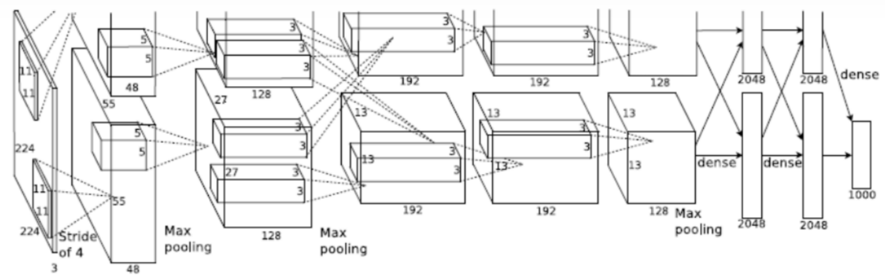
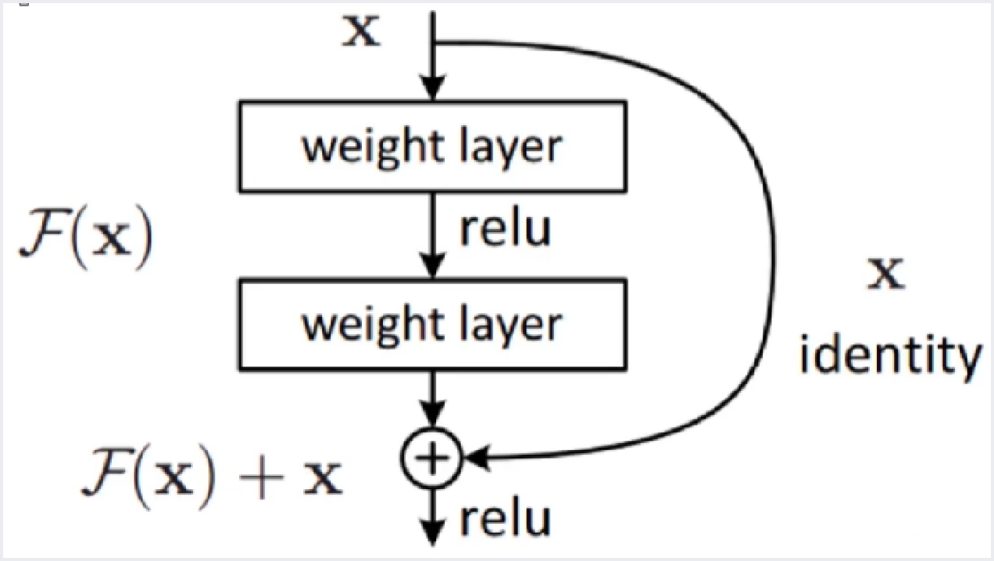
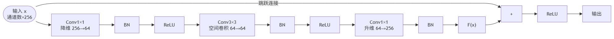
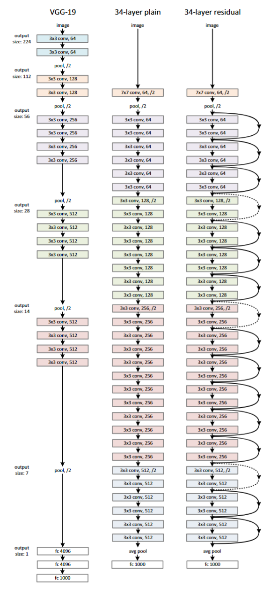

# 卷积神经网络CNN2

## [AlexNet](https://docs.pytorch.org/vision/main/models/generated/torchvision.models.alexnet.html)

AlexNet是由Alex Krizhevsky、Ilya Sutskever和Geoffrey Hinton在2012年提出的一种深度卷积神经网络结构，被广泛认为是深度学习领域的重要突破之一。其中，Alex Krizhevsky是该模型的主要贡献者之一，他与Sutskever和Hinton共同设计和实现了这个模型。他们ImageNet大规模视觉识别挑战赛上以远超其他竞争者的优异成绩夺得冠军，证明了深度学习在计算机视觉任务中的巨大潜力。AlexNet的成功促进了深度学习的发展，并启发了许多后来的研究工作。

**Ilya Sutskever（伊利亚·苏茨克弗）** 是一位著名的人工智能科学家，现为OpenAI的联合创始人和首席研究科学家。他在深度学习、机器翻译、生成模型等领域做出了许多重要贡 献，并被认为是深度学习领域的杰出代表之一。

Sutskever于2012年与Alex Krizhevsky和Geoffrey Hinton一起提出了AlexNet，这是一种深度卷积神经网络结构，引领了计算机视觉和深度学习的发展方向。他还在序列建模领域做出了突出的工作，如提出了 **Seq2Seq** 模型，极大地提高了机器翻译的准确性与效率。



### 网络架构的特点

- 第一个、第二个卷积层是独立的
- 第三个卷积层进行了交叉
- 第四个卷积层又保持独立
- 第5个卷积层保持独立
- 最后的全连接直接计算
- 当时GPU显存不够，所以采用多GPU训练，把**模型**拆成两半分别放到 2 个 GPU 上
  - **多GPU设计的真正原因（模型并行，不是数据并行）**：当时使用的 NVIDIA GTX 580 显存只有 **3GB**。AlexNet 有约 **6000万参数**，加上前向传播中的中间激活值（feature maps），一张 GPU 根本放不下整个模型。所以作者把每一层的**卷积核（channel 维度）拆成两半**，分别放在两个 GPU 上，只在特定层做跨 GPU 通信（详见下文"独立/交叉"的说明）。这种"把同一个模型切开分到多卡"的做法叫 **模型并行 (model parallelism)**。
  - ⚠️ **注意区分**：把一个 batch 的**样本**平均分到多张卡、每张卡跑完整模型，那叫 **数据并行 (data parallelism)**，是今天最常用的多卡方式——但 AlexNet 用的**不是**这种。另外，AlexNet 论文里的 batch size 是 **128**，不是 256。
- **输出层：** Softmax: 1000类，输出概率值
- **输入层：** AlexNet的输入是彩色图像，通常使用大小为224×224像素的图像作为输入

> **⚠️ 注意：论文中的 224×224 实际上是笔误。** 用特征图公式验证：第一层输出要求是 55×55，$N=\frac{W-11}{4}+1=55$，解得 $W=227$。所以**实际输入尺寸是 227×227**。这是深度学习领域一个众所周知的"历史错误"，PyTorch 的 torchvision 实现做了自适应处理，可接受任意尺寸输入。

### 卷积层和池化层

- 第一层（卷积层）
  - 卷积核大小：11×11
  - 卷积核数量：96个
  - 步长（stride）：4
  - 激活函数：ReLU（修正线性单元）
- 第二层（池化层）
  - 池化类型：最大池化（Max Pooling）
  - 池化核大小：3×3
  - 步长：2
- 第三层（卷积层）
  - 卷积核大小：5×5
  - 卷积核数量：256个
  - 步长：1
  - 激活函数：ReLU
- 第四层（池化层）
  - 池化类型：最大池化（Max Pooling）
  - 池化核大小：3×3
  -  步长：2
- 第五层（卷积层）
  - 卷积核大小：3×3
  - 卷积核数量：384个
  - 步长：1
  - 激活函数：ReLU
- 第六层（卷积层）
  - 卷积核大小：3×3
  - 卷积核数量：384个
  - 步长：1
  - 激活函数：ReLU
- 第七层（卷积层）
  - 卷积核大小：3×3
  - 卷积核数量：256个
  - 步长：1
  - 激活函数：ReLU
- 第八层（池化层）
  - 池化类型：最大池化
  - 池化核大小：3×3
  - 步长：2

### 全连接层

- 全连接层（第九层）
  - 全连接神经元数量：4096个
  - 激活函数：ReLU
- Dropout层
  - 用于减少过拟合的正则化手段
- 全连接层(第十层)
  - 全连接神经元数量：4096个
  - 激活函数：ReLU
- Dropout层
  - 用于减少过拟合的正则化手段
- 输出层(第十一层)
  - 全连接神经元数量：对应分类的类别数量
  - 激活函数：Softmax

### AlexNet 的创新意义

#### ReLU 的突破

在 AlexNet 之前，神经网络普遍使用 **tanh** 或 **sigmoid**（S型）作为激活函数。这两种函数在输入值较大或较小时，梯度趋近于 0（称为**饱和区**），导致深层网络中梯度在反向传播时逐层衰减，最终消失——这就是著名的**梯度消失**问题。

ReLU 的公式很简单：$f(x)=\max(0, x)$。它的关键优势是：
- **正数区梯度恒为 1**：无论输入多大，梯度都不会衰减
- **计算极快**：只需一个 if 判断，不需要指数运算
- AlexNet 论文报告 ReLU 的训练速度比 tanh 快 **6 倍**

> **ReLU 的缺点**：负数区梯度为 0，可能导致神经元永远"死去"（Dead ReLU）。后来的 LeakyReLU、PReLU、SELU 等变体通过给负数区一个小的非零斜率来解决这个问题。

#### 参数量分布：大部分参数在全连接层

```python
import torch
import torchvision.models as models

alexnet = models.alexnet()
total_params = sum(p.numel() for p in alexnet.parameters())
print(f"总参数量: {total_params:,}")  # 约 61,100,840

# 查看各层参数量分布
for name, param in alexnet.named_parameters():
    if 'weight' in name:
        print(f"{name:30s} shape={str(param.shape):20s} params={param.numel():>10,}")

# 全连接层参数量
fc_params = sum(p.numel() for name, p in alexnet.named_parameters()
                if 'classifier' in name)
print(f"\n全连接层参数量: {fc_params:,}")
print(f"全连接层占比: {fc_params/total_params*100:.1f}%")  # 约 96%
```

> **关键发现**：全连接层占了 96% 的参数！这也是为什么后来的网络（如 ResNet、GoogLeNet）大幅减少全连接层的使用——参数太多，容易过拟合，计算也慢。

#### Dropout

AlexNet 在全连接层引入了 **Dropout**：训练时以一定概率 p（如 0.5）随机"丢弃"神经元（将其输出置零）。这迫使每个神经元不能依赖特定同伴的存在，从而学习到更鲁棒的特征。

> **直觉理解**：如果把神经网络看作一个团队，Dropout 就是每次随机让一半成员"休假"，剩下的必须学会独立完成任务。这样在测试时全员到齐，效果自然更好。

**补充：训练和测试时 Dropout 的行为完全不同（初学者最容易踩的坑）**

Dropout 只在**训练时**丢神经元；**测试（推理）时不丢，全员参与**。但这里有个问题：训练时平均只有一半神经元在工作，测试时全员上阵，那这一层输出的总量（期望值）就会比训练时大一倍，导致训练和测试对不上。

PyTorch 用的解决办法叫 **inverted dropout（反向缩放）**：训练时把没被丢掉的神经元输出**除以 (1-p) 放大**，测试时则原样通过、什么都不做。这样两个阶段的期望输出就一致了。

关键是：这套切换靠 `model.train()` 和 `model.eval()` 两个开关自动完成，**忘记调用 `model.eval()` 是新手最常见的 bug**——会导致推理结果每次都随机抖动。

```python
import torch
import torch.nn as nn

torch.manual_seed(0)
drop = nn.Dropout(p=0.5)
x = torch.ones(1, 10)  # 全 1，方便观察

# 训练模式：随机置零一部分，其余 ×2（即 ÷(1-0.5)）来补偿
drop.train()
print("train 模式输出:", drop(x))
# 例如: tensor([[2., 0., 2., 2., 0., 0., 2., 0., 2., 2.]])
#      被保留的变成 2（放大了），被丢的变成 0
print("train 两次结果不同（随机）:", not torch.equal(drop(x), drop(x)))

# 测试模式：不丢弃、不缩放，原样输出
drop.eval()
print("eval  模式输出:", drop(x))   # tensor([[1., 1., 1., ..., 1.]])
print("eval  两次结果相同（确定）:", torch.equal(drop(x), drop(x)))
```

> **一句话记住**：训练前写 `model.train()`，推理/验证前写 `model.eval()`。Dropout 和下文的 BatchNorm 都依赖这个开关来切换行为。

## [VGGNet](https://docs.pytorch.org/vision/main/models/vgg.html)

VGG是由牛津大学Visual Geometry Group的Karen Simonyan和Andrew Zisserman于2014年提出的一种深度卷积神经网络结构，是深度学习领域中非常著名的模型之一。该模型采用了非常深的网络结构，具有很好的特征提取能力和泛化性能，在计算机视觉领域中被广泛应用。

Karen Simonyan和Andrew Zisserman都是英国知名的计算机视觉科学家，在图像分类、物体检测、人脸识别等领域做出了许多重要贡献。他们在VGG中使用了小尺寸的卷积核和多个同样大小的卷积层堆叠，通过增加网络深度来提高特征表达的能力，最终将输入图像映射到类别概率上。VGG在当时的ImageNet挑战赛上取得了很好的成绩，被视为深度学习模型设计的经典案例之一。


### 网络结构特点

- 网络结构层次更深
- 多使用**3×3的卷积核**
  - 2个3×3的卷积层可以看做一层5×5的卷积层
  - 3个3×3的卷积层可以看做一层7×7的卷积层
  - 1×1的卷积层可以看做是通道间的**线性变换**（矩阵乘法），常用于降维或升维。加上 ReLU 激活函数后才成为非线性变换。详情参考 CNN1 笔记中的"深度可分离卷积 → Pointwise（1×1 卷积）"部分
- **每经过一个pooling层，通道数目翻倍（直到 512 封顶）** —— 经过 pooling (2×2, stride=2) 后空间分辨率变为原来的 1/4，如果通道数不变，总信息容量会剧烈衰减。把通道数翻倍（×2），总容量为原来的 (1/4)×2 = 1/2，在可控范围内逐步压缩，不会丢失太多信息。类比：一根粗管分流成多根细管，总数大致守恒
  - ⚠️ **注意**："翻倍"是设计意图，不是严格规律。VGG 的实际通道走向是 **64 → 128 → 256 → 512 → 512**，最后一级 pooling 后通道数**保持 512、不再翻倍**——因为 512 通道的参数量和显存开销已经很大，继续翻到 1024 代价太高。真正每次都严格翻倍的是后面的 ResNet（planes 走向 64 → 128 → 256 → 512）

> **补充说明——"信息守恒"的直觉**：VGG 中各阶段的计算量大致均匀，前面空间大、通道少（关注空间细节），后面空间小、通道多（关注语义抽象），这是一个精心设计的平衡策略。

### 创新点

- **使用小尺寸的卷积核**

  VGG使用了3×3的小尺寸卷积核来代替较大的卷积核，这样可以增加网络深度而不会增加计算量。

- **堆叠多个同样大小的卷积层**

  VGG采用了堆叠多个相同大小的卷积层的方式来提高网络的性能。这样做可以增加非线性映射和特征抽取的能力，使得网络更好地学习图像中的复杂特征。

- **使用最大池化层进行下采样**

  VGG使用了最大池化层来对特征图进行下采样，从而使得网络对位置的变化更加鲁棒。

- **预训练和权重初始化**

  VGGNet采用了一种Pre-training（预训练）的方式，即先训练层数较少的网络，然后使用这些网络的权重来初始化更深层次的网络，加快了训练的收敛速度。

- **多尺度训练与预测**

  VGGNet在训练和预测时采用了多尺度的方法，即对输入图像进行不同尺寸的缩放，增加了训练数据量，防止过拟合，提升了预测准确率。（数据增强）

- **1×1卷积核的应用**

  VGGNet中也使用了1×1的卷积核，这可以看作是对输入通道的线性变换，有助于在通道层级进行降维或升维，提高模型的非线性能力。

- **网络结构清晰简单**

  VGG的网络结构非常清晰简单，由若干个卷积层、池化层和全连接层组成。这使得网络易于理解和实现，并且在各种计算机视觉任务中都表现出较好的性能。

### VGG16和VGG19

全名为**Visual Geometry Group**

VGG以其简单、规整的结构而闻名，其主要特点是将多个较小的卷积核堆叠在一起，形成较深的网络

#### VGG16

VGG16有16个卷积和全连接层：

- **输入层：** 224×224像素的彩色图像
- **Convolutional Block 1：**
  - 2个卷积层，每层有64个3×3大小的卷积核
  - 每个卷积层后接一个ReLU激活函数
  - 1个2×2最大池化层，步长为2
- **Convolutional Block 2：**
  - 2个卷积层，每层有128个3×3大小的卷积核
  - 每个卷积层后接一个ReLU激活函数
  - 1个2×2最大池化层，步长为2
- **Convolutional Block 3：**
  - 3个卷积层，每层有256个3×3大小的卷积核
  - 每个卷积层后接一个ReLU激活函数
  - 1个2×2最大池化层，步长为2
- **Convolutional Block 4：**
  - 3个卷积层，每层有512个3×3大小的卷积核
  - 每个卷积层后接一个ReLU激活函数
  - 1个2×2最大池化层，步长为2
- **Convolutional Block 5：**
  - 3个卷积层，每层有512个3×3大小的卷积核
  - 每个卷积层后接一个ReLU激活函数
  - 1个2×2最大池化层，步长为2
- **全连接层：**
  - 3个全连接层，每层有4096个神经元
  - 每个全连接层后接一个ReLU激活函数
  - 最后一个全连接层后接一个Softmax激活函数（用于多分类任务）

#### VGG19

VGG19相较于VGG16，增加了3个额外的卷积层，具有更深的网络结构。

除了卷积核数量和层数的不同，VGG16和VGG19的网络结构是非常相似的。这种简单规整的结构使得VGG模型易于理解和实现，并为深度学习的研究和应用提供了基础。然而，由于其较深的结构，VGG模型在训练和推理过程中较慢，后续的一些模型如ResNet和 Inception等则采取了更高效的结构。


- 从11层（没有参数的层不算）增至19层
- LRN是局部做归一化
- **为什么都在后面加层：** 前面空间尺寸大（224×224、112×112），在 3×3 卷积的计算量公式 $K^2 \times C_{in} \times C_{out} \times H \times W$ 中，H×W 很大，如果在前面加太多层，计算量会爆炸。后面经过 pooling 后空间变小（14×14、7×7），虽然通道数翻倍了，但 H×W 缩小为原来的 1/4，计算量大致平衡。所以"后面加层"本质上是在计算量可控的前提下，让深层网络学到更抽象的语义特征。VGG 5个阶段的计算量分布大致均匀，正体现了这一设计智慧
- 总体参数数目基本保持不变

### 卷积核是奇数的原因

- 为了方便same padding时的处理

  如步长为1时，要补充k-1的zero padding才能使输入输出的尺寸一致，这时候如果核大小k是偶数，则需要补充奇数的zero padding，不能平均分到feature map的两侧。

- 为了统一标准

  卷积核的滑动是默认使用中心点作为基准而进行的，而奇数核拥有这样天然的基准。（其实自己定义偶数核的基准也是可以的，如使用核的左上角作为基准）

- 为了更好地获取中心信息

  由于奇数核拥有天然的绝对中心点，因此在做卷积的时候能更好地获取到中心这样的概念信息。

### 视野域验证：2个3×3 等价于 1个5×5

视野域又叫做感受野

下面用代码验证"堆叠小卷积核 = 更大的感受野"这一关键原理：

```python
import torch
import torch.nn as nn

"""
验证：两个 3×3 卷积的感受野 = 一个 5×5 卷积的感受野

直观理解（一维）：
  第1个3×3：看到 [-1, 0, +1] 三个位置
  第2个3×3：每个位置"看到"前一层3个位置
  → 总共覆盖原始输入的 5 个连续位置 = 5×5 感受野

类比：两层渔网接力 → 最终覆盖的范围 = 一层大渔网
"""

# 创建7×7输入，只有中心是1，其余是0（"脉冲"信号）
x = torch.zeros(1, 1, 7, 7)
x[0, 0, 3, 3] = 1.0

# 两个3×3卷积 (无padding)
conv3_1 = nn.Conv2d(1, 1, 3, padding=0, bias=False)
conv3_2 = nn.Conv2d(1, 1, 3, padding=0, bias=False)
# 一个5×5卷积
conv5 = nn.Conv2d(1, 1, 5, padding=0, bias=False)

# 用全1权重（方便观察感受野范围）
with torch.no_grad():
    conv3_1.weight.fill_(1.0)
    conv3_2.weight.fill_(1.0)
    conv5.weight.fill_(1.0)

# 前向传播
out_3x3_1 = conv3_1(x)   # 7×7 → 5×5
out_3x3_2 = conv3_2(out_3x3_1)  # 5×5 → 3×3
out_5x5 = conv5(x)        # 7×7 → 3×3

print(f"两个3×3最终输出尺寸: {out_3x3_2.shape}")  # [1, 1, 3, 3]
print(f"一个5×5最终输出尺寸: {out_5x5.shape}")     # [1, 1, 3, 3]
print("✓ 输出尺寸相同，感受野都是 5×5")

# 参数量对比
C = 64  # 假设通道数
params_2x3 = 2 * (3 * 3 * C * C)   # 两个 3×3
params_1x5 = 5 * 5 * C * C          # 一个 5×5
print(f"\n参数量对比 (C={C}):")
print(f"  两个3×3: {params_2x3:,}")
print(f"  一个5×5: {params_1x5:,}")
print(f"  节省 {(1-params_2x3/params_1x5)*100:.0f}% 参数，且中间多一个ReLU非线性！")
```

### LRN（局部响应归一化）

笔记前面的图中提到了 LRN。**LRN (Local Response Normalization，局部响应归一化)** 是 AlexNet 中使用的一项技术，灵感来自生物神经元的**侧抑制（lateral inhibition）**——一个活跃的神经元会抑制它周围神经元的活性。

- **做法**：对同一空间位置上、相邻通道间的激活值做归一化（让激活值较大的通道抑制周围的通道）
- **为什么 AlexNet 用了 LRN？** 在 Batch Normalization (BN) 还没被发明的 2012 年，LRN 被认为能帮助训练
- **为什么 VGG 不用 LRN？** VGG 作者实验发现 LRN **对准确率几乎没有提升**，反而增加了计算开销和内存消耗。所以 VGG 直接去掉了 LRN，让网络结构更简洁

> **历史线索**：AlexNet(2012) 用 LRN → VGG(2014) 发现 LRN 没用，去掉 → ResNet(2015) 大量使用 Batch Normalization（比 LRN 强大得多）。这个演进反映了深度学习社区对"归一化技术"的认知深化过程。

## ResNet

ResNet是由微软亚洲研究院的何凯明（Kaiming He）和他的团队在2015年提出的一种深度卷积神经网络结构，被广泛认为是深度学习领域中的重要突破之一。ResNet通过引入残差连接来解决深层神经网络训练时出现的梯度消失和梯度爆炸等问题，使得网络可以更加深层、更加高效地训练。

### 加深层次的问题

模型深度达到某个程度后继续加深，反而会导致**训练集**准确率下降。下图是 **56 层和 20 层普通网络（plain network）在 CIFAR-10 上的对比效果图**：


**注意：** 并不是过拟合，因为**训练集**的 error 也很高（过拟合的典型特征是训练误差低、测试误差高，这里训练误差本身就高）。真正的原因是较深的网络**比较难优化（收敛）**。

**退化：** 模型层次加深后，模型的性能不仅没有提升，反而出现了显著的下降，把这种现象称为退化。

### 残差网络

#### 核心思想：学习"残差"而不是直接学习"映射"

**传统网络的做法：**

```
输入 x → 权重层 → ReLU → 权重层 → ReLU → 输出 H(x)
目标：直接学习从 x 到正确输出 H(x) 的映射
```

**残差网络的做法：**


数学表达：
$$H(x) = F(x) + x$$



> **上图解读（残差块 Residual Block）**：输入 $x$ 兵分两路——一路经过两层权重层（通常是卷积层）和 ReLU，学习出**残差映射** $F(x)$；另一路通过一条**捷径连接（shortcut / identity mapping）** 原封不动地跳过这些权重层。两路在末端相加得到 $F(x)+x$，再过一次 ReLU 作为输出。正因为多了这条"什么都不做"的捷径，网络只需学习输入与目标之间的**差值（残差）**，而不必从头学习整个复杂映射，从而缓解了深层网络的梯度消失和退化问题。

其中：
- $H(x)$：我们希望网络学习的**目标映射**
- $x$：**输入（恒等映射）**，通过跳跃连接直接传过来
- $F(x) = H(x) - x$：权重层需要学习的**残差**（residual）

**为什么叫"残差"？** 残差 = 目标值 - 当前值，即 $F(x) = H(x) - x$。网络不再学习整个 $H(x)$，而是学习 $H(x)$ 与 $x$ 之间的"差距"。

> **关键直觉**：如果理想输出就是输入本身（$H(x) = x$，即恒等映射），传统网络需要费力气去学习"什么也不做"，而残差网络只需把 $F(x)$ 的权重推向 0 即可。**把权重推向 0，比让权重组合成恒等映射容易得多！**

#### 为什么残差连接能解决退化问题

退化不是因为过拟合（训练集误差也高），而是因为**深层网络难以优化**。具体来说：

1. **梯度消失的角度**：
   - 传统深层网络：梯度在反向传播时经过许多乘法，每层的雅可比矩阵可能 < 1，连乘导致梯度指数级衰减
   - 残差网络的梯度：$x_{l+1} = x_l + F(x_l)$，求导得 $\frac{\partial x_{l+1}}{\partial x_l} = 1 + \frac{\partial F}{\partial x_l}$——**常数 1 保证梯度有一条"高速公路"直达浅层，不会被衰减到 0**

2. **优化景观的角度**：
   - 残差连接让损失平面（loss landscape）变得更"平滑"，优化器更容易找到好的解
   - 没有残差连接时，损失平面充满陡峭的峡谷和局部极小值

> **类比**：传统的深层网络像是让信息通过一条长长的、有很多关卡的传送带——每过一关，信息可能丢失一点。残差网络在每个关卡旁边加了一条"紧急通道"（跳跃连接），信息可以绕过关卡直接向后传，不会丢失。

#### 残差块（Residual Block）—— ResNet 的基本单元

**残差块**是 ResNet 中最小的可重复构建单元。一个残差块由两部分组成：

```
残差块 = 主路径（权重层）+ 捷径（shortcut / skip connection）
```

**数学定义：**

$$\mathbf{y} = \mathcal{F}(\mathbf{x}, \{W_i\}) + \mathbf{x}$$

其中：
- $\mathbf{x}$：残差块的**输入**
- $\mathcal{F}(\mathbf{x}, \{W_i\})$：**残差函数**（residual function），即主路径上若干权重层学习到的映射
- $\mathbf{y}$：残差块的**输出**，是残差函数与输入的逐元素相加
- $\{W_i\}$：主路径中各层的权重参数

**残差块的关键特征：**

1. **"+ x" 的跳跃连接是残差块的灵魂**：没有它，残差块就退化成一个普通的卷积序列（和 VGG 没什么区别）
2. **残差块的输入输出维度必须匹配**才能直接相加（**+** 是逐元素加法）。当维度不匹配时，捷径上需要额外的投影层（如 1×1 卷积）来对齐维度
3. **一个残差块内通常包含 2~3 个卷积层**，层数太少则残差学习的能力不够，太多则退化为小型的普通网络

> **直觉理解**：残差块就像一个"修正器"——它不从头学习答案，而是在输入的基础上做**微调**。如果输入已经够好了，网络可以把 $\mathcal{F}(\mathbf{x})$ 学成接近 0；只有当输入不够好时，才学一个有意义的修正量。这种"按需修正"的机制，比"每次从零开始算"要高效得多。

---

#### 残差层（Residual Layer / Stage）—— 多个残差块的组合

如果说**残差块**是 ResNet 的"积木"，那**残差层**就是由多个相同通道数的残差块堆叠而成的"功能模块"。

在 ResNet 论文和代码中，残差层通常用 `conv2_x`、`conv3_x`、`conv4_x`、`conv5_x` 来命名，共 **4 个残差层**，对应 4 个不同的空间分辨率阶段：

```
输入图片
  │
  ├── conv1 (初始卷积 + 池化)        空间: 224×224 → 56×56
  │
  ├── conv2_x (残差层1)             空间: 56×56  (保持不变)
  │     ├── 残差块 2-1              通道: 64 (或 256 for Bottleneck)
  │     ├── 残差块 2-2
  │     └── ...
  │
  ├── conv3_x (残差层2)             空间: 56×56 → 28×28 (第一个块 stride=2)
  │     ├── 残差块 3-1              通道: 128 (或 512 for Bottleneck)
  │     ├── 残差块 3-2
  │     └── ...
  │
  ├── conv4_x (残差层3)             空间: 28×28 → 14×14
  │     ├── 残差块 4-1              通道: 256 (或 1024 for Bottleneck)
  │     ├── 残差块 4-2
  │     └── ...
  │
  ├── conv5_x (残差层4)             空间: 14×14 → 7×7
  │     ├── 残差块 5-1              通道: 512 (或 2048 for Bottleneck)
  │     ├── 残差块 5-2
  │     └── ...
  │
  └── 全局平均池化 → 全连接 → 输出
```

**残差层的设计规律：**

| 属性 | 规律 | 原因 |
|------|------|------|
| **空间分辨率** | 每个残差层的第一个块做一次下采样（stride=2），层内后续块保持分辨率不变 | 逐步压缩空间信息，提取越来越抽象的特征 |
| **通道数** | 每进入一个新残差层，通道数翻倍（64→128→256→512 或 256→512→1024→2048） | 空间缩小后增加通道数，保持总信息容量大致平衡（和 VGG 的设计哲学一脉相承） |
| **块数** | 中间的残差层（conv3_x、conv4_x）块数最多，首尾较少 | 中等分辨率（28×28、14×14）是"语义抽象"的关键阶段，需要更多层来学习 |

**四个残差层的块数分配（以各版本为例）：**

| 残差层 | 输出尺寸 | ResNet-18 | ResNet-34 | ResNet-50 | ResNet-101 | ResNet-152 |
|--------|---------|-----------|-----------|-----------|------------|------------|
| conv2_x | 56×56 | 2 块 | 3 块 | 3 块 | 3 块 | 3 块 |
| conv3_x | 28×28 | 2 块 | 4 块 | 4 块 | 4 块 | 8 块 |
| conv4_x | 14×14 | 2 块 | 6 块 | 6 块 | 23 块 | 36 块 |
| conv5_x | 7×7 | 2 块 | 3 块 | 3 块 | 3 块 | 3 块 |

> **关键观察**：ResNet-50/101/152 在 conv4_x（14×14 分辨率）大量堆叠残差块——这个阶段是"从局部特征过渡到全局语义"的黄金窗口。空间已经小到计算成本可控，但又没有小到丢失所有空间结构，是堆深度的最佳位置。

**残差块 vs 残差层 —— 概念对比：**

| | 残差块（Residual Block） | 残差层（Residual Layer / Stage） |
|------|------|------|
| **层级** | 微观：最小的可重复单元 | 宏观：由多个同通道数的残差块组成 |
| **功能** | 学习一个局部残差映射 $\mathcal{F}(\mathbf{x}) + \mathbf{x}$ | 处理一个空间分辨率下的所有特征提取 |
| **内部结构** | 2~3 个卷积层 + 1 条跳跃连接 | 若干个残差块 + 1 次下采样（第一个块） |
| **空间变化** | 层内大部分块保持分辨率不变 | 层的第一个块将空间减半 |
| **通道变化** | 块内输入输出通道相同（或通过投影对齐） | 进入新层时通道数翻倍 |
| **代码体现** | `BasicBlock` / `Bottleneck` 类 | `_make_layer()` 方法，返回 `nn.Sequential` |
| **数量** | ResNet-18 有 8 个，ResNet-152 有 50 个 | 所有 ResNet 固定 4 个残差层 |

---

#### ResNet 中的两种残差块

**BasicBlock（基础残差块）—— ResNet-18/34 使用：**


- 两个 3×3 卷积，通道数不变
- 当需要改变维度时（stride=2 或通道数变化），跳跃连接通过 1×1 卷积做投影（projection shortcut）

**Bottleneck（瓶颈残差块）—— ResNet-50/101/152 使用：**



- **为什么叫"瓶颈"？** 先用 1×1 卷积把通道压缩（256→64），在低维度做 3×3 卷积（省钱），再用 1×1 恢复（64→256）
- **参数对比**（输入输出均为 256 通道）：
  - 两个 3×3 直接卷积：$2 \times 3^2 \times 256^2$ ≈ **118 万**参数
  - Bottleneck：$1^2 \times 256 \times 64 + 3^2 \times 64 \times 64 + 1^2 \times 64 \times 256$ ≈ **7 万**参数
  - **节省了约 94% 的参数量！** 所以 ResNet-50 虽然比 ResNet-34 层数更多，但参数增加并不多

#### 代码实现

```python
import torch
import torch.nn as nn


class BasicBlock(nn.Module):
    """ResNet-18/34 使用的基础残差块"""
    expansion = 1  # 输出通道不扩张

    def __init__(self, in_channels, out_channels, stride=1, downsample=None):
        super().__init__()

        # 第一个 3×3 卷积（可能在此层做下采样: stride=2）
        self.conv1 = nn.Conv2d(in_channels, out_channels, kernel_size=3,
                               stride=stride, padding=1, bias=False)
        self.bn1 = nn.BatchNorm2d(out_channels)

        # 第二个 3×3 卷积（stride=1，不改变尺寸）
        self.conv2 = nn.Conv2d(out_channels, out_channels, kernel_size=3,
                               stride=1, padding=1, bias=False)
        self.bn2 = nn.BatchNorm2d(out_channels)

        self.relu = nn.ReLU(inplace=True)
        # 当输入输出维度不匹配时，跳跃连接通过 1×1 卷积做投影
        self.downsample = downsample

    def forward(self, x):
        identity = x  # 保存输入，用于跳跃连接

        # 主路径：Conv → BN → ReLU → Conv → BN
        out = self.conv1(x)
        out = self.bn1(out)
        out = self.relu(out)

        out = self.conv2(out)
        out = self.bn2(out)

        # 跳跃连接：如果维度不匹配则调整
        if self.downsample is not None:
            identity = self.downsample(x)

        # ★ 核心操作：F(x) + x
        out += identity
        out = self.relu(out)

        return out


class Bottleneck(nn.Module):
    """ResNet-50/101/152 使用的瓶颈残差块"""
    expansion = 4  # 输出通道 = out_channels × 4

    def __init__(self, in_channels, out_channels, stride=1, downsample=None):
        super().__init__()
        mid_channels = out_channels  # 中间层（瓶颈）通道数

        # 1×1 降维：in_channels → mid_channels
        self.conv1 = nn.Conv2d(in_channels, mid_channels, kernel_size=1,
                               stride=1, bias=False)
        self.bn1 = nn.BatchNorm2d(mid_channels)

        # 3×3 空间卷积（做实际的特征提取）
        self.conv2 = nn.Conv2d(mid_channels, mid_channels, kernel_size=3,
                               stride=stride, padding=1, bias=False)
        self.bn2 = nn.BatchNorm2d(mid_channels)

        # 1×1 升维：mid_channels → out_channels × 4
        self.conv3 = nn.Conv2d(mid_channels, out_channels * self.expansion,
                               kernel_size=1, stride=1, bias=False)
        self.bn3 = nn.BatchNorm2d(out_channels * self.expansion)

        self.relu = nn.ReLU(inplace=True)
        self.downsample = downsample

    def forward(self, x):
        identity = x

        out = self.conv1(x)
        out = self.bn1(out)
        out = self.relu(out)

        out = self.conv2(out)
        out = self.bn2(out)
        out = self.relu(out)

        out = self.conv3(out)
        out = self.bn3(out)

        if self.downsample is not None:
            identity = self.downsample(x)

        out += identity  # F(x) + x
        out = self.relu(out)

        return out


# ---- 验证梯度流：残差连接如何防止梯度消失 ----
block = BasicBlock(in_channels=16, out_channels=16, stride=1)
x = torch.randn(2, 16, 32, 32, requires_grad=True)

y = block(x)
loss = y.sum()
loss.backward()

# 检查输入的梯度（因为有跳跃连接，梯度不会全是零）
print(f"输入梯度非零比例: {(x.grad != 0).float().mean()*100:.1f}%")
print(f"输入梯度均值: {x.grad.abs().mean():.6f}")
print("✓ 跳跃连接保证梯度有直通路径，不会完全消失")
```

#### ResNet 各版本一览

| 模型 | 层数 | 残差块类型 | 各阶段块数 | 参数量 |
|------|------|-----------|-----------|--------|
| ResNet-18 | 18 | BasicBlock | [2, 2, 2, 2] | 11.7M |
| ResNet-34 | 34 | BasicBlock | [3, 4, 6, 3] | 21.8M |
| ResNet-50 | 50 | Bottleneck | [3, 4, 6, 3] | 25.6M |
| ResNet-101 | 101 | Bottleneck | [3, 4, 23, 3] | 44.5M |
| ResNet-152 | 152 | Bottleneck | [3, 8, 36, 3] | 60.2M |

> **规律**：ResNet-18 和 ResNet-34 用 BasicBlock（两个 3×3 卷积），ResNet-50 及以上用 Bottleneck（三个卷积，1×1→3×3→1×1）。Bottleneck 虽然层数更多，但因为 1×1 卷积的"压缩→计算→恢复"机制，参数量并没有随层数线性增长。

```python
# 在 PyTorch 中加载不同版本 ResNet，验证参数量
import torchvision.models as models

for name in ['resnet18', 'resnet34', 'resnet50', 'resnet101', 'resnet152']:
    model = getattr(models, name)()
    params = sum(p.numel() for p in model.parameters()) / 1e6
    print(f"{name:12s}: {params:.1f}M 参数")
```

#### Batch Normalization —— ResNet 能够训练 152 层的关键

**一个重要的历史事实**：AlexNet (2012) 和 VGGNet (2014) 都**没有使用 Batch Normalization**，因为 BN 是 2015 年才提出的（与 ResNet 同年）。

BN 在训练时对每个 mini-batch 的数据做标准化（均值 0，方差 1），然后通过可学习的参数 $\gamma$（缩放）和 $\beta$（平移）恢复网络的表达能力：
$$\hat{x} = \frac{x - \mu_{batch}}{\sqrt{\sigma^2_{batch} + \epsilon}}, \quad y = \gamma\hat{x} + \beta$$

BN 的作用：
1. **加速收敛**：每层输入分布稳定，可以用更大的学习率
2. **缓解梯度消失**：激活值不会跑到饱和区
3. **正则化效果**：mini-batch 的统计量带有噪声，相当于一种随机正则化，减轻了对 Dropout 的依赖
4. **让深层网络可训**：没有 BN，ResNet-152 根本无法收敛

> **AlexNet → VGG → ResNet 的归一化演进**：
> - AlexNet (2012)：使用 LRN（本地响应归一化）→ 后来发现作用不大
> - VGG (2014)：实验证明 LRN 没用，直接去掉
> - ResNet (2015)：大量使用 Batch Normalization（每个卷积层后都有 BN）→ 真正有效的归一化方案

**补充：BN 在训练和测试时也不一样（和 Dropout 一样依赖 `train()`/`eval()`）**

上面的公式里，$\mu_{batch}$ 和 $\sigma^2_{batch}$ 是"当前这一批数据"算出来的均值和方差。这在**训练**时没问题，但**测试**时会出两个麻烦：

1. 推理常常一次只来 1 张图，一个样本算不出有意义的方差；
2. 我们希望同一张图的预测结果是**确定的**，不该因为它和谁凑在一个 batch 里而改变。

所以 BN 在训练时会用**滑动平均（running mean / running var）**偷偷记下整个训练集的均值和方差；到了测试时，就**不再看当前 batch**，而是直接用这套存好的全局统计量。这套切换同样由 `model.eval()` 触发。

```python
import torch
import torch.nn as nn

torch.manual_seed(0)
bn = nn.BatchNorm1d(3)   # 3 个特征通道

# ---- 训练阶段：用每个 batch 的统计量，并更新 running 统计量 ----
bn.train()
print("初始 running_mean:", bn.running_mean)   # [0., 0., 0.]
for _ in range(5):
    x = torch.randn(8, 3) * 2 + 5   # 均值≈5, 标准差≈2 的假数据
    bn(x)                            # 前向一次，running_mean/var 被更新
print("训练几步后 running_mean:", bn.running_mean)  # 逐渐逼近 5

# ---- 测试阶段：不再用当前 batch，而用存好的 running 统计量 ----
bn.eval()
one_sample = torch.randn(1, 3) * 2 + 5    # 只有 1 个样本也能正常推理
print("eval 单样本输出:", bn(one_sample))
print("eval 两次结果相同（确定性）:",
      torch.equal(bn(one_sample), bn(one_sample)))
```

> **踩坑提醒**：正因为 BN 依赖 batch 内的统计量，**batch size 太小（比如 1、2）时 BN 效果会明显变差**——统计量噪声太大。这也是后来出现 GroupNorm、LayerNorm 等替代方案的原因之一。

### 模型结构图解析

#### ResNet 整体数据流

**整体数据流（以 ResNet-50 为例）：**


**关键观察：**
- ResNet 只有**一个全连接层**（2048 → 1000），而 AlexNet/VGG 有三层 4096 的 FC。这是因为 ResNet 把"特征提取"的工作全部交给了卷积层（通过残差连接可以堆到 152 层），最后的 FC 只做简单的分类
- 每次空间减半（stride=2）时，通道数翻倍，保持计算量大致平衡

---

#### 五个 ResNet 版本的配置对比


这张图（ResNet 原论文 Table 1）对比了五个 ResNet 版本的**残差块数量**和**卷积核配置**。下面把它整理成文字表格：

```
层名      输出尺寸    ResNet-18     ResNet-34     ResNet-50      ResNet-101     ResNet-152
─────────────────────────────────────────────────────────────────────────────────────────
conv1     112×112    7×7, 64, stride 2  (所有版本相同)
─────────────────────────────────────────────────────────────────────────────────────────
conv2_x   56×56     [3×3,64] ×2   [3×3,64] ×3   [1×1, 64] ×3  [1×1, 64] ×3  [1×1, 64] ×3
                    [3×3,64]       [3×3,64]       [3×3, 64]      [3×3, 64]      [3×3, 64]
                                                   [1×1,256]      [1×1,256]      [1×1,256]
─────────────────────────────────────────────────────────────────────────────────────────
conv3_x   28×28     [3×3,128]×2   [3×3,128]×4   [1×1,128] ×4  [1×1,128] ×4  [1×1,128] ×8
                    [3×3,128]      [3×3,128]      [3×3,128]      [3×3,128]      [3×3,128]
                                                   [1×1,512]      [1×1,512]      [1×1,512]
─────────────────────────────────────────────────────────────────────────────────────────
conv4_x   14×14     [3×3,256]×2   [3×3,256]×6   [1×1,256] ×6  [1×1,256] ×23 [1×1,256] ×36
                    [3×3,256]      [3×3,256]      [3×3,256]      [3×3,256]      [3×3,256]
                                                   [1×1,1024]     [1×1,1024]     [1×1,1024]
─────────────────────────────────────────────────────────────────────────────────────────
conv5_x   7×7      [3×3,512]×2   [3×3,512]×3   [1×1,512] ×3  [1×1,512] ×3  [1×1,512] ×3
                    [3×3,512]      [3×3,512]      [3×3,512]      [3×3,512]      [3×3,512]
                                                   [1×1,2048]     [1×1,2048]     [1×1,2048]
─────────────────────────────────────────────────────────────────────────────────────────
分类器    1×1       AdaptiveAvgPool → FC(1000) → Softmax
─────────────────────────────────────────────────────────────────────────────────────────
总参数量            11.7M          21.8M          25.6M          44.5M          60.2M
FLOPs               1.8G           3.6G           3.8G           7.6G           11.3G
```

**如何读懂这个表格：**

1. **BasicBlock（ResNet-18/34）**：每行只有一个数字，如 `[3×3, 64]`，表示一个 3×3 卷积，输出 64 通道。`×2` 表示这个阶段有 2 个 BasicBlock（即 4 个卷积层）

2. **Bottleneck（ResNet-50/101/152）**：每行有三个卷积，如 `[1×1, 64] [3×3, 64] [1×1, 256]`——这就是 Bottleneck 的三层结构：
   - 第1个 1×1：降维到 64 通道
   - 第2个 3×3：在 64 通道下做空间卷积（最省钱！）
   - 第3个 1×1：升维到 256 通道
   - `×3` 表示 3 个这样的 Bottleneck

3. **为什么 ResNet-50 比 ResNet-34 层多但参数差不多？** 因为 Bottleneck 中的 1×1 卷积大大减少了 3×3 卷积的输入输出通道数（64 而非 256）

---

#### VGG-19 vs Plain-34 vs ResNet-34 结构对比



**左：VGG-19（2014年）**

```
输入 (224×224×3)
    │
    ├── conv3-64  ─┐
    ├── conv3-64   ├─ 空间 224×224 → 112×112 (MaxPool)
    │
    ├── conv3-128 ─┐
    ├── conv3-128  ├─ 112×112 → 56×56 (MaxPool)
    │
    ├── conv3-256 ─┐
    ├── conv3-256  │
    ├── conv3-256  │
    ├── conv3-256  ├─ 56×56 → 28×28 (MaxPool)
    │
    ├── conv3-512 ─┐
    ├── conv3-512  │
    ├── conv3-512  │
    ├── conv3-512  ├─ 28×28 → 14×14 (MaxPool)
    │
    ├── conv3-512 ─┐
    ├── conv3-512  │
    ├── conv3-512  │
    ├── conv3-512  ├─ 14×14 → 7×7 (MaxPool)
    │
    ├── FC-4096
    ├── FC-4096
    └── FC-1000 (Softmax)

特点：19 层，纯串联结构，无跳跃连接，3个巨大的全连接层
参数量：约 144M（主要集中在那两个 4096 的 FC 层！）
```

**中：Plain-34（去掉残差连接的 34 层网络）**

```
与 ResNet-34 结构完全相同，但把所有的跳跃连接（+x 的虚线/实线）全部去掉。
纯粹一层接一层的卷积 → ReLU → 卷积 → ReLU ...

输入→conv1(7×7,/2)→pool(/2)
    → [conv3-64  ×6层]  → pool(/2)    ← ResNet-18/34 的 BasicBlock 去掉 +x
    → [conv3-128 ×8层]  → pool(/2)
    → [conv3-256 ×12层] → pool(/2)
    → [conv3-512 ×6层]  → pool(/2)
    → AvgPool → FC-1000

34 层，无跳跃连接
实验结论: 训练误差和测试误差都比 18 层的 Plain-18 高 → 退化！
```

**右：ResNet-34（带残差连接的 34 层网络）**

```
输入→conv1(7×7,/2)→pool(/2)        ←─┐
    → [残差块 ×3]  → pool(/2)        │
    → [残差块 ×4]  → pool(/2)        │ 每个残差块内部有 +x 的跳跃连接
    → [残差块 ×6]  → pool(/2)        │ (图中用弯曲箭头表示)
    → [残差块 ×3]  → pool(/2)      ←─┘
    → AvgPool → FC-1000

34 层，有跳跃连接
实验结论: 不仅没有退化，反而比 18 层的 ResNet-18 更好！
```

**图中三种连接线的含义：**

| 线型 | 含义 | 示例 |
|------|------|------|
| **实线跳跃连接** | 输入输出维度相同，直接 `x + F(x)` | 大多数残差块内 |
| **虚线跳跃连接** | 输入输出维度不同（通道数或空间尺寸变化），跳跃连接需要通过 1×1 卷积做**投影**（projection）来匹配维度 | 每个阶段的第一块，空间减半/通道翻倍时 |
| **普通直线** | 数据主流，一层接一层 | 所有层的前向传播路径 |

**虚线跳跃连接的具体工作方式（维度不匹配时）：**

```
输入: (56, 56, 64)   ← 来自上一阶段
目标输出: (28, 28, 128)  ← 新阶段：空间减半 + 通道翻倍

主路径 F(x):
  Conv3×3(64→128, stride=2) → BN → ReLU → Conv3×3(128→128, stride=1) → BN
  输出: (28, 28, 128)

跳跃连接（虚线）:
  Conv1×1(64→128, stride=2) → BN    ← 用 1×1 卷积把 64 通道变成 128，同时 stride=2 匹配空间尺寸
  输出: (28, 28, 128)

最终: F(x) + 投影后的 x → 维度匹配，可以相加！
```

> **记法口诀**：
> - 实线 = "原样通过"（输入输出一样大，直接加）
> - 虚线 = "需要转换"（输入输出不一样大，先用 1×1 卷积调整再加）
> - 弯曲箭头 = 跳跃连接的标志，ResNet 的核心特征

---

**这张对比图的实验结论（论文中的核心发现）：**

| 网络 | 层数 | 跳跃连接 | 训练误差 | 测试误差 |
|------|------|---------|---------|---------|
| Plain-18 | 18 | 无 | 较低 | 较低 |
| Plain-34 | 34 | 无 | **更高！** | **更高！** ← 退化 |
| ResNet-18 | 18 | 有 | 较低 | 较低 |
| ResNet-34 | 34 | 有 | **更低** | **更低** ← 没有退化！ |

- Plain-34 比 Plain-18 更深，但误差反而更高 → **退化**
- ResNet-34 比 ResNet-18 更深，误差如其期望地降低了 → **残差连接解决了退化**
- 这说明退化**不是过拟合**（Plain-34 的训练误差也高），而是**优化困难**


### 示例--VGG11 + ResNet18训练CIFAR-10

```python
"""
CIFAR-10 分类 —— VGG11 + ResNet18 双模型对比
======================================================
本脚本实现了 CIFAR-10 数据集的 10 分类任务，包括：
1. 自定义 Dataset 类读取 CSV 标签 + PNG 图片
2. 数据预处理与增强（RandomHorizontalFlip、RandomCrop、Normalize）
3. Trainer 通用训练器类（含早停、模型保存、绘图）
4. VGG11 模型构建、训练与评估
5. ResNet18 模型（含残差块）构建、训练与评估
6. 测试集预测与 Kaggle 提交文件生成
7. 双模型对比总结

数据集: CIFAR-10（10 类彩色 32×32 图片）
训练集: 前 45000 张（从 trainLabels.csv 切片）
验证集: 后 5000 张（从 trainLabels.csv 切片）
测试集: 独立 test 文件夹（按 sampleSubmission.csv 的 id 顺序加载）
"""

import torch  # PyTorch 核心库，提供张量运算与自动求导
import torch.nn as nn  # 神经网络模块，提供 Conv2d、Linear、BatchNorm2d、ReLU 等层
import torch.optim as optim  # 优化器模块，提供 SGD、Adam 等
from torchvision import transforms  # transforms: 数据预处理变换（ToTensor、Normalize 等）
from torch.utils.data import Dataset, DataLoader  # Dataset: 自定义数据集基类；DataLoader: 批量加载器
import matplotlib.pyplot as plt  # 绘图库，用于训练曲线绘制
from matplotlib import rcParams  # matplotlib 配置字典
import os  # 操作系统接口，用于文件路径拼接
import pandas as pd  # 数据处理库，用于读取 CSV 标签文件
from PIL import Image  # 图像处理库，用于加载 PNG 图片
from torch.utils.tensorboard import SummaryWriter  # TensorBoard 写入器

# 设置中文字体，防止 matplotlib 中文显示为方块
rcParams['font.sans-serif'] = ['SimHei']  # 使用黑体字体显示中文
rcParams['axes.unicode_minus'] = False  # 正常显示负号（避免负号显示为方块）


# ============================================================
# 1. 数据路径配置
# ============================================================
# CIFAR-10 数据集目录结构:
#   data/cifar-10/
#     train/train/          ← 训练图片目录（50000 张 PNG）
#     trainLabels.csv       ← 训练标签 CSV（id, label 两列）
#     test/test/            ← 测试图片目录
#     sampleSubmission.csv  ← 提交文件模板（id, label 两列）

data_dir = '../data/cifar-10/train/train'  # 训练集图片所在目录路径
label_csv = '../data/cifar-10/trainLabels.csv'  # 训练集标签 CSV 文件路径


# ============================================================
# 2. 数据集加载与预处理 —— 自定义 Dataset 类
# ============================================================
# 设计思路:
#   1. 用 pandas 读取 trainLabels.csv（包含 id 和 label 两列）
#   2. 前 45000 行作为训练集，后 5000 行作为验证集
#   3. 基于全部标签建立 class_to_idx 映射，保证训练/验证/测试类别一致
#   4. 通过自定义 Dataset 类按 id 加载对应 PNG 图片

# 用 pandas 读取全部标签 CSV 文件
labels_df = pd.read_csv(label_csv)  # DataFrame: 列 'id'=图片编号, 'label'=类别名称（如 'cat'）
train_size = 45000  # 训练集样本数: 前 45000 张
val_size = 5000  # 验证集样本数: 后 5000 张
assert train_size + val_size <= len(labels_df), "数据集图片数量不足！"  # 断言确保数据量足够

# 按行切片: 前 45000 行 → 训练集标签，后 5000 行 → 验证集标签
train_labels_df = labels_df.iloc[:train_size].reset_index(drop=True)  # 训练集标签 DataFrame，重置索引
val_labels_df = labels_df.iloc[train_size:train_size + val_size].reset_index(drop=True)  # 验证集标签 DataFrame，重置索引

# 基于全部标签（所有 50000 行）建立类别名 → 索引的映射字典
class_names = sorted(labels_df['label'].unique())  # 按字母序排序，得到 10 个类别名列表
class_to_idx = {cls: idx for idx, cls in enumerate(class_names)}  # {'airplane':0, 'automobile':1, ..., 'truck':9}

# ---- 训练集数据预处理（含图像增强） ----
train_transform = transforms.Compose([
    transforms.RandomHorizontalFlip(),  # 随机水平翻转: 以 50% 概率左右翻转图片，增加数据多样性
    transforms.RandomCrop(32, padding=4),  # 随机裁剪: 先在四周各补 4 像素零值，再随机裁出 32×32 区域
    transforms.ToTensor(),  # 将 PIL.Image (0-255) 转为 torch.Tensor (0.0-1.0)，并 H×W×C → C×H×W
    transforms.Normalize((0.4917, 0.4823, 0.4467), (0.2024, 0.1995, 0.2010))  # CIFAR-10 三通道标准化
])

# ---- 验证集数据预处理（仅基础预处理，不做图像增强） ----
val_transform = transforms.Compose([
    transforms.ToTensor(),  # 将 PIL.Image 转为 Tensor
    transforms.Normalize((0.4917, 0.4823, 0.4467), (0.2024, 0.1995, 0.2010))  # 使用与训练集相同的标准化参数
])


class CIFAR10WithCSV(Dataset):
    """
    自定义 CIFAR-10 数据集类，继承 torch.utils.data.Dataset

    根据 DataFrame 子集读取 CIFAR-10 PNG 图片与对应的类别标签。
    必须实现 __len__ 和 __getitem__ 两个方法。

    参数:
        img_dir:       图片所在目录路径
        labels_frame:  包含图片 id 和标签名的 DataFrame
        class_to_idx:  类别名称 → 索引的映射字典
        transform:     数据预处理变换（Compose 对象），默认为 None
    """

    def __init__(self, img_dir, labels_frame, class_to_idx, transform=None):
        """初始化数据集，保存路径和标签信息"""
        self.img_dir = img_dir  # 图片目录路径
        self.labels_frame = labels_frame  # 标签 DataFrame（列: id, label）
        self.class_to_idx = class_to_idx  # 类别名 → 索引映射字典
        self.transform = transform  # 数据预处理变换

    def __len__(self):
        """返回数据集总样本数"""
        return len(self.labels_frame)  # DataFrame 的行数即为样本数

    def __getitem__(self, idx):
        """
        根据索引 idx 返回第 idx 个样本的 (image, label)

        参数:
            idx: 样本索引（0 ~ len-1）
        返回:
            image: 预处理后的 Tensor，形状 (C, H, W) = (3, 32, 32)
            label: 类别索引，0~9 的整数
        """
        img_number = str(self.labels_frame.iloc[idx, 0])  # 取第 idx 行第 0 列: 图片 id（转为字符串）
        img_name = os.path.join(self.img_dir, img_number + '.png')  # 拼接完整图片路径: dir/1234.png
        image = Image.open(img_name).convert('RGB')  # 用 PIL 打开图片并确保为 RGB 三通道
        label_name = self.labels_frame.iloc[idx, 1]  # 取第 idx 行第 1 列: 类别名称（如 'cat'）
        label = self.class_to_idx[label_name]  # 将类别名称映射为整数索引（如 'cat' → 3）
        if self.transform:  # 如果有预处理变换
            image = self.transform(image)  # 对图片应用变换（ToTensor + Normalize 等）
        return image, label  # 返回 (图像 Tensor, 标签索引)


# ---- 构建训练集和验证集 Dataset 实例 ----
train_dataset = CIFAR10WithCSV(data_dir, train_labels_df, class_to_idx, transform=train_transform)  # 训练集: 45000 张
val_dataset = CIFAR10WithCSV(data_dir, val_labels_df, class_to_idx, transform=val_transform)  # 验证集: 5000 张

# ---- 构建 DataLoader（批量加载器） ----
# batch_size: 每批 128 张图片（根据显存可调整）
# shuffle: 训练集打乱顺序，验证集不打乱
# pin_memory=True: 将 batch 数据放入 CUDA 固定内存，GPU 训练时数据传输更快
train_loader = DataLoader(train_dataset, batch_size=128, shuffle=True, pin_memory=True)  # 训练集 DataLoader
val_loader = DataLoader(val_dataset, batch_size=128, shuffle=False, pin_memory=True)  # 验证集 DataLoader

# ============================================================
# 3. 数据集基本信息检查
# ============================================================

# 查看类别映射字典
print("类别映射 (class_to_idx):", class_to_idx)  # 打印 10 个类别名与索引的对应关系

# 查看单张图片的 shape: (C, H, W) = (3, 32, 32)
print("单张图片 shape (C, H, W):", train_dataset[0][0].shape)  # torch.Size([3, 32, 32])

# 查看单张图片的标签: 0~9 的整数
print("第一张图片的标签编号:", train_dataset[0][1])  # 0~9

# 查看一个 batch 的数据形状
for images, labels in train_loader:  # 取训练集第一个 batch
    print("一个 batch 的图片 shape:", images.shape)  # torch.Size([128, 3, 32, 32])
    print("一个 batch 的标签 shape:", labels.shape)  # torch.Size([128])
    break  # 只取第一个 batch


# ============================================================
# 4. Trainer 通用训练器类
# ============================================================
# 该类封装了完整的训练流水线: 训练循环 + 验证评估 + 早停 + 模型保存 + 绘图
# 同时支持分类任务（带准确率）与回归任务（仅损失）


class Trainer:
    """
    通用训练器：封装训练循环、评估、早停、模型保存与可视化

    支持两种任务:
      - 分类: 使用 train() + evaluating()，记录损失与准确率
      - 回归: 使用 regression_train() + regression_evaluating()，仅记录损失
    """

    def __init__(
            self,
            model,  # 待训练的 PyTorch 模型实例
            trainloader,  # 训练集 DataLoader
            valloader,  # 验证集 DataLoader
            criterion,  # 损失函数（如 CrossEntropyLoss）
            optimizer,  # 优化器（如 Adam、SGD）
            device='cuda',  # 训练设备: 'cuda'（GPU）或 'cpu'
            epochs=10,  # 最大训练轮数，默认 10
            early_stopping=True,  # 是否启用早停机制
            patience=5,  # 早停容忍度: 连续 patience 轮指标未提升则停止训练
            save_path="best_model.pth",  # 最优模型权重保存路径
            early_stop_mode="loss",  # 早停监控指标: "loss"（损失越小越好）或 "acc"（准确率）
            maximize_acc=True,  # early_stop_mode="acc" 时: True=准确率越大越好, False=越小越好
            use_tensorboard=False,  # 是否启用 TensorBoard 可视化日志
            log_dir='tensorboard_logs'  # TensorBoard 日志存放目录
    ):
        """初始化训练器，保存所有配置并创建 TensorBoard 写入器"""
        self.model = model  # 保存模型实例
        self.trainloader = trainloader  # 保存训练集加载器
        self.valloader = valloader  # 保存验证集加载器
        self.criterion = criterion  # 保存损失函数
        self.optimizer = optimizer  # 保存优化器
        self.device = device  # 保存训练设备
        self.epochs = epochs  # 保存最大训练轮数

        # 训练历史记录列表（用于绘图）
        self.train_losses = []  # 每轮训练集平均损失
        self.val_losses = []  # 每轮验证集平均损失
        self.train_accuracies = []  # 每轮训练集准确率（%）
        self.val_accuracies = []  # 每轮验证集准确率（%）

        # 早停相关配置
        self.early_stopping = early_stopping  # 是否启用早停
        self.patience = patience  # 早停容忍度
        self.save_path = save_path  # 最优模型保存路径
        self.early_stop_mode = early_stop_mode  # 早停监控模式: "loss" 或 "acc"
        self.maximize_acc = maximize_acc  # acc 模式下: True=越大越好

        # 早停运行状态变量
        self.best_metric = None  # 历史最优度量值（初始为 None）
        self.early_stop_counter = 0  # 连续未提升的轮数计数器
        self.best_epoch = 0  # 取得最优度量值时的 epoch 编号

        # TensorBoard 日志配置
        self.use_tensorboard = use_tensorboard  # 是否使用 TensorBoard
        self._writer = None  # TensorBoard SummaryWriter 句柄，初始为 None
        if self.use_tensorboard:  # 如果启用了 TensorBoard
            if not os.path.exists(log_dir):  # 检查日志目录是否存在
                os.makedirs(log_dir)  # 不存在则递归创建
            self._writer = SummaryWriter(log_dir)  # 创建 SummaryWriter 实例

    def evaluating(self, dataloader):
        """
        分类任务评估函数

        参数:
            dataloader: 待评估的数据加载器（验证集或测试集）
        返回:
            avg_loss: 平均损失
            acc:      准确率（%）
        """
        self.model.eval()  # 切换到评估模式: 关闭 Dropout、冻结 BatchNorm 统计量
        correct = 0  # 累计预测正确的样本数
        total = 0  # 累计总样本数
        running_loss = 0.0  # 累计总损失

        with torch.no_grad():  # 禁用梯度计算，大幅节省显存和计算量
            for images, labels in dataloader:  # 逐 batch 遍历
                images = images.to(self.device)  # 将图片数据移至 GPU/CPU
                labels = labels.to(self.device)  # 将标签数据移至 GPU/CPU
                outputs = self.model(images)  # 前向传播得到 logits
                loss = self.criterion(outputs, labels)  # 计算当前 batch 的损失
                running_loss += loss.item()  # 累加损失（.item() 将标量张量转 Python float）
                # torch.argmax(outputs, dim=1): 沿类别维度取最大值的索引作为预测类别
                predicted = torch.argmax(outputs, dim=1)  # 获取每个样本的预测类别 (0~9)
                total += labels.size(0)  # 累加当前 batch 的样本数
                correct += (predicted == labels).sum().item()  # 累加预测正确的样本数

        acc = 100 * correct / total if total > 0 else 0  # 准确率转为百分比（%）
        avg_loss = running_loss / len(dataloader)  # 平均损失 = 总损失 / batch 数
        return avg_loss, acc  # 返回 (平均损失, 准确率%)

    def regression_evaluating(self, dataloader):
        """
        回归任务评估函数: 只返回平均损失

        参数:
            dataloader: 数据加载器
        返回:
            avg_loss: 平均损失
        """
        self.model.eval()  # 切换到评估模式
        running_loss = 0.0  # 累计损失初始化为 0
        with torch.no_grad():  # 禁用梯度计算
            for data, target in dataloader:  # 遍历每个 batch
                data = data.to(self.device)  # 输入数据移至设备
                target = target.to(self.device)  # 目标值移至设备
                output = self.model(data)  # 前向传播
                loss = self.criterion(output, target)  # 计算损失
                running_loss += loss.item()  # 累加损失
        avg_loss = running_loss / len(dataloader)  # 计算平均损失
        return avg_loss  # 返回平均损失

    def regression_train(self):
        """
        回归任务训练循环: 仅记录损失，不计算准确率

        与 train() 的区别: 评估时不计算准确率，只使用验证损失作为早停指标
        """
        self.model.to(self.device)  # 将模型移至目标设备
        for epoch in range(self.epochs):  # 逐轮训练
            self.model.train()  # 切换到训练模式: 启用 Dropout 等
            running_loss = 0.0  # 本轮损失累加器清零

            for batch_idx, (inputs, targets) in enumerate(self.trainloader):  # 遍历训练集
                inputs = inputs.to(self.device)  # 输入移至设备
                targets = targets.to(self.device)  # 目标移至设备
                self.optimizer.zero_grad()  # 清空上一轮梯度
                outputs = self.model(inputs)  # 前向传播
                loss = self.criterion(outputs, targets)  # 计算损失
                loss.backward()  # 反向传播求梯度
                self.optimizer.step()  # 优化器更新参数
                running_loss += loss.item()  # 累加损失

                if (batch_idx + 1) % 100 == 0:  # 每 100 个 batch 打印一次当前损失
                    print(f"[Regression] Epoch [{epoch + 1}/{self.epochs}], "
                          f"Step [{batch_idx + 1}/{len(self.trainloader)}], Loss: {loss.item():.4f}")

            avg_train_loss = running_loss / len(self.trainloader)  # 本轮平均训练损失
            train_loss = self.regression_evaluating(self.trainloader)  # 评估训练集损失
            val_loss = self.regression_evaluating(self.valloader)  # 评估验证集损失
            self.train_losses.append(train_loss)  # 记录训练损失
            self.val_losses.append(val_loss)  # 记录验证损失
            print(f"[Regression] Epoch [{epoch + 1}/{self.epochs}], "
                  f"Loss: {avg_train_loss:.4f}, Train Loss: {train_loss:.4f}, Val Loss: {val_loss:.4f}")

            # ---- TensorBoard 日志记录 ----
            if self.use_tensorboard and self._writer is not None:
                self._writer.add_scalar('Train/Loss', train_loss, epoch + 1)  # 记录训练损失曲线
                self._writer.add_scalar('Val/Loss', val_loss, epoch + 1)  # 记录验证损失曲线
                for i, param_group in enumerate(self.optimizer.param_groups):  # 遍历所有参数组
                    self._writer.add_scalar(f'LR/group_{i}', param_group['lr'], epoch + 1)  # 记录学习率

            # ---- 早停与模型保存 ----
            metric = val_loss  # 回归任务只用验证损失作为评估指标
            if self.early_stopping:  # 如果开启早停
                if self.best_metric is None or metric < self.best_metric:  # 首次记录或损失下降
                    self.best_metric = metric  # 更新最优损失值
                    self.early_stop_counter = 0  # 重置早停计数器
                    self.best_epoch = epoch + 1  # 记录最优 epoch
                    torch.save(self.model.state_dict(), self.save_path)  # 保存最优模型权重
                    print(f"[Info][Regression] Model improved at epoch {epoch + 1}, saving to {self.save_path}")
                else:  # 损失未下降
                    self.early_stop_counter += 1  # 早停计数器 +1
                    print(f"[Info][Regression] Early stop counter: {self.early_stop_counter}/{self.patience}")
                    if self.early_stop_counter >= self.patience:  # 超过容忍度
                        print(f"[Regression] Early stopping triggered at epoch {epoch + 1}. "
                              f"Best epoch: {self.best_epoch}, Best Loss: {self.best_metric:.4f}")
                        if os.path.isfile(self.save_path):  # 如果最优权重文件存在
                            self.model.load_state_dict(torch.load(self.save_path, map_location=self.device))  # 恢复最优权重
                        if self.use_tensorboard and self._writer is not None:
                            self._writer.close()  # 关闭 TensorBoard 写入器
                        return  # 结束训练

        # 全部 epoch 跑完且未触发早停: 加载训练过程中保存的最优权重
        if self.early_stopping and self.best_metric is not None:
            print(f"[Regression] Training finished. Loading best model from {self.save_path}")
            if os.path.isfile(self.save_path):  # 检查权重文件是否存在
                self.model.load_state_dict(torch.load(self.save_path, map_location=self.device))  # 恢复最优权重
        if self.use_tensorboard and self._writer is not None:
            self._writer.close()  # 关闭 TensorBoard 写入器

    def _is_improvement(self, metric):
        """
        根据早停模式判断当前度量值是否优于历史最优

        参数:
            metric: 当前 epoch 的度量值（损失或准确率）
        返回:
            True=有提升, False=未提升
        """
        if self.best_metric is None:  # 尚无历史最优记录（第一个 epoch）
            return True  # 视为提升
        if self.early_stop_mode == "loss":  # 损失模式: 越小越好
            return metric < self.best_metric  # 当前损失 < 历史最优损失 → 提升
        elif self.early_stop_mode == "acc":  # 准确率模式
            if self.maximize_acc:  # 准确率越大越好
                return metric > self.best_metric  # 当前准确率 > 历史最优准确率 → 提升
            else:  # 准确率越小越好（不常见）
                return metric < self.best_metric
        else:
            raise ValueError("Unknown early_stop_mode: {}".format(self.early_stop_mode))  # 未知模式报错

    def _get_val_metric(self, val_loss, val_acc):
        """
        根据早停模式返回用于比较的度量值

        参数:
            val_loss: 当前验证集平均损失
            val_acc:  当前验证集准确率（%）
        返回:
            用于早停判断的度量值（损失或准确率）
        """
        if self.early_stop_mode == "loss":  # 以损失为早停依据
            return val_loss
        elif self.early_stop_mode == "acc":  # 以准确率为早停依据
            return val_acc
        else:
            raise ValueError("Unknown early_stop_mode: {}".format(self.early_stop_mode))

    def train(self):
        """
        分类任务训练主循环

        每个 epoch 的流程:
          1. 遍历训练集 batch，前向 → 损失 → 反向 → 更新
          2. 在训练集和验证集上评估损失与准确率
          3. 记录训练历史数据
          4. 早停判断与最优模型保存
        """
        self.model.to(self.device)  # 将模型参数迁移到目标设备 (GPU/CPU)

        for epoch in range(self.epochs):  # 逐轮训练，共 epochs 轮
            self.model.train()  # 切换到训练模式: 启用 Dropout、BatchNorm 更新等
            running_loss = 0.0  # 当前 epoch 的损失累加器（用于显示）

            for batch_idx, (images, labels) in enumerate(self.trainloader):  # 遍历训练集每个 batch
                images = images.to(self.device)  # 图片数据移到设备
                labels = labels.to(self.device)  # 标签数据移到设备

                # ---- 核心训练五步 ----
                self.optimizer.zero_grad()  # 1. 清空上一轮的梯度（PyTorch 默认累加梯度）
                outputs = self.model(images)  # 2. 前向传播，得到预测 logits
                loss = self.criterion(outputs, labels)  # 3. 计算损失
                loss.backward()  # 4. 反向传播，计算梯度
                self.optimizer.step()  # 5. 更新参数: θ = θ - lr × ∇loss

                running_loss += loss.item()  # 累加损失值（.item() 提取 Python float）

                if (batch_idx + 1) % 100 == 0:  # 每 100 个 batch 打印一次进度
                    print(f'Epoch [{epoch + 1}/{self.epochs}], '
                          f'Step [{batch_idx + 1}/{len(self.trainloader)}], Loss: {loss.item():.4f}')

            # ---- epoch 结束后的评估 ----
            avg_train_loss = running_loss / len(self.trainloader)  # 本轮平均训练损失（batch 级）
            train_loss, train_acc = self.evaluating(self.trainloader)  # 训练集评估: 获得平均损失与准确率
            val_loss, val_acc = self.evaluating(self.valloader)  # 验证集评估: 获得平均损失与准确率

            # 记录历史数据（用于绘图）
            self.train_losses.append(train_loss)  # 保存训练损失
            self.val_losses.append(val_loss)  # 保存验证损失
            self.train_accuracies.append(train_acc)  # 保存训练准确率
            self.val_accuracies.append(val_acc)  # 保存验证准确率

            print(f'Epoch [{epoch + 1}/{self.epochs}], '
                  f'Loss: {avg_train_loss:.4f}, '
                  f'Train Loss: {train_loss:.4f}, Val Loss: {val_loss:.4f}, '
                  f'Train Acc: {train_acc:.2f}%, Val Acc: {val_acc:.2f}%')

            # ---- TensorBoard 日志记录 ----
            if self.use_tensorboard and self._writer is not None:
                self._writer.add_scalar('Train/Loss', train_loss, epoch + 1)  # 训练损失曲线
                self._writer.add_scalar('Train/Accuracy', train_acc, epoch + 1)  # 训练准确率曲线
                self._writer.add_scalar('Val/Loss', val_loss, epoch + 1)  # 验证损失曲线
                self._writer.add_scalar('Val/Accuracy', val_acc, epoch + 1)  # 验证准确率曲线
                for i, param_group in enumerate(self.optimizer.param_groups):  # 遍历优化器中的参数组
                    self._writer.add_scalar(f'LR/group_{i}', param_group['lr'], epoch + 1)  # 记录学习率

            # ---- 早停判断与最优模型保存 ----
            metric = self._get_val_metric(val_loss, val_acc)  # 根据模式获取用于比较的度量值
            if self.early_stopping:  # 如果启用了早停机制
                if self._is_improvement(metric):  # 当前度量优于历史最优 → 提升
                    self.best_metric = metric  # 更新历史最优度量值
                    self.early_stop_counter = 0  # 重置早停计数器
                    self.best_epoch = epoch + 1  # 记录最优 epoch 编号
                    torch.save(self.model.state_dict(), self.save_path)  # 保存最优模型权重到文件
                    print(f"[Info] Model improved at epoch {epoch + 1}, saving to {self.save_path}")
                else:  # 未提升
                    self.early_stop_counter += 1  # 早停计数器 +1
                    print(f"[Info] Early stop counter: {self.early_stop_counter}/{self.patience}")
                    if self.early_stop_counter >= self.patience:  # 连续 patience 轮未提升
                        print(f"Early stopping triggered at epoch {epoch + 1}. "
                              f"Best epoch: {self.best_epoch}, Best metric: {self.best_metric:.4f}")
                        if os.path.isfile(self.save_path):  # 如果之前保存过最优权重
                            # 加载最优模型权重以恢复到最佳状态
                            self.model.load_state_dict(torch.load(self.save_path, map_location=self.device))
                        if self.use_tensorboard and self._writer is not None:
                            self._writer.close()  # 关闭 TensorBoard 写入器
                        return  # 结束训练

        # 所有 epoch 完成且未触发早停: 加载训练过程中保存的最优模型
        if self.early_stopping and self.best_metric is not None:
            print(f"Training finished. Loading best model from {self.save_path}")
            if os.path.isfile(self.save_path):  # 验证权重文件存在
                self.model.load_state_dict(torch.load(self.save_path, map_location=self.device))  # 恢复最优权重
        if self.use_tensorboard and self._writer is not None:
            self._writer.close()  # 关闭 TensorBoard 写入器

    def plot(self, acc=True):
        """
        可视化训练过程中的损失与准确率曲线

        参数:
            acc: True=绘制损失+准确率双图（分类），False=仅绘制损失曲线（回归）
        """
        epochs_range = range(1, len(self.train_losses) + 1)  # 横轴: epoch 编号（从 1 开始）

        if acc:  # 分类任务: 绘制损失和准确率两张子图
            plt.figure(figsize=(14, 5))  # 创建宽 14、高 5 英寸的画布

            # 子图 1: 训练/验证损失曲线
            plt.subplot(1, 2, 1)  # 1 行 2 列的第 1 个
            plt.plot(epochs_range, self.train_losses, label='Train Loss')  # 训练损失折线
            plt.plot(epochs_range, self.val_losses, label='Validation Loss')  # 验证损失折线
            plt.xlabel('Epoch')  # 横轴标签
            plt.ylabel('Loss')  # 纵轴标签
            plt.title('Training and Validation Loss')  # 子图标题
            plt.legend()  # 显示图例
            plt.grid(True)  # 显示网格线

            # 子图 2: 训练/验证准确率曲线
            plt.subplot(1, 2, 2)  # 1 行 2 列的第 2 个
            plt.plot(epochs_range, self.train_accuracies, label='Train Accuracy')  # 训练准确率折线
            plt.plot(epochs_range, self.val_accuracies, label='Validation Accuracy')  # 验证准确率折线
            plt.xlabel('Epoch')  # 横轴标签
            plt.ylabel('Accuracy (%)')  # 纵轴标签（百分比）
            plt.title('Training and Validation Accuracy')  # 子图标题
            plt.legend()  # 显示图例
            plt.grid(True)  # 显示网格线

            plt.tight_layout()  # 自动调整子图间距，防止重叠
            plt.show()  # 显示图像

        else:  # 回归任务: 只绘制损失曲线
            plt.figure(figsize=(7, 5))  # 创建 7×5 英寸的画布
            plt.plot(epochs_range, self.train_losses, label='Train Loss')  # 训练损失
            plt.plot(epochs_range, self.val_losses, label='Validation Loss')  # 验证损失
            plt.xlabel('Epoch')  # 横轴标签
            plt.ylabel('Loss')  # 纵轴标签
            plt.title('Training and Validation Loss')  # 标题
            plt.legend()  # 显示图例
            plt.grid(True)  # 显示网格线
            plt.tight_layout()  # 自动调整间距
            plt.show()  # 显示图像


# ============================================================
# 5. 模型一: VGG11 —— 经典卷积神经网络
# ============================================================
# VGG11 结构:
#   - 8 个卷积层（3×3 kernel）+ 5 个 MaxPool 层
#   - 特征提取部分分为 5 个 Block，每 Block 包含 1~2 个 Conv+ReLU 和一个 MaxPool
#   - 分类器部分: Flatten → FC(512→128)→ReLU → FC(128→10)
# 输入: (batch, 3, 32, 32) 彩色图片
# 输出: (batch, 10) 类别 logits
#
# Block 结构:
#   Block1: Conv(3→64)→ReLU→MaxPool          (32×32 → 16×16)
#   Block2: Conv(64→128)→ReLU→MaxPool         (16×16 → 8×8)
#   Block3: Conv(128→256)→ReLU→Conv(256→256)→ReLU→MaxPool    (8×8 → 4×4)
#   Block4: Conv(256→512)→ReLU→Conv(512→512)→ReLU→MaxPool    (4×4 → 2×2)
#   Block5: Conv(512→512)→ReLU→Conv(512→512)→ReLU→MaxPool    (2×2 → 1×1)
# 5 次 MaxPool 后特征图变为 1×1，展平后得到 512 维向量


class VGG11(nn.Module):
    """
    VGG11 卷积神经网络 —— 用于 CIFAR-10 分类（彩色 32×32 输入）

    参数量: 约 9,287,434（全部可训练）
    """

    def __init__(self, num_classes=10):
        """
        初始化 VGG11

        参数:
            num_classes: 输出类别数，默认 10
        """
        super().__init__()  # 调用父类 nn.Module 的构造函数

        # ---- 特征提取层: Sequential 堆叠所有卷积和池化 ----
        self.features = nn.Sequential(
            # Block 1: 输入 3 通道 → 输出 64 通道，尺寸 32→16
            nn.Conv2d(3, 64, kernel_size=3, padding=1),  # (3,32,32) → (64,32,32)，padding=1 保持尺寸
            nn.ReLU(inplace=True),  # ReLU 激活函数，inplace=True 直接修改原张量节省内存
            nn.MaxPool2d(kernel_size=2, stride=2),  # (64,32,32) → (64,16,16)，尺寸减半

            # Block 2: 64 通道 → 128 通道，尺寸 16→8
            nn.Conv2d(64, 128, kernel_size=3, padding=1),  # (64,16,16) → (128,16,16)
            nn.ReLU(inplace=True),  # ReLU 激活
            nn.MaxPool2d(kernel_size=2, stride=2),  # (128,16,16) → (128,8,8)

            # Block 3: 128 通道 → 256 通道，尺寸 8→4（双卷积 + 单池化）
            nn.Conv2d(128, 256, kernel_size=3, padding=1),  # (128,8,8) → (256,8,8)
            nn.ReLU(inplace=True),  # ReLU 激活
            nn.Conv2d(256, 256, kernel_size=3, padding=1),  # (256,8,8) → (256,8,8)
            nn.ReLU(inplace=True),  # ReLU 激活
            nn.MaxPool2d(kernel_size=2, stride=2),  # (256,8,8) → (256,4,4)

            # Block 4: 256 通道 → 512 通道，尺寸 4→2（双卷积 + 单池化）
            nn.Conv2d(256, 512, kernel_size=3, padding=1),  # (256,4,4) → (512,4,4)
            nn.ReLU(inplace=True),  # ReLU 激活
            nn.Conv2d(512, 512, kernel_size=3, padding=1),  # (512,4,4) → (512,4,4)
            nn.ReLU(inplace=True),  # ReLU 激活
            nn.MaxPool2d(kernel_size=2, stride=2),  # (512,4,4) → (512,2,2)

            # Block 5: 512 通道 → 512 通道，尺寸 2→1（双卷积 + 单池化）
            nn.Conv2d(512, 512, kernel_size=3, padding=1),  # (512,2,2) → (512,2,2)
            nn.ReLU(inplace=True),  # ReLU 激活
            nn.Conv2d(512, 512, kernel_size=3, padding=1),  # (512,2,2) → (512,2,2)
            nn.ReLU(inplace=True),  # ReLU 激活
            nn.MaxPool2d(kernel_size=2, stride=2),  # (512,2,2) → (512,1,1)，最终特征图尺寸 1×1
        )

        # ---- 分类器层: 全连接网络 ----
        self.classifier = nn.Sequential(
            nn.Linear(512, 128),  # 全连接层: 512 维 → 128 维
            nn.ReLU(inplace=True),  # ReLU 激活
            nn.Linear(128, num_classes),  # 输出层: 128 维 → 10 维（logits，不加 Softmax）
        )

    def forward(self, x):
        """
        前向传播

        参数:
            x: 输入张量，形状 (batch_size, 3, 32, 32)
        返回:
            logits: 形状 (batch_size, 10)
        """
        x = self.features(x)  # 通过卷积+池化层提取特征: (batch,3,32,32)→(batch,512,1,1)
        # 5 次 2×2 MaxPool 后，32×32 输入变为 1×1，展平后为 512 维向量
        x = torch.flatten(x, 1)  # 展平: (batch,512,1,1) → (batch,512)
        x = self.classifier(x)  # 全连接分类: (batch,512) → (batch,10)
        return x  # 返回 10 个类别的原始分数


# 实例化 VGG11 模型
model_vgg = VGG11(num_classes=10)  # 创建 VGG11 模型实例，10 分类
print(model_vgg)  # 打印模型结构概览

# ============================================================
# 6. VGG11 前向传播验证
# ============================================================

# 用随机生成的虚拟图片测试前向传播
dummy_input = torch.randn(4, 3, 32, 32)  # batch_size=4, 3 通道, 32×32 的随机张量
output_vgg = model_vgg(dummy_input)  # 前向传播
print(f"VGG11 正向传播输出 shape: {output_vgg.shape}")  # 应为 torch.Size([4, 10])

# ============================================================
# 7. VGG11 参数统计
# ============================================================

print("\n========== VGG11 参数统计 ==========")  # 打印分隔标题

# 统计模型的可训练参数量
total_params_vgg = sum(p.numel() for p in model_vgg.parameters() if p.requires_grad)  # 可训练参数总数
print(f"VGG11 模型可训练参数总数: {total_params_vgg:,}")  # 约 9,287,434

# 打印各层参数量明细
print("\n各层参数量明细:")  # 标题
for name, param in model_vgg.named_parameters():  # 遍历所有命名参数
    num_params = param.numel()  # .numel() 返回张量中元素个数
    print(f"  {name}: {num_params:,}")  # 打印参数名和参数量


# ============================================================
# 8. 模型二: ResNet18 —— 残差卷积神经网络
# ============================================================
# ResNet18 结构:
#   - 使用残差块（ResidualBlock）解决深层网络退化问题
#   - 每个残差块: Conv→BN→ReLU→Conv→BN → +残差连接(x)→ReLU
#   - 4 个 Layer，每个 Layer 包含 2 个 ResidualBlock
#   - 通道数变化: 64 → 128 → 256 → 512
#   - 使用 AdaptiveAvgPool2d 自适应池化，无需手动计算展平尺寸
#
# 残差连接的核心思想: 输出 = F(x) + x
#   当网络学习不到有效特征时，至少可以学习恒等映射（F(x)→0）


class ResidualBlock(nn.Module):
    """
    ResNet 基本残差块

    结构: Conv3×3 → BN → ReLU → Conv3×3 → BN → +shortcut → ReLU
    当输入输出通道不匹配时，通过 1×1 卷积进行下采样匹配

    参数:
        in_planes:   输入通道数
        planes:      输出通道数
        stride:      卷积步长，默认 1
        downsample:  下采样模块（1×1 卷积 + BN），用于匹配 shortcut 的维度
    """
    expansion = 1  # BasicBlock 的输出通道膨胀系数为 1（Bottleneck 版本为 4）

    def __init__(self, in_planes, planes, stride=1, downsample=None):
        """初始化残差块"""
        super().__init__()  # 调用父类构造函数
        # 第一个 3×3 卷积: stride 可能不为 1（用于下采样）
        self.conv1 = nn.Conv2d(in_planes, planes, kernel_size=3, stride=stride, padding=1, bias=False)  # 卷积1
        self.bn1 = nn.BatchNorm2d(planes)  # 批归一化1: 加速收敛，稳定训练
        self.relu = nn.ReLU(inplace=True)  # ReLU 激活函数（inplace 节省内存）
        # 第二个 3×3 卷积: stride 始终为 1
        self.conv2 = nn.Conv2d(planes, planes, kernel_size=3, stride=1, padding=1, bias=False)  # 卷积2
        self.bn2 = nn.BatchNorm2d(planes)  # 批归一化2
        self.downsample = downsample  # 下采样模块: 当输入输出维度不匹配时使用

    def forward(self, x):
        """
        前向传播: 主干分支 + shortcut 分支 → 相加 → ReLU

        参数:
            x: 输入张量
        返回:
            残差块输出
        """
        identity = x  # 保存输入（shortcut/恒等映射分支）

        out = self.conv1(x)  # 3×3 卷积（可能带 stride 下采样）
        out = self.bn1(out)  # 批归一化
        out = self.relu(out)  # ReLU 激活

        out = self.conv2(out)  # 3×3 卷积（stride=1，尺寸不变）
        out = self.bn2(out)  # 批归一化

        if self.downsample is not None:  # 如果输入输出维度不匹配
            identity = self.downsample(x)  # 通过 1×1 卷积 + BN 调整 shortcut 的尺寸和通道数

        out += identity  # 残差连接: 主干输出 + shortcut 输出（逐元素相加）
        out = self.relu(out)  # 最终的 ReLU 激活
        return out  # 返回残差块输出


class ResNet18(nn.Module):
    """
    ResNet18 残差网络 —— 用于 CIFAR-10 分类（彩色 32×32 输入）

    结构概览:
      输入 (3, 32, 32)
      → Conv(3→64, 3×3, stride=1) + BN + ReLU （保持 32×32）
      → Layer1: 2×ResidualBlock(64, 64, stride=1)   → (64, 32, 32)
      → Layer2: 2×ResidualBlock(64, 128, stride=2)  → (128, 16, 16)
      → Layer3: 2×ResidualBlock(128, 256, stride=2) → (256, 8, 8)
      → Layer4: 2×ResidualBlock(256, 512, stride=2) → (512, 4, 4)
      → AdaptiveAvgPool2d((1,1)) → (512, 1, 1)
      → Flatten → FC(512, 10)

    注意: CIFAR-10 图片较小（32×32），第一层卷积使用 stride=1 而非 2，
    以避免过大的下采样导致信息丢失。
    """

    def __init__(self, num_classes=10):
        """初始化 ResNet18"""
        super().__init__()  # 调用父类构造函数
        self.in_planes = 64  # 初始通道数: 从 64 开始随深度翻倍

        # ---- 第一层卷积（CIFAR-10 适配: stride=1，不使用 MaxPool） ----
        self.conv1 = nn.Conv2d(3, 64, kernel_size=3, stride=1, padding=1, bias=False)  # (3,32,32)→(64,32,32)
        self.bn1 = nn.BatchNorm2d(64)  # 批归一化: 加速训练收敛
        self.relu = nn.ReLU(inplace=True)  # ReLU 激活

        # ---- 四个残差层 ----
        # _make_layer(输出通道, block数, stride): 创建一个残差阶段
        self.layer1 = self._make_layer(64, 2, stride=1)  # Layer1: 64 通道, 2 个 block, 尺寸 32×32
        self.layer2 = self._make_layer(128, 2, stride=2)  # Layer2: 128 通道, 2 个 block, 尺寸 16×16
        self.layer3 = self._make_layer(256, 2, stride=2)  # Layer3: 256 通道, 2 个 block, 尺寸 8×8
        self.layer4 = self._make_layer(512, 2, stride=2)  # Layer4: 512 通道, 2 个 block, 尺寸 4×4

        # ---- 自适应平均池化 + 全连接分类器 ----
        self.avgpool = nn.AdaptiveAvgPool2d((1, 1))  # 自适应池化: 将任意尺寸特征图池化为 (1,1)
        self.fc = nn.Linear(512 * ResidualBlock.expansion, num_classes)  # 全连接: 512 → 10

    def _make_layer(self, planes, blocks, stride):
        """
        构建一个残差层（Layer），包含 blocks 个 ResidualBlock

        参数:
            planes: 该层输出的通道数
            blocks: 该层包含的 ResidualBlock 数量（ResNet18 每层为 2）
            stride: 第一个 block 的步长（用于下采样）
        返回:
            nn.Sequential: 该层的所有残差块
        """
        downsample = None  # 下采样模块，默认为 None
        layers = []  # 保存该层所有子模块的列表

        # 当输入通道 ≠ 输出通道，或 stride≠1 时，shortcut 需要下采样匹配维度
        if stride != 1 or self.in_planes != planes * ResidualBlock.expansion:
            downsample = nn.Sequential(
                nn.Conv2d(self.in_planes, planes * ResidualBlock.expansion,  # 1×1 卷积调整通道数
                          kernel_size=1, stride=stride, bias=False),
                nn.BatchNorm2d(planes * ResidualBlock.expansion),  # 批归一化
            )

        # 第一个 block 可能需要 downsample（处理通道/尺寸变化）
        layers.append(ResidualBlock(self.in_planes, planes, stride, downsample))  # 第一个残差块
        self.in_planes = planes * ResidualBlock.expansion  # 更新输入通道数为当前输出通道数
        # 后续 block 的输入输出通道数相同，stride=1，尺寸不变
        for _ in range(1, blocks):  # 遍历剩余 block（ResNet18 每层共 2 个 block，这里循环 1 次）
            layers.append(ResidualBlock(self.in_planes, planes))  # stride 默认为 1
        return nn.Sequential(*layers)  # 用 Sequential 包装所有 block

    def forward(self, x):
        """
        前向传播

        参数:
            x: 输入张量，形状 (batch_size, 3, 32, 32)
        返回:
            logits: 形状 (batch_size, 10)
        """
        x = self.conv1(x)  # 初始卷积: (batch,3,32,32)→(batch,64,32,32)
        x = self.bn1(x)  # 批归一化
        x = self.relu(x)  # ReLU 激活

        x = self.layer1(x)  # Layer1: (batch,64,32,32)→(batch,64,32,32)
        x = self.layer2(x)  # Layer2: (batch,64,32,32)→(batch,128,16,16)
        x = self.layer3(x)  # Layer3: (batch,128,16,16)→(batch,256,8,8)
        x = self.layer4(x)  # Layer4: (batch,256,8,8)→(batch,512,4,4)

        x = self.avgpool(x)  # 自适应平均池化: (batch,512,4,4)→(batch,512,1,1)
        x = torch.flatten(x, 1)  # 展平: (batch,512,1,1)→(batch,512)
        x = self.fc(x)  # 全连接输出: (batch,512)→(batch,10)
        return x  # 返回 10 个类别的原始分数


# 实例化 ResNet18 模型
model_resnet = ResNet18(num_classes=10)  # 创建 ResNet18 模型实例
print(model_resnet)  # 打印模型结构概览

# ============================================================
# 9. ResNet18 前向传播验证
# ============================================================

# 用随机生成的虚拟图片测试前向传播
dummy_input = torch.randn(4, 3, 32, 32)  # batch_size=4, 3 通道, 32×32
output_resnet = model_resnet(dummy_input)  # 前向传播
print(f"ResNet18 正向传播输出 shape: {output_resnet.shape}")  # 应为 torch.Size([4, 10])

# ============================================================
# 10. ResNet18 参数统计
# ============================================================

print("\n========== ResNet18 参数统计 ==========")  # 打印分隔标题

# 统计模型的可训练参数量
total_params_resnet = sum(p.numel() for p in model_resnet.parameters() if p.requires_grad)  # 可训练参数总数
print(f"ResNet18 模型可训练参数总数: {total_params_resnet:,}")  # 约 11,173,962

# 打印各层参数量明细
print("\n各层参数量明细:")  # 标题
for name, param in model_resnet.named_parameters():  # 遍历所有命名参数
    num_params = param.numel()  # 参数元素个数
    print(f"  {name}: {num_params:,}")  # 打印参数名和参数量


# ============================================================
# 11. 训练准备 —— 设备、损失函数、优化器
# ============================================================

# 判断可用设备: 优先使用 GPU (CUDA)，不可用则回退到 CPU
device = torch.device("cuda" if torch.cuda.is_available() else "cpu")  # 自动检测设备
print(f"\n使用设备: {device}")  # 打印当前训练设备

# 训练超参数
epochs = 20  # 训练轮数: 20 轮在 CIFAR-10 上通常可较好收敛
lr = 0.001  # 学习率: Adam 的推荐默认值

# ---- 损失函数 ----
# 交叉熵损失 CrossEntropyLoss: 内部自动完成 softmax + 负对数似然
# 输入应为原始 logits（不需要预先做 softmax）
criterion = nn.CrossEntropyLoss()  # 多分类交叉熵损失


# ============================================================
# 12. VGG11 训练
# ============================================================

print(f"\n{'='*60}")  # 打印分隔线
print(f"========== 开始 VGG11 训练 (epochs={epochs}) ==========")  # 训练标题
print(f"{'='*60}")  # 打印分隔线

# 将 VGG11 模型移至设备
model_vgg = model_vgg.to(device)  # VGG11 参数迁移到 GPU/CPU

# 创建 VGG11 优化器: Adam
optimizer_vgg = optim.Adam(model_vgg.parameters(), lr=lr)  # Adam 优化 VGG11 所有参数

# 使用 Trainer 封装训练流程
trainer_vgg = Trainer(
    model=model_vgg,  # 待训练的 VGG11 模型
    trainloader=train_loader,  # 训练集 DataLoader
    valloader=val_loader,  # 验证集 DataLoader
    criterion=criterion,  # 损失函数（交叉熵）
    optimizer=optimizer_vgg,  # 优化器（Adam）
    device=device,  # 训练设备
    epochs=epochs,  # 训练轮数: 20
    early_stopping=True,  # 启用早停: 验证集准确率不再提升时自动停止
    patience=5,  # 早停容忍度: 连续 5 轮准确率未提升则停止
    save_path="best_model_vgg11_cifar10.pth",  # 最优权重保存路径
    early_stop_mode="acc",  # 早停依据: 以验证集准确率为监控指标
    maximize_acc=True,  # 准确率越大越好
    use_tensorboard=False  # 不使用 TensorBoard（若需要可视化可设为 True）
)

trainer_vgg.train()  # 开始训练 VGG11
trainer_vgg.plot(acc=True)  # 绘制训练/验证损失和准确率曲线

# ============================================================
# 13. VGG11 验证集评估
# ============================================================

# 使用最终模型在验证集上评估
test_loss_vgg, test_acc_vgg = trainer_vgg.evaluating(val_loader)  # 在验证集上评估 VGG11
print(f"\n========== VGG11 验证集评估结果 ==========")  # 打印标题
print(f"VGG11 - Val Loss: {test_loss_vgg:.4f}, Val Accuracy: {test_acc_vgg:.2f}%")  # 打印结果


# ============================================================
# 14. ResNet18 训练
# ============================================================

print(f"\n{'='*60}")  # 打印分隔线
print(f"========== 开始 ResNet18 训练 (epochs={epochs}) ==========")  # 训练标题
print(f"{'='*60}")  # 打印分隔线

# 将 ResNet18 模型移至设备
model_resnet = model_resnet.to(device)  # ResNet18 参数迁移到 GPU/CPU

# 创建 ResNet18 优化器: Adam
optimizer_resnet = optim.Adam(model_resnet.parameters(), lr=lr)  # Adam 优化 ResNet18 所有参数

# 使用 Trainer 封装训练流程
trainer_resnet = Trainer(
    model=model_resnet,  # 待训练的 ResNet18 模型
    trainloader=train_loader,  # 训练集 DataLoader
    valloader=val_loader,  # 验证集 DataLoader
    criterion=criterion,  # 损失函数（交叉熵）
    optimizer=optimizer_resnet,  # 优化器（Adam）
    device=device,  # 训练设备
    epochs=epochs,  # 训练轮数: 20
    early_stopping=True,  # 启用早停
    patience=5,  # 早停容忍度
    save_path="best_model_resnet18_cifar10.pth",  # 最优权重保存路径（resnet18 后缀区分）
    early_stop_mode="acc",  # 早停依据: 验证集准确率
    maximize_acc=True,  # 准确率越大越好
    use_tensorboard=False  # 不使用 TensorBoard
)

trainer_resnet.train()  # 开始训练 ResNet18
trainer_resnet.plot(acc=True)  # 绘制训练曲线

# ============================================================
# 15. ResNet18 验证集评估
# ============================================================

# 使用最终模型在验证集上评估
test_loss_resnet, test_acc_resnet = trainer_resnet.evaluating(val_loader)  # 在验证集上评估 ResNet18
print(f"\n========== ResNet18 验证集评估结果 ==========")  # 打印标题
print(f"ResNet18 - Val Loss: {test_loss_resnet:.4f}, Val Accuracy: {test_acc_resnet:.2f}%")  # 打印结果


# ============================================================
# 16. 测试集预测与 Kaggle 提交文件生成
# ============================================================
# 使用验证集上表现更好的模型进行测试集预测
# 此处以 ResNet18 为例（通常残差网络在 CIFAR-10 上效果更好）

# 测试集图片目录路径
test_dir = '../data/cifar-10/train/train'  # 测试图片所在目录
sample_submission_path = '../data/cifar-10/trainLabels.csv'  # Kaggle 提交模板文件路径
submission_path = 'submission.csv'  # 生成的提交文件保存路径

# 读取 sampleSubmission.csv 按 id 顺序获取测试图片列表
sample_df = pd.read_csv(sample_submission_path)  # 读取提交模板
test_ids = sample_df['id'].tolist()  # 获取所有测试图片 id 列表


class CIFAR10TestDataset(Dataset):
    """
    CIFAR-10 测试集 Dataset —— 只加载图片，不加载标签

    与训练集的 Dataset 不同，测试集没有标签，只需返回 (image, id)
    """

    def __init__(self, img_dir, id_list, transform=None):
        """
        初始化测试集

        参数:
            img_dir:   测试图片目录
            id_list:   图片 id 列表（按 sampleSubmission.csv 的顺序）
            transform: 预处理变换（Compose 对象）
        """
        self.img_dir = img_dir  # 测试图片目录
        self.id_list = id_list  # 图片 id 列表
        self.transform = transform  # 预处理变换

    def __len__(self):
        """返回测试集样本总数"""
        return len(self.id_list)  # id 列表长度即为样本数

    def __getitem__(self, idx):
        """
        根据索引返回 (image, id)

        参数:
            idx: 样本索引
        返回:
            image: 预处理后的图片 Tensor
            img_id: 图片 id（用于提交文件）
        """
        img_id = self.id_list[idx]  # 获取第 idx 张图片的 id
        img_path = os.path.join(self.img_dir, f'{img_id}.png')  # 拼接完整图片路径: dir/1234.png
        image = Image.open(img_path).convert('RGB')  # 打开图片并转为 RGB
        if self.transform:  # 如果有预处理变换
            image = self.transform(image)  # 应用变换
        return image, img_id  # 返回 (图片 Tensor, 图片 id)


# 构建测试集 DataLoader（不打乱顺序，保持与 sampleSubmission 一致）
test_dataset = CIFAR10TestDataset(test_dir, test_ids, transform=val_transform)  # 使用验证集的预处理
test_loader = DataLoader(test_dataset, batch_size=128, shuffle=False, pin_memory=True)  # 测试 DataLoader

# 类别索引 → 类别名称的反向映射（用于将模型输出索引转为可提交的类别名）
idx_to_class = {idx: cls_name for cls_name, idx in class_to_idx.items()}  # {0:'airplane', 1:'automobile', ...}

# ---- 加载最优模型权重进行推理 ----
# 选择 ResNet18 的最优模型进行预测（可根据验证集准确率手动切换为 VGG11）
best_model_path = 'best_model_resnet18_cifar10.pth'  # 最优模型权重文件路径
model_resnet.load_state_dict(torch.load(best_model_path, map_location=device))  # 加载保存的最优权重
model_resnet.eval()  # 切换到评估模式

all_ids = []  # 保存所有测试图片的 id
all_labels = []  # 保存所有预测的类别名称

with torch.no_grad():  # 禁用梯度计算，加快推理速度并节省显存
    for images, ids in test_loader:  # 逐批次遍历测试集 DataLoader
        images = images.to(device)  # 将图像数据移动到指定设备（如 GPU）
        outputs = model_resnet(images)  # 前向推理，获取各类别的输出分数（logits）
        predicted = torch.argmax(outputs, dim=1)  # 取分数最大的类别索引作为预测结果（0~9）
        all_ids.extend(ids.tolist())  # 将当前批次的图片 id 追加到总列表
        # 将预测的类别索引转换为类别名称（如 0 → 'airplane'）并追加到标签列表
        all_labels.extend([idx_to_class[p.item()] for p in predicted])

# ---- 按 sampleSubmission.csv 格式写入提交文件 ----
submission_df = pd.DataFrame({'id': all_ids, 'label': all_labels})  # 构建 DataFrame: id 列 + label 列
submission_df.to_csv(submission_path, index=False)  # 写入 CSV 文件（不含行索引）

print(f'\n提交文件已保存: {submission_path}')  # 打印保存路径
print(f'预测样本数: {len(submission_df)}')  # 打印预测总数
print("\n提交文件预览（前 10 行）:")  # 预览标题
print(submission_df.head(10))  # 打印前 10 行预览


# ============================================================
# 17. VGG11 vs ResNet18 对比总结
# ============================================================

print("\n" + "=" * 65)  # 打印分隔线
print("========== VGG11 vs ResNet18 对比总结 ==========")  # 对比标题
print("=" * 65)  # 打印分隔线

# 构建对比表格
print(f"{'模型':<15} {'可训练参数':<18} {'验证准确率':<12}")  # 表头
print("-" * 45)  # 分隔线
print(f"{'VGG11':<15} {total_params_vgg:<18,} {test_acc_vgg:<12.2f}%")  # VGG11 行
print(f"{'ResNet18':<15} {total_params_resnet:<18,} {test_acc_resnet:<12.2f}%")  # ResNet18 行
print("-" * 45)  # 分隔线

# 打印详细分析
print("\n结论分析:")  # 分析标题
print(f"  1. 参数量对比:")  # 参数量子标题
print(f"     VGG11 可训练参数:     {total_params_vgg:>10,} （约 9.29M）")  # VGG11 参数
print(f"     ResNet18 可训练参数:  {total_params_resnet:>10,} （约 11.17M）")  # ResNet18 参数
print(f"  2. 模型结构对比:")  # 结构子标题
print(f"     VGG11:    8 层卷积 + 3 层全连接，纯串联结构，无残差连接")
print(f"     ResNet18: 17 层卷积 + 1 层全连接，含 8 个残差块，使用跳跃连接缓解梯度消失")
print(f"  3. 训练特性:")  # 训练子标题
print(f"     VGG11:    纯前馈结构，深层时容易出现梯度消失/爆炸")
print(f"     ResNet18: 残差连接使梯度可直接流过 shortcut，支持更深的网络训练")
print(f"  4. 适用场景:")  # 场景子标题
print(f"     VGG11:    结构简单直观，适合学习和理解 CNN 基础架构")
print(f"     ResNet18: 残差结构性能更优，适合作为实际项目的基线模型")
```


 


 


 


 

 


