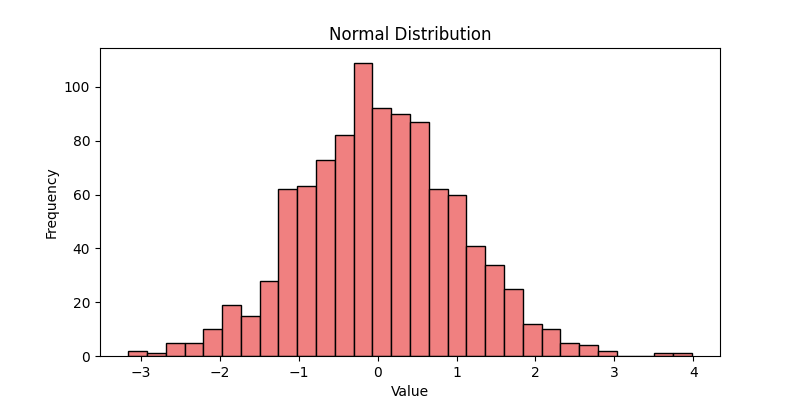
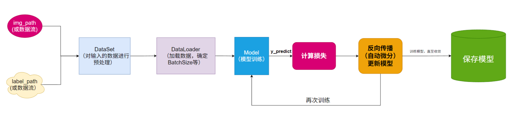
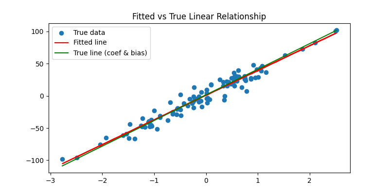

# Pytorch

## Tensors

A Tensor is the core data structure in PyTorch. The term "tensor" carries different meanings across disciplines; in deep learning, a tensor represents a multi-dimensional array — a generalization of scalars, vectors, and matrices. For example, an RGB image array is a 3D tensor, where the first dimension is the image height, the second dimension is the image width, and the third dimension is the color channels.

## Creating Tensors

### Creating Tensors from Data

- `torch.tensor(data)`: Creates a tensor with the specified content.

```python
import torch

# Create a tensor from a scalar
t1 = torch.tensor(1)
print(t1)

# Create a tensor from a list
t2 = torch.tensor([1, 2, 3])
print(t2)

# Create a tensor from a nested list
t3 = torch.tensor([[1, 2, 3], [4, 5, 6]])
print(t3)

# Create a tensor from an ndarray
import numpy as np

a = np.array([[1, 2, 3], [4, 5, 6]])
t4 = torch.tensor(a)
print(t4)
```

### Creating Tensors of Specific Shapes

- All-zeros tensor: `torch.zeros()`
- All-ones tensor: `torch.ones()`
- Constant-value tensor: `torch.full()`
- Create a tensor of a specified shape: `torch.Tensor(size)`
- Create a tensor of a specified dtype: `torch.IntTensor()`, etc.

```python
import torch
# Create an all-zeros tensor
t5 = torch.zeros(2, 3)
print(t5)

# Create an all-ones tensor
t6 = torch.ones(2, 3)
print(t6)

# Create a tensor filled with a constant value
t7 = torch.full((2, 3), 9)
print(t7)

# Create a tensor of a specified shape — not recommended; the values are leftover memory residues
t8 = torch.Tensor(2, 3)
print(t8)

# Create a tensor and specify its dtype
t9 = torch.empty(2, 3, dtype=torch.int16)
print(t9)

# Create a tensor of a specific dtype
# t10 = torch.FloatTensor(2,3)
# t10 = torch.IntTensor(2,3)
# t10 = torch.LongTensor(2,3)
# t10 = torch.ShortTensor(2,3)
# t10 = torch.BoolTensor(2,3)
t10 = torch.ByteTensor(2,3)
print(t10)
```

### Creating Random Tensors

- `torch.rand(size)`: Creates a tensor of the specified shape with values drawn from a **uniform distribution** over [0, 1).
- `torch.randn(size)`: Creates a tensor of the specified shape with values drawn from a **standard normal distribution**.
- `torch.randint(low, high, size)`: Creates an integer tensor of the specified shape with values randomly sampled from [low, high).

```python
import torch
import matplotlib.pyplot as plt

# Create a tensor from a uniform distribution
uniform_tensor = torch.rand(1000)
plt.figure(figsize=(8, 4))
plt.hist(uniform_tensor.numpy(), bins=30, color='skyblue', edgecolor='black')
plt.title('Uniform Distribution')
plt.xlabel('Value')
plt.ylabel('Frequency')
plt.savefig('Uniform Distribution')

# Create a tensor from a normal distribution
normal_tensor = torch.randn(1000)
plt.figure(figsize=(8, 4))
plt.hist(normal_tensor.numpy(), bins=30, color='lightcoral', edgecolor='black')
plt.title('Normal Distribution')
plt.xlabel('Value')
plt.ylabel('Frequency')
plt.savefig('Normal Distribution')
```




### Creating Linear Tensors

- Consecutive integer sequence: `torch.arange(start, end, step)`
- Linearly spaced sequence: `torch.linspace(start, end, steps)`

```python
import torch
# Create a consecutive integer sequence
# torch.arange(start, end, step)
# step specifies the step size
t14 = torch.arange(1, 10, 2)
print(t14)


# Create an arithmetic progression
# torch.linspace(start, end, steps)
# steps specifies the number of elements in the generated tensor
t15 = torch.linspace(1, 10, 3)
print(t15)
```

## Tensor Conversion

### Tensor Type Conversion

- Change the data type of a tensor: `tensor.type(dtype)`
- Convert a tensor to a specific dtype: `tensor.double()`, `tensor.long()`, etc.

```python
import torch

# Create an integer tensor
int_tensor = torch.tensor([1, 2, 3, 4], dtype=torch.int32)
print("Original integer tensor:", int_tensor, "dtype:", int_tensor.dtype)

# Convert to float
float_tensor = int_tensor.float()
print("Tensor after converting to float:", float_tensor, "dtype:", float_tensor.dtype)

# Convert to double precision
double_tensor = int_tensor.double()
print("Tensor after converting to double:", double_tensor, "dtype:", double_tensor.dtype)

# Convert to long integer
long_tensor = float_tensor.long()
print("Float tensor converted to long:", long_tensor, "dtype:", long_tensor.dtype)

# You can also use the to() method for type conversion
to_tensor = int_tensor.to(torch.float16)
print("to() method converting to float16:", to_tensor, "dtype:", to_tensor.dtype)
```

### Conversion Between Tensors and **ndarray**

```python
import torch

# Convert tensor to numpy
x = torch.randint(0, 10, (2, 3))
x = x.numpy()
print(x)

# Convert ndarray back to tensor
t = torch.from_numpy(x)  # Shares memory; torch.tensor(x) would make a copy
print(t)

# Convert ndarray to list (note: at this point x is already an ndarray, calling numpy's tolist(), not a tensor method)
x = x.tolist()
print(x)
```

## Tensor Arithmetic

### Basic Arithmetic Operations

- Addition, subtraction, multiplication, division (+, -, *, /)

- Non-in-place arithmetic: `add()`, `sub()`, `mul()`, `div()`

- In-place arithmetic (modifies the original data): `add_()`, `sub_()`, `mul_()`, `div_()`

  ```python
  import torch
  
  a = torch.tensor([1.0, 2.0, 3.0])
  b = torch.tensor([0.5, 0.5, 0.5])
  
  print("Original a:", a)
  
  # Ordinary addition does not modify the original data
  c = a + b
  print("a + b =", c)
  print("a (unchanged):", a)
  
  # In-place addition using add_
  a.add_(b)
  print("After a.add_(b), a becomes:", a)
  
  # Demonstrate other in-place operations
  d = torch.tensor([2.0, 2.0, 2.0])
  
  print("\nAnother tensor d:", d)
  
  # In-place multiplication mul_
  d.mul_(2)
  print("After d.mul_(2), d:", d)
  
  # In-place subtraction sub_
  d.sub_(1)
  print("After d.sub_(1), d:", d)
  
  # In-place division div_
  d.div_(3)
  print("After d.div_(3), d:", d)
  ```

### Other Mathematical Operations

- Negation: `-`, `neg()`, `neg_()`

- Exponentiation: `**`, `pow()`, `pow_()`

- Square root: `sqrt()`, `sqrt_()`

- Base-e exponentiation: `exp()`, `exp_()`

- Base-e logarithm: `log()`, `log_()`

- Matrix multiplication: `mm()`, `@`, `matmul()`

  ```python
  import torch
  
  a = torch.randint(0, 10, (2,3), dtype=torch.float)
  print(a)
  
  # Negation
  print("-a:", -a)
  print("a.neg():", a.neg())
  print("a.neg_():", a.neg_())
  
  # Exponentiation
  print("a**2:", a**2)
  print("a.pow(2):", a.pow(2))
  print("a.pow_(2):", a.pow_(2))
  
  # Square root
  print("a.sqrt():", a.sqrt())
  print("a.sqrt_():", a.sqrt_())
  
  # Base-e exponentiation
  print("a.exp():", a.exp())
  print("a.exp_():", a.exp_())
  
  # Base-e logarithm
  print("a.log():", a.log())
  print("a.log_():", a.log_())
  
  # Matrix multiplication
  a = torch.randint(0, 10, (2,3))
  b = torch.randint(0, 10, (3,2))
  print("a:", a)
  print("b:", b)
  print("a.mm(b):", a.mm(b))  # Only supports 2D tensors
  print("a.matmul(b):", a.matmul(b))  # Supports tensors of arbitrary dimensions
  print("a @ b:", a @ b)  # Supports tensors of arbitrary dimensions
  ```

## Tensor Computation Functions

- `sum()`: Sum
- `mean()`: Mean
- `max()`: Maximum
- `min()`: Minimum
- `argmax()`: Index of the maximum value
- `argmin()`: Index of the minimum value
- `std()`: Standard deviation
- `unique()`: Deduplication
- `sort()`: Sorting

```python
import torch

a = torch.randint(0, 10, (2, 3), dtype=torch.float)
print("a:", a)

# Sum
print("sum:", a.sum())

# Sum along a specified dimension
print("sum-dim:", a.sum(dim=0))

# Mean
print("mean:", a.mean())
print("mean-dim:", a.mean(dim=1))

# Maximum
print("max:", a.max())
print("max-dim:", a.max(dim=0))

# Minimum
print("min:", a.min())
print("min-dim:", a.min(dim=1))

# Index of the maximum value
print("argmax:", a.argmax())
print("argmax-dim:", a.argmax(dim=1))

# Index of the minimum value
print("argmin:", a.argmin())
print("argmin-dim:", a.argmin(dim=1))

# Standard deviation
print("std:", a.std())
print("std-dim:", a.std(dim=1))

# Variance
print("var:", a.var())
print("var-dim:", a.var(dim=1))

# Deduplication
print("unique:", a.unique())

# Sorting
print("sort:", a.sort())
print("sort-dim:", a.sort(dim=0))
```

## Tensor Indexing Operations

- Row indexing
- Column indexing
- List indexing
- Range indexing
- Boolean indexing
- Multi-dimensional indexing

```python
import torch

torch.manual_seed(22)

# Tensor indexing operations
x = torch.randint(0, 10, (4, 5))
print(x)

# Row indexing
print(x[0])  # First row
print(x[0:2])  # First two rows

# Column indexing
print(x[:, 0])  # First column
print(x[:, 0:2])  # First two columns

# List indexing
print(x[[0, 1], [0, 1]])  # Returns (0, 0) and (1, 1)
print(x[[0, 1], :])  # Returns (0, :) and (1, :)

# Range indexing
print(x[1:3, 1:3])  # Returns rows 2~3, columns 2~3 (indices 1, 2; slice is inclusive of start, exclusive of end)

# Boolean indexing
# Returns all elements greater than 5
print(x[x > 5])

# Returns elements in the second row that are greater than 5
print(x[1, x[1] > 5])

# Returns elements in the second column that are greater than 5
print(x[:, 1][x[:, 1] > 5])
# Multi-dimensional indexing
x = torch.randint(0, 10, (3, 4, 5))
print(x)

# Get the first element along axis 0
print(x[0, :, :])

# Get the first element along axis 1
print(x[:, 0, :])

# Get the first element along axis 2
print(x[:, :, 0])
```

## Tensor Shape Operations

- `reshape()`: Adjust the shape.
- `transpose()`: Swap two dimensions.
- `permute()`: Rearrange multiple dimensions.
- `unsqueeze()`: Add a dimension of size 1 at a specified position.
- `squeeze()`: Remove dimensions of size 1.
- `view()`: Adjust the tensor shape; requires contiguous memory.
- `is_contiguous()`: Check whether the memory is contiguous.
- `contiguous()`: Convert to contiguous memory.

```python
import torch

x = torch.randn(2, 3, 4)
# print(x)
print(x.shape)
print(x.size())  # The size() method, like shape, returns the tensor's shape

# Adjust the shape
x = x.reshape(2, 12)  # Reshape to 2 rows and 12 columns
print("x.shape1:", x.shape)
x = x.reshape(-1, 3)  # Automatically infer the number of rows; set columns to 3 (the number of rows is computed automatically)
print("x.shape2:", x.shape)

# Swap dimensions
x = torch.randn(2, 3, 4)
x = x.transpose(1, 2)
print(x.shape)

# Rearrange multiple dimensions
# The 3rd dimension becomes the 1st, the 2nd stays the 2nd, the 1st becomes the 3rd
x = x.permute(2, 1, 0)
print(x.shape)

# Add a dimension of size 1 at the specified position
x = x.unsqueeze(dim=2)
print(x.shape)

# Remove a dimension of size 1 at the specified position (if no dimension of size 1 exists at that position, the original tensor is returned)
x = x.squeeze(dim=1)
print(x.shape)

# Adjust the shape — requires contiguous memory
# Operations like transpose/permute are "views": the underlying data is not moved, only metadata such as stride is modified,
# which causes the logical order of the tensor to differ from its physical order in memory — this is the source of "non-contiguous memory"
# (unsqueeze/squeeze themselves generally do not break contiguity; the non-contiguity here is caused by the earlier transpose/permute)
# Using the view method when memory is not contiguous will raise an error
# x = x.view(3,-1)
# print(x)

# Check whether the memory is contiguous
print(x.is_contiguous())

# Convert to contiguous memory
x = x.contiguous()
print(x.is_contiguous())

# Adjust the shape — requires contiguous memory
x = x.view(3, -1)
print(x.shape)
```

## Tensor Concatenation Operations

- `cat()`: Tensor concatenation along an existing dimension. All dimensions other than the concatenation dimension must have the same size.
- `stack()`: Tensor stacking along a new dimension. All tensors must have the same shape.

```python
import torch

# Create two tensors
x = torch.rand(2, 3, 4)
y = torch.rand(4, 3, 4)

# cat() concatenates along the specified dimension
# x and y differ only along axis 0; all other axes have the same size

z = torch.cat([x, y], dim=0)
print(z.shape)  # Result is [6, 3, 4]
# z = torch.cat([x, y], dim=1)  # Would raise an error, because x and y differ only along axis 0; they can only be concatenated along axis 0

# Stack along a new dimension (stacked tensors must have the same shape, otherwise an error is raised)
x = torch.rand(2, 3, 4)
y = torch.rand(2, 3, 4)
# z = torch.stack([x, y], dim=2)  # dim=2, the shape of z is [2, 3, 2, 4]
z = torch.stack([x, y], dim=3)
print(z.shape)
```

## Automatic Differentiation Module

When training a neural network, the most commonly used algorithm is Backpropagation.

In this algorithm, parameters (model weights) are adjusted based on the gradient of the loss function with respect to each parameter. To compute these gradients, PyTorch has a built-in automatic differentiation module — specifically, an automatic differentiation engine called `torch.autograd` — which supports automatic gradient computation over arbitrary computation graphs. A computation graph is a directed acyclic graph (DAG) formed by tensor operations (not limited to neural networks; any tensor computation builds a graph). PyTorch uses dynamic graphs, which are constructed on-the-fly as the forward computation executes.


Automatic differentiation, i.e., automatically computing gradients, can be illustrated with linear regression:

- Assume the model is $y=w·x+b$

- Given feature values $x$ and target values $y$

- Initialize random weights $w$ and bias $b$

- The model $y'=w·x+b$ produces a fitted output

- Then compute the loss function comparing the fitted output against the ground truth

- Use the loss function to compute the partial derivatives with respect to $w$ and $b$ to obtain the gradients (the gradient determines the direction of descent; together with the learning rate $\eta$, it determines the step size)

  $$
  w_n=w_{n-1}-\eta\frac{\partial Loss}{\partial w}
  $$

  $$
  b_n=b_{n-1}-\eta\frac{\partial Loss}{\partial b}
  $$

- Update $w$ and $b$, then refit

The automatic differentiation module essentially computes the gradients of the weights $w$ and bias $b$ with respect to the loss function $Loss$ automatically.

Use `backward()` to compute the gradients, and the `grad` attribute to access them.

```python
import torch

# Prepare data: features and target values
x = torch.tensor(5)  # Feature
y = torch.tensor(0.)

# Initialize parameters: weight and bias
w = torch.tensor(1., requires_grad=True, dtype=torch.float32)
b = torch.tensor(3., requires_grad=True, dtype=torch.float32)

# Build a neural network and produce an output
z = w * x + b

# Compute the loss
loss = torch.nn.MSELoss()
loss = loss(z, y)  # loss=(z-y)**2

# Backpropagation, automatic differentiation, compute gradients
loss.backward()

# Access the gradients
print(w.grad)  # 80
print(b.grad)  # 16
```

## Linear Regression



```python
import torch
import torch.nn as nn
import torch.optim as optim
import matplotlib.pyplot as plt
from sklearn.datasets import make_regression

# Generate data; coef is w
x, y, coef = make_regression(n_samples=100, n_features=1, noise=10, bias=1.5, coef=True, random_state=22)
x = x.astype('float32')
y = y.astype('float32').reshape(-1, 1)

from torch.utils.data import TensorDataset, DataLoader

# Create a Dataset object
dataset = TensorDataset(torch.from_numpy(x), torch.from_numpy(y))

# Create a DataLoader object, batch_size=10
dataloader = DataLoader(dataset, batch_size=10, shuffle=True, num_workers=0)

# Convert to torch tensors
X = torch.from_numpy(x)
Y = torch.from_numpy(y)

# Model definition (a single Linear layer)
model = nn.Linear(1, 1)  # 1 input, 1 output

# Loss function and optimizer
criterion = nn.MSELoss()  # Mean Squared Error
optimizer = optim.SGD(model.parameters(), lr=0.01)  # learning rate

# Why does full batch gradient descent converge slower than mini-batch?
#
# In full batch gradient descent, each parameter update requires iterating through the entire training dataset
# to compute the full gradient. In terms of raw computation per epoch, it is comparable to mini-batch since
# both must traverse the entire dataset once. The slowness comes from the fact that each parameter update is
# very expensive and only one update occurs per epoch (low update frequency).
# Moreover, because the entire dataset is used each time, the update direction is consistently "stable",
# which can cause the model to get stuck in flat regions, leading to slow convergence.
#
# Mini-batch gradient descent, on the other hand, computes gradients and updates parameters using a small
# batch of data each time. With mini-batch, parameter updates are more frequent, and the convergence process
# is more "jumpy", which can help escape flat regions and even local minima more quickly.
# Additionally, the noise introduced by mini-batches gives the updates a certain "randomness", which in
# practice helps the model achieve better optimization results more quickly.


# Train the model
losses = []
for epoch in range(200):
    epoch_loss = 0.0  # Accumulate the total loss for this epoch
    for xb, yb in dataloader:  # Train on each batch from the DataLoader
        y_pred = model(xb)  # Forward pass
        loss = criterion(y_pred, yb)  # Compute the loss
        optimizer.zero_grad()  # Zero the gradients
        loss.backward()  # Backpropagation
        optimizer.step()  # Update parameters: w = w - lr * w.grad
        epoch_loss += loss.item() * xb.shape[0]  # Weighted cumulative loss
    losses.append(epoch_loss / len(X))  # Record the average loss for this epoch

# Visualize the results
plt.figure(figsize=(8, 4))
plt.plot(losses)
plt.title('Loss during training')
plt.xlabel('Epoch')
plt.ylabel('MSE Loss')
plt.savefig('Loss during training')

# Plot both the fitted line (red) and the true line (green)
plt.figure(figsize=(8, 4))
plt.scatter(X.numpy(), Y.numpy(), label='True data')

# y_fit = torch.tensor([v*model.weight+model.bias for v in X])
with torch.no_grad():  # Disable gradient computation
    y_fit = model(X).numpy()

# Fitted result (red line)
plt.plot(X.numpy(), y_fit, color='red', label='Fitted line')
# True line (green line)
x_sorted = X.numpy().flatten()
sort_idx = x_sorted.argsort()
x_sorted = x_sorted[sort_idx]
y_true = coef * x_sorted + 1.5
plt.plot(x_sorted, y_true, color='green', label='True line (coef & bias)')
plt.title('Fitted vs True Linear Relationship')
plt.legend()
plt.savefig('Fitted vs True Linear Relationship')

# Print model parameters
print("Learned weight:", model.weight.item())
print("Learned bias:", model.bias.item())
print("True coef:", coef)
```




## Dataset

Dataset is an abstract class in PyTorch used to represent a dataset. It allows users to define a custom dataset interface so that data can be accessed in a uniform way.

PyTorch requires that a custom Dataset inherit from `torch.utils.data.Dataset` and implement three core methods — these three methods serve as the "instruction manual" for the data container, telling the framework "how much data there is and how to retrieve it":

- `__init__(self)`: Load the raw data and save the configuration needed for data processing, such as sample size, total number of samples, etc. — analogous to "packing all parcels into a shipping box".
- `__len__(self)`: Tells the framework how many samples are in the container; simply return the total number of samples.
- `__getitem__(self, index)`: Retrieve a sample by its index.

```python
# Custom Dataset
from torch.utils.data import Dataset


class MyDataset(Dataset):
    def __init__(self):
        # Initialize data, e.g., read from a file
        self.data = ['李云龙', '楚云飞', '赵刚', '丁伟', '孔捷', '常乃超', '魏大勇', '秀芹']
        self.total = len(self.data)

    def __getitem__(self, index):
        # Retrieve the data corresponding to the index, i.e., return a single sample
        return self.data[index]

    def __len__(self):
        # Return the length of the dataset, i.e., the number of samples
        return self.total


if __name__ == '__main__':
    dataset = MyDataset()
    print(dataset[0])
```

## DataLoader

DataLoader is a utility in PyTorch for loading data in batches.

It allows users to create a data loader from a custom Dataset object for batch loading and processing of data.

DataLoader can split the dataset by batch size and provides multi-process data loading (via the `num_workers` parameter; officially called multi-process data loading, which uses child processes to bypass Python's GIL) and prefetching functionality.

```python
from torch.utils.data import DataLoader
from torch.utils.data import Dataset


class MyDataset(Dataset):
    def __init__(self):
        # 1. Initialize data, e.g., read from a file
        self.data = ['李云龙', '楚云飞', '赵刚', '丁伟', '孔捷', '常乃超', '魏大勇', '秀芹']
        self.total = len(self.data)

    def __getitem__(self, index):
        # 2. Retrieve the data corresponding to the index, i.e., return a single sample
        return self.data[index]

    def __len__(self):
        # 3. Return the length of the dataset, i.e., the number of samples
        return self.total

# Create a DataLoader
# batch_size: the size of each batch
# shuffle: whether to shuffle the data (data is shuffled first, then split into batches)
dataloader = DataLoader(MyDataset(), batch_size=3, shuffle=True)

# Iterate over batches
for data in dataloader:
    print(data)
```

### The shuffle Parameter of DataLoader

- `shuffle=True`
  - Definition: Before each epoch, the dataset is randomly shuffled (by index).
  - Prevents overfitting: Randomly shuffling the data prevents the model from memorizing the order of the data, thereby reducing the risk of overfitting.
  - Better generalization: Shuffling the data helps the model generalize better to unseen data, since the order in which it sees the data during training is not fixed.
  - Better gradient descent performance: Stochastic Gradient Descent (SGD) generally performs better on randomized data, as it can better explore different regions of the loss function and avoid getting stuck in local minima.
- `shuffle=False`
  - Definition: The dataset is not shuffled before each epoch; data is loaded in a fixed order.
  - Fixed data order: The model sees the data in the same order every epoch.
  - Potential overfitting risk: If the dataset has some inherent ordering, the model may memorize this order, leading to overfitting.
  - Potentially poorer gradient descent performance: Under a fixed data order, gradient descent may encounter issues such as getting stuck in local minima more easily; the training process may be less stable than with shuffling.
- Impact on the loss
  - `shuffle=True`: The batch-level loss curve is typically **more jittery** (not smoother) due to randomness, but the gradient of each batch is an approximately unbiased estimate of the full-data gradient, eliminating the systematic bias introduced by data order. Overall convergence is healthier and generalization is better.
  - `shuffle=False`: The loss function changes may exhibit certain patterns or periodicity, since the data order is fixed for each epoch. If the data has some inherent ordering, the model may achieve lower training loss more quickly on that order, but this does not necessarily mean the model generalizes better.

- Conclusion
  - On the training set, it is generally recommended to set `shuffle=True` to better train the model and improve its generalization ability.
  - On the validation set or test set, `shuffle=False` is typically used to ensure evaluation consistency.