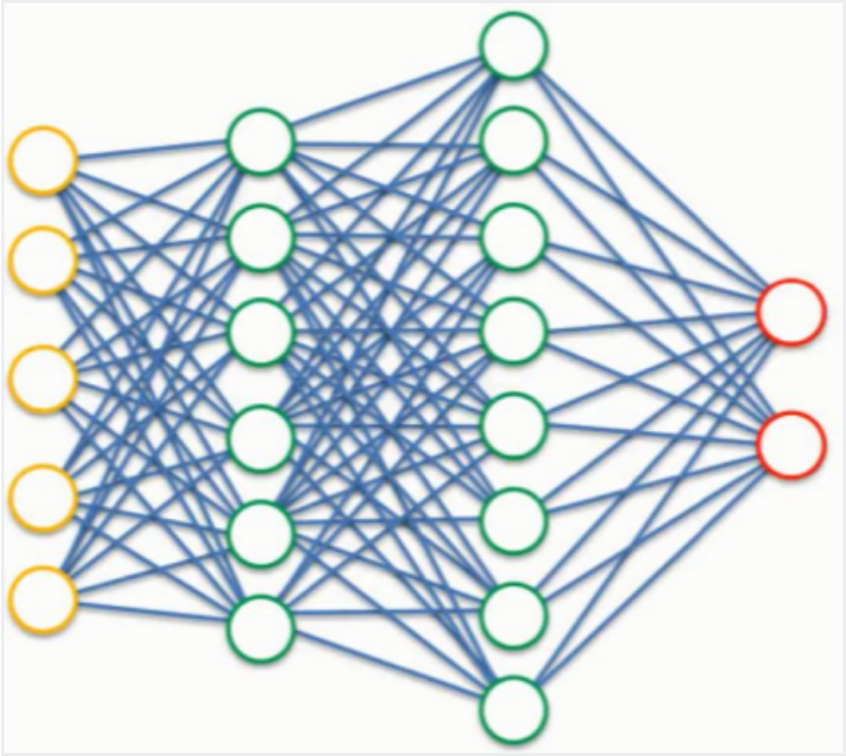

# Pytorch Classification and Regression

## Principles of Classification and Regression

- Classification predicts categories; the model's output is a probability distribution

- Regression predicts values; the model's output is a real number

  

### Classification

- Why split into training set, validation set, and test set: to prevent information leakage from the test set caused by manual hyperparameter tuning

- For a 3-class classification with true labels, One-hot encoding is used to convert positive integers into vector representations, generating a vector of length equal to the total number of classes K (K must be greater than the largest class index, since indexing starts at 0), where only the position corresponding to that integer is 1 and all other positions are 0. For example:

  - 0 -> [1, 0, 0]
  - 1 -> [0, 1, 0]
  - 2 -> [0, 0, 1]

  

- Example output for a 3-class classification problem: [0.2, 0.7, 0.1], where the result is a probability distribution, obtained using Softmax (output activation function)

### Softmax Output Activation Function

$$
\sigma(z)_j=\frac{e^{z_j}}{\sum_{k=1}^{K}e^{z_k}},j=1,2...K
$$


- Dividing the numerator by the sum achieves **Normalization**, ensuring that all output values sum to 1
- It preserves the advantage of the maximum value while providing a "softened" probability distribution. Even smaller values retain non-zero probabilities. This makes the function differentiable everywhere, which is ideal for neural network training
- During training, Softmax is almost always used in conjunction with the Cross-Entropy Loss function
  - Softmax is responsible for converting model outputs into probabilities
  - Cross-Entropy is responsible for measuring the distance between the "predicted probabilities" and the "true labels (One-hot encoding)"

> **Supplementary Note: Breaking Down the Softmax Formula**
>
> The meaning of each symbol in the formula:
>
> | Symbol | Meaning | Example |
> |------|------|------|
> | $z_j$ | The **raw output score** (also called logits) for class $j$, before any normalization | If the model outputs `[2.0, 1.0, 0.1]`, then $z_1=2.0$, $z_2=1.0$, $z_3=0.1$ |
> | $K$ | Total number of classes | In a 3-class problem, $K=3$ |
> | $e$ | Euler's number $\approx 2.718$ | $e^{z_j}$ means $e$ raised to the power of $z_j$ |
> | $\sum_{k=1}^{K}e^{z_k}$ | The **sum** of $e^{z_k}$ across all classes | $e^{2.0}+e^{1.0}+e^{0.1} \approx 7.39+2.72+1.11=11.22$ |
> | $\sigma(z)_j$ | The **final probability** for class $j$ | $\sigma(z)_1 = \frac{7.39}{11.22} \approx 0.659$ |
>
> **Intuitive understanding**: Softmax does two things:
> 1. Uses $e^{z_j}$ to convert scores into positive numbers (the exponential function $e^x$ is always > 0), while **amplifying** the gap between high and low scores
> 2. Divides by the sum so that all probabilities add up to exactly 1
>
> **Why use $e$ instead of directly dividing by the sum?**
> Because the exponential function amplifies differences more effectively. Suppose logits are `[3, 1]`:
> - Direct normalization: `[3/4, 1/4]` = `[0.75, 0.25]`
> - Softmax: `[e³/(e³+e¹), e¹/(e³+e¹)]` ≈ `[0.88, 0.12]`
>
> Softmax makes the "winner's" advantage more pronounced, while the "loser" is never zero (differentiable everywhere).

### Cross-Entropy Loss vs Mean Squared Error Loss: A Comparative Analysis

**Mean Squared Error (Regression)** formula:
$$
MSE=\frac{1}{n}\sum_{i=1}^{n}(y_i-\hat{y_i})^2
$$
**Cross-Entropy Loss** formula:
$$
L=\frac{1}{N}\sum_{i}L_i=-\frac{1}{N}\sum_{i}\sum_{c=1}^{M}y_{ic}log(p_{ic})
$$

> **Supplementary Note: Breaking Down the Cross-Entropy Formula**
>
> The formula looks complex; let's break it down:
>
> | Symbol | Meaning | Example |
> |------|------|------|
> | $N$ | Total number of samples | A batch with 64 images, $N=64$ |
> | $M$ | Total number of classes | FashionMNIST has 10 clothing classes, $M=10$ |
> | $y_{ic}$ | The **true label** of the $i$-th sample for class $c$ (One-hot, either 0 or 1) | The sample is a "Dress" (label 3 in FashionMNIST, indexing from 0), so $y_i = [0,0,0,1,0,0,0,0,0,0]$ |
> | $p_{ic}$ | The **predicted probability** of the $i$-th sample for class $c$ (Softmax output) | Model predicts $p_i = [0.1, 0.05, 0.02, 0.7, ...]$ |
> | $\log$ | Natural logarithm (base $e$), i.e., $\ln$ | $\ln(0.7) \approx -0.357$, $\ln(0.1) \approx -2.303$ |
>
> **Intuitive understanding** (for a single sample):
>
> $$L_i = -\sum_{c=1}^{M} y_{ic} \cdot \ln(p_{ic})$$
>
> Since $y_{ic}$ is 1 only for the correct class and 0 everywhere else, this sum actually has **only one non-zero term**:
>
> $$L_i = -\ln(p_{i,\text{correct class}})$$
>
> In other words, Cross-Entropy Loss **only cares about the probability the model assigns to the "correct answer"**:
>
> | Predicted probability for correct class | $-\ln(p)$ | Meaning |
> |:---:|:---:|------|
> | 0.9 | $-\ln(0.9) \approx 0.105$ | Prediction is accurate, loss is very small ✓ |
> | 0.5 | $-\ln(0.5) \approx 0.693$ | Uncertain, moderate loss |
> | 0.1 | $-\ln(0.1) \approx 2.303$ | Nearly wrong, large loss ✗ |
> | 0.01 | $-\ln(0.01) \approx 4.605$ | Completely wrong, huge loss ✗✗ |
>
> When $p \to 1$, $-\ln(p) \to 0$ (loss approaches 0, perfect prediction).
> When $p \to 0$, $-\ln(p) \to +\infty$ (loss approaches infinity, extremely heavy penalty).

- When the output is close to the true value, both Cross-Entropy and Mean Squared Error (MSE) will approach 0
- Cross-Entropy has an advantage that MSE lacks: it avoids the problem of slow learning — when MSE is paired with Sigmoid/Softmax, the gradient becomes small and learning slows down (note that this effect is limited to the output layer; the learning speed of hidden layers is closely related to their activation functions)
- The main reason is that when logistic regression is paired with the MSE loss function and trained with gradient descent, the model's learning rate can be very slow at the beginning of training (MSE loss function)
- Mean Squared Loss: assumes errors follow a normal distribution, suitable for linear outputs (such as regression problems). It is characterized by applying heavier penalties for larger deviations from the true value, which is not suitable for classification problems
- Cross-Entropy Loss: assumes errors follow a Bernoulli distribution, can be viewed as measuring the similarity between the predicted probability distribution and the true probability distribution, and has excellent performance in classification problems

Example:

| Prediction     | True  | Correct? |
| ----------- | ----- | -------- |
| 0.3 0.3 0.4 | 0 0 1 | Yes     |
| 0.3 0.4 0.3 | 0 1 0 | Yes     |
| 0.1 0.2 0.7 | 1 0 0 | No     |

- MSE
  $$
  sample\_1\_loss=(0.3-0)^2+(0.3-0)^2+(0.4-1)^2=0.54
  $$

  $$
  sample\_2\_loss=(0.3-0)^2+(0.4-1)^2+(0.3-0)^2=0.54
  $$

  $$
  sample\_3\_loss=(0.1-1)^2+(0.2-0)^2+(0.7-0)^2=1.34
  $$

  Average loss over all samples:
  $$
  MSE=\frac{0.54+0.54+1.34}{3}=0.81
  $$

  > Note: The calculation here sums across classes for each sample, then averages across samples. PyTorch's `nn.MSELoss` defaults to averaging over **all elements** (9 elements in this case, yielding $2.42/9 \approx 0.269$), which differs by a factor of 3 (the number of classes). This is just a convention difference and does not affect the comparative conclusion.

- L
  $$
  sample\_1\_loss=-(0*log(0.3)+0*log(0.3)+1*log(0.4))=0.92
  $$

  $$
  sample\_2\_loss=-(0*log(0.3)+1*log(0.4)+0*log(0.3))=0.92
  $$

  $$
  sample\_3\_loss=-(1*log(0.1)+0*log(0.2)+0*log(0.7))=2.30
  $$

  Average loss over all samples:
  $$
  L=\frac{0.92+0.92+2.30}{3}=1.38
  $$

- **Cross-Entropy Loss better captures the differences in prediction quality. Compared to MSE, Cross-Entropy Loss has a larger gradient, enabling the model to converge faster.**

> **Supplementary Note: Why does MSE cause slow learning in classification problems?**
>
> This is one of the most important conclusions in the notes. Let's understand it deeply.
>
> **The essence of the problem**: The final layer of a classification model typically uses **Sigmoid** (binary classification) or **Softmax** (multi-class classification) to convert outputs into probabilities. When MSE is paired with Sigmoid/Softmax, "vanishing gradients" can occur.
>
> Take binary classification + Sigmoid as an example (the simplest mathematically):
> - Model output after Sigmoid: $\hat{y} = \sigma(z) = \frac{1}{1+e^{-z}}$
> - MSE loss: $L = \frac{1}{2}(\hat{y} - y)^2$
> - Gradient with respect to parameter $w$ (chain rule): $\frac{\partial L}{\partial w} = (\hat{y}-y) \cdot \sigma'(z) \cdot x$
>
> **How is this formula derived? — Step-by-step derivation via the chain rule**
>
> We have three nested components, from outermost to innermost:
>
> 1. **Loss function** $L = \frac{1}{2}(\hat{y} - y)^2$ (outermost: computes error using predicted value $\hat{y}$)
> 2. **Sigmoid activation** $\hat{y} = \sigma(z) = \frac{1}{1+e^{-z}}$ (middle: converts raw score $z$ into probability)
> 3. **Linear transformation** $z = wx + b$ (innermost: linear combination of parameter $w$ and input $x$)
>
> To find $\frac{\partial L}{\partial w}$, we ask "how sensitive is the loss $L$ to changes in parameter $w$?" By the chain rule, we differentiate from outside to inside and multiply:
>
> $$\frac{\partial L}{\partial w} = \underbrace{\frac{\partial L}{\partial \hat{y}}}_{\text{Step ①}} \cdot \underbrace{\frac{\partial \hat{y}}{\partial z}}_{\text{Step ②}} \cdot \underbrace{\frac{\partial z}{\partial w}}_{\text{Step ③}}$$
>
> **Step ①**: Derivative of loss with respect to prediction
>
> $$L = \frac{1}{2}(\hat{y} - y)^2$$
> $$\frac{\partial L}{\partial \hat{y}} = \frac{1}{2} \cdot 2(\hat{y} - y) \cdot 1 = \hat{y} - y$$
>
> Meaning: if the predicted value $\hat{y}$ is larger than the true value $y$, increasing $\hat{y}$ makes the loss larger (positive derivative); the reverse is also true.
>
> **Step ②**: Derivative of prediction with respect to raw score (derivative of Sigmoid)
>
> $$\hat{y} = \sigma(z) = \frac{1}{1+e^{-z}}$$
> $$\frac{\partial \hat{y}}{\partial z} = \sigma'(z) = \sigma(z)(1-\sigma(z)) = \hat{y}(1-\hat{y})$$
>
> This is an elegant property of the Sigmoid function: its derivative can be expressed in terms of the function value itself.
>
> **Step ③**: Derivative of raw score with respect to weight
>
> $$z = wx + b$$
> $$\frac{\partial z}{\partial w} = x$$
>
> Meaning: the contribution of weight $w$ to $z$ is exactly the input $x$.
>
> **Multiplying the three steps together to get the final gradient**:
>
> $$\boxed{\frac{\partial L}{\partial w} = (\hat{y} - y) \cdot \sigma'(z) \cdot x}$$
>
> This can also be written as $\frac{\partial L}{\partial w} = (\hat{y} - y) \cdot \hat{y}(1-\hat{y}) \cdot x$
>
> **Intuitive understanding**: This gradient is determined by three factors:
> - $(\hat{y} - y)$: the gap between prediction and true value; the larger the gap, the larger the gradient ✓
> - $\sigma'(z)$: the slope of Sigmoid at the current point — this is **the problem** (see below)
> - $x$: the magnitude of the input
>
> The problem lies in $\sigma'(z)$. Look at the Sigmoid function:
>
> ```
> σ(z) value:    0.0    0.1    0.5    0.9    0.99
> σ'(z) value:   0.0    0.09   0.25   0.09   0.0099
> ```
>
> **When the model is very confident (0.99 or 0.01) but happens to be wrong**, $\sigma'(z)$ approaches 0, the gradient approaches 0, and the parameters barely update — the model is "stuck."
>
> **Compare with Cross-Entropy** (paired with Sigmoid):
> - $L = -[y\ln(\hat{y}) + (1-y)\ln(1-\hat{y})]$
> - $\frac{\partial L}{\partial w} = (\hat{y} - y) \cdot x$
>
> Notice anything? **$\sigma'(z)$ is canceled out!** The gradient is directly equal to "prediction minus true value." The more wrong the prediction, the larger the gradient, the faster the learning.
>
> **Intuitive analogy**:
> - MSE + Sigmoid = a teacher who, when the student is wildly wrong, lazily gives little correction (small gradient)
> - Cross-Entropy + Sigmoid/Softmax = a teacher who, the more wildly wrong the student is, the more forceful the correction (large gradient)
>
> This is why **the standard setup for classification is Softmax + Cross-Entropy**, while **regression uses MSE** (regression's **output layer** does not go through Sigmoid/Softmax, so the vanishing gradient problem described above does not occur at the output layer; however, if hidden layers use activation functions like Sigmoid/Tanh, vanishing gradients can still occur).

### Standardization and Normalization

`transforms.Normalize(mean, std)` normalizes each channel of the image tensor. The `mean` and `std` here are determined based on the characteristics and requirements of the dataset.

By combining the `Normalize` transform with other transforms (such as `ToTensor()`), normalization can be automatically applied when loading the dataset, so that the training data is normalized before being input to the model.

`transforms.ToTensor()` primarily performs the following operations:

- Scales pixel values: normalizes the pixel values of each channel in the image from [0, 255] to [0.0, 1.0] (achieved by dividing each pixel value by 255)
- Adds a channel dimension: for single-channel grayscale images, it adds a channel dimension, making it a tensor with three dimensions, i.e., [channels, height, width] (e.g., 28×28 grayscale → `[1, 28, 28]`); for three-channel color images, it retains the three channels
- Converts data type: converts image data to floating-point type (float32), since PyTorch neural network layers typically process floating-point data

#### Variance Formula

$$
\sigma^2=\frac{1}{N}\sum_{i=1}^{N}(x_i-\mu)^2,\mu=\frac{1}{N}\sum_{i=1}^{N}x_i
$$

**Equivalent expansion:**
$$
\frac{1}{N}\sum_{i=1}^{N}(x_i-\mu)^2=\frac{1}{N}\sum_{i=1}^{N}x_i^2-2\mu·\frac{1}{N}\sum_{i=1}^{N}x_i+\mu^2=\frac{1}{N}\sum_{i=1}^{N}x_i^2-\mu^2
$$

> **Supplementary Note: Derivation of the Variance Formula Expansion**
>
> This expansion is key to computing variance in code (without rewriting loops). Let's derive it step by step:
>
> **Step 1**: Expand the squared term
> $$(x_i - \mu)^2 = x_i^2 - 2\mu x_i + \mu^2$$
>
> **Step 2**: Sum over $i$ from 1 to $N$
> $$\sum_{i=1}^{N}(x_i - \mu)^2 = \sum x_i^2 - 2\mu\sum x_i + N\mu^2$$
>
> **Step 3**: Divide by $N$, processing each term
> $$\frac{1}{N}\sum(x_i-\mu)^2 = \underbrace{\frac{1}{N}\sum x_i^2}_{\text{mean of x²}} - 2\mu \cdot \underbrace{\frac{1}{N}\sum x_i}_{\text{mean of x}=\mu} + \mu^2$$
>
> **Step 4**: Substitute $\frac{1}{N}\sum x_i = \mu$
> $$= \frac{1}{N}\sum x_i^2 - 2\mu^2 + \mu^2$$
> $$= \frac{1}{N}\sum x_i^2 - \mu^2$$
>
> **Conclusion**: $\boxed{Var(X) = E[X^2] - (E[X])^2}$
>
> This is the mathematical basis for the code `var = mean_of_squares - mean ** 2` later on — only one pass is needed to compute `mean` and `mean_of_squares`, no need for two passes.
>
> **Concrete example**: Data `[2, 4, 6]`
> - $\mu = (2+4+6)/3 = 4$
> - $E[X^2] = (4+16+36)/3 = 18.67$
> - $Var = 18.67 - 16 = 2.67$
> - Verification: $[(2-4)² + (4-4)² + (6-4)²]/3 = (4+0+4)/3 = 2.67$ ✓

```python
# Define dataset transforms
transform = transforms.Compose([
    transforms.ToTensor(), 
    transforms.Normalize(mean, std)
])
```

### Early Stopping

To avoid overfitting.

| Parameter  | Description                                                         |
| --------- | ------------------------------------------------------------ |
| min_delta | Minimum change in the monitored quantity to qualify as an improvement, i.e., an absolute change smaller than min_delta will not be considered an improvement |
| Patience  | Number of epochs with no improvement (change smaller than min_delta) after which training will stop      |

### ModelCheckpoint (Model Saving)

- For deployment
- To avoid losing progress if training is interrupted midway; training can resume from the last saved checkpoint

 ```python
 torch.save(model.state_dict(), save_path)
 # state_dict() stores the weight and bias of each layer
 # save_path is the save path; the industry default is best_model.pth
 ```

### TensorBoard

- `pip install tensorboard`

- tensor records model output logs

- ```bash
  tensorboard --logdir="E:/xxx/tensorboard_logs" --host 0.0.0.0 --port 8848
  Must be an absolute path
  ```

- Access: `http://localhost:8848/`


### Core Concepts Quick Reference (before looking at the code)

Some key terms will appear in the code later. Let's understand them first:

#### 1. Logits (Raw Scores / Unnormalized Scores)

**Logits** are the **raw numerical values** output by the final layer of a neural network, before they have been transformed into probabilities by Softmax.

| | Logits | Probabilities (after Softmax) |
|---|---|---|
| Value range | $(-\infty, +\infty)$, can be positive or negative | $[0, 1]$, sum to 1 |
| Example | `[2.0, 1.0, 0.1]` | `[0.66, 0.24, 0.10]` |
| Produced by | `nn.Linear` fully connected layer directly | Applying Softmax to logits |

> PyTorch's `nn.CrossEntropyLoss()` **takes logits as input** and internally applies Softmax automatically. So your model's last layer does not need Softmax!

#### 2. Epoch, Batch, Iteration

These are the three most easily confused concepts. Here's an analogy:

> **You are memorizing a 1000-page vocabulary book:**
> - **Epoch**: Going through the entire book from cover to cover **once**. epoch=10 means you've gone through it 10 times.
> - **Batch**: You can't memorize the whole book at once; you only memorize a **few pages** at a time. batch_size=64 means you memorize 64 pages at a time.
> - **Iteration**: Each memorization session (one batch) is one iteration. 1000 pages ÷ 64 pages/session ≈ 16 iterations = 1 epoch.

```
Training set of 55,000 images, batch_size = 64
    → 1 epoch = ceil(55,000 / 64) = 860 iterations
    → Each iteration processes 64 images
    → 10 epochs = 10 × 860 = 8,600 parameter updates
```

#### 3. The Five Steps of Gradient Descent (the core training loop)

```python
optimizer.zero_grad()   # ① Clear gradients from the previous round (PyTorch accumulates by default)
outputs = model(images)  # ② Forward propagation: input → model → prediction
loss = criterion(outputs, labels)  # ③ Compute loss: measure the gap between prediction and truth
loss.backward()          # ④ Backpropagation: automatically compute gradients for each parameter
optimizer.step()         # ⑤ Update parameters: w_new = w_old - lr × gradient
```

**Analogy**: You are on a mountain trying to reach the lowest point of the valley (minimize loss):
1. Put away your previous notes (clear gradients)
2. Look around at the terrain (forward propagation)
3. Calculate how far you still are from the valley floor (compute loss)
4. Determine which direction is downhill (backpropagation to compute gradients)
5. Take a step downhill (update parameters)

#### 4. ReLU Activation Function: $f(x) = \max(0, x)$

| Input | Output |
|:---:|:---:|
| 3 | 3 (positive values pass through directly) |
| -5 | 0 (negative values become 0) |

**Why is it needed?** Without ReLU, a multi-layer fully connected network is equivalent to a single layer (the composition of linear transformations is still linear). ReLU introduces **non-linearity**, allowing the network to learn complex curves and decision boundaries.

#### 5. Overfitting

| Phenomenon | Training Set | Validation/Test Set |
|------|:---:|:---:|
| Underfitting | Poor performance | Poor performance |
| **Just right** | Good performance | Good performance |
| **Overfitting** | Excellent performance (99%) | Poor performance (80%) |

Overfitting = **rote memorization** of the training data, losing the ability to generalize. Solutions: Early Stopping, Dropout, Data Augmentation, Regularization.

#### 6. SGD Momentum

PyTorch `optim.SGD`'s momentum implementation is:

$$v_t = \mu \cdot v_{t-1} + g_t, \qquad w \leftarrow w - lr \cdot v_t$$

Where $\mu$ is the `momentum` parameter, and $g_t$ is the current gradient. Note: **the new gradient is not multiplied by $(1-\mu)$** — this differs from the exponential moving average (EMA) form $v_t = \beta v_{t-1} + (1-\beta)g_t$ used in some textbooks and other frameworks. The two differ only by a constant scaling factor, but do not mix them up when interpreting.

**Analogy**: Plain SGD re-evaluates the direction at every step (prone to oscillation). SGD with momentum is like rolling a snowball — the previous direction has **inertia** and won't be thrown off by small fluctuations in the current step. `momentum=0.9` means the historical velocity decays and accumulates with a factor of 0.9, and the current gradient is added in full.

### Classification Example - FashionMNIST

### Regression

> **Essential Differences Between Regression and Classification**
>
> | | Classification | Regression |
> |---|---|---|
> | **What is predicted** | Class labels (discrete values) | Numerical values (continuous values) |
> | **Output layer activation** | Softmax (multi-class) / Sigmoid (binary) | None (or linear) |
> | **Output meaning** | Probability distribution (sums to 1) | Any real number |
> | **Output dimension** | Number of classes (e.g., 10) | 1 (e.g., predicting a house price) |
> | **Loss function** | CrossEntropyLoss | MSELoss / L1Loss (i.e., MAE; there is no `MAELoss` class name in PyTorch) |
> | **Evaluation metric** | Accuracy | MSE / RMSE / MAE / R² |
> | **Example** | Identifying whether an image is a "shirt" or "pants" | Predicting the price of a house |
>
> **Output layer for regression models**:
> ```python
> nn.Linear(30, 1)   # 30-dimensional input → 1-dimensional output (a single numerical value)
> # Note: no Softmax after this! The output is just a real number
> ```
>
> **Why doesn't regression use Softmax?**
> Softmax compresses all outputs into [0,1] and makes them sum to 1 — this is required for probabilities. Regression needs to output arbitrary real numbers (a house price could be 153,000 or 5,000,000), which cannot be constrained to [0,1].
>
> **StandardScaler Standardization** (a very important preprocessing step in regression):
> $$x_{\text{norm}} = \frac{x - \mu}{\sigma}$$
> Transforms each feature into a distribution with mean 0 and standard deviation 1. Why do this?
> For example, with housing data: the feature "number of rooms" ranges over [1, 10], the feature "median income" ranges over [0, 15], and the feature "longitude" ranges over [-124, -114] — the scales differ enormously. Without standardization, features with larger numerical values would dominate the gradient updates.
>
> **Adam Optimizer vs SGD**:
> - **SGD**: uses the same learning rate for all parameters, with a fixed step size
> - **Adam**: each parameter has an **adaptive** learning rate — parameters with large gradients take small steps, parameters with small gradients take large steps. It converges faster and is a common choice for regression tasks.

### Example - California Housing Prices