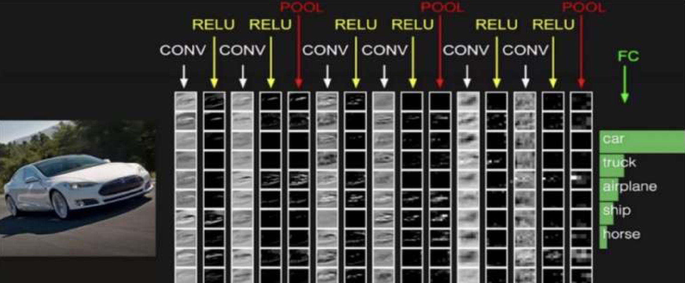
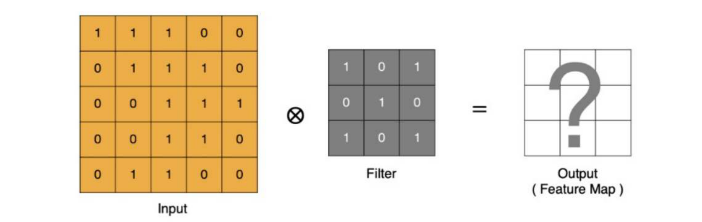
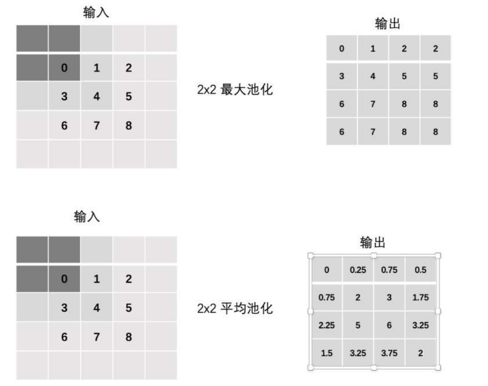
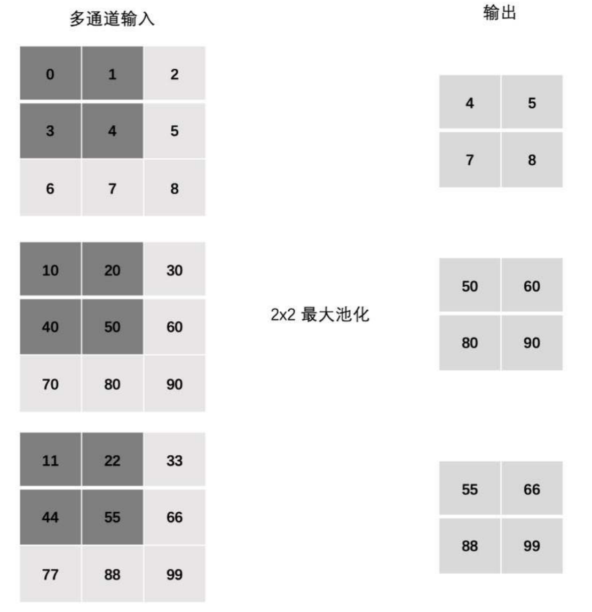
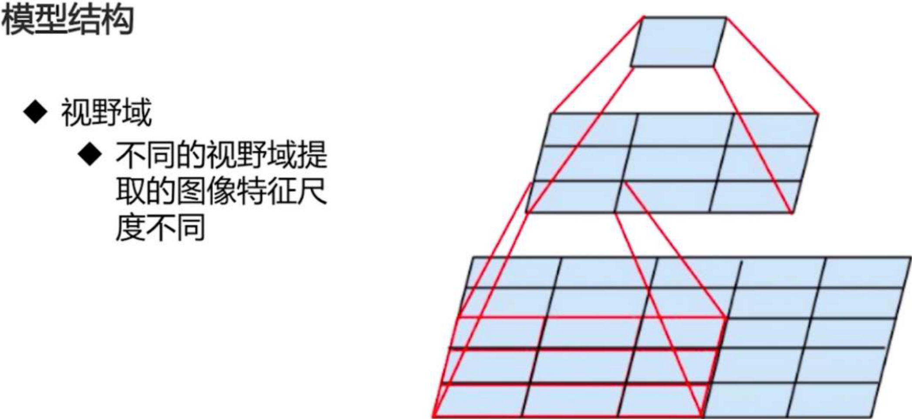
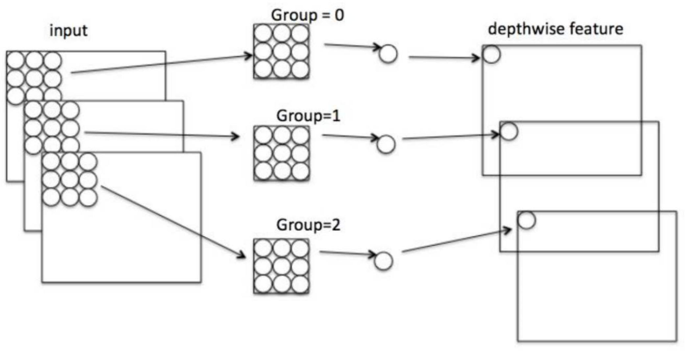
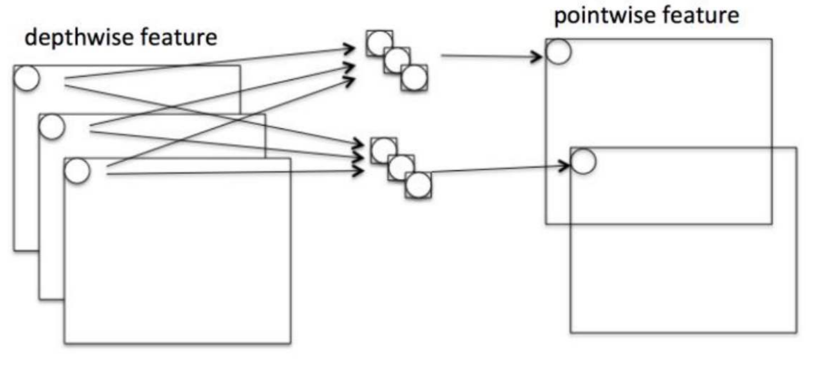

# Convolutional Neural Network CNN1

Prerequisite knowledge: images

How colors are represented in a computer:

- Grayscale images
  - Each pixel has only one value, representing its brightness
  - This value ranges from 0 to 255, where 0 is pure black and 255 is pure white
  - Therefore, a 28×28 image corresponds to a 28×28 two-dimensional array in the computer
- Color images
  - Each pixel consists of three values, representing the brightness of the Red, Green, and Blue channels respectively, i.e. RGB
  - Each channel's value is also typically between 0 and 255
  - Therefore, a color image of size 28×28 corresponds to a 28 × 28 × 3 three-dimensional array

> **Note: two conventions for image storage**
>
> The `(H, W, C)` described above, i.e. (height, width, channels), is how humans understand images, and is also the storage format used by image libraries such as PIL.
> But in PyTorch, the tensor shape convention is `(C, H, W)` — channels come first. This is because matrix operations on the GPU are more efficient when computed in parallel across channels.
> One of the things `transforms.ToTensor()` does is convert `(H, W, C)` into `(C, H, W)`. After adding the batch dimension, the four-dimensional tensor shape commonly seen in code is `(N, C, H, W)` (N = batch size, how many images in a batch).
> The `(1, 28, 28)` in the code below is PyTorch's `(C, H, W)` format.

**Flatten:**

Flattening refers to the process of **stretching a multi-dimensional array (tensor) into a one-dimensional array (vector)**. It is an indispensable step connecting "the feature maps output by convolution/pooling" and "the fully connected layer".

**Why do we need to flatten?**

- A fully connected layer (`nn.Linear`) requires the input to be a two-dimensional tensor `(batch, num_features)`, i.e. each sample is a one-dimensional vector
- But the feature maps output by convolutional and pooling layers are multi-dimensional, with shape `(N, C, H, W)`, for example `(4, 128, 3, 3)`
- So before feeding feature maps into a fully connected layer, the `(C, H, W)` part of each sample must be "straightened" into a one-dimensional vector

**How do we flatten?**

Taking a 3×3 grayscale image (simplified) as an example, flattening lines the values up row by row, from left to right and top to bottom:

```
原始图像（2D 数组）:                 展平后（1D 向量）:
[[1, 2, 3],                       [1, 2, 3, 4, 5, 6, 7, 8, 9]
 [4, 5, 6],
 [7, 8, 9]]
```

Code example (two implementations, NumPy and PyTorch):

```python
import numpy as np
import torch

# ========== NumPy: ndarray.flatten() ==========
# Simulate a 3×3 grayscale image (two-dimensional array)
img = np.array([[1, 2, 3],
                [4, 5, 6],
                [7, 8, 9]])
flat = img.flatten()  # Flatten into a one-dimensional array
print("Shape before flattening:", img.shape)   # (3, 3)
print("Shape after flattening:", flat.shape)  # (9,)
print("Flattened result:", flat)            # [1 2 3 4 5 6 7 8 9]

# ========== PyTorch: view(-1) ==========
# Simulate a single-channel image (C, H, W) = (1, 3, 3)
x = torch.arange(1, 10).reshape(1, 3, 3)  # Shape (1, 3, 3)
flat1 = x.view(-1)  # -1 means the size of this dimension is inferred automatically from the total number of elements
print("view(-1) result:", flat1)          # tensor([1, 2, 3, 4, 5, 6, 7, 8, 9])
print("view(-1) shape:", flat1.shape)   # torch.Size([9])

# ========== PyTorch: flatten(x, start_dim) —— most commonly used in CNNs ==========
# Add the batch dimension → (N, C, H, W) = (1, 1, 3, 3)
x_batch = x.unsqueeze(0)
print("x_batch shape:", x_batch.shape)  # torch.Size([1, 1, 3, 3])

# Flatten starting from dimension 1, leaving the batch dimension untouched
flat2 = torch.flatten(x_batch, 1)
print("flatten(x, 1) shape:", flat2.shape)  # torch.Size([1, 9])
```

> **The difference between view(-1) and flatten(x, 1)**
>
> - `view(-1)` flattens the **entire tensor** into one dimension, squashing even the batch dimension. It suits a single image (such as when computing the mean/variance of all pixels across a dataset later on)
> - The `1` in `torch.flatten(x, 1)` is `start_dim` (the starting dimension). It flattens from dimension 1 onward and **preserves the batch dimension**: `(N, C, H, W)` → `(N, C×H×W)`, with each sample stretched into its own vector
> - Therefore in a CNN's `forward` we consistently use `torch.flatten(x, 1)`, exactly as in the model below where `(batch, 128, 3, 3)` → `(batch, 1152)` before being fed into `fc1`

**Why not use a fully connected (Linear) neural network to process images?**

- Parameter explosion: take a 224×224×3 color image as an example. If we flatten it into a vector, the vector length = 224×224×3 = 150528. If the next connected layer has 1000 neurons, then this single layer alone has 150,528,000 parameters. This **makes the model enormous, hard to train, and prone to overfitting**
- Loss of spatial information: an image's spatial structure (for instance the relationship between a pixel and its neighboring pixels) is crucial for understanding image content. A fully connected network treats all pixels as independent inputs, completely destroying this spatial relationship

A **Convolutional Neural Network (CNN)** is a deep learning model designed specifically for processing data with a grid structure (such as images and speech spectrograms)

A CNN is mainly composed of three parts: convolutional layers, pooling layers, and fully connected layers:

- Convolutional layers are responsible for extracting local features from the image
- Pooling layers reduce the spatial size of feature maps through downsampling, thereby indirectly reducing the number of parameters and the computational cost of subsequent layers (especially fully connected layers)
- Fully connected layers are used to output the desired result



As shown in the figure above:

- The car image is the input data, a three-dimensional array (H, W, C)
- CONV is the convolutional layer; the activation function of a convolutional layer is generally ReLU

> **Why is a convolution followed by an activation function (such as ReLU)?**
>
> The convolution operation is **linear** (multiply-and-add). The composition of multiple linear transformations is still equivalent to a single linear transformation. This means that no matter how many convolutional layers you stack, the model's expressive power is no different from that of one layer. The activation function introduces a "bend" (non-linearity), letting the network learn complex patterns. Analogy: a straight wire is always straight; only with bends can it be shaped into arbitrary forms.
>
> ReLU's formula is `f(x) = max(0, x)`: positive numbers pass through unchanged, negative numbers become 0. It is computationally simple and its gradient does not decay (the gradient is constantly 1 in the positive region), which is why it has become the most commonly used activation function in CNNs.
- POOL is the pooling layer, generally used for dimensionality reduction
- After processing by convolutional and pooling layers, FC is the fully connected layer, used to integrate features and output the desired result

## Convolutional Layer

**Core component — the convolution kernel:** a convolution kernel is a two-dimensional matrix smaller than the input image, containing a set of learnable weight parameters

**How it works:**

- Align the top-left corner of the convolution kernel with the top-left corner of the input feature map
- Compute the sum of the products of the kernel and the corresponding elements of the input feature map (this is a dot product operation)
- Use the computed result as one pixel value at the corresponding position of the output feature map
- According to a certain **stride**, slide the convolution kernel across the input feature map and repeat steps 2 and 3 until the entire input feature map has been scanned

### The Convolution Computation Process



- input denotes the input image
- filter denotes the filter, also called the convolution kernel (filter matrix)
- The output obtained after input passes through filter is the rightmost image, which is called the feature map

**In CNNs, the convolution operation is in implementation closer to a cross-correlation operation, i.e. an element-wise multiply-and-add (dot product) between a local region and the convolution kernel**

> **Why is it called "convolution" when what it actually does is "cross-correlation"?**
>
> Mathematically, **convolution** requires flipping the kernel 180° both vertically and horizontally first, and only then sliding it to take dot products. What deep learning frameworks (PyTorch/TensorFlow) actually perform is **cross-correlation** — **no flipping**, just sliding and taking dot products directly.
>
> So why not do a true convolution? Because the kernel's weights are **learned** — flipping or not makes no difference, since the weights will automatically adjust to appropriate values. Not flipping also saves a computation step. So the name "convolutional neural network" is a historical carryover; the actual operation is more accurately described as cross-correlation.


The final feature map result is:


### Padding

From the convolution computation process above, we notice that:

- The final feature map is smaller than the original image
- The edges of the input are scanned fewer times, while the middle of the input is scanned more times

To solve the above two problems, we can add padding at the edges of the input (adding a ring of pixels around it, with pixel value 0, which keeps the image size unchanged):


### Stride

Stride: the number of pixels moved each time

In the kernel sliding/scanning process above, the stride was 1, and the computed feature map is as follows:


If we increase the stride to 2, a feature map can still be extracted, as shown below:


### Multi-Channel Convolution Computation

**However many channels the input image has, the convolution kernel has that many channels**


### Multi-Kernel Computation

**However many convolution kernels there are, there are that many feature maps. Each kernel corresponds to one feature map, and the number of output channels equals the number of kernels**


> **Clearing up a common misconception: what exactly is the "dimensionality" of a convolution kernel?**
>
> Beginners often wonder: is each convolution kernel 2D (e.g. 3×3) or 3D (e.g. 3×3×M)?
>
> **Answer**: each convolution kernel is in fact **3D**, with shape `(K, K, M)` (M = number of input channels). It is K×K spatially, but covers all input channels in depth.
> So why is it often drawn as 2D in diagrams? Because **a diagram only depicts the single-channel case** (M=1), where 3D degenerates to 2D.
>
> - One kernel slides over H×W while taking a weighted sum across M channels → outputs **1** channel
> - N kernels → output **N** channels
> - So the actual parameter count of `nn.Conv2d(in_channels=M, out_channels=N, kernel_size=K)` = **K × K × M × N** (+ N biases, if bias=True)
>
> With that, you can understand PyTorch's convolutional layer parameters: in `Conv2d(in_channels, out_channels, kernel_size)`, `in_channels` determines the depth of each kernel, and `out_channels` determines how many distinct kernels there are.

> **For example: how to understand `nn.Conv2d(in_channels=3, out_channels=8, kernel_size=3, stride=2, padding=0)`**
>
> **Step 1: channels are just "how many images are stacked".**
>
> - Grayscale image: only 1 → 1 channel
> - Color image: red, green, blue — 3 stacked together → 3 channels
>
> So `in_channels=3` means: **what comes in is 3 images stacked together** (one red, one green, one blue).
>
> **Step 2: what the output 8 means.**
>
> `out_channels=8` means: **this layer will output 8 images**. Note that this 8 is chosen freely by you and has nothing to do with the input 3 — you could write 16, 32, or 64. It means "extract 8 different kinds of features".
>
> **Step 3: how do 3 images become 8 images? Through "filters".**
>
> Thinking of it as filters in Photoshop is the most intuitive:
>
> - Use 1 filter to process the 3 input images → get 1 new image
> - Use 8 different filters → get 8 new images
>
> **Step 4: how one filter computes 1 image from 3 images.**
>
> 1. The filter is a small window (e.g. 3×3), pressed onto the same position on all 3 images simultaneously
> 2. Take a weighted sum of the pixel values in those 3 regions → get 1 number
> 3. The filter slides across the image; at each position it computes 1 number
> 4. After sliding across the whole image, all the numbers put together → that is 1 new image
>
> Putting it all together:
>
> ```
> 输入：3 张图（红、绿、蓝）            in_channels = 3
>     ↓  同时用 8 个滤镜，各自扫一遍
> 滤镜1 → 新图1  滤镜2 → 新图2  …  滤镜8 → 新图8
>     ↓  8 张新图叠在一起
> 输出：8 张图                          out_channels = 8
> ```
>
> Remember it in one sentence: **`in_channels` is "how many images come in" (red, green, blue — 3, fixed and unchangeable), `out_channels` is "how many images I want to output" (chosen by you; 8 means using 8 filters to extract 8 kinds of features).**

### The Size of the Feature Map

The size of the feature map is closely related to the following parameters:

- The size of the convolution kernel, generally set to an odd number, e.g. 1×1, 3×3, 5×5

> **Why are kernel sizes generally odd?**
>
> - An odd-sized kernel has a **well-defined center point**, making alignment convenient. For instance the center of 3×3 is (1,1), and the center of 5×5 is (2,2).
> - **It makes padding convenient**: a 3×3 kernel with padding=1, or a 5×5 kernel with padding=2, pads zeros symmetrically on all four sides and keeps the output size unchanged. An even-sized kernel has no symmetric center, so padding would be asymmetric.

- Padding: the number of layers of zero padding

-  Stride: the stride

Suppose the input image is square:

- Input image size W×W
- Convolution kernel size: K×K
- Stride → S
- Padding → P
- Output image size: N×N

The formula for computing the feature map:
$$
N=\frac{W-K+2P}{S}+1
$$

> **Note: exact division and rounding**
>
> When `(W - K + 2P)` is not divisible by `S`, PyTorch / TensorFlow **round down (floor)**. For example with W=32, K=3, P=0, S=2:
>
> $$N = \lfloor\frac{32-3+0}{2}\rfloor + 1 = \lfloor 14.5 \rfloor + 1 = 14 + 1 = 15$$
>
> This is why in the example code `(1, 3, 32, 32)`, after a convolution with `kernel_size=3, stride=2`, becomes `(1, 8, 15, 15)` rather than 15.5.

### Example

```python
import torch
import torch.nn as nn

x = torch.randn(1, 3, 32, 32)  # Create a random tensor with shape (batch=1, channels=3, height=32, width=32)
print("Shape of input x:", x.shape)  # torch.Size([1, 3, 32, 32])

conv = nn.Conv2d(in_channels=3, out_channels=8, kernel_size=3, stride=2, padding=0)  # Create a 2D convolutional layer: 3 input channels, 8 output channels, 3×3 kernel, stride 2, no padding
y = conv(x)  # Apply the convolution to input x, producing output y
print("Shape of y after convolution:", y.shape)  # torch.Size([1, 8, 15, 15])
```

## Pooling Layer

A pooling layer usually follows immediately after a convolutional layer, and is used to **downsample the feature map**

The purpose is to reduce the dimensionality of the feature map, thereby shrinking the image size and improving the model's computation speed

> **Why is pooling also called "downsampling"?**
>
> First break down the term: **sampling** = picking out a subset of points from a large pile of data according to some rule to "represent" the whole; **downsampling** = lowering the sampling rate, using fewer points to represent the original data, with the result that the amount of data shrinks and the resolution drops. (The antonym is **upsampling**, where points increase and the image grows.)
>
> What pooling does is exactly downsampling — it "merges" multiple points in each small window into 1 point:
>
> ```
> 原始 4 个像素点          取最大值（Max Pooling）
> ┌─────┬─────┐
> │  1  │  9  │   ────▶     9
> ├─────┼─────┤
> │  5  │  3  │
> └─────┴─────┘
>    4 个点                   1 个点
> ```
>
> The window slides across the whole image, and at each window there is one "4 points → 1 point" merge, so the whole image shrinks: a 32×32 input with 2×2 pooling and stride 2 → becomes **16×16**, with data points dropping from 1024 to 256, exactly **4× downsampling**.
>
> Both pooling and convolution make the image smaller, but the mechanisms differ: **convolution shrinks because the kernel slides with a stride, whereas pooling shrinks because multiple points inside a window are merged into one** — the latter is purely "downsampling". Taking the **maximum** preserves "whether this region has a salient feature", while taking the **average** preserves "the overall intensity of this region".

Main purposes:

- **Reduce the spatial size of feature maps**: shrink width and height, thereby reducing the computational cost and number of parameters in subsequent layers
- **Preserve key information**: by aggregating information from a local region (such as taking the maximum or average), the region's main features are retained
- **Increase translation invariance**: if the input image shifts slightly, the pooled output may stay unchanged or change very little

> **Intuitive understanding of translation invariance:**
>
> Max pooling takes the maximum within a 2×2 window — as long as some feature (such as an edge or texture) appears at **any position** inside that window, it will be captured. Exactly which pixel position within the window the feature occupies does not matter. This makes the model focus on "whether this feature is present" rather than "at which precise coordinate the feature is". For example: in a picture of a cat, whether the cat is in the middle of the frame or slightly to the left, the pooled output will most likely be similar.

How it works:

Similar to the convolution operation, a pooling layer also uses a "pooling window" (such as 2×2) and slides it across the feature map according to a specified **stride**

The difference is that what is performed inside the pooling window is an aggregation operation (taking the maximum or average) rather than a convolution operation

### The Pooling Computation Process

- **Max Pooling**: within a local region (such as 2×2), take the maximum of all elements as the output

  This is the most commonly used form of pooling, because it preserves salient features such as textures and edges very well

  Purpose: it can suppress the phenomenon of shifted estimated means caused by errors in network parameters

  

- **Average Pooling**: within a local region, take the average of all elements as the output

  It preserves the region's overall intensity information, but may make features blurry

  Purpose: mainly used to suppress excessive variance caused by overly large differences between neighboring values

  

### Stride

The stride of a pooling layer works the same way as that of a convolutional layer


### Padding

In special cases, a pooling layer can also use padding to control the output size, but in practical models pooling layers are usually used to shrink the feature map size



### Multi-Channel Pooling Computation

Pooling layers differ from convolutional layers in how they handle multiple channels: the pooling window slides **independently on each channel** and does not aggregate across channels, therefore **the number of output channels = the number of input channels**. In a convolutional layer, by contrast, each kernel takes a weighted sum over all input channels and outputs 1 feature map.



### Example

```python
import torch
import torch.nn as nn

x = torch.randn(1, 3, 32, 32)  # Create a random tensor with shape (batch=1, channels=3, height=32, width=32)

print("Shape of input x:", x.shape)  # torch.Size([1, 3, 32, 32])

maxpool = nn.MaxPool2d(kernel_size=2, stride=2)  # Create a max pooling layer: 2×2 window, stride 2
y_max = maxpool(x)  # Apply max pooling to input x, taking the maximum within each window
print("Shape of y_max after max pooling:", y_max.shape)  # torch.Size([1, 3, 16, 16])

avgpool = nn.AvgPool2d(kernel_size=2, stride=2)  # Create an average pooling layer: 2×2 window, stride 2
y_avg = avgpool(x)  # Apply average pooling to input x, taking the average within each window
print("Shape of y_avg after average pooling:", y_avg.shape)  # torch.Size([1, 3, 16, 16])
```

**Note: pooling does not change the number of channels**


## Depthwise Separable Convolution

Depthwise Separable Convolution is the core component of lightweight networks such as MobileNet and Xception. It splits a standard convolution into two steps: **Depthwise (per-channel spatial filtering)** + **Pointwise (1×1 channel fusion)**, dramatically reducing the number of parameters and the computational cost.

### Prerequisite Concept: Receptive Field

Receptive field (also called the field of view): the range of original input pixels that a single pixel on the feature map can "see".



One 5×5 convolution and two stacked 3×3 convolutions end up with the same 5×5 receptive field — but two 3×3 layers have fewer parameters (18 vs 25), and additionally allow one more ReLU non-linear transformation in between. Therefore modern CNNs commonly stack multiple small kernels (such as 3×3) rather than using one large kernel.

> **Intuitive analogy**: catching fish with one big net vs. two small nets in relay — the final "field of view" covered is equally large, but two small nets are more flexible and allow one more round of "filtering" (ReLU) in between.

#### Receptive Field Verification: two 3×3 is equivalent to one 5×5

The field of view is also called the receptive field

Below we use code to verify the key principle that "stacking small kernels = a larger receptive field":

```python
import torch
import torch.nn as nn

"""
Verification: the receptive field of two 3×3 convolutions = the receptive field of one 5×5 convolution

Intuitive understanding (one-dimensional):
  The 1st 3×3: sees the three positions [-1, 0, +1]
  The 2nd 3×3: each position "sees" 3 positions of the previous layer
  → in total covers 5 consecutive positions of the original input = a 5×5 receptive field

Analogy: two layers of fishing nets in relay → the final range covered = one layer of a large net
"""

# Create a 7×7 input where only the center is 1 and the rest are 0 (an "impulse" signal)
x = torch.zeros(1, 1, 7, 7)
x[0, 0, 3, 3] = 1.0

# Two 3×3 convolutions (no padding)
conv3_1 = nn.Conv2d(1, 1, 3, padding=0, bias=False)
conv3_2 = nn.Conv2d(1, 1, 3, padding=0, bias=False)
# One 5×5 convolution
conv5 = nn.Conv2d(1, 1, 5, padding=0, bias=False)

# Use all-ones weights (convenient for observing the receptive field range)
with torch.no_grad():
    conv3_1.weight.fill_(1.0)
    conv3_2.weight.fill_(1.0)
    conv5.weight.fill_(1.0)

# Forward propagation
out_3x3_1 = conv3_1(x)   # 7×7 → 5×5
out_3x3_2 = conv3_2(out_3x3_1)  # 5×5 → 3×3
out_5x5 = conv5(x)        # 7×7 → 3×3

print(f"Final output size of two 3×3: {out_3x3_2.shape}")  # [1, 1, 3, 3]
print(f"Final output size of one 5×5: {out_5x5.shape}")     # [1, 1, 3, 3]
print("✓ The output sizes are identical; both receptive fields are 5×5")

# Parameter count comparison
C = 64  # Assume the number of channels
params_2x3 = 2 * (3 * 3 * C * C)   # Two 3×3
params_1x5 = 5 * 5 * C * C          # One 5×5
print(f"\nParameter count comparison (C={C}):")
print(f"  Two 3×3: {params_2x3:,}")
print(f"  One 5×5: {params_1x5:,}")
print(f"  Saves {(1-params_2x3/params_1x5)*100:.0f}% of parameters, plus one extra ReLU non-linearity in between!")
```

### A Standard Convolution Does Two Things

Each kernel of a standard convolution **operates on two dimensions simultaneously**:
1. **The spatial dimensions** (H × W): sliding across the image plane to extract local features
2. **The channel dimension** (C): taking a weighted sum over all input channels to fuse information

The idea behind depthwise separable convolution is exactly this — **split these two jobs apart and let each do its own thing**.

#### Depthwise (per-channel convolution)

Each input channel is assigned its own independent kernel, sliding only in the spatial dimensions. **Different channels do not interfere with each other**.



As shown in the figure above: each output channel is associated with only the one corresponding input channel. M input channels → M output feature maps (the channel count is unchanged).

> **Key difference**: in a standard convolution, one output channel = a weighted sum of all input channels; in Depthwise, one output channel = the result of spatial filtering on only the corresponding input channel.

#### Pointwise (pointwise convolution / 1×1 convolution)

Depthwise only performs spatial filtering within each individual channel, with no information exchange between channels. Pointwise uses N kernels of size 1×1×M to form linear combinations of all M channels at the "pixel" level, ultimately outputting N channels. **A 1×1 convolution does not change the spatial size, only the number of channels.**



> **Analogy**: Depthwise is like drawing patterns on M sheets of paper individually; Pointwise is like stacking the M sheets together and mixing them at different ratios to produce N new sheets.

#### Why is depthwise separable convolution usually paired with BN + ReLU?

In networks such as MobileNet and Xception, almost every Depthwise / Pointwise convolution is immediately followed by a **BN + ReLU**, forming a structure like `Conv → BN → ReLU`. There are three reasons:

**1. After splitting, non-linearity must be added back**

Depthwise and Pointwise are both **linear** operations in themselves. If no activation function is inserted in between, the composition of the two linear layers `Depthwise → Pointwise` is still equivalent to a single linear transformation — expressive power actually degrades (no different from one standard convolutional layer). Adding a ReLU in between is the "bend" that lets the two split steps genuinely learn non-linear features.

**2. Depthwise channels easily "die", and BN is what saves them**

ReLU sets negative numbers directly to 0. If the output of some channel after convolution is negative overall, it all becomes 0 after ReLU, gradients can no longer flow back, and that channel "dies" — its weights never update again.

- **A standard convolution has a fallback**: one output channel = a weighted sum of all input channels, so if one input is negative there are still other channels to compensate, and the result is unlikely to be negative overall.
- **Depthwise has no fallback**: one output channel depends on only **one** input channel, so once that single path goes negative it is entirely negative, and after being zeroed out by ReLU it cannot recover. That makes it especially fragile.

The role of BN (Batch Normalization) is to **pull each channel's output back to a "mean 0, variance 1" distribution**: this ensures roughly half the post-convolution values lie on the positive side and half on the negative side, so they are not zeroed out wholesale by ReLU, and the channel survives to keep learning.

**3. Order: BN comes before ReLU**

The convention is `Conv → BN → ReLU`: normalize with BN first to stabilize values around 0, then hand off to ReLU for non-linearity. If reversed — ReLU first, then BN — ReLU has already zeroed the negatives, so BN loses its chance to "rescue" them.

> **One-line summary**: depthwise separable convolution splits one convolution into two "weaker" linear layers, so it needs BN all the more to stabilize the distribution and ReLU to restore non-linearity — BN prevents channels from "dying" by being zeroed out by ReLU, and ReLU prevents the composition of two linear steps from degenerating into a linear transformation.

## Convolution Computational Cost

- Computational cost of a standard convolution:
  $$
  Dk \times Dk \times M \times N \times DF \times DF
  $$

  - DK: the size of the convolution kernel
  - M: the number of input channels
  - N: the number of output channels
  - DF: the feature map (output feature map) size

- Depthwise separable convolution cost

  - **Depthwise:**
    $$
    DK \times Dk \times M \times DF \times DF
    $$

  - **Pointwise (1x1 convolution):**
    $$
    M \times N \times DF \times DF
    $$

- Ratio of parameter reduction:
  $$
  (Dk \times DK \times M + M \times N) / (DK \times Dk \times M \times N) = 1/N + 1/(Dk \times Dk)
  $$

- Ratio of computational cost reduction (depthwise separable convolution / standard convolution):
  $$
  \frac{DK \times Dk \times M \times DF \times DF + M \times N \times DF \times DF}{DK \times Dk \times M \times N \times DF \times DF} = \frac{1}{N} + \frac{1}{Dk \times Dk}
  $$

> **A concrete numerical example**: suppose Dk=3, M=64, N=128, DF=32
>
> - Standard convolution cost: 3×3×64×128×32×32 ≈ **75,497,472**
> - Depthwise separable: Depthwise(3×3×64×32×32) + Pointwise(64×128×32×32) = 589,824 + 8,388,608 = **8,978,432**
> - Reduction ratio ≈ **11.9%** (i.e. the cost drops to about 1/8.4 of the original)
>
> Verifying the formula: 1/128 + 1/9 ≈ 0.0078 + 0.1111 = 0.1189 ✓

## Example -- FashionMNIST Classification

## Transfer Learning

### What is transfer learning?

The core idea of transfer learning is very simple: **apply knowledge learned on one task to another related task**.

In deep learning, the concrete practice is: take a model trained on a large-scale dataset (such as ImageNet, with 14 million images and 1000 classes), use it as a **starting point**, and continue training or fine-tuning it on your own small dataset.

> **Intuitive analogy**: someone who has learned pencil sketching learns oil painting much faster than a complete beginner — because the "general knowledge" about composition, light and shadow, and proportion is already in place, and they only need to adapt to the characteristics of the new medium. Likewise, a CNN that has learned to recognize edges, textures, and shapes on ImageNet only needs to learn the feature differences between cats and dogs when transferred to cat-vs-dog classification, rather than learning "what an edge is" from scratch.

### Why do we need transfer learning?

| Scenario | The difficulty of training from scratch | The advantage of transfer learning |
|------|-------------|--------------|
| Small amount of data (a few hundred to a few thousand images) | Prone to severe overfitting, unable to learn effective features | The pretrained model already has general feature representations; only fine-tuning is needed |
| Limited compute (single GPU / no GPU) | Training deep networks such as ResNet takes days or even weeks | Only the last few layers need training — tens of minutes to a few hours |
| High labeling cost (medical images, etc.) | Labeling requires experts, samples are extremely scarce | Freezing the lower layers and training only the classification head can still give decent results |

### Two Mainstream Strategies

#### 1. Fine-tuning

**Approach**: after loading pretrained weights, continue training **all layers** (or most layers) with your own data, but with a **very small learning rate**.

- **Applicable scenario**: your dataset differs substantially from ImageNet (such as medical imaging or satellite imagery), and the amount of data is moderate (a few thousand to a few tens of thousands)
- **Learning rate**: usually set to 1/10 or even 1/100 of the original learning rate, to avoid "trampling" the well-trained pretrained weights
- **Intuition**: low-level features (edges, textures) should change little, while high-level features (semantics) can be learned more aggressively

```python
import torchvision.models as models
import torch.nn as nn
import torch.optim as optim

model = models.resnet50(pretrained=True)
model.fc = nn.Linear(model.fc.in_features, num_classes)

# All parameters participate in training, but with different learning rates
optimizer = optim.SGD([
    {'params': model.fc.parameters(), 'lr': 1e-3},       # The newly replaced classification head, large learning rate
    {'params': model.layer4.parameters(), 'lr': 1e-4},    # Top-level features, medium learning rate
    {'params': model.conv1.parameters(), 'lr': 1e-5},     # Low-level features, small learning rate (barely adjusted)
], momentum=0.9)
```

#### 2. Freezing the Feature Extractor (Feature Extraction)

**Approach**: freeze all convolutional layers of the pretrained model (`requires_grad = False`) and **train only the newly attached classification head**.

- **Applicable scenario**: very little data (a few hundred images) and fairly similar to ImageNet (such as cat-vs-dog classification)
- **Advantages**: training is extremely fast and will not overfit
- **Disadvantages**: if the data differs greatly from ImageNet (such as microscope images), the general features may not be sufficient

```python
model = models.resnet50(pretrained=True)

# Freeze all convolutional layers
for param in model.parameters():
    param.requires_grad = False

# Replace and train only the last layer
model.fc = nn.Linear(model.fc.in_features, num_classes)

# requires_grad defaults to True, so the fc layer's parameters will be updated
optimizer = optim.Adam(model.fc.parameters(), lr=1e-3)
```

### Strategy Selection Guide


### Comparison of Common Pretrained Models

| Model | Parameters | Top-5 Accuracy | Characteristics |
|------|--------|------------|------|
| ResNet50 | 25.6M | 92.9% | The most classic, well-balanced in every respect |
| ResNet101 | 44.5M | 93.5% | Deeper, but slower at inference |
| MobileNetV2 | 3.5M | 90.2% | Lightweight, suitable for mobile |
| EfficientNet-B0 | 5.3M | 93.4% | Extremely efficient, best accuracy-to-parameter ratio |
| ViT-B/16 | 86M | 97.8% | Transformer architecture, requires more data |

> **Recommendation**: if you are starting out or experimenting on an ordinary GPU, begin with **ResNet50**; use **MobileNetV2** for mobile or edge devices; use **EfficientNet** when chasing the best possible results with sufficient data.

### When is transfer learning not needed?

- Your amount of data is very large (millions), so training from scratch also converges
- Your data structure differs enormously from natural images (such as spectrograms or radar signals), so ImageNet features may not transfer
- Your network architecture is unusual (such as a non-standard architecture you designed yourself), with no publicly available pretrained weights to load

> **Rule of thumb**: when you have fewer than ten thousand images, **transfer learning should almost always be the first consideration**. This is one of the most effective "shortcuts" in deep learning practice.

## [ResNet50](https://docs.pytorch.org/vision/main/models/generated/torchvision.models.resnet50.html)

### Background: does a deeper network always perform better?

Before ResNet appeared, people intuitively believed that "the deeper the network, the better the results". But experiments found that once network depth exceeded a certain limit, **both training error and test error actually increased** — and this is **not overfitting** (since training error also increased), but rather the **degradation problem**.

> A concrete example: on ImageNet, a 56-layer "plain" network has both higher training error and higher test error than a 20-layer one. This is not overfitting — overfitting is characterized by low training error and high test error, whereas here even the training error is higher, showing that the deep network **cannot even be trained well**.

> **Key insight**: if a deep network is hard to optimize, then at the very least it should not be worse than a shallow network — because in theory a deep network could degenerate into "the later layers do nothing (identity mapping)", making it equivalent to a shallow network. The problem is: **the SGD optimizer has great difficulty getting weight layers to learn an identity mapping**.

### Core Idea: Residual Learning

ResNet's core innovation is the **skip connection / shortcut** — adding the original input directly onto the output of ordinary convolutional layers:


Rather than having the network directly learn the target mapping $H(x)$, it is better to have it learn the **residual** $F(x) = H(x) - x$. Then the final output is $H(x) = F(x) + x$.

> **Intuitive analogy**: you do not need to paint a picture from scratch (learning $H(x)$); you only need to **add details** on top of the input line drawing (learning $F(x)$ = the amount of modification). If some layer has nothing worth changing, it just pushes $F(x)$ toward 0 — which is far easier than pushing weights toward an identity mapping.

**Mathematical expression:**

$$y = F(x, \{W_i\}) + x$$

- $x$ is the input
- $F(x, \{W_i\})$ is the residual mapping to be learned (usually two to three convolutional layers)
- When $F(x) \to 0$, $y \approx x$ (degenerating into an identity mapping)

If the input and output dimensions do not match (a change in the number of channels or in size), the shortcut needs a 1×1 convolution to adjust the dimensions:

$$y = F(x, \{W_i\}) + W_s \cdot x$$

### The Network Structure of ResNet50

The "50" in ResNet50 refers to a total of 50 weighted layers (convolutional layers + fully connected layers; pooling and activation layers are not counted).

ResNet50 uses a **bottleneck** structure, where each residual block consists of 3 convolutional layers:


> **Why is it called a "bottleneck"?** A 1×1 convolution first compresses 256 dimensions down to 64 (the bottleneck), a 3×3 spatial convolution is performed in the middle (few parameters), and then a 1×1 convolution restores it to 256 dimensions. This way the three layers have a parameter count of `256×64 + 64×64×3×3 + 64×256 ≈ 70K`, whereas two 3×3 convolutions operating directly at 256 dimensions would require `256×256×3×3×2 ≈ 1.18M` — **about a 17× reduction in parameters**.
>
> **Bottleneck parameter count in detail: breaking it down step by step**
>
> First, recall the parameter count formula for a convolutional layer (excluding bias): `kernel_size × kernel_size × in_channels × out_channels`.
>
> **Option A: two 3×3 convolutions directly (no bottleneck)**
>
> Each convolutional layer is 256 → 256 with kernel_size=3:
>
> | Layer | Computation | Parameters |
> |----|------|--------|
> | 1st layer 3×3 Conv | 3×3×256×256 | 589,824 |
> | 2nd layer 3×3 Conv | 3×3×256×256 | 589,824 |
> | **Total** | | **≈ 1.18M** |
>
> **Option B: bottleneck structure (1×1 → 3×3 → 1×1)**
>
> | Layer | Computation | Parameters |
> |----|------|--------|
> | 1st layer 1×1 Conv (compress) | 1×1×256×64 | 16,384 |
> | 2nd layer 3×3 Conv (spatial) | 3×3×64×64 | 36,864 |
> | 3rd layer 1×1 Conv (restore) | 1×1×64×256 | 16,384 |
> | **Total** | | **≈ 70K** |
>
> **Core intuition: why can a 1×1 convolution "save" parameters?**
>
> The parameter count formula for a 1×1 convolution is `1×1 × C_in × C_out`, **without the `3×3=9` spatial factor**.
>
> The bottleneck's cost-saving logic breaks into three steps:
>
> ```
> 输入 256 维
>     │
>     ▼  ① 1×1 卷积：256 → 64     参数量 = 1×1×256×64 = 16K  ← 很便宜
>     │      "把 256 条信息压缩成 64 条"（瓶颈口变小）
>     │
>     ▼  ② 3×3 卷积：64 → 64      参数量 = 3×3×64×64 = 37K   ← 也便宜！
>     │      "在 64 维的低维空间做空间特征提取"（因为通道少，3×3 也不贵）
>     │
>     ▼  ③ 1×1 卷积：64 → 256     参数量 = 1×1×64×256 = 16K  ← 很便宜
>     │      "把 64 条信息恢复回 256 条"（瓶颈口变大）
>     │
>     ▼
> 输出 256 维
> ```
>
> **The key trick**: step ② the 3×3 convolution is the bulk of the parameters — it carries the `3×3=9` factor. The bottleneck compresses its input and output channels from 256 to 64, causing its parameter count to plunge from `9×256×256=589K` to `9×64×64=37K`. Although the 1×1 convolutions on both sides add two more layers, because they lack the `3×3=9` spatial factor they total only 32K, which is nearly negligible.
>
> **One-line summary**: move the expensive 3×3 convolution out of the "large channel" space and perform it in the "small channel" space, using cheap 1×1 convolutions at either end to compress/restore the dimensions — this is the underlying logic of how the "bottleneck" saves cost.

**The overall ResNet50 architecture:**

| Stage | Output Size | Structure |
|------|---------|------|
| Conv1 | 112×112 | 7×7 Conv, stride=2 → BN → ReLU → MaxPool |
| Conv2_x | 56×56 | 3× Bottleneck[64, 64, 256] |
| Conv3_x | 28×28 | 4× Bottleneck[128, 128, 512] |
| Conv4_x | 14×14 | 6× Bottleneck[256, 256, 1024] |
| Conv5_x | 7×7 | 3× Bottleneck[512, 512, 2048] |
| — | 1×1 | Average Pooling → 1000-d FC → Softmax |

### Why are residual connections effective?

**1. Gradients can propagate back directly**

Without a shortcut, gradients must pass through every layer, and with many layers they easily vanish:
$$\frac{\partial L}{\partial x} = \frac{\partial L}{\partial y} \cdot \frac{\partial y}{\partial x}$$

With a shortcut ($y = F(x) + x$):
$$\frac{\partial L}{\partial x} = \frac{\partial L}{\partial y} \cdot \left(1 + \frac{\partial F}{\partial x}\right) = \frac{\partial L}{\partial y} + \frac{\partial L}{\partial y}\frac{\partial F}{\partial x}$$

Here the term $\frac{\partial L}{\partial y}$ can propagate straight back to shallow layers without passing through any weight layer — **guaranteeing that even if the gradients of intermediate layers are very small, the signal will not vanish**.

> **Analogy**: an ordinary network is like the telephone game, where the message becomes unrecognizable after passing through 50 people; ResNet adds a direct phone line between each pair of people, so the original message is always preserved.

**2. It breaks symmetry and makes the optimization landscape smoother**

Research shows that residual connections make the loss surface closer to convex, making it easier for SGD to find a good minimum.

### Using ResNet50 in PyTorch

```python
import torch
import torchvision.models as models

# Load the pretrained model
model = models.resnet50(pretrained=True)  # ImageNet pretrained weights

# Modify the last layer to fit your own task (e.g. 10 classes)
import torch.nn as nn
num_classes = 10
model.fc = nn.Linear(model.fc.in_features, num_classes)

# Or train from scratch without pretrained weights
model = models.resnet50(pretrained=False, num_classes=10)
```

> **Common practice**: if your own dataset is fairly small, it is common to freeze the earlier layers (the feature extractor) and train only the final fully connected layer:
>
> ```python
> for param in model.parameters(): # Get all trainable parameters in the model
>  	param.requires_grad = False	# This parameter should not participate in gradient computation during backpropagation, and thus will not be updated by the optimizer.
> model.fc = nn.Linear(model.fc.in_features, num_classes)  # requires_grad for this layer defaults to True
> ```

## [Example - 10 Monkey Species](https://www.kaggle.com/datasets/slothkong/10-monkey-species)

## Image Augmentation

### What is image augmentation?

Image augmentation (Image Augmentation / Data Augmentation) refers to applying a series of **random transformations** to the original images during training, generating "new" training samples. The core idea is: the same picture after different transformations is still a sample of the same class as far as the model is concerned, so the model is forced to learn **invariance** (a cat turned in another direction is still a cat), thereby improving generalization ability.

> **One-line summary**: add "noise" to the data (the meaningful kind), so the model does not memorize by rote but learns to grasp essential features.

### Why do we need image augmentation?

| Problem | How augmentation solves it |
|------|-------------|
| Too little training data, model easily overfits | One image turns into many "new" images, equivalent to expanding the dataset |
| Images at test time may have rotation or lighting changes | Let the model see various transformations during training, making it more robust at test time |
| The model only memorized specific patterns of the training set | Random transformations break fixed patterns, forcing the model to learn essential features |

### Categories of Common Augmentation Methods

#### 1. Geometric transformations (changing the image's spatial structure)

| Method | Description | Common parameters |
|------|------|----------|
| `Resize` | Unify image size (usually resize first, then crop) | Target size such as `(224, 224)` |
| `RandomHorizontalFlip` | Random horizontal flip (**most commonly used**) | `p`: flip probability, default 0.5 |
| `RandomVerticalFlip` | Random vertical flip (suitable for data without a fixed orientation, such as satellite imagery) | `p`: flip probability |
| `RandomRotation` | Randomly rotate by some angle | `degrees`: angle range, e.g. `30` means ±30° |
| `RandomCrop` | Randomly crop a region | `size`: crop size |
| `RandomPerspective` | Random perspective transformation (simulating different shooting angles) | `distortion_scale`: degree of distortion, `p`: probability of application |

#### 2. Color/photometric transformations (changing pixel values without changing spatial structure)

| Method | Description | Common parameters |
|------|------|----------|
| `ColorJitter` | Randomly adjust brightness, contrast, saturation, and hue | `brightness`, `contrast`, `saturation`, `hue` |
| `RandomGrayscale` | Randomly convert to grayscale | `p`: conversion probability |
| `RandomInvert` | Randomly invert colors (negative film effect) | `p`: probability of application |
| `RandomAdjustSharpness` | Randomly adjust sharpness | `sharpness_factor`: sharpness factor; `p`: probability |
| `RandomAutocontrast` | Random autocontrast | `p`: probability of application |

#### 3. Tensor conversion and normalization

| Method | Description |
|------|------|
| `ToTensor` | PIL Image / numpy → PyTorch Tensor, while also scaling pixel values from [0,255] to [0.0, 1.0] |
| `Normalize` | Standardize using the given mean and standard deviation: `(x - mean) / std`, making the data distribution more stable |

> **Typical parameters for Normalize**: the standard values for ImageNet pretrained models — `mean=[0.485, 0.456, 0.406]`, `std=[0.229, 0.224, 0.225]` (values for each of the three RGB channels).

### How to Use transforms.Compose

`Compose` chains multiple transformations in order, with the output of the previous one being the input of the next:

```python
from torchvision import transforms

transform = transforms.Compose([
    transforms.Resize((224, 224)),          # 1. Unify size
    transforms.RandomHorizontalFlip(p=0.5),  # 2. Random horizontal flip
    transforms.ColorJitter(brightness=0.3, contrast=0.3),  # 3. Random color jitter
    transforms.ToTensor(),                   # 4. Convert to tensor [0, 1]
    transforms.Normalize(mean=[0.485, 0.456, 0.406],
                         std=[0.229, 0.224, 0.225])  # 5. Standardize
])
```

> **⚠️ Order matters**: `ToTensor()` must come before `Normalize()`, because Normalize operates on a Tensor; geometric transformations (Resize, Flip) usually come before `ToTensor()`, because performing them on a PIL Image is more efficient.

### Key Principles

1. **Only augment the training set, not the validation/test sets** (or only apply Resize + Normalize). The test set needs to stay consistent in order to evaluate the model fairly.
2. **More augmentation is not always better**: excessive augmentation may prevent the model from learning useful information (for instance flipping a cat 180° into an "upside-down cat" is actually harmful if the test set contains no such samples).
3. **Choose augmentation according to the task**: cat-vs-dog classification suits horizontal flipping (animals are left-right symmetric), but letter recognition does not (a flipped b becomes a d).
4. **Side effect of `ToTensor()`**: it automatically converts `(H, W, C)` into `(C, H, W)` (PyTorch format), and scales pixel values from 0-255 to 0.0-1.0.

## [Example -- cifar-10](https://www.kaggle.com/competitions/cifar-10/)
