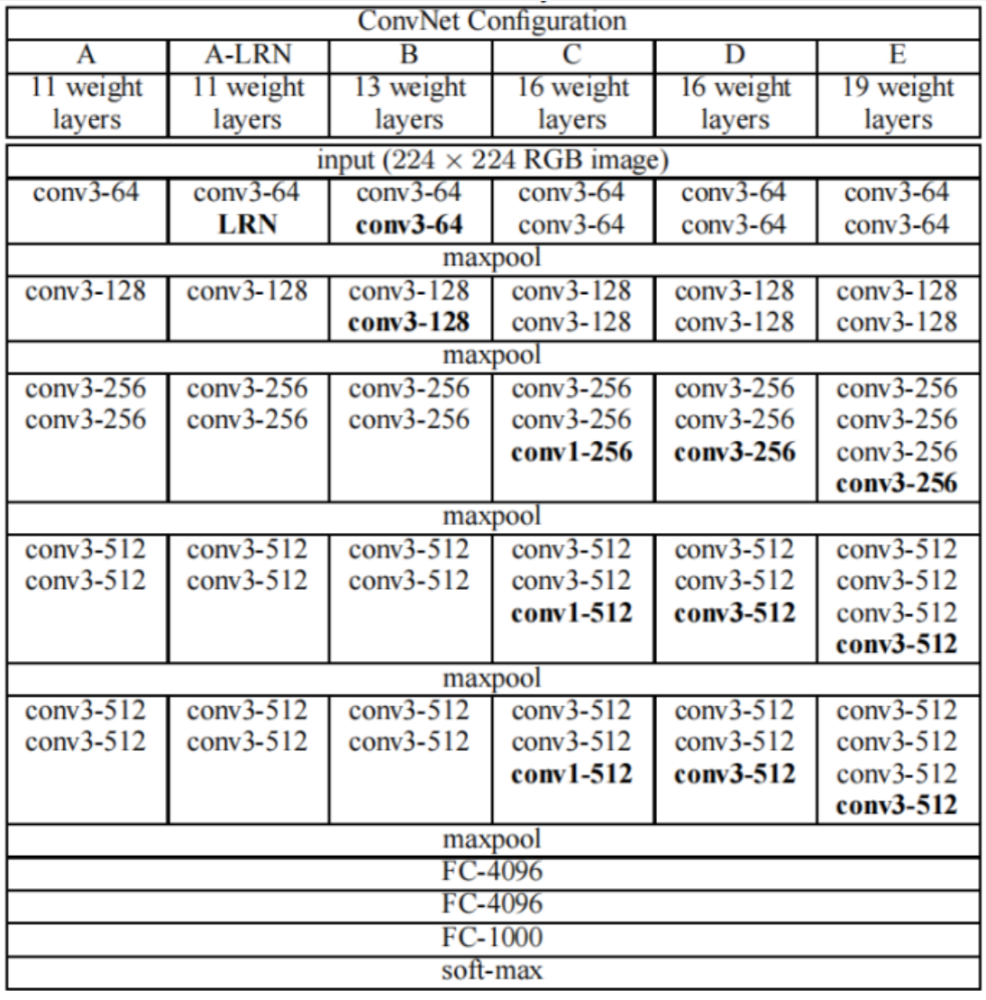
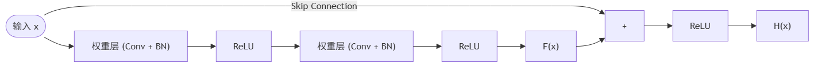
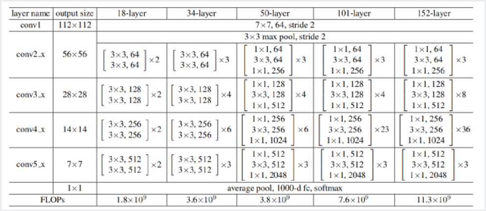
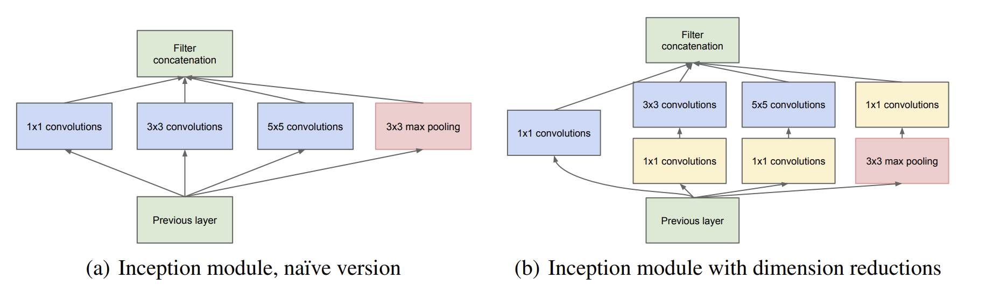

# Convolutional Neural Network CNN2

## [AlexNet](https://docs.pytorch.org/vision/main/models/generated/torchvision.models.alexnet.html)

AlexNet is a deep convolutional neural network architecture proposed by Alex Krizhevsky, Ilya Sutskever, and Geoffrey Hinton in 2012, and is widely regarded as a major breakthrough in the field of deep learning. Among them, Alex Krizhevsky was one of the model's main contributors, designing and implementing the model together with Sutskever and Hinton. They won the ImageNet Large Scale Visual Recognition Challenge with results far surpassing the other competitors, proving the enormous potential of deep learning for computer vision tasks. AlexNet's success propelled the development of deep learning and inspired much subsequent research.

**Ilya Sutskever** is a renowned artificial intelligence scientist, now a co-founder and Chief Research Scientist at OpenAI. They have made many important contributions in areas such as deep learning, machine translation, and generative models, and are considered one of the outstanding representatives of the deep learning field.

In 2012 Sutskever, together with Alex Krizhevsky and Geoffrey Hinton, proposed AlexNet, a deep convolutional neural network architecture that set the direction for the development of computer vision and deep learning. They also did prominent work in sequence modeling, such as proposing the **Seq2Seq** model, which greatly improved the accuracy and efficiency of machine translation.


### Characteristics of the Network Architecture

- The first and second convolutional layers are independent
- The third convolutional layer performs cross-over
- The fourth convolutional layer is independent again
- The fifth convolutional layer remains independent
- The final fully connected layers compute directly
- GPU memory was insufficient at the time, so multi-GPU training was used, splitting the **model** in half across 2 GPUs
  - **The real reason for the multi-GPU design (model parallelism, not data parallelism)**: the NVIDIA GTX 580 used at the time had only **3GB** of memory. AlexNet has about **60 million parameters**, and together with the intermediate activations (feature maps) of the forward pass, a single GPU simply could not hold the entire model. So the authors split each layer's **kernels (the channel dimension) in half**, placing them on two GPUs, and performed cross-GPU communication only at specific layers (see the explanation of "independent/cross-over" below). This practice of "cutting one model apart across multiple cards" is called **model parallelism**.
  - ⚠️ **Note the distinction**: splitting the **samples** of a batch evenly across multiple cards, with each card running the complete model, is called **data parallelism**, which is the most commonly used multi-card approach today — but that is **not** what AlexNet used. Also, the batch size in the AlexNet paper is **128**, not 256.
- **Output layer:** Softmax: 1000 classes, outputting probability values
- **Input layer:** AlexNet's input is a color image, typically using images of size 224×224 pixels as input

> **⚠️ Note: the 224×224 in the paper is actually a typo.** Verifying with the feature map formula: the first layer's output is required to be 55×55, and $N=\frac{W-11}{4}+1=55$ solves to $W=227$. So **the actual input size is 227×227**. This is a well-known "historical error" in the deep learning field, and PyTorch's torchvision implementation handles it adaptively, accepting inputs of arbitrary size.

### Convolutional and Pooling Layers

- Layer 1 (convolutional layer)
  - Kernel size: 11×11
  - Number of kernels: 96
  - Stride: 4
  - Activation function: ReLU (Rectified Linear Unit)
  - Followed by **LRN (Local Response Normalization)**
- Layer 2 (pooling layer)
  - Pooling type: Max Pooling
  - Pooling kernel size: 3×3
  - Stride: 2
- Layer 3 (convolutional layer)
  - Kernel size: 5×5
  - Number of kernels: 256
  - Stride: 1
  - Activation function: ReLU
  - Followed by **LRN (Local Response Normalization)**
- Layer 4 (pooling layer)
  - Pooling type: Max Pooling
  - Pooling kernel size: 3×3
  -  Stride: 2
- Layer 5 (convolutional layer)
  - Kernel size: 3×3
  - Number of kernels: 384
  - Stride: 1
  - Activation function: ReLU
- Layer 6 (convolutional layer)
  - Kernel size: 3×3
  - Number of kernels: 384
  - Stride: 1
  - Activation function: ReLU
- Layer 7 (convolutional layer)
  - Kernel size: 3×3
  - Number of kernels: 256
  - Stride: 1
  - Activation function: ReLU
- Layer 8 (pooling layer)
  - Pooling type: Max Pooling
  - Pooling kernel size: 3×3
  - Stride: 2

### Fully Connected Layers

- Fully connected layer (layer 9)
  - Number of fully connected neurons: 4096
  - Activation function: ReLU
- Dropout layer
  - A regularization technique used to reduce overfitting
- Fully connected layer (layer 10)
  - Number of fully connected neurons: 4096
  - Activation function: ReLU
- Dropout layer
  - A regularization technique used to reduce overfitting
- Output layer (layer 11)
  - Number of fully connected neurons: corresponding to the number of classification categories
  - Activation function: Softmax

### The Innovative Significance of AlexNet

#### The Breakthrough of ReLU

Before AlexNet, neural networks generally used **tanh** or **sigmoid** (S-shaped) activation functions. When the input value is large or small, the gradients of these two functions approach 0 (called the **saturation region**), causing gradients in deep networks to decay layer by layer during backpropagation and eventually vanish — this is the famous **vanishing gradient** problem.

ReLU's formula is very simple: $f(x)=\max(0, x)$. Its key advantages are:
- **The gradient is constantly 1 in the positive region**: no matter how large the input, the gradient does not decay
- **Extremely fast to compute**: only an if-check is needed, with no exponential operation
- The AlexNet paper reports that ReLU trains **6 times** faster than tanh

> **ReLU's drawback**: the gradient is 0 in the negative region, which can cause neurons to "die" forever (Dead ReLU). Later variants such as LeakyReLU, PReLU, and SELU solve this by giving the negative region a small non-zero slope.

#### Parameter Distribution: Most Parameters Are in the Fully Connected Layers

```python
import torch
import torchvision.models as models

alexnet = models.alexnet()
total_params = sum(p.numel() for p in alexnet.parameters())
print(f"Total parameters: {total_params:,}")  # About 61,100,840

# Inspect the parameter distribution across layers
for name, param in alexnet.named_parameters():
    if 'weight' in name:
        print(f"{name:30s} shape={str(param.shape):20s} params={param.numel():>10,}")

# Parameter count of the fully connected layers
fc_params = sum(p.numel() for name, p in alexnet.named_parameters()
                if 'classifier' in name)
print(f"\nFully connected layer parameters: {fc_params:,}")
print(f"Fully connected layer share: {fc_params/total_params*100:.1f}%")  # About 96%
```

> **Key finding**: the fully connected layers account for 96% of the parameters! This is also why later networks (such as ResNet and GoogLeNet) drastically reduced their use of fully connected layers — too many parameters, prone to overfitting, and slow to compute.

#### Dropout

AlexNet introduced **Dropout** in the fully connected layers: during training, neurons are randomly "dropped" (their outputs set to zero) with some probability p (such as 0.5). This forces each neuron not to rely on the presence of specific companions, thereby learning more robust features.

> **Intuitive understanding**: if you view a neural network as a team, Dropout is like randomly sending half the members "on vacation" each time, so the remaining ones must learn to complete the task independently. That way, when everyone shows up at test time, performance is naturally better.

**Additional note: Dropout behaves completely differently at training and test time (the pitfall beginners most easily fall into)**

Dropout drops neurons only during **training**; at **test (inference) time nothing is dropped and everyone participates**. But there is a problem here: during training only about half the neurons are working on average, while at test time everyone is in play, so this layer's total output (its expected value) would be twice as large as during training, causing training and testing to be mismatched.

The solution PyTorch uses is called **inverted dropout**: during training the outputs of the neurons that were not dropped are **scaled up by dividing by (1-p)**, while at test time they pass through unchanged with nothing done. This way the expected outputs of the two phases are consistent.

The key point is: this switching is done automatically by the two switches `model.train()` and `model.eval()`, and **forgetting to call `model.eval()` is the most common beginner bug** — it causes inference results to fluctuate randomly every time.

```python
import torch
import torch.nn as nn

torch.manual_seed(0)
drop = nn.Dropout(p=0.5)
x = torch.ones(1, 10)  # All ones, for convenient observation

# Training mode: randomly zero out a portion, and multiply the rest by 2 (i.e. ÷(1-0.5)) to compensate
drop.train()
print("train mode output:", drop(x))
# For example: tensor([[2., 0., 2., 2., 0., 0., 2., 0., 2., 2.]])
#      The retained ones become 2 (scaled up), the dropped ones become 0
print("train gives different results twice (random):", not torch.equal(drop(x), drop(x)))

# Test mode: no dropping, no scaling, output as-is
drop.eval()
print("eval  mode output:", drop(x))   # tensor([[1., 1., 1., ..., 1.]])
print("eval  gives the same result twice (deterministic):", torch.equal(drop(x), drop(x)))
```

> **Remember it in one sentence**: write `model.train()` before training, and `model.eval()` before inference/validation. Both Dropout and BatchNorm below rely on this switch to change behavior.

## [VGGNet](https://docs.pytorch.org/vision/main/models/vgg.html)

VGG is a deep convolutional neural network architecture proposed in 2014 by Karen Simonyan and Andrew Zisserman of the Visual Geometry Group at the University of Oxford, and is one of the most famous models in the field of deep learning. The model adopts a very deep network structure with excellent feature extraction ability and generalization performance, and is widely applied in computer vision.

Karen Simonyan and Andrew Zisserman are both well-known British computer vision scientists who have made many important contributions in areas such as image classification, object detection, and face recognition. In VGG they used small-sized convolution kernels and stacked multiple convolutional layers of the same size, improving the capability of feature representation by increasing network depth, and ultimately mapping the input image to class probabilities. VGG achieved excellent results in the ImageNet challenge of its time and is regarded as one of the classic case studies in deep learning model design.



### Characteristics of the Network Structure

- The network structure has more layers
- It mostly uses **3×3 convolution kernels**
  - 2 layers of 3×3 convolution can be viewed as one 5×5 convolutional layer
  - 3 layers of 3×3 convolution can be viewed as one 7×7 convolutional layer
  - A 1×1 convolutional layer can be viewed as a **linear transformation** across channels (matrix multiplication), commonly used for reducing or increasing dimensionality. Only after adding a ReLU activation does it become a non-linear transformation. For details, refer to the "Depthwise Separable Convolution → Pointwise (1×1 convolution)" section in the CNN1 notes
- **Every time it passes a pooling layer, the number of channels doubles (capped at 512)** — after pooling (2×2, stride=2) the spatial resolution becomes 1/4 of the original, and if the channel count stayed the same the total information capacity would decay drastically. Doubling the channel count (×2) makes the total capacity (1/4)×2 = 1/2 of the original, compressing gradually within a controllable range without losing too much information. Analogy: one thick pipe splitting into several thin pipes, with the total roughly conserved
  - ⚠️ **Note**: "doubling" is a design intent, not a strict rule. VGG's actual channel progression is **64 → 128 → 256 → 512 → 512**, and after the last pooling stage the channel count **stays at 512 and no longer doubles** — because the parameter count and memory cost of 512 channels are already large, and continuing to 1024 would be too expensive. The one that truly doubles strictly every time is the later ResNet (with planes progressing 64 → 128 → 256 → 512)

> **Additional note — the intuition of "information conservation"**: the computational cost across VGG's stages is roughly uniform, with large spatial size and few channels early on (focusing on spatial detail) and small spatial size and many channels later (focusing on semantic abstraction). This is a carefully designed balancing strategy.

### Innovations

- **Using small-sized convolution kernels**

  VGG used small 3×3 convolution kernels in place of larger kernels, which allows network depth to increase without increasing the computational cost.

- **Stacking multiple convolutional layers of the same size**

  VGG adopted the approach of stacking multiple convolutional layers of the same size to improve network performance. Doing so increases the capability for non-linear mapping and feature extraction, letting the network better learn complex features in images.

- **Using max pooling layers for downsampling**

  VGG used max pooling layers to downsample feature maps, making the network more robust to changes in position.

- **Pretraining and weight initialization**

  VGGNet adopted a form of pre-training, that is, first training a network with fewer layers and then using those weights to initialize a deeper network, which accelerated the convergence of training.

- **Multi-scale training and prediction**

  VGGNet used a multi-scale approach during both training and prediction, that is, rescaling the input images to different sizes, which increased the amount of training data, prevented overfitting, and improved prediction accuracy. (data augmentation)

- **Exploration of 1×1 convolution kernels**

  The VGG paper **experimented with** configurations containing 1×1 convolutions (Config C), which can be viewed as a linear transformation of the input channels. But the ones that ultimately won and became standard, **VGG16 (Config D) and VGG19 (Config E), use only 3×3 convolutions and no 1×1 convolutions**. What truly brought 1×1 convolutions to prominence were the later GoogLeNet (Inception) and ResNet (dimensionality reduction/expansion in the bottleneck structure).

- **A clear and simple network structure**

  VGG's network structure is very clear and simple, composed of a number of convolutional layers, pooling layers, and fully connected layers. This makes the network easy to understand and implement, and it performs well across a variety of computer vision tasks.

### VGG16 and VGG19

The full name is **Visual Geometry Group**

VGG is renowned for its simple, regular structure, whose main characteristic is stacking multiple smaller convolution kernels together to form a deeper network

#### VGG16

VGG16 has 16 convolutional and fully connected layers:

- **Input layer:** a 224×224 pixel color image
- **Convolutional Block 1:**
  - 2 convolutional layers, each with 64 kernels of size 3×3
  - Each convolutional layer is followed by a ReLU activation
  - 1 max pooling layer of 2×2 with stride 2
- **Convolutional Block 2:**
  - 2 convolutional layers, each with 128 kernels of size 3×3
  - Each convolutional layer is followed by a ReLU activation
  - 1 max pooling layer of 2×2 with stride 2
- **Convolutional Block 3:**
  - 3 convolutional layers, each with 256 kernels of size 3×3
  - Each convolutional layer is followed by a ReLU activation
  - 1 max pooling layer of 2×2 with stride 2
- **Convolutional Block 4:**
  - 3 convolutional layers, each with 512 kernels of size 3×3
  - Each convolutional layer is followed by a ReLU activation
  - 1 max pooling layer of 2×2 with stride 2
- **Convolutional Block 5:**
  - 3 convolutional layers, each with 512 kernels of size 3×3
  - Each convolutional layer is followed by a ReLU activation
  - 1 max pooling layer of 2×2 with stride 2
- **Fully connected layers:**
  - 3 fully connected layers, each with 4096 neurons
  - Each fully connected layer is followed by a ReLU activation
  - The last fully connected layer is followed by a Softmax activation (for multi-class tasks)

#### VGG19

Compared with VGG16, VGG19 adds 3 additional convolutional layers, giving it a deeper network structure.

Apart from differences in the number of kernels and layers, the network structures of VGG16 and VGG19 are very similar. This simple, regular structure makes VGG models easy to understand and implement, and provided a foundation for deep learning research and applications. However, because of its rather deep structure, VGG models are slow during both training and inference, and some subsequent models such as ResNet and Inception adopted more efficient structures.


- Increased from 11 layers (layers without parameters are not counted) to 19 layers

- **Removed AlexNet's LRN (Local Response Normalization)**: the VGG authors found experimentally that LRN brought almost no improvement in accuracy while adding computational overhead, so they removed it outright

  >**LRN (Local Response Normalization)** is a technique used in AlexNet, inspired by the **lateral inhibition** of biological neurons — an active neuron suppresses the activity of the neurons around it.
  >
  >- **What it does**: normalizes activations across adjacent channels at the same spatial position (letting channels with larger activations suppress the surrounding channels)
  >- **Why did AlexNet use LRN?** In 2012, before Batch Normalization (BN) had been invented, LRN was believed to help training
  >- **Why does VGG not use LRN?** The VGG authors found experimentally that LRN gave **almost no improvement in accuracy** while adding computational overhead and memory consumption. So VGG removed LRN outright, making the network structure more concise
  >
  > **A historical thread**: AlexNet(2012) used LRN → VGG(2014) found LRN useless and removed it → ResNet(2015) made heavy use of Batch Normalization (far more powerful than LRN). This progression reflects the deep learning community's deepening understanding of "normalization techniques".
  
- **Why are layers always added at the back:** the spatial size is large early on (224×224, 112×112), and in the computational cost formula for a 3×3 convolution, $K^2 \times C_{in} \times C_{out} \times H \times W$, H×W is very large, so adding too many layers early would make the computational cost explode. Later, after pooling, the spatial size becomes small (14×14, 7×7), and although the channel count has doubled, H×W has shrunk to 1/4 of the original, so the computational cost is roughly balanced. So "adding layers at the back" essentially lets a deep network learn more abstract semantic features while keeping the computational cost controllable. The roughly uniform distribution of computational cost across VGG's 5 stages embodies exactly this design wisdom

- The overall parameter count stays roughly the same (the parameter counts of VGG11→VGG16→VGG19 increase: ~133M → ~138M → ~144M, with the difference coming mainly from the 3×3×512 convolutions added in the later layers)

> **VGG's fatal weakness — where are the parameters concentrated?**
>
> Of VGG16's ~138M parameters, **about 124M (90%) are in the fully connected layers!** Specifically:
> - The first FC (25088→4096): about 102M parameters
> - The second FC (4096→4096): about 17M parameters
> - The third FC (4096→1000): about 4M parameters
> - All convolutional layers combined: only about 15M parameters
>
> This is why later networks (ResNet, GoogLeNet) all moved toward "de-fully-connecting" — replacing the huge FC layers with global average pooling. Although VGG's idea was right (small and deep convolution kernels), its enormous FC layers make it very unwieldy in real deployment.

```python
import torchvision.models as models

vgg16 = models.vgg16()
total = sum(p.numel() for p in vgg16.parameters())
conv_params = sum(p.numel() for n, p in vgg16.named_parameters()
                  if 'features' in n)
fc_params = sum(p.numel() for n, p in vgg16.named_parameters()
                if 'classifier' in n)
print(f"VGG16 total parameters:      {total/1e6:.0f}M")
print(f"  Convolutional layer params:        {conv_params/1e6:.1f}M ({conv_params/total*100:.0f}%)")
print(f"  Fully connected layer params:      {fc_params/1e6:.1f}M ({fc_params/total*100:.0f}%)")
# Output: convolutional layers account for only about 10%, while fully connected layers account for ~90%!
```

### Reasons Why Convolution Kernels Are Odd-Sized

- For convenient handling of same padding

  For example with stride 1, a zero padding of k-1 must be added for the input and output sizes to match. If the kernel size k is even, then an odd amount of zero padding is needed, which cannot be split evenly between the two sides of the feature map.

- To unify the standard

  Kernel sliding by default uses the center point as its reference, and an odd-sized kernel has such a reference naturally. (In fact you could define a reference for an even-sized kernel yourself, such as using the kernel's top-left corner as the reference.)

- To better capture central information

  Because an odd-sized kernel has a natural absolute center point, it can better capture conceptual information such as "the center" when performing convolution.

## [ResNet](https://arxiv.org/abs/1512.03385)

ResNet is a deep convolutional neural network architecture proposed in 2015 by Kaiming He and their team at Microsoft Research Asia, and is widely regarded as a major breakthrough in the field of deep learning. ResNet introduced residual connections to solve problems such as vanishing and exploding gradients that arise when training deep neural networks, allowing networks to be trained deeper and more efficiently.

### The Problem with Increasing Depth

Once model depth reaches a certain point, continuing to deepen it actually causes **training set** accuracy to drop. The figure below is a **comparison of a 56-layer and a 20-layer plain network on CIFAR-10**:


**Note:** this is not overfitting, because the error on the **training set** is also high (the typical signature of overfitting is low training error and high test error, whereas here the training error itself is high). The real reason is that deeper networks are **harder to optimize (converge)**.

**Degradation:** when a model's depth increases, the model's performance not only fails to improve but drops significantly; this phenomenon is called degradation.

### Residual Networks

#### The core idea: learn the "residual" instead of learning the mapping directly

**What traditional networks do:**

```
输入 x → 权重层 → ReLU → 权重层 → ReLU → 输出 H(x)
目标：直接学习从 x 到正确输出 H(x) 的映射
```

**What residual networks do:**



The mathematical expression:
$$H(x) = F(x) + x$$


> **Reading the figure above (a Residual Block)**: the input $x$ splits into two paths — one passes through two weight layers (usually convolutional layers) and ReLU, learning the **residual mapping** $F(x)$; the other passes through a **shortcut connection / identity mapping** that skips these weight layers untouched. The two paths are added at the end to give $F(x)+x$, which then goes through one more ReLU as the output. Precisely because of this extra "do-nothing" shortcut, the network only needs to learn the **difference (residual)** between the input and the target rather than learning the entire complex mapping from scratch, which alleviates the vanishing gradient and degradation problems of deep networks.

Here:
- $H(x)$: the **target mapping** we want the network to learn
- $x$: the **input (identity mapping)**, passed straight through via the skip connection
- $F(x) = H(x) - x$: the **residual** that the weight layers need to learn

**Why is it called a "residual"?** Residual = target value - current value, i.e. $F(x) = H(x) - x$. The network no longer learns the whole of $H(x)$ but instead learns the "gap" between $H(x)$ and $x$.

> **Key intuition**: if the ideal output is the input itself ($H(x) = x$, i.e. an identity mapping), a traditional network must work hard to learn "do nothing", whereas a residual network only needs to push $F(x)$'s weights toward 0. **Pushing weights toward 0 is far easier than getting weights to compose into an identity mapping!**

#### Why residual connections solve the degradation problem

Degradation is not caused by overfitting (training set error is also high) but by the fact that **deep networks are hard to optimize**. Specifically:

1. **From the perspective of vanishing gradients**:
   - A traditional deep network: gradients pass through many multiplications during backpropagation, and each layer's Jacobian may be < 1, so the chained product causes gradients to decay exponentially
   - The gradient of a residual network: $x_{l+1} = x_l + F(x_l)$, whose derivative gives $\frac{\partial x_{l+1}}{\partial x_l} = 1 + \frac{\partial F}{\partial x_l}$ — **the constant 1 guarantees the gradient a "highway" straight to the shallow layers, so it will not decay to 0**

2. **From the perspective of the optimization landscape**:
   - Residual connections make the loss landscape "smoother", so the optimizer finds good solutions more easily
   - Without residual connections, the loss landscape is full of steep canyons and local minima

> **Analogy**: a traditional deep network is like sending information along a long conveyor belt with many checkpoints — at each checkpoint a bit of information may be lost. A residual network adds an "emergency channel" (the skip connection) beside every checkpoint, so information can bypass the checkpoint and pass straight back without being lost.

#### The Residual Block — ResNet's Basic Unit

A **residual block** is the smallest repeatable building unit in ResNet. A residual block consists of two parts:

```
残差块 = 主路径（权重层）+ 捷径（shortcut / skip connection）
```

**Mathematical definition:**

$$\mathbf{y} = \mathcal{F}(\mathbf{x}, \{W_i\}) + \mathbf{x}$$

Here:
- $\mathbf{x}$: the **input** of the residual block
- $\mathcal{F}(\mathbf{x}, \{W_i\})$: the **residual function**, i.e. the mapping learned by the several weight layers on the main path
- $\mathbf{y}$: the **output** of the residual block, being the element-wise sum of the residual function and the input
- $\{W_i\}$: the weight parameters of the layers on the main path

**Key characteristics of a residual block:**

1. **The "+ x" skip connection is the soul of the residual block**: without it, a residual block degenerates into an ordinary convolution sequence (no different from VGG)
2. **The input and output dimensions of a residual block must match** in order to be added directly (**+** is element-wise addition). When the dimensions do not match, an extra projection layer (such as a 1×1 convolution) is needed on the shortcut to align them
3. **A residual block usually contains 2~3 convolutional layers**: too few and the residual learning capacity is insufficient, too many and it degenerates into a small ordinary network

> **Intuitive understanding**: a residual block is like a "corrector" — it does not learn the answer from scratch but makes **fine adjustments** on top of the input. If the input is already good enough, the network can learn $\mathcal{F}(\mathbf{x})$ to be close to 0; only when the input is not good enough does it learn a meaningful correction. This "correct on demand" mechanism is far more efficient than "computing from zero every time".

---

#### The Residual Layer / Stage — a Combination of Multiple Residual Blocks

If the **residual block** is ResNet's "building brick", then the **residual layer** is a "functional module" formed by stacking multiple residual blocks with the same channel count.

In the ResNet paper and code, residual layers are usually named `conv2_x`, `conv3_x`, `conv4_x`, and `conv5_x`, making **4 residual layers** in total, corresponding to 4 different spatial resolution stages:

```
输入图片
  │
  ├── conv1 (初始卷积 + 池化)        空间: 224×224 → 56×56
  │
  ├── conv2_x (残差层1)             空间: 56×56  (保持不变)
  │     ├── 残差块 2-1              通道: 64 (或 256 for Bottleneck)
  │     ├── 残差块 2-2
  │     └── ...
  │
  ├── conv3_x (残差层2)             空间: 56×56 → 28×28 (第一个块 stride=2)
  │     ├── 残差块 3-1              通道: 128 (或 512 for Bottleneck)
  │     ├── 残差块 3-2
  │     └── ...
  │
  ├── conv4_x (残差层3)             空间: 28×28 → 14×14
  │     ├── 残差块 4-1              通道: 256 (或 1024 for Bottleneck)
  │     ├── 残差块 4-2
  │     └── ...
  │
  ├── conv5_x (残差层4)             空间: 14×14 → 7×7
  │     ├── 残差块 5-1              通道: 512 (或 2048 for Bottleneck)
  │     ├── 残差块 5-2
  │     └── ...
  │
  └── 全局平均池化 → 全连接 → 输出
```

**Design regularities of residual layers:**

| Property | Regularity | Reason |
|------|------|------|
| **Spatial resolution** | The first block of each residual layer performs one downsampling (stride=2), while subsequent blocks within the layer keep the resolution unchanged | Gradually compress spatial information and extract increasingly abstract features |
| **Channel count** | Each time a new residual layer is entered, the channel count doubles (64→128→256→512 or 256→512→1024→2048) | Increasing channels after the spatial size shrinks keeps the total information capacity roughly balanced (in the same spirit as VGG's design philosophy) |
| **Number of blocks** | The middle residual layers (conv3_x, conv4_x) have the most blocks, while the first and last have fewer | Medium resolutions (28×28, 14×14) are the key stage of "semantic abstraction" and need more layers to learn |

**Block count allocation across the four residual layers (using the various versions as examples):**

| Residual layer | Output size | ResNet-18 | ResNet-34 | ResNet-50 | ResNet-101 | ResNet-152 |
|--------|---------|-----------|-----------|-----------|------------|------------|
| conv2_x | 56×56 | 2 blocks | 3 blocks | 3 blocks | 3 blocks | 3 blocks |
| conv3_x | 28×28 | 2 blocks | 4 blocks | 4 blocks | 4 blocks | 8 blocks |
| conv4_x | 14×14 | 2 blocks | 6 blocks | 6 blocks | 23 blocks | 36 blocks |
| conv5_x | 7×7 | 2 blocks | 3 blocks | 3 blocks | 3 blocks | 3 blocks |

> **Key observation**: ResNet-50/101/152 stack a large number of residual blocks at conv4_x (the 14×14 resolution) — this stage is the golden window for "transitioning from local features to global semantics". The spatial size is already small enough that the computational cost is controllable, yet not so small that all spatial structure is lost, making it the best place to stack depth.

**Residual block vs. residual layer — a conceptual comparison:**

| | Residual Block | Residual Layer / Stage |
|------|------|------|
| **Level** | Micro: the smallest repeatable unit | Macro: composed of multiple residual blocks with the same channel count |
| **Function** | Learns one local residual mapping $\mathcal{F}(\mathbf{x}) + \mathbf{x}$ | Handles all feature extraction at one spatial resolution |
| **Internal structure** | 2~3 convolutional layers + 1 skip connection | Several residual blocks + 1 downsampling (the first block) |
| **Spatial change** | Most blocks within the layer keep the resolution unchanged | The layer's first block halves the spatial size |
| **Channel change** | Input and output channels are the same within a block (or aligned via projection) | The channel count doubles upon entering a new layer |
| **Code embodiment** | The `BasicBlock` / `Bottleneck` classes | The `_make_layer()` method, returning an `nn.Sequential` |
| **Count** | ResNet-18 has 8, ResNet-152 has 50 | All ResNets have a fixed 4 residual layers |

---

#### The Two Kinds of Residual Blocks in ResNet

**BasicBlock — used by ResNet-18/34:**


- Two 3×3 convolutions, with the channel count unchanged
- When the dimensions need to change (stride=2 or a change in channel count), the skip connection performs a projection via a 1×1 convolution (projection shortcut)

**Bottleneck — used by ResNet-50/101/152:**


- **Why is it called a "bottleneck"?** A 1×1 convolution first compresses the channels (256→64), the 3×3 convolution is done at low dimensionality (saving cost), and then a 1×1 convolution restores them (64→256)
- **Parameter comparison** (with 256 channels for both input and output):
  - Two direct 3×3 convolutions: $2 \times 3^2 \times 256^2$ ≈ **1.18 million** parameters
  - Bottleneck: $1^2 \times 256 \times 64 + 3^2 \times 64 \times 64 + 1^2 \times 64 \times 256$ ≈ **70 thousand** parameters
  - **About 94% of the parameters saved!** This is why ResNet-50, despite having more layers than ResNet-34, does not have many more parameters

#### Code Implementation

```python
import torch
import torch.nn as nn


class BasicBlock(nn.Module):
    """The basic residual block used by ResNet-18/34"""
    expansion = 1  # The output channels are not expanded

    def __init__(self, in_channels, out_channels, stride=1, downsample=None):
        super().__init__()

        # The first 3×3 convolution (downsampling may happen here: stride=2)
        self.conv1 = nn.Conv2d(in_channels, out_channels, kernel_size=3,
                               stride=stride, padding=1, bias=False)
        self.bn1 = nn.BatchNorm2d(out_channels)

        # The second 3×3 convolution (stride=1, does not change the size)
        self.conv2 = nn.Conv2d(out_channels, out_channels, kernel_size=3,
                               stride=1, padding=1, bias=False)
        self.bn2 = nn.BatchNorm2d(out_channels)

        self.relu = nn.ReLU(inplace=True)
        # When the input and output dimensions do not match, the skip connection projects via a 1×1 convolution
        self.downsample = downsample

    def forward(self, x):
        identity = x  # Save the input for the skip connection

        # Main path: Conv → BN → ReLU → Conv → BN
        out = self.conv1(x)
        out = self.bn1(out)
        out = self.relu(out)

        out = self.conv2(out)
        out = self.bn2(out)

        # Skip connection: adjust if the dimensions do not match
        if self.downsample is not None:
            identity = self.downsample(x)

        # ★ The core operation: F(x) + x
        out += identity
        out = self.relu(out)

        return out


class Bottleneck(nn.Module):
    """The bottleneck residual block used by ResNet-50/101/152"""
    expansion = 4  # Output channels = out_channels × 4

    def __init__(self, in_channels, out_channels, stride=1, downsample=None):
        super().__init__()
        mid_channels = out_channels  # The channel count of the middle (bottleneck) layer

        # 1×1 dimensionality reduction: in_channels → mid_channels
        self.conv1 = nn.Conv2d(in_channels, mid_channels, kernel_size=1,
                               stride=1, bias=False)
        self.bn1 = nn.BatchNorm2d(mid_channels)

        # 3×3 spatial convolution (doing the actual feature extraction)
        self.conv2 = nn.Conv2d(mid_channels, mid_channels, kernel_size=3,
                               stride=stride, padding=1, bias=False)
        self.bn2 = nn.BatchNorm2d(mid_channels)

        # 1×1 dimensionality expansion: mid_channels → out_channels × 4
        self.conv3 = nn.Conv2d(mid_channels, out_channels * self.expansion,
                               kernel_size=1, stride=1, bias=False)
        self.bn3 = nn.BatchNorm2d(out_channels * self.expansion)

        self.relu = nn.ReLU(inplace=True)
        self.downsample = downsample

    def forward(self, x):
        identity = x

        out = self.conv1(x)
        out = self.bn1(out)
        out = self.relu(out)

        out = self.conv2(out)
        out = self.bn2(out)
        out = self.relu(out)

        out = self.conv3(out)
        out = self.bn3(out)

        if self.downsample is not None:
            identity = self.downsample(x)

        out += identity  # F(x) + x
        out = self.relu(out)

        return out


# ---- Verifying gradient flow: how residual connections prevent vanishing gradients ----
block = BasicBlock(in_channels=16, out_channels=16, stride=1)
x = torch.randn(2, 16, 32, 32, requires_grad=True)

y = block(x)
loss = y.sum()
loss.backward()

# Check the input's gradient (thanks to the skip connection, the gradient is not all zeros)
print(f"Proportion of non-zero input gradients: {(x.grad != 0).float().mean()*100:.1f}%")
print(f"Mean of input gradients: {x.grad.abs().mean():.6f}")
print("✓ The skip connection guarantees a direct path for gradients, so they will not vanish completely")
```

#### An Overview of the ResNet Versions

| Model | Layers | Residual block type | Blocks per stage | Parameters |
|------|------|-----------|-----------|--------|
| ResNet-18 | 18 | BasicBlock | [2, 2, 2, 2] | 11.7M |
| ResNet-34 | 34 | BasicBlock | [3, 4, 6, 3] | 21.8M |
| ResNet-50 | 50 | Bottleneck | [3, 4, 6, 3] | 25.6M |
| ResNet-101 | 101 | Bottleneck | [3, 4, 23, 3] | 44.5M |
| ResNet-152 | 152 | Bottleneck | [3, 8, 36, 3] | 60.2M |

> **The regularity**: ResNet-18 and ResNet-34 use BasicBlock (two 3×3 convolutions), while ResNet-50 and above use Bottleneck (three convolutions, 1×1→3×3→1×1). Although Bottleneck has more layers, thanks to the "compress → compute → restore" mechanism of the 1×1 convolutions, the parameter count does not grow linearly with the number of layers.

```python
# Load different ResNet versions in PyTorch and verify their parameter counts
import torchvision.models as models

for name in ['resnet18', 'resnet34', 'resnet50', 'resnet101', 'resnet152']:
    model = getattr(models, name)()
    params = sum(p.numel() for p in model.parameters()) / 1e6
    print(f"{name:12s}: {params:.1f}M parameters")
```

#### Batch Normalization — the Key to ResNet Being Able to Train 152 Layers

**An important historical fact**: neither AlexNet (2012) nor VGGNet (2014) **used Batch Normalization**, because BN was only proposed in 2015 (the same year as ResNet).

During training, BN standardizes the data of each mini-batch (mean 0, variance 1), and then restores the network's expressive power through the learnable parameters $\gamma$ (scale) and $\beta$ (shift):
$$\hat{x} = \frac{x - \mu_{batch}}{\sqrt{\sigma^2_{batch} + \epsilon}}, \quad y = \gamma\hat{x} + \beta$$

What BN does:
1. **Accelerates convergence**: with a stable input distribution at each layer, a larger learning rate can be used
2. **Alleviates vanishing gradients**: activations do not drift into the saturation region
3. **A regularizing effect**: the statistics of a mini-batch carry noise, which acts as a form of stochastic regularization and reduces reliance on Dropout
4. **Makes deep networks trainable**: without BN, ResNet-152 simply would not converge

> **The evolution of normalization from AlexNet → VGG → ResNet**:
> - AlexNet (2012): used LRN (Local Response Normalization) → later found to be of little use
> - VGG (2014): experiments proved LRN useless, so it was removed outright
> - ResNet (2015): made heavy use of Batch Normalization (a BN after every convolutional layer) → a genuinely effective normalization scheme

**Additional note: BN also differs between training and testing (like Dropout, it relies on `train()`/`eval()`)**

In the formula above, $\mu_{batch}$ and $\sigma^2_{batch}$ are the mean and variance computed from "the current batch of data". This is fine during **training**, but at **test** time two troubles arise:

1. Inference often receives just 1 image at a time, and a single sample cannot yield a meaningful variance;
2. We want the prediction for a given image to be **deterministic**, and it should not change depending on who else happens to be in its batch.

So during training BN quietly records the mean and variance of the entire training set using a **running average (running mean / running var)**; at test time it **no longer looks at the current batch** but directly uses this stored set of global statistics. This switching is likewise triggered by `model.eval()`.

```python
import torch
import torch.nn as nn

torch.manual_seed(0)
bn = nn.BatchNorm1d(3)   # 3 feature channels

# ---- Training phase: use each batch's statistics and update the running statistics ----
bn.train()
print("Initial running_mean:", bn.running_mean)   # [0., 0., 0.]
for _ in range(5):
    x = torch.randn(8, 3) * 2 + 5   # Fake data with mean≈5 and standard deviation≈2
    bn(x)                            # One forward pass, and running_mean/var get updated
print("running_mean after a few training steps:", bn.running_mean)  # Gradually approaches 5

# ---- Test phase: no longer use the current batch, but the stored running statistics ----
bn.eval()
one_sample = torch.randn(1, 3) * 2 + 5    # Inference works fine even with only 1 sample
print("eval single-sample output:", bn(one_sample))
print("eval gives the same result twice (deterministic):",
      torch.equal(bn(one_sample), bn(one_sample)))
```

> **A pitfall warning**: precisely because BN relies on within-batch statistics, **when the batch size is too small (say 1 or 2), BN's effectiveness degrades noticeably** — the statistics are too noisy. This is also one of the reasons why alternatives such as GroupNorm and LayerNorm appeared later.

### Approaches to Residual Connections

In ResNet, to ensure that the two sizes match when making a residual connection, there are several common approaches:

- Padding and Stride

  When feature map sizes differ, a residual connection can keep the sizes consistent through appropriate padding and stride. Using padding adds extra pixels around the feature map boundary so that the size can be preserved during the convolution operation. At the same time, adjusting the stride can control how the feature map size changes.

  **Advantage:** this approach performs the padding or stride adjustment directly in the convolutional layer, allowing direct control over feature map size changes and reducing extra computational overhead.

  **Disadvantage:** for networks of great depth, a large amount of padding or stride adjustment may be needed, increasing the network's computational complexity and possibly limiting the network's ability to extract useful information.

- 1×1 convolution (Projection Shortcut)

  If the input and output sizes in a residual connection differ, size matching can be achieved by using an extra 1×1 convolution within the residual connection. This approach introduces an additional convolutional layer into the residual connection to adjust the feature map size so that the input and output sizes match, thereby enabling element-wise addition.

  **Advantage:** introducing an extra 1×1 convolution for size matching allows more precise adjustment of the feature map size while avoiding extensive padding operations, which helps preserve the network's parameter efficiency.

  **Disadvantage:** it requires extra computational cost and parameters, and may increase the model's complexity, easily leading to a risk of overfitting.

- Average Pooling Shortcut

  When the input and output sizes differ, average pooling can be used to reduce the input feature map's size so that it matches the output feature map's size. This approach passes the input feature map through an average pooling operation to match the output feature map's size.

  **Advantage:** reducing the input feature map's size through average pooling directly matches the output feature map's size, avoiding extra padding or convolution operations.

  **Disadvantage:** it may cause information loss, because pooling discards some detail information, which can affect model performance. At the same time, pooling reduces the feature map's resolution, which may affect the model's perceptual ability.

The choice among these approaches depends on the network structure and how sizes change between layers. Through these means, the residual connections in ResNet can ensure that input and output sizes stay consistent when passing information between different layers, so that element-wise addition can be performed.

An overall assessment is needed, and choosing the appropriate approach depends on the specific network architecture, dataset characteristics, and performance requirements. Padding and Stride is a direct and simple approach, but may increase computational complexity; the 1×1 convolution requires more parameters but can match sizes more precisely; average pooling is simple and effective but may lose information. In practical applications, choosing the appropriate approach according to the specific situation is key.

### Analysis of the Model Structure Diagram

#### The Overall ResNet Data Flow

**The overall data flow (using ResNet-50 as an example):**


**Key observations:**
- ResNet has only **one fully connected layer** (2048 → 1000), whereas AlexNet/VGG have three FC layers of 4096. This is because ResNet hands all the "feature extraction" work to the convolutional layers (which can be stacked to 152 layers thanks to residual connections), and the final FC only does simple classification
- Each time the spatial size halves (stride=2), the channel count doubles, keeping the computational cost roughly balanced

---

#### The Bottleneck Layer

In ResNet, a Bottleneck layer is a specific kind of convolutional layer, usually composed of three convolution operations: first a 1×1 convolution, then a 3×3 convolution, and finally another 1×1 convolution. This structural design lets the 1×1 convolutional layers before and after the 3×3 convolutional layer serve to reduce and then restore dimensionality, which is why it is called a bottleneck layer, **further reducing the computational cost and the parameter count**.

#### A Configuration Comparison of the Five ResNet Versions



This figure (Table 1 of the original ResNet paper) compares the **number of residual blocks** and the **kernel configurations** of the five ResNet versions. Below it is organized into a textual table:

```
层名      输出尺寸    ResNet-18     ResNet-34     ResNet-50      ResNet-101     ResNet-152
─────────────────────────────────────────────────────────────────────────────────────────
conv1     112×112    7×7, 64, stride 2  (所有版本相同)
─────────────────────────────────────────────────────────────────────────────────────────
conv2_x   56×56     [3×3,64] ×2   [3×3,64] ×3   [1×1, 64] ×3  [1×1, 64] ×3  [1×1, 64] ×3
                    [3×3,64]       [3×3,64]       [3×3, 64]      [3×3, 64]      [3×3, 64]
                                                   [1×1,256]      [1×1,256]      [1×1,256]
─────────────────────────────────────────────────────────────────────────────────────────
conv3_x   28×28     [3×3,128]×2   [3×3,128]×4   [1×1,128] ×4  [1×1,128] ×4  [1×1,128] ×8
                    [3×3,128]      [3×3,128]      [3×3,128]      [3×3,128]      [3×3,128]
                                                   [1×1,512]      [1×1,512]      [1×1,512]
─────────────────────────────────────────────────────────────────────────────────────────
conv4_x   14×14     [3×3,256]×2   [3×3,256]×6   [1×1,256] ×6  [1×1,256] ×23 [1×1,256] ×36
                    [3×3,256]      [3×3,256]      [3×3,256]      [3×3,256]      [3×3,256]
                                                   [1×1,1024]     [1×1,1024]     [1×1,1024]
─────────────────────────────────────────────────────────────────────────────────────────
conv5_x   7×7      [3×3,512]×2   [3×3,512]×3   [1×1,512] ×3  [1×1,512] ×3  [1×1,512] ×3
                    [3×3,512]      [3×3,512]      [3×3,512]      [3×3,512]      [3×3,512]
                                                   [1×1,2048]     [1×1,2048]     [1×1,2048]
─────────────────────────────────────────────────────────────────────────────────────────
分类器    1×1       AdaptiveAvgPool → FC(1000) → Softmax
─────────────────────────────────────────────────────────────────────────────────────────
总参数量            11.7M          21.8M          25.6M          44.5M          60.2M
FLOPs               1.8G           3.6G           3.8G           7.6G           11.3G
```

**How to read this table:**

1. **BasicBlock (ResNet-18/34)**: each row has only one number, such as `[3×3, 64]`, indicating one 3×3 convolution outputting 64 channels. `×2` means this stage has 2 BasicBlocks (i.e. 4 convolutional layers)

2. **Bottleneck (ResNet-50/101/152)**: each row has three convolutions, such as `[1×1, 64] [3×3, 64] [1×1, 256]` — this is Bottleneck's three-layer structure:
   - The 1st 1×1: reduces dimensionality to 64 channels
   - The 2nd 3×3: performs the spatial convolution at 64 channels (the cheapest option!)
   - The 3rd 1×1: expands dimensionality to 256 channels
   - `×3` means 3 such Bottlenecks

3. **Why does ResNet-50 have more layers than ResNet-34 but a similar parameter count?** Because the 1×1 convolutions in Bottleneck greatly reduce the input and output channel counts of the 3×3 convolution (64 rather than 256)

---

#### The Difference Between Convolutional Downsampling and Pooling Downsampling

Downsampling refers to operations that reduce a feature map's spatial resolution (H×W). In CNNs there are two main ways to implement it: convolutional downsampling and pooling downsampling. Both are used in ResNet — convolutional downsampling is used to reduce the size while simultaneously changing the channel count, and pooling downsampling is used for the initial downsampling before the convolutions.

**Convolutional downsampling** (such as a convolution with stride>1) makes the output feature map smaller directly through the convolution operation itself, while also being able to change the channel count and to learn more representative features through the convolution weights, giving it stronger expressive power. But this introduces new learnable parameters, increasing model complexity.

> **Example**: ResNet's conv1 uses a 7×7 convolution + stride=2 to compress 224×224 down to 112×112; the 3×3 convolution of the first Bottleneck in each residual layer uses stride=2 to halve the spatial size.

**Pooling downsampling** (such as max pooling or average pooling) aggregates the features within a certain region (such as taking the maximum or the average) to reduce the feature map's size. It has no learnable parameters, is computationally cheap, and does not change the channel count.

| Requirement | Recommended approach | Reason |
|------|---------|------|
| Downsample while changing the channel count | Convolutional downsampling (stride=2) | Can learn features, and both the channel count and size change in one step |
| Pure downsampling | Pooling downsampling | Simple and efficient, with no extra parameters |
| Reduce the final feature map to a fixed size | Adaptive average pooling (AdaptiveAvgPool) | Outputs a fixed size no matter how large the input; ResNet's final pooling layer uses exactly this |

```python
import torch
import torch.nn as nn

x = torch.randn(1, 64, 56, 56)

# Approach 1: convolutional downsampling —— size halved + channels doubled (ResNet's approach)
conv_down = nn.Conv2d(64, 128, kernel_size=3, stride=2, padding=1)
out_conv = conv_down(x)
print(f"Convolutional downsampling: {x.shape} → {out_conv.shape}")  # [1,64,56,56] → [1,128,28,28]

# Approach 2: pooling downsampling —— size halved, channel count unchanged
pool_down = nn.MaxPool2d(kernel_size=2, stride=2)
out_pool = pool_down(x)
print(f"Pooling downsampling: {x.shape} → {out_pool.shape}")  # [1,64,56,56] → [1,64,28,28]

# Approach 3: adaptive average pooling —— forces a fixed output size (such as 1×1) no matter how large the input
adaptive_pool = nn.AdaptiveAvgPool2d((1, 1))
out_adapt = adaptive_pool(x)
print(f"Adaptive pooling: {x.shape} → {out_adapt.shape}")  # [1,64,56,56] → [1,64,1,1]
```

#### A Structural Comparison of VGG-19 vs Plain-34 vs ResNet-34


**Left: VGG-19 (2014)**

```
输入 (224×224×3)
    │
    ├── conv3-64  ─┐
    ├── conv3-64   ├─ 空间 224×224 → 112×112 (MaxPool)
    │
    ├── conv3-128 ─┐
    ├── conv3-128  ├─ 112×112 → 56×56 (MaxPool)
    │
    ├── conv3-256 ─┐
    ├── conv3-256  │
    ├── conv3-256  │
    ├── conv3-256  ├─ 56×56 → 28×28 (MaxPool)
    │
    ├── conv3-512 ─┐
    ├── conv3-512  │
    ├── conv3-512  │
    ├── conv3-512  ├─ 28×28 → 14×14 (MaxPool)
    │
    ├── conv3-512 ─┐
    ├── conv3-512  │
    ├── conv3-512  │
    ├── conv3-512  ├─ 14×14 → 7×7 (MaxPool)
    │
    ├── FC-4096
    ├── FC-4096
    └── FC-1000 (Softmax)

特点：19 层，纯串联结构，无跳跃连接，3个巨大的全连接层
参数量：约 144M（主要集中在那两个 4096 的 FC 层！）
```

**Middle: Plain-34 (a 34-layer network with the residual connections removed)**

```
与 ResNet-34 结构完全相同，但把所有的跳跃连接（+x 的虚线/实线）全部去掉。
纯粹一层接一层的卷积 → ReLU → 卷积 → ReLU ...

输入→conv1(7×7,/2)→pool(/2)
    → [conv3-64  ×6层]  → pool(/2)    ← ResNet-18/34 的 BasicBlock 去掉 +x
    → [conv3-128 ×8层]  → pool(/2)
    → [conv3-256 ×12层] → pool(/2)
    → [conv3-512 ×6层]  → pool(/2)
    → AvgPool → FC-1000

34 层，无跳跃连接
实验结论: 训练误差和测试误差都比 18 层的 Plain-18 高 → 退化！
```

**Right: ResNet-34 (a 34-layer network with residual connections)**

```
输入→conv1(7×7,/2)→pool(/2)        ←─┐
    → [残差块 ×3]  → pool(/2)        │
    → [残差块 ×4]  → pool(/2)        │ 每个残差块内部有 +x 的跳跃连接
    → [残差块 ×6]  → pool(/2)        │ (图中用弯曲箭头表示)
    → [残差块 ×3]  → pool(/2)      ←─┘
    → AvgPool → FC-1000

34 层，有跳跃连接
实验结论: 不仅没有退化，反而比 18 层的 ResNet-18 更好！
```

**The meaning of the three kinds of connection lines in the figure:**

| Line type | Meaning | Example |
|------|------|------|
| **Solid skip connection** | The input and output dimensions are the same, so `x + F(x)` directly | Inside most residual blocks |
| **Dashed skip connection** | The input and output dimensions differ (a change in channel count or spatial size), so the skip connection needs a **projection** via a 1×1 convolution to match dimensions | The first block of each stage, where the spatial size halves / the channel count doubles |
| **Ordinary straight line** | The main data flow, layer after layer | The forward propagation path of all layers |

**How a dashed skip connection works concretely (when the dimensions do not match):**

```
输入: (56, 56, 64)   ← 来自上一阶段
目标输出: (28, 28, 128)  ← 新阶段：空间减半 + 通道翻倍

主路径 F(x):
  Conv3×3(64→128, stride=2) → BN → ReLU → Conv3×3(128→128, stride=1) → BN
  输出: (28, 28, 128)

跳跃连接（虚线）:
  Conv1×1(64→128, stride=2) → BN    ← 用 1×1 卷积把 64 通道变成 128，同时 stride=2 匹配空间尺寸
  输出: (28, 28, 128)

最终: F(x) + 投影后的 x → 维度匹配，可以相加！
```

---

**The experimental conclusions of this comparison figure (the core finding of the paper):**

| Network | Layers | Skip connections | Training error | Test error |
|------|------|---------|---------|---------|
| Plain-18 | 18 | none | fairly low | fairly low |
| Plain-34 | 34 | none | **higher!** | **higher!** ← degradation |
| ResNet-18 | 18 | yes | fairly low | fairly low |
| ResNet-34 | 34 | yes | **lower** | **lower** ← no degradation! |

- Plain-34 is deeper than Plain-18, yet its error is actually higher → **degradation**
- ResNet-34 is deeper than ResNet-18, and its error dropped as expected → **residual connections solved degradation**
- This shows that degradation is **not overfitting** (Plain-34's training error is also high) but rather **optimization difficulty**

### Example -- Training CIFAR-10 with VGG11 + ResNet18

## [InceptionNet](https://arxiv.org/abs/1409.4842)

InceptionNet is a deep convolutional neural network architecture proposed in 2014 by Christian Szegedy, Wei Liu, Yangqing Jia and others of the Google Brain team, and is widely applied in image classification, object detection, face recognition, and other

areas. InceptionNet improves feature extraction capability by introducing multiple convolution kernels of different sizes and structures, and adopts a modular design philosophy that allows the neural network to be trained and optimized more efficiently.

**InceptionNet V3** is a deep convolutional neural network architecture proposed in 2015 by Christian Szegedy, Vincent Vanhoucke, Sergey Ioffe, Jonathon Shlens, and Zbigniew Wojna of the Google Brain team, and is the third version in the InceptionNet series. Compared with previous versions, InceptionNet V3 adopts a more efficient network design and introduces a series of innovative techniques such as branching structures, enhanced auxiliary outputs, and label smoothing, further improving the network's performance and generalization ability.

Besides Christian Szegedy, Vincent Vanhoucke, Sergey Ioffe, Jonathon Shlens, and Zbigniew Wojna are all senior researchers on the Google Brain team who have made a number of important contributions in computer vision and deep learning. Their work has provided strong support for areas such as image classification, object detection, and semantic segmentation.

The success of InceptionNet V3 propelled the development of image recognition and computer vision, and became an important milestone in the field of deep learning.

### Innovations

- Introduced multi-scale convolution

  InceptionNet handles features at different scales by using convolution kernels of different sizes, thereby improving the network's ability to recognize objects of different scales within an image.

- Used multiple parallel branches

  InceptionNet adopted multiple parallel branches to learn features at different levels simultaneously; these branches can extract features at different scales and then merge them together (concat). This increases the network's expressive power and makes the network better suited to the task's requirements.

- Used 1×1 convolution for dimensionality reduction (Bottleneck) to reduce feature redundancy

  By inserting 1×1 convolutions before the 3×3 and 5×5 convolutions, InceptionNet first "compresses" the input channel count to a smaller intermediate dimension, and after performing the spatial convolution merges it with the other branches via concat. This "compress first → then convolve" bottleneck design greatly reduces the computational cost, while the 1×1 convolution itself also serves to fuse information across channels and remove redundancy, improving the network's generalization ability and parameter efficiency.

  > **⚠️ Note**: some materials mistakenly call this "chi-square regularization", which is a terminological error. The means of reducing feature redundancy in the Inception paper is **1×1 convolution dimension reduction**, not the chi-square test or chi-square regularization from statistics.

- Modularized the network structure

  InceptionNet adopted a modular design philosophy, adding multiple similar Inception modules throughout the network, which makes the network structure clearer and simpler as well as easy to extend and modify.

### The Advantages of Inception

- Multiple kinds of convolution kernels are used simultaneously within one layer, seeing features at various levels
- Features between different groups are not computed across each other, reducing the computational cost

- From 256 to 480 channels, that is 64 (the 1×1 channels) + 128 (the 3×3 channels) + 32 (the 5×5 channels) + 256 = 480



> **Reading the figure above (the Naive Inception module)**: the input passes through four parallel paths — a 1×1 convolution, a 3×3 convolution, a 5×5 convolution, and 3×3 max pooling — each extracting features at a different scale, and finally they are **concatenated** along the channel dimension. But this brings an explosion in computational cost — especially the 3×3 and 5×5 convolutions acting directly on a high-dimensional input. Therefore Inception V1 **added a 1×1 convolution bottleneck before the 3×3 and 5×5 convolutions** (not drawn in the figure; see "the Inception module with dimensionality reduction" below), compressing the channels before performing the large-kernel convolution, which greatly reduces the computational cost.

### Code Implementation of the Inception Module

```python
import torch
import torch.nn as nn


class InceptionModule(nn.Module):
    """
    An Inception module with 1×1 dimensionality reduction (the standard Inception V1 / GoogLeNet module)
    
    Structure (bottom-up, four parallel branches):
      ┌──────────────────────────────────────────────────────┐
      │                    输入 (in_channels)                 │
      ├──────────┬──────────────┬──────────────┬─────────────┤
      │ 1×1 Conv │ 1×1 Conv     │ 1×1 Conv     │ 3×3 MaxPool │
      │          │ (降维)        │ (降维)        │ (stride=1)  │
      │          │   ↓          │   ↓          │   ↓         │
      │          │ 3×3 Conv     │ 5×5 Conv     │ 1×1 Conv    │
      │          │              │              │ (升维/降维)   │
      ├──────────┼──────────────┼──────────────┼─────────────┤
      │   out1   │    out2      │    out3      │    out4     │
      └──────────┴──────────────┴──────────────┴─────────────┘
                            ↓ 拼接 (concat)
                        最终输出
    """
    
    def __init__(self, in_channels, out_1x1, reduce_3x3, out_3x3, reduce_5x5, out_5x5, out_pool):
        """
        Parameter descriptions (using GoogLeNet's first Inception module 3a as an example):
          in_channels=192   — the number of input channels
          out_1x1=64        — the output channels of the 1×1 convolution branch
          reduce_3x3=96     — the 1×1 reduction channels before the 3×3 convolution
          out_3x3=128       — the output channels of the 3×3 convolution branch
          reduce_5x5=16     — the 1×1 reduction channels before the 5×5 convolution
          out_5x5=32        — the output channels of the 5×5 convolution branch
          out_pool=32       — the output channels of the pooling branch
        Final output = 64 + 128 + 32 + 32 = 256 channels
        """
        super().__init__()
        
        # Branch 1: 1×1 convolution (the simplest, no dimensionality reduction)
        self.branch1 = nn.Sequential(
            nn.Conv2d(in_channels, out_1x1, kernel_size=1),
            nn.BatchNorm2d(out_1x1),
            nn.ReLU(inplace=True),
        )
        
        # Branch 2: 1×1 reduction → 3×3 convolution
        self.branch2 = nn.Sequential(
            nn.Conv2d(in_channels, reduce_3x3, kernel_size=1),   # Compress first
            nn.BatchNorm2d(reduce_3x3),
            nn.ReLU(inplace=True),
            nn.Conv2d(reduce_3x3, out_3x3, kernel_size=3, padding=1),  # Large-kernel convolution at few channels
            nn.BatchNorm2d(out_3x3),
            nn.ReLU(inplace=True),
        )
        
        # Branch 3: 1×1 reduction → 5×5 convolution
        self.branch3 = nn.Sequential(
            nn.Conv2d(in_channels, reduce_5x5, kernel_size=1),
            nn.BatchNorm2d(reduce_5x5),
            nn.ReLU(inplace=True),
            nn.Conv2d(reduce_5x5, out_5x5, kernel_size=5, padding=2),
            nn.BatchNorm2d(out_5x5),
            nn.ReLU(inplace=True),
        )
        
        # Branch 4: 3×3 max pooling → 1×1 convolution (pooling does not change the size)
        self.branch4 = nn.Sequential(
            nn.MaxPool2d(kernel_size=3, stride=1, padding=1),
            nn.Conv2d(in_channels, out_pool, kernel_size=1),
            nn.BatchNorm2d(out_pool),
            nn.ReLU(inplace=True),
        )
    
    def forward(self, x):
        b1 = self.branch1(x)
        b2 = self.branch2(x)
        b3 = self.branch3(x)
        b4 = self.branch4(x)
        # Concatenate the outputs of the four branches along the channel dimension (dim=1)
        return torch.cat([b1, b2, b3, b4], dim=1)


# ---- Testing the Inception module ----
module = InceptionModule(in_channels=192, out_1x1=64, reduce_3x3=96,
                         out_3x3=128, reduce_5x5=16, out_5x5=32, out_pool=32)
x = torch.randn(2, 192, 28, 28)
y = module(x)
print(f"Inception module: {x.shape} → {y.shape}")  # [2,192,28,28] → [2,256,28,28]
print(f"Output channels = 64 + 128 + 32 + 32 = {64+128+32+32}")

# ---- Computational cost comparison: with vs without 1×1 dimensionality reduction ----
# Using branch 2 (the 3×3 convolution) as an example, with 192 input channels, 128 output channels, and a 28×28 feature map
# Without reduction: 3×3 Conv(192→128)
ops_no_reduce = 3 * 3 * 192 * 128 * 28 * 28
# With reduction: 1×1 Conv(192→96) + 3×3 Conv(96→128)
ops_with_reduce = (1 * 1 * 192 * 96 * 28 * 28) + (3 * 3 * 96 * 128 * 28 * 28)
print(f"\nBranch 2 computational cost comparison:")
print(f"  Without 1×1 reduction: {ops_no_reduce/1e6:.1f}M")
print(f"  With 1×1 reduction: {ops_with_reduce/1e6:.1f}M")
print(f"  Saved: {(1 - ops_with_reduce/ops_no_reduce) * 100:.0f}%")
```

> **Key insight**: without 1×1 dimensionality reduction (Naive Inception), the 3×3 and 5×5 convolutions operate directly on a 192-channel input — an enormous computational cost! After adding the 1×1 bottleneck, the channels are "narrowed" first, the expensive spatial convolution is performed on the narrow channels, and finally the branches are concatenated back together. This is the essence of the "bottleneck".

### Why use multiple kinds of convolution kernels at once?

Convolution kernels of different sizes amount to "looking at" the image at different scales:
- **1×1**: pixel-level channel fusion, focusing on "point" information
- **3×3**: small-range local textures and edges
- **5×5**: regional features over a larger range
- **The pooling branch**: provides global statistical information

Using multiple kinds of kernels at once within one layer amounts to extracting features of different granularities in parallel in the same layer and then concatenating them — the network does not need to "choose" which kernel to use but uses every kind, letting subsequent layers decide for themselves which features matter more. This embodies the philosophy of "let the network learn it itself rather than designing it by hand".

### The Evolution Path of the Inception Versions

```
Inception V1 (GoogLeNet, 2014)
  │  核心: Naive Inception → 加 1×1 bottleneck → 9 个堆叠的 Inception 模块
  │  创新: 用全局平均池化替代最后的全连接层，大幅减少参数
  │
  ├─→ Inception V2 (2015, 与 V3 同期)
  │    核心: 加入 Batch Normalization
  │    创新: 用两个 3×3 替代 5×5（和 VGG 的思路一致）
  │
  ├─→ Inception V3 (2015)
  │    核心: 卷积核因式分解 (Factorization)
  │    创新: 把大卷积核拆成小卷积核的序列
  │          • n×n → 1×n 接 n×1（空间分解，如 3×3 = 1×3→3×1，节省 33% 计算量）
  │          • 把卷积沿深度或宽度方向拆分
  │          • 标签平滑 (Label Smoothing): 防止模型"过度自信"
  │
  └─→ Inception V4 + Inception-ResNet (2016)
       核心: 引入残差连接 (Residual Connection)
       创新: Inception 模块 + 跳跃连接，训练更深更快
             统一的网格化模块设计（Inception-A/B/C + Reduction Block）
```

**Code verification of Inception V3's convolution factorization:**

```python
import torch
import torch.nn as nn

# Verification: 1×3 + 3×1 has fewer parameters than 3×3, yet the receptive field is the same
x = torch.randn(2, 64, 8, 8)

# Option A: a single 3×3 convolution
conv_3x3 = nn.Conv2d(64, 64, kernel_size=3, padding=1, bias=False)

# Option B: 1×3 followed by 3×1 (factorization)
conv_1x3 = nn.Conv2d(64, 64, kernel_size=(1, 3), padding=(0, 1), bias=False)
conv_3x1 = nn.Conv2d(64, 64, kernel_size=(3, 1), padding=(1, 0), bias=False)

params_3x3 = sum(p.numel() for p in conv_3x3.parameters())  # 3×3×64×64 = 36,864
params_factor = (sum(p.numel() for p in conv_1x3.parameters()) +
                 sum(p.numel() for p in conv_3x1.parameters()))  # 1×3×64² + 3×1×64²
print(f"3×3 convolution parameters:       {params_3x3:,}")
print(f"1×3+3×1 parameters:       {params_factor:,}")
print(f"Saved:                 {(1-params_factor/params_3x3)*100:.0f}%")

# Verify the receptive fields match: both output 8×8 (with consistent padding)
out_3x3 = conv_3x3(x)
out_factor = conv_3x1(conv_1x3(x))
print(f"3×3 output shape:       {out_3x3.shape}")
print(f"1×3+3×1 output shape:   {out_factor.shape}")  # The same!
```

##### The Label Smoothing Technique

In a traditional classification task, the model's training objective is to minimize the cross-entropy loss between the predictions and the true labels. The true labels are usually one-hot encoded, that is, for each sample only one class is marked 1 and all other classes are marked 0. Although this approach is intuitive, in some situations it can cause the model to overfit the training data, especially when label noise is large or classes are imbalanced.

Label smoothing slightly modifies the labels on top of the one-hot encoding, so that the model no longer relies entirely on one specific class but has a small confidence for all classes. This approach can prevent the model from predicting a class over-confidently, thereby improving generalization ability.

Suppose we have a three-class task where the true label is [1, 0, 0], the number of classes K=3, and $\epsilon=0.1$; then the formula for computing the label-smoothed labels is:
$$
y^{'}=(1-\epsilon) \times y + \frac{\epsilon}{K}
$$

- Class one: $(1-0.1) \times 1 + 0.1/3=0.9+0.0333=0.9333$
- Class two: $(1-0.1) \times 0 + 0.1/3=0+0.0333=0.0333$
- Class three: $(1-0.1) \times 0 + 0.1/3=0+0.0333=0.0333$

 So the label-smoothed labels are [0.9333, 0.0333, 0.0333].

This way, during training the model attends not only to the true class but also to the other classes, thereby improving generalization ability.

#### The V4 Structure

InceptionNet V4 is a deep convolutional neural network architecture proposed by the Google Brain team in 2016, and is the fourth version in the InceptionNet series. It adopts a more complex network structure and more technical innovations than InceptionNet V3, such as combining residual connections with Inception modules, a unified gridded module design (Inception-A/B/C), and more efficient downsampling modules (Reduction Blocks), further improving the network's performance and generalization ability.

##### The Application of Residual Connections in Inception V4

> **The core concepts were explained in detail in the ResNet chapter** (the mathematical derivation, gradient flow analysis, the essence of the degradation problem, etc.); here we focus only on **how residual connections combine with Inception modules** and the changes they brought to the Inception series.

**Why does Inception need residual connections?**

Although Inception V3 is already very efficient, when more Inception modules are stacked it still runs into the **optimization difficulty** of deep networks — gradients gradually decay after passing through the concat and convolution operations of multiple branches. Residual connections give Inception modules a "direct highway", letting gradients bypass the complex multi-branch computation and propagate straight back.

**The two "flavors" of Inception V4:**

The Inception V4 paper actually proposed two networks:

| Network | Relationship |
|------|------|
| **Inception V4 (the pure version)** | Unified gridded Inception modules, not relying on residual connections |
| **Inception-ResNet V1 / V2** | A hybrid of Inception modules + residual connections |

> Inception-ResNet V1's computational cost is close to that of Inception V3; Inception-ResNet V2's computational cost is close to that of Inception V4. The core difference between the two versions is whether residual connections are used, which makes ablation comparison experiments convenient.

**How are residual connections "grafted" onto Inception modules?**

A traditional Inception module is "multiple branches → concat → output", with no skip connection. What Inception-ResNet does is: **after the multi-branch concat, add the original input x (with dimensions aligned via a 1×1 convolution), then apply ReLU.**

```
传统 Inception 模块:                     Inception-ResNet 模块:
                                       
输入 x                                   输入 x
  │                                        ├──────────────────┐
  ├── 1×1 ──────────────────┐              ├── 1×1 ───────────┐
  ├── 1×1 → 3×3 ────────────┤              ├── 1×1 → 3×3 ─────┤
  ├── 1×1 → 5×5 ────────────┤              ├── 1×1 → 3×3 → 3×3┤
  ├── MaxPool → 1×1 ────────┘              └── 1×1 (投影) ────┘
  │       ↓ concat                         │       ↓ concat
  │       输出                                      ↓ + x  ← ★ 残差连接
                                                   ↓ ReLU
                                                   输出
```

**The key differences**:

- Traditional Inception: after the multi-branch concat it **outputs directly**, with no skip connection
- Inception-ResNet: after the multi-branch concat, it **adds the original input** (with dimensions aligned via 1×1) and then applies ReLU

```python
import torch
import torch.nn as nn


class InceptionResNetBlock(nn.Module):
    """
    The Inception-ResNet-A module (simplified version)
    
    Structure: input x
            ├─ branch 1: 1×1 Conv ──────────────┐
            ├─ branch 2: 1×1→3×3 Conv ───────────┤ concat
            ├─ branch 3: 1×1→3×3→3×3 Conv ───────┘
            └─ skip connection: 1×1 Conv (dimension alignment) ──→ + → ReLU → output
    
    This is the standard pattern of Inception-ResNet:
      out = ReLU( concat([branch1, branch2, branch3]) + projection(x) )
    """
    
    def __init__(self, in_channels, scale=0.1):
        """
        scale: the residual scaling factor, a special trick of Inception-ResNet
               multiplying the residual branch's output by a coefficient less than 1 (such as 0.1),
               preventing an overly strong residual signal from making training unstable
        """
        super().__init__()
        self.scale = scale
        
        # Branch 1: pure 1×1, outputting 32 channels (does not change the receptive field, only fuses channels)
        self.branch1 = nn.Sequential(
            nn.Conv2d(in_channels, 32, kernel_size=1), nn.ReLU(inplace=True))
        
        # Branch 2: 1×1 reduction → 3×3, outputting 32 channels
        self.branch2 = nn.Sequential(
            nn.Conv2d(in_channels, 32, kernel_size=1), nn.ReLU(inplace=True),
            nn.Conv2d(32, 32, kernel_size=3, padding=1), nn.ReLU(inplace=True))
        
        # Branch 3: 1×1 reduction → 3×3 → 3×3, outputting 32 channels (receptive field = 5×5)
        self.branch3 = nn.Sequential(
            nn.Conv2d(in_channels, 32, kernel_size=1), nn.ReLU(inplace=True),
            nn.Conv2d(32, 32, kernel_size=3, padding=1), nn.ReLU(inplace=True),
            nn.Conv2d(32, 32, kernel_size=3, padding=1))
        
        # After concatenation (32+32+32=96 channels) → map back to the original input channel count with 1×1, for convenient +x
        self.expand = nn.Conv2d(96, in_channels, kernel_size=1, bias=False)
        
        # Projection layer: if the input and output dimensions do not match, align them with 1×1
        #         Here the input and output channel counts are the same, so an identity mapping is used
        self.projection = nn.Identity()  # Input and output have the same dimensions, so no 1×1 is needed
    
    def forward(self, x):
        # The three branches compute in parallel
        b1 = self.branch1(x)
        b2 = self.branch2(x)
        b3 = self.branch3(x)
        print(f"  Branch outputs: b1={b1.shape[1]}ch, b2={b2.shape[1]}ch, b3={b3.shape[1]}ch")
        
        # After concatenation, fuse with 1×1 and map back to the input channel count
        residual = self.expand(torch.cat([b1, b2, b3], dim=1))
        print(f"  concat→1×1 mapping: {b1.shape[1]+b2.shape[1]+b3.shape[1]}ch → {residual.shape[1]}ch")
        
        # ★ Residual connection: output = identity mapping + the scaled residual (a trick unique to Inception-ResNet)
        out = self.projection(x) + self.scale * residual
        out = torch.relu(out)
        print(f"  +x(residual) + ReLU → output: {out.shape[1]}ch")
        return out


# ---- Testing the Inception-ResNet module ----
print("=== Inception-ResNet-A module data flow ===")
block = InceptionResNetBlock(in_channels=64, scale=0.1)
x = torch.randn(2, 64, 16, 16)
y = block(x)
print(f"Input: {x.shape} → output: {y.shape} (spatial size unchanged)")

# Verify the presence of the residual connection: the output should reflect the features of input + residual
print(f"\nTotal parameters: {sum(p.numel() for p in block.parameters()):,}")
```

> **Inception-ResNet's signature trick — Residual Scaling**:
>
> The `scale=0.1` in the code above was not written arbitrarily. The Inception-ResNet paper found that when the output of an Inception module's residual branch is too large, gradients explode and the network "dies" early in training (all activations become 0). The solution is ingenious — multiply the residual branch's output by a coefficient less than 1 (such as 0.1), letting the residual signal join the main path "gently". This is a trick unique to Inception-ResNet; an ordinary ResNet does not need it, because ResNet's residual branch is more "restrained" (only 2~3 convolutional layers).

**The differences from an ordinary ResNet residual connection:**

| | ResNet residual block | Inception-ResNet module |
|------|------|------|
| **Main path** | 2~3 convolutions **in series** | 3~4 **parallel** branches → concat |
| **Where the skip connection is added** | onto the output of the last convolution | **after** all branches are concatenated + 1×1 fusion |
| **Residual scaling** | not needed (use `x + F(x)` directly) | needed (`x + 0.1×F(x)`), to prevent training from exploding |
| **Gradient path** | 1 direct path | multi-branch gradients converging + 1 direct path |

### Example -- Training CIFAR-10 with InceptionNet
