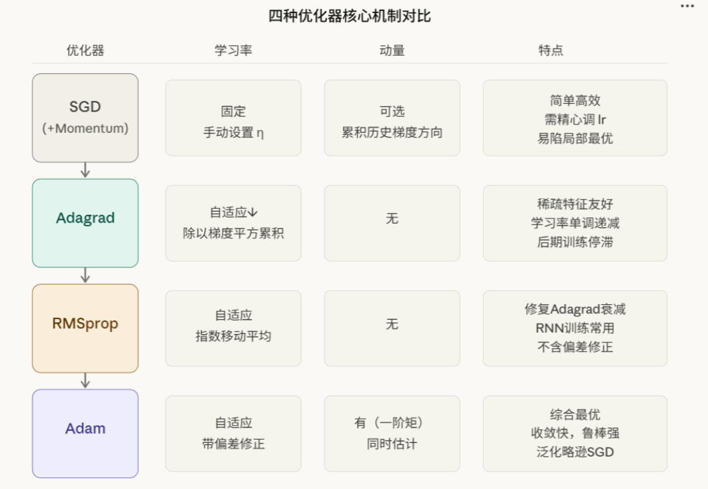
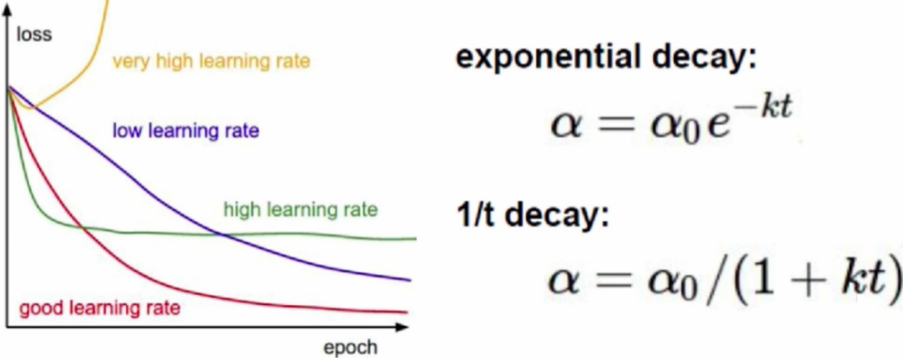

# Convolutional Neural Networks CNN3

## Optimizers

### Stochastic Gradient Descent -- **SGD** Optimizer

**SGD Principle:** Unlike traditional Batch Gradient Descent (which uses all data to compute the gradient in each step), **SGD in the strict sense** uses only one sample per gradient computation, hence its stochastic nature. In practice, we typically use **Mini-batch SGD**, which uses a small batch of samples (e.g., 32 or 64 images) for each gradient computation -- retaining the generalization benefits of stochasticity while leveraging the GPU's parallel computing capability.

**SGD Formula:** $\theta_{t+1}=\theta_t-\eta \nabla_{\theta}J(\theta_t)$

- $\theta_t$ is the parameter at the $t$-th iteration
- $\eta$ is the learning rate
- $\nabla_{\theta}J(\theta_t)$ is the gradient of the loss function with respect to the parameters

**SGD with Momentum Formula:** $v_t=\gamma v_{t-1} + \eta \nabla_{\theta}J(\theta_t)$, $\theta_{t+1}=\theta_t - v_t$

- $v_t$ is the momentum term
- $\gamma$ is the momentum coefficient (typically set to 0.9)
- With momentum, gradients in the wrong direction are canceled out, and updates proceed along the most correct direction

> **Supplement: Nesterov Accelerated Gradient (NAG)**
>
> NAG is an improved version of the momentum method. Standard momentum computes the gradient at the current position first, then combines with historical momentum for the update. NAG, by contrast, **"takes a sneak peek" along the momentum direction first, then computes the gradient at the "lookahead position"** -- analogous to "glancing at the road ahead before adjusting your stride":
>
> Standard momentum: $v_t = \gamma v_{t-1} + \eta \nabla_{\theta}J(\theta_t)$, update: $\theta_{t+1} = \theta_t - v_t$
>
> Nesterov: $v_t = \gamma v_{t-1} + \eta \nabla_{\theta}J(\theta_t - \gamma v_{t-1})$, update: $\theta_{t+1} = \theta_t - v_t$
>
> Note that the gradient is computed at $\theta_t - \gamma v_{t-1}$ (the lookahead position), not the current position. This typically leads to faster and more stable convergence. Usage in PyTorch: `optim.SGD(params, lr=0.01, momentum=0.9, nesterov=True)`

#### Advantages and Disadvantages of the SGD Optimizer

- Advantages:
  - Simple algorithm, easy to implement, low resource consumption
  - Techniques like Momentum can mitigate the risk of optimization getting stuck in local extrema (saddle points) and accelerate convergence (speeding up in the correct direction, suppressing oscillatory directions)
  - Each iteration uses only one or a few samples, resulting in low memory usage and support for large-scale training
  - Handles online learning and dynamic datasets reasonably well
- Disadvantages:
  - Sensitive to learning rate tuning; an inappropriate initial learning rate can easily cause unstable training or slow convergence
  - Uses the same learning rate for all parameters, cannot adapt per-dimension, leading to poor performance on sparse features
  - Prone to wandering near saddle points or local optima with slow convergence
  - Large loss function oscillations, unstable updates; often requires combining with momentum, learning rate decay, and other techniques to improve performance

### AdaGrad Optimizer (Adaptive Gradient)

**Adjusting the learning rate:** The learning rate decreases as the number of training steps increases.

**AdaGrad Formula:** $G_t=G_{t-1}+g_t^2$, $\theta_{t+1}=\theta_t-\frac{\eta}{\sqrt{G_t+\epsilon}} · g_t$

- $G_t$ is the cumulative sum of squared gradients
- $g_t$ is the gradient at the $t$-th iteration
- $\epsilon$ is a smoothing term (prevents division by zero, typically 1e-8)

#### Characteristics of the AdaGrad Algorithm

- **Early stage:** the regularizer (denominator) is small, amplifying the gradient
- **Late stage:** the regularizer (denominator) is large, shrinking the gradient; the gradient decreases with more training steps

- Each component has its own learning rate

- **Advantages:** Relatively simple and easy to implement; suitable for sparse data and non-stationary objective functions

- **Non-stationary objective function:** The properties of the objective function (such as gradients, local minima, global minima, etc.) change over time or iteration count. This variation may be caused by shifts in data distribution, updates to model parameters, or other external factors

- **Disadvantages:** Setting the initial learning rate too large causes the regularizer (denominator) to be overly sensitive; in the late stage, the cumulative regularizer (denominator) becomes too large, easily causing training to end prematurely; the learning rate decays too quickly, making it difficult to choose an appropriate initial learning rate

### RMSProp Optimizer

RMSProp, short for Root Mean Square Propagation, is an algorithm that adaptively adjusts the learning rate based on squared gradient information.

Unlike AdaGrad, it considers a weighted average of the current and past squared gradients, **and uses an exponentially weighted moving average of the gradients to mitigate the impact of accumulating squared gradients.**

**RMSProp Formula:** $E[g^2]_t=\beta E[g^2]_{t-1}+(1-\beta)g_t^2$, $\theta_{t+1}=\theta_t-\frac{\eta}{\sqrt{E[g^2]_t+\epsilon}} ·g_t$

- $E[g^2]_t$ is the exponential moving average of squared gradients
- $\beta$ is the decay rate (typically set to 0.9)
- $g_t$ is the gradient at the $t$-th iteration
- $\epsilon$ is a smoothing term (prevents division by zero)

**Advantages:** Relatively stable; better suited for handling non-stationary and heteroscedastic problems.

> **Supplement: What is "heteroscedasticity"?** In deep learning, "heteroscedasticity" refers to the phenomenon where the gradients of different parameters (or different dimensions) have inconsistent fluctuation magnitudes across different training stages. For example, some parameters consistently have large gradients while others have small ones. RMSProp mitigates this imbalance by adaptively adjusting the learning rate for each parameter (parameters with larger squared gradients automatically get smaller learning rates).

**Disadvantages:** May over-shrink the learning rate.

### Adam Optimizer

Adam, short for Adaptive Moment Estimation, is an algorithm that combines the ideas of Momentum and RMSProp. It considers both the first-moment estimate of the gradient (i.e., the exponential moving average of gradients) and the second-moment estimate of the gradient (i.e., the exponential moving average of squared gradients), and uses bias correction to fix the bias caused by inaccurate gradient estimates.

**Core Idea:** Simultaneously leverages **Momentum** (M, governs direction) and **RMSProp** (R, governs step size)

Adam's main workflow:

- **Direction estimation (Momentum):** Uses the exponentially weighted average of gradients, $m_t=\beta_1m_{t-1}+(1-\beta_1)g_t$
- **Step size estimation (RMSProp idea):** Uses the exponentially weighted average of squared gradients, $v_t=\beta_2 v_{t-1}+(1-\beta_2)g_t^2$
- **Parameter update:** Uses the combined formula with momentum as the numerator and RMSProp as the denominator, $\theta_{t+1}=\theta_t-\frac{\eta \cdot \hat{m_t}}{\sqrt{\hat{v_t}}+\epsilon}$
- **Note the two $\beta$ values:** $\beta_1$ is for the first moment (momentum), $\beta_2$ is for the second moment (variance); they are not the same parameter

**Why is Adam's update inaccurate at the beginning? Bias correction is needed!**

By default $m_0=0, v_0=0$. In the first step, the computed $m_1$ has most of its weight still on "0", causing the value to be too small and not reflecting the actual gradient.

**Reason:** The weighted average is biased toward 0 in the initial stage and needs correction (Bias Correction).

**Correction method:** At each step, divide $m_t$ and $v_t$ by $(1-\beta_1^t)$ and $(1-\beta_2^t)$ respectively, restoring the actual magnitude.

Thus, the derivation and significance of Adam's bias correction -- the true reason lies in the initialization to 0, causing a bias in early-stage weights.

**Adam Formula:** $m_t=\beta_1m_{t-1}+(1-\beta_1)g_t$, $v_t=\beta_2 v_{t-1}+(1-\beta_2)g_t^2$, $\hat{m_t}=\frac{m_t}{1-\beta_1^t}$, $\hat{v_t}=\frac{v_t}{1-\beta_2^t}$, $\theta_{t+1}=\theta_t-\frac{\eta \cdot \hat{m_t}}{\sqrt{\hat{v_t}}+\epsilon}$

- $m_t$ is the first-moment estimate of the gradient (momentum term)
- $v_t$ is the second-moment estimate of the gradient (moving average of squared gradients)
- $\hat{m_t}$ and $\hat{v_t}$ are the bias-corrected estimates
- $\beta_1$ and $\beta_2$ are the exponential decay rates (typically $\beta_1=0.9$, $\beta_2=0.999$)
- $t$ is the time step

> **Supplement: Intuitive Verification of Adam's Bias Correction**
>
> Assume the gradient is always 1 at every step, $\beta_1=0.9$. Let's look at the changes in $m_t$ over the first few steps:
>
> | Step t | Raw $m_t$ | Corrected $\hat{m}_t$ | True Expectation |
> |--------|-----------|----------------------|------------------|
> | 1 | 0.100 | 1.000 | 1.0 |
> | 2 | 0.190 | 1.000 | 1.0 |
> | 3 | 0.271 | 1.000 | 1.0 |
> | 5 | 0.410 | 1.000 | 1.0 |
> | 10 | 0.651 | 1.000 | 1.0 |
>
> The raw $m_t$ is severely "shrunken" in the first few steps; dividing by $1-\beta_1^t$ immediately restores it to the true expected value.

**Advantages:** Converges quickly in the early and middle stages of training, while also possessing a degree of robustness.

**Disadvantages:** Requires extensive hyperparameter tuning; otherwise, performance may degrade.

#### AdamW

**AdamW Formula:** $m_t=\beta_1m_{t-1}+(1-\beta_1)g_t$, $v_t=\beta_2 v_{t-1}+(1-\beta_2)g_t^2$, $\hat{m_t}=\frac{m_t}{1-\beta_1^t}$, $\hat{v_t}=\frac{v_t}{1-\beta_2^t}$, $\theta_{t+1}=\theta_t-\eta (\frac{\hat{m_t}}{\sqrt{\hat{v_t}}+\epsilon}+\lambda \theta_t)$

- $\lambda$ is the weight decay coefficient
- $\lambda \theta_t$ is the **decoupled weight decay term** (note: in adaptive optimizers like Adam, this is **not equivalent** to traditional L2 regularization)
- The remaining parameters are the same as in Adam

**Difference between AdamW and Adam:** AdamW decouples weight decay from gradient computation and applies it directly to parameter updates, allowing better control over the regularization effect.

> **Key Insight: Why does AdamW need to "decouple" weight decay?**
>
> In traditional Adam, if L2 regularization is added to the loss function ($L_{total} = L_{original} + \frac{\lambda}{2}\|\theta\|^2$), the gradient becomes $g_t = \nabla L_{original} + \lambda\theta_t$. Once this gradient enters Adam, Adam scales the update step size according to **the moving average of squared gradients $\sqrt{\hat{v}_t}$** -- meaning each parameter gets decayed by a different amount, "distorting" the effect of L2 regularization.
>
> AdamW's approach: **remove $\lambda\theta_t$ directly from the gradient**, and separately subtract $\eta\lambda\theta_t$ during the parameter update. This way all parameters decay at a uniform rate, resulting in better and more controllable regularization. Experiments have shown that AdamW's generalization performance is typically superior to Adam + L2 regularization.
>
> **One-line distinction**: In SGD, weight decay = L2 regularization (equivalent); in Adam, weight decay ≠ L2 regularization (hence the need for AdamW).

#### weight_decay

weight_decay is a regularization technique used to prevent neural network overfitting. It restricts the magnitude of weights during optimization, making the model simpler and smoother.

**L2 Regularization Loss Function:** $L_{total}=L_{original}+\frac{\lambda}{2} \sum_i \theta_i^2$

- $L_{original}$ is the original loss function
- $\lambda$ is the weight decay coefficient
- $\theta_i$ is the $i$-th parameter of the model

**Weight Update Formula:** For each model parameter $\theta$, the gradient computation for weight_decay:
$$
\frac{\partial L_{total}}{\partial \theta}=\frac{\partial L_{original}}{\partial \theta}+\lambda \theta
$$

**Parameter Update in the SGD Optimizer:** In PyTorch, when using the `torch.optim.SGD` optimizer, `weight_decay` is applied at each parameter update according to the following formula:
$$
\theta_{t+1}=\theta_{t}-\eta(\frac{\partial L_{original}}{\partial \theta_t} + \lambda \theta_t)
$$

- $\theta_t$ is the parameter value at the $t$-th iteration
- $\eta$ is the learning rate
- $\frac{\partial L_{original}}{\partial \theta_t}$ is the gradient of the original loss function with respect to the parameters
- $\lambda$ is the weight decay coefficient
- $\lambda \theta_t$ is the L2 regularization term

**Application in the Adam Optimizer:** In adaptive optimizers like Adam, weight decay is typically implemented in two ways:

- **L2 Regularization approach (traditional Adam):** Add the weight decay term to the gradient, $g_t=\nabla L_{original}(\theta_{t-1})+\lambda\theta_{t-1}$
- **Decoupled weight decay approach (AdamW):** Apply weight decay directly during parameter update, $\theta_t=\theta_{t-1}-\eta(\frac{\hat{m}_t}{\sqrt{\hat{v}_t}+\epsilon}+\lambda \theta_{t-1})$

Choosing the weight decay coefficient:

- Common value range: 1e-5 to 1e-2

- Smaller values (e.g., 1e-5) are suitable for fine-tuning pretrained models
- Larger values (e.g., 1e-2) are suitable for models trained from scratch
- The optimal value should be determined through validation set performance tuning


## Optimizer Code Example: An Intuitive Feel for the Behavior of Different Optimizers

```python
import torch
import torch.optim as optim
import matplotlib.pyplot as plt

# Use a simple quadratic function f(w)=w² to intuitively feel the convergence behavior of different optimizers
# Goal: starting from w=3, find the minimum w=0

def demo_optimizer(optimizer_name, lr=0.1, epochs=20):
    """Demonstrate the convergence trajectory of different optimizers on f(w)=w²"""
    w = torch.tensor([3.0], requires_grad=True)  # start from w=3
    w_history = []

    if optimizer_name == "SGD":
        opt = optim.SGD([w], lr=lr)
    elif optimizer_name == "SGD_Momentum":
        opt = optim.SGD([w], lr=lr, momentum=0.9)
    elif optimizer_name == "SGD_NAG":
        opt = optim.SGD([w], lr=lr, momentum=0.9, nesterov=True)
    elif optimizer_name == "AdaGrad":
        opt = optim.Adagrad([w], lr=lr)
    elif optimizer_name == "RMSProp":
        opt = optim.RMSprop([w], lr=lr)
    elif optimizer_name == "Adam":
        opt = optim.Adam([w], lr=lr)

    for _ in range(epochs):
        opt.zero_grad()
        loss = w ** 2          # objective function f(w) = w²
        loss.backward()
        opt.step()
        w_history.append(w.item())

    return w_history

# Compare all optimizers
plt.figure(figsize=(12, 6))
for name in ["SGD", "SGD_Momentum", "SGD_NAG", "AdaGrad", "RMSProp", "Adam"]:
    hist = demo_optimizer(name, lr=0.3)
    plt.plot(hist, label=name, marker='.', markersize=4)

plt.axhline(y=0, color='gray', linestyle='--', alpha=0.5)  # optimal solution w=0
plt.xlabel("Iteration")
plt.ylabel("Parameter w Value")
plt.title("Convergence Comparison of Different Optimizers on f(w)=w² (initial w=3)")
plt.legend()
plt.grid(True, alpha=0.3)
plt.show()
```


Observations:

- Plain SGD oscillates noticeably and slowly approaches the optimal solution

- SGD+Momentum uses historical gradients to cancel oscillations and accelerate in the correct direction

- SGD+NAG (Nesterov) "takes a peek ahead" on top of momentum, yielding smoother convergence

- AdaGrad's learning rate decays too quickly in the later stages, almost stopping before reaching the optimal solution

- RMSProp uses an exponential moving average to avoid the problem of AdaGrad's excessively rapid learning rate decay

- Adam combines momentum + adaptive learning rate + bias correction, achieving the fastest convergence


## Optimizer Comparison



### Adagrad (Adaptive Gradient Algorithm):

- **Applicable scenarios:** Suitable for handling sparse data and problems with features of different scales. Since Adagrad can adjust the learning rate based on the historical gradient of each parameter, it has an advantage when dealing with problems involving features of varying scales. For many NLP tasks, such as natural language processing, where input data is typically sparse, Adagrad also performs well.

- **Caveats:** Adagrad accumulates squared gradients during training, causing the learning rate to gradually decrease. This may lead to an excessively small learning rate in later stages, slowing down learning. Therefore, Adagrad may not be suitable for some problems.

### RMSprop (Root Mean Square Propagation):

- **Applicable scenarios:** Suitable for handling non-stationary problems and problems with features of different scales. RMSprop balances the learning rate using an exponentially weighted average, effectively handling non-stationary problems. It can also mitigate the issue of Adagrad's excessively rapid learning rate decay.

- **Caveats:** RMSprop may still suffer from gradually decreasing learning rates in some cases, especially during long training sessions. Therefore, although RMSprop performs well in many scenarios, further tuning may be needed for some problems.

### Adam (Adaptive Moment Estimation):

- **Applicable scenarios:** Adam combines the advantages of Momentum and RMSprop, making it suitable for most deep learning tasks. Adam performs excellently when handling large-scale training data and high-dimensional feature spaces, and is generally a reliable and efficient optimizer choice.

- **Caveats:** Although Adam performs well on many problems, it can be sensitive to hyperparameters in some cases. Careful tuning of hyperparameters such as learning rate, momentum, and exponential decay rates is needed to achieve optimal performance.

Overall, for most deep learning problems, Adam is a good default choice because it can typically adaptively adjust the learning rate during training and performs well across different types of problems. However, for certain specific problems, such as sparse data or non-stationary problems, Adagrad and RMSprop may be more suitable. Ultimately, the choice of which optimizer to use should be based on the specific problem and experimental results.

## Learning Rate Adaptation (Learning Rate Schedules)

K is a coefficient, and t is the number of iterations (**Note: t is the iteration count, not the epoch count!** One epoch contains multiple iterations. For example, with 10,000 training images and batch_size=64, 1 epoch ≈ 157 iterations). Learning rate schedules are typically adjusted per iteration, since the learning rate can be changed after every parameter update (iteration).



### Practical Experience

- For sparse data, use methods with adaptive learning rates

- SGD typically requires longer training time but can achieve better final results, provided good initialization and learning rate

- When training deeper and more complex networks and fast convergence is needed, Adam is recommended; set a relatively small learning rate value

- Adagrad, RMSprop, and Adam are relatively similar algorithms and perform comparably under similar conditions

### Learning Rate Tuning Advice

The learning rate is an important hyperparameter in deep learning; it controls the magnitude of model parameter updates at each iteration. Whether the learning rate is set appropriately has a significant impact on model training and performance. However, there is no fixed value for an appropriate learning rate -- it depends on many factors, including the dataset, model complexity, optimization algorithm, etc.

**Initial Setting:** Typically, the initial learning rate can be set to a small value, such as 0.001 or 0.01. For pretrained models, an even smaller learning rate can be used, since the model parameters are already relatively close to a good solution. (Consult AI for initial learning rate recommendations.)

**Learning Rate Scheduling:** Learning rate scheduling helps the model dynamically adjust the learning rate during training. For example, as training progresses, the learning rate can be gradually reduced to more stably optimize the model as it approaches convergence. Common learning rate scheduling methods include Step Decay, Exponential Decay, and Cosine Annealing.

> **Detailed Explanation of Three Common Learning Rate Scheduling Strategies:**
>
> | Strategy | Behavior | Formula | Applicable Scenarios |
> |----------|----------|---------|---------------------|
> | **StepLR** | Every N steps, lr × gamma | $lr = lr_0 \times \gamma^{\lfloor t / N \rfloor}$ | Simplest and most common, e.g., halve every 30 epochs |
> | **ExponentialLR** | Every step, lr × gamma | $lr = lr_0 \times \gamma^t$ | Smooth continuous decay |
> | **CosineAnnealingLR** | Decays to minimum along a cosine curve | $lr = lr_{min} + \frac{1}{2}(lr_0 - lr_{min})(1 + \cos(\frac{t}{T_{max}}\pi))$ | Commonly used in SOTA training, e.g., ResNet, EfficientNet |
>
> ```python
> import torch.optim as optim
> import torch.optim.lr_scheduler as lr_scheduler
> import matplotlib.pyplot as plt
>
> # Simulate the curves of three learning rate scheduling strategies
> model_params = [torch.nn.Parameter(torch.tensor([0.0]))]  # dummy parameters
>
> schedulers_config = {
>     "StepLR (every 30 steps ×0.5)": lambda opt: lr_scheduler.StepLR(opt, step_size=30, gamma=0.5),
>     "ExponentialLR (γ=0.95)": lambda opt: lr_scheduler.ExponentialLR(opt, gamma=0.95),
>     "CosineAnnealing (T_max=100)": lambda opt: lr_scheduler.CosineAnnealingLR(opt, T_max=100),
> }
>
> plt.figure(figsize=(10, 5))
> for name, sched_fn in schedulers_config.items():
>     opt = optim.SGD(model_params, lr=0.1)
>     sched = sched_fn(opt)
>     lrs = []
>     for _ in range(100):
>         lrs.append(opt.param_groups[0]['lr'])
>         sched.step()
>     plt.plot(lrs, label=name)
>
> plt.xlabel("Iteration")
> plt.ylabel("Learning Rate")
> plt.title("Comparison of Three Learning Rate Scheduling Strategies")
> plt.legend()
> plt.grid(True, alpha=0.3)
> plt.show()
> ```

**Learning Rate Range Test:** This is an exploratory method that observes changes in the loss function value by increasing the learning rate over a wide range, thereby finding an appropriate learning rate range. Further training can then be conducted within the found learning rate range.

**Trial and Error:** Try different learning rates and observe the model's performance on the validation set. If the learning rate is too small, the model will converge very slowly; if the learning rate is too large, the model may diverge. Through multiple trials, find a learning rate that converges relatively quickly during training and performs well on the validation set.

**Using Adaptive Learning Rate Methods:** Some adaptive learning rate optimization algorithms (such as Adam, Adagrad, RMSprop, etc.) can automatically adjust the learning rate, updating the learning rate based on the historical gradient information of parameters. These algorithms typically perform well across different tasks and datasets, reducing the burden of manual learning rate tuning.

## Network Initialization (w and b)

### How to Evaluate Whether Initialization Results Are Good?

The initialization method of kernels (convolution kernels) in convolutional neural networks can affect the activation distribution of each layer, which in turn affects the performance of the entire network. Different kernel initialization methods may lead to different sample distributions, so observing the sample distribution can help us choose an appropriate initialization strategy.

Specifically, when using randomly initialized convolution kernels, if the weights are initialized too small, it will be difficult to learn complex features through shallower networks, leading to the so-called "vanishing gradient" problem. However, if the weights are initialized too large, it may cause numerical instability and incorrect convergence. To avoid these issues, advanced convolution kernel initialization methods are typically used, such as Xavier Initialization (Glorot) or He Initialization.

In practice, we can evaluate the effectiveness of kernel initialization by observing the standard deviation and mean of the activation distribution, and determine whether the initialization strategy needs adjustment. For example, during network training, if the variance and mean of the activation distribution change dramatically, it means the current kernel initialization method may have problems, and you should consider changing the initialization strategy or adding regularization terms to improve model stability.

**Inspecting the activation value distribution of each layer after initialization:** Activation values are the values after the activation function (i.e., the sample values). If the distribution is fixed within [-1, 1] or [0, 1], that is fine. If it is concentrated around a single value, that is not good.

> **The Two Most Important Initialization Methods (Formulas and Code):**
>
> | Initialization Method | Suitable Activation Functions | Weight Sampling Distribution | Core Idea |
> |-----------------------|------------------------------|------------------------------|-----------|
> | **Xavier (Glorot)** | Sigmoid, Tanh | $W \sim \mathcal{N}(0, \frac{2}{n_{in} + n_{out}})$ | Considers both forward and backward propagation, taking the harmonic mean of input and output neuron counts |
> | **He (Kaiming)** | ReLU, LeakyReLU | $W \sim \mathcal{N}(0, \frac{2}{n_{in}})$ | ReLU "kills" half the neurons, so variance must be compensated by ×2; only considers forward propagation |
>
> Where $n_{in}$ = number of input neurons, $n_{out}$ = number of output neurons.
>
> ```python
> import torch
> import torch.nn as nn
>
> # Experience the impact of different initializations on activation value distributions
> def check_init(init_name, n_layers=10, n_neurons=500):
>     """Simulate multi-layer network forward propagation, observing the change in activation standard deviation under different initializations"""
>     x = torch.randn(1000, n_neurons)  # 1000 samples
>
>     for i in range(n_layers):
>         W = torch.randn(n_neurons, n_neurons)
>         if init_name == "Xavier":
>             W *= (2.0 / (n_neurons + n_neurons)) ** 0.5   # std = sqrt(2/(nin+nout))
>         elif init_name == "He":
>             W *= (2.0 / n_neurons) ** 0.5                  # std = sqrt(2/nin)
>         elif init_name == "Bad_Small":
>             W *= 0.01                                       # too small → vanishing gradient
>         elif init_name == "Bad_Large":
>             W *= 1.0                                        # too large → exploding gradient
>
>         x = x @ W  # linear transformation (simulating propagation without activation function)
>
>     print(f"{init_name:12s}: final output std = {x.std().item():.4f}")
>
> for method in ["Xavier", "He", "Bad_Small", "Bad_Large"]:
>     check_init(method)
> # Example output:
> # Xavier      : final output std ≈ 1.0 (stable!)
> # He          : final output std ≈ 1.0 (stable!)
> # Bad_Small   : final output std ≈ 0.0000 (vanished!)
> # Bad_Large   : final output std ≈ 10^15 (exploded!)
>
> # Actual usage in PyTorch:
> conv = nn.Conv2d(64, 128, kernel_size=3)
> nn.init.kaiming_normal_(conv.weight, mode='fan_out', nonlinearity='relu')  # He initialization
> # or
> nn.init.xavier_normal_(conv.weight)  # Xavier initialization
> ```

### What If the Initialization Method Is Poor?

**Apply normalization at every layer for every batch.**

This is the core idea of **Batch Normalization (BN)**. During training, BN normalizes the data in each mini-batch (subtracting the mean and dividing by the standard deviation), then restores the network's expressive capacity through learnable parameters $\gamma$ (scaling) and $\beta$ (shifting). For a detailed derivation, see the "Normalization and Batch Normalization" section in `Neural Network Concepts.md`.

Why did no one do this earlier? Because when the data volume is large, normalizing on each batch means each batch cannot reflect the overall data distribution. For each sample, a feature is extracted, but across batches, the features of the samples cannot be distinguished. Therefore, inverse normalization was introduced -- when normalization is not helpful, undo the normalization.

To ensure that normalization can be effective, two additional parameters are set for inverse normalization: use $\gamma$ and $\beta$ to perform the inverse normalization.

> **The Four Steps of BN (Brief):**
> 1. Compute batch mean: $\mu_B = \frac{1}{m}\sum x_i$
> 2. Compute batch variance: $\sigma_B^2 = \frac{1}{m}\sum (x_i - \mu_B)^2$
> 3. Normalize: $\hat{x}_i = \frac{x_i - \mu_B}{\sqrt{\sigma_B^2 + \epsilon}}$
> 4. Scale and shift: $y_i = \gamma \hat{x}_i + \beta$
>
> $\gamma$ and $\beta$ are learnable parameters -- if the normalized distribution is optimal, the network can learn $\gamma\approx1, \beta\approx0$; if the original distribution needs to be restored, the network can also learn its way back ($\gamma=\sigma, \beta=\mu$). This is the true meaning of "inverse normalization."

## Common Issues


- **First plot (loss oscillates violently):** The cause may be an excessively large learning rate, causing the parameter update step size to be too large, jumping back and forth near the optimal solution without converging. Solution: reduce the learning rate.

- **Second plot (validation loss begins to rise):** Some overfitting. Training loss continues to decrease but validation loss starts to rise in later stages -- the model is beginning to "memorize" the training data rather than learning general patterns. Solutions: increase Dropout, weight_decay, data augmentation, or use Early Stopping.

- **Third plot (training and validation diverge severely):** Overfitting is obvious. Training loss is very low but validation loss is high and continuously rising, with the two curves diverging severely. Solutions are the same as above, but to a greater degree.

- **Fourth plot (both curves decrease slowly, trends are consistent):** Learning rate is somewhat small; the model is learning too slowly, but the direction is correct (no sign of overfitting). You can **moderately increase the learning rate** while continuing to train for more epochs -- both curves still have room to decrease.

- **Fifth plot (almost stagnant in early stages, begins to decrease later):** The weights (model's activation function) were not initialized well, causing slow training at the beginning. This may be due to improper weight initialization or an unsuitable choice of activation function (such as Sigmoid's vanishing gradient in deep networks), causing very small gradients in the early stages and almost no effect from parameter updates.

- **Sixth plot (loss increases instead of decreases):** The gradient was added in the wrong direction; the optimization objective was set to the opposite value. For example, the loss function took a negative sign, or gradient ascent was used instead of gradient descent. Check the loss function definition and the optimizer's update direction.

---

## Optimizer Selection Quick Reference Guide

```
What kind of model are you training?
├── Traditional CNN / MLP (image classification, etc.)
│   ├── Pursuing the best results, have tuning experience → SGD + Momentum + CosineAnnealing
│   ├── Rapid prototyping, don't want to tune → Adam / AdamW (default recommendation)
│   └── Sparse data (e.g., NLP word vectors) → AdaGrad / Adam
├── Transformer / Large Language Models → AdamW (standard, weight_decay=0.01~0.1)
├── GAN / Generative Adversarial Networks → Adam (β₁=0.5, β₂=0.999)
├── Reinforcement Learning → Adam / RMSProp
└── Need extreme convergence precision (competitions) → SGD + Momentum + carefully tuned learning rate decay
```

**One-line summary**: When you don't know what to use, **start with Adam/AdamW**. It converges quickly, is insensitive to hyperparameters, and is suitable for rapid iteration. Once the baseline is stable, if you want to squeeze out the last bit of performance, switch to SGD + Momentum for fine-tuning.

## Fine-Tuning Example -- VGG11 -- CIFAR-10