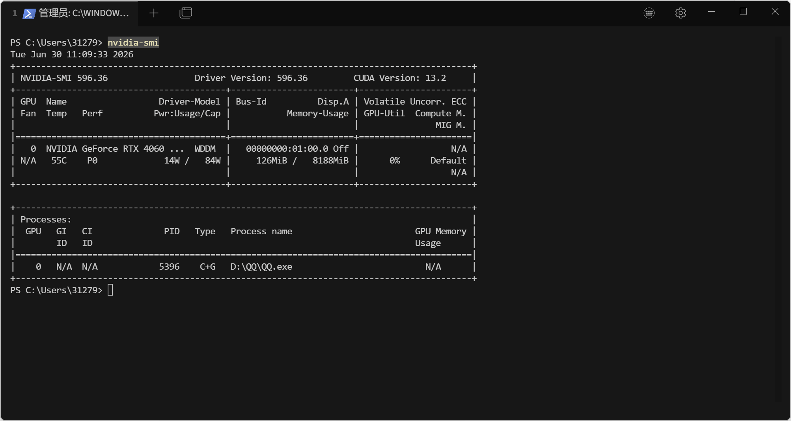

# PyTorch Installation

## 1. Check GPU Driver

```bash
nvidia-smi
```



## 2. Check the PyTorch Website for the Install Command Based on Your CUDA Version

[PyTorch Official Download Page](https://pytorch.org/get-started/locally/)

```bash
pip3 install torch torchvision --index-url https://download.pytorch.org/whl/cu132
```

## 3. Verify Installation

```python
import torch

# Print PyTorch version
print(torch.__version__)

# Check if CUDA is available
print(torch.cuda.is_available())

# Example output (version and CUDA suffix depend on actual installation; should match the index in the install command above, e.g. cu132)
2.12.1+cu132
True
```