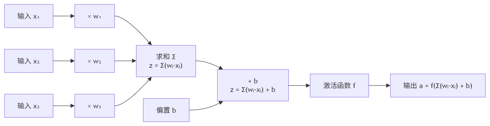
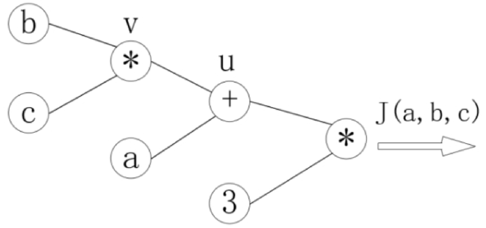
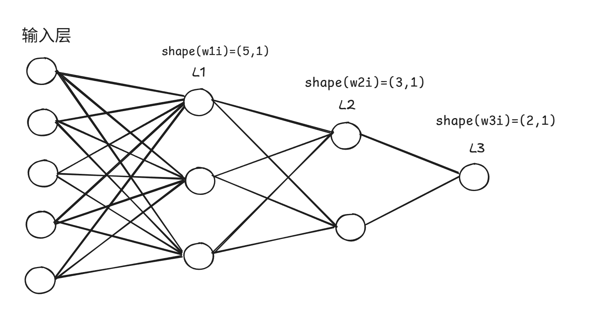
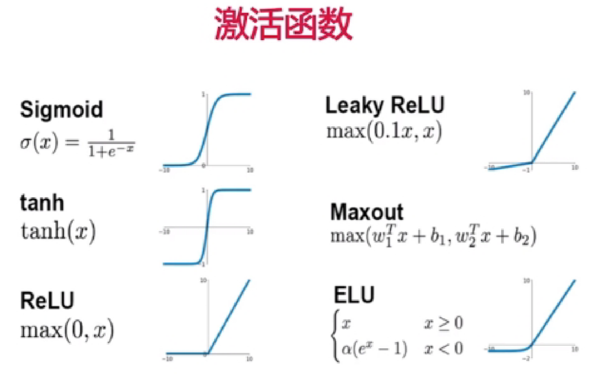
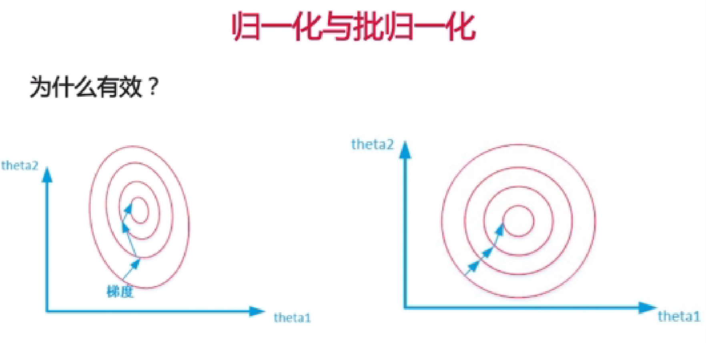
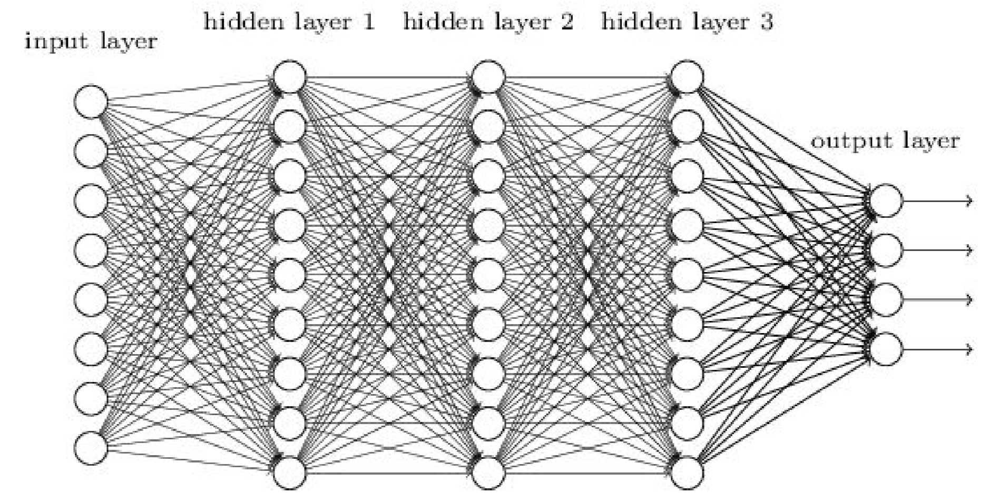

# Neural Networks

## The Structure of a Neural Network

### What is a neural network?

A Neural Network is a computational model built by imitating biological nervous systems. It is formed by connecting a large number of **neurons** in a layered structure, and can automatically learn complex mappings from data.

**The core idea**: a neural network is essentially a "universal function approximator" — given enough neurons and layers, it can approximate any continuous function. The process of training a neural network is the process of continually adjusting the parameters (weights and biases) so that this function fits the training data as closely as possible.

### The neuron: the network's basic unit

What each neuron does is very simple — **a weighted sum + a non-linear transformation**:



Mathematically it splits into two steps:

1. **Linear combination**: $z = \sum_{i=1}^{n} w_i x_i + b = W^T x + b$
2. **Activation function**: $a = f(z)$

| Symbol  | Name            | Meaning                                                         |
| ----- | --------------- | ------------------------------------------------------------ |
| $x_i$ | Input            | The signal from the previous layer's neurons or from the raw data                             |
| $w_i$ | Weight  | Controls each input's "influence" on the output — the larger the weight, the more important that input         |
| $b$   | Bias    | Controls "how easily the neuron is activated" — the larger the bias, the more easily the neuron outputs a positive value |
| $z$   | Weighted sum / net input | The value **before** the activation function (also called the logits)                          |
| $f$   | Activation function        | Introduces non-linearity, e.g. ReLU, Sigmoid, Tanh                       |
| $a$   | Activation / output   | This neuron's final output, passed on to the next layer                             |

> **Why do we need an activation function?** If $f$ is the identity function ($f(z)=z$), then no matter how many layers you stack, the entire network is equivalent to a single linear transformation (see "the degeneracy conclusion for purely linear networks" below). The activation function breaks linearity, letting the network fit curves, classification boundaries, and other complex patterns.

### The concept of a layer

What a single neuron can do is very limited (it is essentially just a linear classifier)

Organizing a large number of neurons into **layers**, forming a layered structure, greatly increases the network's expressive power:

```
输入层          隐藏层 1        隐藏层 2        输出层
(第0层)         (第1层)         (第2层)         (第3层)

  x₁ ───→ 神经元₁⁽¹⁾ ───→ 神经元₁⁽²⁾ ───→
    ↘        ↗              ↗
  x₂ ───→ 神经元₂⁽¹⁾ ───→ 神经元₂⁽²⁾ ───→ 输出 ŷ
    ↗        ↗              ↗
  x₃ ───→ 神经元₃⁽¹⁾ ───→
```

| Layer                       | Position          | Role                                                         |
| -------------------------- | ------------- | ------------------------------------------------------------ |
| **Input Layer**  | Layer 0       | Receives the raw data (such as the pixel values of an image); it performs no computation itself and only passes data along |
| **Hidden Layer** | Layers 1 ~ L-1 | The core of the network, "hidden" between the input and the output. Each layer extracts more abstract features than the previous one |
| **Output Layer** | Layer L       | Produces the final result — a regression task outputs a continuous value, a classification task outputs a probability distribution (via Softmax) |

> **Where does the "deep" in deep learning come from?** The number of hidden layers is the network's **depth**. A traditional neural network might have only 1~2 hidden layers; a "deep network" can have dozens, hundreds, or even thousands. "Deep" means more levels of feature abstraction — shallow layers learn edges/textures, middle layers learn shapes/parts, deep layers learn semantics/wholes.

### Forward Propagation

Data flows in from the input layer, is computed layer by layer, and finally reaches the output layer; this process is called **forward propagation**.

For layer $l$ ($l = 1, 2, \dots, L$):

$$z^{(l)} = W^{(l)} a^{(l-1)} + b^{(l)}$$

$$a^{(l)} = f(z^{(l)})$$

where:

- $a^{(l-1)}$ is the output of layer $l-1$ (and also the input of layer $l$), with $a^{(0)} = x$ (the raw input)
- $W^{(l)}$ is the weight matrix of layer $l$
- $b^{(l)}$ is the bias vector of layer $l$
- $f$ is the activation function
- $z^{(l)}$ is the pre-activation value of layer $l$ (the net input)
- $a^{(l)}$ is the post-activation output of layer $l$

### The Matrix Representation of the Network

In actual computation, multiple samples of a mini-batch are processed simultaneously, in which case the input becomes a matrix:

$$X \in R^{m \times d}$$

where $m$ is the number of samples in the batch and $d$ is the number of features per sample.

Forward propagation for layer $l$ becomes:

$$Z^{(l)} = A^{(l-1)} W^{(l)} + b^{(l)}$$

$$A^{(l)} = f(Z^{(l)})$$

> **A note on dimensions**: if layer $l-1$ has $n_{in}$ neurons and layer $l$ has $n_{out}$ neurons, then $W^{(l)} \in R^{n_{in} \times n_{out}}$ and $b^{(l)} \in R^{n_{out}}$. Note that this article adopts the $W^T x$ notational convention (see the detailed explanation in the backpropagation section below).

### The Code Mechanics of Forward Propagation: What Happens Behind `model(x)`?

#### The core call chain

```python
import torch.nn as nn

# 1. Define a simple network
class MyModel(nn.Module):
    def __init__(self):
        super().__init__()
        self.fc1 = nn.Linear(10, 20)   # Layer 1: 10-dim input → 20-dim
        self.fc2 = nn.Linear(20, 5)    # Layer 2: 20-dim → 5-dim
        self.relu = nn.ReLU()

    def forward(self, x):
        x = self.fc1(x)                # Forward propagation step 1
        x = self.relu(x)               # Activation function
        x = self.fc2(x)                # Forward propagation step 2
        return x

# 2. Instantiate and "call"
model = MyModel()
x = torch.randn(3, 10)                # batch_size=3, feature dimension=10
output = model(x)                      # ← what exactly happens on this line?
```

When you write `model(x)`, what is triggered is Python's `__call__` magic method. The full call chain is as follows:

```
model(x)
  ↓
MyModel 类没有 __call__ → 查父类 nn.Module
  ↓
nn.Module.__call__(self, x)           # Python 魔法方法，让实例"可调用"
  ↓ 实际调用 _call_impl，内部做了四件事：
  ① 执行 forward_pre_hook（用户注册的前置钩子）
  ② 如有注册的 backward_hook，在此处注册到 autograd 计算图（供后续 .backward() 触发）
  ③ 调用 self.forward(x)              # ← 这才是你写的 forward 方法！
  ④ 执行 forward_hook（用户注册的后置钩子）
  ↓
返回 forward 的输出
```

> **Additional note**: step ② above (backward hook registration) includes registration on the input side (before `forward`) and on the output side (after `forward`, once the return value is obtained), but overall the "preparation work" for backward hooks is handled uniformly by `_call_impl`, and the user need not be aware of it. The `_backward_hooks` dictionary holds both `register_backward_hook` and `register_full_backward_hook` kinds of hooks and processes them uniformly.

> **The key understanding**: `nn.Module` wraps `forward` via `__call__` (which points to `_call_impl`), and **you should never call `model.forward(x)` directly**. Calling `forward` directly skips hook dispatch and JIT compilation interception — for instance, a `register_forward_pre_hook` you registered would be completely ineffective. Although the `self.training` mode and autograd graph recording still work correctly inside `forward`, losing the Hook "back door" makes advanced functionality such as debugging and feature visualization unavailable.

#### The core source code of `nn.Module.__call__` (simplified)

The following is a simplified version of the logic of `nn.Module.__call__` in PyTorch's source code, to help understand the call flow:

```python
# The code below is a simplified illustration of PyTorch's source code, not the actual source
# In reality __call__ = _call_impl (a type-annotated assignment, not a traditional def statement)
class Module:
    def _call_impl(self, *input, **kwargs):
        # ① Execute forward_pre_hooks (the pre-hooks registered by the user)
        for hook in self._forward_pre_hooks.values():
            hook(self, input)

        # ② If there are backward hooks, register them with autograd here (register the input hook first, then the output hook after computing result)
        bw_hook = None
        if len(self._backward_hooks) > 0:
            bw_hook = BackwardHook(self, self._backward_hooks.values())
            input = bw_hook.setup_input_hook(input)

        # ③ The core: call the forward method defined by the user
        result = self.forward(*input, **kwargs)

        # Continuing step ② —— registering the output-side backward hook
        if bw_hook is not None:
            result = bw_hook.setup_output_hook(result)

        # ④ Execute forward_hooks (the post-hooks registered by the user)
        for hook in self._forward_hooks.values():
            hook_result = hook(self, input, result)

        return result
```

#### Nested calls: `self.fc1(x)` follows the same flow

`nn.Linear` is also a subclass of `nn.Module`, so:

```python
x = self.fc1(x)                       # Triggers nn.Linear.__call__
  ↓
nn.Module.__call__(self.fc1, x)
  ↓
self.fc1.forward(x)                   # nn.Linear's built-in forward
  ↓
return x @ W.T + b                    # Matrix multiplication + bias (i.e. z = Wx + b)
```

The forward propagation of the entire network is a nested call chain of `__call__` → `forward`, layer by layer:

```
model(x)                              # 你的模型
  → __call__ → forward:
    → self.fc1(x)                     # 第1个线性层
      → __call__ → forward: x @ W₁.T + b₁
    → self.relu(x)                    # ReLU 激活
      → __call__ → forward: max(0, x)
    → self.fc2(x)                     # 第2个线性层
      → __call__ → forward: x @ W₂.T + b₂
```

#### Why take the detour through `__call__` instead of calling `forward` directly?

The "intermediate layer" `__call__` is designed because PyTorch needs to do some framework-level "extra work" **before and after every forward computation**. This work is scheduled uniformly by `_call_impl`, and framework users need not care about it:

| Mechanism                  | What it does                                                       | Description                                                |
| --------------------- | ------------------------------------------------------------ | --------------------------------------------------- |
| **Hook dispatch**         | Executes the hooks registered by the user before and after `forward` (printing intermediate values, modifying gradients, feature visualization, etc.) | The core function of `__call__`; calling `forward` directly skips it      |
| **Backward hook registration**    | Registers backward hooks such as `full_backward_hook` with the autograd computation graph     | Registration is done in `_call_impl`, to be triggered during `.backward()` |
| **JIT / compilation interception**    | The interception and optimization of forward propagation by `torch.jit.script`, `torch.jit.trace`, and `torch.compile` | Handled uniformly through the `__call__` entry point                       |
| **Global Forward Hooks** | Hooks registered globally on `nn.Module` (not at the single-module level), which apply to all modules | Dispatched in `_call_impl`                              |

> **Note the distinction**: the `self.training` flag set by `model.train()` / `model.eval()`, along with autograd's graph recording (controlled by `torch.no_grad()`), are **mechanisms independent of `__call__`** — they take effect inside your `forward` and at PyTorch's operator level, and work the same whether you call `model(x)` or `model.forward(x)`. But calling `forward` directly loses the Hook and JIT capabilities in the table above, so **you still should not call `model.forward(x)` directly**.

#### Summary: the correspondence between the mathematical formulas and the code

| Mathematical formula                                | Code                                                        |
| --------------------------------------- | ----------------------------------------------------------- |
| $z^{(l)} = W^{(l)} a^{(l-1)} + b^{(l)}$ | `x = self.fc(x)` → triggers `nn.Linear.forward` → `x @ W.T + b` |
| $a^{(l)} = f(z^{(l)})$                  | `x = self.relu(x)` → triggers `nn.ReLU.forward` → `max(0, x)`   |
| Layer-by-layer chaining                                | The nested chain of `__call__` → `forward`                             |

> **Remember it in one sentence**: `model(x)` is essentially Python's `__call__` magic method → which internally calls the `forward` you wrote → and each sub-module inside `forward` (`self.fc`, `self.relu`) invokes its input through its own `__call__` → `forward`, thereby forming a recursively nested forward propagation chain.

### The Three Elements of a Network

A complete neural network is defined by the following three elements:

| Element                          | Description                                 | Example                                                |
| ----------------------------- | ------------------------------------ | --------------------------------------------------- |
| **Architecture**      | How many layers, how many neurons per layer, how layers are connected | Fully connected (FC), convolutional (CNN), recurrent (RNN), Transformer |
| **Activation**    | The non-linear transformation of each layer                     | ReLU, Sigmoid, Tanh, GELU                           |
| **Loss Function** | Measures the gap between predictions and true values             | Mean squared error (regression), cross-entropy (classification)                    |

Training a neural network = finding a set of weights and biases that minimizes the loss function. This is achieved through **the backpropagation algorithm + gradient descent** — which is exactly what the next chapter expands on in detail.

## The Backpropagation Algorithm

### Prerequisite concept: a chain rule warm-up

Given: $J(a,b,c)=3(a+bc)$, let $u=a+v$ and $v=bc$, then:

$$
J(a,b,c)=3u
$$

> **Notation**:
>
> - $J$: the final output, which can be understood as the "loss value"; we care about how it changes with each variable
> - $a, b, c$: the three independent variables (analogous to the weights and biases in a neural network)
> - $u, v$: intermediate variables that break a complex computation into simple steps, making chained differentiation convenient
> - $\frac{dJ}{da}$: the partial derivative of $J$ with respect to $a$, meaning "if $a$ changes a little, how much does $J$ change"

**What is the chain rule?** Imagine dominoes: $a$ changes $\rightarrow$ $u$ changes $\rightarrow$ $J$ changes. If you want to know how far $J$ ultimately falls when you nudge $a$, the method is to multiply together the "influence" of every segment along the path. That is the core idea of the chain rule.

**Finding $\frac{dJ}{da}$ (path: $a \rightarrow u \rightarrow J$):**

$$
\frac{dJ}{da}=\frac{dJ}{du}·\frac{du}{da}=3 \times 1 = 3
$$

- Segment 1, $u \rightarrow J$: $\frac{dJ}{du}=3$ (because $J=3u$, differentiating with respect to $u$ gives 3)
- Segment 2, $a \rightarrow u$: $\frac{du}{da}=1$ (because $u=a+v$, differentiating with respect to $a$ with $v$ treated as a constant gives 1)
- Multiplying gives 3. Intuition: every increase of 1 in $a$ increases $J$ by 3.

**Finding $\frac{dJ}{db}$ (path: $b \rightarrow v \rightarrow u \rightarrow J$):**
$$
\frac{dJ}{db}=\frac{dJ}{du}·\frac{du}{dv}·\frac{dv}{db}=3 \times 1 \times c = 3c
$$

- $\frac{dJ}{du}=3$, $\frac{du}{dv}=1$ ($u=a+v$ differentiated with respect to $v$), $\frac{dv}{db}=c$ ($v=bc$ differentiated with respect to $b$ gives $c$)

**Finding $\frac{dJ}{dc}$ (path: $c \rightarrow v \rightarrow u \rightarrow J$):**

$$
\frac{dJ}{dc}=\frac{dJ}{du}·\frac{du}{dv}·\frac{dv}{dc}=3 \times 1 \times b = 3b
$$

- $\frac{dv}{dc}=b$ ($v=bc$ differentiated with respect to $c$ gives $b$)

**A concrete numerical example**: suppose at some moment $a=1, b=2, c=3$:

- $v = 2 \times 3 = 6$
- $u = 1 + 6 = 7$
- $J = 3 \times 7 = 21$

At this point the partial derivatives are:

- $\frac{dJ}{da} = 3$ (an increase of 0.1 in $a$ increases $J$ by about 0.3)
- $\frac{dJ}{db} = 3c = 3 \times 3 = 9$ (an increase of 0.1 in $b$ increases $J$ by about 0.9)
- $\frac{dJ}{dc} = 3b = 3 \times 2 = 6$ (an increase of 0.1 in $c$ increases $J$ by about 0.6)

---

Once drawn as a computation graph, the forward computation process can be seen clearly:



Taking the partial derivative at each node gives:


The process of backpropagation is a right-to-left traversal of the figure above, and the partial derivative of each independent variable $a,b,c$ is the product of the gradients along the connecting edges (**this is the chain rule, chained differentiation**):

$$
\frac{dJ}{da}=3\times1
$$

$$
\frac{dJ}{db}=3\times1\times c
$$

$$
\frac{dJ}{dc}=3\times1\times b
$$

> **What are the numbers on each edge of the computation graph?** They are "the partial derivative of that node's output with respect to its input". For instance a 3 is written on the $u \rightarrow J$ edge because $\frac{dJ}{du}=3$. During backpropagation, multiplying the numbers along a path from right to left gives the partial derivative of the rightmost output with respect to the leftmost variable.

**A textual description of the computation graph** (to be read together with the figure above):

```
前向传播（左→右）：              反向传播（右→左）：
                                
  a ──────→┐                          a ←── ∂J/∂a = 3
           │                          ↑
           u ──→ J        对应         u ──→ ∂J/∂u = 3
           ↑                          ↑
  b ──→ v ─┘                          b ←── ∂J/∂b = 3c
           ↑                          ↑
  c ──────→┘                          c ←── ∂J/∂c = 3b
```

**During forward propagation** (the left figure):

1. Starting from $b$ and $c$ → the multiplication gives $v = bc$
2. Starting from $a$ and $v$ → the addition gives $u = a + v$
3. Starting from $u$ → the multiplication gives $J = 3u$

**During backpropagation** (the right figure):

1. Start from $J$ and walk backwards along the edges
2. What is annotated on each edge is the **local derivative**
3. **Multiplying** the values of all edges along the path to a given variable yields that variable's partial derivative with respect to $J$
4. If multiple paths reach the same variable, the results of the paths must be **added together**

> **Example: finding $\partial J/\partial b$**. There is only one path from $J$ to $b$: $J \leftarrow u \leftarrow v \leftarrow b$. The values along the path are 3, 1, and c, whose product is $3 \times 1 \times c = 3c$. And after substituting $a=1,b=2,c=3$, $\partial J/\partial b = 3 \times 3 = 9$.

---

### Backpropagation in a Neural Network



#### What is a neural network? (an ultra-simplified understanding)

A neural network is like a multi-stage information processing factory:

```
输入 → [第1层：加工] → [第2层：加工] → [第3层：加工] → 输出（预测值）
  x         z¹             z²           z³             ŷ
```

Each layer does two things:

1. **A linear transformation**: $z = Wx + b$ (a weighted sum + bias)
2. **An activation function**: $a = f(z)$ (introducing non-linearity, such as ReLU)

| Symbol          | Meaning                                      | Analogy                               |
| ------------- | ----------------------------------------- | ---------------------------------- |
| $x$           | The input data                                  | The scores on 5 exam questions              |
| $W$ (Weight) | The weights                                      | The "importance" of each question to the final grade         |
| $b$ (bias)   | The bias                                      | The baseline score (points you get regardless of how you answered) |
| $z$           | The weighted sum (the pre-activation value)                      | The intermediate result computed by $Wx+b$            |
| $a$ / $f(z)$  | The post-activation output                              | The value after being processed by the "switch" (the activation function)   |
| $\hat{y}$     | The prediction                                    | The answer the network guesses                       |
| $y$           | The true value                                    | The correct answer                       |

| $L$ (Loss)   | The loss                                      | How far the guessed answer is from the correct answer           |
| Superscript $(l)$    | Layer $l$                                 | $z^{(2)}$ = the $z$ of layer 2          |
| Subscript $ij$     | $w_{ij}$ = the weight from input $j$ to neuron $i$ |                                    |

---

If all the ReLUs in the network are removed:

- The network becomes a purely linear network: $L_1 \rightarrow L_2 \rightarrow L_3$
- Each layer has only $z=Wx+b$
- There is no $a=f(z)$, where $a$ is the abbreviation of activation

#### The network structure

- Input: $x=\begin{bmatrix}x_1 \\x_2 \\x_3 \\x_4 \\x_5 \\\end{bmatrix}$ (a 5-dimensional vector, such as 5 features of an image)

- Layer one: $z^{(1)}=W_1^Tx+b_1$, where $W_1\in R^{5 \times 3}$ (3 neurons receiving a 5-dimensional input)

  > $R^{5 \times 3}$ means a matrix with 5 rows and 3 columns. The 5 rows correspond to the 5-dimensional input, and the 3 columns correspond to the 3 neurons. Each neuron has 5 weights (one per input) + 1 bias.

- Layer two: $z^{(2)}=W_2^Tz^{(1)}+b_2$, where $W_2\in R^{3 \times 2}$ (2 neurons receiving a 3-dimensional input)

- Layer three: $\hat y=z^{(3)}=W_3^Tz^{(2)}+b_3$, where $W_3\in R^{2 \times 1}$ (1 neuron receiving a 2-dimensional input)

- Loss function: $L=\frac{1}{2}(\hat y-y)^2$ (mean squared error)

> **Why does the loss function have a $\frac{1}{2}$?** Purely for convenience in differentiation. Differentiating $\frac{1}{2}(\hat{y}-y)^2$, the $\frac{1}{2}$ cancels with the 2 from the square, and the result is the clean $\hat{y}-y$. Removing it does not affect the direction of optimization, it merely scales the gradient magnitude by a factor of two.

---

### A Concrete Example (Used Throughout, to Aid Understanding)

Suppose we have an ultra-small network used to predict house prices from 2 features:

```
输入：x₁ = 1（面积=100㎡）, x₂ = 2（卧室数=3）
真实房价：y = 50（万元）

第1层（2个神经元, 输入维度=2）：
  权重矩阵 W₁ = [[w₁₁, w₁₂],     ← 输入x₁对神经元1、2的权重
               [w₂₁, w₂₂]]     ← 输入x₂对神经元1、2的权重
```

> ⚠️ **Note**: here the rows of $W_1$ are the **inputs** and the columns are the **neurons** (not the common "rows = neurons" convention).
> Therefore the computation uses $z = W^T x + b$ (a transpose is needed), which expands to:
> $$z_1 = x_1 w_{11} + x_2 w_{21} + b_1 \quad\text{（第1列 = 神经元1的两个输入权重）}$$
> $$z_2 = x_1 w_{12} + x_2 w_{22} + b_2 \quad\text{（第2列 = 神经元2的两个输入权重）}$$
>
> **Why not use the common $z=Wx$?** The two conventions are essentially the same — all that matters is that the matrix multiplication dimensions match. This article consistently uses $W^T x$ so that in the later expansions (such as $z_1^{(1)} = x_1 w_{11} + x_2 w_{21} + ...$) the subscript meanings stay consistent: $w_{ij}$ = the weight from input $i$ to neuron $j$.

```
具体数值：W₁ = [[0.5, 0.3],
              [0.1, 0.8]]
偏置：b₁ = [0.1, 0.2]

第2层（输出层，1个神经元）：
  权重：W₂ = [0.4, 0.6]
  偏置：b₂ = [0.3]
```

**Forward propagation (computing the prediction):**

Layer 1:

- $z^{(1)}_1 = 1 \times 0.5 + 2 \times 0.1 + 0.1 = 0.8$
- $z^{(1)}_2 = 1 \times 0.3 + 2 \times 0.8 + 0.2 = 2.1$

Layer 2:

- $\hat{y} = 0.8 \times 0.4 + 2.1 \times 0.6 + 0.3 = 0.32 + 1.26 + 0.3 = 1.88$

Loss: $L = \frac{1}{2}(1.88 - 50)^2 = \frac{1}{2} \times 2315.5 = 1157.75$

> 😱 The prediction is 1.88 (ten-thousand yuan) while the actual is 50 — far off! **The goal of backpropagation is precisely to work out which direction each weight should be adjusted in, and by how much, to reduce this gap.**

---

#### Finding a certain weight in $L_1$

$$
\frac{\partial L}{\partial w_{11}}
$$

where $w_{11}$ denotes: the weight from input $x_1$ on the first neuron of $L_1$.

> **Subscript meanings in detail**: in $w_{ij}^{(l)}$, $l$ is the layer number, $i$ is the **source input index**, and $j$ is the **target neuron index**.
>
> For example $w_{21}^{(1)}$ = the weight in layer 1 connecting the 2nd input to the 1st neuron.
>
> ⚠️ **Note**: the meaning of this article's $w_{ij}$ subscripts is the opposite of many textbooks' (textbooks commonly use $i$=neuron, $j$=input). This article adopts $i$=input, $j$=neuron so that the subscript order in the expansion $z_j = \sum_i x_i w_{ij} + b_j$ is natural (input $i$ → neuron $j$). Neither convention is right or wrong, as long as the matrix multiplication dimensions match.

#### Expanding the forward expressions

Expanding the matrix operations into scalars makes it easy to see exactly what $w_{11}$ influences.

- The first neuron of $L_1$:
  $$
  z_1^{(1)}=x_1w_{11}+x_2w_{21}+x_3w_{31}+x_4w_{41}+x_5w_{51}+b_1
  $$

- The first neuron of $L_2$:
  $$
  z_1^{(2)}=z_1^{(1)}w_{11}^{(2)} + z_2^{(1)}w_{21}^{(2)} + z_3^{(1)}w_{31}^{(2)}+b_1^{(2)}
  $$

- The second neuron of $L_2$:
  $$
  z_2^{(2)}=z_1^{(1)}w_{12}^{(2)} + z_2^{(1)}w_{22}^{(2)} + z_3^{(1)}w_{32}^{(2)}+b_2^{(2)}
  $$

- The output layer:
  $$
  \hat y=z_1^{(2)}w_1^{(3)}+z_2^{(2)}w_2^{(3)}+b_3
  $$

#### Analysis of the influence chain

How is $w_{11}$'s influence transmitted to the loss?

Because: $w_{11} \rightarrow z_1^{(1)} \rightarrow (z_1^{(2)}, z_2^{(2)}) \rightarrow \hat y \rightarrow L$

> **Key observation**: $z_1^{(1)}$ flows into **both neurons** of layer 2 ($z_1^{(2)}$ and $z_2^{(2)}$), so the gradient must **add up the contributions of the two paths**. This is why the expression in "Part two: differentiating the prediction with respect to $z_1^{(1)}$" below has two terms added together.

So the complete chain rule is:

$$
\frac{\partial L}{\partial w_{11}}=\frac{\partial L}{\partial \hat y}·\frac{\partial \hat y}{\partial z_1^{(1)}}·\frac{\partial z_1^{(1)}}{\partial w_{11}}
$$

#### Part one: differentiating the loss with respect to the prediction

The loss function: $L=\frac{1}{2}(\hat y-y)^2$

Differentiating: $\frac{\partial L}{\partial \hat y}=\hat y - y$

> **The derivation**: $\frac{\partial}{\partial \hat y}\left[\frac{1}{2}(\hat y - y)^2\right] = \frac{1}{2} \cdot 2(\hat y - y) \cdot 1 = \hat y - y$. The $\frac{1}{2}$ multiplied in front is precisely there to cancel with the 2 that comes from differentiating the square, keeping the result concise.

Therefore we define: $\delta=\hat y - y$ ($\delta$ is called the **error term**)

> **The intuition behind $\delta$**:
>
> - If $\hat{y} > y$ (the prediction is too high), $\delta > 0$, and gradient descent will decrease the prediction
> - If $\hat{y} < y$ (the prediction is too low), $\delta < 0$, and gradient descent will increase the prediction
> - $\delta$'s sign and magnitude tell the network "in which direction and by how much" to adjust in order to reduce the error

#### Part two: differentiating the prediction with respect to $z_1^{(1)}$

First find: $\frac{\partial \hat y}{\partial z_1^{(1)}}$

Because: $\hat y=w_1^{(3)}z_1^{(2)}+w_2^{(3)}z_2^{(2)}+b_3$

We get: $\frac{\partial \hat y}{\partial z_1^{(1)}}=w_1^{(3)}\frac{\partial z_1^{(2)}}{\partial z_1^{(1)}} + w_2^{(3)}\frac{\partial z_2^{(2)}}{\partial z_1^{(1)}}$

> ⚠️ **Why are there two terms added together?** Because $\hat{y}$ contains the two terms $z_1^{(2)}$ and $z_2^{(2)}$, and both of them depend on $z_1^{(1)}$. According to the multivariate chain rule, the partial derivatives of the two paths must be added.

In a purely linear network with no activation function, the derivative is simply the weight itself: $\frac{\partial z_1^{(2)}}{\partial z_1^{(1)}}=w_{11}^{(2)}$ and $\frac{\partial z_2^{(2)}}{\partial z_1^{(1)}}=w_{12}^{(2)}$

> **Why is $\frac{\partial z_1^{(2)}}{\partial z_1^{(1)}}=w_{11}^{(2)}$?** Because $z_1^{(2)} = z_1^{(1)}w_{11}^{(2)} + z_2^{(1)}w_{21}^{(2)} + z_3^{(1)}w_{31}^{(2)} + b_1^{(2)}$, and when differentiating with respect to $z_1^{(1)}$ all the other terms are "constants", leaving only $w_{11}^{(2)}$.

So: $\frac{\partial \hat y}{\partial z_1^{(1)}}=w_1^{(3)}w_{11}^{(2)}+w_2^{(3)}w_{12}^{(2)}$

#### The last link of the chain

Because: $z_1^{(1)}=x_1w_{11}+x_2w_{21}+x_3w_{31}+x_4w_{41}+x_5w_{51}+b_1$

Therefore: $\frac{\partial z_1^{(1)}}{\partial w_{11}}=x_1$

> **Why is the derivative just $x_1$?** Because in the expansion $w_{11}$ appears only in the term $x_1 w_{11}$, and differentiating the other terms ($x_2 w_{21}$, etc.) with respect to $w_{11}$ gives 0.

#### Putting it together

$$
\frac{\partial L}{\partial w_{11}}=\frac{\partial L}{\partial \hat y} ·\frac{\partial \hat y}{\partial z_1^{(1)}} ·\frac{\partial z_1^{(1)}}{\partial w_{11}}
$$

Substituting gives:

$$
\frac{\partial L}{\partial w_{11}}=(\hat y - y)(w_1^{(3)}w_{11}^{(2)} + w_2^{(3)}w_{12}^{(2)})x_1
$$

> **The meaning of the three factors**:
>
> - $(\hat{y} - y)$: the prediction error. The more outrageously wrong, the larger the gradient and the more aggressive the adjustment
> - $(w_1^{(3)}w_{11}^{(2)} + w_2^{(3)}w_{12}^{(2)})$: the "path factor" through which the error propagates back via the weights of the subsequent layers
> - $x_1$: the input value corresponding to this weight. The larger the input, the greater this weight's influence on the result

---

### A Comparison with the ReLU Version

#### What is ReLU?

ReLU (Rectified Linear Unit) is the most commonly used activation function:

$$\text{ReLU}(z) = \max(0, z)$$

```
如果 z > 0：输出 = z（直接通过，导数 = 1）
如果 z ≤ 0：输出 = 0（关断，导数 = 0）
```

An intuitive way to see it: **ReLU is a "one-way valve"** — positive numbers can pass through, while negatives or zero are blocked.

ReLU's derivative is the indicator function $I = \mathbf{1}(z > 0)$: when $z>0$, $I=1$, otherwise $I=0$.

- With ReLU:

  $$
  \frac{\partial L}{\partial w_{11}}=(\hat y - y)·I_3·(w_1^{(3)}·I_{21}·w_{11}^{(2)} + w_2^{(3)}·I_{22}·w_{12}^{(2)})·I_{11}·x_1
  $$

  where $I=\mathbf{1}(z>0)$ is ReLU's derivative (1 when $z>0$, otherwise 0)

  > **Each $I$ is a "switch"**:
  >
  > ```
  > (ŷ - y) · I₃ · (w₁⁽³⁾·I₂₁·w₁₁⁽²⁾ + w₂⁽³⁾·I₂₂·w₁₂⁽²⁾) · I₁₁ · x₁
  >           ↑           ↑                 ↑             ↑
  >        第3层开关     第2层两个神经元的开关             第1层开关
  > ```
  >
  > If some neuron's output is ≤ 0, then $I = 0$ for that path and the gradient along that route is "cut off", so gradients do not propagate through it. This is one form of **vanishing gradient**.

- Without an activation function:

  $$
  \frac{\partial L}{\partial w_{11}}=(\hat y - y)(w_1^{(3)}w_{11}^{(2)} + w_2^{(3)}w_{12}^{(2)})x_1
  $$

  All the ReLU derivative terms $I$ become 1 (because the "derivative" of a linear network is constantly 1), making the formula more concise.

### The Degeneracy Conclusion for Purely Linear Networks

- If the entire network has no activation functions, then:

  $$
  \hat y=W_3^TW_2^TW_1^Tx+b
  $$

- This is in fact equivalent to:

  $$
  \hat y=W_{total}^Tx+b
  $$

- That is, a multi-layer linear network ultimately degenerates into a **single-layer linear model** (essentially just linear regression). This is also why deep networks must introduce non-linear activation functions such as ReLU, Sigmoid, and ELU — without non-linearity, however deep the network, it cannot express complex functions.

> **Understanding it with numbers**: the product of three matrices is still **one matrix**. Letting $W_{total} = W_1 W_2 W_3$ (note the order: because $(W_1 W_2 W_3)^T = W_3^T W_2^T W_1^T$, which is exactly the expression above), we get $\hat{y} = W_{total}^T x + b$, no different from doing linear regression directly. **A 100-layer purely linear network = a 1-layer linear network**. Activation functions break this "collapse", letting the network fit curves, classification, and other complex patterns.

---

### The 3 Core Formulas of Backpropagation


Here:

- $\nabla out$ is the result of differentiating the loss function with respect to the prediction (i.e. $\frac{\partial L}{\partial \hat{y}}$)
- The function $f$ can be understood as the activation function, and $f'$ is its derivative

> **What is this figure saying?** A 3-layer network with inputs $x_1, x_2$, passing through hidden layers $a$ and $b$ to reach the output $out$. The red and blue lines in the figure mark two different paths from $out$ back to $W_1[1,2]$.
>
> **The network topology**:
>
> ```
> 输入层        隐藏层a       隐藏层b       输出层
> (2个)        (2个神经元)    (2个神经元)   (1个输出)
> 
> x₁ ────┬──→ a₁ ────┬──→ b₁ ──→ out
>        │           │         ↗
>        ├──→ a₂ ────┼──→ b₂ ──┘
> x₂ ────┘           │
>                    └── 红线路径: a₂→b₁→out
>                    └── 蓝线路径: a₂→b₂→out
> ```
>
> $W_1[1,2]$ is the weight from $x_1 \rightarrow a_2$. There are two routes for the gradient from out back to it: the route through $b_1$ (the red line) + the route through $b_2$ (the blue line).

To find $W_1[1,2]$ (i.e. the weight in layer 1 from input $x_1$ to the 2nd neuron, denoted $a_2$ in the figure), there are two paths from $out$ to $W_1[1,2]$:

$$
\frac{\partial out}{\partial W_1[1,2]}=x_1 \cdot f'(z_{a2}) \cdot \left(W_2[2,1] \cdot f'(z_{b1}) \cdot W_3[1,1] \cdot \nabla out \;+\; W_2[2,2] \cdot f'(z_{b2}) \cdot W_3[2,1] \cdot \nabla out\right)
$$

| Symbol             | Meaning                                                         |
| ---------------- | ------------------------------------------------------------ |
| $W_1[1,2]$       | The weight in the layer-1 weight matrix connecting the 1st input to the 2nd neuron (i.e. $w_{12}^{(1)}$) |
| $x_1$            | The 1st input value                                                |
| $z_{a2}$         | The **pre-activation** value of neuron $a_2$ ($z_{a2} = W_{1}[1,2] \cdot x_1 + W_{1}[2,2] \cdot x_2 + b_{a2}$) |
| $f'(z_{a2})$     | The derivative of the activation function at $z_{a2}$ (with ReLU: 1 when $z_{a2}>0$, otherwise 0) |
| $z_{b1}, z_{b2}$ | The pre-activation values of neurons $b_1, b_2$                                 |
| $W_2[2,1]$       | The weight in layer 2 from neuron $a_2$ to neuron $b_1$              |
| $W_3[1,1]$       | The weight in layer 3 from neuron $b_1$ to the output $out$                |
| $\nabla out$     | The gradient of the loss function with respect to the output $out$, i.e. $\frac{\partial L}{\partial out}$ |

> ⚠️ **A note on the notation $f'(a2)$**: the figure and older literature often write $f'(a2)$, but strictly speaking the derivative should be taken with respect to the **pre-activation value** $z$, i.e. $f'(z_{a2})$. For ReLU the two give the same result (because $a>0 \Leftrightarrow z>0$); but for Sigmoid/Tanh, $f'(z) \neq f'(a)$, and $f'(z)$ must be used. The remainder of this article consistently uses the $f'(z)$ notation.

- Outside the parentheses is the left red-line portion: the path $x_1 \rightarrow a_2$ — the input's influence on $a_2$
- Inside the parentheses is the **sum** of $a_2$'s influence on $out$ through the different paths:
  - To the left of the plus sign is the right red-line portion: the path $a_2 \rightarrow b_1 \rightarrow out$
  - To the right of the plus sign is the right blue-line portion: the path $a_2 \rightarrow b_2 \rightarrow out$

> **Why are there two paths?** Because $a_2$'s output is fed to both neurons $b_1$ and $b_2$ of layer 2, and both paths propagate $out$'s error back to $a_2$; according to the multivariate chain rule, the contributions of the two paths must be **added together**.

The idea of backpropagation is to compute the gradient for one particular parameter individually and then update it.

**Why must the gradients of one layer be computed fully before computing the next layer?** Because many paths would be visited repeatedly. Both a-c-e and b-c-e traverse the path c-e. For neural networks in deep models whose weights number in the tens of thousands, the amount of computation caused by such redundancy would be considerable.

Also using the chain rule, the BP algorithm cleverly avoids this redundancy: it visits each path only once and can still obtain the partial derivatives of the top node with respect to all lower nodes.

> **An analogy for BP's core idea**: imagine you want to compute the distance from Beijing to Shanghai, Hangzhou, and Nanjing respectively. If you travel three separate times, you cover the "Beijing to Jinan" stretch three times. The smart approach is: compute the "Beijing to Jinan" distance once and store it, then branch out from Jinan — each stretch is traveled only once. The $\delta$ (error term) in the BP algorithm is exactly this kind of "cache" — once each layer's error is computed it is stored, and all the preceding layers reuse it directly.

---

#### The three backpropagation formulas in detail

These three formulas are the essence of the BP algorithm, and they answer three questions respectively:

| Formula   | The question it answers                 | An everyday understanding                                           |
| ------ | -------------------------- | -------------------------------------------------- |
| Formula 1 | How large is the error at the last layer?     | First measure how far the prediction is from the true value                     |
| Formula 2 | How is the error propagated to the earlier layers?     | Recurse from back to front, with each layer computing its own error from the error passed back from behind |
| Formula 3 | Once the error is computed, how should the weights be adjusted? | Each layer computes how much its weights should change using "its own error × the input it received"    |

> **First establish a global picture**: backpropagation is essentially a **two-level loop** — the outer level traverses from the last layer to the first (propagating back layer by layer), and the inner level does two things for each layer: ① compute this layer's error with Formula 2 (the first layer uses Formula 1), ② compute this layer's weight gradients with Formula 3. With the three formulas working together, one forward pass + one backward pass yields the gradients of all parameters.

---

#### Formula 1: computing the output layer's error

$$
\delta ^L=\frac{\partial L}{\partial a^L} \odot f^{'}(z^L)
$$

| Symbol       | Meaning                                                         |
| ---------- | ------------------------------------------------------------ |
| $\delta^L$ | The "error signal" of the output layer (the last layer, where $L$ stands for Last). **Note: $\delta^L = \frac{\partial L}{\partial z^L}$, not $\frac{\partial L}{\partial a^L}$** |
| $L$        | The loss function. **Note the distinction between the two $L$s**: an $L$ appearing on its own is the loss; the $L$ in the superscripts of $\delta^L$ and $z^L$ is the index of the last layer (Last) — they are different symbols |
| $a^L$      | The output layer's **post**-activation value (i.e. the prediction $\hat{y}$)                   |
| $z^L$      | The output layer's **pre**-activation value ($z^L = W^L a^{L-1} + b^L$)            |
| $f'(z^L)$  | The value of the activation function's derivative at $z^L$                                |
| $\odot$    | **Element-wise multiplication** (the Hadamard product), **not matrix multiplication**. Two matrices of the same shape are multiplied position by position. For example $[1,2] \odot [3,4] = [1\times3,\;2\times4] = [3,8]$; whereas matrix multiplication $[1,2] \times [3,4]$ requires the dimensions to align and is an entirely different operation |

- $a^L$ denotes the activation function's output
- $\delta^L = \frac{\partial L}{\partial z^L}$ denotes the degree of influence of the loss function on the output layer neurons' input $z^L$
- The principle:
  - $L \rightarrow a^L \rightarrow z^L$
  - By the chain rule: $\frac{\partial L}{\partial z^L}=\frac{\partial L}{\partial a^L} \times \frac{\partial a^L}{\partial z^L}$
  - $a^L$ denotes the activation function's output, i.e. $a^L=f(z^L)$
  - Therefore $\frac{\partial a^L}{\partial z^L}=f^{'}(z^L)$
  - Which gives $\delta ^L=\frac{\partial L}{\partial a^L} \odot f^{'}(z^L)$

> **An example with numbers** (mean squared error + ReLU, a single output neuron):
>
> Suppose $z^L = 0.5$, $\hat{y} = a^L = \text{ReLU}(0.5) = 0.5$, and the true value $y = 2$:
>
> - $\frac{\partial L}{\partial a^L} = 0.5 - 2 = -1.5$ (the prediction is too low, so the error is negative)
> - $f'(z^L) = \text{ReLU}'(0.5) = 1$ (because 0.5 > 0, the gate is open)
> - $\delta^L = -1.5 \times 1 = -1.5$
>
> **Interpretation**: an increase of 1 in $z^L$ decreases the loss by 1.5, so we should **increase** $z^L$ (that is, make the prediction larger, closer to the true value 2).

---

#### Formula 2: propagating the error forward (the core of BP!)

$$
\delta ^l=(W^{l+1})^T\delta^{l+1}\odot f^{'}(z^l)
$$

- $l$ is the layer index, and $\delta ^l$ is the accumulated partial derivative of layer $l$'s error term (i.e. $\frac{\partial L}{\partial z^l}$)
- The core BP formula

> **What is this formula saying?** Given the error $\delta^{l+1}$ of layer $(l+1)$, how do we compute the error $\delta^l$ of layer $l$? It is like the telephone game, except the message is passed from back to front:
>
> 1. $(W^{l+1})^T \delta^{l+1}$: propagate the next layer's error **back** through the weight matrix. Why the transpose? Because in the forward direction the dimensions go from $l$ to $l+1$, while in the backward direction they must go from $l+1$ back to $l$, which requires exactly this transpose.
> 2. $\odot f'(z^l)$: multiply by the derivative of the current layer's activation function (through ReLU's gating, the gradients of closed neurons are truncated to 0)

> **An example with numbers** (for computational convenience, a simplified example is used here with the same structure as the earlier house-price example but different values):
>
> **The simplified example's setup**:
>
> - Input $x = [2, 3]$
> - Layer 1 has 2 neurons (ReLU activation), layer 2 (the output layer) has 1 neuron
> - $W_1 = \begin{bmatrix} 0.5 & 0.2 \\ 0.4 & 0.6 \end{bmatrix}$, $b_1 = [0.1, 0.2]$
> - $z^{(1)}_1 = 2 \times 0.5 + 3 \times 0.4 + 0.1 = 2.3$, $z^{(1)}_2 = 2 \times 0.2 + 3 \times 0.6 + 0.2 = 2.4$
> - After ReLU: $a^{(1)} = [2.3, 2.4]$ (both $>0$, so the derivative is 1)
> - $W_2 = [0.4, 0.6]$, $b_2 = 0.1$
> - $\hat{y} = 2.3 \times 0.4 + 2.4 \times 0.6 + 0.1 = 2.46$
> - True value $y = 3.96$
> - Loss: $L = \frac{1}{2}(2.46 - 3.96)^2 = \frac{1}{2} \times 2.25 = 1.125$
> - $\delta^{(2)} = \frac{\partial L}{\partial \hat{y}} \odot f'(z^{(2)}) = (2.46 - 3.96) \times 1 = -1.5$ (the output layer's ReLU derivative = 1, because $z^{(2)} = 2.46 > 0$)
>
> **Now use Formula 2 to propagate the error to layer 1**:
>
> Layer 1's error:
> $$\delta^{(1)} = (W_2)^T \delta^{(2)} \odot f'(z^{(1)})$$
> $$= \begin{bmatrix} 0.4 \\ 0.6 \end{bmatrix} \times (-1.5) \odot \begin{bmatrix} \text{ReLU}'(2.3) \\ \text{ReLU}'(2.4) \end{bmatrix}$$
> $$= \begin{bmatrix} -0.6 \\ -0.9 \end{bmatrix} \odot \begin{bmatrix} 1 \\ 1 \end{bmatrix} = \begin{bmatrix} -0.6 \\ -0.9 \end{bmatrix}$$
>
> **Interpreting each computational step**:
>
> - What is the step $(W_2)^T \delta^{(2)}$ doing? $W_2 = [0.4, 0.6]$ are the weights of layer 2 (the output layer), which after transposition become $\begin{bmatrix}0.4 \\ 0.6\end{bmatrix}$, and are then multiplied by the output layer's error -1.5. This amounts to "distributing" the output layer's error back to layer 1's two neurons in proportion to the weights:
>   - Neuron 1 receives: $0.4 \times (-1.5) = -0.6$ (weight 0.4, so it receives a smaller error signal)
>   - Neuron 2 receives: $0.6 \times (-1.5) = -0.9$ (weight 0.6, so it receives a larger error signal — because the output layer "relies" on it more)
> - $\odot [1, 1]$ then multiplies element-wise by ReLU's derivative. Because $z^{(1)}_1 = 2.3 > 0$ and $z^{(1)}_2 = 2.4 > 0$, both neurons' "gates" are open (derivative = 1) and the error passes through smoothly.
> - Finally $\delta^{(1)} = [-0.6, -0.9]$, meaning neuron 2 contributes more to the loss (and needs more adjustment).

---

#### Formula 3: using the error to compute the weight gradients

$$
\frac{\partial L}{\partial W^l}=\delta ^l(a^{l-1})^T
$$

> **What is this formula saying?** Layer $l$'s weight gradient = that layer's error $\delta^l$ × the input $a^{l-1}$ that the layer received.
>
> **Why?** Because $z^l = W^l a^{l-1} + b^l$, and taking the partial derivative with respect to $W^l$:
> $$\frac{\partial L}{\partial W^l} = \frac{\partial L}{\partial z^l} \cdot \frac{\partial z^l}{\partial W^l} = \delta^l \cdot (a^{l-1})^T$$
> The partial derivative of $z^l$ with respect to $W^l$ is just the input $a^{l-1}$ (the same reasoning as earlier, where differentiating $z_1^{(1)}$ with respect to $w_{11}$ gave $x_1$).

> **An example with numbers** (continuing the 2-layer network example above):
>
> $\delta^{(1)} = \begin{bmatrix} -0.6 \\ -0.9 \end{bmatrix}$ (a 2×1 column vector), $a^{(0)} = x = \begin{bmatrix} 2 \\ 3 \end{bmatrix}$ (a 2×1 column vector, the raw input)
>
> Using Formula 3: $\frac{\partial L}{\partial W^{(1)}} = \delta^{(1)} (a^{(0)})^T$
>
> That is, a $(2 \times 1)$ column vector multiplied by a $(1 \times 2)$ row vector, giving a $(2 \times 2)$ matrix:
>
> $$\frac{\partial L}{\partial W^{(1)}} = \begin{bmatrix} -0.6 \\ -0.9 \end{bmatrix} \times \begin{bmatrix} 2 & 3 \end{bmatrix} = \begin{bmatrix} -1.2 & -1.8 \\ -1.8 & -2.7 \end{bmatrix}$$
>
> The meaning of this gradient matrix (note this article's subscript convention: $w_{ij}$ = input $i$ → neuron $j$):
>
> | Weight                      | Gradient value | Meaning                                         |
> | ------------------------- | ------ | -------------------------------------------- |
> | $w_{11}$ (input 1→neuron 1) | -1.2   | Increasing $w_{11}$ will decrease the loss                     |
> | $w_{12}$ (input 1→neuron 2) | -1.8   | Increasing $w_{12}$ will decrease the loss, with a larger effect than $w_{11}$ |
> | $w_{21}$ (input 2→neuron 1) | -1.8   | Increasing $w_{21}$ will decrease the loss                     |
> | $w_{22}$ (input 2→neuron 2) | -2.7   | Increasing $w_{22}$ will decrease the loss, with the largest effect           |
>
> **Observing the regularities**:
>
> - Fixing the neuron and comparing different inputs: $w_{21}$'s gradient is 1.5 times that of $w_{11}$ (both connect to neuron 1, and the difference comes from $x_2=3$ being 1.5 times $x_1=2$)
> - Fixing the input and comparing different neurons: the gradients connecting to neuron 2 are all larger than those connecting to neuron 1 (because $\delta^{(1)}_2=-0.9$ has a larger absolute value than $\delta^{(1)}_1=-0.6$)
> - Gradient = error × input, so features with large inputs exert a stronger "pull" on the weights
>
> **Updating the weights** (gradient descent): once all the gradients are computed, use them to update the weights:
>
> $$W_{new} = W_{old} - \eta \cdot \frac{\partial L}{\partial W}$$
>
> where $\eta$ is the **learning rate** (such as 0.01), controlling how large each adjustment step is. Too small a learning rate → slow convergence; too large a learning rate → it may overshoot the optimum or even diverge.

---

### A Summary of the Complete Backpropagation Process

```
1. 前向传播：输入 → 逐层计算 z = Wx + b → 经激活函数 a = f(z) → 得到预测值 ŷ
2. 计算损失：L = loss(ŷ, y)，衡量预测和真实值的差距
3. 反向传播（从后往前）：
   ① 公式1：算出输出层的误差 δᴸ = (∂L/∂aᴸ) ⊙ f'(zᴸ)
   ② 公式2：逐层往前传误差 δᴸ → δᴸ⁻¹ → ... → δ¹
      （每层：δˡ = (Wˡ⁺¹)ᵀ δˡ⁺¹ ⊙ f'(zˡ)）
   ③ 公式3：用每层的 δˡ × aˡ⁻¹ 算出该层的权重梯度 ∂L/∂Wˡ
4. 更新参数：W_new = W_old - η · ∂L/∂W（梯度下降）
5. 重复 1-4，直到损失足够小（网络收敛）
```

> **Why is it called "back" propagation?** Forward propagation goes from input to output (left→right), whereas backpropagation goes from the loss to the weights (right→left), propagating the error signal back in the reverse direction through the network.
>
> **BP's efficiency advantage**: if you derived the chain rule from scratch for every weight (as in the hand computation of the first part), intermediate paths would be recomputed thousands of times. The BP algorithm uses $\delta$ to cache each layer's error so that each path segment is computed only once, improving efficiency by several orders of magnitude.

### The Optimizations PyTorch Performs Internally When Computing Gradients

> **A preliminary question: why do we need "automatic" differentiation?**
>
> In the backpropagation derivation above, we hand-computed the gradient of a single weight $w_{11}$ in a network with only two layers, and that already took a full page of formulas. Real networks have millions of parameters, so hand computation is impossible. PyTorch's automatic differentiation means we only need to write the forward propagation code, and the gradients are computed automatically.

PyTorch uses Automatic Differentiation to compute gradients, and provides some internal optimization mechanisms to accelerate and improve the efficiency of gradient computation. The following are some of the optimizations PyTorch performs internally when computing gradients:

- Computation-graph-based gradient computation: PyTorch uses **a computation graph to record the model's forward propagation process, and computes gradients according to the chain rule during backpropagation**. By building a computation graph, PyTorch can compute gradients automatically during backpropagation, with no need to derive and implement the gradient computation by hand

  > **What is a computation graph?** It is the kind of directed acyclic graph (DAG) drawn in the earlier examples — each node is an operation (addition, multiplication, ReLU, etc.) and the edges are the data flow. In the forward direction it executes in topological order, and in the backward direction it traverses in reverse, multiplying by the local derivative at each node it passes.

- Deferred Execution: PyTorch's deferred execution characteristic allows gradient computation to be performed on demand rather than computing gradients immediately at every operation. This deferred execution mechanism can reduce unnecessary gradient computation and improve computational efficiency

  > **An example**: you write `y = x * 2; z = y + 3`, and PyTorch does not compute gradients immediately after each line of code. It merely records the operational relationships, and only when you call `.backward()` does it compute all the gradients in one pass backwards along the computation graph. This is like a food delivery platform "batching orders" — rather than delivering each order as it arrives, it accumulates a batch and delivers them together, which is far more efficient.

- Efficient gradient computation algorithms: PyTorch uses efficient gradient computation algorithms to accelerate the gradient computation process. For example, PyTorch uses Reverse Mode Automatic Differentiation to compute gradients, an algorithm that computes gradients by traversing the computation graph in reverse, avoiding explicitly computing the gradients of all intermediate variables

- Gradient optimization algorithms: PyTorch provides a number of built-in gradient optimization algorithms such as stochastic gradient descent (SGD), Adam, and Adagrad. Building on the computed gradients, these optimization algorithms update the model's parameters according to the gradients' direction and magnitude in order to minimize the loss function

- Distributed gradient computation: PyTorch supports distributed training, and can distribute gradient computation across multiple devices or compute nodes for parallel computation. This distributed gradient computation can accelerate the training process and handle large-scale data and models

Before understanding PyTorch's approach, let us first distinguish three ways of differentiating: **Numerical Differentiation**, **Symbolic Differentiation**, and **Automatic Differentiation**:

- Numerical differentiation (approximate differentiation): computes derivatives using an approximation method, estimating the derivative via finite differences near some point of the function, such as $f'(x) \approx \frac{f(x+h)-f(x-h)}{2h}$. **Its advantages are that it is simple to use and applicable to any evaluable function; its disadvantage is that its precision is affected by the step size and floating-point rounding error, and the computational cost becomes enormous once there are many parameters**. PyTorch **does not use it to compute training gradients**, and only uses finite differences in `torch.autograd.gradcheck` to verify whether the gradient implementation of a custom operator is correct

- Symbolic differentiation (algebraic differentiation): differentiates the function's symbolic expression to obtain a symbolic expression for the derivative (as Mathematica / SymPy do). Its advantage is that the result is exact; its disadvantage is that for complex functions the derivative's symbolic expression may expand dramatically (the expression swell problem), making it hard to handle

- PyTorch's Automatic Differentiation is **Reverse Mode AD**, which is neither purely numerical nor purely symbolic differentiation: it applies known derivative rules at each elementary operation (such as addition, multiplication, and ReLU) (similar to symbolic differentiation), but chains the local derivatives of the operations together via the chain rule through the computation graph (rather than expanding into a complete symbolic expression), thereby achieving efficient and exact gradient computation. What `torch.autograd.grad` and `.backward()` return are **exact gradients** computed this way (exact to floating-point precision), not numerical approximations.

> **An analogy for the three ways of differentiating**:
>
> - **Numerical differentiation**: like measuring the slope inch by inch with a ruler — simple but not precise enough (there is floating-point error)
> - **Symbolic differentiation**: like deriving a mathematical formula for the slope — exact, but the formula may swell beyond what is tractable
> - **Automatic differentiation (PyTorch's approach)**: like breaking a mountain road into steps whose individual slopes are known, so that walking it once tells you the total slope — both exact and efficient

In summary, numerical differentiation computes derivatives by an approximation method and is applicable to any function, but its precision is affected by numerical error; symbolic differentiation computes derivatives algebraically and gives exact results, but the symbolic expressions of complex functions swell; PyTorch's automatic differentiation implements gradient computation through computation graph construction and backpropagation, combining both exactness and efficiency.

The only place numerical differentiation is useful in PyTorch is **verifying the correctness of a gradient implementation**: when you write a custom operator (a custom `autograd.Function` with a hand-written backward), you can use `torch.autograd.gradcheck` to compare your hand-written gradient against the numerical result computed by finite differences, confirming that backward was written correctly. It is only a verification tool and takes no part in gradient computation during actual training.

### A Code Example of PyTorch's Automatic Differentiation

```python
import torch

# Define a simple function: J(a,b,c) = 3(a + bc)
a = torch.tensor(1.0, requires_grad=True)   # requires_grad=True means "I want gradients for this variable"
b = torch.tensor(2.0, requires_grad=True)
c = torch.tensor(3.0, requires_grad=True)

u = a + b * c          # PyTorch automatically records this operation
J = 3 * u              # PyTorch automatically records this operation

J.backward()           # One-click backpropagation!

print(a.grad)  # dJ/da = 3.0    ✓
print(b.grad)  # dJ/db = 3c = 9.0  ✓
print(c.grad)  # dJ/dc = 3b = 6.0  ✓
```

> **Key points**:
>
> - `requires_grad=True`: tells PyTorch "I want gradients for this variable", and PyTorch will then track it in the computation graph
> - `.backward()`: triggers backpropagation, automatically computing all gradients from back to front along the computation graph
> - `.grad`: after backpropagation, the gradient is stored in this attribute
> - `torch.no_grad()`: used in scenarios where gradients are not needed (such as model inference), turning off computation graph construction to save memory


## Activation Functions



### A Quick Tour of Common Activation Functions

| Activation function       | Formula                                           | Output range             | Characteristics                                                     |
| -------------- | ---------------------------------------------- | -------------------- | ------------------------------------------------------------ |
| **Sigmoid**    | $\sigma(z) = \frac{1}{1+e^{-z}}$               | (0, 1)               | Smooth, suitable for outputting probabilities; but has the vanishing gradient problem (the derivative approaches 0 at both ends)       |
| **Tanh**       | $\tanh(z) = \frac{e^z - e^{-z}}{e^z + e^{-z}}$ | (-1, 1)              | An improved version of Sigmoid, zero-centered, but still has vanishing gradients                   |
| **ReLU**       | $\max(0, z)$                                   | $[0, +\infty)$       | The most commonly used! Simple to compute, alleviates vanishing gradients; but the gradient is 0 in the negative region (the dead neuron problem) |
| **Leaky ReLU** | $\max(0.01z, z)$                               | $(-\infty, +\infty)$ | An improved version of ReLU, giving a small slope in the negative region to avoid dead neurons            |
| **ELU**        | $z$ if $z>0$, else $\alpha(e^z-1)$             | $(-\alpha, +\infty)$ | A smoother ReLU variant, with negative outputs in the negative region                         |
| **Softmax**    | $\frac{e^{z_i}}{\sum_j e^{z_j}}$               | (0, 1)               | Turns a set of numbers into a probability distribution (all outputs sum to 1); indispensable for multi-class tasks   |

- **Softmax in detail**: Softmax differs from the other activation functions — it is not an "element-wise" function but processes **an entire layer's** outputs at once.

  **Breaking down the formula**: suppose the output layer has 3 neurons with raw outputs $z = [2.0, 1.0, 0.1]$:

  | Step                        | Computation                                         | Result                    |
    | --------------------------- | -------------------------------------------- | ----------------------- |
  | ① Take $e^{z_i}$ for each $z_i$ | $[e^{2.0}, e^{1.0}, e^{0.1}]$                | $[7.389, 2.718, 1.105]$ |
  | ② Sum them, $\sum_j e^{z_j}$     | $7.389 + 2.718 + 1.105$                      | $11.212$                |
  | ③ Divide each by the total              | $[7.389/11.212, 2.718/11.212, 1.105/11.212]$ | $[0.659, 0.242, 0.099]$ |

  - The final output $[0.659, 0.242, 0.099]$ sums to 1.0 ✓
  - Interpretation: the model believes the probability of class 1 is 65.9%, class 2 is 24.2%, and class 3 is 9.9%

  >  **Why use $e^z$ instead of dividing directly?**
  >
  >  - $e^z$ guarantees all outputs > 0 (probabilities cannot be negative)
  >  - $e^z$ amplifies differences: $z_1=2.0$ and $z_2=1.0$ differ by only 1, but $e^{2.0}/e^{1.0} \approx 2.7$ times, making the "winner" stand out more
  >  - Softmax is commonly paired with **Cross-Entropy Loss**: $\text{Loss} = -\sum_i y_i \log(\hat{y}_i)$, where $y_i$ is the **one-hot encoding** of the true label (for instance in a 3-class problem where the correct answer is class 2, $y = [0, 1, 0]$, with only the correct class's position being 1 and the rest 0)

- **Sigmoid**

  **① Saturation causes vanishing gradients**

  The **Sigmoid** function's saturation makes gradients vanish. **When a neuron's activation is near 0 or 1 it saturates**, and in these regions the gradient is almost **0**, which causes gradients to vanish, with almost no signal (the signal originating from changes in the loss) propagating back through the neuron to the previous layer.

  > **A mathematical fact about Sigmoid's derivative**: $f'(z) = f(z)(1-f(z))$, whose maximum is 0.25 (at $z=0$). When $|z|$ is large, for instance $z=5$, $f(5) \approx 0.993$ and $f'(5) \approx 0.0066$ (close to 0). So in a deep network, after passing through many Sigmoid layers, gradients decay exponentially.

  **② A non-zero-centered output causes "zigzag" descent**

  The **Sigmoid** function's output is not zero-centered. Because if the input neuron's data is always positive, then the gradients with respect to w during backpropagation will be either all positive or all negative, which causes a zigzag pattern of descent when gradient descent updates the weights.

  > **Why does being non-zero-centered cause a zigzag?** Suppose the input $x > 0$; then the sign of every weight gradient $\frac{\partial L}{\partial w} = \delta \cdot x$ depends on $\delta$. If $\delta$'s sign is fixed (say, always positive), then all the weights' gradients have the same sign — meaning that in one update round all weights can only **increase together** or **decrease together**, and cannot be adjusted independently. It is like driving where you can only go at a 45° angle, so to head straight ahead you must zigzag left and then right — the convergence path becomes jagged and very inefficient.
  >
  > Tanh's output range is $(-1, 1)$ with a mean of 0, so it solves this problem.

- **Tanh**

  Tanh solved the problem of Sigmoid's output not being zero-centered, but the saturation problem still exists.
  To prevent saturation, the current mainstream practice adds a batch normalization step before the activation function, so as to ensure as far as possible that each network layer's input has a small-mean, zero-centered distribution

- **ReLU**

  Compared with the sigmoid and tanh functions, **ReLU** has an enormous accelerating effect on the convergence of stochastic gradient descent; sigmoid and tanh involve exponential operations when differentiated, whereas differentiating ReLU involves virtually no computation at all (the derivative is simply 0 or 1).

  The main changes compared with sigmoid-type functions are:

  - **One-sided suppression**: when $z \leq 0$ the output is 0 and the neuron is "not activated". This brings sparsity — only some neurons are working at any moment, similar to how only some neurons fire simultaneously in the human brain
  - **A relatively wide excitation boundary**: when $z > 0$ the derivative is 1, and no matter how large $z$ is it never saturates (sigmoid's derivative approaches 0 when $|z|$ is large). This greatly alleviates vanishing gradients
  - **Sparse activation**: with random initialization, about 50% of neurons output 0, so what the network learns is a kind of "sparse representation" in which each sample activates only a few neurons

  > **Why is ReLU fast to compute?** Sigmoid's derivative requires computing $e^{-z}$ (an exponential operation), whereas ReLU's derivative is just a check of whether $z > 0$ (a single comparison instruction). In training with millions of parameters, this difference is amplified into a significant gap in training time.

  Existing problems:

  ReLU units are rather fragile and may "die" (the Dead ReLU Problem, the phenomenon of neuron death), and this is irreversible, thereby causing a loss of data diversity. Setting the learning rate sensibly reduces the probability of neurons "dying". (Dying means that when $z$ is negative the output is zero and the gradient is also zero, so once all of a neuron's inputs make it output negative values, it can never learn its way back.)

  > **How does a "dead neuron" happen?** Suppose some ReLU neuron's weights are updated into a state where, for every training sample input, $z = Wx + b$ is ≤ 0. Then this neuron outputs 0 for all samples, its gradient during backpropagation is also 0, and its weights can never be updated again — it has permanently "died". An excessively large learning rate easily causes a single update to overshoot, sending the neuron into a dead state.

  **Leaky ReLU**, where ε is a very small positive slope value such as 0.01. The purpose of doing this is to ensure that information on the negative axis is not lost entirely, solving the problem of **ReLU** neurons "**dying**". A further approach is PReLU, which treats ε as a parameter in each neuron that can be solved for via gradient descent.

- **ELU**

  The ELU function's formula is: $z$ if $z>0$, else $\alpha(e^z-1)$, where $\alpha$ is a positive number, usually taken as 1. The ELU function **has negative exponential behavior** when $x<0$, which can avoid the dead neuron problem of the ReLU function, and for some complex tasks it performs slightly better than the **ReLU function**. (Compared with Leaky ReLU, ELU takes longer to compute for negative values, because $e^z$ is an exponential operation.)

- **SELU**

  The SELU function is an improvement proposed on top of the ELU function, aiming to solve to some extent problems such as **vanishing and exploding gradients** in deep neural networks by imposing constraints on the network's initialization and activation function. Specifically, the SELU function requires the network to satisfy a number of assumptions (for example the weights should follow a certain Gaussian distribution), and when these conditions hold it guarantees that the network's outputs follow a certain distribution.

  The SELU function requires a number of assumptions to be satisfied, so it is not applicable to all types of neural networks. For those "standard" neural network structures (such as MLPs or CNNs), using the SELU function may bring a good performance improvement, but for other types of networks (such as LSTMs or GANs) the effect of using the SELU function may fall short of expectations.

## Normalization and Batch Normalization

Normalization:

- Min-max normalization: $x'=(x- min)/(max-min)$
- Z-score standardization: $x'=(x- u)/σ$

Batch normalization:

Normalization is applied to the activations of every layer, and the resulting effect is illustrated in the figure below:



### Why Do We Need Batch Normalization

> **Understanding BN in one sentence**: during training, the input distribution of every layer keeps drifting (like shooting at a target from a moving boat), and BN forcibly pulls each layer's input back to a standard normal distribution, bringing the boat to a stop.

By using BN, each neuron's activation becomes (more or less) Gaussian, that is, it is usually moderately active, sometimes slightly active, and rarely very active. **Internal Covariate Shift** is undesirable, because the later layers must continually adapt to changes in the type of distribution (and not merely to new distribution parameters, such as a new mean and variance for a Gaussian).

The learning process of a neural network is essentially about learning the data distribution, and if the training data and test data have different distributions, the network's generalization ability will degrade severely.

The input layer's data has already been normalized, but the distribution of the input data of every subsequent layer keeps changing: updates to the training parameters of earlier layers will cause the input data distribution of later layers to change, which inevitably causes a change in the input data distribution of every later layer. Moreover, a tiny change in the first few layers of the network gets progressively accumulated and amplified by the later layers. Changes in the data distribution of the network's intermediate layers during training are called "Internal Covariate Shift".

> **An analogy**: imagine you are teaching a student to solve problems. After they finish Chapter 1, you change their textbook (updating the weights), and the content of Chapter 2 changes (the input distribution changes). As you keep changing the earlier content, the "prerequisite knowledge" of later chapters keeps drifting. The student (the later layers) is forever chasing after it. BN is like doing a "standardized review" (normalization) before each chapter starts, keeping the knowledge learned in each chapter relatively stable.

BN was proposed precisely to solve the situation where the data distribution of intermediate layers changes during training.

Subtracting the mean and dividing by the variance: **staying away from the saturation region**


The activation input $x$ of intermediate-layer neurons is pulled back by the BN operation from an unconstrained, varied normal distribution to a Gaussian with mean 0 and variance 1.

> **Comparing the distribution before and after BN (getting a feel with concrete numbers)**:
>
> Suppose some layer has 4 neurons, and within one mini-batch their raw output values (pre-activation) are:
>
> ```
> 样本1: [ 2.5, -0.3, 15.0,  1.2 ]    ← 注意第3个神经元值超级大！
> 样本2: [ 3.1,  0.8,  8.0, -0.5 ]    ← 分布很散，有的-0.5有的15.0
> 样本3: [ 1.8, -0.1, 20.0,  0.9 ]    ← 下一层要处理这种"五花八门"的输入
> ```
>
> Applying BN to each neuron (column by column):
>
> | Neuron  | Raw values (3 samples) | Mean μ | Variance σ² | After BN (μ=0, σ=1)    |
> | ------- | ----------------- | ------ | ------- | -------------------- |
> | Neuron 1 | [2.5, 3.1, 1.8]   | 2.47   | 0.28    | [0.06, 1.19, -1.25]  |
> | Neuron 2 | [-0.3, 0.8, -0.1] | 0.13   | 0.22    | [-0.92, 1.42, -0.49] |
> | Neuron 3 | [15.0, 8.0, 20.0] | 14.33  | 23.56   | [0.14, -1.30, 1.17]  |
> | Neuron 4 | [1.2, -0.5, 0.9]  | 0.53   | 0.54    | [0.91, -1.41, 0.50]  |
>
> **Observation**: after BN, each column has mean 0 and variance 1. The originally "all over the place" values (-0.5~20.0) have been pulled to the same scale (about -1.5~1.5), and the subsequent layers handle them far more stably. With γ and β added, the network can further adjust to the optimal distribution itself.

> **The complete computational steps of BN** (corresponding to the formulas in the figure above):
>
> For a mini-batch of data $\{x_1, x_2, ..., x_m\}$:
>
> **Step 1 — compute the mean**: $\mu_B = \frac{1}{m}\sum_{i=1}^{m} x_i$
>
> **Step 2 — compute the variance**: $\sigma_B^2 = \frac{1}{m}\sum_{i=1}^{m} (x_i - \mu_B)^2$
>
> **Step 3 — standardize**: $\hat{x}_i = \frac{x_i - \mu_B}{\sqrt{\sigma_B^2 + \epsilon}}$ ($\epsilon$ is a tiny value preventing division by zero)
>
> **Step 4 — scale and shift**: $y_i = \gamma \hat{x}_i + \beta$
>
> where $\gamma$ (the scale factor) and $\beta$ (the shift factor) are **learnable parameters**, letting the network decide the optimal distribution itself. If the original distribution is optimal, the network can learn $\gamma=\sqrt{\sigma_B^2}, \beta=\mu_B$ to restore it; if the saturation region is better, the network can push the distribution there.
>
> **A concrete example**: suppose a mini-batch has 4 samples and some neuron's outputs are $[2, 4, 6, 8]$:
>
> - $\mu_B = 5$, $\sigma_B^2 = 5$
> - After standardization: $[-\frac{3}{\sqrt{5}}, -\frac{1}{\sqrt{5}}, \frac{1}{\sqrt{5}}, \frac{3}{\sqrt{5}}] \approx [-1.34, -0.45, 0.45, 1.34]$
> - If $\gamma=2, \beta=0$: $[-2.68, -0.9, 0.9, 2.68]$ (the variance grows)
> - If $\gamma=0.5, \beta=1$: $[0.33, 0.78, 1.22, 1.67]$ (shifted to around 1)

This has two benefits: **1. it avoids distribution shift in the data; 2. it stays away from the derivative saturation region.**

But for activation functions whose gradient barely varies between [-1,1], this treatment is not only unhelpful but actually worse. Take the sigmoid function: sigmoid is almost linear between [-1,1], so after the BN transformation the purpose of a non-linear transformation is not achieved; and for relu the effect is even worse, because half the values will be zeroed out. In short, in other words, **the operation of subtracting the mean and dividing by the variance may weaken the network's performance**

Therefore, some transformation must be applied to move the distribution away from 0. The scale factor $\gamma$ and shift factor $\beta$ are used to do this. Below is the complete BN algorithm with scaling and shifting added.

---

### The Complete BN Algorithm (Including Scaling and Shifting)

**Algorithm input**: the input values of a mini-batch at some layer, $\mathcal{B} = \{x_1, x_2, \dots, x_m\}$ ($m$ samples in total); the parameters $\gamma$ and $\beta$ to be learned (with the same dimensionality as the layer's output).

**Algorithm output**: the batch-normalized outputs $\{y_i = \text{BN}_{\gamma, \beta}(x_i)\}$.

---

#### Training

For each mini-batch $\mathcal{B} = \{x_1, \dots, x_m\}$, perform the following steps:

**Step 1 — compute the mini-batch mean:**

$$
\mu_{\mathcal{B}} = \frac{1}{m} \sum_{i=1}^{m} x_i
$$

> Note: average the output values at that neuron over all $m$ samples in the mini-batch. $\mu_{\mathcal{B}}$ is a vector, each element of which corresponds to that neuron's mean.

**Step 2 — compute the mini-batch variance:**

$$
\sigma_{\mathcal{B}}^2 = \frac{1}{m} \sum_{i=1}^{m} (x_i - \mu_{\mathcal{B}})^2
$$

> Note: compute each neuron's variance over the mini-batch. **Note that the denominator here is $m$ rather than $m-1$** — BN uses a biased estimator, because in the mini-batch setting we care more about computational efficiency than unbiasedness.

**Step 3 — normalize:**

$$
\hat{x}_i = \frac{x_i - \mu_{\mathcal{B}}}{\sqrt{\sigma_{\mathcal{B}}^2 + \epsilon}}
$$

> Note:
>
> - $\epsilon$ is a tiny constant (usually taken as $10^{-5}$), added to the denominator to prevent a division-by-zero error when $\sigma_{\mathcal{B}}^2 = 0$
> - After this step, $\hat{x}_i$ follows a distribution with mean 0 and variance 1 (a standard normal distribution)
> - This is an element-wise operation, performed independently for each neuron

**Step 4 — scale and shift:**

$$
y_i = \gamma \hat{x}_i + \beta
$$

> Note:
>
> - $\gamma$ (gamma) is the **scale factor**, controlling the output's standard deviation (the square root of the variance). If $\gamma > 1$ the distribution is widened (the variance grows); if $0 < \gamma < 1$ the distribution is compressed (the variance shrinks)
> - $\beta$ (beta) is the **shift factor**, controlling the output's mean. $\beta > 0$ shifts the distribution right, $\beta < 0$ shifts it left
> - The dimensionality of $\gamma$ and $\beta$ matches the number of neurons, and each neuron has its own independent pair $(\gamma, \beta)$
> - These two parameters are **learned together with the network weights** through backpropagation, with initial values usually set to $\gamma = 1$ and $\beta = 0$ (so that initially the BN transformation is equivalent to pure standardization, without additionally modifying the distribution)

**Step 5 — maintain global statistics (running statistics, for the inference phase):**

During training, continually maintain a global moving average (running mean / running variance):

$$
\mu_{\text{running}} \leftarrow \alpha \cdot \mu_{\text{running}} + (1 - \alpha) \cdot \mu_{\mathcal{B}}
$$

$$
\sigma_{\text{running}}^2 \leftarrow \alpha \cdot \sigma_{\text{running}}^2 + (1 - \alpha) \cdot \sigma_{\mathcal{B}}^2
$$

where $\alpha$ is the momentum coefficient (usually taken as 0.9 or 0.99; PyTorch's default is 0.1, but its meaning is "the weight of the new value" — that is, PyTorch's `momentum` parameter corresponds to $(1-\alpha)$ in the formula above).

---

#### Inference / Testing

At inference time there is no longer a notion of a mini-batch (only one sample may arrive at a time), so the statistics of a single sample **cannot** be used for standardization. Instead, the global statistics accumulated during the training phase are used:

$$
\hat{x} = \frac{x - \mu_{\text{running}}}{\sqrt{\sigma_{\text{running}}^2 + \epsilon}}
$$

$$
y = \gamma \hat{x} + \beta
$$

> Note:
>
> - At inference, $\gamma$ and $\beta$ use the fixed values learned during training (they are not updated)
> - At inference, $\mu_{\text{running}}$ and $\sigma_{\text{running}}^2$ are fixed global statistics (they are not updated)
> - This guarantees determinism and reproducibility at the inference stage

---

#### Algorithm summary (training vs inference in one table)

| Phase     | Mean $\mu$                             | Variance $\sigma^2$                             | $\gamma, \beta$          | Formula                                                     |
| -------- | -------------------------------------- | ------------------------------------------- | ------------------------ | ------------------------------------------------------------ |
| **Training** | the current mini-batch's $\mu_{\mathcal{B}}$ | the current mini-batch's $\sigma_{\mathcal{B}}^2$ | updated each round via backpropagation     | $y = \gamma \cdot \frac{x - \mu_{\mathcal{B}}}{\sqrt{\sigma_{\mathcal{B}}^2 + \epsilon}} + \beta$ |
| **Inference** | the global $\mu_{\text{running}}$ (fixed)    | the global $\sigma_{\text{running}}^2$ (fixed)    | uses the values learned during training (fixed) | $y = \gamma \cdot \frac{x - \mu_{\text{running}}}{\sqrt{\sigma_{\text{running}}^2 + \epsilon}} + \beta$ |

---

#### Why are $\gamma$ and $\beta$ important?

After standardization, $\hat{x}$ is forcibly pulled to a distribution with mean 0 and variance 1. But what if this distribution is not the optimal one for the task? $\gamma$ and $\beta$ give the network a chance to "change its mind":

- **If the standardized distribution happens to be optimal**: the network can learn $\gamma \approx 1, \beta \approx 0$ (equivalent to applying no additional transformation)
- **If the original distribution needs to be restored**: the network can learn $\gamma = \sqrt{\sigma_{\mathcal{B}}^2}, \beta = \mu_{\mathcal{B}}$ (approximately restoring the pre-standardization distribution)
- **If the saturation region is needed** (such as the two ends of Sigmoid): the network can learn a larger $\gamma$, stretching the distribution into the activation function's non-linear region

> **Summarizing the role of $\gamma$ and $\beta$ in one sentence**: standardization gives the network a **stable starting point** (mean 0, variance 1), and $\gamma$ and $\beta$ give the network **freedom to adjust** — letting the network learn for itself how "wide" this distribution should ultimately be ($\gamma$) and "where" it should sit ($\beta$).

---

**The $\gamma$ and $\beta$ in batch normalization are learnable parameters, and the model adjusts them automatically during training.** These two parameters let the network decide the data's optimal distribution itself — if the original distribution (after subtracting the mean and dividing by the variance) really is optimal, the network can learn $\gamma=\sigma, \beta=\mu$ to restore the original distribution; and if the saturation region is more advantageous for the current task, the network can also push the distribution back into the saturation region.

In all cases, BN can significantly improve training speed (the model reaches the required accuracy faster)

Without BN, using the Sigmoid activation function leads to a severe vanishing gradient problem

As shown in the figure below, the activation functions sigmoid, tanh, and relu all show a significant improvement in accuracy after BN is used (the dashed lines are the cases without BN, and the solid lines are the corresponding cases with BN)


## Dropout


### What is Dropout?

Dropout is a regularization technique used in deep learning. Dropout forces a neural unit to work together with other randomly selected neural units in order to achieve good results. It eliminates and weakens the co-adaptation between neuron nodes, **enhancing generalization ability (solving overfitting)**.

> **Intuitive understanding**: one inspiration for Dropout is a bank's risk control mechanism — not letting the same employee always approve the same category of loan. If two particular employees are paired long-term, they may form a "collusion". When the bank randomly rotates employee pairings, each person's independent judgment actually becomes stronger. Neural networks are the same — if certain neurons always rely on a few other neurons (co-adaptation), the network is "memorizing by rote" the training data (overfitting). Dropout randomly drops neurons, forcing each neuron to learn to work independently.

### How does Dropout work?

| Phase       | Operation                                                         |
| ---------- | ------------------------------------------------------------ |
| **During training** | Each neuron is randomly "dropped" (its output set to zero) with probability $p$ (such as $p=0.5$), while the outputs of the retained neurons are multiplied by $\frac{1}{1-p}$ (scaling compensation) |
| **At inference** | All neurons work, with no dropping and no scaling                       |

> **Why multiply by $\frac{1}{1-p}$ during training?** Suppose $p=0.5$; during training only half the neurons are working, so each neuron's expected output is only half of the original. To keep the scale consistent between training and inference, the outputs of retained neurons are amplified by $\frac{1}{1-0.5}=2$ during training (this is called inverted dropout). That way the complete network can be used directly at inference with no extra operation.
>
> **A concrete example**: a neuron's output is 10. With a dropout rate of $p=0.5$:
>
> - If it is dropped this round: output → 0
> - If it is retained this round: output → $10 \times \frac{1}{1-0.5} = 20$
> - Expected value: $0.5 \times 0 + 0.5 \times 20 = 10$ (consistent with the original expected value!)

> **Why can Dropout solve overfitting?** Understand it from three angles:
>
> 1. **The ensemble learning angle**: each dropout produces a different sub-network, so the training process amounts to training an ensemble of $2^n$ sub-networks
> 2. **The decorrelation angle**: neurons cannot rely on the presence of specific companions and must learn more robust features
> 3. **The regularization angle**: it amounts to imposing constraints on the weights, preventing the weights from concentrating in a few neurons

### AlphaDropout

AlphaDropout is a variant of Dropout designed specifically for the SELU activation function.

Unlike standard Dropout, which **sets dropped neurons to zero**, **AlphaDropout sets dropped neurons to SELU's negative saturation value $-\lambda\alpha$ (about $-1.7581$), and then applies one more affine transformation (scale + shift) to the whole layer's output so that the output's mean and variance remain unchanged**.

**Why not set them to zero?** The self-normalizing property of a SELU network depends on "each layer's output maintaining mean 0 and variance 1". If, as in ordinary Dropout, values were set to zero and then scaled, this distribution would be destroyed; whereas SELU happens to saturate at $-\lambda\alpha$ on the negative half-axis, so setting dropped neurons to this saturation value (equivalent to the natural state when "the input is extremely small") together with the affine correction keeps the distribution unchanged and makes training more stable.

Therefore AlphaDropout should be used together with the SELU activation function (in concert with its self-normalizing property); used with other activation functions such as ReLU, its mean/variance correction formulas do not hold and it fails to have the intended effect.

## The Oscillation Problem

Loss oscillations during training are usually caused by **too high a learning rate or an inappropriate batch size**. Too high a learning rate causes the model's parameters to fluctuate violently during training, which causes the loss value to oscillate; an inappropriate batch size may let noisy data influence the training process, which also causes the loss value to oscillate

Solutions include:

- **Lowering the learning rate**: lowering the learning rate can reduce violent fluctuations in the model's parameters, helping to alleviate the loss oscillation problem.
- **Adjusting the batch size**: increasing the batch size can reduce the influence of noisy data on training, helping to mitigate the loss oscillation problem.

- Using regularization techniques: regularization techniques can help control the range of the model's parameters and reduce their volatility, thereby mitigating the loss oscillation problem.

- Increasing the amount of training data: increasing the amount of training data can reduce the degree of the model's overfitting, helping to stabilize the variation of the loss value.

- Adjusting the model architecture: sometimes the loss oscillation problem may be caused by the model being too complex or the architecture being poorly designed. Therefore, adjusting the model architecture may help alleviate the loss oscillation problem.

In summary, solving the problem of loss oscillation during training requires considering multiple factors together and making appropriate adjustments and optimizations according to the actual situation.

## Vanishing and Exploding Gradients



**Neural network models with a relatively large number of layers** also encounter some problems during training, among them the gradient vanishing problem and the gradient exploding problem. The vanishing gradient problem and the exploding gradient problem generally become more and more pronounced as the number of network layers increases.

For example, for the neural network with 3 hidden layers shown in the figure above, when the vanishing gradient problem occurs, the weight updates of layers close to the output such as hidden layer 3 are relatively normal, but the weight updates of the earlier hidden layer 1 become very slow, causing the earlier layers' weights to barely change and to stay close to their initialized values. This makes hidden layer 1 amount to nothing more than a mapping layer applying one identical mapping to all inputs, at which point the learning of this deep network is equivalent to the learning of a shallow network consisting of only the last few layers.

In fact both the exploding and vanishing gradient problems are caused by the network being too deep and the network weight updates being unstable, **essentially because of the chained multiplication effect in gradient backpropagation**. For the more common vanishing gradient problem, one may consider replacing the sigmoid activation function with ReLU.

### An Intuitive Understanding of Vanishing Gradients

Recall the formula derived earlier in backpropagation:

$$\frac{\partial L}{\partial w_{11}} = (\hat{y} - y) \cdot I_3 \cdot (w_1^{(3)} \cdot I_{21} \cdot w_{11}^{(2)} + w_2^{(3)} \cdot I_{22} \cdot w_{12}^{(2)}) \cdot I_{11} \cdot x_1$$

When the Sigmoid activation function is used, each layer's derivative term $I$ (i.e. $f'(z)$) is at most only 0.25 (Sigmoid's maximum derivative), and is usually close to 0 in the saturation region. Assuming each layer's gradient factor averages 0.25, the gradient reaching layer 1 in a 10-layer network is:

$$0.25^{10} \approx 9.5 \times 10^{-7} \approx \text{几乎为 0}$$

> **Getting a feel with numbers**: suppose the output layer's error is 10 (calling for a large adjustment); after passing through 10 Sigmoid layers, the signal reaching layer 1 is only 0.00000095 — the earlier layers receive almost no training signal at all. This is why the first few layers of a deep network "cannot learn".

When the vanishing gradient problem occurs, the weight updates of layers close to the output such as hidden layer 3 are relatively normal, but the weight updates of the earlier hidden layer 1 become very slow, causing the earlier layers' weights to barely change and to stay close to their initialized values. This makes hidden layer 1 amount to nothing more than a mapping layer applying one identical mapping to all inputs, at which point the learning of the deep network is equivalent to the learning of a shallow network consisting of only the last few layers.

### An Intuitive Understanding of Exploding Gradients

Look again at the chained multiplication effect of the chain rule, but in the opposite direction:

If each layer's weight values are somewhat large (for instance due to poor initialization), making every layer's backward-propagated factor greater than 1, then multiplying them together:

$$1.5^{10} \approx 57.7 \qquad 2^{10} = 1024 \qquad 3^{10} = 59049$$

> **Getting a feel with numbers**: if each layer's gradient amplification factor is 3, then by the time a 10-layer network propagates back to layer 1 the gradient has been amplified about 60,000-fold! The weight update step is "the normal value × 60000", and a single update blows the weights up to astronomical numbers.

The **chain rule** is used during backpropagation, and if every layer's partial derivative is greater than 1, then multiplying them together increases exponentially and the error gradient keeps accumulating, which causes exploding gradients. Exploding gradients cause excessively large model weight updates, making the model unstable and unable to learn effectively, and can even produce NaN weight values that can no longer be updated.

### Strategies for Dealing with Vanishing/Exploding Gradients

| Strategy                                     | Problem addressed | Principle                                                         |
| ---------------------------------------- | -------- | ------------------------------------------------------------ |
| **ReLU-family activation functions**                      | Vanishing gradients | The derivative is 1 in the positive region, so chained multiplication does not decay                               |
| **Batch normalization (BN)**                       | Both     | Controls the distribution range of each layer's input, preventing entry into the saturation region or regions of excessively large values             |
| **Residual connections (ResNet)**                   | Vanishing gradients | Provides a "highway" so that gradients can skip certain layers and propagate straight back                   |
| **Sensible weight initialization** (Xavier/He initialization) | Both     | Ensures that initially each layer's output variance ≈ its input variance, avoiding values that are too large or too small from the start |
| **Gradient Clipping**        | Exploding gradients | When the gradient exceeds a threshold it is forcibly scaled to the threshold, preventing a single step from overshooting               |

> **The core thing to remember**: vanishing and exploding gradients are essentially both **the chained multiplication effect in the chain rule** — each time backpropagation passes through a layer, the gradient is multiplied by a factor. If the factor < 1, the chained product tends to 0 (vanishing); if the factor > 1, the chained product tends to ∞ (exploding). All the solutions aim to keep this factor stable around 1.

### Weight Initialization in Detail (Xavier and He Initialization)

**Why does initialization matter?** If the initial weights are too small → each layer's output variance gets smaller and smaller → vanishing gradients. If the initial weights are too large → each layer's output variance gets larger and larger → exploding gradients. A good initialization method keeps the signal's variance stable in both forward and backward propagation.

#### Xavier Initialization (Glorot Initialization)

Suitable for the **Sigmoid / Tanh** activation functions.

**Formula**: the weights are sampled randomly from the following distribution:

$$W \sim \mathcal{N}\left(0, \frac{2}{n_{in} + n_{out}}\right) \quad \text{或} \quad W \sim \mathcal{U}\left[-\sqrt{\frac{6}{n_{in} + n_{out}}}, \sqrt{\frac{6}{n_{in} + n_{out}}}\right]$$

| Symbol                       | Meaning                                   |
| -------------------------- | -------------------------------------- |
| $n_{in}$                   | The number of input neurons of this layer (the neuron count of the previous layer) |
| $n_{out}$                  | The number of output neurons of this layer (the neuron count of the current layer) |
| $\mathcal{N}(0, \sigma^2)$ | A normal distribution with mean 0 and variance $\sigma^2$ |
| $\mathcal{U}[-a, a]$       | A uniform distribution over the range $[-a, a]$             |

> **Why is the denominator $n_{in} + n_{out}$?** Xavier considers both forward propagation (where we want the output variance to be stable, requiring $\sim 1/n_{in}$) and backpropagation (where we want the gradient variance to be stable, requiring $\sim 1/n_{out}$), taking the harmonic mean of the two as a compromise.

**Example**: for a fully connected layer with 256 inputs and 512 outputs, Xavier initialization's variance = $2/(256+512) \approx 0.0026$, so the standard deviation ≈ 0.051.

#### He Initialization (Kaiming Initialization)

Suitable for the **ReLU / Leaky ReLU** activation functions.

**Formula**:

$$W \sim \mathcal{N}\left(0, \frac{2}{n_{in}}\right) \quad \text{或} \quad W \sim \mathcal{U}\left[-\sqrt{\frac{6}{n_{in}}}, \sqrt{\frac{6}{n_{in}}}\right]$$

> **Why does He use $n_{in}$ while Xavier uses $n_{in}+n_{out}$?** ReLU zeroes out half the neurons' outputs (when $z \leq 0$), halving the variance. To compensate for this lost half, He initialization's variance is **twice** Xavier's ($2/n_{in}$ vs $1/n_{in}$). He also considers only the forward direction (disregarding $n_{out}$), because under ReLU the forward and backward variance analyses give the same result, both yielding $2/n_{in}$.

**Example**: for the same ReLU layer with 256 inputs and 512 outputs, He initialization's variance = $2/256 = 0.0078$, so the standard deviation ≈ 0.088.

#### Summary comparison

| Initialization method   | Applicable activation functions     | Sampling variance             | Intuition                                         |
| ------------ | ---------------- | -------------------- | -------------------------------------------- |
| Xavier       | Sigmoid, Tanh    | $2/(n_{in}+n_{out})$ | A compromise between the input and output neuron counts                         |
| He (Kaiming) | ReLU, Leaky ReLU | $2/n_{in}$           | Only the input dimension is needed, with the variance ×2 to compensate for ReLU's "halving" effect |

> **Usage in PyTorch**: `nn.Linear` uses He initialization by default (`kaiming_uniform_`), and the same goes for `nn.Conv2d`. If you switch to Sigmoid, remember to change to Xavier manually.

## Hyperparameter Search

Hyperparameters are the parameters that stay fixed during the neural network training process (the varying parameters are, for example, those inside fit, such as w and b), and **the parameters we need to tune are exactly the hyperparameters**

Common hyperparameters:

- How many layers (and what kind of layers), the number of neurons per layer, the activation function of each layer
- batch_size, the learning rate, the learning rate decay algorithm

Batch Size: the number of samples selected for one training step. The effect on the network as Batch Size varies from small to large:

- Full batch (Batch Size = all samples, i.e. batch gradient descent): the gradient is the most accurate, but each step has a large computational cost, and it is only applicable to small datasets
- Batch Size=1 (stochastic gradient descent / online learning): the gradient noise is very large, the loss fluctuates violently, and convergence is unstable
- As Batch Size increases, the gradient becomes more accurate
- Once Batch Size is large enough that the gradient is already very accurate, increasing Batch Size further is of no use
- Note: once Batch Size has been increased, more epochs are required to reach the same accuracy

The **learning rate**, as an important hyperparameter in supervised learning and deep learning, determines whether and when the objective function can converge to a local minimum.

**An appropriate learning rate allows the objective function (the loss function) to converge to a local minimum in a reasonable amount of time**

### Search Strategies

#### Grid Search

- Define an n-dimensional grid
- Each cell corresponds to one set of hyperparameters
- Try them one set at a time

#### Random Search

Parameters are generated randomly, so a larger space can be explored

#### Genetic Algorithms

A Genetic Algorithm (GA) imitates the process of biological evolution to search for optimal hyperparameters:

1. **Initialize the population**: randomly generate N sets of hyperparameters (each set is called an "individual"), for instance 50 different combinations of (learning rate, batch_size, number of layers)
2. **Evaluate fitness**: train a model with each set of hyperparameters (or train for a number of epochs), using the validation set accuracy as the "fitness" (higher is better)
3. **Selection**: keep the individuals with high fitness (such as the top 20%) and eliminate the poor ones
4. **Crossover**: pick two pairs from the retained individuals and exchange some of their hyperparameters (such as swapping learning rates) to produce "offspring"
5. **Mutation**: with some probability, randomly perturb the offspring's hyperparameters (such as multiplying the learning rate by a random factor of 0.8~1.2) to introduce diversity
6. **Repeat 2-5**: after many generations of evolution, the hyperparameter combinations gradually approach the optimum

> **Analogy**: it is like breeding racehorses — each generation only the fastest horses are bred (selection + crossover), with occasional genetic mutations (mutation), and after dozens of generations the horses get faster and faster.
>
> **Pros and cons**: genetic algorithms have strong exploration ability and do not easily fall into local optima, but their computational cost is extremely high (each generation requires training multiple models), making them suitable for scenarios with abundant resources.

- A research hotspot — AutoML for automatic tuning and deployment (drawback: it consumes hardware cost)
- Using recurrent neural networks to generate parameters

## Reasons Why the Loss Fluctuates During Training

Fluctuation of the loss function is a common phenomenon during neural network training, especially when using stochastic gradient descent (SGD) or its variants (such as Adam).

The following are some reasons that may cause loss fluctuation, along with the corresponding solutions:

- Too large a learning rate

  If the learning rate is set too high, the optimizer may oscillate around the "valley floor" of the loss function, causing the loss value to fluctuate

  Solutions:

  - Try lowering the learning rate
  - Use a learning rate scheduler (such as `ReduceLROnPlateau` and `StepLR`) to adjust the learning rate dynamically during training
  - Use an adaptive optimizer (such as Adam or RMSprop), which can adjust the learning rate automatically

- The randomness of mini-batch training

  During training, the data is usually split into mini-batches for gradient updates. Because each mini-batch's data distribution may differ slightly, the gradient updates introduce a degree of randomness, which causes the loss to fluctuate

  Solutions:

  - Increasing the batch size can reduce the variance of the gradient updates, making training more stable
  - If GPU memory permits, try using a larger batch size
  - If the batch size is already large, try gradient accumulation, that is, performing one parameter update after several mini-batch updates

- Data noise or outliers

  If there is noise or outliers in the training data, the model may produce a large loss value on certain samples, thereby causing the overall loss to fluctuate

  Solutions:

  - Check the data preprocessing pipeline to ensure data cleaning and standardization are correct
  - Remove outliers or apply smoothing to the data

- High model complexity

  If the model is too complex (such as having too many layers or too many neurons), it may overfit certain samples during training, thereby causing loss fluctuation

  Solutions:

  - Try simplifying the model structure (such as reducing the number of layers or neurons)
  - Add regularization methods (such as L2 regularization or Dropout) to limit the model's complexity

- An inappropriate choice of optimizer

  Different optimizers have different effects on the loss function's convergence behavior. For example, `SGD` may fluctuate more than `Adam`

  Solutions:

  - Try using an adaptive optimizer (such as Adam or RMSprop), which usually converges faster and reduces fluctuation
  - If using SGD, try adding momentum to smooth the update direction

- No learning rate warm-up

  Early in training the model's parameters may not yet be stable, and if the learning rate is too high it may cause loss fluctuation

  Solutions:

  - Use learning rate warm-up, that is, gradually increasing the learning rate early in training until it reaches the preset value

- Problems with the loss function or the data distribution

  Some loss functions (such as cross-entropy) may be very sensitive to the predictions on certain samples early in training, causing the loss value to fluctuate

  Solutions:

  - Check whether the loss function is suitable for the current task
  - Ensure the data distribution is balanced (such as whether the class distribution is even in a classification task)

- Exploding or vanishing gradients

  If gradient values are too large or too small, parameter updates may become unstable, thereby causing loss fluctuation

  Solutions:

  - Use gradient clipping to limit the maximum gradient value
  - Use Batch Normalization or Layer Normalization to stabilize the training process

- Insufficient training data

  If the amount of training data is small, the model may overfit certain samples, causing loss fluctuation

  Solutions:

  - Increase the amount of data (such as data augmentation or collecting more data)
  - Use regularization methods (such as Dropout or L2 regularization)

- Random initialization issues

  The random initialization of the model's parameters may cause loss fluctuation early in training

  Solutions:

  - Try multiple experiments with different random seeds
  - Use a more stable initialization method (such as Xavier initialization or He initialization)

## PyTorch Forward Propagation and GPU Memory Usage

> **Why does this topic matter?** The most common error when training neural networks is `CUDA Out of Memory (OOM)` — GPU memory has blown up. Only by understanding where the memory goes can you optimize in a targeted way: reducing batch_size, switching optimizers, using mixed precision, gradient checkpointing, and so on. Many beginners find that their model parameters take only a few hundred MB yet training is impossible — the reason is that **activations occupy several times more memory than the parameters**.

### Overview: the 5 major GPU memory costs during training

When training a neural network, GPU memory is mainly occupied by the following 5 parts:

```
训练显存 = 模型参数 + 梯度 + 优化器状态 + 激活值(中间结果) + 计算图(可忽略)
```

| Component                 | Size occupied (estimation formula)                                         | Necessary?                                 |
| ------------------------ | ------------------------------------------------------------------------ | ---------------------------------------- |
| **Model parameters**             | Parameter count × 4 Byte (FP32)                                      | ✅ Needed for both training and inference                       |
| **Gradients**                 | ≈ parameter count × 4 Byte                                            | ✅ Needed for training, not for inference                   |
| **Optimizer state**           | SGD (no momentum): 0; SGD+Momentum: ≈ parameter count × 4 Byte; Adam: ≈ parameter count × 8 Byte | ✅ Needed for training, not for inference                   |
| **Activations** | **The largest cost during training!** Depends on batch_size, layer sizes, and the number of layers       | ✅ Needed for training, not for inference (discarded immediately after use at inference) |
| **Computation graph nodes**           | Extremely small, usually negligible                                             | ✅ Needed for training                               |

> **The key intuition**: if you did not save the intermediate results (activations) of forward propagation, you could not compute gradients during backpropagation — because $\frac{\partial L}{\partial W^l} = \delta^l (a^{l-1})^T$, and the $a^{l-1}$ in the formula is exactly the intermediate output from forward propagation, which you must store during forward!

---

### Prerequisite knowledge: what are FP32 / FP16 / BF16?

> These are **floating-point precision formats**, determining how many bytes each number occupies in GPU memory and the precision of computation.

#### What is a floating-point number?

In a computer, a floating-point number represents a real number using three parts — **a sign bit, exponent bits, and mantissa bits** — similar to scientific notation:

$$\text{数值} = (-1)^{\text{sign}} \times 2^{\text{exponent}} \times (1.\text{mantissa})$$

| Format     | Full name                                     | Total bits | Sign bits | Exponent bits | Mantissa bits | Bytes per number | Numeric range                 | Precision          |
| -------- | ---------------------------------------- | ------ | ------ | ------ | ------ | ---------- | ------------------------ | ------------- |
| **FP32** | Single Precision            | 32 bit | 1      | 8      | 23     | **4 Byte** | $\pm 3.4 \times 10^{38}$ | ~7 significant digits |
| **FP16** | Half Precision              | 16 bit | 1      | 5      | 10     | **2 Byte** | $\pm 65504$              | ~3 significant digits |
| **BF16** | Brain Floating Point (Google Brain) | 16 bit | 1      | 8      | 7      | **2 Byte** | $\pm 3.4 \times 10^{38}$ | ~2 significant digits |

> **A visual comparison of the three formats**:
>
> ```
> FP32: [s][eeeeeeee][mmmmmmmmmmmmmmmmmmmmmmm]   ← 32位，精度最高，占4字节
>               ↑ 8位指数    ↑ 23位尾数（精度高）
> 
> FP16: [s][eeeee][mmmmmmmmmm]                    ← 16位，占2字节（省一半显存！）
>            ↑ 5位指数   ↑ 10位尾数（精度较低，范围小）
> 
> BF16: [s][eeeeeeee][mmmmmmm]                    ← 16位，占2字节（省一半显存！）
>            ↑ 8位指数   ↑ 7位尾数（精度更低，但范围和FP32一样大）
> ```
>
> **The core differences**:
>
> - **FP16**: it has only 5 exponent bits → the largest representable value is 65504. If gradients or activations exceed this range they overflow (becoming inf or NaN), so FP16 training usually requires **Gradient Scaling**
> - **BF16**: it has 8 exponent bits, the same as FP32 → it can represent the same numeric range as FP32 (±3.4×10³⁸) and will not overflow. The cost is fewer mantissa bits (7 vs 10), giving lower precision than FP16, but this is usually sufficient for deep learning

#### Why use low precision? (the advantages of FP16 / BF16)

| Advantage         | Description                                                         |
| ------------ | ------------------------------------------------------------ |
| **GPU memory halved** | FP16/BF16 take only 2 Byte per number, half that of FP32. The same memory can hold a larger model or a larger batch_size |
| **Faster computation** | Modern GPUs (V100, A100, H100, etc.) have dedicated FP16/BF16 compute units (Tensor Cores), and low-precision computation is several to dozens of times faster than FP32 |
| **Bandwidth halved** | The bandwidth pressure of moving data between GPU memory and the compute units is halved                   |

#### Mixed Precision Training (AMP)

In actual training, not all data is stored in FP16/BF16 — doing so would make training unstable due to insufficient precision. The approach of **mixed precision training** is:

```
参数 master 副本： FP32（保持高精度，防止精度累积误差）
前向传播激活值：   FP16/BF16（省显存，计算快）
反向传播梯度：     FP16/BF16（省显存，计算快）
优化器更新：       FP32（用低精度梯度更新高精度 master 参数）
```

> **Usage in PyTorch**:
>
> ```python
> # FP16 mixed precision (requires gradient scaling to prevent gradient underflow)
> # Note: PyTorch 2.4+ recommends torch.amp; torch.cuda.amp is deprecated
> from torch.amp import autocast, GradScaler
> scaler = GradScaler('cuda')
> with autocast('cuda'):              # Forward propagation automatically uses FP16
>  output = model(x)
>  loss = criterion(output, y)
> scaler.scale(loss).backward()       # Gradients are scaled up during backward to prevent underflow
> scaler.step(optimizer)
> scaler.update()
> 
> # BF16 mixed precision (no gradient scaling needed! the range is large enough)
> with autocast('cuda', dtype=torch.bfloat16):
>  output = model(x)
>  loss = criterion(output, y)
> loss.backward()                     # Use it directly, no scaler needed
> ```
>
> ⚠️ **Hardware support**: FP16 mixed precision requires Volta architecture or above (V100, T4, RTX 20 series+), and BF16 requires Ampere architecture or above (A100, RTX 30 series+).

**Choosing between BF16 and FP16**:

| Scenario                 | Recommendation                  | Reason                                        |
| -------------------- | --------------------- | ------------------------------------------- |
| Training large models (LLMs, etc.) | **BF16**              | A large range, no gradient scaling needed, and more stable training |
| Inference deployment             | **FP16** or INT8/INT4 | Higher precision than BF16, and numeric range is not the bottleneck at inference      |
| Older GPUs (V100, etc.)    | **FP16** + GradScaler | The V100 does not support BF16                            |
| Newer GPUs (A100/H100)  | **BF16**              | Faster and more stable, the first choice for modern training                  |

---

### Model Parameters

Model parameters are the network's own weights and biases, stored in `param.data`.

**Computing the usage**:

$$\text{参数量} = \text{输入维度} \times \text{输出维度} + \text{输出维度（偏置）}$$

> **Example**: `nn.Linear(1024, 2048)`:
>
> - Weights: $1024 \times 2048 = 2,097,152$ floating-point numbers
> - Biases: $2048$ floating-point numbers
> - Total: $2,099,200$ parameters
> - With the default FP32 (4 Byte per number): $2,099,200 \times 4 = 8,396,800 \text{ Byte} \approx \mathbf{8.0\text{ MB}}$
>
> **Using FP16 mixed precision training** can halve the storage of parameters and gradients (2 Byte per number), but activations and optimizer state may follow different precision strategies.

**Reducing parameter memory**:

- Use a smaller model (fewer layers / neurons)
- Use FP16 mixed precision training (`torch.cuda.amp`)
- Use INT8 quantization (commonly used at inference)

---

### Gradients

After calling `loss.backward()`, every parameter that requires gradients gets a `.grad` attribute with exactly the same shape as the parameter.

```
参数本身：  weight     → 8 MB
参数的梯度：weight.grad → 8 MB（形状完全一样）
```

**Why must gradients have the same shape as the parameters?** Because the gradient descent update formula is $W_{new} = W_{old} - \eta \cdot \nabla_W L$, and every element of the parameter matrix needs a corresponding gradient value to be updated — one slot per item.

> **Example**: a model with 100 MB of parameters occupies **200 MB** once gradients are added.

---

### Optimizer State

An optimizer needs to store extra state in order to update parameters better. The cost differs greatly between optimizers:

| Optimizer             | State stored              | Optimizer state size (relative to parameter count) | State usage for a 100MB-parameter model |
| ------------------ | ----------------------- | ---------------------------- | ------------------------ |
| **SGD (no momentum)**  | No extra state              | 0×                           | 0 MB                     |
| **SGD + Momentum** | The momentum buffer $v$          | 1×                           | 100 MB                   |
| **RMSprop**        | The moving average of squared gradients        | 1×                           | 100 MB                   |
| **Adam / AdamW**   | The first moment $m$ + the second moment $v$ | 2×                           | 200 MB                   |

> Note: the table above counts only **the optimizer state itself**, excluding parameters and gradients. Summing "parameters + gradients + optimizer state", SGD (no momentum) comes to 2× the parameter count and Adam to 4× the parameter count (consistent with the example below).

**What are Adam's two state variables?**

| Variable          | Full name                   | Meaning                       | Intuition                                                 |
| ------------- | ---------------------- | -------------------------- | ---------------------------------------------------- |
| $m$ (first moment) | first moment estimate  | The **exponential moving average** of the gradients     | Records the gradients' "directional trend" (similar to momentum), smoothing out noise         |
| $v$ (second moment) | second moment estimate | The exponential moving average of the **squared** gradients | Records the gradients' "fluctuation magnitude", adaptively giving each parameter a different learning rate |

> **A recap of the formulas**:
> $$m_t = \beta_1 m_{t-1} + (1-\beta_1) g_t \quad \text{（方向记忆）}$$
> $$v_t = \beta_2 v_{t-1} + (1-\beta_2) g_t^2 \quad \text{（幅度记忆）}$$

**The complete Adam memory computation** (using the 8 MB of parameters of `nn.Linear(1024, 2048)` as an example):

```
weight（参数）     →  8 MB
weight.grad（梯度）→  8 MB
m（一阶矩）        →  8 MB   ← 和参数形状完全相同
v（二阶矩）        →  8 MB   ← 和参数形状完全相同
────────────────────────────
总计               → 32 MB   ← 4 倍参数量
```

> **Choose Adam or SGD?**
>
> - Adam's memory usage is **2~3 times** that of SGD, but it usually converges faster and is less sensitive to hyperparameters
> - When memory is tight, consider **SGD + Momentum** (2× the parameter count, and it performs well too)
> - **AdamW** is an improved version of Adam (with decoupled weight decay) and has the same memory cost

---

### Activations — the Largest Memory Consumer During Training

This is an inevitable cost of the backpropagation mechanism. Recall BP Formula 3 from earlier:

$$\frac{\partial L}{\partial W^l} = \delta^l (a^{l-1})^T$$

**To compute layer $l$'s weight gradient, layer $(l-1)$'s output $a^{l-1}$ is needed**. And this $a^{l-1}$ is an intermediate result computed during forward propagation — if it is not stored during forward, it cannot be obtained during backward.

#### Why can activations occupy so much memory?

A simple linear layer `nn.Linear(1024, 2048)` has only about 8 MB of parameters, but what about the activations it outputs?

Suppose batch_size = 32:

- Output shape: `[32, 2048]` (32 samples, each 2048-dimensional)
- FP32: $32 \times 2048 \times 4 = 262,144 \text{ Byte} \approx \mathbf{0.25\text{ MB}}$

A single layer is small? But imagine a Transformer:

| Layer / operation                      | Shape of the activations that must be stored (batch=32, seq_len=512) | Size         |
| ------------------------------ | -------------------------------------------- | ------------ |
| The Embedding output                 | `[32, 512, 768]`                             | ~48 MB       |
| Q, K, V of each layer's Self-Attention | `[32, 512, 768]` × 3                         | ~144 MB / layer |
| Each layer's Attention Score           | `[32, 12, 512, 512]`                         | ~400 MB / layer |
| Each layer's FFN intermediate output              | `[32, 512, 3072]`                            | ~192 MB / layer |
| Total activations of a 12-layer Transformer | Just the three items above × 12 layers + Embedding               | **~8.7 GB**  |

Yet such a BERT-base model has only ~110M parameters ≈ **440 MB**! Activations easily exceed the parameters by **10~20 times** (and even more if all intermediate results such as LayerNorm, Softmax outputs, and residual branches are counted).

#### The formula for estimating activation memory

$$\text{Activation Memory} = \text{batch\_size} \times \sum_{每层} \left(\text{该层输出元素数} \times \text{每个元素的字节数}\right)$$

The easiest way to blow up GPU memory: **setting batch_size too large**. Activations have a strictly linear relationship with batch_size — double the batch_size, double the activations.

#### Ways to reduce activation memory

| Method                                     | Principle                                             | Cost                                                         |
| ---------------------------------------- | ------------------------------------------------ | ------------------------------------------------------------ |
| **Reduce batch_size**                      | Directly reduces the number of output elements of each layer                         | Gradient noise grows, which may affect convergence                                   |
| **Gradient Checkpointing** | Does not store intermediate activations, recomputing forward during backward   | Training becomes slower (about 20%~30%), trading time for space                         |
| **Mixed precision training (AMP)**                  | Activations are stored in FP16 (2 Byte)                     | Requires AMP-capable hardware (V100+), with a slight loss of precision                   |
| **Replacing ReLU with an in-place operation**            | `nn.ReLU(inplace=True)` modifies in place, allocating no extra memory | ReLU's backward only needs the output, so it is usually safe; but if the overwritten input is still needed by another operation's backward, autograd will raise an error, so use it with care |

---

### Why Does ReLU Also Need to Store Something?

Many people think ReLU is a "parameter-free" function that need not store anything. But in fact PyTorch needs to store information for backpropagation:

**ReLU's forward and backward**:

```
前向：y = max(0, x)          → 只需知道 x > 0 还是 x ≤ 0
反向：dy/dx = 1 if x > 0 else 0 → 需要一个"开关"信息
```

There are two common storage strategies when implementing ReLU's backpropagation (controlled by `ctx.save_for_backward` in a custom operator):

| Strategy                    | What is stored               | Memory usage                                      | Approach                                        |
| ----------------------- | ---------------------- | --------------------------------------------- | ------------------------------------------- |
| Store the input `x` or the output `y` | The entire original tensor           | The same size as the input                                  | During backward, check x > 0 (or y > 0, which is equivalent) |
| Store a `mask`             | A boolean mask (True/False) | 1/4 of the input (bool = 1 Byte vs float = 4 Byte) | During backward, use the mask directly                      |

PyTorch's built-in ReLU actually **stores the output `y`** (`ReluBackward0` stores result, and during backward uses `y > 0` to determine the switch, which has the same effect as `x > 0`) — this is also why `nn.ReLU(inplace=True)` is feasible: even if the output overwrites the input, the information needed for backpropagation is still there. For extremely large tensors, a custom implementation that stores only the mask can save considerable memory.

> **A comparison with other activation functions**:
>
> - **Sigmoid / Tanh**: must store the **output $a$** (because $f'(z)$ needs $a$, see $f'(z)=a(1-a)$ above), with memory equal to the input
> - **GELU**: stores the input, and must recompute the CDF during backward
> - **SiLU (Swish)**: stores the input, and must compute the sigmoid during backward

---

### Autograd Computation Graph Nodes (Negligible, But Worth Knowing)

Every forward pass has PyTorch building a directed acyclic graph (DAG) in the background, recording the type and connections of every operation.

```
实际代码：
x = torch.randn(32, 1024)
y = linear1(x)     # 乘法 + 加法
a = torch.relu(y)  # ReLU
z = linear2(a)     # 乘法 + 加法
loss = z.mean()    # 求均值

PyTorch 后台构建的计算图（简化）：
x ──→ [MmBackward0] ──→ [AddBackward0] ──→ [ReluBackward0] ──→ [MmBackward0] ──→ [AddBackward0] ──→ 
			(矩阵乘法)			(加法/偏置) 		  (ReLU) 			(矩阵乘法) 			(加法/偏置)
[MeanBackward0] ──→ loss
    (均值)                                               
```

Each node stores: the operation type (such as `MmBackward0`), a pointer to its parent node (knowing where it came from), and the corresponding backward function (knowing how to propagate gradients back).

**These nodes are extremely lightweight**: each node stores only a few pointers and a function pointer, and for a network with a million parameters the computation graph nodes total only tens of KB to a few hundred KB in total — negligible.

---

### How to Inspect the Computation Graph Stored by a Tensor

```python
import torch

x = torch.randn(2, 3, requires_grad=True)
y = x * 2 + 1          # A series of operations
z = y.sum()

# 1. Inspect a tensor's gradient function (grad_fn)
print(y.grad_fn)        # <AddBackward0 object at 0x...>
print(z.grad_fn)        # <SumBackward0 object at 0x...>

# 2. Trace the whole computation chain
print(z.grad_fn)                      # SumBackward0
print(z.grad_fn.next_functions)       # ((<AddBackward0>, 0),)  — the previous layer is AddBackward0
print(z.grad_fn.next_functions[0][0].next_functions)  
# ((<MulBackward0>, 0), (None, 0))   — one more layer up is MulBackward0 (the multiplication of y=x*2)
                                       #   None indicates the constant 1, which needs no gradient

# 3. Check whether a tensor is tracked by the computation graph
print(x.requires_grad)   # True
print(y.requires_grad)   # True
print(x.is_leaf)         # True  — x is a leaf node created by the user
print(y.is_leaf)         # False — y is an intermediate node produced by computation

# 4. Visualize the computation graph (requires installing torchviz)
# from torchviz import make_dot
# make_dot(z, params={"x": x})
```

---

### Why Does GPU Memory Drop Immediately with `torch.no_grad()`?

```python
# Training mode
model.train()
with torch.enable_grad():    # The default state
    output = model(x)        # ① build the computation graph
                             # ② save all intermediate activations
                             # ③ attach a grad_fn to each tensor
    loss = criterion(output, y)
    loss.backward()          # ④ compute all gradients

# Inference / evaluation mode
model.eval()
with torch.no_grad():        # 🚀 key!
    output = model(x)        # ① does not build a computation graph
                             # ② activations are discarded as soon as they are used! not saved
                             # ③ no grad_fn is attached
                             # ④ GPU memory = parameters + a tiny number of temporary tensors
```

> **GPU memory comparison (a model with 100 MB of parameters, batch_size=32)**:
>
> | Scenario                | Parameters   | Gradients   | Optimizer | Activations         | Total        |
> | ------------------- | ------ | ------ | ------ | -------------- | ----------- |
> | **Training (Adam)**    | 100 MB | 100 MB | 200 MB | ~500 MB        | **~900 MB** |
> | **Inference (no_grad)** | 100 MB | 0      | 0      | ~20 MB (temporary) | **~120 MB** |
>
> At inference, GPU memory is only about **13%** of training! This is why `torch.no_grad()` is the standard practice during inference/validation.

Typical usage scenarios for `torch.no_grad()`:

- **Model validation/testing**: decorate the validation function with `@torch.no_grad()`
- **Model inference/deployment**: gradients are not needed, only results
- **Computing metrics**: such as accuracy or a confusion matrix, where gradient tracking is not needed

---

### In Practice: Estimating the Memory of a Complete Model

Take a simple CNN as an example:

```python
import torch.nn as nn

class SimpleCNN(nn.Module):
    def __init__(self):
        super().__init__()
        self.conv1 = nn.Conv2d(3, 64, 3, padding=1)    # 1st convolutional layer: 3 input channels (RGB) → 64 output channels, 3×3 kernel, padding=1 keeps the size unchanged
        self.conv2 = nn.Conv2d(64, 128, 3, padding=1)   # 2nd convolutional layer: 64 input channels → 128 output channels, 3×3 kernel, padding=1 keeps the size unchanged
        self.fc = nn.Linear(128 * 8 * 8, 10)            # Fully connected layer: maps the 128×8×8=8192-dimensional features to 10 classification outputs
        self.pool = nn.MaxPool2d(2, 2)  # Max pooling layer: 2×2 window, stride=2, halving the size each time
        self.relu = nn.ReLU()  # The ReLU activation function, introducing non-linearity

    def forward(self, x):          # Forward propagation: defines the flow of data through the layers, with input x shaped [batch, 3, 32, 32]
        x = self.relu(self.conv1(x))   # Conv1 + ReLU activation → output shape [batch, 64, 32, 32]
        x = self.pool(x)               # Pool1 → output shape [batch, 64, 16, 16]
        x = self.relu(self.conv2(x))   # Conv2 + ReLU activation → output shape [batch, 128, 16, 16]
        x = self.pool(x)               # Pool2 → output shape [batch, 128, 8, 8]
        x = x.view(x.size(0), -1)      # Flatten: stretches the 4D tensor into 2D [batch, 128*8*8]
        x = self.fc(x)                 # Fully connected layer → output shape [batch, 10], giving scores for the 10 classes
        return x  # Return the final output (usually followed by softmax to obtain classification probabilities)
```

**Computing the parameter memory**:

| Layer                         | Parameter count         | FP32 size   |
| -------------------------- | -------------- | ----------- |
| `conv1` (3×3×3×64 + 64)    | 1,792          | ~7 KB       |
| `conv2` (3×3×64×128 + 128) | 73,856         | ~288 KB     |
| `fc` (128×8×8×10 + 10)     | 81,930         | ~320 KB     |
| **Total**                   | **~157K parameters** | **~0.6 MB** |

**Estimating the total training memory** (batch_size=64, Adam optimizer, FP32):

| Component               | Computation                        | Size       |
| ---------------------- | --------------------------- | ---------- |
| Parameters                   | 157K × 4 Byte               | ~0.6 MB    |
| Gradients                   | 157K × 4 Byte               | ~0.6 MB    |
| Adam m + v             | 157K × 4 Byte × 2           | ~1.2 MB    |
| Activations (the sum of all layers' outputs) | batch × each layer's element count × 4 Byte | **~60 MB** |
| **Training total**           |                             | **~62 MB** |

Estimating the activations layer by layer (FP32, batch=64): the input `[64,3,32,32]` ≈ 3 MB, conv1's output `[64,64,32,32]` ≈ 16 MB, ReLU1's output ≈ 16 MB, pool1's output `[64,64,16,16]` ≈ 4 MB, conv2's output `[64,128,16,16]` ≈ 8 MB, ReLU2's output ≈ 8 MB, pool2's output `[64,128,8,8]` ≈ 2 MB, totaling about **57 MB** (actual training also has additional overhead such as the cuDNN workspace).

Parameters + gradients + the optimizer come to only **2.4 MB**, but the activations take up about **~60 MB**! The activations are about **100 times** larger than the parameters.

> **A rule of thumb**: in CV and NLP tasks, activations are usually **10~100 times** the size of the model's parameters (depending on batch_size and the intermediate layer sizes). The first optimization target for GPU memory is always **controlling the size of the activations**.

---

### Summary: The Training Memory Formula

$$\boxed{\text{Training Memory} = \underbrace{P}_{\text{参数}} + \underbrace{P}_{\text{梯度}} + \underbrace{k \cdot P}_{\text{优化器}} + \underbrace{B \cdot \sum_l |a^l| \cdot d}_{\text{激活值（通常最大！）}}}$$

| Symbol      | Meaning                                      |
| --------- | ----------------------------------------- |
| $P$       | The model's total parameter count (in bytes)                      |
| $k$       | The optimizer multiplier: SGD=0, SGD+Momentum=1, Adam=2 |
| $B$       | batch_size                                |
| $\|a^l\|$ | The number of elements in layer $l$'s output                   |
| $d$       | The number of bytes per element (FP32=4, FP16=2)        |

> **Remember 4 numbers**:
>
> - Pure inference: GPU memory ≈ **1× the parameter count**
> - Training (SGD): GPU memory ≈ **2× the parameter count + activations**
> - Training (Adam): GPU memory ≈ **4× the parameter count + activations**
> - **Activations are usually the largest cost**, proportional to batch_size

## Example -- FashionMNIST Comprehensive Classification
