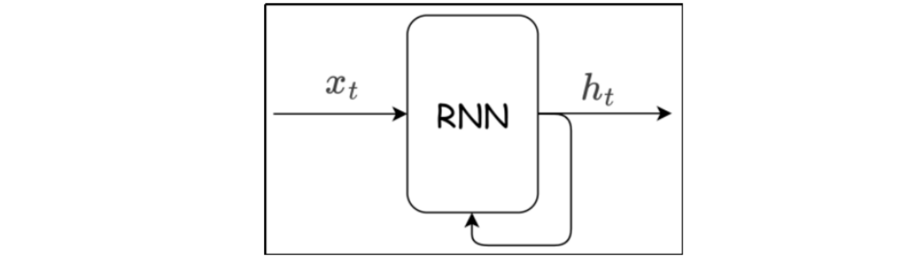
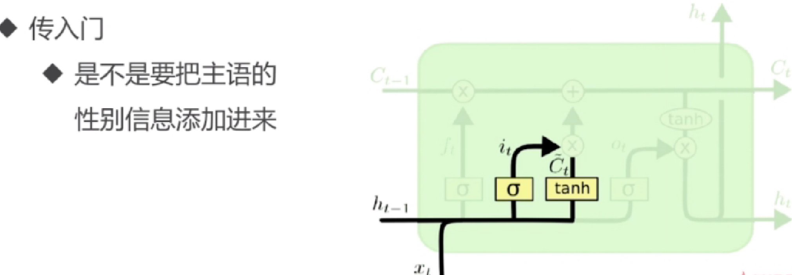
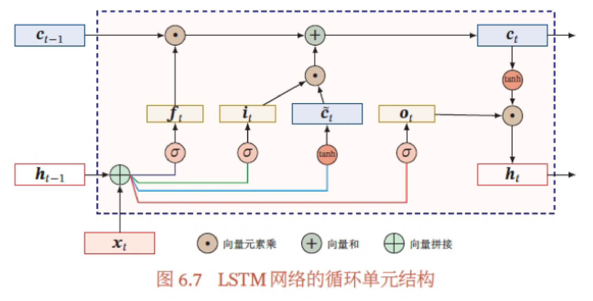

# Recurrent Neural Network RNN

A Recurrent Neural Network (RNN) is a neural network capable of processing sequential data and retaining historical information. At its core, a "recurrent structure" lets the network make use of the computation result from "the previous moment" while processing the current data (similar to how a person can remember what happened earlier)

Core characteristics:

- Sequentiality: the input data has a temporal order (such as time steps t1, t2, t3...)
- Memory: historical information is stored through the hidden state

- Recurrence: within the network structure there is a "feedback loop" (the previous moment's output influences the current moment's input)

## Why Do We Need Recurrent Neural Networks

> **Background: how does an ordinary network handle variable-length text? — "merging + padding"**
> An ordinary neural network (fully connected layer) requires the input to be a **fixed-length** vector, whereas the number of words in a sentence varies. To stuff it into the network, there are only two things you can do:
> - **Merging**: combine the embeddings of the many words in a whole sentence into a single fixed-length vector, most commonly by **taking the average**. The cost is that order is entirely lost — `"i love you"` and `"you love i"` average out to exactly the same vector, and the model cannot tell who loves whom. Moreover, averaging treats "everyone as equal", with no sense of priority, so key sentiment-bearing words (such as `terrible`) get diluted by ordinary words (such as `the` and `and`)
> - **padding**: sentences vary in length, but the tensor shape within a batch must be consistent, so short sentences must be padded with a special `<PAD>` symbol to equal length. The cost is a large number of "fake words" appearing out of nowhere, which the model must also process one by one — pure waste of compute
>
> In one sentence: **"merging + padding" = "kneading" all words into one fixed vector + "padding" sentences to equal length**. This was the clumsy way of feeding ordinary networks before RNNs appeared, with the problems listed below.

Disadvantages of merging + padding:

- Information loss
- Merging multiple embeddings (taking the average)
- Pad noise, no sense of priority (too much padding; and even without padding, some important sentiment-bearing words have no priority)
- Too much wasted computation, inefficient
- Too much padding carries no positional/order information

> **What does "noise" mean in "Pad noise, no sense of priority"?**
> Noise here does not refer to sound but to **meaningless interfering signals** — `<PAD>` is an artificially created "fake word" that carries no semantics, yet the model really does read it and it participates in computation:
> - **Average pooling**: short sentences have a lot of padding, and PAD vectors mixed into the average dilute and skew the semantics of the real words; the shorter the sentence, the more severely it is diluted
> - **RNN**: when it reads PAD it still updates the hidden state, which amounts to "writing" an invalid signal "into memory" and polluting the state (in the code, `padding_idx=0` merely makes the PAD vector constantly 0, so the noise is "fairly neutral", but it still participates in computation)
> - **Unequal**: each sample has a different amount of padding, hence a different noise concentration, so the features the model learns are unstable
> Precisely for this reason, the code uses `padding_first=True` for the RNN to place PAD at the start of the sentence — so that what the RNN reads at its final step is real text rather than a pile of PADs.


- Figure 1: Vanilla Neural Networks — one sample corresponds to one output (convolutional neural networks, fully connected neural networks)

- Figure 2: one-to-many: generating a description from an image

- Figure 3: many-to-one: text classification (text sentiment analysis)

- Figure 4: many-to-many: encoding-decoding, machine translation, where output can only begin after the last input has finished — non-real-time

- Figure 5: real-time many-to-many: video commentary

## How RNNs Work

The biggest difference between an RNN and a traditional neural network is: **at every time step, an RNN computes using both the previous time step's hidden state $h_{t-1}$ (the "memory") and the current input $x_t$**. It is as if the network carries the "memory" of all previous words while processing each word.

> **First, understand what a "time step" is**
> A time step is the **basic unit** by which an RNN processes a sequence — "processing one element of the sequence" is called one time step. The "time" here is not real clock time but an abstraction of **processing order**:
> - The sentence `"i love rnn"` is processed in order: reading `"i"` is step 1, reading `"love"` is step 2, reading `"rnn"` is step 3 — **each word is one time step**
> - For a piece of audio, each "frame" is a time step; for a stock price series, each day is a time step
> Each time step applies the formula once: **read the current word $x_t$ + combine it with the previous step's memory $h_{t-1}$ → compute the new memory $h_t$**. However long the sequence is, that is how many time steps there are, and that is how many times the RNN loops; **the total number of time steps = the sequence length seq_length** (the middle `seq` in the tensor shape `(batch, seq, input)`). The subscript $t$ only marks "which step", it is **not a weight subscript** — the weights $W_{xh}$ and $W_{hh}$ are shared and carry no $t$.

> **The most important concept: weight sharing**
> All time steps of an RNN use the **same set of weight matrices** $W_{xh}$ and $W_{hh}$; they do not change with the time step $t$. However long the sequence, there is only this one set of parameters — this is precisely what "recurrent" means. **So never write the weight subscript as $w_t$ (it does not vary with $t$).**

1. An RNN layer has a loop, and through this loop data can circulate within the layer

   Feed the sequential data $x_1,x_2,...,x_T$ into the network in order; each time step computes a hidden state $h_t$, and $h_t$ in turn becomes one of the inputs of the next time step:

   

2. If we take the time step as the unit, the unrolled form of an RNN is:

   

   Inside each small block after unrolling, the **same set of weights** is still used; only the input $x_t$ and the memory $h_{t-1}$ differ.

3. The two core formulas of forward propagation

   **① Hidden state update (the creation of "memory")**:
   $$
   h_t=\tanh(W_{xh}·x_t+b_{xh}+W_{hh}·h_{t-1}+b_{hh})
   $$

   - $x_t$: the input at the current time step (such as the embedding vector of the $t$-th word), with shape $(input\_size,)$
   - $W_{xh}$: the input weight matrix, with shape $(input\_size, hidden\_size)$, transforming the input into the "hidden space"
     > **A reminder about shape conventions**: here we use the "row vector" convention ($x_t$ is a row vector, multiplied on the left of the matrix), so $W_{xh}$ is $(input, hidden)$.
     > But PyTorch actually computes $h_t=\tanh(x_t W_{ih}^\top + b_{ih} + h_{t-1} W_{hh}^\top + b_{hh})$, and what is stored in `weight_ih_l0` and `weight_hh_l0` is **one extra transpose** relative to the formula (`weight_ih_l0` has shape $(hidden, input)$).
     > So in the code below both weights need `.T` to transpose them back, so that the row-vector convention `x @ W_xh + h @ W_hh` matches the hand computation term by term.
   - $b_{xh}$: the bias vector for the input
   - $h_{t-1}$: the hidden state ("memory") of the previous time step, with shape $(hidden\_size,)$; when $t=1$ the initial state $h_0$ is used (usually all zeros, but it can also be a learnable parameter)
   - $W_{hh}$: the hidden weight matrix, with shape $(hidden\_size, hidden\_size)$ — **the "memory" comes precisely from this term**
   - $b_{hh}$: the bias vector for the hidden state
   - The activation function used is $\tanh$: it squashes values into $(-1,1)$ to prevent them from growing without bound; it trains more stably than sigmoid (its mean is closer to 0) and its gradient vanishes more slowly

   > In PyTorch's `nn.RNN`, $b_{xh}$ and $b_{hh}$ correspond to `bias_ih_l0` and `bias_hh_l0` respectively (there really are two biases); they can also be merged into one: $h_t=\tanh(W_{ih}x_t+W_{hh}h_{t-1}+b_h)$, which is essentially the same.

   **② Output (chosen according to the task)**:
   - Output at every time step: $O_t = W_{hy}·h_t + b_y$, suitable for part-of-speech tagging and character-by-character generation
   - Output only the last one: use only $h_T$ (a "condensation" of the whole sentence's information), suitable for sentiment classification and text classification
   - PyTorch's `nn.RNN` returns the hidden states themselves directly ($O_t=h_t$) without adding an extra output layer

   > **Clarifying inputs and outputs (answering your question)**:
   > Each time step has **only one new input** $x_t$ ($h_{t-1}$ is the "memory" passed down from the previous step, not a new input).
   > **The hidden state $h_t$ and the output $O_t$ are not the same thing**: $h_t$ is responsible for "memory", $O_t$ is responsible for "outputting externally". The `output` returned by `nn.RNN` is the sequence composed of **the hidden states of all time steps**, whereas `hn` is only the hidden state of **the last time step**; the two carry different amounts of information and are not "exactly the same".

4. Walking through forward propagation with concrete numbers (by hand)

   ```
   设 input_size=3, hidden_size=2，输入一句话有两个词（两个时间步）：
     x_1 = [1, 0, 1],  x_2 = [0, 1, 0]，初始记忆 h_0 = [0, 0]

     W_xh = [[0.1, 0.2],          W_hh = [[0.5, 0.1],
             [0.3, 0.4],                  [0.2, 0.6]]
             [0.5, 0.6]]
     b_xh = [0.1, 0.1],  b_hh = [0.0, 0.0]

   时间步1：
     z_1 = W_xh·x_1 + b_xh + W_hh·h_0 + b_hh
         = [0.6, 0.8] + [0.1, 0.1] + [0, 0] + [0, 0] = [0.7, 0.9]
     h_1 = tanh([0.7, 0.9]) ≈ [0.604, 0.716]

   时间步2（同一套权重，输入换成 x_2，记忆换成 h_1）：
     W_hh·h_1 = [0.5×0.604+0.1×0.716, 0.2×0.604+0.6×0.716] = [0.374, 0.550]
     z_2 = W_xh·x_2 + b_xh + W_hh·h_1 + b_hh
         = [0.3, 0.4] + [0.1, 0.1] + [0.374, 0.550] = [0.774, 1.050]
     h_2 = tanh([0.774, 1.050]) ≈ [0.649, 0.782]
   ```

   $h_1$ and $h_2$ are the "memory" at each time step. $x_2$ is completely different from $x_1$, yet $h_2$ still carries traces of $x_1$ (because $h_1$ participated in the computation) — **this is why an RNN can "remember" history**.

5. Verifying the hand computation with code (compared against nn.RNN)

   ```python
   import torch
   import torch.nn as nn
   
   input_size, hidden_size = 3, 2
   rnn = nn.RNN(input_size, hidden_size, batch_first=True)
   
   # The parameters nn.RNN actually uses internally correspond exactly to the letters in the formula (this is the shared set of weights)
   # Note: PyTorch stores weights with "one extra transpose" relative to the formula — weight_ih_l0 has shape (hidden, input),
   # weight_hh_l0 has shape (hidden, hidden), so when reproducing the formula manually both need .T to transpose back (the row-vector convention x @ W.T,
   # so that it matches the hand computation term by term: the hand-computed W_hh·h_1 is in fact equal to h @ W_hh^T)
   W_xh = rnn.weight_ih_l0.T  # (input=3, hidden=2) → W_xh in the formula
   W_hh = rnn.weight_hh_l0.T  # (hidden=2, hidden=2) → W_hh in the formula
   b_xh = rnn.bias_ih_l0      # (2,)   → b_xh
   b_hh = rnn.bias_hh_l0      # (2,)   → b_hh
   
   x = torch.tensor([[[1., 0., 1.], [0., 1., 0.]]])   # (batch=1, seq=2, input=3)
   output, hn = rnn(x)        # output: (1, 2, 2), hn: (1, 1, 2)
   
   # Manually compute time step by time step according to the formula (the loop always uses the same W_xh, W_hh)
   h = torch.zeros(1, hidden_size)          # h_0 = [0, 0]
   for t in range(x.size(1)):
       h = torch.tanh(x[:, t, :] @ W_xh + b_xh + h @ W_hh + b_hh)
       print(f"Manually computed h_{t+1} =", h)
   
   print("nn.RNN's output =", output)        # Should equal the hand-computed h_1, h_2
   print("nn.RNN's hn =", hn)                # Should equal h_2, the last time step
   ```

> **Additional note: the cost of RNNs (why LSTM came later)**
   > At every time step an RNN's gradient must be multiplied by $\frac{\partial h_t}{\partial h_{t-1}}$ (related to $W_{hh}$ and the tanh derivative). Once the sequence grows long, the gradient shrinks exponentially (**vanishing gradient**) or grows exponentially (**exploding gradient**), so a plain RNN "cannot remember" history that is too far back. Solutions: switch to LSTM / GRU (using gating mechanisms to control writing to and forgetting from memory), shorten the sequence, or apply gradient clipping.

### Vocabulary

**Building a vocabulary = assigning a unique integer ID to every word that appears in the corpus**. Neural networks only understand numbers, not text, so every word must first be turned into an ID before text can be fed into the network.

**Why must the vocabulary be built before embedding?**
`nn.Embedding(vocab_size, embed_dim)` needs to know `vocab_size` at creation time — that is, "how many words are in the vocabulary". Because an embedding is just a `(vocab_size, embed_dim)` lookup matrix, **the bigger the vocabulary, the bigger the table**; without building the vocabulary first, you do not know how large the embedding table should be.

**Building a vocabulary does three things:**

1. **Count word frequencies**: after tokenizing the corpus, use `Counter` to count how many times each word occurs
2. **Limit the size**: a real corpus has hundreds of thousands of words, so keep only the top N most frequent (for example `max_vocab_size=20000` in the IMDB notes, keeping the top 19996), discarding the remaining low-frequency words and mapping them all to `<OOV>` (out-of-vocabulary)
3. **Assign IDs**: the dictionary `vocab = {word: integer}` — first reserve 4 special symbols `<PAD>=0, <OOV>=1, <BOS>=2, <EOS>=3`, then number high-frequency words starting from 4 in descending order of frequency; at the same time build the reverse dictionary `{ID: word}` so that numbers can be turned back into text during debugging

> **What are the 4 special symbols each for?**
> - **`<PAD>` (0), the padding symbol**: sentences vary in length, but a batch must be of equal length to be stacked into a tensor, so short sentences are padded with `<PAD>` up to the longest in the batch — these are exactly the "fake words" in the padding discussed earlier
> - **`<OOV>` (1), out-of-vocabulary**: **words not in the vocabulary**. The vocabulary size is limited — it only admits the top N most frequent words in the corpus, so low-frequency words, rare words/proper nouns, new words, and misspellings cannot get in, and are therefore all mapped to this ID as a fallback, guaranteeing that "unseen words" still have an ID and do not cause errors. In the code, `vocab.get(word, self.oov_id)` — if found it returns the word's ID, if not found it returns `<OOV>`'s ID. The cost is that all OOV words share the same vector, so the model cannot distinguish their individual real meanings (information loss)
> - **`<BOS>` (2), the beginning-of-sentence symbol**: marks the start of a sentence, added at the very front of the sequence (begin of sentence)
> - **`<EOS>` (3), the end-of-sentence symbol**: marks the end of a sentence, added at the very end (end of sentence). It is especially useful in generation/translation tasks — when the model reads it, it knows "the utterance is finished"
>
> Why they fixedly occupy 0~3: they are "meta information" and do not take part in the numbering of real words. Among them, `<PAD>=0` is also often used together with `padding_idx=0`, making PAD's embedding vector constantly 0 and excluded from learning (reducing the "Pad noise" mentioned earlier).

**Once the vocabulary is built, connecting it to the embedding:**

```
"i love rnn" → 分词 → ["i","love","rnn"] → 查词典 → [22,183,47] → nn.Embedding 查表 → 词向量序列
```

- Looking up the vocabulary (tokenize): each word is looked up in `vocab` to get an integer ID; words not in the vocabulary → `<OOV>`'s ID (1)
- The number of rows of `nn.Embedding` is exactly `vocab_size`, and the parameter count = `vocab_size × embed_dim` (in the IMDB notes, 20000 × 128 ≈ 2.56 million, accounting for the bulk of the model's parameters)

> In one sentence: **first build the vocabulary to determine `vocab_size`, only then can you build an embedding table of the corresponding size**; after that, "word → ID (vocabulary lookup), ID → vector (embedding lookup)" turns text into a vector sequence that an RNN can consume.

### Tokenizer

**A Tokenizer is the "translator" between text and ID sequences** — it takes the already-built vocabulary as its "dictionary" and is responsible for translating raw text into the numeric sequences the model can consume (**encode**), and also translating numeric sequences back into text (**decode**).

> The division of labor between the vocabulary and the Tokenizer:
> **The vocabulary (vocab) = a static "dictionary"**, responsible only for the `{word: ID}` mapping;
> **The Tokenizer = a dynamic "translation tool"**, using that dictionary to translate any sentence back and forth; truncation and padding are also its job.

**encode (text → a padded ID sequence)** does 5 things:

```
"i love rnn"  --分词-->  ["i","love","rnn"]  --查词典-->  [22,183,47]
               +加<BOS>/<EOS>：[2,22,183,47,3]
               +超过 max_length 截断
               +不足补 <PAD>：[0,0,0,2,22,183,47,3]  （padding_first=True 时 PAD 在前）
```

1. **Tokenize**: `text.split()` cuts the sentence into words on whitespace
2. **Look up the vocabulary**: each word is looked up in `vocab` and becomes an integer ID (words outside the vocabulary → `<OOV>`'s ID)
3. **Add special symbols**: optionally prepend `<BOS>` and append `<EOS>`
4. **Truncate**: anything exceeding `max_length` (such as 500) is cut off
5. **padding**: pad all sentences in the batch to the same length, forming a regular tensor `(batch, seq_len)`

**decode (ID sequence → text)**: reverses `[2,22,183,47,3,0,0]` back into text (optionally skipping special symbols), used for debugging and verifying that the encoding is correct.

**Why do we need it?** The model only consumes numeric tensors of a fixed shape, whereas raw text is sentences of varying length. The Tokenizer is that intermediate conversion layer: it turns "sentences of varying length" into "an equal-length, numericized matrix marked with special symbols".

### embedding

**embedding = mapping "a word's integer index" into "a dense vector carrying semantics"**, and it is the first processing step for text entering a neural network.

**① Why can't we just use one-hot?**

Words must first be turned into numbers to be fed to the network. The most naive idea is one-hot encoding:

```
词表 = ["我", "爱", "学习", "RNN"]   （词表大小 vocab_size = 4）
"我"   → [1, 0, 0, 0]
"爱"   → [0, 1, 0, 0]
"学习" → [0, 0, 1, 0]
"RNN"  → [0, 0, 0, 1]
```

Problems with one-hot:
1. **Dimensionality explosion**: a real vocabulary has 100,000+ words, so each word is a 100,000-dimensional vector that is almost entirely zeros — extremely sparse and memory-hungry
2. **No semantics**: any two one-hot vectors are "orthogonal", so the model cannot learn similarity relations such as "cat ≈ dog" or "like ≈ love"

**② An embedding is just a "learnable lookup matrix"**

An embedding maps each word into a **dense low-dimensional vector** (such as 100/300 dimensions), where semantically similar words are also closer in vector space. This "word → vector" mapping is stored in one big matrix:

- Shape: `(vocab_size, embedding_dim)` — row $i$ is the vector of the $i$-th word in the vocabulary
- How it is used: given a word's index $idx$, simply take out row $idx$ — essentially a single **lookup**

In PyTorch, use `nn.Embedding`:

```python
import torch
import torch.nn as nn

embedding = nn.Embedding(num_embeddings=10, embedding_dim=4)  # A vocabulary of 10 words, each mapped to a 4-dimensional vector

one_word = torch.tensor([3])           # The index of one word
print(embedding(one_word).shape)       # (1, 4)

sentence = torch.tensor([2, 5, 1])     # The index sequence of a sentence (sequence length = 3)
print(embedding(sentence).shape)       # (3, 4)
```

This matrix is initially **random**, and is then **trained together with the current task** (backpropagation continually updates the weights). Once training finishes, each row "encodes" that word's semantics for the task. This is called a **learnable embedding**.

> **The relationship with Word2Vec:**
> - **nn.Embedding**: randomly initialized and trained along with the current task (end-to-end learning)
> - **Word2Vec / GloVe**: word vectors **pretrained** on a large-scale corpus, which can be used as the initial values of an embedding (frozen or fine-tuned), with the benefit that they already contain general semantics
> - In one sentence: **Word2Vec is a training algorithm that "produces word vectors", an embedding is the "vector representation of words" itself, and PyTorch's `nn.Embedding` is a trainable lookup layer** — the two are not the same thing, but they can be used together

**③ The position of embedding within an RNN (data flow)**

```
"i love rnn"
   │ 分词（tokenize）
["i", "love", "rnn"]
   │ 查词表 → 每个词变成整数索引
[22, 183, 47]
   │ nn.Embedding 查表
[[0.12, 0.88, ...],      ← 第0个时间步的输入 x_1（"i"的向量）
 [0.34, 0.12, ...],      ← x_2（"love"的向量）
 [0.90, 0.45, ...]]      ← x_3（"rnn"的向量）
   │ 送入 RNN，按时间步依次输入
  h_1 → h_2 → h_3
```

> One-line summary: **an embedding turns "a word's index" into "a dense vector carrying semantics", and what the RNN consumes is exactly this sequence of dense vectors**; from the RNN's point of view, `input_size` equals `embedding_dim`.

### Binary Cross-Entropy Loss (Negative Log-Likelihood Loss)

$$
cost(h_\theta,y)=\sum_{i=1}^{m}-\left[y_i\log(h_\theta(x_i))+(1-y_i)\log(1-h_\theta(x_i))\right]
$$

#### How BCE works (in detail)

BCE measures the gap between "the probability $p$ predicted by the model" and "the true label $y \in \{0,1\}$":

$$
BCE(y,p) = -\big[y\log p + (1-y)\log(1-p)\big]
$$

**① It is an "automatic switch"**: because $y$ can only be 0 or 1, only one term in the formula is ever "alive" —

- When $y=1$: the first term survives → $BCE=-\log p$ (the $(1-y)=0$ cancels the second term)
- When $y=0$: the second term survives → $BCE=-\log(1-p)$

The meaning is "**$-\log$(the probability the model assigns to the true label)**": the higher the probability assigned to the correct outcome, the smaller the loss.

| True $y$ | Predicted $p$ | Loss | Interpretation |
|---|---|---|---|
| 1 | 0.9 | 0.11 | High confidence and correct → penalty extremely small |
| 1 | 0.5 | 0.69 | Completely unsure (like flipping a coin) |
| 1 | 0.1 | 2.30 | Low confidence and wrong → large penalty |
| 0 | 0.1 | 0.11 | High confidence and correct |
| 0 | 0.9 | 2.30 | High confidence and wrong → largest penalty |

> Key intuition: **"being very confident but wrong" is punished far more harshly than "being unsure and therefore wrong"**. What a classification task fears most is not a wrong prediction but a **confident** wrong prediction.

**② Why use log?**

1. **Multiplying probabilities → adding losses**: the correctness of a batch of samples is $\prod p_i$, which shrinks with every multiplication and easily underflows; taking $-\log$ turns it into $\sum -\log p_i$, converting multiplication into addition
2. **Equivalent to maximum likelihood estimation (MLE)**: the model predicts $P(y=1|x)=p$, so the probability that "the label is exactly $y$" is $p^y(1-p)^{1-y}$. Maximizing $\prod_i p_i^{y_i}(1-p_i)^{1-y_i}$ over the whole dataset, then taking $-\log$ and summing, **gives exactly the summation formula at the top**. So "binary cross-entropy" = "negative log-likelihood (NLL) under a Bernoulli distribution" — this is where the name "negative log-likelihood loss" in the parentheses of this section's title comes from
3. **Information theory**: the number of bits needed to encode the true distribution $[y,1-y]$ using the predicted distribution $[p,1-p]$, which when expanded is exactly BCE. The more accurate the prediction, the more economical the encoding

**③ Why not use MSE for classification?**

1. **Vanishing gradient**: the tail of classification is a sigmoid, which saturates when the logit is very large/very small (derivative → 0); MSE's gradient with respect to $z$ carries the sigmoid derivative, so the more outrageously wrong it is, the closer the gradient gets to 0 and the model barely moves. BCE does not have this problem
2. **Asymmetric penalty**: "right vs. wrong" in classification is a qualitative 0/1 change, not a continuous quantitative one; BCE heavily penalizes "high-confidence errors"
3. **Clean gradient**: letting $p=\sigma(z)$, one can derive

$$
\frac{\partial BCE}{\partial z} = p - y
$$

**The gradient = the predicted probability minus the true label**: $p=0.9$ but $y=0$ → gradient $+0.9$, a forceful correction; $p=0.9$ and $y=1$ → gradient $-0.1$, nearly right so just a gentle nudge. This property makes training very efficient.

**④ Engineering implementation: use `BCEWithLogitsLoss` (numerically stable)**

The naive approach of "sigmoid first, then log" produces $\log(0)=-\infty$ when $p\to0$ or $p\to1$, and training goes straight to NaN:

```python
import torch
import torch.nn.functional as F

z = torch.tensor([[-5.0, 3.0]])        # logits, any real numbers
y = torch.tensor([1.0, 1.0])

p = torch.sigmoid(z)                                          # (0,1)
loss = -(y * torch.log(p) + (1 - y) * torch.log(1 - p))       # Dangerous! p→0/1 will overflow
```

The correct approach: fuse sigmoid and BCE into a single expression and compute directly in logit space (without going through intermediate probabilities), which is **mathematically completely equivalent but does not overflow**:

```python
loss = F.binary_cross_entropy_with_logits(z, y)   # Equivalent to nn.BCEWithLogitsLoss()
```

The `nn.BCEWithLogitsLoss()` used in the IMDB example is exactly this.

> **The relationship with the softmax approach**: the cross-entropy of a two-class softmax (2 classes) is just another way of writing BCE. Because $p_1+p_2=1$, letting $p=p_1$ gives $1-p=p_2$, and the two formulas are equal term by term. So the "recommended single-neuron approach" at the end of these notes has a mathematical basis — it merely saves parameters, it is not a different algorithm.

Binary classification with a single neuron via BCE:

- The output layer has only one neuron, using the sigmoid activation function to squash the output into 0-1, representing the probability of the positive class

- The loss function uses binary cross-entropy (BCE):
  $$
  loss=-[y·log(p)+(1-y)·log(1-p)]
  $$
  

 	where $y$ is the true label (0 or 1) and $p$ is the sigmoid output

- This approach suits binary classification problems, where labels are usually 0 and 1

- At prediction time, 0.5 is commonly used as the threshold: greater than 0.5 is judged the positive class, otherwise the negative class

  ```
  输入→ 隐藏层 ... →输出层(sigmoid, 1个神经元)→ BCE损失函数
  ```

Binary classification with two neurons via Softmax:

- The output layer has two neurons, representing the scores of "class 0" and "class 1" respectively, and the softmax activation function converts them into the probabilities of the two classes, which sum to 1

- The loss function uses cross-entropy:
  $$
  loss=-\sum_{i=1}^{2}y_i·log(p_i)
  $$
  where $y_i$ is the one-hot label ([1,0] or [0,1]) and $p_i$ is the softmax output

- Applicable to multi-class classification, and can also be used for binary classification

- At prediction time, the class with the highest probability is chosen as the predicted class

  ```
  输入→ 隐藏层 ... →输出层(softmax, 2个神经元)→ 交叉熵损失函数
  ```

Summary of the differences:

- A single neuron + sigmoid + BCE is more efficient and is commonly used for binary classification, with labels being 0/1
- Two neurons + softmax + cross-entropy suits multi-class classification, and can also be used for binary classification but with more parameters, with one-hot labels
- The practical results are similar, but the former is more concise; **when the classes are completely mutually exclusive and there are only two, the single-neuron approach is recommended**

### Single-Layer Unidirectional, Single-Layer Bidirectional, Two-Layer Unidirectional

**Single-layer unidirectional (`num_layers=1, bidirectional=False`) — the most naive/default configuration**

- **Structure**: only one RNN layer; the input goes straight into this layer, and each time step computes one hidden state:

  ```
  x_1 → [RNN层] → h_1
  x_2 → [RNN层] → h_2
  x_3 → [RNN层] → h_3
  ```

- **Direction**: it reads only once from left to right, so the memory $h_t$ at each position contains only "past + present" context (it cannot see the future)
- **Weight sharing**: all time steps share the same set of weights (`weight_ih_l0`/`weight_hh_l0`), which is precisely what "recurrent" means
- **Taking the last step**: `hn` has shape `(num_layers, batch, hidden)` = `(1, batch, hidden)`, and `hn[-1]` is the hidden state of the last step; here `output[:, -1, :] == hn[0]`
- This corresponds to `rnn_model` in the model-two code of these notes (`rnn_layers=1, bidirectional=False`, the default configuration), and is also the model actually used for training

**Single-layer bidirectional (`num_layers=1, bidirectional=True`) — reading the sequence in both directions**

- **Structure**: **two RNNs** run within the same layer — one reads from left to right (forward) and one from right to left (backward), and at each position the hidden states of the two directions are **concatenated**:

  ```
         x_1 →  x_2 →  x_3      （正向 RNN）
         x_1 ←  x_2 ←  x_3      （反向 RNN）
  h_t = [h_t^→ ; h_t^←]         （拼接，维度翻倍）
  ```

- **Why it is useful**: for a negated phrase like `"not good"`, the meaning of `not` can only be known thanks to the following `good`; when reading unidirectionally and reaching `not`, `good` has not been seen yet and the information is incomplete, whereas the backward branch can "see" the future in advance. So each position has both "past + future" context
- **The cost**: the output dimension doubles (`fc` input = `hidden × 2`) and the parameter count roughly doubles as well — corresponding to `self.num_directions = 2 if bidirectional else 1` and `self.fc = nn.Linear(rnn_hidden * self.num_directions, num_class)` in the code
- **Taking the last step**: `hn` has shape `(num_layers × num_directions, batch, hidden)` = `(2, batch, hidden)`, where `hn[-2]` is the forward last step and `hn[-1]` is the backward last step; in the code `last_hidden = torch.cat([hn[-2], hn[-1]], dim=1)` concatenates the two directions
- This corresponds to `bi_model` in the model-two code of these notes (`rnn_layers=1, bidirectional=True`, for demonstration only)

**Two-layer unidirectional (`num_layers=2, bidirectional=False`) — deepening vertically**

- **Structure**: two RNN layers stacked vertically, where **the output of layer 1 at each time step serves as the input of layer 2 at the corresponding time step**:

  ```
  x_1 → [层1] → h₁⁽¹⁾ → [层2] → h₁⁽²⁾
  x_2 → [层1] → h₂⁽¹⁾ → [层2] → h₂⁽²⁾
  x_3 → [层1] → h₃⁽¹⁾ → [层2] → h₃⁽²⁾
  ```

- **Each layer has its own set of weights**: weight sharing means sharing "**within the same layer**, across time steps" (all time steps share one set), but **different layers have different weights** — layer 1 uses `weight_ih_l0`/`weight_hh_l0`, layer 2 uses `weight_ih_l1`/`weight_hh_l1`. So **doubling the number of layers → roughly doubling the RNN's parameter count** (and the computational cost doubles along with it)
- **Deepening vertically vs. unrolling horizontally**: the number of layers governs "how deep the stack is" (model depth), while time steps govern "how long the unrolling is" (sequence length); the two are orthogonal. `num_layers=2` merely changes the depth from 1 to 2, and each time step is still unrolled as usual
- **Why use multiple layers**: lower layers learn local, shallow features while higher layers learn more abstract, global features (similar to how a CNN first learns edges and then contours). But for a simple task like movie review sentiment, a single layer is often enough, and multiple layers overfit more easily and train more slowly
- **Taking the last step**: `hn` has shape `(num_layers, batch, hidden)` = `(2, batch, hidden)`, and `hn[-1]` is the hidden state of the last step of **the last layer (layer 2)** — in the model-two code `last_hidden = hn[-1]`, so with two layers this retrieves the result of layer 2
- This corresponds to `two_layer_model` in the model-two code of these notes (`rnn_layers=2, bidirectional=False`), whose output is still `(batch, 1)`

### Analysis of the RNN Interface

```python
# 0. Import packages
import torch
import torch.nn as nn

# 1. Create the RNN model
# Parameter descriptions:
# input_size: the dimensionality of the input data, which can also be understood as the number of input features
# hidden_size: the dimensionality of the hidden layer, which can also be understood as the number of hidden state features
# num_layers: the number of hidden layers; if multiple layers are set, the output of the previous hidden layer serves as the input of the next hidden layer. Generally 1 is enough, and the default is also 1
# batch_first: if True, the shape of the input and output tensors is (batch_size, seq_length, input_size)
rnn_model = nn.RNN(input_size=10, hidden_size=20, num_layers=1, batch_first=True)

# 2. Invoke the model
# Input data
input_data = torch.randn(3, 5, 10)  # input:	[batch_size, seq_length, input_size]
hx = torch.randn(1, 3, 20)  # hx:	[num_layers, batch_size, hidden_size]

# Output data
output, hn = rnn_model(input_data, hx)  # output:	[batch_size, seq_length, hidden_size]
print(output.shape)  # hn:	[num_layers, batch_size, hidden_size]
print(hn.shape)
```

The data parameters:

- `input: [seq_length, batch_size, input_size (the dimensionality of the input data)] `
- `hx: [num_layers, batch_size, hidden_size] `
- `output: [seq_length, batch_size, hidden_size] `
- `hn: [num_layers, batch_size, hidden_size]`

Parameter explanations:

- The sequence length refers to the "total number of time steps" of a single sample. If the input is a sentence, then the sequence length is the number of tokens after the sentence has been tokenized; if the input is a piece of audio, then the sequence length is the "number of frames" in that audio
- batch_size is simply the batch size, i.e. how many samples are processed at once
- input_size refers to how many dimensions the vector representing a single input item $x_n$ has
- num_layers is generally one layer, but can also be set to multiple layers

> **Two conventions that are easily confused (batch_first):**
> - The code above set `batch_first=True`, so the input shape is `(batch, seq, input)`;
> - If it is not set (the default `batch_first=False`), the input is `(seq, batch, input)` — **the positions of batch and seq are swapped**. In practice it is generally set explicitly to `True`.
> - `output` is the sequence of hidden states at **every time step**; `hn` is the hidden state at **the last time step**. So when `num_layers=1`, `output[:, -1, :] == hn[0]`, and the two differ only in "which time step is taken".

## Text Generation

### Three Approaches to Tokenization

Tokenization cuts text into individual tokens, and it is an unavoidable step before text enters a model. Ordered by **granularity** from coarse to fine, there are three main approaches: word-level, character-level, and subword-level.

**① word-level — the vocabulary is too large**

- Split by "word": one word = one token
- Advantage: one token is a complete semantic unit, which is intuitively clear
- Disadvantages:
  - **The vocabulary is too large**: real languages have hundreds of thousands of words (English derivations, inflections, proper nouns), so the embedding table becomes enormous (`vocab_size × embed_dim`) and memory and parameter counts explode
  - **The OOV problem**: new words, misspellings, and internet neologisms (such as `coronavirus`) are not in the vocabulary → they can only be mapped to `<OOV>`, and the information is lost outright
  - **Cannot learn morphological variation**: `run / runs / running` are three independent tokens that cannot share the root run

**② char-level — the vocabulary is too small**

- Split by "character": one letter = one token (English), one Chinese character = one token (Chinese)
- Advantages:
  - **The vocabulary is extremely small**: English has only a few dozen symbols, there is almost no OOV, and any word can be spelled out
- Disadvantages:
  - **The vocabulary is too small → each token carries too little semantic information**: `running` is split into 7 characters, so the model must assemble word meaning from letters layer by layer, the sequence length skyrockets (a sentence becomes dozens of characters), and training is slow and hard to learn
  - Long-range dependencies are harder to model: information is scattered across a long string of characters, so the RNN/attention has to "look" very far

**③ subword-level — the balanced approach, with BPE as the representative**

- Split by "subword": **high-frequency words are kept whole, low-frequency words are split into roots/affixes**:
  - `"running"` → `["run", "ning"]`, `"unhappiness"` → `["un", "happiness"]`
- **Where BPE (Byte Pair Encoding) comes from** ("byte pair" is a historical name — originally it was a data compression algorithm operating on bytes, and subword-nmt applies it at the **character/subword** level):
  
  1. Initialize: split every word in the corpus into individual characters
  2. Count: count how many times each pair of adjacent characters occurs
  3. Merge: merge the most frequent pair of characters into a new "subword" and add it to the vocabulary
  4. Repeat steps 2 and 3 until the vocabulary reaches the target size (such as 32000)
  - The end result: high-frequency words are kept whole (because they have been merged repeatedly), while low-frequency/unseen words can still be split into existing subwords
- Advantages:
  - **A moderate vocabulary size** (tens of thousands suffices), and **no OOV** — an unseen word can always be split into a combination of existing subwords
  - **A moderate sequence length**: much shorter than char-level, slightly longer than word-level, which is acceptable
  - **Learns morphological variation**: `run / run+s / run+ning` share the subword `run`, so roots and affixes are learned jointly
- Current status: **mainstream large models such as GPT, BERT, and LLaMA all default to subword tokenization of the BPE / WordPiece / Unigram family**, making it the de facto standard in NLP

> A one-line comparison: **word-level has complete word meanings but an exploding vocabulary; char-level has a tiny vocabulary but overly long sequences and overly fragmented information; subword-level (BPE) strikes a balance in between — a modest vocabulary, no OOV, and it can still learn roots**, which is why it became mainstream.

#### The BPE Tokenization Algorithm

Using the subword-nmt library

```bash
# Training stage ①: learn the merge rules (-s 8000 = perform 8000 merges, determining the subword vocabulary size)
subword-nmt learn-bpe -s 8000 -i ./imdb_train.txt -o ./imdb_bpe_code
# Training stage ②: use the rules to split the training set into subwords, producing ./imdb_train_bpe.txt
subword-nmt apply-bpe -c ./imdb_bpe_code -i ./imdb_train.txt -o ./imdb_train_bpe.txt
# Training stage ③: count subword frequencies to obtain the vocabulary
subword-nmt get-vocab -i ./imdb_train_bpe.txt -o ./imdb_bpe_vocab
```

> Note:
> - `learn-joint-bpe-and-vocab` is designed for **jointly learning over two corpora** (the source/target languages of machine translation, where `--write-vocabulary` also requires two vocabulary filenames); for a single corpus the `learn-bpe` + `get-vocab` above suffices, so do not mix them up
> - ① and ② are the "learning" stage — what they produce are a **rules file** and a **vocabulary file**; what actually encodes text into subwords is the subsequent `apply-bpe`. The purpose of the whole pipeline: replace whole words with subwords to better prevent OOV and reduce the vocabulary size

The imdb_bpe_code file is the **BPE (byte pair encoding) rules file**, and is also the core product of the BPE algorithm:

- **Contents**: it records all merge operations in **the order they were learned**, with each line being a pair of "merged subwords" (for example `s </w>` means merging `s` and the word-end marker `</w>` into `s</w>`); the order of the lines is the order in which the rules are applied during the apply stage
- **How it is used**: `apply-bpe` treats it as an "operation manual" — it merges the words in new text one rule at a time in the same order, producing the subword segmentation

The imdb_bpe_vocab file is the **vocabulary file produced after BPE training**:

- **Contents**: obtained by counting over the training text after it was split by `apply-bpe` — all subwords and their occurrence frequencies (each line being "subword frequency"), which can be used to filter out low-frequency subwords / control the vocabulary size

```bash
subword-nmt apply-bpe -c ./imdb_bpe_code -i ./imdb_train.txt -o ./imdb_train_bpe.txt
subword-nmt apply-bpe -c ./imdb_bpe_code -i ./imdb_test.txt -o ./imdb_test_bpe.txt
```

- `-c`: specifies the BPE encoding configuration file (the `imdb_bpe_code` learned above)
- `-i`: the input file (such as the imdb training/test set)
- `-o`: the output file (the subword sequences after BPE splitting)

The concrete implementation of the BPE algorithm

1. Prepare a sufficiently large training corpus

2. Determine the desired subword vocabulary size (a hyperparameter)

3. Split words into character sequences and **append the boundary marker `</w>` at the end of each word**, then count word frequencies. The subword granularity at this stage is the character. For example, if "low" has a frequency of 5, it is rewritten as `l o w </w>`: 5

4. Count the frequency of every consecutive "byte pair" and merge the most frequent one into a new subword (here these are in fact **character pairs**; "byte" is a historical leftover name)

5. Repeat step 4 until the subword vocabulary size set in step 2 is reached, or until the frequency of the next most frequent byte pair drops to 1 (further merging brings no information gain, which is commonly used as the stopping condition). After each merge, the vocabulary size can change in 3 ways:
   - **+1**: the new merged subword is added while both original subwords are retained (the two do not always occur together and will still occur individually)
   - **+0**: the new subword is added and one of the two original subwords is "absorbed" (one always occurs immediately after the other)
   - **-1**: the new subword is added and both original subwords are "absorbed" (the two always occur as a pair)

6. Therefore, as the number of merges increases, the vocabulary size usually **first grows and then shrinks**: early merges are mostly net additions (the vocabulary grows), while later on, once all the high-frequency pairs have been merged, merging starts "absorbing" old symbols (the vocabulary shrinks)

#### A hand-computed example: seeing exactly how BPE "merges"

Let us run the complete process on a tiny corpus (2 words + word frequencies), assuming the number of merges `-s` is set to 6:

| Word | Frequency | Initial split (with `</w>` appended to mark the word boundary) |
|---|---|---|
| low | 10 | `l o w </w>` |
| lowest | 2 | `l o w e s t </w>` |

Step 0: split each word into characters + the word-end `</w>`. Then **round by round**, count the frequencies of adjacent character pairs and merge the most frequent pair (breaking ties from left to right):

| Round | Most frequent pair this round | Frequency | Merge result |
|---|---|---|---|
| 1 | l + o | 10+2=12 | `lo` |
| 2 | lo + w | 10+2=12 | `low` |
| 3 | low + `</w>` | 10 | `low</w>` |
| 4 | e + s | 2 | `es` |
| 5 | es + t | 2 | `est` |
| 6 | est + `</w>` | 2 | `est</w>` |

Once you understand this table, the essence of BPE becomes clear:

- **High-frequency words get "merged into whole words"**: `l o` and `lo w` have frequencies as high as 12, far greater than the 2 of the other character pairs inside `lowest`, so `low` is merged into a complete unit first and `low</w>` directly becomes a subword — this is the principle behind "high-frequency words are kept whole": **it is not deliberate retention, but that its internal character pairs got merged first**
- **Low-frequency words are split finely**: the character pairs of `lowest` have a frequency of only 2, so they queue up and get merged slowly, ending up as the two subwords `low + est` — low-frequency words do not get "whole-word treatment" and can only be split into combinations of existing subwords
- **`-s` is doing its job**: without an upper limit, round 7 would have merged `low + est</w>` further into `lowest</w>` (a whole word); `-s 6` stops at two subwords. So **the larger `-s` is, the closer subwords are to whole words, and the smaller it is, the more finely things are split** — it is precisely the hyperparameter that balances "vocabulary size vs. sequence length"
- Toward the end of merging, the frequencies of the remaining character pairs are mostly 1 (such as lone pairs occurring only once), so merging further is meaningless — corresponding to the stopping condition "stop once the most frequent pair drops to 1"

#### The application stage: splitting new words into subwords (what apply does)

Once the codes have been trained, splitting a new word does just one thing: **start from characters and try the merges one by one in the order given in codes, merging whenever possible**. Let us try the 6 rules learned above on a few "words that never appeared in training":

| New word | Character sequence (with `</w>`) | The process of applying the rules | Split result | apply-bpe output |
|---|---|---|---|---|
| lower | `l o w e r </w>` | ① l o→lo ② lo w→low, after which "low e" and "e r" were never learned, so it stops | low + e + r | `low@@ e@@ r` |
| widest | `w i d e s t </w>` | ① e s→es ② es t→est, the others are not applicable | w + i + d + est | `w@@ i@@ d@@ est` |
| quantum | `q u a n t u m </w>` | not a single rule applies | split into 7 characters | `q@@ u@@ a@@ n@@ t@@ u@@ m` |

- `@@` marks "this word is not finished yet; more parts of the same word follow"; **the last subword does not carry `@@`**. When decoding, deleting all `@@ ` (including the following space) and any `@@` at the end of a line restores the original text
- **The key point**: no matter how rare the word is or whether it was seen during training, as long as its characters are in the initial vocabulary it can definitely be split — **the subword level inherently has no OOV**, which is the core reason it replaces word-level tokenization

#### Do not confuse them: `@@`, `##`, `▁` — three subword markers

Different tokenizers use different markers for "subword boundaries", and these are the easiest to mix up when reading papers/code:

| Tokenizer | Marking convention | Representative models | Criterion for choosing pairs |
|---|---|---|---|
| BPE (subword-nmt) | word-internal subwords carry the `@@` suffix, e.g. `low@@ est` | GPT-1, early NMT | greedy, merging by highest **adjacent-pair frequency** |
| WordPiece | continuation subwords carry the `##` prefix, e.g. `un ##happy` | BERT, DistilBERT | chooses pairs by **likelihood improvement after merging** (not pure frequency) |
| Unigram (SentencePiece) | word-initial subwords carry the `▁` prefix, e.g. `▁I ▁love` | T5, ALBERT | a probabilistic model that produces multiple candidate segmentations at once and then picks the best |
| Byte-level BPE | operates directly on **bytes**, with none of these markers | GPT-2/3, RoBERTa | it is just BPE, but applied to the 256 byte symbols |

> In one sentence: `@@` belongs to subword-nmt, `##` to BERT (WordPiece), and `▁` to SentencePiece. The `s ##s` written in the codes file earlier in these notes mixes in WordPiece's notation — a subword-nmt codes file should contain merge pairs (such as `s </w>`), while the apply output contains forms like `low@@ est` carrying `@@`.

#### The limitations of BPE & mainstream variants

- **Greedy, frequency-only**: each step picks only the "most frequent" character pair, but "frequently occurring together" ≠ "most semantically valuable when merged" — `t h` may be extremely frequent (the/that/this), yet merging it into `th` is not necessarily a good subword. WordPiece's switch to selecting pairs by likelihood improvement targets exactly this
- **The segmentation is not optimal**: the same word often has multiple valid segmentations, and BPE gives a greedy solution; Unigram scores all segmentations probabilistically and picks the one with the highest total probability
- **Unfriendly to Chinese**: subword-nmt requires the corpus to be pre-split into "words" by spaces before learning (English satisfies this naturally); Chinese has no spaces, so you must either tokenize separately first or switch directly to **SentencePiece** — it treats spaces as ordinary characters too and can learn unsupervised directly on raw Chinese
- **Rare characters may still be OOV**: character-level BPE has no answer for characters it has never seen; **Byte-level BPE** operates directly on bytes, so the 256 byte symbols cover everything and any Unicode (including emoji) can be spelled out — the mainstream approach since GPT-2

> In one sentence: **BPE is the pioneering "greedy merge by frequency" approach, and WordPiece / Unigram / byte-level BPE each patch a different one of its shortcomings**; when you cannot remember the details, first remember not to mix up the three markers (`@@` / `##` / `▁`).

### Temperature

**Temperature (T) is the parameter that controls the "randomness/creativity" of a large model's output** — the smaller T is, the more deterministic and conservative the output; the larger T is, the more random and imaginative the output.

**It acts before the softmax: the model's final layer first computes the logits, the score of each word, and these are divided by T before entering the softmax to become probabilities:**

$$
P(词_i)=\frac{\exp(z_i\,/\,T)}{\sum_j \exp(z_j\,/\,T)}
$$

- **`T = 1`**: the original distribution, output as-is
- **`T < 1`** (such as 0.7, 0.1): the distribution is "sharpened", giving high-scoring words an even bigger edge → the output is **more deterministic and steadier**
- **`T > 1`** (such as 1.2, 1.5): the distribution is "flattened", so low-scoring words also get a chance → the output is **more diverse and more surprising**

**A numerical example (more intuitive)**, assuming the scores of the last few words are `z = [2.0, 1.0, 0.5]`:

| Temperature | softmax probabilities | Effect |
|---|---|---|
| **T = 0.5** | [0.84, 0.11, 0.04] | almost always picks the first word (deterministic) |
| **T = 1** | [0.63, 0.23, 0.14] | the original distribution |
| **T = 2** | [0.48, 0.29, 0.23] | the three words are nearly equal (random) |

Limiting cases:

- **T → 0**: only the highest probability remains → equivalent to **greedy (argmax)**, always picking the most probable word, giving stable but very "rigid" output
- **T → ∞**: all words have equal probability → completely **random gibberish**

**Why is it called "temperature"?** It borrows a thermodynamic concept: **the higher the temperature, the more random molecular motion becomes**. The model is the same — the higher the temperature, the more vigorous the "thermal motion" of tokens; at low temperature the "molecules" stay obediently at the lowest energy state and the output plays strictly by the rules.

**How it is used in practice:**

| Task | Temperature | Reason |
|---|---|---|
| Code, mathematics, translation (accuracy required) | low (0~0.7) | the answer is unique, no divergence needed |
| Writing stories, poetry, brainstorming (creativity required) | high (0.8~1.5) | diversity and surprise are needed |
| Chat assistant (balanced) | medium (0.7~1.0) | fluent yet not prone to nonsense |

> In one sentence: **temperature = the knob controlling how much a large model "dares to take risks"**; turn it down for steady, turn it up for wild.

## Long Short-Term Memory Network LSTM

> **First, a recap of the pain point**: as stated in "the cost of RNNs" above — a plain RNN's gradient is multiplied along the time steps, so once the sequence grows long the **gradient vanishes** and it "cannot remember" information that is too far back.
> The solution of LSTM (Long Short-Term Memory) is: **add a "memory conveyor belt" (the cell state $C_t$) to the RNN**, letting historical information flow along the belt with almost no decay, and then use **gates** to control "what to forget, what to remember, and what to output".

### LSTM Has One More "Cell State" Than an RNN

A plain RNN has only one hidden state $h_t$ (which is both memory and output). LSTM splits "memory" and "output" into **two states**:

- $C_t$: the **cell state** — "long-term memory", a conveyor belt hidden inside, almost never exposed externally
- $h_t$: the **hidden state** — the "external output", selecting part of $C_t$ to "speak out loud" (for use by the next time step / next layer)

> An everyday analogy: $C_t$ is a **diary** that can record anything and keeps it forever; $h_t$ is **what you say out loud at this moment** — you pick only the most relevant passage from the diary to say. The three gates below are the switches for "writing in the diary / erasing the diary / reading the diary aloud".

### The Gating Mechanism: Three Gates + Candidate Memory

Each gate is a **sigmoid** (outputting 0~1: 0 = fully closed, 1 = fully open), and a gate's output is multiplied **element-wise** ($\odot$) with the state, controlling "how much comes in / how much stays". Every gate reads "the concatenated input $[h_{t-1}, x_t]$" (concatenating the previous step's memory and the current word into one long vector, then multiplying by weights).

**① The forget gate $f_t$ — decides what to forget from the old memory $C_{t-1}$**


$$
f_t=\sigma(W_f\cdot[h_{t-1},x_t]+b_f)
$$

- Some dimension of $f_t$ ≈ 1 → "keep this part of the old memory"; ≈ 0 → "clear this part of the old memory"
- Example: upon reading "…but…", the model opens the forget gate, clears the previous sentence's topic, and prepares to load a new one

**② The input gate $i_t$ + candidate memory $\tilde{C}_t$ — decide what new information to write into the cell state**



$$
i_t = \sigma(W_i\cdot[h_{t-1},x_t]+b_i)
$$

$$
\tilde{C}_t = \tanh(W_C\cdot[h_{t-1},x_t]+b_C)
$$

- $\tilde{C}_t$ (the candidate memory) is "a new memory drafted from the current input", using tanh to keep values in $(-1,1)$ (representing the sign/strength of the content)
- $i_t$ (the input gate) is "whether this draft should actually be written into the diary" (0 = do not write, 1 = write fully)

**③ The output gate $o_t$ — decides which part of the updated $C_t$ to output externally as $h_t$**


$$
o_t = \sigma(W_o\cdot[h_{t-1},x_t]+b_o)
$$

$$
h_t = o_t\odot\tanh(C_t)
$$

### The Core: How the Cell State Is Updated



$$
C_t = f_t\odot C_{t-1}+i_t\odot\tilde{C}_t
$$

**In one sentence: the old memory is "shrunk" according to the forget gate, and the new candidate is "added in" according to the input gate.** $\odot$ is element-wise multiplication — every dimension of $C$ (every "memory line") has its own independent forget/input switch, and they do not interfere with each other.

The complete single-step process (remember the order of these 4 steps):

```
输入 [h_{t-1}, x_t]（拼接）
  → ① 遗忘门 f_t：旧记忆 C_{t-1} 留多少
  → ② 输入门 i_t、候选记忆 C̃_t：新信息要写多少、写什么
  → ③ 细胞状态更新：C_t = f_t⊙C_{t-1} + i_t⊙C̃_t
  → ④ 输出门 o_t：从 C_t 里挑多少作为 h_t，h_t = o_t⊙tanh(C_t)
```

> **Compared with a plain RNN**: a plain RNN's single step `h_t = tanh(W·[h_{t-1}, x_t])` "rewrites the memory in full"; LSTM is "**partial retention + partial writing**", managing memory and output separately, which is why historical information can survive for a long time.

### A Numerical Example (Hand-Computing 2 Time Steps)

We reuse the setup of the RNN hand-computation example (input_size=3, hidden_size=2, $x_1=[1,0,1],\ x_2=[0,1,0]$), but the weights are deliberately made very simple so it is easy to see "what the gates are doing".

Weight design (each gate reads the concatenated vector $[h_1,h_2,x_1,x_2,x_3]$, of length 5):
- Forget gate: $W_f=0,\ b_f=[2,2]$ → $f_t=\sigma([2,2])\approx[0.88,0.88]$ (almost fully open, so memory is essentially all retained)
- Input gate / candidate memory: read only the 1st and 2nd components of the input vector → $i_t=\sigma([x_{t1},x_{t2}])$, $\tilde{C}_t=\tanh([x_{t1},x_{t2}])$
- Output gate: $W_o=0,\ b_o=[1,1]$ → $o_t=\sigma([1,1])\approx[0.73,0.73]$ (always open, reading out all the memory)

**Time step 1**: $x_1=[1,0,1]$, with initial $h_0=[0,0],\ C_0=[0,0]$

```
i_1  = σ([x11, x12]) = σ([1, 0])                          ≈ [0.73, 0.50]
C̃_1  = tanh([x11, x12]) = tanh([1, 0])                    ≈ [0.76, 0]
C_1  = f_1⊙C_0 + i_1⊙C̃_1 = [0.88,0.88]⊙[0,0] + [0.73,0.50]⊙[0.76,0]  ≈ [0.56, 0]
o_1  = σ([1, 1])                                           ≈ [0.73, 0.73]
h_1  = o_1⊙tanh(C_1) = [0.73,0.73]⊙[tanh(0.56), tanh(0)] ≈ [0.73,0.73]⊙[0.51,0] ≈ [0.37, 0]
```

**Time step 2**: $x_2=[0,1,0]$ (the input changed, but the memory C keeps being passed along)

```
i_2  = σ([0, 1])                                           ≈ [0.50, 0.73]
C̃_2  = tanh([0, 1])                                       ≈ [0, 0.76]
C_2  = f_2⊙C_1 + i_2⊙C̃_2 = [0.88,0.88]⊙[0.56,0] + [0.50,0.73]⊙[0,0.76]  ≈ [0.49, 0.56]
o_2  = [0.73, 0.73]
h_2  = o_2⊙tanh(C_2) = [0.73,0.73]⊙[tanh(0.49), tanh(0.56)] ≈ [0.73,0.73]⊙[0.45,0.51] ≈ [0.33, 0.37]
```

How to read this: the 1st dimension of the cell state, $C_1[0]=0.56$, recorded the information of $x_1$; by step 2 it is shrunk by the forget gate to $0.56\times0.88\approx0.49$, but **it was not washed away** — the key information of the previous sentence survived across time steps; and at step 2 another 0.56 was written into the 2nd dimension. This is the **long-term memory** brought about by "partial forgetting + partial writing".

### Verifying with Code (Manual Implementation vs nn.LSTM)

```python
import torch
import torch.nn as nn

input_size, hidden_size = 3, 2
lstm = nn.LSTM(input_size, hidden_size, batch_first=True)

# nn.LSTM's weights: weight_ih_l0 has shape (4*hidden, input),
# where the 4 gates are concatenated into one big matrix in the order [input gate i, forget gate f, candidate memory g, output gate o]; chunk splits them apart
W, U, bi, bh = lstm.weight_ih_l0, lstm.weight_hh_l0, lstm.bias_ih_l0, lstm.bias_hh_l0
Wi, Wf, Wg, Wo = W.chunk(4)     # each (hidden, input)
Ui, Uf, Ug, Uo = U.chunk(4)     # each (hidden, hidden)
bi_i, bi_f, bi_g, bi_o = bi.chunk(4)
bh_i, bh_f, bh_g, bh_o = bh.chunk(4)

x = torch.randn(1, 2, 3)                 # (batch=1, seq=2, input=3)
out, (hn, cn) = lstm(x)                  # nn.LSTM returns (output, (h_n, c_n))!

# Manually, time step by time step (corresponding one-to-one with the formulas above)
h = torch.zeros(1, hidden_size)          # h_0
c = torch.zeros(1, hidden_size)          # C_0
for t in range(x.size(1)):
    xt = x[:, t, :]                                        # The current input x_t
    i = torch.sigmoid(xt @ Wi.T + bi_i + h @ Ui.T + bh_i)  # Input gate
    f = torch.sigmoid(xt @ Wf.T + bi_f + h @ Uf.T + bh_f)  # Forget gate
    g = torch.tanh(xt @ Wg.T + bi_g + h @ Ug.T + bh_g)     # Candidate memory C̃
    o = torch.sigmoid(xt @ Wo.T + bi_o + h @ Uo.T + bh_o)  # Output gate
    c = f * c + i * g                                      # C_t = f⊙C_{t-1} + i⊙C̃
    h = o * torch.tanh(c)                                  # h_t = o⊙tanh(C_t)
    print(f"Manual h_{t+1} =", h)

print("nn.LSTM's output =", out)          # Should equal the manually computed h_1, h_2
print("nn.LSTM's hn =", hn)               # Should equal the last step h_2
print("nn.LSTM's cn =", cn)               # Should equal the last step C_2 (the extra cell state)
```

> **Two differences from nn.RNN**:
> 1. The return value becomes `output, (hn, cn)` — there is one extra cell state `cn` (with the same shape as `hn`)
> 2. The weights form one big `(4*hidden, input)` matrix composed of the 4 gates, in the order `[i, f, g, o]` (where `g` is exactly the candidate memory $\tilde{C}_t$ from the formulas)

### Why LSTM Solves the Vanishing Gradient Problem

A plain RNN's gradient must be **multiplied** by many factors of $\partial h_t/\partial h_{t-1}$ along the time steps (involving $W_{hh}$ and the tanh derivative), and if the product is < 1 it decays exponentially → the gradient vanishes.

The key to LSTM is that the cell state update is **additive** rather than multiplicative:

$$
\frac{\partial C_t}{\partial C_{t-1}} = f_t + (\text{与 } i_t,\ \tilde{C}_t \text{ 等有关的项})
$$

As long as the model learns a forget gate $f_t$ close to 1, the error signal can **propagate back along the conveyor belt with almost no decay** — this is where the word "long" in "long short-term memory" comes from. Early in training the forget gate bias is often set large ($b_f=2\sim3$) precisely so that it first "does not forget carelessly" and only then learns gradually.

> An analogy: a plain RNN's memory is like "passing a message down a relay", where every handoff loses something and after a few handoffs it is unrecognizable; an LSTM's memory is like "passing a written note" — the note itself barely wears out, and things are lost only when you actively take an eraser (the forget gate) to it.

## Example -- IMDB Movie Review Sentiment Binary Classification (Word-Level and Subword BPE + Average Pooling vs RNN vs LSTM)

## Example -- Shakespeare Text Generation (Char-level RNN and LSTM)
