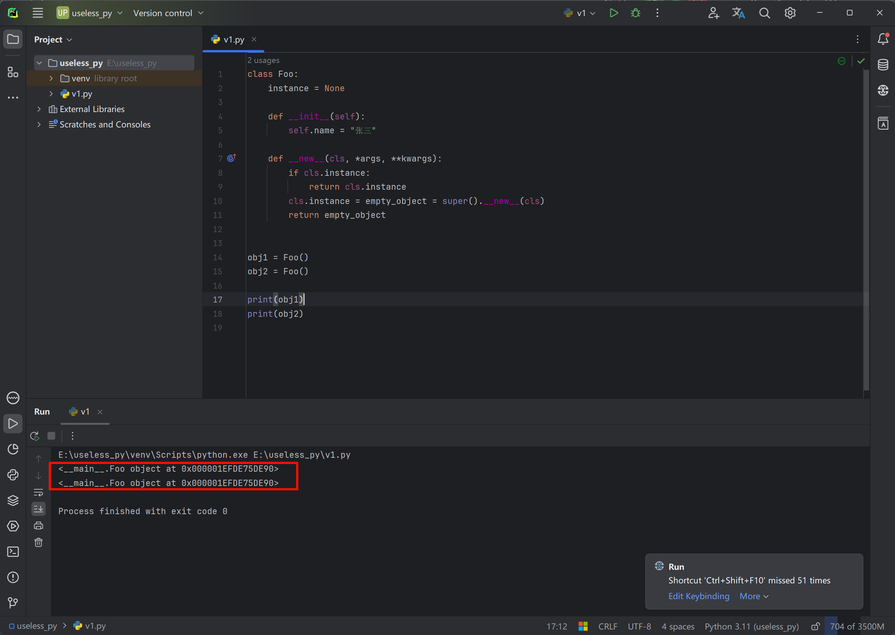
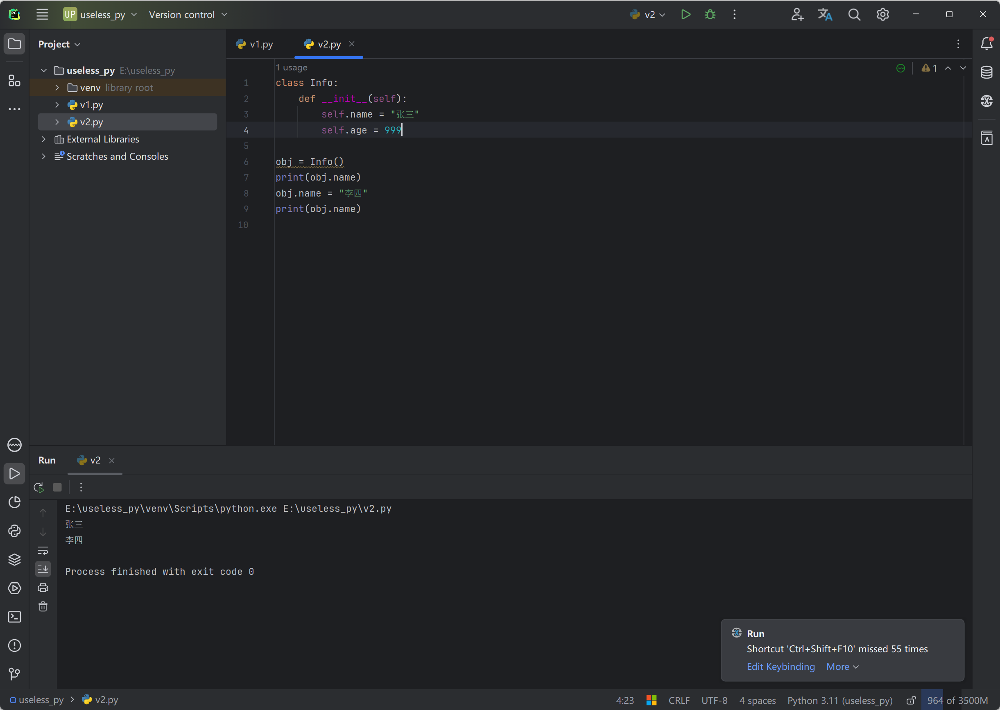
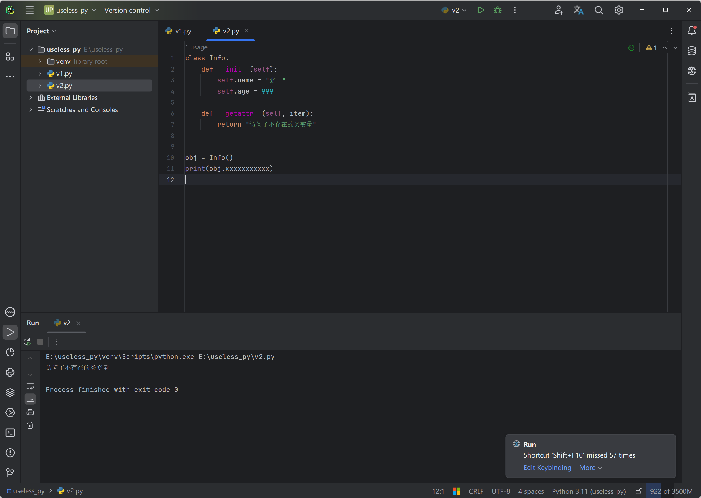
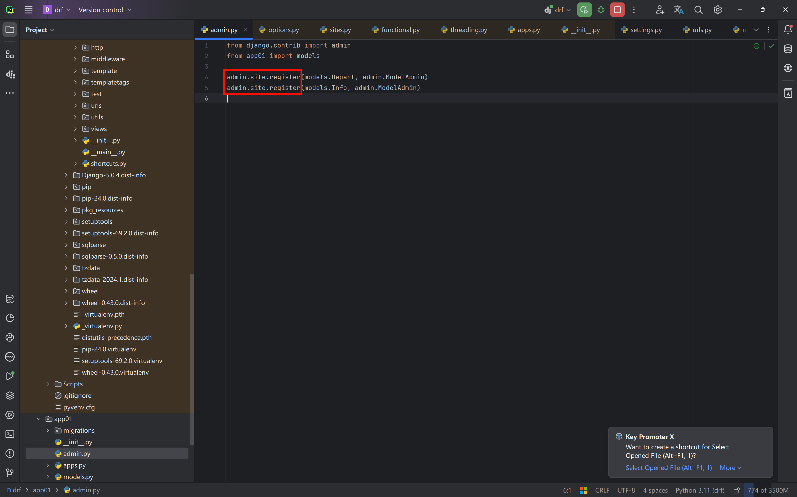
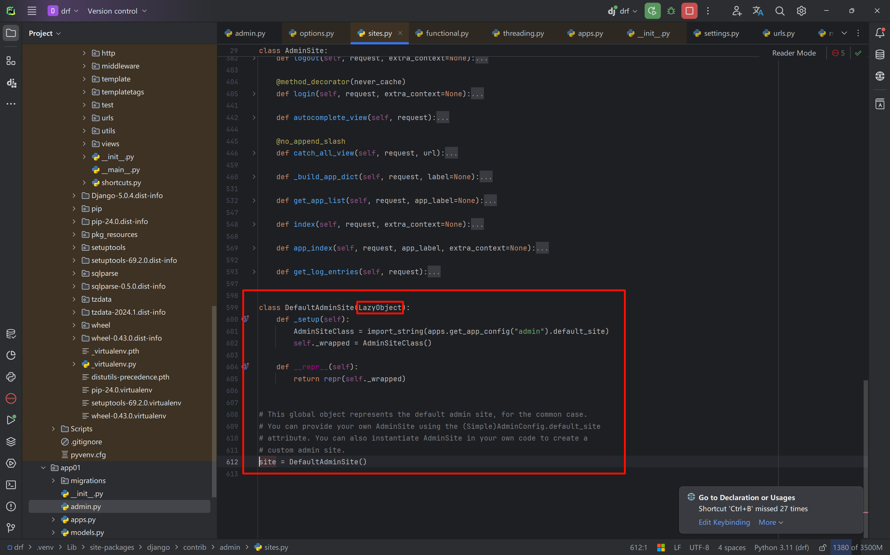
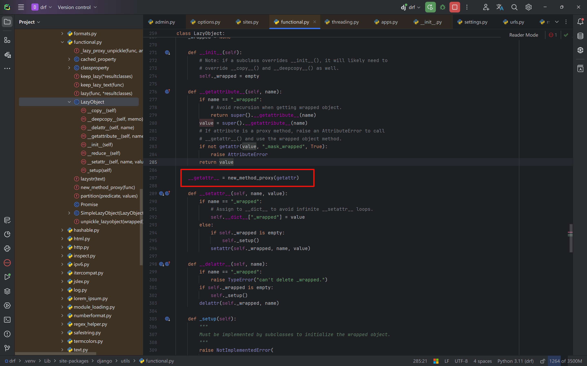
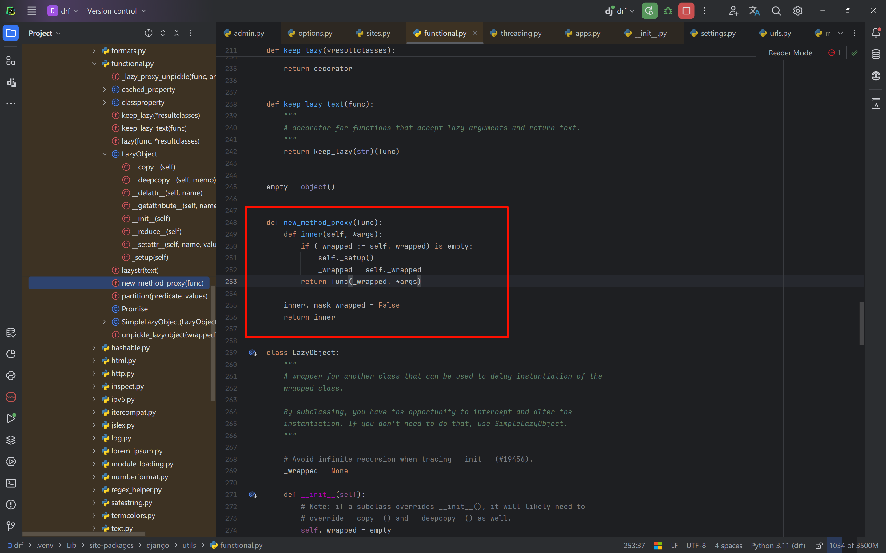
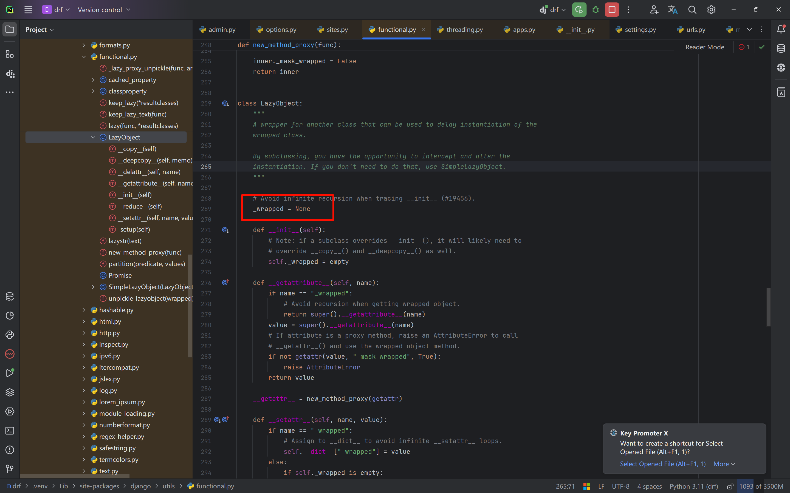
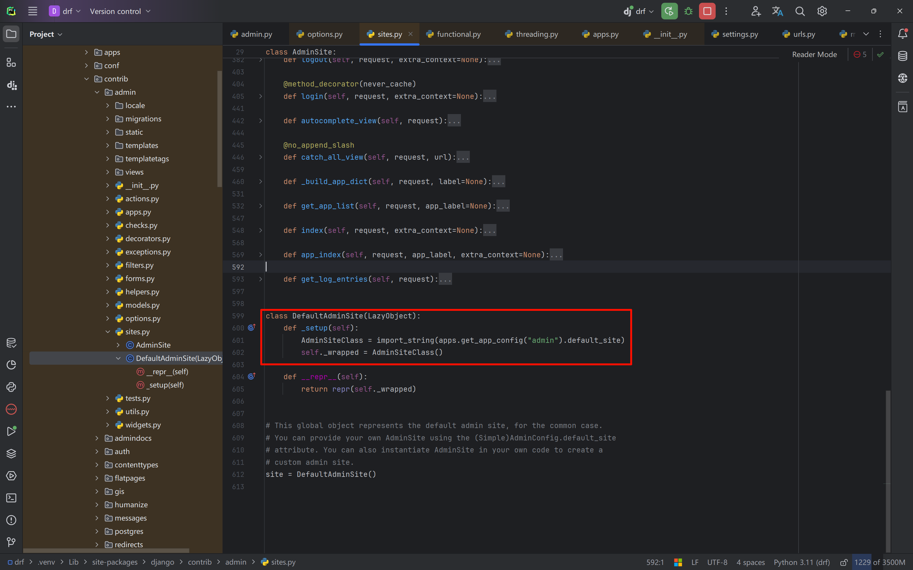

# Django-admin singleton pattern and lazy loading

## Singleton pattern

```python
class Foo:
    def __init__(self):
        self.name = "张三"
        
    def __new__(cls, *args, **kwargs):
        empty_object = super().__new__(cls)
        return empty_object

obj1 = Foo()
obj2 = Foo()
```

When we instantiate an object, a space is allocated in memory.

Python's execution order is:

- Call the `__new__` method to create an empty object
- Call the `__init__` method to assign `name="张三"` to the empty object
- That is why `__new__` is called the constructor method and `__init__` is called the initializer method

The purpose of the singleton pattern is to ensure that when we create class objects, we always reuse the object created the first time, rather than creating a new object on every use as shown above.

For example:

```python
import admin	# 1

admin.site		# 2

import admin	# 3

admin.site		# 4
```

Python's execution order is

- 1 Loads the admin.py file
- 2 Instantiates an object

- 3 When we import admin.py again, Python does not reload it; step 4 uses the admin object created earlier, and a new object is not created

### How to implement a singleton pattern

```python
class Foo:
    instance = None

    def __init__(self):
        self.name = "张三"

    def __new__(cls, *args, **kwargs):
        if cls.instance:
            return cls.instance
        cls.instance = empty_object = super().__new__(cls)
        return empty_object


obj1 = Foo()
obj2 = Foo()
```

This way, if no instance has been created yet, `instance=None`, so an object is created and simultaneously assigned to `instance`.

If the object has already been created, i.e. `instance=object`, that object is returned directly.



As you can see, the memory addresses of the two objects are the same.

When Python instantiates and creates an object, it does not create the object directly; instead, it first creates a proxy (uncertain whether the instantiated functionality will be used).

Only when we actually call the instantiated functionality is the real object created.

## Lazy loading

In Python, after we instantiate an object, we can access and modify the variables of the instantiated class.

```python
class Info:
    def __init__(self):
        self.name = "张三"
        self.age = 999

obj = Info()
print(obj.name)
obj.name = "李四"
print(obj.name)
```



When we access an attribute that does not exist on an instantiated object, it normally raises an error.

However, if we define a `__getattr__` method in the instantiated class, accessing an attribute that does not exist on the object will return the `return` value of this method instead.

```python
class Info:
    def __init__(self):
        self.name = "张三"
        self.age = 999

    def __getattr__(self, item):
        return "访问了不存在的类变量"


obj = Info()
print(obj.xxxxxxxxxxx)
```



# How django-admin implements the singleton pattern and lazy loading

In the django-admin source code, when the `site` object is instantiated, the object is not actually created.

When it calls the `register` method, the method does not exist, so the `__getattr__` method of its parent class `LazyObject` is executed.







And here the `__getattr__` method actually executes the `new_method_proxy` method.



We need to note that the parent class `LazyObject` has a class variable `_wrapped` that defaults to `None`.



When we execute the `new_method_proxy` method, the `_setup()` method is executed and its result is assigned to `_wrapped`.

This way, the next time the object is instantiated, since `_wrapped` is no longer empty, it will be returned directly without creating a new object. This implements the **singleton pattern**.

`self._wrapped` is actually the real instantiated object, which implements **lazy loading**.




