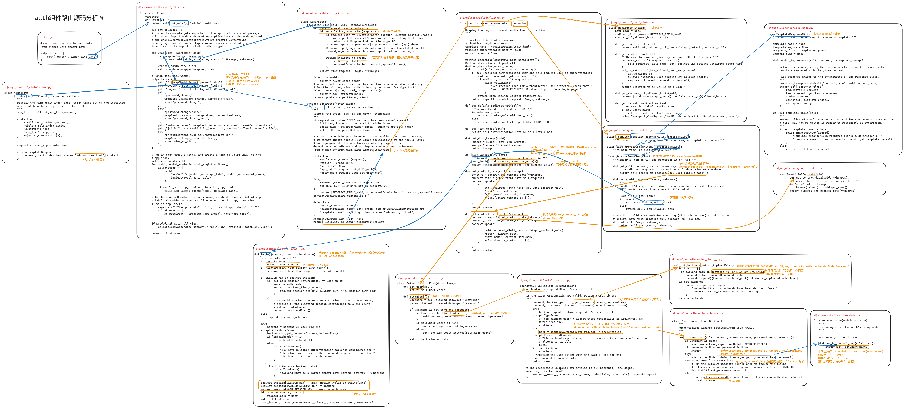
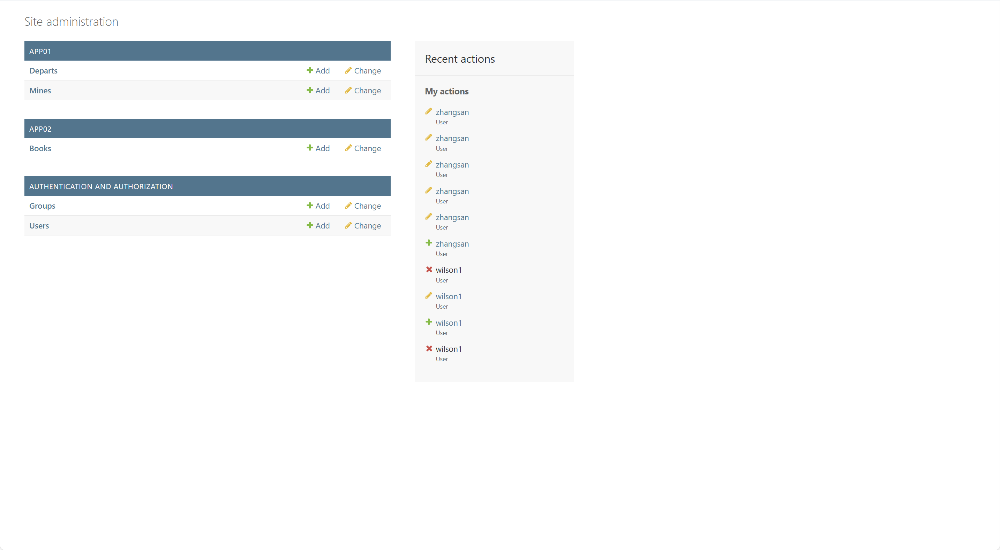
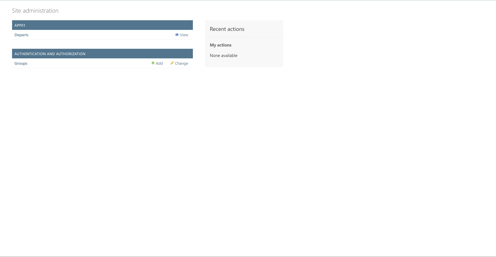
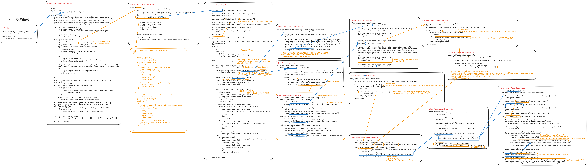
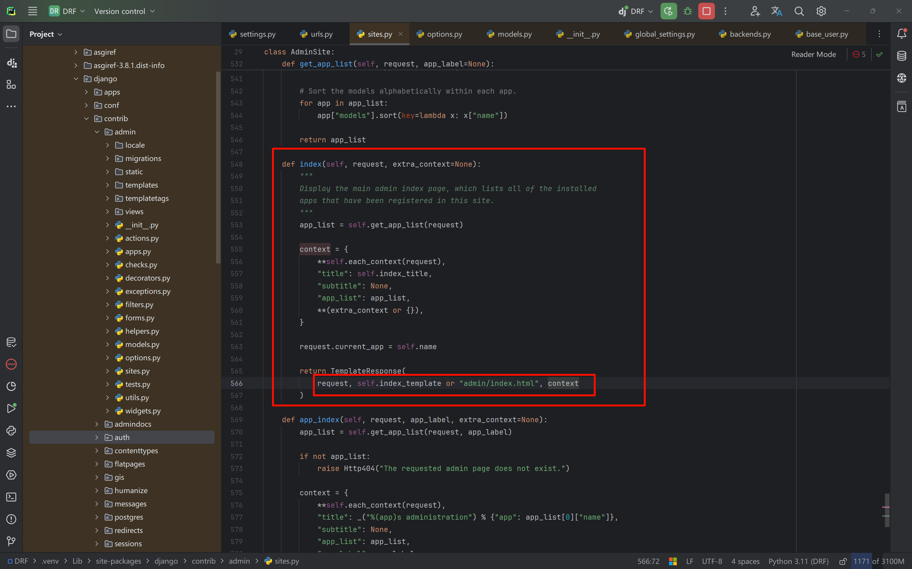

# Django-auth component

## 1 Table structure

Let's start by looking at the built-in tables of the `auth` component created for us by `python manage.py migrate`.

- `auth_user`: the user table that stores user information (for logging into the admin backend).

  Its fields fall into two categories: basic user info (username, email, password, etc.) and 2 M2M tables (user + permission, user + group) (related to permissions).

- `auth_permission`: the permission table, storing the CRUD URLs generated for all tables (4 routes per table <——> route aliases).

- `auth_user_user_permissions`: the many-to-many relation table between the user table and the permission table, containing `user_id` and `permission_id`.

- `auth_group`: the group table, storing ids and group names, with a many-to-many relationship to the permission table (grouping permissions).

- `auth_user_groups`: the relation table between the user table and the group table, for assigning users to groups.

- `auth_group_permissions`: the relation table between the group table and the permission table, for grouping permissions.


## 2 Login route

When we run `python manage.py createsuperuser`, a superuser is created.

Let's look at the login route of the superuser.



The source code is heavily nested (needs repeated reading); the focus is on reuse and decoupling, which allows for a lot of customization.


## 3 Home page permission assignment

After a user logs in successfully, the displayed page is based on the tables registered with admin, among which

- The superuser can see everything.

  

- For other users, as long as at least one of the four CRUD permissions is assigned, the table is visible.

  

Let's look at how the auth source code controls this permission assignment.

From the earlier route analysis, after we log in successfully, `self.index` is executed to display the home page information.




Summary:

- Get all Models registered with admin.
- Check against the database using the current `request.user` to decide whether to display each one.


## 4 Button control

In the auth component, we can control whether buttons such as add, delete, etc. are displayed.

From the analysis diagram above, `app_list` contains the specific permission information obtained.

```json
app_list:
[
  {
    "name": "App01",
    "app_label": "app01",
    "app_url": "/admin/app01/",
    "has_module_perms": true,
    "models": [
      {
        "model": "<class 'app01.models.Depart'>",
        "name": "Departs",
        "object_name": "Depart",
        "perms": {
          "add": false,
          "change": false,
          "delete": false,
          "view": true
        },
        "admin_url": "/admin/app01/depart/",
        "add_url": "None",
        "view_only": true
      }
    ]
  },
  {
    "name": "Authentication and Authorization",
    "app_label": "auth",
    "app_url": "/admin/auth/",
    "has_module_perms": true,
    "models": [
      {
        "model": "<class 'django.contrib.auth.models.Group'>",
        "name": "Groups",
        "object_name": "Group",
        "perms": {
          "add": true,
          "change": true,
          "delete": true,
          "view": true
        },
        "admin_url": "/admin/auth/group/",
        "add_url": "/admin/auth/group/add/",
        "view_only": false
      }
    ]
  }
]
```

We can determine permission based on the true/false value of each table's perms under each app.

The specific check is done in the HTML template of each table.


