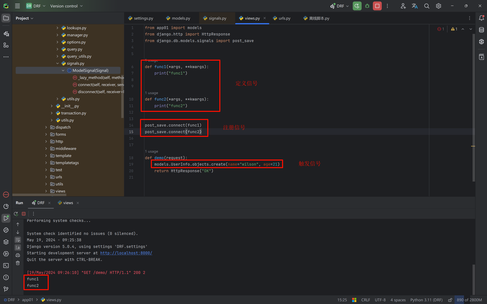
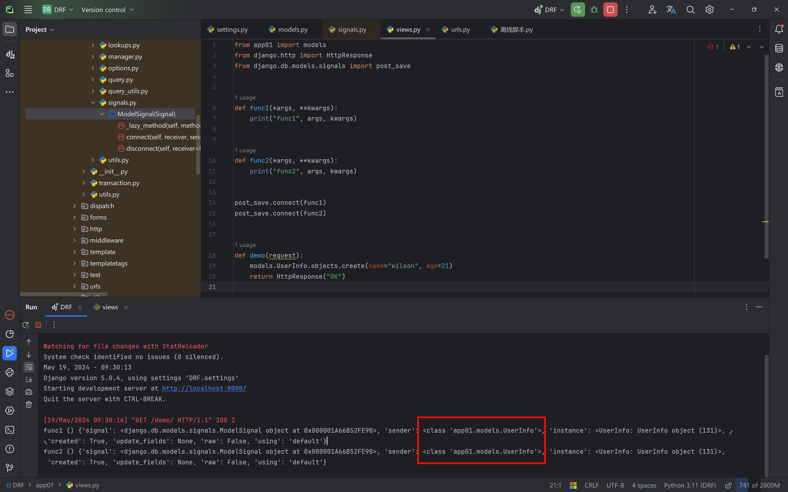
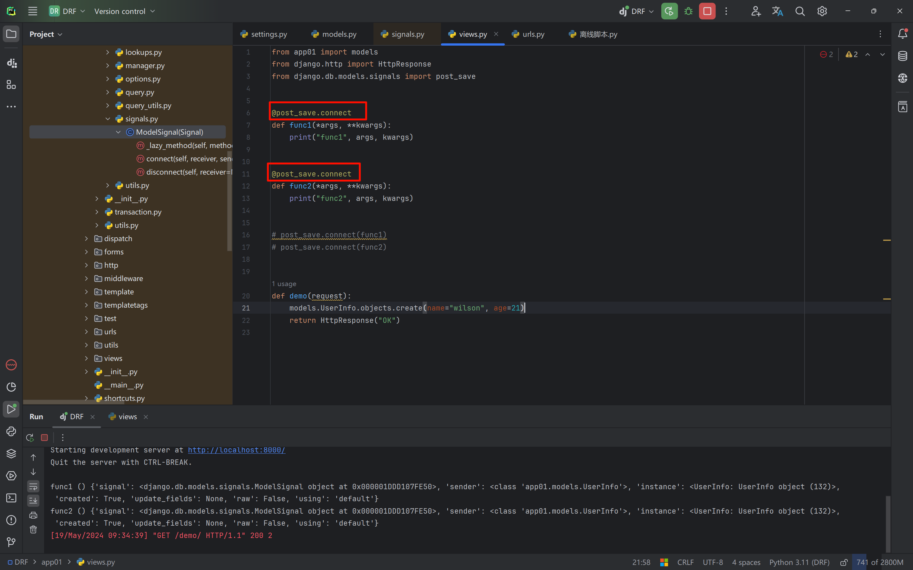
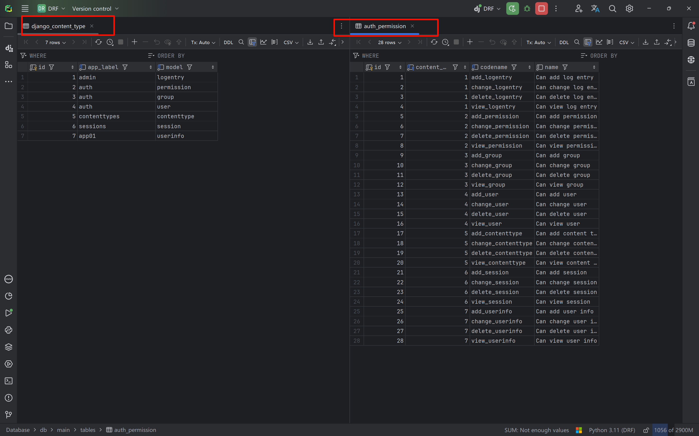
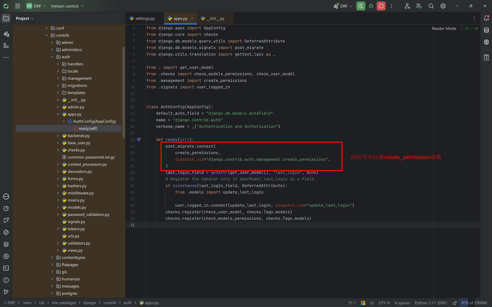
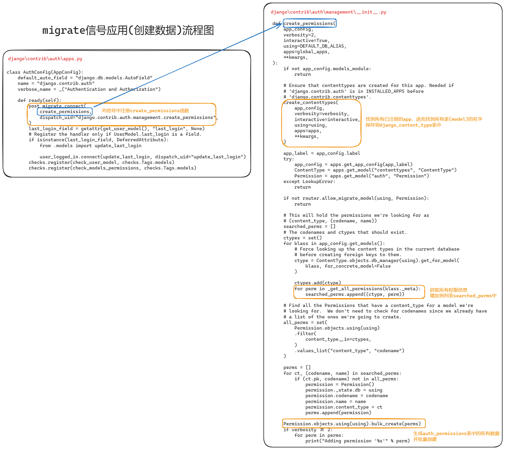

# Django-signal component

Django 4.2 signals official docs: https://docs.djangoproject.com/zh-hans/4.2/ref/signals/#signals

Django has a "signal dispatcher". It is essentially the observer pattern, also known as Publish/Subscribe. When some action occurs, a signal is sent, and the functions that subscribed to that signal are executed.

In plain terms, when some action happens, signals allow a specific sender to notify some receivers. **It is used to decouple operations when the framework executes.**

## 1 Custom signals

- Define a signal

  ```python
  import django.dispatch
  
  # 自定义信号
  cut_info_signal = django.dispatch.Signal()
  ```

- Register callbacks

  ```python
  from utils.signals import cut_info_signal
  
  
  def callback_1(sender, **kwargs):
      print("callback-1")
  
  
  def callback_2(sender, **kwargs):
      print("callback-2")
  
  
  cut_info_signal.connect(callback_1)
  cut_info_signal.connect(callback_2)
  ```

- Send the signal

  ```python
  from utils.signals import cut_info_signal
  cut_info_signal.send("触发了此信号")
  ```

Register certain actions on a single signal; once the condition is met, the signal is sent (all callbacks are executed).


## 2 Built-in signals

```Python
Model signals
    pre_init                    # django的model执行其构造方法前，自动触发
    post_init                   # django的model执行其构造方法后，自动触发
    pre_save                    # django的model对象保存前，自动触发
    post_save                   # django的model对象保存后，自动触发
    pre_delete                  # django的model对象删除前，自动触发
    post_delete                 # django的model对象删除后，自动触发
    m2m_changed                 # django的model中使用m2m字段操作第三张表
                                # （add,remove,clear）前后，自动触发
    class_prepared              # 程序启动时，检测已注册的app中model类，对于每一个类，自动触发
    
Management signals
    pre_migrate                 # 执行migrate命令前，自动触发
    post_migrate                # 执行migrate命令后，自动触发
    
Request/response signals
    request_started             # 请求到来前，自动触发
    request_finished            # 请求结束后，自动触发
    got_request_exception       # 请求异常后，自动触发
    
Test signals
    setting_changed             # 使用test测试修改配置文件时，自动触发
    template_rendered           # 使用test测试渲染模板时，自动触发
    
Database Wrappers
    connection_created          # 创建数据库连接时，自动触发
```

### Usage 1: register a signal using a function name as the argument

- Register signal callbacks

  ```python
  from django.core.signals import request_finished
  from django.core.signals import request_started
  from django.core.signals import got_request_exception
  
  from django.db.models.signals import class_prepared
  from django.db.models.signals import pre_init, post_init
  from django.db.models.signals import pre_save, post_save
  from django.db.models.signals import pre_delete, post_delete
  from django.db.models.signals import m2m_changed
  from django.db.models.signals import pre_migrate, post_migrate
  
  from django.test.signals import setting_changed
  from django.test.signals import template_rendered
  
  from django.db.backends.signals import connection_created
  
  
  def func1(*args, **kwargs):
      print("func1")
  
  
  def func2(*args, **kwargs):
      print("func2")
  
  
  post_save.connect(func1)
  post_save.connect(func2)
  ```

- Send the signal

  ```python
  from app01 import models
  
  def demo(request):
      models.UserInfo.objects.create(name="wilson", age=21)
      return HttpResponse("OK")
  ```



Of course, if we print out `args` and `kwargs`, we can see that both signals are triggered by the `UserInfo` table.



### Usage 2: using a decorator

```python
from app01 import models
from django.http import HttpResponse
from django.db.models.signals import post_save


@post_save.connect
def func1(*args, **kwargs):
    print("func1", args, kwargs)


@post_save.connect
def func2(*args, **kwargs):
    print("func2", args, kwargs)


# post_save.connect(func1)
# post_save.connect(func2)


def demo(request):
    models.UserInfo.objects.create(name="wilson", age=21)
    return HttpResponse("OK")
```



##### Note on where signals are defined

Generally, we do not define and register signals in view functions; instead, we put them in the `__init__.py` file at the project root (as long as the project starts, this file is automatically loaded).


## 3 Examples of using built-in signals

### Signals triggered when creating a model class object

- `views.py`

```python
from django.shortcuts import render, HttpResponse
from api.models import User


# ----------- 内置信号的用法 --------------
def index(request):
    # 什么时候模型类对象调用save方法？答案是创建对象的时候，和更新对象的时候
    obj = User.objects.create(name='zhangsan')
    print(obj)
    return HttpResponse("INDEX")
```

- `demo/__init__.py`

```python
from django.db.models.signals import pre_init, post_init, pre_save, post_save, pre_delete, post_delete
from django.dispatch import receiver

@receiver(pre_init)
def pre_init_callback(sender, **kwargs):
    """ 每当实例化一个 Django 模型时，这个信号都会在模型的 __init__() 方法的开头发出 """
    print('pre_init_callback', sender)
    print('pre_init_callback', kwargs)

@receiver(post_init)
def post_init_callback(sender, **kwargs):
    """ 和 pre_init 一样，但这个是在 __init__() 方法完成后发送的 """
    print('post_init_callback', sender)
    print('post_init_callback', kwargs)

@receiver(pre_save)
def pre_save_callback(sender, **kwargs):
    """ 这是在模型的 save() 方法开始时发送的 """
    print('pre_save_callback', sender)
    print('pre_save_callback', kwargs)
    print('pre_save_callback', kwargs['instance'].name)


@receiver(post_save)
def post_save_callback(sender, **kwargs):
    """ 就像 pre_save 一样，但在 save() 方法的最后发送 """
    print('post_save_callback', sender)
    print('post_save_callback', kwargs)
    print('post_save_callback', kwargs['instance'].name)
```

Printed output:

```bash
pre_init_callback <class 'api.models.User'>
pre_init_callback {'signal': <django.db.models.signals.ModelSignal object at 0x00000159F5287DC0>, 'args': (), 'kwargs': {'name': 'zhangsan'}}
post_init_callback <class 'api.models.User'>
post_init_callback {'signal': <django.db.models.signals.ModelSignal object at 0x00000159F5287EE0>, 'instance': <User: zhangsan>}
pre_save_callback <class 'api.models.User'>
pre_save_callback {'signal': <django.db.models.signals.ModelSignal object at 0x00000159F5287FD0>, 'instance': <User: zhangsan>, 'raw': False, 'using': 'default', 'update_fields': None}
pre_save_callback zhangsan
post_save_callback <class 'api.models.User'>
post_save_callback {'signal': <django.db.models.signals.ModelSignal object at 0x00000159F52C4100>, 'instance': <User: zhangsan>, 'created': True, 'update_fields': None, 'raw': False, 'using': 'default'}
post_save_callback zhangsan
zhangsan
```

### Signals triggered when editing a model class object

`views.py`:

```python
from django.shortcuts import render, HttpResponse
from api.models import User

# ----------- 内置信号的用法 --------------
def index(request):
    # 什么时候模型类对象调用save方法？答案是创建对象的时候，和更新对象的时候
    # 新增
    # obj = User.objects.create(name='zhangsan')
    # print(obj)

    # 编辑
    obj = User.objects.filter(name='zhangsan2').first()
    old = obj.name
    obj.name = "zhangsan888"
    new = obj.name
    # log.info(f'{old}-->{new}')
    obj.save()

    return HttpResponse("INDEX")
```

`demo/__init__.py`:

```python
from django.db.models.signals import pre_init, post_init, pre_save, post_save, pre_delete, post_delete
from django.dispatch import receiver

@receiver(pre_init)
def pre_init_callback(sender, **kwargs):
    """ 每当实例化一个 Django 模型时，这个信号都会在模型的 __init__() 方法的开头发出 """
    print('pre_init_callback', sender)
    print('pre_init_callback', kwargs)


@receiver(post_init)
def post_init_callback(sender, **kwargs):
    """ 和 pre_init 一样，但这个是在 __init__() 方法完成后发送的 """
    print('post_init_callback', sender)
    print('post_init_callback', kwargs)


@receiver(pre_save)
def pre_save_callback(sender, **kwargs):
    """ 这是在模型的 save() 方法开始时发送的 """
    print('pre_save_callback', sender)
    print('pre_save_callback', kwargs)
    print('pre_save_callback', kwargs['instance'].name)


@receiver(post_save)
def post_save_callback(sender, **kwargs):
    """ 就像 pre_save 一样，但在 save() 方法的最后发送 """
    print('post_save_callback', sender)
    print('post_save_callback', kwargs)
    print('post_save_callback', kwargs['instance'].name)
```

Log output:

```bash
pre_init_callback <class 'api.models.User'>
pre_init_callback {'signal': <django.db.models.signals.ModelSignal object at 0x00000186F4937DC0>, 'args': (1, 'zhangsan2'), 'kwargs': {}}
post_init_callback <class 'api.models.User'>
post_init_callback {'signal': <django.db.models.signals.ModelSignal object at 0x00000186F4937EE0>, 'instance': <User: zhangsan2>}
zhangsan2
pre_save_callback <class 'api.models.User'>
pre_save_callback {'signal': <django.db.models.signals.ModelSignal object at 0x00000186F4937FD0>, 'instance': <User: zhangsan888>, 'raw': False, 'using': 'default', 'update_fields': None}
pre_save_callback zhangsan888
post_save_callback <class 'api.models.User'>
post_save_callback {'signal': <django.db.models.signals.ModelSignal object at 0x00000186F4974100>, 'instance': <User: zhangsan888>, 'created': False, 'update_fields': None, 'raw': False, 'using': 'default'}
post_save_callback zhangsan888
```


### Signals triggered when deleting a model class object

`views.py`:

```python
from django.shortcuts import render, HttpResponse
from api.models import User


# ----------- 内置信号的用法 --------------

def index(request):
    # 什么时候模型类对象调用save方法？答案是创建对象的时候，和更新对象的时候
    # 新增
    # obj = User.objects.create(name='zhangsan')
    # print(obj)

    # 编辑
    # obj = User.objects.filter(name='zhangsan2').first()
    # old = obj.name
    # obj.name = "zhangsan888"
    # new = obj.name
    # # log.info(f'{old}-->{new}')
    # obj.save()

    # 删除
    obj_list = User.objects.filter(name='zhangsan888')
    # print(111, obj_list)  # <QuerySet [<User: zhangsan888>, <User: zhangsan888>, <User: zhangsan888>]>
    for obj in obj_list:
        obj.delete()

    return HttpResponse("INDEX")
```

`demo/__init__.py`:

```python
from django.db.models.signals import pre_init, post_init, pre_save, post_save, pre_delete, post_delete
from django.dispatch import receiver

@receiver(pre_init)
def pre_init_callback(sender, **kwargs):
    """ 每当实例化一个 Django 模型时，这个信号都会在模型的 __init__() 方法的开头发出 """
    print('pre_init_callback', sender)
    print('pre_init_callback', kwargs)


@receiver(post_init)
def post_init_callback(sender, **kwargs):
    """ 和 pre_init 一样，但这个是在 __init__() 方法完成后发送的 """
    print('post_init_callback', sender)
    print('post_init_callback', kwargs)


@receiver(pre_save)
def pre_save_callback(sender, **kwargs):
    """ 这是在模型的 save() 方法开始时发送的 """
    print('pre_save_callback', sender)
    print('pre_save_callback', kwargs)
    print('pre_save_callback', kwargs['instance'].name)


@receiver(post_save)
def post_save_callback(sender, **kwargs):
    """ 就像 pre_save 一样，但在 save() 方法的最后发送 """
    print('post_save_callback', sender)
    print('post_save_callback', kwargs)
    print('post_save_callback', kwargs['instance'].name)


@receiver(pre_delete)
def pre_delete_callback(sender, **kwargs):
    """ 在模型的 delete() 方法和查询集的 delete() 方法开始时发送 """
    print('pre_delete_callback', sender)
    print('pre_delete_callback', kwargs)


@receiver(post_delete)
def post_delete_callback(sender, **kwargs):
    """ 就像 pre_delete 一样，但在模型的 delete() 方法和查询集的 delete() 方法结束时发送 """
    print('post_delete_callback', sender)
    print('post_delete_callback', kwargs)
```

Log output:

```bash
post_init_callback {'signal': <django.db.models.signals.ModelSignal object at 0x0000026FD6FE7EE0>, 'instance': <User: zhangsan888>}
pre_delete_callback <class 'api.models.User'>
pre_delete_callback {'signal': <django.db.models.signals.ModelSignal object at 0x0000026FD70241F0>, 'instance': <User: zhangsan888>, 'using': 'default', 'origin': <User: zhangsan888>}
post_delete_callback <class 'api.models.User'>
post_delete_callback {'signal': <django.db.models.signals.ModelSignal object at 0x0000026FD70242E0>, 'instance': <User: zhangsan888>, 'using': 'default', 'origin': <User: zhangsan888>}
pre_delete_callback <class 'api.models.User'>
pre_delete_callback {'signal': <django.db.models.signals.ModelSignal object at 0x0000026FD70241F0>, 'instance': <User: zhangsan888>, 'using': 'default', 'origin': <User: zhangsan888>}
post_delete_callback <class 'api.models.User'>
post_delete_callback {'signal': <django.db.models.signals.ModelSignal object at 0x0000026FD70242E0>, 'instance': <User: zhangsan888>, 'using': 'default', 'origin': <User: zhangsan888>}
pre_delete_callback <class 'api.models.User'>
pre_delete_callback {'signal': <django.db.models.signals.ModelSignal object at 0x0000026FD70241F0>, 'instance': <User: zhangsan888>, 'using': 'default', 'origin': <User: zhangsan888>}
post_delete_callback <class 'api.models.User'>
post_delete_callback {'signal': <django.db.models.signals.ModelSignal object at 0x0000026FD70242E0>, 'instance': <User: zhangsan888>, 'using': 'default', 'origin': <User: zhangsan888>}
```

## 4 migrate signal application

After we run `python manage.py makemigrations` and `python manage.py migrate`, two tables with data are automatically created: `django_content_type` and `auth_permission`.



The implementation principle is that when Django starts, functions are registered on the `post_migrate` signal. When we run `python manage.py migrate`, Django not only creates tables based on the `migrations` folder configuration in the registered apps, but also executes the functions registered on the `post_migrate` signal to insert data into the `django_content_type` and `auth_permission` tables.

We can find the source code in the Django-auth component:



Flowchart:


