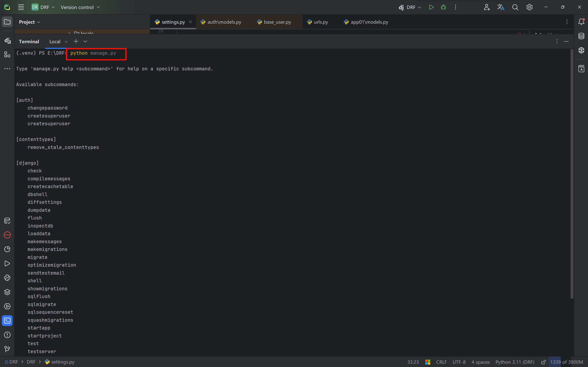
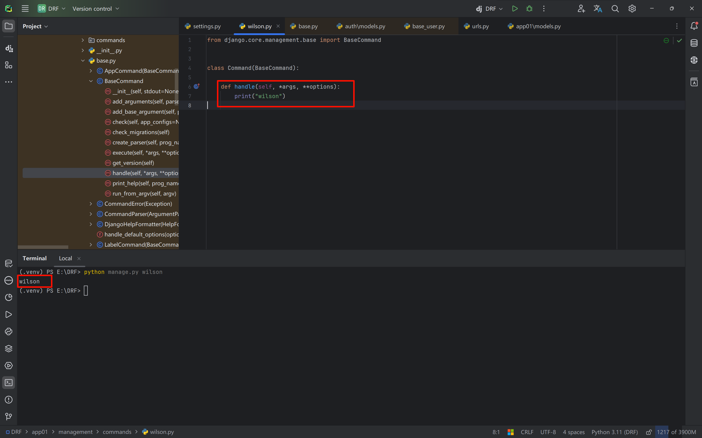
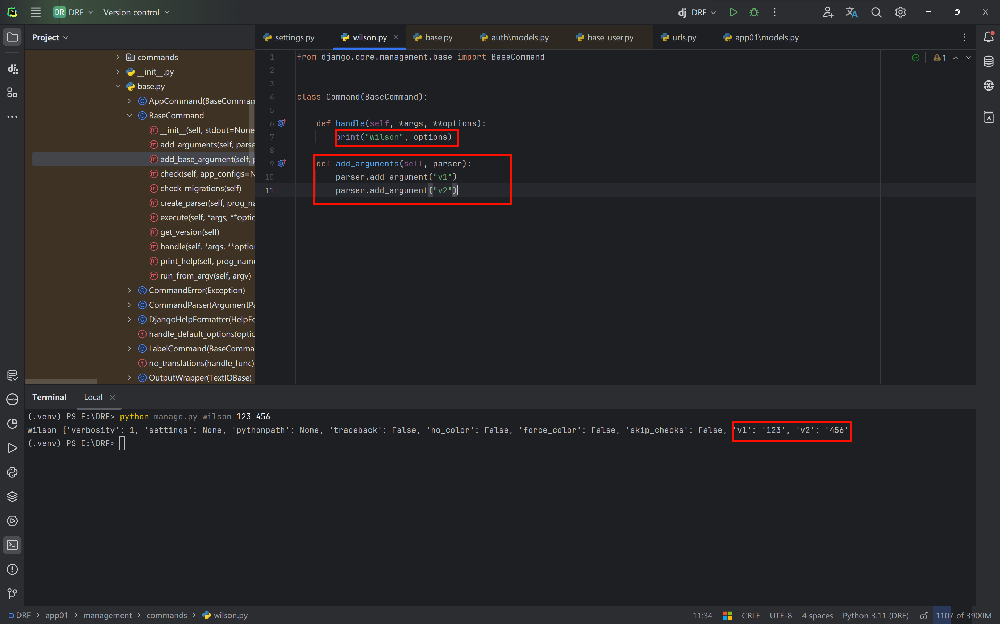
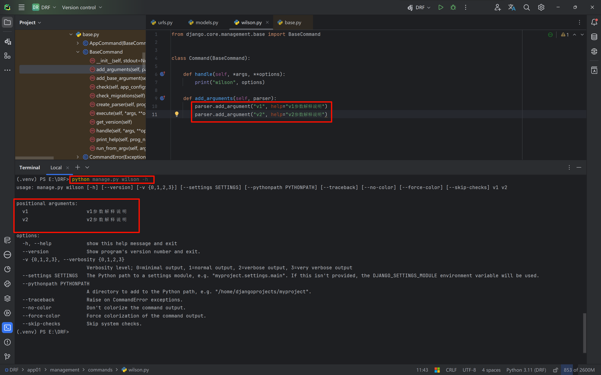
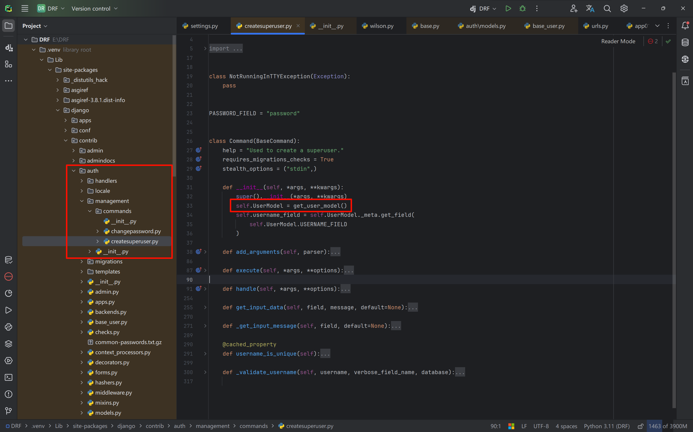
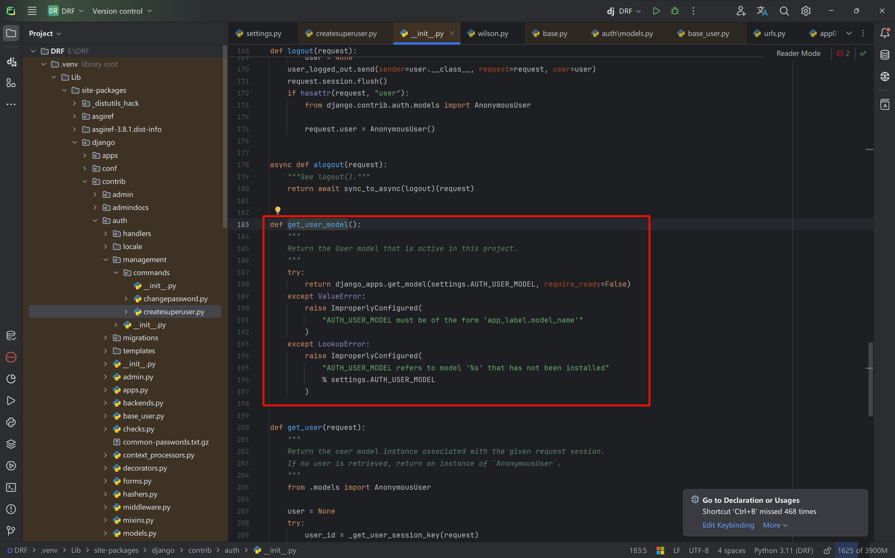
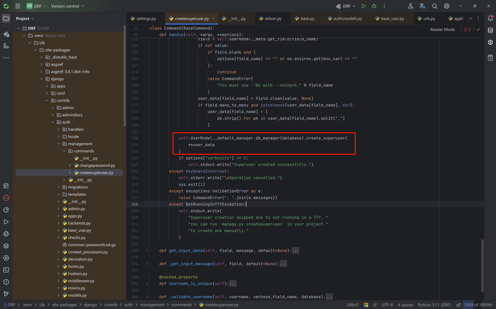

# Django custom commands

As we know, Django comes with many built-in commands, for example

```bash
python manage.py runserver
python manage.py makemigrations
python manage.py migrate
```

We can view all commands in the Python console.



We can also define custom commands so that `python manage.py` can execute them.

- In a registered app, create the required folder `management` and a second-level folder `commands` (the folder names are fixed).
- In the `commands` folder, create a file `wilson.py`; the command will be `python manage.py wilson`.

In the `wilson.py` file, we need to write a `Command` class that inherits from `BaseCommand` and overrides the `handle()` method.

When we run `python manage.py wilson`, the actual operations are in the `handle()` method.

```python
from django.core.management.base import BaseCommand


class Command(BaseCommand):

    def handle(self, *args, **options):
        print("wilson")
```



In its parent class `BaseCommand`, there is an `add_arguments` method that supports parsing the arguments passed after the command (in dictionary form).

```python
from django.core.management.base import BaseCommand


class Command(BaseCommand):

    def handle(self, *args, **options):
        print("wilson", options)

    def add_arguments(self, parser):
        parser.add_argument("v1")
        parser.add_argument("v2")
```



We can also add a help description to each argument so users know what the argument does (you can get the help information via `python manage.py wilson -h`).



### About the `python manage.py createsuperuser` command

In the auth-app of django, there is a `createsupersuer.py` file.



In its initializer, the function `get_user_model()` is executed, which essentially looks for the model class in each app and reads the `AUTH_USER_MODEL = "auth.User"` setting from the configuration file, i.e. the User table in auth.



Then it looks for the `USERNAME_FIELD` field, i.e. `"username"` defined in the configuration file.

In its `handle()` function, it mainly displays prompt messages and accepts the username, password, and email we input.



At the end it executes

```python
self.UserModel._default_manager.db_manager(database).create_superuser(**user_data)
```

Essentially, this runs the internal custom command `create_superuser` to create the superuser.

```python
User.objects.create_superuser(**user_data)
```

Note: `db_manager(database)` is used to select the database; the default is `default`.
