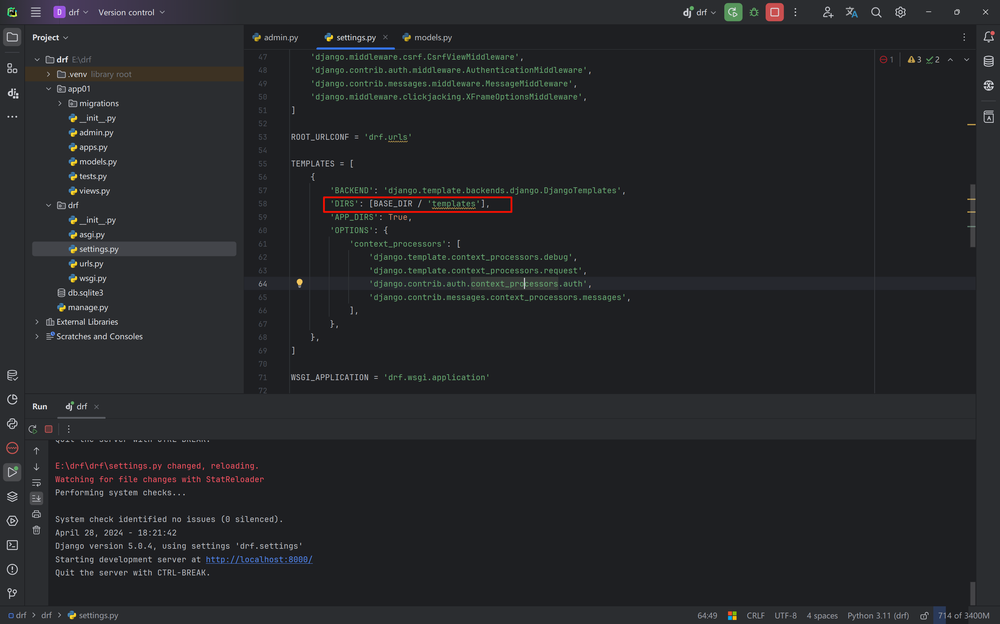

## Django template lookup order

First, check whether `DIRS` is defined in the `settings.py` file of the Django project.

If it is defined, look in that directory first (the `templates` directory under the project root); once found, there is no need to continue searching. If not found, search in the order in which the apps are registered.

