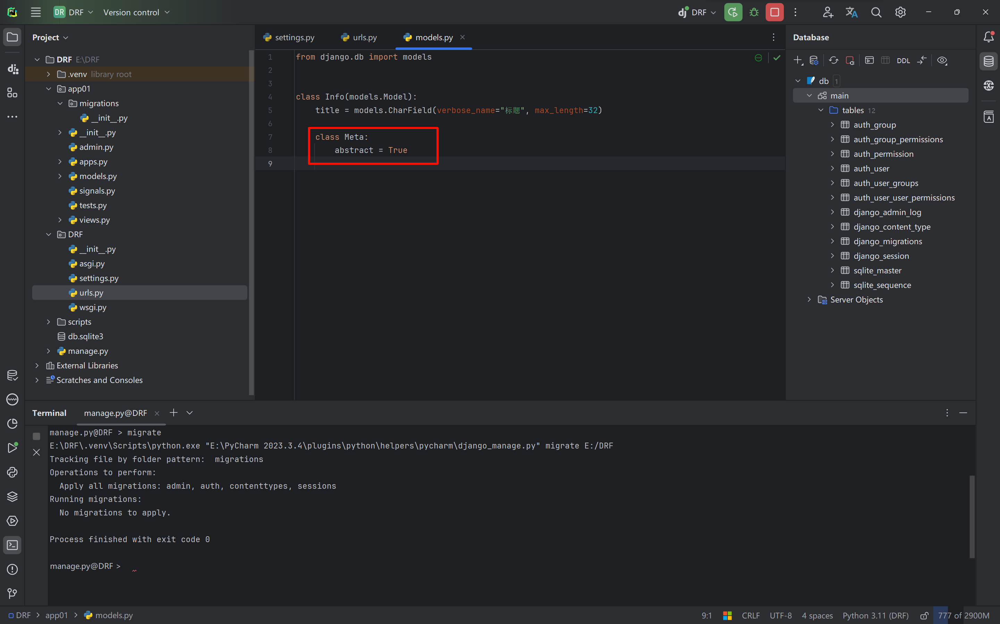
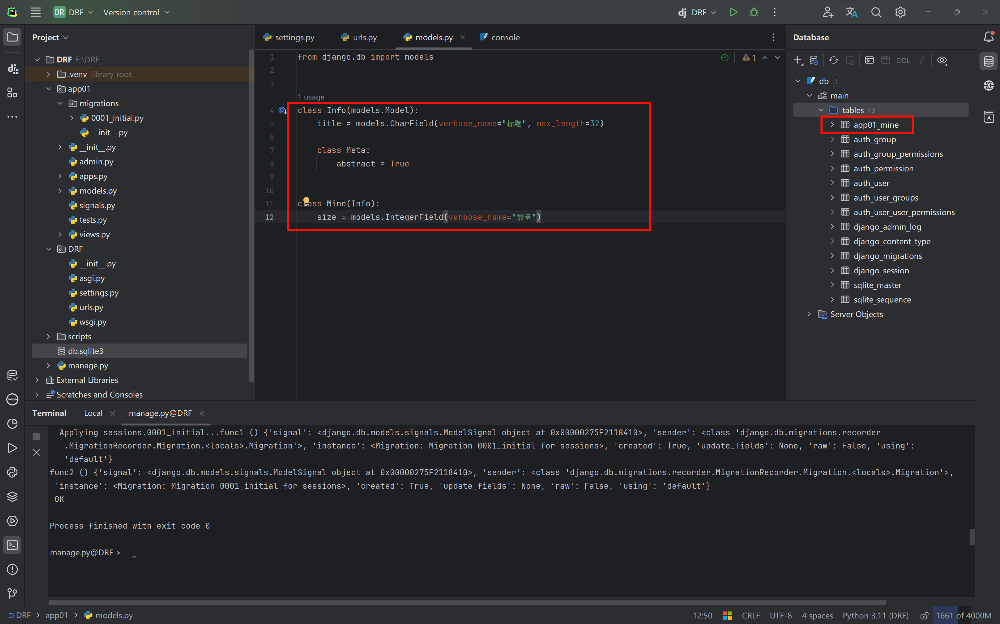
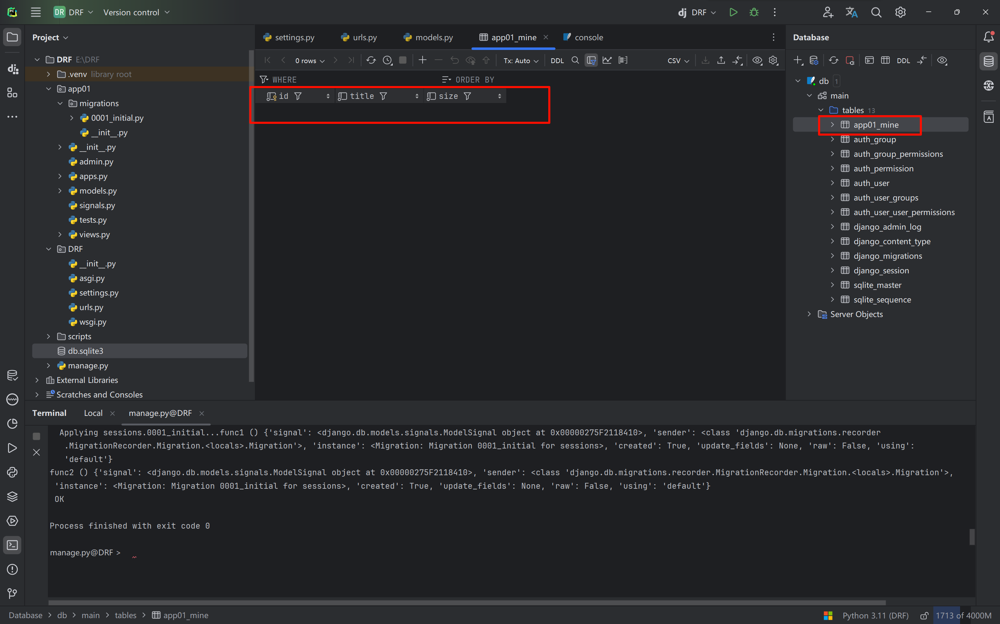

# Abstract classes in models

When we define a model table in the `models.py` file of an app and run `python manage.py makemigrations` and `python manage.py migrate`, Django creates the table in the database.

But we can also change this default behavior and define a model class that is not created as a table in the database.

```python
from django.db import models


class Info(models.Model):
    title = models.CharField(verbose_name="标题", max_length=32)

    class Meta:
        abstract = True
```



`abstract = True` is a flag indicating that this class is only used to provide common fields for other classes (via inheritance) and will not be created as its own table.



In the `Mine` table, besides its own `size` field, there is also the inherited `title` field.


