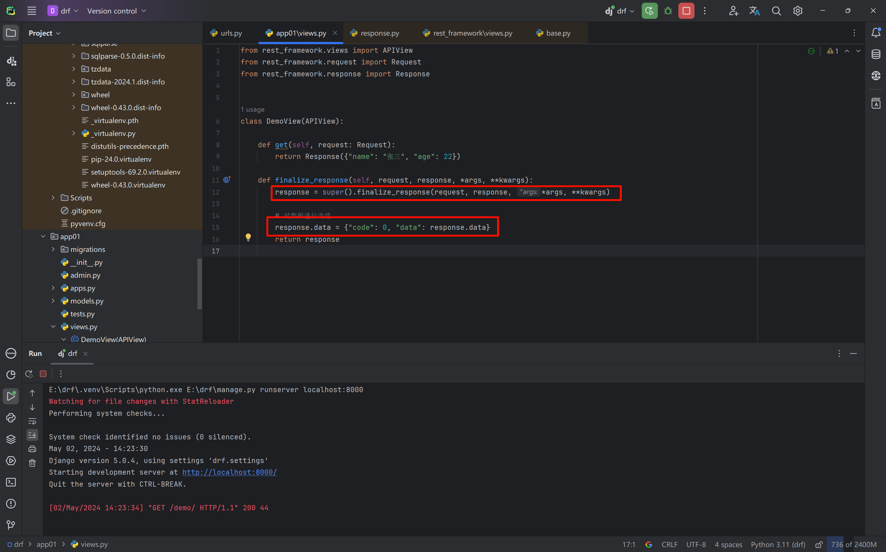
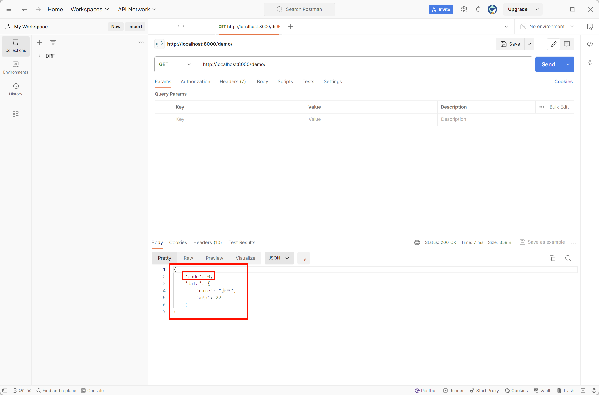
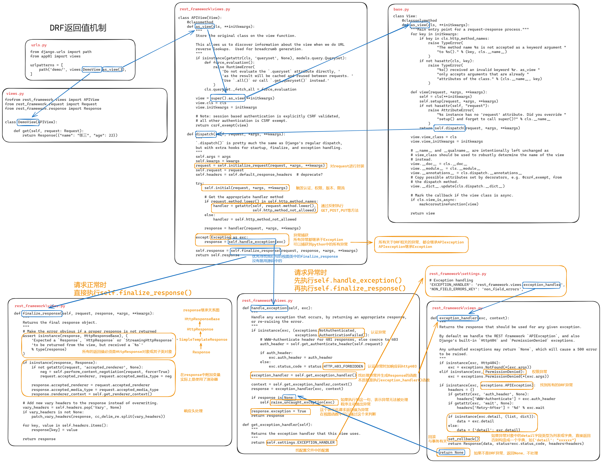
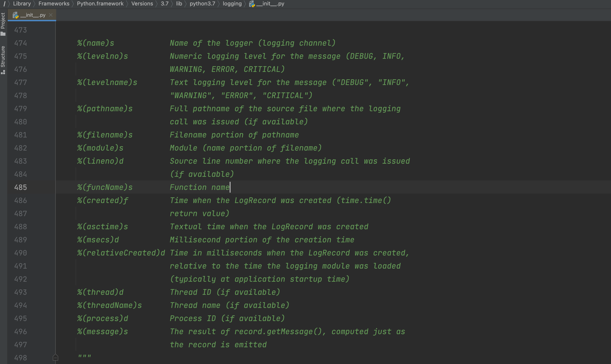
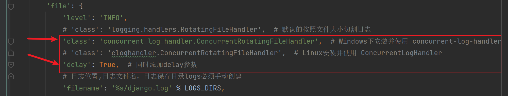

# DRF Return Values, Transactions, and Logging

## 1 Return Values

- Define the `finalize_response` method in the view (it can also be used to determine whether an exception occurred).

- Custom exceptions

  - Configuration file

    ```python
    # settings.py
    REST_FRAMEWORK = {
        "EXCEPTION_HANDLER": 'utils.handlers.exception_handler'		# 自定义的exceptional_handler路径
    }
    ```

  - Customize inside the `exception_handler` function.


### 1.1 Normal Return





```python
from rest_framework.views import APIView
from rest_framework.request import Request
from rest_framework.response import Response


class DemoView(APIView):

    def get(self, request: Request):
        return Response({"name": "张三", "age": 22})

    def finalize_response(self, request, response, *args, **kwargs):
        response = super().finalize_response(request, response, *args, **kwargs)

        # 对数据进行改造
        response.data = {"code": 0, "data": response.data}
        return response
```


### 1.2 Exception Return

#### Custom exception_handler

##### utils/handlers.py

```python
from django.http import Http404

from rest_framework import exceptions
from rest_framework.response import Response
from rest_framework.exceptions import ValidationError
from rest_framework.exceptions import Throttled
from rest_framework.exceptions import PermissionDenied
from rest_framework.exceptions import NotAuthenticated
from rest_framework.exceptions import AuthenticationFailed
from rest_framework.views import set_rollback


def exception_handler(exc, context):
    if isinstance(exc, Http404):
        exc = exceptions.NotFound()
        exc.ret_code = 1001
    elif isinstance(exc, PermissionDenied):
        exc = exceptions.PermissionDenied()
        exc.ret_code = 1002
    elif isinstance(exc, (AuthenticationFailed, NotAuthenticated)):
        exc.ret_code = 1003
    elif isinstance(exc, Throttled):
        exc.ret_code = 1004
    elif isinstance(exc, ValidationError):
        exc.ret_code = 1005

    # 处理drf相关的异常
    if isinstance(exc, exceptions.APIException):
        headers = {}
        if getattr(exc, 'auth_header', None):
            headers['WWW-Authenticate'] = exc.auth_header
        if getattr(exc, 'wait', None):
            headers['Retry-After'] = '%d' % exc.wait

        if isinstance(exc.detail, (list, dict)):
            data = exc.detail
        else:
            code = getattr(exc, 'ret_code', None) or -1
            data = {'code': code, 'detail': exc.detail}

        set_rollback()
        return Response(data, status=exc.status_code, headers=headers)
    return None
```

Another approach, suitable for `ser.is_valid(raise_exception=True)`.

```python
from django.http import Http404

from rest_framework import status
from rest_framework import exceptions
from rest_framework.response import Response
from rest_framework.exceptions import ValidationError
from rest_framework.exceptions import Throttled
from rest_framework.exceptions import PermissionDenied
from rest_framework.exceptions import NotAuthenticated
from rest_framework.exceptions import AuthenticationFailed
from rest_framework.views import set_rollback

from utils import return_code


def exception_handler(exc, context):
    exc.status_code = status.HTTP_200_OK    # 更改HTTP返回值状态码，方便前端编写
    if isinstance(exc, Http404):
        exc = exceptions.NotFound()
        exc.ret_code = return_code.NotFound404
    elif isinstance(exc, PermissionDenied):
        exc = exceptions.PermissionDenied()
        exc.ret_code = return_code.PermissionDenied
    elif isinstance(exc, AuthenticationFailed):
        exc.ret_code = return_code.AuthenticationFailed
    elif isinstance(exc, NotAuthenticated):
        exc.ret_code = return_code.NotAuthenticated
    elif isinstance(exc, Throttled):
        exc.ret_code = return_code.ThrottledError
    elif isinstance(exc, ValidationError):
        exc.ret_code = return_code.ValidationError

    # 处理drf相关的异常
    if isinstance(exc, exceptions.APIException):
        headers = {}
        if getattr(exc, 'auth_header', None):
            headers['WWW-Authenticate'] = exc.auth_header
        if getattr(exc, 'wait', None):
            headers['Retry-After'] = '%d' % exc.wait

        # if isinstance(exc.detail, (list, dict)):
        #     data = exc.detail
        # else:
        #     exc_code = getattr(exc, 'ret_code', None) or -1
        #     data = {'code': exc_code, 'message': exc.detail}
        exc_code = getattr(exc, 'ret_code', None) or return_code.UnexpectedError
        data = {'code': exc_code, 'message': exc.detail}

        set_rollback()
        return Response(data, status=exc.status_code, headers=headers)

    data = {"code": return_code.UnexpectedError, "message": str(exc)}
    return Response(data, status=500)
```


##### utils/exceptions.py

```python
from rest_framework import exceptions


class ExtraException(exceptions.APIException):
    def __init__(self, detail=None, ret_code=None, code=None):
        super().__init__(detail, code)
        self.ret_code = ret_code
```


##### views.py

```python
from rest_framework import exceptions
from rest_framework import serializers
from rest_framework.viewsets import GenericViewSet
from rest_framework.mixins import ListModelMixin
from rest_framework.mixins import CreateModelMixin, RetrieveModelMixin, DestroyModelMixin, UpdateModelMixin
from rest_framework.authentication import BaseAuthentication
from rest_framework.permissions import BasePermission
from rest_framework.throttling import BaseThrottle

from api import models
from utils.exceptions import ExtraException


class ExtraAuthentication(BaseAuthentication):
    def authenticate(self, request):
        raise exceptions.AuthenticationFailed("认证失败")

    def authenticate_header(self, request):
        return "api"


class ExtraPermission(BasePermission):
    def has_permission(self, request, view):
        return False

    def has_object_permission(self, request, view, obj):
        return False


class ExtraThrottle(BaseThrottle):
    def allow_request(self, request, view):
        return False


class DemoSerializer(serializers.ModelSerializer):
    class Meta:
        model = models.UserInfo
        fields = "__all__"


class DemoView(ListModelMixin, CreateModelMixin, RetrieveModelMixin, DestroyModelMixin, UpdateModelMixin,
               GenericViewSet):
    # authentication_classes = [ExtraAuthentication]
    # throttle_classes = [ExtraThrottle]
    # permission_classes = [ExtraPermission]
    queryset = models.UserInfo.objects.all()
    serializer_class = DemoSerializer

    def perform_create(self, serializer):
        if True:
            # 自定义错误
            # raise ExtraException("数据异常")
            raise ExtraException("更新失败", ret_code=9000)
        serializer.save()

    def finalize_response(self, request, response, *args, **kwargs):
        response = super().finalize_response(request, response, *args, **kwargs)
        if response.exception:
            return response

        response.data = {'code': 0, 'data': response.data}
        return response
```


### 1.3 DRF Return Value Mechanism Source Code




## 2. Transactions

### 2.1 Local Transactions (*)


Based on context management: if an exception occurs, it automatically rolls back; if there is no exception, it automatically commits.

```python
from rest_framework.views import APIView
from rest_framework.response import Response
from django.db import transaction
from api import models


class Demo1View(APIView):
    def get(self, request, *args, **kwargs):
        try:
            with transaction.atomic():
                models.UserInfo.objects.create(name='v1', age=1)
                models.Order.objects.create(name='v1', age=1)
        except Exception as e:
            print("异常，自动回滚")

        return Response("...")
```


The callback function for transaction commit (essentially, after the transaction completes, a function is automatically executed):

```python
from rest_framework.views import APIView
from rest_framework.response import Response
from django.db import transaction
from api import models
from functools import partial


def db_success_callback(*args, **kwargs):
    print(args, **kwargs)

class Demo1View(APIView):
    def get(self, request, *args, **kwargs):
        try:
            with transaction.atomic():
                # 回调函数，事务正常提交自动执行
                transaction.on_commit(db_success_callback)
                transaction.on_commit( partial(db_success_callback, 11, 22, 33) )

                models.UserInfo.objects.create(name='v1', age=1)
                models.Order.objects.create(title='v1', count=1)
        except Exception as e:
            print("异常，自动回滚") # on_commit回调函数内部异常时不会回滚

        return Response("...")
```


Roll back to a specified savepoint:

```python
from rest_framework.views import APIView
from rest_framework.response import Response
from django.db import transaction
from api import models


class Demo1View(APIView):
    def get(self, request, *args, **kwargs):
        try:
            with transaction.atomic():
                # 回调函数，事务正常提交自动执行
                n1 = transaction.savepoint()
                models.UserInfo.objects.create(name='v1', age=1)
                n2 = transaction.savepoint()
                models.UserInfo.objects.create(name='v2', age=1)

                # 必须在事务里面，回顾到指定 事务点，后续东西不提交
                transaction.savepoint_rollback(n2)
        except Exception as e:
            print("异常，自动回滚", e)  # on_commit回调函数内部异常时不会回滚

        return Response("...")
```


### 2.2 View Transactions


Enable a transaction for the entire view:

- If a database operation raises an exception inside the view, it automatically rolls back.
- If other exceptions occur inside the view, it will not roll back.

```python
from rest_framework.views import APIView
from rest_framework.response import Response
from django.db import transaction, IntegrityError
from api import models


class Demo1View(APIView):

    @transaction.atomic
    def get(self, request, *args, **kwargs):
        try:
            models.UserInfo.objects.create(name='v100', age=1)
            models.UserInfo.objects.create(name="v200", age="xxx")  # 有异常，回滚，即：v100不会保存
            int("asdf")   # 有异常，不会滚，即：两条数据正常保存到数据库
        except Exception as e:
            pass
        return Response("...")

```


Define savepoints to customize the rollback position:

```python
from rest_framework.views import APIView
from rest_framework.response import Response
from django.db import transaction, IntegrityError
from api import models


class Demo1View(APIView):

    @transaction.atomic
    def get(self, request, *args, **kwargs):
        try:
            models.UserInfo.objects.create(name='v10', age=1)
            n1 = transaction.savepoint()
            models.UserInfo.objects.create(name="v11", age=1)
            n2 = transaction.savepoint()
            models.UserInfo.objects.create(name='v12', age=1)
            n3 = transaction.savepoint()
            models.UserInfo.objects.create(name='v13', age=1)
            
            # 后续读取到某些值后，发现 v12不应该创建，那么就可以主动回滚
            transaction.savepoint_rollback(n1)
        except Exception as e:
            print("有异常", e)
        return Response("...")
```


### 2.3 Global Transactions

Low efficiency: generally not used in projects.


If you want to enable global transactions, you need to add one more parameter when connecting to the database:

```python
DATABASES = {
    'default': {
        'ENGINE': 'django.db.backends.mysql',
        'NAME': 'dbhot4',
        'USER': 'root',
        'PASSWORD': 'root123',
        'HOST': '127.0.0.1',
        'PORT': '3306',
        'ATOMIC_REQUESTS': True
    }
}
```

- As long as the view function raises an exception, no matter what the cause, it automatically rolls back.

  ```python
  class Demo1View(APIView):
      def get(self, request, *args, **kwargs):
          models.UserInfo.objects.create(name='v1', age=1)
          models.UserInfo.objects.create(xxxxxxx='v2', age=1) # 错误
          return Response("...")
  ```

  ```python
  class Demo1View(APIView):
      def get(self, request, *args, **kwargs):
          models.UserInfo.objects.create(name='v1', age=1)
          models.UserInfo.objects.create(name='v2', age=1)
          int("asdf")  # 错误
          return Response("...")
  ```

- If the view function runs without errors (handling exceptions with `try` also counts as not raising an error), it will not roll back.

  ```python
  class Demo1View(APIView):
      def get(self, request, *args, **kwargs):
          try:
              models.UserInfo.objects.create(name='v1', age=1)
              models.UserInfo.objects.create(xxxxxxx='v2', age=1)
              int("xxx")
          except Exception as e:
              pass
          return Response("...")
  
  # 视图函数执行没有报错，不会滚回。
  ```


If global transactions are enabled and you want to exempt a specific function from being wrapped in a transaction, you can use:

```python
from rest_framework.views import APIView
from rest_framework.response import Response
from django.db import transaction, IntegrityError
from api import models
from django.utils.decorators import method_decorator


@method_decorator(transaction.non_atomic_requests, name='dispatch')
class Demo1View(APIView):

    def get(self, request, *args, **kwargs):
        models.UserInfo.objects.create(name='v100', age=1)
        models.UserInfo.objects.create(name="v200", age="xxx") # 报错
        return Response("...")
```


## 3. Logging

When is logging used?

- For predictable situations, write logs.
- For unpredictable situations, write logs.


### 3.1 Basic Version

```python
CRITICAL = 50
FATAL = CRITICAL
ERROR = 40
WARNING = 30
WARN = WARNING
INFO = 20
DEBUG = 10
NOTSET = 0
```

```python
import logging

# 1. 对日志进行配置
logging.basicConfig(
    filename='error.log',  # 日志文件
    format='%(asctime)s :  %(message)s',  # 写日志时，文件的格式。
    datefmt='%Y-%m-%d %H:%M:%S %p',
    level=20  # 级别，以后只有大于20的级别时，才能真正日志内容写入到文件中。
)

# 2.写日志
"""
CRITICAL = 50
FATAL = CRITICAL
ERROR = 40
WARNING = 30
WARN = WARNING
INFO = 20
DEBUG = 10
NOTSET = 0
"""
logging.debug("你好呀")  # 10,你好呀
logging.info("中午好")  # 10,你好呀
logging.error("你傻呀")  # 40,你傻呀
```




By default, this form does not support writing logs to a file:

```python
import logging
import traceback

# 1. 对日志进行配置
logging.basicConfig(
    filename='v10.log',  # 日志文件
    format='%(asctime)s :  %(message)s',  # 写日志时，文件的格式。
    datefmt='%Y-%m-%d %H:%M:%S %p',
    level=20  # 级别，以后只有大于20的级别时，才能真正日志内容写入到文件中。
)

# 2. 对日志进行配置（不生效，因为已配置过后生成在内存，不再支持设置）
logging.basicConfig(
    filename='v100.log',  # 日志文件
    format='%(asctime)s :  %(message)s',  # 写日志时，文件的格式。
    datefmt='%Y-%m-%d %H:%M:%S %p',
    level=20  # 级别，以后只有大于20的级别时，才能真正日志内容写入到文件中。
)


logging.error("沙雕alex")
```


### 3.2 Object Version (Supports Multiple Files)

- Formatter: formats the log.

- FileHandler: maintains the file, specifically used to write content to a file.

- Logger: defines a level; only messages above this level trigger the FileHandler to write content.

- Write logs.

  ```python
  logger = Logger()
  logger.error("内容") # 10 "xxx"
  ```


Example 1:

```python
import logging

# 定义 Formatter
fmt = logging.Formatter(fmt="%(asctime)s - %(name)s - %(levelname)s -%(module)s:  %(message)s")

# 定义 FileHandler
handler_object = logging.FileHandler('v2.log', 'a', encoding='utf-8')
handler_object.setFormatter(fmt)

# 定义 Logger
logger_object = logging.Logger('s1', level=logging.INFO)  # 20
logger_object.addHandler(handler_object)

# ===>写日志<====
logger_object.error("alex") # 40>20则写入日志
```


Example 2:

```python
import logging

# 定义 Formatter
fmt = logging.Formatter(fmt="%(asctime)s - %(name)s - %(levelname)s -%(module)s:  %(message)s")

# 定义 FileHandler
handler_object = logging.FileHandler('v2.log', 'a', encoding='utf-8')
handler_object.setFormatter(fmt)

handler_object2 = logging.FileHandler('v22.log', 'a', encoding='utf-8')
handler_object2.setFormatter(fmt)

# 定义 Logger
logger_object = logging.Logger('s1', level=logging.INFO)  # 20
logger_object.addHandler(handler_object)
logger_object.addHandler(handler_object2)

# 写日志
logger_object.error("alex")
```


### 3.3 Configuration Version


#### Example 1: Simple Configuration

```python
import logging.config

# 1. 定义字典
LOGGING_CONFIG = {
    "version": 1,
    "disable_existing_loggers": True,  # 删除已存在其他日志的Handler
    'formatters': {
        'standard': {
            'format': '{asctime} {levelname} ：{message}',
            'style': '{',
            "datefmt": '%Y-%m-%d %H:%M:%S %p',
        },
    },
    'handlers': {
        'console': {
            'class': 'logging.StreamHandler',
            'formatter': 'standard',
        },
        'demo': {
            "class": 'logging.handlers.RotatingFileHandler',
            'formatter': 'standard',
            'filename': 'demo.log',
            # 'maxBytes': 10240,  # 根据文件大小拆分日志(字节)
            # 'backupCount': 30,  # 5(保留几分历史日志文件)
            "encoding": "utf-8"
        }
    },
    'loggers': {
        'nb': {
            'handlers': ['console', 'demo'],
            'level': "INFO",  # >=20 则触发日志
            'propagate': False
        }
    }
}

# 2. 根据自定对logging进行配置
logging.config.dictConfig(LOGGING_CONFIG)

# 3. 写日志
logger_object = logging.getLogger("nb")
logger_object.info('6666666666')
```


#### Example 2: Multi-File Configuration

```python
import logging.config

# 1. 定义字典
LOGGING_CONFIG = {
    "version": 1,
    "disable_existing_loggers": True,  # 删除已存在其他日志的Handler
    'formatters': {
        'standard': {
            'format': '{asctime} {levelname} {threadName} ：{message}',
            'style': '{',
            "datefmt": '%Y-%m-%d %H:%M:%S %p',
        },
        'simple': {
            'format': '%(asctime)s %(levelname)s  %(message)s',
            'style': '%',
            "datefmt": '%Y-%m-%d',
        },
    },
    'handlers': {
        'console': {
            'class': 'logging.StreamHandler',
            'formatter': 'simple',
        },
        'run': {
            # 运行日志，按天自动分割
            "class": 'logging.handlers.TimedRotatingFileHandler',
            'formatter': 'standard',
            'filename': "run.log",
            'when': 'D',  # 根据天拆分日志
            'interval': 1,  # 1天
            'backupCount': 3,  # 保留备份
            "encoding": "utf-8"
        },
        'error': {
            # 错误日志，按照文件大小分割
            "class": 'logging.handlers.RotatingFileHandler',
            'formatter': 'standard',
            'filename': 'error.log',
            'maxBytes': 1024 * 1025 * 50,  # 根据文件大小拆分日志 50M
            'backupCount': 5,
            "encoding": "utf-8"
        },
    },
    'loggers': {
        'run': {
            'handlers': ['run'],
            'level': "INFO",  # >=20 则触发日志
            'propagate': True
        },
        'error': {
            'handlers': ['console', 'error'],
            'level': "ERROR",  # >=20 则触发日志
            'propagate': False
        }
    },
    'root': {
        'handlers': ['console', ],
        'level': 'DEBUG',
        'propagate': True
    }
}

# 2. 根据自定对logging进行配置
logging.config.dictConfig(LOGGING_CONFIG)

# 3. 写日志
# root = logging.getLogger()
# root.info("测试测试")

# run = logging.getLogger('run')
# run.info("测试测试")

# run = logging.getLogger('error')
# run.info("有信息了")
# run.error("错误了")
```


#### Example 3: Filtering

```python
import logging


class CallbackFilter(logging.Filter):
    def __init__(self, callback):
        self.callback = callback

    def filter(self, record):
        if self.callback(record):
            return True
        return False


class DynamicFilter(logging.Filter):
    def filter(self, record):
        # record，包含了日志相关的对象 logging.LogRecord
        # print(record, type(record))
        if not record.msg:
            return False
        return True
```


```python
import logging.config

# 1. 定义字典
LOGGING_CONFIG = {
    "version": 1,
    "disable_existing_loggers": True,  # 删除已存在其他日志的Handler
    'formatters': {
        'standard': {
            'format': '{asctime} {levelname} {threadName} ：{message}',
            'style': '{',
            "datefmt": '%Y-%m-%d %H:%M:%S %p',
        },
        'simple': {
            'format': '%(asctime)s %(levelname)s  %(message)s',
            'style': '%',
            "datefmt": '%Y-%m-%d',
        },
    },
    "filters": {
        "dy": {
            "()": "utils.DynamicFilter"
        },
        "call": {
            "()": "utils.CallbackFilter",
            "callback": lambda record: len(record.msg) > 4
        }
    },
    'handlers': {
        'console': {
            'class': 'logging.StreamHandler',
            'formatter': 'simple',
        },
        'run': {
            # 运行日志，按天自动分割
            "class": 'logging.handlers.TimedRotatingFileHandler',
            'formatter': 'standard',
            'filters': ['', 'call'],
            'filename': "run.log",
            'when': 'D',  # 根据天拆分日志
            'interval': 1,  # 1天
            'backupCount': 3,  # 保留备份
            "encoding": "utf-8"
        },
        'error': {
            # 错误日志，按照文件大小分割
            "class": 'logging.handlers.RotatingFileHandler',
            'formatter': 'standard',
            'filename': 'error.log',
            'maxBytes': 1024 * 1025 * 50,  # 根据文件大小拆分日志 50M
            'backupCount': 5,
            "encoding": "utf-8"
        },
    },
    'loggers': {
        'run': {
            'handlers': ['run'],
            'level': "INFO",  # >=20 则触发日志
            'propagate': True
        },
        'error': {
            'handlers': ['console', 'error'],
            'level': "ERROR",  # >=20 则触发日志
            'propagate': False
        }
    },
    'root': {
        'handlers': ['console', ],
        'level': 'DEBUG',
        'propagate': True
    }
}

# 2. 根据自定对logging进行配置
logging.config.dictConfig(LOGGING_CONFIG)

# 3. 写日志
run = logging.getLogger('run')
run.info("测试测xxxxx")
```


### 3.4 Django

```python
###########
# LOGGING #
###########
import os
BASE_LOG_DIR = BASE_DIR / 'log'
BASE_LOG_DIR.mkdir(exist_ok=True)

# The callable to use to configure logging
LOGGING_CONFIG = "logging.config.dictConfig"

# Custom logging configuration.
# 1. 定义字典
LOGGING = {
    "version": 1,
    "disable_existing_loggers": False,  # 删除已存在其他日志的Handler
    'formatters': {
        'standard': {
            'format': '{asctime} {levelname} {threadName} ：{message}',
            'style': '{',
            "datefmt": '%Y-%m-%d %H:%M:%S %p',
        },
        'simple': {
            'format': '%(asctime)s %(levelname)s  %(message)s',
            'style': '%',
            "datefmt": '%Y-%m-%d',
        },
    },
    # "filters": {
    #     "dy": {
    #         "()": "django.utils.log.RequireDebugFalse"
    #     },
    #     "call": {
    #         "()": "django.utils.log.CallbackFilter",
    #         "callback": lambda record: len(record.msg) > 4
    #     }
    # },
    'handlers': {
        'console': {
            'class': 'logging.StreamHandler',
            'formatter': 'simple',
        },
        'run': {
            # 运行日志，按天自动分割
            "class": 'logging.handlers.TimedRotatingFileHandler',
            'formatter': 'standard',
            # 'filters': ["dy", 'call'],
            'filename': os.path.join(BASE_LOG_DIR, 'run.log'),
            'when': 'D',  # 根据天拆分日志
            'interval': 1,  # 1天
            'backupCount': 3,  # 保留备份
            "encoding": "utf-8"
        },
        'error': {
            # 错误日志，按照文件大小分割
            "class": 'logging.handlers.RotatingFileHandler',
            'formatter': 'standard',
            'filename': os.path.join(BASE_LOG_DIR, 'error.log'),
            'maxBytes': 1024 * 1025 * 50,  # 根据文件大小拆分日志 50M
            'backupCount': 5,
            "encoding": "utf-8"
        },
    },
    'loggers': {
        'run': {
            'handlers': ['run'],
            'level': "INFO",  # >=20 则触发日志
            'propagate': True
        },
        'error': {
            'handlers': ['console', 'error'],
            'level': "ERROR",  # >=40 则触发日志
            'propagate': False
        }
    },
    'root': {
        'handlers': ['console', ],
        'level': 'DEBUG',
        'propagate': True
    }
}
```

```python
logger = logging.getLogger("error")
logger.error("...")
```

```python
logger = logging.getLogger("run")
logger.info("...")
```

```python
logger = logging.getLogger()
logger.info("...")
```


### 3.5 Splitting Logs by File Size in Django

In your `settings.py`.

```python
LOGS_DIRS = os.path.join(BASE_DIR, 'logs')
if not os.path.exists(LOGS_DIRS):
    os.makedirs(LOGS_DIRS)

# 日志
LOGGING = {
    'version': 1,  # 使用的日志模块的版本，目前官方提供的只有版本1，但是官方有可能会升级，为了避免升级出现的版本问题，所以这里固定为1
    'disable_existing_loggers': False,  # 是否禁用其他的已经存在的日志功能？肯定不能，有可能有些第三方模块在调用，所以禁用了以后，第三方模块无法捕获自身出现的异常了。
    'formatters': {  # 日志格式设置，verbose或者simple都是自定义的
        'verbose': {  # 详细格式，适合用于开发人员不在场的情况下的日志记录。
            # 格式定义：https://docs.python.org/3/library/logging.html#logrecord-attributes
            # levelname 日志等级
            # asctime   发生时间
            # module    文件名
            # process   进程ID
            # thread    线程ID
            # message   异常信息
            'format': '{levelname} {asctime} {module} {process:d} {thread:d} {message}',
            'style': '{',  # 变量格式分隔符
        },
        'simple': {  # 简单格式，适合用于开发人员在场的情况下的终端输出
            'format': '{levelname} {message}',
            'style': '{',
        },
    },
    'filters': {  # 过滤器
        'require_debug_true': {
            '()': 'django.utils.log.RequireDebugTrue',
        },
    },
    'handlers': {  # 日志处理流程，console或者mail_admins都是自定义的。
        'console': {
            'level': 'DEBUG',  # 设置当前日志处理流程中的日志最低等级
            'filters': ['require_debug_true'],  # 当前日志处理流程的日志过滤
            'class': 'logging.StreamHandler',  # 当前日志处理流程的核心类，StreamHandler可以帮我们把日志信息输出到终端下
            'formatter': 'simple'  # 当前日志处理流程的日志格式
        },
        # 'mail_admins': {
        #     'level': 'ERROR',                  # 设置当前日志处理流程中的日志最低等级
        #     'class': 'django.utils.log.AdminEmailHandler',  # AdminEmailHandler可以帮我们把日志信息输出到管理员邮箱中。
        #     'filters': ['special']             # 当前日志处理流程的日志过滤
        # }
        'file': {
            'level': 'INFO',
            'class': 'logging.handlers.RotatingFileHandler',
            # 日志位置,日志文件名，日志保存目录logs必须手动创建
            'filename': '%s/django.log' % LOGS_DIRS,
            # 单个日志文件的最大值，这里我们设置300M
            'maxBytes': 300 * 1024 * 1024,
            # 备份日志文件的数量，设置最大日志数量为10
            'backupCount': 10,
            # 日志格式:详细格式
            'formatter': 'verbose',
            'encoding': 'utf-8',  # 输出日志编码
        },
    },
    'loggers': {  # 日志处理的命名空间
        'django': {
            'handlers': ['console', 'file'],  # 当基于django命名空间写入日志时，调用那几个日志处理流程
            'propagate': True,  # 是否在django命名空间对应的日志处理流程结束以后，冒泡通知其他的日志功能。True表示允许
        },
    }
}

```

A solution to permission errors when splitting log files, using Windows as an example.

1.   Install the module: `pip install concurrent-log-handler`

2.   Modify the existing configuration entries as follows:

```python
# 决定日志保存到哪个文件夹下？我这里将自动创建到项目根目录下的logs文件夹内
LOGS_DIRS = os.path.join(BASE_DIR, 'logs')
if not os.path.exists(LOGS_DIRS):
    os.makedirs(LOGS_DIRS)

# 按照文件大小进行切割日志
LOGGING = {
    'version': 1,  # 使用的日志模块的版本，目前官方提供的只有版本1，但是官方有可能会升级，为了避免升级出现的版本问题，所以这里固定为1
    'disable_existing_loggers': False,  # 是否禁用其他的已经存在的日志功能？肯定不能，有可能有些第三方模块在调用，所以禁用了以后，第三方模块无法捕获自身出现的异常了。
    'formatters': {  # 日志格式设置，verbose或者simple都是自定义的
        'verbose': {  # 详细格式，适合用于开发人员不在场的情况下的日志记录。
            # 格式定义：https://docs.python.org/3/library/logging.html#logrecord-attributes
            # levelname 日志等级
            # asctime   发生时间
            # module    文件名
            # process   进程ID
            # thread    线程ID
            # message   异常信息
            'format': '{levelname} {asctime} {module} {process:d} {thread:d} {message}',
            'style': '{',  # 变量格式分隔符
        },
        'simple': {  # 简单格式，适合用于开发人员在场的情况下的终端输出
            'format': '{levelname} {message}',
            'style': '{',
        },
    },
    'filters': {  # 过滤器
        'require_debug_true': {
            '()': 'django.utils.log.RequireDebugTrue',
        },
    },
    'handlers': {  # 日志处理流程，console或者mail_admins都是自定义的。
        'console': {
            'level': 'DEBUG',  # 设置当前日志处理流程中的日志最低等级
            'filters': ['require_debug_true'],  # 当前日志处理流程的日志过滤
            'class': 'logging.StreamHandler',  # 当前日志处理流程的核心类，StreamHandler可以帮我们把日志信息输出到终端下
            'formatter': 'simple'  # 当前日志处理流程的日志格式
        },
        # 'mail_admins': {
        #     'level': 'ERROR',                  # 设置当前日志处理流程中的日志最低等级
        #     'class': 'django.utils.log.AdminEmailHandler',  # AdminEmailHandler可以帮我们把日志信息输出到管理员邮箱中。
        #     'filters': ['special']             # 当前日志处理流程的日志过滤
        # }
        'file': {
            'level': 'INFO',
            # 'class': 'logging.handlers.RotatingFileHandler',  # 默认的按照文件大小切割日志
            'class': 'concurrent_log_handler.ConcurrentRotatingFileHandler',  # Windows下安装并使用 concurrent-log-handler
            # 'class': 'cloghandler.ConcurrentRotatingFileHandler',  # Linux安装并使用 ConcurrentLogHandler
            'delay': True,  # 同时添加delay参数
            # 日志位置,日志文件名，日志保存目录logs必须手动创建
            'filename': '%s/django.log' % LOGS_DIRS,
            # 单个日志文件的最大值，这里我们设置300M
            # 'maxBytes': 300 * 1024 * 1024,
            'maxBytes': 0.1 * 1024 * 1024,
            # 备份日志文件的数量，设置最大日志数量为10
            'backupCount': 10,
            # 日志格式:详细格式
            'formatter': 'verbose',
            'encoding': 'utf-8',  # 输出日志编码
        },
    },
    'loggers': {  # 日志处理的命名空间
        'django': {
            'handlers': ['console', 'file'],  # 当基于django命名空间写入日志时，调用那几个日志处理流程
            'propagate': True,  # 是否在django命名空间对应的日志处理流程结束以后，冒泡通知其他的日志功能。True表示允许
        },
    }
}
```



### 3.6 Splitting Logs by Time in Django

In your `settings.py`.

```python
LOGS_DIRS = os.path.join(BASE_DIR, 'logs')
if not os.path.exists(LOGS_DIRS):
    os.makedirs(LOGS_DIRS)

# 日志
LOGGING = {
    'version': 1,  # 使用的日志模块的版本，目前官方提供的只有版本1，但是官方有可能会升级，为了避免升级出现的版本问题，所以这里固定为1
    'disable_existing_loggers': False,  # 是否禁用其他的已经存在的日志功能？肯定不能，有可能有些第三方模块在调用，所以禁用了以后，第三方模块无法捕获自身出现的异常了。
    'formatters': {  # 日志格式设置，verbose或者simple都是自定义的
        'verbose': {  # 详细格式，适合用于开发人员不在场的情况下的日志记录。
            # 格式定义：https://docs.python.org/3/library/logging.html#logrecord-attributes
            # levelname 日志等级
            # asctime   发生时间
            # module    文件名
            # process   进程ID
            # thread    线程ID
            # message   异常信息
            'format': '{levelname} {asctime} {module} {process:d} {thread:d} {message}',
            'style': '{',  # 变量格式分隔符
        },
        'simple': {  # 简单格式，适合用于开发人员在场的情况下的终端输出
            'format': '{levelname} {message}',
            'style': '{',
        },
    },
    'filters': {  # 过滤器
        'require_debug_true': {
            '()': 'django.utils.log.RequireDebugTrue',
        },
    },
    'handlers': {  # 日志处理流程，console或者mail_admins都是自定义的。
        'console': {
            'level': 'DEBUG',  # 设置当前日志处理流程中的日志最低等级
            'filters': ['require_debug_true'],  # 当前日志处理流程的日志过滤
            'class': 'logging.StreamHandler',  # 当前日志处理流程的核心类，StreamHandler可以帮我们把日志信息输出到终端下
            'formatter': 'simple'  # 当前日志处理流程的日志格式
        },
        # 'mail_admins': {
        #     'level': 'ERROR',                  # 设置当前日志处理流程中的日志最低等级
        #     'class': 'django.utils.log.AdminEmailHandler',  # AdminEmailHandler可以帮我们把日志信息输出到管理员邮箱中。
        #     'filters': ['special']             # 当前日志处理流程的日志过滤
        # }
        'file': {
            'level': 'INFO',
            'class': 'logging.handlers.TimedRotatingFileHandler',
            # 日志位置,日志文件名，日志保存目录logs必须手动创建
            'filename': '%s/django.log' % LOGS_DIRS,
            # TimedRotatingFileHandler的参数
            # 目前设定每天一个日志文件
            # 'S'         |  秒
            # 'M'         |  分
            # 'H'         |  时
            # 'D'         |  天
            # 'W0'-'W6'   |  周一至周日
            # 'midnight'  |  每天的凌晨
            'when': 'S',  # 间间隔的类型，指定秒就不要在Windows上运行测试
            'interval': 5,  # 时间间隔
            'backupCount': 5,  # 能留几个日志文件;过数量就会丢弃掉老的日志文件
            'encoding': 'utf-8',  # 日志文本编码
        },
    },
    'loggers': {  # 日志处理的命名空间
        'django': {
            'handlers': ['console', 'file'],  # 当基于django命名空间写入日志时，调用那几个日志处理流程
            'propagate': True,  # 是否在django命名空间对应的日志处理流程结束以后，冒泡通知其他的日志功能。True表示允许
        },
    }
}
```

If splitting by date reports an error on Windows, it is recommended not to use time-based log splitting on Windows; just use file-size-based splitting instead. Additionally, the default date-based splitting configuration only reports an error on Windows and works fine on Linux.

Finally, the recommendation is: whether on Windows or Linux, if you don't want errors, just use file-size-based splitting for everything.
