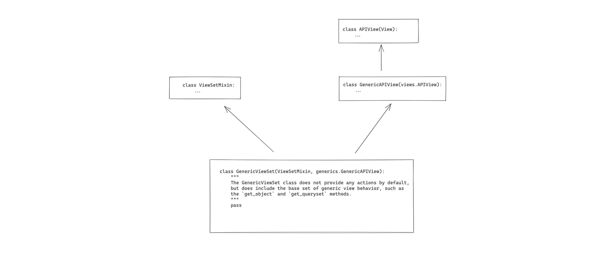
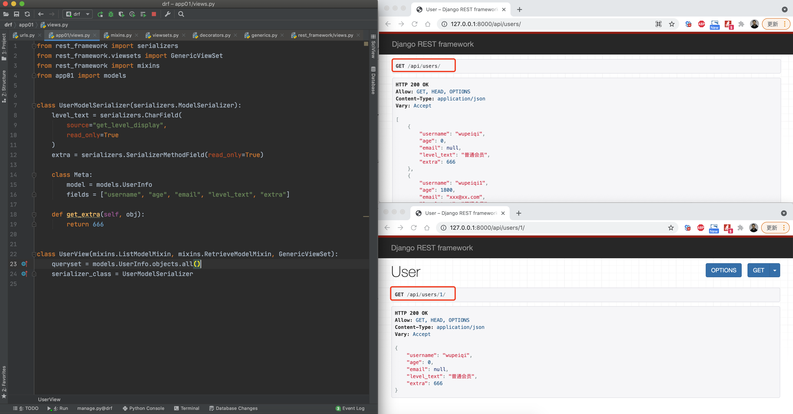
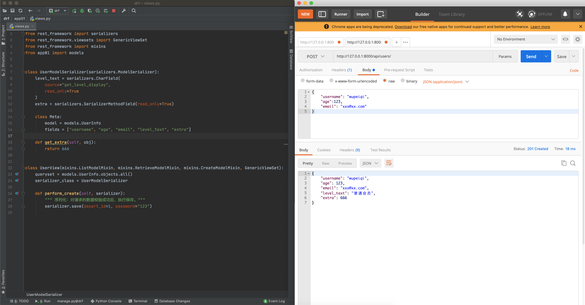
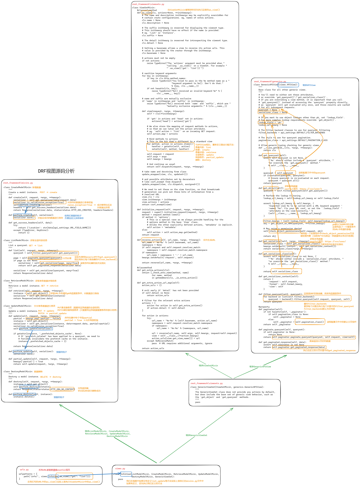
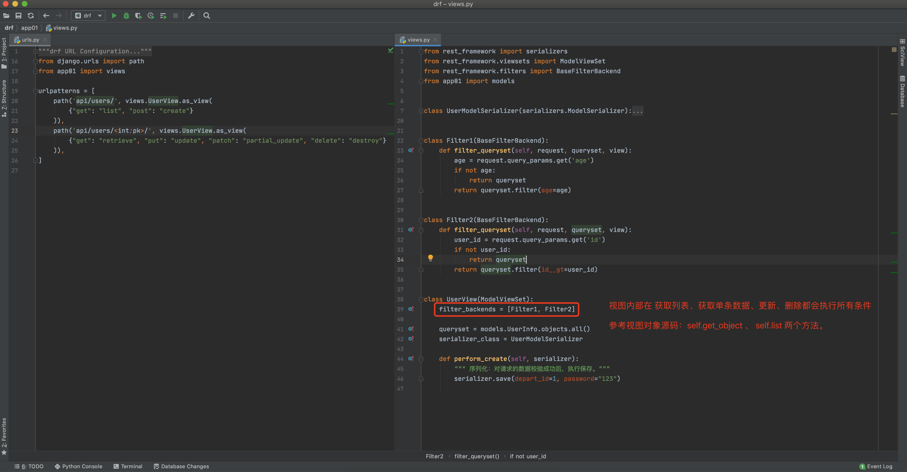

# DRF Views, Routing, and Filters

## 1. Views (*)

### 1.1 APIView

```python
class GenericAPIView(APIView):
    pass # 10功能

class GenericViewSet(xxxx.View-2个功能, GenericAPIView):
    pass # 5功能能

class UserView(GenericViewSet):
    def get(self,request):
        pass
```

`APIView` is the "top-level" view class in DRF. Internally, it mainly implements the use of DRF's basic components, such as versioning, authentication, permissions, throttling, and so on.

```python
# urls.py

from django.urls import path
from app01 import views

urlpatterns = [
    path('api/users/', views.UserView.as_view()),
    path('api/users/<int:pk>/', views.UserDetailView.as_view()),
]
```

```python
# views.py

from rest_framework.views import APIView
from rest_framework.response import Response

class UserView(APIView):
    
    # 认证、权限、限流等
    
    def get(self, request):
		# 业务逻辑：查看列表
        return Response({"code": 0, 'data': "..."})

    def post(self, request):
        # 业务逻辑：新建
        return Response({'code': 0, 'data': "..."})
    
class UserDetailView(APIView):
    
	# 认证、权限、限流等
        
    def get(self, request,pk):
		# 业务逻辑：查看某个数据的详细
        return Response({"code": 0, 'data': "..."})

    def put(self, request,pk):
        # 业务逻辑：全部修改
        return Response({'code': 0, 'data': "..."})
    
    def patch(self, request,pk):
        # 业务逻辑：局部修改
        return Response({'code': 0, 'data': "..."})
    
    def delete(self, request,pk):
        # 业务逻辑：删除
        return Response({'code': 0, 'data': "..."})
```


### 1.2 GenericAPIView

`GenericAPIView` inherits from `APIView` and adds some functionality on top of it, such as `get_queryset`, `get_object`, and so on.

In practice, developers usually don't inherit from it directly; it more often plays the role of a "middleman", providing common functionality to subclasses.


```python
# urls.py

from django.urls import path
from app01 import views

urlpatterns = [
    path('api/users/', views.UserView.as_view()),
    path('api/users/<int:pk>/', views.UserDetailView.as_view()),
]
```

```python
# views.py

from rest_framework.generics import GenericAPIView
from rest_framework.response import Response

class UserView(GenericAPIView):
    queryset = models.UserInfo.objects.filter(status=True)
    serializer_class = 序列化类
    
    def get(self, request):
        queryset = self.get_queryset()
        ser = self.get_serializer(intance=queryset,many=True)
        print(ser.data)
        return Response({"code": 0, 'data': "..."})    
```


Note: its greatest significance is extracting database queries and serializer classes into class variables, and later providing common `get`/`post`/`put`/`delete` methods, so developers only need to define the class variables and CRUD operations are implemented automatically.


### 1.3 GenericViewSet



The `GenericViewSet` class does not define any code itself; it simply inherits from `ViewSetMixin` and `GenericAPIView`, meaning its purpose is to combine the functionality of the two inherited classes into one.

`GenericViewSet` doesn't change much in the view, but it provides more functionality in the routing.

- `GenericAPIView`: extracts database queries and serializer class definitions into class variables for easier later handling.
- `ViewSetMixin`: maps methods such as `get`/`post`/`put`/`delete` to the `list`, `create`, `retrieve`, `update`, `partial_update`, and `destroy` methods, so the view no longer needs two classes.

```python
# urls.py

from django.urls import path, re_path, include
from app01 import views

urlpatterns = [
    path('api/users/', views.UserView.as_view({"get":"list","post":"create"})),
    path('api/users/<int:pk>/', views.UserView.as_view({"get":"retrieve","put":"update","patch":"partial_update","delete":"destory"})),
]
```

```python
# views.py

from rest_framework.viewsets import GenericViewSet
from rest_framework.response import Response

    
class UserView(GenericViewSet):
    
	# 认证、权限、限流等
    queryset = models.UserInfo.objects.filter(status=True)
    serializer_class = 序列化类
    
    def list(self, request):
		# 业务逻辑：查看列表
        queryset = self.get_queryset()
        ser = self.get_serializer(intance=queryset,many=True)
        print(ser.data)
        return Response({"code": 0, 'data': "..."})

    def create(self, request):
        # 业务逻辑：新建
        return Response({'code': 0, 'data': "..."})
    
    def retrieve(self, request,pk):
		# 业务逻辑：查看某个数据的详细
        return Response({"code": 0, 'data': "..."})

    def update(self, request,pk):
        # 业务逻辑：全部修改
        return Response({'code': 0, 'data': "..."})
    
    def partial_update(self, request,pk):
        # 业务逻辑：局部修改
        return Response({'code': 0, 'data': "..."})
    
    def destory(self, request,pk):
        # 业务逻辑：删除
        return Response({'code': 0, 'data': "..."})
```


Note: in development, it is also rarely inherited directly, because it also belongs to the "middleman" category — it just adds a mapping layer on top of the original `GenericAPIView`.


### 1.4 The Five Mixin Classes

DRF provides us with 5 classes for create, delete, update (including partial update), list retrieval, and single-object retrieval (they need to be used together with `GenericViewSet`).

```python
# urls.py

from django.urls import path, re_path, include
from app01 import views

urlpatterns = [
    path('api/users/', views.UserView.as_view({"get":"list","post":"create"})),
    path('api/users/<int:pk>/', views.UserView.as_view({"get":"retrieve","put":"update","patch":"partial_update","delete":"destroy"})),
]
```

```python
# views.py

from rest_framework.viewsets import GenericViewSet
from rest_framework.mixins import (
    ListModelMixin, CreateModelMixin, RetrieveModelMixin, UpdateModelMixin,
    DestroyModelMixin, ListModelMixin
)

class UserView(CreateModelMixin,RetrieveModelMixin, UpdateModelMixin, DestroyModelMixin,ListModelMixin,GenericViewSet):
    
	# 认证、权限、限流等
    queryset = models.UserInfo.objects.filter(status=True)
    serializer_class = 序列化类
```


These 5 classes already implement the `list`, `create`, `retrieve`, `update`, `partial_update`, and `destroy` methods for us, so we only need to define the class variables `queryset` and `serializer_class`.

**Example 1:**



```python
# urls.py

from django.urls import path
from app01 import views

urlpatterns = [
    path('api/users/', views.UserView.as_view({"get": "list"})),
    path('api/users/<int:pk>/', views.UserView.as_view({"get": "retrieve"})),
]
```

```python
# views.py

from rest_framework import serializers
from rest_framework.viewsets import GenericViewSet
from rest_framework import mixins
from app01 import models


class UserModelSerializer(serializers.ModelSerializer):
    level_text = serializers.CharField(
        source="get_level_display",
        read_only=True
    )
    extra = serializers.SerializerMethodField(read_only=True)

    class Meta:
        model = models.UserInfo
        fields = ["username", "age", "email", "level_text", "extra"]

    def get_extra(self, obj):
        return 666


class UserView(mixins.ListModelMixin, mixins.RetrieveModelMixin, GenericViewSet):
    queryset = models.UserInfo.objects.all()
    serializer_class = UserModelSerializer
```


**Example 2:**



```python
# urls.py

from django.urls import path
from app01 import views

urlpatterns = [
    path('api/users/', views.UserView.as_view({"get": "list", "post": "create"})),
    path('api/users/<int:pk>/', views.UserView.as_view({"get": "retrieve"})),
]
```

```python
# views.py

from rest_framework import serializers
from rest_framework.viewsets import GenericViewSet
from rest_framework import mixins
from app01 import models


class UserModelSerializer(serializers.ModelSerializer):
    level_text = serializers.CharField(
        source="get_level_display",
        read_only=True
    )
    extra = serializers.SerializerMethodField(read_only=True)

    class Meta:
        model = models.UserInfo
        fields = ["username", "age", "email", "level_text", "extra"]

    def get_extra(self, obj):
        return 666


class UserView(mixins.ListModelMixin, mixins.RetrieveModelMixin, mixins.CreateModelMixin, GenericViewSet):
    queryset = models.UserInfo.objects.all()
    serializer_class = UserModelSerializer

    def perform_create(self, serializer):
        """ 序列化：对请求的数据校验成功后，执行保存。"""
        serializer.save(depart_id=1, password="123")
```


**Example 3:**

```python
# urls.py

from django.urls import path
from app01 import views

urlpatterns = [
    path('api/users/', views.UserView.as_view(
        {"get": "list", "post": "create"}
    )),
    path('api/users/<int:pk>/', views.UserView.as_view(
        {"get": "retrieve", "put": "update", "patch": "partial_update", "delete": "destroy"}
    )),
]
```

```python
# views.py

from rest_framework import serializers
from rest_framework.viewsets import GenericViewSet
from rest_framework import mixins
from app01 import models


class UserModelSerializer(serializers.ModelSerializer):
    level_text = serializers.CharField(
        source="get_level_display",
        read_only=True
    )
    extra = serializers.SerializerMethodField(read_only=True)

    class Meta:
        model = models.UserInfo
        fields = ["username", "age", "email", "level_text", "extra"]

    def get_extra(self, obj):
        return 666


class UserView(mixins.ListModelMixin,
               mixins.RetrieveModelMixin,
               mixins.CreateModelMixin,
               mixins.UpdateModelMixin,
               mixins.DestroyModelMixin,
               GenericViewSet):
    queryset = models.UserInfo.objects.all()
    serializer_class = UserModelSerializer

    def perform_create(self, serializer):
        """ 序列化：对请求的数据校验成功后，执行保存。"""
        serializer.save(depart_id=1, password="123")
	
	def perform_update(self, serializer):
        serializer.save()
        
    def perform_destroy(self, instance):
        instance.delete()
```


**Example 4:**

```python
# urls.py

from django.urls import path
from app01 import views

urlpatterns = [
    path('api/users/', views.UserView.as_view(
        {"get": "list", "post": "create"}
    )),
    path('api/users/<int:pk>/', views.UserView.as_view(
        {"get": "retrieve", "put": "update", "patch": "partial_update", "delete": "destroy"}
    )),
]

```

```python
# views.py
from rest_framework import serializers
from rest_framework.viewsets import ModelViewSet
from app01 import models


class UserModelSerializer(serializers.ModelSerializer):
    level_text = serializers.CharField(
        source="get_level_display",
        read_only=True
    )
    extra = serializers.SerializerMethodField(read_only=True)

    class Meta:
        model = models.UserInfo
        fields = ["username", "age", "email", "level_text", "extra"]

    def get_extra(self, obj):
        return 666


class UserView(ModelViewSet):
    queryset = models.UserInfo.objects.all()
    serializer_class = UserModelSerializer

    def perform_create(self, serializer):
        """ 序列化：对请求的数据校验成功后，执行保存。"""
        serializer.save(depart_id=1, password="123")
```


In development, using the "five mixin classes" or `ModelViewSet` is quite common. If some of their built-in functionality is not sufficient, you can also override certain methods to extend them.


Question: DRF provides so many views — which one will be used more often going forward?

- If the endpoint is unrelated to database operations, directly inherit from `APIView`.

- If the endpoint needs to operate on the database, generally use `ModelViewSet` or `CreateModelMixin`, `ListModelMixin`, etc.

  ```
  - 利用钩子自定义功能。
  - 重写某个写方法，实现更加完善的功能。
  ```

- Depending on your company's conventions, customize based on `ModelViewSet` or `CreateModelMixin`, `ListModelMixin`, etc.


### Supplementary: Permissions

When defining a permission class earlier, the class can define two methods: `has_permission` and `has_object_permission`.

- `has_permission`: executed before the request enters the view.
- `has_object_permission`: called when `self.get_object` is invoked in the view (it is called when deleting, updating, or viewing an object), generally used to check whether the current user has permission to operate on a specific object.

```python
class PermissionA(BasePermission):
    message = {"code": 1003, 'data': "无权访问"}

    def has_permission(self, request, view):
        exists = request.user.roles.filter(title="员工").exists()
        if exists:
            return True
        return False

    def has_object_permission(self, request, view, obj):
        return True
```


Therefore, when writing view classes, if the class directly or indirectly inherits from `GenericAPIView` and internally calls the `get_object` method, then in the permission class you can use `has_object_permission` to handle permission checks.


### 1.5 Source Code Analysis




## 2. Routing

In earlier DRF development, we generally used two ways to configure routing:

- The view inherits from `APIView`.

  ```python
  from django.urls import path
  from app01 import views
  
  urlpatterns = [
      path('api/users/', views.UserView.as_view()),  # APIView
  ]
  ```

- The view inherits from `ViewSetMixin` (`GenericViewSet`, `ModelViewSet`).

  ```python
  from django.urls import path, re_path, include
  from app01 import views
  
  urlpatterns = [
      path('api/users/', views.UserView.as_view({"get":"list","post":"create"})),
      path('api/users/<int:pk>/', views.UserView.as_view({"get":"retrieve","put":"update","patch":"partial_update","delete":"destory"})),
  ]
  ```

  For this form of routing, DRF provides a simpler way:

  ```python
  from rest_framework import routers
  from app01 import views
  
  router = routers.SimpleRouter()				# routers.urls 所有的路由信息
  router.register(r'api/users', views.UserView)
  
  urlpatterns = [
      # 其他URL
      # path('xxxx/', xxxx.as_view()),
  ]
  
  urlpatterns += router.urls
  ```


You can also use `include` to add a prefix to the URL:

  ```python
  from django.urls import path, include
  from rest_framework import routers
  from app01 import views
  
  router = routers.SimpleRouter()
  router.register(r'users', views.UserView)
  
  urlpatterns = [
      path('api/', include((router.urls, 'app_name'), namespace='instance_name')),
      # 其他URL
      # path('forgot-password/', ForgotPasswordFormView.as_view()),
  ]
  ```


### Additional URLs

```python
from rest_framework.viewsets import ModelViewSet
from rest_framework.decorators import action


class XXXModelSerializer(serializers.ModelSerializer):
    class Meta:
        model = models.UserInfo
        fields = "__all__"

        
class XXXView(ModelViewSet):
    queryset = models.UserInfo.objects.all()
    serializer_class = XXXModelSerializer
	
    # detail=False: 生成URL时后面不带id
    # @action(detail=False, methods=['get'], url_path="yyy/(?P<xx>\d+)/xxx")
    # def get_password(self, request, xx, pk=None):
    #     print(xx)
    #     return Response("...")

    # @action(detail=True, methods=['get'], url_path="yyy/(?P<xx>\d+)/xxx")
    # def set_password(self, request, xx, pk=None):
    #     print(xx)
    #     return Response("...")
```


## 3. Filters (Conditional Search)

If an API needs to pass some conditions for searching, you can simply pass parameters via GET after the URL. For example:

```
/api/users?age=19&category=12
```

DRF also has corresponding components that support conditional search.

### 3.1 Custom Filter (Recommended)



```python
# urls.py

from django.urls import path
from app01 import views

urlpatterns = [
    path('api/users/', views.UserView.as_view(
        {"get": "list", "post": "create"}
    )),
    path('api/users/<int:pk>/', views.UserView.as_view(
        {"get": "retrieve", "put": "update", "patch": "partial_update", "delete": "destroy"}
    )),
]
```

```python
# views.py

from rest_framework import serializers
from rest_framework.viewsets import ModelViewSet
from rest_framework.filters import BaseFilterBackend
from app01 import models


class UserModelSerializer(serializers.ModelSerializer):
    level_text = serializers.CharField(
        source="get_level_display",
        read_only=True
    )
    extra = serializers.SerializerMethodField(read_only=True)

    class Meta:
        model = models.UserInfo
        fields = ["username", "age", "email", "level_text", "extra"]

    def get_extra(self, obj):
        return 666


class MyBaseFilterBackend1(BaseFilterBackend):
    def filter_queryset(self, request, queryset, view):
        age = request.query_params.get('age')
        if not age:
            return queryset
        return queryset.filter(age=age)


class MyBaseFilterBackend2(BaseFilterBackend):
    def filter_queryset(self, request, queryset, view):
        user_id = request.query_params.get('id')
        if not user_id:
            return queryset
        return queryset.filter(id__gt=user_id)


class UserView(ModelViewSet):
    filter_backends = [MyBaseFilterBackend1, MyBaseFilterBackend2]

    queryset = models.UserInfo.objects.all()
    serializer_class = UserModelSerializer

    def perform_create(self, serializer):
        """ 序列化：对请求的数据校验成功后，执行保存。"""
        serializer.save(depart_id=1, password="123")
```


### 3.2 Third-Party Filter

In DRF development, there is a commonly used third-party filter: `DjangoFilterBackend`.

```
pip install django-filter
```

Register the app:

```python
INSTALLED_APPS = [
    ...
    'django_filters',
    ...
]
```

View configuration and usage (Example 1):

```python
# views.py
from rest_framework import serializers
from rest_framework.viewsets import ModelViewSet
from django_filters.rest_framework import DjangoFilterBackend
from app01 import models


class UserModelSerializer(serializers.ModelSerializer):
    level_text = serializers.CharField(
        source="get_level_display",
        read_only=True
    )
    extra = serializers.SerializerMethodField(read_only=True)

    class Meta:
        model = models.UserInfo
        fields = ["username", "age", "email", "level_text", "extra"]

    def get_extra(self, obj):
        return 666


class UserView(ModelViewSet):
    filter_backends = [DjangoFilterBackend, ]
    filterset_fields = ["id", "age", "email"]

    queryset = models.UserInfo.objects.all()
    serializer_class = UserModelSerializer

    def perform_create(self, serializer):
        """ 序列化：对请求的数据校验成功后，执行保存。"""
        serializer.save(depart_id=1, password="123")
```


View configuration and usage (Example 2):

```python
from rest_framework import serializers
from rest_framework.viewsets import ModelViewSet
from django_filters.rest_framework import DjangoFilterBackend
from django_filters import FilterSet, filters
from app01 import models


class UserModelSerializer(serializers.ModelSerializer):
    level_text = serializers.CharField(
        source="get_level_display",
        read_only=True
    )
    depart_title = serializers.CharField(
        source="depart.title",
        read_only=True
    )
    extra = serializers.SerializerMethodField(read_only=True)

    class Meta:
        model = models.UserInfo
        fields = ["id", "username", "age", "email", "level_text", "extra", "depart_title"]

    def get_extra(self, obj):
        return 666


class MyFilterSet(FilterSet):
    depart = filters.CharFilter(field_name="depart__title", lookup_expr="exact")
    min_id = filters.NumberFilter(field_name='id', lookup_expr='gte')

    class Meta:
        model = models.UserInfo
        fields = ["min_id", "depart"]


class UserView(ModelViewSet):
    filter_backends = [DjangoFilterBackend, ]
    filterset_class = MyFilterSet

    queryset = models.UserInfo.objects.all()
    serializer_class = UserModelSerializer

    def perform_create(self, serializer):
        """ 序列化：对请求的数据校验成功后，执行保存。"""
        serializer.save(depart_id=1, password="123")

```


View configuration and usage (Example 3):

```python
from rest_framework import serializers
from rest_framework.viewsets import ModelViewSet
from django_filters.rest_framework import DjangoFilterBackend, OrderingFilter
from django_filters import FilterSet, filters
from app01 import models


class UserModelSerializer(serializers.ModelSerializer):
    level_text = serializers.CharField(
        source="get_level_display",
        read_only=True
    )
    depart_title = serializers.CharField(
        source="depart.title",
        read_only=True
    )
    extra = serializers.SerializerMethodField(read_only=True)

    class Meta:
        model = models.UserInfo
        fields = ["id", "username", "age", "email", "level_text", "extra", "depart_title"]

    def get_extra(self, obj):
        return 666


class MyFilterSet(FilterSet):
    # /api/users/?min_id=2  -> id>=2
    min_id = filters.NumberFilter(field_name='id', lookup_expr='gte')

    # /api/users/?name=zhangsan  -> not ( username=zhangsan )
    name = filters.CharFilter(field_name="username", lookup_expr="exact", exclude=True)

    # /api/users/?depart=xx     -> depart__title like %xx%
    depart = filters.CharFilter(field_name="depart__title", lookup_expr="contains")

    # /api/users/?token=true      -> "token" IS NULL
    # /api/users/?token=false     -> "token" IS NOT NULL
    token = filters.BooleanFilter(field_name="token", lookup_expr="isnull")

    # /api/users/?email=xx     -> email like xx%
    email = filters.CharFilter(field_name="email", lookup_expr="startswith")

    # /api/users/?level=2&level=1   -> "level" = 1 OR "level" = 2（必须的是存在的数据，否则报错-->内部有校验机制）
    # level = filters.AllValuesMultipleFilter(field_name="level", lookup_expr="exact")
    level = filters.MultipleChoiceFilter(field_name="level", lookup_expr="exact", choices=models.UserInfo.level_choices)

    # /api/users/?age=18,20     -> age in [18,20]
    age = filters.BaseInFilter(field_name='age', lookup_expr="in")

    # /api/users/?range_id_max=10&range_id_min=1    -> id BETWEEN 1 AND 10
    range_id = filters.NumericRangeFilter(field_name='id', lookup_expr='range')

    # /api/users/?ordering=id     -> order by id asc
    # /api/users/?ordering=-id     -> order by id desc
    # /api/users/?ordering=age     -> order by age asc
    # /api/users/?ordering=-age     -> order by age desc
    ordering = filters.OrderingFilter(fields=["id", "age"])

    # /api/users/?size=1     -> limit 1（自定义搜索）
    size = filters.CharFilter(method='filter_size', distinct=False, required=False)
    
    class Meta:
        model = models.UserInfo
        fields = ["id", "min_id", "name", "depart", "email", "level", "age", 'range_id', "size", "ordering"]

    def filter_size(self, queryset, name, value):
        int_value = int(value)
        return queryset[0:int_value]


class UserView(ModelViewSet):
    filter_backends = [DjangoFilterBackend, ]
    filterset_class = MyFilterSet

    queryset = models.UserInfo.objects.all()
    serializer_class = UserModelSerializer

    def perform_create(self, serializer):
        """ 序列化：对请求的数据校验成功后，执行保存。"""
        serializer.save(depart_id=1, password="123")

```

`lookup_expr` has many common choices:

```python
'exact': _(''),
'iexact': _(''),

'contains': _('contains'),
'icontains': _('contains'),
'startswith': _('starts with'),
'istartswith': _('starts with'),
'endswith': _('ends with'),  
'iendswith': _('ends with'),
    
'gt': _('is greater than'),
'gte': _('is greater than or equal to'),
'lt': _('is less than'),
'lte': _('is less than or equal to'),

'in': _('is in'),
'range': _('is in range'),
'isnull': _(''),
```


Global configuration and usage:

```python
# settings.py 全局配置

REST_FRAMEWORK = {
    'DEFAULT_FILTER_BACKENDS': ['django_filters.rest_framework.DjangoFilterBackend',]
}
```

### 4.3 Built-in Filters

DRF's source code includes 2 built-in filters:

- OrderingFilter: supports ordering.

  ```python
  from rest_framework import serializers
  from rest_framework.viewsets import ModelViewSet
  from app01 import models
  from rest_framework.filters import OrderingFilter
  
  
  class UserModelSerializer(serializers.ModelSerializer):
      level_text = serializers.CharField(
          source="get_level_display",
          read_only=True
      )
      depart_title = serializers.CharField(
          source="depart.title",
          read_only=True
      )
      extra = serializers.SerializerMethodField(read_only=True)
  
      class Meta:
          model = models.UserInfo
          fields = ["id", "username", "age", "email", "level_text", "extra", "depart_title"]
  
      def get_extra(self, obj):
          return 666
  
  
  class UserView(ModelViewSet):
      filter_backends = [OrderingFilter, ]
      # ?order=id
      # ?order=-id
      # ?order=age
      ordering_fields = ["id", "age"]
  
      queryset = models.UserInfo.objects.all()
      serializer_class = UserModelSerializer
  
      def perform_create(self, serializer):
          """ 序列化：对请求的数据校验成功后，执行保存。"""
          serializer.save(depart_id=1, password="123")
  ```

- SearchFilter: supports fuzzy search.

  ```python
  from rest_framework import serializers
  from rest_framework.viewsets import ModelViewSet
  from app01 import models
  from rest_framework.filters import SearchFilter
  
  
  class UserModelSerializer(serializers.ModelSerializer):
      level_text = serializers.CharField(
          source="get_level_display",
          read_only=True
      )
      depart_title = serializers.CharField(
          source="depart.title",
          read_only=True
      )
      extra = serializers.SerializerMethodField(read_only=True)
  
      class Meta:
          model = models.UserInfo
          fields = ["id", "username", "age", "email", "level_text", "extra", "depart_title"]
  
      def get_extra(self, obj):
          return 666
  
  
  class UserView(ModelViewSet):
      # ?search=张%三
      filter_backends = [SearchFilter, ]
      search_fields = ["id", "username", "age"]
  
      queryset = models.UserInfo.objects.all()
      serializer_class = UserModelSerializer
  
      def perform_create(self, serializer):
          """ 序列化：对请求的数据校验成功后，执行保存。"""
          serializer.save(depart_id=1, password="123")
  
  ```

  ```python
  "app01_userinfo"."id" LIKE %张三% ESCAPE '\' 
  OR 
  "app01_userinfo"."username" LIKE %张三% ESCAPE '\' 
  OR 
  "app01_userinfo"."age" LIKE %张三% ESCAPE '\'
  ```
