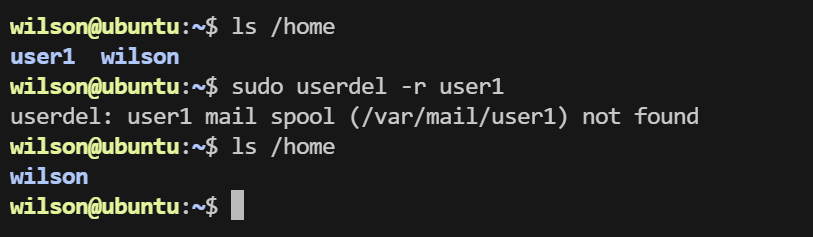

# Linux Commands

## User Configuration

- Superuser (root): the command prompt is **#**; can do anything on a Linux system without restrictions
- Normal user: the command prompt is **$**; operations on the Linux system are restricted

On a fresh system, the root user has no password. Use `sudo passwd root` to set a password for the root user.

`sudo` privilege escalation: when used, the identity changes from a normal user -> root

Switch user: `su 【username】`; if no username is given, it switches to the root user by default.

Exit the root user: `exit`

### Adding a User

`sudo useradd -m user1 -s /bin/bash`

The system will create a directory named user1 under the directory "/home".
- `-m` create the home directory
- `-s` specify the shell to use (bash is the most popular shell in the industry)

### Configuring a Password

`sudo passwd user1`

Once the password is set, user1 can log in to the server with their own username and password.

### Deleting a User

`sudo userdel -r user1`

## Directory and File Operations

### Viewing Files and Directories

`ls` lists all sub-files and sub-directories in the specified directory

`ls -a` shows all sub-directories and files in the specified directory (including hidden files, e.g. those starting with a dot)

`ls -l` lists detailed information for all directories and files in the specified directory

`ls -l /home/wilson` — the details shown on each line are, in order:

File type and permissions  Number of hard links  File owner  File group  File size  Last modified time  File name

Linux does not distinguish file types by extension. The 9 characters at the end represent the file's access permissions, grouped into 3 groups of 3 bits each.

The first group represents the creator's permissions, the second group the permissions of users in the same group, and the third group the permissions of other users. The three characters in each group represent read, write, and execute permissions on the file, respectively.

The permissions are: r (read), w (write), x (execute), - (no permission). Each group can be represented by a number, e.g. r-x:5, rw-:6, r--:4, so the three groups can be represented by three numbers, e.g. rwxr-xr-x:755, rw-r--r--:644.

### Changing the Working Directory

`cd` changes the working directory

`cd ~` switches to your own working directory /home/wilson

`cd /` switches to the root directory

`cd -` switches to the previous directory

`. ` represents the current directory

### Viewing the Current Working Directory

`pwd` shows the current directory

### Creating and Deleting Directories

`mkdir dir` creates a folder named dir; if you use `sudo mkdir`, the creator of the folder is root

`rmdir` deletes files — as long as you have delete permission on the current file or folder, you can delete it, regardless of who owns the file

`rm -r` deletes a folder

`rm -r *` deletes all files in a folder

`rm -rf` deletes all files in a folder without any confirmation prompt

### Copying Files and Directories

`cp file1 file2` copies the specified source file to the target file, or copies multiple source files to the target directory

`cp -i file1 day/` copies file1 to the day folder; if a file with the same name already exists, you will be prompted

`cp -r /home/wilson /home/wilson1` to copy a directory; this copies the sub-directories and files inside it as well, and the target must also be a directory

### Moving Files

`mv /home/file1 .` moves file1 from the home folder to the current directory

### Showing the Directory Structure

### Changing Directory or File Permissions

`chmod` controls access permissions for files or directories

**Numeric method**

First understand what the numeric attributes mean: 0 means no permission, 1 means execute permission, 2 means write permission, 4 means read permission, and then add them up. So the numeric attribute format should be three octal numbers from 0 to 7, in the order (u)(g)(o). For example, if you want the owner of a file to have both "read/write" permissions, you add 4 (read) + 2 (write) = 6 (read/write).

For example: after running `chmod 644 hello.txt` you get `-rw-r--r-- 1 wilson wilson    6 Jun 18`

`22:47 hello.txt`

- The file owner (wilson) has read and write permissions
- Users in the same group as the owner have read permission
- Other users have read permission

### Finding Files

The find search criteria can be a compound condition made up of the logical operators not, and, or.

- and: logical AND, represented by `-a` in commands; the search condition is satisfied only when all given conditions are met
- or: logical OR, represented by `-o` in commands; the search condition is satisfied as long as any one of the given conditions is met
- not: logical NOT, represented by `!` in commands; finds files that do not satisfy the given conditions

Common search criteria

- `-empty` find files with a size of 0 or empty directories

- `-perm` find files and directories with the specified permissions; permissions can be expressed like 711, 644

- `-mmin n` find all files whose content was modified n minutes ago

  `find . -mmin -60` find files modified in the past 60 minutes

- `-mtime n` find all files whose content was modified n days ago

- `-xargs` execute the given Linux command on the matching files without asking the user whether to run it

  `find . -empty|xargs rm -rf` find all empty files and empty folders and delete them

- `-size` find files of the specified size; + means larger than, - means smaller than

  `find . -size +10M` find all files larger than 10M

### Listing Overall Disk Space Usage of the File System

`df -h`

### Showing Disk Usage of Each File and Directory

`du -h`

`--max-depth=0` controls the depth, i.e. how many levels of sub-directories to descend into; it is usually set to `--max-depth=1`

When running, every level of the directory is shown; if you only want to show the current directory, use `du -h --max-depth=1 /home/wilson`

### Viewing Files

`cat hello.txt` view the hello.txt file

`cat file1 > file2` redirect output

`echo wilson >> file1` append output

`touch a.txt` create an empty file a.txt

`head -n 10 main.cc` view the first 10 lines of main.cc

`tail -n 10 main.cc` view the last 10 lines of main.cc

`wc -l hello.txt` view the total number of lines in hello.txt

### Searching File Content

grep is a filter that searches for a specified character pattern in files and displays all lines containing that pattern

The pattern being searched for is called a regular expression

`grep hello file1` search for hello in file1 and display the line containing hello

Regular expressions:

- `^`: matches the start, e.g. `ls -l|grep ^d` shows detailed information of all sub-directories in the current directory
- `$`: matches the end, e.g. `ls -l|grep c$` shows files in the current directory ending with c

`grep -n` prepends the line number of the match to the output

## Archive Management

### tar Compression and Packaging

Common parameters:

- c: create a new archive file.
- x: extract files from an archive file.
- f: use the archive file or device.
- v: display the files being processed during archiving.
- z: compress/decompress files with gzip, the suffix is .gz; adding this option compresses the archive file.

For example: `tar czvf source.tar.gz /home/wilson/*` compresses all files under the wilson folder

### `gzip` Decompression

Common parameters:

- -d: decompress the compressed file.
- -v: display the files being decompressed or compressed during the process.

### scp Remote Copy

`scp filename username@ip:path`

- filename: the name of the file
- username: the username on the destination host
- ip: the IP of the destination host
- path: the path on the destination host

`scp file3 king@192.168.4.52:~/` copy from the local machine to another machine

`scp king@192.168.4.52:~/file3 .` copy from another machine to the local machine

If you are copying a folder with scp, you need to add `-r`.

### Passwordless Login

- `ssh-keygen` generates a private key and a public key
    - Linux path: ~/.ssh
    - Windows path: C:\Users\Administrator\.ssh
- `ssh-copy-id wilson@192.168.43.142` copies the public key to the server's authorized_keys

Principle:

[SSH connection process](https://ld246.com/article/1640830873031)

## Shortcuts

Ctrl a cursor returns to the beginning of the line

Ctrl e cursor returns to the end of the line
