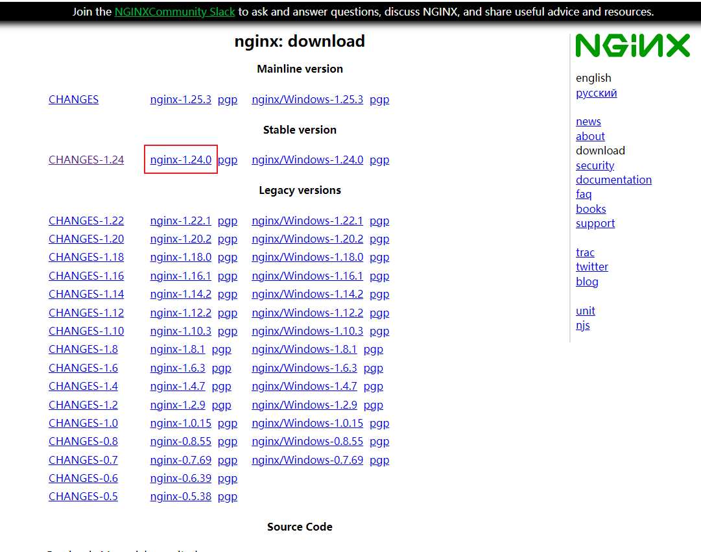
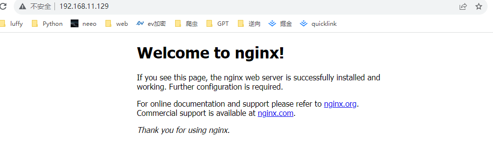

# Nginx 1.24.0 Installation (CentOS 7)

## 0 Download Dependencies

```bash
yum update -y
yum -y install gcc gcc-c++ pcre pcre-devel  zlib zlib-devel openssl openssl-devel libxml2-devel libxslt-devel gd-devel GeoIP-devel jemalloc-devel libatomic_ops-devel perl-devel  perl-ExtUtils-Embed
 
#安装Nginx需要先将官网下载的源码进行编译，依赖gcc环境
 
#PCRE是一个perl库，包括perl兼容的正则表达式库。Nginx的http模块使用pcre库来解析正则表达式 
 
#zlib库提供很多种压缩解压缩方式，Nginx使用zlib对http包的内容进行gzip
 
#OpenSSL是一个强大的安全套接字层密码库，囊括主要的密码算法、常用的秘钥和证书封装管理功能及
SSL协议，并提供丰富的应用程序供测试或其它目的使用。Nginx不仅支持http协议，还支持HTTPS协议
（即在SSL协议上传输http）。
```

## 1 Download

Go to this link: <https://nginx.org/en/download.html>



```bash
cd /opt
wget https://nginx.org/download/nginx-1.24.0.tar.gz
ls

[root@cs opt]# ls
nginx-1.24.0.tar.gz
```

## 2 Extract

```bash
cd /opt
tar -zxvf nginx-1.24.0.tar.gz
```

## 3 Compile and Install — I followed Method 3

Note: nginx's extraction directory and compilation directory cannot be the same folder.

### Method 1: Install everything with the default settings:

```bash
cd /opt/nginx-1.24.0
./configure && make && make install

# 这种方式nginx的安装目录为/usr/local/nginx
```

### Method 2: Compile with the defaults, and specify the installation directory:

```bash
cd /opt
mkdir my_nginx
cd /opt/nginx-1.24.0
./configure --prefix=/opt/my_nginx --with-http_stub_status_module --with-http_ssl_module
```

When there are no errors:

```bash
Configuration summary
  + using system PCRE library
  + using system OpenSSL library
  + using system zlib library

  nginx path prefix: "/opt/my_nginx"
  nginx binary file: "/opt/my_nginx/sbin/nginx"
  nginx modules path: "/opt/my_nginx/modules"
  nginx configuration prefix: "/opt/my_nginx/conf"
  nginx configuration file: "/opt/my_nginx/conf/nginx.conf"
  nginx pid file: "/opt/my_nginx/logs/nginx.pid"
  nginx error log file: "/opt/my_nginx/logs/error.log"
  nginx http access log file: "/opt/my_nginx/logs/access.log"
  nginx http client request body temporary files: "client_body_temp"
  nginx http proxy temporary files: "proxy_temp"
  nginx http fastcgi temporary files: "fastcgi_temp"
  nginx http uwsgi temporary files: "uwsgi_temp"
  nginx http scgi temporary files: "scgi_temp"
```

Next, compile and install:

```bash
make -j$(nproc) && make install -j$(nproc)
```

Take a look at the installation directory:

```bash
cd /opt/my_nginx
ls

[root@cs my_nginx]# ls
client_body_temp  fastcgi_temp  logs     proxy_temp  scgi_temp
conf              html          modules  sbin        uwsgi_temp
```

In the nginx installation directory:

-   conf: directory that stores nginx configuration files
-   logs: directory that stores nginx logs
-   sbin: directory that stores nginx executable scripts
-   html: directory that stores nginx website sites and static resources

Now that we know the purpose of the main directories, we can start nginx.

```bash
cd /opt/my_nginx/sbin
./nginx
ps -ef|grep nginx

[root@cs sbin]# ps -ef|grep nginx
root      39441      1  0 22:37 ?        00:00:00 nginx: master process ./nginx
nobody    39442  39441  0 22:37 ?        00:00:00 nginx: worker process
root      39444  73894  0 22:37 pts/1    00:00:00 grep --color=auto nginx
```

You can see it by visiting your IP address directly in the browser:



If you want to be able to start nginx by typing `nginx` from any directory, you also need to configure nginx's environment variables.

## 4 Configure the nginx Environment Variables

```bash
echo "export PATH=/opt/my_nginx/sbin:\$PATH" >> /etc/profile
source /etc/profile
```

At this point, you can start nginx from anywhere.

## 5 Configure the Startup Method

### 5.1 Start Directly with the nginx Command

```bash
# 直接输入nginx来启动，但只能首次启动nginx使用，因为重复启动的话，会提示80端口已被占用
nginx

# 查看nginx相关进程
ps -ef | grep nginx

# 查看NGINX监听的端口
netstat -tunlp | grep nginx

# 平滑重启nginx，也就是重新读取nginx的配置文件，而不是重启进程
nginx -s reload

# 确认nginx配置文件是否正确的
nginx -t 
# 停止nginx， 杀死nginx进程
nginx -s stop
```

### 5.2 Configure systemctl to Manage nginx

systemd configuration file notes:

-   Each Unit needs a configuration file to tell systemd how to manage the service.
-   Configuration files are stored in /usr/lib/systemd/system/; after enabling startup at boot, a symbolic link file is created in the /etc/systemd/system directory.
-   Each Unit's configuration file has a default suffix of .service.
-   The /usr/lib/systemd/system/ directory is divided into system and user sub-directories; programs that should run at boot without logging in are generally placed in the system services, i.e. /usr/lib/systemd/system.
-   Configuration files are divided into multiple sections using square brackets, and are case-sensitive.

Let's configure it:

```bash
cat >/lib/systemd/system/nginx.service<<EOF
[Unit]
Description=nginx
After=network.target
 
[Service]
Type=forking
ExecStartPre=/opt/my_nginx/sbin/nginx -t -c /opt/my_nginx/conf/nginx.conf
ExecStart=/opt/my_nginx/sbin/nginx -c /opt/my_nginx/conf/nginx.conf
ExecReload=/opt/my_nginx/sbin/nginx -s reload
ExecStop=/opt/my_nginx/sbin/nginx -s stop
PrivateTmp=true
[Install]
WantedBy=multi-user.target
EOF
cat /lib/systemd/system/nginx.service
```

Annotated version:

```bash
cat >/lib/systemd/system/nginx.service<<EOF
[Unit]     # 记录service文件的通用信息
Description=nginx    # Nginx服务描述信息
After=network.target    # Nginx服务启动依赖，在指定服务之后启动
[Service]    # 记录service文件的service信息
Type=forking    # 标准UNIX Daemon使用的启动方式
ExecStartPre=/opt/my_nginx/sbin/nginx -t -c /opt/my_nginx/conf/nginx.conf
ExecStart=/opt/my_nginx/sbin/nginx -c /opt/my_nginx/conf/nginx.conf
ExecReload=/opt/my_nginx/sbin/nginx -s reload
ExecStop=/opt/my_nginx/sbin/nginx -s stop
PrivateTmp=true
[Install]    # 记录service文件的安装信息
WantedBy=multi-user.target    # 多用户环境下启用
EOF
cat /lib/systemd/system/nginx.service
```

Then run the following commands:

```bash
pkill nginx
systemctl daemon-reload
systemctl start nginx
systemctl status nginx
systemctl stop nginx
```
