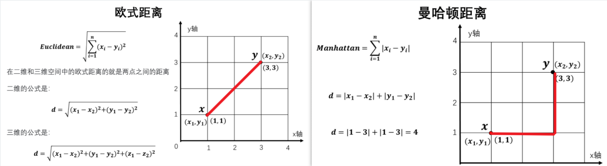
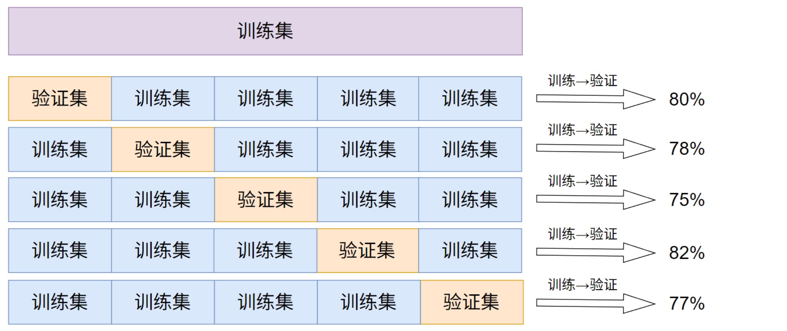
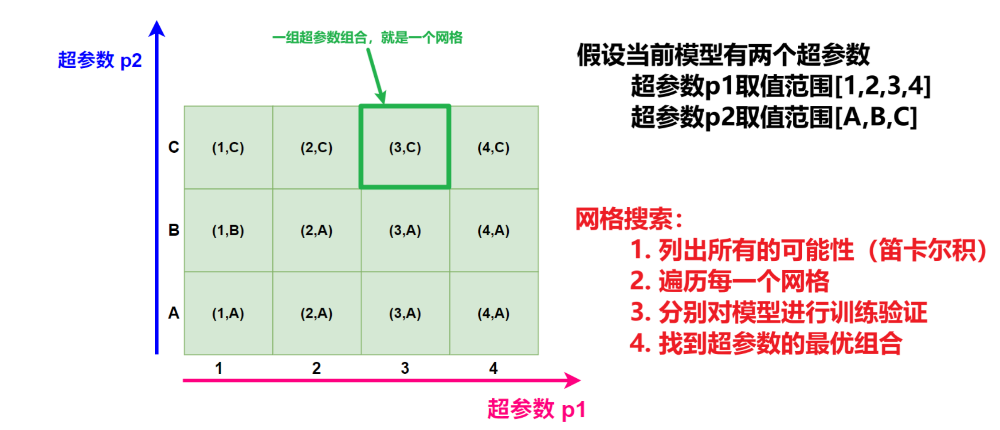
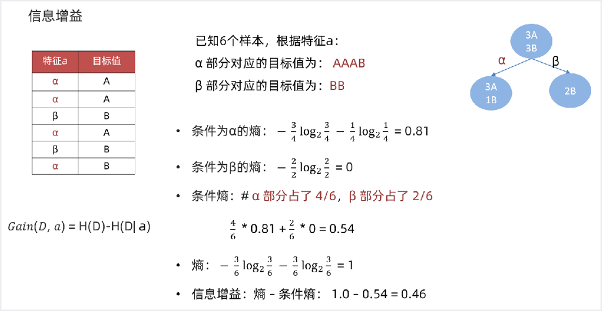
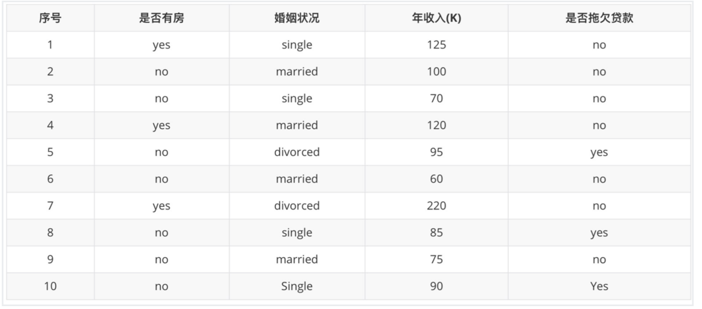
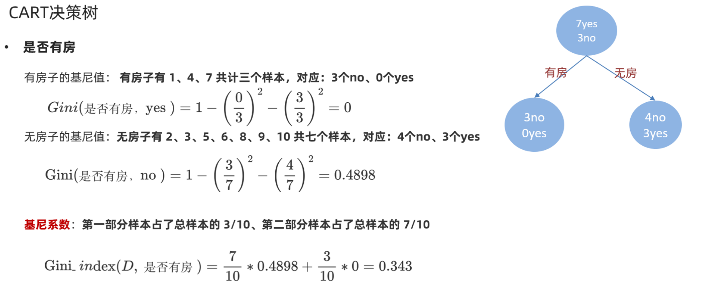
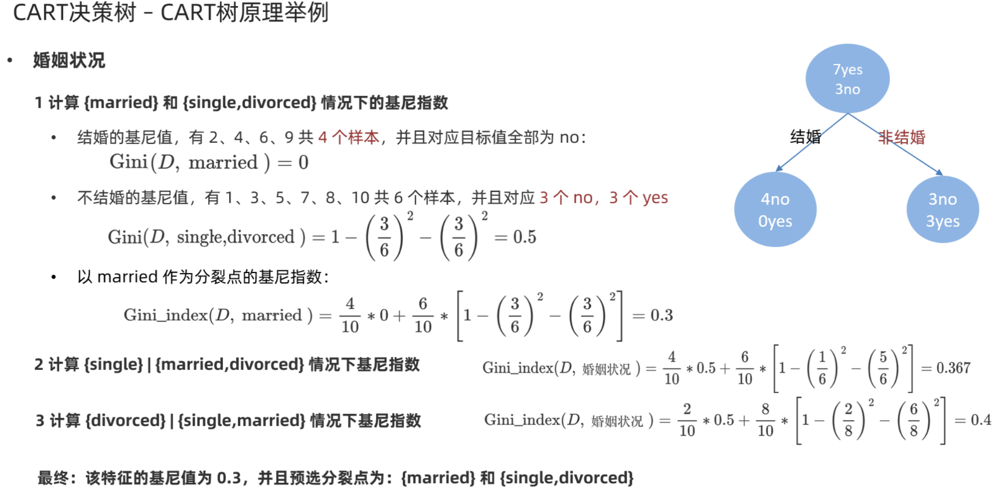
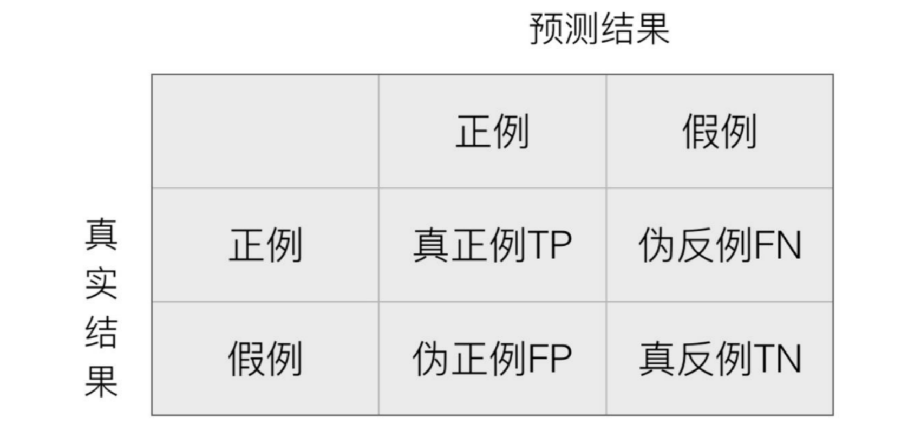

# Classification Algorithms

## KNN (K-Nearest Neighbors)

KNN is a supervised learning algorithm that can be used for both classification and regression tasks.

Core idea: If most of the k most similar samples of a sample in feature space belong to a certain category, then this sample also belongs to that category.

### Distance Calculation

- Euclidean distance (most commonly used)
- Manhattan distance



> 📖 **Euclidean vs Manhattan distance — understand it through "walking"**
>
> **Euclidean distance = straight-line distance (how a bird flies)**
> $$d_{欧} = \sqrt{(x_1-x_2)^2 + (y_1-y_2)^2}$$
> From point A(1,1) to point B(4,5): $d = \sqrt{(4-1)^2 + (5-1)^2} = \sqrt{9+16} = \sqrt{25} = 5$
>
> **Manhattan distance = block distance (how a person walks)**
> $$d_{曼} = |x_1-x_2| + |y_1-y_2|$$
> From point A(1,1) to point B(4,5): $d = |4-1| + |5-1| = 3+4 = 7$
>
> Manhattan distance is named after the grid-like streets of Manhattan in New York — you cannot walk straight through buildings; you can only walk along streets horizontally and vertically. In machine learning, Euclidean distance is more commonly used when the differences between features are large, while Manhattan distance is less sensitive to outliers.

### API

```python
from sklearn.neighbors import KNeighborsClassifier  # KNN分类算法
from sklearn.neighbors import KNeighborsRegressor  # KNN回归算法

#  创建对象		
estimator = KNeighborsClassifier(n_neighbors=3)  # 创建一个KNN分类模型对象， K值取3

# 模型训练		
estimator.fit(X_train, y_train)  # X_train: 训练集特征， y_train：训练集标签

# 结果预测		
y_predict = estimator.predict(X_test)  # X_test: 测试集特征， y_predict：测试集的预测结果
# 模型评估		
score = estimator.score(X_test, y_test)  # score: 准确率	X_test: 测试集特征，y_test: 测试集标签
```

### Example - Facebook Check-in Prediction

[Facebook V: Predicting Check Ins | Kaggle](https://www.kaggle.com/competitions/facebook-v-predicting-check-ins/overview)

```python
import pandas as pd
from sklearn.model_selection import train_test_split
from sklearn.neighbors import KNeighborsClassifier
from sklearn.metrics import accuracy_score
from sklearn.preprocessing import StandardScaler

# 读取数据
data = pd.read_csv('./data/FBlocation/train.csv')

# 过滤条件
filtered_data = data[(data['x'] > 1.0) & (data['x'] < 1.25) & (data['y'] > 2.5) & (data['y'] < 2.75)].copy()
print(filtered_data.shape)
print(filtered_data.dtypes)
print(filtered_data.columns)

# 处理时间特征，time 列是距离1970年1月1号的分钟数
if 'time' in filtered_data.columns:
    # 将 time 列转换为 pandas 的 datetime 类型（单位为分钟，从1970-01-01开始）
    filtered_data['datetime'] = pd.to_datetime(filtered_data['time'], unit='m', origin='1970-01-01')
    filtered_data['hour'] = filtered_data['datetime'].dt.hour
    filtered_data['day'] = filtered_data['datetime'].dt.dayofweek  # 0=Monday
    filtered_data['month'] = filtered_data['datetime'].dt.month

# 只保留去该place_id人数大于3的记录
place_counts = filtered_data['place_id'].value_counts()
valid_places = place_counts[place_counts > 3].index
filtered_data = filtered_data[filtered_data['place_id'].isin(valid_places)].copy()
print(filtered_data.shape)

# 选择特征列和目标列，可以根据数据适当调整
features = ['x', 'y', 'accuracy', 'hour', 'day', 'month']

X = filtered_data[features]
y = filtered_data['place_id']

# 划分训练集和测试集
X_train, X_test, y_train, y_test = train_test_split(X, y, test_size=0.2, random_state=42)

# 对特征进行标准化
scaler = StandardScaler()
X_train = scaler.fit_transform(X_train)  # 使用训练集来计算 均值和方差
X_test = scaler.transform(X_test)  # 使用训练集的均值和方差来标准化测试集

# KNN建模
knn = KNeighborsClassifier(n_neighbors=3)
knn.fit(X_train, y_train)

# 预测
y_pred = knn.predict(X_test)

# 评估
accuracy = accuracy_score(y_test, y_pred)
print(f"KNN预测准确率: {accuracy:.4f}")
```

## Cross Validation + Grid Search

### Hyperparameters

Hyperparameters: In machine learning and deep learning, **hyperparameters** are parameters set manually before the algorithm runs, used to control the behavior and performance of the model.

**Cross Validation**: split the training set into multiple subsets, use one subset as the validation set (test set) in turn while the rest are used as the training set, and finally take the average performance metric to ensure the stability of model evaluation.



The purpose of cross validation is actually to reduce the randomness of the results, thereby improving the accuracy and credibility of the model.

> 📖 **Cross validation — understand it through "mock exams"**
>
> Suppose you have 10 years of past exam papers (training set), and you want to know your real level:
>
> - **Without cross validation**: use the first 8 papers to study, and the last 2 for testing → if the last 2 happen to be hard problems, your score will be underestimated
> - **5-fold cross validation**: split the 10 papers into 5 groups (2 per group), take turns using 1 group for testing and the remaining 4 for training, then average the 5 scores → more objective!
>
> Each "fold" is one cycle of "mock exam + reviewing with the other problems". cv=5 means 5-fold cross validation.
>
> In sklearn, setting `cv=5` means the same process is repeated 5 times, using a different validation set each time.

**Grid Search**: Grid search is an exhaustive search method that finds the optimal hyperparameters by traversing all possible combinations of hyperparameters.

> 📖 **Grid search — understand it through "finding the best recipe"**
>
> You want to find the best-tasting lemonade recipe, with two variables: the amount of sugar and the amount of lemon.
>
> - Sugar amounts to try: 1 spoon, 2 spoons, 3 spoons
> - Lemon amounts to try: 1, 2
> - **Grid search** means: try every combination! There are 3×2 = 6 recipes in total; make one cup of each to taste and pick the best.
>
> The `param_grid` in the code:
>
> ```python
> param_grid = {
>     'n_neighbors': [1, 3, 5, 7, 9],   # 5种K值
>     'weights': ['uniform', 'distance']  # 2种权重方式
> }
> ```
>
> There are 5×2 = 10 combinations in total. Combined with cv=5 cross validation, that means 10×5 = 50 training runs! This is exactly what `GridSearchCV` does.
>
> `n_jobs=-1` means using all CPU cores of your computer for parallel computation to speed up the process.



**Grid search + cross validation** is a powerful tool for model selection and tuning:

- Cross validation solves the model's data input problem (data set splitting) to obtain a more reliable model
- Grid search solves the combination of hyperparameters

### Example - Facebook Check-in Prediction

```python
import pandas as pd
from sklearn.model_selection import train_test_split
from sklearn.neighbors import KNeighborsClassifier
from sklearn.metrics import accuracy_score
from sklearn.model_selection import GridSearchCV

# 读取数据
data = pd.read_csv(r'./data/FBlocation/train.csv')

# 过滤条件
filtered_data = data[(data['x'] > 1.0) & (data['x'] < 1.25) & (data['y'] > 2.5) & (data['y'] < 2.75)]

# 处理时间特征，time 列是距离1970年1月1号的分钟数
if 'time' in filtered_data.columns:
    # 将 time 列转换为 pandas 的 datetime 类型（单位为分钟，从1970-01-01开始）
    filtered_data['datetime'] = pd.to_datetime(filtered_data['time'], unit='m', origin='1970-01-01')
    filtered_data['hour'] = filtered_data['datetime'].dt.hour
    filtered_data['day'] = filtered_data['datetime'].dt.dayofweek  # 0=Monday
    filtered_data['month'] = filtered_data['datetime'].dt.month

# 只保留去该place_id人数大于等于3的记录
place_counts = filtered_data['place_id'].value_counts()
valid_places = place_counts[place_counts > 3].index
filtered_data = filtered_data[filtered_data['place_id'].isin(valid_places)].copy()

# 选择特征列和目标列，可以根据数据适当调整
features = ['x', 'y', 'accuracy', 'hour', 'day', 'month']

X = filtered_data[features]
y = filtered_data['place_id']

# 划分训练集和测试集
X_train, X_test, y_train, y_test = train_test_split(X, y, test_size=0.2, random_state=42)
from sklearn.preprocessing import StandardScaler

# 对特征进行标准化
scaler = StandardScaler()
X_train = scaler.fit_transform(X_train)  # 使用训练集来计算 均值和方差
X_test = scaler.transform(X_test)  # 使用训练集的均值和方差来标准化测试集

# 网格搜索
# 定义参数搜索空间
param_grid = {
    'n_neighbors': [1, 3, 5, 7, 9],
    'weights': ['uniform', 'distance']  # weights 权重，uniform 均匀权重，distance 距离权重
}

# 建立网格搜索对象
grid_search = GridSearchCV(KNeighborsClassifier(), param_grid, cv=5, scoring='accuracy', n_jobs=-1)

# 拟合模型
grid_search.fit(X_train, y_train)

print(f"最优参数: {grid_search.best_params_}")
print(f"最优准确率: {grid_search.best_score_:.4f}")

# 使用最佳参数的模型预测测试集
best_knn = grid_search.best_estimator_  # best_estimator_里边是最佳的模型
y_pred_best = best_knn.predict(X_test)
best_accuracy = accuracy_score(y_test, y_pred_best)
print(f"使用最优参数模型的测试集准确率: {best_accuracy:.4f}")
```

## Naive Bayes

### Bayes' Theorem

$$
P(A|B)=\frac{P(A)·P(B|A)}{P(B)}
$$

### Conditional Independence of Features

If the occurrence of two events has no relationship with each other, they are called conditionally independent features.

If features B and C are conditionally independent, the following formula holds:
$$
P(B,C|A)=P(B|A)·P(C|A)
$$
Under the condition that event A occurs, the probability of B and C occurring simultaneously, if B and C are conditionally independent features, equals the product of the probability of event B occurring and the probability of event C occurring under the condition that event A occurs.

Assuming B, C, D, E, F are conditionally independent features:
$$
P(B,C,D,E,F|A)=P(B|A)·P(C|A)·P(D|A)·P(E|A)·P(F|A)·
$$

### Naive Bayes

The Naive Bayes model is a classification method based on Bayes' theorem and the assumption of conditional independence of features.

- Suppose the possible outcomes of our event are X and Y, and 4 features are involved in generating X and Y, with attribute values A, B, C, D respectively.

- We want to compute the probability of X and Y given ABCD, i.e., $P(X|A,B,C,D)$ and $P(Y|A,B,C,D)$. If $P(X|A,B,C,D)>P(Y|A,B,C,D)$, then when the four values ABCD appear, the outcome is more likely to be X.

- Using Bayes' formula
  $$
  P(X|A,B,C,D)=\frac{P(X)P(A,B,C,D|X)}{P(A,B,C,D)}
  $$

  $$
  P(Y|A,B,C,D)=\frac{P(Y)P(A,B,C,D|Y)}{P(A,B,C,D)}
  $$

- $$
  P(A,B,C,D|X)=P(A|X)·P(B|A,X)·P(C|B,A,X)·P(D|C,B,A,X)
  $$

- **Based on the conditional independence assumption**, assume that A, B, C, D are conditionally independent features, i.e., they have no relationship with each other
  $$
  P(A,B,C,D|X)=P(A|X)·P(B|X)·P(C|X)·P(D|X)
  $$

- Computing the probability of X and Y given ABCD then becomes computing
  $$
  Probability\ of\ X=P(X)·P(A|X)·P(B|X)·P(C|X)·P(D|X)
  $$

  $$
  Probability\ of\ Y=P(Y)·P(A|Y)·P(B|Y)·P(C|Y)·P(D|Y)
  $$

### Laplace Smoothing Coefficient

In the probability calculation above, e.g., $P(A|X)$, if this value equals 0, then the entire computed probability must be 0.

Therefore, to avoid a probability value of 0, we add a value to both the numerator and the denominator. This is the role of the Laplace smoothing coefficient.
$$
P(A|X)=\frac{P(X,A)+\alpha}{P(X)+{\alpha}m}
$$

- $\alpha$ is the Laplace smoothing coefficient, usually set to 1
- $m$ represents the total number of **all independent samples**

> 📖 **Naive Bayes — walk through a full computation with "spam filtering"**
>
> Suppose we want to determine whether an email is spam. Training data (6 emails):
>
> | Email | Contains "free" | Contains "meeting" | Is spam? |
> | ----- | --------------- | ----------------- | -------- |
> | 1     | Yes             | No                | Yes      |
> | 2     | Yes             | Yes               | Yes      |
> | 3     | Yes             | No                | Yes      |
> | 4     | No              | Yes               | No       |
> | 5     | No              | No                | No       |
> | 6     | No              | Yes               | No       |
>
> First compute the prior probabilities:
>
> - P(spam) = 3/6 = 0.5 (3 of 6 are spam)
> - P(normal) = 3/6 = 0.5
>
> Then compute the conditional probabilities (with Laplace smoothing, α=1):
>
> - P(contains "free" | spam) = (3+1)/(3+1×2) = 4/5 = 0.8
    >   - Numerator: "free" appears 3 times in spam + α(1)
>   - Denominator: total spam count 3 + α×m, m=2 is the number of feature values ("yes" and "no")
> - P(contains "free" | normal) = (0+1)/(3+2) = 1/5 = 0.2
> - P(contains "meeting" | spam) = (1+1)/(3+2) = 2/5 = 0.4
> - P(contains "meeting" | normal) = (2+1)/(3+2) = 3/5 = 0.6
>
> A new email arrives — contains "free" but not "meeting". Determine whether it is spam:
>
> P(spam | features) = P(spam) × P(free|spam) × P(no meeting|spam) = 0.5 × 0.8 × (1-0.4) = 0.5 × 0.8 × 0.6 = **0.24**
>
> P(normal | features) = P(normal) × P(free|normal) × P(no meeting|normal) = 0.5 × 0.2 × (1-0.6) = 0.5 × 0.2 × 0.4 = **0.04**
>
> 0.24 > 0.04 → classified as **spam** ✅
>
> **Where is the "naive" part?** We assume the two features "contains free" and "contains meeting" are independent. In reality they may be correlated (spam often contains multiple marketing words at once), but this simplification makes the computation extremely easy, and in practice it often works quite well!

### Example - 20 Newsgroups Text Classification

```python
from sklearn.datasets import fetch_20newsgroups
from sklearn.model_selection import train_test_split
from sklearn.feature_extraction.text import TfidfVectorizer
from sklearn.naive_bayes import MultinomialNB
from sklearn.metrics import classification_report, accuracy_score

# 加载数据
newsgroups = fetch_20newsgroups(subset='all', shuffle=True, random_state=42, data_home='data')
X, y = newsgroups.data, newsgroups.target
print(f'X的样本数量: {len(X)}')
print(f"第一个新闻样本内容：\n{X[0]}\n")
print(f"第一个新闻样本的标签：{y[0]} ({newsgroups.target_names[y[0]]})\n")

print(f'y[0:50]: {y[0:50]}')
print(f"类别总数: {len(newsgroups.target_names)}")
print(f"类别名称: {newsgroups.target_names}")

# 分割数据集
X_train, X_test, y_train, y_test = train_test_split(X, y, test_size=0.2, random_state=42)

# 文本特征提取：TF-IDF
# max_df 参数用于设置词频的上限阈值，用于过滤掉出现频率过高的词语，这些词很可能是对分类没有帮助的噪声。
# max_df 可以是:
#   1. 浮点数（0.0 ~ 1.0）：表示“出现于超过该比例文档中的词”将被过滤（如 max_df=0.7 表示出现在70%以上文档中的词会被忽略）。
#   2. 整数：表示“出现于超过max_df个 文档中的词”将被过滤。
# 通常 max_df=0.8~0.9 可以去除常见无用词，有助于提升模型泛化能力。

vectorizer = TfidfVectorizer(stop_words='english', max_df=0.8) #stop_words='english' 停用词含义是：在文本中出现频率很高，但是对分类没有帮助的词，如：the, is, at, which等
X_train_tfidf = vectorizer.fit_transform(X_train)
X_test_tfidf = vectorizer.transform(X_test)
print(f"X_train_tfidf的形状: {X_train_tfidf.shape}")

# 朴素贝叶斯模型训练
nb = MultinomialNB(alpha=0.01)
nb.fit(X_train_tfidf, y_train)

# 预测
y_pred = nb.predict(X_test_tfidf)

# 评估
accuracy = accuracy_score(y_test, y_pred)
print(f"朴素贝叶斯分类器的准确率: {accuracy:.4f}")
```

## Decision Trees

### Information Entropy

In information theory, entropy represents a measure of the uncertainty of a random variable.

- The larger the entropy, the lower the certainty of the data and the greater the amount of information
- The smaller the entropy, the higher the certainty of the data

The information entropy formula:
$$
H=-\sum_{i=1}^{k}p_i\log_2(p_i)
$$

> 📖 **Information entropy — understand it through "guessing a coin"**
>
> In the formula:
>
> - $k$: the total number of categories (e.g., two categories "yes/no", k=2)
> - $P_i$: the proportion of the i-th category (e.g., 60% "yes", 40% "no")
> - $\log_2$: logarithm base 2 (because information theory measures information in binary bits)
>
> **Larger entropy = more chaotic data = greater uncertainty**
>
> Numerical examples:
>
> | Scenario               | Calculation                                                | Entropy    | Understanding               |
> | ---------------------- | ---------------------------------------------------------- | ---------- | --------------------------- |
> | 10 samples, all "yes"  | $H = -(1 \times \log_2 1) = 0$                             | **0**      | Completely certain, no need to split further |
> | 5 "yes", 5 "no"        | $H = -(0.5\log_2 0.5 + 0.5\log_2 0.5)$ = -(0.5×(-1) + 0.5×(-1)) | **1.0**    | Most chaotic, completely uncertain |
> | 7 "yes", 3 "no"        | $H = -(0.7\log_2 0.7 + 0.3\log_2 0.3)$ ≈ -(0.7×(-0.51) + 0.3×(-1.74)) | **≈0.88**  | Slightly biased toward "yes", fairly chaotic |
>
> How to compute $\log_2$ on a calculator? Use the change-of-base formula: $\log_2(x) = \frac{\ln(x)}{\ln(2)}$ or $\frac{\lg(x)}{\lg(2)}$
>
> For example, $\log_2(0.5) = \frac{\ln(0.5)}{\ln(2)} = \frac{-0.693}{0.693} = -1$
>
> What a decision tree does: find a feature to split the data so that the entropy after splitting is as small as possible (i.e., make the data more "pure").

### Information Gain

Information gain: represents the degree to which the uncertainty of classifying data D is reduced due to feature A.

Definition: the information gain $gain(D,A)$ or $g(D,A)$ of feature A with respect to training data set D is defined as the difference between the entropy $H(D)$ of set D and the entropy $H(D|A)$ of D given feature A.
$$
gain(D,A)=H(D)-H(D|A)
$$
The method of selecting features based on information gain is: for the training data set D, compute the information gain of each feature, compare their magnitudes, and select the feature with the largest information gain for splitting.



### CART Decision Tree

The CART model is a decision tree model that can be used for both classification and regression. Classification and regression trees use different optimization strategies.

- CART regression trees use the strategy of minimizing squared error
- CART classification trees use the strategy of minimizing the Gini index

#### Gini Index Calculation

$$
Gini(D)=1-\sum_{k=1}^{k}{p_k^2},k是类别数目
$$

$$
Gini\_index(D,\alpha)=\sum_{v=1}^{v}\frac{D^v}{D}Gini(D^v)
$$

Gini index calculation example



- Has a house or not

  

- Marital status

  

> 📖 **Gini index — understand it through "drawing lots"**
>
> **Gini impurity** measures: the probability that two randomly drawn samples belong to different categories.
> $$Gini(D) = 1 - \sum_{k=1}^{K} p_k^2$$
>
> - $K$: number of categories, $p_k$: proportion of the k-th category
>
> | Scenario              | Calculation                       | Gini value | Understanding                   |
> | --------------------- | --------------------------------- | ---------- | ------------------------------- |
> | 10 samples, all "yes" | $1 - (1^2) = 0$                   | **0**      | Perfectly pure; two drawn samples are certainly the same category |
> | 5 "yes", 5 "no"       | $1 - (0.5^2+0.5^2) = 1-0.5$       | **0.5**    | Most chaotic                   |
> | 7 "yes", 3 "no"       | $1 - (0.7^2+0.3^2) = 1-0.58$      | **0.42**   | Fairly pure                    |
>
> In the example above: after splitting by "has a house or not", the left child node has Gini=0 (all 3 defaulted, very pure), and the right child node has Gini=0.444 (of the 7, 4 did not default and 3 defaulted, somewhat mixed). This is "purer" than not splitting, so "has a house or not" is a useful feature.
>
> **Gini vs information entropy**: both serve the same purpose (measuring chaos). CART decision trees use Gini by default (faster to compute because there is no need to compute logs).

### Pruning

Pruning is the main means by which decision tree learning algorithms deal with **overfitting**.

In decision tree learning, in order to classify training samples as correctly as possible, the node splitting process is repeated. Sometimes this causes the decision tree to grow too many branches, and the model may fit the training samples "too well", treating some characteristics of the training set itself as general properties of all data, leading to overfitting. Therefore, the risk of overfitting can be reduced by proactively removing some branches.

- Pre-pruning refers to estimating each node before splitting during the decision tree generation process: if the current node's split cannot improve the generalization performance of the decision tree, stop splitting and mark the current node as a leaf node.
- Post-pruning starts by generating a complete decision tree from the training set, then examines non-leaf nodes bottom-up. If replacing the subtree corresponding to a node with a leaf node can improve the generalization performance of the decision tree, the subtree is replaced with a leaf node.

### Example - Titanic

```python
import pandas as pd
from sklearn.metrics import accuracy_score
from sklearn.tree import DecisionTreeClassifier
from sklearn.model_selection import train_test_split

df = pd.read_csv('data/titanic.csv')

X = df[['pclass', 'age', 'sex']].copy()
# 将性别转为数值型变量
X['sex'] = X['sex'].map({'male': 0, 'female': 1})
y = df['survived']

# 确保pclass为数值型
# 将 'pclass' 中的 '1st', '2nd', '3rd' 映射为数值 1, 2, 3
X['pclass'] = X['pclass'].map({'1st': 1, '2nd': 2, '3rd': 3})

# age 可能也有缺失值，补充缺失值（可选）
X['age'] = X['age'].fillna(X['age'].median())

# 划分训练集和测试集
X_train, X_test, y_train, y_test = train_test_split(X, y, test_size=0.2, random_state=42)

# 决策树分类

# 决策树分类器常用/优先调节的主要超参数及其含义如下：
# 1. criterion：用于划分节点时评估分裂质量的指标。常用'gini'（基尼不纯度）或'entropy'（信息增益，ID3）。
# 2. max_depth：树的最大深度。过大容易过拟合，过小可能欠拟合。
# 3. min_samples_split：内部节点再划分所需最小样本数。默认为2，可以有效控制树的生长，从而避免过拟合。
# 4. min_samples_leaf：叶子节点所需的最小样本数。用来控制每个叶子节点最少要包含的样本数量，增大有助于平滑模型。
# 5. max_features：划分时考虑的最大特征数。可以控制每次寻找最佳分割时考虑的特征数，一定程度上防止过拟合。
# 6. random_state：随机数种子，方便结果复现。
# 7. splitter：划分节点的策略，'best'（默认）表示每次选择最优的划分，'random'表示在一个随机的特征上划分。
# 一般建议优先尝试调节max_depth, min_samples_split, min_samples_leaf, criterion等参数，根据模型在验证集上的表现确定最优值。

clf = DecisionTreeClassifier(random_state=42,max_depth=5)
clf.fit(X_train, y_train)

# 预测
y_pred = clf.predict(X_test)

# 评估
accuracy = accuracy_score(y_test, y_pred)
print(f"决策树分类准确率: {accuracy:.4f}")


# 绘制决策树图
from sklearn import tree
import matplotlib.pyplot as plt

# 配置matplotlib支持中文显示
plt.rcParams['font.sans-serif'] = ['SimHei', 'Microsoft YaHei', 'DejaVu Sans']
plt.rcParams['axes.unicode_minus'] = False

plt.figure(figsize=(100,50),dpi=300)

tree.plot_tree(
    clf,  # 训练好的决策树分类器
    feature_names=X.columns,  # 特征名称列表，对应于输入X的每一列
    class_names=['未幸存', '幸存'],  # 类别名称，依次对应于目标变量的类别
    filled=True,  # 是否填充节点颜色，便于区分不同类别
    rounded=True,  # 节点框是否显示为圆角矩形
    fontsize=12  # 字体大小设置为12
)
plt.savefig('decision_tree.png', dpi=300, bbox_inches='tight')
plt.close()
print("决策树图已保存为 decision_tree.png")

if __name__ == '__main__':
    sex_0_count = (X_train['sex'] == 0).sum()
    sex_1_count = (X_train['sex'] == 1).sum()
    print(f"X_train中sex为0的数目: {sex_0_count}")
    print(f"X_train中sex为1的数目: {sex_1_count}")

    age_le_12 = X_train[(X_train['sex'] == 0) & (X_train['age'] <= 12)].shape[0]
    age_gt_12 = X_train[(X_train['sex'] == 0) & (X_train['age'] > 12)].shape[0]
    print(f"X_train中sex为0且age≤12的数目: {age_le_12}")
    print(f"X_train中sex为0且age>12的数目: {age_gt_12}")
```


## Random Forest (Multiple Decision Trees)

Based on the idea of "Ensemble Learning", it is a supervised learning algorithm that builds **multiple independent decision trees** and integrates their results (voting / averaging). It can handle both classification and regression tasks.

Random forest = multiple "diversified" decision trees + result integration (solving the core defects of decision trees, namely "prone to overfitting and instability").

### Ensemble Learning

Ensemble Learning is a machine learning framework that builds multiple **"base models" (Base Model)** and combines their prediction results according to specific rules to achieve better performance than a single base model (higher accuracy, lower risk of overfitting).

Core logic: "Collective wisdom outperforms the individual" — the "diversity" of base models offsets the limitations of a single model.

There are three types of ensemble learning:

- Parallel ensemble (Bagging)

  "Random sampling" of the training data, including random samples and random features, trains multiple independent base models in parallel, and integrates them via "voting / averaging".

- Sequential ensemble (Boosting)

  Base models are trained sequentially based on "error feedback"; the later model focuses on the samples that the previous model got wrong.

- Stacking ensemble (Stacking)

  First layer (base model layer): choose several different types of base models and train them with the training set to obtain each sample's "base model prediction result".

  Second layer (meta model layer): use the "base model prediction results" as new features and train a "meta model" with a small "validation set".

  New samples are first predicted by all base models, then the results are fed into the meta model to obtain the final output.

### Double Randomness

- Random samples (Bootstrap sampling)

  Perform "sampling with replacement" on the original training set; each tree is trained on an independent sample (about 63.2% of the samples are selected).

- Random features

  When each tree splits a node, it only randomly selects `max_features` features from all features to participate in the purity calculation.

  The default `max_features` is the square root of the total number of features.

### Key Parameters in sklearn

- `n_estimators`: the number of decision trees, default 100, commonly 100-1000
- `max_features`: the maximum number of features each tree can choose when splitting; default $\sqrt{total\ number\ of\ features}$ for classification tasks, $\frac{total\ number\ of\ features}{3}$ for regression tasks
- `max_depth`: the pre-pruning parameter of a single tree

### Example - Titanic

```python
import pandas as pd
from sklearn.metrics import accuracy_score
from sklearn.model_selection import train_test_split

df = pd.read_csv('data/titanic.csv')

X = df[['pclass', 'age', 'sex']].copy()
# 将性别转为数值型变量
X['sex'] = X['sex'].map({'male': 0, 'female': 1})
y = df['survived']

# 确保pclass为数值型
# 将 'pclass' 中的 '1st', '2nd', '3rd' 映射为数值 1, 2, 3
X['pclass'] = X['pclass'].map({'1st': 1, '2nd': 2, '3rd': 3})

# age 可能也有缺失值，补充缺失值（可选）
X['age'] = X['age'].fillna(X['age'].median())

# 划分训练集和测试集
X_train, X_test, y_train, y_test = train_test_split(X, y, test_size=0.2, random_state=42)

from sklearn.ensemble import RandomForestClassifier

# 创建随机森林分类器
# 设置每次抽样控制样本数的超参数max_samples（如0.8表示每棵树只用80%的训练样本）
# max_features 是 RandomForestClassifier 等集成模型中的一个重要参数，
# 用于控制每棵树在寻找最佳分割时可用的特征数量。
# - 如果设置为整数，比如 4，则每次分裂时从全部特征中随机选择 4 个特征考虑最佳切分。
# - 如果设置为浮点数（如 0.6），则每次分裂时从全部特征中随机选择 60% 的特征考虑最佳切分。
# - 如果设置为 "sqrt"，则使用特征总数的平方根（常用于分类问题）。
# - 如果设置为 "log2"，则使用特征总数的对数（以 2 为底）。
# 这样做可以增加模型多样性，降低过拟合风险。

rf_clf = RandomForestClassifier(
    n_estimators=100,  # 集成 100 棵决策树，最终预测通过多数投票决定
    max_depth=5,  # 限制单棵树深度，控制模型复杂度，防止单棵树过拟合
    random_state=42,
    max_samples=1,  # 每棵树使用的训练样本比例，1 表示使用全部训练样本（bootstrap 有放回抽样）
    max_features='sqrt',  # 每次分裂时考虑的特征数 = sqrt(总特征数)，本数据集3个特征 → 约1~2个
    min_samples_leaf=5,  # 每个叶子至少 5 个样本
)

# 用训练集拟合随机森林模型
rf_clf.fit(X_train, y_train)

# 用测试集预测
y_pred_rf = rf_clf.predict(X_test)

# 评估随机森林的准确率
rf_accuracy = accuracy_score(y_test, y_pred_rf)
print(f"随机森林分类准确率: {rf_accuracy:.4f}")

from sklearn.model_selection import GridSearchCV

# 定义待调参的参数网格
param_grid = {
    'n_estimators': [50, 100, 200, 500, 800],
    'max_depth': [3, 5, 7, None],
    'min_samples_leaf': [1, 3, 5, 10],
    'max_features': ['sqrt', 'log2', 1, 0.7],
    'max_samples': [0.6, 0.7, 0.8, None],
    'random_state': [42]  # 保证结果可复现
}

rf = RandomForestClassifier()

# 使用网格搜索交叉验证寻找最佳超参数
grid_search = GridSearchCV(
    estimator=rf,
    param_grid=param_grid,
    cv=5,  # 5折交叉验证
    scoring='accuracy',  # 使用准确率作为评估指标
    n_jobs=-1  # 并行计算，加快速度
)

grid_search.fit(X_train, y_train)

print("最佳参数：", grid_search.best_params_)
print("交叉验证下的最佳准确率：", grid_search.best_score_)

# 如果你想用最优参数重新训练并评估模型，可以使用：
best_rf = grid_search.best_estimator_
y_pred_best = best_rf.predict(X_test)
best_accuracy = accuracy_score(y_test, y_pred_best)
print(f"测试集上使用最佳参数的随机森林准确率: {best_accuracy:.4f}")


# === 运行输出示例 ===
# 随机森林分类准确率: 0.6388
# 最佳参数： {'max_depth': None, 'max_features': 'sqrt', 'max_samples': 0.8, 'min_samples_leaf': 3, 'n_estimators': 500, 'random_state': 42}
# 交叉验证下的最佳准确率： 0.8333333333333334
# 测试集上使用最佳参数的随机森林准确率: 0.8137
```

## Classification Model Evaluation Metrics

### Confusion Matrix

In classification tasks, there are four different combinations between the Predicted Condition and the True Condition, which form the **Confusion Matrix**.

The first digit indicates whether the model's prediction matches the true value, and the second digit indicates whether the model predicted a positive example or a negative example.



Using "cancer prediction" as an example to explain each parameter:

- True positive: actually has the disease
- True negative: actually does not have the disease
- Predicted positive: the model predicts the disease
- Predicted negative: the model predicts no disease

Explanation of the matrix metrics:

- **TP**: the model correctly diagnoses cancer (actually ill, confirmed) → ideal result; treatment can be given in time
- **TN**: the model correctly diagnoses healthy (actually healthy, ruled out) → ideal result; no unnecessary medical burden
- **FP**: the model wrongly diagnoses a healthy person as having cancer (actually healthy, misdiagnosed) → consequence: healthy people need extra checkups, causing anxiety and medical costs
- **FN**: the model wrongly diagnoses a cancer patient as healthy (actually ill, missed) → consequence: the patient misses the treatment window, endangering their life (**the most costly error**)

### Evaluation Metrics

> 📖 **Each evaluation metric — walk through a complete numerical computation**
>
> Suppose we have a cancer screening result for 100 people:
>
> |                  | Predicted: ill | Predicted: healthy |
> | ---------------- | -------------- | ------------------ |
> | **Actual: ill**  | TP = 8         | FN = 2             |
> | **Actual: healthy** | FP = 10      | TN = 80            |
>
> 10 people are actually ill, 90 are actually healthy. The model detected 8 ill people but falsely reported 10.
>
> **Accuracy** = (8+80)/100 = **0.88** (88% of people were classified correctly)
>
> Looks good? But —
>
> **Precision** = 8/(8+10) = **0.444** (44.4%)
> Of the 18 people the model said "you are ill", only 8 are actually ill. **The misdiagnosis rate is too high!** (10 healthy people were scared)
>
> **Recall** = 8/(8+2) = **0.80** (80%)
> Of the 10 actually ill people, 8 were detected and 2 were missed. **Miss rate 20%** (these 2 people are in danger!)
>
> **F1-Score** = 2×8/(2×8+10+2) = 16/28 = **0.571**
> F1 is the harmonic mean of precision and recall. Low precision drags F1 down.
>
> ---
>
> **When do we value which metric more?**
>
> | Scenario              | Key metric   | Reason                                                    |
> | --------------------- | ------------ | --------------------------------------------------------- |
> | Cancer screening      | **Recall** ↑ | Better to misdiagnose (more FP) than to miss cases (fewer FN) |
> | Spam filtering        | **Precision** ↑ | Better to miss spam (more FN) than to throw important emails into the trash (fewer FP) |
> | General classification | **F1-Score** | Both precision and recall matter                          |

#### Accuracy; universal but limited

$$
Accuracy=\frac{TP+TN}{TP+TN+FP+FN}
$$

Suppose the cancer incidence in a region is 5% (50 of 1000 people are ill, 950 are healthy):

- If the model "predicts everyone as healthy" (does not diagnose any patient), then TP=0, TN=950, FP=0, FN=50;
- Accuracy = 950/(0+950+0+50) = 95% (seems very high), but it misses all patients, completely losing its medical value.

#### Precision and Recall

Precision: among people diagnosed as patients, the proportion who are truly ill → controls the misdiagnosis rate.

Recall: among truly ill people, the proportion who were diagnosed → controls the miss rate.
$$
Precision\ P=\frac{TP}{TP+FP}
$$


$$
Recall\ R=\frac{TP}{TP+FN}
$$

#### F1-Score

F1-Score is a metric that balances precision and recall.
$$
F1=\frac{2TP}{2TP+FP+FN}
$$


#### API

```python
# 准确率
from sklearn.metrics import accuracy_score
# 精确率
from sklearn.metrics import precision_score
# 召回率
from sklearn.metrics import recall_score
# 混淆矩阵
from sklearn.metrics import confusion_matrix
# F1-score
from sklearn.metrics import f1_score
# 分类评估报告
from sklearn.metrics import classification_report


# 1. 给出预测结果和真实结果
# y_pred = ['有病', '有病', '有病', '有病', '无病', '无病', '无病', '无病', '无病', '无病']
y_pred = [1, 1, 1, 1, 0, 0, 0, 0, 0, 0]
# y_true = ['有病', '有病', '无病', '无病', '有病', '有病', '无病', '无病', '有病', '有病']
y_true = [1, 0, 0, 0, 0, 0, 0, 0, 1, 1]

# 2. 计算值
print("混淆矩阵:\n", confusion_matrix(y_true, y_pred, labels=[1, 0]))
print("准确率:", accuracy_score(y_true, y_pred))
print("精确率:", precision_score(y_true, y_pred))
print("召回率:", recall_score(y_true, y_pred))
print("F1-score:", f1_score(y_true, y_pred))
# digits: 保留几位小数
# target_names: 类别名称
# macro avg: 不考虑样本数量，两类指标的算术平均
# weighted avg: 考虑样本数量，两类指标的加权平均
print("评估报告:\n", classification_report(y_true, y_pred,target_names=['健康','病患'],digits=4))
```
