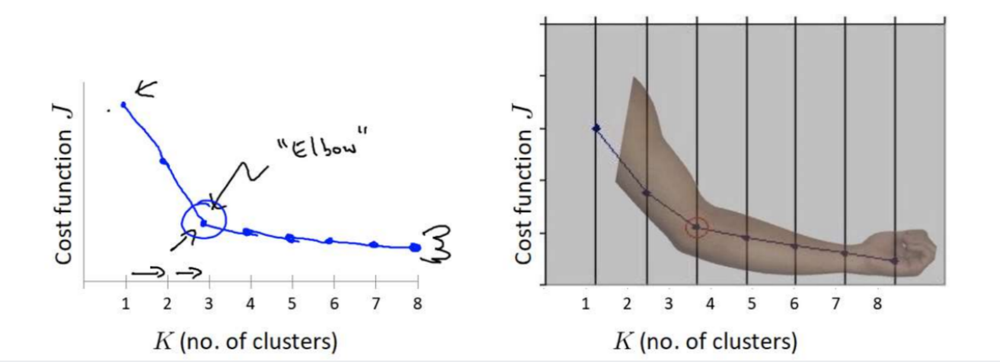

# Clustering Algorithms

## k-means

The implementation process of the K-means algorithm:

- Determine the constant K in advance; the constant K means the final number of clusters.
- Randomly select K sample points as the initial cluster centers.
- Compute the distance (Euclidean distance) from each sample to the K centers, and select the nearest cluster center point as the assigned label.

> 📖 **What is Euclidean distance?**
>
> Euclidean distance is the most commonly used "straight-line distance" in our daily life.
>
> On a 2D plane, the Euclidean distance from point $A(x_1, y_1)$ to point $B(x_2, y_2)$ is:
> $$d = \sqrt{(x_1-x_2)^2 + (y_1-y_2)^2}$$
>
> This is the Pythagorean theorem — the length of the hypotenuse of a right triangle.
>
> In 3D space (with 3 features), the distance from point $A(x_1, y_1, z_1)$ to $B(x_2, y_2, z_2)$ is:
> $$d = \sqrt{(x_1-x_2)^2 + (y_1-y_2)^2 + (z_1-z_2)^2}$$
>
> Generalizing to d dimensions (with d features):
> $$d = \sqrt{(x_1-y_1)^2 + (x_2-y_2)^2 + ... + (x_d-y_d)^2}$$
>
> **Intuitive understanding**: K-means "assigns" each sample point to the center point nearest to it, just like assigning residents to the courier station closest to home.

- Based on the sample points in each category, recompute the new cluster center point (the mean).

> 📖 **What is a centroid (cluster center point)?**
>
> Centroid = the **average** of all sample points in a cluster.
>
> Suppose cluster $C_1$ has 3 2D sample points: $(1, 2)$, $(3, 4)$, $(5, 6)$.
>
> The centroid $m_1 = \left(\frac{1+3+5}{3}, \frac{2+4+6}{3}\right) = (3, 4)$
>
> That is, take the average of the x coordinates and the average of the y coordinates respectively. Generalizing to d dimensions: take the average of each dimension separately.
>
> This is the meaning of "mean" — the **means** in K-means refers to taking the mean.

- If the new and old center points no longer change, stop iterating; otherwise return to step 2.


The key points of K-means:

- The number of clusters k must be determined in advance.
- k center points are randomly initialized.
- Continuously recompute the new cluster center points, i.e., the new centroids.
- Each time, based on the new center points, reclassify every point according to the (Euclidean) distance.
- Until convergence, i.e., no new center points are selected.

### Model Evaluation Methods

#### Sum of Squared Errors (SSE)

The sum of squared Euclidean distances from all samples to the centroid of their own cluster (also the objective function of K-means)
$$
SSE=\sum_{i=1}^{k}\sum_{p\in{C_i}}||p-m_i||^2
$$
Parameter explanation:

- $C_i$ represents the $i$-th cluster (e.g., the 1st cluster is the "red group", the 2nd cluster is the "blue group")
- $k$ represents the number of cluster centers (which you specify in advance, e.g., k=3)
- $p$ represents a certain sample point (its coordinates)
- $m_i$ represents the center point (centroid) of the $i$-th cluster

  

- **Meaning of the value**: the smaller the SSE, the more compact the samples within a cluster; **but as K increases, SSE necessarily decreases, so the optimal K must be determined with the elbow method (rather than by looking at SSE alone)**.

> 📖 **Breaking down the SSE formula — read it layer by layer**
>
> This formula has two summation symbols. Read it like "peeling an onion":
>
> **Outer $\sum_{i=1}^{k}$**: sum over all k clusters. First look at cluster 1, then cluster 2... finally add up the results of each cluster.
>
> **Inner $\sum_{p\in{C_i}}$**: sum over all sample points in the i-th cluster.
>
> **$||p-m_i||^2$**: the squared Euclidean distance from sample point p to the centroid $m_i$ of its cluster.
>
> ---
>
> **Numerical example**: suppose k=2, with two clusters:
>
> Cluster 1 ($C_1$): centroid $m_1=(0, 0)$, sample points $(1, 0)$, $(0, 1)$
>
> - Squared distance from $(1,0)$ to $(0,0)$ = $1^2 + 0^2 = 1$
> - Squared distance from $(0,1)$ to $(0,0)$ = $0^2 + 1^2 = 1$
> - Cluster 1's contribution = $1+1 = 2$
>
> Cluster 2 ($C_2$): centroid $m_2=(5, 5)$, sample points $(5, 4)$, $(6, 5)$
>
> - Squared distance from $(5,4)$ to $(5,5)$ = $0^2 + (-1)^2 = 1$
> - Squared distance from $(6,5)$ to $(5,5)$ = $1^2 + 0^2 = 1$
> - Cluster 2's contribution = $1+1 = 2$
>
> **SSE = 2 + 2 = 4**
>
> The goal of K-means is to keep adjusting the cluster centers to make this SSE as small as possible.

- **Obtaining it in sklearn**: `kmeans.inertia_` (call it directly after training)

##### The Elbow Method

The elbow method is mainly used to determine the K value for clustering. The process is as follows:

- For a data set of n points, iteratively compute K, usually trying different K values within a reasonable range (such as 2 to 10, or 2 to √n), and compute the SSE after each clustering run.
- SSE gradually decreases as K increases, because when the number of clusters increases, the average distance from samples to their cluster centers decreases.
- However, there will be an inflection point in the SSE change; when the rate of decrease suddenly slows down, that is considered the best K value.
- The elbow criterion is also useful in deciding when to stop training. Data usually contains more noise; when adding more categories no longer brings more returns, we stop adding categories.



> 📖 **Elbow method — why is it called the "elbow"?**
>
> Imagine stretching your arm straight. From the wrist to the elbow, the arm bends a lot (SSE drops quickly); from the elbow to the shoulder, the bend slows (SSE drops more slowly). **The elbow is the inflection point of "diminishing returns".**
>
> Look at the figure to understand:
>
> - k from 1→2: SSE drops sharply from 1000 to 400 (big improvement)
> - k from 2→3: SSE drops from 400 to 200 (still a clear improvement)
> - k from 3→4: SSE drops from 200 to 180 (weak improvement) ← **this is the elbow!**
> - k from 4→5: SSE drops from 180 to 170...
>
> After k=3, adding one more cluster brings almost no improvement, which means k=3 is already sufficient. Of course, increasing to k=10 would make SSE even smaller, but the model becomes more complex — not worth it.

#### Silhouette Coefficient (SC)

The silhouette coefficient considers the cohesion within a cluster and the separation between clusters.

- Compute the average distance $a_i$ from each sample $i$ to the other samples within the same cluster. The smaller this value, the greater the similarity within the cluster.
- Compute the average distance $b_{ij}$ from each sample $i$ to all samples in the nearest cluster $j$. The larger this value, the less the sample belongs to the other clusters.
- Compute the silhouette coefficient of the sample using the following formula:
  $$
  S=\frac{b-a}{MAX(a,b)}
  $$

- Compute the average silhouette coefficient of all samples.
- The range of the silhouette coefficient is [-1,1].

  

- **Meaning of the value**: the range is [-1,1]. The closer to 1, the more "compact within the cluster and dispersed between clusters"; 0 means the sample is on the boundary of two clusters; -1 means the sample is assigned incorrectly.

- **Calling it in sklearn**: `silhouette_score(X, labels)` (X is the feature matrix, labels are the cluster labels).

> 📖 **Silhouette coefficient formula explained + numerical example**
>
> In the formula $S = \frac{b-a}{\max(a,b)}$:
>
> - **$a$** (cohesion): the average distance from the sample to **other points in the same cluster**. The smaller a is → the closer the sample is to its "own people" → the better.
> - **$b$** (separation): the average distance from the sample to **all points in the nearest other cluster**. The larger b is → the farther the sample is from "others" → the better.
> - **$\max(a,b)$**: take the larger of a and b to normalize (limiting the result to [-1, 1]).
>
> ---
>
> **Numerical example**: suppose there are 3 clusters, and we evaluate sample point P (belonging to cluster A):
>
> | Distances to other points in cluster A | Distances to all points in cluster B | Distances to all points in cluster C |
> | -------------------------------------- | ------------------------------------ | ------------------------------------ |
> | 2, 3, 4                                | 8, 9, 10                             | 15, 16, 14                           |
>
> - $a$ = average distance to the same cluster (A) = (2+3+4)/3 = **3**
> - Average distance to cluster B = (8+9+10)/3 = **9**
> - Average distance to cluster C = (15+16+14)/3 = **15**
> - $b$ = average distance to the **nearest** other cluster = min(9, 15) = **9** (choose B because it is closer)
>
> $$S = \frac{9-3}{\max(3,9)} = \frac{6}{9} \approx 0.67$$
>
> S ≈ 0.67, indicating that this sample point clusters quite well (fairly close to the ideal 1).
>
> **Understanding the extreme cases**:
>
> - S → 1: a is very small (tightly close to its own group), b is very large (far away from others) → ideal clustering ✓
> - S → 0: a ≈ b → the sample is exactly on the boundary of two clusters, hard to tell which it belongs to
> - S → -1: a is very large, b is very small → the sample should belong to another cluster; it is misassigned ✗

### Example

```python
from sklearn.cluster import KMeans
from sklearn.datasets import make_blobs
from sklearn.preprocessing import StandardScaler
from sklearn.metrics import silhouette_score
import matplotlib.pyplot as plt

# 生成模拟数据
# n_samples: 样本数量
# n_features: 特征数量
# centers: 聚类中心数量
# cluster_std: 簇内标准差
X, _ = make_blobs(n_samples=300, n_features=2, centers=3, cluster_std=1.0, random_state=42)

# 3. 中文字体设置（matplotlib）
plt.rcParams['font.sans-serif'] = ['SimHei', 'Microsoft YaHei', 'Arial Unicode MS']
plt.rcParams['axes.unicode_minus'] = False

# 数据标准化
scaler = StandardScaler()
X_scaled = scaler.fit_transform(X)

# 先用 k=3 做一次聚类，并计算 SSE、SC
k = 3
kmeans = KMeans(n_clusters=k, random_state=42, n_init=10)
labels = kmeans.fit_predict(X_scaled)

sse = kmeans.inertia_  # SSE（簇内平方和）
sc = silhouette_score(X_scaled, labels)  # SC（轮廓系数）

print(f'当 k={k} 时：')
print(f'SSE: {sse:.4f}')
print(f'SC : {sc:.4f}')

# 肘部法：不同 k 的 SSE
k_values = range(1, 11)
sse_list = []
sc_list = []

for kk in k_values:
    km = KMeans(n_clusters=kk, random_state=42, n_init=10)
    y_pred = km.fit_predict(X_scaled)
    sse_list.append(km.inertia_)

    # SC 需要至少 2 个簇
    if kk >= 2:
        sc_list.append(silhouette_score(X_scaled, y_pred))
    else:
        sc_list.append(None)

# 绘图：肘部法（SSE） + SC 曲线
fig, axes = plt.subplots(1, 2, figsize=(12, 5))

# 肘部法图
axes[0].plot(list(k_values), sse_list, marker='o')
axes[0].set_title('肘部法（SSE-k 曲线）')
axes[0].set_xlabel('聚类数 k')
axes[0].set_ylabel('SSE')
axes[0].grid(True, alpha=0.3)

# SC 曲线
valid_k = list(k_values)[1:]  # 从 k=2 开始
valid_sc = sc_list[1:]
axes[1].plot(valid_k, valid_sc, marker='s', color='orange')
axes[1].set_title('SC-k 曲线（轮廓系数）')
axes[1].set_xlabel('聚类数 k')
axes[1].set_ylabel('SC')
axes[1].grid(True, alpha=0.3)

plt.tight_layout()
plt.show()
```


