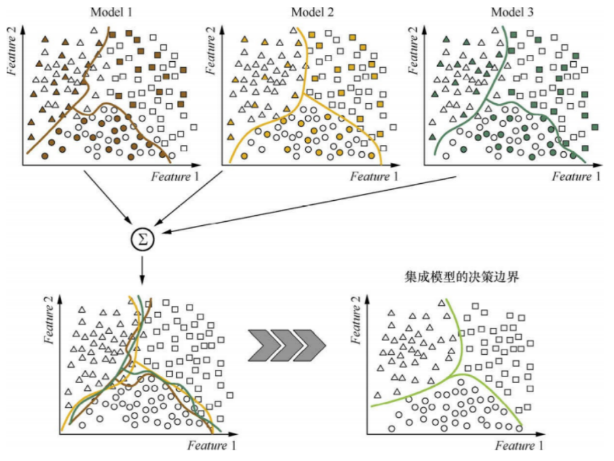
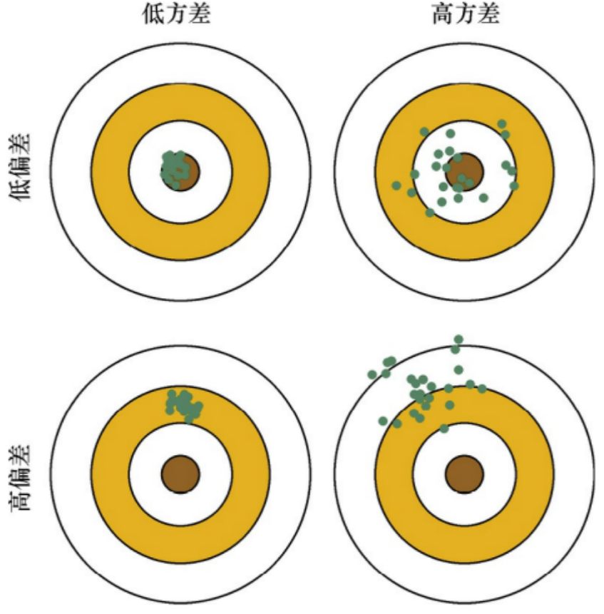
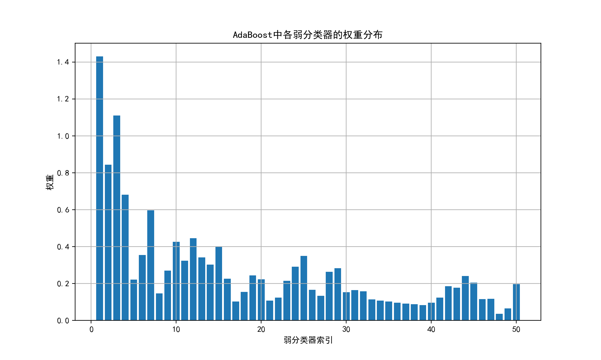
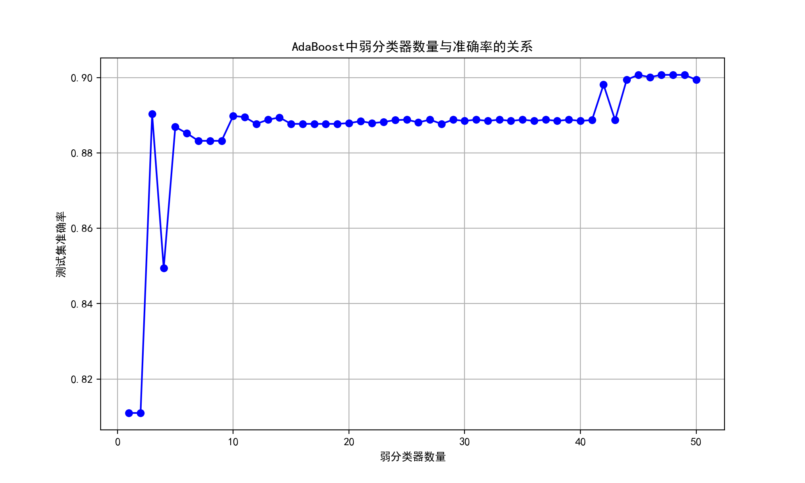
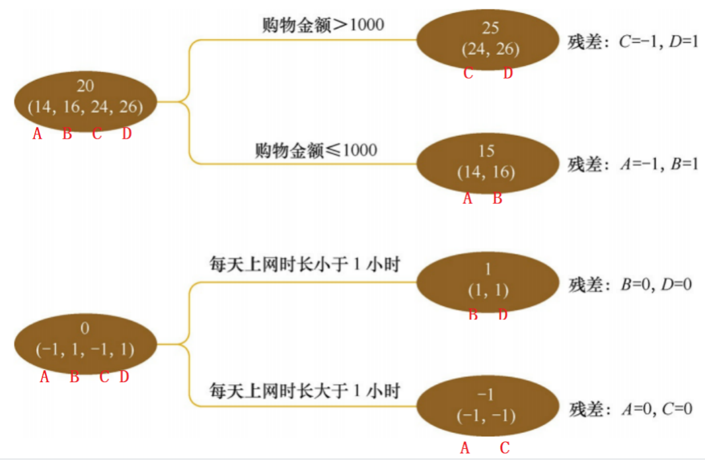

# Ensemble Learning

**Ensemble learning**: unify the results of multiple classifiers into one final decision, where each individual classifier is called a **base classifier**.

## Classification of Ensemble Learning: **Boosting** and **Bagging**

- Boosting — sequential

  - The Boosting method trains base classifiers **sequentially**, and there are dependencies among the base classifiers. The basic idea is to stack base classifiers layer by layer; during training, each layer **gives higher weight to the samples that the previous layer's base classifier misclassified**. At test time, the final result is obtained according to the **weighted** results of the classifiers in each layer.
  - The Boosting process is very similar to the process of human learning new knowledge — iterative learning: the first pass remembers some knowledge but also makes mistakes; the second pass strengthens learning on the **mistaken** knowledge to reduce similar errors. This loops until the number of errors is reduced to a very low level.

- Bagging — parallel

  - Unlike Boosting's sequential training, the base classifiers in Bagging have **no strong dependency** and can be trained in **parallel**. A very famous algorithm is the random **forest (Random Forest)** based on decision tree base classifiers.
  - To make the base classifiers independent of each other, the training set is divided into several subsets (when the number of training samples is small, the **subsets** may overlap). Bagging is more like collective decision-making: each individual learns independently; the learning content can be the same, different, or partially overlapping. Because of the differences among individuals, the final judgments will not be completely identical. In the final decision, each individual makes its own judgment, and then a collective decision is made through **voting**.

> 📖 **Boosting vs Bagging — understand it through "exams"**
>
> **Boosting (sequential) = the wrong-answer notebook study method**
>
> You do the 1st mock exam → discover many wrong answers → focus on reviewing those wrong questions → do the 2nd exam (with questions biased toward the knowledge points you got wrong before) → review the wrong answers again → ... eventually, all your weak points are filled in.
>
> Each subsequent "model" focuses on the errors made by the previous model. It is like repeatedly practicing with your wrong-answer notebook.
>
> **Bagging (parallel) = split up and then vote**
>
> 5 classmates each independently do the same exam (each person sees slightly different questions) → finally vote on the answer to each question, and the majority rules. If all 5 choose A, then it is likely A; if 3 choose A and 2 choose B, the final answer is still A.
>
> Each person alone may make mistakes, but collective voting can eliminate individuals' random errors.
>
> **One-sentence summary**:
>
> - Boosting: the later ones correct the earlier ones' mistakes (**reduce bias**, making the model more "accurate")
> - Bagging: everyone votes together to cancel out randomness (**reduce variance**, making the model more "stable")
>
> Algorithm illustration:
>
> 
>
> Model 1, Model 2, and Model 3 are each trained on a subset of the training set. Individually, their decision boundaries are very wiggly and prone to overfitting. **The decision boundary of the ensemble model is smoother than that of each individual model**, because the ensemble's weighted voting method reduces variance.

## Bias and Variance

We often use overfitting and underfitting to qualitatively describe whether a model solves a specific problem well.

From a quantitative perspective, the model's performance can be described by its **Bias and Variance**.

In supervised learning, the generalization error of a model comes from two sources — **bias and variance**:

| Concept     | Definition                                                                                                                                                                                                  |
| ----------- | ----------------------------------------------------------------------------------------------------------------------------------------------------------------------------------------------------------- |
| **Bias**    | The deviation between the **average** of the outputs of all models trained on training data sets of size m obtained from all samplings, and the output of the true model. It is usually caused by wrong assumptions about the learning algorithm (e.g., the true model is quadratic, but a linear function is assumed). Errors caused by bias are usually reflected in the **training error**. |
| **Variance** | The variance of the outputs of all models trained on training data sets of size m obtained from all samplings. It is usually caused by the model complexity being too high relative to the number of training samples m (e.g., 100 training samples but assuming a polynomial of degree no greater than 200). Errors caused by variance are usually reflected in the **increase of the test error relative to the training error**. |

Use a shooting example to further describe the difference and relationship between bias and variance. Suppose one shot is a machine learning model predicting one sample; hitting the bullseye means an accurate prediction, and the farther from the bullseye, the larger the prediction error.

Through n samplings, we obtain n training sample sets of size m, train n models, and make predictions on the same sample — this is equivalent to shooting n times.



| Top-left corner | Shooting is accurate and concentrated → both bias and variance are small (most ideal) |
| --------------- | ------------------------------------------------------------------------------------- |
| Top-right corner | The center is around the bullseye but the distribution is scattered → small bias, large variance |
| Bottom-left corner | Small variance, large bias |
| Bottom-right corner | Large variance and large bias |

The reason Boosting (sequential) can improve the performance of weak classifiers is that it **reduces bias**.

The reason Bagging (parallel) can improve the performance of weak classifiers is that it **reduces variance**.

> 📖 **Bias vs variance — understand it through "learning archery"**
>
> |                     | Bias                              | Variance                             |
> | ------------------- | --------------------------------- | ------------------------------------ |
> | **Intuitive explanation** | Whether you aim accurately (systematically off or not) | Whether your hand shakes (stable or not from shot to shot) |
> | **Problem manifestation** | Large error on the training set → underfitting | Small training error, large test error → overfitting |
> | **Cause**           | The model is too simple; it cannot learn | The model is too complex; it also learns the noise |
> | **Does Boosting solve it** | ✅ Each round corrects the previous round's errors, learning more accurately | Not very effective |
> | **Does Bagging solve it**  | Not very effective                 | ✅ Multiple models vote/average, canceling random fluctuations |
>
> **Concrete examples**:
>
> - **High bias**: use a straight line to fit a parabola → no matter how hard you learn, you cannot learn it; the training error is large
> - **High variance**: use a 100-degree polynomial to fit 10 points → training error near 0, but the curve shakes violently; switch to another data set and it becomes completely wrong
>
> Boosting = chaining multiple "weaklings" (high-bias simple models) together, making up for each other's shortcomings → bias gets lower and lower
> Bagging = training multiple independent models and voting → the individual models' random errors cancel each other out → variance decreases

## Understanding the Difference from the Perspective of Bias and Variance

Base classifiers are sometimes called **weak classifiers**, because the error rate of a base classifier is greater than that of the ensemble classifier. The error of a base classifier is the **sum of bias error and variance error**:

| **Concept** | **Meaning**                                                                        |
| ----------- | ---------------------------------------------------------------------------------- |
| **Bias**    | Systematic errors caused by the limited expressive power of the classifier, shown as the training error not converging |
| **Variance** | The classifier is too sensitive to the sample distribution; when the number of training samples is small, it produces overfitting |

Assuming the probabilities that all base classifiers make errors are independent, if a simple majority vote is used to integrate on a certain test sample, **the probability that more than half of the base classifiers make errors decreases as the number of base classifiers increases**.

## AdaBoost — Sequential

[Adaboost 算法的原理与推导-CSDN博客](https://blog.csdn.net/v_JULY_v/article/details/40718799)

**AdaBoost (Adaptive Boosting)** core: train many "weak classifiers" in order, each focusing on the samples that the previous one misclassified, and finally combine them into a strong classifier through weighted voting.

### Principles

**📝 Deep dive into AdaBoost's core principles**

AdaBoost needs to answer three questions:

1. **How is the base classifier trained in each round?** → Train with weighted samples; the samples misclassified get higher weight.
2. **How much say does each base classifier have?** → The lower the error rate, the larger the voting weight.
3. **How are the sample weights adjusted in the next round?** → The weights of misclassified samples are amplified; the weights of correctly classified samples are reduced.

---

**Question 1: Why adjust sample weights?**

Imagine teaching a student to solve problems. After the first round, you find he makes many mistakes in "division". In the second round, you give him more division problems (increasing the "weight" of division problems). If he makes more mistakes in "fractions" in the second round, then in the third round both division and fraction problems increase. Round after round, the student's weak points are broken down one by one.

Before each round of training, AdaBoost reassigns the **weight $D_t(i)$** of each sample according to the results of the previous round — the samples misclassified in the previous round get larger weights this round, forcing the base classifier to pay more attention to them.

---

**Question 2: How is each base classifier's say $\alpha_t$ determined?**

$$\alpha_t = \frac{1}{2}\ln\left(\frac{1-\epsilon_t}{\epsilon_t}\right)$$

where $\epsilon_t$ is the **weighted error rate** of the $t$-th base classifier:

$$\epsilon_t = \sum_{i=1}^{N} D_t(i) \cdot \mathbf{1}[h_t(x_i) \neq y_i]$$

Meaning: add up the weights of all misclassified samples to get the weighted error rate.

The relationship between $\alpha_t$ and $\epsilon_t$:

| $\epsilon_t$ (error rate) | $\frac{1-\epsilon_t}{\epsilon_t}$ | $\alpha_t$ | Meaning                         |
| :-----------------------: | :-------------------------------: | :--------: | ------------------------------- |
|           0.01            |                99                 |    2.30    | Almost always right, enormous say 🔊🔊 |
|           0.1             |                 9                 |    1.10    | 10% wrong, relatively large say 🔊 |
|           0.3             |               2.33                |    0.42    | 30% wrong, average say          |
|           0.5             |                 1                 |   **0**    | Same as guessing, keep quiet 🤫  |
|           0.6             |               0.67                |   -0.20    | Worse than guessing, listen in reverse (invert) |

> **Key intuition**: the $\alpha_t$ curve crosses zero at $\epsilon_t = 0.5$. A classifier with an error rate of exactly 0.5 is equivalent to a coin flip and deserves no say at all. When the error rate exceeds 0.5, $\alpha_t$ becomes negative — equivalent to "voting in reverse".

---

**Question 3: How are sample weights updated?**

$$D_{t+1}(i) = \frac{D_t(i) \cdot e^{-\alpha_t y_i h_t(x_i)}}{Z_t}$$

Break down this formula:

- $y_i \in \{-1, +1\}$ is the true label
- $h_t(x_i) \in \{-1, +1\}$ is the prediction of the base classifier
- If the prediction is correct: $y_i h_t(x_i) = +1$ → multiply by $e^{-\alpha_t}$ (since $\alpha_t > 0$, $e^{-\alpha_t} < 1$, the **weight shrinks**)
- If the prediction is wrong: $y_i h_t(x_i) = -1$ → multiply by $e^{\alpha_t}$ (since $\alpha_t > 0$, $e^{\alpha_t} > 1$, the **weight is amplified**)
- $Z_t$ is a normalization factor ensuring that the sum of all new sample weights = 1

**Numerical intuition** (when $\alpha_t = 1.1$):

- Weight of correctly classified samples × $e^{-1.1} \approx 0.33$ → reduced to 1/3 of the original
- Weight of misclassified samples × $e^{1.1} \approx 3.0$ → amplified to 3 times the original
- With this give-and-take, the "presence" of misclassified samples in the new round is **9 times** that of correctly classified samples!

---

**Final prediction: weighted voting**

$$\hat{y} = \text{Sign}\left(\sum_{t=1}^{T} \alpha_t \cdot h_t(x)\right)$$

Each base classifier $h_t(x)$ votes +1 or -1, multiplied by its own say $\alpha_t$; all votes are added together and the sign is checked.

---

**Why is AdaBoost effective? (Understanding from the loss function perspective)**

AdaBoost essentially minimizes the **Exponential Loss**:

$$L = \sum_{i=1}^{N} e^{-y_i F(x_i)}$$

where $F(x) = \sum_{t} \alpha_t h_t(x)$ is the weighted sum of all classifiers. It can be proven that the formula for choosing $\alpha_t$ and updating weights in each round is exactly a greedy minimization of this exponential loss. The exponential loss penalizes misclassified samples far more than it rewards correctly classified ones — this is the mathematical root of AdaBoost's "obsession with wrong answers".

---

**Pseudocode of the algorithm flow**:

 ```
 输入: 训练集 {(x₁,y₁), ..., (x_N,y_N)}, 基分类器类型, 迭代轮数 T
 输出: 强分类器 F(x) = Sign(Σ α_t · h_t(x))

 ① 初始化: D₁(i) = 1/N  （所有样本权重相等）
 ② for t = 1 to T:
    ③ 用权重分布 D_t 训练基分类器 h_t(x)
    ④ 计算加权错误率: ε_t = Σ D_t(i) · 1[h_t(x_i) ≠ y_i]
    ⑤ 计算分类器权重: α_t = ½ ln((1-ε_t)/ε_t)
    ⑥ 更新样本权重: D_{t+1}(i) ∝ D_t(i) · exp(-α_t · y_i · h_t(x_i))
    ⑦ 归一化使 Σ D_{t+1}(i) = 1
 ⑧ 返回 F(x) = Sign(Σ α_t · h_t(x))
 ```

📖 **Detailed explanation of AdaBoost formula parameters**

The formulas in the figures above look complicated; let's break down the meaning of each symbol one by one:

**Training stage (loop t = 1, 2, ..., T):**

| Symbol         | Meaning                                   | Intuitive understanding                 |
| -------------- | ----------------------------------------- | --------------------------------------- |
| $D_t(i)$       | The **weight** of the i-th sample in round t | How much this sample is "valued"        |
| $h_t(x)$       | The t-th base classifier (e.g., a decision stump) | The t-th "expert"             |
| $\epsilon_t$   | The **weighted error rate** of the t-th base classifier | The probability this expert makes an error (considering sample weights) |
| $\alpha_t$     | The **voting weight** of the t-th base classifier | The "volume" of this expert's voice     |
| $y_i$          | The true label of the i-th sample         | +1 or -1 (yes/no)                       |
| $G_t(x_i)$     | The prediction of the t-th base classifier for the i-th sample | The expert's judgment on the i-th question |
| $Z_t$          | Normalization factor                      | Ensures all sample weights sum to 1      |

**Intuitive understanding of the core formulas:**

1. **$\alpha_t = \frac{1}{2}\ln(\frac{1-\epsilon_t}{\epsilon_t})$**
  - If $\epsilon_t = 0.1$ (very low error rate, only 10% wrong) → $\alpha_t = \frac{1}{2}\ln(9) \approx 1.1$ (high weight, large say 🔊)
  - If $\epsilon_t = 0.5$ (50% error rate, same as guessing) → $\alpha_t = \frac{1}{2}\ln(1) = 0$ (weight 0, keep quiet 🤫)
  - **The lower the error rate, the more say this classifier has!**

2. **Weight update** (misclassified samples get larger weights, correctly classified ones get smaller):
  - Sample misclassified → multiply by $e^{\alpha_t}$ (α>0, so the weight is amplified) → gets extra attention in the next round
  - Sample correctly classified → multiply by $e^{-\alpha_t}$ (α>0, so the weight is reduced) → no need for much attention in the next round

**Prediction stage:**
$$
Sign(\sum_{t=1}^{T}h_t(z)\alpha_t)
$$

- $Sign(x)$ is the sign function: x>0 returns +1, x<0 returns -1
- Each base classifier $h_t(z)$ votes (+1 or -1) on sample z, and the vote is multiplied by the classifier's weight $\alpha_t$
- All weighted votes are added together; the final sign determines the classification result

**Numerical example**: there are 3 base classifiers, for a new sample z:

- Classifier 1 (α₁=1.1): predicts +1 → contribution +1.1
- Classifier 2 (α₂=0.8): predicts -1 → contribution -0.8
- Classifier 3 (α₃=0.5): predicts +1 → contribution +0.5
- Sum = 1.1 + (-0.8) + 0.5 = 0.8 → Sign(0.8) = +1 → final prediction is "positive class"


From the AdaBoost example, the Boosting idea is clearly visible: **the weights of correctly classified samples are reduced, while the weights of incorrectly classified samples are increased or kept unchanged**. In the final model fusion process, **base classifiers are also weighted according to their error rates; classifiers with lower error rates have greater "say"**.

To build an AdaBoost classifier, you first need to train a basic classifier (such as a decision tree) and use it to make predictions on the training set. Then increase the relative weights of the training instances that were misclassified, next use this latest weight distribution to train a second classifier, then make predictions on the training set again, continue updating the weights, and keep looping forward.

### Example

```python
from sklearn import datasets
import numpy as np
from sklearn.metrics import accuracy_score
from sklearn.model_selection import train_test_split

# x是特征，y是标签
x, y = datasets.make_moons(n_samples=50000, noise=0.3, random_state=42)  # 随机50000个样本，2个标签0 1
print(x.shape)
print(y.shape)
print(np.unique(y))

# 划分训练集和测试集
X_train, X_test, y_train, y_test = train_test_split(x, y, test_size=0.2, random_state=42)

# 导入AdaBoost分类器
from sklearn.ensemble import AdaBoostClassifier
from sklearn.tree import DecisionTreeClassifier
import matplotlib.pyplot as plt

# 创建基分类器 - 使用决策树作为AdaBoost的基分类器
base_clf = DecisionTreeClassifier(
    max_depth=1,  # 决策树桩(深度为1的决策树)
    criterion='gini',  # 基尼决策树
    random_state=42,  # 随机种子，确保结果可复现
)

# 创建AdaBoost分类器
ada_clf = AdaBoostClassifier(
    estimator=base_clf,  # 基分类器
    n_estimators=50,  # 弱分类器的数量
    learning_rate=1.0,  # 学习率
    random_state=42  # 随机种子，确保结果可复现
)

# 训练AdaBoost分类器
ada_clf.fit(X_train, y_train)

# 预测
ada_pred = ada_clf.predict(X_test)
ada_accuracy = accuracy_score(y_test, ada_pred)

print("AdaBoost集成准确率:", ada_accuracy)

# 可视化AdaBoost的权重和准确率变化

# 获取每个弱分类器的权重
estimator_weights = ada_clf.estimator_weights_

# 创建一个新的AdaBoost分类器来跟踪不同数量弱分类器的准确率
n_estimators_range = range(1, 51)  # 从1到50个弱分类器
accuracies = []

for n in n_estimators_range:
    # 创建具有n个弱分类器的AdaBoost
    temp_ada = AdaBoostClassifier(
        estimator=base_clf,
        n_estimators=n,
        learning_rate=1.0,
        random_state=42
    )
    temp_ada.fit(X_train, y_train)
    temp_pred = temp_ada.predict(X_test)
    accuracies.append(accuracy_score(y_test, temp_pred))

plt.rcParams['font.sans-serif'] = ['SimHei']  # 用来正常显示中文标签
plt.rcParams['axes.unicode_minus'] = False  # 用来正常显示负号

# 绘制权重分布
plt.figure(figsize=(10, 6))
plt.bar(range(1, len(estimator_weights) + 1), estimator_weights)
plt.xlabel('弱分类器索引')
plt.ylabel('权重')
plt.title('AdaBoost中各弱分类器的权重分布')
plt.savefig("AdaBoost中各弱分类器的权重分布", dpi=200)
plt.grid(True)

# 绘制准确率变化曲线
plt.figure(figsize=(10, 6))
plt.plot(n_estimators_range, accuracies, 'b-', marker='o')
plt.xlabel('弱分类器数量')
plt.ylabel('测试集准确率')
plt.title('AdaBoost中弱分类器数量与准确率的关系')
plt.savefig("AdaBoost中弱分类器数量与准确率的关系", dpi=200)
plt.grid(True)
```



This plots `estimator_weights_`, i.e., the α value of each weak classifier:

- The first few classifiers have relatively large α (easy samples are classified correctly first, so the error rate is low)
- The subsequent α values decline overall and fluctuate (the remaining samples are hard; the error rate is close to 0.5, so α is naturally small)
- This is exactly the characteristic of AdaBoost: solve the easy problems first, then tackle the hard bones, and the say is distributed according to contribution.



## GBDT — Sequential

**Gradient Boosting Decision Tree (GBDT)**: its core idea is that each tree learns the **residuals** of the sum of the conclusions of all previous trees. This residual is the amount that, when added to the predicted value, yields the true value.

**GBDT's weighted sum** is a method of combining the outputs of multiple weak learners into the output of one strong learner. Suppose there are T trees and the output of the t-th tree is $f_t(x)$; then the weighted sum $E_t(x)$ can be expressed as
$$
\sum_{t=1}^{T}a_t f_t(x)
$$
where $α_t$ is the weight factor of the t-th tree, usually controlled by the learning rate, with a value range of (0, 1].

The smaller the learning rate, the smaller the contribution of each tree and the higher the robustness of the model; the larger the learning rate, the larger the contribution of each tree and the higher the complexity of the model, making it prone to overfitting.

The Gradient Boosting algorithm that uses decision trees as weak classifiers is called GBDT, sometimes also called MART (Multiple Additive Regression Tree).

The decision tree used in GBDT is usually CART.

### Principles

**📝 Deep dive into GBDT's core principles**

To truly understand GBDT, you need to answer four questions:

1. **What exactly does GBDT "fit"?** → The negative gradient (residuals are just a special case under squared loss).
2. **Why is it "gradient" boosting?** → Because it performs gradient descent in function space.
3. **How is each tree trained?** → Use the negative gradient as the target value to train a CART.
4. **How is the final prediction made?** → Sum the outputs of all trees.

---

**Question 1: What does GBDT fit? — From residuals to the negative gradient**

Many people say "each tree in GBDT fits the residuals", which is correct for **regression tasks + squared loss**, but it is not the full picture. A more general statement is:

> Each tree in GBDT fits the **negative gradient of the loss function with respect to the current model's output**.

Why? Look at the case of squared loss:

$$L(y, F(x)) = \frac{1}{2}(y - F(x))^2$$

Take the gradient with respect to $F(x)$:

$$\frac{\partial L}{\partial F} = F(x) - y$$

The negative gradient is:

$$-\frac{\partial L}{\partial F} = y - F(x) = \text{residual}$$

So **residual = negative gradient** — this is a coincidence under squared loss! For other loss functions (such as log loss in classification tasks), the gradient is no longer the residual, but the idea of "fitting the negative gradient" is completely general.

| Task      | Common loss function                        | Negative gradient = ?                                  |
| --------- | ------------------------------------------- | ----------------------------------------------------- |
| Regression | Squared loss $\frac{1}{2}(y-F)^2$          | $y - F(x)$ = **residual**                             |
| Regression | Absolute loss $\lvert y-F\rvert$            | $\text{sign}(y - F(x))$ = the sign of the residual    |
| Regression | Huber loss                                  | Residual (for small errors) or residual sign × constant (for large errors) |
| Binary classification | Log loss (deviance)               | $y - p(x)$ = difference between true label and predicted probability |
| Multiclass classification | Cross-entropy loss           | $y_k - p_k(x)$ = difference between each class's label and predicted probability |

---

**Question 2: What is "gradient descent in function space"?**

Traditional gradient descent optimizes in **parameter space**:

$$\theta^{(m)} = \theta^{(m-1)} - \eta \cdot \nabla_\theta L(\theta)$$

Each step moves a small step in the direction of the negative gradient of the parameters.

GBDT treats the "model" itself as the parameter — mathematically, this is called **gradient descent in function space**:

$$F_m(x) = F_{m-1}(x) - \eta \cdot \nabla_F L(y, F(x))\big|_{F=F_{m-1}}$$

That is: **the newly added tree $h_m(x)$ should approximate the negative gradient direction $-\nabla_F L$**. Then a line search (or simply a fixed learning rate) is performed to update the overall model.

> 💡 **Intuitive analogy**:
>
> - Traditional gradient descent: keep adjusting the parameters θ, subtracting a bit of gradient each time → the parameters become better and better
> - GBDT: keep adding new trees f(x), each tree fitting the negative gradient of the current model → the model becomes stronger and stronger
>
> The "step size" of traditional gradient descent corresponds to GBDT's "learning rate ν"; the "gradient vector" of traditional gradient descent corresponds to GBDT's "residual/negative gradient".

---

**Question 3: Detailed algorithm flow**

```
输入: 训练集 {(x₁,y₁), ..., (x_N,y_N)}, 损失函数 L, 迭代轮数 M, 学习率 ν
输出: 强模型 F_M(x)

① 初始化: F₀(x) = argmin_γ Σ L(y_i, γ)
   （回归：γ = y 的均值；分类：γ = log(正例比例/负例比例)）

② for m = 1 to M:
   ③ 计算负梯度（伪残差）:
      r_{im} = -∂L(y_i, F(x_i)) / ∂F(x_i) |_{F=F_{m-1}}
      对每个样本 i = 1, ..., N

   ④ 用 {(x_i, r_{im})}_{i=1}^N 训练一棵 CART 回归树 h_m(x)
      （注意：始终是回归树，即使是分类任务——因为拟合的是连续值的梯度）
      树将特征空间划分为 J 个叶节点区域 R_{jm}

   ⑤ 对每个叶节点区域 j = 1, ..., J，计算最优输出值:
      γ_{jm} = argmin_γ Σ_{x_i∈R_{jm}} L(y_i, F_{m-1}(x_i) + γ)
      （回归+平方损失时：γ_{jm} = 该区域内残差的均值）

   ⑥ 更新模型:
      F_m(x) = F_{m-1}(x) + ν · Σ_{j=1}^J γ_{jm} · 1[x ∈ R_{jm}]
      其中 ν 是学习率，控制每棵树的贡献

⑦ 返回 F_M(x)
```

**Key details**:

- Step ④: even for classification tasks, every tree inside GBDT is always a **regression tree**, because the fitting target (negative gradient) is a continuous value.
- Step ⑤: the optimal leaf value $\gamma_{jm}$ is obtained by minimizing the loss function, not simply by taking the average of the negative gradients in that region (although the two are equivalent under squared loss).
- Step ⑥: the learning rate ν is usually set quite small (e.g., 0.01~0.1), letting the model learn slowly, paired with a larger number of trees.

---

**Question 4: Choosing the loss function**

One major advantage of GBDT is that it **can flexibly choose the loss function**, as long as the loss function is differentiable:

| Task type    | Loss function                    | Characteristics                                         |
| ------------ | -------------------------------- | ------------------------------------------------------- |
| Regression   | `ls` (squared loss)              | Sensitive to outliers; the residual of an outlier is large and receives excessive attention |
| Regression   | `lad` (absolute loss)            | Robust to outliers, but the gradient is discontinuous (±1), slightly slower to optimize |
| Regression   | `huber` (Huber loss)             | Combines the advantages of ls and lad: squared for small errors, absolute for large errors |
| Binary classification | `deviance` (log loss)   | Outputs probability values, equivalent to logistic regression's loss |
| Multiclass classification | `deviance` (cross-entropy) | Trains K trees per round (one per class), outputs probabilities through softmax |

The Huber loss formula (with threshold δ):

$$L(y, F) = \begin{cases} \frac{1}{2}(y-F)^2 & |y-F| \leq \delta \\ \delta|y-F| - \frac{1}{2}\delta^2 & |y-F| > \delta \end{cases}$$

---

**Regularization — three means of preventing GBDT overfitting**

1. **Learning rate (Shrinkage)**: $\nu \in (0, 1]$, typical values 0.01~0.1
  - The smaller the learning rate → the smaller each tree's contribution → more trees are needed → generalization is usually better
  - The learning rate and the number of trees need to be tuned together: a small learning rate pairs with a large number of trees

2. **Subsampling**: randomly select a portion of samples to train each tree
  - Similar to random forest's bootstrap, but GBDT usually uses sampling without replacement
  - Typical values: 0.5~0.8
  - When subsampling < 1, only part of the samples is used each time, which both prevents overfitting and speeds up training

3. **Tree structure constraints**:
  - `max_depth`: limit tree depth (typical values 3~8)
  - `min_samples_split`: the minimum number of samples a node needs to keep splitting
  - `min_samples_leaf`: the minimum number of samples in a leaf node
  - `max_features`: the proportion of features considered at each split (adds randomness)

---

**GBDT vs gradient descent — understand it with one figure**

|                   | Traditional gradient descent                     | GBDT                                            |
| ----------------- | ------------------------------------------------ | ----------------------------------------------- |
| Optimization space | **Parameter space** $\theta \in \mathbb{R}^d$    | **Function space** $F: \mathbb{R}^d \to \mathbb{R}$ |
| Iteration approach | $\theta_m = \theta_{m-1} - \eta \nabla_\theta L$ | $F_m = F_{m-1} - \eta \nabla_F L$               |
| How "gradient" is implemented | Compute partial derivatives with respect to parameters | A CART regression tree fits the negative gradient |
| Final result       | A set of optimal parameters $\theta^*$           | A superposition of functions $\sum \nu h_m(x)$  |

### Comparison with AdaBoost

AdaBoost and GBDT both belong to the Boosting family, and their training processes are both sequential, but the two have essential differences in their **starting points, mathematical foundations, and design philosophy**.

**I. One-sentence distinction**

|                  | AdaBoost                         | GBDT                                            |
| ---------------- | -------------------------------- | ----------------------------------------------- |
| **Core idea**    | Adjust weights — increase the weight of misclassified samples | Fit the gradient — each tree fits the negative gradient (residual) |
| **Analogy**      | Wrong-answer notebook: keep doing wrong problems until none are wrong | Fine-tuning: each time correct the previous error, getting more and more precise |
| **Mathematical essence** | Greedily minimize exponential loss      | Gradient descent in function space              |

**II. Core mechanism comparison**

| Dimension          | AdaBoost                                                     | GBDT                                                         |
| :----------------- | :----------------------------------------------------------- | :----------------------------------------------------------- |
| **Driving method** | Adjust **sample weights** $D_t(i)$; misclassified sample weights ↑ | Compute the **negative gradient** $-\partial L/\partial F$; each tree directly fits this gradient |
| **Base classifier weights** | Computed analytically from the error rate: $\alpha_t = \frac{1}{2}\ln\frac{1-\epsilon_t}{\epsilon_t}$ | No separate weight; uniformly scale each tree's contribution with the learning rate $\nu$ |
| **Loss function**  | **Only supports exponential loss** (the algorithm is designed bound to exponential loss) | **Supports any differentiable loss function**: squared loss, absolute loss, Huber loss, log loss, etc. |
| **Base learner**   | Theoretically any classifier; in practice, decision stumps (depth=1) are common | **Almost exclusively CART regression trees** (because they need to fit continuous-valued gradients, even for classification tasks) |
| **Prediction output** | Weighted voting: $\text{Sign}(\sum \alpha_t h_t(x))$ | Direct accumulation: $F_M(x) = F_0(x) + \nu \sum h_m(x)$     |
| **Per-round optimization target** | Reduce the weighted error rate | Minimize the loss function (take one step along the negative gradient direction) |

**III. Robustness to outliers**

This is one of the most significant **engineering differences** between the two:

$$L_{\text{exponential}}(y, F) = e^{-yF}$$

The exponential loss imposes an **exponential** penalty on samples with $yF \ll 0$ (i.e., wrong predictions with high confidence). A single sample with an outlier label can make the loss explode, causing AdaBoost to desperately fit this outlier point.

$$L_{\text{squared}}(y, F) = \frac{1}{2}(y-F)^2$$

The squared loss also penalizes samples with large residuals (quadratically), but far less than exponential growth.

$$L_{\text{huber}}(y, F) = \begin{cases} \frac{1}{2}(y-F)^2 & |y-F| \leq \delta \\ \delta|y-F| - \frac{1}{2}\delta^2 & |y-F| > \delta \end{cases}$$

The Huber loss switches to linear growth for large residuals ($> \delta$), so it is almost unaffected by outliers.

| Scenario                   |             AdaBoost              |            GBDT             |
| -------------------------- | :-------------------------------: | :-------------------------: |
| Clean data, no outliers    |         ⭐⭐⭐ Usually performs well  |        ⭐⭐⭐ Stable performance |
| Noisy data / outliers      |        ⭐ Prone to overfit outliers | ⭐⭐⭐ Robust by choosing the Huber loss |
| Probability output needed  | ⭐⭐ Needs extra calibration (Platt scaling, etc.) | ⭐⭐⭐ Naturally outputs probabilities under log loss |

**IV. Model complexity and training efficiency**

| Dimension         |              AdaBoost              |                             GBDT                             |
| ----------------- | :--------------------------------: | :----------------------------------------------------------: |
| **Single-tree complexity** | Usually depth=1 (decision stump), very simple | depth=3~8, each tree is more "expressive" |
| **Number of trees** | Usually 50~200 | Usually 100~1000+ (more trees needed when the learning rate is small) |
| **Parallelizability** | ❌ Sequential (depends on the previous round's weight distribution) | ❌ Sequential (depends on the previous round's residuals), but splitting within a tree can be parallelized |
| **Training speed** | Relatively fast (stumps are simple to train) | Slower (deeper trees, more rounds), but there are optimized implementations such as XGBoost/LightGBM/CatBoost |

**V. Understanding from the bias-variance perspective**

Both are methods of **reducing bias** (a common feature of Boosting), but the mechanisms differ:

- **AdaBoost**: each round focuses on the samples misclassified in the previous round → the model gradually approaches a complex decision boundary → bias keeps decreasing
- **GBDT**: each tree corrects along the negative gradient direction → like approaching the optimal function with multiple small steps → bias keeps decreasing

Both are prone to **overfitting** (especially when the number of trees is too large), and both need to be controlled through early stopping, learning rate, subsampling, and other means.

**VI. When to choose which?**

| Scenario                                     |            Recommended             | Reason                                                        |
| -------------------------------------------- | :--------------------------------: | ------------------------------------------------------------- |
| Quickly build a decent classification model  |              AdaBoost              | Few parameters, fast training, and default settings usually perform well |
| Pursuing the best performance with ample time | GBDT (or XGBoost/LightGBM) | High flexibility; after careful tuning it usually outperforms AdaBoost |
| Data has outliers or label noise             |               GBDT                 | Robust loss functions such as Huber are available             |
| Needs probability output (e.g., CTR prediction) |               GBDT             | Log loss naturally outputs probabilities                      |
| Regression tasks                             |               GBDT                 | AdaBoost is mainly designed for classification (though AdaBoost.R2 exists for regression, it is not commonly used) |
| Needs an extremely simple model + interpretability |       AdaBoost + decision stump    | Each stump has only one split point, interpretable as "the most important features and thresholds" |

**VII. Summary — one figure to understand the difference between the two types of Boosting**

|                    | AdaBoost (Adaptive Boosting)               | GBDT (Gradient Boosting)                                     |
| :----------------- | :----------------------------------------- | :----------------------------------------------------------- |
| **Core philosophy**| "Admit mistakes and focus on them"         | "Approach step by step; the more you fix, the more accurate" |
| **Mathematical framework** | Forward stagewise additive modeling + exponential loss | Function-space gradient descent |
| **What happens each round** | Adjust sample weights → train a classifier → compute voting weight | Compute the negative gradient → train a regression tree to fit it → accumulate the update |
| **Flexibility**    | Low (bound to exponential loss)            | **High** (any differentiable loss function)                  |
| **Mature ecosystem** | sklearn.AdaBoostClassifier/Regressor       | sklearn.GradientBoosting + **XGBoost** + **LightGBM** + **CatBoost** |
| **Modern status**  | A classic algorithm, still used in teaching and simple scenarios | The **de facto standard** of the Boosting family, the mainstream choice in industry |

> 💡 **One-sentence summary**: AdaBoost lets subsequent models focus on difficult samples by adjusting **sample weights**; GBDT lets subsequent models directly correct previous errors by **fitting the gradient**. GBDT is more flexible and more powerful, and is the mainstream of modern Boosting; AdaBoost is simpler and more intuitive, and is the best starting point for understanding the Boosting idea.

### Training Process

The model's task is to predict a person's age. The training set has only 4 people: A, B, C, D, with ages 14, 16, 24, and 26. After training the first tree, compute the residual between each sample's predicted value and its true value: the residuals of A, B, C, D are -1, 1, -1, 1 respectively. Then use each sample's residual to train the next tree (with the residual as the target value), **until the residuals converge below some threshold, or the total number of trees reaches some upper limit**.

> 📖 **GBDT residuals — the process of "fine-tuning" tree by tree (walk through the numbers)**
>
> | Round                    | A (true age=14)        | B (true age=16)        | C (true age=24)        | D (true age=26)        |
> | ------------------------ | ---------------------- | ---------------------- | ---------------------- | ---------------------- |
> | **1st tree prediction**  | 15                     | 15                     | 25                     | 25                     |
> | Residual (true - predicted) | 14-15 = **-1**      | 16-15 = **+1**         | 24-25 = **-1**         | 26-25 = **+1**         |
> | **2nd tree predicts residual** | -0.8              | +0.8                   | -0.8                   | +0.8                   |
> | Cumulative prediction = 15+(-0.8) | **14.2**    | **15.8**               | **24.2**               | **25.8**               |
> | New residual            | 14-14.2 = **-0.2**      | 16-15.8 = **+0.2**     | 24-24.2 = **-0.2**     | 26-25.8 = **+0.2**     |
> | **3rd tree predicts residual** | -0.15             | +0.15                  | -0.15                  | +0.15                  |
> | Cumulative prediction   | **14.05**               | **15.95**              | **24.05**              | **25.95**              |
> | ...                     | ...                    | ...                    | ...                    | ...                    |
>
> You can see:
>
> - 1st tree: makes a **rough** prediction (off by about 1 year)
> - 2nd tree: specifically learns the **error (residual)** of the 1st tree, reducing the gap from 1 to 0.2
> - 3rd tree: continues learning the error, reducing the gap to 0.05
> - **Each new tree "patches" the collective deviation of all previous trees**
>
> Final prediction = 1st tree + 2nd tree + 3rd tree + ... = getting closer and closer to the true value!
>
> 

### Example

```python
from sklearn import datasets
import numpy as np
from sklearn.metrics import accuracy_score
from sklearn.model_selection import train_test_split

# x是特征，y是标签
x, y = datasets.make_moons(n_samples=50000, noise=0.3, random_state=42)  # 随机50000个样本，2个标签0 1
print(x.shape)
print(y.shape)
print(np.unique(y))

# 划分训练集和测试集
X_train, X_test, y_train, y_test = train_test_split(x, y, test_size=0.2, random_state=42)

# 导入梯度提升决策树分类器
from sklearn.ensemble import GradientBoostingClassifier
import numpy as np
import matplotlib.pyplot as plt

# 创建GBDT分类器
gbdt_clf = GradientBoostingClassifier(
    n_estimators=100,  # 弱分类器的数量
    learning_rate=0.1,  # 学习率
    max_depth=3,  # 决策树的最大深度
    min_samples_split=2,  # 分裂内部节点所需的最小样本数
    min_samples_leaf=1,  # 叶节点所需的最小样本数
    subsample=1.0,  # 用于拟合各个基础学习器的样本比例
    random_state=42  # 随机种子，确保结果可复现
)

# 训练GBDT分类器
gbdt_clf.fit(X_train, y_train)

# 预测
gbdt_pred = gbdt_clf.predict(X_test)
gbdt_accuracy = accuracy_score(y_test, gbdt_pred)

print("GBDT集成准确率:", gbdt_accuracy)

plt.rcParams['font.sans-serif'] = ['SimHei']  # 用来正常显示中文标签
plt.rcParams['axes.unicode_minus'] = False  # 用来正常显示负号

# 绘制GBDT的训练过程中的损失函数变化
plt.figure(figsize=(10, 6))
plt.plot(np.arange(1, len(gbdt_clf.train_score_) + 1), gbdt_clf.train_score_, 'b-', label='训练集得分')
plt.xlabel('迭代次数')
plt.ylabel('得分')
plt.title('GBDT训练过程中的得分变化')
plt.legend()
plt.grid(True)
plt.savefig('GBDT训练过程中的得分变化', dpi=200)
```


> The training set score `gbdt_clf.train_score_` array records the loss value on the training set after each tree is added (for binary classification, the default is log loss / negative log-likelihood, so this curve is decreasing, and the smaller the value the better — although the y-axis label says "score", it is essentially the loss).

