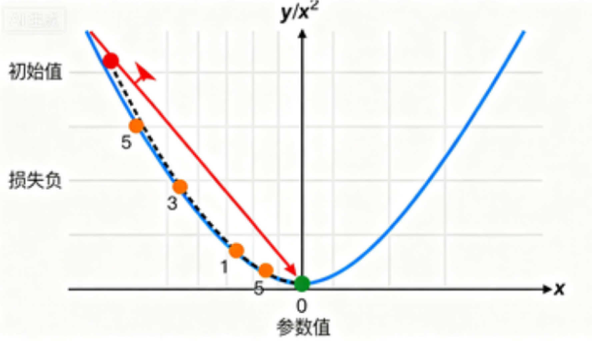
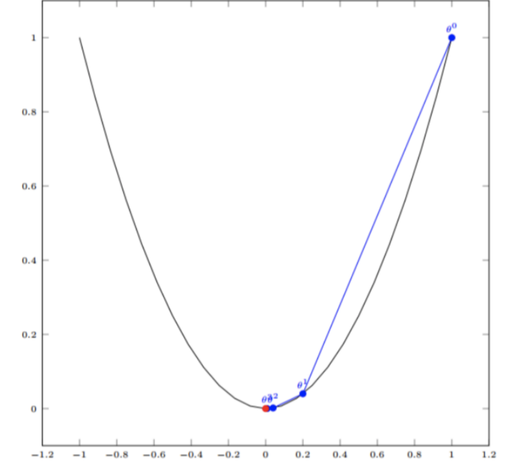
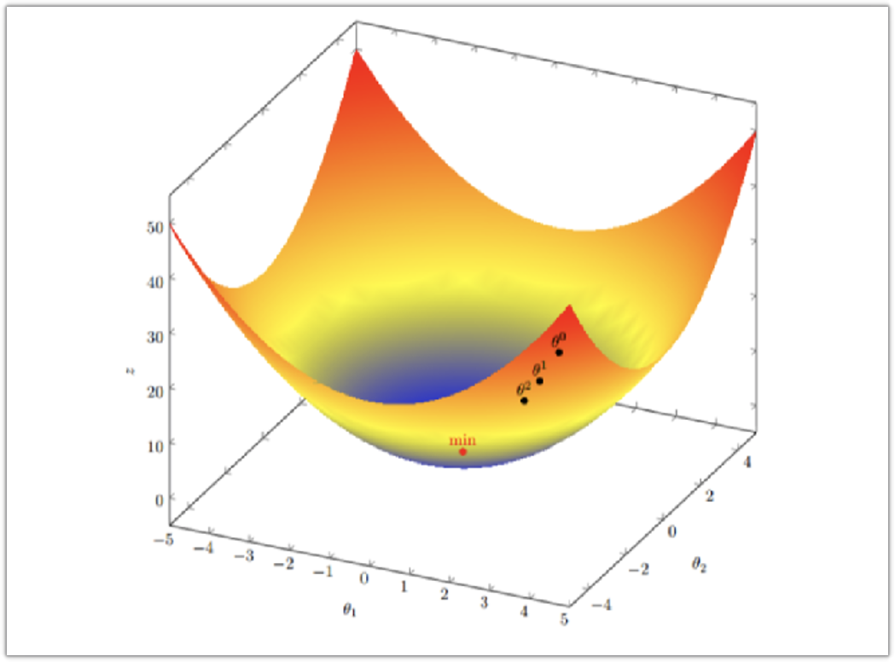
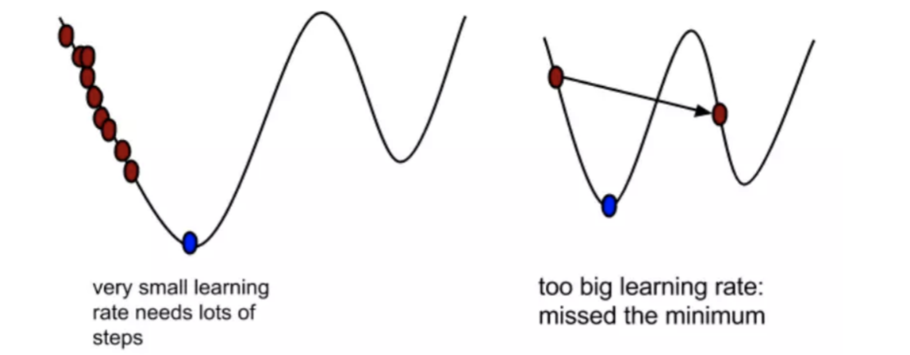
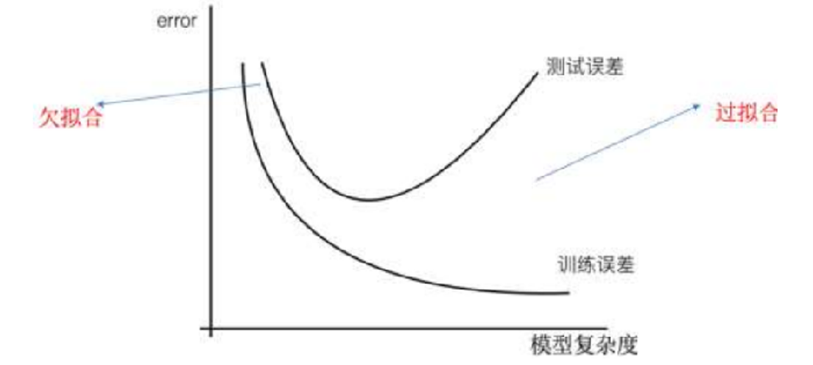
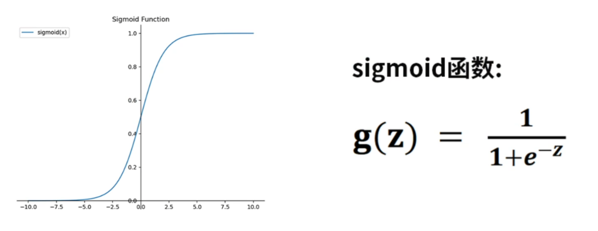

# Regression Algorithms

## Linear Regression


The linear regression problem is to find the **plane** in the figure above (whether it is a line or a plane, it is collectively called a **hyperplane**) such that the sum of squared distances from the plane to all points is minimized.

### Loss Function

Loss function: measures how well a **single sample** is predicted.

Cost function: measures how well the **entire data set (or a batch)** is predicted.

For a univariate linear equation: $y=kx+b$, the loss function is:
$$
J(k,b)=\sum_{i=0}^{n}(h(x^i)-y^i)^2=\sum_{i=0}^{n}(kx^i+b-y^i)^2
$$
For a multivariate linear equation:
$$
y=w_1x_1+w_2x_2+w_3x_3+w_4x_4+...+b
$$
Written another way:
$$
y=\begin{bmatrix}
x_1 & x_2 & x_3 & \dots & x_d
\end{bmatrix}
\begin{bmatrix}
w_1\\
w_2\\
w_3\\
\vdots\\
w_d
\end{bmatrix}+b
$$
Further simplified to:
$$
y=Xw^T+b
$$
where:
$$
Data\ set\ D=(x_1,y_1),(x_2,y_2),(x_3,y_3)...(x_n,y_n)
$$

$$
Weight\ vector\ w=\{w_1,w_2,w_3, \dots, w_d\}
$$

> 📖 **Can't understand the matrix notation? — Break it down with concrete numbers**
>
> Suppose you want to predict house prices (y), with 3 features: area ($x_1$), number of bedrooms ($x_2$), and age of the house ($x_3$).
>
> Linear regression model: $y = w_1 \times area + w_2 \times bedrooms + w_3 \times age + b$
>
> The matrix notation simply expresses the above formula using vector multiplication:
>
> $$y = [area, bedrooms, age] \times \begin{bmatrix} w_1 \\ w_2 \\ w_3 \end{bmatrix} + b$$
>
> i.e., $y = x \cdot w + b$
>
> The goal of training is to find the best $w_1, w_2, w_3$ and $b$ so that the predicted values are as close as possible to the real house prices.

### Normal Equation Method

Solve linear regression problems by solving a mathematical formula.

> **📝 Detailed Explanation of the Normal Equation — Compute the Optimal Parameters in One Shot**
>
> The Normal Equation is a **closed-form solution** that, unlike gradient descent, does not require step-by-step iteration. Instead, it directly computes the optimal parameters in one pass using matrix operations.
>
> ---
>
> **Step 1: Write out the model and the loss function**
>
> Linear regression model (incorporate the bias $b$ into the weights by adding a column of all 1s to $X$):
>
> $$\hat{y} = X\theta$$
>
> | Symbol     | Shape             | Meaning                                                       |
> | ---------- | ----------------- | ------------------------------------------------------------- |
> | $X$        | $n \times (d+1)$  | Design matrix, $n$ samples, $d$ features, **first column all 1s** (for the bias term) |
> | $\theta$   | $(d+1) \times 1$  | Parameter vector, containing $[b, w_1, w_2, ..., w_d]^T$      |
> | $\hat{y}$  | $n \times 1$      | The model's predictions for all samples                       |
> | $y$        | $n \times 1$      | The true values of all samples                                |
>
> > **Why add a column of 1s to X?** The original model is $y = w_1x_1 + w_2x_2 + b$. After adding a column of 1s, it becomes $y = b \cdot 1 + w_1x_1 + w_2x_2 = \theta_0 \cdot 1 + \theta_1 x_1 + \theta_2 x_2$, unified into the matrix product $X\theta$, which is neat and easy to differentiate.
>
> Mean squared error loss function (matrix form):
>
> $$J(\theta) = \frac{1}{n}(X\theta - y)^T(X\theta - y)$$
>
> Expanded, this is $\frac{1}{n}\sum_{i=1}^{n}(\hat{y}_i - y_i)^2$, i.e., the mean of the sum of squared prediction errors over all samples.
>
> ---
>
> **Step 2: Differentiate with respect to $\theta$ and set the derivative to zero**
>
> The loss function $J(\theta)$ is a **convex function** (bowl-shaped); its minimum occurs where the gradient is zero. Differentiating with respect to $\theta$:
>
> $$\frac{\partial J}{\partial \theta} = \frac{2}{n}X^T(X\theta - y)$$
>
> > **Key derivation points**: Expand $J(\theta) = \frac{1}{n}(\theta^T X^T X\theta - 2\theta^T X^T y + y^T y)$. When differentiating with respect to $\theta$, the quadratic term $\theta^T X^T X\theta$ has derivative $2X^T X\theta$, the linear term $-2\theta^T X^T y$ has derivative $-2X^T y$, and the constant term $y^T y$ has derivative 0. Combining these gives $\frac{2}{n}X^T(X\theta - y)$.
>
> Set the derivative to zero:
>
> $$X^T(X\theta - y) = 0$$
>
> $$X^T X\theta = X^T y$$
>
> This equation is called the **Normal Equation**.
>
> ---
>
> **Step 3: Solve for $\theta$**
>
> If $X^T X$ is invertible (usually satisfied when $n > d$, i.e., the number of samples is much larger than the number of features), multiply both sides on the left by $(X^T X)^{-1}$:
>
> $$\boxed{\theta = (X^T X)^{-1} X^T y}$$
>
> This is the final formula — all parameters are computed in one step!
>
> ---
>
> **Summary of the execution flow (5 steps)**:
>
> ```
> 原始数据 X (n×d)          目标值 y (n×1)
>      │                         │
>      ▼                         │
> ① 加一列全 1 → X_b (n×(d+1))	 │
>      │                         │
>      ▼                         ▼
> ② 计算 XᵀX  (d+1)×(d+1)    ③ 计算 Xᵀy  (d+1)×1
>      │                         │
>      ▼                         │
> ④ 求逆 (XᵀX)⁻¹                  │
>      │                         │
>      └─────────┬───────────────┘
>                ▼
>       ⑤ θ = (XᵀX)⁻¹ Xᵀy
>          得到所有参数！
> ```
>
> ---
>
> **Concrete numerical example** (3 samples, 1 feature, use the normal equation to solve $y = wx + b$):
>
> | Sample | x (area) | y (house price / 10k yuan) |
> | ------ | -------- | -------------------------- |
> | 1      | 50       | 100                        |
> | 2      | 80       | 150                        |
> | 3      | 120      | 220                        |
>
> **Step ①**: Construct $X_b$ (add the all-1s column) and the $y$ vector:
>
> $$X_b = \begin{bmatrix} 1 & 50 \\ 1 & 80 \\ 1 & 120 \end{bmatrix}, \quad y = \begin{bmatrix} 100 \\ 150 \\ 220 \end{bmatrix}, \quad \theta = \begin{bmatrix} b \\ w \end{bmatrix}$$
>
> **Step ②**: Compute $X^T X$:
>
> $$X^T X = \begin{bmatrix} 1 & 1 & 1 \\ 50 & 80 & 120 \end{bmatrix} \begin{bmatrix} 1 & 50 \\ 1 & 80 \\ 1 & 120 \end{bmatrix} = \begin{bmatrix} 3 & 250 \\ 250 & 23300 \end{bmatrix}$$
>
> **Step ③**: Compute $X^T y$:
>
> $$X^T y = \begin{bmatrix} 1 & 1 & 1 \\ 50 & 80 & 120 \end{bmatrix} \begin{bmatrix} 100 \\ 150 \\ 220 \end{bmatrix} = \begin{bmatrix} 470 \\ 41900 \end{bmatrix}$$
>
> **Step ④**: Compute $(X^T X)^{-1}$:
>
> $$(X^T X)^{-1} = \begin{bmatrix} 3 & 250 \\ 250 & 23300 \end{bmatrix}^{-1} = \frac{1}{3 \times 23300 - 250^2} \begin{bmatrix} 23300 & -250 \\ -250 & 3 \end{bmatrix} = \frac{1}{7400} \begin{bmatrix} 23300 & -250 \\ -250 & 3 \end{bmatrix}$$
>
> **Step ⑤**: Compute $\theta$:
>
> $$\theta = (X^T X)^{-1} X^T y = \frac{1}{7400} \begin{bmatrix} 23300 & -250 \\ -250 & 3 \end{bmatrix} \begin{bmatrix} 470 \\ 41900 \end{bmatrix}$$
>
> $$= \frac{1}{7400} \begin{bmatrix} 23300 \times 470 + (-250) \times 41900 \\ (-250) \times 470 + 3 \times 41900 \end{bmatrix} = \frac{1}{7400} \begin{bmatrix} 470000 \\ 8200 \end{bmatrix} = \begin{bmatrix} 63.51 \\ 1.108 \end{bmatrix}$$
>
> **Result**: $b \approx 63.51$, $w \approx 1.108$
>
> That is, the model is $y = 1.108x + 63.51$, meaning: for each additional 1 m² of area, the house price rises by about 1.108 ten-thousand yuan.
>
> > **Verification**: substituting x=50 → 1.108×50 + 63.51 ≈ 118.9 (close to 100); x=120 → 1.108×120 + 63.51 ≈ 196.5 (close to 220). The 3 points are not exactly on a straight line; the normal equation gives the optimal solution in the least-squares sense.
>
> ---
>
> **Normal equation vs gradient descent**:
>
> |                         | Normal equation                                | Gradient descent                          |
> | ----------------------- | ---------------------------------------------- | ----------------------------------------- |
> | Principle               | Directly solve $\theta = (X^TX)^{-1}X^Ty$      | Iteratively update $\theta = \theta - \alpha \nabla J$ |
> | Need to choose a learning rate | ❌ No                                    | ✅ Need to tune $\alpha$                  |
> | Need iteration          | ❌ Done in one step                            | ✅ Requires multiple iterations            |
> | When there are many features | ❌ Inversion complexity is $O(d^3)$, slow when $d$ is large | ✅ Not affected by the number of features |
> | When there are many samples | ✅ Only need to solve a $(d+1) \times (d+1)$ matrix | ❌ Each iteration traverses all samples |
> | When $X^TX$ is not invertible | ❌ Cannot be solved directly          | ✅ Works normally                          |
> | Corresponding in sklearn | `LinearRegression()` (default uses SVD decomposition, more stable) | `SGDRegressor()`  |
>
> > **Rule of thumb**: when the number of features $d < 10^4$, the normal equation (or sklearn's `LinearRegression`) is the first choice; when $d$ exceeds the ten-thousand range, switch to gradient descent.

#### Example - California Housing

```python
from sklearn.datasets import fetch_california_housing

# 使用sklearn自带的fetch接口加载加利福尼亚房价数据
data = fetch_california_housing(data_home='./data')

# 查看数据的基本信息
print("数据类型:", type(data))
print("属性列表:", data.__dir__())

# 特征名称
print("\n特征名称:")
print(data.feature_names)

# 前5行特征数据
print("\n前5行特征数据:")
print(data.data[:5])

# 前5个房价目标值
print("\n前5个房价目标值:")
print(data.target[:5])

# 数据总体形状
print("\n特征数据形状:", data.data.shape)
print("目标数据形状:", data.target.shape)

from sklearn.linear_model import LinearRegression
from sklearn.model_selection import train_test_split
from sklearn.preprocessing import StandardScaler
from sklearn.metrics import mean_squared_error

# 划分训练集和测试集
X = data.data
y = data.target
X_train, X_test, y_train, y_test = train_test_split(X, y, test_size=0.2, random_state=42)

# 标准化特征
scaler = StandardScaler()
X_train_scaled = scaler.fit_transform(X_train)
X_test_scaled = scaler.transform(X_test)

# 创建并训练线性回归模型
lr = LinearRegression()
lr.fit(X_train_scaled, y_train)
print(f'回归系数{lr.coef_}')	# 回归系数就是损失函数中的w1 w2 w3 ...
# 回归系数越大，对最终的影响结果就越大

# 在训练集和测试集上预测
y_train_pred_sklearn = lr.predict(X_train_scaled)
y_test_pred_sklearn = lr.predict(X_test_scaled)

# 评估模型
print("sklearn线性回归训练集均方误差: {:.4f}".format(mean_squared_error(y_train, y_train_pred_sklearn)))
print("sklearn线性回归测试集均方误差: {:.4f}".format(mean_squared_error(y_test, y_test_pred_sklearn)))
```

### Gradient Descent

The basic idea of gradient descent can be analogized to the process of descending a mountain.

Consider this scenario: a person is trapped on a mountain and needs to get down (to find the lowest point of the mountain, i.e., the valley). But the fog on the mountain is thick, making visibility very low. Therefore, the path down cannot be determined; he must use the information around him to find the way down. At this point, he can use the gradient descent algorithm to help himself descend. Specifically, based on his current position, **find the steepest place at that position, then walk in the direction where the mountain height decreases**. (Similarly, if our goal is to go up the mountain, i.e., climb to the summit, then we should walk in the steepest upward direction.) Then, after walking each segment of distance, he repeatedly applies the same method, and finally succeeds in reaching the valley.


The basic process of gradient descent is very similar to the mountain-descent scenario.

First, we have a **differentiable function**. This function represents a mountain. Our goal is to find **the minimum value of this function**, i.e., the bottom of the mountain.

According to the earlier scenario assumption, the fastest way down the mountain is to find the steepest direction at the current position and then walk downward along that direction. Corresponding to the function, this means **finding the gradient of the given point**, and then going in the direction opposite to the gradient, so that the function value decreases the fastest! Because the direction of the gradient is the direction in which the function changes fastest. So, we repeatedly use this method, computing the gradient again and again, and finally reach the local minimum, which is similar to our descent process. And computing the gradient determines the steepest direction, which is the means of measuring direction in the scenario.

**In a single-variable function, the gradient is actually the differential (derivative) of the function, representing the slope of the tangent line of the function at a given point.**

**In a multivariate function, the gradient is a vector. A vector has a direction, and the direction of the gradient indicates the direction in which the function rises fastest at a given point.**

This also explains why we go to great lengths to compute the gradient! We need to reach the bottom of the mountain, so at each step we need to observe the steepest place at that moment; the gradient happens to tell us this direction. The direction of the gradient is the direction in which the function rises fastest at a given point, so the opposite direction of the gradient is the direction in which the function falls fastest at a given point — this is exactly what we need. Therefore, as long as we keep walking in the direction opposite to the gradient, we can reach the local minimum!



#### The Gradient Descent Process

##### Gradient Descent for a Single-Variable Function

- Suppose the single-variable function is $J(\theta)=\theta^2$
- The gradient (differential, derivative) of the function is $J^{\prime}(\theta)=2\theta$
- Initialization: starting point $(1,1)$
- Learning rate $\alpha=0.4$

The iterative process of gradient descent

- $\theta^0=1$
- $\theta^1=\theta^0-\alpha*J^{\prime}(\theta^0)=1-0.4*2*1=0.2$
- $\theta^2=\theta^1-\alpha*J^{\prime}(\theta^1)=0.2-0.4*2*0.2=0.04$
- $\theta^3=\theta^2-\alpha*J^{\prime}(\theta^2)=0.04-0.4*2*0.04=0.008$
- $\theta^4=\theta^3-\alpha*J^{\prime}(\theta^3)=0.008-0.4*2*0.008=0.0016$

After four iterations, i.e., four steps, we basically reach the lowest point of the function, i.e., the bottom of the mountain.



##### Gradient Descent for a Multivariate Function

- Suppose the multivariate function is $J(\theta)=\theta_1^2+\theta_2^2$
- Observing, we find the lowest point is actually $(0,0)$; next, use gradient descent to compute it
- Suppose the initial starting point is $\theta_0=(1,3)$ and the learning rate of the function is $\alpha=0.1$
- The gradient of the function is $\nabla J=(2\theta_1, 2\theta_2)$, which is actually the partial derivatives of $\theta_1$ and $\theta_2$ respectively

The iterative process of gradient descent

- $\theta_0=(1,3)$
- $\theta_1=\theta_0-\alpha\nabla J(\theta_0)=(1,3)-0.1(2,6)=(0.8,2.4)$
- $\theta_2=\theta_1-\alpha\nabla J(\theta_1)=(0.8,2.4)-0.1(2*0.8，2*2.4)=(0.64,1.92)$
- $\theta_3=\theta_2-\alpha\nabla J(\theta_2)=(0.64,1.92)-0.1(2*0.64，2*1.92)=(0.512,1.536)$
- ...
- $\theta_{10}=(0.10737,0.3221)$
- ...
- $\theta_{100}=(1.6296e^{-10},4.8888e^{-10})$



#### Gradient Descent Formula

$$
\theta_{i+1}=\theta_i-\alpha\frac{\partial J(\theta)}{\partial\theta_i}=\theta_i-\eta\nabla J(\theta)
$$

> 📖 **Breaking down the gradient descent formula term by term**
>
> | Symbol                                        | Meaning                     | Intuitive understanding                     |
> | --------------------------------------------- | --------------------------- | ------------------------------------------- |
> | $\theta_i$                                    | Current position (parameter value at step i) | Where you are standing on the mountain now |
> | $\theta_{i+1}$                                | Next position               | Your position after taking one step          |
> | $\alpha$ or $\eta$                            | Learning rate (step size)   | How large a step you take each time          |
> | $\frac{\partial J(\theta)}{\partial\theta}$   | Gradient (partial derivative) | The steepest direction and slope at the current position |
> | The minus sign $-$                            | Walk in the **opposite direction** of the gradient | The gradient points uphill; we want to go downhill, so we walk in reverse |
>
> **Why is the gradient direction the "steepest"?**
>
> For the single-variable function $y=x^2$, the derivative is $2x$:
>
> - At x=3, the derivative=6 → positive → the function is rising → to descend, walk left (decrease)
> - At x=-3, the derivative=-6 → negative → the function is falling → to descend, walk right (increase)
>
> For the multivariate function $J(\theta_1,\theta_2) = \theta_1^2 + \theta_2^2$, the gradient is the vector $(2\theta_1, 2\theta_2)$:
>
> - At (1,3), the gradient=(2,6) → pointing outward from the origin is the direction of fastest function growth
> - We subtract 0.1×(2,6) = (0.2, 0.6), going from (1,3) to (0.8, 2.4) → closer to the origin (0,0)!
>
> **In one sentence**: the gradient tells you the fastest way up the mountain (the direction in which the function value increases fastest); you walk the opposite way to go down.

The learning rate $\alpha$ or $\eta$

- In gradient descent, α is called the **learning rate** or **step size**, meaning we can use α to control the distance of each step.
- In machine learning, α is generally 0.001~0.01.
- The gradient is the direction of fastest ascent; we need the direction of fastest descent, so we need to add a minus sign.

The step size determines the length advanced along the negative direction of the gradient at each step of the gradient descent iteration.

- If the learning rate is too small, the descent will be slow, i.e., the convergence will be slow.
- If the learning rate is too large, it is easy to overshoot the minimum and cause oscillation during descent.



How to understand $\frac{\partial J(\theta)}{\partial\theta_i}$:

- It is the mathematical notation of the partial derivative; in fact, it is the gradient, i.e., the partial derivatives along the direction of each feature.

Why is there a minus sign (or why do we subtract)?

- Adding a minus sign before the gradient means advancing in the direction opposite to the gradient.

  

#### Full Gradient Descent (FGD)

$$
\theta_{i+1}=\theta_i-\eta\nabla J(\theta)
$$

- **Compute the errors of all samples in the training set**, sum them up and take the average as the objective function.
- The weight vector moves in the direction opposite to its gradient, thereby reducing the current objective function the most.
- Because every update requires computing all gradients over the entire data set, **full gradient descent is very slow**. Moreover, full gradient descent cannot handle data sets that exceed memory capacity.
- Full gradient descent also cannot update the model online; that is, new samples cannot be added during the run. It computes the gradient of the loss function with respect to the parameter θ over the entire training data set (averaging the gradients over all samples).

#### Stochastic Gradient Descent (SGD)

$$
\theta_{i+1}=\theta_i-\eta\nabla J(\theta;x^{(i)};y^{(i)})
$$

- Because FGD needs to compute the errors of all samples for every weight update, and real-world problems often have hundreds of millions of training samples, the efficiency is low, and it is **prone to falling into local optima**. Therefore, the stochastic gradient descent algorithm was proposed.
- In SGD, the objective function computed in each round is no longer the error of all samples, but only the error of a single sample. That is, each time only one sample is substituted to compute the gradient of the objective function to update the weights, then the next sample is taken and the process repeats, until the loss function value stops decreasing or becomes smaller than an acceptable threshold.
- Since only one sample is used per iteration, and due to its strong randomness, SGD is usually not prone to getting stuck in local optima, **but the convergence process is unstable and may oscillate near the optimum, making it more difficult to use**.

#### Mini-Batch Gradient Descent (MGD)

$$
\theta_{i+1}=\theta_i-\eta\nabla J(\theta;x^{(i;i+n)};y^{(i;i+n)})
$$

- Mini-batch gradient descent is a compromise between FGD and SGD, combining the advantages of both methods to some extent.
- Each time, a small subset of samples is randomly drawn from the training sample set, and FGD is used to iteratively update the weights on this small subset.
- The number of sample points in the drawn small subset is called `batch_size`, and it is usually set to a power of 2, which is more conducive to GPU-accelerated processing.
- In particular, if `batch_size=1`, it becomes SGD; if `batch_size=n`, it becomes FGD.

> 📖 **FGD vs SGD vs MGD — a table to make it clear**
>
> |                    | FGD (full gradient)              | SGD (stochastic)          | MGD (mini-batch)                  |
> | ------------------ | -------------------------------- | ------------------------- | --------------------------------- |
> | How many samples per gradient computation | **All** n samples | **1** sample   | **A small batch** (e.g., 32)      |
> | Speed              | 🐢 Very slow (must scan all data each time) | 🐇 Very fast  | 🐎 Moderate                       |
> | Stability          | Steady descent                   | Bouncing around (oscillating) | Fairly stable              |
> | Memory             | Must fit all data at once        | Very low                  | Moderate                          |
> | Suitable scenarios | Small data sets                  | Online learning, streaming data | **Most common (deep learning default)** |
> | batch_size         | = n                              | = 1                       | A power of 2 (32, 64, 128...)     |
>
> **Analogy**: you want to walk to the bottom of the mountain
>
> - FGD: before each step, measure the slope in **all 360 directions**, choose the steepest to walk → most accurate direction, but measuring all around is too tiring
> - SGD: before each step, randomly pick **one direction** to measure the slope and go → fast but may get lost and go in circles
> - MGD: before each step, measure **several directions** and take the average slope → both fast and less likely to detour
>
> This is why deep learning almost always uses MGD (Mini-batch GD)!

#### Averaged Stochastic Gradient Descent (ASGD)

$$
\bar{\theta_t}=\frac{1}{t}\sum_{i=1}^{t}\theta_i
$$

- Take the arithmetic average of all historical parameters and finally use the averaged parameters (note: here ASGD refers to the "parameter averaging" strategy, different from gradient averaging algorithms such as SAG / SAGA)
- A similar idea exists in the EMA (exponential moving average) mechanism in deep learning

#### Example - California Housing

```python
from sklearn.datasets import fetch_california_housing
from sklearn.model_selection import train_test_split
from sklearn.linear_model import SGDRegressor
from sklearn.preprocessing import StandardScaler

# 使用sklearn接口加载加利福尼亚房价数据（全部样本）
california = fetch_california_housing(data_home='./data')
X = california['data']
y = california['target']

# 划分训练集和测试集
X_train, X_test, y_train, y_test = train_test_split(
    X, y, test_size=0.2, random_state=42
)

# 特征归一化（建议对特征做归一化，有利于收敛）
scaler_X = StandardScaler()
X_train_scaled = scaler_X.fit_transform(X_train)
X_test_scaled = scaler_X.transform(X_test)

# 使用sklearn自带的SGDRegressor（默认是梯度下降优化，solver='sgd'）
sgd_reg = SGDRegressor(
    max_iter=2000,  # 训练迭代轮数
    eta0=0.01,  # 初始学习率
    learning_rate="invscaling",  # 表示学习率以倒数缩减方式递减，计算公式为：
    # eta = eta0 / pow(t, power_t)
    # 其中eta0为初始学习率, t为迭代次数, power_t默认为0.25
    random_state=42
)
sgd_reg.fit(X_train_scaled, y_train)

from sklearn.metrics import mean_squared_error

# 在测试集上预测
y_pred = sgd_reg.predict(X_test_scaled)

# 计算均方误差
mse = mean_squared_error(y_test, y_pred)
print('测试集均方误差(MSE):', mse)
```

### Regression Model Evaluation Methods

- Mean Squared Error (MSE)
  $$
  MSE=\frac{1}{n}\sum_{i=1}^{n}(y_i-\hat{y_i})^2
  $$
  The average squared error; the smaller the value the better, but it amplifies the impact of outlier terms.

- Root Mean Squared Error (RMSE)
  $$
  RMSE=\sqrt{MSE}
  $$

- Mean Absolute Error (MAE)
  $$
  MAE=\frac{1}{n}\sum_{i=1}^{n}|\hat{y_i}-y_i|
  $$
  $n$ is the number of samples, $\hat{y_i}$ is the predicted value, and $y_i$ is the actual value. Generally, the smaller the model's error, the more accurate the prediction.

### Underfitting and Overfitting

- Underfitting: the model performs poorly on the training set and also poorly on the test set. The model is too simple.

- Overfitting: the model performs well on the training set but poorly on the test set. The model is too complex.

- Underfitting means the model has relatively large errors on both the training set and the test set; overfitting means small errors on the training set but large errors on the test set.

  


#### Underfitting

```python
import numpy as np
from matplotlib import pyplot as plt
from sklearn.linear_model import LinearRegression
from sklearn.metrics import mean_squared_error

# 定义模型欠拟合函数
def under_fitting():
    # 随机种子
    np.random.seed(22)
    # 准备数据X,y 增加噪声
    # 创建100个数据,在[-3,3]中取值,值是均匀分布的
    X = np.random.uniform(-3, 3, size=100)

    # y = 0.5x^2 + x + 2
    # np.random.normal(0,1,size=100): 增加噪声,噪声值为均值为0,方差为1的正态分布数据
    y = 0.5 * X ** 2 + X + 2 + np.random.normal(0, 1, size=100)

    # 训练模型
    model = LinearRegression()

    print(X.shape)
    print(type(X))

    # 模型训练
    # 训练数据是二维的,所以X需要reshape成二维的
    # -1的作用是告诉numpy,根据y的维度自动确定X的维度
    # 1 是列数
    X = X.reshape(-1, 1)
    model.fit(X, y)

    # 模型预测
    y_predict = model.predict(X)

    # 模型评估
    mse = mean_squared_error(y, y_predict)
    print("欠拟合模型MSE:", mse)
    print(f'回归系数{model.coef_}')
    # 6. 绘制图像
    plt.scatter(X, y)
    plt.plot(X, y_predict)
    plt.show()


under_fitting()
```


#### Just Right Fitting

```python
import numpy as np
from matplotlib import pyplot as plt
from sklearn.linear_model import LinearRegression
from sklearn.metrics import mean_squared_error

# 模型正好拟合
def fitting():
    # 随机种子
    np.random.seed(22)
    # 准备数据X,y 增加噪声
    # 创建100个数据,在[-3,3]中取值,值是均匀分布的
    x = np.random.uniform(-3, 3, size=100)

    # y = 0.5x^2 + x + 2
    # np.random.normal(0,1,size=100): 增加噪声,噪声值为均值为0,方差为1的正态分布数据
    y = 0.5 * x ** 2 + x + 2 + np.random.normal(0,1,size=100)

    # 训练模型
    model = LinearRegression()

    # 模型训练
    # 训练数据是二维的,所以X需要reshape成二维的
    # -1的作用是告诉numpy,根据y的维度自动确定X的维度
    # 1 是列数
    X = x.reshape(-1,1)
    print(X.shape)

    # 堆叠，增加二次项
    X2 = np.hstack([X,X ** 2])
    print(X2.shape)

    model.fit(X2,y)

    # 模型预测
    y_predict = model.predict(X2)

    # 模型评估
    mse = mean_squared_error(y,y_predict)
    print("正好拟合MSE:",mse)

    # 绘制图像
    plt.scatter(x,y)
    # 画图plot折线图时 需要对x进行排序, 取x排序后对应的y值
    plt.plot(np.sort(x), y_predict[np.argsort(x)], color='r')
    plt.show()

fitting()
```


#### Overfitting

```python
import numpy as np
from matplotlib import pyplot as plt
from sklearn.linear_model import LinearRegression
from sklearn.metrics import mean_squared_error


# 模型过拟合
def over_fitting():
    # 随机种子
    np.random.seed(22)
    # 准备数据X,y 增加噪声
    # 创建100个数据,在[-3,3]中取值,值是均匀分布的
    x = np.random.uniform(-3, 3, size=100)

    # y = 0.5x^2 + x + 2
    # np.random.normal(0,1,size=100): 增加噪声,噪声值为均值为0,方差为1的正态分布数据
    y = 0.5 * x ** 2 + x + 2 + np.random.normal(0, 1, size=100)

    # 训练模型
    model = LinearRegression()

    # 模型训练
    # 训练数据是二维的,所以X需要reshape成二维的
    # -1的作用是告诉numpy,根据y的维度自动确定X的维度
    # 1 是列数
    X = x.reshape(-1, 1)
    print(X.shape)

    # 堆叠，增加多次项
    X2 = np.hstack([X, X ** 2, X ** 3, X ** 4, X ** 5, X ** 6, X ** 7, X ** 8, X ** 9, X ** 10])
    print(X2.shape)

    model.fit(X2, y)

    # 模型预测
    y_predict = model.predict(X2)

    # 模型评估
    mse = mean_squared_error(y, y_predict)
    print("正好拟合MSE:", mse)
    print(f'回归系数{model.coef_}')
    # 绘制图像
    plt.scatter(x, y)
    # 画图plot折线图时 需要对x进行排序, 取x排序后对应的y值
    plt.plot(np.sort(x), y_predict[np.argsort(x)], color='r')
    plt.show()


over_fitting()
```


### Regularized Linear Models

Regularization: during model training, some features affect the model complexity, or a certain feature has many outliers, so we want to minimize the influence of that feature, or even remove the influence of that feature entirely.

> 📖 **Regularization — why "penalize" the weights?**
>
> When overfitting, the model sets feature weights very large to fit the noise. Regularization means **adding a "penalty ticket" after the loss function** — the larger the weight, the heavier the penalty. The model is forced to reduce the weights, and the curve naturally becomes smoother.
>
> **L1 vs L2 — understand it through "spending money"**
>
> |       | L1 (Lasso)                             | L2 (Ridge)                               |
> | ----- | -------------------------------------- | ---------------------------------------- |
> | Penalty term | $\alpha\sum\|w\|$ (sum of absolute weights) | $\alpha\sum w^2$ (sum of squared weights) |
> | Analogy | **Flat tax rate**: pay a fixed proportion of tax on every 1 yuan earned | **Progressive tax rate**: the more you earn, the higher the tax rate |
> | Effect | Presses unimportant weights **directly to 0** (feature selection) | Presses large weights **smaller but not to 0** (weight decay) |
> | When to use | Many features; want to automatically select the important ones | All features are useful; just want the model smoother |
>
> Numerical example (two weights w₁=3, w₂=0.5):
>
> - L1 penalty = |3| + |0.5| = 3.5 (penalizes small weights equally)
> - L2 penalty = 3² + 0.5² = 9 + 0.25 = 9.25 (large weights are heavily penalized!)
>
> L1 also penalizes w₂=0.5 and tends to press it to 0 (removing useless features)
> L2 penalizes w₁=3 far more heavily than w₂ and tends to shrink large weights first (making all weights evenly smaller)

#### L1 Regularization

$$
Regression\ function\ J(w)=MSE(w)+\alpha\sum_{i=1}^{n}|w_i|
$$

- $\alpha$ is called the penalty coefficient. The larger its value, the larger the amplitude of weight adjustment, i.e., the greater the penalty on feature weights.
- L1 regularization makes weights tend toward 0, even equal to 0, making some features ineffective, thus achieving the goal of feature selection.
- $w_i$ is the added regularization term. It can be understood that **$w_i$ is the sum of the weights, so the whole thing is restricting the sum of all feature weights to a certain range**.
  $$
  y=w_1x_1+w_2x_2+w_3x_3+w_4x_4+...+b
  $$

- L1 regularization makes **some $w_i$ in the above formula approach** 0, thereby **achieving the purpose of feature selection**.

##### Lasso Regression

Example - California Housing

```python
from sklearn.datasets import fetch_california_housing
from sklearn.metrics import mean_squared_error
from sklearn.model_selection import train_test_split
from sklearn.preprocessing import StandardScaler

# 使用sklearn接口加载加利福尼亚房价数据（全部样本）
california = fetch_california_housing(data_home='./data')
X = california['data']
y = california['target']

# 划分训练集和测试集
X_train, X_test, y_train, y_test = train_test_split(
    X, y, test_size=0.2, random_state=42
)

# 特征归一化（建议对特征做归一化，有利于收敛）
scaler_X = StandardScaler()
X_train_scaled = scaler_X.fit_transform(X_train)
X_test_scaled = scaler_X.transform(X_test)

from sklearn.linear_model import Lasso

# 创建并训练线性回归模型
lr = Lasso(alpha=0.01)
lr.fit(X_train_scaled, y_train)
print(f'回归系数{lr.coef_}')

# 在训练集和测试集上预测
y_train_pred_sklearn = lr.predict(X_train_scaled)
y_test_pred_sklearn = lr.predict(X_test_scaled)

# 评估模型
print("sklearn线性回归训练集均方误差: {:.4f}".format(mean_squared_error(y_train, y_train_pred_sklearn)))
print("sklearn线性回归测试集均方误差: {:.4f}".format(mean_squared_error(y_test, y_test_pred_sklearn)))
```

#### L2 Regularization

$$
Regression\ function\ J(w)=MSE(w)+\alpha\sum_{i=1}^{n}w_i^2
$$

- $MSE(w)$ is the mean squared error, a loss function used to measure how well the regression model fits.
- $\alpha$ is called the penalty coefficient. The larger its value, the larger the amplitude of weight adjustment, i.e., the greater the penalty on feature weights.
- L2 regularization makes **high-dimensional weights tend toward** 0, i.e., it makes $\theta_n\,\theta_{n-1}...$ tend toward 0, thereby simplifying the function, smoothing it, and reducing the overfitting problem.
  $$
  y=\theta_0+\theta_1x+\theta_2x^2+...+\theta_nx^n
  $$

- When $\alpha=0$, ridge regression degenerates into linear regression.

##### Ridge Regression

Example - California Housing

```python
import numpy as np
from sklearn.datasets import fetch_california_housing
from sklearn.metrics import mean_squared_error
from sklearn.model_selection import train_test_split
from sklearn.preprocessing import StandardScaler

# 使用sklearn接口加载加利福尼亚房价数据（全部样本）
california = fetch_california_housing(data_home='./data')
X = california['data']
y = california['target']

# 划分训练集和测试集
X_train, X_test, y_train, y_test = train_test_split(
    X, y, test_size=0.2, random_state=42
)

# 特征归一化（建议对特征做归一化，有利于收敛）
scaler_X = StandardScaler()
X_train_scaled = scaler_X.fit_transform(X_train)
X_test_scaled = scaler_X.transform(X_test)

from sklearn.linear_model import Ridge

# 使用交叉验证(网格搜索)选择最佳alpha
from sklearn.model_selection import GridSearchCV

# np.logspace用于生成等比（对数）间隔的数值序列，用于alpha的取值范围，例如：np.logspace(-3, 3, 30)表示在10的-3次方到10的3次方之间生成30个数
alphas = np.logspace(-3, 3, 30)
ridge = Ridge()
param_grid = {'alpha': alphas}
grid = GridSearchCV(ridge, param_grid, scoring='neg_mean_squared_error', cv=5)
grid.fit(X_train_scaled, y_train)

best_alpha = grid.best_params_['alpha']
print(f'最优alpha: {best_alpha}')

# 用最优alpha重新训练模型
lr = Ridge(alpha=best_alpha)
lr.fit(X_train_scaled, y_train)
print(f'回归系数{lr.coef_}')

# 在训练集和测试集上预测
y_train_pred_sklearn = lr.predict(X_train_scaled)
y_test_pred_sklearn = lr.predict(X_test_scaled)

# 评估模型
print("sklearn线性回归训练集均方误差: {:.4f}".format(mean_squared_error(y_train, y_train_pred_sklearn)))
print("sklearn线性回归测试集均方误差: {:.4f}".format(mean_squared_error(y_test, y_test_pred_sklearn)))
```


## Logistic Regression


Logistic regression is actually also about finding this hyperplane.

If the points above the hyperplane are positive samples and the points below it are negative samples, then we only need to find this hyperplane, and afterwards we can predict whether a sample point is a positive or negative instance.

The problem logistic regression needs to solve is the same as linear regression — find the weight coefficients $w$ corresponding to each feature.

The hyperplane function of linear regression is as follows:
$$
y=w_1x_1+w_2x_2+w_3x_3+w_4x_4+...+b
$$
We have already found this function, i.e., we have found this hyperplane.

Suppose in classification, the positive sample points have label value 1 and the negative sample points have label value 0. How do we convert the function value into the classification label value [0,1]?



**Logistic regression = sigmoid function + linear regression**

> 📖 **Sigmoid function — "squash" any number into a probability**
>
> $$g(z) = \frac{1}{1+e^{-z}}$$
>
> The S-shaped curve of this function:
>
> | z value | $e^{-z}$         | g(z)               | Meaning     |
> | ------- | ---------------- | ------------------ | ----------- |
> | z = -∞  | $e^{∞} = ∞$      | 1/(1+∞) → **0**    | Function lower bound |
> | z = -2  | $e^2 ≈ 7.39$     | 1/8.39 ≈ **0.12**  | Very low probability |
> | z = 0   | $e^0 = 1$        | 1/2 = **0.50**     | 50% probability |
> | z = +2  | $e^{-2} ≈ 0.14$  | 1/1.14 ≈ **0.88**  | Very high probability |
> | z = +∞  | $e^{-∞} = 0$     | 1/1 → **1**        | Function upper bound |
>
> **Why use it?**
>
> 1. The output is exactly between [0,1] → naturally interpretable as "probability"
> 2. 0.5 is the dividing line: above 0.5 classify as positive, below 0.5 as negative
> 3. Smooth and differentiable → gradient descent can optimize it
>
> **Reviewing the process**:
>
> 1. Sample features → substitute into linear regression $z = w·x + b$ → get a number (possibly very large or very small)
> 2. This number → substitute into sigmoid $g(z)$ → get a probability between [0,1]
> 3. Probability > 0.5? → predict positive class; otherwise → predict negative class

Computation flow:

- Substitute the feature values of each feature of the sample into the hyperplane function
- Compute the result of the hyperplane function
- Substitute the result of the hyperplane function into z in the sigmoid function
- Judge the result of the sigmoid function
  - If greater than 0.5, we consider it a positive sample point
  - If less than 0.5, we consider it a negative sample point
- Another meaning of the sigmoid function result is the probability that the sample point is a positive sample point.

The model function of logistic regression
$$
z=w_1x_1+w_2x_2+w_3x_3+w_4x_4+...+b=w·x+b
$$

$$
g(z)=\frac{1}{1+e^{-z}}
$$

After substituting z, this becomes the model function of logistic regression.
$$
g(z)=\frac{1}{1+e^{-(w·x+b)}}
$$
Note:

- The value range of $g(z)$ is [0,1]
- The result of $g(z)$ can be understood as the probability that the sample point is a positive sample point.

### Loss Function

In actual samples, instances are only positive or negative sample points, i.e., the label values only have the results 1 and 0.

But the result $g(z)$ obtained through the sigmoid function is not only 0 and 1; it also includes any decimal between 0 and 1.

For example, when $g(z)=0.68$, then in the logistic regression model we consider this sample point to be a positive sample point, i.e., the value of $g(z)$ is 1.

Therefore, there is an error between the function computation result of logistic regression and the true value. How should this error be described?

- The error of a single sample point
  $$
  Loss(single)=-y^i\ln(g(x^i))-(1-y^i)\ln(1-g(x^i))
  $$

  - $y^i$ is the true label of the sample, and $y^i$ has only two possible values: 1 or 0.
  - When $y^i$ is a positive sample point (y=1), error = $-\ln(g(x^i))$. The closer g is to 1, the closer ln(g) is to 0, the smaller the loss. ✓
  - When $y^i$ is a negative sample point (y=0), error = $-\ln(1-g(x^i))$. The closer g is to 0, the closer 1-g is to 1, the closer ln(1-g) is to 0, the smaller the loss. ✓

- The error of all sample points
  $$
  Loss(total)=-\sum_{i=1}^{n}\left[y^i\ln(g(x^i))+(1-y^i)\ln(1-g(x^i))\right]
  $$
  Adding the errors of each sample point gives the sum of errors of all sample points.

- **The true form of the loss function**, also called **binary cross-entropy loss**
  $$
  Loss(x,y)=-\frac{1}{n}\sum_{i=1}^{n}\left[y^i\ln(g(z))+(1-y^i)\ln(1-g(z))\right]
  $$

> 📖 **Cross-entropy loss — why can this formula measure error?**
>
> Experience it intuitively with numbers:
>
> | g(z) (model predicted probability) | when y=1, Loss = -ln(g)            | when y=0, Loss = -ln(1-g)          |
> | ---------------------------------- | ---------------------------------- | ---------------------------------- |
> | 0.99 (very confident and correct)  | -ln(0.99) ≈ **0.01** ✓ very small  | -ln(0.01) ≈ **4.6** ✗ very large   |
> | 0.5 (random guess)                 | -ln(0.5) ≈ **0.69**                | -ln(0.5) ≈ **0.69**                |
> | 0.01 (completely wrong)            | -ln(0.01) ≈ **4.6** ✗ very large   | -ln(0.99) ≈ **0.01** ✓ very small  |
>
> Rule: **the closer the prediction is to the true label, the smaller the loss; the more outrageous the prediction, the loss increases sharply.**
>
> When y=1 and g=0.01 → loss 4.6 (severely penalizes "classifying a positive example as negative")
> When y=0 and g=0.99 → loss 4.6 (severely penalizes "classifying a negative example as positive")
>
> This is why this formula can drive the model to learn in the right direction!

- Dividing the error sum by n means averaging, reducing the influence of a single sample point.
- Why add the minus sign? Because $g(z)$ is between 0 and 1, so $ln(g(z))$ is less than 0. Adding the sign uniformly makes it positive, making it convenient to find the minimum.

### Example - Breast Cancer Binary Classification

```python
import pandas as pd
from sklearn.model_selection import train_test_split
from sklearn.linear_model import LogisticRegression
from sklearn.metrics import classification_report, confusion_matrix, accuracy_score

# 读取 csv，替换问号为 np.nan
df = pd.read_csv('data/breast-cancer-wisconsin.csv', na_values=["?"], header=None)

# 删除包含空值的样本
df_clean = df.dropna()

# 选定特征和标签
# 假设最后一列为标签
X = df_clean.iloc[:, 1:-1]
y = df_clean.iloc[:, -1]

print("X shape:", X.shape)
print("y shape:", y.shape)
print("X dtypes:")
print(X.dtypes)
print("y dtype:")
print(y.dtype)

# 分割数据集
X_train, X_test, y_train, y_test = train_test_split(
    X, y, test_size=0.2, random_state=42, stratify=y)

# 逻辑回归模型
model = LogisticRegression(max_iter=1000)
model.fit(X_train, y_train)

# 预测与评估
y_pred = model.predict(X_test)
print("Confusion Matrix:")
print(confusion_matrix(y_test, y_pred))
print("\nClassification Report:")
print(classification_report(y_test, y_pred))
print("Accuracy: %.4f" % accuracy_score(y_test, y_pred))

# 打印回归系数
print("回归系数：", model.coef_)
# 输出各测试样本属于每个类别的概率值
y_proba = model.predict_proba(X_test)
print("预测为每一类别的概率（前10个样本）：")
print(y_proba[:10])
print(y_test[:10])
```
