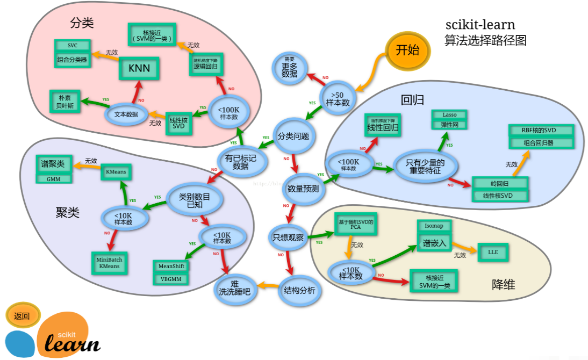
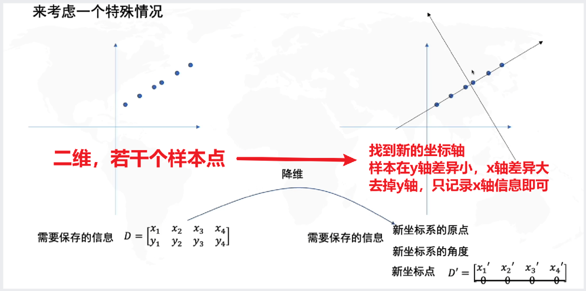

# scikit-learn

## Installation

```python
pip install -U scikit-learn
# -U表示，如果已经安装了sklearn，那么将其升级到最新版本
```

## Model Selection



## Feature Extraction

### Loading Features from Dictionaries

`DictVectorizer` converts a list of dictionaries containing features into a numeric matrix (feature vectors) that machine learning models can use directly.

```python
# 导入字典提取器
from sklearn.feature_extraction import DictVectorizer
import pandas as pd

# 准备字典数据
data = [
    {'颜色': '红', '尺寸': '大', '价格': 100},
    {'颜色': '蓝', '尺寸': '中', '价格': 80},
    {'颜色': '红', '尺寸': '小', '价格': 50}
]

# 初始化字典提取器
# sparse=False 表示返回的矩阵是二维的，而不是稀疏矩阵
# sparse=True 默认值，返回的矩阵是稀疏矩阵, 稀疏矩阵只保存非零的元素,省内存
# 稀疏矩阵: 矩阵中，大多数值都为0的矩阵
dict_vec = DictVectorizer(sparse=False)

# 提取特征
X = dict_vec.fit_transform(data)

# 查看结果
print(X)

# 查看特征名
print(dict_vec.get_feature_names_out())

# 结合DataFrame查看结果
pd.DataFrame(X, columns=dict_vec.get_feature_names_out())
```

Interpreting the result:

- The numeric feature "价格" (price) keeps its original value directly (first column);
- The categorical feature "颜色" (color) is one-hot encoded into "颜色=红" (color=red) and "颜色=蓝" (color=blue)
- The categorical feature "尺寸" (size) is one-hot encoded into "尺寸=大" (size=large), "尺寸=中" (size=medium), and "尺寸=小" (size=small)

Additional notes: One-hot encoding is a **one-bit effective encoding**. Its core characteristic is: within a group of codes, **only one binary bit is 1 at any time, and all the remaining bits are 0**. Instead of conveying information through numeric magnitudes, this encoding uses "which bit is 1" to uniquely identify a state or category, which is why it is also called a "one-hot code" or "one-bit effective code".

- For example, for the three labels "猫、狗、鸟" (cat, dog, bird), the one-hot codes are [1,0,0] (cat), [0,1,0] (dog), and [0,0,1] (bird)

- It avoids the "numeric magnitude association" of labels (e.g., binary codes 00, 01, 10 may be misinterpreted by a model as "cat < dog < bird", whereas one-hot encoding does not have this problem), and it also fits the output layer of neural networks (e.g., the cross-entropy computation between the Softmax layer output and one-hot labels)

- Advantages: simple to decode, good temporal performance, and suitable for scenarios with few states and high speed requirements

### Loading Features from English Text

`CountVectorizer` converts English text (or text in other languages) into a numeric feature matrix based on word frequency (i.e., counting how many times each word appears in a document).

```python
import pandas as pd
from sklearn.feature_extraction.text import CountVectorizer

# 样本文本（3个文档）
documents = [
    "I love machine learning. Machine learning is interesting.",
    "I love coding. Coding is fun and useful.",
    "Machine learning and coding are my favorite skills."
]

# 创建CountVectorizer对象（默认参数：小写化文本、按空格/标点分词、不过滤停用词）
# min_df/max_df参数解释:
# min_df：最小文档频率，即单词至少出现的文档次数或比例，低于此阈值的单词将被忽略（注意是出现的文档数）
# max_df：最大文档频率，即单词在文档中的文档次数或比例，高于此阈值的单词将被忽略
# 当min_df和max_df都为整数时，表示单词出现的次数， 当min_df和max_df都为小数时，表示单词在文档中的比例
count_vec = CountVectorizer(min_df=2)

# 训练并转换文档
X = count_vec.fit_transform(documents)

# 查看结果
print(X.toarray())

# 查看特征名
print(count_vec.get_feature_names_out())

# 结合DataFrame查看
df = pd.DataFrame(X.toarray(), columns=count_vec.get_feature_names_out())
print(df)
```

### Loading Features from Chinese Text

First use `jieba` for word segmentation, then use `CountVectorizer` to load the features.

```python
import jieba
from sklearn.feature_extraction.text import CountVectorizer
import pandas as pd

# 1. 文本
documents = [
    "人生苦短，我喜欢 python",
    "人生漫长，不用 python python",
    "人生漫漫，不用 python python python"
]

# 2. 文本分词，得到一个分词之后的文本列表
cut_doucuments = [" ".join(jieba.cut(document)) for document in documents]
print(cut_doucuments)

# 3. 创建特征提取对象
vectorizer = CountVectorizer(min_df=2)

# 4. 创建特征矩阵
X = vectorizer.fit_transform(cut_doucuments)

# 5. 使用DataFrame查看结果
pd.DataFrame(X.toarray(), columns=vectorizer.get_feature_names_out())
```

### TF-IDFVectorizer

`TF-IDFVectorizer` introduces **inverse document frequency (IDF)** weights on top of **term frequency (TF)**, which measures the "importance" of a word in a text more reasonably and prevents high-frequency but semantically meaningless words (such as "the" and "is") from dominating the features.

**Term Frequency (TF)**: how frequently a word appears in the current document. The formula is:
$$
TF(t,d)=\frac{number\ of\ times\ word\ t\ appears\ in\ document\ d}{total\ number\ of\ words\ in\ document\ d}
$$
In practice, scikit-learn uses the raw "count of occurrences" as TF by default rather than the frequency, which is simpler and more intuitive.

**Inverse Document Frequency (IDF)**: measures how "rare" a word is — if a word appears in most documents, its IDF will be low (e.g., "is", "and"); if it appears in only a few documents, its IDF will be high (e.g., "machine learning", "coding"). The formula is:
$$
IDF(t)=log(\frac{total\ number\ of\ documents}{number\ of\ documents\ containing\ word\ t\ +\ 1})
$$
Adding 1 to the denominator avoids the division-by-zero error when "the number of documents containing word t is 0 (test set)" — this is "smoothing". The log uses base 10.

Finally, **TF-IDF value = TF × IDF**, which combines the word's "frequency of occurrence" in the current document with its "rarity" across all documents. The higher the value, the more important the word is for distinguishing the current document.

```python
from sklearn.feature_extraction.text import TfidfVectorizer
import pandas as pd

# 样本文本（3个文档）
documents = [
    "I love machine learning. Machine learning is interesting.",
    "I love coding. Coding is fun and useful.",
    "Machine learning and coding are my favorite skills."
]

# 2. 创建TF-IDF对象
# stopwords='english' 忽略英文中的停用词
# 停用词: 指文本中频繁出现，但通常对语义理解帮助不大的虚词或常见词
tfidf = TfidfVectorizer(min_df=1, stop_words='english')

# 3. 创建特征矩阵
X = tfidf.fit_transform(documents)

# 4. 显示结果
print(pd.DataFrame(X.toarray(), columns=tfidf.get_feature_names_out()))
```

## Numerical Feature Preprocessing

The core goal is to adjust the scale, distribution, or fill in missing values of the data so that it better fits the model's assumptions (e.g., linear models assume features share similar distributions), thereby improving the stability and performance of the model.

> 📖 **Why do we need to "scale" features? — An intuitive example**
>
> Suppose you want to predict house prices and you have two features:
>
> - Area: 50~300 (square meters)
> - Number of bedrooms: 1~5 (rooms)
>
> Without any processing, the area value (300) is 60 times larger than the number of bedrooms (5). The model will think "area" is far more important than "number of bedrooms", and gradient descent will oscillate violently in the direction of area.
>
> After scaling, both features are in a similar range (e.g., 0~1), so the model can treat every feature fairly, and gradient descent becomes more stable.

### Normalization (Min-Max Scaling)

`MinMaxScaler` performs a linear transformation using the minimum and maximum values of a feature, mapping feature values linearly into a specified finite interval (such as [0,1] or [-1,1], or any arbitrary range) to eliminate the difference in units among features. The formula is:
$$
X_{scaled}=\frac{X-X_{min}}{X_{max}-X_{min}}\times(max\_range-min\_range)+min\_range
$$
The default range is [0,1]. The characteristics of this linear transformation are:

- It does not change the **distribution shape** of the data (e.g., if the original data is uniformly distributed, it remains uniformly distributed after normalization)
- It does not change the **relative relationships** between data points (e.g., if A > B in the original data, then A' > B' after normalization)
- It only changes the **absolute numerical range** of the data, thereby removing scale differences

```python
import numpy as np
from sklearn.preprocessing import MinMaxScaler

# 创建数据
data = np.array([[1, 200], [2, 300], [3, 400]])
print(data)

# 创建归一化类
scaler = MinMaxScaler(feature_range=(0, 1))

# 训练并归一化数据
data_scaled = scaler.fit_transform(data)

# 显示结果
print(data_scaled)
```

### Standardization

`StandardScaler` transforms features into a distribution with **mean 0 and standard deviation 1**, preserving the relative dispersion of the data; the data distribution remains the original distribution.

It is based on the mean and standard deviation of the features. The formula is:
$$
X_{scaled}=\frac{X-\mu}{\sigma}
$$

```python
import numpy as np
from sklearn.preprocessing import StandardScaler

# 创建数据
data = np.array([[1, 200], [2, 300], [3, 400]])

# 创建标准化类
scaler = StandardScaler()

# 训练并标准化数据
data_scaled = scaler.fit_transform(data)

# 显示结果
print(data_scaled)
```

> 📖 **Normalization vs Standardization — when to use which?**
>
> |                   | Normalization (MinMaxScaler)                    | Standardization (StandardScaler)                  |
> | ----------------- | ----------------------------------------------- | ------------------------------------------------ |
> | Formula           | $\frac{X-X_{min}}{X_{max}-X_{min}}$             | $\frac{X-\mu}{\sigma}$                           |
> | Result range      | Precisely controlled to [0,1] or [a,b]          | Mean=0, standard deviation=1 (range unknown)     |
> | Sensitivity to outliers | ❌ Severe (one extreme value compresses the other data) | ✅ Less sensitive                          |
> | Suitable scenarios | Image processing (pixel values 0-255 → 0-1), scenarios needing a fixed range | KNN, SVM, linear regression, logistic regression, PCA |
> | Distribution shape | Preserves the original distribution shape       | Preserves the original distribution shape         |
>
> **Rule of thumb**:
>
> - Data has outliers → prefer standardization
> - A strict range is required → use normalization
> - Not sure → try standardization first (works for most cases)

## Handling Missing Values

`SimpleImputer` handles missing values (NaN).

Key parameter: strategy (imputation strategy)

- `mean`: fill with the mean (suitable for continuous features that are approximately normally distributed)
- `median`: fill with the median (suitable for continuous features containing outliers)
- `most_frequent`: fill with the mode (suitable for categorical or discrete features)
- `constant`: fill with a constant (requires specifying ` fill_value`)

```python
import numpy as np
from sklearn.impute import SimpleImputer

# 创建数据(包含缺失值)
data = np.array([[1, np.nan], [2, 300], [np.nan, 400]])

# 创建缺失值处理类
# strategy: mean, median, most_frequent, constant
# mean: 使用数据的平均值填充缺失值
imputer = SimpleImputer(missing_values=np.nan, strategy='mean')

# 训练模型并预测
data_new = imputer.fit_transform(data)

# 输出结果
print(data_new)
```

## Feature Selection — Variance Threshold

**Select a subset from the original features (keep some features / drop some features)** in order to reduce the feature dimension and improve computational efficiency.

Use the variance threshold `VarianceThreshold` to remove low-variance features.

```python
import numpy as np
from sklearn.feature_selection import VarianceThreshold

data = np.array([[0, 2, 0, 3], [0, 1, 4, 3], [0, 1, 1, 3]])
print(data)

# 创建选择器
# threshold: 阈值，默认threshold=0，即删除所有方差为0的特征
selector = VarianceThreshold(threshold=0.05)  # 保留方差≥0.05的特征

# 训练数据
selected_data = selector.fit_transform(data)

# 输出结果
print(selected_data)
```

## Feature Dimensionality Reduction — PCA

Dimensionality reduction maps high-dimensional features into a lower-dimensional space through linear or nonlinear mathematical transformations, producing entirely new low-dimensional features (not a subset of the original features). The core goal is to preserve as much of the original information as possible while reducing dimensionality.



Dimensionality reduction: a 2D plane has 5 sample points. If we find a 1D number axis and project the 5 sample points onto it, minimizing the sum of perpendicular distances determines the axis position. The coordinates of the 5 sample points in the new axis coordinate system are the feature values after dimensionality reduction.

**PCA (Principal Component Analysis)**: a linear dimensionality reduction method belonging to unsupervised learning; it does not rely on label information.

**Core idea**: Principal Component Analysis (PCA) is an unsupervised learning method that aims to map the original high-dimensional data into a low-dimensional space through a linear transformation while preserving as much variance (i.e., information) as possible. In simple terms, PCA finds a new set of coordinate axes (called principal components) that capture the greatest variability in the data, allowing the original data to be approximated with fewer dimensions.

> 📖 **PCA dimensionality reduction — understand it through "camera angles"**
>
> Imagine photographing a group of people standing on the ground. Their positions are three-dimensional (x, y, z), but if you shoot from directly above, the photo is two-dimensional — you "project" the 3D data onto a plane, yet the positional relationships among the people are mostly preserved.
>
> What PCA does: find the **best camera angle**.
>
> - Principal component 1 (PC1): the direction in which the data spreads the most → photographing along this direction preserves the most information
> - Principal component 2 (PC2): among the directions perpendicular to PC1, the direction in which the data spreads the most
> - ...
>
> If the first 2 principal components already explain 95% of the variance (information), then you can compress the high-dimensional data to 2 dimensions while still preserving 95% of the information!
>
> **The `n_components` parameter**:
>
> - Integer (e.g., `n_components=2`): keep 2 principal components
> - Float (e.g., `n_components=0.95`): automatically keep enough principal components so that they explain 95% of the variance
>
> This is a very clever dimensionality reduction method: instead of picking a few of the original features, it **recombines** the original features to create the most information-dense "new features".

```python
from sklearn.decomposition import PCA
import numpy as np

# 创建PCA对象
# n_components 是整数时: 保留的维度
# n_components 是小数(0~1)时: 保留的主成分解释的方差比例
pca = PCA(n_components=2)

# 准备数据
X = np.array([[0, 2, 0, 3], [0, 1, 4, 3], [0, 1, 1, 3]])

# 训练PCA模型
X_pca = pca.fit_transform(X)

# 输出结果
print(f"原始数据结构：{X.shape[0]}个数据, {X.shape[1]}维")
print(f"降维后特征数：{X_pca.shape[0]}个数据, {X_pca.shape[1]}维")
```
