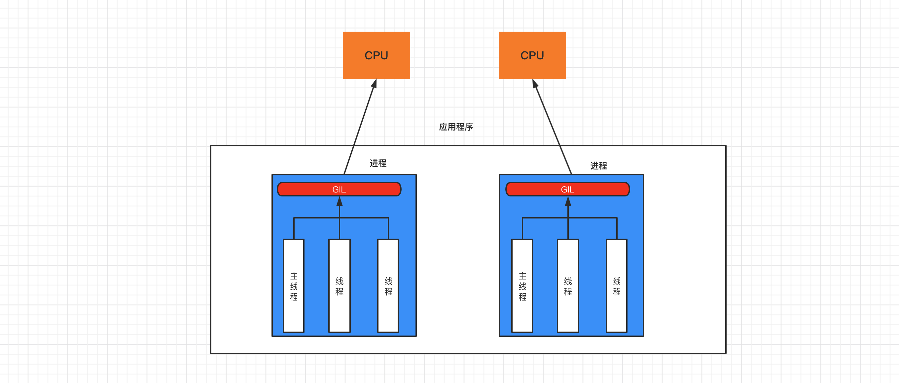
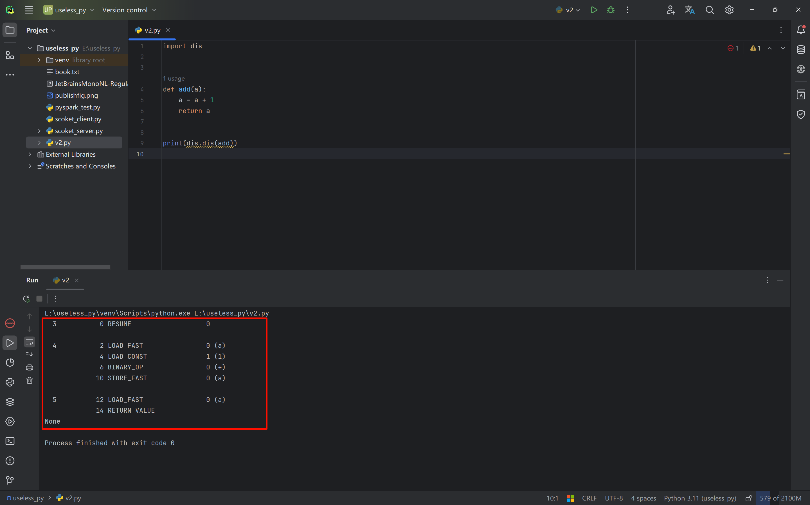
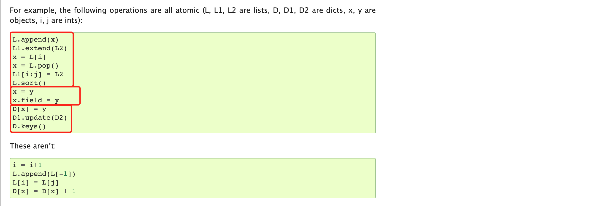

# Threads

## 1. Processes and Threads

Let's first understand processes and threads.

Analogy:

- A **factory** has at least one **workshop**, and a workshop has at least one **worker**. Ultimately, it is the workers who do the work.

- A **program** has at least one **process**, and a process has at least one **thread**. Ultimately, it is the threads that do the work.

  ```
  上述串行的代码示例就是一个程序，在使用python xx.py 运行时，内部就创建一个进程（主进程），在进程中创建了一个线程（主线程），由线程逐行运行代码。
  ```

Processes and threads:

- A thread is the smallest unit in a computer that can be scheduled by the CPU (it is what actually does the work).
- A process is the smallest unit of resource allocation in a computer (the process provides resources for threads).

A process can have multiple threads, and threads in the same process can share the resources of that process.


Previously, in the programs we developed, all behavior could only run in a serial manner — executing one by one in a queue. If the one ahead hasn't finished, the ones behind cannot continue. For example:

```python
result = 0
for i in range(100000000):
    result += i
print(result)
```

```python
import time
import requests

url_list = [
    ("抖音视频1.mp4", "https://v26-web.douyinvod.com/d715a7c5935857e3135400032fc7297e/66518623/video/tos/cn/tos-cn-ve-15/o0nQXgbOIVmul8IAehaBAsCoD5RAMgFg9EflJu/?a=6383&ch=5&cr=3&dr=0&lr=all&cd=0%7C0%7C0%7C3&cv=1&br=1753&bt=1753&cs=0&ds=4&ft=LjhJEL998xXdu4PmD0P58lZW_3iXwPklxVJE3QwCPCPD-Ipz&mime_type=video_mp4&qs=0&rc=N2VlNzo3NGg8Omg2NGRmNkBpMzxvMzk6ZmVocTMzNGkzM0A0YTBeYTQzXjExYDMyMmEuYSNpL15mcjQwNGdgLS1kLS9zcw%3D%3D&btag=c0000e00038000&cquery=100B_100H_100K_100a_101s&dy_q=1716614580&feature_id=46a7bb47b4fd1280f3d3825bf2b29388&l=2024052513225947A31C5B1D32D47EA5B6"),
    ("抖音视频2.mp4", "https://v3-web.douyinvod.com/e710348d50895f395cbb045ec2b1f7a3/665184ca/video/tos/cn/tos-cn-ve-15c001-alinc2/oEtAtSQNceDyABDgfmLV9WgbcDILbAanEK50wG/?a=6383&ch=5&cr=3&dr=0&lr=all&cd=0%7C0%7C0%7C3&cv=1&br=955&bt=955&cs=0&ds=6&ft=LjhJEL998xXdu4PmD0P58lZW_3iXU4klxVJE3QwCPCPD-Ipz&mime_type=video_mp4&qs=12&rc=MzpnNDllOWRoM2QzZmhkO0BpM3R2ODg6ZjhnczMzNGkzM0AvNjZjMTE2X14xNjVjNV5iYSNtM2trcjRfYjJgLS1kLTBzcw%3D%3D&btag=c0000e00028000&cquery=100B_100H_100K_100a_101s&dy_q=1716614607&feature_id=46a7bb47b4fd1280f3d3825bf2b29388&l=202405251323263CE1D887DFEBCC8E1816"),
]

print(time.time())
for file_name, url in url_list:
    res = requests.get(url)
    with open(file_name, mode='wb') as f:
        f.write(res.content)
    print(file_name, time.time())
```

Through **processes** and **threads**, you can turn a `串行` program into a `并发` one. For the above example, this means downloading the two videos at the same time, so the download finishes in a very short time.


### 1.1 Multi-threading

Optimize the serial example above using multi-threading:

- A **factory** creates one **workshop**, and in this workshop there are **3 workers**, processing tasks in parallel.
- A **program** creates one **process**, and in this process there are **3 threads**, processing tasks in parallel.

```python
import time
import requests
import threading
"""
def func(a1,a2,a3):
    pass
t = threaing.Thread(target=函数名,args=参数)
例如：t = threaing.Thread(target=func,args=(11,22,33))
t.start()	# 创建好线程并让线程开始工作
"""

url_list = [
    ("抖音视频1.mp4", "https://v26-web.douyinvod.com/d715a7c5935857e3135400032fc7297e/66518623/video/tos/cn/tos-cn-ve-15/o0nQXgbOIVmul8IAehaBAsCoD5RAMgFg9EflJu/?a=6383&ch=5&cr=3&dr=0&lr=all&cd=0%7C0%7C0%7C3&cv=1&br=1753&bt=1753&cs=0&ds=4&ft=LjhJEL998xXdu4PmD0P58lZW_3iXwPklxVJE3QwCPCPD-Ipz&mime_type=video_mp4&qs=0&rc=N2VlNzo3NGg8Omg2NGRmNkBpMzxvMzk6ZmVocTMzNGkzM0A0YTBeYTQzXjExYDMyMmEuYSNpL15mcjQwNGdgLS1kLS9zcw%3D%3D&btag=c0000e00038000&cquery=100B_100H_100K_100a_101s&dy_q=1716614580&feature_id=46a7bb47b4fd1280f3d3825bf2b29388&l=2024052513225947A31C5B1D32D47EA5B6"),
    ("抖音视频2.mp4", "https://v3-web.douyinvod.com/e710348d50895f395cbb045ec2b1f7a3/665184ca/video/tos/cn/tos-cn-ve-15c001-alinc2/oEtAtSQNceDyABDgfmLV9WgbcDILbAanEK50wG/?a=6383&ch=5&cr=3&dr=0&lr=all&cd=0%7C0%7C0%7C3&cv=1&br=955&bt=955&cs=0&ds=6&ft=LjhJEL998xXdu4PmD0P58lZW_3iXU4klxVJE3QwCPCPD-Ipz&mime_type=video_mp4&qs=12&rc=MzpnNDllOWRoM2QzZmhkO0BpM3R2ODg6ZjhnczMzNGkzM0AvNjZjMTE2X14xNjVjNV5iYSNtM2trcjRfYjJgLS1kLTBzcw%3D%3D&btag=c0000e00028000&cquery=100B_100H_100K_100a_101s&dy_q=1716614607&feature_id=46a7bb47b4fd1280f3d3825bf2b29388&l=202405251323263CE1D887DFEBCC8E1816"),
]


def task(file_name, video_url):
    res = requests.get(video_url)
    with open(file_name, mode='wb') as f:
        f.write(res.content)
    print(time.time())


for name, url in url_list:
    # 创建线程，让每个线程都去执行task函数（参数不同）
    t = threading.Thread(target=task, args=(name, url))
    t.start()
```


### 1.2 Multi-processing

Optimize the serial example above using multi-processing:

- A **factory** creates **three workshops**, each with **one worker (3 in total)**, processing tasks in parallel.
- A **program** creates **three processes**, each with **one thread (3 in total)**, processing tasks in parallel.

```python
import time
import requests
import multiprocessing

# 进程创建之后，在进程中还会创建一个线程。
# t = multiprocessing.Process(target=函数名, args=参数)
# t.start()
    
    

url_list = [
    ("抖音视频1.mp4", "https://v26-web.douyinvod.com/d715a7c5935857e3135400032fc7297e/66518623/video/tos/cn/tos-cn-ve-15/o0nQXgbOIVmul8IAehaBAsCoD5RAMgFg9EflJu/?a=6383&ch=5&cr=3&dr=0&lr=all&cd=0%7C0%7C0%7C3&cv=1&br=1753&bt=1753&cs=0&ds=4&ft=LjhJEL998xXdu4PmD0P58lZW_3iXwPklxVJE3QwCPCPD-Ipz&mime_type=video_mp4&qs=0&rc=N2VlNzo3NGg8Omg2NGRmNkBpMzxvMzk6ZmVocTMzNGkzM0A0YTBeYTQzXjExYDMyMmEuYSNpL15mcjQwNGdgLS1kLS9zcw%3D%3D&btag=c0000e00038000&cquery=100B_100H_100K_100a_101s&dy_q=1716614580&feature_id=46a7bb47b4fd1280f3d3825bf2b29388&l=2024052513225947A31C5B1D32D47EA5B6"),
    ("抖音视频2.mp4", "https://v3-web.douyinvod.com/e710348d50895f395cbb045ec2b1f7a3/665184ca/video/tos/cn/tos-cn-ve-15c001-alinc2/oEtAtSQNceDyABDgfmLV9WgbcDILbAanEK50wG/?a=6383&ch=5&cr=3&dr=0&lr=all&cd=0%7C0%7C0%7C3&cv=1&br=955&bt=955&cs=0&ds=6&ft=LjhJEL998xXdu4PmD0P58lZW_3iXU4klxVJE3QwCPCPD-Ipz&mime_type=video_mp4&qs=12&rc=MzpnNDllOWRoM2QzZmhkO0BpM3R2ODg6ZjhnczMzNGkzM0AvNjZjMTE2X14xNjVjNV5iYSNtM2trcjRfYjJgLS1kLTBzcw%3D%3D&btag=c0000e00028000&cquery=100B_100H_100K_100a_101s&dy_q=1716614607&feature_id=46a7bb47b4fd1280f3d3825bf2b29388&l=202405251323263CE1D887DFEBCC8E1816"),
]


def task(file_name, video_url):
    res = requests.get(video_url)
    with open(file_name, mode='wb') as f:
        f.write(res.content)
    print(time.time())


if __name__ == '__main__':
    print(time.time())
    for name, url in url_list:
        t = multiprocessing.Process(target=task, args=(name, url))
        t.start()
```

Note: when creating processes, Linux implements it based on `fork` internally, while Python implements it based on `spawn`. If process creation is based on `spawn`, the code must be placed under `if __name__ == '__main__':` to run, otherwise an error will be raised.

In summary, we can see that **multi-process** has greater overhead than **multi-thread**.


### 1.3 The GIL Lock

GIL, the Global Interpreter Lock, is unique to the CPython interpreter. It allows only one thread in a process to be scheduled by the CPU at any given moment.



If a program wants to take advantage of the computer's multi-core capabilities and let the CPU handle several tasks at the same time, multi-process development is the right choice (even if the resource overhead is high).


If a program does not need to leverage the computer's multi-core capabilities, multi-threaded development is more suitable.


In common program development, computation operations need to use the CPU's multi-core advantage, while I/O operations do not need to use the CPU's multi-core advantage. Hence this saying:

- For CPU-bound tasks, use multiple processes. For example: heavy data computation [the summation example].
- For I/O-bound tasks, use multiple threads. For example: file reading/writing, network data transfer [the Douyin video download example].


Summation example (CPU-bound):

- Serial processing

  ```python
  import time
  
  start = time.time()
  
  result = 0
  for i in range(100000000):
      result += i
  print(result)
  
  end = time.time()
  
  print("耗时：", end - start) # 耗时： 5.035789489746094
  ```

- Multi-process processing

  ```python
  import time
  import multiprocessing
  
  
  def task(start, end, queue):
      result = 0
      for i in range(start, end):
          result += i
      queue.put(result)
  
  
  if __name__ == '__main__':
      queue = multiprocessing.Queue()
  
      start_time = time.time()
  
      p1 = multiprocessing.Process(target=task, args=(0, 50000000, queue))
      p1.start()
  
      p2 = multiprocessing.Process(target=task, args=(50000000, 100000000, queue))
      p2.start()
  
      v1 = queue.get(block=True)
      v2 = queue.get(block=True)
      print(v1 + v2)
  
      end_time = time.time()
  
      print("耗时:", end_time - start_time)  # 耗时: 1.361469030380249
  ```

  

Of course, in program development, multi-threading and multi-processing can be combined. For example: create 2 processes (it is recommended to match the number of CPU cores), and create 3 threads in each process.

```python
import multiprocessing
import threading


def thread_task():
    pass


def task(start, end):
    t1 = threading.Thread(target=thread_task)
    t1.start()

    t2 = threading.Thread(target=thread_task)
    t2.start()

    t3 = threading.Thread(target=thread_task)
    t3.start()


if __name__ == '__main__':
    p1 = multiprocessing.Process(target=task, args=(0, 50000000))
    p1.start()

    p2 = multiprocessing.Process(target=task, args=(50000000, 100000000))
    p2.start()
```


## 2. Multi-threaded Development

When the code is written and starts running, a main thread runs the code from top to bottom. When it reaches `threading.Thread`, a child thread is created.

```python
import threading

def task(arg):
	pass


# 创建一个Thread对象（线程），并封装线程被CPU调度时应该执行的任务和相关参数。
t = threading.Thread(target=task,args=('xxx',))
# 字线程准备就绪（等待CPU调度），代码继续向下执行。
t.start()

print("继续执行...") # 主线程执行完所有代码，不结束（等所有子线程执行完毕，结束）
```


Common thread methods:

- `t.start()`, makes the current thread ready (waiting for CPU scheduling; the exact time is decided by the operating system).

  ```python
  import threading
  
  loop = 10000000
  number = 0
  
  def _add(count):
      global number
      for i in range(count):
          number += 1
  
  t = threading.Thread(target=_add,args=(loop,))
  t.start()
  
  print(number)
  ```

  In this code, the `number` increment operation is controlled by the child thread, so when `number` is printed at the end, its value is uncertain — the main thread does not know whether the child thread has finished executing.

- `t.join()`, waits until the current thread's task has finished, then continues executing downward.

  ```python
  import threading
  
  number = 0
  
  def _add():
      global number
      for i in range(10000000):
          number += 1
  
  t = threading.Thread(target=_add)
  t.start()
  
  t.join() # 让主线程等待直至子线程完成
  
  print(number)	# 10000000
  ```

  ```python
  import threading
  
  number = 0
  
  
  def _add():
      global number
      for i in range(10000000):
          number += 1
  
  
  def _sub():
      global number
      for i in range(10000000):
          number -= 1
  
  # 创建两个线程
  t1 = threading.Thread(target=_add)
  t2 = threading.Thread(target=_sub)
  
  # 第一个线程准备完成，可以执行
  t1.start()
  t1.join()  # t1线程执行完毕,才继续往后走
  
  # 第二个线程准备完成，可以执行
  t2.start()
  t2.join()  # t2线程执行完毕,才继续往后走
  
  print(number)	# 0
  ```

  ```python
  import threading
  
  loop = 10000000
  number = 0
  
  
  def _add(count):
      global number
      for i in range(count):
          number += 1
  
  
  def _sub(count):
      global number
      for i in range(count):
          number -= 1
  
  
  t1 = threading.Thread(target=_add, args=(loop,))
  t2 = threading.Thread(target=_sub, args=(loop,))
  
  # 两个线程同时准备完成
  t1.start()
  t2.start()
  
  t1.join()  # t1线程执行完毕,才继续往后走
  t2.join()  # t2线程执行完毕,才继续往后走
  
  print(number)
  ```

  **Note**: this code produces different results before Python 3.10 and after Python 3.10.

  First, while Python bytecode is being executed, the GIL cannot interrupt and switch threads at just any position. Thread switching can only happen where an interruption is actively checked. This is the fundamental premise.

  - Before Python 3.10:

    Because the `+=` operation in bytecode is a two-step opcode operation, and after `INPLACE_ADD` the GIL actively checks for interruption, it can switch to another thread after the addition but before the reassignment.

    This causes the same CPU to bounce back and forth between the two threads when they execute simultaneously (executing part of thread t1, then part of thread t2, then part of thread t1 again, and so on).

  - After Python 3.10:

    The GIL no longer actively checks for interruption, meaning that under normal circumstances, after `+=` finishes executing, the thread will not be switched away; instead, the assignment to `num` is correctly performed.

  **Supplement**: in Python, we can use the `dis` module to obtain the bytecode of a defined function's execution flow.

  ```python
  import dis
  
  
  def add(a):
      a = a + 1
      return a
  
  
  print(dis.dis(add))
  ```

  

- `t.daemon = 布尔值`, daemon thread (must be set before `start`).

  - `t.daemon = True`, sets it as a daemon thread. When the main thread finishes executing, the child thread shuts down automatically.
  - `t.daemon = False`, sets it as a non-daemon thread. The main thread waits for the child thread, and only ends after the child thread finishes. (Default)

  ```python
  import threading
  import time
  
  def task(arg):
      time.sleep(5)
      print('任务')
  
  t = threading.Thread(target=task, args=(11,))
  t.daemon = True # True/False
  t.start()
  
  print('END')
  ```

- Setting and getting the thread name

  ```python
  import threading
  
  
  def task(arg):
      # 获取当前执行此代码的线程
      name = threading.current_thread().name
      print(name)
  
  
  for i in range(10):
      t = threading.Thread(target=task, args=(11,))
      t.name = 'wilson-{}'.format(i)
      t.start()
  ```

- Custom thread class: write the work the thread needs to do directly into the `run` method.

  ```python
  import threading
  
  
  class MyThread(threading.Thread):
      def run(self):
          print('执行此线程', self._args)
  
  
  t = MyThread(args=(100,))
  t.start()
  ```

  ```python
  import requests
  import threading
  
  
  class DouYinThread(threading.Thread):
      def run(self):
          file_name, video_url = self._args
          res = requests.get(video_url)
          with open(file_name, mode='wb') as f:
              f.write(res.content)
  
  
  url_list = [
      ("抖音视频1.mp4", "https://v26-web.douyinvod.com/d715a7c5935857e3135400032fc7297e/66518623/video/tos/cn/tos-cn-ve-15/o0nQXgbOIVmul8IAehaBAsCoD5RAMgFg9EflJu/?a=6383&ch=5&cr=3&dr=0&lr=all&cd=0%7C0%7C0%7C3&cv=1&br=1753&bt=1753&cs=0&ds=4&ft=LjhJEL998xXdu4PmD0P58lZW_3iXwPklxVJE3QwCPCPD-Ipz&mime_type=video_mp4&qs=0&rc=N2VlNzo3NGg8Omg2NGRmNkBpMzxvMzk6ZmVocTMzNGkzM0A0YTBeYTQzXjExYDMyMmEuYSNpL15mcjQwNGdgLS1kLS9zcw%3D%3D&btag=c0000e00038000&cquery=100B_100H_100K_100a_101s&dy_q=1716614580&feature_id=46a7bb47b4fd1280f3d3825bf2b29388&l=2024052513225947A31C5B1D32D47EA5B6"),
      ("抖音视频2.mp4", "https://v3-web.douyinvod.com/e710348d50895f395cbb045ec2b1f7a3/665184ca/video/tos/cn/tos-cn-ve-15c001-alinc2/oEtAtSQNceDyABDgfmLV9WgbcDILbAanEK50wG/?a=6383&ch=5&cr=3&dr=0&lr=all&cd=0%7C0%7C0%7C3&cv=1&br=955&bt=955&cs=0&ds=6&ft=LjhJEL998xXdu4PmD0P58lZW_3iXU4klxVJE3QwCPCPD-Ipz&mime_type=video_mp4&qs=12&rc=MzpnNDllOWRoM2QzZmhkO0BpM3R2ODg6ZjhnczMzNGkzM0AvNjZjMTE2X14xNjVjNV5iYSNtM2trcjRfYjJgLS1kLTBzcw%3D%3D&btag=c0000e00028000&cquery=100B_100H_100K_100a_101s&dy_q=1716614607&feature_id=46a7bb47b4fd1280f3d3825bf2b29388&l=202405251323263CE1D887DFEBCC8E1816"),
  ]
  
  for item in url_list:
      t = DouYinThread(args=(item[0], item[1]))
      t.start()
  
  ```

  


## 3. Thread Safety

A process can have multiple threads, and threads share all the resources of the process.

When multiple threads operate on the same "thing" at the same time, data confusion **may** occur.

We can use a locking mechanism to ensure thread safety and prevent data confusion.

- Example 1:

  ```python
  import threading
  
  lock_object = threading.RLock()
  
  loop = 10000000
  number = 0
  
  
  def _add(count):
      lock_object.acquire() # 加锁
      global number
      for i in range(count):
          number += 1
      lock_object.release() # 释放锁
  
  
  def _sub(count):
      lock_object.acquire() # 申请锁（等待）
      global number
      for i in range(count):
          number -= 1
      lock_object.release() # 释放锁
  
  
  t1 = threading.Thread(target=_add, args=(loop,))
  t2 = threading.Thread(target=_sub, args=(loop,))
  t1.start()
  t2.start()
  
  t1.join()  # t1线程执行完毕,才继续往后走
  t2.join()  # t2线程执行完毕,才继续往后走
  
  print(number)	# 0
  ```

- Example 2:

  ```python
  import threading
  
  num = 0
  
  def task():
      global num
      for i in range(1000000):
          num += 1
      print(num)
  
  
  for i in range(2):
      t = threading.Thread(target=task)
      t.start()
  ```

  ```python
  import threading
  
  num = 0
  lock_object = threading.RLock()
  
  
  def task():
      print("开始")
      lock_object.acquire()  # 第1个抵达的线程进入并上锁，其他线程就需要再此等待。
      global num
      for i in range(1000000):
          num += 1
      lock_object.release()  # 线程出去，并解开锁，其他线程就可以进入并执行了
      print(num)
  
  
  for i in range(2):
      t = threading.Thread(target=task)
      t.start()
  ```

  ```python
  import threading
  
  num = 0
  lock_object = threading.RLock()
  
  
  def task():
      print("开始")
      with lock_object: # 基于上下文管理，内部自动执行 acquire 和 release
          global num
          for i in range(1000000):
              num += 1
      print(num)
  
  
  for i in range(2):
      t = threading.Thread(target=task)
      t.start()
  ```

  

During development, note that some operations are thread-safe by default (they have a locking mechanism built in), so there is no need to lock them again when we use them. For example:

```python
import threading

data_list = []

lock_object = threading.RLock()


def task():
    print("开始")
    for i in range(1000000):
        data_list.append(i)
    print(len(data_list))


for i in range(2):
    t = threading.Thread(target=task)
    t.start()
```

Thread-safe operations as listed by the official documentation:



**Note: pay close attention to whether development documentation marks an operation as thread-safe.**


## 4. Thread Locks

If you want to manually add locking in a program, there are generally two options: Lock and RLock.


- Lock, the synchronous lock.

  ```python
  import threading
  
  num = 0
  lock_object = threading.Lock()
  
  
  def task():
      print("开始")
      lock_object.acquire()  # 第1个抵达的线程进入并上锁，其他线程就需要再此等待。
      global num
      for i in range(1000000):
          num += 1
      lock_object.release()  # 线程出去，并解开锁，其他线程就可以进入并执行了
      
      print(num)
  
  
  for i in range(2):
      t = threading.Thread(target=task)
      t.start()
  ```

- RLock, the reentrant lock.

  ```python
  import threading
  
  num = 0
  lock_object = threading.RLock()
  
  
  def task():
      print("开始")
      lock_object.acquire()  # 第1个抵达的线程进入并上锁，其他线程就需要再此等待。
      global num
      for i in range(1000000):
          num += 1
      lock_object.release()  # 线程出去，并解开锁，其他线程就可以进入并执行了
      print(num)
  
  
  for i in range(2):
      t = threading.Thread(target=task)
      t.start()
  ```


RLock supports acquiring the lock multiple times and releasing it multiple times; Lock does not. For example:

```python
import threading
import time

lock_object = threading.RLock()


def task():
    print("开始")
    lock_object.acquire()
    lock_object.acquire()
    print(123)
    lock_object.release()
    lock_object.release()


for i in range(3):
    t = threading.Thread(target=task)
    t.start()
```


## 5. Deadlock

A deadlock is a blocking condition caused by competing for resources or by communicating with each other.

Two deadlock scenarios:

```python
import threading

num = 0
lock_object = threading.Lock()


def task():
    print("开始")
    lock_object.acquire()  # 第1个抵达的线程进入并上锁，其他线程就需要再此等待。
    lock_object.acquire()  # 第1个抵达的线程进入并上锁，其他线程就需要再此等待。
    global num
    for i in range(1000000):
        num += 1
    lock_object.release()  # 线程出去，并解开锁，其他线程就可以进入并执行了
    lock_object.release()  # 线程出去，并解开锁，其他线程就可以进入并执行了
    
    print(num)


for i in range(2):
    t = threading.Thread(target=task)
    t.start()
```

```python
import threading
import time 

lock_1 = threading.Lock()
lock_2 = threading.Lock()


def task1():
    lock_1.acquire()
    time.sleep(1)
    lock_2.acquire()
    print(11)
    lock_2.release()
    print(111)
    lock_1.release()
    print(1111)


def task2():
    lock_2.acquire()
    time.sleep(1)
    lock_1.acquire()
    print(22)
    lock_1.release()
    print(222)
    lock_2.release()
    print(2222)


t1 = threading.Thread(target=task1)
t1.start()

t2 = threading.Thread(target=task2)
t2.start()
```


## 6. Thread Pool

Thread pools were only officially provided starting with Python 3.

More threads is not necessarily better. Creating too many threads may degrade system performance. For example, the following code is not recommended for project development.


**Not recommended**: creating threads without limit.

```python
import threading


def task(video_url):
    pass

url_list = ["www.xxxx-{}.com".format(i) for i in range(30000)]

for url in url_list:
    t = threading.Thread(target=task, args=(url,))
    t.start()

# 这种每次都创建一个线程去操作，创建任务的太多，线程就会特别多，可能效率反倒降低了。
```

**Recommended**: use a thread pool

Example 1:

```python
import time
from concurrent.futures import ThreadPoolExecutor

# pool = ThreadPoolExecutor(100)	# 线程池中可以维护100个线程
# pool.submit(函数名,参数1，参数2，参数...)	# 将一个任务推到线程池中执行


def task(video_url,num):
    print("开始执行任务", video_url)
    time.sleep(5)

# 创建线程池，最多维护10个线程。
pool = ThreadPoolExecutor(10)

url_list = ["www.xxxx-{}.com".format(i) for i in range(300)]

for url in url_list:
    pool.submit(task, url,2)	# 主线程将300个任务同时交给线程池，但是由于线程池只能同时维护10个线程，所以线程池会去其中10个线程执行，其余的290个线程则等待，如果有线程执行完成，则填充
    
print("END")
```


Example 2: `pool.shutdown(True)`

The main thread waits for the thread pool's tasks to finish executing.

```python
import time
from concurrent.futures import ThreadPoolExecutor


def task(video_url):
    print("开始执行任务", video_url)
    time.sleep(5)


# 创建线程池，最多维护10个线程。
pool = ThreadPoolExecutor(10)

url_list = ["www.xxxx-{}.com".format(i) for i in range(300)]
for url in url_list:
    pool.submit(task, url)

print("执行中...")
pool.shutdown(True)  # 主线程等待，等待线程池中的任务执行完毕后，在继续执行
print('继续往下走')
```


Example 3: `add_done_callback(函数名)`, runs the function after the task has finished executing.

```python
import time
import random
from concurrent.futures import ThreadPoolExecutor, Future


def task(video_url):
    print("开始执行任务", video_url)
    time.sleep(2)
    return random.randint(0, 10)


def done(response):
    print("任务执行后的返回值", response.result())


# 创建线程池，最多维护10个线程。
pool = ThreadPoolExecutor(10)

url_list = ["www.xxxx-{}.com".format(i) for i in range(15)]

for url in url_list:
    future = pool.submit(task, url)
    future.add_done_callback(done) # 当线程池中每一个线程任务执行完成之后，就会执行done函数
```


Example 4: getting all results uniformly at the end.

```python
import time
import random
from concurrent.futures import ThreadPoolExecutor,Future


def task(video_url):
    print("开始执行任务", video_url)
    time.sleep(2)
    return random.randint(0, 10)


# 创建线程池，最多维护10个线程。
pool = ThreadPoolExecutor(10)

future_list = []

url_list = ["www.xxxx-{}.com".format(i) for i in range(15)]
for url in url_list:
    future = pool.submit(task, url)
    future_list.append(future)
    
pool.shutdown(True)
for fu in future_list:
    print(fu.result())
```


```python

```


## 7. Singleton Pattern


An interview question about object-oriented programming + multi-threading (you will encounter it in future projects and source code).


Previously, when writing a class, every time `类()` is called, a new instance of the class is created.

```python
class Foo:
    pass

obj1 = Foo()

obj2 = Foo()
print(obj1,obj2)
```


In future development, you will encounter the singleton pattern: every time the class is instantiated, it returns the very first object that was created, instead of creating a new object repeatedly.


- A simple singleton implementation

  ```python
  class Singleton:
      instance = None
  
      def __init__(self, name):
          self.name = name
  
      def __new__(cls, *args, **kwargs):
          # 返回空对象
          if cls.instance:
              return cls.instance
          cls.instance = object.__new__(cls)
          return cls.instance
  
  
  obj1 = Singleton('wilson1')
  obj2 = Singleton('wilson2')
  
  print(obj1, obj2)
  ```

- Running the singleton pattern in multiple threads has a BUG

  When 10 threads come to instantiate the object at the same time, they all stop before `time.sleep` in the `__new__` method, and then multiple objects are instantiated at once, which breaks the singleton pattern.

  If `time.sleep` is not added, the first thread may execute quickly enough to assign the instantiated object to the `instance` variable, so the other 9 threads won't reach the instantiation step. This looks like the singleton pattern is working, but it is actually coincidental.

  ```python
  import threading
  import time
  
  
  class Singleton:
      instance = None
  
      def __init__(self, name):
          self.name = name
  
      def __new__(cls, *args, **kwargs):
          if cls.instance:
              return cls.instance
          time.sleep(0.1)
          cls.instance = object.__new__(cls)
          return cls.instance
  
  
  def task():
      obj = Singleton('x')
      print(obj)
  
  
  for i in range(10):
      t = threading.Thread(target=task)
      t.start()
  ```

- Using a lock to fix the BUG: locking in the constructor blocks all 10 threads that arrive simultaneously. Only one thread can enter the instantiation and assign the object to the `instance` variable. When the remaining threads run, since `instance` already has a value, they skip the instantiation, thereby implementing the singleton pattern.

  ```python
  import threading
  import time
  
  
  class Singleton:
      instance = None
      lock = threading.RLock()
  
      def __init__(self, name):
          self.name = name
  
      def __new__(cls, *args, **kwargs):
          with cls.lock:
              if cls.instance:
                  return cls.instance
              time.sleep(0.1)
              cls.instance = object.__new__(cls)
          return cls.instance
  
  
  def task():
      obj = Singleton('x')
      print(obj)
  
  
  for i in range(10):
      t = threading.Thread(target=task)
      t.start()
  
  ```

- Adding a check to improve performance

  Add an extra check above the lock acquisition, so that when we need to instantiate the object again later in the code, we can avoid the resource cost of acquiring the lock.

  ```python
  import threading
  import time
  
  
  class Singleton:
      instance = None
      lock = threading.RLock()
  
      def __init__(self, name):
          self.name = name
  
      def __new__(cls, *args, **kwargs):
          if cls.instance:
              return cls.instance
          with cls.lock:
              if cls.instance:
                  return cls.instance
              time.sleep(0.1)
              cls.instance = object.__new__(cls)
          return cls.instance
  
  
  def task():
      obj = Singleton('x')
      print(obj)
  
  
  for i in range(10):
      t = threading.Thread(target=task)
      t.start()
  
  data = Singleton('wilson')
  print(data)
  ```
