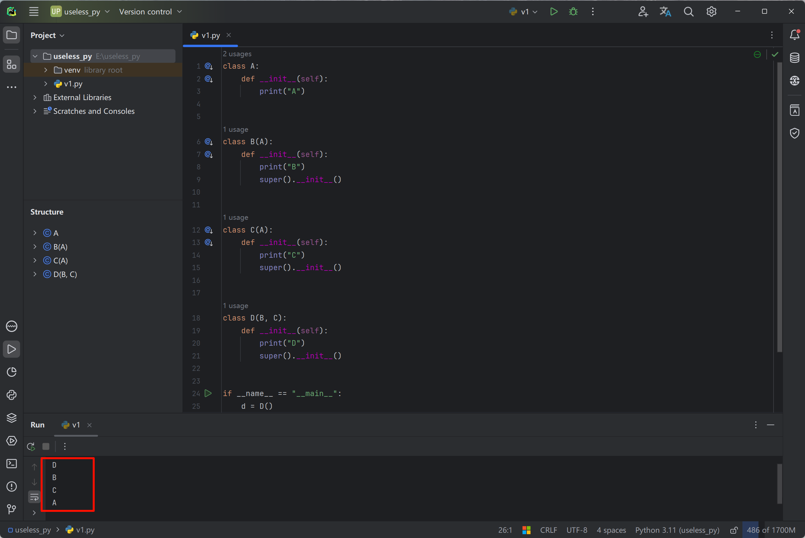
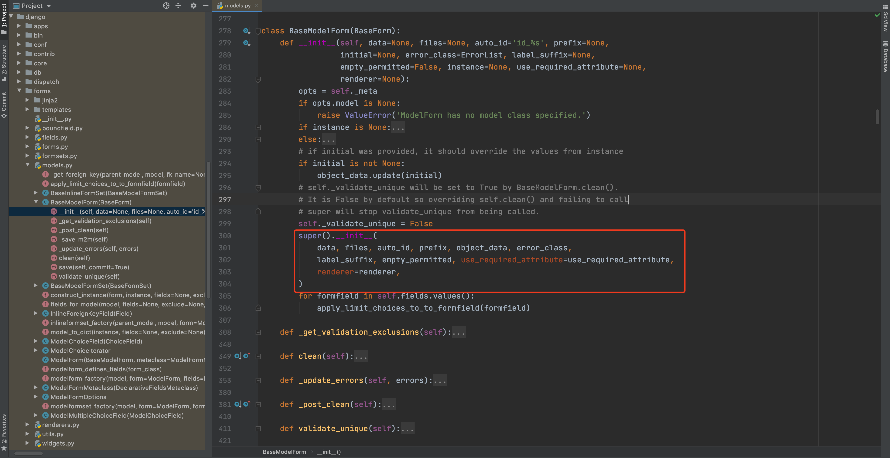
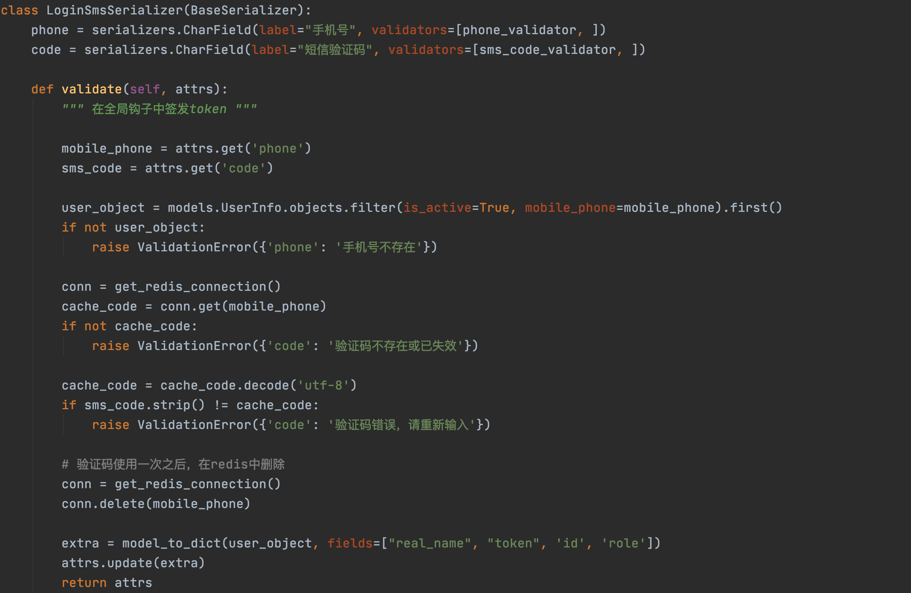

# Built-in Functions, Exceptions, and Reflection


## 1. Supplementary Built-in Functions

This section explains 8 built-in functions, all of which relate to object-oriented programming.

- classmethod, staticmethod, and property.

- callable, whether it can be executed by appending parentheses.

  - Functions

    ```python
    def func():
        pass
    
    print( callable(func) ) # True
    ```

  - Classes

    ```python
    class Foo(object):
        pass
    
    print( callable(Foo) ) # True
    ```

  - Objects whose class defines a `__call__` method

    ```python
    class Foo(object):
    	pass
    
    obj = Foo()
    print( callable(obj) ) # False
    ```

    ```python
    class Foo(object):
    
        def __call__(self, *args, **kwargs):
            pass
        
    obj = Foo()
    print( callable(obj) ) # True
    ```

  So when you encounter the following situation later, the first thing to consider is that handler can be one of three things: a function, a class, or an object with a `__call__` method. Which one it actually is can only be determined by analyzing the call relationships in the code.

  ```python
  def do_something(handler):
      handler()
  ```

- super, looks up members upward according to the **MRO inheritance chain**.

  ```python
  class Top(object):
      def message(self, num):
          print("Top.message", num)
          
  class Base(Top):
      pass
  
  class Foo(Base):
  
      def message(self, num):
          print("Foo.message", num)
          super().message(num + 100)
  
  
  obj = Foo()
  obj.message(1)
  
  >>> Foo.message 1
  >>> Top.message 101
  ```

  ```python
  class Base(object):
  
      def message(self, num):
          print("Base.message", num)
          super().message(1000)
  
  
  class Bar(object):
  
      def message(self, num):
          print("Bar.message", num)
  
  
  class Foo(Base, Bar):
      pass
  
  
  obj = Foo()
  obj.message(1)
  
  >>> Base.message 1
  >>> Bar.message 1000
  ```

  ```python
  class A:
      def __init__(self):
          print("A")
  
  
  class B(A):
      def __init__(self):
          print("B")
          super().__init__()
  
  
  class C(A):
      def __init__(self):
          print("C")
          super().__init__()
  
  
  class D(B, C):
      def __init__(self):
          print("D")
          super().__init__()
  
  
  if __name__ == "__main__":
      d = D()
  ```

  

  **Application Scenario**

  Suppose there is a class that already implements some functionality, but we want to extend it with a little more on top. Rewriting it from scratch would be cumbersome; in this case, we can use super.

  ```python
  info = dict() # {}
  info['name'] = "武沛齐"
  info["age"] = 18
  
  value = info.get("age")
  
  print(value)
  ```

  ```python
  class MyDict(dict):
  
      def get(self, k):
          print("自定义功能")
          return super().get(k)
  
  
  info = MyDict()
  info['name'] = "武沛齐" # __setitem__
  info["age"] = 18       # __setitem__
  print(info)
  
  value = info.get("age")
  
  print(value)
  ```

  

  

- type, gets the type of an object.

  ```python
  v1 = "武沛齐"
  result = type(v1)
  print(result) # <class 'str'>
  ```

  ```python
  v2 = "武沛齐"
  print( type(v2) == str )  # True
  
  v3 = [11, 22, 33] # list(...)
  print( type(v3) == list )  # True
  ```

  ```python
  class Foo(object):
      pass
  
  v4 = Foo()
  
  print( type(v4) == Foo )  # True
  ```

- isinstance, determines whether an object is an instance of a class or one of its subclasses.

  ```python
  class Top(object):
      pass
  
  
  class Base(Top):
      pass
  
  
  class Foo(Base):
      pass
  
  
  v1 = Foo()
  
  print( isinstance(v1, Foo) )   # True，对象v1是Foo类的实例
  print( isinstance(v1, Base) )  # True，对象v1的Base子类的实例。
  print( isinstance(v1, Top) )   # True，对象v1的Top子类的实例。
  ```

  ```python
  class Animal(object):
      def run(self):
          pass
  
  class Dog(Animal):
      pass
  
  class Cat(Animal):
      pass
  
  data_list = [
      "alex",
      Dog(),
      Cat(),
  	"root"
  ]
  
  for item in data_list:
      if type(item) == Cat:
          item.run()
      elif type(item) == Dog:
          item.run()
      else:
          pass
      
  for item in data_list:
      if isinstance(item, Animal):
          item.run()
      else:
          pass
  ```

  

- issubclass, determines whether a class is a subclass (descendant) of another class.

  ```python
  class Top(object):
      pass
  
  
  class Base(Top):
      pass
  
  
  class Foo(Base):
      pass
  
  
  print(issubclass(Foo, Base))  # True
  print(issubclass(Foo, Top))   # True
  ```

  


## 2. Exception Handling

During development, when you encounter some `unpredictable` errors, or when you simply can't be bothered to add extra checks, you can choose to handle them with exception handling.

```python
import requests

while True:
    url = input("请输入要下载网页地址：")
    res = requests.get(url=url)
    with open('content.txt', mode='wb') as f:
        f.write(res.content)
```

The code above for downloading a video runs normally under normal conditions, but if there is a network problem, the program will raise an error and fail to execute properly.

```python
try:
    res = requests.get(url=url)
except Exception as e:
    代码块，上述代码出异常待执行。
print("结束")
```

```python
import requests

while True:
    url = input("请输入要下载网页地址：")
    
    try:
        res = requests.get(url=url)
    except Exception as e:
        print("请求失败，原因：{}".format(str(e)))
        continue
        
    with open('content.txt', mode='wb') as f:
        f.write(res.content)
```

```python
num1 = input("请输入数字：")
num2 = input("请输入数字：")
try:
    num1 = int(num1)
    num2 = int(num2)
    result = num1 + num2
    print(result)
except Exception as e:
    print("输入错误")
```

Common application scenarios going forward:

- Calling the WeChat API to implement WeChat message push, WeChat Pay, etc.

- Alipay payments, video playback, etc.

- Database or Redis connections and operations

- Calling third-party video playback functionality, where errors are caused by issues in the third-party program.

  


Basic format of exception handling:

```python
try:
    # 逻辑代码
except Exception as e:
    # try中的代码如果有异常，则此代码块中的代码会执行。
```

```python
try:
    # 逻辑代码
except Exception as e:
    # try中的代码如果有异常，则此代码块中的代码会执行。
finally:
    # try中的代码无论是否报错，finally中的代码都会执行，一般用于释放资源。

print("end")

"""
try:
    file_object = open("xxx.log")
    # ....
except Exception as e:
    # 异常处理
finally:
    file_object.close()  # try中没异常，最后执行finally关闭文件；try有异常，执行except中的逻辑，最后再执行finally关闭文件。
"""    
```


### 2.1 Refining Exceptions

```python
import requests

while True:
    url = input("请输入要下载网页地址：")
    
    try:
        res = requests.get(url=url)
    except Exception as e:
        print("请求失败，原因：{}".format(str(e)))
        continue
        
    with open('content.txt', mode='wb') as f:
        f.write(res.content)
```

Earlier we simply caught exceptions and printed a uniform message whenever one occurred. If you want more fine-grained exception handling, you can do it like this:

```python
import requests
from requests import exceptions

while True:
    url = input("请输入要下载网页地址：")
    try:
        res = requests.get(url=url)
        print(res)    
    except exceptions.MissingSchema as e:
        print("URL架构不存在")
    except exceptions.InvalidSchema as e:
        print("URL架构错误")
    except exceptions.InvalidURL as e:
        print("URL地址格式错误")
    except exceptions.ConnectionError as e:
        print("网络连接错误")
    except Exception as e:
        print("代码出现错误", e)
        
# 提示：如果想要写的简单一点，其实只写一个Exception捕获错误就可以了。
```


If you want to handle errors in a more granular way, for example, handling a Key error and a Value error separately:

Basic format:

```python
try:
    # 逻辑代码
    pass

except KeyError as e:
    # 小兵，只捕获try代码中发现了键不存在的异常，例如：去字典 info_dict["n1"] 中获取数据时，键不存在。
    print("KeyError")

except ValueError as e:
    # 小兵，只捕获try代码中发现了值相关错误，例如：把字符串转整型 int("无诶器")
    print("ValueError")

except Exception as e:
    # 王者，处理上面except捕获不了的错误（可以捕获所有的错误）。
    print("Exception")
```

Python provides many fine-grained built-in exceptions for you to choose from.

```python
常见异常：
"""
AttributeError 试图访问一个对象没有的树形，比如foo.x，但是foo没有属性x
IOError 输入/输出异常；基本上是无法打开文件
ImportError 无法引入模块或包；基本上是路径问题或名称错误
IndentationError 语法错误（的子类） ；代码没有正确对齐
IndexError 下标索引超出序列边界，比如当x只有三个元素，却试图访问n x[5]
KeyError 试图访问字典里不存在的键 inf['xx']
KeyboardInterrupt Ctrl+C被按下
NameError 使用一个还未被赋予对象的变量
SyntaxError Python代码非法，代码不能编译(个人认为这是语法错误，写错了）
TypeError 传入对象类型与要求的不符合
UnboundLocalError 试图访问一个还未被设置的局部变量，基本上是由于另有一个同名的全局变量，
导致你以为正在访问它
ValueError 传入一个调用者不期望的值，即使值的类型是正确的
"""
更多异常：
"""
ArithmeticError
AssertionError
AttributeError
BaseException
BufferError
BytesWarning
DeprecationWarning
EnvironmentError
EOFError
Exception
FloatingPointError
FutureWarning
GeneratorExit
ImportError
ImportWarning
IndentationError
IndexError
IOError
KeyboardInterrupt
KeyError
LookupError
MemoryError
NameError
NotImplementedError
OSError
OverflowError
PendingDeprecationWarning
ReferenceError
RuntimeError
RuntimeWarning
StandardError
StopIteration
SyntaxError
SyntaxWarning
SystemError
SystemExit
TabError
TypeError
UnboundLocalError
UnicodeDecodeError
UnicodeEncodeError
UnicodeError
UnicodeTranslateError
UnicodeWarning
UserWarning
ValueError
Warning
ZeroDivisionError
"""
```


### 2.2 Custom Exceptions & Raising Exceptions

All of the exceptions above are Python built-ins; the corresponding exception is only raised when a specific error occurs.

In fact, you can also define custom exceptions during development.

```python
class MyException(Exception):
    pass
```

```python
try:
    pass
except MyException as e:
    print("MyException异常被触发了", e)
except Exception as e:
    print("Exception", e)
```

In the code above, the `except` clause is defined to catch `MyException`, but it will never be triggered, because the default exceptions each have specific trigger conditions. For example, a missing index or a missing key raises `IndexError` and `KeyError`.

For our custom exceptions, if we want to trigger them, we need to use `raise MyException()`.

```python
class MyException(Exception):
    pass


try:
    # 。。。
    raise MyException()
    # 。。。
except MyException as e:
    print("MyException异常被触发了", e)
except Exception as e:
    print("Exception", e)
```

```python
class MyException(Exception):
    def __init__(self, msg, *args, **kwargs):
        super().__init__(*args, **kwargs)
        self.msg = msg


try:
    raise MyException("xxx失败了")
except MyException as e:
    print("MyException异常被触发了", e.msg)
except Exception as e:
    print("Exception", e)
```

```python
class MyException(Exception):
    title = "请求错误"


try:
    raise MyException()
except MyException as e:
    print("MyException异常被触发了", e.title)
except Exception as e:
    print("Exception", e)
```


**Case 1**: We collaborate on development together, and you call a method I wrote.

- I define a function

  ```python
  class EmailValidError(Exception):
      title = "邮箱格式错误"
  
  class ContentRequiredError(Exception):
      title = "文本不能为空错误"
      
  def send_email(email,content):
      if not re.match("\w+@live.com",email):
          raise EmailValidError()
  	if len(content) == 0 :
          raise ContentRequiredError()
  	# 发送邮件代码...
      # ...
  ```

- You call the function I wrote

  ```python
  def execute():
      # 其他代码
      # ...
      
  	try:
          send_email(...)
      except EmailValidError as e:
          pass
      except ContentRequiredError as e:
          pass
      except Exception as e:
          print("发送失败")
  
  execute()
  
  # 提示：如果想要写的简单一点，其实只写一个Exception捕获错误就可以了。
  ```

  

**Case 2**: The framework has already defined these internally; different errors trigger different exceptions.

```python
import requests
from requests import exceptions

while True:
    url = input("请输入要下载网页地址：")
    try:
        res = requests.get(url=url)
        print(res)    
    except exceptions.MissingSchema as e:
        print("URL架构不存在")
    except exceptions.InvalidSchema as e:
        print("URL架构错误")
    except exceptions.InvalidURL as e:
        print("URL地址格式错误")
    except exceptions.ConnectionError as e:
        print("网络连接错误")
    except Exception as e:
        print("代码出现错误", e)
        
# 提示：如果想要写的简单一点，其实只写一个Exception捕获错误就可以了。
```


**Case 3**: Trigger the specified exception as required; each exception type has its own special meaning.




### 2.3 The Special finally

```python
try:
    # 逻辑代码
except Exception as e:
    # try中的代码如果有异常，则此代码块中的代码会执行。
finally:
    # try中的代码无论是否报错，finally中的代码都会执行，一般用于释放资源。

print("end")
```

When defining exception-handling code inside a function or method, pay special attention to finally and return.

```python
def func():
    try:
        return 123
    except Exception as e:
        pass
    finally:
        print(666)
        
func()
```

Even if return is defined in try or except, the code in the final finally block will still be executed.


### Exercises

1. Fill in the code to catch errors in the program.

   ```python
   # 迭代器
   class IterRange(object):
       def __init__(self, num):
           self.num = num
           self.counter = -1
   
       def __iter__(self):
           return self
   
       def __next__(self):
           self.counter += 1
           if self.counter == self.num:
               raise StopIteration()
           return self.counter
   
       
   obj = IterRange(20)
   
   while True:
       try:
       	ele = next(obj)
   	except StopIteration as e:
           print("数据获取完毕")
           break
       print(ele)
       
   ```

2. Fill in the code to catch errors in the program.

   ```python
   class IterRange(object):
       def __init__(self, num):
           self.num = num
           self.counter = -1
   
       def __iter__(self):
           return self
   
       def __next__(self):
           self.counter += 1
           if self.counter == self.num:
               raise StopIteration()
           return self.counter
   
   
   class Xrange(object):
       def __init__(self, max_num):
           self.max_num = max_num
   
       def __iter__(self):
           return IterRange(self.max_num)
   
   
   data_object = Xrange(100)
   obj_iter = data_object.__iter__()
   
   while True:
       try:
       	ele = next(obj_iter)
   	except StopIteration as e:
           print("数据获取完毕")
           break
       print(ele)
   ```

3. Fill in the code to catch errors in the program.

   ```python
   def func():
       yield 1
       yield 2
       yield 3
       
   gen = func()
   while True:
       try:
       	ele = next(gen)
   	except StopIteration as e:
           print("数据获取完毕")
           break
       print(ele)
   ```

4. Fill in the code to catch errors in the program. (Note: this case is for practice only; in real development, it is recommended to handle this situation with your own checks rather than using exceptions)

   ```python
   num = int("武沛齐")
   ```

   ```python
   try:
       num = int("武沛齐")
   except ValueError as e:
       print("转换失败")
   ```

5. Fill in the code to catch errors in the program. (Note: this case is for practice only; in real development, it is recommended to handle this situation with your own checks rather than using exceptions)

   ```python
   data = [11,22,33,44,55]
   data[1000]
   ```

   ```python
   try:
       data = [11,22,33,44,55]
   	data[1000]
   except IndexError as e:
       print("转换失败")
   ```

   

6. Fill in the code to catch errors in the program. (Note: this case is for practice only; in real development, it is recommended to handle this situation with your own checks rather than using exceptions)

   ```python
   data = {"k1":123,"k2":456}
   data["xxxx"]
   ```

   ```python
   try:
       data = {"k1":123,"k2":456}
   	data["xxxx"]
   except KyeError as e:
       print("转换失败")
   ```

7. Analyze the code and write the result

   ```python
   class MyDict(dict):
   
       def __getitem__(self, item):
           try:
               return super().__getitem__(item) # KeyError
           except KeyError as e:
               return None
   
   
   info = MyDict()
   info['name'] = "武沛齐"
   info['wx'] = "wupeiq666"
   
   print(info['wx'])     # info['wx']  -> __getitem__
   print(info['email'])  # info['email']  -> __getitem__
   ```

8. Read the code and write the result

   ```python
   def run(handler):
       try:
           num = handler()
           print(num)
           return "成功"
       except Exception as e:
           return "错误"
       finally:
           print("END")
   
       print("结束")
   
   
   res = run(lambda: 123) 
   print(res)
   ```

   ```python
   >>> 123
   >>> END
   >>> 成功
   ```

   ```python
   def func():
       print(666)
       return "成功"
   
   def run(handler):
       try:
           num = handler()
           print(num)
           return func()
       except Exception as e:
           return "错误"
       finally:
           print("END")
   
       print("结束")
   
   
   res = run(lambda: 123) 
   print(res)
   ```

   ```python
   >>> 123
   >>> 666
   >>> END
   >>> 成功
   ```


## 3. Reflection

Reflection provides a more flexible way for you to operate on members of an object (performing member operations on the `object` in the form of strings).

```python
class Person(object):
    
    def __init__(self,name,wx):
        self.name = name
        self.wx = wx
	
    def show(self):
        message = "姓名{}，微信：{}".format(self.name,self.wx)
        
        
user_object = Person("武沛齐","wupeiqi666")


# 对象.成员 的格式去获取数据
user_object.name
user_object.wx
user_object.show()

# 对象.成员 的格式无设置数据
user_object.name = "吴培期"
```

```python
user = Person("武沛齐","wupeiqi666")

# getattr 获取成员
getattr(user,"name") # user.name
getattr(user,"wx")   # user.wx


method = getattr(user,"show") # user.show
method()
# 或
getattr(user,"show")()

# setattr 设置成员
setattr(user, "name", "吴培期") # user.name = "吴培期"
```

Python provides 4 built-in functions to support reflection:

- getattr, gets a member from an object

  ```
  v1 = getattr(对象,"成员名称")
  v2 = getattr(对象,"成员名称", 不存在时的默认值)
  ```

- setattr, sets a member on an object

  ```
  setattr(对象,"成员名称",值)
  ```

- hasattr, whether the object contains a member

  ```
  v1 = hasattr(对象,"成员名称") # True/False
  ```

- delattr, deletes a member from an object

  ```
  delattr(对象,"成员名称")
  ```

From now on, whenever you come across this object.member style of writing, it can all be implemented based on reflection.

Example:

```python
class Account(object):

    def login(self):
        pass

    def register(self):
        pass

    def index(self):
        pass

    
def run(self):
    name = input("请输入要执行的方法名称：") # index register login xx run ..
    
    account_object = Account()
    method = getattr(account_object, name,None) # index = getattr(account_object,"index")
    
    if not method:
        print("输入错误")
        return 
    method()
```


### 3.1 Everything Is an Object

There is a saying in Python: `everything is an object`. Every object maintains its own members internally.

- Objects are objects

  ```python
  class Person(object):
      
      def __init__(self,name,wx):
          self.name = name
          self.wx = wx
  	
      def show(self):
          message = "姓名{}，微信：{}".format(self.name,self.wx)
          
          
  user_object = Person("武沛齐","wupeiqi666")
  user_object.name
  ```

- Classes are objects

  ```python
  class Person(object):
      title = "武沛齐"
  
  Person.title
  # Person类也是一个对象（平时不这么称呼）
  ```

- Modules are objects

  ```python
  import re
  
  re.match
  # re模块也是一个对象（平时不这么称呼）。
  ```

  

Since reflection supports operating on members of an object in the form of strings [equivalent to object.member], reflection can also be used to operate on members of classes and modules.

Simply put: as long as you see xx.oo, it can be implemented with reflection.

```python
class Person(object):
    title = "武沛齐"

v1 = Person.title
print(v1)
v2 = getattr(Person,"title")
print(v2)
```

```python
import re

v1 = re.match("\w+","dfjksdufjksd")
print(v1)

func = getattr(re,"match")
v2 = func("\w+","dfjksdufjksd")
print(v2)
```


### 3.2 import_module + Reflection

In Python, if you want to import a module, you can use the import syntax; you can also import a module in the form of a string.

Example 1:

```python
# 导入模块
import random

v1 = random.randint(1,100)
```

```python
# 导入模块
from importlib import import_module

m = import_module("random")

v1 = m.randint(1,100)
```

Example 2:

```python
# 导入模块exceptions
from requests import exceptions as m
```

```python
# 导入模块exceptions
from importlib import import_module
m = import_module("requests.exceptions")
```

Example 3:

```python
# 导入模块exceptions，获取exceptions中的InvalidURL类。
from requests.exceptions import InvalidURL
```

```python
# 错误方式
from importlib import import_module
m = import_module("requests.exceptions.InvalidURL") # 报错，import_module只能导入到模块级别。
```

```python
# 导入模块
from importlib import import_module
m = import_module("requests.exceptions")
# 去模块中获取类
cls = m.InvalidURL
```


In the source code of many projects, `import_module` and `getattr` are used together to import a module from a string and get its members, for example:

```python
from importlib import import_module

path = "openpyxl.utils.exceptions.InvalidFileException"

module_path,class_name = path.rsplit(".",maxsplit=1) # "openpyxl.utils.exceptions"   "InvalidFileException"

module_object = import_module(module_path)

cls = getattr(module_object,class_name)

print(cls)
```


In our own development, we can also build on this to improve the extensibility of our code. For example: please implement a feature in the project that sends SMS and WeChat messages.

Refer to the auto_message project in the sample code.

