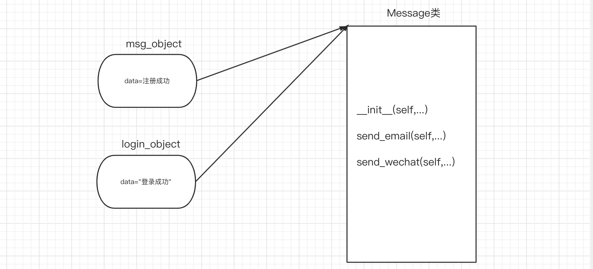
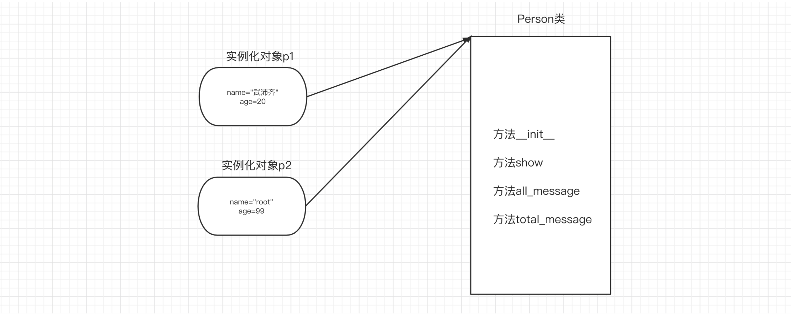
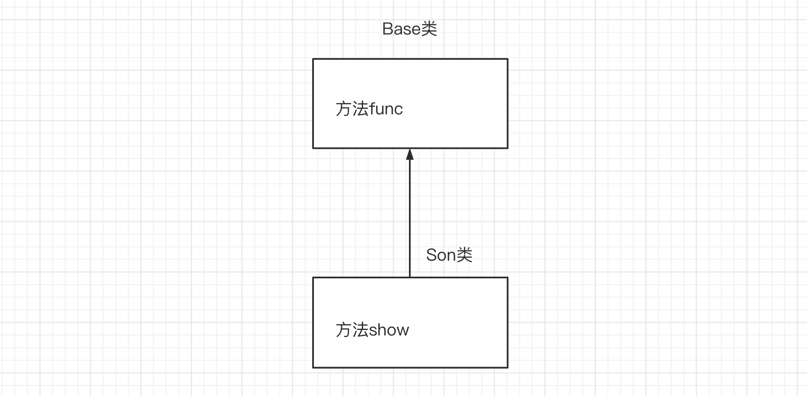
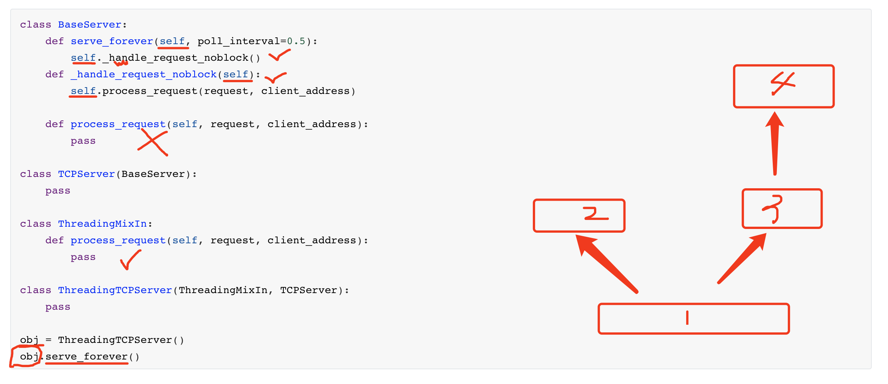
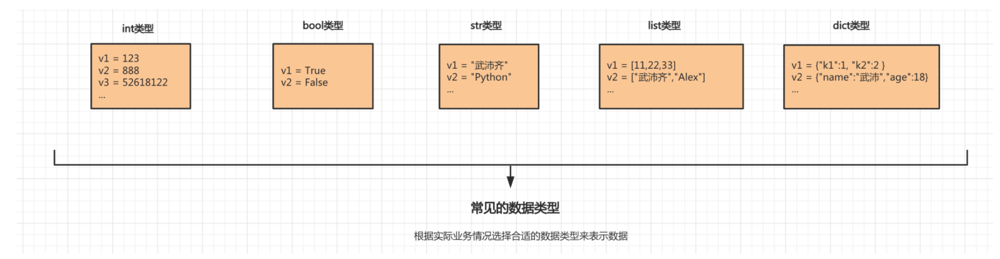
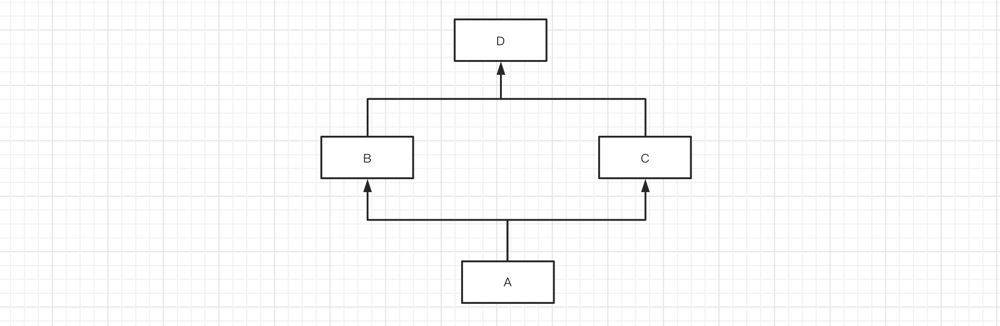
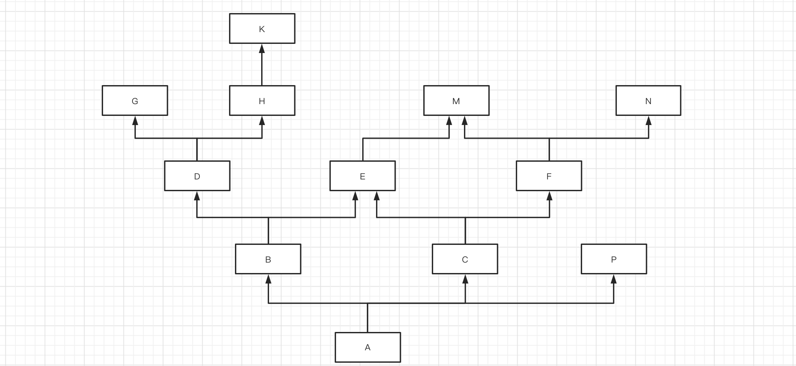

# The self Object, Encapsulation, Inheritance, and Polymorphism

## 1. The self Object

### 1.1 Objects and self

Each class can define a special `__init__ 初始化方法 `, which is executed automatically when a class is instantiated to create an object, i.e., `对象=类()`.

```python
class Message:

    def __init__(self, content):
        self.data = content

    def send_email(self, email):
        data = "给{}发邮件，内容是：{}".format(email, self.data)
        print(data)

    def send_wechat(self, vid):
        data = "给{}发微信，内容是：{}".format(vid, self.data)
        print(data)

# 对象 = 类名() # 自动执行类中的 __init__ 方法。

# 1. 根据类型创建一个对象，内存的一块 区域 。
# 2. 执行__init__方法，模块会将创建的那块区域的内存地址当self参数传递进去。    往区域中(data="注册成功")
msg_object = Message("注册成功")

msg_object.send_email("wupeiqi@live.com") # 给wupeiqi@live.com发邮件，内容是：注册成功
msg_object.send_wechat("武沛齐") # 给武沛齐发微信，内容是：注册成功
```



From the example above, you will notice:

- An object allows us to encapsulate some data inside it first, and later retrieve that data from it when we want to use it.
- For `self`, a method in a class needs to be triggered and executed by an object of that class (object.method), and during execution the object is automatically passed to `self` as a parameter, so that the method can access the values already encapsulated in the object.

Note: apart from the default `self` parameter, the definition and execution of a method's parameters are the same as those of a function.


Of course, you can also create multiple objects from a class and call their methods, for example:

```python
class Message:

    def __init__(self, content):
        self.data = content

    def send_email(self, email):
        data = "给{}发邮件，内容是：{}".format(email, self.data)
        print(data)

    def send_wechat(self, vid):
        data = "给{}发微信，内容是：{}".format(vid, self.data)
        print(data)


msg_object = Message("注册成功")
msg_object.send_email("wupeiqi@live.com") # 给wupeiqi@live.com发邮件，内容是：注册成功
msg_object.send_wechat("武沛齐")


login_object = Message("登录成功")
login_object.send_email("wupeiqi@live.com") # 给wupeiqi@live.com发邮件，内容是：登录成功
login_object.send_wechat("武沛齐")
```


The object-oriented philosophy: encapsulate some data into an object, and when a method is executed, retrieve that data from the object.

The functional philosophy: all data needed inside a function is passed in through parameters.


- `self` is essentially a parameter. This parameter is provided internally by Python; in essence, it is the object that calls the current method.
- An object is a piece of memory instantiated from a class, which by default contains no data; through the class's `__init__` method, some data can be initialized in that memory.


### 1.2 Common Members

When writing object-oriented code, the most common members are:

- Instance variables, which belong to an object and can only be called through the object.
- Bound methods, which belong to a class and can be called through an object or through the class.

Note: there are many other members, which will be introduced later.



```python
class Person:

    def __init__(self, n1, n2):
        # 实例变量
        self.name = n1
        self.age = n2
	
    # 绑定方法
    def show(self):
        msg = "我叫{}，今年{}岁。".format(self.name, self.age)
        print(msg)

    def all_message(self):
        msg = "我是{}人，我叫{}，今年{}岁。".format(Person.country, self.name, self.age)
        print(msg)

    def total_message(self):
        msg = "我是{}人，我叫{}，今年{}岁。".format(self.country, self.name, self.age)
        print(msg)
```

```python
# 执行绑定方法
p1 = Person("武沛齐",20)
p1.show()
# 或
# p1 = Person("武沛齐",20)
# Person.show(p1)


# 初始化，实例化了Person类的对象叫p1
p1 = Person("武沛齐",20)
```


### 1.3 Applied Examples

1. Encapsulate data into an object for later use.

   ```python
   class UserInfo:
       def __init__(self, name, pwd,age):
           self.name = name
           self.password = pwd
           self.age = age
   
   
   def run():
       user_object_list = []
       # 用户注册
       while True:
           user = input("用户名：")
           if user.upper() == "Q":
               break
           pwd = input("密码")
           
           # user_object对象中有：name/password
           user_object = UserInfo(user, pwd,19)
           # user_dict = {"name":user,"password":pwd}
           
           user_object_list.append(user_object)
           # user_object_list.append(user_dict)
   
       # 展示用户信息
       for obj in user_object_list:
           print(obj.name, obj.password)
           
   总结：
   	- 数据封装到对象，以后再去获取。
       - 规范数据（约束）
   ```
   
   Note: a dictionary can also be used to achieve encapsulation, but with a dictionary you still need to write the key yourself when accessing a value; with object-oriented programming you only need `.` to get the data encapsulated in the object.
   
2. Encapsulate data into an object, and process the raw data within methods.

   ```python
   user_list = ["用户-{}".format(i) for i in range(1,3000)]
   
   # 分页显示，每页显示10条
   while True:
       page = int(input("请输入页码："))
   
       start_index = (page - 1) * 10
       end_index = page * 10
   
       page_data_list = user_list[start_index:end_index]
       for item in page_data_list:
           print(item)
   ```

   ```python
   class Pagination:
       def __init__(self, current_page, per_page_num=10):
           self.per_page_num = per_page_num
           
           if not current_page.isdecimal():
               self.current_page = 1
               return
           current_page = int(current_page)
           if current_page < 1:
               self.current_page = 1
               return
           self.current_page = current_page
   
       def start(self):
           return (self.current_page - 1) * self.per_page_num
   
       def end(self):
           return self.current_page * self.per_page_num
   
   
   user_list = ["用户-{}".format(i) for i in range(1, 3000)]
   
   # 分页显示，每页显示10条
   while True:
       page = input("请输入页码：")
   	
       # page，当前访问的页码
       # 10，每页显示10条数据
   	# 内部执行Pagination类的init方法。
       pg_object = Pagination(page, 20)
       page_data_list = user_list[ pg_object.start() : pg_object.end() ]
       for item in page_data_list:
           print(item)
   ```

   

   Here is another example: encapsulate data into an object, and then operate on the encapsulated data within methods.

   ```python
   import os
   import requests
   
   
   class DouYin:
       def __init__(self, folder_path):
           self.folder_path = folder_path
           
           if not os.path.exists(folder_path):    # 判断文件夹是否存在
               os.makedirs(folder_path)    # 不存在，则创建文件夹
               
   
       def download(self, file_name, url):
           res = requests.get(
               url=url,
               headers={
                   "user-agent": "Mozilla/5.0 (Macintosh; Intel Mac OS X 10_15_7) AppleWebKit/537.36 (KHTML, like Gecko) Chrome/87.0.4280.88 Safari/537.36 FS"
               }
           )
           file_path = os.path.join(self.folder_path, file_name)
           with open(file_path, mode='wb') as f:
               f.write(res.content)
               f.flush()
   
       def multi_download(self, video_list):
           for item in video_list:
               self.download(item[0], item[1])
   
   
   if __name__ == '__main__':
       douyin_object = DouYin("videos")
   
       douyin_object.download(
           "罗斯.mp4",
           "https://aweme.snssdk.com/aweme/v1/playwm/?video_id=v0200f240000buuer5aa4tij4gv6ajqg"
       )
   
       video_list = [
           ("a1.mp4", "https://aweme.snssdk.com/aweme/v1/playwm/?video_id=v0300fc20000bvi413nedtlt5abaa8tg"),
           ("a2.mp4", "https://aweme.snssdk.com/aweme/v1/playwm/?video_id=v0d00fb60000bvi0ba63vni5gqts0uag"),
           ("a3.mp4", "https://aweme.snssdk.com/aweme/v1/playwm/?video_id=v0200f240000buuer5aa4tij4gv6ajqg")
       ]
       douyin_object.multi_download(video_list)
   
   
   ```

3. Create multiple objects from a class and modify the data in the objects within methods.

   ```python
   class Police:
       """警察"""
   
       def __init__(self, name, role):
           self.name = name
           self.role = role
           if role == "队员":
               self.hit_points = 200
           else:
               self.hit_points = 500
   
       def show_status(self):
           """ 查看警察状态 """
           message = "警察{}的生命值为:{}".format(self.name, self.hit_points)
           print(message)
   
       def bomb(self, terrorist_list):
           """ 投炸弹，炸掉恐怖分子 """
           for terrorist in terrorist_list:
               terrorist.blood -= 200
               terrorist.show_status()
   
   """
   p1 = Police("武沛齐","队员")
   p1.show_status()
   p1.bomb(["alex","李杰"])
   
   p2 = Police("日天","队长")
   p2.show_status()
   p2.bomb(["alex","李杰"])
   """
   
   
   
   class Terrorist:
       """ 恐怖分子 """
   
       def __init__(self, name, blood=300):
           self.name = name
           self.blood = blood
   
       def shoot(self, police_object):
           """ 开枪射击某个警察 """
           police_object.hit_points -= 5
           police_object.show_status()
           
           self.blood -= 2
   
       def strafe(self, police_object_list):
           """ 扫射某些警察 """
           for police_object in police_object_list:
               police_object.hit_points -= 8
               police_object.show_status()
   
       def show_status(self):
           """ 查看恐怖分子状态 """
           message = "恐怖分子{}的血量值为:{}".format(self.name, self.blood)
           print(message)
   
   """
   t1 = Terrorist('alex')
   t2 = Terrorist('李杰',200)
   """
           
   def run():
       # 1.创建3个警察
       p1 = Police("武沛齐", "队员")
       p2 = Police("苑昊", "队员")
       p3 = Police("于超", "队长")
   
       # 2.创建2个匪徒
       t1 = Terrorist("alex")
       t2 = Terrorist("eric")
       
   
       # alex匪徒射击于超警察
       t1.shoot(p3)
   
       # alex扫射
       t1.strafe([p1, p2, p3])
   
       # eric射击苑昊
       t2.shoot(p2)
   
       # 武沛齐炸了那群匪徒王八蛋
       p1.bomb([t1, t2])
       
       # 武沛齐又炸了一次alex
       p1.bomb([t1])
   
   
   if __name__ == '__main__':
       run()
   ```

   


Summary:

- Only encapsulating data.
- Encapsulating data + methods to further process the data.
- Creating multiple objects of the same class, where objects of the same class can share the same functionality (methods).


## 2. The Three Main Features

Object-oriented programming exists in many languages, and this programming paradigm has three main features: encapsulation, inheritance, and polymorphism.


### 2.1 Encapsulation

Encapsulation is mainly reflected in two aspects:

- Encapsulating related methods into a class; for example, in the examples above, all the terrorist-related methods are written in the Terrorist class, and all the police-related methods are written in the Police class.
- Encapsulating data into an object; when instantiating an object, you can use the `__init__` initialization method to encapsulate some data into the object for later use.


### 2.2 Inheritance

There is a traditional notion that a son can inherit his father's property.

Object-oriented programming has the same idea: a subclass can inherit the methods and class variables of a parent class (this is not making a copy; what belongs to the parent still belongs to the parent — the subclass merely inherits it).

```
父类
子类

基类
派生类
```




```python
class Base:

    def func(self):
        print("Base.func")

class Son(Base):
    
    def show(self):
        print("Son.show")
        
s1 = Son()
s1.show()
s1.func() # 优先在自己的类中找，自己没有才去父类。

s2 = Base()
s2.func()
```


```python
class Base:
    def f1(self):
        pass

class Foo(Base):

    def f2(self):
        pass
    
class Bar(Base):
    
    def f3(self):
        pass
    
o1 = Foo()
o1.f2()
o1.f1()
```


### Exercises

```python
class Base:
    def f1(self):
        print('base.f1')
        
class Foo(Base):
    def f2(self):
        print('foo.f2')
        
obj = Foo()
obj.f1()
obj.f2()
```


```python
class Base:
    def f1(self):
        print('base.f1')
        
class Foo(Base):
    def f2(self):
        print('before')
        self.f1() # 调用了f1方法   obj.f1()
        print('foo.f2')
        
obj = Foo()
obj.f2()

>>> before
>>> base.f1
>>> foo.f2
```


```python
class Base:
    def f1(self):
        print('base.f1')
        
class Foo(Base):
    def f2(self):
        print("before")
        self.f1() # obj,Foo类创建出来的对象。 obj.f1
        print('foo.f2')
	def f1(self):
        print('foo.f1')
        
obj = Foo()
obj.f1() # obj对象到底是谁？优先就会先去谁里面找。
obj.f2()

>>> before
>>> foo.f1
>>> foo.f2
```


```python
class Base:
    def f1(self):
        print('before')
        self.f2() # slef是obj对象（Foo类创建的对象） obj.f2
        print('base.f1')
        
	def f2(self):
        print('base.f2')
        
class Foo(Base):
    def f2(self):
        print('foo.f2')
        
obj = Foo()
obj.f1() # 优先去Foo类中找f1，因为调用f1的那个对象是Foo类创建出来的。


>>> before
>>> foo.f2
>>> base.f1

b1 = Base()
b1.f1()

>>> before
>>> base.f2
>>> base.f1
```


```python
class TCPServer:
    def f1(self):
        print("TCPServer")

class ThreadingMixIn:
    def f1(self):
        print("ThreadingMixIn")

class ThreadingTCPServer(ThreadingMixIn, TCPServer): 
    def run(self):
        print('before')
        self.f1()
        print('after')
        
obj = ThreadingTCPServer()
obj.run()

>>> before
>>> ThreadingMixIn
>>> after
```


```python
class BaseServer:
    def serve_forever(self, poll_interval=0.5):
        self._handle_request_noblock()
	def _handle_request_noblock(self):
        self.process_request(request, client_address)
        
	def process_request(self, request, client_address):
        pass
    
class TCPServer(BaseServer):
    pass

class ThreadingMixIn:
    def process_request(self, request, client_address):
        pass
    
class ThreadingTCPServer(ThreadingMixIn, TCPServer): 
    pass

obj = ThreadingTCPServer()
obj.serve_forever()
```




Summary:

- When executing object.method, the lookup first goes to the class associated with the current object, and only goes to its parent class if it is not found there.
- Python supports multiple inheritance: it looks at the left parent first, then the right one.
- What exactly is self? Go to the class that self corresponds to and look up the member there; if it is not found, keep searching upward according to the inheritance relationship.


### 2.3 Polymorphism

Polymorphism, translated literally, means multiple forms.

- Polymorphism in other programming languages
- Polymorphism in Python


In other programming languages, code written this way is not allowed, for example, Java:

```java
class Cat{  
    public void eat() {  
        System.out.println("吃鱼");  
    }  
}

class Dog {  
    public void eat() {  
        System.out.println("吃骨头");  
    }  
    public void work() {  
        System.out.println("看家");  
    }  
}


public class Test {
   public static void main(String[] args) {
       obj1 = Cat()
	   obj2 = Cat()
       show(obj1)
       show(obj2)
           
		obj3 = Dog()
        show(obj3)
   }  
    
    public static void show(Cat a)  {
      a.eat()
    }  
} 
```

```java
abstract class Animal {  
    abstract void eat();  
}  

class Cat extends Animal {  
    public void eat() {  
        System.out.println("吃鱼");  
    }  
}

class Dog extends Animal {  
    public void eat() {  
        System.out.println("吃骨头");  
    }  
    public void work() {  
        System.out.println("看家");  
    }  
}


public class Test {
   public static void main(String[] args) {
       obj1 = Cat()
       show(obj1)
           
	   obj2 = Dog()
	   show(obj2)
   }  
    
    public static void show(Animal a)  {
      a.eat()
    }  
} 
```

Polymorphism in Java or other languages is implemented based on interfaces or abstract classes and abstract methods, allowing data to exist in multiple forms.


Python is different. Because Python places no restrictions on data types, it natively supports polymorphism.

```python
def func(arg):
    v1 = arg.copy() # 浅拷贝
    print(v1)
    
func("武沛齐")
func([11,22,33,44])
```

```python
class Email(object):
    def send(self):
        print("发邮件")

        
class Message(object):
    def send(self):
        print("发短信")
        
        
        
def func(arg):
    v1 = arg.send()
    print(v1)
    

v1 = Email()
func(v1)

v2 = Message()
func(v2)
```

In programming, duck typing is a style of dynamic typing. With duck typing, the focus is on the behavior of an object — what it can do — rather than on the type to which the object belongs. For example: if a bird walks like a duck, swims like a duck, and quacks like a duck, then that bird can be called a duck.


Summary:

- Encapsulation: encapsulate methods into a class or encapsulate data into an object, for later use.

- Inheritance: extract the common methods of classes into a base class for implementation.

- Polymorphism: Python supports polymorphism by default (this approach is called duck typing). The simplest foundation is the following piece of code.

  ```python
  def func(arg):
      v1 = arg.copy() # 浅拷贝
      print(v1)
      
  func("武沛齐")
  func([11,22,33,44])
  ```

  


## 3. Extension: Revisiting Data Types

Now that we have a preliminary understanding of object-oriented programming, let's take another look at the data types we learned earlier: str, list, dict, and so on. They are in fact all classes, and objects of different kinds can be created from a class.




```python
# 实例化一个str类的对象v1
v1 = str("武沛齐") 

# 通过对象执行str类中的upper方法。
data = v1.upper()

print(data)
```


## 4. MRO and the C3 Algorithm

Regarding inheritance in Python's object-oriented programming, we have already learned:

- The significance of inheritance: extracting common methods into a parent class helps increase code reusability.

- How to write inheritance:

  ```python
  # 继承
  class Base(object):
      pass
  
  class Foo(Base):
      pass
  ```

  ```python
  # 多继承
  class Base(object):
      pass
  
  class Bar(object):
      pass
  
  class Foo(Base,Bar):
      pass
  ```

- When calling members of a class, follow these rules:

  - Look in the class itself first; if it is not found there, look in the parent class.
  - If the class uses multiple inheritance (multiple parent classes), look at the left parent first, then the right one.

Once you have mastered the knowledge points above, you can actually solve most inheritance-related problems.

But when you encounter some special cases (which are uncommon), you may not know how to handle them, for example:








If a class has an inheritance relationship, you can use `mro()` to get the inheritance relationship of the current class (the order in which members are looked up).


Example 1:


```python
mro(A) = [A] + [B,C]
mro(A) = [A,B,C]
```

```python
mro(A) = [A] + merge( mro(B), mro(C), [B,C] )
mro(A) = [A] + merge( [object], [object], [] )
mro(A) = [A] + [B,C,object]
mro(A) = [A,B,C,object]
```

```python
mro(A) = [A] + merge( mro(B), mro(C), [B,C] )
mro(A) = [A] + merge( [], [C], [,C] 
mro(A) = [A] + [B,C]
```


```python
class C(object):
    pass

class B(object):
    pass

class A(B, C):
    pass

print( A.mro() )   # [<class '__main__.A'>, <class '__main__.B'>, <class '__main__.C'>, <class 'object'>]
print( A.__mro__ ) # (<class '__main__.A'>, <class '__main__.B'>, <class '__main__.C'>, <class 'object'>)
```


Example 2:


```python
mro(A) = [A] + merge( mro(B), mro(C), [B,C] )
mro(A) = [A] + merge( [], [D], [] )
mro(A) = [A] + [B,C,D]
mro(A) = [A,B,C,D]
```


```python
class D(object):
    pass


class C(D):
    pass


class B(object):
    pass


class A(B, C):
    pass


print( A.mro() ) # [<class '__main__.A'>, <class '__main__.B'>, <class '__main__.C'>, <class '__main__.D'>, <class 'object'>]
```


Example 3:


```python
mro(A) = [A] + merge( mro(B),mro(C),[B,C])
mro(A) = [A] + merge( [], [C], [C])
mro(A) = [A,B,D,C]
```


```python
class D(object):
    pass


class C(object):
    pass


class B(D):
    pass


class A(B, C):
    pass


print(A.mro()) # [<class '__main__.A'>, <class '__main__.B'>, <class '__main__.D'>, <class '__main__.C'>, <class 'object'>]
```


Example 4:


```python
mro(A) = [A] + merge( mro(B), mro(C), [B,C])

mro(A) = [A] + merge( [B,D], [C,D], [B,C])

mro(A) = [A] + [B,C,D] 
mro(A) = [A,B,C,D] 
```

```python
class D(object):
    pass


class C(D):
    pass


class B(D):
    pass


class A(B, C):
    pass


print(A.mro()) # [<class '__main__.A'>, <class '__main__.B'>, <class '__main__.C'>, <class '__main__.D'>, <class 'object'>]
```


Example 5:


```python
简写为：A -> B -> D -> G -> H -> K -> C -> E -> F -> M -> N -> P -> object
```


```
mro(A) = [A] + merge( mro(B),          mro(C),      mro(P),      [B,C,P])
                  []   [N]     [P]          [P]

mro(A) = [A,B,D,G,H,K,C,E,F,M,N,P]

-----------------------------------------------------
mro(B) = [B] + merge( mro(D), mro(E), [D,E])

mro(D) = [D] + merge(mro(G),mro(H), [G,H])

mro(G) = [G]

mro(H) = [H,K]

mro(B) = [B] + merge( [], [E,M], [E])
mro(B) = [B,D,G,H,K,E,M]


-----------------------------------------------------
mro(C) = [C] + merge(mro(E),mro(F),[E,F])

mro(E) = [E,M]

mro(F) = [F,M,N] 

mro(C) = [C] + merge([M],[M,N] ,[])
mro(C) = [C,E,F,M,N]
```

```python
class M:
    pass


class N:
    pass


class E(M):
    pass


class G:
    pass


class K:
    pass


class H(K):
    pass


class D(G, H):
    pass


class F(M, N):
    pass


class P:
    pass


class C(E, F):
    pass


class B(D, E):
    pass


class A(B, C, P):
    pass


print(A.mro()) # 简写为：A -> B -> D -> G -> H -> K -> C -> E -> F -> M -> N -> P -> object
```


**Special Note: Determining the Inheritance Relationship in One Sentence**

You may have noticed that using the formal C3 algorithm rules to analyze a class's inheritance relationship is somewhat tedious, especially since even a complex class takes a long time to analyze.

So, based on my own experience, I have summarized a single sentence to share with you: <span style="color:red">**From left to right, depth-first; for diamonds large or small, keep the top**</span>. Based on this sentence, you can find the inheritance relationship more quickly.


```
简写为：A -> B -> D -> G -> H -> K -> C -> E -> F -> M -> N -> P -> object
```


#### The Difference Between Python 2 and Python 3 (For Reference)

Overview:

- Before Python 2.2, only classic classes were supported [from left to right, depth-first; for diamonds large or small, do not keep the top].

- Later, Python wanted classes to inherit from `object` by default (object-oriented programming in other languages basically inherits from `object` by default too). At that point, it was discovered that the original classic classes could not directly inherit this feature — there was a bug.

- So Python decided not to modify the original classic classes, but instead created new-style classes to support this feature. [From left to right, depth-first; for diamonds large or small, keep the top.]

  - Classic classes do not inherit from the `object` type

    ```python
    class Foo:
        pass
    ```

  - New-style classes inherit from `object` directly or indirectly

    ```python
    class Base(object):
        pass
    
    class Foo(Base):
        pass
    ```

- In this way, after Python 2.2, classic classes and new-style classes coexisted. (Official support came in 2.3.)

- Eventually, Python 3 discarded classic classes and kept only new-style classes.


```
详细文档：
	https://www.python.org/dev/peps/pep-0253/#mro-method-resolution-order-the-lookup-rule
	https://www.python.org/download/releases/2.3/mro/

In classic Python, the rule is given by the following recursive function, also known as the left-to-right depth-first rule.

def classic_lookup(cls, name):
    if cls.__dict__.has_key(name):
        return cls.__dict__[name]
    for base in cls.__bases__:
        try:
            return classic_lookup(base, name)
        except AttributeError:
            pass
    raise AttributeError, name
    
The problem with this becomes apparent when we consider a "diamond diagram":

      class A:
        ^ ^  def save(self): ...
       /   \
      /     \
     /       \
    /         \
class B     class C:
    ^         ^  def save(self): ...
     \       /
      \     /
       \   /
        \ /
      class D
      

Arrows point from a subtype to its base type(s). This particular diagram means B and C derive from A, and D derives from B and C (and hence also, indirectly, from A).

Assume that C overrides the method save(), which is defined in the base A. (C.save() probably calls A.save() and then saves some of its own state.) B and D don't override save(). When we invoke save() on a D instance, which method is called? According to the classic lookup rule, A.save() is called, ignoring C.save()!

This is not good. It probably breaks C (its state doesn't get saved), defeating the whole purpose of inheriting from C in the first place.

Why was this not a problem in classic Python? Diamond diagrams are rarely found in classic Python class hierarchies. Most class hierarchies use single inheritance, and multiple inheritance is usually confined to mix-in classes. In fact, the problem shown here is probably the reason why multiple inheritance is unpopular in classic Python.

Why will this be a problem in the new system? The 'object' type at the top of the type hierarchy defines a number of methods that can usefully be extended by subtypes, for example __getattr__().

(Aside: in classic Python, the __getattr__() method is not really the implementation for the get-attribute operation; it is a hook that only gets invoked when an attribute cannot be found by normal means. This has often been cited as a shortcoming -- some class designs have a legitimate need for a __getattr__() method that gets called for all attribute references. But then of course this method has to be able to invoke the default implementation directly. The most natural way is to make the default implementation available as object.__getattr__(self, name).)

Thus, a classic class hierarchy like this:

class B     class C:
    ^         ^  def __getattr__(self, name): ...
     \       /
      \     /
       \   /
        \ /
      class D
      

will change into a diamond diagram under the new system:

      object:
        ^ ^  __getattr__()
       /   \
      /     \
     /       \
    /         \
class B     class C:
    ^         ^  def __getattr__(self, name): ...
     \       /
      \     /
       \   /
        \ /
      class D


and while in the original diagram C.__getattr__() is invoked, under the new system with the classic lookup rule, object.__getattr__() would be invoked!

Fortunately, there's a lookup rule that's better. It's a bit difficult to explain, but it does the right thing in the diamond diagram, and it is the same as the classic lookup rule when there are no diamonds in the inheritance graph (when it is a tree).
```

Summary: the differences between Python 2 and Python 3 with regard to object-oriented programming.

- Python 2:

  - Classic classes, which do not inherit from the `object` type. [From left to right, depth-first; for diamonds large or small, do not keep the top.]

    ```python
    class Foo:
        pass
    ```

  - New-style classes, which inherit from the `object` type directly or indirectly. [From left to right, depth-first; for diamonds large or small, keep the top -- the C3 algorithm]

    ```python
    class Foo(object):
        pass
    ```

      or

      ```python
    class Base(object):
        pass
    
    class Foo(Base):
        pass
      ```

- Python 3

  - New-style classes: classic classes were discarded and only new-style classes remain. [From left to right, depth-first; for diamonds large or small, keep the top -- the C3 algorithm]

    ```python
    class Foo:
        pass
    
    class Bar(object):
        pass
    ```
