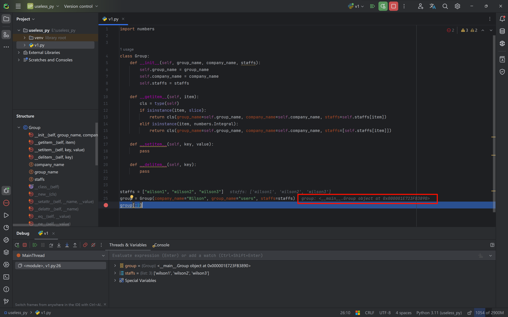
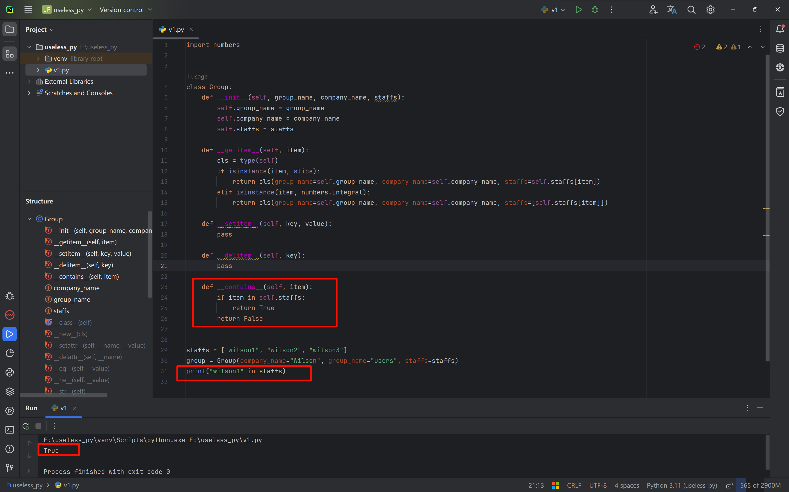
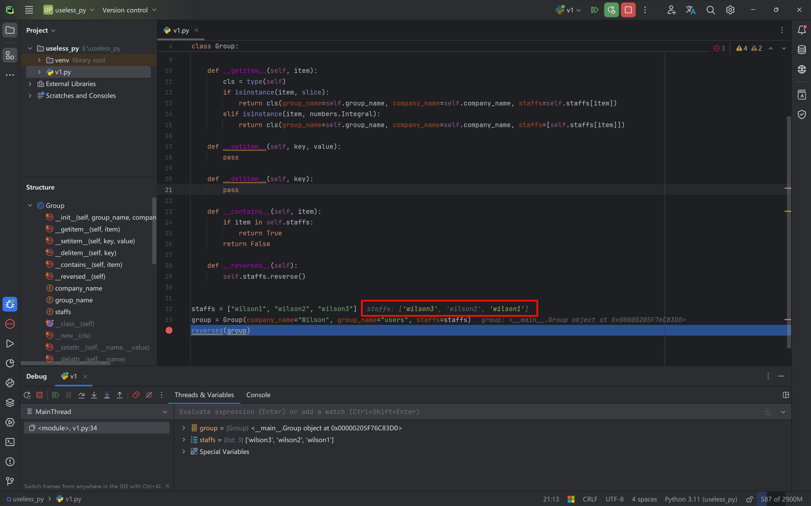
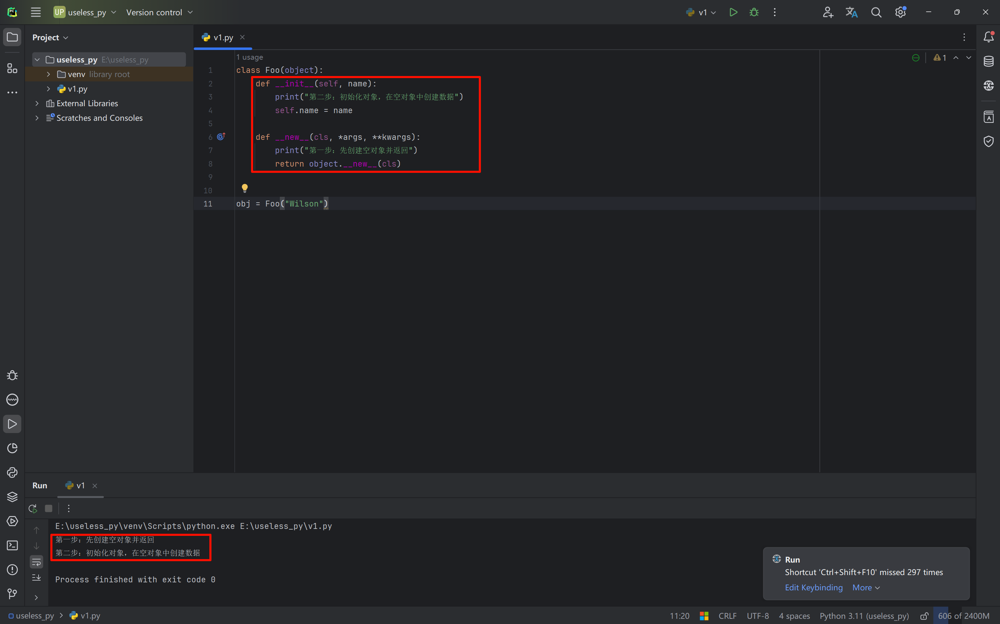
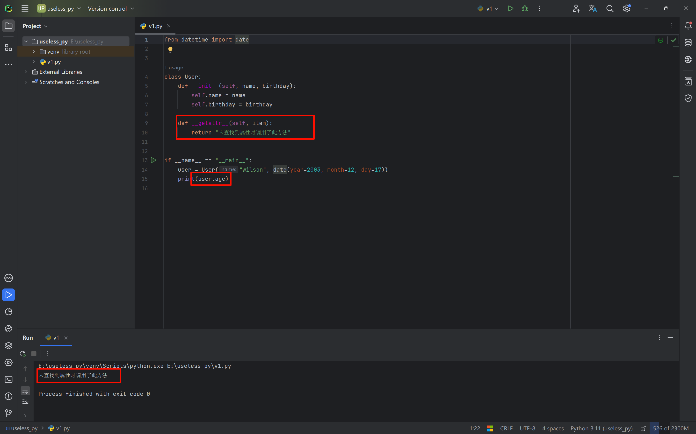
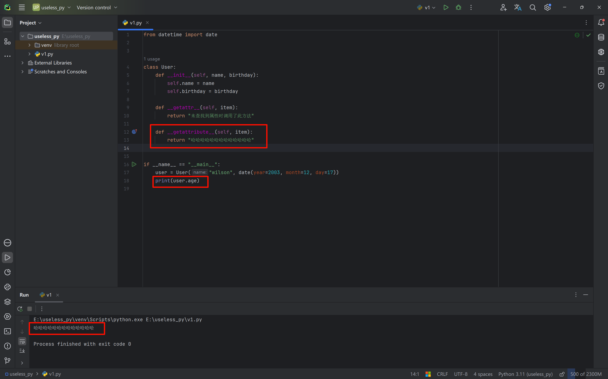
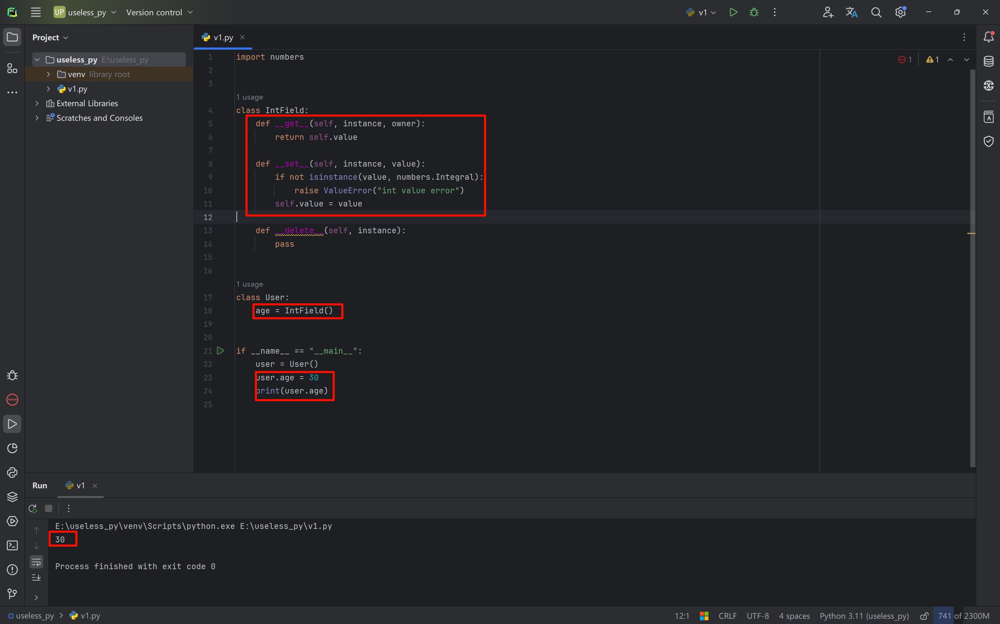

# Magic Functions

In Python classes, there are some special methods, all in the `__方法__` format. These methods have special meanings internally. Next, let's talk about some common special members:

# String Representation

- `__repr__`: controls what this function returns for its instances.

  `__str__`: defines the string representation of an object.

  Difference: `__str__` is user-facing, while `__repr__` is developer-facing.

  Essentially, there isn't much difference between the two; as developers, we commonly use the `__str__` method.

  - Defining only `__str__`

  ```python
  class Foo():
      def __init__(self, name):
          self.name = name
  
      def __str__(self):
          return "哈哈哈"
  
      # def __repr__(self):
      #     return self.name + "自定义的内容"
  
  foo = Foo("wilson")
  print(foo)				# 哈哈哈
  print(foo.__str__())    # 哈哈哈
  ```

  - Defining only `__repr__`

  ```python
  class Foo():
      def __init__(self, name):
          self.name = name
  
      # def __str__(self):
      #     return "哈哈哈"
  
      def __repr__(self):
          return self.name + "自定义的内容"
  
  foo = Foo("wilson")
  print(foo)				# wilson自定义的内容
  print(foo.__repr__())   # wilson自定义的内容
  ```

  - Defining both

  ```python
  class Foo():
      def __init__(self, name):
          self.name = name
  
      def __str__(self):
          return "哈哈哈"
  
      def __repr__(self):
          return self.name + "自定义的内容"
  
  foo = Foo("wilson")
  print(foo)				# 哈哈哈
  print(foo.__str__())    # 哈哈哈
  print(foo.__repr__())   # wilson自定义的内容
  ```
  
  


# Collections and Sequences

- `__len()__`: returns the specified length.

  We can override this method in a class; when `len(类的实例化对象)` is called, this method will be executed, and we can customize it to return the length of one or more members of the class.

- ```python
  class Foo(object):
      def __init__(self, name_list):
          self.name_list = name_list
          
      def __len__(self):
          return len(self.name_list)
      
  foo = Foo(["wilson", "tom"])    
  print(len(foo))		# 2
  ```
  
- `__getitem__`: converts variables passed into the class into an **iterable type**, making it easy to index or loop.

  `__setitem__`

  `__delitem__`

  ```python
  class Foo(object):
  
      def __getitem__(self, item):
          pass
  
      def __setitem__(self, key, value):
          pass
  
      def __delitem__(self, key):
          pass
  
  
  obj = Foo("Wilson", 19)
  
  obj["x1"]
  obj['x2'] = 123
  del obj['x3']
  ```

  We can implement slicing on objects through the above methods, for example:

  ```python
  import numbers
  
  
  class Group:
      def __init__(self, group_name, company_name, staffs):
          self.group_name = group_name
          self.company_name = company_name
          self.staffs = staffs
  
      def __getitem__(self, item):
          cls = type(self)
          if isinstance(item, slice):
              return cls(group_name=self.group_name, company_name=self.company_name, staffs=self.staffs[item])
          elif isinstance(item, numbers.Integral):
              return cls(group_name=self.group_name, company_name=self.company_name, staffs=[self.staffs[item]])
  
      def __setitem__(self, key, value):
          pass
  
      def __delitem__(self, key):
          pass
  
  
  staffs = ["wilson1", "wilson2", "wilson3"]
  group = Group(company_name="Wilson", group_name="users", staffs=staffs)
  group[:2]
  ```

  In the above code, after we implement the `__getitem__` method, slicing a `Group` object still yields a `Group` object.

  

- `__contains__`: used to determine whether a whole contains a part.

  In Python, to determine whether `x` is in the list `list`, we can use `if x in list`.

  Internally, this actually calls the `__contains__` method.

  We can also define a custom `__contains__` method in a class.

  

- `__reversed__`: by overriding this method, we can customize the ordering operation on elements.

  If we call the `reversed()` function, Python internally executes the `__reverse__` method.

  

### Callable

- `__call__`

  ```python
  class Foo(object):
      def __call__(self, *args, **kwargs):
          print("执行call方法")
  
  
  obj = Foo()
  obj()
  ```

### Context Managers

- `__enter__`, `__exit__`

  ```python
  class Foo(object):
  
      def __enter__(self):
          print("进入了")
          return 666
  
      def __exit__(self, exc_type, exc_val, exc_tb):
          print("出去了")
  
  
  obj = Foo()
  with obj as data:
      print(data)
  ```
  
  Regarding context managers, the Python built-in `contextlib` module can also be used to implement them:

  ```python
  import contextlib
  
  
  @contextlib.contextmanager
  def file_open(file_name):
      print("进入了")
      yield {}
      print("出去了")
  
  
  with file_open("a.txt") as f:
      print("file")
  
  >>>进入了
  >>>file
  >>>出去了
  ```
  
  


### Numeric Conversion

- `__abs__`: returns the absolute value of a number.

  ```python
  class Foo():
      def __init__(self, num):
          self.num = num
  
      def __abs__(self):
          return abs(self.num)
  
  
  foo = Foo(-1)
  print(abs(foo))	# 1
  ```

- `__bool__`

- `__int__`

- `__float__`

- `__hash__`

- `__index__`

### Metaclass-Related

- `__new__`: the first argument passed is the class; it is called the constructor method and executes before the `__init__` method.

  ```python
  class Foo(object):
      def __init__(self, name):
          print("第二步：初始化对象，在空对象中创建数据")
          self.name = name
  
      def __new__(cls, *args, **kwargs):
          print("第一步：先创建空对象并返回")
          return object.__new__(cls)
  
  
  obj = Foo("Wilson")
  ```

  Note: `kwargs` receives dictionary arguments, while `args` receives tuple arguments.

- `__init__`: the first argument passed is `self`; it is called the initialization method.

  ```python
  class Foo(object):
      def __init__(self, name):
          self.name = name
  
  
  obj = Foo("Wilson")
  ```




### Attribute-Related

- `__getattr__`: when Python calls a variable or attribute that does not exist, the `__getattr__` method in the class is called.

  `__setattr__`

  

- `__getattribute__`: when this method is defined, it is called whenever any attribute or variable of the class is accessed, whether or not it is defined, and the return value of this method is returned.

  `__setattribute__`

  

- `__dir__`

### Attribute Descriptors

- `__get__`, `__set__`, `__delete__`

  Implementing any one of these three methods in a class turns the class into an attribute descriptor.

  When we set a value on the class, the `__set__` method is automatically called; when getting a value, the `__get__` method is automatically called; when deleting a value, the `__delete__` method is automatically called.

  We can use this feature to constrain the attributes of variables in a class; the principle is the same as the Model in Django.

  For example:

  
  
  When a class only defines the `__get__` method, the descriptor is called a **non-data descriptor**.
  
  When a class defines all three methods `__get__`, `__set__`, and `__delete__`, the descriptor is called a **data descriptor**.
  
  ### Supplement: The Attribute Lookup Process in Python
  
  ```python
  '''
  如果user是某个类的实例，那么user.age（以及等价的getattr(user,’age’)）
  首先调用__getattribute__。如果类定义了__getattr__方法，
  那么在__getattribute__抛出 AttributeError 的时候就会调用到__getattr__，
  而对于描述符(__get__）的调用，则是发生在__getattribute__内部的。
  user = User(), 那么user.age 顺序如下：
  
  （1）如果“age”是出现在User或其基类的__dict__中， 且age是data descriptor， 那么调用其__get__方法, 否则
  
  （2）如果“age”出现在obj(user)的__dict__中， 那么直接返回 obj.__dict__[‘age’]， 否则
  
  （3）如果“age”出现在User或其基类的__dict__中
  
  （3.1）如果age是non-data descriptor，那么调用其__get__方法， 否则
  
  （3.2）返回 __dict__[‘age’]
  
  （4）如果User有__getattr__方法，调用__getattr__方法，否则
  
  （5）抛出AttributeError
  '''
  ```

### Coroutines

- `__aeait__`, `__aiter__`, `__anext__`, `__aenter__`, `__aexit__`

### Iterators and Generators

An iterator is a way to access elements in a collection, generally used to traverse data.

Iterators are different from subscript-based access; iterators do not support slicing.

Generators provide a lazy way to access data.

`__iter__` and `__next__`

- Iterator

  ```python
  # 迭代器类型的定义：
      1.当类中定义了 __iter__ 和 __next__ 两个方法。
      2.__iter__ 方法需要返回对象本身，即：self
      3. __next__ 方法，返回下一个数据，如果没有数据了，则需要抛出一个StopIteration的异常。
  	官方文档：https://docs.python.org/3/library/stdtypes.html#iterator-types
          
  # 创建迭代器类型 ：
  class IT(object): 
      def __init__(self):
          self.counter = 0
  
      def __iter__(self):
          return self 
  
      def __next__(self):
          self.counter += 1
          if self.counter == 3:
              raise StopIteration()
          return self.counter
  
  
  # 根据类实例化创建一个迭代器对象：
      obj1 = IT()
      
      # v1 = obj1.__next__()
      # v2 = obj1.__next__()
      # v3 = obj1.__next__() # 抛出异常
      
      v1 = next(obj1) # obj1.__next__()
      print(v1)
  
      v2 = next(obj1)
      print(v2)
  
      v3 = next(obj1)
      print(v3)
  
  
      obj2 = IT()
      for item in obj2:  # 首先会执行迭代器对象的__iter__方法并获取返回值，一直去反复的执行 next(对象) 
          print(item)
          
  迭代器对象支持通过next取值，如果取值结束则自动抛出StopIteration。
  for循环内部在循环时，先执行__iter__方法，获取一个迭代器对象，然后不断执行的next取值（有异常StopIteration则终止循环）。
  ```

- Generator

  ```python
  # 创建生成器函数
  def func():
      yield 1
      yield 2
  
  
  # 创建生成器对象（内部是根据生成器类generator创建的对象），生成器类的内部也声明了：__iter__、__next__ 方法。
  # 生成器对象是在python编译字节码时产生的
  obj1 = func()
  
  v1 = next(obj1)
  print(v1)
  
  v2 = next(obj1)
  print(v2)
  
  v3 = next(obj1)
  print(v3)
  
  obj2 = func()
  for item in obj2:
      print(item)
      
  
  # 如果按照迭代器的规定来看，其实生成器类也是一种特殊的迭代器类（生成器也是一个中特殊的迭代器）。
  ```

- Iterable Object

  If a class has an `__iter__` method that returns an iterator object, then objects created from this class are called iterable objects.

  ```python
  class Foo(object):
      
      def __iter__(self):
          return 迭代器对象(生成器对象)
      
  obj = Foo() # obj是 可迭代对象。
  
  # 可迭代对象是可以使用for来进行循环，在循环的内部其实是先执行 __iter__ 方法，获取其迭代器对象，然后再在内部执行这个迭代器对象的next功能，逐步取值。
  for item in obj:
      pass
  ```

  ```python
  class IT(object):
      def __init__(self):
          self.counter = 0
  
      def __iter__(self):
          return self
  
      def __next__(self):
          self.counter += 1
          if self.counter == 3:
              raise StopIteration()
          return self.counter
  
  
  class Foo(object):
      def __iter__(self):
          return IT()
  
  
  obj = Foo() # 可迭代对象
  
  
  for item in obj: # 循环可迭代对象时，内部先执行obj.__iter__并获取迭代器对象；不断地执行迭代器对象的next方法。
      print(item)
  ```

  ```python
  # 基于可迭代对象&迭代器实现：自定义range
  class IterRange(object):
      def __init__(self, num):
          self.num = num
          self.counter = -1
  
      def __iter__(self):
          return self
  
      def __next__(self):
          self.counter += 1
          if self.counter == self.num:
              raise StopIteration()
          return self.counter
  
  
  class Xrange(object):
      def __init__(self, max_num):
          self.max_num = max_num
  
      def __iter__(self):
          return IterRange(self.max_num)
  
  
  obj = Xrange(100)
  
  for item in obj:
      print(item)
  ```

  

  ```python
  class Foo(object):
      def __iter__(self):
          yield 1
          yield 2
  
  
  obj = Foo()
  for item in obj:
      print(item)
  ```

  ```python
  # 基于可迭代对象&生成器 实现：自定义range
  
  class Xrange(object):
      def __init__(self, max_num):
          self.max_num = max_num
  
      def __iter__(self):
          counter = 0
          while counter < self.max_num:
              yield counter
              counter += 1
  
  
  obj = Xrange(100)
  for item in obj:
      print(item)
  ```

- Common data types:

  ```python
  v1 = list([11,22,33,44])
  
  v1是一个可迭代对象，因为在列表中声明了一个 __iter__ 方法并且返回一个迭代器对象。
  ```

  ```python
  from collections.abc import Iterator, Iterable
  
  v1 = [11, 22, 33]
  print( isinstance(v1, Iterator) )  # false，判断是否是迭代器；判断依据是__iter__ 和 __next__。
  v2 = v1.__iter__()
  print( isinstance(v2, Iterator) )  # True
  
  
  
  v1 = [11, 22, 33]
  print( isinstance(v1, Iterable) )  # True，判断依据是是否有 __iter__且返回迭代器对象。
  
  v2 = v1.__iter__()
  print( isinstance(v2, Iterable) )  # True，判断依据是是否有 __iter__且返回迭代器对象。
  ```

### Others

- `__dict__`: queries all attributes in a class or in an instance's variables.

  (You can also use the `dir()` function to get more detailed attribute information.)

  ```python
  class Foo(object):
      def __init__(self, name, age):
          self.name = name
          self.age = age
  
  
  obj = Foo("Wilson",19)
  print(obj.__dict__)
  ```

- `__add__` and so on.

  ```python
  class Foo(object):
      def __init__(self, name):
          self.name = name
  
      def __add__(self, other):
          return "{}-{}".format(self.name, other.name)
  
  
  foo1 = Foo("wilson")
  foo2 = Foo("123")
  
  # 对象+值，内部会去执行 对象.__add__方法，并将+号后面的值当做参数other传递过去。
  v3 = foo1 + foo2
  print(v3)	# wilson-123
  ```
