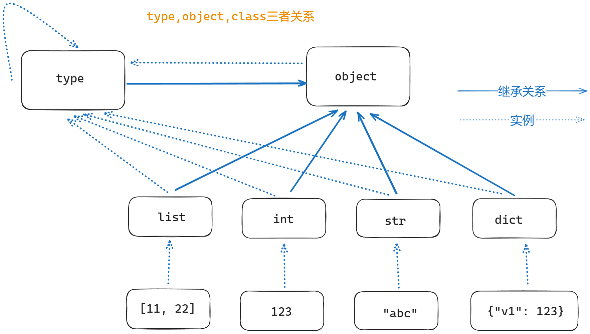

# The relationship between type, object and class

In Python, the creation relationships of all classes follow:

```
type -> int -> 1
type -> class -> obj
```

For example:

```python
a = 1
b = "abc"
print(type(1))          # <class 'int'> 返回对象的类型
print(type(int))        # <class 'type'> 表明这个类是由type生成的
print(type(b))          # <class 'str'>
print(type(str))        # <class 'type'>
```

In Python, the `type()` method has two uses:

- Return the type of the instance variable, e.g. `1` is the integer type `int`, and `"abc"` is the string type `str`
- Return which class created this class, e.g. both `int` and `str` are created by the `type` class

From this we can see that classes are all objects created by the `type` class.

And the `type` class itself is generated by itself.

Now let's look at the `object` class:

```python
class Student:
    pass


stu = Student()
print(type(stu))            # <class '__main__.Student'>
print(type(Student))        # <class 'type'>
print(int.__bases__)        # (<class 'object'>,)
print(str.__bases__)        # (<class 'object'>,)
print(Student.__bases__)    # (<class 'object'>,)
print(type.__bases__)       # (<class 'object'>,)
print(object.__bases__)     # ()
print(type(object))         # (<class 'object'>,)
```

The `__bases__` method returns the parent classes of a class.

We can see that the `object` class is the parent class of all classes (including, of course, the `type` class).

Even if we don't write the inheritance relationship directly in the code, Python defaults to all classes inheriting from `object`.

Diagram of the relationship between the three:


