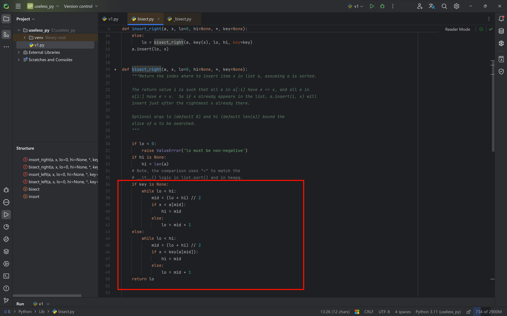

# The bisect module

In Python, if we want to maintain a sorted sequence, we can use the built-in `bisect` module, for example:

```python
import bisect

# 用于处理已排序的序列
inter_list = []
bisect.insort(inter_list, 3)
bisect.insort(inter_list, 2)
bisect.insort(inter_list, 5)
bisect.insort(inter_list, 1)
bisect.insort(inter_list, 6)
print(inter_list)	# [1, 2, 3, 5, 6]
print(bisect.bisect(inter_list, 3))		# 3
```

Internally, `bisect` uses the binary search algorithm to insert data.

By default it uses the `insort_right` function (if there are two identical items, the new item is added to the right of the old one), and `insort_right` internally calls the `bisect_right` function to implement the binary search algorithm.



If you need to search, you can use the `bisect` function, which by default also calls the `bisect_right` function.
