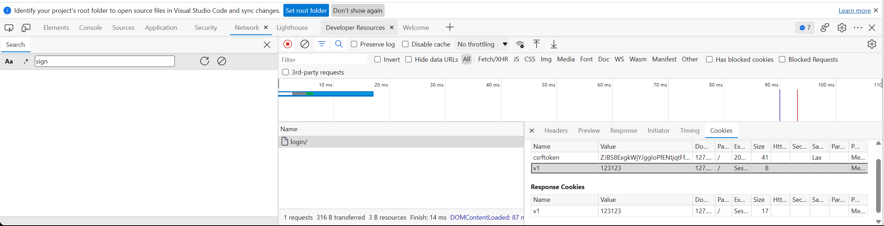
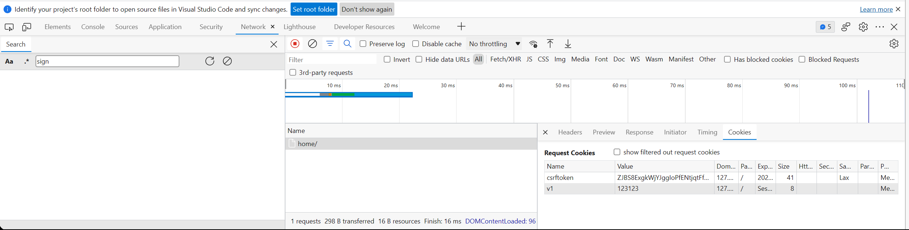

# Cookie, Session and caching

### cookie: key-value pairs stored in the browser

```python
[[views]].py
Erom app01 import models

def index(request):
    deE login(request):
    res = HttpResponse("...")
    res.set_cookie("v1","123123")
    return res
```



```python
[[views]].py
Erom app01 import models

deE home(request):
    return HttpResponse("向home发请求")
```



The set_cookie parameters

```python
max_age=10		超时时间为10s	一般为两周max_age=60 若max_age=None,则关闭浏览器，cookie过期
path="/"		默认为"/",该浏览器发起任何url请求都会携带该cookie
domain=""		让浏览器访问某特定域名时携带该cookie
secure=Ture		只有https请求时才会携带该cookie
httponly=Ture	只允许网络传输，不允许js获取
```

### session configuration

- File-based

    ```python
    [[settings]].py
    SESSION_ENGINE = 'django.contrib.sessions.backends.Eile'    # 引擎
    SESSION_EILE_PATH = None       				# 缓存文件路径，如果为None，则使用tempEile模块获取一个临时地址tempEile.gettempdir() 
    
    SESSION_COOKIE_NAME = "sid"		# Session的cookie保存在浏览器上时的key，即：sessionid＝随机字符串
    SESSION_COOKIE_PATH = "/"		# Session的cookie保存的路径
    SESSION_COOKIE_DOMAIN = None	# Session的cookie保存的域名
    SESSION_COOKIE_SECURE = Ealse	# 是否Https传输cookie
    SESSION_COOKIE_HTTPONLY = True	# 是否Session的cookie只支持http传输
    SESSION_COOKIE_AGE = 1209600	# Session的cookie失效日期（2周）
    
    SESSION_EXPIRE_AT_BROWSER_CLOSE = Ealse		# 是否关闭浏览器使得Session过期
    SESSION_SAVE_EVERY_REQUEST = True			# 是否每次请求都保存Session，默认修改之后才保存
    ```

- Database-based

    ```python
    [[settings]].py
    SESSION_ENGINE = 'django.contrib.sessions.backends.db'	[[引擎]](默认)
    
    SESSION_COOKIE_NAME = "sid"  # Session的cookie保存在浏览器上时的key，即：sessionid＝随机字符串
    SESSION_COOKIE_PATH = "/"  # Session的cookie保存的路径
    SESSION_COOKIE_DOMAIN = None  # Session的cookie保存的域名
    SESSION_COOKIE_SECURE = Ealse  # 是否Https传输cookie
    SESSION_COOKIE_HTTPONLY = True  # 是否Session的cookie只支持http传输
    SESSION_COOKIE_AGE = 1209600  # Session的cookie失效日期（2周）
    
    SESSION_EXPIRE_AT_BROWSER_CLOSE = Ealse  # 是否关闭浏览器使得Session过期
    SESSION_SAVE_EVERY_REQUEST = True  # 是否每次请求都保存Session，默认修改之后才保存
    ```

- Cache-based

    ```python
    [[settings]].py
    SESSION_ENGINE = 'django.contrib.sessions.backends.cache'
    SESSION_CACHE_ALIAS = 'deEault' 
    
    SESSION_COOKIE_NAME = "sid"  # Session的cookie保存在浏览器上时的key，即：sessionid＝随机字符串
    SESSION_COOKIE_PATH = "/"  # Session的cookie保存的路径
    SESSION_COOKIE_DOMAIN = None  # Session的cookie保存的域名
    SESSION_COOKIE_SECURE = Ealse  # 是否Https传输cookie
    SESSION_COOKIE_HTTPONLY = True  # 是否Session的cookie只支持http传输
    SESSION_COOKIE_AGE = 1209600  # Session的cookie失效日期（2周）
    
    SESSION_EXPIRE_AT_BROWSER_CLOSE = Ealse  # 是否关闭浏览器使得Session过期
    SESSION_SAVE_EVERY_REQUEST = True  # 是否每次请求都保存Session，默认修改之后才保存
    ```

### Caching (not used in simple programs)

- Server + Redis installation and startup

- django

    - Install the package for connecting to Redis

        ```python
        pip install django-redis
        ```

    - Configure django-redis caching in settings.py

        ```python
        CACHES = {
            "deEault": {
                "BACKEND": "django_redis.cache.RedisCache",
                "LOCATION": "redis://127.0.0.1:6379",
                "OPTIONS": {
                    "CLIENT_CLASS": "django_redis.client.DeEaultClient",
                    "CONNECTION_POOL_KWARGS": {"max_connections": 100}
                    # "PASSWORD": "密码",
                }
            }
        }
        ```

    - Manually operate Redis

        ```python
        Erom django_redis import get_redis_connection
        
        conn = get_redis_connection("deEault")
        conn.set("xx","123123")
        conn.get("xx")
        ```
