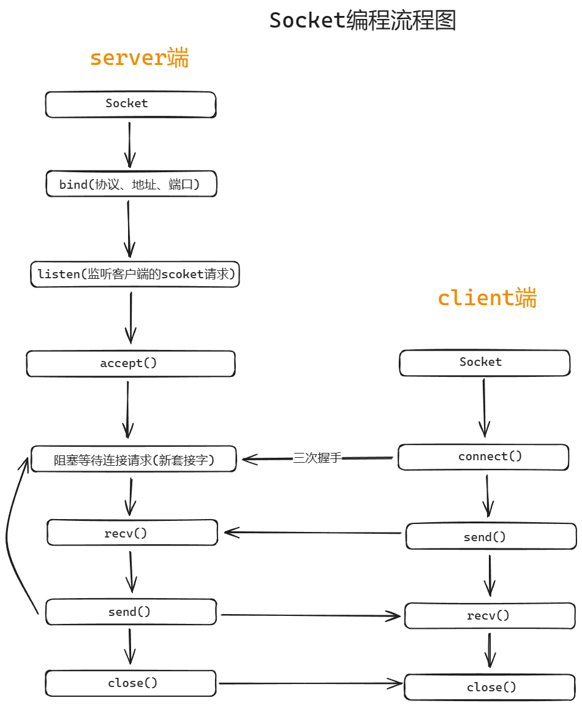
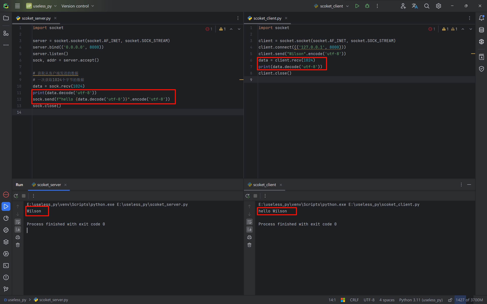
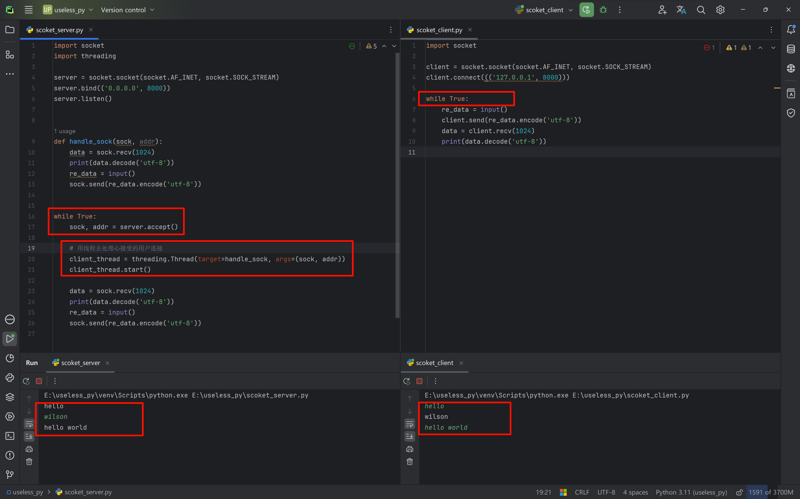
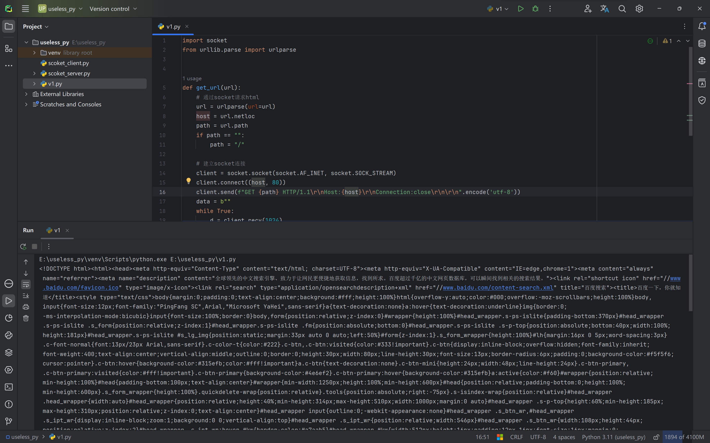
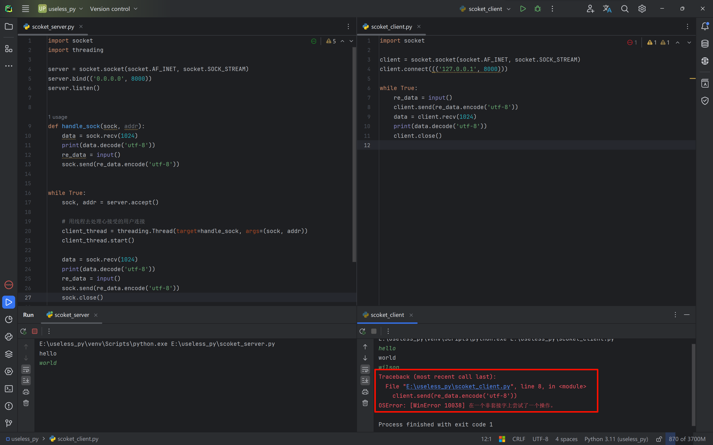

# The socket module

Let's first look at a socket programming flow diagram.



Here, the server side is the server deployed on the server machine, and the client side corresponds to our PC software/browser, though the browser has already encapsulated socket for us internally.

## Simple socket communication

- socket_server.py

  ```python
  import socket
  
  server = socket.socket(socket.AF_INET, socket.SOCK_STREAM)
  server.bind(('0.0.0.0', 8000))
  server.listen()
  sock, addr = server.accept()
  
  # 获取从客户端发送的数据
  # 一次获取1024个字节的数据
  data = sock.recv(1024)
  print(data.decode('utf-8'))
  sock.send(f"hello {data.decode('utf-8')}".encode('utf-8'))
  sock.close()
  ```

- socket_client.py

  ```python
  import socket
  
  client = socket.socket(socket.AF_INET, socket.SOCK_STREAM)
  client.connect((('127.0.0.1', 8000)))
  client.send("Wilson".encode('utf-8'))
  data = client.recv(1024)
  print(data.decode('utf-8'))
  client.close()
  ```

First start the server side (if you start the client side first, it will fail to start because it cannot connect to the server). The server side will hang, waiting for the client to send a network request. After receiving the network request, the server side also sends data to the client.



**Note**: Data is transmitted as binary, so we need to convert it to utf-8 when printing.

## Implementing simple real-time chat and multi-user connections with socket

For real-time chat, we can use a `while` loop.

For multi-user connections, we can use multi-threading.

- socket_server.py

  ```python
  import socket
  import threading
  
  server = socket.socket(socket.AF_INET, socket.SOCK_STREAM)
  server.bind(('0.0.0.0', 8000))
  server.listen()
  
  
  def handle_sock(sock, addr):
      data = sock.recv(1024)
      print(data.decode('utf-8'))
      re_data = input()
      sock.send(re_data.encode('utf-8'))
  
  
  while True:
      sock, addr = server.accept()
  
      # 用线程去处理新接受的用户连接
      client_thread = threading.Thread(target=handle_sock, args=(sock, addr))
      client_thread.start()
  
      data = sock.recv(1024)
      print(data.decode('utf-8'))
      re_data = input()
      sock.send(re_data.encode('utf-8'))
  ```

- server_client.py

  ```python
  import socket
  
  client = socket.socket(socket.AF_INET, socket.SOCK_STREAM)
  client.connect((('127.0.0.1', 8000)))
  
  while True:
      re_data = input()
      client.send(re_data.encode('utf-8'))
      data = client.recv(1024)
      print(data.decode('utf-8'))
  ```



## Simulating an HTTP request with socket

```python
import socket
from urllib.parse import urlparse


def get_url(url):
    # 通过socket请求html
    url = urlparse(url=url)
    host = url.netloc
    path = url.path
    if path == "":
        path = "/"

    # 建立socket连接
    client = socket.socket(socket.AF_INET, socket.SOCK_STREAM)
    client.connect((host, 80))
    client.send(f"GET {path} HTTP/1.1\r\nHost:{host}\r\nConnection:close\r\n\r\n".encode('utf-8'))
    data = b""
    while True:
        d = client.recv(1024)
        if d:
            data += d
        else:
            break
    data = data.decode('utf-8')
    html_data = data.split("\r\n\r\n")[1]
    print(html_data)
    client.close()


if __name__ == "__main__":
    get_url("http://www.baidu.com")
```

In this example, socket is used to simulate an HTTP request to obtain the front-end page data of Baidu.



## Resolving errors:

### OSError: [WinError 10038] An operation was attempted on something that is not a socket.

Each time through the loop, the socket client is closed, so it cannot connect properly, which causes the error.



The simple and direct solution is to not manually close the connection channel between the client and the server, that is, remove the closing `close` code block at the end.
