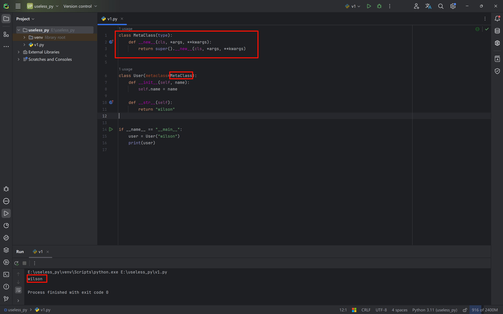

# The type metaclass

### Two ways to create classes dynamically

When we want to create classes dynamically, we can use the following function:

```python
def create_class(name):
    if name == "user":
        class User:
            def __str__(self):
                return "User"

        return User
    elif name == "company":
        class Company:
            def __str__(self):
                return "company"

        return Company


if __name__ == "__main__":
    MyClass = create_class("user")
    my_obj = MyClass()
    print(my_obj)					# User
```

But this approach is cumbersome; we can use the `type()` function to create classes.

```python
User = type("user", (), {})
```

We can look at the parameters in the `type()` source code.

- The first parameter is the class name.

- The second parameter is its base classes, i.e. its parent classes, passed in as a tuple (if there are none, an empty tuple can be written).

  If there is only one parent class, the tuple needs a trailing comma.

- The third parameter defines the attributes or variables in the class, passed in as a dictionary (equivalent to class variables).

  Functions can also be passed, using the function name as the key of the dictionary and the return value as the value of the dictionary.

```python
    def __init__(cls, what, bases=None, dict=None): # known special case of type.__init__
        """
        type(object) -> the object's type
        type(name, bases, dict, **kwds) -> a new type
        # (copied from class doc)
        """
        pass
```

```python
def create_class(name):
    if name == "user":
        class User:
            def __str__(self):
                return "User"

        return User
    elif name == "company":
        class Company:
            def __str__(self):
                return "company"

        return Company


class BaseClass:
    def answer(self):
        return "基类"


if __name__ == "__main__":
    User = type("user", (BaseClass,), {"name": "user", "func": lambda self: "wilson"})
    my_obj = User()
    print(my_obj.name)			# user
    print(my_obj.func())		# wilson
    print(my_obj.answer())		# 基类
```


### A metaclass is a special class used to create classes

Our ordinary classes are all created by `class`, and `class` is actually also a kind of class, one that is created by `type`.

When we use `class` to create a class, we can specify a `metaclass` parameter to designate which class (the metaclass) creates this class, for example:

```python
class MetaClass(type):
    pass

class User(metaclass=MetaClass):
    pass
```

The class instantiation process in Python:

- Python first looks for the `metaclass` attribute when creating the class; if present, it creates the class through the `metaclass`.

  (Looking up the `metaclass` attribute includes the inheritance relationship: if this class does not define it but its parent class does, then the parent class's `metaclass` attribute is used to create it.)

- If `metaclass` is not defined, the class object is created by `type` by default.

When using a metaclass, the process of creating the class object can be handed over to the metaclass, so there is no need to implement the `__new__` method at creation time, keeping the logic layering of the functions clear.

In Python's `abc` module, a `metaclass` is customized and the `__new__` method is overridden.


