# Redis Cluster

## Distributed Storage

Whether it is a single node, or master-slave replication, or even sentinel, you will eventually hit a data bottleneck. What do you do when the data volume reaches its upper limit?

We would certainly want to store the data in a distributed way.


### Sequential Partitioning and Hash Partitioning

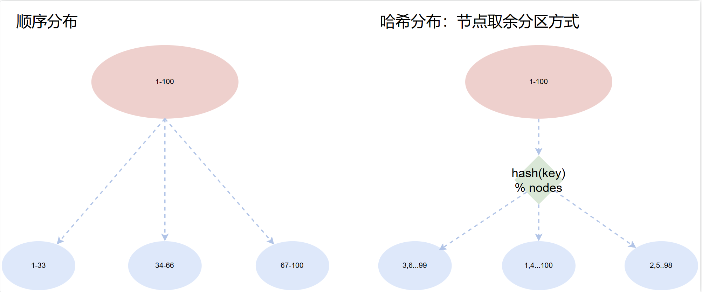

Sequential distribution:

- Data is relatively concentrated and data skew is easy to cause; business correlation is high; sequential operations are supported; batch operations are supported.
- Related products: BigTable, HBase, etc.

Characteristics of hash distribution:

- High data dispersion; key distribution is unrelated to business; sequential access is not possible, etc.
- Related products: consistent-hashing Memcache, Redis, and other cache products.

### Common Partitioning Algorithms for Hash Distribution

#### Node Modulo Algorithm

- The advantage is that it is simple — the client can just hash and then take the remainder.
- There are also problems. For example, when we add a server and hash the same key with the remainder, the divisor changes from 3 to 4, so the storage location changes. That is, when the number of servers changes, all caches become invalid for a period of time. When the application cannot get data from the cache, it will request data from the backend server. Similarly, suppose a cache server suddenly fails and we need to remove it, changing the number of cache servers from 3 to 2. This also causes a large number of caches to become invalid at the same time, causing a cache avalanche — the backend server will bear enormous pressure, and the whole system may well be crushed. To solve this, the consistent hashing algorithm was created.
- The amount of migrated data is related to the number of added nodes; it is recommended to double the capacity when expanding.

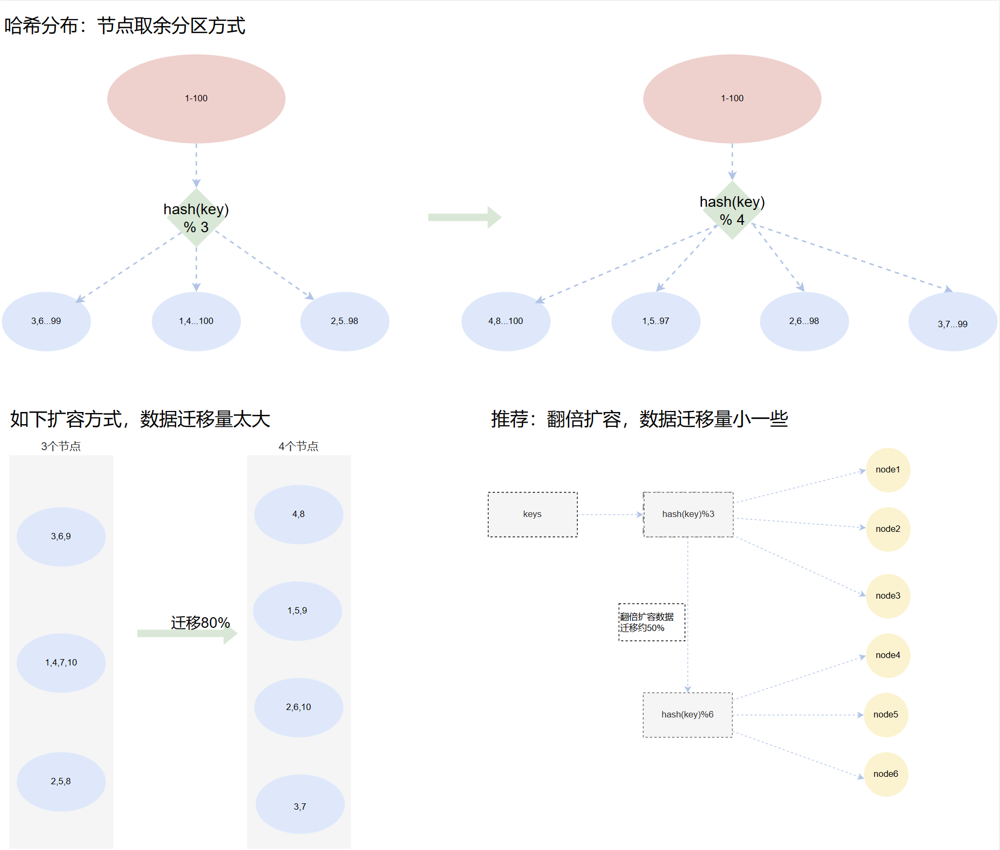

#### Consistent Hashing Algorithm

The consistent hashing algorithm was proposed by MIT in 1997. It is a special hashing algorithm that, when removing or adding a server, changes the mapping between existing service requests and the servers handling those requests as little as possible.

Consistent hashing solves the dynamic scaling and other problems of simple hashing algorithms in a Distributed Hash Table (DHT).

Essentially, the consistent hashing algorithm is also a modulo algorithm; however, unlike the modulo-by-number-of-servers above, consistent hashing takes the modulo of the fixed value 2^32. (An IPv4 address is composed of 32 binary bits, so using 2^32 guarantees that each IP address has a unique mapping.)

We can abstract these 2^32 values into a ring. The point directly above the ring represents 0, arranged clockwise, and so on: 1, 2, 3... up to 2^32 - 1. This ring, composed of 2^32 points, is collectively called the hash ring.

The specific steps are as follows:

1. The consistent hashing algorithm organizes the entire hash value space clockwise into a virtual ring, called the Hash ring.
2. Then each server is hashed using a Hash function. You can choose the server's IP or hostname as the key for hashing, thereby determining the position of each machine on the hash ring.
3. Finally, use the algorithm to locate the server for data access: hash the data key with the same function to compute a hash value and determine the data's position on the ring; from this position, walk clockwise along the ring, and the first server encountered is the server the data should be located on.

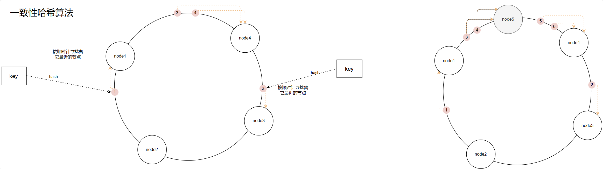

**Advantages and disadvantages of the consistent hashing algorithm**

As mentioned earlier, if you simply take the modulo of the number of servers, then when the number of servers changes, a cache avalanche occurs, which can easily bring down the system. Using the consistent hashing algorithm can solve this problem well, because the consistent hashing algorithm only needs to relocate a small portion of the data in the ring space when nodes are added or removed. Only part of the cache becomes invalid, so not all the pressure is concentrated on the backend servers at the same time. It has good fault tolerance and scalability.

In short, the consistent hashing algorithm mainly optimizes the remainder step after hashing.

When nodes expand or shrink, data migration still occurs, but it is much better than the node-modulo approach.

Moreover, the more nodes there are, the more evenly the data is distributed. So consistent hashing is suitable for scenarios with a large number of nodes.

**Hash ring skew and virtual nodes**

When there are too few service nodes, the consistent hashing algorithm can easily cause data skew because the nodes are unevenly distributed — that is, most of the cached objects are concentrated on a single server, resulting in uneven data distribution. This situation is called hash ring skew.

In extreme cases, hash ring skew can still cause the system to crash. To solve this data-skew problem, the consistent hashing algorithm introduces a virtual node mechanism: for each service node, multiple hashes are computed, and a copy of that service node is placed at each hash-result position; these are called virtual nodes. One physical node can correspond to multiple virtual nodes. The more virtual nodes there are, the more nodes there are on the hash ring, the higher the probability that the cache is evenly distributed, and the smaller the impact of hash ring skew. The data-locating algorithm stays the same — there is just one extra step: mapping virtual nodes to physical nodes.

#### Hash Slot Partitioning Algorithm (Used by Redis)

For hash slots, you need to understand two concepts:

1. Hash algorithm: the hash algorithm of a Redis cluster is not a simple hash algorithm; it uses the CRC16 algorithm.

   - **Cyclic Redundancy Check** (CRC) is a hash function that generates a short, fixed-bit check code from data such as network packets or computer files. It is mainly used to detect or verify errors that may occur during data transmission or after saving.
   - Depending on the generated length (bits), there are CRC8/CRC16/CRC32. The CRC16 algorithm is an efficient hash algorithm with the advantages of fast computation and a low collision rate. The hash algorithm Redis uses for hash computation is the CRC16 algorithm.

2. Slot: in a Redis cluster, a total of 16384 (0-16383) virtual slots are created to store the dataset, and these 16384 slots are evenly mapped to each node.

   - Why set up 2^14 slots, i.e., 16384 slots? Theoretically, the crc16 algorithm can produce 2^16 values, ranging from 0 to 65535. When taking the modulo of a key, it should be `crc16(key)%65535`, but it was designed as `crc16(key)%16384`. The reason is that when designing the Redis cluster, a space trade-off was made: the number of nodes was considered unlikely to exceed 1000, and to ensure communication efficiency between nodes, 2^14 was adopted.
   - The slot space of a Redis cluster can be fine-tuned manually. For example, machines with better performance can be assigned more slots, and machines with poorer performance fewer. This can all be handled with commands. Of course, the Redis cluster allows adjustments, but does not allow large adjustments — the slot difference between nodes cannot exceed 2%.

   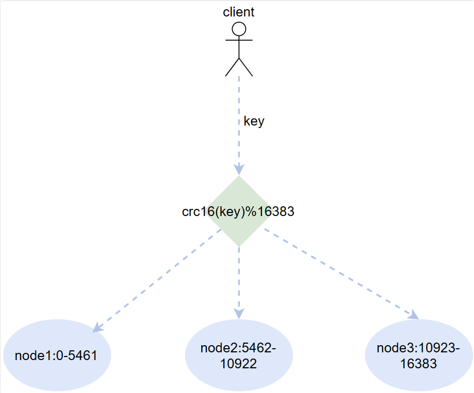

## About Clusters

Redis has only supported clusters since version 3, mainly to solve the shortcomings of sentinel:

- Too much write pressure on the master.
- Low resource utilization.
- The cumbersome connection process.

The cluster solution solves the problems that redis writes cannot be load-balanced and that storage capacity is limited by a single machine, achieving a relatively complete high-availability solution.

## Important Concepts of a Cluster

1. A Redis cluster has exactly 16384 slots no matter how many nodes there are.
2. All slots must be correctly assigned. Even if just 1 slot is abnormal, the entire cluster becomes unavailable.
3. The order of a node's slots is not important; what matters is the number of slots.
4. The HASH algorithm is even and random enough.
5. The probability of each slot being assigned data is roughly equal.
6. The high availability of the cluster relies on master-slave replication.
7. The number of slots per node in the cluster is allowed to vary within a 2% error range.
8. Cluster communication uses the base port number + 10000. This port is automatically created, not configured in the configuration file. In production, remember to open this port in the firewall.

## Deploying a Cluster

### Deployment Planning

First, it is indeed possible to configure a redis cluster on a single machine, as long as you distinguish by port. Essentially it is just a matter of running several redis instances distinguished by port. But this is completely meaningless: if you deploy the cluster on one server, no matter how impressive the cluster deployment is, it is all for nothing when the server goes down...

Therefore, this deployment will use 4 servers to demonstrate cluster deployment and other operations and verifications.

**Environment**

````bash
win11
vmware workstation 16 pro
centos7.9 
	4C2G 
	4台
xshell7免费版
redis5.0.7

[root@cs ~]# cat /etc/redhat-release 
CentOS Linux release 7.9.2009 (Core)
````

**Architecture diagram**

On 4 servers, each server has one master and one replica, for a total of 8 redis instances. In addition, all master and replica nodes cannot be on the same server, to prevent a server downtime from taking both the master and its replica down together, which would cause data loss.

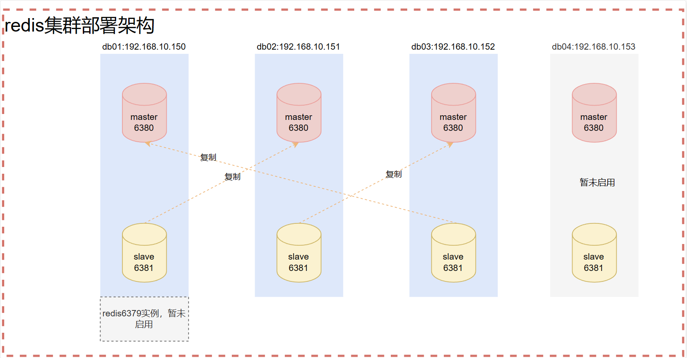

In the early stage, we need to install all 8 redis instances required by the cluster on the 4 servers. Then we first use 3 servers (6 instances) to deploy the cluster, and only use the remaining two redis instances later during cluster expansion and shrinking.

**Port planning**

On each server, the master node listens on port 6380 and the replica node listens on port 6381.

**Directory planning**

```bash
/opt/redis{6380,6381}/{conf,logs,pid}   # 主节点是redis6380，从节点是redis6381，里面的conf，logs,pid分别是配置目录，日志目录，pid目录

/data/redis{6380,6381}					# 主从节点的数据目录

# 配置主从节点的systemctl管理
/usr/lib/systemd/system/redis-master.service
/usr/lib/systemd/system/redis-slave.service
```

**The manual cluster deployment process**

1. Install the redis instances on each server.
2. Configure cluster discovery, so that the Redis instances on each server get to know each other and know that everyone is in the same group.
3. Manually configure the slots. There are 16384 slots in total, and all future writes will be randomly written into various slots according to the algorithm.
4. Manually build the master-slave replication relationships between the nodes in the cluster.

### Manually Building a Cluster

```bash
# 关闭防火墙和下载一些可能用到的工具
systemctl stop firewalld.service
systemctl disable firewalld.service
systemctl status firewalld.service
sed -i.ori 's#SELINUX=enforcing#SELINUX=disabled#g' /etc/selinux/config
yum update -y
yum -y install gcc automake autoconf libtool make
yum -y install net-tools vim wget lrzsz
```

#### 1. Deploying the Redis Instances

##### Deploying Redis on Server db01

First set up SSH authentication to make later transfers convenient.

```bash
# 一路回车
ssh-keygen

# 将公钥拷贝到其它三台服务器，按照提示输入yes和目标服务器的密码
ssh-copy-id 192.168.10.151
ssh-copy-id 192.168.10.152
ssh-copy-id 192.168.10.153
```

Configure the two instances on ports 6380 and 6381.

```bash
# 可以先杀掉所有的redis实例
pkill -9 redis

# 1. 创建目录
mkdir -p /opt/redis{6380,6381}/{conf,logs,pid}
mkdir -p /data/redis{6380,6381}

# 2. 生成主节点配置文件
cat >/opt/redis6380/conf/redis6380.conf <<EOF
# 注意，bind后面先跟本机ip就行了，这样集群发现时，能根据服务器ip进行发现，不要跟127.0.0.1了
bind $(ifconfig ens33|awk 'NR==2{print $2}')
port 6380
daemonize yes
pidfile "/opt/redis6380/pid/redis6380.pid"
logfile "/opt/redis6380/logs/redis6380.log"
dbfilename "redis6380.rdb"
dir "/data/redis6380/"
save 900 1
save 300 10
save 60 10000
appendonly yes
appendfilename "redis6380.aof"
appendfsync everysec
cluster-enabled yes
cluster-config-file nodes6380.conf
cluster-node-timeout 15000
EOF

# 3. 复制主节点的配置文件到从节点，并更改端口号
cp /opt/redis6380/conf/redis6380.conf /opt/redis6381/conf/redis6381.conf
sed -i 's#6380#6381#g' /opt/redis6381/conf/redis6381.conf

# 4. 更改授权为Redis
# 添加用户报错也正常，因为我这台测试机器，添加过这个用户和组， 
# -u和-g选项表示同时添加具有特定UID和GID的用户
# -M创建一个没有主目录的用户
# -s表示当前创建的当前用户无法用来登录系统
# chown -R redis:redis表示指定目录以及内部的文件所有用户属组归于redis:redis
# groupdel redis
# cat /etc/group |grep redis
groupadd redis -g 1000
# userdel redis
# cat /etc/passwd |grep redis
useradd redis -u 1000 -g 1000 -M -s /sbin/nologin
chown -R redis:redis /opt/redis*
chown -R redis:redis /data/redis*

# 5. 生成主节点的systemd启动文件
cat >/usr/lib/systemd/system/redis-master.service<<EOF
[Unit]
Description=Redis persistent key-value database
After=network.target
After=network-online.target
Wants=network-online.target

[Service]
ExecStart=/usr/local/bin/redis-server /opt/redis6380/conf/redis6380.conf --supervised systemd
ExecStop=/usr/local/bin/redis-cli -h $(ifconfig ens33|awk 'NR==2{print $2}') -p 6380 shutdown
Type=notify
User=redis
Group=redis
RuntimeDirectory=redis
RuntimeDirectoryMode=0755

[Install]
WantedBy=multi-user.target
EOF

# 6. 复制master节点的启动⽂件给slave节点并修改端⼝号
cp /usr/lib/systemd/system/redis-master.service /usr/lib/systemd/system/redis-slave.service
sed -i 's#6380#6381#g' /usr/lib/systemd/system/redis-slave.service

# 7. 重载systemd相关文件，并启动集群节点
systemctl daemon-reload
# Redis是6379的
systemctl start redis
# redis-master是将来在集群中充当主节点的
systemctl start redis-master
# redis-slave是将来在集群中充当从节点的
systemctl start redis-slave
ps -ef|grep redis

# 8. 把创建好的⽬录和启动⽂件发送给db02、db03、db04
rsync -avz /opt/redis638* 192.168.10.151:/opt/
rsync -avz /opt/redis638* 192.168.10.152:/opt/
rsync -avz /opt/redis638* 192.168.10.153:/opt/

rsync -avz /usr/local/bin/redis* 192.168.10.151:/usr/local/bin/
rsync -avz /usr/local/bin/redis* 192.168.10.152:/usr/local/bin/
rsync -avz /usr/local/bin/redis* 192.168.10.153:/usr/local/bin/
rsync -avz /usr/lib/systemd/system/redis*.service 192.168.10.151:/usr/lib/systemd/system/
rsync -avz /usr/lib/systemd/system/redis*.service 192.168.10.152:/usr/lib/systemd/system/
rsync -avz /usr/lib/systemd/system/redis*.service 192.168.10.153:/usr/lib/systemd/system/
```

First test whether the three nodes on db01 have any problems.

```bash
ps -ef|grep redis
redis-cli -h 192.168.10.150 -p 6379 ping
redis-cli -h 192.168.10.150 -p 6380 ping
redis-cli -h 192.168.10.150 -p 6381 ping

# 6379是咱们原来Redis，集群搭建和学习各种套路先不用它
# 6380和6381才是集群中用到的
[root@cs ~]# ps -ef|grep redis
redis      2727      1  0 03:16 ?        00:00:00 /usr/local/bin/redis-server 192.168.10.150:6379
redis      2737      1  0 03:16 ?        00:00:00 /usr/local/bin/redis-server 192.168.10.150:6380 [cluster]
redis      2747      1  0 03:16 ?        00:00:00 /usr/local/bin/redis-server 192.168.10.150:6381 [cluster]
root       2772   1669  0 03:16 pts/0    00:00:00 grep --color=auto redis
[root@cs ~]# redis-cli -h 192.168.10.150 -p 6379 ping
PONG
[root@cs ~]# redis-cli -h 192.168.10.150 -p 6380 ping
PONG
[root@cs ~]# redis-cli -h 192.168.10.150 -p 6381 ping
PONG
```

Now that we have set up the Redis instances on db01, we have also sent the Redis-related files to db02, db03, and db04. Next, we just need to make small changes to the configuration on these three nodes.

##### Quickly Deploying Redis on db02

Replace the files sent from db01 and modify the IP address.

```bash
find /opt/redis638* -type f -name "*.conf"|xargs sed -i "/bind/s#150#151#g"
sed -i 's#150#151#g' /usr/lib/systemd/system/redis-*.service
mkdir -p /data/redis{6380,6381}
groupadd redis -g 1000
useradd redis -u 1000 -g 1000 -M -s /sbin/nologin
chown -R redis:redis /opt/redis*
chown -R redis:redis /data/redis*
systemctl daemon-reload
systemctl start redis-master
systemctl start redis-slave
ps -ef|grep redis
redis-cli -h 192.168.10.151 -p 6380 ping
redis-cli -h 192.168.10.151 -p 6381 ping
```

##### Quickly Deploying Redis on db03

Replace the files sent from db01 and modify the IP address.

```bash
find /opt/redis638* -type f -name "*.conf"|xargs sed -i "/bind/s#150#152#g"
sed -i 's#150#152#g' /usr/lib/systemd/system/redis-*.service
mkdir -p /data/redis{6380,6381}
groupadd redis -g 1000
useradd redis -u 1000 -g 1000 -M -s /sbin/nologin
chown -R redis:redis /opt/redis*
chown -R redis:redis /data/redis*
systemctl daemon-reload
systemctl start redis-master
systemctl start redis-slave
ps -ef|grep redis
redis-cli -h 192.168.10.152 -p 6380 ping
redis-cli -h 192.168.10.152 -p 6381 ping
```

##### Quickly Deploying Redis on db04

Replace the files sent from db01 and modify the IP address.

```bash
find /opt/redis638* -type f -name "*.conf"|xargs sed -i "/bind/s#150#153#g"
sed -i 's#150#153#g' /usr/lib/systemd/system/redis-*.service
mkdir -p /data/redis{6380,6381}
groupadd redis -g 1000
useradd redis -u 1000 -g 1000 -M -s /sbin/nologin
chown -R redis:redis /opt/redis*
chown -R redis:redis /data/redis*
systemctl daemon-reload
systemctl start redis-master
systemctl start redis-slave
ps -ef|grep redis
redis-cli -h 192.168.10.153 -p 6380 ping
redis-cli -h 192.168.10.153 -p 6381 ping
```

##### Final Test

If the above steps all went fine, you can run the following on any terminal.

```bash
# db01的两个节点测试
redis-cli -h 192.168.10.150 -p 6380 PING
redis-cli -h 192.168.10.150 -p 6381 PING
# db02的两个节点测试
redis-cli -h 192.168.10.151 -p 6380 PING
redis-cli -h 192.168.10.151 -p 6381 PING
# db03的两个节点测试
redis-cli -h 192.168.10.152 -p 6380 PING
redis-cli -h 192.168.10.152 -p 6381 PING
# db04的两个节点测试
redis-cli -h 192.168.10.153 -p 6380 PING
redis-cli -h 192.168.10.153 -p 6381 PING

[root@cs ~]# # db01的两个节点测试
[root@cs ~]# redis-cli -h 192.168.10.150 -p 6380 PING
PONG
[root@cs ~]# redis-cli -h 192.168.10.150 -p 6381 PING
PONG
[root@cs ~]# # db02的两个节点测试
[root@cs ~]# redis-cli -h 192.168.10.151 -p 6380 PING
PONG
[root@cs ~]# redis-cli -h 192.168.10.151 -p 6381 PING
PONG
[root@cs ~]# # db03的两个节点测试
[root@cs ~]# redis-cli -h 192.168.10.152 -p 6380 PING
PONG
[root@cs ~]# redis-cli -h 192.168.10.152 -p 6381 PING
PONG
[root@cs ~]# # db04的两个节点测试
[root@cs ~]# redis-cli -h 192.168.10.153 -p 6380 PING
PONG
[root@cs ~]# redis-cli -h 192.168.10.153 -p 6381 PING
PONG
```

If all of them return PONG, there is definitely no problem.

Now, the redis deployment on all 4 servers is complete and running normally.

Note that the redis on the 4 servers is indeed all fine now, but what needs to be stated here is:

1. The node on port 6379 of db01 is not used for now, and will not join the cluster.
2. db04 is also not used for now; it will be used when demonstrating cluster expansion and shrinking.

#### 2. Configuring Cluster Discovery

The command to configure cluster discovery is:

```bash
CLUSTER MEET 目标服务器的IP 目标服务器的端口
```

In a cluster, all configuration information is shared. The cluster configuration file of each redis instance is in its own data directory. For example, for db01, you can find it in this directory:

```bash
[root@cs ~]# ls /data/redis6380/
nodes6380.conf  redis6380.aof
[root@cs ~]# ls /data/redis6381/
nodes6381.conf  redis6381.aof
[root@cs ~]# cat /data/redis6380/nodes6380.conf
54f258ed6c07aee2b9c5c1206fcc44e1a743f94e :0@0 myself,master - 0 0 0 connected
vars currentEpoch 0 lastVoteEpoch 0
```

In addition, the cluster configuration information is maintained by the cluster itself. We just need to know where this file is; don't try to modify it yourself.

When configuring cluster discovery, since the cluster information is shared, we can perform cluster operations on any server.

```bash
# 通过一个节点，不断的meet其它的节点，就能把"所有好友邀请进群"
redis-cli -h 192.168.10.150 -p 6380 CLUSTER MEET 192.168.10.150 6381
redis-cli -h 192.168.10.150 -p 6380 CLUSTER MEET 192.168.10.151 6380
redis-cli -h 192.168.10.150 -p 6380 CLUSTER MEET 192.168.10.151 6381
redis-cli -h 192.168.10.150 -p 6380 CLUSTER MEET 192.168.10.152 6380
redis-cli -h 192.168.10.150 -p 6380 CLUSTER MEET 192.168.10.152 6381
# 查看集群各节点信息
redis-cli -h 192.168.10.150 -p 6380 CLUSTER NODES

[root@cs ~]# redis-cli -h 192.168.10.150 -p 6380 CLUSTER MEET 192.168.10.151 6380
OK
[root@cs ~]# redis-cli -h 192.168.10.150 -p 6380 CLUSTER MEET 192.168.10.151 6381
OK
[root@cs ~]# redis-cli -h 192.168.10.150 -p 6380 CLUSTER MEET 192.168.10.152 6380
OK
[root@cs ~]# redis-cli -h 192.168.10.150 -p 6380 CLUSTER MEET 192.168.10.152 6381
OK
[root@cs ~]# redis-cli -h 192.168.10.150 -p 6380 CLUSTER NODES
24476f40244ca37b1c42eb3ba62e39a7ee9e95d6 192.168.10.150:6380@16380 myself,master - 0 1691546523000 1 connected
967340547d63fd4f09e870b1494b6de720f9d6f4 192.168.10.152:6381@16381 master - 0 1691546525000 3 connected
428e2b4090819ae5d181f435461c0970172d748c 192.168.10.150:6381@16381 master - 0 1691546525618 6 connected
a8b027568d5dfc6e14560ede0d6b5ce45f04ed6f 192.168.10.151:6380@16380 master - 0 1691546526640 2 connected
e827ae7807b2f04c77702e325db3eb311403b3bb 192.168.10.152:6380@16380 master - 0 1691546524598 0 connected
4f15e5e2310d87089b92ab7b24960c950b30d195 192.168.10.151:6381@16381 master - 0 1691546524000 7 connected
```

#### 3. Assigning Slots

Although all nodes have now discovered each other and got to know one another, the cluster state is still problematic, because no slots have been assigned yet.

```bash
[root@cs ~]# redis-cli -h 192.168.10.150 -p 6380 CLUSTER INFO
cluster_state:fail		# fail，集群状态是fail的，不正常的
cluster_slots_assigned:0
cluster_slots_ok:0
cluster_slots_pfail:0
cluster_slots_fail:0
cluster_known_nodes:6
cluster_size:0
cluster_current_epoch:5
cluster_my_epoch:1
cluster_stats_messages_ping_sent:732
cluster_stats_messages_pong_sent:627
cluster_stats_messages_meet_sent:5
cluster_stats_messages_sent:1364
cluster_stats_messages_ping_received:627
cluster_stats_messages_pong_received:609
cluster_stats_messages_received:1236
```

##### Slot Planning

First, when assigning slots, we should only assign them to master nodes. Here we make an agreement: the node on port 6380 of each server is considered the master node, and the node on port 6381 of each server is considered the replica node.

So when assigning slots, we just assign them to all the master nodes. In this calculation, we evenly distribute the 16384 slots among the three 6380 nodes.

```bash
# 首先，正常的除以3是除不尽的
>>> 16384 / 3
5461.333333333333

# 那么，针对除不尽这种情况，集群允许我们槽位可以不用绝对平均，你少俩槽位，我多俩槽位，是没问题的，所以槽位规划如下：
db01:6380	5461		0-5460
db02:6380	5461		5461-10921
db03:6380	5462		10922-16383
>>> 5461 + 5461 + 5462
16384
```

##### Assigning Slots

Execute on any node.

```bash
redis-cli -h 192.168.10.150 -p 6380 CLUSTER ADDSLOTS {0..5460}
redis-cli -h 192.168.10.151 -p 6380 CLUSTER ADDSLOTS {5461..10921}
redis-cli -h 192.168.10.152 -p 6380 CLUSTER ADDSLOTS {10922..16383}

[root@cs ~]# redis-cli -h 192.168.10.150 -p 6380 CLUSTER ADDSLOTS {0..5460}
OK
[root@cs ~]# redis-cli -h 192.168.10.151 -p 6380 CLUSTER ADDSLOTS {5461..10921}
OK
[root@cs ~]# redis-cli -h 192.168.10.152 -p 6380 CLUSTER ADDSLOTS {10922..16383}
OK
```

Let's check the cluster state again at this point.

```bash
redis-cli -h 192.168.10.150 -p 6380 CLUSTER INFO

[root@cs ~]# redis-cli -h 192.168.10.150 -p 6380 CLUSTER INFO
cluster_state:ok				# ok啦
cluster_slots_assigned:16384
cluster_slots_ok:16384
cluster_slots_pfail:0
cluster_slots_fail:0
cluster_known_nodes:6
cluster_size:3
cluster_current_epoch:5
cluster_my_epoch:1
cluster_stats_messages_ping_sent:1351
cluster_stats_messages_pong_sent:1274
cluster_stats_messages_meet_sent:5
cluster_stats_messages_sent:2630
cluster_stats_messages_ping_received:1274
cluster_stats_messages_pong_received:1228
cluster_stats_messages_received:2502
```

Also look at each node; it is different from before the slots were assigned.

```bash
# 未分配槽位的节点情况，都不带槽位范围
[root@cs ~]# redis-cli -h 192.168.10.150 -p 6380 CLUSTER NODES
24476f40244ca37b1c42eb3ba62e39a7ee9e95d6 192.168.10.150:6380@16380 myself,master - 0 1691546523000 1 connected
967340547d63fd4f09e870b1494b6de720f9d6f4 192.168.10.152:6381@16381 master - 0 1691546525000 3 connected
428e2b4090819ae5d181f435461c0970172d748c 192.168.10.150:6381@16381 master - 0 1691546525618 6 connected
a8b027568d5dfc6e14560ede0d6b5ce45f04ed6f 192.168.10.151:6380@16380 master - 0 1691546526640 2 connected
e827ae7807b2f04c77702e325db3eb311403b3bb 192.168.10.152:6380@16380 master - 0 1691546524598 0 connected
4f15e5e2310d87089b92ab7b24960c950b30d195 192.168.10.151:6381@16381 master - 0 1691546524000 7 connected

# 分配好了槽位之后，分配的几个主节点的后面都有自己的槽位范围
[root@cs ~]# redis-cli -h 192.168.10.151 -p 6380 CLUSTER NODES
967340547d63fd4f09e870b1494b6de720f9d6f4 192.168.10.152:6381@16381 master - 0 1691546718886 3 connected
a8b027568d5dfc6e14560ede0d6b5ce45f04ed6f 192.168.10.151:6380@16380 myself,master - 0 1691546718000 2 connected 5461-10921
24476f40244ca37b1c42eb3ba62e39a7ee9e95d6 192.168.10.150:6380@16380 master - 0 1691546716848 1 connected 0-5460
e827ae7807b2f04c77702e325db3eb311403b3bb 192.168.10.152:6380@16380 master - 0 1691546715000 0 connected 10922-16383
4f15e5e2310d87089b92ab7b24960c950b30d195 192.168.10.151:6381@16381 master - 0 1691546716000 7 connected
428e2b4090819ae5d181f435461c0970172d748c 192.168.10.150:6381@16381 master - 0 1691546717869 6 connected
```

**Slot assignment failure**

In occasional cases, the assignment fails, especially when assigning slots 10920 and 10921; you will see the following message:

```bash
[root@cs ~]# redis-cli -h 192.168.10.151 -p 6380 CLUSTER ADDSLOTS {5461..10921}
(error) ERR Invalid or out of range slot
```

If you get this error, you can handle these two slots separately:

```bash
# 先添加到10920，再单独添加10921
[root@cs ~]# redis-cli -h 192.168.10.151 -p 6380 CLUSTER ADDSLOTS {5461..10920}
[root@cs ~]# redis-cli -h 192.168.10.151 -p 6380 CLUSTER ADDSLOTS 10921
```

Handle the rest normally.

#### 4. Manually Establishing Master-Slave Replication Relationships

The process of establishing master-slave replication relationships:

1. First get the cluster node information and copy the result into a text file.
2. In the text file, filter out the node information we need and delete the rest.
3. Draw the master-slave relationship diagram.
4. Based on the diagram and the filtered node information, actually establish the master-slave replication relationships.
5. Check and confirm whether they were established successfully.

- **Get the cluster node information**

  ```bash
  redis-cli -h 192.168.10.150 -p 6380 CLUSTER NODES
  
  [root@cs ~]# redis-cli -h 192.168.10.150 -p 6380 CLUSTER NODES
  24476f40244ca37b1c42eb3ba62e39a7ee9e95d6 192.168.10.150:6380@16380 myself,master - 0 1691546777000 1 connected 0-5460
  967340547d63fd4f09e870b1494b6de720f9d6f4 192.168.10.152:6381@16381 master - 0 1691546776000 3 connected
  428e2b4090819ae5d181f435461c0970172d748c 192.168.10.150:6381@16381 master - 0 1691546778093 6 connected
  a8b027568d5dfc6e14560ede0d6b5ce45f04ed6f 192.168.10.151:6380@16380 master - 0 1691546777073 2 connected 5461-10921
  e827ae7807b2f04c77702e325db3eb311403b3bb 192.168.10.152:6380@16380 master - 0 1691546775027 0 connected 10922-16383
  4f15e5e2310d87089b92ab7b24960c950b30d195 192.168.10.151:6381@16381 master - 0 1691546776050 7 connected
  ```

- **From the node information above, extract and organize the key data we need**

  ```bash
  # 即把我们规定的所有的6381从节点的信息过滤掉，只保留主节点的ID和IP地址，我这里也加上端口号
  24476f40244ca37b1c42eb3ba62e39a7ee9e95d6 192.168.10.150:6380
  a8b027568d5dfc6e14560ede0d6b5ce45f04ed6f 192.168.10.151:6380
  e827ae7807b2f04c77702e325db3eb311403b3bb 192.168.10.152:6380
  ```

- **Draw the diagram. Note that a replica node should not replicate the master node on the same server; replication should be cross-replicated.**

  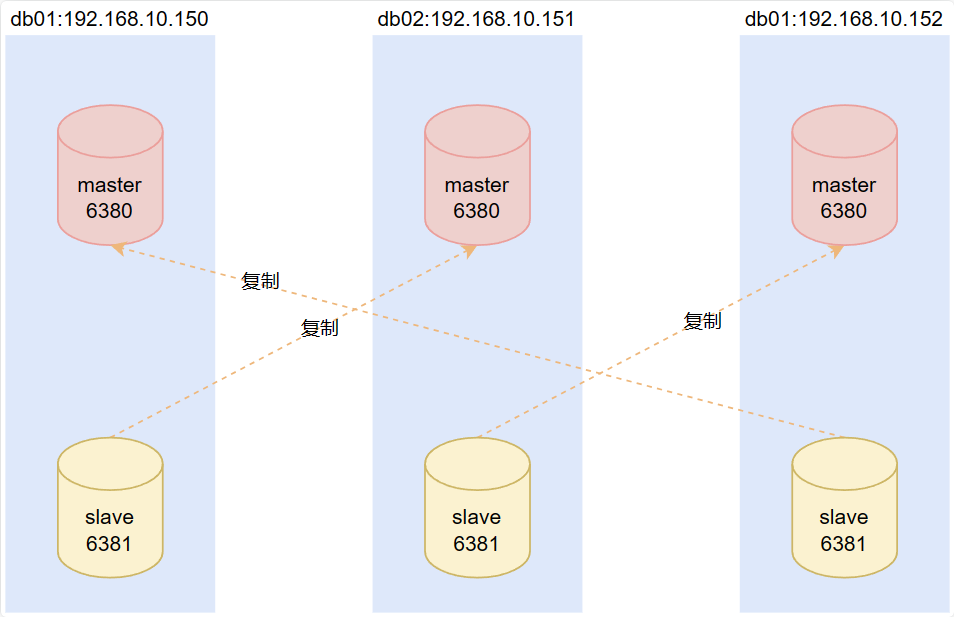

- **Based on the drawn diagram and the obtained node relationships, execute the commands to establish the master-slave relationships**

  ```bash
  # 集群中建立主从关系的命令是，某个从节点通过CLUSTER REPLICATE，指向主节点的ID，这样就建立了二者的主从关系
  redis-cli -h 192.168.10.150 -p 6381 CLUSTER REPLICATE a8b027568d5dfc6e14560ede0d6b5ce45f04ed6f
  redis-cli -h 192.168.10.151 -p 6381 CLUSTER REPLICATE e827ae7807b2f04c77702e325db3eb311403b3bb
  redis-cli -h 192.168.10.152 -p 6381 CLUSTER REPLICATE 24476f40244ca37b1c42eb3ba62e39a7ee9e95d6
  
  [root@cs ~]# redis-cli -h 192.168.10.150 -p 6381 CLUSTER REPLICATE a8b027568d5dfc6e14560ede0d6b5ce45f04ed6f
  OK
  [root@cs ~]# redis-cli -h 192.168.10.151 -p 6381 CLUSTER REPLICATE e827ae7807b2f04c77702e325db3eb311403b3bb
  OK
  [root@cs ~]# redis-cli -h 192.168.10.152 -p 6381 CLUSTER REPLICATE 24476f40244ca37b1c42eb3ba62e39a7ee9e95d6
  OK
  ```

  If you accidentally copy and paste the wrong thing and the establishment fails, don't panic — the `CLUSTER REPLICATE` command can be executed repeatedly. If the establishment failed, just correct the wrong command and run it again.
  Of course, in production, you still want it to succeed on the first try to avoid unnecessary waste of resources. Because establishing a master-slave replication relationship causes master-slave data synchronization, if the master node's data volume is very large in production, running this command back and forth consumes too many resources.

- **Confirm whether the establishment succeeded**

  ```bash
  redis-cli -h 192.168.10.150 -p 6380 CLUSTER NODES
  redis-cli -h 192.168.10.150 -p 6380 CLUSTER INFO
  
  [root@cs ~]# redis-cli -h 192.168.10.150 -p 6380 CLUSTER NODES
  24476f40244ca37b1c42eb3ba62e39a7ee9e95d6 192.168.10.150:6380@16380 myself,master - 0 1691547015000 1 connected 0-5460							
  967340547d63fd4f09e870b1494b6de720f9d6f4 192.168.10.152:6381@16381 slave 24476f40244ca37b1c42eb3ba62e39a7ee9e95d6 0 1691547017000 3 connected	# 152的6381指向150的6380，建立成功
  428e2b4090819ae5d181f435461c0970172d748c 192.168.10.150:6381@16381 slave a8b027568d5dfc6e14560ede0d6b5ce45f04ed6f 0 1691547018195 6 connected	# 150的6381指向151的6380，建立成功
  a8b027568d5dfc6e14560ede0d6b5ce45f04ed6f 192.168.10.151:6380@16380 master - 0 1691547017170 2 connected 5461-10921
  e827ae7807b2f04c77702e325db3eb311403b3bb 192.168.10.152:6380@16380 master - 0 1691547017000 0 connected 10922-16383
  4f15e5e2310d87089b92ab7b24960c950b30d195 192.168.10.151:6381@16381 slave e827ae7807b2f04c77702e325db3eb311403b3bb 0 1691547014091 7 connected	# 151的6381指向152的6380，建立成功
  
  
  
  # 集群状态也是没问题的
  [root@cs ~]# redis-cli -h 192.168.10.150 -p 6380 CLUSTER INFO
  cluster_state:ok
  cluster_slots_assigned:16384
  cluster_slots_ok:16384
  cluster_slots_pfail:0
  cluster_slots_fail:0
  cluster_known_nodes:6
  cluster_size:3
  cluster_current_epoch:7
  cluster_my_epoch:1
  cluster_stats_messages_ping_sent:1427
  cluster_stats_messages_pong_sent:1190
  cluster_stats_messages_meet_sent:5
  cluster_stats_messages_sent:2622
  cluster_stats_messages_ping_received:1190
  cluster_stats_messages_pong_received:1196
  cluster_stats_messages_received:2386
  ```

#### 5. Inserting Data into the Cluster

##### ASK Routing

First, all data insertion operations must go through the master node; the replica nodes only take care of data synchronization and queries.

Inserting data into the cluster is no longer the same as inserting data into a single node.

```bash
redis-cli -h 192.168.10.150 -p 6380 set k1 v1
redis-cli -h 192.168.10.151 -p 6380 set k1 v11
redis-cli -h 192.168.10.152 -p 6380 set k1 v111

[root@cs ~]# redis-cli -h 192.168.10.150 -p 6380 set k1 v1
(error) MOVED 12706 192.168.10.152:6380
[root@cs ~]# redis-cli -h 192.168.10.151 -p 6380 set k1 v11
(error) MOVED 12706 192.168.10.152:6380
[root@cs ~]# redis-cli -h 192.168.10.152 -p 6380 set k1 v111
OK
```

As you can see, inserting data from nodes 150 and 151 both reported errors, and the reminder said the `set` command should be moved to node 152 for execution. In fact, only node 152 inserted successfully.

Similarly, when querying, it also reminds you to move the command to node 152 for execution, and only node 152 executed successfully.

```bash
redis-cli -h 192.168.10.150 -p 6380 get k1
redis-cli -h 192.168.10.151 -p 6380 get k1
redis-cli -h 192.168.10.152 -p 6380 get k1

[root@cs ~]# redis-cli -h 192.168.10.150 -p 6380 get k1
(error) MOVED 12706 192.168.10.152:6380
[root@cs ~]# redis-cli -h 192.168.10.151 -p 6380 get k1
(error) MOVED 12706 192.168.10.152:6380
[root@cs ~]# redis-cli -h 192.168.10.152 -p 6380 get k1
"v111"
```

The reason is that cluster writes and queries also need to use the algorithm to figure out which slot the key falls in, and then execute the specific command on the node where the corresponding slot is located. In our demonstration above, we skipped this step, so it reported an error and gave us the reminder.

Solution: ASK routing. It's also easy to understand — look at the diagram.

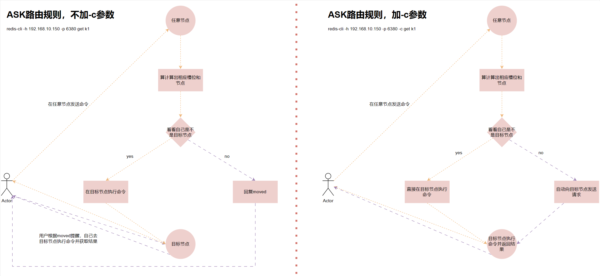

So it's simple: just add the `-c` parameter. (The `-c` parameter can be placed after the port, or before `-h`.)

```bash
redis-cli -h 192.168.10.150 -p 6380 -c get k1
redis-cli -h 192.168.10.151 -p 6380 -c get k1
redis-cli -h 192.168.10.152 -p 6380 -c get k1

[root@cs ~]# redis-cli -h 192.168.10.150 -p 6380 -c get k1
"v111"
[root@cs ~]# redis-cli -h 192.168.10.151 -p 6380 -c get k1
"v111"
[root@cs ~]# redis-cli -h 192.168.10.152 -p 6380 -c get k1
"v111"
```

##### Is the Inserted Data Distributed Evenly?

- **Insert data in bulk**

  First, I have deleted the keys on all cluster nodes so that the cluster data is empty.

  Note that `dbsize` can only return the number of keys on the specified master node, not the number of keys in the entire cluster. To see the number of keys on each master node in the whole cluster, you can use the `--cluster info` command, which will be used later.

  ```bash
  redis-cli -c -h 192.168.10.150 -p 6380 FLUSHALL
  redis-cli -c -h 192.168.10.151 -p 6380 FLUSHALL
  redis-cli -c -h 192.168.10.152 -p 6380 FLUSHALL
  redis-cli -c -h 192.168.10.150 -p 6380 DBSIZE
  redis-cli -c -h 192.168.10.151 -p 6380 DBSIZE
  redis-cli -c -h 192.168.10.152 -p 6380 DBSIZE
  
  
  [root@cs ~]# redis-cli -c -h 192.168.10.150 -p 6380 FLUSHALL
  OK
  [root@cs ~]# redis-cli -c -h 192.168.10.151 -p 6380 FLUSHALL
  OK
  [root@cs ~]# redis-cli -c -h 192.168.10.152 -p 6380 FLUSHALL
  OK
  [root@cs ~]# redis-cli -c -h 192.168.10.150 -p 6380 DBSIZE
  (integer) 0
  [root@cs ~]# redis-cli -c -h 192.168.10.151 -p 6380 DBSIZE
  (integer) 0
  [root@cs ~]# redis-cli -c -h 192.168.10.152 -p 6380 DBSIZE
  (integer) 0
  ```

  Insert one thousand (you could also do ten thousand or more) pieces of data into the empty cluster.

  ```bash
  for i in {1..1000};do redis-cli -c -h 192.168.10.150 -p 6380 set k_${i} v_${i}&& echo "${i} is ok";done
  ```

- **Check whether the number of keys on each master node is relatively even**

  ```bash
  redis-cli -c -h 192.168.10.150 -p 6380 DBSIZE
  redis-cli -c -h 192.168.10.151 -p 6380 DBSIZE
  redis-cli -c -h 192.168.10.152 -p 6380 DBSIZE
  
  [root@cs ~]# redis-cli -c -h 192.168.10.150 -p 6380 DBSIZE
  (integer) 339
  [root@cs ~]# redis-cli -c -h 192.168.10.151 -p 6380 DBSIZE
  (integer) 326
  [root@cs ~]# redis-cli -c -h 192.168.10.152 -p 6380 DBSIZE
  (integer) 335
  ```

  You can also use `rebalance` to see the message — it says no rebalancing is needed; the slot-count difference between master nodes is within `2.00%`, which is all allowed.

  ```bash
  redis-cli --cluster rebalance 192.168.10.150:6380
  
  [root@cs ~]# redis-cli --cluster rebalance 192.168.10.150:6380
  >>> Performing Cluster Check (using node 192.168.10.150:6380)
  [OK] All nodes agree about slots configuration.
  >>> Check for open slots...
  >>> Check slots coverage...
  [OK] All 16384 slots covered.
  *** No rebalancing needed! All nodes are within the 2.00% threshold.
  ```

  You can also check the cluster state with another command.

  ```bash
  redis-cli  --cluster info 192.168.10.150:6380
  
  [root@cs ~]# redis-cli  --cluster info 192.168.10.150:6380
  192.168.10.150:6380 (24476f40...) -> 339 keys | 5461 slots | 1 slaves.
  192.168.10.151:6380 (a8b02756...) -> 326 keys | 5461 slots | 1 slaves.
  192.168.10.152:6380 (e827ae78...) -> 335 keys | 5462 slots | 1 slaves.
  [OK] 1000 keys in 3 masters.
  0.06 keys per slot on average.
  ```

  It returns the number of slots and keys on each of the three master nodes, as well as the number of slaves on each master node.

### Automatically Deploying a Cluster via redis-cli

There are 2 ways to automatically deploy a cluster:

- `redis-trib.rb`: a tool used to deploy redis clusters in the redis3.x era. Before using `redis-trib.rb` to create a cluster, you need to configure a ruby environment. The newer `redis-cli` can create a cluster environment directly without configuring a ruby environment.
- `redis-cli`: `redis-cli` is the tool supported by `redis4.x` and later for creating clusters. In the `redis3.x` era, `redis-cli` was only a client connection management tool. `redis-cli` has one more feature than `redis-trib.rb`: it can authenticate the cluster password. The cluster created by the latter cannot manage password-protected cluster nodes well, so the official project later deprecated this tool.

With the automated tools, our cluster deployment process is reduced to:

1. The Redis instances on each server still need to be done manually.
2. Use the automated tool to deploy the Redis cluster.

#### 1. Restoring the Cluster State

```bash
# 注意，我们只需要对此时集群中的所有的主节点执行flushall的命令进行清空主节点的数据，而不需要对从节点进行清空数据。因为从节点是只读的节点，不允许flushall的动作。
redis-cli -c -h 192.168.10.150 -p 6380 FLUSHALL
redis-cli -c -h 192.168.10.151 -p 6380 FLUSHALL
redis-cli -c -h 192.168.10.152 -p 6380 FLUSHALL
redis-cli -c -h 192.168.10.150 -p 6380 DBSIZE
redis-cli -c -h 192.168.10.151 -p 6380 DBSIZE
redis-cli -c -h 192.168.10.152 -p 6380 DBSIZE
redis-cli -c -h 192.168.10.150 -p 6380 CLUSTER RESET
redis-cli -c -h 192.168.10.151 -p 6380 CLUSTER RESET
redis-cli -c -h 192.168.10.152 -p 6380 CLUSTER RESET
redis-cli -c -h 192.168.10.150 -p 6381 CLUSTER RESET
redis-cli -c -h 192.168.10.151 -p 6381 CLUSTER RESET
redis-cli -c -h 192.168.10.152 -p 6381 CLUSTER RESET

[root@cs src]# redis-cli -c -h 192.168.10.150 -p 6380 FLUSHALL
OK
[root@cs src]# redis-cli -c -h 192.168.10.151 -p 6380 FLUSHALL
OK
[root@cs src]# redis-cli -c -h 192.168.10.152 -p 6380 FLUSHALL
OK
[root@cs src]# redis-cli -c -h 192.168.10.150 -p 6380 DBSIZE
(integer) 0
[root@cs src]# redis-cli -c -h 192.168.10.151 -p 6380 DBSIZE
(integer) 0
[root@cs src]# redis-cli -c -h 192.168.10.152 -p 6380 DBSIZE
(integer) 0
[root@cs src]# redis-cli -c -h 192.168.10.150 -p 6380 CLUSTER RESET
OK
[root@cs src]# redis-cli -c -h 192.168.10.151 -p 6380 CLUSTER RESET
OK
[root@cs src]# redis-cli -c -h 192.168.10.152 -p 6380 CLUSTER RESET
OK
[root@cs src]# redis-cli -c -h 192.168.10.150 -p 6381 CLUSTER RESET
OK
[root@cs src]# redis-cli -c -h 192.168.10.151 -p 6381 CLUSTER RESET
OK
[root@cs src]# redis-cli -c -h 192.168.10.152 -p 6381 CLUSTER RESET
OK
```

#### 2. Quickly Deploying the Cluster

```bash
# 这个命令还有个交互，提示你输入yes
redis-cli --cluster create 192.168.10.150:6380 192.168.10.151:6380 192.168.10.152:6380 192.168.10.150:6381 192.168.10.151:6381 192.168.10.152:6381 --cluster-replicas 1

# 我们改造下命令，连交互输入的yes都不要了
echo "yes"|redis-cli --cluster create 192.168.10.150:6380 192.168.10.151:6380 192.168.10.152:6380 192.168.10.150:6381 192.168.10.151:6381 192.168.10.152:6381 --cluster-replicas 1


[root@cs src]# redis-cli --cluster create --cluster-replicas 1 192.168.10.150:6380 192.168.10.151:6380 192.168.10.152:6380 192.168.10.150:6381 192.168.10.151:6381 192.168.10.152:6381
>>> Performing hash slots allocation on 6 nodes...
# 这里提示三个主节点的槽位分布
Master[0] -> Slots 0 - 5460
Master[1] -> Slots 5461 - 10922
Master[2] -> Slots 10923 - 16383
# 这里告诉我们主从复制关系
Adding replica 192.168.10.151:6381 to 192.168.10.150:6380
Adding replica 192.168.10.152:6381 to 192.168.10.151:6380
Adding replica 192.168.10.150:6381 to 192.168.10.152:6380
M: 24476f40244ca37b1c42eb3ba62e39a7ee9e95d6 192.168.10.150:6380
   slots:[0-5460] (5461 slots) master
M: a8b027568d5dfc6e14560ede0d6b5ce45f04ed6f 192.168.10.151:6380
   slots:[5461-10922] (5462 slots) master
M: e827ae7807b2f04c77702e325db3eb311403b3bb 192.168.10.152:6380
   slots:[10923-16383] (5461 slots) master
S: 428e2b4090819ae5d181f435461c0970172d748c 192.168.10.150:6381
   replicates e827ae7807b2f04c77702e325db3eb311403b3bb
S: 4f15e5e2310d87089b92ab7b24960c950b30d195 192.168.10.151:6381
   replicates 24476f40244ca37b1c42eb3ba62e39a7ee9e95d6
S: 967340547d63fd4f09e870b1494b6de720f9d6f4 192.168.10.152:6381
   replicates a8b027568d5dfc6e14560ede0d6b5ce45f04ed6f
Can I set the above configuration? (type 'yes' to accept): yes			# 还是有个交互的，我们按照提示输入 yes
>>> Nodes configuration updated
>>> Assign a different config epoch to each node
>>> Sending CLUSTER MEET messages to join the cluster
Waiting for the cluster to join
...
>>> Performing Cluster Check (using node 192.168.10.150:6380)
M: 24476f40244ca37b1c42eb3ba62e39a7ee9e95d6 192.168.10.150:6380
   slots:[0-5460] (5461 slots) master
   1 additional replica(s)
S: 967340547d63fd4f09e870b1494b6de720f9d6f4 192.168.10.152:6381
   slots: (0 slots) slave
   replicates a8b027568d5dfc6e14560ede0d6b5ce45f04ed6f
S: 428e2b4090819ae5d181f435461c0970172d748c 192.168.10.150:6381
   slots: (0 slots) slave
   replicates e827ae7807b2f04c77702e325db3eb311403b3bb
M: a8b027568d5dfc6e14560ede0d6b5ce45f04ed6f 192.168.10.151:6380
   slots:[5461-10922] (5462 slots) master
   1 additional replica(s)
S: 4f15e5e2310d87089b92ab7b24960c950b30d195 192.168.10.151:6381
   slots: (0 slots) slave
   replicates 24476f40244ca37b1c42eb3ba62e39a7ee9e95d6
M: e827ae7807b2f04c77702e325db3eb311403b3bb 192.168.10.152:6380
   slots:[10923-16383] (5461 slots) master
   1 additional replica(s)
[OK] All nodes agree about slots configuration.
>>> Check for open slots...
>>> Check slots coverage...
[OK] All 16384 slots covered.
```

#### 3. Confirming the Cluster State

```bash
for i in {1..10000};do redis-cli -c -h 192.168.10.150 -p 6380 set k_${i} v_${i}&& echo "${i} is ok";done
redis-cli  --cluster info 192.168.10.150:6380
redis-cli -h 192.168.10.150 -p 6380 CLUSTER NODES


[root@cs src]# redis-cli  --cluster info 192.168.10.150:6380
192.168.10.150:6380 (24476f40...) -> 3343 keys | 5461 slots | 1 slaves.
192.168.10.151:6380 (a8b02756...) -> 3316 keys | 5462 slots | 1 slaves.
192.168.10.152:6380 (e827ae78...) -> 3341 keys | 5461 slots | 1 slaves.
[OK] 10000 keys in 3 masters.
0.61 keys per slot on average.
[root@cs src]# redis-cli -h 192.168.10.150 -p 6380 CLUSTER NODES
24476f40244ca37b1c42eb3ba62e39a7ee9e95d6 192.168.10.150:6380@16380 myself,master - 0 1691551074000 1 connected 0-5460
967340547d63fd4f09e870b1494b6de720f9d6f4 192.168.10.152:6381@16381 slave a8b027568d5dfc6e14560ede0d6b5ce45f04ed6f 0 1691551076646 8 connected
428e2b4090819ae5d181f435461c0970172d748c 192.168.10.150:6381@16381 slave e827ae7807b2f04c77702e325db3eb311403b3bb 0 1691551073583 6 connected
a8b027568d5dfc6e14560ede0d6b5ce45f04ed6f 192.168.10.151:6380@16380 master - 0 1691551075623 2 connected 5461-10922
4f15e5e2310d87089b92ab7b24960c950b30d195 192.168.10.151:6381@16381 slave 24476f40244ca37b1c42eb3ba62e39a7ee9e95d6 0 1691551076000 7 connected
e827ae7807b2f04c77702e325db3eb311403b3bb 192.168.10.152:6380@16380 master - 0 1691551074000 3 connected 10923-16383
```

## Cluster Shrinking and Expansion

Expansion: adding new nodes to the existing cluster.

Shrinking: taking the existing master nodes offline.

The principle is quite simple, but the operation is a bit troublesome, because the slot relationships must be handled manually. Regarding slots, you must always remember that no matter how many nodes the cluster has, the number of slots is fixed at 16384.

So if you want to expand, you need to recalculate: how many master nodes will there be after expansion? How many slots should each master node get on average? And how many slots should each existing master node allocate to the newly added master node? All of this needs to be calculated before you start.

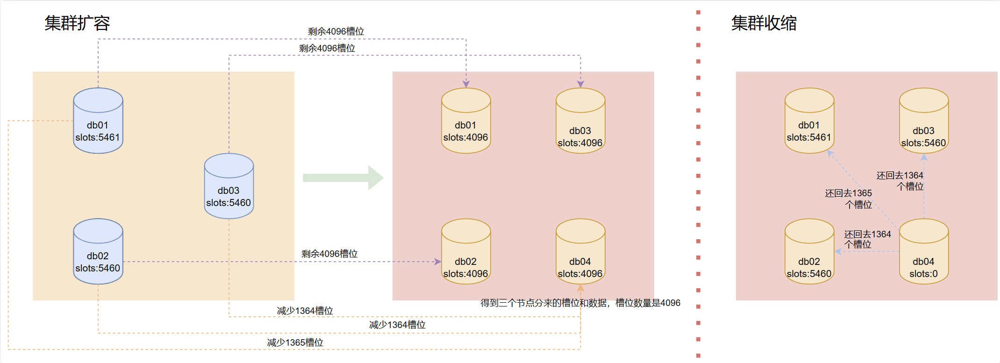

The problems that may be encountered during migration are also things we need to understand in advance and prepare contingency plans for:

Q: When migrating a slot, will the data in that slot be migrated too?

A: Yes, and it is possible that the migration data may be interrupted.

Q: Will cluster reads and writes be affected during the migration process?

A: No, reads and writes can proceed normally during the migration, but since it still consumes performance, it is recommended to perform migration during off-peak business hours.

### Cluster Expansion

#### 1. Prepare a New Server, Install Redis Instances on It, and Start Them

```bash
systemctl start redis-master
systemctl start redis-slave
ps -ef|grep redis

[root@cs ~]# systemctl start redis-master
[root@cs ~]# systemctl start redis-slave
[root@cs ~]# ps -ef|grep redis
redis     70739      1  0 16:24 ?        00:00:00 /usr/local/bin/redis-server 192.168.10.153:6380 [cluster]
redis     70749      1  0 16:24 ?        00:00:00 /usr/local/bin/redis-server 192.168.10.153:6381 [cluster]
root      70754  70714  0 16:24 pts/0    00:00:00 grep --color=auto redis
```

#### 2. Invite into the Cluster

```bash
# 通过150节点，将153节点的两个小伙伴拉进群
redis-cli -h 192.168.10.150 -p 6380 CLUSTER MEET 192.168.10.153 6380
redis-cli -h 192.168.10.150 -p 6380 CLUSTER MEET 192.168.10.153 6381
redis-cli -h 192.168.10.150 -p 6380 CLUSTER NODES

[root@cs ~]# redis-cli -h 192.168.10.150 -p 6380 CLUSTER MEET 192.168.10.153 6380
OK
[root@cs ~]# redis-cli -h 192.168.10.150 -p 6380 CLUSTER MEET 192.168.10.153 6381
OK
[root@cs ~]# redis-cli -h 192.168.10.150 -p 6380 CLUSTER NODES
24476f40244ca37b1c42eb3ba62e39a7ee9e95d6 192.168.10.150:6380@16380 myself,master - 0 1691569492000 1 connected 0-5460
967340547d63fd4f09e870b1494b6de720f9d6f4 192.168.10.152:6381@16381 slave a8b027568d5dfc6e14560ede0d6b5ce45f04ed6f 0 1691569492119 8 connected
428e2b4090819ae5d181f435461c0970172d748c 192.168.10.150:6381@16381 slave e827ae7807b2f04c77702e325db3eb311403b3bb 0 1691569493140 6 connected
1ad2341ae07cc084c75c1130ff2b9936d3bea7b7 192.168.10.153:6381@16381 master - 0 1691569492329 0 connected				# 此时处于进群了，但还没有分配槽位，也没配置主从关系，所以都是master
a8b027568d5dfc6e14560ede0d6b5ce45f04ed6f 192.168.10.151:6380@16380 master - 0 1691569491102 2 connected 5461-10922
4f15e5e2310d87089b92ab7b24960c950b30d195 192.168.10.151:6381@16381 slave 24476f40244ca37b1c42eb3ba62e39a7ee9e95d6 0 1691569492000 7 connected
e827ae7807b2f04c77702e325db3eb311403b3bb 192.168.10.152:6380@16380 master - 0 1691569489059 3 connected 10923-16383
8fa4d787dcccf9ece2880e7e20848dc6ce67e7ae 192.168.10.153:6380@16380 master - 0 1691569492329 0 connected				# 此时处于进群了，但还没有分配槽位，也没配置主从关系，所以都是master
```

#### 3. Assigning Slots

When assigning slots here, there are two ways: one is troublesome, and one is simple.

##### The Complicated `done` Usage

```bash
# 通过任意节点，向集群发送reshard命令，开始进行分配槽位的动作，我们将会进行4次交互
redis-cli --cluster reshard 192.168.10.150:6380 


# 第一次交互：因为接下来的步骤是每个主节点都要向新节点分配部分槽位，那么这里第一次交互就问我们新节点分配槽位的总数是多少？填写4096
How many slots do you want to move (from 1 to 16384)? 4096


# 第二次交互：问我们接受主节点的ID？我们需要填写新节点153的6380的ID，因为其它节点的槽位分配给它嘛
What is the receiving node ID? 8fa4d787dcccf9ece2880e7e20848dc6ce67e7ae


# 第三次交互：这一步有点麻烦，人家给你两个选择：
#   1. 填写all，然后回车，集群内部会计算出来每个主节点应该分配出来多少槽位给新节点，这一切都是自动的
#   2. 直接写每个主节点的ID，你要写所有的主节点的ID，然后输入done，表示填写的这些主节点分配出来槽位给新节点
#       Source node #1: db01的6380节点的ID
#       Source node #2: db02的6380节点的ID
#       Source node #3: db03的6380节点的ID
#       Source node #4: done
How many slots do you want to move (from 1 to 16384)? 4096
What is the receiving node ID? 8fa4d787dcccf9ece2880e7e20848dc6ce67e7ae
Please enter all the source node IDs.
  Type 'all' to use all the nodes as source nodes for the hash slots.
  Type 'done' once you entered all the source nodes IDs.
Source node #1: 24476f40244ca37b1c42eb3ba62e39a7ee9e95d6
Source node #2: a8b027568d5dfc6e14560ede0d6b5ce45f04ed6f
Source node #3: e827ae7807b2f04c77702e325db3eb311403b3bb
Source node #4: done


# 第四次交互：最终确认，输入yes就真正的开始了，如果你想反悔，这里输入no，或者ctrl+c反悔退出交互
Do you want to proceed with the proposed reshard plan (yes/no)? 我这里直接ctrl+c退出交互，因为我要演示第二种all的用法
```

##### The Simple `all` Usage

```bash
# 为了验证分配槽位的过程中，不影响集群的读写，你可以分别在另外两个终端，进行读写测试
# 151的终端测试写
for i in {1..10000};do redis-cli -c -h 192.168.10.151 -p 6380 set k_${i} v_${i} && echo ${i} is ok;sleep 0.2;done

# 152的终端测试读
for i in {1..10000};do redis-cli -c -h 192.168.10.152 -p 6380 get k_${i};sleep 0.2;done

# 上面两个读写让它运行着，我们在150终端进行分配槽位
redis-cli --cluster reshard 192.168.10.150:6380 

[root@cs ~]# redis-cli --cluster reshard 192.168.10.150:6380 
>>> Performing Cluster Check (using node 192.168.10.150:6380)
M: 24476f40244ca37b1c42eb3ba62e39a7ee9e95d6 192.168.10.150:6380
   slots:[0-5460] (5461 slots) master
   1 additional replica(s)
S: 967340547d63fd4f09e870b1494b6de720f9d6f4 192.168.10.152:6381
   slots: (0 slots) slave
   replicates a8b027568d5dfc6e14560ede0d6b5ce45f04ed6f
S: 428e2b4090819ae5d181f435461c0970172d748c 192.168.10.150:6381
   slots: (0 slots) slave
   replicates e827ae7807b2f04c77702e325db3eb311403b3bb
M: 1ad2341ae07cc084c75c1130ff2b9936d3bea7b7 192.168.10.153:6381
   slots: (0 slots) master
M: a8b027568d5dfc6e14560ede0d6b5ce45f04ed6f 192.168.10.151:6380
   slots:[5461-10922] (5462 slots) master
   1 additional replica(s)
S: 4f15e5e2310d87089b92ab7b24960c950b30d195 192.168.10.151:6381
   slots: (0 slots) slave
   replicates 24476f40244ca37b1c42eb3ba62e39a7ee9e95d6
M: e827ae7807b2f04c77702e325db3eb311403b3bb 192.168.10.152:6380
   slots:[10923-16383] (5461 slots) master
   1 additional replica(s)
M: 8fa4d787dcccf9ece2880e7e20848dc6ce67e7ae 192.168.10.153:6380
   slots: (0 slots) master
[OK] All nodes agree about slots configuration.
>>> Check for open slots...
>>> Check slots coverage...
[OK] All 16384 slots covered.
How many slots do you want to move (from 1 to 16384)? 4096				# 第一次交互，输入4096
What is the receiving node ID? 8fa4d787dcccf9ece2880e7e20848dc6ce67e7ae	# 第二次交互，输入153这个新节点的ID，在上面能找到，注意别复制粘贴错了
Please enter all the source node IDs.
  Type 'all' to use all the nodes as source nodes for the hash slots.
  Type 'done' once you entered all the source nodes IDs.
Source node #1: all														# 第三次交互，直接输入all，然后回车
	......省略......
    Moving slot 12283 from e827ae7807b2f04c77702e325db3eb311403b3bb
    Moving slot 12284 from e827ae7807b2f04c77702e325db3eb311403b3bb
    Moving slot 12285 from e827ae7807b2f04c77702e325db3eb311403b3bb
    Moving slot 12286 from e827ae7807b2f04c77702e325db3eb311403b3bb
    Moving slot 12287 from e827ae7807b2f04c77702e325db3eb311403b3bb
    ......省略......
Do you want to proceed with the proposed reshard plan (yes/no)? yes		# 第四次交互，直接输入yes，然后回车
......省略......
Moving slot 12286 from 192.168.10.152:6380 to 192.168.10.153:6380: 
Moving slot 12287 from 192.168.10.152:6380 to 192.168.10.153:6380: .
......省略......
[root@cs ~]# 															# 没有啥报错，基本说明槽位分配成功了
```

#### 4. Confirming the Assignment Succeeded

```bash
redis-cli -h 192.168.10.150 -p 6380 CLUSTER INFO
redis-cli -h 192.168.10.150 -p 6380 CLUSTER NODES
redis-cli  --cluster info 192.168.10.150:6380

[root@cs ~]# redis-cli -h 192.168.10.150 -p 6380 CLUSTER INFO
cluster_state:ok
cluster_slots_assigned:16384
cluster_slots_ok:16384
cluster_slots_pfail:0
cluster_slots_fail:0
cluster_known_nodes:8
cluster_size:4
cluster_current_epoch:10
cluster_my_epoch:1
cluster_stats_messages_ping_sent:23726
cluster_stats_messages_pong_sent:23230
cluster_stats_messages_meet_sent:7
cluster_stats_messages_update_sent:7
cluster_stats_messages_sent:46970
cluster_stats_messages_ping_received:23225
cluster_stats_messages_pong_received:23497
cluster_stats_messages_meet_received:5
cluster_stats_messages_received:46727
[root@cs ~]# redis-cli -h 192.168.10.150 -p 6380 CLUSTER NODES
24476f40244ca37b1c42eb3ba62e39a7ee9e95d6 192.168.10.150:6380@16380 myself,master - 0 1691571239000 1 connected 1365-5460
967340547d63fd4f09e870b1494b6de720f9d6f4 192.168.10.152:6381@16381 slave a8b027568d5dfc6e14560ede0d6b5ce45f04ed6f 0 1691571237000 8 connected
428e2b4090819ae5d181f435461c0970172d748c 192.168.10.150:6381@16381 slave e827ae7807b2f04c77702e325db3eb311403b3bb 0 1691571238000 6 connected
1ad2341ae07cc084c75c1130ff2b9936d3bea7b7 192.168.10.153:6381@16381 master - 0 1691571238000 9 connected
a8b027568d5dfc6e14560ede0d6b5ce45f04ed6f 192.168.10.151:6380@16380 master - 0 1691571238422 2 connected 6827-10922
4f15e5e2310d87089b92ab7b24960c950b30d195 192.168.10.151:6381@16381 slave 24476f40244ca37b1c42eb3ba62e39a7ee9e95d6 0 1691571240474 7 connected
e827ae7807b2f04c77702e325db3eb311403b3bb 192.168.10.152:6380@16380 master - 0 1691571239448 3 connected 12288-16383
8fa4d787dcccf9ece2880e7e20848dc6ce67e7ae 192.168.10.153:6380@16380 master - 0 1691571236000 10 connected 0-1364 5461-6826 10923-12287
[root@cs ~]# redis-cli  --cluster info 192.168.10.150:6380
192.168.10.150:6380 (24476f40...) -> 2498 keys | 4096 slots | 1 slaves.
192.168.10.153:6381 (1ad2341a...) -> 0 keys | 0 slots | 0 slaves.		 # 153的从节点，现在还没有进行主从复制关联，所以，还是这个状态
192.168.10.151:6380 (a8b02756...) -> 2486 keys | 4096 slots | 1 slaves.
192.168.10.152:6380 (e827ae78...) -> 2501 keys | 4096 slots | 1 slaves.
192.168.10.153:6380 (8fa4d787...) -> 2515 keys | 4096 slots | 0 slaves.  # 153主节点有了4096个槽位，现在有2515个key
[OK] 10000 keys in 5 masters.
0.61 keys per slot on average.
```

#### 5. Set Up Master-Slave Replication for the Replica Nodes on Server 153

**Note that now that we have one more server, we need to re-adjust the master-slave replication relationships.**

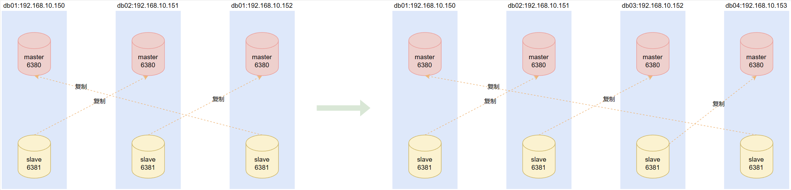

Of course, this is just a schematic diagram. The actual master-slave relationships at this point are certainly not like the very beginning, because in the earlier automatic-deployment section, the master-slave relationships established internally by the cluster when deploying automatically are bound to differ from ours. Here, I will directly adjust the master-slave relationships of all replica nodes to match the effect of the right side of the diagram above.

In production, though, you only need to adjust the involved nodes. In my test environment here, there aren't many keys, so rebuilding them all is fine.

```bash
# 过程省略，不会的复习前面手动建立主从复制关系章节
redis-cli -h 192.168.10.150 -p 6381 CLUSTER REPLICATE a8b027568d5dfc6e14560ede0d6b5ce45f04ed6f
redis-cli -h 192.168.10.151 -p 6381 CLUSTER REPLICATE e827ae7807b2f04c77702e325db3eb311403b3bb
redis-cli -h 192.168.10.152 -p 6381 CLUSTER REPLICATE 8fa4d787dcccf9ece2880e7e20848dc6ce67e7ae
redis-cli -h 192.168.10.153 -p 6381 CLUSTER REPLICATE 24476f40244ca37b1c42eb3ba62e39a7ee9e95d6
redis-cli -h 192.168.10.150 -p 6380 CLUSTER NODES
redis-cli  --cluster info 192.168.10.150:6380

[root@cs ~]# redis-cli -h 192.168.10.150 -p 6381 CLUSTER REPLICATE a8b027568d5dfc6e14560ede0d6b5ce45f04ed6f
OK
[root@cs ~]# redis-cli -h 192.168.10.151 -p 6381 CLUSTER REPLICATE e827ae7807b2f04c77702e325db3eb311403b3bb
OK
[root@cs ~]# redis-cli -h 192.168.10.152 -p 6381 CLUSTER REPLICATE 8fa4d787dcccf9ece2880e7e20848dc6ce67e7ae
OK
[root@cs ~]# redis-cli -h 192.168.10.153 -p 6381 CLUSTER REPLICATE 24476f40244ca37b1c42eb3ba62e39a7ee9e95d6
OK
[root@cs ~]# redis-cli -h 192.168.10.150 -p 6380 CLUSTER NODES
24476f40244ca37b1c42eb3ba62e39a7ee9e95d6 192.168.10.150:6380@16380 myself,master - 0 1691572832000 1 connected 1365-5460
967340547d63fd4f09e870b1494b6de720f9d6f4 192.168.10.152:6381@16381 slave 8fa4d787dcccf9ece2880e7e20848dc6ce67e7ae 0 1691572834409 10 connected  # 152的从复制153的主
428e2b4090819ae5d181f435461c0970172d748c 192.168.10.150:6381@16381 slave a8b027568d5dfc6e14560ede0d6b5ce45f04ed6f 0 1691572833000 6 connected   # 150的从复制151的主
1ad2341ae07cc084c75c1130ff2b9936d3bea7b7 192.168.10.153:6381@16381 slave 24476f40244ca37b1c42eb3ba62e39a7ee9e95d6 0 1691572830324 9 connected   # 153的从复制150的主
a8b027568d5dfc6e14560ede0d6b5ce45f04ed6f 192.168.10.151:6380@16380 master - 0 1691572835000 2 connected 6827-10922
4f15e5e2310d87089b92ab7b24960c950b30d195 192.168.10.151:6381@16381 slave e827ae7807b2f04c77702e325db3eb311403b3bb 0 1691572831000 7 connected   # 151的从复制152的主，都符合预期
e827ae7807b2f04c77702e325db3eb311403b3bb 192.168.10.152:6380@16380 master - 0 1691572833387 3 connected 12288-16383
8fa4d787dcccf9ece2880e7e20848dc6ce67e7ae 192.168.10.153:6380@16380 master - 0 1691572835436 10 connected 0-1364 5461-6826 10923-12287
[root@cs ~]# redis-cli  --cluster info 192.168.10.150:6380
192.168.10.150:6380 (24476f40...) -> 2498 keys | 4096 slots | 1 slaves.
192.168.10.151:6380 (a8b02756...) -> 2486 keys | 4096 slots | 1 slaves.
192.168.10.152:6380 (e827ae78...) -> 2501 keys | 4096 slots | 1 slaves.
192.168.10.153:6380 (8fa4d787...) -> 2515 keys | 4096 slots | 1 slaves.  # 这几个也都正常，nice
[OK] 10000 keys in 4 masters.
0.61 keys per slot on average.
```

### Cluster Shrinking

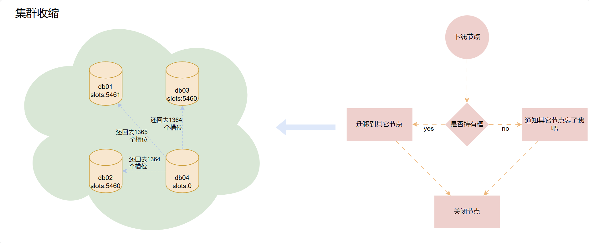

**The cluster shrinking process**

1. Calculate the slots to be migrated out, and assign them to the other master nodes in the cluster. How many does each get?
2. Execute the migration. Each time you can only migrate slots from the node to be taken offline to one of the master nodes, so no matter how many master nodes there are, you have to run the migration operation that many times.
3. After a successful migration, take the server hosting the master node offline. If there are still replica nodes on that server, take them offline too.
4. Adjust the master-slave relationships of the cluster at this point.

#### 1. Executing the Cluster Shrinking Commands

Each of the following operations must be repeated for three rounds, because each time you can only migrate slots from the offline node to one target node at a time, not to multiple target nodes at once.

```bash
# 通过任意节点，向集群发送reshard命令，开始进行分配槽位的动作，我们将会进行4次交互
redis-cli --cluster reshard 192.168.10.150:6380 

# 下面的交互要执行三轮，而每轮又有四个交互
# 1366 + 1365 + 1365 = 4096

# 第一次交互：从要下线的节点迁移出多少个槽位？我第一次按照习惯往150节点迁移，应该迁移的槽位数量是1366，所以填写1366
How many slots do you want to move (from 1 to 16384)? 1366


# 第二次交互：槽位要迁移到哪个目标节点，我们这里应该填写150节点的ID
What is the receiving node ID? 


# 第三次交互：哪些节点需要迁移出1366个槽位？而我们只有153节点需要下线，所以这一轮只能填写一个153节点的ID即可
#       Source node #1: db03的6380节点的ID
#       Source node #2: done

# 第四次交互：最终确认，输入yes就真正的开始了，如果你想反悔，这里输入no，我这里输入yes
Do you want to proceed with the proposed reshard plan (yes/no)? yes

# 如果不报错:
#   第一轮向150的6380节点迁移1366个槽位结束
#   第二轮应该向151的6380节点迁移1365个槽位
#   第三轮应该向152的6380节点迁移1365个槽位
```

Process:

```bash
# 第一轮
[root@cs ~]# redis-cli --cluster reshard 192.168.10.150:6380                # 每次都可以通过任意主节点访问到集群执行reshard命令
>>> Performing Cluster Check (using node 192.168.10.150:6380)
M: 24476f40244ca37b1c42eb3ba62e39a7ee9e95d6 192.168.10.150:6380
   slots:[1365-5460] (4096 slots) master
   1 additional replica(s)
S: 967340547d63fd4f09e870b1494b6de720f9d6f4 192.168.10.152:6381
   slots: (0 slots) slave
   replicates 8fa4d787dcccf9ece2880e7e20848dc6ce67e7ae
S: 428e2b4090819ae5d181f435461c0970172d748c 192.168.10.150:6381
   slots: (0 slots) slave
   replicates a8b027568d5dfc6e14560ede0d6b5ce45f04ed6f
S: 1ad2341ae07cc084c75c1130ff2b9936d3bea7b7 192.168.10.153:6381
   slots: (0 slots) slave
   replicates 24476f40244ca37b1c42eb3ba62e39a7ee9e95d6
M: a8b027568d5dfc6e14560ede0d6b5ce45f04ed6f 192.168.10.151:6380
   slots:[6827-10922] (4096 slots) master
   1 additional replica(s)
S: 4f15e5e2310d87089b92ab7b24960c950b30d195 192.168.10.151:6381
   slots: (0 slots) slave
   replicates e827ae7807b2f04c77702e325db3eb311403b3bb
M: e827ae7807b2f04c77702e325db3eb311403b3bb 192.168.10.152:6380
   slots:[12288-16383] (4096 slots) master
   1 additional replica(s)
M: 8fa4d787dcccf9ece2880e7e20848dc6ce67e7ae 192.168.10.153:6380
   slots:[0-1364],[5461-6826],[10923-12287] (4096 slots) master
   1 additional replica(s)
[OK] All nodes agree about slots configuration.
>>> Check for open slots...
>>> Check slots coverage...
[OK] All 16384 slots covered.
How many slots do you want to move (from 1 to 16384)? 1366				    # 向目标节点迁移多少个槽位
What is the receiving node ID? 24476f40244ca37b1c42eb3ba62e39a7ee9e95d6	    # 填写目标节点的ID，我先向150的主节点迁移，所以填写的是150的ID
Please enter all the source node IDs.
  Type 'all' to use all the nodes as source nodes for the hash slots.
  Type 'done' once you entered all the source nodes IDs.
Source node #1: 8fa4d787dcccf9ece2880e7e20848dc6ce67e7ae				    # 哪个节点向150节点迁移数据，就填写谁，所以这里填写153主节点的ID
Source node #2: done													    # 填写done
	......省略......
    Moving slot 1363 from 8fa4d787dcccf9ece2880e7e20848dc6ce67e7ae
    Moving slot 1364 from 8fa4d787dcccf9ece2880e7e20848dc6ce67e7ae
    Moving slot 5461 from 8fa4d787dcccf9ece2880e7e20848dc6ce67e7ae
    ......省略......
Do you want to proceed with the proposed reshard plan (yes/no)? yes		    # 第四次交互，直接输入yes，然后回车
......省略......
Moving slot 1364 from 192.168.10.153:6380 to 192.168.10.150:6380: .
Moving slot 5461 from 192.168.10.153:6380 to 192.168.10.150:6380: 
......省略......
[root@cs ~]# 															    # 没有啥报错，基本说明槽位分配成功了


# 第二轮
[root@cs ~]# redis-cli --cluster reshard 192.168.10.150:6380                # 每次都可以通过任意主节点访问到集群执行reshard命令
......省略......
How many slots do you want to move (from 1 to 16384)? 1365				    # 向目标节点迁移多少个槽位
What is the receiving node ID? a8b027568d5dfc6e14560ede0d6b5ce45f04ed6f     # 该向151节点迁移槽位了，所以这里填写151主节点的ID
Please enter all the source node IDs.
  Type 'all' to use all the nodes as source nodes for the hash slots.
  Type 'done' once you entered all the source nodes IDs.
Source node #1: 8fa4d787dcccf9ece2880e7e20848dc6ce67e7ae				    # 哪个节点向150节点迁移数据，就填写谁，所以这里填写153主节点的ID
Source node #2: done
	......省略......
    Moving slot 1363 from 8fa4d787dcccf9ece2880e7e20848dc6ce67e7ae
    Moving slot 1364 from 8fa4d787dcccf9ece2880e7e20848dc6ce67e7ae
    Moving slot 5461 from 8fa4d787dcccf9ece2880e7e20848dc6ce67e7ae
    ......省略......
Do you want to proceed with the proposed reshard plan (yes/no)? yes		    # 第四次交互，直接输入yes，然后回车
......省略......
Moving slot 1364 from 192.168.10.153:6380 to 192.168.10.150:6380: .
Moving slot 5461 from 192.168.10.153:6380 to 192.168.10.150:6380: 
......省略......
[root@cs ~]# 															    # 没有啥报错，基本说明槽位分配成功了

# 第三轮
[root@cs ~]# redis-cli --cluster reshard 192.168.10.150:6380                # 每次都可以通过任意主节点访问到集群执行reshard命令
......省略......
How many slots do you want to move (from 1 to 16384)? 1365				    # 向目标节点迁移多少个槽位
What is the receiving node ID? e827ae7807b2f04c77702e325db3eb311403b3bb     # 该向152节点迁移槽位了，所以这里填写151主节点的ID
Please enter all the source node IDs.
  Type 'all' to use all the nodes as source nodes for the hash slots.
  Type 'done' once you entered all the source nodes IDs.
Source node #1: 8fa4d787dcccf9ece2880e7e20848dc6ce67e7ae				    # 哪个节点向150节点迁移数据，就填写谁，所以这里填写153主节点的ID
Source node #2: done
	......省略......
    Moving slot 1363 from 8fa4d787dcccf9ece2880e7e20848dc6ce67e7ae
    Moving slot 1364 from 8fa4d787dcccf9ece2880e7e20848dc6ce67e7ae
    Moving slot 5461 from 8fa4d787dcccf9ece2880e7e20848dc6ce67e7ae
    ......省略......
Do you want to proceed with the proposed reshard plan (yes/no)? yes		    # 第四次交互，直接输入yes，然后回车
......省略......
Moving slot 1364 from 192.168.10.153:6380 to 192.168.10.150:6380: .
Moving slot 5461 from 192.168.10.153:6380 to 192.168.10.150:6380: 
......省略......
[root@cs ~]# 															    # 没有啥报错，基本说明槽位分配成功了
```

#### 2. Confirming the Migration Succeeded

```bash
redis-cli -h 192.168.10.150 -p 6380 CLUSTER INFO
redis-cli -h 192.168.10.150 -p 6380 CLUSTER NODES
redis-cli  --cluster info 192.168.10.150:6380

[root@cs ~]# redis-cli -h 192.168.10.150 -p 6380 CLUSTER INFO
cluster_state:ok
cluster_slots_assigned:16384
cluster_slots_ok:16384
cluster_slots_pfail:0
cluster_slots_fail:0
cluster_known_nodes:8
cluster_size:3
cluster_current_epoch:13
cluster_my_epoch:11
cluster_stats_messages_ping_sent:28556
cluster_stats_messages_pong_sent:27895
cluster_stats_messages_meet_sent:7
cluster_stats_messages_update_sent:14
cluster_stats_messages_sent:56472
cluster_stats_messages_ping_received:27890
cluster_stats_messages_pong_received:28327
cluster_stats_messages_meet_received:5
cluster_stats_messages_received:56222
[root@cs ~]# redis-cli -h 192.168.10.150 -p 6380 CLUSTER NODES
24476f40244ca37b1c42eb3ba62e39a7ee9e95d6 192.168.10.150:6380@16380 myself,master - 0 1691576093000 11 connected 0-5461
967340547d63fd4f09e870b1494b6de720f9d6f4 192.168.10.152:6381@16381 slave e827ae7807b2f04c77702e325db3eb311403b3bb 0 1691576096472 13 connected
428e2b4090819ae5d181f435461c0970172d748c 192.168.10.150:6381@16381 slave a8b027568d5dfc6e14560ede0d6b5ce45f04ed6f 0 1691576097490 12 connected
1ad2341ae07cc084c75c1130ff2b9936d3bea7b7 192.168.10.153:6381@16381 slave 24476f40244ca37b1c42eb3ba62e39a7ee9e95d6 0 1691576093000 11 connected
a8b027568d5dfc6e14560ede0d6b5ce45f04ed6f 192.168.10.151:6380@16380 master - 0 1691576095000 12 connected 5462-10922
4f15e5e2310d87089b92ab7b24960c950b30d195 192.168.10.151:6381@16381 slave e827ae7807b2f04c77702e325db3eb311403b3bb 0 1691576093000 13 connected
e827ae7807b2f04c77702e325db3eb311403b3bb 192.168.10.152:6380@16380 master - 0 1691576097000 13 connected 10923-16383
8fa4d787dcccf9ece2880e7e20848dc6ce67e7ae 192.168.10.153:6380@16380 master - 0 1691576095000 10 connected
[root@cs ~]# redis-cli  --cluster info 192.168.10.150:6380
192.168.10.150:6380 (24476f40...) -> 3343 keys | 5462 slots | 1 slaves.
192.168.10.151:6380 (a8b02756...) -> 3316 keys | 5461 slots | 1 slaves.
192.168.10.152:6380 (e827ae78...) -> 3341 keys | 5461 slots | 2 slaves.
192.168.10.153:6380 (8fa4d787...) -> 0 keys | 0 slots | 0 slaves.		# 可以看到153的主节点啥都没了，干干净净
[OK] 10000 keys in 4 masters.
0.61 keys per slot on average.
```

#### 3. Taking Nodes Offline

```bash
# 主节点的槽位移走了，从节点就可以直接下线了
# 下线命令是--cluster del-node后面 是要下线节点的IP和端口，再跟上要下线节点的ID
redis-cli --cluster del-node 192.168.10.153:6380 8fa4d787dcccf9ece2880e7e20848dc6ce67e7ae
redis-cli --cluster del-node 192.168.10.153:6381 1ad2341ae07cc084c75c1130ff2b9936d3bea7b7
redis-cli -h 192.168.10.150 -p 6380 CLUSTER NODES
redis-cli  --cluster info 192.168.10.150:6380

[root@cs ~]# redis-cli --cluster del-node 192.168.10.153:6380 8fa4d787dcccf9ece2880e7e20848dc6ce67e7ae
>>> Removing node 8fa4d787dcccf9ece2880e7e20848dc6ce67e7ae from cluster 192.168.10.153:6380
>>> Sending CLUSTER FORGET messages to the cluster...													# 直接移出节点，并将该节点直接停机
>>> SHUTDOWN the node.
[root@cs ~]# redis-cli --cluster del-node 192.168.10.153:6381 1ad2341ae07cc084c75c1130ff2b9936d3bea7b7
>>> Removing node 1ad2341ae07cc084c75c1130ff2b9936d3bea7b7 from cluster 192.168.10.153:6381
>>> Sending CLUSTER FORGET messages to the cluster...
>>> SHUTDOWN the node.
[root@cs ~]# redis-cli -h 192.168.10.150 -p 6380 CLUSTER NODES
24476f40244ca37b1c42eb3ba62e39a7ee9e95d6 192.168.10.150:6380@16380 myself,master - 0 1691576658000 11 connected 0-5461
967340547d63fd4f09e870b1494b6de720f9d6f4 192.168.10.152:6381@16381 slave e827ae7807b2f04c77702e325db3eb311403b3bb 0 1691576657814 13 connected
428e2b4090819ae5d181f435461c0970172d748c 192.168.10.150:6381@16381 slave a8b027568d5dfc6e14560ede0d6b5ce45f04ed6f 0 1691576658838 12 connected
a8b027568d5dfc6e14560ede0d6b5ce45f04ed6f 192.168.10.151:6380@16380 master - 0 1691576659865 12 connected 5462-10922
4f15e5e2310d87089b92ab7b24960c950b30d195 192.168.10.151:6381@16381 slave e827ae7807b2f04c77702e325db3eb311403b3bb 0 1691576655000 13 connected
e827ae7807b2f04c77702e325db3eb311403b3bb 192.168.10.152:6380@16380 master - 0 1691576656787 13 connected 10923-16383
[root@cs ~]# redis-cli  --cluster info 192.168.10.150:6380
192.168.10.150:6380 (24476f40...) -> 3343 keys | 5462 slots | 0 slaves.  # 150的主节点，没有从节点，因为之前的153从节点下线了
192.168.10.151:6380 (a8b02756...) -> 3316 keys | 5461 slots | 1 slaves.
192.168.10.152:6380 (e827ae78...) -> 3341 keys | 5461 slots | 2 slaves.  # 152的主节点有俩从节点，这都是需要我们在处理完下线之后，从新调整的。
[OK] 10000 keys in 3 masters.
0.61 keys per slot on average.
```

Now, the two redis instances on the db04 node have truly left the cluster successfully. Even if you start them again, the cluster will not recognize them. Of course, to add them back, you need to run the cluster expansion commands again.

However, there is still a problem: two nodes in the cluster have successfully gone offline, but at this moment the master-slave state of the remaining cluster is still problematic. The current master-slave relationships of the cluster are as follows:

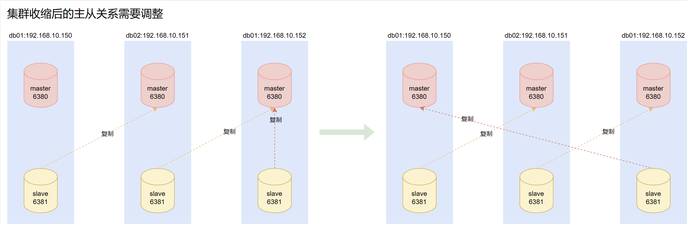

**Adjusting the master-slave state**

```bash
redis-cli -h 192.168.10.152 -p 6381 CLUSTER REPLICATE 24476f40244ca37b1c42eb3ba62e39a7ee9e95d6
redis-cli -h 192.168.10.150 -p 6380 CLUSTER NODES
redis-cli  --cluster info 192.168.10.150:6380
```

## Simulating a Cluster Failure

Let's also look at whether the cluster can continue to handle business if it encounters a downtime.

For the convenience of the demonstration, let's restore the cluster, including the master-slave replication relationships.

```bash
redis-cli -c -h 192.168.10.150 -p 6380 FLUSHALL
redis-cli -c -h 192.168.10.151 -p 6380 FLUSHALL
redis-cli -c -h 192.168.10.152 -p 6380 FLUSHALL
redis-cli -c -h 192.168.10.150 -p 6380 DBSIZE
redis-cli -c -h 192.168.10.151 -p 6380 DBSIZE
redis-cli -c -h 192.168.10.152 -p 6380 DBSIZE

redis-cli -c -h 192.168.10.150 -p 6380 CLUSTER RESET
redis-cli -c -h 192.168.10.151 -p 6380 CLUSTER RESET
redis-cli -c -h 192.168.10.152 -p 6380 CLUSTER RESET
redis-cli -c -h 192.168.10.150 -p 6381 CLUSTER RESET
redis-cli -c -h 192.168.10.151 -p 6381 CLUSTER RESET
redis-cli -c -h 192.168.10.152 -p 6381 CLUSTER RESET

echo "yes"|redis-cli --cluster create 192.168.10.150:6380 192.168.10.151:6380 192.168.10.152:6380 192.168.10.150:6381 192.168.10.151:6381 192.168.10.152:6381 --cluster-replicas 1

# 从新按照最开始的样式调整主从关系  150从->151主；151从->152主；152从->150主
redis-cli -h 192.168.10.150 -p 6381 CLUSTER REPLICATE a8b027568d5dfc6e14560ede0d6b5ce45f04ed6f
redis-cli -h 192.168.10.151 -p 6381 CLUSTER REPLICATE e827ae7807b2f04c77702e325db3eb311403b3bb
redis-cli -h 192.168.10.152 -p 6381 CLUSTER REPLICATE 24476f40244ca37b1c42eb3ba62e39a7ee9e95d6
redis-cli -h 192.168.10.150 -p 6380 CLUSTER NODES
for i in {1..10000};do redis-cli -c -h 192.168.10.150 -p 6380 set k_${i} v_${i} && echo ${i} is ok;done

[root@cs ~]# redis-cli -h 192.168.10.150 -p 6380 CLUSTER NODES
e827ae7807b2f04c77702e325db3eb311403b3bb 192.168.10.152:6380@16380 master - 0 1691663242607 17 connected 10923-16383
24476f40244ca37b1c42eb3ba62e39a7ee9e95d6 192.168.10.150:6380@16380 myself,master - 0 1691663242000 11 connected 0-5460
967340547d63fd4f09e870b1494b6de720f9d6f4 192.168.10.152:6381@16381 slave 24476f40244ca37b1c42eb3ba62e39a7ee9e95d6 0 1691663243628 16 connected
428e2b4090819ae5d181f435461c0970172d748c 192.168.10.150:6381@16381 slave a8b027568d5dfc6e14560ede0d6b5ce45f04ed6f 0 1691663242000 12 connected
4f15e5e2310d87089b92ab7b24960c950b30d195 192.168.10.151:6381@16381 slave e827ae7807b2f04c77702e325db3eb311403b3bb 0 1691663243000 17 connected
a8b027568d5dfc6e14560ede0d6b5ce45f04ed6f 192.168.10.151:6380@16380 master - 0 1691663241000 12 connected 5461-10922
```

### Handling a Server Downtime

At this moment, the available cluster on my side contains three available nodes: db01, db02, and db03.

```bash
redis-cli  --cluster info 192.168.10.150:6380

# 注意观察此时key的分布
[root@cs ~]# redis-cli  --cluster info 192.168.10.150:6380
192.168.10.150:6380 (24476f40...) -> 3343 keys | 5461 slots | 1 slaves.
192.168.10.152:6380 (e827ae78...) -> 3341 keys | 5461 slots | 1 slaves.
192.168.10.151:6380 (a8b02756...) -> 3316 keys | 5462 slots | 1 slaves.
[OK] 10000 keys in 3 masters.
0.61 keys per slot on average.
```

Let's simulate a server downtime failure and its recovery.

- db01 handles writes

  ```bash
  for i in {1..10000};do redis-cli -c -h 192.168.10.150 -p 6380 set k_${i} v_${i} && echo ${i} is ok;sleep 0.5;done
  ```

- db02 handles reads

  ```bash
  for i in {1..10000};do redis-cli -c -h 192.168.10.151 -p 6380 get k_${i};sleep 0.5;done
  ```

- db03 is shut down directly

  ```bash
  reboot now
  ```

The effect is that after the cluster stops business for about twenty seconds, it can provide services normally again. Now observe the cluster state.

```bash
redis-cli -h 192.168.10.150 -p 6380 CLUSTER INFO
redis-cli -h 192.168.10.150 -p 6380 CLUSTER NODES
redis-cli  --cluster info 192.168.10.150:6380

[root@cs ~]# redis-cli -h 192.168.10.150 -p 6380 CLUSTER INFO
cluster_state:ok
cluster_slots_assigned:16384
cluster_slots_ok:16384
cluster_slots_pfail:0
cluster_slots_fail:0
cluster_known_nodes:6
cluster_size:3
cluster_current_epoch:20
cluster_my_epoch:11
cluster_stats_messages_ping_sent:4422
cluster_stats_messages_pong_sent:731
cluster_stats_messages_fail_sent:16
cluster_stats_messages_auth-ack_sent:2
cluster_stats_messages_sent:5171
cluster_stats_messages_ping_received:721
cluster_stats_messages_pong_received:800
cluster_stats_messages_meet_received:10
cluster_stats_messages_fail_received:6
cluster_stats_messages_auth-req_received:3
cluster_stats_messages_received:1540
[root@cs ~]# redis-cli -h 192.168.10.150 -p 6380 CLUSTER NODES
e827ae7807b2f04c77702e325db3eb311403b3bb 192.168.10.152:6380@16380 master,fail - 1691663710876 1691663708000 17 disconnected
24476f40244ca37b1c42eb3ba62e39a7ee9e95d6 192.168.10.150:6380@16380 myself,master - 0 1691663776000 11 connected 0-5460
967340547d63fd4f09e870b1494b6de720f9d6f4 192.168.10.152:6381@16381 slave,fail 24476f40244ca37b1c42eb3ba62e39a7ee9e95d6 1691663710876 1691663708633 16 disconnected
428e2b4090819ae5d181f435461c0970172d748c 192.168.10.150:6381@16381 slave a8b027568d5dfc6e14560ede0d6b5ce45f04ed6f 0 1691663777984 17 connected
4f15e5e2310d87089b92ab7b24960c950b30d195 192.168.10.151:6381@16381 master - 0 1691663780024 20 connected 10923-16383
a8b027568d5dfc6e14560ede0d6b5ce45f04ed6f 192.168.10.151:6380@16380 master - 0 1691663779005 12 connected 5461-10922
[root@cs ~]# redis-cli  --cluster info 192.168.10.150:6380
Could not connect to Redis at 192.168.10.152:6380: Connection refused
Could not connect to Redis at 192.168.10.152:6381: Connection refused
192.168.10.150:6380 (24476f40...) -> 3343 keys | 5461 slots | 0 slaves.
192.168.10.151:6381 (4f15e5e2...) -> 3341 keys | 5461 slots | 0 slaves.
192.168.10.151:6380 (a8b02756...) -> 3316 keys | 5462 slots | 1 slaves.
[OK] 10000 keys in 3 masters.
0.61 keys per slot on average.
```

The cluster state is ok, but the master and replica nodes of db03 both show `disconnected`, which is normal because it is down.

The master-slave situation of the cluster at this point is as follows:

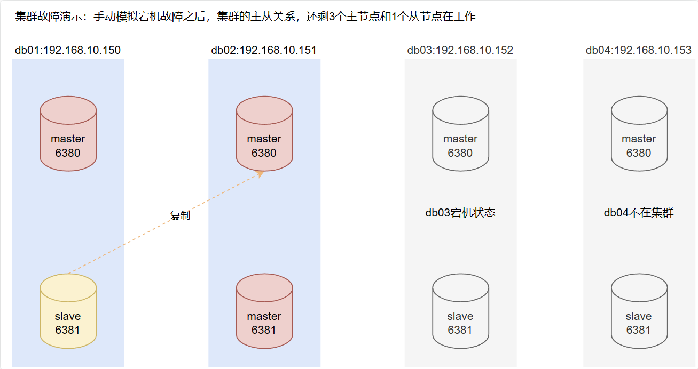

Let's not adjust the master-slave relationships for now; first let's start the downed node.

### Failure Recovery

```bash
# db3服务器重启之后，手动先启动主节点，再启动从节点，注意，启动主从节点的顺序
systemctl start redis-master
systemctl start redis-slave
ps -ef|grep redis

[root@cs ~]# systemctl start redis-master
[root@cs ~]# systemctl start redis-slave
[root@cs ~]# ps -ef|grep redis
redis      1641      1  0 05:47 ?        00:00:00 /usr/local/bin/redis-server 192.168.10.152:6380 [cluster]
redis      1652      1  1 05:47 ?        00:00:00 /usr/local/bin/redis-server 192.168.10.152:6381 [cluster]
root       1657   1613  0 05:47 pts/0    00:00:00 grep --color=auto redis
```

At this point, check the cluster state from any node.

```bash
redis-cli -h 192.168.10.150 -p 6380 CLUSTER INFO
redis-cli -h 192.168.10.150 -p 6380 CLUSTER NODES
redis-cli  --cluster info 192.168.10.150:6380

[root@cs ~]# redis-cli -h 192.168.10.150 -p 6380 CLUSTER INFO
cluster_state:ok
cluster_slots_assigned:16384
cluster_slots_ok:16384
cluster_slots_pfail:0
cluster_slots_fail:0
cluster_known_nodes:6
cluster_size:3
cluster_current_epoch:20
cluster_my_epoch:11
cluster_stats_messages_ping_sent:19064
cluster_stats_messages_pong_sent:1293
cluster_stats_messages_fail_sent:16
cluster_stats_messages_auth-ack_sent:2
cluster_stats_messages_sent:20375
cluster_stats_messages_ping_received:1283
cluster_stats_messages_pong_received:1487
cluster_stats_messages_meet_received:10
cluster_stats_messages_fail_received:6
cluster_stats_messages_auth-req_received:3
cluster_stats_messages_received:2789
[root@cs ~]# redis-cli -h 192.168.10.150 -p 6380 CLUSTER NODES
e827ae7807b2f04c77702e325db3eb311403b3bb 192.168.10.152:6380@16380 slave 4f15e5e2310d87089b92ab7b24960c950b30d195 0 1691664530121 20 connected
24476f40244ca37b1c42eb3ba62e39a7ee9e95d6 192.168.10.150:6380@16380 myself,master - 0 1691664531000 11 connected 0-5460
967340547d63fd4f09e870b1494b6de720f9d6f4 192.168.10.152:6381@16381 slave 24476f40244ca37b1c42eb3ba62e39a7ee9e95d6 0 1691664531144 16 connected
428e2b4090819ae5d181f435461c0970172d748c 192.168.10.150:6381@16381 slave a8b027568d5dfc6e14560ede0d6b5ce45f04ed6f 0 1691664532167 17 connected
4f15e5e2310d87089b92ab7b24960c950b30d195 192.168.10.151:6381@16381 master - 0 1691664529000 20 connected 10923-16383
a8b027568d5dfc6e14560ede0d6b5ce45f04ed6f 192.168.10.151:6380@16380 master - 0 1691664529097 12 connected 5461-10922
[root@cs ~]# redis-cli  --cluster info 192.168.10.150:6380
192.168.10.150:6380 (24476f40...) -> 3343 keys | 5461 slots | 1 slaves.
192.168.10.151:6381 (4f15e5e2...) -> 3341 keys | 5461 slots | 1 slaves.
192.168.10.151:6380 (a8b02756...) -> 3316 keys | 5462 slots | 1 slaves.
[OK] 10000 keys in 3 masters.
0.61 keys per slot on average.
```

The cluster state is normal and no data was lost, but the master-slave relationships need to be adjusted manually.

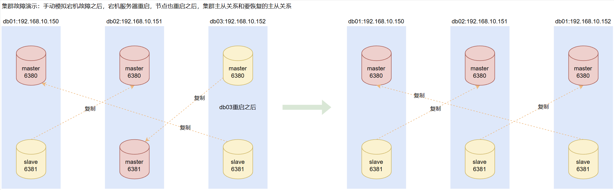

According to the master-slave relationship diagram organized from the above figure, we only need to swap the master-slave relationships of the 6380 node on 152 and the 6381 node on 151.

There is a command that can directly swap master-slave relationships.

```bash
# 注意这个CLUSTER FAILOVER命令使用时，是这样的，你想让谁的主从关系互换，就去从节点执行CLUSTER FAILOVER，然后从就变成主，主就变成从了
# 任意终端执行：
redis-cli -c -h 192.168.10.152 -p 6380 CLUSTER FAILOVER
redis-cli -h 192.168.10.150 -p 6380 CLUSTER NODES

[root@cs ~]# redis-cli -c -h 192.168.10.152 -p 6380 CLUSTER FAILOVER
OK
[root@cs ~]# redis-cli -h 192.168.10.150 -p 6380 CLUSTER NODES
e827ae7807b2f04c77702e325db3eb311403b3bb 192.168.10.152:6380@16380 master - 0 1691665372760 21 connected 10923-16383   # 152的6380节点变成了主节点
24476f40244ca37b1c42eb3ba62e39a7ee9e95d6 192.168.10.150:6380@16380 myself,master - 0 1691665371000 11 connected 0-5460
967340547d63fd4f09e870b1494b6de720f9d6f4 192.168.10.152:6381@16381 slave 24476f40244ca37b1c42eb3ba62e39a7ee9e95d6 0 1691665371738 16 connected
428e2b4090819ae5d181f435461c0970172d748c 192.168.10.150:6381@16381 slave a8b027568d5dfc6e14560ede0d6b5ce45f04ed6f 0 1691665370000 17 connected
4f15e5e2310d87089b92ab7b24960c950b30d195 192.168.10.151:6381@16381 slave e827ae7807b2f04c77702e325db3eb311403b3bb 0 1691665370715 21 connected  #151的6381节点变成了从节点
a8b027568d5dfc6e14560ede0d6b5ce45f04ed6f 192.168.10.151:6380@16380 master - 0 1691665371000 12 connected 5461-10922
```

## Automated, Non-Interactive Cluster Operations

### Automatically Deploying a Cluster

This was actually covered before — it's just one command.

```bash
# 这俩命令用哪个都行
echo "yes"|redis-cli --cluster create 192.168.10.150:6380 192.168.10.151:6380 192.168.10.152:6380 192.168.10.150:6381 192.168.10.151:6381 192.168.10.152:6381 --cluster-replicas 1

redis-cli --cluster create 192.168.10.150:6380 192.168.10.151:6380 192.168.10.152:6380 192.168.10.150:6381 192.168.10.151:6381 192.168.10.152:6381 --cluster-replicas 1 --cluster-yes
# --cluster-replicas 1 表示一个主节点有一个从节点
# --cluster-yes 表示有交互的提示中，自动输入yes
```

### Automatically Expanding a Cluster

Use `add-node` to add a node. Note that this only adds the new node to the cluster with the identity of a master, but no slots are assigned to it, so in the cluster it does not take responsibility for specific business. To handle business, we need to assign slots manually.

**1. Add the node to the cluster**

```bash
# 添加主节点,192.168.10.153:6380是要添加的节点，后面的192.168.10.150:6380是已经在集群中的节点
redis-cli --cluster add-node 192.168.10.153:6380  192.168.10.150:6380
# 这一步只是将新节点加入集群，分配槽位啥的，都没有，还需要手动做
# 如果这个新节点是从来没有加入过集群，直接执行命令就可以了，如果这个节点曾经有过加入集群的经历，可能就会报错
# 如果报错，就参考本篇博客的最后一部分，就是常见报错中的这个报错解决办法：[ERR] Node 192.168.10.153:6380 is not empty. Either the node already knows other nodes (check with CLUSTER NODES) or contains some key in database 0.，链接：https://www.cnblogs.com/Neeo/articles/10840096.html#err-node-192168101536380-is-not-empty-either-the-node-already-knows-other-nodes-check-with-cluster-nodes-or-contains-some-key-in-database-0


[root@cs ~]# redis-cli  --cluster info 192.168.10.150:6380
192.168.10.153:6380 (7cf4fade...) -> 0 keys | 0 slots | 0 slaves.		# 可以看到这个新节点压根没有槽位
192.168.10.151:6381 (4f15e5e2...) -> 0 keys | 5461 slots | 1 slaves.
192.168.10.151:6380 (a8b02756...) -> 0 keys | 5462 slots | 1 slaves.
192.168.10.152:6380 (e827ae78...) -> 0 keys | 5461 slots | 1 slaves.
[OK] 0 keys in 4 masters.
0.00 keys per slot on average.
```

**2. Assign slots to the master node that just joined the cluster**

```bash
# 先看下shell脚本能不能获取到新节点的ID
echo $(redis-cli -c -h 192.168.10.153 -p 6380 cluster nodes|awk '/153:6380/{print $1}') 

[root@cs ~]# echo $(redis-cli -c -h 192.168.10.153 -p 6380 cluster nodes|awk '/153:6380/{print $1}') 
4d37fc13e16282788199d5d641628aff339802ec

# 能行再往下执行这个命令，二选一就行了，一个是自己填写新节点的ID，一个是shell获取
redis-cli --cluster reshard 192.168.10.153:6380 --cluster-from all --cluster-slots 4096 --cluster-yes --cluster-to 4d37fc13e16282788199d5d641628aff339802ec
redis-cli --cluster reshard 192.168.10.153:6380 --cluster-from all --cluster-slots 4096 --cluster-yes --cluster-to $(redis-cli -c -h 192.168.10.153 -p 6380 cluster nodes|awk '/153:6380/{print $1}') 

# --cluster reshard		重新分配槽位，我们之前执行的是redis-cli --cluster reshard 192.168.10.153:6380 这个命令就是重新分配槽位，然后有四次交互动作，而下面的几个参数就是代替那四个交互的操作
# --cluster-from all 	表示从集群中现有的有槽位的主节点给指定主节点分配槽位
# --cluster-to       	表示把槽位分配给新的主节点，这里用shell脚本个过滤出来的那个主节点的ID，当然，你可以自己手动写，不用shell
# --cluster-slots 4096  表示要总共要往新节点迁移的槽位总数
# --cluster-yes			在迁移槽位过程中免交互输入yes

[root@cs ~]# redis-cli  --cluster info 192.168.10.150:6380
192.168.10.153:6380 (4d37fc13...) -> 0 keys | 4096 slots | 0 slaves.
192.168.10.151:6381 (4f15e5e2...) -> 0 keys | 4096 slots | 1 slaves.
192.168.10.151:6380 (a8b02756...) -> 0 keys | 4096 slots | 1 slaves.
192.168.10.152:6380 (e827ae78...) -> 0 keys | 4096 slots | 1 slaves.
[OK] 0 keys in 4 masters.
0.00 keys per slot on average.
```

**3. Add a replica node to the cluster and establish a master-slave relationship with the specified master node at the same time**

The original process was to first invite into the cluster, then establish the master-slave relationship.

```bash
redis-cli -h 192.168.10.150 -p 6380 CLUSTER MEET 192.168.10.153 6381
redis-cli -h 192.168.10.153 -p 6381 CLUSTER REPLICATE $(redis-cli -c -h 192.168.10.150 -p 6380 cluster nodes|awk '/153:6380/{print $1}') 
```

Now, we can do it like this.

```bash
# 添加从节点同时和集群中的主节点建立主从关系
redis-cli --cluster add-node 192.168.10.153:6381 192.168.10.150:6380 --cluster-slave --cluster-master-id $(redis-cli -c -h 192.168.10.150 -p 6380 cluster nodes|awk '/150:6380/{print $1}') 
# --cluster add-node 192.168.10.153:6381 192.168.10.150:6380  # 通过集群中的6380节点邀请153的6381节点进群
# --cluster-slave 标记当前节点是从节点
# --cluster-slave --cluster-master-id	# 指定该节点的主节点的ID，
# 注意，一定要要确认要绑定主节点是主节点，不然会添加节点成功，主从关系绑定失败，而且，还会报错：Node 192.168.10.153:6381 replied with error:ERR I can only replicate a master, not a replica.
# 最终导致添加的节点变成了没有槽位的主节点了
```

### Automatically Shrinking a Cluster

**Taking nodes offline: no slot reassignment needed**

If the current node is a master node with no slots assigned, or the current node is a replica node, it can be taken offline directly with the following command.

```bash
# 下线命令            具体命令     要下线的节点       要下线的节点的ID
redis-cli --cluster del-node 192.168.10.153:6381 03ff463e91f0c42188d5d8e09a36a72794f2602c

# 增加了shell脚本获取节点ID
redis-cli --cluster del-node 192.168.10.153:6381 $(redis-cli -c -h 192.168.10.153 -p 6381 cluster nodes|awk '/153:6381/{print $1}')


# 最终要执行的命令
echo $(redis-cli -c -h 192.168.10.153 -p 6380 cluster nodes|awk '/153:6380/{print $1}')
redis-cli --cluster del-node 192.168.10.153:6381 $(redis-cli -c -h 192.168.10.153 -p 6381 cluster nodes|awk '/153:6381/{print $1}')

[root@cs ~]# echo $(redis-cli -c -h 192.168.10.153 -p 6380 cluster nodes|awk '/153:6380/{print $1}')
71c5c7aa11c9c140e72d79ba78fc0c35e73caae6
[root@cs ~]# redis-cli --cluster del-node 192.168.10.153:6381 $(redis-cli -c -h 192.168.10.153 -p 6381 cluster nodes|awk '/153:6381/{print $1}')
>>> Removing node 03ff463e91f0c42188d5d8e09a36a72794f2602c from cluster 192.168.10.153:6381
>>> Sending CLUSTER FORGET messages to the cluster...
>>> SHUTDOWN the node.
```

**Taking nodes offline: slot reassignment needed**

If the node to be taken offline has slots, the offline process must first migrate the slots away, and then perform the offline operation.

```bash
# 1. 把槽位迁移走，自动完成
# 具体命令，通过填写将153的6380的ID，将该节点的槽位平均分配给当前集群中的其它主节点
redis-cli --cluster rebalance 192.168.10.150:6380 --cluster-weight 71c5c7aa11c9c140e72d79ba78fc0c35e73caae6=0


redis-cli --cluster rebalance 192.168.10.150:6380 --cluster-weight $(redis-cli -c -h 192.168.10.153 -p 6380 cluster nodes|awk '/153:6380/{print $1}')=0
# --cluster rebalance		# 从新分配槽位
# --cluster-weight			# 自动的执行将下线节点的槽位，移动到其它的主节点上，执行效果如下：
# 	Moving 1366 slots from 192.168.10.153:6380 to 192.168.10.150:6380
# 	Moving 1365 slots from 192.168.10.153:6380 to 192.168.10.151:6380
# 	Moving 1365 slots from 192.168.10.153:6380 to 192.168.10.152:6380

# 2. 下线节点
#                   下线命令    要下线的节点的IP和端口   要下线节点的ID
redis-cli --cluster del-node 192.168.10.153:6380 $(redis-cli -c -h 192.168.10.153 -p 6380 cluster nodes|awk '/153:6380/{print $1}')
```

## Data Migration in a Cluster

Data migration in redis can be divided into:

- Single node → single node.
- Single node → cluster.
- Cluster → single node.
- Cluster → cluster.

**Single node → single node**

Single node to single node is the simplest; you can choose to recover directly from an rdb file.

You can also migrate with third-party tools.

**Single node → cluster**

This can be done with `redis-cli` related commands, or with third-party tools.

**Cluster → single node**

This can be done with third-party tools.

Another idea is to assign all the slots in the cluster to one node, then run `save` on that node, copy the rdb file away, recover it on the single node, and then restore the cluster slots.

**Cluster → cluster**

This can be done with third-party tools.

Another idea is to make the two clusters have exactly the same architecture and slots. When migrating data, first shut down both clusters, then move the data of the corresponding nodes to the corresponding nodes in the other cluster. Do this for all nodes, then restart the master nodes of the other cluster for data recovery.

In short, for cluster-to-cluster migration, third-party tools are the first recommendation.

And the third-party tools are:

- Redis-Migrate-Tool (RMT), an open-source redis data migration tool from Vipshop, mainly used for online data migration between heterogeneous redis clusters — that is, during the migration, the source cluster can still accept normal business read/write requests with no service interruption. Project address: https://github.com/JokerQueue/redis-migrate-tool
- redis-shake, an open-source tool from Alibaba Cloud for Redis data migration and filtering. Project address: https://github.com/tair-opensource/RedisShake

Next, let's demonstrate using `redis-cli` related commands to migrate data from a single node to a cluster.

**Related command parameters**

```bash
# 将外部192.168.10.150:6379节点的数据，迁移到集群中，这里import后面可以写任意的集群节点
redis-cli --cluster import 192.168.10.150:6380 --cluster-from 192.168.10.150:6379 --cluster-replace --cluster-copy
# import 192.168.10.150:6380  # 可以是集群的任意节点
# --cluster-from 192.168.10.150:6379  # 表示从外部哪个实例迁移数据
# --cluster-replace  # 添加replace参数，迁移时会覆盖掉同名的key，如果不添加该参数，迁移遇到同名的key会提示冲突，当然如果新集群，没数据，不加这个参数也没事
# 	Migrating k_324 to 192.168.10.151:6380: Source 192.168.10.150:6379 replied with error:ERR Target instance replied with error: BUSYKEY Target key name already exists.
# --cluster-copy	# 迁移命令不加copy参数，相当于是mv动作，迁移完毕，自己的也没了，加了copy就相当于cp操作了
```

## Performance Testing

`redis`'s `benchmark` is a test component `redis-benchmark` that comes with the official `redis` installation. With this component, we can define testing rules for `redis` to confirm whether `Redis` meets the business requirements.

**`redis-benchmark` syntax**

```bash
redis-benchmark --help
Usage: redis-benchmark [-h <host>] [-p <port>] [-c <clients>] [-n <requests>] [-k <boolean>]
 -h <hostname>          指定redis测试服务器
 -p <port>              指定redis服务的端口
 -s <socket>            指定redis socket文件
 -a <password>          指定redis密码
 -c <clients>           指定测试的并行数
 -n <requests>          指定测试的请求数量
 -d <size>              SET/GET 命令的值bytes单位 默认是2
 --dbnum <db>           指定redis的某个数据库，默认是0数据库
 -k <boolean>           指定是否保持连接 1是保持连接 0是重新连接，默认为 1
 -r <keyspacelen>       指定get/set的随机值的范围。
 -P <numreq>            管道请求测试，默认0没有管道测试
 -e                     如果有错误，输出到标准输出上。
 -q                     静默模式，只显示query/秒的值
 --csv                  指定输出结果到csv文件中
 -l                     指定是否一直运行test
 -t <tests>             指定需要测试的命令，以逗号分隔，


redis-benchmark -n 10000 -q
redis-benchmark -h 192.168.10.150 -p 6380 -n 10000 -c 20 -t get
redis-benchmark -h 192.168.10.150 -p 6379 -n 10000 -c 20 -t get
```
