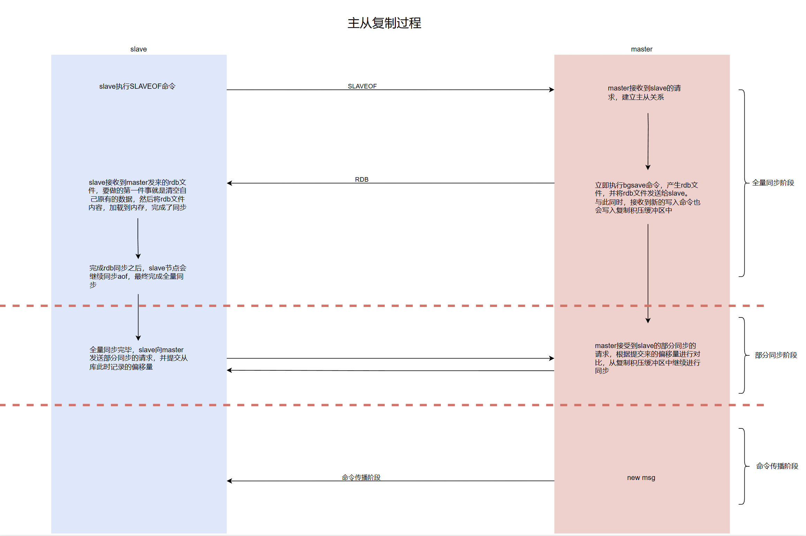

# Redis Cluster - Master-Slave Replication

**The master handles writes, replicas handle reads, and the master and replicas always keep their data consistent.**

## Experiment

You can configure multiple replicas, e.g., one master with one replica, or one master with multiple replicas, and configuring all replicas to point at the master is done with a single command.

At this point my servers are:

- db01, master node, 192.168.10.150
- db02, replica node, 192.168.10.151

#### **Creating Some Keys on db01**

```bash
cat /dev/null > /opt/redis6379/logs/redis6379.log
du -sh /opt/redis6379/logs/redis6379.log
for i in {1..10000}; do redis-cli set wilson$i $i;echo $i;done
redis-cli bgsave
redis-cli dbsize

[root@cs opt]# for i in {1..10000}; do redis-cli set wilson$i $i;echo $i;done
[root@cs ~]# redis-cli bgsave
Background saving started
[root@cs ~]# redis-cli dbsize
(integer) 10000
```

#### Configuring Master-Slave on redis02

For a temporary effect, directly execute the `SLAVEOF` command.

```bash
# SLAVEOF 主库IP 端口
cat /dev/null > /opt/redis6379/logs/redis6379.log
du -sh /opt/redis6379/logs/redis6379.log
redis-cli flushall
redis-cli SLAVEOF 192.168.10.150 6379
redis-cli dbsize

[root@cs ~]# redis-cli flushall
OK
[root@cs ~]# redis-cli dbsize
(integer) 0
[root@cs ~]# redis-cli SLAVEOF 192.168.10.150 6379
OK
[root@cs ~]# redis-cli dbsize
(integer) 10000


vim /opt/redis6379/conf/redis6379.conf

SLAVEOF 192.168.10.144 6379
```

For a permanent effect, write it into the Redis configuration file:

```bash
echo "SLAVEOF 192.168.43.128 6379" >> /opt/redis6379/conf/redis6379.conf
cat /opt/redis6379/conf/redis6379.conf
```

Other commands:

```bash
# 查看主从状态的各种信息
INFO REPLICATION
# 查看自己的角色
ROLE

[root@cs ~]# redis-cli INFO REPLICATION
# Replication
role:slave
master_host:192.168.10.150
master_port:6379
master_link_status:up
master_last_io_seconds_ago:1
master_sync_in_progress:0
slave_repl_offset:196
slave_priority:100
slave_read_only:1
connected_slaves:0
master_replid:1c2c8c97d3b3c4e4ba6fc1237b3742161f114cbc
master_replid2:0000000000000000000000000000000000000000
master_repl_offset:196
second_repl_offset:-1
repl_backlog_active:1
repl_backlog_size:1048576
repl_backlog_first_byte_offset:1
repl_backlog_histlen:196
[root@cs ~]# redis-cli ROLE
1) "slave"
2) "192.168.43.128"
3) (integer) 6379
4) "connected"
5) (integer) 196
```

## How Replication Works

Redis Replication is a simple, easy-to-use master-slave replication mechanism. It allows a slave node to become an exact copy of the master node. Every time the connection to the master node is interrupted, the slave node automatically reconnects, and no matter what happens to the master node, the slave node always tries to reach a state consistent with the master node. Redis takes a series of auxiliary measures to ensure data safety.

```
Redis主从复制技术有两个版本：在2.8版本之前，每次slave节点断线重联后，只能进行全量同步。在2.8版本之后进行了重新设计，引入了部分同步的概念。本文将以Redis 5.0.7版本为基础对主从复制原理进行介绍。
```

The old version of master-slave replication used a "full synchronization + command propagation" mechanism to synchronize data between master and slave. The hard problem here is that after a slave reconnects, even if only a small amount of data is inconsistent between master and slave, an expensive, resource-consuming full synchronization must be performed to achieve consistency. To this end, the Redis team introduced several mechanisms to ensure that when only a small amount of data is inconsistent, the lower-cost partial synchronization can be used to complete the replication. So the current master-slave replication mechanism consists of three parts: full synchronization, partial synchronization, and command propagation.

For completeness, let me first introduce the two historical concepts: full synchronization and command propagation.

- Full synchronization: the master node creates an RDB snapshot file of the full data set and sends it to the slave node over the network connection. The slave node loads the snapshot file to recover the data, and then the master continues sending the commands newly added to the replication backlog buffer during replication, so that the data reaches a consistent state.
- Command propagation: if the master and slave nodes stay connected, the master node continuously sends a stream of commands to the slave node, so that changes to the master node's dataset also take effect on the slave node's dataset. These commands include: client write requests, key expiration, data eviction, and every other operation that causes a dataset change.

## Synchronization Principle

In master-slave replication mode, Redis uses a pair of `Replication ID, offset` to uniquely identify the version of the Master node's dataset. To understand this "version" concept, you need to be aware of the following three Redis concepts:

- Replication ID: each Redis master node uses a randomly generated string to represent the state of its internally stored data at a certain moment. "A certain moment" can be understood as the moment it took on the master role. As can be seen from the source code, Redis initializes the replication ID when the first slave node joins.
- offset (replication offset): in master-slave mode, the master node continuously propagates commands that cause dataset changes to the slave node. The offset represents the total number of command bytes the master has passed to the slave. It does not exist in isolation; it needs to work together with the replication backlog buffer.
- backlog (replication backlog buffer): it is a circular buffer used to store the commands the master passes to the slave. Its size is fixed, so the commands it can store are limited, and the overflow will be deleted. It can be used both for partial synchronization and for re-pushing commands during the command propagation phase.



We can also verify this from the logs. Below I have sorted the process by the chronological order of the printed logs (some key logs):

```bash
从库：
# 从库向主库发送主从同步请求
54340:S 03 Aug 2023 23:20:30.274 * REPLICAOF 192.168.10.150:6379 enabled (user request from 'id=10 addr=127.0.0.1:33956 fd=7 name= age=0 idle=0 flags=N db=0 sub=0 psub=0 multi=-1 qbuf=48 qbuf-free=32720 obl=0 oll=0 omem=0 events=r cmd=slaveof')


主库：
# 主库接收到了主库的请求
21566:M 03 Aug 2023 15:20:30.667 * Replica 192.168.10.151:6379 asks for synchronization
21566:M 03 Aug 2023 15:20:30.667 * Partial resynchronization not accepted: Replication ID mismatch (Replica asked for '6dd2fe7d7518ca1547f387d5158fd2015c9b39f5', my replication IDs are '113f5106075b494c44df2ff79ac68e7044a6a59b' and '0000000000000000000000000000000000000000')
# 主库立即执行bgsave，拍个最新的快照保存到本地并向从库发送rdb数据
21566:M 03 Aug 2023 15:20:30.667 * Starting BGSAVE for SYNC with target: disk
21566:M 03 Aug 2023 15:20:30.667 * Background saving started by pid 42854
42854:C 03 Aug 2023 15:20:30.672 * DB saved on disk
42854:C 03 Aug 2023 15:20:30.673 * RDB: 0 MB of memory used by copy-on-write
21566:M 03 Aug 2023 15:20:30.774 * Background saving terminated with success
21566:M 03 Aug 2023 15:20:30.779 * Synchronization with replica 192.168.10.151:6379 succeeded

从库：
# 从库接受主库发来的rdb数据
54340:S 03 Aug 2023 23:20:30.834 * Connecting to MASTER 192.168.10.150:6379
54340:S 03 Aug 2023 23:20:30.834 * MASTER <-> REPLICA sync started
54340:S 03 Aug 2023 23:20:30.834 * Non blocking connect for SYNC fired the event.
54340:S 03 Aug 2023 23:20:30.849 * Master replied to PING, replication can continue...
54340:S 03 Aug 2023 23:20:30.851 * Trying a partial resynchronization (request 6dd2fe7d7518ca1547f387d5158fd2015c9b39f5:329).
54340:S 03 Aug 2023 23:20:30.899 * Full resync from master: 113f5106075b494c44df2ff79ac68e7044a6a59b:835852
54340:S 03 Aug 2023 23:20:30.899 * Discarding previously cached master state.
# 接收到了来自主库的168951 bytes
54340:S 03 Aug 2023 23:20:31.004 * MASTER <-> REPLICA sync: receiving 168951 bytes from master
# 重要动作：清空从库自己老的数据，然后加载主库同步过来的rdb数据到内存中
54340:S 03 Aug 2023 23:20:31.010 * MASTER <-> REPLICA sync: Flushing old data
54340:S 03 Aug 2023 23:20:31.010 * MASTER <-> REPLICA sync: Loading DB in memory
54340:S 03 Aug 2023 23:20:31.013 * MASTER <-> REPLICA sync: Finished with success
# 上面已经同步成功了rdb数据，接下来就是同步aof了，执行aof重写机制处理aof文件
54340:S 03 Aug 2023 23:20:31.014 * Background append only file rewriting started by pid 54450
54340:S 03 Aug 2023 23:20:31.092 * AOF rewrite child asks to stop sending diffs.
54450:C 03 Aug 2023 23:20:31.093 * Parent agreed to stop sending diffs. Finalizing AOF...
54450:C 03 Aug 2023 23:20:31.093 * Concatenating 0.00 MB of AOF diff received from parent.
54450:C 03 Aug 2023 23:20:31.093 * SYNC append only file rewrite performed
54450:C 03 Aug 2023 23:20:31.093 * AOF rewrite: 8 MB of memory used by copy-on-write
54340:S 03 Aug 2023 23:20:31.142 * Background AOF rewrite terminated with success
54340:S 03 Aug 2023 23:20:31.142 * Residual parent diff successfully flushed to the rewritten AOF (0.00 MB)
54340:S 03 Aug 2023 23:20:31.142 * Background AOF rewrite finished successfully
# aof搞定之后，主从同步也正式完毕了
# 后续只要在主库的修改操作，都会实时同步到从库
```

## Other Issues Related to Replication

#### Replicas Are Read-Only

By default, the slave works in read-only mode, i.e., write commands cannot be executed on the slave.

```bash
[root@cs ~]# redis-cli get zhangkai1
"1"
[root@cs ~]# redis-cli set k1 v1
(error) READONLY You can't write against a read only replica.
```

To change this mode, you can modify the following option in the configuration file.

```bash
# 默认是yes-只读，no-可写
slave-read-only yes/no
```

**But in general, our replicas do not handle writes.**

#### Handling Expired Keys

Redis can limit the lifetime of a key by setting its expiration time. Redis has two mechanisms for handling key expiration: lazy deletion and periodic deletion, and these mechanisms rely on the Redis instance's timing capability. If both the master and the slave enable the key-expiration handling mechanism, some problems may occur. To this end, Redis uses three technical measures to solve the key-expiration problem:

- The slave disables the active key-expiration mechanism. After the master expires a key, it propagates the expiration to all slaves in the form of a `DEL` command, ensuring that the slave removes the expired key.
- The master-dependent key-expiration mechanism cannot be real-time, so for read operations, the slave will return "key does not exist" to the client according to its own clock.
- To prevent a key from expiring during the execution of a Lua script, the Lua script will be propagated to the slave for execution.

#### Heartbeat Mechanism

During the command propagation phase, the slave node sends a heartbeat message to the master node every second, in the command format `REPLCONF ACK <offset>`.

The offset in the command is the slave's latest replication offset. After receiving it, the master compares it with its own offset. If the slave node is missing data, the master node will push the missing data.

**Not only Redis has this — MySQL, MongoDB, etc. all have it too.**

#### The min-replica Mechanism

Redis master-slave replication is not only about solving the data synchronization problem between master and slave; it also needs to ensure data safety. The safety here mainly refers to the efficiency of achieving consistency in data synchronization between master and slave, and the reliability of the distributed system in a read/write-separation scenario under the master-slave architecture.

Redis uses an asynchronous replication mechanism. It cannot truly guarantee that every slave receives every propagated command, so there is inevitably a time window during which commands can be lost between master and slave.

To this end, Redis introduced the `min-replicas` option. This mechanism has two configuration items in redis.conf:

- `min-replicas-to-write`: data can only be written when there are at least N slaves. Ensures the minimum number of slaves.
- `min-replicas-max-lag`: if the lag value of every slave is greater than N, writes are rejected. Ensures master-slave synchronization lag.

You can use `info replication` to view the number of slaves (`connected_slaves`) and the lag value of each slave (`lag`).

```bash
[root@cs ~]# redis-cli INFO REPLICATION
# Replication
role:master
connected_slaves:2
slave0:ip=192.168.10.151,port=6379,state=online,offset=8453211,lag=0
slave1:ip=192.168.10.152,port=6379,state=online,offset=8453211,lag=1
master_replid:1c2c8c97d3b3c4e4ba6fc1237b3742161f114cbc
master_replid2:0000000000000000000000000000000000000000
master_repl_offset:8453211
second_repl_offset:-1
repl_backlog_active:1
repl_backlog_size:1048576
repl_backlog_first_byte_offset:7404636
repl_backlog_histlen:1048576
```

This mechanism is implemented through the heartbeat between slave and master. As described above, the slave sends heartbeat data to the master every second. Based on the heartbeat, the master node can:

- Update the slave's synchronization acknowledgment time: compute the lag value based on the master's time and the acknowledgment time.
- Update the last communication time between master and slave: used for slave communication timeout detection; if communication times out, the master removes the slave.

#### Replication Safety When the Master Has Persistence Disabled

When the master has persistence disabled, if it fails and automatically restarts, since no persistence data is saved locally, the restarted Redis has empty in-memory data. The slave will then automatically synchronize with the master's data, which causes the slave's data to be cleared as well.

Therefore, we should enable persistence on the master node as much as possible. This prevents data loss when Redis restarts after a failure, which would otherwise clear the slave's data. If persistence truly cannot be enabled, you should configure the master node so it cannot restart automatically, ensuring that a slave can become the new master node and preventing data from being cleared.

## Disconnecting Master-Slave Replication

```bash
redis-cli SLAVEOF no one

[root@cs opt]# redis-cli SLAVEOF no one
OK
```

## Notes on Master-Slave Replication

1. Replica nodes are read-only and cannot be written to.
2. Replica nodes do not automatically fail over. They keep trying to synchronize with the master node and remain unwritable.
3. Where manual intervention is needed for master-slave replication failover
   - Modify the code to point to the new master's IP
   - The replica node needs to execute `slaveof no one`
4. When a replica establishes synchronization, it clears its own data. If the synchronization target is written incorrectly, the data is cleared.
5. After disconnecting the master-slave replication state, the replica automatically becomes the master.
6. Be sure to back up your data. Whether it is the master node or the replica node, it is best to back up before operating.
