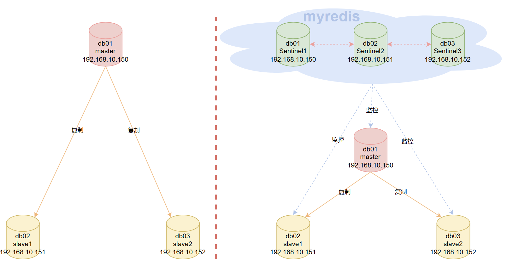

# Redis Sentinel

Sentinel mainly solves the problems of master-slave replication:

- Master-slave replication requires manual intervention; for example, master-slave replication does not perform automatic failover.
- It provides high availability with automatic failover.

Sentinel mainly performs the following three tasks:

- **Monitoring**: Sentinel constantly checks whether your master and replica nodes are operating normally.
- **Notification**: when a monitored Redis server has a problem, Sentinel can send notifications to administrators or other applications via an API.
- **Automatic failover**: when a master node cannot work normally, Sentinel starts an automatic failover operation. It promotes one of the failing master's replicas to be the new master and makes the other replicas of the failing master replicate the new master instead. When a client tries to connect to the failing master, Sentinel also returns the new master's address to the client, so that Sentinel can replace the failed server with the new master.

Redis Sentinel is a distributed system. You can run multiple Sentinel processes in one architecture. These processes use gossip protocols to receive information about whether a master node is down, and use agreement protocols to decide whether to perform automatic failover and which replica to select as the new master.

In addition, Sentinel nodes are special Redis nodes that do not store data themselves.

## Deploying Master-Slave Replication and Sentinel

### Directory, Port, and Server Planning

Officially, it is recommended that a Sentinel monitoring group consist of at least three nodes, and it must have a group name. A Sentinel is also a Redis instance, and it can be deployed on the same server as a Redis data instance.

Here I prepared 3 CentOS 7 servers with identical hardware, all running Redis 5.0.7.



**Port planning**

```bash
# redis数据节点，正常监听6379端口
# 哨兵节点，监听26379节点
```

**Server planning**

```bash
# db01: 192.168.10.150
	centinel1
	redis master
# db02: 192.168.10.151
	centinel2
	redis slave1	
# db03: 192.168.10.152
	centinel3
	redis slave2		
```

**Directory planning — the same on every server**

```bash
# redis数据节点
/opt/redis6379/{conf,logs,pid}   	# 配置目录，日志目录，pid目录
/data/redis6379/					# 数据存放目录
/opt/redis-5.0.7/					# 安装目录

# 哨兵节点
/opt/redis26379/{conf,logs,pid}   	# 配置目录，日志目录，pid目录
/data/redis26379/					# 数据存放目录
```

## Deploying Master-Slave Replication

Sentinel needs to monitor every master and replica node, so let's first set up the master-slave replication relationships.

First, disable the firewall and install some necessary tools on all node servers.

```bash
systemctl stop firewalld.service
systemctl disable firewalld.service
systemctl status firewalld.service
sed -i.ori 's#SELINUX=enforcing#SELINUX=disabled#g' /etc/selinux/config
yum update -y
yum -y install gcc automake autoconf libtool make
yum -y install net-tools vim wget lrzsz

# 后面配置用到了一个小知识点
# $(ifconfig ens33|awk 'NR==2{print $2}') 这条shell的意思是获取本机的IP地址
# 有的服务器叫做ens33，也有的可能是eth0，可以通过ifconfig命令确认
[root@cs ~]# echo $(ifconfig ens33|awk 'NR==2{print $2}')
192.168.10.150
```

### **Configuring Redis on Each Server**

db01

```bash
systemctl stop redis
cat >/opt/redis6379/conf/redis6379.conf <<EOF 
daemonize yes
bind $(ifconfig ens33|awk 'NR==2{print $2}') 127.0.0.1 
port 6379
pidfile "/opt/redis6379/pid/redis6379.pid"
logfile "/opt/redis6379/logs/redis6379.log"
dir "/data/redis6379"
save 900 1
save 300 10
save 60 10000
dbfilename "redis.rdb"
appendonly yes
appendfilename "redis.aof"
appendfsync everysec
EOF
systemctl start redis
redis-cli PING
```

On db02 and db03, run the following commands respectively:

```bash
# 先分别执行下面的命令，建立免密传输通道
ssh-keygen
ssh-copy-id 192.168.10.150

# 如果你的db02和db03有Redis，可以先停掉
# systemctl stop redis
rm -rf /opt/redis*
rsync -avz 192.168.10.150:/usr/local/bin/redis* /usr/local/bin
rsync -avz 192.168.10.150:/opt/redis* /opt/
rsync -avz 192.168.10.150:/usr/lib/systemd/system/redis.service /usr/lib/systemd/system/

mkdir -p /opt/redis6379/{conf,logs,pid} 
mkdir -p /data/redis6379

cat >/opt/redis6379/conf/redis6379.conf <<EOF 
daemonize yes
bind $(ifconfig ens33|awk 'NR==2{print $2}') 127.0.0.1
port 6379
pidfile "/opt/redis6379/pid/redis6379.pid"
logfile "/opt/redis6379/logs/redis6379.log"
dir "/data/redis6379"
save 900 1
save 300 10
save 60 10000
dbfilename "redis.rdb"
appendonly yes
appendfilename "redis.aof"
appendfsync everysec
EOF

groupadd redis -g 1000
useradd redis -u 1000 -g 1000 -M -s /sbin/nologin
chown -R redis:redis /opt/redis*
chown -R redis:redis /data/redis*
systemctl daemon-reload
systemctl start redis
redis-cli PING
cat /opt/redis6379/conf/redis6379.conf
```

### **Configuring the Redis Master-Slave Replication Relationship**

`redis-cli` can connect to remote servers via `-h` and `-p`. Since each redis here listens on port 6379 by default, there is no need to specify the `-p` parameter.

So, on db01, I will remotely operate the redis on the two other servers to establish master-slave relationships with db01.

Operations on db01

```bash
redis-cli -h 192.168.10.151 -p 6379 slaveof 192.168.10.150 6379
redis-cli -h 192.168.10.152 -p 6379 slaveof 192.168.10.150 6379

# 如果数据量较大，可以等一段时间再执行info replication命令
redis-cli -h 192.168.10.150 -p 6379 info replication
redis-cli -h 192.168.10.150 -p 6379 set k1 v111 
redis-cli -h 192.168.10.150 -p 6379 get k1
redis-cli -h 192.168.10.151 -p 6379 get k1
redis-cli -h 192.168.10.152 -p 6379 get k1


[root@cs ~]# redis-cli -h 192.168.10.150 -p 6379 info replication
# Replication
role:master
connected_slaves:2
slave0:ip=192.168.10.152,port=6379,state=online,offset=2168,lag=0
slave1:ip=192.168.10.151,port=6379,state=online,offset=2168,lag=1
master_replid:49f6e22f9628017aea5c3d8b980bf75aa100299d
master_replid2:0000000000000000000000000000000000000000
master_repl_offset:2168
second_repl_offset:-1
repl_backlog_active:1
repl_backlog_size:1048576
repl_backlog_first_byte_offset:1
repl_backlog_histlen:2168
[root@cs ~]# redis-cli -h 192.168.10.150 -p 6379 set k1 v111 
OK
[root@cs ~]# redis-cli -h 192.168.10.150 -p 6379 get k1
"v111"
[root@cs ~]# redis-cli -h 192.168.10.151 -p 6379 get k1
"v111"
[root@cs ~]# redis-cli -h 192.168.10.152 -p 6379 get k1
"v111"
```

## Deploying Sentinel

### Sentinel State Persistence

Sentinel's state is persisted in the Sentinel configuration file. That is, Sentinel has a feature where, after a successful deployment, it automatically maintains and updates the configuration file. So we just need to deploy the three Sentinels.

The operation is the same on all three servers. Run the following commands on db01, db02, and db03.

```bash
mkdir -p /data/redis26379
mkdir -p /opt/redis26379/{conf,pid,logs}
cat >/opt/redis26379/conf/redis26379.conf << EOF
bind $(ifconfig ens33|awk 'NR==2{print $2}')
port 26379
daemonize yes
logfile /opt/redis26379/logs/redis26379.log
dir /data/redis26379
# 注意修改主节点ip为你真实的主节点IP
sentinel monitor myredis 192.168.10.150 6379 2
sentinel down-after-milliseconds myredis 3000
sentinel parallel-syncs myredis 1
sentinel failover-timeout myredis 180000
EOF

chown -R redis:redis /data/redis*
chown -R redis:redis /opt/redis*
cat >/usr/lib/systemd/system/redis-sentinel.service << EOF
[Unit]
Description=Redis persistent key-value database
After=network.target
After=network-online.target
Wants=network-online.target
[Service]
ExecStart=/usr/local/bin/redis-sentinel /opt/redis26379/conf/redis26379.conf --supervised systemd
ExecStop=/usr/local/bin/redis-cli -h $(ifconfig ens33|awk 'NR==2{print$2}') -p 26379 shutdown
Type=notify
User=redis
Group=redis
RuntimeDirectory=redis
RuntimeDirectoryMode=0755
[Install]
WantedBy=multi-user.target
EOF

systemctl daemon-reload
systemctl start redis-sentinel
redis-cli -h 192.168.10.150 -p 26379 PING
redis-cli -h 192.168.10.151 -p 26379 PING
redis-cli -h 192.168.10.152 -p 26379 PING
```

Explanation of key configuration:

- `sentinel monitor myredis 192.168.10.148 6379 2` tells Sentinel to monitor a master node aliased `myredis`, with the master node's IP address `192.168.10.150` and port `6379`, and it takes at least `2` Sentinels agreeing to judge this master as failed (as long as the number of agreeing Sentinels does not reach the threshold, automatic failover will not be executed).
- `sentinel down-after-milliseconds`: this option specifies the number of milliseconds after which Sentinel considers the server to be disconnected.
  - If the server does not return a reply to the PING command sent by Sentinel within the given milliseconds, or returns an error, then Sentinel marks the server as **subjectively down** (`SDOWN` for short).
  - However, just one Sentinel marking the server as subjectively down does not necessarily cause an automatic failover: only after enough Sentinels have all marked a server as subjectively down will the server be marked as **objectively down** (`ODOWN` for short), and only then will automatic failover be executed.
- `sentinel parallel-syncs`:
  - It is related to the master-slave synchronization performed by the replicas toward the new master during the failover period. It specifies how many replicas initiate replication operations toward the new master at a time. For example, suppose that after the master switchover is complete, there are 3 replicas that need to initiate replication toward the new master; if `parallel-syncs=1`, the replicas will start replicating one by one; if `parallel-syncs=3`, all 3 replicas will start replicating at the same time.
  - The larger `parallel-syncs` is, the faster the replicas complete replication, but the greater the pressure on the master's network and disk load. It should be set according to the actual situation. For example, if the master's load is low and the replicas have high requirements for service availability, you can appropriately increase `parallel-syncs`. The default value of `parallel-syncs` is 1.
- `sentinel failover-timeout`: related to the judgment of failover timeout. It is the timeout for Sentinel when performing failover on the master, in milliseconds; default `180000` milliseconds, i.e., 180 seconds.

### Common Commands

```bash
# 获取主节点的IP和端口，你可以在任意节点执行这个命令
redis-cli -h 192.168.10.150 -p 26379 SENTINEL get-master-addr-by-name myredis
redis-cli -h 192.168.10.151 -p 26379 SENTINEL get-master-addr-by-name myredis
redis-cli -h 192.168.10.152 -p 26379 SENTINEL get-master-addr-by-name myredis

# 返回结果都是一样的
[root@cs ~]# redis-cli -h 192.168.10.150 -p 26379 SENTINEL get-master-addr-by-name myredis
1) "192.168.10.150"
2) "6379


# 查看主节点和从节点的sentinel信息
redis-cli -h 192.168.10.150 -p 26379 SENTINEL master myredis
redis-cli -h 192.168.10.150 -p 26379 SENTINEL slaves myredis
redis-cli -h 192.168.10.150 -p 26379 SENTINEL sentinels myredis


# 查看可用的sentinel节点数量
[root@cs ~]# redis-cli -h 192.168.10.150 -p 26379 SENTINEL ckquorum myredis
OK 3 usable Sentinels. Quorum and failover authorization can be reached
3个可用哨兵节点，达到了仲裁和故障转移的条件了，也就是说能够进行自动故障转移

# 查看可用的sentinel的基本信息
# 总的信息
redis-cli -h 192.168.10.150 -p 26379 INFO
# 总的信息中某一项分类信息
redis-cli -h 192.168.10.150 -p 26379 INFO Sentinel
```

## The Story Behind Sentinel (For Understanding)

### Subjective Downtime and Objective Downtime

- Subjective Down (`SDOWN` for short) refers to a single Sentinel instance's judgment that a server is down.
- Objective Down (`ODOWN` for short) refers to the judgment that a server is down after multiple Sentinel instances have all made an SDOWN judgment on the same server and communicated with each other via the `SENTINEL is-master-down-by-addr` command (a Sentinel can ask another Sentinel whether it considers a given server to be down by sending it a `SENTINEL is-master-down-by-addr` command).

If a server does not return a valid reply to the Sentinel that sent it a PING command within the time specified by the `master-down-after-milliseconds` option, then the Sentinel marks the server as subjectively down.

A valid reply from the server to the PING command can be any one of the following three replies:

- `+PONG` — equivalent to the common client sending a `PING` and the server replying with a `PONG`.
- `-LOADING` — a loading error.
- `-MASTERDOWN` — an error indicating the master node is down.

If the server returns any reply other than the three above, or does not reply to the [PING](https://docs.kilvn.com/redis-doc/connection/ping.html#ping) command within the specified time, then Sentinel considers the reply returned by the server to be non-valid.

Note that a server must keep returning invalid replies for `master-down-after-milliseconds` milliseconds before it is marked as subjectively down by Sentinel.

For example, if the value of the `master-down-after-milliseconds` option is `30000` milliseconds (`30` seconds), then as long as the server returns at least one valid reply within every `29` seconds, the server will still be considered to be in a normal state.

Switching from the subjectively down state to the objectively down state does not use a strong quorum algorithm; instead, it uses the gossip protocol: if a Sentinel receives a sufficient number of master-down reports from other Sentinels within a given time frame, it changes the master's state from subjectively down to objectively down. If the other Sentinels subsequently stop reporting that the master is down, the objectively down state is removed.

The objective down condition **only applies to master nodes**: for any other type of Redis instance, Sentinel does not need to consult before judging it as down, so replicas and other Sentinels never reach the objective down condition.

As soon as a Sentinel finds that a master node has entered the objective down state, that Sentinel may be elected by the other Sentinels to perform an automatic failover operation on the failed master.

### Tasks Each Sentinel Needs to Perform Periodically

- Each Sentinel sends a PING command to the master nodes, replica nodes, and other Sentinel instances it knows about once every two seconds.
- If an instance's time since its last valid reply to a PING command exceeds the value specified by the `down-after-milliseconds` option, the instance is marked as subjectively down by the Sentinel. A valid reply can be `+PONG`, `-LOADING`, or `-MASTERDOWN`.
- If a master is marked as subjectively down, all the Sentinels monitoring it confirm once per second whether the master really has entered the subjectively down state.
- If a master is marked as subjectively down, and a sufficient number of Sentinels (at least the number specified in the configuration file) agree with this judgment within a specified time frame, the master is marked as objectively down.
- In general, each Sentinel sends an info command to all the master and replica nodes it knows about once every 10 seconds. When a master is marked as objectively down by a Sentinel, the frequency at which the Sentinel sends info commands to all the replicas of the downed master changes from once every 10 seconds to once every second.
- When there are not enough Sentinels agreeing that the master is down, the master's objective down state is removed. When the master again returns a valid reply to a Sentinel's PING command, the master's subjective down state is removed.

### Automatically Discovering New Sentinels and Replicas

A Sentinel can connect with multiple other Sentinels. The Sentinels can check each other's availability and exchange information.

You do not need to configure the addresses of other Sentinels for each running Sentinel, because Sentinels can automatically discover other Sentinels monitoring the same master via the publish/subscribe feature. This is done by sending information to the channel `__sentinel__:hello`.

Similarly, you do not need to manually list all the replicas of a master, because a Sentinel can obtain all replica information by querying the master.

- Each Sentinel sends a message to the `__sentinel__:hello` channel of all the master and replica nodes it monitors once every two seconds via publish/subscribe. The message contains the Sentinel's IP address, port number, and run ID (runid).
- Each Sentinel subscribes to the `__sentinel__:hello` channel of all the master and replica nodes it monitors, looking for sentinels that have not appeared before. When a Sentinel discovers a new Sentinel, it adds the new Sentinel to a list that holds all the other Sentinels it knows are monitoring the same master.
- The information sent by a Sentinel also includes the full current configuration of the master. If a Sentinel's master configuration is older than the one sent by another Sentinel, that Sentinel immediately upgrades to the new configuration.
- Before adding a new Sentinel to the list of those monitoring a master, the Sentinel first checks whether the list already contains a Sentinel with the same run ID or the same address (including IP address and port number). If so, the Sentinel first removes the existing Sentinels with the same run ID or the same address, and then adds the new Sentinel.

## Failover

Raft algorithm reference: https://zhuanlan.zhihu.com/p/32052223

If a master node is marked as objectively down, Sentinel will perform an automatic failover operation.

A failover operation consists of the following steps:

- Discover that the master node has entered the objective down state.
- First, eliminate the "malnourished" replicas:
  - Among the replicas of the failed master, those that are marked as subjectively down, disconnected, or whose last reply to a PING command was more than five seconds ago are eliminated.
  - Among the replicas of the failed master, those that have been disconnected from the failed master for a duration more than ten times the value specified by the `down-after` option are eliminated.
  - After the above two rounds of elimination, the replicas that remain are the elite. From this elite, the election begins.
- Use the Raft algorithm to divide the election cycles and start the election. The Raft algorithm can randomly define a time period, and this period is the election cycle. If no leader is elected within this cycle, the next time period begins. Raft divides the roles in the system into Leader, Follower, and Candidate.
  - Each replica has a different election clock, so that not all replicas send election commands to the other nodes at the same time.
  - First, a replica votes for itself, then sends requests to the other nodes asking them to vote for it.
  - After the other replicas receive the voting request, they first compare priorities: if their own is higher, they vote for themselves; otherwise, they vote for the other. If all replicas have the same priority, they compare the replication offset (the data offset synchronized from the master): if their own is greater, they vote for themselves; otherwise, they vote for the other.
  - If the offsets are the same, they compare the `runid` (redis's identifier, randomly generated): if their own is smaller, they vote for themselves; otherwise, they vote for the other. Each node can vote only once, and each node has its own ballot box.
  - Finally, the number of votes is compared. The one with the most votes successfully takes the position and becomes the leader. If the votes are tied, then after twice the configured failover timeout, the next election cycle begins and voting is redone.
- After some behind-the-scenes dealings, the "lucky candidate" is elected. The `SLAVEOF NO ONE` command is sent to the selected replica to turn it into the master.
- Via publish/subscribe, the updated configuration is propagated to all the other Sentinels, which update their own configurations.
- Send the `slaveof` command to the other replicas so that they replicate the new master.
- When all the replicas have started replicating the new master, the leading Sentinel terminates the failover operation.

## Experiment: Killing the Master Node

**First, get the status information of the two replica nodes through the master node (simplified below)**

```bash
[root@cs ~]# redis-cli -h 192.168.10.151 -p 26379 SENTINEL slaves myredis
1)  1) "name"
    2) "192.168.10.152:6379"		# 152从节点
    7) "runid"
    8) "f1618c045726b9d93f054badd3b00bfce98cd62e"
   21) "down-after-milliseconds"
   22) "3000"
   37) "slave-priority"				# 权重100
   38) "100"
   39) "slave-repl-offset"			# 偏移量 3137535
   40) "3137535"

2)  1) "name"
    2) "192.168.10.151:6379"		# 151从节点
    7) "runid"
    8) "62bb0e4e5c8b0112185f6c0b5a4123bd65e452c8"
   21) "down-after-milliseconds"
   22) "3000"
   37) "slave-priority"				# 权重100
   38) "100"
   39) "slave-repl-offset"			# 偏移量 3137535
   40) "3137535"

>>> min("f1618c045726b9d93f054badd3b00bfce98cd62e", "62bb0e4e5c8b0112185f6c0b5a4123bd65e452c8")
'62bb0e4e5c8b0112185f6c0b5a4123bd65e452c8'
```

As you can see, the two replicas have the same priority and the same offset, so only the runid can be compared. The result is that the 151 replica's runid is smaller, so we infer that the 151 node will become the next master.

**Kill the master node**

Let's directly kill the redis process of the master node; perform the operation on the db01 master node.

```bash
# 注意不是 pkill -9 redis，那样会sentinel也干掉了
pkill -9 redis-server

# 然后可以看下此时的主节点是谁
redis-cli -h 192.168.10.150 -p 26379 SENTINEL get-master-addr-by-name myredis
redis-cli -h 192.168.10.150 -p 26379 SENTINEL master myredis

[root@cs ~]# pkill -9 redis-server
[root@cs ~]# redis-cli -h 192.168.10.150 -p 26379 SENTINEL get-master-addr-by-name myredis
1) "192.168.10.151"
2) "6379"
[root@cs ~]# redis-cli -h 192.168.10.150 -p 26379 SENTINEL master myredis
 1) "name"
 2) "myredis"
 3) "ip"
 4) "192.168.10.151"
 5) "port"
 6) "6379"
 7) "runid"
 8) "62bb0e4e5c8b0112185f6c0b5a4123bd65e452c8"
 9) "flags"
10) "master"
```

As you can see, the new master node is the 151 node, which matches our expectation.

Next, we restart db01's redis instance. It will automatically join the existing master-slave relationship and become a replica node.

```bash
systemctl start redis
redis-cli -h 192.168.10.150 -p 26379 SENTINEL slaves myredis


[root@cs ~]# systemctl start redis
[root@cs ~]# redis-cli -h 192.168.10.150 ROLE
1) "slave"
2) "192.168.10.151"
3) (integer) 6379
4) "connected"
5) (integer) 3237639
[root@cs ~]# redis-cli -h 192.168.10.150 -p 26379 SENTINEL slaves myredis  
1)  1) "name"
    2) "192.168.10.152:6379"
    7) "runid"
    8) "f1618c045726b9d93f054badd3b00bfce98cd62e"
    9) "flags"
   10) "slave"
2)  1) "name"
    2) "192.168.10.150:6379"
    7) "runid"
    8) "182a0bb752ad543c8961d9a35ba52005d10f662b"
    9) "flags"
   10) "slave"			# 如果提示s_down,slave,disconnected，就等会再重新执行命令，因为加入主从复制关系中毕竟需要耗费时间
```

## Manual Failover

Sometimes we need to perform maintenance on servers and shut them down temporarily. If the server is a master node, we need to proactively let Sentinel hold an election and choose the master on an appropriate server. Who gets to be the leader is something we can decide.

That is done by controlling the priority of each replica node. First let's look at the priorities; by default they are all 100.

```bash
redis-cli -h 192.168.10.150 -p 6379 CONFIG GET slave-priority
redis-cli -h 192.168.10.151 -p 6379 CONFIG GET slave-priority
redis-cli -h 192.168.10.152 -p 6379 CONFIG GET slave-priority

[root@cs ~]# redis-cli -h 192.168.10.150 -p 6379 CONFIG GET slave-priority
1) "slave-priority"
2) "100"
[root@cs ~]# redis-cli -h 192.168.10.151 -p 6379 CONFIG GET slave-priority
1) "slave-priority"
2) "100"
[root@cs ~]# redis-cli -h 192.168.10.152 -p 6379 CONFIG GET slave-priority
1) "slave-priority"
2) "100"
```

Now, if we want to stop the server of the master node and want the 150 replica's server to become the master, we can lower the priority of the current master 151 and of the other replica 152, while keeping 150's priority unchanged. Then we proactively trigger the election.

```bash
# 先给不让当主节点的其它节点将权重
redis-cli -h 192.168.10.151 -p 6379 CONFIG set slave-priority 0
redis-cli -h 192.168.10.152 -p 6379 CONFIG set slave-priority 0

# 想让当主节点的从节点维持权重不变，等于变相的加了权重，这样从新选举时，就能按照我们想要的动作进行选举了
redis-cli -h 192.168.10.150 -p 6379 CONFIG GET slave-priority
redis-cli -h 192.168.10.151 -p 6379 CONFIG GET slave-priority
redis-cli -h 192.168.10.152 -p 6379 CONFIG GET slave-priority

[root@cs ~]# redis-cli -h 192.168.10.151 -p 6379 CONFIG set slave-priority 0
OK
[root@cs ~]# redis-cli -h 192.168.10.152 -p 6379 CONFIG set slave-priority 0
OK
[root@cs ~]# redis-cli -h 192.168.10.150 -p 6379 CONFIG GET slave-priority
1) "slave-priority"
2) "100"
[root@cs ~]# redis-cli -h 192.168.10.151 -p 6379 CONFIG GET slave-priority
1) "slave-priority"
2) "0"
[root@cs ~]# redis-cli -h 192.168.10.152 -p 6379 CONFIG GET slave-priority
1) "slave-priority"
2) "0"
```

Then, proactively trigger the election.

```bash
# 模拟故障转移命令，此命令将使我们的当前主节点不再可用，睡眠 30 秒。 它基本上模拟了由于某种原因而挂起的现象
# redis-cli -h 192.168.10.151 -p 6379 DEBUG sleep 30

# 你也可以指定给哨兵发个让指定主节点failover的命令，内部就会主动进行选举(推荐)
redis-cli -h 192.168.10.150 -p 26379 sentinel failover myredis

# 稍等会再执行，状态改变没那么快
redis-cli -h 192.168.10.150 -p 26379 SENTINEL get-master-addr-by-name myredis

[root@cs ~]# redis-cli -h 192.168.10.151 -p 26379 sentinel failover myredis
OK
[root@cs ~]# redis-cli -h 192.168.10.150 -p 26379 SENTINEL get-master-addr-by-name myredis
1) "192.168.10.150"
2) "6379"
```

Of course, don't forget to restore their priorities.

```bash
redis-cli -h 192.168.10.150 -p 6379 CONFIG set slave-priority 100
redis-cli -h 192.168.10.151 -p 6379 CONFIG set slave-priority 100
redis-cli -h 192.168.10.152 -p 6379 CONFIG set slave-priority 100
redis-cli -h 192.168.10.150 -p 6379 CONFIG GET slave-priority
redis-cli -h 192.168.10.151 -p 6379 CONFIG GET slave-priority
redis-cli -h 192.168.10.152 -p 6379 CONFIG GET slave-priority
```

At this point, the 150 server has become the master we wanted, and you can simply shut down the server hosting the original 151 node.

```bash
systemctl stop redis
systemctl stop redis-sentinel

[root@cs ~]# systemctl stop redis
[root@cs ~]# systemctl stop redis-sentinel
```

Once you have fixed it, restart the sentinel and redis services, and it will be added back.

```bash
systemctl start redis
systemctl start redis-sentinel
```

## Removing Sentinel and Instance Nodes

Adding a new replica node to a deployed Sentinel is a simple process, because Sentinel implements an auto-discovery mechanism; all we need to do is start the configuration.

Sentinel never forgets those dead replica nodes... even if they are inaccessible for a long time. This is useful, because Sentinel should be able to correctly reconfigure replicas that return after a network partition or failure event.

Operations on db03

```bash
systemctl stop redis
systemctl stop redis-sentinel

[root@cs ~]# systemctl stop redis
[root@cs ~]# systemctl stop redis-sentinel
# 此时150是主节点
[root@cs ~]# redis-cli -h 192.168.10.150 -p 26379 SENTINEL get-master-addr-by-name myredis
1) "192.168.10.150"
2) "6379"
```

At this point, if you check the sentinel status through the master node, you will see there are still two replica nodes.

```bash
[root@cs ~]# redis-cli -h 192.168.10.150 -p 26379 INFO Sentinel
# Sentinel
sentinel_masters:1
sentinel_tilt:0
sentinel_running_scripts:0
sentinel_scripts_queue_length:0
sentinel_simulate_failure_flags:0
master0:name=myredis,status=ok,address=192.168.10.150:6379,slaves=2,sentinels=3
```

At this point, what we need to do is refresh the replica list of all nodes to flush away the node information of 152.

```bash
# 此时，只剩一主(150)一从(151)了，所以，都刷新下
redis-cli -h 192.168.10.150 -p 26379 SENTINEL reset myredis
redis-cli -h 192.168.10.151 -p 26379 SENTINEL reset myredis

# 然后在查看sentinel状态的话，就剩一个从节点了
redis-cli -h 192.168.10.150 -p 26379 INFO Sentinel

# salves这里也就剩一个151了
redis-cli -h 192.168.10.150 -p 26379 SENTINEL slaves myredis

[root@cs ~]# redis-cli -h 192.168.10.150 -p 26379 SENTINEL reset myredis
(integer) 1
[root@cs ~]# redis-cli -h 192.168.10.151 -p 26379 SENTINEL reset myredis
(integer) 1
[root@cs ~]# redis-cli -h 192.168.10.150 -p 26379 INFO Sentinel
# Sentinel
sentinel_masters:1
sentinel_tilt:0
sentinel_running_scripts:0
sentinel_scripts_queue_length:0
sentinel_simulate_failure_flags:0
master0:name=myredis,status=ok,address=192.168.10.150:6379,slaves=1,sentinels=2

[root@cs ~]# redis-cli -h 192.168.10.150 -p 26379 SENTINEL slaves myredis
1)  1) "name"
    2) "192.168.10.151:6379"
    7) "runid"
    8) "06f03d8a9e2d83a3a3f6e701d7a8d04b044c8a88"
    9) "flags"
   10) "slave"
```

At this time, even if you restart the sentinel and instance nodes on 152, it will still be automatically added back, because as mentioned above, once Sentinel is successfully deployed, it automatically maintains the configuration file. Even though we stopped the sentinel and instance, the corresponding configuration file still records the relevant configuration, so after you start them, it will be automatically added back based on the configuration...

```bash
systemctl start redis
systemctl start redis-sentinel
cat /opt/redis6379/conf/redis6379.conf 
cat /opt/redis26379/conf/redis26379.conf 

[root@cs ~]# cat /opt/redis6379/conf/redis6379.conf 
daemonize yes
bind 127.0.0.1 192.168.10.152
port 6379
pidfile "/opt/redis6379/pid/redis6379.pid"
logfile "/opt/redis6379/logs/redis6379.log"

dir "/data/redis6379"
dbfilename "redis.rdb"

save 900 1
save 300 10
save 60 10000
rdbcompression yes
rdbchecksum yes

appendonly no
appendfsync everysec
appendfilename "redis.aof"
auto-aof-rewrite-percentage 100
auto-aof-rewrite-min-size 64mb
no-appendfsync-on-rewrite yes

replicaof 192.168.10.150 6379
supervised systemd
replica-priority 0

[root@cs ~]# cat /opt/redis26379/conf/redis26379.conf 
bind 192.168.10.152
port 26379
daemonize yes
logfile "/opt/redis26379/logs/redis26379.log"
dir "/data/redis26379"
sentinel myid c0a5a31223d7bf03ae9a18afb9186d1ca8b96117
sentinel deny-scripts-reconfig yes
sentinel monitor myredis 192.168.10.150 6379 2
sentinel down-after-milliseconds myredis 3000
# Generated by CONFIG REWRITE
maxclients 4064
protected-mode no
supervised systemd
sentinel config-epoch myredis 4
sentinel leader-epoch myredis 2
sentinel known-replica myredis 192.168.10.151 6379
sentinel known-replica myredis 192.168.10.152 6379
sentinel known-sentinel myredis 192.168.10.150 26379 65d579f050686e12fb2a611de970ec8fe56467df
sentinel known-sentinel myredis 192.168.10.151 26379 113180565ac065040b97f65120c0d8b5e1f703b6
sentinel current-epoch 4
```

So, to completely disconnect an instance node, you need to adjust the two configuration files after disconnecting it completely.

## Sentinel's Shortcomings

1. The master node's write pressure is too high.
2. Resource utilization is not high.
3. The connection process is cumbersome and inefficient.
4. It still cannot reduce the problem of excessive data volume in master-slave replication; after all, one master with one replica means two copies of the data, and one master with multiple replicas means even more...
