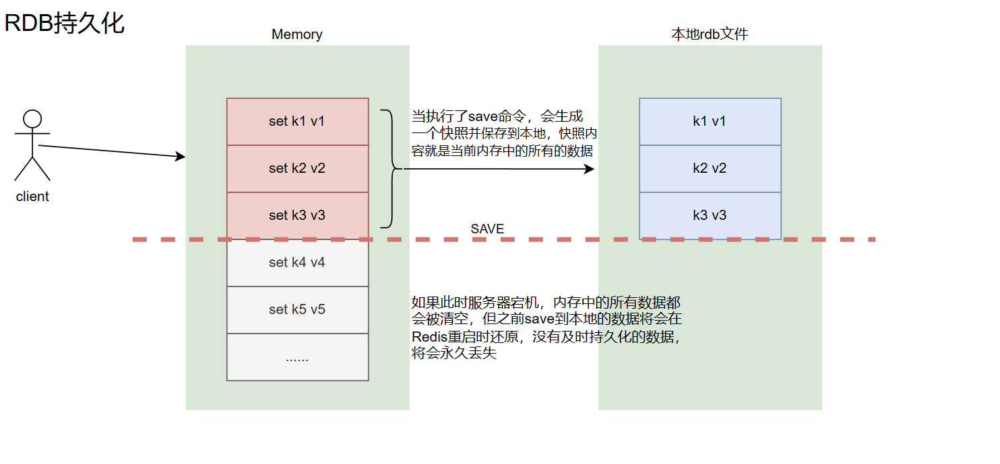

# Redis Persistence

So-called persistence means flushing the in-memory data to the local disk, so as to achieve the goals of persistence and data recovery.

In Redis, there are two persistence methods: RDB snapshotting and AOF (append-only file).

## RDB

There are two ways to trigger persistence: manual triggering and automatic triggering.

However it is triggered, the data is written to the same RDB file in an overwrite fashion. That is, with RDB, there is only ever one persistence file, which is convenient to manage.

### Manually Triggering Persistence

- `save`, a synchronous command — it occupies the main Redis process. During the execution of `save`, Redis will block all client requests, so when the data volume is very large, this command is not recommended.
- `bgsave`, an asynchronous command — Redis uses Linux's `fork()` to spawn a child process to do the persistence work, while the main process continues to provide other services. (Recommended)



For manual triggering, you only need to configure it in the configuration file (note the read/write permissions):

```bash
dir "/data/redis6379/"   # 持久化文件保存的目录，目录位置可以更改为其它目录
dbfilename redis6379.rdb   	 # 持久化文件名，可以带端口号也可以不带，文件名也可以随意，只要是.rdb结尾就行


# 执行命令
mkdir -p /data/redis6379/
chmod 777 /data/redis6379
vim /opt/redis6379/conf/redis6379.conf

# 添加如下配置
dir "/data/redis6379/"
dbfilename redis6379.rdb
```

Simulated operation:

```bash
redis-cli set k1 v1
redis-cli set k2 v2
redis-cli set k3 v3
redis-cli SAVE
redis-cli set k4 v4
redis-cli set k5 v5
redis-cli keys \*
pkill -9 redis
systemctl start redis
redis-cli keys \*

[root@cs ~]# redis-cli set k1 v1
OK
[root@cs ~]# redis-cli set k2 v2
OK
[root@cs ~]# redis-cli set k3 v3
OK
[root@cs ~]# redis-cli SAVE
OK
[root@cs ~]# redis-cli set k4 v4
OK
[root@cs ~]# redis-cli set k5 v5
OK
[root@cs ~]# redis-cli keys \*
1) "k1"
2) "k4"
3) "k2"
4) "k5"
5) "k3"
[root@cs ~]# pkill -9 redis
[root@cs ~]# systemctl start redis
[root@cs ~]# redis-cli keys \*
1) "k2"
2) "k3"
3) "k1"
# 丢了两条数据
```

Comparison of `save` and `bgsave`:

| Command  | save                   | bgsave                                 |
| :------- | :--------------------- | :------------------------------------- |
| I/O type | Synchronous            | Asynchronous                           |
| Blocking | Yes                    | Yes (blocking occurs in the `fork()` phase, but it is usually very fast) |
| Complexity | O(n)                 | O(n)                                   |
| Advantages | Does not consume extra memory | Does not block client commands         |
| Disadvantages | Blocks client commands | Requires forking a child process, consumes extra memory |

**In production, these two commands are generally not used; instead, the automatic triggering mechanism is used.**

### Automatically Triggering Persistence

Automatic triggering requires configuring the relevant trigger rules in the configuration file.

```bash
# RDB 自动持久化规则，当满足一下任意一个条件时，自动触发bgsave进行持久化
# 当然，你也可以自定义其它规则，比如 save 30 100 
# 当 900 秒内至少有 1 个key 被改动时，自动执行持久化操作
save 900 1

# 当 300 秒内至少有 10 个key 被改动时，自动执行持久化操作
save 300 10

# 当 60 秒内至少有 10000 个key被改动时，自动执行持久化操作
save 60 10000

# 数据持久化文件存储目录
dir "/data/redis6379/"

# RDB持久化文件名
dbfilename redis.rdb       # 持久化文件名，可以带端口号也可以不带，文件名也可以随意，只要是.rdb结尾就行

# bgsave过程中发生错误时，是否停止写入，通常为 yes
rdbcompression yes

# 是否对RDB文件进行校验，通常为 yes
rdbchecksum yes

# 最终拷贝这些命令到配置文件
vim /opt/redis6379/conf/redis6379.conf

dir "/data/redis6379/"
dbfilename redis.rdb
save 900 1
save 300 10
save 60 10000
rdbcompression yes
rdbchecksum yes

# 重启redis
systemctl restart redis
```

When you shut down the Redis service in any of the following three ways, it will automatically execute a `bgsave` before the process exits, and then exit:

```bash
SHUTDOWN
kill 2490		# 2490是redis进程id
pkill redis
```

In addition, when only RDB persistence is configured, restarting the Redis service will automatically read the RDB file to recover the data.

#### **Supplementary Notes on kill / pkill / pkill -9 / shutdown**

`kill` kills a process by process ID. Its default parameter actually sends a -15 signal, i.e., it notifies the process to exit; before exiting, the process can clean up and release resources.
`pkill` kills a process by process name. It also sends a -15 signal by default, i.e., it notifies the process to exit; before exiting, the process can clean up and release resources.
The -9 parameter, on the other hand, forcibly kills the process directly.

So with redis, you can shut it down via `kill`, `pkill`, or `shutdown` — behind the scenes, these all notify the process to exit, and before exiting, redis automatically executes a `bgsave`, taking a snapshot and saving the data locally.

If you use `pkill -9 redis`, the redis process is killed directly, and the `bgsave` command is never triggered, so data loss is not surprising.

Therefore, in production, do not use the `-9` parameter with redis.

## AOF

RDB persistence is not perfect: if Redis goes down for some reason, it will lose the data that was written most recently but not yet saved to a snapshot.
Starting with Redis 1.1, AOF was added to make up for RDB's shortcomings.
The working mechanism of AOF persistence is that every time Redis executes a command that modifies the dataset, that command is appended to the end of the AOF file. When recovering data, you simply replay the AOF file.

Main parameters:

```bash
# 是否开启aof，默认是no
appendonly no

# 触发持久化的条件
appendfsync always/everyesc/no
```

Where:

- `appendonly`: whether to enable AOF persistence, `yes`/`no`, default `no`.
- `appendfsync`: the condition that triggers persistence. There are three options:
  - `always`: records every time the dataset is modified. Slow but very safe.
  - `everysec`: fsync once per second. Fast enough (about the same as RDB persistence), and even in the event of a fault, only 1 second of data is lost. This strategy is recommended (and is the default), as it balances speed and safety.
  - `no`: lets the operating system decide when to sync data. This option is rarely used.

### The AOF Rewrite Mechanism

Because AOF keeps appending commands to the end of the file, the file grows larger and larger, and it also stores many duplicate commands, which could be replaced by a single command or very few commands...
To optimize this, Redis supports rebuilding the AOF file without interfering with normal client requests. That is, executing the `bgrewriteaof` command generates a new AOF file that contains the minimum set of commands needed to rebuild the current dataset.
Before Redis 2.2, you had to execute the `bgrewriteaof` command manually. This command asynchronously performs an AOF rewrite operation, creating an optimized version of the current AOF file. Even if `bgrewriteaof` fails, no data is lost, because the old AOF file is not modified or overwritten until `bgrewriteaof` succeeds.
From Redis 2.4 onwards, automatic AOF rewrite can be configured.
Characteristics of the AOF rewrite mechanism: it reduces the disk space occupied by the AOF file, and it speeds up data recovery.

Example (pseudo-file):

```bash
redis-cli	 	aof记录	 	   redis⾥的数据
set k1 v1 		set k1 k1		k1/v1

set k2 v2 		set k1 v1		k1/v1
		 		set k2 v2		k2/v2

set k3 v3 		set k1 v1		k1/v1
		 		set k2 v2		k2/v2
		 		set k3 v3 		k3/v3

del k1			set k1 v1		k2/v2
				set k2 v2		k3/v3
				set k3 v3
				del k1

del k2			set k1 v1		k3/v3
				set k2 v2
				set k3 v3
				del k1
				del k2

# 问题来了，此时aof中，有意义的记录只有一条：
				set k3 v3
```

So, if the AOF file is very large, situations like this are numerous, and a rewrite is needed to prune the useless commands.

Other parameters:

```bash
# 是否开启aof，默认是no
appendonly no

# 触发持久化的条件
appendfsync always/everyesc/no

# 数据持久化文件存储目录，如果单独使用aof，那么配置项就需要加上dir，如果同时使用了rdb，有了dir参数，aof这里则直接指定文件名即可
dir "/data/redis_data/6379"

# 是否在执行重写时不同步数据到AOF文件
# 这里的 yes，就是执行重写时不同步数据到AOF文件
no-appendfsync-on-rewrite yes

# 触发AOF文件执行重写的最小尺寸，如果将来真的用这个参数，且重度使用redis，则这个64兆就太小了，你可以调整以G为单位
auto-aof-rewrite-min-size 64mb

# 触发AOF文件执行重写的增长率
auto-aof-rewrite-percentage 100


# aof文件保存位置,
# dir "/data/redis6379/"
appendfilename "redis.aof"		


# 最终拷贝这些命令到配置文件
vim /opt/redis6379/conf/redis6379.conf

appendonly yes
appendfsync everysec
appendfilename "redis.aof"	
auto-aof-rewrite-percentage 100
auto-aof-rewrite-min-size 64mb
no-appendfsync-on-rewrite yes

# 重启redis
systemctl restart redis
```

Regarding AOF rewrite: when the size of the AOF file is larger than 64MB, and the AOF file's size has grown by at least 100% (i.e., doubled) compared to its size after the last rewrite, Redis will execute the `bgrewriteaof` command to rewrite it. Of course, this command can also be executed manually.

### RDB and AOF Priority

When both AOF and RDB exist, redis will read the AOF data first for recovery.

### How Does Redis Handle Keys with an Expiration Time in AOF on Restart?

During Redis startup, when recovering data from the AOF file, if a key that has expired is encountered, Redis will check whether it has expired, and if it has, it will be treated as expired.

#### **Advantages of AOF**

- Using AOF makes your Redis more durable: you can use different fsync strategies — fsync on every write. With the default per-second fsync strategy, Redis's performance is still good (fsync is handled by a background thread, while the main thread tries its best to handle client requests), and in the event of a fault, you lose at most 1 second of data.
- The AOF file is an append-only log file. Even if a full write command is not executed for some reason (disk full, crash mid-write, etc.), you can use the `redis-check-aof` tool to repair these problems. (It is not actually very easy to use.)
- Redis can automatically rewrite the AOF in the background when the file becomes too large: the rewritten new AOF file contains the minimum command set needed to recover the current dataset. The entire rewrite operation is absolutely safe, because while Redis is creating the new AOF file, it continues to append commands to the existing AOF file; even if a downtime occurs during the rewrite, the existing AOF file is not lost. And once the new AOF file is created, Redis switches from the old AOF file to the new one and begins appending to the new AOF file.
- The AOF file stores all write operations performed on the database in an orderly manner, and these write operations are saved in Redis protocol format, so the content of the AOF file is very easy for people to read and easy to parse. Exporting the AOF file is also very simple: for example, if you accidentally execute the `FLUSHALL` command, as long as the AOF file has not been rewritten, you can stop the server, remove the `FLUSHALL` command at the end of the AOF file, and restart Redis to restore the dataset to the state before `FLUSHALL` was executed.

#### **Disadvantages of AOF**

- For the same dataset, the AOF file is usually larger than the RDB file.

## Comparison of RDB and AOF:

| Option               | RDB    | AOF          |
| :------------------- | :----- | :----------- |
| Data recovery priority | Low    | High         |
| Size                 | Small  | Large        |
| Recovery speed       | Fast   | Slow         |
| Data safety          | Data loss | Depends on the strategy |

So how should AOF and RDB be used in production?

- The official recommendation is to enable both. In a master/replica environment, you can enable only AOF on the master and only RDB on the replicas for backup.
- If you are not sensitive to data loss, you can choose RDB alone.
- Using AOF alone is not recommended, because there may be bugs.
- If you are only using Redis as a pure in-memory cache, you can use neither.

Performance recommendations:

- Since the RDB file is usually only used as a backup, in a master/replica environment it is recommended to persist the RDB file only on the slave, and a backup every 15 minutes is enough — keep only the `save 900 1` rule.
- The costs: first, it brings continuous I/O; second, at the end of an AOF rewrite, the blocking caused by writing the new data generated during the rewrite into the new file is almost unavoidable.
- As long as the disk allows, you should reduce the frequency of AOF rewrites. The default base size for AOF rewrite, 64M, is too small; you can set it to 5G or above.
- The default "rewrite when the size exceeds 100% of the original size" can be changed to an appropriate value.

Finally, if both RDB and AOF are configured, Redis will prefer the AOF file for data recovery. What if you want to use RDB for recovery instead? You can disable AOF in the configuration file first, restart Redis, recover the data, and then enable AOF online.
