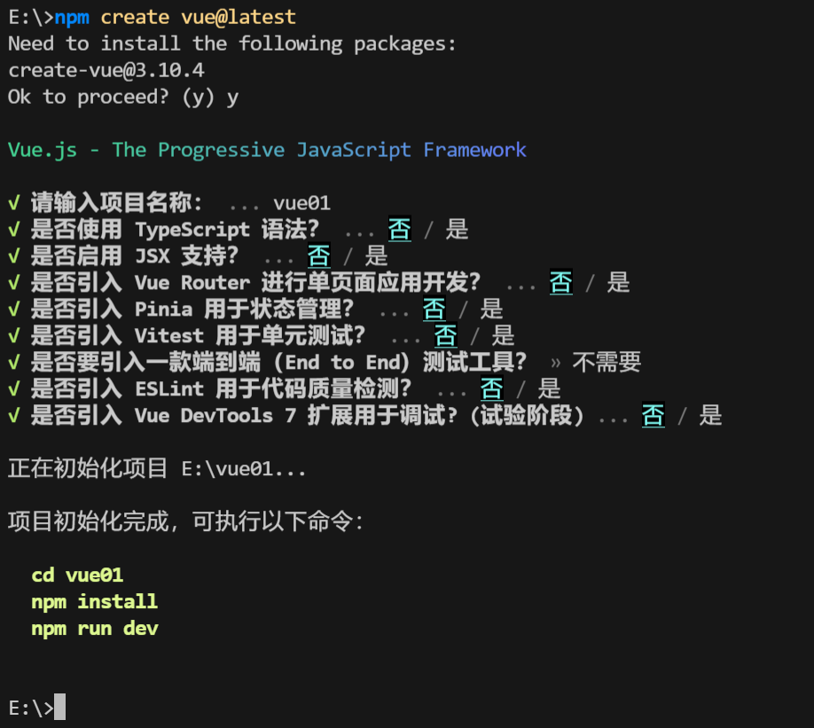
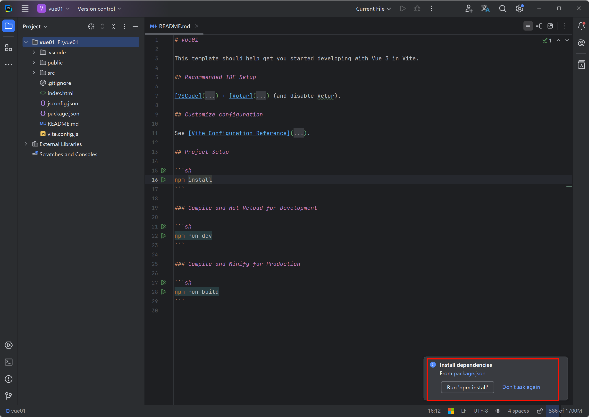
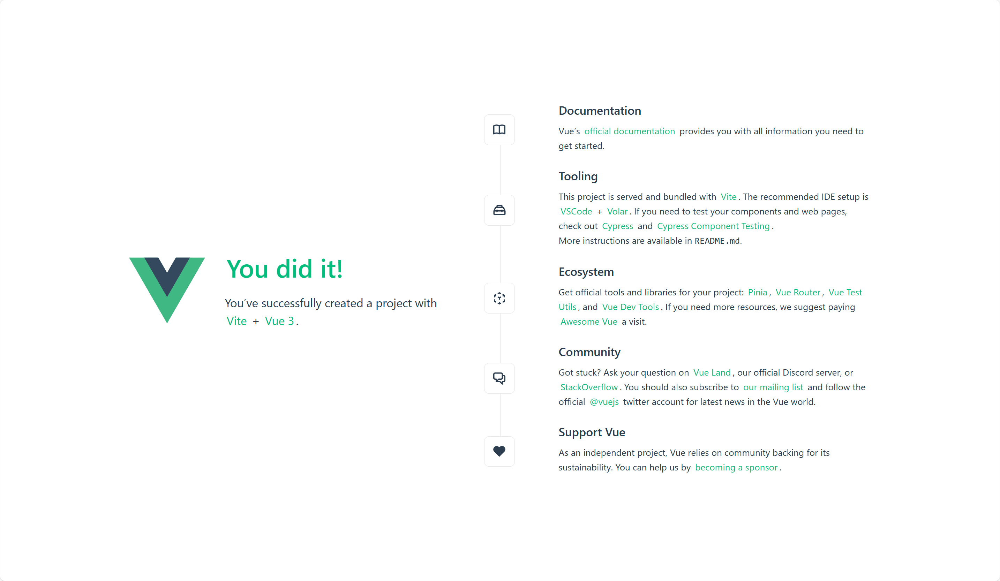
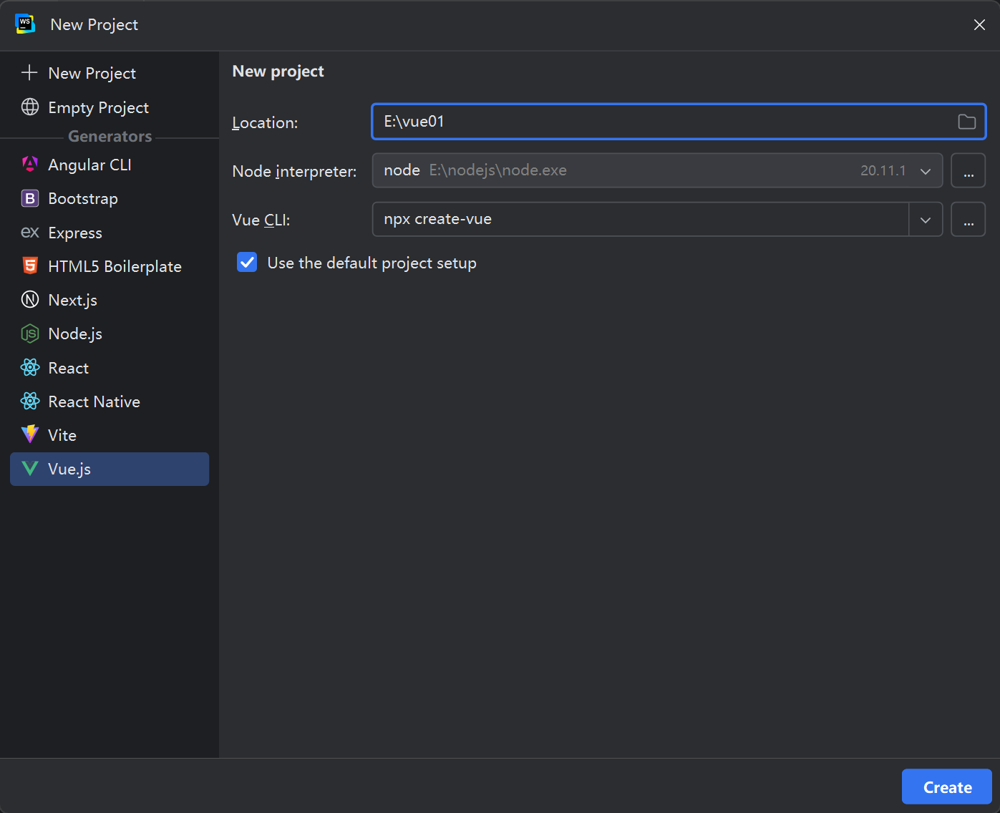
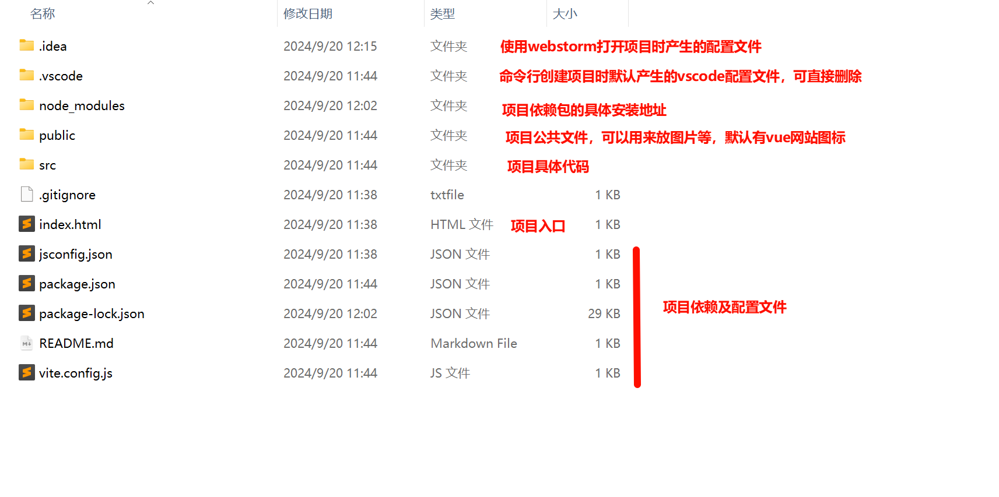
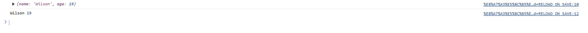
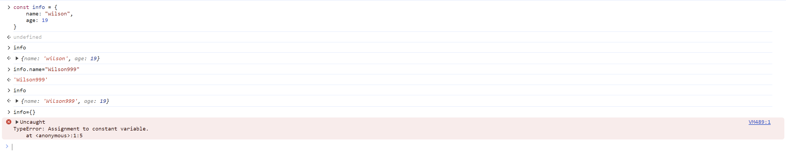
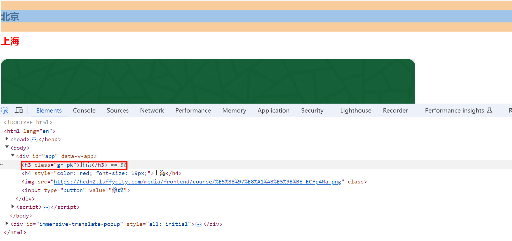

# Vue knowledge points

## Creating a Vue project

Two approaches:

- Import a JS file (if your network is slow in China, the second approach is recommended as it is faster)

  ```javascript
  <script src="https://unpkg.com/vue@3/dist/vue.global.js"></script>
  或
  <script src="https://cdn.bootcdn.net/ajax/libs/vue/3.3.4/vue.global.prod.js"></script>
  ```

  After importing the JS file, you need to register the corresponding element (such as a `div` block):

  ```html
  <div id="app"></div>
  
  <script>
      var app = Vue.createApp({});
  	app.mount("#app")
  </script>
  ```

  At this point a Vue project is considered set up. However, this makes scaffolding a project rather cumbersome, so we usually use Vite to build Vue projects.

- Use the project build tool Vite (**recommended**)

  Press win+R, type cmd, and navigate to the drive or folder where you want to create the project.

  Run the command `npm create vue@latest`

  

  Vue Router, Pinia, and ESLint will all be used in later development, so leave them uninstalled for now.

  After opening the project in WebStorm, run `npm install` to install the project dependencies.

  

  After installation, run `npm run dev` and you'll see that the project is up and running.

  

  You can also create a project directly with Vite in WebStorm:

  

  An explanation of the files generated after scaffolding the environment with Vite:

   When deploying the project later, simply run `npm run build` to compile all of the project's code into HTML, JS, CSS, and other files that can be placed directly on a server.


## Composition API and Options API

Both the Composition API and the Options API are provided by Vue. However, when writing projects we recommend the Options API, because it makes it easier to take advantage of the components Vue officially provides.

### Composition API

```html
<html lang="en">
<head>
    <meta charset="UTF-8">
    <title>Title</title>
    <script src="https://unpkg.com/vue@3/dist/vue.global.js"></script>
</head>
<body>

<div id="app">
    <h1>欢迎{{name}}-余额{{balance}}</h1>
    <input type="button" value="点击充值" @click="doCharge">
    <input type="button" value="双击充值" @dblclick="doCharge2">
</div>

<script>
	var app = Vue.createApp({
		data: function () {
			return {
				name: "Wilson",
				balance: 19
			}
		},
		methods: {
			doCharge: function () {
				alert("点击")
				this.name = "Wilson2"
			},
			doCharge2: function () {
				alert("双击")
				this.balance += 1000
			}
		}
	});
	app.mount("#app")
</script>

</body>
</html>
```

#### Code conventions

When using the Composition API, the code conventions we must follow are:

- All variables must be written in a dictionary keyed by `data` inside the created app; its value is a function whose return value is the variable we need:

  ```javascript
  var app = Vue.createApp({
  	data: function () {
  		return {
  			name: "Wilson",
  			balance: 19
  		}
  	},
  });
  ```

- All dynamic operations must be written as functions and placed in a dictionary keyed by `methods` inside the created app; its value is a function, and inside the function is the operation we need.

  Binding these operations requires Vue's predefined special values (such as `@click` for a single click, `@dblclick` for a double click, etc.), followed by the function name.

  When we need to modify a variable defined in `data` through a function in `methods`, we must use `this.` to reference the variable defined in `data`.

  ```html
  <div id="app">
      <h1>欢迎{{name}}-余额{{balance}}</h1>
      <input type="button" value="点击充值" @click="doCharge">
      <input type="button" value="双击充值" @dblclick="doCharge2">
  </div>
  
  <script>
  var app = Vue.createApp({
  	methods: {
  		doCharge: function () {
  			alert("点击")
  			this.name = "Wilson2"
  		},
  		doCharge2: function () {
  			alert("双击")
  			this.balance += 1000
  		}
  	}
  });
  </script>
  ```

### Options API (recommended)

Here I only cover the difference between the Options API and the Composition API.

```html
<html lang="en">
<head>
    <meta charset="UTF-8">
    <title>Title</title>
    <script src="https://unpkg.com/vue@3/dist/vue.global.js"></script>
</head>
<body>

<div id="app">
    <h1>欢迎{{name}}-余额{{balance}}</h1>
    <input type="button" value="点击充值" @click="doCharge">
    <input type="button" value="双击充值" @dblclick="doCharge2">
</div>

<script>
	var app = Vue.createApp({
		setup: function () {
			var name = Vue.ref("Wilson")
			var balance = Vue.ref(1000)
			var doCharge = function () {
				name.value = "Wilson999"
				balance.value = 999
			}
			var doCharge2 = function () {
				balance.value += 1000
			}
			return {name, balance, doCharge, doCharge2}
		},
	}); 
	app.mount("#app")
</script>

</body>
</html>
```

#### Code conventions

- All variables and functions to be used must be placed in a function keyed by `setup` (no `data` or `methods` needed); all variable names and function names must be returned before they can be used in the HTML:

  ```js
  var app = Vue.createApp({
  	setup: function () {
  		var name = Vue.ref("Wilson")
  		var balance = Vue.ref(1000)
  		var doCharge = function () {
  			name.value = "Wilson999"
  			balance.value = 999
  		}
  		var doCharge2 = function () {
  			balance.value += 1000
  		}
  		return {name, balance, doCharge, doCharge2}
  	},
  });
  ```

- When we need to modify a variable, we must wrap it with `Vue.ref`. You can think of it as turning the variable into an object; the `.value` of that variable is its actual value, so when modifying it you also need to modify the `.value` (no need to use `this.`).

  ```js
  var app = Vue.createApp({
  	setup: function () {
  		var name = Vue.ref("Wilson")
  		var balance = Vue.ref(1000)
  		var doCharge = function () {
  			name.value = "Wilson999"
  			balance.value = 999
  		}
  		var doCharge2 = function () {
  			balance.value += 1000
  		}
  		return {name, balance, doCharge, doCharge2}
  	},
  });
  ```

#### Note (incomplete — will be added later after learning Vite scaffolding)

When using the Composition API, we have to define functions in `setup` and return values every time, which is a bit tedious.

Vue also provides a simpler way: we can write `setup` inside `<script>`, so we don't need to define and return a function — all defined variables are returned automatically. The content wrapped by `<script setup></script>` is exactly the variables and return values that would have been defined in the original `setup` function. The original code can be modified as follows:

(This approach only applies to Vue projects built with Vite.)

```html
<html lang="en">
<head>
    <meta charset="UTF-8">
    <title>Title</title>
    <script src="https://unpkg.com/vue@3/dist/vue.global.js"></script>
</head>
<body>

<div id="app">
    <h1>欢迎{{name}}-余额{{balance}}</h1>
    <input type="button" value="点击充值" @click="doCharge">
    <input type="button" value="双击充值" @dblclick="doCharge2">
</div>

<script setup>
	var name = Vue.ref("Wilson")
	var balance = Vue.ref(1000)
	var doCharge = function () {
		name.value = "Wilson999"
		balance.value = 999
	}
	var doCharge2 = function () {
		balance.value += 1000
	}
</script>

</body>
</html>
```

### Extended syntax

- Function shorthand

  When we need to write a function, we can use `doCharge() {}` as a shorthand; this is equivalent to `doCharge: function () {}`.

- Destructuring

  A small example:

  ```html
  <html lang="en">
  <head>
      <meta charset="UTF-8">
      <title>Title</title>
  </head>
  <body>
  <script>
  	var Vue = {name: "Wilson", age: 19}
  	console.log(Vue)
  	var {name, age} = Vue
  	console.log(name, age)
  </script>
  
  </body>
  </html>
  ```

  

  We can extract the parts of the Vue package we need from `Vue`, so that when writing code below we don't have to prefix everything with `Vue.`.

  ```html
  <script>
  	const {createApp, ref} = Vue
  	var app = createApp({
  		setup: function () {
  			var name = ref("Wilson")
  			var balance = ref(1000)
  			var doCharge = function () {
  				name.value = "Wilson999"
  				balance.value = 999
  			}
  			var doCharge2 = function () {
  				balance.value += 1000
  			}
  			return {name, balance, doCharge, doCharge2}
  		},
  	});
  	app.mount("#app")
  </script>
  ```

- Imports

  We can import the specific packages we need from a JS file or a CDN.

  **Note**: `<script type="module">`

  ```html
  <script type="module">
  	import { createApp, ref } from 'https://unpkg.com/vue@3/dist/vue.esm-browser.js'
  	import { createApp, ref } from './js/vue.js'
  </script>
  ```


## Constants and variables (var and const)

var refers to a variable, while const refers to a constant. Variables can be modified, but constants cannot.

(So when we use them, we can just use var consistently.)

In particular, when we use const to define an object, replacing that object with a different object is not allowed; however, changing some of the key-value pairs inside it is fine.



## Reactivity basics (Composition API only)

In Vue, constants and variables cannot be modified directly. When we need to modify them, there are two approaches: `ref` and `reactive`.

- ref

  ```html
  <div id="app">
      <h1>欢迎{{name}}-余额{{balance}}</h1>
      <h1>{{info.city}}-{{info.size}}</h1>
      <input type="button" value="修改" @click="doChange">
  </div>
  
  <script>
  	const {createApp, ref} = Vue
  	var app = createApp({
  		setup: function () {
  			var name = ref("Wilson")
  			var balance = ref(1000)
  			var info = ref({
  				city: "北京",
  				size: 1000
  			})
  			var doChange = function () {
  				name.value = "Wilson999"
  				balance.value = 999
  				info.value.city = "广州"
  				info.value.size = 999
                  // ref还支持整体修改
  				info = {
  					city: "南京",
  					size: 666
  				}
  			}
  			return {name, balance, info, doChange}
  		},
  	});
  	app.mount("#app")
  </script>
  ```

- reactive

  After using `reactive`, you don't need `.value` when modifying values inside an object.

  **Note**: reactive does not support strings or integers inside it; it only supports lists and objects (objects placed inside). Also, it cannot be replaced as a whole.

  ```html
  <div id="app">
      <h1>欢迎{{name}}-余额{{balance}}</h1>
      <h1>{{info.city}}-{{info.size}}</h1>
      <input type="button" value="修改" @click="doChange">
  </div>
  
  <script>
  	const {createApp, ref, reactive} = Vue
  	var app = createApp({
  		setup: function () {
  			var name = ref("Wilson")
  			var balance = ref(1000)
  			var info = reactive({
  				city: "北京",
  				size: 1000
  			})
  			var doChange = function () {
  				name.value = "Wilson999"
  				balance.value = 999
  				info.city = "广州"
  				info.size = 999
  			}
  			return {name, balance, info, doChange}
  		},
  	});
  	app.mount("#app")
  </script>
  ```

## Interpolation

Interpolation is a way Vue provides for binding data in HTML templates. Using the `{{ variableName }}` syntax, you bind to the data variables in the Vue instance's `data`. The bound data is displayed in real time.

Note: the area enclosed by `{{}}` is a JS syntax region, where some JS syntax can be written. However, expressions cannot define variables or functions, and `if` conditions, loops, branch statements, or loop statements cannot be written either.

```html
<div id="app">
    <h1>欢迎{{name}}-余额{{balance}}</h1>
    <h1>{{info.city}}-{{info.size}}</h1>
    <input type="button" value="修改" @click="doChange">
    <hr>
    <ul>
        <li>{{"中国北京"}}</li>
        <li>{{"Wilson" + "中国北京"}}</li>
        <!--三元表达式-->
        <li>{{1 === 1 ? "Ture" : "False"}}</li>
        <li>{{balance > 500 ? "Ture" : "False"}}</li>
    </ul>
</div>
<script>
	const {createApp, ref, reactive} = Vue
	var app = createApp({
		setup: function () {
			var name = ref("Wilson")
			var balance = ref(100)
			var info = reactive({
				city: "北京",
				size: 1000
			})
			var doChange = function () {
				balance.value += 100
			}

			return {name, info, balance, doChange}
		},
	});
	app.mount("#app")
</script>
```

## The v-bind directive

When we need to change certain attributes of a tag, ordinary interpolation can no longer meet our needs.

For example, with the `src` attribute of an `img` tag, if we use ordinary interpolation, the page will just render a string. In that case, we need the `v-bind` directive to modify **the attributes of a specific tag**.

Similarly, the `v-bind` directive also supports ternary expressions.

**Note**: `v-bind:class="[]"` takes a list, while `v-bind:style="{}"` takes an object.

```HTML
<!DOCTYPE html>
<html lang="en">
<head>
    <meta charset="UTF-8">
    <title>Title</title>
    <style>
        .red {
            border: 5px solid red;
        }
    </style>
    <script src="https://cdn.bootcdn.net/ajax/libs/vue/3.3.4/vue.global.prod.js"></script>
</head>
<body>

<div id="app">
    <h3 v-bind:class="[green, pink]">北京</h3>
    <h4 v-bind:style="{color:'red', fontSize: '19px'}">上海</h4>
    
    <input type="button" value="修改" @click="doCharge">
</div>


<script>
	const {createApp, ref, reactive} = Vue
	var app = createApp({
		setup: function () {
			var url = ref("https://hcdn2.luffycity.com/media/frontend/course/%E5%88%97%E8%A1%A8%E5%9B%BE_ECFp4Ma.png")
			var cls = ref("")
			var green = ref("gr")
			var pink = ref("pk")
			var doCharge = function () {
				url.value = "https://hcdn2.luffycity.com/media/frontend/course/%E5%88%97%E8%A1%A8%E5%9B%BE_07YhW0A.png"
				cls.value = "red"
			}
			return {url, cls,pink, green, doCharge}
		},
	});
	app.mount("#app")
</script>

</body>
</html>
```



## The v-model directive

The `v-model` directive is used with tags that interact with the user: `input`, `select`, `textarea`, etc.

Two-way binding:

- Composition API: use the `v-model` directive directly.
- Options API: `v-model` directive + ref/reactive.

Options API:

```html
<!DOCTYPE html>
<html lang="en">
<head>
    <meta charset="UTF-8">
    <title>Title</title>
    <script src="https://cdn.bootcdn.net/ajax/libs/vue/3.3.4/vue.global.prod.js"></script>
</head>
<body>

<div id="app">
    <h3>{{city}}</h3>
    <input type="text" placeholder="请输入指令" v-model="user">
    <h4>{{user}}</h4>
</div>

<script>
	const {createApp, ref, reactive} = Vue
	var app = createApp({
		setup: function () {
                const city= ref("北京")
                const user = ref("wilson")
			return {city, user}
		},
	});
	app.mount("#app")
</script>

</body>
</html>
```

Composition API:

```html
<!DOCTYPE html>
<html lang="en">
<head>
    <meta charset="UTF-8">
    <title>Title</title>
    <script src="https://cdn.bootcdn.net/ajax/libs/vue/3.3.4/vue.global.prod.js"></script>
</head>
<body>

<div id="app">
    <h3>{{city}}</h3>
    <input type="text" placeholder="请输入指令" v-model="user">
    <h4>{{user}}</h4>
</div>

<script>
	const {createApp, ref, reactive} = Vue
	var app = createApp({
		data: function () {
                return{
					user:"wilson"
                }
		},
	});
	app.mount("#app")
</script>

</body>
</html>
```

## The v-for directive

v-for is used for iterating over lists.

```html
<!DOCTYPE html>
<html lang="en">
<head>
    <meta charset="UTF-8">
    <title>Title</title>
    <script src="https://cdn.bootcdn.net/ajax/libs/vue/3.3.4/vue.global.prod.js"></script>
</head>
<body>

<div id="app">
    <div class="box">
        <ul>
            <li v-for="(item, idx) in cityList">{{idx}}-{{item}}</li>
        </ul>
    </div>
</div>

<script>
	const {createApp, ref, reactive} = Vue
	var app = createApp({
		setup: function () {
			    const cityList = ["北京", "上海" ,"深圳"]
			return {cityList}
		},
	});
	app.mount("#app")
</script>

</body>
</html>
```

## The v-show directive

v-show controls whether a tag is displayed.

```html
<!DOCTYPE html>
<html lang="en">
<head>
    <meta charset="UTF-8">
    <title>Title</title>
    <script src="https://cdn.bootcdn.net/ajax/libs/vue/3.3.4/vue.global.prod.js"></script>
</head>
<body>

<div id="app">
    <div>
        <button @click="show">展示</button>
    </div>
    <div v-show="isshow">
        <h1>Wilson</h1>
    </div>
</div>

<script>
	const {createApp, ref, reactive} = Vue
	var app = createApp({
		setup: function () {
            const isshow = ref(false)
            const show = function () {
                isshow.value = true
			}

			return {isshow, show}
		},
	});
	app.mount("#app")
</script>

</body>
</html>
```

## The v-if directive

v-if works like the v-show directive.

The difference is:

v-show keeps the element on the page but hides it using `display: none`;

v-if does not add the element to the page at all.

## The v-on directive

v-on is a directive for handling events, and it can be abbreviated.

Related events include: click, dbclick, mouseover, mouseover...

```html
<!DOCTYPE html>
<html lang="en">
<head>
    <meta charset="UTF-8">
    <title>Title</title>
    <script src="https://cdn.bootcdn.net/ajax/libs/vue/3.3.4/vue.global.prod.js"></script>
</head>
<body>

<div id="app">

    <h1 style="background-color:cornflowerblue;width: 300px;height: 400px " @mouseover="doSomething('进入')"
        @mouseout="doSomething('出去')">北京</h1>

</div>

<script>
	const {createApp, ref, reactive} = Vue
	var app = createApp({
		setup: function () {
			const doSomething = function (arg) {
				console.log(arg)
			}
			return {doSomething}
		},
	});
	app.mount("#app")
</script>

</body>
</html>
```

## Lifecycle


Official link: [Composition API: Lifecycle Hooks | Vue.js (vuejs.org)](https://cn.vuejs.org/api/composition-api-lifecycle.html#composition-api-lifecycle-hooks)

