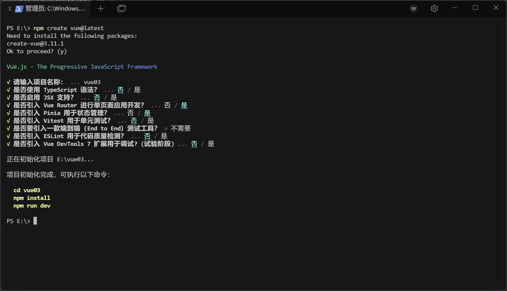

# vue-pinia component

When developing a project, we use many Vue components — how should components share data with each other?

Pinia is the official state management library. Compared to Vuex, it is more lightweight and easier to use.

Pinia acts as a proxy that shares data and information across different components.

It has three state management members:

- state: state values
- getter: computed properties
- action: defines methods (functions)

## Installation

The default installation method is recommended, as it lets you skip manual configuration.



## Basic usage

The generated file is located at `stores/counter.js` in the project root.

```js
import { ref, computed } from 'vue'
import { defineStore } from 'pinia'

export const useCounterStore = defineStore('counter', () => {
  const count = ref(0)
  const doubleCount = computed(() => count.value * 2)
  function increment() {
    count.value++
  }

  return { count, doubleCount, increment }
})

```

Here, `count` corresponds to state, `doubleCount` to getter, and `increment` to action.

To use it in other Vue components, simply import it:

```vue
<script setup>
import {useCounterStore} from "@/stores/counter.js";

const store = useCounterStore()
console.log(store.count)
console.log(store.doubleCount)
</script>
```

**Note**: Pinia components reset to their initial values after a page refresh, so they should be used together with local storage (localStorage + cookie).

## User login logic

stores/counter.js

```js
import {ref, computed} from 'vue'
import {defineStore} from 'pinia'

export const useInfoStore = defineStore('useInfoStore', () => {
	const userString = ref(localStorage.getItem("info"))
	const userDict = computed(() => userString.value ? JSON.parse(userString.value) : null)

	const userID = computed(() => userString.value ? userDict.value.id : null)
	const userName = computed(() => userString.value ? userDict.value.name : null)
	const userToken = computed(() => userString.value ? userDict.value.token : null)

	function doLogin(info) {
		// info={id:1, name:"wilson", token:"xxx"}
		// 登录成功后，用户信息写到本地存储，并同步到pinia中；当页面刷新时，pinia可以重新去localStorage中获取用户信息
		localStorage.setItem("info", JSON.stringify(info))
		userString.value = JSON.stringify(info)
	}

	function doLogout() {
		localStorage.clear()
		userString.value = null
	}

	return {userString, userID, userName, userToken, doLogin, doLogout}
})
```

LoginView.vue

```js
import {useInfoStore} from "@/stores/counter.js";
const router = useRouter()

function doLogin() {
  // 发送网络请求
  // pinia存储用户信息
  const store = useInfoStore()
  let info = {id:1, name:username.value, token:"xxx"}
  store.doLogin(info)
  // 成功后跳转
  router.push({name: "mine"})
}

function doLogout() {
  store.doLogout()
  router.push({"name": "login"})
}
```

Combined with navigation guards, this fully implements the user login logic.

router/index.js

```js
import {useInfoStore} from "@/stores/counter.js";

router.beforeEach((to, from, next) => {
  if(to.name == "login") {
    next()
    return
  }
  const store = useInfoStore()
  if (!store.userID) {
    next({name: "login"})
    return
  }
  next()
})
```

