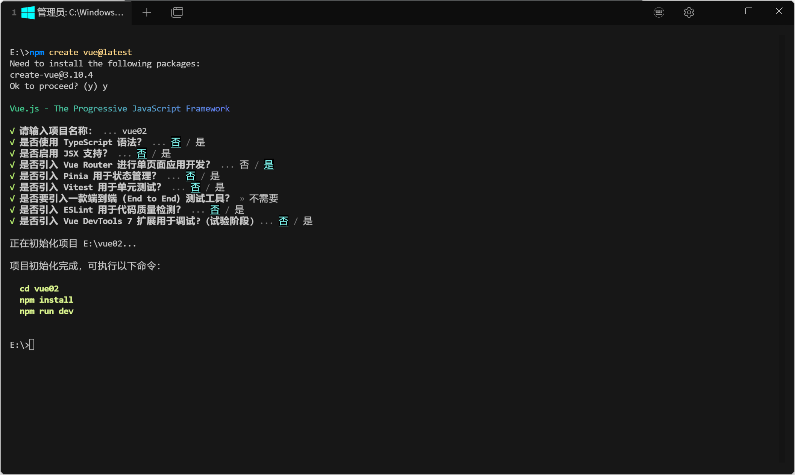
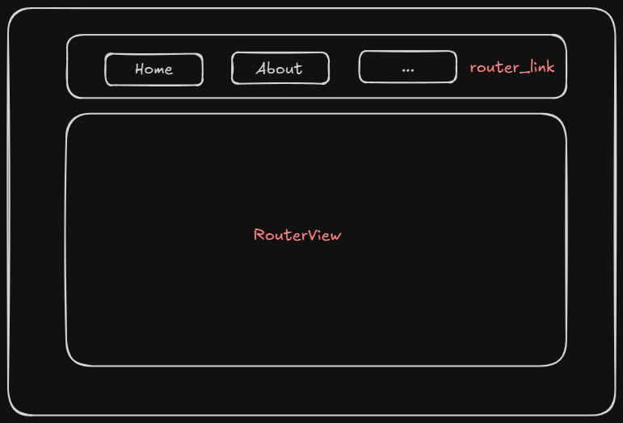
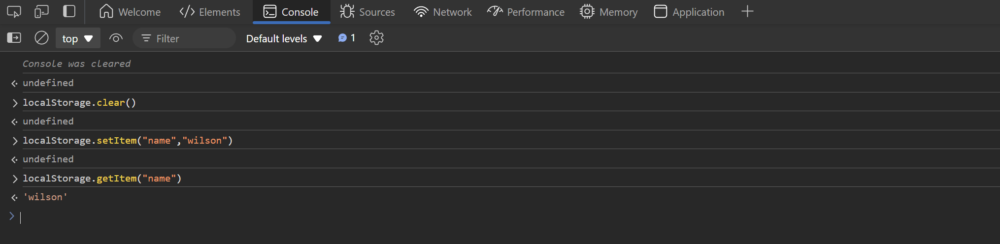

# vue-router component

vue-router enables single-page applications (one website, one page) by loading different components.

Effect: clicking different buttons displays different information.

## Installation

- `npm install vue-router` + manual configuration

- Install vue-router when creating the project (automatic configuration)

  

## Usage

First, look at the App.vue file: `router-link` is the navigation bar; the content shown after clicking and navigating is rendered in `RouterView`. The specific path in `router-link` is the route being accessed.

```vue
<script setup>
import { RouterLink, RouterView } from 'vue-router'

</script>

<template>

    <div>
      <router-link to="/">Home</router-link>
      <router-link :to="{name: 'about'}">About</router-link>
    </div>

  <RouterView />
</template>

<style scoped>

</style>
```



The specific route paths rendered in `RouterView` are defined in the router config file `index.js`.

```js
import { createRouter, createWebHistory } from 'vue-router'
const router = createRouter({
  history: createWebHistory(import.meta.env.BASE_URL),
  routes: [
    {
      path: '/',
      name: 'home',
      component: () => import('../views/HomeView.vue')
    },
    {
      path: '/about',
      name: 'about',
      component: () => import('../views/AboutView.vue')
    },
    {
      path: '/demo/:id',
      name: 'demo',
      component: () => import('../views/DemoView.vue')
    }
  ]
})

export default router
```

When we need to carry parameters on a route, there are two methods.

```vue
<script setup>
import { RouterLink, RouterView } from 'vue-router'

</script>

<template>

    <div>
      <router-link to="/?v1=123&v2=456">Home</router-link><!--方法一-->
      <router-link :to="{name: 'about', query: {v1:123, v2:456}}">About</router-link><!--方法二-->
      <router-link :to="{name: 'demo', params: {id:1}}">About</router-link><!--方法三-->
    </div>

  <RouterView />
</template>

<style scoped>

</style>

```

To receive the parameters carried on a route, import `useRoute` from vue-router; once the object is created, `route.query` is the parameter passed in the route.

```vue
<script setup>
import {useRoute} from "vue-router";
const route = useRoute()
console.log(route.query) // 方法一方法二
console.log(route.params) // 方法三  
</script>
```

**Note:** When navigating via routes, if the current component navigates to itself, the component parameters will not be reloaded even if the URL changes.

Solution: use `onBeforeUpdate()`, and write a function in the parentheses that takes 2 parameters: to and from (from indicates where you came from, to indicates where you are going).

```vue
<script setup>
import {onBeforeUpdate} from "vue";

onBeforeUpdate((to, from) => {
  console.log(to, from)
  console.log(to.query)
})

</script>
```


## Nested routes

vue-router supports route nesting.

```js
// router/index.js
import { createRouter, createWebHistory } from 'vue-router'
const router = createRouter({
  history: createWebHistory(import.meta.env.BASE_URL),
  routes: [
    {
      path: '/',
      name: 'home',
      component: () => import('../views/HomeView.vue'),
      children: [
        {
          path: 'home1',
          name: 'home1',
          component: () => import('../views/HomeView.vue')
        },
        {
          path: 'home2',
          name: 'home2',
          component: () => import('../views/HomeView.vue')
        },
      ]
    },
  ]
})

export default route
```

With the above configuration, the accessible routes are `/home/home1` and `/home/home2`.

When we visit the parent route, should a child route be displayed? Or should a child route be shown by default?

There are two solutions here:

```js
import { createRouter, createWebHistory } from 'vue-router'
const router = createRouter({
  history: createWebHistory(import.meta.env.BASE_URL),
  routes: [
    {
      path: '/admin',
      name: 'admin',
      component: () => import('../views/AdminView.vue'),
      children: [
        {
          path: "",
          redirect: {name: 'mine'},
          // component: () => import('../views/MineView.vue')
        },
        {
          path: 'mine',
          name: 'mine',
          component: () => import('../views/MineView.vue')
        },
        {
          path: 'order',
          name: 'order',
          component: () => import('../views/OrderView.vue')
        },
      ]
    }
  ]
})

export default router
```

- `redirect: {name: 'mine'}`: when visiting `/admin`, the mine page is shown by default, and the route becomes `/admin/mine`.
- `component: () => import('../views/MineView.vue')`: when visiting `/admin`, the mine page is shown by default, and the route stays `/admin`.

## useRouter (programmatic navigation)

If you don't want to use the `router-link` component to navigate between pages, you can also use `useRouter`.

```js
import {useRouter} from "vue-router";
const router = useRouter()
const router = useRouter()
router.push({path: "/admin/mine"})
router.push({name: "login"})
//也可以接收参数
router.push({name: "login", params: {nid: 100}, query:{page: 100}})
```

router.replace works the same way as router.push.
The difference:

- router.push (location) adds a new record to the history stack; when the user clicks the browser's back button, it returns to the previous URL.

- router.replace (location) does not add a new record to history; instead, it replaces the current history record.

## Navigation guards

from: where you came from; to: where you are going.

```js
import { createRouter, createWebHistory } from 'vue-router'
const router = createRouter({
  history: createWebHistory(import.meta.env.BASE_URL),
  routes: [
    {
      path: '/login',
      name: 'login',
      component: () => import('../views/LoginView.vue')
    },
    {
      path: '/info',
      name: 'info',
      component: () => import('../views/InfoView.vue')
    }
  ]
})
router.beforeEach(function (to, from, next){})//函数
router.beforeEach((to, from, next) => {})//函数简写
export default router
```

from: where you came from; to: where you are going.

Once `router.beforeEach` is defined, this function runs on every route navigation.

Here you can write logic to check whether the user is logged in, in order to determine whether certain pages are accessible to ordinary users, whether they have permission, and so on.

- Method 1: store the authenticated identity token (JWT) in the browser's local storage (localStorage).

  localStorage persists permanently, with no expiry.

  Additionally, here are several methods for using the browser's local storage (localStorage):

  ```js
  localStorage.setItem(key, value)
  localStorage.setItem(key)
  localStorage.removeItem(key)
  localStorage.clear()
  ```

- Method 2: save in a cookie, which supports setting an expiry.

  ```js
  document.cookies=...
  ```

- Method 3: sessionStorage.

  It is used in the same way as localStorage, but it is only valid while the browser is open — after closing the browser, sessionStorage is cleared.

  

A simple check:

If `username` cannot be retrieved, redirect to the login page; if login succeeded, call `next()` to continue navigating.

```js
router.beforeEach((to, from, next) => {
  let username = localStorage.getItem("name")
  if(!username) {
    next({name: "login"})
    return
  }
  next()
})
```

