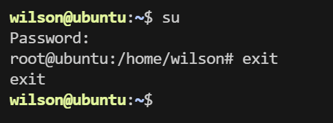
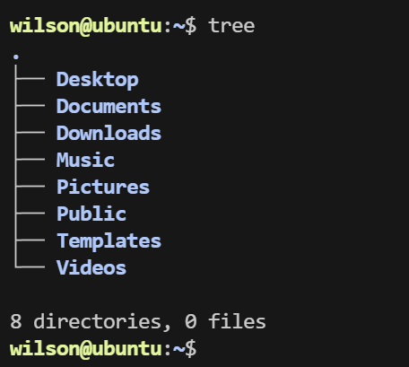

# Linux命令

## 用户配置

- 超级用户（root）：命令提示符**#**，在linux系统下做任何事情，无限制
- 普通用户：命令提示符**$**，对linux系统操作受限

新系统下，root用户无密码，使用`sudo passwd roo`t为root用户添加密码=

`sudo`权限提升：使用时，身份由普通用户 -> root

切换用户：`su 【用户名】`，不添加用户名，默认切换到root用户

root用户退出：`exit`

### 添加用户

`sudo useradd -m user1 -s /bin/bash`

系统会在目录“/home”下建立一个名为user1的目录
-m 创建目录
-s 指定使用的脚本解析器（bash业界最流行的脚本解析器）

### 配置密码

`sudo passwd user1`

密码配置完成后，用户user1就可以用自己的用户和密码登录服务器

### 删除用户

`sudo userdel -r user1`

## 目录及文件操作

### 查看文件及目录

`ls` 列出该指定目录下所有子文件和子目录

`ls -a` 显示指定目录下所有子目录与文件（显示隐藏文件，例如以.开头）

`ls -l` 列出指定目录下所有目录及文件的详细信息

`ls–l /home/wilson` 每行列出的详细信息依次是：

文件类型与权限 硬连接数 文件所有者 文件所属组 文件大小 最近修改时间 文件名字

Linux不以后缀来区分文件类型，后面的9个字符表示文件的访问权限，分为3组，每组3位

第一组表示文件创建者的权限，第二组表示同组用户的权限，第三组表示其他用户的权限。每一组的三个字符分别表示对文件的读、写、

执行权限

各权限如下：r（读）、w（写）、x（执行）、-（没有设置权限）。每一组可以用一个数字表示，例如r-x:5,rw-:6,r--:4， 那么这三组就可以用3个数字表示，例如rwxr-xr-x:755，rw-r--r--:644

### 改变工作目录

`cd` 改变工作目录

`cd ~` 切换到自己的工作目录 /home/wilson

`cd /` 切换到根目录

`cd - `切换到上一次目录

`. `表示当前目录

### 查看当前工作目录

`pwd` 查看当前目录

### 创建删除目录

`mkdir dir` 创建名为dir的文件夹，如果使用`sudo mkdir`，文件创建者就是root

`rmdir`删除文件，只要对当前文件或文件夹有删除权限，就可以进行删除，而不用管文件的所有者是谁

`rm -r` 删除文件夹

`rm -r *`删除文件夹下所有文件

`rm -rf` 删除文件夹下所有文件，且无提示

### 拷贝文件和目录

`cp file1 file2 `把指定的源文件复制到目标文件或把多个源文件复制到目标目录中

`cp -i file1 day/` 将file1文件复制到day文件夹下，如果文件名重复，则提醒

`cp -r /home/wilson /home/wilson1` 要拷贝一个目录，此时将同时拷贝该目录下的子目
录 和 文 件，目标文件也需要是一个目录

### 移动文件

`mv /home/file1 . `将文件夹home下文件file1移动到当前目录下

### 显示目录结构

### 改变目录或文件权限

`chmod` 控制文件或目录的访问权限

**数字设定法**

首先了解用数字表示的属性的含义：0表示没有权限，1表示可执行权限，2表示可写权限，4

表示可读权限，然后将其相加。所以数字属性的格式应为3个从0到7的八进制数，其顺序是

（u）（g）（o）。例如，如果想让某个文件的所有者有"读/写"二种权限，需要把4（可读）+2

（可写）＝6（读/写).

例如：`chmod 644 hello.txt`执行后得到`-rw-r--r-- 1 wilson wilson    6 Jun 18 `

`22:47 hello.txt`

- 文件所有者（wilson）有读写权限
- 与文件所有者同组人有读权限
- 其他人有读权限

### 文件查找

find查找条件可以是一个逻辑运算符not、and、or组成的复合条件

- and：逻辑与，在命令中用-a表示，表示只有当所给的条件都满足时，查找条件才满足
- or：逻辑或，在命令中用-o表示，表示只要所给的条有一个满足，查找条件就满足
- not：逻辑非，在命令中用！表示查找不满足所给条件的文件

常用查找条件

- `-empty` 查找大小为0的文件或者是空目录

- `-perm` 权限查找具有指定权限的文件和目录，权限的表示可以如711，644

- `-mmin n `查找n分钟以前文件内容被修改过的所有文件、

  `find . -mmin -60 `查找过去60分钟所修改的文件

- `-mtime n` 查找n天以前文件内容被修改过的所有文件

- `-xargs` 对符合条件的文件执行所给的Linux命令，而不询问用户是否需要执行该命令

  `find.-empty|xargsrm-rf`找到所有的空文件和空文件夹并删除

- `-size `查找指定文件大小的文件，+表示大于，-表示小于

  `find . -size +10M`查找大于10M的所有文件

### 列出文件系统整体磁盘空间使用情况

`df -h`

### 显示每个文件和目录的磁盘使用空间

`du -h`

`--max-depth=0`控制深度，最多往下统计多少个子目录，一般设置为`--max-depth=1`

操作发现目录的每一级都显示，如果只想显示当前目录，`du -h --max-depth=1 /home/wilson`

### 文件查看

`cat hello.txt` 查看hello.txt文件

`cat file1 > file2` 重定向输出

`echo wilson >> file1`添加输出

`touch a.txt`创建a.txt空文件

`head –n 10 main.cc`查看main.cc文件前10行

`tail –n 10 main.cc`查看main.cc文件后10行

`wc -l hello.txt`查看hello.txt文件总共多少行

### 搜索文件内容

grep过滤器查找指定字符模式的文件，并显示含有此模式的所有行

被寻找的模式称为正则表达式

`grep hello file1`在file1文件中查找hello，并显示含有hello的那一行

正则表达：

- `^`:以什么开头，例如`ls –l|grep ^d`显示当前目录下的所有子目录的详细信息
- `$`:以什么结尾，例如`ls –l|grep c$`显示当前目录下以c结尾的文件

`grep -n` 在输出前加上匹配串所在的行号

## 文档管理

### tar 文件压缩打包

常用参数：

- c：创建新的档案文件。
- x：从档案文件中释放文件。
- f：使用档案文件或设备。
- v：在归档过程中显示处理的文件。
- z：用gzip来压缩/解压缩文件，后缀名为.gz，加上该选项后可以将档案文件进行压缩。

例如：`tar czvf source.tar.gz /home/wilson/*`将wilson文件夹下所有文件压缩

### `gzip`文件解压缩

常用参数：

- -d：将压缩文件进行解压。
- -v：在压缩或解压过程中显示解压或压缩的文件。

### scp远程copy文件

`scp filename username@ip:path`

- filename：文件名称
- username：copy到的目标主机的用户名
- ip：目标主机IP
- path：目标主机路径

`scp file3 king@192.168.4.52:~/`从本机copy到其他机器

`scp king@192.168.4.52:~/file3 .`从其他机器copy到本机

如果scp的是文件夹，需要加-r

### 无密钥登录

- `ssh-keygen`生成密钥和公钥
    - Linux路径~/.ssh
    - windows路径C:\Users\Administrator\.ssh
- `ssh-copy-id wilson@192.168.43.142`公钥复制到服务器的authorized_keys

原理：

[ssh连接过程](https://ld246.com/article/1640830873031)

## 快捷键

Ctrl a 光标回到开头

Ctrl e 光标回到结尾

