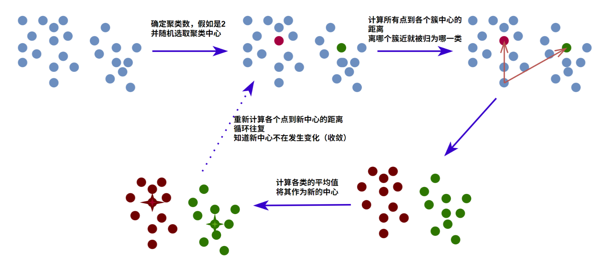
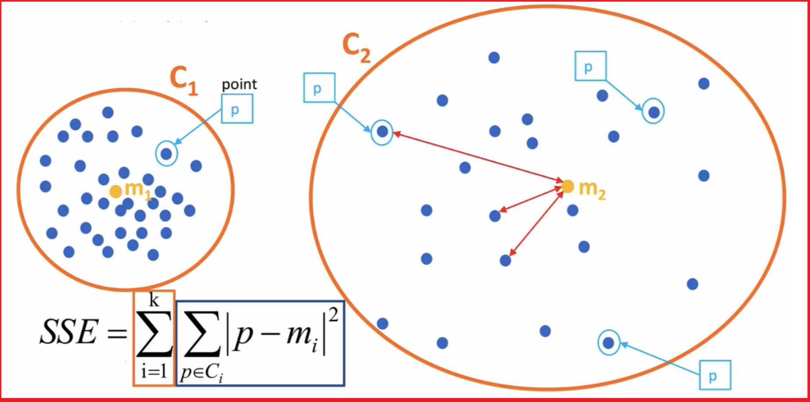
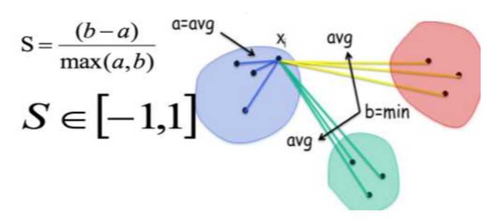
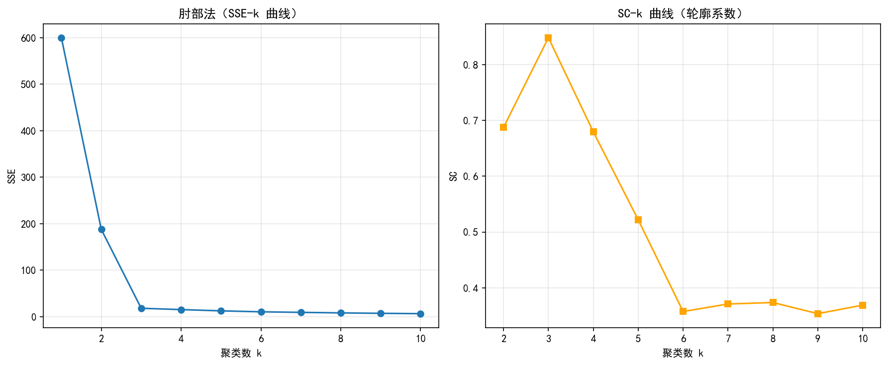

# 聚类算法

## k-means

K-means算法的实现流程：

- 事先确定常数K ，常数K意味着最终的聚类类别数
- 随机选择 K 个样本点作为初始聚类中心

- 计算每个样本到 K 个中心的距离（欧氏距离），选择最近的聚类中心点作为标记类别

> 📖 **什么是欧氏距离？**
>
> 欧氏距离（Euclidean Distance）就是我们日常生活中最常用的"直线距离"。
>
> 在二维平面上，点 $A(x_1, y_1)$ 到点 $B(x_2, y_2)$ 的欧氏距离：
> $$d = \sqrt{(x_1-x_2)^2 + (y_1-y_2)^2}$$
>
> 这就是勾股定理——直角三角形斜边的长度。
>
> 在三维空间（有3个特征），点 $A(x_1, y_1, z_1)$ 到 $B(x_2, y_2, z_2)$：
> $$d = \sqrt{(x_1-x_2)^2 + (y_1-y_2)^2 + (z_1-z_2)^2}$$
>
> 推广到d维（有d个特征）：
> $$d = \sqrt{(x_1-y_1)^2 + (x_2-y_2)^2 + ... + (x_d-y_d)^2}$$
>
> **直观理解**：K-means 就是把每个样本点"划给"离它最近的那个中心点，就像把居民分配到离家最近的快递站。
- 根据每个类别中的样本点，重新计算新的聚类中心点（均值）

> 📖 **什么是质心（聚类中心点）？**
>
> 质心 = 一个簇内所有样本点的**平均值**。
>
> 假设簇 $C_1$ 里有3个二维样本点：$(1, 2)$、$(3, 4)$、$(5, 6)$
>
> 质心 $m_1 = \left(\frac{1+3+5}{3}, \frac{2+4+6}{3}\right) = (3, 4)$
>
> 就是分别对 x 坐标和 y 坐标取平均。推广到 d 维：每个维度分别取平均。
>
> 这就是"均值"的含义——K-means 里的 **means** 指的就是取均值。

- 若新旧中心点不再变化，则停止迭代；否则返回第 2 步



K-means的关键在于： 

- 需要先确定簇的个数k
- 随机初始化k个中心点

- 不停地重新计算新的聚类中心点，也就是新的质心
- 每次根据新的中心点，依据（欧式）距离，对每个点进行重新分类
- 直到收敛，也就是不再选出新的中心点

### 模型评估方法

#### 簇内平方和（SSE）

所有样本到其所属簇质心的欧氏距离平方和（也是K-means 的目标函数）
$$
SSE=\sum_{i=1}^{k}\sum_{p\in{C_i}}||p-m_i||^2
$$
参数解释:

- $C_i$表示第 $i$ 个簇（比如第1个簇是"红色组"，第2个簇是"蓝色组"）

- $k$表示聚类中心的个数（你事先指定的，比如 k=3）
- $p$表示某个样本点（它的坐标）
- $m_i$表示第 $i$ 个簇内的中心点（质心）

  

- **取值意义**：SSE 越小，簇内样本越紧凑；**但随** **K** **增大** **SSE** **必然下降，需结合肘部法则判断最优 K（而非单独看SSE）**

> 📖 **SSE 公式拆解——逐层读懂**
>
> 这个公式有两层求和符号，用"剥洋葱"的方式读：
>
> **外层 $\sum_{i=1}^{k}$**：对所有 k 个簇求和。先看第1个簇，再看第2个簇...最后把每个簇的结果加起来。
>
> **内层 $\sum_{p\in{C_i}}$**：对第 i 个簇里的所有样本点求和。
>
> **$||p-m_i||^2$**：样本点 p 到它所属簇的质心 $m_i$ 的欧氏距离的平方。
>
> ---
>
> **数值举例**：假设 k=2，有两个簇：
>
> 簇1（$C_1$）：质心 $m_1=(0, 0)$，样本点 $(1, 0)$、$(0, 1)$
> - $(1,0)$ 到 $(0,0)$ 距离平方 = $1^2 + 0^2 = 1$
> - $(0,1)$ 到 $(0,0)$ 距离平方 = $0^2 + 1^2 = 1$
> - 簇1的贡献 = $1+1 = 2$
>
> 簇2（$C_2$）：质心 $m_2=(5, 5)$，样本点 $(5, 4)$、$(6, 5)$
> - $(5,4)$ 到 $(5,5)$ 距离平方 = $0^2 + (-1)^2 = 1$
> - $(6,5)$ 到 $(5,5)$ 距离平方 = $1^2 + 0^2 = 1$
> - 簇2的贡献 = $1+1 = 2$
>
> **SSE = 2 + 2 = 4**
>
> K-means 的目标就是不断调整聚类中心，让这个 SSE 尽可能小。

- **sklearn** **获取**：`kmeans.inertia_`（训练后直接调用）

##### 肘部法

肘部法主要是用于确定聚类的K值。过程如下：

- 对于n个点的数据集，迭代计算 K,通常在一个合理范围内（如 2 到 10 或 2 到 √n）尝试不同的 K 值，每次聚类完成后计算 SSE

- SSE 会随着 K 的增大而逐渐减小，这是因为簇数增多后，样本与其所属簇中心的平均距离会减小

- 但是，SSE 变化过程中会出现一个拐点，下降率突然变缓时即认为是最佳 K 值

- 在决定什么时候停止训练时，肘形判据同样有效，数据通常有更多的噪音，在增加分类无法带来更多回报时，我们停止增加类别


> 📖 **肘部法——为什么叫"肘部"？**
>
> 想象你伸直手臂，从手腕到肘部，手臂的弯曲程度很大（SSE下降很快）；从肘部到肩膀，弯曲变缓（SSE下降变慢）。**肘部就是"收益递减"的拐点。**
>
> 看图理解：
> - k 从 1→2：SSE 从 1000 骤降到 400（大幅改善）
> - k 从 2→3：SSE 从 400 降到 200（仍有明显改善）
> - k 从 3→4：SSE 从 200 降到 180（改善微弱）← **这里就是肘部！**
> - k 从 4→5：SSE 从 180 降到 170...
>
> 在 k=3 之后，每增加一个簇带来的改善微乎其微，说明 k=3 已经够用了。增加到 k=10 当然 SSE 更小，但模型变复杂了，得不偿失。

#### 轮廓系数法（SC）

轮廓系数法考虑簇内的内聚程度(Cohesion)，簇外的分离程度(Separation)

- 计算每一个样本$i$到同簇内其他样本的平均距离 $a_i$，该值越小，说明簇内的相似程度越大

- 计算每一个样本$i$到最近簇 $j$内的所有样本的平均距离 $b_{ij}$，该值越大，说明该样本越不属于其他簇 

- 根据下面公式计算该样本的轮廓系数:
  $$
  S=\frac{b-a}{MAX(a,b)}
  $$

- 计算所有样本的平均轮廓系数

- 轮廓系数的范围是[-1,1]

  

- **取值意义**: 范围 [-1,1]，越接近 1 说明 “簇内紧凑、簇间分散”，0 代表样本在两簇边界，-1 代表样本分配错误

- **Sklearn调用**：`silhouette_score(X, labels)`（X 为特征矩阵，labels 为聚类标签）

> 📖 **轮廓系数公式详解 + 数值举例**
>
> 公式 $S = \frac{b-a}{\max(a,b)}$ 中：
> - **$a$**（内聚度）：样本到**同簇**其他点的平均距离。a 越小 → 样本和”自己人”挨得越近 → 越好。
> - **$b$**（分离度）：样本到**最近的其他簇**所有点的平均距离。b 越大 → 样本离”别人”越远 → 越好。
> - **$\max(a,b)$**：取 a 和 b 中较大的那个，用来做归一化（把结果限制在 [-1, 1]）。
>
> ---
>
> **数值举例**：假设有3个簇，我们评估样本点 P（属于簇A）：
>
> | 到簇A其他点的距离 | 到簇B所有点的距离 | 到簇C所有点的距离 |
> |---|---|---|
> | 2, 3, 4 | 8, 9, 10 | 15, 16, 14 |
>
> - $a$ = 到同簇（A）的平均距离 = (2+3+4)/3 = **3**
> - 到簇B的平均距离 = (8+9+10)/3 = **9**
> - 到簇C的平均距离 = (15+16+14)/3 = **15**
> - $b$ = 到**最近**其他簇的平均距离 = min(9, 15) = **9**（选B，因为它更近）
>
> $$S = \frac{9-3}{\max(3,9)} = \frac{6}{9} \approx 0.67$$
>
> S ≈ 0.67，说明这个样本点聚类效果不错（比较接近理想的 1）。
>
> **极端情况理解**：
> - S → 1：a 很小（紧贴自己人），b 很大（远离别人）→ 理想聚类 ✓
> - S → 0：a ≈ b → 样本刚好在两簇边界上，分不清属于谁
> - S → -1：a 很大，b 很小 → 样本更应该属于别的簇，分错了 ✗

### 示例

```python
from sklearn.cluster import KMeans
from sklearn.datasets import make_blobs
from sklearn.preprocessing import StandardScaler
from sklearn.metrics import silhouette_score
import matplotlib.pyplot as plt

# 生成模拟数据
# n_samples: 样本数量
# n_features: 特征数量
# centers: 聚类中心数量
# cluster_std: 簇内标准差
X, _ = make_blobs(n_samples=300, n_features=2, centers=3, cluster_std=1.0, random_state=42)

# 3. 中文字体设置（matplotlib）
plt.rcParams['font.sans-serif'] = ['SimHei', 'Microsoft YaHei', 'Arial Unicode MS']
plt.rcParams['axes.unicode_minus'] = False

# 数据标准化
scaler = StandardScaler()
X_scaled = scaler.fit_transform(X)

# 先用 k=3 做一次聚类，并计算 SSE、SC
k = 3
kmeans = KMeans(n_clusters=k, random_state=42, n_init=10)
labels = kmeans.fit_predict(X_scaled)

sse = kmeans.inertia_  # SSE（簇内平方和）
sc = silhouette_score(X_scaled, labels)  # SC（轮廓系数）

print(f'当 k={k} 时：')
print(f'SSE: {sse:.4f}')
print(f'SC : {sc:.4f}')

# 肘部法：不同 k 的 SSE
k_values = range(1, 11)
sse_list = []
sc_list = []

for kk in k_values:
    km = KMeans(n_clusters=kk, random_state=42, n_init=10)
    y_pred = km.fit_predict(X_scaled)
    sse_list.append(km.inertia_)

    # SC 需要至少 2 个簇
    if kk >= 2:
        sc_list.append(silhouette_score(X_scaled, y_pred))
    else:
        sc_list.append(None)

# 绘图：肘部法（SSE） + SC 曲线
fig, axes = plt.subplots(1, 2, figsize=(12, 5))

# 肘部法图
axes[0].plot(list(k_values), sse_list, marker='o')
axes[0].set_title('肘部法（SSE-k 曲线）')
axes[0].set_xlabel('聚类数 k')
axes[0].set_ylabel('SSE')
axes[0].grid(True, alpha=0.3)

# SC 曲线
valid_k = list(k_values)[1:]  # 从 k=2 开始
valid_sc = sc_list[1:]
axes[1].plot(valid_k, valid_sc, marker='s', color='orange')
axes[1].set_title('SC-k 曲线（轮廓系数）')
axes[1].set_xlabel('聚类数 k')
axes[1].set_ylabel('SC')
axes[1].grid(True, alpha=0.3)

plt.tight_layout()
plt.show()
```


