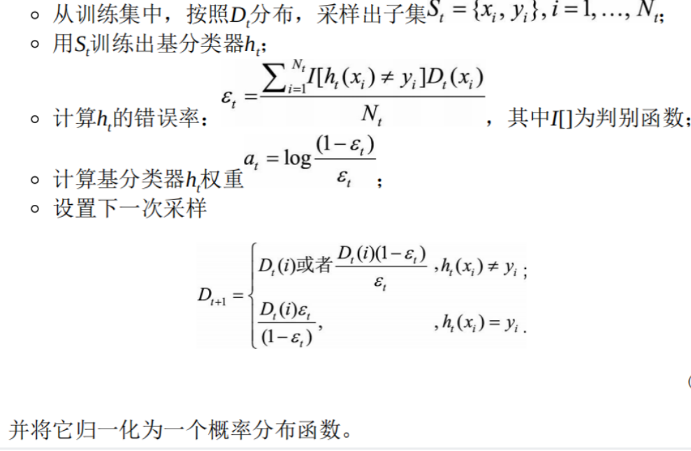
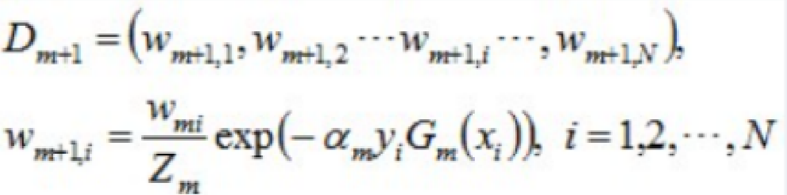
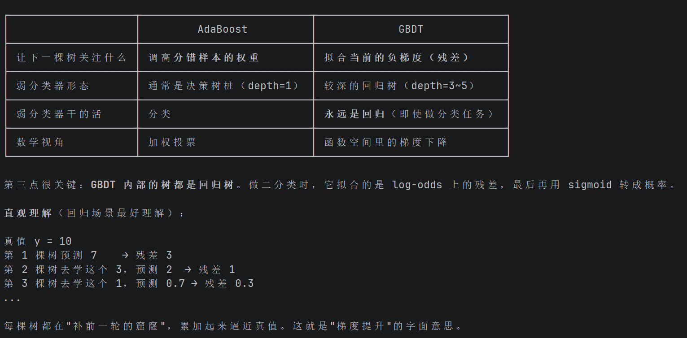
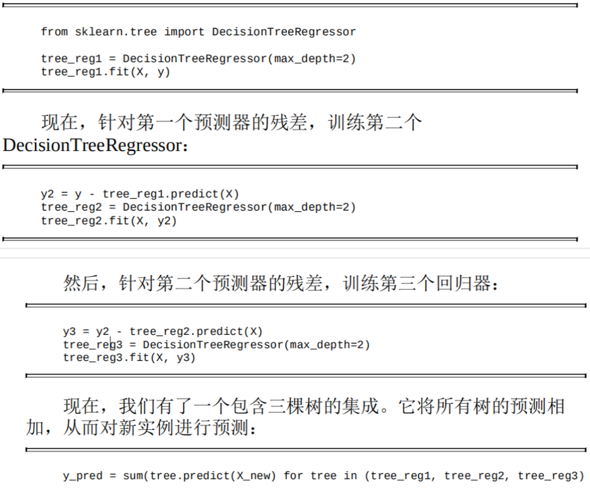
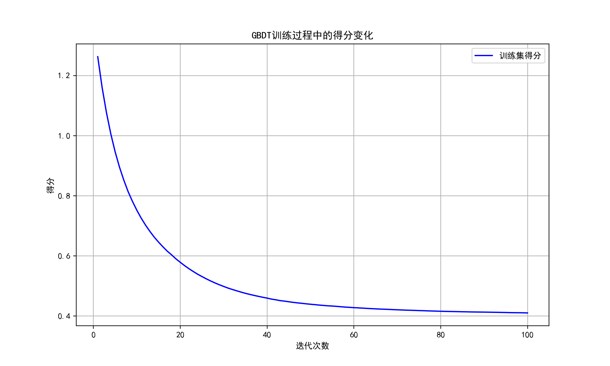

# 集成学习

**集成学习**：将多个分类器的结果统一成一个最终的决策，其中的每个单独的分类器称为**基分类器**

## 集成学习的分类：**Boosting** 与 **Bagging**

- Boosting——串行

  - Boosting 方法训练基分类器时采用**串行**方式，各个基分类器之间有依赖。基本思路是将基分类器层层叠加，每一层在训练时，**对前一层基分类器分错的样本，给予更高的权重**。测试时，根据各层分类器结果的**加权**得到最终结果

  - Boosting 的过程很类似于人类学习新知识的过程——迭代式学习：第一遍学习会记住一部分知识，但也会犯错；第二遍会针对**犯过错误**的知识加强学习，以减少类似错误发生。不断循环，直到错误次数减少到很低的程度

- Bagging——并行

  - Bagging 与 Boosting 的串行训练方式不同，各基分类器之间**无强依赖**，可以进行**并行**训练。其中很著名的算法是基于决策树基分类器的随机**森林（Random Forest）**

  - 为了让基分类器之间互相独立，将训练集分为若干子集（当训练样本数量较少时，**子集**之间可能有交叠）。Bagging 更像集体决策：每个个体单独学习，学习内容可以相同、不同或部分重叠；由于个体之间存在差异性，最终判断不会完全一致。在最终决策时，每个个体单独作出判断，再通过**投票**的方式做出集体决策

> 📖 **Boosting vs Bagging —— 用"考试"来理解**
>
> **Boosting（串行）= 错题本学习法**
>
> 你做了第1套模拟卷 → 发现错了很多题 → 把这些错题重点复习 → 做第2套卷子（题目侧重你之前错的知识点）→ 再复习错题 → ... 最终把所有薄弱点都补上。
>
> 每个后续"模型"都聚焦在前一个模型犯的错误上。就像你拿着错题本反复练习。
>
> **Bagging（并行）= 分头行动再投票**
>
> 5个同学各自独立做同一套卷子（每人看到的题目略有不同）→ 最后对每道题的答案投票，少数服从多数。5个人都选A，那大概率就是A；如果3人选A、2人选B，最终答案还是A。
>
> 每个人单独看都可能犯错，但集体投票能消除个人的随机错误。
>
> **一句话总结**：
> - Boosting：后面的修正前面的错误（**降低偏差**，让模型更"准"）
> - Bagging：大家一起投票抵消随机性（**降低方差**，让模型更"稳"）

    算法示意图：

    

    >Model 1、Model 2、Model 3 都是用训练集的一个子集训练出来的，单独来看决策边界都很曲折，有过拟合倾向。**集成之后的模型的决策边界比各个独立模型平滑了**，这是由于集成的加权投票方法减小了方差

## 偏差与方差

我们经常用过拟合、欠拟合来定性描述模型是否很好地解决了特定的问题

从定量的角度来说，可以用模型的**偏差（Bias）与方差（Variance）**来描述模型的性能。

在有监督学习中，模型的泛化误差来源于两个方面——**偏差**和**方差**：

| 概念      | 定义                                                         |
| --------- | ------------------------------------------------------------ |
| **偏差**  | 由所有采样得到的大小为  m 的训练数据集训练出的所有模型输出的**平均值**和真实模型输出之间的偏差。通常由于对学习算法做了错误假设导致（如真实模型是二次函数，却假设为一次函数）。偏差带来的误差通常在**训练误差**上体现 |
| **方差 ** | 由所有采样得到的大小为  m 的训练数据集训练出的所有模型输出的方差。通常由于模型复杂度相对于训练样本数  m 过高导致（如 100 个训练样本却假设阶数不大于  200 的多项式）。方差带来的误差通常体现在**测试误差相对于训练误差的增量**上 |

用一个射击的例子来进一步描述偏差和方差的区别与联系。假设一次射击就是一个机器学习模型对一个样本进行预测，射中靶心代表预测准确，偏离靶心越远代表预测误差越大。

通过 n 次采样得到 n 个大小为 m 的训练样本集合，训练出 n 个模型，对同一个样本做预测，相当于做了 n 次射击


| 左上角 | 射击又准又集中  → 偏差和方差都很小（最理想） |
| ------ | -------------------------------------------- |
| 右上角 | 中心在靶心周围但分布分散  → 偏差小、方差大   |
| 左下角 | 方差小、偏差大                               |
| 右下角 | 方差大、偏差也大                             |

Boosting（串行）能够提升弱分类器性能的原因是**降低了偏差**

Bagging（并行）能够提高弱分类器性能的原因是**降低了方差**

> 📖 **偏差 vs 方差——用"学射箭"来理解**
>
> | | 偏差（Bias） | 方差（Variance） |
> |---|---|---|
> | **通俗解释** | 瞄得准不准（系统性偏了没） | 手抖不抖（每次射得稳不稳） |
> | **问题表现** | 训练集上误差就很大 → 欠拟合 | 训练集误差小，测试集误差大 → 过拟合 |
> | **原因** | 模型太简单，学不会 | 模型太复杂，把噪声也学了 |
> | **Boosting 解决它** | ✅ 每轮修正上一轮的错误，越学越准 | 作用不大 |
> | **Bagging 解决它** | 作用不大 | ✅ 多模型投票平均，抵消随机波动 |
>
> **具体例子**：
> - **高偏差**：用一条直线去拟合一个抛物线 → 怎么学都学不会，训练误差就很大
> - **高方差**：用100次多项式拟合10个点 → 训练误差接近0，但曲线剧烈抖动，换个数据集就完全不对了
>
> Boosting = 把多个"弱鸡"（高偏差简单模型）串在一起，互相补短 → 偏差越来越低
> Bagging = 训练多个独立模型投票 → 单个模型的随机错误互相抵消 → 方差降低

## 从偏差与方差角度理解差异

基分类器有时又被称为**弱分类器**，因为基分类器的错误率要大于集成分类器。基分类器的错误是**偏差和方差两种错误之和**：

| **概念** | **含义**                                                 |
| -------- | -------------------------------------------------------- |
| **偏差** | 分类器表达能力有限导致的系统性错误，表现在训练误差不收敛 |
| **方差** | 分类器对样本分布过于敏感，训练样本数较少时产生过拟合     |

假设所有基分类器出错的概率是独立的，在某个测试样本上用简单多数投票集成，**超过半数基分类器出错的概率会随着基分类器数量增加而下降**

## AdaBoost——串行

[Adaboost 算法的原理与推导-CSDN博客](https://blog.csdn.net/v_JULY_v/article/details/40718799)

**AdaBoost（Adaptive Boosting，自适应提升）**核心：让很多个"弱分类器"按顺序训练，每一个都重点关注前一个分错的样本，最后把它们加权投票合成一个强分类器

### 原理

- 确 定基分类器

  可以选取 gini（基尼）决策树作为基分类器。事实上，任何分类模型都可以作为**基分类器**，但树形模型由于结构简单且较易产生随机性所以比较常用

-  训练基分类器

  假设训练集为${x_i, y_i}, i=1,...,N$，其中 $y_i \in {-1, 1}$，并且有 T 个基分类器，则可以按照如下过程来训练：

  - 初始化采样分布$D_1(i) = 1/N$

  - 令 t = 1, 2, ..., T 循环：

    

    

    >$w_{ₘᵢ}$是上次权值分布，$\alpha_m$ 是基分类器权重，$y_i$是真实值，$G_ₘ(x_ᵢ)$是上一个分类器的预测值
    >
    >**分错的样本权重大（下次被分到的概率更大），分对的样本权重小**
    >
    >$Z_ₘ$ 是归一化因子，使得所有样本的权重之和等于 1
    >
    >这里二分类，类别值分别为 1 和 -1
  
- 合并基分类器

  给定一个未知样本 z，**输出分类结果**为加权投票的结果：
  $$
  Sign(\sum_{t=1}^{T}h_t(z)\alpha_t)
  $$

> 📖 **AdaBoost 公式参数详解**
>
> 上面图片中的公式看起来很复杂，逐个拆解每个符号的含义：
>
> **训练阶段（循环 t = 1, 2, ..., T）：**
>
> | 符号 | 含义 | 通俗理解 |
> |------|------|----------|
> | $D_t(i)$ | 第 t 轮训练时，第 i 个样本的**权重** | 这个样本被"重视"的程度 |
> | $h_t(x)$ | 第 t 个基分类器（如一棵决策树桩） | 第 t 个"专家" |
> | $\epsilon_t$ | 第 t 个基分类器的**加权错误率** | 这个专家犯错的概率（考虑样本权重） |
> | $\alpha_t$ | 第 t 个基分类器的**投票权重** | 这个专家发言的"音量"大小 |
> | $y_i$ | 第 i 个样本的真实标签 | +1 或 -1（是/否） |
> | $G_t(x_i)$ | 第 t 个基分类器对第 i 个样本的预测值 | 专家对第 i 个问题的判断 |
> | $Z_t$ | 归一化因子 | 保证所有样本权重加起来等于 1 |
>
> **核心公式的直觉理解：**
>
> 1. **$\alpha_t = \frac{1}{2}\ln(\frac{1-\epsilon_t}{\epsilon_t})$**
>    - 如果 $\epsilon_t = 0.1$（错误率很低，只错10%）→ $\alpha_t = \frac{1}{2}\ln(9) \approx 1.1$（权重高，话语权大 🔊）
>    - 如果 $\epsilon_t = 0.5$（错误率50%，和瞎猜一样）→ $\alpha_t = \frac{1}{2}\ln(1) = 0$（权重为0，直接闭嘴 🤫）
>    - **错误率越低，这个分类器越有话语权！**
>
> 2. **权重更新**（分错的样本权重变大，分对的变小）：
>    - 样本分错了 → 乘 $e^{\alpha_t}$（α>0，所以权重被放大）→ 下一轮被重点关照
>    - 样本分对了 → 乘 $e^{-\alpha_t}$（α>0，所以权重被缩小）→ 下一轮不用太关注
>
> **预测阶段：**
> $$
> Sign(\sum_{t=1}^{T}h_t(z)\alpha_t)
> $$
> - $Sign(x)$ 是符号函数：x>0 返回 +1，x<0 返回 -1
> - 每个基分类器 $h_t(z)$ 对样本 z 投票（+1 或 -1），票数乘以该分类器的权重 $\alpha_t$
> - 所有加权票加在一起，看最终正负号决定分类结果
>
> **数值举例**：有3个基分类器，对一个新样本 z：
> - 分类器1（α₁=1.1）：预测 +1 → 贡献 +1.1
> - 分类器2（α₂=0.8）：预测 -1 → 贡献 -0.8
> - 分类器3（α₃=0.5）：预测 +1 → 贡献 +0.5
> - 总和 = 1.1 + (-0.8) + 0.5 = 0.8 → Sign(0.8) = +1 → 最终预测为"正类"
  

从 AdaBoost 的例子中可以明显看到 Boosting 的思想：**对分类正确的样本降低了权重，对分类错误的样本升高或者保持权重不变**。在最后进行模型融合的过程中，**也根据错误率对基分类器进行加权融合，错误率低的分类器拥有更大的"话语权"**

要构建一个 AdaBoost 分类器，首先需要训练一个基础分类器（比如决策树），用它对训练集进行预测。然后对错误分类的训练实例增加其相对权重，接着使用这个最新的权重对第二个分类器进行训练，然后再次对训练集进行预测，继续更新权重，并不断循环向前

### 示例

```python
from sklearn import datasets
import numpy as np
from sklearn.metrics import accuracy_score
from sklearn.model_selection import train_test_split

# x是特征，y是标签
x, y = datasets.make_moons(n_samples=50000, noise=0.3, random_state=42)  # 随机50000个样本，2个标签0 1
print(x.shape)
print(y.shape)
print(np.unique(y))

# 划分训练集和测试集
X_train, X_test, y_train, y_test = train_test_split(x, y, test_size=0.2, random_state=42)

# 导入AdaBoost分类器
from sklearn.ensemble import AdaBoostClassifier
from sklearn.tree import DecisionTreeClassifier
import matplotlib.pyplot as plt

# 创建基分类器 - 使用决策树作为AdaBoost的基分类器
base_clf = DecisionTreeClassifier(
    max_depth=1,  # 决策树桩(深度为1的决策树)
    criterion='gini',  # 基尼决策树
    random_state=42,  # 随机种子，确保结果可复现
)

# 创建AdaBoost分类器
ada_clf = AdaBoostClassifier(
    estimator=base_clf,  # 基分类器
    n_estimators=50,  # 弱分类器的数量
    learning_rate=1.0,  # 学习率
    random_state=42  # 随机种子，确保结果可复现
)

# 训练AdaBoost分类器
ada_clf.fit(X_train, y_train)

# 预测
ada_pred = ada_clf.predict(X_test)
ada_accuracy = accuracy_score(y_test, ada_pred)

print("AdaBoost集成准确率:", ada_accuracy)

# 可视化AdaBoost的权重和准确率变化

# 获取每个弱分类器的权重
estimator_weights = ada_clf.estimator_weights_

# 创建一个新的AdaBoost分类器来跟踪不同数量弱分类器的准确率
n_estimators_range = range(1, 51)  # 从1到50个弱分类器
accuracies = []

for n in n_estimators_range:
    # 创建具有n个弱分类器的AdaBoost
    temp_ada = AdaBoostClassifier(
        estimator=base_clf,
        n_estimators=n,
        learning_rate=1.0,
        random_state=42
    )
    temp_ada.fit(X_train, y_train)
    temp_pred = temp_ada.predict(X_test)
    accuracies.append(accuracy_score(y_test, temp_pred))

plt.rcParams['font.sans-serif'] = ['SimHei']  # 用来正常显示中文标签
plt.rcParams['axes.unicode_minus'] = False  # 用来正常显示负号

# 绘制权重分布
plt.figure(figsize=(10, 6))
plt.bar(range(1, len(estimator_weights) + 1), estimator_weights)
plt.xlabel('弱分类器索引')
plt.ylabel('权重')
plt.title('AdaBoost中各弱分类器的权重分布')
plt.savefig("AdaBoost中各弱分类器的权重分布", dpi=200)
plt.grid(True)

# 绘制准确率变化曲线
plt.figure(figsize=(10, 6))
plt.plot(n_estimators_range, accuracies, 'b-', marker='o')
plt.xlabel('弱分类器数量')
plt.ylabel('测试集准确率')
plt.title('AdaBoost中弱分类器数量与准确率的关系')
plt.savefig("AdaBoost中弱分类器数量与准确率的关系", dpi=200)
plt.grid(True)
```


画的是 `estimator_weights_`，也就是每个弱分类器的 α 值：

- 前几个分类器 α 比较大（容易的样本先被分对，错误率低）
- 后面的 α 整体下降并波动（剩下的都是难样本，错误率接近 0.5，α 自然小）
- 这正是 AdaBoost 的特征：先解决容易的，再啃硬骨头，发言权也按贡献分配


## GBDT——串行

**梯度提升决策树（Gradient Boosting Decision Tree, GBDT）**，其核心思想是，每一棵树学的是之前所有树结论和的**残差**，这个残差就是一个加预测值后能得真实值的累加量

**GBDT** **的加权指数**是一种将多个弱学习器的输出合并为一个强学习器输出的方法。假设有T 颗树，第 t 棵树的输出为$f_t(x)$，则加权指数$E_t(x)$可以表示为
$$
\sum_{t=1}^{T}a_t f_t(x)
$$
其中，$α_t$为第 t 棵树的权重因子，通常使用学习率（learning rate）进行控制，取值范围为 (0, 1]

学习率越小，每颗树的贡献就越小，模型的鲁棒性就越高；学习率越大，每颗树的贡献就越大，模型的复杂度就越高，容易过拟合

采用决策树作为弱分类器的 Gradient Boosting 算法被称为 GBDT，有时又被称为 MART（Multiple Additive Regression Tree）。

GBDT 中使用的决策树通常为 CART

### 与AdaBoost对比



AdaBoost 与 GBDT 的**训练过程**都是串行的（后面的模型依赖前面的模型），但**预测阶段**：对单个新样本，所有基分类器的预测可以并行计算，最后加权求和即可（这一点两者相同）

### 训练过程

模型的任务是预测一个人的年龄，训练集只有 A、B、C、D 4 个人，年龄分别是 14、16、 24、26。训练好第一棵树后，求得每个样本预测值与真实值之间的残差：A、B、C、D 的残差分别是 -1、1、-1、1。然后用每个样本的残差训练下一棵树（残差作为目标值），**直到残差收敛到某个阈值以下，或者树的总数达到某个上限为止**

> 📖 **GBDT 残差——逐棵树"微调"的过程（数值走一遍）**
>
> | 轮次 | A（真实年龄=14） | B（真实年龄=16） | C（真实年龄=24） | D（真实年龄=26） |
> |------|-----------------|-----------------|-----------------|-----------------|
> | **第1棵树预测** | 15 | 15 | 25 | 25 |
> | 残差（真实-预测） | 14-15 = **-1** | 16-15 = **+1** | 24-25 = **-1** | 26-25 = **+1** |
> | **第2棵树预测残差** | -0.8 | +0.8 | -0.8 | +0.8 |
> | 累计预测 = 15+(-0.8) | **14.2** | **15.8** | **24.2** | **25.8** |
> | 新残差 | 14-14.2 = **-0.2** | 16-15.8 = **+0.2** | 24-24.2 = **-0.2** | 26-25.8 = **+0.2** |
> | **第3棵树预测残差** | -0.15 | +0.15 | -0.15 | +0.15 |
> | 累计预测 | **14.05** | **15.95** | **24.05** | **25.95** |
> | ... | ... | ... | ... | ... |
>
> 可以看到：
> - 第1棵树：做了一个**粗糙**的预测（偏了约1岁）
> - 第2棵树：专门学习第1棵树的**误差（残差）**，把差距从1缩小到0.2
> - 第3棵树：继续学习误差，差距缩小到0.05
> - **每一棵新树都在"修补"前面所有树的集体偏差**
>
> 最终预测 = 第1棵树 + 第2棵树 + 第3棵树 + ... = 越来越接近真实值！


### 代码示例



### 示例

```python
from sklearn import datasets
import numpy as np
from sklearn.metrics import accuracy_score
from sklearn.model_selection import train_test_split

# x是特征，y是标签
x, y = datasets.make_moons(n_samples=50000, noise=0.3, random_state=42)  # 随机50000个样本，2个标签0 1
print(x.shape)
print(y.shape)
print(np.unique(y))

# 划分训练集和测试集
X_train, X_test, y_train, y_test = train_test_split(x, y, test_size=0.2, random_state=42)

# 导入梯度提升决策树分类器
from sklearn.ensemble import GradientBoostingClassifier
import numpy as np
import matplotlib.pyplot as plt

# 创建GBDT分类器
gbdt_clf = GradientBoostingClassifier(
    n_estimators=100,  # 弱分类器的数量
    learning_rate=0.1,  # 学习率
    max_depth=3,  # 决策树的最大深度
    min_samples_split=2,  # 分裂内部节点所需的最小样本数
    min_samples_leaf=1,  # 叶节点所需的最小样本数
    subsample=1.0,  # 用于拟合各个基础学习器的样本比例
    random_state=42  # 随机种子，确保结果可复现
)

# 训练GBDT分类器
gbdt_clf.fit(X_train, y_train)

# 预测
gbdt_pred = gbdt_clf.predict(X_test)
gbdt_accuracy = accuracy_score(y_test, gbdt_pred)

print("GBDT集成准确率:", gbdt_accuracy)

plt.rcParams['font.sans-serif'] = ['SimHei']  # 用来正常显示中文标签
plt.rcParams['axes.unicode_minus'] = False  # 用来正常显示负号

# 绘制GBDT的训练过程中的损失函数变化
plt.figure(figsize=(10, 6))
plt.plot(np.arange(1, len(gbdt_clf.train_score_) + 1), gbdt_clf.train_score_, 'b-', label='训练集得分')
plt.xlabel('迭代次数')
plt.ylabel('得分')
plt.title('GBDT训练过程中的得分变化')
plt.legend()
plt.grid(True)
plt.savefig('GBDT训练过程中的得分变化', dpi=200)
```



>训练集得分变化`gbdt_clf.train_score_ `这个数组记录的是每加一棵树之后，训练集上的损失值（二分类默认是 log loss / 负对数似然，所以这条曲线是下降的，值越小越好——尽管 y 轴标签写的是"得分"，本质上是损失）


