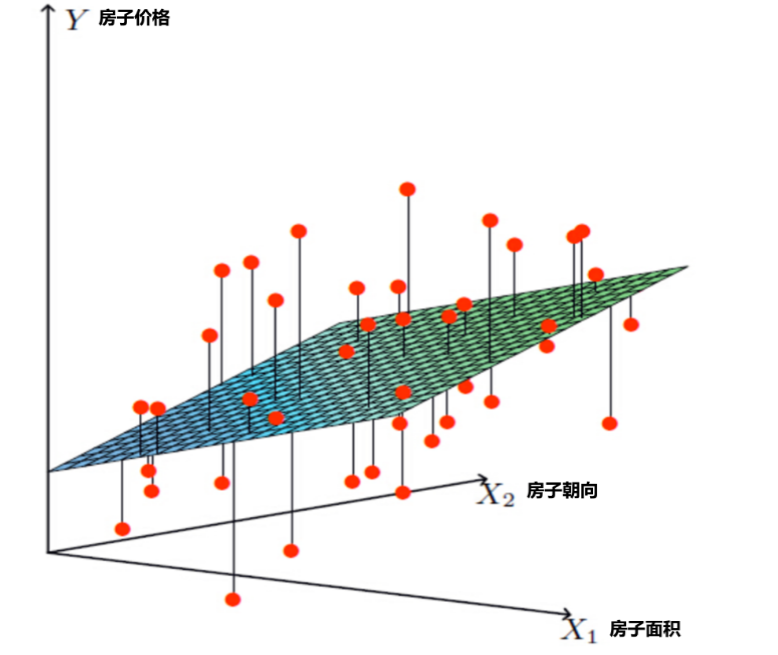
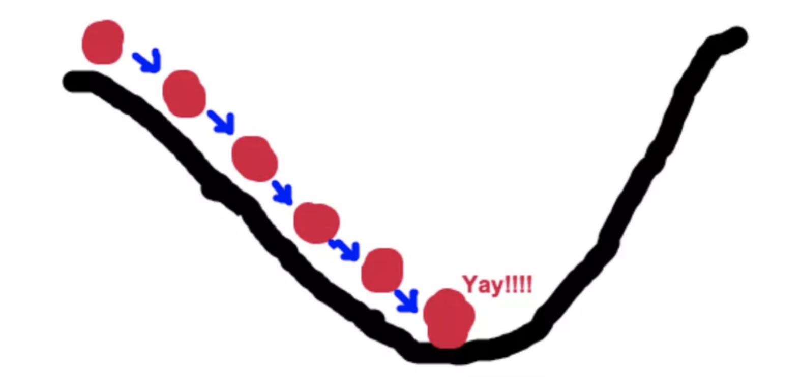
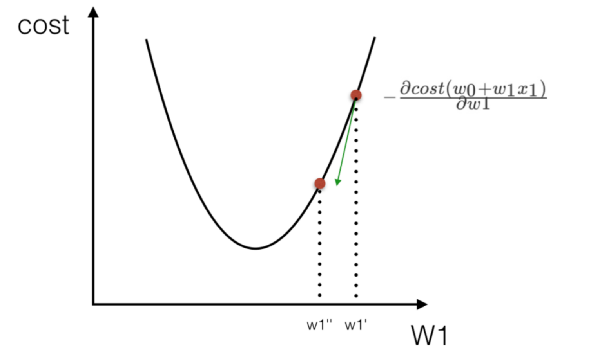
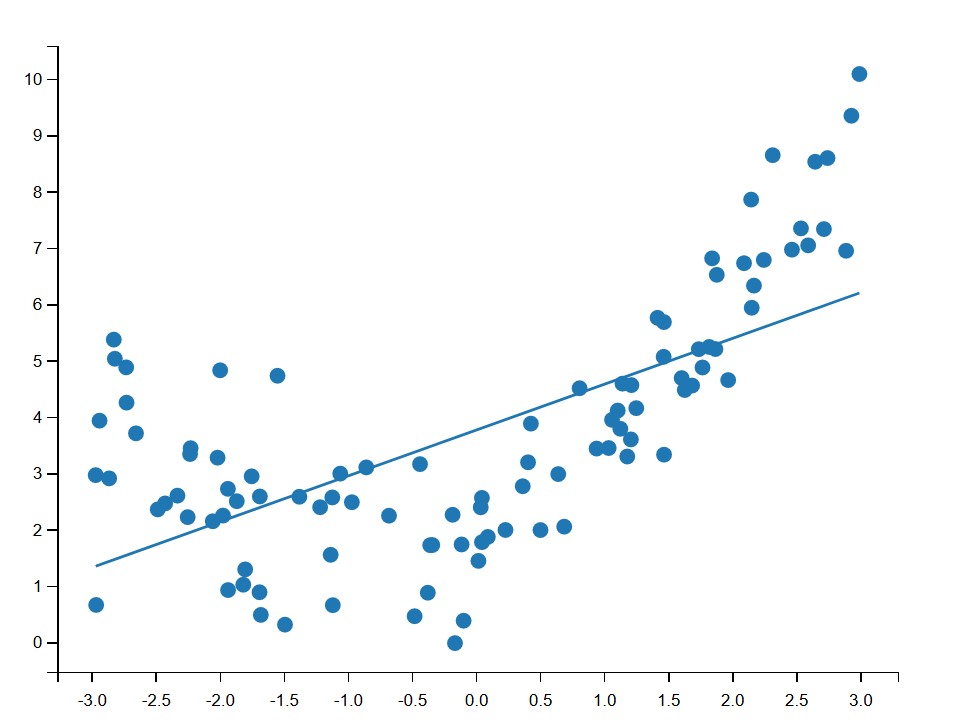
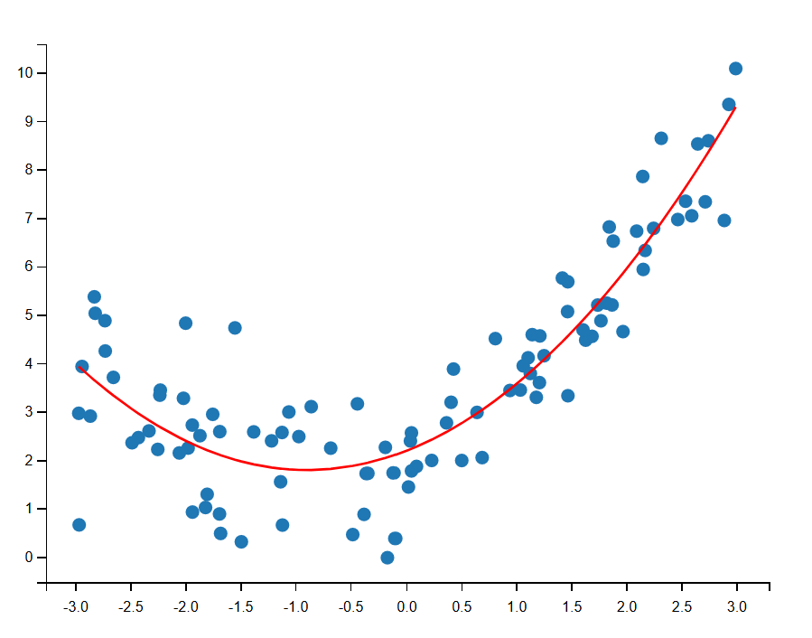
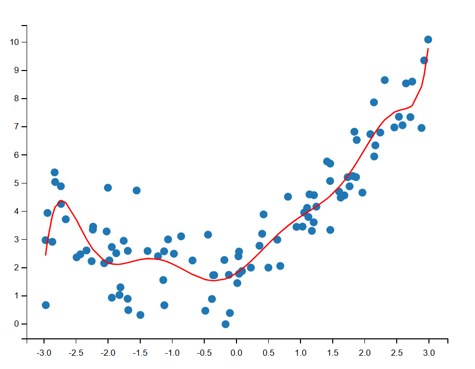

# 回归算法

## 线性回归



线性回归 问题，就是找到上图中的这个**面**（不管是线，还是面，统称为：**超平面**），使这个面到所有点的距离平方和最小

### 损失函数

损失函数：衡量「单个样本」预测得好不好

代价函数：衡量「整个数据集（或一个 batch）」预测得好不好

对于一元线性方程：$y=kx+b$，损失函数为：
$$
J(k,b)=\sum_{i=0}^{n}(h(x^i)-y^i)^2=\sum_{i=0}^{n}(kx^i+b-y^i)^2
$$
对于多元线性方程：
$$
y=w_1x_1+w_2x_2+w_3x_3+w_4x_4+...+b
$$
换一种写法：
$$
y=\begin{bmatrix}
x_1 & x_2 & x_3 & \dots & x_d
\end{bmatrix}
\begin{bmatrix}
w_1\\
w_2\\
w_3\\
\vdots\\
w_d
\end{bmatrix}+b
$$
进一步化简为：
$$
y=Xw^T+b
$$
其中：
$$
数据集D=(x_1,y_1),(x_2,y_2),(x_3,y_3)...(x_n,y_n)
$$

$$
向量权重w=\{w_1,w_2,w_3, \dots, w_d\}
$$

> 📖 **矩阵写法看不懂？——用具体数值拆解**
>
> 假设你要预测房价（y），有3个特征：面积（$x_1$）、卧室数（$x_2$）、房龄（$x_3$）
>
> 线性回归模型：$y = w_1 \times 面积 + w_2 \times 卧室数 + w_3 \times 房龄 + b$
>
> 矩阵写法就是把上面这个式子用向量乘法表示：
>
> $$y = [面积, 卧室数, 房龄] \times \begin{bmatrix} w_1 \\ w_2 \\ w_3 \end{bmatrix} + b$$
>
> 即 $y = x \cdot w + b$
>
> 训练的目标就是找到最好的 $w_1, w_2, w_3$ 和 $b$，让预测值最接近真实的房价。

### 正规方程法

通过解数学公式，来解决线性回归的问题

> **📝 正规方程法详解 —— 一次算出最优参数**
>
> 正规方程（Normal Equation）是一种**闭式解（closed-form solution）**，不需要像梯度下降那样一步步迭代，而是直接通过矩阵运算一次性求出最优参数。
>
> ---
>
> **第一步：写出模型与损失函数**
>
> 线性回归模型（把偏置 $b$ 并入权重，在 $X$ 中加一列全 1）：
>
> $$\hat{y} = X\theta$$
>
> | 符号      | 形状             | 含义                                                         |
> | --------- | ---------------- | ------------------------------------------------------------ |
> | $X$       | $n \times (d+1)$ | 设计矩阵，$n$ 个样本、$d$ 个特征，**第一列全为 1**（对应偏置项） |
> | $\theta$  | $(d+1) \times 1$ | 参数向量，包含 $[b, w_1, w_2, ..., w_d]^T$                   |
> | $\hat{y}$ | $n \times 1$     | 模型对所有样本的预测值                                       |
> | $y$       | $n \times 1$     | 所有样本的真实值                                             |
>
> > **为什么要在 X 中加一列 1？** 原来模型是 $y = w_1x_1 + w_2x_2 + b$，加一列 1 后变成 $y = b \cdot 1 + w_1x_1 + w_2x_2 = \theta_0 \cdot 1 + \theta_1 x_1 + \theta_2 x_2$，统一成矩阵乘法 $X\theta$，整洁且方便求导。
>
> 均方误差损失函数（矩阵形式）：
>
> $$J(\theta) = \frac{1}{n}(X\theta - y)^T(X\theta - y)$$
>
> 展开就是 $\frac{1}{n}\sum_{i=1}^{n}(\hat{y}_i - y_i)^2$，即所有样本预测误差的平方和的均值。
>
> ---
>
> **第二步：对 $\theta$ 求导，令导数为零**
>
> 损失函数 $J(\theta)$ 是一个**凸函数**（碗状），最小值出现在梯度为零的地方。对 $\theta$ 求导：
>
> $$\frac{\partial J}{\partial \theta} = \frac{2}{n}X^T(X\theta - y)$$
>
> > **推导要点**：展开 $J(\theta) = \frac{1}{n}(\theta^T X^T X\theta - 2\theta^T X^T y + y^T y)$，对 $\theta$ 求导时，二次项 $\theta^T X^T X\theta$ 的导数是 $2X^T X\theta$，一次项 $-2\theta^T X^T y$ 的导数是 $-2X^T y$，常数项 $y^T y$ 导数为 0。合并即得 $\frac{2}{n}X^T(X\theta - y)$。
>
> 令导数为零：
>
> $$X^T(X\theta - y) = 0$$
>
> $$X^T X\theta = X^T y$$
>
> 这个方程称为**正规方程（Normal Equation）**。
>
> ---
>
> **第三步：解出 $\theta$**
>
> 如果 $X^T X$ 可逆（通常 $n > d$ 即样本数远大于特征数时满足），两边左乘 $(X^T X)^{-1}$：
>
> $$\boxed{\theta = (X^T X)^{-1} X^T y}$$
>
> 这就是最终公式，一步算出所有参数！
>
> ---
>
> **执行流程总结（5 步）**：
>
> ```
> 原始数据 X (n×d)          目标值 y (n×1)
>      │                         │
>      ▼                         │
> ① 加一列全 1 → X_b (n×(d+1))    │
>      │                         │
>      ▼                         ▼
> ② 计算 XᵀX  (d+1)×(d+1)    ③ 计算 Xᵀy  (d+1)×1
>      │                         │
>      ▼                         │
> ④ 求逆 (XᵀX)⁻¹                  │
>      │                         │
>      └─────────┬───────────────┘
>                ▼
>       ⑤ θ = (XᵀX)⁻¹ Xᵀy
>          得到所有参数！
> ```
>
> ---
>
> **具体数值例子**（3 个样本，1 个特征，用正规方程求 $y = wx + b$）：
>
> | 样本 | x（面积） | y（房价/万元） |
> | ---- | --------- | -------------- |
> | 1    | 50        | 100            |
> | 2    | 80        | 150            |
> | 3    | 120       | 220            |
>
> **第 ① 步**：构造 $X_b$（加全 1 列）和 $y$ 向量：
>
> $$X_b = \begin{bmatrix} 1 & 50 \\ 1 & 80 \\ 1 & 120 \end{bmatrix}, \quad y = \begin{bmatrix} 100 \\ 150 \\ 220 \end{bmatrix}, \quad \theta = \begin{bmatrix} b \\ w \end{bmatrix}$$
>
> **第 ② 步**：计算 $X^T X$：
>
> $$X^T X = \begin{bmatrix} 1 & 1 & 1 \\ 50 & 80 & 120 \end{bmatrix} \begin{bmatrix} 1 & 50 \\ 1 & 80 \\ 1 & 120 \end{bmatrix} = \begin{bmatrix} 3 & 250 \\ 250 & 23300 \end{bmatrix}$$
>
> **第 ③ 步**：计算 $X^T y$：
>
> $$X^T y = \begin{bmatrix} 1 & 1 & 1 \\ 50 & 80 & 120 \end{bmatrix} \begin{bmatrix} 100 \\ 150 \\ 220 \end{bmatrix} = \begin{bmatrix} 470 \\ 41900 \end{bmatrix}$$
>
> **第 ④ 步**：求 $(X^T X)^{-1}$：
>
> $$(X^T X)^{-1} = \begin{bmatrix} 3 & 250 \\ 250 & 23300 \end{bmatrix}^{-1} = \frac{1}{3 \times 23300 - 250^2} \begin{bmatrix} 23300 & -250 \\ -250 & 3 \end{bmatrix} = \frac{1}{7400} \begin{bmatrix} 23300 & -250 \\ -250 & 3 \end{bmatrix}$$
>
> **第 ⑤ 步**：计算 $\theta$：
>
> $$\theta = (X^T X)^{-1} X^T y = \frac{1}{7400} \begin{bmatrix} 23300 & -250 \\ -250 & 3 \end{bmatrix} \begin{bmatrix} 470 \\ 41900 \end{bmatrix}$$
>
> $$= \frac{1}{7400} \begin{bmatrix} 23300 \times 470 + (-250) \times 41900 \\ (-250) \times 470 + 3 \times 41900 \end{bmatrix} = \frac{1}{7400} \begin{bmatrix} 470000 \\ 8200 \end{bmatrix} = \begin{bmatrix} 63.51 \\ 1.108 \end{bmatrix}$$
>
> **结果**：$b \approx 63.51$，$w \approx 1.108$
>
> 即模型为 $y = 1.108x + 63.51$，含义：面积每增加 1㎡，房价约涨 1.108 万。
>
> > **验证**：代入 x=50 → 1.108×50 + 63.51 ≈ 118.9（接近 100）；x=120 → 1.108×120 + 63.51 ≈ 196.5（接近 220）。3 个点不完全在一条直线上，正规方程给出的是最小二乘意义下的最优解。
>
> ---
>
> **正规方程 vs 梯度下降**：
>
> |                 | 正规方程                                        | 梯度下降                                     |
> | --------------- | ----------------------------------------------- | -------------------------------------------- |
> | 原理            | 直接求解 $\theta = (X^TX)^{-1}X^Ty$             | 迭代更新 $\theta = \theta - \alpha \nabla J$ |
> | 需要选学习率    | ❌ 不需要                                        | ✅ 需要调 $\alpha$                            |
> | 需要迭代        | ❌ 一步到位                                      | ✅ 需要多轮迭代                               |
> | 特征数很多时    | ❌ 求逆复杂度 $O(d^3)$，$d$ 大时很慢             | ✅ 不受特征数影响                             |
> | 样本数很多时    | ✅ 只需求解 $(d+1) \times (d+1)$ 矩阵            | ❌ 每次迭代遍历所有样本                       |
> | $X^TX$ 不可逆时 | ❌ 无法直接求解                                  | ✅ 照常工作                                   |
> | sklearn 中对应  | `LinearRegression()`（默认用 SVD 分解，更稳定） | `SGDRegressor()`                             |
>
> > **经验法则**：特征数 $d < 10^4$ 时，正规方程（或 sklearn 的 `LinearRegression`）是首选；$d$ 超过万级时，改用梯度下降。

#### 示例-加利福尼亚房价

```python
from sklearn.datasets import fetch_california_housing

# 使用sklearn自带的fetch接口加载加利福尼亚房价数据
data = fetch_california_housing(data_home='./data')

# 查看数据的基本信息
print("数据类型:", type(data))
print("属性列表:", data.__dir__())

# 特征名称
print("\n特征名称:")
print(data.feature_names)

# 前5行特征数据
print("\n前5行特征数据:")
print(data.data[:5])

# 前5个房价目标值
print("\n前5个房价目标值:")
print(data.target[:5])

# 数据总体形状
print("\n特征数据形状:", data.data.shape)
print("目标数据形状:", data.target.shape)

from sklearn.linear_model import LinearRegression
from sklearn.model_selection import train_test_split
from sklearn.preprocessing import StandardScaler
from sklearn.metrics import mean_squared_error

# 划分训练集和测试集
X = data.data
y = data.target
X_train, X_test, y_train, y_test = train_test_split(X, y, test_size=0.2, random_state=42)

# 标准化特征
scaler = StandardScaler()
X_train_scaled = scaler.fit_transform(X_train)
X_test_scaled = scaler.transform(X_test)

# 创建并训练线性回归模型
lr = LinearRegression()
lr.fit(X_train_scaled, y_train)
print(f'回归系数{lr.coef_}')	# 回归系数就是损失函数中的w1 w2 w3 ...
# 回归系数越大，对最终的影响结果就越大

# 在训练集和测试集上预测
y_train_pred_sklearn = lr.predict(X_train_scaled)
y_test_pred_sklearn = lr.predict(X_test_scaled)

# 评估模型
print("sklearn线性回归训练集均方误差: {:.4f}".format(mean_squared_error(y_train, y_train_pred_sklearn)))
print("sklearn线性回归测试集均方误差: {:.4f}".format(mean_squared_error(y_test, y_test_pred_sklearn)))
```

### 梯度下降法

梯度下降法的基本思想可以类比为一个下山的过程。

假设这样一个场景：一个人被困在山上，需要从山上下来(找到山的最低点，也就是山谷)。但此时山上的浓雾很大，导致可视度很低。因此，下山的路径就无法确定，他必须利用自己周围的信息去找到下山的路径。这个时候，他就可以利用梯度下降算法来帮助自己下山。具体来说就是，以他当前的所处的位置为基准，**寻找这个位置最陡峭的地方，然后朝着山的高度下降的地方走**，（同理，如果我们的目标是上山，也就是爬到山顶，那么此时应该是朝着最陡峭的方向往上走）。然后每走一段距离，都反复采用同一个方法，最后就能成功的抵达山谷。



梯度下降的基本过程就和下山的场景很类似。

首先，我们有一个**可微分的函数**。这个函数就代表着一座山。我们的目标就是找到**这个函数的最小值**，也就是山底。

根据之前的场景假设，最快的下山的方式就是找到当前位置最陡峭的方向，然后沿着此方向向下走，对应到函数中，就是**找到给定点的梯度** ，然后朝着梯度相反的方向，就能让函数值下降的最快！因为梯度的方向就是函数之变化最快的方向。 所以，我们重复利用这个方法，反复求取梯度，最后就能到达局部的最小值，这就类似于我们下山的过程。而求取梯度就确定了最陡峭的方向，也就是场景中测量方向的手段。

**在单变量的函数中，梯度其实就是函数的微分（导数），代表着函数在某个给定点的切线的斜率**

**在多变量函数中，梯度是一个向量，向量有方向，梯度的方向就指出了函数在给定点的上升最快的方向**

这也就说明了为什么我们需要千方百计的求取梯度！我们需要到达山底，就需要在每一步观测到此时最陡峭的地方，梯度就恰巧告诉了我们这个方向。梯度的方向是函数在给定点上升最快的方向，那么梯度的反方向就是函数在给定点下降最快的方向，这正是我们所需要的。所以我们只要沿着梯度的反方向一直走，就能走到局部的最低点！


#### 梯度下降过程

##### 单变量函数的梯度下降

- 假设单变量函数$J(\theta)=\theta^2$
- 函数的梯度（微分，倒数）$J^{\prime}(\theta)=2\theta$
- 初始化，起点$(1,1)$
- 学习率$\alpha=0.4$

梯度下降的迭代过程

- $\theta^0=1$
- $\theta^1=\theta^0-\alpha*J^{\prime}(\theta^0)=1-0.4*2*1=0.2$
- $\theta^2=\theta^1-\alpha*J^{\prime}(\theta^1)=0.2-0.4*2*0.2=0.04$
- $\theta^3=\theta^2-\alpha*J^{\prime}(\theta^2)=0.04-0.4*2*0.04=0.008$
- $\theta^4=\theta^3-\alpha*J^{\prime}(\theta^3)=0.008-0.4*2*0.008=0.0016$

经过四次的运算，也就是走了四步，基本就抵达了函数的最低点，也就是山底


##### 多变量函数的梯度下降

- 假设多变量函数$J(\theta)=\theta_1^2+\theta_2^2$
- 观察发现最低点其实就是$(0,0)$，接下来用梯度下降来计算
- 假设初始起点为$\theta_0=(1,3)$，函数的学习率$\alpha=0.1$
- 函数的梯度为$\nabla J=(2\theta_1, 2\theta_2)$，其实就是分别对$\theta_1$和$\theta_2$分别求偏导

梯度下降的迭代过程

- $\theta_0=(1,3)$
- $\theta_1=\theta_0-\alpha\nabla J(\theta_0)=(1,3)-0.1(2,6)=(0.8,2.4)$
- $\theta_2=\theta_1-\alpha\nabla J(\theta_1)=(0.8,2.4)-0.1(2*0.8，2*2.4)=(0.64,1.92)$
- $\theta_3=\theta_2-\alpha\nabla J(\theta_2)=(0.64,1.92)-0.1(2*0.64，2*1.92)=(0.512,1.536)$
- ...
- $\theta_{10}=(0.10737,0.3221)$
- ...
- $\theta_{100}=(1.6296e^{-10},4.8888e^{-10})$


#### 梯度下降公式

$$
\theta_{i+1}=\theta_i-\alpha\frac{\partial J(\theta)}{\partial\theta_i}=\theta_i-\eta\nabla J(\theta)
$$

> 📖 **梯度下降公式逐项拆解**
>
> | 符号                                        | 含义                        | 通俗理解                                 |
> | ------------------------------------------- | --------------------------- | ---------------------------------------- |
> | $\theta_i$                                  | 当前位置（第 i 步的参数值） | 你现在站在山的哪个位置                   |
> | $\theta_{i+1}$                              | 下一步的位置                | 走一步之后的位置                         |
> | $\alpha$ 或 $\eta$                          | 学习率（步长）              | 每一步跨多大                             |
> | $\frac{\partial J(\theta)}{\partial\theta}$ | 梯度（偏导数）              | 当前位置最陡峭的方向和坡度               |
> | 负号 $-$                                    | 朝梯度**反方向**走          | 梯度指向上山方向，我们要下山，所以反着走 |
>
> **为什么梯度方向是"最陡"的？**
>
> 对于单变量函数 $y=x^2$，导数是 $2x$：
>
> - 在 x=3 处，导数=6 → 正数 → 函数在上升 → 要下降就往左走（减）
> - 在 x=-3 处，导数=-6 → 负数 → 函数在下降 → 要下降就往右走（加）
>
> 对于多变量函数 $J(\theta_1,\theta_2) = \theta_1^2 + \theta_2^2$，梯度是向量 $(2\theta_1, 2\theta_2)$：
>
> - 在 (1,3) 处，梯度=(2,6) → 从原点向外指的方向函数值增长最快
> - 我们减去 0.1×(2,6) = (0.2, 0.6)，从 (1,3) 走到 (0.8, 2.4) → 更接近原点(0,0)了！
>
> **一句话**：梯度告诉你去哪上山最快（函数值增加最快的方向），你反着走就是下山。

学习率$\alpha$或者$\eta$

- α在梯度下降算法中被称作为**学习率（learning rate）**或者**步长**，意味着我们可以通过α来控制每一步走的距离
- α在机器学习中，一般取0.001~0.01
- 梯度是上升最快的方向, 我们需要是下降最快的方向, 所以需要加负号

步长决定了在梯度下降迭代的过程中，每一步沿梯度负方向前进的长度

- 学习率太小，下降的速度会慢，也就是收敛的速度会比较慢
- 学习率太大，容易造成错过最低点、产生下降过程中的震荡


$\frac{\partial J(\theta)}{\partial\theta_i}$如何理解：

- 偏导数的数学符号，其实就是梯度，也就是沿着各个特征方向的偏导数

为什么有一个符号（或者说为什么要减）？

- 梯度前加一个负号，就意味着朝着梯度相反的方向前进

  

#### 全梯度下降法FGD(Focus Group Discussion)

$$
\theta_{i+1}=\theta_i-\eta\nabla J(\theta)
$$

- **计算训练集所有样本误差**，对其求和再取平均值作为目标函数。

- 权重向量沿其梯度相反的方向移动，从而使当前目标函数减少得最多。

- 因为在执行每次更新时，我们需要在整个数据集上计算所有的梯度，所以**全梯度下降法的速度会很慢**，同时，全梯度下降法无法处理超出内存容量限制的数据集。

- 全梯度下降法同样也不能在线更新模型，即在运行的过程中，不能增加新的样本。其是在整个训练数据集上计算损失函数关于参数θ的梯度(对所有样本梯度求平均)

#### 随机梯度下降法SGD(Stochastic Gradient Descent)

$$
\theta_{i+1}=\theta_i-\eta\nabla J(\theta;x^{(i)};y^{(i)})
$$

- 由于FGD每迭代更新一次权重都需要计算所有样本误差，而实际问题中经常有上亿的训练样本，故效率偏低，且**容易陷入局部最优解**，因此提出了随机梯度下降算法

- SGD其每轮计算的目标函数不再是全体样本误差，而仅是单个样本误差，即每次只代入计算一个样本目标函数的梯度来更新权重，再取下一个样本重复此过程，直到损失函数值停止下降或损失函数值小于某个可以容忍的阈值
- 由于每次只使用一个样本迭代，由于随机性较大，SGD 通常不容易陷入局部最优，**但收敛过程不稳定，可能在最优点附近震荡，使用难度大**

#### 小批量梯度下降算法MGD(Mini-Batch Gradient Descent)

$$
\theta_{i+1}=\theta_i-\eta\nabla J(\theta;x^{(i;i+n)};y^{(i;i+n)})
$$

- 小批量梯度下降算法是FGD和SGD的折中方案,在一定程度上兼顾了以上两种方法的优点。
- 每次从训练样本集上随机抽取一个小样本集，在抽出来的小样本集上采用FGD迭代更新权重。

- 被抽出的小样本集所含样本点的个数称为`batch_size`，通常设置为2的幂次方，更有利于GPU加速处理。
- 特别的，若`batch_size=1`，则变成了SGD；若`batch_size=n`，则变成了FGD

> 📖 **FGD vs SGD vs MGD——一张表说清楚**
>
> |                      | FGD（全梯度）                | SGD（随机）        | MGD（小批量）                |
> | -------------------- | ---------------------------- | ------------------ | ---------------------------- |
> | 每次用多少样本算梯度 | **全部** n 个样本            | **1** 个样本       | **一小批**（如32个）         |
> | 速度                 | 🐢 很慢（每次都要扫全部数据） | 🐇 很快             | 🐎 适中                       |
> | 稳定性               | 稳稳下降                     | 上蹿下跳（震荡）   | 较稳定                       |
> | 内存                 | 需要一次性装下全部数据       | 很低               | 适中                         |
> | 适合场景             | 小数据集                     | 在线学习、流式数据 | **最常用（深度学习默认）**   |
> | batch_size           | = n                          | = 1                | 2 的幂次方（32, 64, 128...） |
>
> **比喻**：你要走到山底
>
> - FGD：每一步之前，测量**所有360度方向**的坡度，选最陡的走 → 方向最准，但测一圈太累
> - SGD：每一步之前，随机挑**一个方向**测坡度就走 → 快但可能会迷路绕圈
> - MGD：每一步之前，测**几个方向**取平均坡度 → 又快又不太容易绕路
>
> 这就是为什么深度学习几乎都用 MGD（Mini-batch GD）！

#### 随机平均梯度下降法ASGD(Average Stochastic Gradient Descent)

$$
\bar{\theta_t}=\frac{1}{t}\sum_{i=1}^{t}\theta_i
$$

- 把所有历史参数做算术平均，最后用平均参数
- 在深度学习中的EMA机制中使用

#### 示例-加利福尼亚房价

```python
from sklearn.datasets import fetch_california_housing
from sklearn.model_selection import train_test_split
from sklearn.linear_model import SGDRegressor
from sklearn.preprocessing import StandardScaler

# 使用sklearn接口加载加利福尼亚房价数据（全部样本）
california = fetch_california_housing(data_home='./data')
X = california['data']
y = california['target']

# 划分训练集和测试集
X_train, X_test, y_train, y_test = train_test_split(
    X, y, test_size=0.2, random_state=42
)

# 特征归一化（建议对特征做归一化，有利于收敛）
scaler_X = StandardScaler()
X_train_scaled = scaler_X.fit_transform(X_train)
X_test_scaled = scaler_X.transform(X_test)

# 使用sklearn自带的SGDRegressor（默认是梯度下降优化，solver='sgd'）
sgd_reg = SGDRegressor(
    max_iter=2000,  # 训练迭代轮数
    eta0=0.01,  # 初始学习率
    learning_rate="invscaling",  # 表示学习率以倒数缩减方式递减，计算公式为：
    # eta = eta0 / pow(t, power_t)
    # 其中eta0为初始学习率, t为迭代次数, power_t默认为0.25
    random_state=42
)
sgd_reg.fit(X_train_scaled, y_train)

from sklearn.metrics import mean_squared_error

# 在测试集上预测
y_pred = sgd_reg.predict(X_test_scaled)

# 计算均方误差
mse = mean_squared_error(y_test, y_pred)
print('测试集均方误差(MSE):', mse)
```

### 回归模型评估方法

- 均方误差（MSE,Mean Squared Error）
  $$
  MSE=\frac{1}{n}\sum_{i=1}^{n}(y_i-\hat{y_i})^2
  $$
  平均平方误差，值越小越好，但是会放大异常项影响

- 均方根误差（RMSE, Root Mean Squared Error）
  $$
  RMSE=\sqrt{MSE}
  $$

- 平均绝对误差（MAE, Mean Absolute Error）
  $$
  MAE=\frac{1}{n}\sum_{i=1}^{n}|\hat{y_i}-y_i|
  $$
  $n$为样本数量，$\hat{y_i}$为预测值，$y_i$为实际值，一般来说，模型越小，预测越准确

### 欠拟合与过拟合

- 欠拟合：模型在训练集上表现不好，在测试集上也表现不好。模型过于简单

- 过拟合：模型在训练集上表现很好，但是在测试集上表现不好。模型过于复杂

- 欠拟合是模型在训练集和测试集的误差都比较大；过拟合是在训练集上误差小，在测试集上误差大

  


#### 欠拟合

```python
import numpy as np
from matplotlib import pyplot as plt
from sklearn.linear_model import LinearRegression
from sklearn.metrics import mean_squared_error

# 定义模型欠拟合函数
def under_fitting():
    # 随机种子
    np.random.seed(22)
    # 准备数据X,y 增加噪声
    # 创建100个数据,在[-3,3]中取值,值是均匀分布的
    X = np.random.uniform(-3, 3, size=100)

    # y = 0.5x^2 + x + 2
    # np.random.normal(0,1,size=100): 增加噪声,噪声值为均值为0,方差为1的正态分布数据
    y = 0.5 * X ** 2 + X + 2 + np.random.normal(0, 1, size=100)

    # 训练模型
    model = LinearRegression()

    print(X.shape)
    print(type(X))

    # 模型训练
    # 训练数据是二维的,所以X需要reshape成二维的
    # -1的作用是告诉numpy,根据y的维度自动确定X的维度
    # 1 是列数
    X = X.reshape(-1, 1)
    model.fit(X, y)

    # 模型预测
    y_predict = model.predict(X)

    # 模型评估
    mse = mean_squared_error(y, y_predict)
    print("欠拟合模型MSE:", mse)
    print(f'回归系数{model.coef_}')
    # 6. 绘制图像
    plt.scatter(X, y)
    plt.plot(X, y_predict)
    plt.show()


under_fitting()
```



#### 正好拟合

```python
import numpy as np
from matplotlib import pyplot as plt
from sklearn.linear_model import LinearRegression
from sklearn.metrics import mean_squared_error

# 模型正好拟合
def fitting():
    # 随机种子
    np.random.seed(22)
    # 准备数据X,y 增加噪声
    # 创建100个数据,在[-3,3]中取值,值是均匀分布的
    x = np.random.uniform(-3, 3, size=100)

    # y = 0.5x^2 + x + 2
    # np.random.normal(0,1,size=100): 增加噪声,噪声值为均值为0,方差为1的正态分布数据
    y = 0.5 * x ** 2 + x + 2 + np.random.normal(0,1,size=100)

    # 训练模型
    model = LinearRegression()

    # 模型训练
    # 训练数据是二维的,所以X需要reshape成二维的
    # -1的作用是告诉numpy,根据y的维度自动确定X的维度
    # 1 是列数
    X = x.reshape(-1,1)
    print(X.shape)

    # 堆叠，增加二次项
    X2 = np.hstack([X,X ** 2])
    print(X2.shape)

    model.fit(X2,y)

    # 模型预测
    y_predict = model.predict(X2)

    # 模型评估
    mse = mean_squared_error(y,y_predict)
    print("正好拟合MSE:",mse)

    # 绘制图像
    plt.scatter(x,y)
    # 画图plot折线图时 需要对x进行排序, 取x排序后对应的y值
    plt.plot(np.sort(x), y_predict[np.argsort(x)], color='r')
    plt.show()

fitting()
```



#### 过拟合

```python
import numpy as np
from matplotlib import pyplot as plt
from sklearn.linear_model import LinearRegression
from sklearn.metrics import mean_squared_error


# 模型过拟合
def over_fitting():
    # 随机种子
    np.random.seed(22)
    # 准备数据X,y 增加噪声
    # 创建100个数据,在[-3,3]中取值,值是均匀分布的
    x = np.random.uniform(-3, 3, size=100)

    # y = 0.5x^2 + x + 2
    # np.random.normal(0,1,size=100): 增加噪声,噪声值为均值为0,方差为1的正态分布数据
    y = 0.5 * x ** 2 + x + 2 + np.random.normal(0, 1, size=100)

    # 训练模型
    model = LinearRegression()

    # 模型训练
    # 训练数据是二维的,所以X需要reshape成二维的
    # -1的作用是告诉numpy,根据y的维度自动确定X的维度
    # 1 是列数
    X = x.reshape(-1, 1)
    print(X.shape)

    # 堆叠，增加多次项
    X2 = np.hstack([X, X ** 2, X ** 3, X ** 4, X ** 5, X ** 6, X ** 7, X ** 8, X ** 9, X ** 10])
    print(X2.shape)

    model.fit(X2, y)

    # 模型预测
    y_predict = model.predict(X2)

    # 模型评估
    mse = mean_squared_error(y, y_predict)
    print("正好拟合MSE:", mse)
    print(f'回归系数{model.coef_}')
    # 绘制图像
    plt.scatter(x, y)
    # 画图plot折线图时 需要对x进行排序, 取x排序后对应的y值
    plt.plot(np.sort(x), y_predict[np.argsort(x)], color='r')
    plt.show()


over_fitting()
```



### 正则化线性模型

正则化：在模型训练时，数据中有些特征影响模型复杂度，或者某个特征的异常值比较多，所以要尽量减少这个特征的影响，甚至删除某个特征的影响

> 📖 **正则化——为什么要"惩罚"权重？**
>
> 过拟合的时候，模型会把特征的权重调得很大来拟合噪声。正则化就是**在损失函数后面加一个"罚单"**——权重越大，罚得越狠。模型被迫让权重变小，曲线自然就平滑了。
>
> **L1 vs L2 的区别——用"花钱"来理解**
>
> |        | L1（Lasso）                               | L2（Ridge）                             |
> | ------ | ----------------------------------------- | --------------------------------------- |
> | 惩罚项 | $\alpha\sum\|w\|$（权重的绝对值和）       | $\alpha\sum w^2$（权重的平方和）        |
> | 比喻   | **固定税率**：每赚1块交固定比例税         | **累进税率**：赚越多税率越高            |
> | 效果   | 会把不重要的权重**直接压到0**（特征筛选） | 会把大权重**压小但不会到0**（权重衰减） |
> | 何时用 | 特征很多，想自动选重要的                  | 特征都有用，只是想让模型更平滑          |
>
> 数值举例（两个权重 w₁=3, w₂=0.5）：
>
> - L1 惩罚 = |3| + |0.5| = 3.5（对小权重也平等惩罚）
> - L2 惩罚 = 3² + 0.5² = 9 + 0.25 = 9.25（大权重被重罚！）
>
> L1 对 w₂=0.5 也会惩罚，倾向于把它压到0（干掉无用特征）
> L2 对 w₁=3 惩罚远比 w₂ 重，倾向于先收缩大权重（让所有权重均衡变小）

#### L1正则化

$$
回归函数J(w)=MSE(w)+\alpha\sum_{i=1}^{n}|w_i|
$$

- $\alpha$ 叫做惩罚系数，该值越大则权重调整的幅度就越大，即：表示对特征权重惩罚力度就越大

- L1 正则化会使得权重趋向于 0，甚至等于 0，使得某些特征失效，达到特征筛选的目的

- $w_i$是添加的正则化项，可以理解为 $w_i$**是权重的和，那么整体就是在限制所有特征权重的和在一定范围内**
  $$
  y=w_1x_1+w_2x_2+w_3x_3+w_4x_4+...+b
  $$

- L1正则化，会使上述公式中的**某些 $w_i$趋近于**0，从而达到**特征筛选的目的**

##### Lasso回归

示例-加利福尼亚房价

```python
from sklearn.datasets import fetch_california_housing
from sklearn.metrics import mean_squared_error
from sklearn.model_selection import train_test_split
from sklearn.preprocessing import StandardScaler

# 使用sklearn接口加载加利福尼亚房价数据（全部样本）
california = fetch_california_housing(data_home='./data')
X = california['data']
y = california['target']

# 划分训练集和测试集
X_train, X_test, y_train, y_test = train_test_split(
    X, y, test_size=0.2, random_state=42
)

# 特征归一化（建议对特征做归一化，有利于收敛）
scaler_X = StandardScaler()
X_train_scaled = scaler_X.fit_transform(X_train)
X_test_scaled = scaler_X.transform(X_test)

from sklearn.linear_model import Lasso

# 创建并训练线性回归模型
lr = Lasso(alpha=0.01)
lr.fit(X_train_scaled, y_train)
print(f'回归系数{lr.coef_}')

# 在训练集和测试集上预测
y_train_pred_sklearn = lr.predict(X_train_scaled)
y_test_pred_sklearn = lr.predict(X_test_scaled)

# 评估模型
print("sklearn线性回归训练集均方误差: {:.4f}".format(mean_squared_error(y_train, y_train_pred_sklearn)))
print("sklearn线性回归测试集均方误差: {:.4f}".format(mean_squared_error(y_test, y_test_pred_sklearn)))
```

#### L2正则化

$$
回归函数J(w)=MSE(w)+\alpha\sum_{i=1}^{n}w_i^2
$$

- $MSE(w)$为均方误差，是用来衡量回归模型拟合程度的损失函数

- $\alpha$ 叫做惩罚系数，该值越大则权重调整的幅度就越大，即：表示对特征权重惩罚力度就越大

- L2 正则化会使得**高维权重趋向于** 0，也就是会使得$\theta_n\,\theta_{n-1}...$趋向于0，从而化简函数，平滑函数，减少过拟合问题
  $$
  y=\theta_0+\theta_1x+\theta_2x^2+...+\theta_nx^n
  $$

- $\alpha=0$时，岭回归退化为线性回归

##### 岭回归

示例-加利福尼亚房价

```python
import numpy as np
from sklearn.datasets import fetch_california_housing
from sklearn.metrics import mean_squared_error
from sklearn.model_selection import train_test_split
from sklearn.preprocessing import StandardScaler

# 使用sklearn接口加载加利福尼亚房价数据（全部样本）
california = fetch_california_housing(data_home='./data')
X = california['data']
y = california['target']

# 划分训练集和测试集
X_train, X_test, y_train, y_test = train_test_split(
    X, y, test_size=0.2, random_state=42
)

# 特征归一化（建议对特征做归一化，有利于收敛）
scaler_X = StandardScaler()
X_train_scaled = scaler_X.fit_transform(X_train)
X_test_scaled = scaler_X.transform(X_test)

from sklearn.linear_model import Ridge

# 使用交叉验证(网格搜索)选择最佳alpha
from sklearn.model_selection import GridSearchCV

# np.logspace用于生成等比（对数）间隔的数值序列，用于alpha的取值范围，例如：np.logspace(-3, 3, 30)表示在10的-3次方到10的3次方之间生成30个数
alphas = np.logspace(-3, 3, 30)
ridge = Ridge()
param_grid = {'alpha': alphas}
grid = GridSearchCV(ridge, param_grid, scoring='neg_mean_squared_error', cv=5)
grid.fit(X_train_scaled, y_train)

best_alpha = grid.best_params_['alpha']
print(f'最优alpha: {best_alpha}')

# 用最优alpha重新训练模型
lr = Ridge(alpha=best_alpha)
lr.fit(X_train_scaled, y_train)
print(f'回归系数{lr.coef_}')

# 在训练集和测试集上预测
y_train_pred_sklearn = lr.predict(X_train_scaled)
y_test_pred_sklearn = lr.predict(X_test_scaled)

# 评估模型
print("sklearn线性回归训练集均方误差: {:.4f}".format(mean_squared_error(y_train, y_train_pred_sklearn)))
print("sklearn线性回归测试集均方误差: {:.4f}".format(mean_squared_error(y_test, y_test_pred_sklearn)))
```


## 逻辑回归


逻辑回归，其实也是为了求这个超平面。

假如超平面上方的就是正样本点，超平面下方的是负样本点，那么只需要找到这个超平面，后续就可以预测这个样本点是正实例还是负实例。

逻辑回归需要解决的问题，还是和线性回归一样 —— 找各个特征对应的权重系数$w$

线性回归的超平面函数如下
$$
y=w_1x_1+w_2x_2+w_3x_3+w_4x_4+...+b
$$
我们目前已经找到了这个函数，也就是找到了这个超平面

假如在分类中，正样本点标签值为1，负样本点标签值为0，那么如何把函数值转换为分类的标签值[0,1]呢


**逻辑回归 = sigmoid 函数 + 线性回归**

> 📖 **Sigmoid 函数——把任意数值"压扁"成概率**
>
> $$g(z) = \frac{1}{1+e^{-z}}$$
>
> 这个函数的 S 形曲线：
>
> | z 值   | $e^{-z}$        | g(z)              | 含义     |
> | ------ | --------------- | ----------------- | -------- |
> | z = -∞ | $e^{∞} = ∞$     | 1/(1+∞) → **0**   | 函数下限 |
> | z = -2 | $e^2 ≈ 7.39$    | 1/8.39 ≈ **0.12** | 概率很低 |
> | z = 0  | $e^0 = 1$       | 1/2 = **0.50**    | 50%概率  |
> | z = +2 | $e^{-2} ≈ 0.14$ | 1/1.14 ≈ **0.88** | 概率很高 |
> | z = +∞ | $e^{-∞} = 0$    | 1/1 → **1**       | 函数上限 |
>
> **为什么用它？**
>
> 1. 输出正好在 [0,1] 之间 → 天然可以解释为"概率"
> 2. 以0.5为分界：大于0.5判正类，小于0.5判负类
> 3. 光滑可导 → 梯度下降可以优化
>
> **流程回顾**：
>
> 1. 样本特征 → 代入线性回归 $z = w·x + b$ → 得到一个数（可能很大也可能很小）
> 2. 这个数 → 代入 sigmoid $g(z)$ → 得到一个 [0,1] 之间的概率
> 3. 概率 > 0.5？→ 预测为正类；否则 → 预测为负类

计算流程：

- 超平面函数中，代入样本各个特征的特征值
- 计算出超平面函数的结果
- 把超平面函数的结果，待入sigmoid函数中的z
- 判断sigmoid函数的结果
  - 如果大于0.5，我们认为是正样本点
  - 如果小于0.5，我们认为是负样本点
- 而sigmoid函数的结果的另一层含义是，该样本点是正样本点的概率

逻辑回归的模型函数
$$
z=w_1x_1+w_2x_2+w_3x_3+w_4x_4+...+b=w·x+b
$$

$$
g(z)=\frac{1}{1+e^{-z}}
$$

将z带入之后，就是逻辑回归的模型函数
$$
g(z)=\frac{1}{1+e^{-(w·x+b)}}
$$
注意：

- $g(z)$的取值范围[0,1]
- $g(z)$的结果可以理解为样本点为正样本点的概率

### 损失函数

在实际样本中，实例只有正样本点与负样本点，也就是标签值的结果只有1与0

但是通过sigmoid函数得到的结果$g(z)$，不仅仅只有0和1，还包括0到1之间的任意小数

比如当$g(z)=0.68$时，那么此时我们在逻辑回归模型中，认为该样本点是一个正样本点，也就是$g(z)$的值为1

所以逻辑回归的函数计算结果和真实值之间是有误差的，那么该误差该如何描述呢？

- 单个样本点的误差
  $$
  Loss(单个)=-y^i\ln(g(x^i))-(1-y^i)\ln(1-g(x^i))
  $$

  - $y^i$是样本的真实标签，$y^i$的取值只有两个，1或者0
  - 当$y^i$是正样本点（y=1），误差 = $-\ln(g(x^i))$。g 越接近 1，ln(g)越接近 0，损失越小 ✓
  - 当$y^i$是负样本点（y=0），误差 = $-\ln(1-g(x^i))$。g 越接近 0，1-g 越大越接近 1，ln(1-g) 越接近 0，损失越小 ✓

- 所有样本点的误差
  $$
  Loss(总)=-\sum_{i=1}^{n}\left[y^i\ln(g(x^i))+(1-y^i)\ln(1-g(x^i))\right]
  $$
  每一个样本点的误差相加，即为所有样本点的误差和

- **损失函数的真正表现形式**，也称作**二进制交叉熵损失**
  $$
  Loss(x,y)=-\frac{1}{n}\sum_{i=1}^{n}\left[y^i\ln(g(z))+(1-y^i)\ln(1-g(z))\right]
  $$

> 📖 **交叉熵损失——为什么这个公式能衡量误差？**
>
> 用数值直观感受一下：
>
> | g(z)（模型预测概率） | y=1时，Loss = -ln(g)        | y=0时，Loss = -ln(1-g)      |
> | -------------------- | --------------------------- | --------------------------- |
> | 0.99（很自信地对）   | -ln(0.99) ≈ **0.01** ✓ 很小 | -ln(0.01) ≈ **4.6** ✗ 很大  |
> | 0.5（瞎猜）          | -ln(0.5) ≈ **0.69**         | -ln(0.5) ≈ **0.69**         |
> | 0.01（完全错）       | -ln(0.01) ≈ **4.6** ✗ 很大  | -ln(0.99) ≈ **0.01** ✓ 很小 |
>
> 规律：**预测越接近真实标签，损失越小；预测越离谱，损失剧烈增大。**
>
> 当 y=1 时 g=0.01 → 损失4.6（严重惩罚"把正例判成负例"）
> 当 y=0 时 g=0.99 → 损失4.6（严重惩罚"把负例判成正例"）
>
> 这就是为什么这个公式能驱动模型往正确的方向学习！

- 误差和除以n，表示平均，降低单个样本点的影响
- 为什么添加负号？因为$g(z)$在0~1之间，所以$ln(g(z))$小于0，统一添加符号让其变为正数，方便求最小值

### 示例-乳腺癌症二分类

```python
import pandas as pd
from sklearn.model_selection import train_test_split
from sklearn.linear_model import LogisticRegression
from sklearn.metrics import classification_report, confusion_matrix, accuracy_score

# 读取 csv，替换问号为 np.nan
df = pd.read_csv('data/breast-cancer-wisconsin.csv', na_values=["?"], header=None)

# 删除包含空值的样本
df_clean = df.dropna()

# 选定特征和标签
# 假设最后一列为标签
X = df_clean.iloc[:, 1:-1]
y = df_clean.iloc[:, -1]

print("X shape:", X.shape)
print("y shape:", y.shape)
print("X dtypes:")
print(X.dtypes)
print("y dtype:")
print(y.dtype)

# 分割数据集
X_train, X_test, y_train, y_test = train_test_split(
    X, y, test_size=0.2, random_state=42, stratify=y)

# 逻辑回归模型
model = LogisticRegression(max_iter=1000)
model.fit(X_train, y_train)

# 预测与评估
y_pred = model.predict(X_test)
print("Confusion Matrix:")
print(confusion_matrix(y_test, y_pred))
print("\nClassification Report:")
print(classification_report(y_test, y_pred))
print("Accuracy: %.4f" % accuracy_score(y_test, y_pred))

# 打印回归系数
print("回归系数：", model.coef_)
# 输出各测试样本属于每个类别的概率值
y_proba = model.predict_proba(X_test)
print("预测为每一类别的概率（前10个样本）：")
print(y_proba[:10])
print(y_test[:10])
```