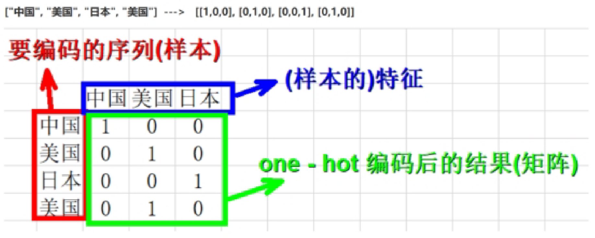

# Pytorch分类与回归

## 分类问题与回归问题原理

- 分类问题预测的是类别,模型的输出是概率分布

- 回归问题预测的是值,模型的输出是一个实数值

  

### 分类问题

- 为什么要分为训练集，验证集，测试集：为了防止人工调参造成的测试集的信息泄露

- 三分类真实类别，使用One-hot编码, 把正整数变为向量表达，生成一个长度等于类别总数 K 的向量（K 必须大于最大的类别编号，因为编号从 0 开始），只有该整数对应的位置处为1其余位置都为0，例如：

  - 0 -> [1, 0, 0]
  - 1 -> [0, 1, 0]
  - 2 -> [0, 0, 1]

  

- 三分类问题输出例子: [0.2, 0.7, 0.1]，这里的结果是一个概率值，利用softmax（输出激活函数）

### Softmax输出激活函数

$$
\sigma(z)_j=\frac{e^{z_j}}{\sum_{k=1}^{K}e^{z_k}},j=1,2...K
$$


- 将分子除以总和，实现**归一化（Normalization）**，确保所有输出值的和等于 1
- 保留了最大值的优势，但给了一个“软化”的概率分布。即使是较小的值也保留了非零的概率。这使得函数处处可导，非常适合神经网络训练
- 在训练过程中，Softmax 几乎总是与交叉熵损失函数（Cross-Entropy Loss）配合使用
  - Softmax 负责把模型输出变成概率
  - Cross-Entropy 负责衡量这个”预测概率”与”真实标签（One-hot编码）”之间的距离

> **📝 补充说明：Softmax 公式拆解**
>
> 公式中每个符号的含义：
>
> | 符号 | 含义 | 举例 |
> |------|------|------|
> | $z_j$ | 模型对第 $j$ 类的**原始输出分数**（也叫 logits），未经任何归一化 | 比如模型输出 `[2.0, 1.0, 0.1]`，则 $z_1=2.0$, $z_2=1.0$, $z_3=0.1$ |
> | $K$ | 总类别数 | 三分类问题中 $K=3$ |
> | $e$ | 自然常数 $\approx 2.718$ | $e^{z_j}$ 即 $e$ 的 $z_j$ 次方 |
> | $\sum_{k=1}^{K}e^{z_k}$ | 所有类别的 $e^{z_k}$ 的**总和** | $e^{2.0}+e^{1.0}+e^{0.1} \approx 7.39+2.72+1.11=11.22$ |
> | $\sigma(z)_j$ | 第 $j$ 类的**最终概率** | $\sigma(z)_1 = \frac{7.39}{11.22} \approx 0.659$ |
>
> **直观理解**：Softmax 做了两件事：
> 1. 用 $e^{z_j}$ 把分数变成正数（指数函数 $e^x$ 永远 > 0），同时**放大**高分与低分的差距
> 2. 除以总和，让所有概率加起来恰好等于 1
>
> **为什么用 $e$ 而不是直接除以总和？**
> 因为指数函数放大差距的效果更好。假设 logits 是 `[3, 1]`：
> - 直接归一化：`[3/4, 1/4]` = `[0.75, 0.25]`
> - Softmax：`[e³/(e³+e¹), e¹/(e³+e¹)]` ≈ `[0.88, 0.12]`
>
> Softmax 让”赢家”的优势更明显，同时”输家”也不会是 0（处处可导）。

### 交叉熵损失和均方误差损失对比分析

**均方误差（回归）** 公式
$$
MSE=\frac{1}{n}\sum_{i=1}^{n}(y_i-\hat{y_i})^2
$$
**交叉熵损失**公式
$$
L=\frac{1}{N}\sum_{i}L_i=-\frac{1}{N}\sum_{i}\sum_{c=1}^{M}y_{ic}log(p_{ic})
$$

> **📝 补充说明：交叉熵公式拆解**
>
> 公式看起来很复杂，我们拆开来看：
>
> | 符号 | 含义 | 举例 |
> |------|------|------|
> | $N$ | 样本总数 | 一个 batch 有 64 张图片，$N=64$ |
> | $M$ | 类别总数 | FashionMNIST 有 10 类衣服，$M=10$ |
> | $y_{ic}$ | 第 $i$ 个样本在类别 $c$ 上的**真实标签**（One-hot，要么 0 要么 1） | 样本是"裙子 Dress"（FashionMNIST 中标签为 3，编号从 0 开始），则 $y_i = [0,0,0,1,0,0,0,0,0,0]$ |
> | $p_{ic}$ | 第 $i$ 个样本在类别 $c$ 上的**预测概率**（Softmax 的输出） | 模型预测 $p_i = [0.1, 0.05, 0.02, 0.7, ...]$ |
> | $\log$ | 自然对数（以 $e$ 为底），即 $\ln$ | $\ln(0.7) \approx -0.357$, $\ln(0.1) \approx -2.303$ |
>
> **直观理解**（一个样本的情况）：
>
> $$L_i = -\sum_{c=1}^{M} y_{ic} \cdot \ln(p_{ic})$$
>
> 因为 $y_{ic}$ 只有正确类别那一位是 1，其余全是 0，所以这个求和实际上**只有一项起作用**：
>
> $$L_i = -\ln(p_{i,\text{正确类别}})$$
>
> 也就是说，交叉熵损失**只关心模型对"正确答案"预测的概率**：
>
> | 对正确类别的预测概率 | $-\ln(p)$ | 含义 |
> |:---:|:---:|------|
> | 0.9 | $-\ln(0.9) \approx 0.105$ | 预测很准，损失很小 ✓ |
> | 0.5 | $-\ln(0.5) \approx 0.693$ | 半信半疑，损失中等 |
> | 0.1 | $-\ln(0.1) \approx 2.303$ | 几乎猜错，损失很大 ✗ |
> | 0.01 | $-\ln(0.01) \approx 4.605$ | 完全猜错，损失巨大 ✗✗ |
>
> 当 $p \to 1$ 时，$-\ln(p) \to 0$（损失趋近于 0，完美预测）。
> 当 $p \to 0$ 时，$-\ln(p) \to +\infty$（损失趋近于无穷，惩罚极重）。

- 当输出值与真实值接近的话，交叉熵和均方误差（MSE）的值都会接近0
- 交叉熵具有MSE不具有的优点：避免学习速度变慢的情况——MSE 配合 Sigmoid/Softmax 时梯度会变小、学习变慢（注意这种效果仅限于输出层，隐藏层的学习速度与其使用的激活函数密切相关）
- 主要原因是逻辑回归配合MSE损失函数时，采用梯度下降法进行学习时，会出现模型一开始训练时，学习速率非常慢的情况（MSE损失函数）
- 均方损失：假设误差是正态分布，适用于线性的输出(如回归问题)，特点是对于与真实结果差别越大，则惩罚力度越大，这并不适用于分类问题
- 交叉熵损失：假设误差是二值分布，可以视为预测概率分布和真实概率分布的相似程度，在分类问题中有良好的应用

示例：

| 预测        | 真实  | 是否正确 |
| ----------- | ----- | -------- |
| 0.3 0.3 0.4 | 0 0 1 | 正确     |
| 0.3 0.4 0.3 | 0 1 0 | 正确     |
| 0.1 0.2 0.7 | 1 0 0 | 错误     |

- MSE
  $$
  sample\_1\_loss=(0.3-0)^2+(0.3-0)^2+(0.4-1)^2=0.54
  $$

  $$
  sample\_2\_loss=(0.3-0)^2+(0.4-1)^2+(0.3-0)^2=0.54
  $$

  $$
  sample\_3\_loss=(0.1-1)^2+(0.2-0)^2+(0.7-0)^2=1.34
  $$

  对所有样本求loss平均
  $$
  MSE=\frac{0.54+0.54+1.34}{3}=0.81
  $$

  > 注：此处的口径是"每个样本对各类别求**和**，再对样本平均"。PyTorch 的 `nn.MSELoss` 默认对**全部元素**取平均（此例共 9 个元素，结果为 $2.42/9 \approx 0.269$），两者相差一个类别数因子 3，只是约定不同，不影响比较结论。

- L
  $$
  sample\_1\_loss=-(0*log(0.3)+0*log(0.3)+1*log(0.4))=0.92
  $$

  $$
  sample\_2\_loss=-(0*log(0.3)+1*log(0.4)+0*log(0.3))=0.92
  $$

  $$
  sample\_3\_loss=-(1*log(0.1)+0*log(0.2)+0*log(0.7))=2.30
  $$

  对所有样本求loss平均
  $$
  L=\frac{0.92+0.92+2.30}{3}=1.38
  $$

- **交叉熵损失更能捕捉到预测效果的差异，交叉熵损失相对于均方误差损失梯度更大，能够让模型更快收敛**

> **📝 补充说明：为什么 MSE 在分类问题中会导致学习缓慢？**
>
> 这是笔记中最核心的一个结论，我们深入理解一下。
>
> **问题的本质**：分类模型最后一层通常用 **Sigmoid**（二分类）或 **Softmax**（多分类）把输出变成概率。MSE 配合 Sigmoid/Softmax 时，会出现"梯度消失"。
>
> 以二分类 + Sigmoid 为例（数学上最简洁）：
> - 模型输出经过 Sigmoid：$\hat{y} = \sigma(z) = \frac{1}{1+e^{-z}}$
> - MSE 损失：$L = \frac{1}{2}(\hat{y} - y)^2$
> - 对参数 $w$ 求梯度（链式法则）：$\frac{\partial L}{\partial w} = (\hat{y}-y) \cdot \sigma'(z) \cdot x$
>
> **这个公式是怎么来的？—— 链式法则逐步推导**
>
> 我们有三个嵌套在一起的东西，从外到内分别是：
>
> 1. **损失函数** $L = \frac{1}{2}(\hat{y} - y)^2$（最外层：用预测值 $\hat{y}$ 计算误差）
> 2. **Sigmoid 激活** $\hat{y} = \sigma(z) = \frac{1}{1+e^{-z}}$（中间层：把原始分数 $z$ 变成概率）
> 3. **线性变换** $z = wx + b$（最内层：参数 $w$ 和输入 $x$ 的线性组合）
>
> 要求 $\frac{\partial L}{\partial w}$，就是求"损失 $L$ 对参数 $w$ 的变化有多敏感"。根据链式法则，从外到内一层层求导再相乘：
>
> $$\frac{\partial L}{\partial w} = \underbrace{\frac{\partial L}{\partial \hat{y}}}_{\text{第①步}} \cdot \underbrace{\frac{\partial \hat{y}}{\partial z}}_{\text{第②步}} \cdot \underbrace{\frac{\partial z}{\partial w}}_{\text{第③步}}$$
>
> **第 ① 步**：损失对预测值求导
>
> $$L = \frac{1}{2}(\hat{y} - y)^2$$
> $$\frac{\partial L}{\partial \hat{y}} = \frac{1}{2} \cdot 2(\hat{y} - y) \cdot 1 = \hat{y} - y$$
>
> 含义：如果预测值 $\hat{y}$ 比真实值 $y$ 大，增大 $\hat{y}$ 会让损失变大（导数为正）；反过来则变小。
>
> **第 ② 步**：预测值对原始分数求导（Sigmoid 的导数）
>
> $$\hat{y} = \sigma(z) = \frac{1}{1+e^{-z}}$$
> $$\frac{\partial \hat{y}}{\partial z} = \sigma'(z) = \sigma(z)(1-\sigma(z)) = \hat{y}(1-\hat{y})$$
>
> 这是 Sigmoid 函数的一个优雅性质：它的导数可以用自己的函数值表示。
>
> **第 ③ 步**：原始分数对权重求导
>
> $$z = wx + b$$
> $$\frac{\partial z}{\partial w} = x$$
>
> 含义：权重 $w$ 对 $z$ 的贡献正好是输入 $x$。
>
> **三步相乘，得到最终梯度**：
>
> $$\boxed{\frac{\partial L}{\partial w} = (\hat{y} - y) \cdot \sigma'(z) \cdot x}$$
>
> 也可以写成 $\frac{\partial L}{\partial w} = (\hat{y} - y) \cdot \hat{y}(1-\hat{y}) \cdot x$
>
> **直观理解**：这个梯度由三部分决定：
> - $(\hat{y} - y)$：预测值与真实值的差距，差距越大梯度越大 ✓
> - $\sigma'(z)$：Sigmoid 在当前点的斜率，这是**问题所在**（见下文）
> - $x$：输入值的大小
>
> 问题出在 $\sigma'(z)$ 上。看 Sigmoid 的图像：
>
> ```
> σ(z) 值:    0.0    0.1    0.5    0.9    0.99
> σ'(z) 值:   0.0    0.09   0.25   0.09   0.0099
> ```
>
> **当模型预测非常确定（0.99 或 0.01）但恰好是错的时候**，$\sigma'(z)$ 趋近于 0，梯度趋近于 0，参数几乎不更新——模型"卡住了"。
>
> **对比交叉熵**（配合 Sigmoid）：
> - $L = -[y\ln(\hat{y}) + (1-y)\ln(1-\hat{y})]$
> - $\frac{\partial L}{\partial w} = (\hat{y} - y) \cdot x$
>
> 发现没有？**$\sigma'(z)$ 被消掉了！** 梯度直接等于"预测值与真实值的差"。预测越错，梯度越大，学得越快。
>
> **通俗类比**：
> - MSE + Sigmoid = 一个老师，学生答得离谱时反而懒得纠正（梯度小）
> - 交叉熵 + Sigmoid/Softmax = 一个老师，学生答得越离谱，纠正力度越大（梯度大）
>
> 这就是为什么**分类问题标配是 Softmax + 交叉熵**，而**回归问题用 MSE**（回归的**输出层**不经过 Sigmoid/Softmax，不存在上述输出层梯度消失问题；但隐藏层若使用 Sigmoid/Tanh 等激活函数，仍可能出现梯度消失）。

### 标准化与归一化

`transforms.Normalize(mean, std)`将图像张量的每个通道进行归一化，这里的`mean`和`std`是根据数据集的特性和需求来确定的

通过将`Normalize`变换与其他变换（如`ToTensor()`）组合在一起，可以在加载数据集时自动应用归一化操作，这样训练数据将在输入模型之前进行归一化处理

`transforms.ToTensor()`主要执行以下操作：

- 缩放像素值：将图像中每个通道的像素值从 [0, 255] 归一化到 [0.0, 1.0]（通过将每个像素值除以 255 来实现）
- 增加通道维度：对于单通道的灰度图像，它会增加一个通道维度，使其成为具有三个维度的张量，即 [channels, height, width]（如 28×28 灰度图 → `[1, 28, 28]`）；对于三通道的彩色图像，它将保持三个通道
- 转换数据类型：将图像数据转换为浮点数类型（float32），因为 PyTorch 的神经网络层通常处理浮点数数据

#### 方差公式

$$
\sigma^2=\frac{1}{N}\sum_{i=1}^{N}(x_i-\mu)^2,\mu=\frac{1}{N}\sum_{i=1}^{N}x_i
$$

**等价展开**
$$
\frac{1}{N}\sum_{i=1}^{N}(x_i-\mu)^2=\frac{1}{N}\sum_{i=1}^{N}x_i^2-2\mu·\frac{1}{N}\sum_{i=1}^{N}x_i+\mu^2=\frac{1}{N}\sum_{i=1}^{N}x_i^2-\mu^2
$$

> **📝 补充说明：方差公式展开推导**
>
> 这个展开是代码中计算方差的关键（不必重写循环），我们逐步推导：
>
> **第 1 步**：展开平方项
> $$(x_i - \mu)^2 = x_i^2 - 2\mu x_i + \mu^2$$
>
> **第 2 步**：对 $i$ 从 1 到 $N$ 求和
> $$\sum_{i=1}^{N}(x_i - \mu)^2 = \sum x_i^2 - 2\mu\sum x_i + N\mu^2$$
>
> **第 3 步**：除以 $N$，逐项处理
> $$\frac{1}{N}\sum(x_i-\mu)^2 = \underbrace{\frac{1}{N}\sum x_i^2}_{\text{x²的均值}} - 2\mu \cdot \underbrace{\frac{1}{N}\sum x_i}_{\text{x的均值}=\mu} + \mu^2$$
>
> **第 4 步**：代入 $\frac{1}{N}\sum x_i = \mu$
> $$= \frac{1}{N}\sum x_i^2 - 2\mu^2 + \mu^2$$
> $$= \frac{1}{N}\sum x_i^2 - \mu^2$$
>
> **结论**：$\boxed{Var(X) = E[X^2] - (E[X])^2}$
>
> 这就是后文代码中 `var = mean_of_squares - mean ** 2` 的数学依据——只需一次遍历算出 `mean` 和 `mean_of_squares`，无需两次遍历。
>
> **具体例子**：数据 `[2, 4, 6]`
> - $\mu = (2+4+6)/3 = 4$
> - $E[X^2] = (4+16+36)/3 = 18.67$
> - $Var = 18.67 - 16 = 2.67$
> - 验证：$[(2-4)² + (4-4)² + (6-4)²]/3 = (4+0+4)/3 = 2.67$ ✓

```python
# 定义数据集的变换
transform = transforms.Compose([
    transforms.ToTensor(), 
    transforms.Normalize(mean, std)
])
```

### earlystoping早停

为了避免过拟合

| 参数      | 注释                                                         |
| --------- | ------------------------------------------------------------ |
| min_delta | 监视数量的最小变化有资格作为改进，即绝对变化小于min_delta，将不视为改进 |
| Patience  | 变化量小于min_delta的时期数（没有改善），之后训练将停止      |

### ModelCheckpoint模型保存

- 为了上线
- 避免模型中途训练终止，再次训练可以从上次的保存点进行

 ```python
 torch.save(model.state_dict(), save_path)
 # state_dict()中存储每一层的权重weight和偏置bias
 # save_path保存路径，业界默认设置为best_model.pth
 ```

### TensorBoard

- `pip install tensorboard`

- tensor记录模型输出日志

- ```bash
  tensorboard --logdir="E:/xxx/tensorboard_logs" --host 0.0.0.0 --port 8848
  必须为绝对路径
  ```

- 访问：`http://localhost:8848/`


### 📝 核心概念速查（在看代码之前）

后面代码中会出现一些关键术语，先弄清楚它们：

#### 1. Logits（原始分数 / 未归一化分数）

**Logits** 是神经网络最后一层输出的**原始数值**，还没有经过 Softmax 变成概率。

| | Logits | 概率（Softmax 之后） |
|---|---|---|
| 数值范围 | $(-\infty, +\infty)$，可正可负 | $[0, 1]$，加和为 1 |
| 例子 | `[2.0, 1.0, 0.1]` | `[0.66, 0.24, 0.10]` |
| 谁产生 | `nn.Linear` 全连接层直接输出 | 对 logits 做 Softmax |

> PyTorch 的 `nn.CrossEntropyLoss()` **接收的是 logits**，它内部会自动做 Softmax。所以你的模型最后一层不需要加 Softmax！

#### 2. Epoch（轮次）、Batch（批次）、Iteration（迭代）

这是三个最容易混淆的概念，用一个类比：

> **你在背一本 1000 页的单词书：**
> - **Epoch（轮次）**：把整本书从头到尾背了**一遍**。epoch=10 就是背了 10 遍。
> - **Batch（批次）**：你不可能一次背完整本书，每次只背**几页**。batch_size=64 就是每次背 64 页。
> - **Iteration（迭代）**：每背一次（一个 batch）就是一次迭代。1000 页 ÷ 64 页/次 ≈ 16 次迭代 = 1 个 epoch。

```
训练集 55000 张图片, batch_size = 64
    → 1 epoch = ceil(55000 / 64) = 860 次 iteration
    → 每个 iteration 处理 64 张图片
    → 10 个 epoch = 10 × 860 = 8600 次参数更新
```

#### 3. 梯度下降的五步（训练的核心循环）

```python
optimizer.zero_grad()   # ① 清空上一轮的梯度（PyTorch 默认累加）
outputs = model(images)  # ② 前向传播：输入→模型→预测
loss = criterion(outputs, labels)  # ③ 计算损失：衡量预测与真实的差距
loss.backward()          # ④ 反向传播：自动计算每个参数的梯度
optimizer.step()         # ⑤ 更新参数：w_new = w_old - lr × gradient
```

**类比**：你在山上想走到山谷最低点（最小化损失）：
1. 放下之前的笔记（清空梯度）
2. 看看周围的地形（前向传播）
3. 算算离谷底还有多远（计算损失）
4. 判断哪个方向是下坡（反向传播求梯度）
5. 往下坡走一步（更新参数）

#### 4. ReLU 激活函数：$f(x) = \max(0, x)$

| 输入 | 输出 |
|:---:|:---:|
| 3 | 3（正数直接通过） |
| -5 | 0（负数变成 0） |

**为什么需要它？** 如果没有 ReLU，多层全连接网络等价于一层（线性变换的复合还是线性）。ReLU 引入**非线性**，让网络能学习复杂的曲线和边界。

#### 5. 过拟合（Overfitting）

| 现象 | 训练集上 | 验证集/测试集上 |
|------|:---:|:---:|
| 欠拟合 | 表现差 | 表现差 |
| **刚好** | 表现好 | 表现好 |
| **过拟合** | 表现极好（99%） | 表现差（80%） |

过拟合 = **死记硬背**训练数据，失去了泛化能力。解决方案：早停（Early Stopping）、Dropout、数据增强、正则化。

#### 6. SGD 动量（Momentum）

PyTorch `optim.SGD` 的动量实现为：

$$v_t = \mu \cdot v_{t-1} + g_t, \qquad w \leftarrow w - lr \cdot v_t$$

其中 $\mu$ 就是 `momentum` 参数，$g_t$ 是当前梯度。注意：**新梯度不乘 $(1-\mu)$**——这与指数移动平均（EMA）形式 $v_t = \beta v_{t-1} + (1-\beta)g_t$ 不同，后者是部分教材和其他框架的写法，两者只差一个常数缩放，但解读时不要混用。

**类比**：普通 SGD 是每一步都重新判断方向（容易震荡），带动量的 SGD 像滚雪球——之前的方向有**惯性**，不会被当前一步的小波动带偏。`momentum=0.9` 意味着历史速度以 0.9 的系数衰减累积，当前梯度全额加入。

### 分类示例-FashionMNIST

### 回归问题

> **📝 回归 vs 分类的本质区别**
>
> | | 分类 (Classification) | 回归 (Regression) |
> |---|---|---|
> | **预测什么** | 类别标签（离散值） | 数值（连续值） |
> | **输出层激活函数** | Softmax（多分类）/ Sigmoid（二分类） | 无激活函数（或线性） |
> | **输出含义** | 概率分布（和为 1） | 任意实数 |
> | **输出维度** | 类别数（如 10） | 1（如预测一个房价） |
> | **损失函数** | CrossEntropyLoss | MSELoss / L1Loss（即 MAE，PyTorch 中没有 `MAELoss` 这个类名） |
> | **评估指标** | 准确率 (Accuracy) | MSE / RMSE / MAE / R² |
> | **例子** | 识别图片是"衬衫"还是"裤子" | 预测房价是多少万元 |
>
> **回归模型的输出层**：
> ```python
> nn.Linear(30, 1)   # 输入 30 维 → 输出 1 维（一个数值）
> # 注意：后面不加 Softmax！输出就是一个实数
> ```
>
> **为什么回归不用 Softmax？**
> Softmax 把所有输出压缩到 [0,1] 且和为 1，这是概率的要求。回归需要输出任意实数（房价可能是 15.3 万，也可能是 500 万），不能限制在 [0,1] 之间。
>
> **StandardScaler 标准化**（回归中非常重要的预处理步骤）：
> $$x_{\text{norm}} = \frac{x - \mu}{\sigma}$$
> 把每个特征变成均值为 0、标准差为 1 的分布。为什么要做？
> 比如房价数据：特征"房间数"范围是 [1, 10]，特征"收入中位数"范围是 [0, 15]，特征"经度"范围是 [-124, -114]——尺度差异巨大，不做标准化的话，数值大的特征会主导梯度更新。
>
> **Adam 优化器 vs SGD**：
> - **SGD**：所有参数用同一个学习率，固定步长
> - **Adam**：每个参数有**自适应**的学习率——梯度大的参数用小步，梯度小的参数用大步。收敛更快，是回归任务的常用选择。

### 示例-加利福尼亚房价
