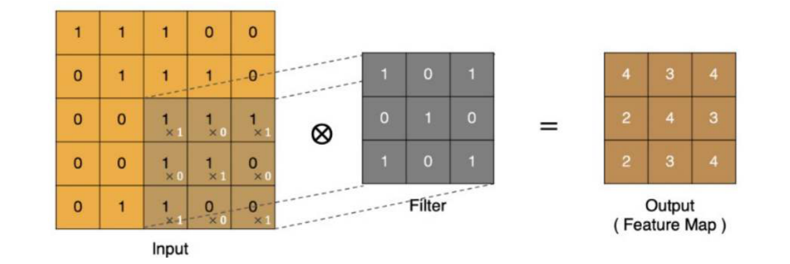
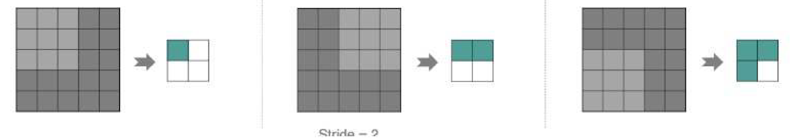
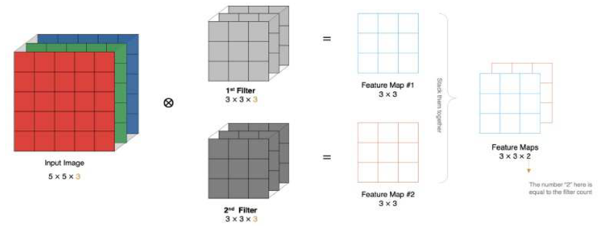
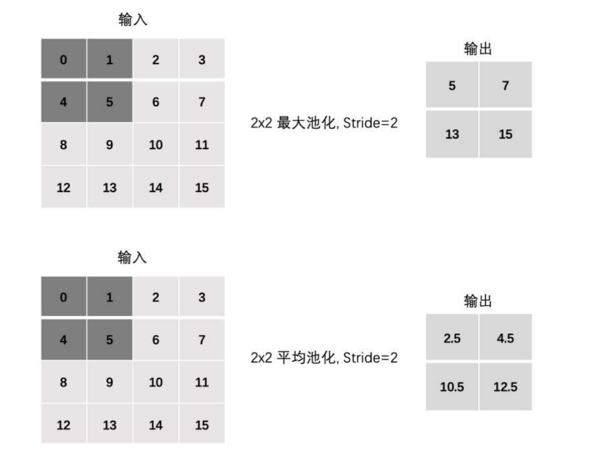
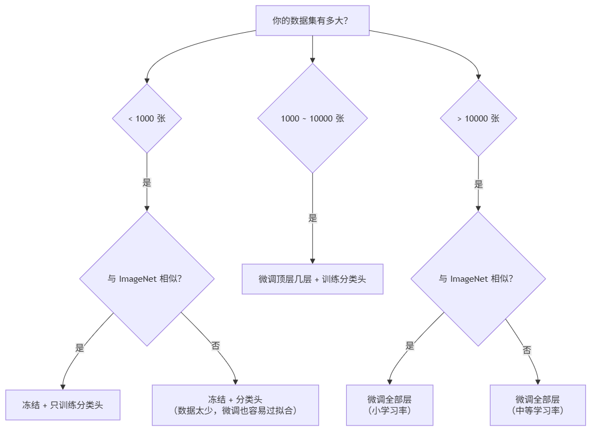
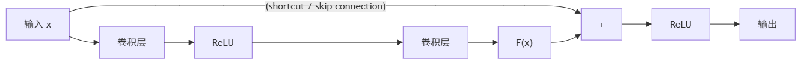

# 卷积神经网络CNN1

前置知识：图像

颜色在计算机中的表示：

- 灰度图像
  - 每一个像素点只有一个值，这个值代表其亮度
  - 这个值的范围是0~255, 0代表纯黑，255代表纯白
  - 因此，一张28×28的图片，在计算机中对应的就是一个28×28的二维数组
- 彩色图像
  - 每个像素点由三个值组成，分别代表红（Red）、绿（Green）、蓝（Blue）三个通道的亮度，即RGB
  - 每个通道的值也通常在 0到 255 之间
  - 因此，一幅大小为 28×28 的彩色图像，就对应一个 28 × 28 × 3 的三维数组

> **注意：图像存储的两种约定**
>
> 上面描述的 `(H, W, C)` 即 (高度, 宽度, 通道) 是人理解图像的方式，也是 PIL 等图片库的存储格式。
> 但在 PyTorch 中，张量的形状约定是 `(C, H, W)` ——通道在最前面。这是因为 GPU 上的矩阵运算按通道并行计算更高效。
> `transforms.ToTensor()` 做的事情之一就是把 `(H, W, C)` 转成 `(C, H, W)`。加上 batch 维度后，代码中常见的四维张量形状为 `(N, C, H, W)`（N = batch size，一批几张图片）。
> 下文代码中的 `(1, 28, 28)` 即是 PyTorch 的 `(C, H, W)` 格式。

**展平（Flatten）：**

展平（Flatten）是指**把多维数组（张量）拉伸成一维数组（向量）**的过程，是连接"卷积/池化输出的特征图"和"全连接层"之间不可或缺的一步。

**为什么要展平？**

- 全连接层（`nn.Linear`）要求输入是一个二维张量 `(batch, 特征数)`，即每个样本是一个一维向量
- 而卷积层和池化层输出的特征图是多维的，形状为 `(N, C, H, W)`，例如 `(4, 128, 3, 3)`
- 所以特征图在送入全连接层之前，必须把每个样本的 `(C, H, W)` 部分"拉直"成一维向量

**怎么展平？**

以一张 3×3 的灰度图像（简化）为例，展平就是按行从左到右、从上到下依次排成一排：

```
原始图像（2D 数组）:                 展平后（1D 向量）:
[[1, 2, 3],                       [1, 2, 3, 4, 5, 6, 7, 8, 9]
 [4, 5, 6],
 [7, 8, 9]]
```

代码示例（NumPy 与 PyTorch 两种实现）：

```python
import numpy as np
import torch

# ========== NumPy：ndarray.flatten() ==========
# 模拟一张 3×3 的灰度图（二维数组）
img = np.array([[1, 2, 3],
                [4, 5, 6],
                [7, 8, 9]])
flat = img.flatten()  # 展平成一维数组
print("展平前 shape:", img.shape)   # (3, 3)
print("展平后 shape:", flat.shape)  # (9,)
print("展平结果:", flat)            # [1 2 3 4 5 6 7 8 9]

# ========== PyTorch：view(-1) ==========
# 模拟一张单通道图像 (C, H, W) = (1, 3, 3)
x = torch.arange(1, 10).reshape(1, 3, 3)  # 形状 (1, 3, 3)
flat1 = x.view(-1)  # -1 表示该维度大小由系统根据元素总数自动推断
print("view(-1) 结果:", flat1)          # tensor([1, 2, 3, 4, 5, 6, 7, 8, 9])
print("view(-1) shape:", flat1.shape)   # torch.Size([9])

# ========== PyTorch：flatten(x, start_dim) —— CNN 中最常用 ==========
# 加上 batch 维度 → (N, C, H, W) = (1, 1, 3, 3)
x_batch = x.unsqueeze(0)
print("x_batch shape:", x_batch.shape)  # torch.Size([1, 1, 3, 3])

# 从第 1 维开始展平，保留 batch 维不动
flat2 = torch.flatten(x_batch, 1)
print("flatten(x, 1) shape:", flat2.shape)  # torch.Size([1, 9])
```

> **view(-1) 与 flatten(x, 1) 的区别**
>
> - `view(-1)` 把**整个张量**展平成一维，会连 batch 维一起压扁，适合单张图片（如后面计算整个数据集像素的均值/方差时用）
> - `torch.flatten(x, 1)` 中的 `1` 是 `start_dim`（起始维度），从第 1 维开始展平、**保留 batch 维**：`(N, C, H, W)` → `(N, C×H×W)`，每个样本各自拉成一个向量
> - 因此在 CNN 的 `forward` 里统一用 `torch.flatten(x, 1)`，正如本文下面模型中的 `(batch, 128, 3, 3)` → `(batch, 1152)` 再送入 `fc1`

**为什么不用全连接（Linear）神经网络来处理图像？**

- 参数爆炸：以224×224×3的彩色图像为例，如果我们把它展平为一个向量，那么向量的长度 = 224×224×3 = 150528。如果下一个连接层有1000个神经元，那么仅仅这一层的参数就有 150528000个。这会**导致模型巨大，训练困难，且容易过拟合**
- 丢失空间信息：图像的空间结构（比如一个像素点和它相邻的像素点之间的关系）对于理解图像内容至关重要。全连接网络将所有的像素视为独立的输入，完全破坏了这种空间关系

**卷积神经网络（Convolutional Neural Network**, **CNN）** 是一种专门设计用于处理具有网格结构数据（如图像、语音 spectrogram）的深度学习模型

CNN网络主要由三部分构成：卷积层、池化层和全连接层构成：

- 卷积层负责提取图像中的局部特征
- 池化层通过下采样减少特征图的空间尺寸，从而间接减少后续层（尤其是全连接层）的参数量和计算量
- 全连接层用来输出想要的结果


如上图所示：

- 汽车图片就是输入数据，是一个三维数组（H、W、C）
- CONV就是卷积层，卷积层的激活函数一般使用ReLU

> **为什么卷积后面要跟激活函数（如 ReLU）？**
>
> 卷积运算是**线性的**（乘加运算），多层线性变换的复合仍然等价于一个线性变换。这意味着不管堆多少层卷积，模型的表达能力都和一层没有区别。激活函数通过引入"拐弯"（非线性），让网络能学习复杂的模式。类比：一根铁丝永远是直的，有了折弯才能弯成各种形状。
>
> ReLU 的公式为 `f(x) = max(0, x)`：正数保持不变，负数直接变 0。它计算简单、梯度不衰减（正数区梯度恒为 1），因此成为 CNN 中最常用的激活函数。
- POOL就是池化层，一般用来降维
- 在经过卷积层和池化层处理之后，FC就是全连接层，用来整合特征并且输出想要的结果

## 卷积层

**核心组件——卷积核：** 卷积核是一个比输入图像小的二维矩阵，包含了一组可学习的权重参数

**工作原理：**

- 将卷积核的左上角与输入特征图的左上角对齐
- 计算卷积核与输入特征图对应位置元素的乘积之和（这是一个点积操作）
- 将计算结果作为输出特征图（Feature Map）对应位置的一个像素值
- 按照一定的**步长** (**Stride**)，将卷积核在输入特征图上滑动，并重复步骤 2 和 3，直到整个输入特征图都被扫描完毕

### 卷积的计算过程


- input 表示输入的图像
- filter 表示滤波器，也叫做卷积核（滤波矩阵）
- input 经过 filter 得到输出为最右侧的图像，该图叫做特征图

**在 CNN 中，卷积运算在实现上更接近互相关操作，即对局部区域与卷积核做逐元素乘加（点积）计算**

> **为什么叫"卷积"但实际做的是"互相关"？**
>
> 数学上的**卷积（Convolution）**要求先把卷积核上下左右翻转 180°，再滑动做点积。而深度学习框架（PyTorch/TensorFlow）中实际做的是**互相关（Cross-Correlation）**——**不翻转**，直接滑动点积。
>
> 那为什么不做真正的卷积？因为卷积核的权重是**学出来的**——翻不翻转没有区别，反正权重会自动调整到合适的值。不翻转还省了一步计算。所以"卷积神经网络"这个名字是历史沿袭，实际运算更准确地说应该是互相关。


最后的特征图结果为：



### Padding

通过上面的卷积计算过程，我们发现：

- 最终的特征图比原始图像小
- 输入边缘被扫描的次数少，输入中间被扫描的次数多

为了解决以上两个问题，我们可以在输入边缘加上填充（在周围加一圈的像素点，像素点的值为0，可以保证图像尺寸不变）：


### Stride

步长：每次移动的像素点数

在上面卷积核移动扫描的过程中，步长为1，计算特征图如下所示：


如果把步长增大为2，也是可以提取特征图的，如下图所示：



### 多通道卷积计算

**输入图像是几通道的，卷积核就是几通道的**


### 多卷积核计算

**有几个卷积核，就有几个特征图，每一个卷积核对应一个特征图，输出的通道数等于卷积核的个数**



> **常见误区辨析：卷积核的"维度"到底是多少？**
>
> 初学者常困惑：每个卷积核是 2D（如 3×3）还是 3D（如 3×3×M）？
>
> **答案**：每个卷积核实际上是 **3D** 的，形状为 `(K, K, M)`（M = 输入通道数）。它在空间上是 K×K，但深度上覆盖所有输入通道。
> 那为什么图示里常画成 2D？因为**一张图只画了单通道的情况**（M=1），此时 3D 退化为 2D。
>
> - 一个卷积核在 H×W 上滑动，同时对 M 个通道做加权求和 → 输出 **1 个**通道
> - N 个卷积核 → 输出 **N 个**通道
> - 所以 `nn.Conv2d(in_channels=M, out_channels=N, kernel_size=K)` 的实际参数量 = **K × K × M × N**（+ N 个 bias，如果 bias=True）
>
> 至此，可以理解 PyTorch 的卷积层参数：`Conv2d(in_channels, out_channels, kernel_size)` 中，`in_channels` 决定了每个卷积核的深度，`out_channels` 决定了有多少个不同的卷积核。

> **例如：如何理解 `nn.Conv2d(in_channels=3, out_channels=8, kernel_size=3, stride=2, padding=0)`**
>
> **第 1 步：通道就是"叠了几张图"。**
>
> - 灰度图：只有 1 张 → 1 通道
> - 彩色图：红、绿、蓝 3 张叠在一起 → 3 通道
>
> 所以 `in_channels=3` 就是：**输入进来的是 3 张叠在一起的图**（红一张、绿一张、蓝一张）。
>
> **第 2 步：输出的 8 是什么意思。**
>
> `out_channels=8` 就是：**这一层要输出 8 张图**。注意这个 8 是自己随便定的，跟输入的 3 没关系，可以写 16、32、64 都行，意思是"提取 8 种不同的特征"。
>
> **第 3 步：3 张图怎么变成 8 张图？靠"滤镜"。**
>
> 把它想成 PS 里的滤镜最直观：
>
> - 用 1 个滤镜处理 3 张输入图 → 得到 1 张新图
> - 用 8 个不同的滤镜 → 得到 8 张新图
>
> **第 4 步：一个滤镜怎么从 3 张图算出 1 张图。**
>
> 1. 滤镜是个小窗口（如 3×3），同时压在 3 张图的同一个位置上
> 2. 把这 3 个区域里的像素值算加权和 → 得到 1 个数字
> 3. 滤镜在图上滑动，每滑到一个位置就算出 1 个数字
> 4. 滑完整张图，所有数字拼起来 → 就是 1 张新图
>
> 完整串起来：
>
> ```
> 输入：3 张图（红、绿、蓝）            in_channels = 3
>     ↓  同时用 8 个滤镜，各自扫一遍
> 滤镜1 → 新图1  滤镜2 → 新图2  …  滤镜8 → 新图8
>     ↓  8 张新图叠在一起
> 输出：8 张图                          out_channels = 8
> ```
>
> 一句话记住：**`in_channels` 是"输入有几张图"（红绿蓝 3 张，写死不能改），`out_channels` 是"我想输出几张图"（自己定的，8 就表示用 8 个滤镜提取 8 种特征）。**

### 特征图的大小

特征图的大小与以下的参数息息相关：

- 卷积核的大小，一般设置为奇数，比如 1×1，3×3，5×5

> **为什么卷积核尺寸一般取奇数？**
>
> - 奇数核有**明确的中心点**，方便对齐。比如 3×3 的中心是 (1,1)，5×5 的中心是 (2,2)。
> - **方便做 padding**：3×3 的核配 padding=1，5×5 的核配 padding=2，就能对称地在四周补零，保持输出尺寸不变。偶数核找不到对称的中心，padding 会不对称。

- Padding：零填充的层数

-  Stride：步长

假如输入图像为方形：

- 输入图像大小 W×W
- 卷积核大小：K×K
- 步长Stride → S
- 填充Padding → P
- 输出图像大小：N×N

特征图的计算公式：
$$
N=\frac{W-K+2P}{S}+1
$$

> **注意：整除和取整**
>
> 当 `(W - K + 2P)` 不能被 `S` 整除时，PyTorch / TensorFlow 会**向下取整（floor）**。比如 W=32, K=3, P=0, S=2：
>
> $$N = \lfloor\frac{32-3+0}{2}\rfloor + 1 = \lfloor 14.5 \rfloor + 1 = 14 + 1 = 15$$
>
> 这就是为什么示例代码中 `(1, 3, 32, 32)` 经过 `kernel_size=3, stride=2` 卷积后变成 `(1, 8, 15, 15)` 而不是 15.5。

### 示例

```python
import torch
import torch.nn as nn

x = torch.randn(1, 3, 32, 32)  # 创建一个随机张量，形状为 (batch=1, channels=3, height=32, width=32)
print("输入x的shape:", x.shape)  # torch.Size([1, 3, 32, 32])

conv = nn.Conv2d(in_channels=3, out_channels=8, kernel_size=3, stride=2, padding=0)  # 创建二维卷积层：输入3通道，输出8通道，3×3卷积核，步长2，无填充
y = conv(x)  # 对输入x执行卷积操作，得到输出y
print("卷积后y的shape:", y.shape)  # torch.Size([1, 8, 15, 15])
```

## 池化层

池化层通常紧跟在卷积层之后，用于**对特征图进行下采样（Downsampling）**

目的是对特征图进行降维，从而缩减图像大小，提高模型计算速度

> **为什么池化又叫"降采样（Downsampling）"？**
>
> 先拆词：**采样（Sampling）** = 从一大堆数据里按规则挑出一部分点来"代表"整体；**降采样** = 降低采样率，用更少的点来表示原来的数据，结果就是数据量变小、分辨率变低。（反义词是**上采样 Upsampling**，点变多、图变大。）
>
> 池化干的事正是降采样——它把每个小窗口里的多个点"合并"成 1 个点：
>
> ```
> 原始 4 个像素点          取最大值（Max Pooling）
> ┌─────┬─────┐
> │  1  │  9  │   ────▶     9
> ├─────┼─────┤
> │  5  │  3  │
> └─────┴─────┘
>    4 个点                   1 个点
> ```
>
> 窗口在整个图上滑动，每滑到一个窗口就"4 个点 → 1 个点"合并一次，于是整张图缩小：32×32 用 2×2、步长 2 的池化 → 变成 **16×16**，数据点从 1024 降到 256，正好 **4 倍下采样**。
>
> 它和卷积都会让图变小，但原理不同：**卷积缩小是因为卷积核滑动有步长，池化缩小是因为窗口内多个点被合并成一个点**——后者才是纯粹的"降采样"。取**最大**是保留"这区域有没有显著特征"，取**平均**是保留"这区域的整体强度"。

主要作用：

- **减少特征图的空间尺寸**：缩小宽度和高度，从而减少后续层的计算量和参数数量
- **保留关键信息**：通过聚合一个局部区域的信息（如取最大值或平均值），保留该区域的主要特征
- **增加平移不变性** (**Translation Invariance**)：轻微移动输入图像，池化后的输出可能保持不变或变化很小

> **平移不变性的直观理解：**
>
> 最大池化在 2×2 窗口内取最大值——只要某个特征（如边缘、纹理）出现在这个窗口内的**任意位置**，就会被捕获。特征具体在窗口内的哪个像素位置并不重要。这让模型更关注"有没有这个特征"而不是"特征在哪个精确坐标"。举例：一张猫的图片，猫在画面中间还是稍微偏左一点，池化后的输出大概率相似。

工作原理：

与卷积操作类似，池化层也使用一个 “池化窗口”（如2x2），并按照指定的**步长(Stride)** 在特征图上滑动

不同之处在于，池化窗口内执行的是聚合操作（取最大或平均），而不是卷积操作

### 池化层的计算过程

- **最大池化 (Max Pooling)**：在一个局部区域（如2x2 ），取所有元素的最大值作为输出

  这是最常用的池化方式，因为它能很好地保留纹理和边缘等显著特征

  作用：能够抑制网络参数误差造成的估计均值偏移的现象

  

- **平均池化** (**Average Pooling**)：在一个局部区域内，取所有元素的平均值作为输出

  它能保留区域的整体强度信息，但可能会使特征变得模糊

  作用：主要用来抑制邻域值之间差别过大，造成的方差过大

  

### Stride

池化层的步长与卷积层一样



### Padding

在特殊情况下，池化层也可以使用 padding 来控制输出尺寸，但在实际模型中，池化层通常用于缩小特征图大小


### 多通道池化计算

池化层与卷积层在多通道处理上有所不同：池化窗口在**每个通道上独立滑动**，不跨通道聚合，因此**输出通道数 = 输入通道数**。而卷积层中，每个卷积核会对所有输入通道做加权求和，输出为 1 个特征图。


### 示例

```python
import torch
import torch.nn as nn

x = torch.randn(1, 3, 32, 32)  # 创建一个随机张量，形状为 (batch=1, channels=3, height=32, width=32)

print("输入x的shape:", x.shape)  # torch.Size([1, 3, 32, 32])

maxpool = nn.MaxPool2d(kernel_size=2, stride=2)  # 创建最大值池化层：2×2窗口，步长2
y_max = maxpool(x)  # 对输入x执行最大值池化，取每个窗口内的最大值
print("最大值池化后y_max的shape:", y_max.shape)  # torch.Size([1, 3, 16, 16])

avgpool = nn.AvgPool2d(kernel_size=2, stride=2)  # 创建平均值池化层：2×2窗口，步长2
y_avg = avgpool(x)  # 对输入x执行平均值池化，取每个窗口内的平均值
print("平均值池化后y_avg的shape:", y_avg.shape)  # torch.Size([1, 3, 16, 16])
```

**注意：池化不改变通道数**


## 深度可分离卷积

深度可分离卷积（Depthwise Separable Convolution）是 MobileNet、Xception 等轻量级网络的核心组件。它将标准卷积拆成两步：**Depthwise（逐通道空间滤波）** + **Pointwise（1×1 通道融合）**，大幅减少参数量和计算量。

### 前置概念：感受野（Receptive Field）

感受野（也叫视野域）：特征图上一个像素点能"看到"的原始输入像素的范围大小。


一层 5×5 卷积和两层堆叠的 3×3 卷积，最终的感受野都是 5×5——但两层 3×3 的参数量更少（18 vs 25），而且中间还能多加一个 ReLU 非线性变换。因此现代 CNN 普遍使用多个小卷积核（如 3×3）堆叠，而非一个大卷积核。

> **直觉类比**：用大网捞鱼 vs 用两层小网接力——最终覆盖的"视野"一样大，但两层小网更灵活，中间还能加一道"筛选"（ReLU）。

#### 视野域验证：2个3×3 等价于 1个5×5

视野域又叫做感受野

下面用代码验证"堆叠小卷积核 = 更大的感受野"这一关键原理：

```python
import torch
import torch.nn as nn

"""
验证：两个 3×3 卷积的感受野 = 一个 5×5 卷积的感受野

直观理解（一维）：
  第1个3×3：看到 [-1, 0, +1] 三个位置
  第2个3×3：每个位置"看到"前一层3个位置
  → 总共覆盖原始输入的 5 个连续位置 = 5×5 感受野

类比：两层渔网接力 → 最终覆盖的范围 = 一层大渔网
"""

# 创建7×7输入，只有中心是1，其余是0（"脉冲"信号）
x = torch.zeros(1, 1, 7, 7)
x[0, 0, 3, 3] = 1.0

# 两个3×3卷积 (无padding)
conv3_1 = nn.Conv2d(1, 1, 3, padding=0, bias=False)
conv3_2 = nn.Conv2d(1, 1, 3, padding=0, bias=False)
# 一个5×5卷积
conv5 = nn.Conv2d(1, 1, 5, padding=0, bias=False)

# 用全1权重（方便观察感受野范围）
with torch.no_grad():
    conv3_1.weight.fill_(1.0)
    conv3_2.weight.fill_(1.0)
    conv5.weight.fill_(1.0)

# 前向传播
out_3x3_1 = conv3_1(x)   # 7×7 → 5×5
out_3x3_2 = conv3_2(out_3x3_1)  # 5×5 → 3×3
out_5x5 = conv5(x)        # 7×7 → 3×3

print(f"两个3×3最终输出尺寸: {out_3x3_2.shape}")  # [1, 1, 3, 3]
print(f"一个5×5最终输出尺寸: {out_5x5.shape}")     # [1, 1, 3, 3]
print("✓ 输出尺寸相同，感受野都是 5×5")

# 参数量对比
C = 64  # 假设通道数
params_2x3 = 2 * (3 * 3 * C * C)   # 两个 3×3
params_1x5 = 5 * 5 * C * C          # 一个 5×5
print(f"\n参数量对比 (C={C}):")
print(f"  两个3×3: {params_2x3:,}")
print(f"  一个5×5: {params_1x5:,}")
print(f"  节省 {(1-params_2x3/params_1x5)*100:.0f}% 参数，且中间多一个ReLU非线性！")
```

### 标准卷积做两件事

标准卷积的每个卷积核**同时在两个维度上操作**：
1. **空间维度**（H × W）：在图像平面上滑动，提取局部特征
2. **通道维度**（C）：对所有输入通道做加权求和，融合信息

深度可分离卷积的思路就是——**把这两件事拆开，各干各的**。

#### Depthwise（逐通道卷积）

每个输入通道分配一个独立的卷积核，只在空间维度上滑动。**不同通道之间互不干扰**。


如上图所示：每个输出通道只与对应的那一个输入通道相关联。输入 M 个通道 → 输出 M 个特征图（通道数不变）。

> **关键区别**：标准卷积中，一个输出通道 = 所有输入通道的加权和；Depthwise 中，一个输出通道 = 仅对应输入通道的空间滤波结果。

#### Pointwise（逐点卷积 / 1×1 卷积）

Depthwise 只在各自通道内做空间滤波，没有通道间的信息交流。Pointwise 用 N 个 1×1×M 的卷积核，在"像素点"级别对所有 M 个通道做线性组合，最终输出 N 个通道。**1×1 卷积不改变空间尺寸，只改变通道数。**


> **类比**：Depthwise 好比给 M 张纸各自画花纹，Pointwise 好比把 M 张纸叠在一起用不同配比混合出 N 张新纸。

#### 为什么深度可分离卷积常搭配 BN + ReLU？

在 MobileNet、Xception 等网络里，每个 Depthwise / Pointwise 卷积后面几乎都会紧跟一个 **BN + ReLU**，结构形如 `Conv → BN → ReLU`。原因有三个：

**1. 拆开后必须补非线性**

Depthwise 和 Pointwise 本身都是**线性**操作。如果中间不插激活函数，`Depthwise → Pointwise` 两个线性层复合后，仍然等价于一个线性变换——表达能力反而退化了（和一层标准卷积没区别）。中间加 ReLU 就是"折弯"，让拆开的两步真正能学到非线性特征。

**2. Depthwise 通道容易"死亡"，BN 用来救命**

ReLU 会把负数直接置 0。如果某个通道卷积后的输出整体偏负，经过 ReLU 就全变成 0，梯度也就传不回去，这个通道就"死"了，权重再也不更新。

- **标准卷积有兜底**：一个输出通道 = 所有输入通道的加权和，某个输入偏负还有别的通道补偿，结果不容易整体为负。
- **Depthwise 没兜底**：一个输出通道只依赖**一个**输入通道，这一路一旦偏负就全负，被 ReLU 清空后无法恢复，所以特别脆弱。

BN（Batch Normalization）的作用就是**把每个通道的输出重新拉回到"均值 0、方差 1"的分布**：保证卷积后的值大约一半在正半轴、一半在负半轴，经过 ReLU 后不会整体归零，通道得以存活并继续学习。

**3. 顺序：BN 在 ReLU 之前**

约定是 `Conv → BN → ReLU`：先 BN 归一化、把值稳定在 0 附近，再交给 ReLU 做非线性。如果反过来先 ReLU 再 BN，ReLU 已经把负数清零了，BN 就失去了"挽救负数"的机会。

> **一句话总结**：深度可分离卷积把一个卷积拆成两个"更弱"的线性层，所以更需要 BN 稳住分布、ReLU 补上非线性——BN 防止通道被 ReLU 清零而"死亡"，ReLU 防止两步线性复合退化成线性变换。

## 卷积计算量

- 普通卷积计算量：
  $$
  Dk \times Dk \times M \times N \times DF \times DF
  $$

  - DK：卷积核的大小
  - M：输入通道数
  - N：输出通道数
  - DF：feature map（输出特征图）尺寸

- 深度可分离卷积计算

  - **Depthwise：**
    $$
    DK \times Dk \times M \times DF \times DF
    $$

  - **Pointwise(1x1卷积)：**
    $$
    M \times N \times DF \times DF
    $$

- 参数减少量比例：
  $$
  (Dk \times DK \times M + M \times N) / (DK \times Dk \times M \times N) = 1/N + 1/(Dk \times Dk)
  $$

- 计算量减少比例（深度可分离卷积 / 普通卷积）：
  $$
  \frac{DK \times Dk \times M \times DF \times DF + M \times N \times DF \times DF}{DK \times Dk \times M \times N \times DF \times DF} = \frac{1}{N} + \frac{1}{Dk \times Dk}
  $$

> **具体数值举例**：假设 Dk=3, M=64, N=128, DF=32
>
> - 普通卷积计算量：3×3×64×128×32×32 ≈ **75,497,472**
> - 深度可分离：Depthwise(3×3×64×32×32) + Pointwise(64×128×32×32) = 589,824 + 8,388,608 = **8,978,432**
> - 减少比例 ≈ **11.9%**（即计算量降为原来的约 1/8.4）
>
> 验证公式：1/128 + 1/9 ≈ 0.0078 + 0.1111 = 0.1189 ✓

## 示例--FashionMNIST 分类

## 迁移学习

### 什么是迁移学习？

迁移学习（Transfer Learning）的核心思想很简单：**把一个任务上学到的知识，应用到另一个相关任务上**。

在深度学习中，具体做法是：取一个在大规模数据集（如 ImageNet，1400 万张图、1000 类）上训练好的模型，将其作为**起点**，在自己的小数据集上继续训练或微调。

> **直觉类比**：一个学会了素描的人，学油画就比零基础快得多——因为关于构图、光影、比例的"通用知识"已经具备了，只需要适应新画材的特性。同理，一个在 ImageNet 上学会识别边缘、纹理、形状的 CNN，迁移到猫狗分类时，只需要学习猫和狗的特征差异，而不需要从零学习"什么是边缘"。

### 为什么需要迁移学习？

| 场景 | 从零训练的困境 | 迁移学习的优势 |
|------|-------------|--------------|
| 数据量小（几百到几千张） | 容易严重过拟合，无法学到有效特征 | 预训练模型已有通用特征表示，只需微调 |
| 算力有限（单 GPU / 无 GPU） | 训练 ResNet 等深层网络需要数天甚至数周 | 只需训练最后几层，几十分钟到几小时 |
| 标注成本高（医学图像等） | 标注需要专家，样本极少 | 冻结底层，只训练分类头也能获得不错效果 |

### 两种主流策略

#### 1. 微调（Fine-tuning）

**做法**：加载预训练权重后，用自己的数据继续训练**所有层**（或大部分层），但使用**很小的学习率**。

- **适用场景**：你的数据集和 ImageNet 差异较大（如医学影像、卫星图），且数据量中等（几千到几万）
- **学习率**：通常设为原始学习率的 1/10 甚至 1/100，避免"踩坏"预训练好的权重
- **直觉**：底层特征（边缘、纹理）改动要小，高层特征（语义）可以多学

```python
import torchvision.models as models
import torch.nn as nn
import torch.optim as optim

model = models.resnet50(pretrained=True)
model.fc = nn.Linear(model.fc.in_features, num_classes)

# 全部参数参与训练，但用不同的学习率
optimizer = optim.SGD([
    {'params': model.fc.parameters(), 'lr': 1e-3},       # 新换的分类头，大学习率
    {'params': model.layer4.parameters(), 'lr': 1e-4},    # 顶层特征，中学习率
    {'params': model.conv1.parameters(), 'lr': 1e-5},     # 底层特征，小学习率（几乎不调）
], momentum=0.9)
```

#### 2. 冻结特征提取器（Feature Extraction）

**做法**：冻结预训练模型的所有卷积层（`requires_grad = False`），**只训练新换上的分类头**。

- **适用场景**：数据量很小（几百张）、且与 ImageNet 较为相似（如猫狗分类）
- **优点**：训练极快，不会过拟合
- **缺点**：如果数据和 ImageNet 差异大（如显微镜图像），通用特征可能不够用

```python
model = models.resnet50(pretrained=True)

# 冻结所有卷积层
for param in model.parameters():
    param.requires_grad = False

# 只替换并训练最后一层
model.fc = nn.Linear(model.fc.in_features, num_classes)

# requires_grad 默认为 True，所以 fc 层的参数会更新
optimizer = optim.Adam(model.fc.parameters(), lr=1e-3)
```

### 策略选择指南



### 常见预训练模型对比

| 模型 | 参数量 | Top-5 准确率 | 特点 |
|------|--------|------------|------|
| ResNet50 | 25.6M | 92.9% | 最经典，各方面均衡 |
| ResNet101 | 44.5M | 93.5% | 更深，但推理更慢 |
| MobileNetV2 | 3.5M | 90.2% | 轻量级，适合移动端 |
| EfficientNet-B0 | 5.3M | 93.4% | 效率极高，准确率与参数量比最优 |
| ViT-B/16 | 86M | 97.8% | Transformer 架构，需要更多数据 |

> **选择建议**：初学或在普通 GPU 上做实验，从 **ResNet50** 开始；移动端或边缘设备用 **MobileNetV2**；追求极致效果且有足够数据用 **EfficientNet**。

### 什么时候不需要迁移学习？

- 你的数据量非常大（百万级），从零训练也能收敛
- 你的数据结构和自然图像差异极大（如声谱图、雷达信号），ImageNet 特征可能不迁移
- 你的网络结构特殊（如自己设计的非标准架构），没有公开预训练权重可加载

> **经验法则**：数据量不足一万张时，**几乎总是优先考虑迁移学习**。这是深度学习实践中最有效的"捷径"之一。

## [ResNet50](https://docs.pytorch.org/vision/main/models/generated/torchvision.models.resnet50.html)

### 背景：网络越深，效果越好吗？

在 ResNet 出现之前，人们直觉上认为"网络越深，效果越好"。但实验发现：当网络深度超过一定限度后，**训练误差和测试误差反而升高**——而且这**不是过拟合**（因为训练误差也在升高），而是**退化问题（Degradation Problem）**。

> 举个具体例子：在 ImageNet 上，一个 56 层的"平铺"网络（Plain Network）的训练误差和测试误差都比 20 层的更高。这不是过拟合——过拟合的特征是训练误差低而测试误差高，这里连训练误差都更高了，说明深层网络**连训练都训练不好**。

> **关键洞察**：如果深层网络很难优化，那至少它不应该比浅层网络更差——因为理论上深层网络可以退化为"后面几层什么都不做（恒等映射）"，等价于浅层网络。问题在于：**SGD 优化器很难让权重层学到恒等映射**。

### 核心思想：残差学习（Residual Learning）

ResNet 的核心创新是**跳跃连接（Skip Connection / Shortcut）**——在普通卷积层的输出上直接加上原始输入：



与其让网络直接学习目标映射 $H(x)$，不如让它学习**残差** $F(x) = H(x) - x$。那么最终输出就是 $H(x) = F(x) + x$。

> **直觉类比**：你不需要从零开始画一幅画（学习 $H(x)$），你只需要在输入的线稿上**补充细节**（学习 $F(x)$ = 修改量）。如果某层没什么好改的，直接把 $F(x)$ 推向 0 就行了——这比把权重推向恒等映射容易得多。

**数学表达：**

$$y = F(x, \{W_i\}) + x$$

- $x$ 是输入
- $F(x, \{W_i\})$ 是要学习的残差映射（通常是两到三层卷积）
- 当 $F(x) \to 0$ 时，$y \approx x$（退化为恒等映射）

如果输入和输出的维度不一致（通道数变化或尺寸变化），shortcut 需要通过 1×1 卷积调整维度：

$$y = F(x, \{W_i\}) + W_s \cdot x$$

### ResNet50 的网络结构

ResNet50 中的 "50" 指共有 50 层带权重的层（卷积层 + 全连接层，池化层和激活层不计入）。

ResNet50 使用**瓶颈结构（Bottleneck）**，每个残差块由 3 层卷积组成：


> **为什么叫"瓶颈"？** 1×1 卷积先把 256 维压到 64 维（瓶颈），中间做 3×3 空间卷积（参数少），再用 1×1 卷积恢复到 256 维。这样三层参数量 = `256×64 + 64×64×3×3 + 64×256 ≈ 70K`，而直接两个 3×3 在 256 维上操作则需要 `256×256×3×3×2 ≈ 1.18M`——**参数量降低约 17 倍**。
>
> **瓶颈参数量详解：一步步拆解**
>
> 先回顾一个卷积层的参数量公式（不含 bias）：`kernel_size × kernel_size × in_channels × out_channels`。
>
> **方案 A：直接两个 3×3 卷积（无瓶颈）**
>
> 每个卷积层都是 256 → 256，kernel_size=3：
>
> | 层 | 计算 | 参数量 |
> |----|------|--------|
> | 第 1 层 3×3 Conv | 3×3×256×256 | 589,824 |
> | 第 2 层 3×3 Conv | 3×3×256×256 | 589,824 |
> | **合计** | | **≈ 1.18M** |
>
> **方案 B：瓶颈结构（1×1 → 3×3 → 1×1）**
>
> | 层 | 计算 | 参数量 |
> |----|------|--------|
> | 第 1 层 1×1 Conv（压缩） | 1×1×256×64 | 16,384 |
> | 第 2 层 3×3 Conv（空间） | 3×3×64×64 | 36,864 |
> | 第 3 层 1×1 Conv（恢复） | 1×1×64×256 | 16,384 |
> | **合计** | | **≈ 70K** |
>
> **核心直觉：为什么 1×1 卷积能"省"参数？**
>
> 1×1 卷积的参数量公式是 `1×1 × C_in × C_out`，**没有 `3×3=9` 这个空间因子**。
>
> 瓶颈的省钱逻辑分三步：
>
> ```
> 输入 256 维
>     │
>     ▼  ① 1×1 卷积：256 → 64     参数量 = 1×1×256×64 = 16K  ← 很便宜
>     │      "把 256 条信息压缩成 64 条"（瓶颈口变小）
>     │
>     ▼  ② 3×3 卷积：64 → 64      参数量 = 3×3×64×64 = 37K   ← 也便宜！
>     │      "在 64 维的低维空间做空间特征提取"（因为通道少，3×3 也不贵）
>     │
>     ▼  ③ 1×1 卷积：64 → 256     参数量 = 1×1×64×256 = 16K  ← 很便宜
>     │      "把 64 条信息恢复回 256 条"（瓶颈口变大）
>     │
>     ▼
> 输出 256 维
> ```
>
> **关键 trick**：第②步的 3×3 卷积是参数大头——它带 `3×3=9` 的因子。瓶颈把它的输入输出通道从 256 压到 64，让它的参数量从 `9×256×256=589K` 暴降到 `9×64×64=37K`。两侧的 1×1 卷积虽然多加了两个层，但因为没有 `3×3=9` 的空间因子，加起来才 32K，几乎可以忽略。
>
> **一句话总结**：把昂贵的 3×3 卷积从"大通道"挪到"小通道"里做，两头用便宜的 1×1 卷积来压缩/恢复维度——这就是"瓶颈"省钱的底层逻辑。

**ResNet50 整体架构：**

| 阶段 | 输出尺寸 | 结构 |
|------|---------|------|
| Conv1 | 112×112 | 7×7 Conv, stride=2 → BN → ReLU → MaxPool |
| Conv2_x | 56×56 | 3× Bottleneck[64, 64, 256] |
| Conv3_x | 28×28 | 4× Bottleneck[128, 128, 512] |
| Conv4_x | 14×14 | 6× Bottleneck[256, 256, 1024] |
| Conv5_x | 7×7 | 3× Bottleneck[512, 512, 2048] |
| — | 1×1 | Average Pooling → 1000-d FC → Softmax |

### 为什么残差连接有效？

**1. 梯度可以直接回传**

没有 shortcut 时，梯度要穿过每一层，层数多了容易梯度消失：
$$\frac{\partial L}{\partial x} = \frac{\partial L}{\partial y} \cdot \frac{\partial y}{\partial x}$$

有 shortcut 后（$y = F(x) + x$）：
$$\frac{\partial L}{\partial x} = \frac{\partial L}{\partial y} \cdot \left(1 + \frac{\partial F}{\partial x}\right) = \frac{\partial L}{\partial y} + \frac{\partial L}{\partial y}\frac{\partial F}{\partial x}$$

其中 $\frac{\partial L}{\partial y}$ 这一项可以不经过任何权重层直接传回浅层——**保证了即使中间层的梯度很小，信号也不会消失**。

> **类比**：普通网络像传话游戏，消息经过 50 个人就面目全非了；ResNet 在每个人之间加了一条直达电话线，原始消息始终保留。

**2. 打破了对称性，让优化景观更平滑**

研究表明，残差连接让损失函数的曲面更接近凸函数，SGD 更容易找到好的最小值。

### PyTorch 中使用 ResNet50

```python
import torch
import torchvision.models as models

# 加载预训练模型
model = models.resnet50(pretrained=True)  # ImageNet 预训练权重

# 修改最后一层适配自己的任务（如 10 分类）
import torch.nn as nn
num_classes = 10
model.fc = nn.Linear(model.fc.in_features, num_classes)

# 或者不使用预训练权重，从头训练
model = models.resnet50(pretrained=False, num_classes=10)
```

> **常见实践**：如果自己的数据集较小，通常冻结前面层（特征提取器），只训练最后的全连接层：
>
> ```python
> for param in model.parameters(): # 获取模型中的所有可训练参数
>  	param.requires_grad = False	# 这个参数不要参与反向传播时的梯度计算，也就不会被优化器更新。
> model.fc = nn.Linear(model.fc.in_features, num_classes)  # 这层的 requires_grad 默认为 True
> ```

## [示例-10 Monkey Species](https://www.kaggle.com/datasets/slothkong/10-monkey-species)

## 图像增强

### 什么是图像增强？

图像增强（Image Augmentation / Data Augmentation）是指在训练过程中，对原始图像进行一系列**随机变换**，生成"新"的训练样本。核心思想是：同一张图片经过不同的变换后，对模型来说都是同一类别的样本，模型被迫学习**不变性**（猫转个方向还是猫），从而提升泛化能力。

> **一句话总结**：给数据"加噪声"（有意义的那种），让模型别死记硬背，而是学会抓本质特征。

### 为什么需要图像增强？

| 问题 | 增强如何解决 |
|------|-------------|
| 训练数据太少，模型容易过拟合 | 一张图变出多张"新"图，等效于扩充数据集 |
| 测试时图像可能有旋转、光照变化 | 训练时就让模型见过各种变换，测试时更鲁棒 |
| 模型只记住了训练集的特定模式 | 随机变换打破固定模式，迫使模型学习本质特征 |

### 常用增强方法分类

#### 1. 几何变换（改变图像的空间结构）

| 方法 | 说明 | 常用参数 |
|------|------|----------|
| `Resize` | 统一图像尺寸（通常先 resize 再 crop） | 目标尺寸如 `(224, 224)` |
| `RandomHorizontalFlip` | 随机水平翻转（**最常用**） | `p`：翻转概率，默认 0.5 |
| `RandomVerticalFlip` | 随机垂直翻转（适合卫星图等无固定方向的数据） | `p`：翻转概率 |
| `RandomRotation` | 随机旋转一定角度 | `degrees`：角度范围，如 `30` 表示 ±30° |
| `RandomCrop` | 随机裁剪一块区域 | `size`：裁剪尺寸 |
| `RandomPerspective` | 随机透视变换（模拟不同拍摄角度） | `distortion_scale`：扭曲程度，`p`：应用概率 |

#### 2. 颜色/光度变换（改变像素值，不改空间结构）

| 方法 | 说明 | 常用参数 |
|------|------|----------|
| `ColorJitter` | 随机调整亮度、对比度、饱和度、色调 | `brightness`, `contrast`, `saturation`, `hue` |
| `RandomGrayscale` | 随机转灰度图 | `p`：转换概率 |
| `RandomInvert` | 随机反转颜色（底片效果） | `p`：应用概率 |
| `RandomAdjustSharpness` | 随机调整锐度 | `sharpness_factor`：锐度因子；`p`：概率 |
| `RandomAutocontrast` | 随机自动对比度 | `p`：应用概率 |

#### 3. 张量转换与标准化

| 方法 | 说明 |
|------|------|
| `ToTensor` | PIL Image / numpy → PyTorch Tensor，同时将像素值从 [0,255] 缩放到 [0.0, 1.0] |
| `Normalize` | 用给定的均值和标准差做标准化：`(x - mean) / std`，使数据分布更稳定 |

> **Normalize 的典型参数**：ImageNet 预训练模型的标准值——`mean=[0.485, 0.456, 0.406]`, `std=[0.229, 0.224, 0.225]`（RGB 三通道各自的值）。

### 如何使用 transforms.Compose

`Compose` 将多个变换按顺序串联，前一个的输出是后一个的输入：

```python
from torchvision import transforms

transform = transforms.Compose([
    transforms.Resize((224, 224)),          # 1. 统一尺寸
    transforms.RandomHorizontalFlip(p=0.5),  # 2. 随机水平翻转
    transforms.ColorJitter(brightness=0.3, contrast=0.3),  # 3. 随机颜色抖动
    transforms.ToTensor(),                   # 4. 转为张量 [0, 1]
    transforms.Normalize(mean=[0.485, 0.456, 0.406],
                         std=[0.229, 0.224, 0.225])  # 5. 标准化
])
```

> **⚠️ 顺序很重要**：`ToTensor()` 必须在 `Normalize()` 之前，因为 Normalize 操作的是 Tensor；几何变换（Resize、Flip）通常在 `ToTensor()` 之前，因为 PIL Image 上做这些操作更高效。

### 关键原则

1. **只在训练集上做增强，验证/测试集不做**（或只做 Resize + Normalize）。测试集需要保持一致性才能公平评估模型。
2. **增强不是越多越好**：过度增强可能让模型学不到有效信息（比如把猫翻转 180° 变成"倒立的猫"，如果测试集没有这种样本反而有害）。
3. **根据任务选择增强**：猫狗分类适合水平翻转（动物左右对称），但字母识别不适合（b 翻转后变成 d）。
4. **`ToTensor()` 的副作用**：它会自动将 `(H, W, C)` 转为 `(C, H, W)`（PyTorch 格式），像素值从 0-255 缩放到 0.0-1.0。

## [示例--cifar-10](https://www.kaggle.com/competitions/cifar-10/)
